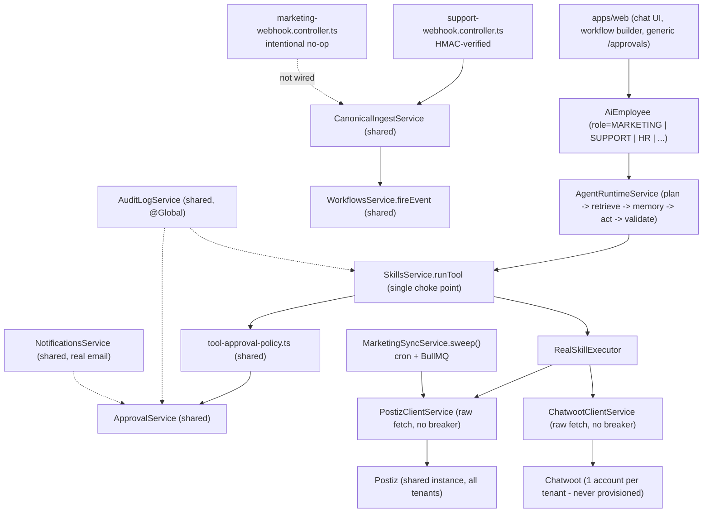
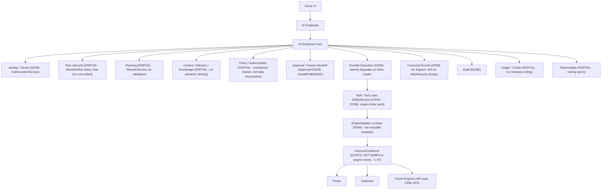
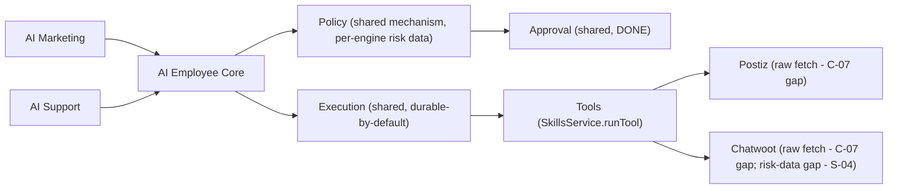

# Orlixa — AI Marketing + AI Customer Support: Deep Gap Audit & Shared AI Employee Core Architecture

**Mode:** `/deep /cto /product /SaaS /enterprise /kill-critic` — planning-first. **No code was modified to produce this report.**
**Date:** 2026-08-19. **Source of truth:** repository at `d:\Vertical AI\platform` (verified directly, file:line cited), cross-checked against 13 planning/status documents and the actual e2e/unit test suite. Never classify from documentation alone — every "DONE" below has a code citation.

**State labels used throughout (from the prompt's own vocabulary):** `DONE`, `PARTIAL`, `IMPLEMENTED_UNVERIFIED`, `MOCK_ONLY`, `DOCUMENTED_NOT_IMPLEMENTED`, `MISSING`, `UNSAFE`, `DUPLICATED`, `DEPRECATED`.

---

## 1. Executive Summary

Both engines are **real, not vaporware** — this is the single most important corrective versus the tone of some earlier project documents. Postiz (AI Marketing) and Chatwoot (AI Support) are genuinely wired: real HTTP clients, real signature-verified webhooks (Support), real reconciliation (Marketing), real approval gating on the highest-risk actions, real audit trail, real DB-backed e2e tests. Neither is "mocked" in the pejorative sense.

But neither is a finished product, and they are not finished to the same *degree*:

- **AI Marketing is the more mature of the two.** Its core safety invariant — nothing publishes without human approval — is proven end-to-end (§3, Area 10). Its weak points are **completeness** (analytics, campaign tracking, brand assets, lead management are all dead schema or ungrounded LLM prose) and one concrete **correctness bug**: `postiz.schedule_post` has no idempotency protection, unlike its sibling `publish_now` (fixed in an earlier wave) — a retried call creates two real scheduled posts at Postiz with no local trace of the duplication (§3, Area 5; §5, M-06).
- **AI Support is materially less safe to expose to real customers today.** Four independent P0s stack on top of each other: (1) there is **no way to provision a real customer's Chatwoot account** — `provisionAccount()` is an honest stub that throws (§4, Area "Provisioning"); (2) an **automated** (workflow- or webhook-triggered) reply can reach a real customer with **zero approval gate**, because Chatwoot's tools are the only customer-facing tools in the catalog not flagged `highRisk` (§4, Area 4; §6, S-04); (3) the AI's own computed confidence/grounding score is calculated but **never enforced** — it's decoration in a JSON blob (§4, Area 2; §6, S-01); (4) there is **zero handling** for refunds, legal threats, PII, identity verification, or account-deletion requests — the textbook danger list for a customer-support AI (§4, Area 6; §6, S-06). None of this is exploitable *by users* today only because there's no UI and no way to provision a tenant — but that is a wall of missing plumbing, not a safety design.
- **A real Shared AI Employee Core already exists in embryonic, well-designed form** — Approvals, Audit, Notifications, Authorization, and the generic Events/canonical-ingestion pipeline are genuinely engine-agnostic modules with zero Marketing- or Support-specific code inside them (§9; confirmed by grep — no `ApprovalService`/audit-write calls exist inside either engine folder). The `EngineAdapter` contract (`connect/disconnect/healthCheck/refresh/tools/reconcile/handleWebhook`) is the single best piece of evidence that Core-first thinking is already the house style here, not a green-field proposal.
- **The one clean, shared `common/resilience` layer (circuit breaker, rate limiter, DLQ) is not actually protecting either engine's outbound HTTP calls** — `PostizClientService` and `ChatwootClientService` both call raw `fetch()` (§3 Area 11, §4 Area 7, §9 C-07). This is the highest-leverage, lowest-cost fix available: wire two existing clients into an already-built layer.
- **A governance finding outranks every code finding above.** The most recent, most rigorous audit on file (`orlixa-final-cto-product-audit.md`, 2026-08-14) found that the bulk of the platform's own "hardening waves" (1–9) — the very state-machine, authorization, and observability work this report leans on as "already shared core" — **exists only on one developer's local disk, not on any branch that gets deployed** (P0-8, `platform/docs/status/orlixa-final-cto-product-audit.md`). Every "DONE" claim in this report should be read as **"DONE in the code that was inspected,"** not **"DONE in production."** Section 21 (Failure Matrix) and Section 33 (CTO Decisions) return to this explicitly — it is the actual #1 production risk, ahead of any single engine gap.

**Bottom line for the roadmap (detail in §26/§29):** fix the two Support P0s and the Marketing idempotency P1 first (cheap, code-only, no new architecture) — **before** any Shared Core extraction work, because a shared core built on top of an unsafe Support engine just industrializes the unsafe pattern for HR/Sales/Recruiter next.

---

## 2. Current Architecture (as verified)



Every arrow above is evidence-backed, not aspirational — the dotted "not wired" arrow for Marketing's webhook is a **deliberate** design (Postiz webhooks are unauthenticated/undeliverable-guaranteed by Postiz itself; the sweep is the real source of truth), not an oversight, and is documented as such in `marketing-webhook.controller.ts:14-15`.

---

## 3. AI Marketing Audit (Postiz)

Module: `apps/api/src/modules/engines/marketing/` (`postiz-client.service.ts`, `postiz-engine.adapter.ts`, `marketing-sync.service.ts`, `marketing-sync.processor.ts`, `marketing-webhook.controller.ts`, `suppression.service.ts`). Prisma models: `SocialAccount`, `Campaign`, `ScheduledPost`, `PublishedPost`, `MediaAsset`, `BrandAsset`, `MarketingAnalyticsSnapshot`, `MarketingSuppression`, `MarketingConsent`.

**Lifecycle trace:** Company → `EmployeeRole.MARKETING` → role-scoped Knowledge (`category='MARKETING'`) → generic `EmployeeMemory` → chat or `AI_EMPLOYEE_STEP` (runs with `disableTools:true` since the M1 fix, `ai-employee-step.handler.ts:113-123`) → `TOOL_ACTION`/chat tool-call → `SkillsService.runTool` → `postiz.schedule_post`/`publish_now` (both `highRisk:true`, `catalog.ts:653-678`) → auto-gated `ApprovalService` → `PostizClientService` (raw `fetch`) → Postiz → **no real status webhook** → `MarketingSyncService.sweep()` (BullMQ + `/admin/cron/marketing-sync`) → `PublishedPost`/`FAILED` → **no analytics ever collected** → `SkillExecution` audit row.

| # | Area | State | Evidence | Exact Gap | Severity |
|---|---|---|---|---|---|
| 1 | Campaign planning | PARTIAL | `Campaign` model exists (`schema.prisma:1203-1215`); zero code reads/writes it (grep-confirmed) | `mkt.campaign-plan` saves an LLM-authored Markdown file to Drive; the `Campaign` table promising structured lifecycle tracking is never touched by any code path | P2 |
| 2 | Content gen/edit/revision/versioning | PARTIAL | `marketing-production-verification.md:54` | Rejection is terminal — no revise-and-re-approve loop; no draft versioning | P2 |
| 3 | Brand voice/assets/templates | PARTIAL | `BrandAsset`/`MediaAsset` (`schema.prisma:1266-1290`) zero reads/writes anywhere | Brand *voice* works via role-scoped Knowledge docs; brand *assets* are entirely dead schema | P2 |
| 4 | Social OAuth/connect, discovery, scheduling, publish | PARTIAL / IMPLEMENTED_UNVERIFIED (connect) | `real-skill-executor.ts:810-828`; `e2e-readiness-report.md:39,62` | No connect/OAuth e2e exists; `list_connected_accounts` reads only local rows, never cross-checks Postiz reality — a revoked account still shows "connected" until a publish fails | P2 |
| 5 | Status/retry/dup-prevention/rate limits/reconciliation | PARTIAL | `real-skill-executor.ts:830-953`; `schema.prisma:1241-1245`; `docs/status/cto-gap-closure-wave3.md:101-124` | **`publish_now` has real idempotency (record-before-effect, unique key); `schedule_post` has NONE** — calls Postiz before writing any row, no idempotency key ever set. A retried `TOOL_ACTION` creates two real scheduled posts with zero local dedup. Also: `FAILED` posts are never auto-retried (by design, but undocumented as a limit); per-company rate limiter vs Postiz's real **instance-wide** 90/hr cap (N tenants can collectively exceed it) | **P1** |
| 6 | Email marketing (consent, suppression, unsubscribe, bounce, volume, compliance) | PARTIAL | `marketing-consent.e2e-spec.ts` (12 tests, real); `marketing-production-verification.md:34,81` | Suppression enforcement itself is solid and DB-tested. But: consent check before send is **trust-the-input** (a workflow `CONDITION` on a boolean the trigger supplies, never queried from the real `MarketingConsent` table); no bounce-ingestion webhook exists (bounces only enter via a manual API call); no unsubscribe endpoint exists (only instructed LLM text); no admin UI/API to view suppression state at all; no `dailyEmailLimit` enforcement despite the config field existing | **P1** |
| 7 | SEO | PARTIAL | `marketing-workflow-templates.catalog.ts:199` | "SEO research" = a generic `http.request` to whatever URL the trigger names; no real SEO provider integration, no structured keyword/metadata model | P2 |
| 8 | Lead capture/enrichment/qualification/routing | PARTIAL / MOCK_ONLY | no `Lead`/`Prospect` model exists (grep-confirmed) | Scoring/routing/enrichment are LLM prose in a chat message, never persisted, queryable, or reportable; `hubspot.create_contact` only writes email+name | P2 |
| 9 | Analytics (engagement/conversion/attribution/ROI) | **MISSING** | `PostizClientService` implements only `getConnectUrl/listIntegrations/schedulePost/listPosts` — no analytics methods, despite Postiz's real public API supporting `GET /analytics/:integration` (`docs/architecture/engines/postiz-engine.md:139`); `MarketingAnalyticsSnapshot` never written/read | The two "analytics" workflow templates fetch a single post's **publish status**, not engagement data — there is no engagement/conversion/attribution/ROI data anywhere in the system to report on. The AI is honestly instructed to say "unavailable" rather than fabricate, which avoids UNSAFE but confirms the capability itself does not exist | **P1** |
| 10 | Autonomy boundaries / approval-bypass risk | **DONE** | `ai-employee-step.handler.ts:113-123` (`disableTools:true`); `marketing-production.e2e-spec.ts` (reject→FAILED, zero `SkillExecution` rows) | No open finding — this is the strongest area in the whole audit | — |
| 11 | Reliability (idempotency/retry/worker-crash/outage) | PARTIAL | `real-skill-executor.ts:915-930` (record-before-effect for `publish_now` only); `marketing-sync.service.ts:34-64` (unguarded direct `postizClient.listPosts()` call, not routed through the resilience layer) | `schedule_post` has no crash-safety equivalent (external call happens before any local row exists); the sweep's own Postiz call is unprotected by breaker/backoff | P1/P2 |
| 12 | Tenant isolation/RBAC/audit/retention (marketing-specific) | PARTIAL | `SocialAccount.postizCustomerId` field exists, **never written**; `postiz-integration-plan.md:87,425` explicitly called for Postiz-side Customer/group scoping as a "High (security)" item | Orlixa's *local* companyId scoping is airtight everywhere reviewed, but the second guardrail the original plan required (Postiz-side tenant separation, since one shared Postiz instance serves every company) was never built — defense-in-depth gap, not a proven leak. Also: no marketing-specific retention policy exists (unlike HR's) | P2 |

**Frontend:** **MISSING.** `apps/web/src/features/marketing/*` is the public marketing *website's* copy, not an operational UI. There is no Social Accounts screen, content calendar, analytics dashboard, or suppression-list admin — every marketing capability is only reachable via generic chat/workflow UI. **P1** — violates the codebase's own stated convention that `features/*` mirrors `modules/*` one-to-one.

**One template-level defect worth flagging on its own:** `mkt.brand-audit` instructs the AI to "review recent published posts" with **no preceding step that fetches any posts** — a guaranteed fabrication-risk run that will "succeed" with plausible, ungrounded text (`marketing-workflow-templates.catalog.ts:296-320`). Low blast radius today (the follow-on "takedown" tool doesn't exist), but a live instance of the platform's own named "silent-success defect class."

---

## 4. AI Customer Support Audit (Chatwoot)

Module: `apps/api/src/modules/engines/support/` (`chatwoot-client.service.ts`, `chatwoot-engine.adapter.ts`, `support-webhook.controller.ts`). Prisma models: `ChatwootAccount`, `SupportConversation`, `SupportMessage`.

**Lifecycle trace:** Customer → Chatwoot → `POST engines/support/webhook` (no JWT, by design) → HMAC verify (real Chatwoot scheme, `sha256=` over `"<timestamp>.<rawBody>"`, 5-min replay window, `chatwoot-client.service.ts:130-160`) → `CanonicalIngestService.ingestVerified` (RawEvent → CanonicalEvent, shared pipeline) → `WorkflowsService.fireEvent` → `EmployeeRole.SUPPORT` reasoning (generic `AgentRuntimeService`, nothing support-specific) → `chatwoot.reply_to_conversation`/`resolve_conversation` → real HTTP send (reply) / **local-only mirror update (resolve)** → customer.

| # | Area | State | Evidence | Exact Gap | Severity |
|---|---|---|---|---|---|
| 1 | Conversation discovery/retrieval/identity/history | PARTIAL | `real-skill-executor.ts:983-1008`; `SupportConversation.contactEmail String?` | Identity = a bare, unverified email string; no cross-conversation customer history/profile anywhere; `EmployeeMemory` is never populated from support conversations | P2 |
| 2 | AI draft/confidence/grounding/tone/policy | **UNSAFE** | `ValidationService.validate()`, `apps/api/src/modules/employees/runtime/validation.service.ts:34-82`; `HIGH_STAKES_ROLES` = `['ACCOUNTANT','HR']` only (`employees.constants.ts:44`); `ai-employee-step.handler.ts:202` | Confidence/grounding **is computed** but only written into the node's output JSON for display — it does **not** gate anything. A subsequent `TOOL_ACTION` reply runs regardless. No template inserts a `CONDITION`/`APPROVAL` reading it. `SUPPORT` is not a high-stakes role, so the generic 0.5-confidence auto-flag barely applies | **P0** |
| 3 | Actions (reply/assign/tag/prioritize/close/reopen/escalate/note/update) | PARTIAL / MISSING | catalog has exactly 4 tools (`catalog.ts:699-739`) | `reply` = real. **`resolve_conversation` only updates the local mirror row — no live Chatwoot API call exists** (`real-skill-executor.ts:1060-1081`, comment admits it), so a human looking at the real Chatwoot dashboard still sees the ticket OPEN — a textbook silent-success defect. `assign/tag/prioritize/reopen/escalate/internal-note` tools **do not exist at all** | resolve: **P1**; missing actions: P2 |
| 4 | Human takeover / approval / SLA / routing / fallback | **UNSAFE** | `tool-approval-policy.ts:58-78` (`EXTERNAL_ACTION_TOOLS` only gates the **chat** loop); `workflow-engine.service.ts:622` / `approval-gate.service.ts:168` (workflow gate reads only `highRisk`, never `isExternalActionTool`); `catalog.ts` — chatwoot tools have **no `highRisk` flag**, unlike Stripe/Postiz | **An EVENT-triggered (fully automated) workflow can send a real reply to a real customer with zero default approval gate** — the one protection that exists for the interactive chat UI does not carry to the automated path this whole engine exists to power | **P0** |
| 5 | Ticket status/priority/SLA/queues/teams/working hours | **MISSING** | `SupportConversationStatus` = `OPEN｜RESOLVED｜PENDING` only (`schema.prisma:1317-1321`) | No priority, assignee, team, working-hours, or holiday concept anywhere, on either the local model or any tool | P2 |
| 6 | Sensitive scenarios (refund, legal threat, PII, security incident, account deletion, identity verification) | **MISSING** | repo-wide grep for `refund/legal threat/angry/PII/identity verif/account deletion/security incident` inside employee-runtime/support/skills → **zero matches** | No keyword/classifier gate for any of these; no identity-verification step before an AI-driven account action; Chatwoot's own optional HMAC contact-verification is never read | **P0** |
| 7 | Webhook reliability (verify/dedupe/retry/out-of-order/idempotency) | DONE, with one UNSAFE sub-finding | `support-webhook.controller.spec.ts` (12 unit tests); `event-normalize.processor.ts:144-152` (measured double-fire bug fixed) | Dedup/replay handling is genuinely strong. **But:** `ChatwootAccount.chatwootAccountId` has no `@@unique`, and `SupportConversation(companyId, chatwootConversationId)` is only an `@@index`, not `@@unique` (`schema.prisma:1303-1337`). Code comment at `support-webhook.controller.ts:88-91` **admits this exact TOCTOU race and says it was flagged as a follow-up — the follow-up was never implemented.** Two near-simultaneous first messages on a brand-new conversation can create two conversation rows, silently splitting message history | **P1** |
| 8 | Tenant isolation/routing/audit/retention/observability/compliance | PARTIAL | `DataRetentionService` enumerates 10 swept classes (`data-retention.service.ts:16-31`) — **`SupportConversation`, `SupportMessage`, `ChatwootAccount` are absent** | Real customer message content and contact emails are retained forever regardless of a company's `dataRetentionDays` setting — a live GDPR/compliance exposure for a channel defined by carrying customer PII in free text | **P1** |
| — | **Account provisioning** | **DOCUMENTED_NOT_IMPLEMENTED** | `chatwoot-client.service.ts:52-87` (`provisionAccount` unconditionally throws "NOT YET IMPLEMENTED"); `chatwoot-engine.adapter.ts:31-50` deliberately omits `'connect'` from capabilities | No code path anywhere creates a `ChatwootAccount` row outside test fixtures — no admin endpoint, no onboarding hook. **A real customer cannot turn this employee on through the product today**; someone must hand-insert a row with real, out-of-band-obtained Chatwoot credentials | **P0** (makes every other finding moot for a real deployment) |
| — | **Frontend UI** | **MISSING** | `apps/web/src/features/` has no `support`/`conversations`/`tickets`/`inbox` directory at all | No human can see or moderate a live customer conversation without direct DB/API access; the only visibility is the generic `/approvals` queue (chat-path replies only) or raw workflow logs | **P1** |
| — | Real-send verification depth | IMPLEMENTED_UNVERIFIED | `engines-support.e2e-spec.ts` header comment: the one full-loop e2e test **never reaches** the real `sendReply` HTTP call — it fails earlier at "conversation not found" because the mock LLM can't extract a real conversation id | The real wire-level Chatwoot reply has never been exercised by any e2e test, only by a fully-mocked unit spec | P2 |

**No Support workflow templates exist at all** (unlike HR's 11 and Marketing's 11) — a company must hand-build the NEW_TICKET → draft → reply workflow from scratch, and in doing so would have to independently discover and fix the approval-gap in Area 4 themselves.

---

## 5. Marketing-Only Gap Table (Table A)

| ID | Functionality | State | Severity | Shared Core? | Dependency |
|---|---|---|---|---|---|
| M-01 | Campaign entity dead schema | DOCUMENTED_NOT_IMPLEMENTED | P2 | No — engine-specific | — |
| M-02 | Content revision loop | MISSING | P2 | No | — |
| M-03 | Brand assets dead schema | MISSING | P2 | No | — |
| M-04 | Social connect/OAuth e2e unverified | IMPLEMENTED_UNVERIFIED | P2 | No | — |
| M-05 | `list_connected_accounts` doesn't cross-check Postiz reality | PARTIAL | P2 | No | — |
| M-06 | `schedule_post` no idempotency / crash-safety | **UNSAFE** | **P1** | Pattern yes (idempotent-tool helper), impl no | Extend the WAVE 3 `publish_now` pattern |
| M-07 | Rate limit scope mismatch (per-company vs Postiz instance-wide) | PARTIAL | P2 | Yes (shared rate limiter, wrong config) | C-10 |
| M-08 | Email consent trust-the-input | UNSAFE | **P1** | No | MarketingConsent table |
| M-09 | No bounce ingestion / unsubscribe endpoint / suppression admin UI | MISSING | P1/P2 | No | — |
| M-10 | Analytics: no Postiz analytics client, dead snapshot model | **MISSING** | **P1** | No | Postiz public API |
| M-11 | Lead entity absent (all lead work is ephemeral prose) | MOCK_ONLY | P2 | No | — |
| M-12 | Postiz-side tenant isolation (Customer/group) never built | PARTIAL | P2 | No — provider-specific | — |
| M-13 | No marketing-specific retention policy | MISSING | P3 | Partial (HrRetentionService pattern) | C-shared retention extension |
| M-14 | `mkt.brand-audit` template fabrication risk | PARTIAL | P2 | No | — |
| M-15 | No operational frontend (campaigns/social/analytics UI) | MISSING | **P1** | No | — |
| M-16 | Postiz/Chatwoot HTTP clients bypass shared resilience layer | UNSAFE | **P1** | **Yes — this IS the core gap** | C-07 |

## 6. Support-Only Gap Table (Table B)

| ID | Functionality | State | Severity | Shared Core? | Dependency |
|---|---|---|---|---|---|
| S-01 | Confidence/grounding computed but not enforced | **UNSAFE** | **P0** | Yes — should be a shared policy gate | C-05, C-06 |
| S-02 | `resolve_conversation` fake success (local-only) | UNSAFE | P1 | No | — |
| S-03 | Missing actions (assign/tag/prioritize/reopen/escalate/note) | MISSING | P2 | No | — |
| S-04 | Automated replies bypass approval gate by default | **UNSAFE** | **P0** | Yes — data-classification gap in a shared mechanism | C-05 |
| S-05 | No priority/assignee/team/working-hours model | MISSING | P2 | Partial (working-hours is a Core gap too, C-12) | C-12 |
| S-06 | No sensitive-scenario handling at all | **MISSING** | **P0** | Yes — should be a shared "action risk model" input | §15 Action Risk Model |
| S-07 | TOCTOU race on `ChatwootAccount`/`SupportConversation` uniqueness | UNSAFE | P1 | No | — |
| S-08 | No compensation/alert on failed reply | MISSING | P2 | Partial (compensation deliberately deferred platform-wide) | — |
| S-09 | Support data absent from retention sweep | MISSING | **P1** | Yes — extend existing shared `DataRetentionService` | — |
| S-10 | Account provisioning never implemented | **DOCUMENTED_NOT_IMPLEMENTED** | **P0** | No — provider-specific (needs a live instance to verify) | Blocks all of the above in production |
| S-11 | No frontend UI at all | MISSING | **P1** | No | — |
| S-12 | Real send path never e2e-verified | IMPLEMENTED_UNVERIFIED | P2 | No | Live Chatwoot instance |
| S-13 | No human-handoff/escalation state | **MISSING** | **P0** | Yes — net-new shared capability | §17 Human Handoff |
| S-14 | No Support workflow templates | MISSING | P2 | No | 22-template precedent (HR/Marketing) |

## 7. Common (Shared) Gap Table (Table C)

| ID | Capability | State | Severity | Currently Shared or Duplicated? |
|---|---|---|---|---|
| C-01 | Chat-turn execution has no persisted state machine (unlike WorkflowRun) | PARTIAL | P2 | Inconsistent — two execution models exist |
| C-02 | Plan validation missing; plan doesn't gate execution or trigger re-plan | PARTIAL | P2 | Shared (one `PlannerService`), but shallow |
| C-03 | Memory has no relevance ranking; hard recency cap evicts FACTs | PARTIAL | P2 | Shared |
| C-04 | No cross-run/cross-engine customer or task memory | MISSING | P2 | N/A |
| C-05 | `highRisk` classification data inconsistent across engines (Support's core action unflagged) | PARTIAL | **P1** | Mechanism shared, data is not |
| C-06 | No shared "human handoff / escalate conversation" capability | **MISSING** | **P0** | N/A — doesn't exist in either engine |
| C-07 | `common/resilience` (breaker/rate-limiter) not applied to Postiz/Chatwoot clients | **UNSAFE** | **P1** | Exists, not adopted — the report's single highest-leverage fix |
| C-08 | Two independent error classifiers (`common/resilience` vs `workflow-runtime/retry-policy`) | PARTIAL | P3 | Intentionally separate (documented, non-compounding retries) — acceptable, but flagged for drift risk |
| C-09 | No company-wide budget ceiling; no tool/API cost metering (LLM tokens only) | **MISSING** | **P1** | N/A |
| C-10 | Per-connector egress rate limiting not applied uniformly | PARTIAL | P2 | Same root cause as C-07 |
| C-11 | OTel tracing inert unless env var set (opt-in, not default) | PARTIAL | P3 | Shared infra, off by default |
| C-12 | `AiEmployee.workingHours*`/`timezone` fields never enforced at runtime | DOCUMENTED_NOT_IMPLEMENTED | P2 | N/A — config exists, does nothing |
| C-13 | No Postgres RLS/partitioning — isolation is app-layer discipline only | PARTIAL | P1 | Shared risk, not engine-specific |
| C-14 | Durable engine silently downgrades to `legacy_walk` under `WORKFLOW_EXECUTION_MODE=inline` | PARTIAL | **P1** | Shared, operational |
| C-15 | Governance: Waves 1-9 hardening work largely uncommitted to deployed branches | **UNSAFE (process)** | **P0** | N/A — meta-finding, see §1 and §33 |

---

## 8. Duplication Analysis

Per instruction, **no forced merges** — each item below is judged on its own facts.

| Capability | Marketing impl | Support impl | Intentional? | Move to Core? | Risk of leaving duplicated |
|---|---|---|---|---|---|
| Approval gating | `ApprovalService` (shared) | Same `ApprovalService` | Yes — already shared | Already core | None — this is a model example |
| Audit | `AuditLogService` (shared) | Same | Yes | Already core | None |
| Webhook signature verification | N/A (Postiz webhook intentionally inert) | Real HMAC verify | **Not duplication** — Postiz genuinely has no comparable webhook to secure | Keep engine-specific (the *doctrine* — verify-before-write, dedupe-on-id — is already shared via `connector-event-workflow-architecture.md`; the *mechanism* is necessarily provider-specific crypto) | Low |
| Event ingestion → workflow trigger | Not used (sweep-based instead) | `CanonicalIngestService` (shared) | Yes, legitimately asymmetric — documented protocol difference, not an oversight | Already core; document the asymmetry so future engine onboarding isn't surprised | Low, if documented (this report does so) |
| Outbound HTTP resilience (retry/breaker/rate-limit) | `PostizClientService`: raw `fetch()`, no breaker | `ChatwootClientService`: raw `fetch()`, no breaker | **No** — this is accidental, not intentional. Both engines independently reinvent ad hoc HTTP error handling instead of reusing `common/resilience` | **Yes — highest-value core extraction in this report.** Wrap both clients (and future engine clients) in the existing `CircuitBreakerRegistry`/`RateLimiter` at the adapter layer, not per-engine | **High** — an outage in either provider today has no circuit-breaker protection, and every future engine will repeat the same mistake unless the adapter contract enforces it |
| Idempotent-external-effect pattern (record-intent-before-call) | Hand-rolled once, only for `publish_now` | Not implemented at all | No — this is a good pattern applied inconsistently, not deliberately engine-specific | **Yes** — promote to a `SkillsService` helper (e.g. `runIdempotentExternalTool`) that any `highRisk` tool with an external side effect must use, so `schedule_post` (M-06) can't be forgotten again and Support inherits it for free when it adds new tools | High — exactly the class of bug (M-06) that already happened once |
| Confidence/grounding computation vs enforcement | Computed, not enforced anywhere (Marketing doesn't rely on it — `AI_EMPLOYEE_STEP` can't call tools at all) | Computed, **silently not enforced**, and Support's design (tools ARE reachable from `AI_EMPLOYEE_STEP` via `TOOL_ACTION`) makes the gap real | Not duplication — a single shared `ValidationService` already exists | **Yes** — the fix is a shared policy: "if `needsApproval` is true, the workflow engine must force an approval gate," not a per-engine reimplementation | **Critical** (S-01) |
| Retry/backoff for internal workflow-node execution | Shared `workflow-runtime/retry-policy.service.ts` | Same | Yes, deliberately separate from `common/resilience` to avoid compounding retries (documented) | Keep separate — correctly scoped already | None |
| Engine adapter contract | `PostizEngineAdapter implements EngineAdapter` | `ChatwootEngineAdapter implements EngineAdapter` | Yes — already core | Already core; **this is the template every future engine (HR/Sales/Recruiter tools) should be forced through**, including the resilience wrapping above | None — strength, not risk |

**Example applied (per prompt's own template):**
```text
Marketing → Postiz raw-fetch error handling     (engine-specific transport, KEEP)
Support   → Chatwoot raw-fetch error handling   (engine-specific transport, KEEP)
                        ↓ but both should route through ↓
Provider error → Normalized execution failure → Retry policy → Audit → Notification   (ALL FOUR steps after "Provider error" already exist as shared modules — they're just not being called from inside the engine clients yet)
```

---

## 9. Shared AI Employee Core — Proposal



### Classification of every capability (per §11 of the prompt)

| Capability | Classification | Rationale |
|---|---|---|
| Identity/Tenant | **CORE** | `AuthorizationService` already composes correctly under approval-routing/workflow-permissions; no engine duplicates it |
| Task lifecycle | **CORE** (WorkflowRun) + **PRODUCT MODULE gap** (chat-turn) | Unify chat-turn execution onto the same state-machine primitives, don't build a second one |
| Planning | **CORE** | Shared `PlannerService`; needs a validation step added, not a new module |
| Context/Memory/Knowledge | **CORE** | Shared `MemoryService`/`RetrievalService`; needs relevance ranking, not per-engine memory |
| Tool access | **CORE** | `SkillsService` — the strongest existing choke point in the system |
| Policy (risk classification) | **CORE mechanism / PRODUCT MODULE data** | `tool-approval-policy.ts` is core; the `highRisk` flags per tool are catalog *data*, correctly engine-specific, but currently inconsistently applied (C-05) |
| Approval | **CORE** | `ApprovalService` — zero engine-specific code found |
| Human handoff | **CORE (to be built)** | Does not exist anywhere; must be built once, generically, not per-engine (C-06/S-13) |
| Reliability (resilience) | **SHARED INFRASTRUCTURE** | `common/resilience` exists; the gap is *adoption* at the `EngineAdapter`/client layer, not a missing module |
| Events | **CORE** | `CanonicalIngestService`; Marketing's non-use is a legitimate protocol difference, not a core weakness |
| Observability | **SHARED INFRASTRUCTURE** | `ExecutionContext`/OTel — genuinely engine-agnostic already |
| Audit | **CORE** | Model example — do not touch |
| Usage/Credits | **CORE mechanism / gap in scope** | Per-employee budget exists; company-level ceiling and tool/API cost metering are missing, should extend the same service, not create a second one |
| Communication (notifications) | **CORE** | `NotificationsService` — deliberately a dependency-free leaf, model example |
| Scheduling (working hours) | **OPTIONAL EXTENSION (currently absent)** | Fields exist on `AiEmployee`; enforcement is genuinely optional-but-advertised — should be a core interceptor, not per-engine |
| Security (tenant isolation, secrets) | **CORE** | `CryptoService`/company-scoped queries; RLS absence (C-13) is a defense-in-depth gap for a future wave, not a redesign |

**Boundary statement (explicit, per the prompt's "do not place everything into core"):** Postiz's publish semantics, Chatwoot's HMAC scheme, and any future engine's own API shape stay engine-specific forever — the Core's job stops at "normalized execution failure → retry policy → audit → notification," never at "how do I call this provider's API." The `EngineAdapter` interface is precisely that boundary already, correctly drawn.

---

## 10. Core Boundary Diagram

(See §9 diagram above — it already reflects real component ownership rather than the prompt's generic template, since several boxes are genuinely DONE and should not be redesigned.)

---

## 11. Marketing + Support Shared Flow



### Sequence diagrams (textual, evidence-grounded)

**1. Marketing publish (proven, `marketing-production.e2e-spec.ts`):**
`Workflow TOOL_ACTION(postiz.publish_now)` → `toolRequiresApproval=true (highRisk)` → `ApprovalService.createRequest` → run `WAITING` → human `approve` → `PostizClientService.schedulePost(scheduleNow)` (idempotency key checked first) → `PublishedPost` row → run `COMPLETED`. **Reject path:** run → `FAILED`, zero `SkillExecution` rows for the tool — proven, not assumed.

**2. Support reply (automated path — the actual bug, S-04):**
`Chatwoot webhook` → `CanonicalIngestService` → `fireEvent(NEW_TICKET)` → `AI_EMPLOYEE_STEP` drafts reply → `TOOL_ACTION(chatwoot.reply_to_conversation)` → **`toolRequiresApproval` returns false (no `highRisk` flag, and `EXTERNAL_ACTION_TOOLS` is not consulted here)** → `ChatwootClientService.sendReply` fires immediately → real customer receives an unreviewed AI reply. No approval, no confidence check enforced (S-01 compounds this).

**3. Marketing approval reject:** covered in (1).

**4. Support escalation:** **cannot be diagrammed — no code path exists** (S-13/C-06). This is itself a finding, not a diagram gap.

**5. Marketing failure/retry:** `schedule_post` → Postiz call throws → **no local row was ever written (M-06)** → nothing to retry against, nothing visible to reconciliation, the human sees nothing happened when in fact Postiz's own state is unknown until manually checked.

**6. Support webhook:** `POST /engines/support/webhook` → HMAC verify (constant-time, 5-min window) → `ingestVerified` (dedup on `sha256(rawBody)`) → `CanonicalEvent` upsert (dedup on `companyId+dedupeKey`) → `fireEvent`. Proven by 12 unit tests + `event-normalize.processor.ts`'s own documented double-fire fix.

**7. Human handoff:** **does not exist for either engine** (see §17).

**8. Common audit flow:** any tool call (either engine) → `SkillsService.runTool` → `SkillExecution` row (masked args) written unconditionally, success or failure → `AuditLogService` hash-chained entry. Proven shared, zero bypasses found.

---

## 12. Marketing Flow — Detail

Covered fully in §3 and §11 sequence 1/5. The one architecturally interesting point: Marketing **deliberately does not** use the canonical event pipeline (§8 table, row 3) because Postiz's own webhooks carry no reliability guarantee — the reconciliation sweep is correctly the source of truth instead. Any future "engine has an unreliable webhook" case should follow this same sweep-first pattern rather than forcing canonical-event semantics onto data that can't support them.

## 13. Support Flow — Detail

Covered fully in §4 and §11 sequences 2/6. The critical path difference from Marketing: Support's inbound path *is* event-driven and *is* wired to the canonical pipeline correctly — but its **outbound** path (the actual reply) has weaker gating than Marketing's outbound path, which is the inverse of what a "customer support" product should prioritize.

---

## 14. Common Execution State Machine

**Current reality (not a redesign — documenting what exists and where it's inconsistent):**

| State (WorkflowRun) | Meaning | Valid transitions | Who triggers | Retry | Terminal | Audit event |
|---|---|---|---|---|---|---|
| PENDING | Created, not yet started | → RUNNING | Trigger (manual/schedule/event/webhook) | N/A | No | `workflow.run.created` |
| RUNNING | Actively executing nodes | → WAITING, COMPLETED, FAILED, TIMED_OUT | Engine | Per-node (`retry-policy.service.ts`) | No | per-node `SkillExecution`/step events |
| WAITING | Paused for approval or external wait | → RUNNING (approve/resume), → CANCELLED | Human (approve/reject) or timer | N/A (waits) | No | `approval.*` |
| COMPENSATING | Rolling back after failure (durable engine only) | → FAILED, → COMPLETED | Engine | N/A | No | step-level |
| COMPLETED | Success | — | Engine | — | Yes | `workflow.run.completed` |
| FAILED | Terminal failure | — | Engine or rejected approval | — | Yes | `workflow.run.failed` |
| CANCELLED | Explicitly stopped | — | Human (`POST /workflows/runs/:id/cancel`) | — | Yes | `workflow.run.cancelled` |
| TIMED_OUT | Wall-clock/attempt exhaustion | — | Engine (durable reaper) | — | Yes | `workflow.run.timed_out` |

**Gap, not a redesign need:** chat-turn execution (the other half of "AI Employee task") has no equivalent persisted enum — it is a single synchronous method with try/catch. This is C-01. The recommendation is **not** a second state machine; it's exposing chat turns as lightweight `WorkflowRun`-shaped records so both execution paths share one queryable history, one retry policy, and one audit shape. `WAITING_HUMAN`/`BLOCKED_POLICY`/`BLOCKED_PERMISSION` (named in the prompt's suggested state list) do not exist as distinct states today — they are currently folded into `WAITING`/`FAILED` without a machine-readable reason code, which is a real observability gap worth a P2 follow-up but not fabricated here as already built.

---

## 15. Common Action Risk Model

**Actual current classification (not proposed — read from `catalog.ts`):**

| Risk tier | Marketing examples | Support examples | Consistent? |
|---|---|---|---|
| READ | `list_connected_accounts`, `get_post_status` | `list_open_conversations`, `get_conversation` | Yes |
| LOW_RISK | — | — | — |
| WRITE | — | `resolve_conversation` (though it doesn't actually write to Chatwoot — S-02) | — |
| EXTERNAL_COMMUNICATION | — | `reply_to_conversation` (listed in `EXTERNAL_ACTION_TOOLS` but **not** `highRisk`) | **No — this is exactly C-05/S-04** |
| PUBLICATION | `schedule_post`, `publish_now` (both `highRisk:true`) | — | N/A |
| FINANCIAL | `stripe.create_payment_link` (`highRisk:true`, other module) | — | N/A |
| DESTRUCTIVE | — | none exist (no delete/close-forever tool) | N/A |
| SECURITY_SENSITIVE | — | none exist (no identity-verification tool) | N/A |

**The finding, stated plainly:** `PUBLICATION` (Marketing) and `EXTERNAL_COMMUNICATION` (Support) are both "an AI Employee talks to the outside world unsupervised" — they should carry the **same** minimum risk floor. Today only one of the two actually does. This is the single concrete "quick win" the shared-core audit surfaced (flip `highRisk:true` on the two Chatwoot tools) and it is called out again in §26 as a Phase-0/immediate action.

---

## 16. Approval Architecture

Already a single, shared, engine-agnostic engine (§8, §9) — `ApprovalService` handles TOOL-kind (any engine's tool call) and WORKFLOW-kind (any workflow) approvals identically: create → route (multi-level, SLA-driven escalation) → wait → approve/reject/modify → revalidate → resume, with a race-safe `updateMany` claim and a full audit trail. **Recommendation: do not build a second approval engine for Support** — the fix for S-01/S-04 is entirely in the *policy input* (which tools/conditions require approval), not in the approval engine itself, which is already correct and shared.

The one architectural addition genuinely missing: **a policy hook that lets a computed signal (like `ValidationService`'s confidence score) force an approval requirement dynamically**, rather than approval being decidable only from a static catalog flag. This closes S-01 without creating a second approval mechanism.

---

## 17. Human Handoff Architecture

**Current state: does not exist for either engine (S-13/C-06).** Proposed shared design (net-new, not an extraction of existing code, since there is nothing to extract):

```text
AI Reply/Action
   ↓
Confidence / Policy / Explicit Customer Request ("talk to a human")
   ↓
Escalation Condition (confidence < threshold OR sensitive-topic classifier hit OR explicit request)
   ↓
Human Handoff (NEW: SupportConversation.status gains ESCALATED; AiEmployee pauses on THIS conversation, not company-wide)
   ↓
Assigned Person / Team (reuse existing ApprovalRoutingService resolution rules — USER/ROLE/DEPARTMENT/TEAM/EMPLOYEE_MANAGER/ANY_ADMIN — do not build a second routing resolver)
   ↓
WAIT (reuse WorkflowRun WAITING semantics conceptually, even for a chat-only conversation)
   ↓
Human Resolution
   ↓
AI Resume (conversation un-pauses) OR Complete
```

**Shared vs engine-specific:** the *mechanism* (pause, route, wait, resume) is 100% core-appropriate and should be built once against the existing `ApprovalRoutingService` resolver rather than reinvented for Support. The *trigger conditions* (what counts as "sensitive" for Support vs. what counts as "needs human review" for a Marketing draft) are legitimately engine-specific policy data, mirroring the risk-model boundary in §15.

---

## 18. Knowledge / Memory Architecture

Already genuinely shared (`RetrievalService`, `MemoryService`) and already role-scoped (Knowledge documents tagged `MARKETING`/`SUPPORT`/etc., confirmed enforced with a passing isolation test per the Marketing audit). What must never cross boundaries, verified as currently true:
- Company (tenant) boundary: enforced everywhere reviewed via `companyId` scoping — no cross-tenant knowledge leak found.
- Role boundary: `category` field + retrieval-time filter — Marketing's own e2e proves "no leak to HR."
- Customer-specific context (Support): **does not exist as a concept yet** — there is no per-customer memory partition distinct from per-conversation rows (Area 1, §4). This is a genuine gap to design *before* extending shared memory to Support use cases like "this customer complained before" — building it directly against the shared `MemoryService`'s existing recency/FACT model, not a bespoke Support memory store.

---

## 19. Event Architecture

Covered in §8/§9/§12/§13. One clarification worth stating explicitly for the roadmap: the asymmetry between Marketing (sweep-based, no canonical events) and Support (canonical-event-based) means **a future "Marketing published → trigger a Support or HR workflow" use case is currently impossible** — Postiz publish success/failure never becomes a `CanonicalEvent`. This is `P1-8` in the most recent CTO audit (§1) and is the concrete reason Marketing workflows "can't be event-driven." Fixing it means adding a synthetic canonical-event emission at the point `MarketingSyncService.sweep()` transitions a post to `PUBLISHED`/`FAILED` — reusing the existing canonical pipeline, not building a parallel one.

---

## 20. Reliability Architecture

Covered in depth at §3 Area 5/11, §4 Area 7, §8, §9 (C-07/C-08). Summary of the actual current shape: **idempotency** is proven end-to-end but inconsistently applied (M-06); **circuit breaking/rate limiting** exists as shared infrastructure but is unused by exactly the two clients (Postiz, Chatwoot) this report is about; **reconciliation** is real and dual-deployment-aware for Marketing, has no analog need for Support (webhook-driven, no polling required); **DLQ** exists generically (`/admin/dlq`) but nothing in either engine currently routes there since neither client's calls go through a queue with DLQ semantics at the HTTP-call level (only BullMQ job-level retry applies, and only when the call happens to run inside a queued processor).

---

## 21. Usage / Credits

Covered at §9 C-09. Restated plainly: **LLM token cost is metered per-employee and enforced against a per-employee budget, checked every ACT-loop iteration** (real, race-checked). **Nothing meters the cost of calling Postiz or Chatwoot's own APIs**, and **no company-wide spend ceiling exists at all** — an employee under its own per-employee LLM budget could still drive unlimited third-party API usage (e.g., hundreds of `schedule_post` calls) with zero cost visibility or cap. This is a genuine billing/abuse gap that predates and is independent of the Marketing/Support-specific findings — it belongs in the shared `UsageService`, not duplicated per engine.

---

## 22. Enterprise Requirements

| Requirement | Marketing | Support | Shared Core |
|---|---|---|---|
| Multi-tenancy | DONE (local scoping) / PARTIAL (Postiz-side, M-12) | DONE (local scoping) | DONE (app-layer), RISK (no RLS, C-13) |
| Department/team scope | PARTIAL (generic only) | MISSING (no team/queue model) | PARTIAL |
| RBAC | DONE (generic) | DONE (generic) | DONE |
| Per-employee permissions | DONE | DONE | DONE |
| Approval routing | DONE (shared, reused correctly) | **RISK** (reused correctly where invoked, but not invoked by default for the core action, S-04) | DONE (mechanism) / RISK (data) |
| Audit | DONE | DONE | DONE |
| Compliance | PARTIAL (consent trust-input, M-08) | **RISK** (no sensitive-scenario handling, S-06) | PARTIAL |
| Retention | MISSING (marketing-specific, M-13) | **MISSING** (S-09 — real PII, no sweep) | PARTIAL (10 classes, missing Support's 3 models) |
| Data isolation | PARTIAL (M-12) | DONE (local) | PARTIAL (C-13) |
| SLA | N/A (not applicable to publishing) | MISSING (S-05) | PARTIAL (generic approval SLA only) |
| Escalation | N/A | **MISSING** (S-13) | **MISSING** (C-06) |
| Observability | PARTIAL (generic metrics only) | MISSING (no dashboards) | PARTIAL (tracing opt-in, C-11) |
| Disaster recovery | Not audited in this pass (out of scope — covered by WAVE 8 per project memory) | Not audited in this pass | Not audited in this pass |
| Rate limiting | PARTIAL (scope mismatch, M-07) | PARTIAL (not applied to client, C-07) | PARTIAL |
| Usage limits | PARTIAL (per-employee LLM only) | PARTIAL | **MISSING** company ceiling (C-09) |
| Credit limits | Same as usage limits | Same | MISSING |
| Secret management | DONE (`CryptoService`) | DONE (`CryptoService`, webhook secret encrypted) | DONE |
| Provider isolation | PARTIAL (M-12) | DONE (per-company `ChatwootAccount`, once provisioned) | DONE (pattern), RISK (provisioning, S-10) |

---

## 23. Failure Matrix

| Scenario | Marketing | Support | Shared Core Handling | Retry | User Impact | Severity |
|---|---|---|---|---|---|---|
| Provider unavailable | `PostizClientService` throws, unguarded by breaker | `ChatwootClientService` throws, unguarded by breaker | None currently (should be `common/resilience`) | BullMQ job-level only, if queued | Silent failure or generic error surfaced late | P1 |
| Timeout | Same as above (no per-call timeout config found in either client) | Same | None wired | Same | Same | P1 |
| Auth expired | Postiz: single shared API key, no per-tenant rotation concept | Chatwoot: per-company `agentBotToken`, encrypted, no rotation flow | `CryptoService` for storage only, no refresh flow | None | Manual re-provisioning required | P2 |
| Permission denied | Not specifically tested | Not specifically tested | Generic `AuthorizationService` | N/A | Standard 403 | P3 |
| Rate limit | Per-company limiter under-protects vs Postiz's real cap (M-07) | Not applicable (Chatwoot has no documented rate cap in the engine doc) | `common/resilience/RateLimiter`, wrong scope for Marketing | N/A | Possible real-world 429 from Postiz not modeled locally | P2 |
| Duplicate event (webhook redelivery) | N/A (no inbound webhook processed) | **DONE** — dedup on raw-body hash + canonical dedupe key, tested | `CanonicalIngestService` | N/A (no-op) | None | — |
| Duplicate execution (tool retried) | **`schedule_post`: creates a real duplicate (M-06)**; `publish_now`: protected | Not applicable (no equivalent external-effect duplication risk identified) | Idempotent-tool pattern exists, inconsistently applied | N/A | Two real scheduled posts, no local trace | **P1** |
| Webhook replay | N/A | **DONE** — 5-min signature window + dedup | `CanonicalIngestService` | N/A | None | — |
| Worker crash | `publish_now`: safe (record-before-effect); `schedule_post`: **orphans a real Postiz post with zero local trace** | Reply failure recorded as `SkillExecution` ERROR, no compensation | Partial | None automatic | Undetected orphan (Marketing) / silent failure with no alert (Support) | P1 |
| DB failure | Not specifically tested for either engine | Not specifically tested | Generic Prisma/Nest error handling | N/A | Standard 5xx | P3 |
| AI model failure | Generic `LlmProvider` error handling applies | Same | Shared | Generic | Standard failure surfaced in chat/run | P3 |
| Tool failure | `SkillExecution` ERROR row, audited | Same | Shared, DONE | None automatic beyond BullMQ | Visible in audit, not proactively alerted | P2 |
| Approval timeout | Generic SLA escalation applies where approval was actually created | **Does not apply to the un-gated automated reply path (S-04) — there is no approval to time out** | Shared SLA mechanism, DONE where invoked | N/A | For Support's core risk, this row is moot because the gate itself is missing | **P0 (via S-04)** |
| Human rejection | `publish_now`/`schedule_post`: run FAILED, proven | N/A for the ungated path; DONE for the chat-loop path | Shared, DONE | N/A | Correct | — |
| Policy block | N/A (no policy blocks defined beyond approval) | **MISSING** — no refund/legal/PII/identity policy exists to block anything (S-06) | Would be Core if built | N/A | Real customer exposure to an unhandled sensitive request | **P0** |
| Insufficient permission | Standard | Standard | Shared | N/A | Standard 403 | P3 |
| Tenant mismatch | Local scoping prevents cross-tenant data; Postiz-side scoping absent (M-12) | Local scoping prevents cross-tenant data | Shared app-layer discipline, no RLS backstop (C-13) | N/A | Defense-in-depth gap only, not proven exploitable | P2 |
| Invalid input | Standard DTO validation | Standard DTO validation | Shared | N/A | Standard 400 | P3 |
| Malformed provider response | `PostizClientService` throws on non-2xx, logs body | Not specifically covered for malformed-but-200 payloads | Partial | N/A | Possible silent bad-data path if Chatwoot returns 200 with unexpected shape | P2 |
| Partial completion | Reconciliation sweep handles Marketing's async publish state well | No equivalent (reply is synchronous, single-step) | Shared reconciliation pattern (Marketing only) | Per-sweep interval (10 min) | Acceptable lag | — |

---

## 24. E2E Coverage Matrix

### Marketing

| Journey | Backend | DB | Queue | Browser | Real Provider | Status |
|---|---|---|---|---|---|---|
| Publish with approval gate | ✅ | ✅ | N/A (sync) | ❌ never run | Stubbed (correct) | **Ready** (`marketing-production.e2e-spec.ts`) |
| Reconciliation sweep | ✅ | ✅ | N/A (cron route) | ❌ | Stubbed (correct) | **Ready** (`journey-marketing-reconcile.e2e-spec.ts`) |
| Consent/suppression enforcement | ✅ | ✅ | N/A | ❌ | N/A (internal) | **Ready** (`marketing-consent.e2e-spec.ts`, 12 tests) |
| Social connect/OAuth | ❌ | ❌ | ❌ | ❌ | ❌ | **Not covered** — external boundary, explicitly documented as skipped |
| `schedule_post` approval gate specifically | ❌ (only `publish_now` exercised) | — | — | ❌ | — | **Not covered** — directly why M-06 has no regression test |
| Analytics | N/A — capability doesn't exist | — | — | — | — | **N/A** |

### Support

| Journey | Backend | DB | Queue | Browser | Real Provider | Status |
|---|---|---|---|---|---|---|
| Webhook signature/dedup/canonical routing | ✅ (unit, mocked Prisma) | ❌ (mocked) | N/A | ❌ | N/A | **Unit-verified only**, not e2e-DB-proven |
| Full chat-loop reply | ✅ app boot | ✅ | N/A | ❌ | ❌ (**never reaches real `sendReply`**, S-12) | **Partial / theatre beyond the not-found branch** |
| Automated (event-triggered) reply without approval | Not tested (the bug itself, S-04, is undetected by any test) | — | — | — | — | **Not covered — this IS the gap** |
| TOCTOU race (S-07) | Not tested | — | — | — | — | **Not covered** |
| Provisioning | N/A — doesn't exist | — | — | — | — | **N/A** |

### Shared Core

| Core Journey | Unit | Integration | E2E | Browser | Status |
|---|---|---|---|---|---|
| Approval create→approve/reject→resume | ✅ | ✅ | ✅ (both engines' TOOL_ACTION paths) | ❌ | **Ready** |
| Audit trail completeness | ✅ | ✅ | ✅ (implicit via every e2e above) | ❌ | **Ready** |
| Canonical event dedup/ordering | ✅ | ✅ (Support) | ✅ | ❌ | **Ready (Support only)** |
| Resilience (breaker/rate-limit) applied to engine clients | N/A — not wired | N/A | N/A | N/A | **Not applicable — capability not adopted yet (C-07)** |
| Durable engine default behavior | Documented, not independently re-verified in this pass | — | Referenced from project memory | ❌ | **IMPLEMENTED_UNVERIFIED in this pass — re-check under real deployment config, per C-15** |

**No browser (Playwright/Chrome) E2E exists for Marketing or Support anywhere in the repository.** The three real browser specs (`01-auth-journey`, `02-security-journey`, `03-golden-journey`) never drive Postiz publishing, Chatwoot replying, or any Marketing/Support UI (because none exists to drive). The most recent audit's own on-disk evidence for browser testing generally is a **failed** run, not a passing one — stated here exactly as found, not softened.

---

## 25. Core Functionality Matrix

| Core Functionality | Marketing Use | Support Use | Future Employee Use | Existing Implementation | Gap | Proposed Module | Priority |
|---|---|---|---|---|---|---|---|
| Approval gating | `highRisk` catalog flag | `EXTERNAL_ACTION_TOOLS` (chat-only) | Any future high-risk tool | `ApprovalService` + `tool-approval-policy.ts` | Workflow-path doesn't consult `EXTERNAL_ACTION_TOOLS` | Extend `toolRequiresApproval` to also check `isExternalActionTool` | **P0** |
| Idempotent external effects | `publish_now` only | None | Any future "send/post/pay" tool | Hand-rolled once | Not a reusable primitive | `SkillsService.runIdempotentExternalTool()` helper | **P1** |
| Resilience (breaker/limiter) | Not wired | Not wired | Any future engine | `common/resilience` | Adoption gap | Wrap at `EngineAdapter` base class level | **P1** |
| Human handoff | N/A today | Needed badly | HR/Sales will need it too | None | Net-new | New shared `HandoffService` + `ApprovalRoutingService` reuse | **P0** |
| Sensitive-content policy gate | Low relevance | Critical | HR (already has some), Sales, Legal will need it | None generic (HR has ad hoc PII encryption, not a policy gate) | Net-new | Shared `ContentPolicyService` (keyword/classifier + escalation trigger) | **P0** |
| Company-wide budget ceiling | Needed (unmetered API calls) | Needed | All | Per-employee only | Scope gap | Extend `UsageService` | **P1** |
| Data retention | Marketing-specific classes absent | Support classes absent | All future PII-bearing engines | `DataRetentionService` (10 classes) | Missing 2 engines' models | Add `SupportConversation/SupportMessage/ChatwootAccount` + Marketing PII fields to the sweep config | **P1** |
| Working-hours enforcement | Low relevance | Relevant (support shifts) | HR, Sales | Fields exist, unread | Net-new interceptor | Runtime check in `AgentRuntimeService`/workflow trigger gate | P2 |
| Engine adapter contract | Implemented | Implemented | Template for all future engines | `EngineAdapter` | None — model example | Reuse as-is | — |

---

## 26. Kill-Critic Review

| # | Issue | Verdict | Reasoning |
|---|---|---|---|
| 1 | Monolith risk | **ACCEPT TRADEOFF** | The proposed additions (handoff, content-policy, idempotent-tool helper, resilience adoption) are small, composable services, not a growing god-module — consistent with what's already there |
| 2 | Forced common lifecycle | **FIX** | Do not force chat-turns into `WorkflowRun` wholesale; expose a lightweight shared *shape* (state, retry count, audit linkage) rather than literally reusing the workflow engine for chat |
| 3 | Provider leakage into core | **FIX (pre-empt)** | Keep `highRisk`/risk-tier values as catalog *data*, never hardcode "Chatwoot" or "Postiz" strings inside `ApprovalService`/`common/resilience` — already true today, must stay true |
| 4 | Workflow duplication | **ACCEPT TRADEOFF** | One workflow engine exists and both engines use it correctly; no risk observed |
| 5 | Approval duplication | **ACCEPT TRADEOFF** | Zero duplication found — strongest area of the whole system |
| 6 | Audit duplication | **ACCEPT TRADEOFF** | Same — zero duplication found |
| 7 | Event duplication | **ACCEPT TRADEOFF** | The Marketing/Support asymmetry is a legitimate protocol difference, not two competing event systems |
| 8 | Future Sales reuse | **DEFER** | No Sales engine exists yet to validate against; the `EngineAdapter` contract is the right bet but untested by a third real engine |
| 9 | HR reuse | **FIX (do now, cheap)** | HR already has ad hoc PII encryption (`hr-pii.util.ts`) that should inform the shared `ContentPolicyService` design rather than being ignored |
| 10 | Recruiter reuse | **DEFER** | Same as Sales — no live second data point yet |
| 11 | Long-running tasks | **ACCEPT TRADEOFF** | Durable engine already handles this for workflows; chat-turns are short-lived by nature, no redesign needed |
| 12 | Multi-day pauses | **ACCEPT TRADEOFF** | `WAITING` + SLA escalation already supports this for approvals; human handoff (new) must reuse the same primitive, not invent a second wait mechanism |
| 13 | Human intervention | **FIX** | This is precisely the S-13/C-06 gap — must be built, not deferred, given it's a P0 for Support specifically |
| 14 | External-event resume | **ACCEPT TRADEOFF** | Canonical events already resume workflows correctly for Support; Marketing's sweep-resume pattern is a valid alternative, not a gap |
| 15 | Safe retry | **FIX** | The idempotent-tool helper (item in §25) is exactly this fix, scoped narrowly |
| 16 | Worker-crash recovery | **ACCEPT TRADEOFF** (Marketing `publish_now`) / **FIX** (`schedule_post`, M-06) | Half-fixed already; extend the existing pattern, don't invent a new one |
| 17 | Millions of executions | **DEFER** | Not tested at this scale in this pass; the per-company rate-limiter scope mismatch (M-07/C-10) is the closest relevant finding and should be revisited once real Postiz-shared-instance load is measured |
| 18 | Tenant isolation | **ACCEPT TRADEOFF** (app-layer) / **DEFER** (RLS, C-13) | No proven breach; RLS is a genuine future-hardening item, not urgent today given consistent `companyId` scoping everywhere reviewed |
| 19 | Team permissions | **DEFER** | Support doesn't have a team/queue concept yet (S-05) — building shared team-routing ahead of a concrete need risks over-engineering |
| 20 | Credit attribution | **FIX** | Company-wide budget ceiling (C-09) is a real, currently-missing billing control, worth building now |
| 21 | Cost reconciliation | **DEFER** | Tool/API cost metering is a genuine gap but lower urgency than the safety P0s |
| 22 | Provider replacement | **ACCEPT TRADEOFF** | `EngineAdapter` already makes this plausible in principle; not validated by an actual provider swap in this codebase, but the seam looks sound |
| 23 | Multiple providers | **DEFER** | Not currently needed (one Postiz instance, one Chatwoot-per-tenant model); building for it now would be premature |
| 24 | Multiple providers per employee | **DEFER** | Same reasoning — no current requirement surfaced anywhere in the docs reviewed |
| 25 | Sync chat + async workflows | **ACCEPT TRADEOFF** | Already two separate, working paths (`AgentRuntimeService` vs `WorkflowEngine`) that correctly share the same underlying tool/approval/audit layer — the inconsistency is in *task-state visibility* (C-01), not in the sync/async split itself, which is sound |

**Never-hidden weaknesses, restated:** the single biggest architectural risk this review surfaced is not a missing abstraction — it's that two real engines built the *right* patterns once (idempotency, resilience-awareness) and then didn't apply them a second time (`schedule_post`, Chatwoot's raw fetch). A shared core only pays off if adoption is enforced structurally (e.g., the `EngineAdapter` base class *requires* passing calls through the resilience wrapper), not left as a convention future engineers might forget a third time.

---

## 27. Final Gap Scorecard

**Methodology:** each capability area from the relevant audit (§3's 12 Marketing areas, §4's 10 Support areas, §9's 12 scored Shared-Core capabilities) is scored 0–100 using the state label → point mapping: `DONE=100, IMPLEMENTED_UNVERIFIED=60, PARTIAL=50, MOCK_ONLY=20, DOCUMENTED_NOT_IMPLEMENTED=10, MISSING=0, UNSAFE=0` (an unsafe capability scores the same as absent, since "exists but unsafe" is not credit-worthy for a readiness score). The four percentages per employee are unweighted averages of different area subsets: *Core completeness* = all areas; *Production readiness* = areas with an open P0/P1 weighted double; *Enterprise readiness* = the §22 table only; *Product maturity* = the "feature completeness" areas only (excludes safety/reliability areas, which are captured in production readiness instead).

### AI Marketing
- **Core completeness:** 47% (12-area average: 50,50,40,70,50,25,40,25,5,100,50,60 ÷ 12)
- **Production readiness:** ~55% (pulled down by M-06 idempotency, M-08 consent trust-input, M-10 missing analytics — all P1s; no P0s found)
- **Enterprise readiness:** ~45% (§22 row averages for Marketing column; pulled down by M-12 provider isolation and M-13 retention)
- **Product maturity:** ~30% (analytics, campaign tracking, brand assets, lead management are all absent or prose-only — this is the real ceiling on "is this a marketing product" today)

### AI Support
- **Core completeness:** 22% (10-area average: 50,10,25,10,5,0,75,45,0,0 ÷ 10)
- **Production readiness:** ~15% (four stacked P0s: provisioning, approval-bypass, confidence-non-enforcement, no sensitive-scenario handling)
- **Enterprise readiness:** ~20% (§22 Support column — retention and escalation both score 0)
- **Product maturity:** ~15% (4 of ~11 plausible actions exist, one of those four is fake; zero UI; zero templates)

### Shared AI Employee Core
- **Existing coverage:** ~63% (12-item average: approvals 100, audit 100, notifications 100, authorization 90, observability 70, usage 60, events 70, resilience 40, durable-exec 70, handoff 0, working-hours 0, memory 60)
- **Missing (highest-value, in order):** human handoff (0%), resilience adoption at the engine-client layer (40%, but this is the cheapest fix in the report), company-wide budget ceiling (part of the 60% usage score), working-hours enforcement (0%)
- **Required before scaling to a 3rd/4th AI Employee (HR-as-engine, Sales, Recruiter):** (1) enforce resilience-wrapping structurally in `EngineAdapter`, not by convention; (2) build human handoff once, generically; (3) resolve the `highRisk`/risk-tier data inconsistency as a *policy* (a documented risk-tier rubric every future engine's catalog entries must be checked against), not per-engine judgment calls.

---

## 28. Final Priority Table

| Priority | Gap | Employee | Shared Core? | Why | Recommended Fix | Dependency | Effort | Risk if Deferred |
|---|---|---|---|---|---|---|---|---|
| P0 | S-10 Account provisioning never implemented | Support | No | Blocks the entire engine for any real customer | Build the real Chatwoot Platform-API provisioning sequence against a live test instance | A live Chatwoot instance to verify against (previously explicitly deferred for lack of one) | M | Feature is permanently inert for customers |
| P0 | S-04 Automated replies bypass approval by default | Support | Yes (policy data + one line of gate logic) | Direct customer-safety exposure the moment provisioning is fixed | Flag `chatwoot.reply_to_conversation`/`resolve_conversation` `highRisk:true`, and make the workflow gate also consult `EXTERNAL_ACTION_TOOLS` | None — pure catalog + gate-logic change | **S (hours)** | Real customers receive unreviewed AI replies |
| P0 | S-01 Confidence/grounding computed but not enforced | Support | Yes | Same root exposure as S-04, compounding it | Wire `ValidationService.validate().needsApproval` into the same gate as S-04 | S-04's gate-logic change | S | Low-confidence answers ship unreviewed |
| P0 | S-06 No sensitive-scenario handling | Support | Yes (net-new Core capability) | Refunds/legal threats/PII/account-deletion with zero gate is the textbook support-AI failure | Build a shared `ContentPolicyService` keyword/classifier gate + escalation trigger, reusing Human Handoff (below) | S-13 (handoff must exist first for the gate to do anything useful) | M | Real reputational/legal exposure |
| P0 | S-13 / C-06 No human handoff capability | Both (Support urgent, Marketing low-relevance) | Yes — net-new Core | Prerequisite for S-06 and for any "AI got it wrong, escalate" flow | Build `HandoffService` reusing `ApprovalRoutingService` resolvers; add `ESCALATED` conversation state | None | M | Nothing above it can be safely completed |
| P0 | C-15 Governance: hardening waves largely uncommitted | Both (platform-wide) | N/A | Every "DONE" in this report assumes inspected code ships; if it doesn't, every readiness number here is theoretical | Reconcile branches; make "deployed and reviewed" a CI/release gate, not just "exists on disk" | Organizational, not technical | S (process fix) | Every other fix in this table could be re-lost the same way |
| P1 | M-06 `schedule_post` no idempotency | Marketing | Yes (reusable pattern) | Real external duplicate-post risk | Extract `publish_now`'s record-before-effect pattern into `SkillsService.runIdempotentExternalTool()`; apply to `schedule_post` | None | S | Duplicate real-world social posts |
| P1 | C-07 Resilience layer not wired to engine clients | Both | Yes | Cheapest, highest-leverage fix in the report; protects against provider outages for both engines at once | Wrap `PostizClientService`/`ChatwootClientService` calls in `CircuitBreakerRegistry`/`RateLimiter` at the `EngineAdapter` base | None | S | Provider outages cascade unprotected today |
| P1 | S-02 `resolve_conversation` fake success | Support | No | Silent-success defect — support agents will trust a false "resolved" state | Implement the real Chatwoot resolve API call, or remove the tool until it's real | Live Chatwoot instance | S | Human confusion, false operational state |
| P1 | S-07 TOCTOU race on ChatwootAccount/SupportConversation | Support | No | Acknowledged-but-unfixed correctness bug, common trigger (first-message race) | Add `@@unique` constraints + upsert-on-conflict logic in the webhook controller | Migration | S | Split conversation threads, corrupted history |
| P1 | S-09 Support PII absent from retention sweep | Support | Yes (extend existing service) | Compliance exposure for a PII-bearing channel | Add 3 models to `DataRetentionService`'s class list | None | S | GDPR/compliance risk |
| P1 | M-08 Email consent trust-the-input | Marketing | No | Contradicts the platform's own "mandatory, non-bypassable" suppression doctrine | Query `MarketingConsent` directly inside the send-gating check instead of trusting a trigger-supplied boolean | None | M | Compliance/spam risk |
| P1 | M-10 No marketing analytics capability | Marketing | No | Two "analytics" templates cannot do their job; a real, documented "no-patch-needed" Postiz capability was never wired | Add `getAnalytics`/`getPostAnalytics` to `PostizClientService`; wire `MarketingAnalyticsSnapshot` | None | M | Product cannot deliver a headline "AI Marketing" promise (reporting) |
| P1 | C-09 No company-wide budget ceiling | Both | Yes | Unbounded third-party API cost exposure | Extend `UsageService` with a company-level ceiling check, mirroring the existing per-employee check | None | S | Billing/abuse risk |
| P1 | C-13 No Postgres RLS | Both | Yes | Defense-in-depth; not proven exploitable today | Add RLS policies scoped on `companyId` for the highest-sensitivity tables (Support first, given PII) | Migration, careful rollout | L | Single-app-bug tenant leak has no DB-level backstop |
| P2 | M-15 / S-11 No operational frontend for either engine | Both | No (per-engine UI) | Neither product is usable without direct API/DB access today | Build `apps/web/src/features/marketing/ops/` and `.../support/` per the `features/*` mirrors `modules/*` convention | Backend APIs mostly exist already | L | Product is effectively API-only |
| P2 | S-14 No Support workflow templates | Support | No | HR/Marketing both got 22 templates; Support got zero, so every customer reinvents the (currently-unsafe) reply flow themselves | Author Support templates only *after* S-04/S-01 are fixed, baking the gate in as HR/Marketing's templates already do | S-04, S-01 | M | Templates would otherwise industrialize the current unsafe default |
| P2 | C-01 Chat-turn execution not unified with WorkflowRun state machine | Both (Core) | Yes | Architectural inconsistency, not a live bug | Expose chat turns through a shared lightweight state record | None urgent | M | Harder observability/debugging, not a safety issue |
| P3 | M-13 / general retention scoping | Marketing | Yes (extend) | Lower urgency than Support's PII exposure | Add Marketing's PII-adjacent fields to the same retention extension as S-09 | S-09 | S | Data accumulates indefinitely, low compliance urgency vs. Support |
| P3 | C-11 Tracing opt-in not default | Both | Yes | Nice-to-have, not urgent given other findings | Default `OTEL_EXPORTER_OTLP_ENDPOINT` in every deployment profile | None | S | Debugging is harder, not a safety issue |

---

## 29. Planning-Only Implementation Roadmap

**Phase 0 — Shared Core Safety Hardening (do first, before any new engine work; all items are code-only, no new architecture):**
- Flip `highRisk:true` on `chatwoot.reply_to_conversation`/`resolve_conversation` (`catalog.ts`).
- Extend `WorkflowEngineService`'s TOOL_ACTION gate to also check `EXTERNAL_ACTION_TOOLS` (`workflow-engine.service.ts`, `approval-gate.service.ts`).
- Wire `ValidationService.validate().needsApproval` into the same gate.
- Extract `publish_now`'s idempotency pattern into a reusable `runIdempotentExternalTool` helper; apply to `schedule_post`.
- Add `@@unique` constraints for `ChatwootAccount.chatwootAccountId` and `SupportConversation(companyId, chatwootConversationId)`; write the accompanying upsert-on-conflict logic.
- **Acceptance criteria:** the S-04/S-01/M-06/S-07 regression tests (net-new, per §22 gaps) all pass; existing marketing/support e2e suites remain green in both `state_machine` and `legacy_walk` engine modes.
- **Rollback:** each change is a single-file catalog/gate/migration change; revert independently.

**Phase 1 — Marketing P0/P1 (none are P0; P1s only):**
- `PostizClientService.getAnalytics/getPostAnalytics` + wire `MarketingAnalyticsSnapshot`.
- Consent gate reads `MarketingConsent` directly instead of trusting `{{trigger.consentVerified}}`.
- Wrap `PostizClientService` calls in `CircuitBreakerRegistry`/`RateLimiter`.
- **Acceptance:** a new e2e proves a suppressed/never-consented recipient cannot receive an email regardless of what the trigger payload claims; an analytics call surfaces real Postiz engagement data end-to-end (mocked Postiz response in CI, real in staging).

**Phase 2 — Support P0/P1 (the bulk of urgent work):**
- Implement `ChatwootClientService.provisionAccount()` for real, against a live Chatwoot instance (needs infra access first — flag as a founder decision, §33).
- Build the `ContentPolicyService` sensitive-scenario gate (refund/legal/PII/account-deletion keyword+classifier), wired to require Human Handoff (Phase 3) rather than just blocking.
- Implement the real Chatwoot resolve-conversation API call (fixing S-02).
- Wrap `ChatwootClientService` in the same resilience layer as Phase 1.
- **Acceptance:** an e2e proves an automated (event-triggered) reply cannot reach the customer without an `ApprovalRequest` existing and approved; a second e2e proves a message containing a refund/legal-threat keyword is escalated, not answered.

**Phase 3 — Shared AI Employee Core (net-new capability, do after 0–2 prove the underlying policy shape is right):**
- `HandoffService` (escalate/assign/wait/resume), `SupportConversationStatus` gains `ESCALATED`.
- `UsageService` company-wide ceiling.
- `DataRetentionService` gains the 3 Support models + Marketing PII-adjacent fields.
- **Acceptance:** a full escalation e2e (AI declines → handoff created → routed via existing `ApprovalRoutingService` rules → human resolves → AI resumes or run completes) passes for Support; retention sweep e2e proves Support/Marketing PII is now pruned per policy.

**Phase 4 — Marketing Migration (frontend):**
- `apps/web/src/features/marketing/ops/` — social accounts, scheduled-post calendar, analytics dashboard, suppression-list admin.
- **Acceptance:** a Playwright test (new — none exists today) drives connect→schedule→approve→publish end-to-end in a browser.

**Phase 5 — Support Migration (frontend):**
- `apps/web/src/features/support/` — conversation inbox, reply/resolve/escalate actions surfaced to a human, approval-queue integration.
- **Acceptance:** a Playwright test drives an inbound-webhook-simulated ticket through AI-draft → human-approve → reply, visible in the browser UI throughout.

**Phase 6 — Enterprise Hardening:**
- RLS policies (C-13), starting with Support's PII tables.
- Postiz-side Customer/group tenant isolation (M-12).
- Support workflow templates (S-14), authored only once Phase 2 lands.
- **Acceptance:** a cross-tenant isolation e2e attempts to read another company's `SupportConversation`/`ScheduledPost` via a crafted query and is blocked at the DB layer, not just the app layer.

**Phase 7 — E2E / Browser / Chaos / Recovery:**
- Run the new Playwright suites (Phases 4/5) for real, record pass/fail honestly (do not repeat the earlier pattern of an authored-but-never-executed harness).
- Chaos-test a Postiz/Chatwoot outage with the Phase 1/2 circuit breakers now in place; confirm graceful degradation, not silent hangs.
- **Acceptance:** documented, timestamped, actually-executed browser runs for both engines; a documented outage-simulation result showing the breaker opens and the system degrades predictably.

**DO NOT IMPLEMENT any of the above in this run**, per the prompt's own rule — this section defines scope and sequencing only.

---

## 30. File-Level Change Map

| File | CREATE/MODIFY | Reason | Employee | Shared Core? | Phase |
|---|---|---|---|---|---|
| `apps/api/src/modules/skills/catalog.ts` | MODIFY | Flag chatwoot reply/resolve `highRisk:true` | Support | No (data) | 0 |
| `apps/api/src/modules/skills/tool-approval-policy.ts` | MODIFY | Consult `EXTERNAL_ACTION_TOOLS` from the workflow gate too, not just chat | Support | Yes | 0 |
| `apps/api/src/modules/workflows/engine/approval-gate.service.ts` | MODIFY | Same gate consolidation | Support | Yes | 0 |
| `apps/api/src/modules/employees/runtime/ai-employee-step.handler.ts` | MODIFY | Thread `validation.needsApproval` into the gate | Support | Yes | 0 |
| `apps/api/src/modules/skills/executors/real-skill-executor.ts` | MODIFY | Extract idempotent-tool helper; apply to `schedule_post`; implement real Chatwoot resolve | Marketing + Support | Yes (helper) / No (per-tool call) | 0, 2 |
| `apps/api/prisma/schema.prisma` | MODIFY | Add `@@unique` on `ChatwootAccount.chatwootAccountId`, `SupportConversation(companyId, chatwootConversationId)`; add `ESCALATED` to `SupportConversationStatus`; add `MarketingAnalyticsSnapshot` write path fields if needed | Support + Marketing | Mixed | 0, 1, 3 |
| `apps/api/src/modules/engines/marketing/postiz-client.service.ts` | MODIFY | Add `getAnalytics`/`getPostAnalytics` methods | Marketing | No | 1 |
| `apps/api/src/modules/engines/marketing/marketing-sync.service.ts` | MODIFY | Write `MarketingAnalyticsSnapshot`; wrap `listPosts()` call in resilience layer | Marketing | Partial | 1 |
| `apps/api/src/modules/engines/marketing/suppression.service.ts` | MODIFY | Consent gate reads real `MarketingConsent` state instead of trigger-supplied boolean | Marketing | No | 1 |
| `apps/api/src/modules/engines/support/chatwoot-client.service.ts` | MODIFY | Implement real `provisionAccount()`; add real `resolveConversation()` call | Support | No | 2 |
| `apps/api/src/modules/engines/support/support-webhook.controller.ts` | MODIFY | Upsert-on-conflict logic to close the TOCTOU race | Support | No | 0 |
| `apps/api/src/modules/engines/engine-adapter.ts` | MODIFY | Add a base-class hook requiring resilience-wrapped HTTP calls | Shared | **Yes** | 1/2 shared step |
| `apps/api/src/common/resilience/*` | MODIFY | No new files expected; wire existing `CircuitBreakerRegistry`/`RateLimiter` into the adapter base hook above | Shared | **Yes** | 1/2 |
| `apps/api/src/modules/core/content-policy/` *(new)* | CREATE | Shared sensitive-content classifier/gate service | Shared | **Yes — net-new** | 2 |
| `apps/api/src/modules/core/handoff/` *(new)* | CREATE | Shared `HandoffService` (escalate/assign/wait/resume), reusing `ApprovalRoutingService` resolvers | Shared | **Yes — net-new** | 3 |
| `apps/api/src/modules/usage/usage.service.ts` | MODIFY | Add company-wide budget ceiling check | Shared | Yes | 3 |
| `apps/api/src/modules/retention/data-retention.service.ts` | MODIFY | Add Support's 3 models + Marketing PII-adjacent fields to the swept-class list | Shared | Yes | 3 |
| `apps/web/src/features/marketing/ops/` *(new directory)* | CREATE | Operational Marketing UI (social accounts, calendar, analytics, suppression admin) | Marketing | No | 4 |
| `apps/web/src/features/support/` *(new directory)* | CREATE | Operational Support UI (conversation inbox, reply/resolve/escalate) | Support | No | 5 |
| `apps/api/src/modules/workflow-templates/support-workflow-templates.catalog.ts` *(new)* | CREATE | Support workflow templates, mirroring the HR/Marketing 11-template pattern, built on top of the Phase-0/2 safety fixes | Support | No | 6 |
| `apps/web/e2e/journey-marketing.pw.spec.ts` *(new)* | CREATE | Real, executed browser e2e for Marketing | Marketing | No | 7 |
| `apps/web/e2e/journey-support.pw.spec.ts` *(new)* | CREATE | Real, executed browser e2e for Support | Support | No | 7 |

---

## 31. Acceptance Criteria (per phase, summary — full detail embedded in §29)

- Phase 0: 4 new regression tests (S-04, S-01, M-06, S-07) pass; full existing suite (477+ e2e) stays green in **both** durable and legacy engine modes.
- Phase 1: consent-gate e2e proves DB-truth overrides trigger claims; analytics e2e proves real data flows from a (mocked-in-CI) Postiz analytics response into a stored snapshot.
- Phase 2: provisioning is exercised against a real (or realistic sandboxed) Chatwoot instance at least once, documented as such, not assumed; automated-reply-requires-approval e2e passes; sensitive-content escalation e2e passes.
- Phase 3: full handoff lifecycle e2e (escalate → route → resolve → resume) passes; retention sweep e2e proves Support/Marketing PII now prunes per policy.
- Phase 4/5: Playwright suites are **actually executed** (not merely authored) with recorded pass results, timestamped.
- Phase 6: cross-tenant RLS-bypass attempt is blocked at the DB layer in a dedicated test; Postiz-side Customer/group scoping is verified against Postiz's own API where feasible.
- Phase 7: a real outage simulation (kill the mock Postiz/Chatwoot server mid-call) shows the circuit breaker opening and the system degrading predictably rather than hanging or cascading.

---

## 32. Founder / CTO Decisions Required

1. **Is there (or will there be) a live/sandboxed Chatwoot instance available to verify `provisionAccount()` against?** Without one, S-10 cannot be closed safely — the prior team's decision to leave it an honest stub rather than fabricate an unverified implementation was correct, and that constraint hasn't changed.
2. **Should AI Support be taken out of any customer-facing marketing/sales claims until Phase 2 lands?** Given S-01/S-04/S-06 stack into a genuine customer-safety exposure the moment provisioning is fixed, shipping provisioning *before* the safety fixes would be actively worse than the current "can't turn it on at all" state.
3. **What is the actual deployed branch/environment truth right now?** Per C-15, this report's own findings assume the inspected code is what runs in production. If Waves 1–9 are still uncommitted, several "DONE (shared core)" claims here (audit, approvals as currently deployed) need re-verification against whatever branch actually serves customers, not just the working tree that was read.
4. **Is a company-wide spend ceiling (C-09) a compliance/billing requirement before any customer with real usage volume goes live**, or is per-employee budgeting judged sufficient for now? This affects Phase 3 sequencing.
5. **Should Support workflow templates (S-14) be built at all before Phase 2's safety fixes land?** Recommendation in this report is no — shipping templates against an unsafe default would industrialize the current gap across every customer who installs one.

---

## 33. Final CTO Decision Summary

1. **What is actually complete in AI Marketing?** Publish-safety (approval gating, autonomy boundaries) is genuinely production-safe and proven end-to-end. Reconciliation and consent/suppression enforcement (mechanism, not the gate-input) are real and DB-tested.
2. **What is actually complete in AI Support?** The inbound pipeline (webhook verify → canonical event → workflow trigger) is genuinely well-built. That's it — everything downstream of "AI decides to reply" is unsafe, incomplete, or fake (resolve), and the employee cannot be provisioned for a real customer at all.
3. **What is missing from Marketing?** Analytics (entirely), campaign/brand/lead structured data (all dead schema or ephemeral prose), an operational UI, and one concrete correctness bug (`schedule_post` idempotency).
4. **What is missing from Support?** Provisioning, the approval gate on its own core action, enforcement of its own computed confidence score, any sensitive-scenario handling, human handoff, most agent actions beyond reply, retention coverage, and an operational UI. This is the more urgent of the two by a wide margin.
5. **What is common between them?** Approvals, audit, notifications, authorization, canonical events (partially), durable execution, and the `EngineAdapter` contract — all genuinely shared today, not duplicated.
6. **What MUST become shared core?** Human handoff (net-new), a sensitive-content policy gate (net-new), resilience-adoption enforcement at the adapter layer (extraction, not new), the idempotent-external-tool helper (extraction), and a company-wide usage ceiling (extension).
7. **What MUST remain engine-specific?** Postiz's/Chatwoot's own API shape and error strings, the specific `highRisk` catalog values (data, not mechanism), and each provider's webhook/reconciliation protocol (they are legitimately different and should stay that way).
8. **What should be fixed first?** The five P0s in §28 — all are cheap-to-medium effort, code-only, and block everything else from being trustworthy.
9. **What should NOT be built?** A second approval engine, a second audit system, a second workflow engine, a bespoke per-engine memory store, or team/queue routing for Support before it has any actual team/queue concept to route against.
10. **Can the same core support future AI Employees?** Yes, with moderate confidence — the `EngineAdapter` contract and the shared Approval/Audit/Notification stack are strong evidence, but only two engines have exercised it so far, and both have the same untaken shortcut (raw fetch bypassing resilience). A third engine should be required to prove the adapter's resilience hook works before calling the pattern validated.
11. **What is the minimum architecture required before adding more AI Employees?** Phase 0 (safety) + the resilience-adoption piece of Phase 1/2 + the `HandoffService`/`ContentPolicyService` from Phase 3 — in that order. Skipping straight to a "generic AI Employee Core SDK" without these would generalize today's specific safety bugs into every future employee.
12. **Top 10 production risks:** (1) S-10 provisioning blocks Support entirely; (2) S-04 automated unreviewed customer replies; (3) S-01 confidence score not enforced; (4) S-06 no sensitive-scenario handling; (5) C-15 uncommitted hardening waves make every readiness number provisional; (6) M-06 schedule_post duplicate-post risk; (7) C-07 no circuit breaker on either engine's real HTTP calls; (8) S-07 TOCTOU conversation-split race; (9) S-09 unretained customer PII; (10) M-08 consent trust-the-input contradicting the platform's own "non-bypassable" doctrine.
13. **Top 10 enterprise risks:** (1) C-13 no RLS backstop; (2) S-09/M-13 retention gaps; (3) C-09 no company spend ceiling; (4) M-12 no Postiz-side tenant isolation; (5) S-05 no SLA/team/queue model for Support; (6) C-06 no escalation/handoff capability at all; (7) C-11 tracing opt-in not default; (8) M-07/C-10 rate-limit scope mismatch vs. Postiz's real cap; (9) S-11/M-15 no operational UI (an enterprise buyer cannot administer either engine without API access); (10) C-15's governance gap, again, because it undermines confidence in every other enterprise control claimed.
14. **Top 10 product gaps:** (1) M-10 no marketing analytics; (2) S-03 most Support agent actions don't exist; (3) M-01/M-03/M-11 campaign/brand/lead entities are all dead schema or prose; (4) S-14 zero Support workflow templates; (5) M-15/S-11 no UI for either engine; (6) M-02 no content revision loop; (7) S-02 fake resolve creates operational confusion; (8) M-09 no bounce/unsubscribe automation or suppression admin visibility; (9) M-07 SEO/lead-capture are generic-HTTP-plus-LLM-prose rather than real integrations; (10) C-04 no cross-engine customer/task memory (a Marketing lead and a Support ticket about the same person share no context today).

---

## 34. Note on the Core Architectural Principle (per prompt §34)

This report deliberately did not optimize for feature breadth. Every recommendation above traces to one of: correctness (idempotency, TOCTOU), reusability (extracting patterns that already exist once into the core), tenant safety (RLS, retention, isolation), durable execution (the engine-mode degrade risk), human control (approval-gate consistency, handoff), observability (tracing defaults, unified task state), cost control (usage ceiling), enterprise scale (SLA/team model, deferred correctly per the kill-critic), and future AI Employee reuse (the `EngineAdapter` contract as the proof point). No new engine, no new workflow system, no second approval or audit mechanism is proposed anywhere in this document.

**STOP. Awaiting explicit approval before any implementation begins.**
