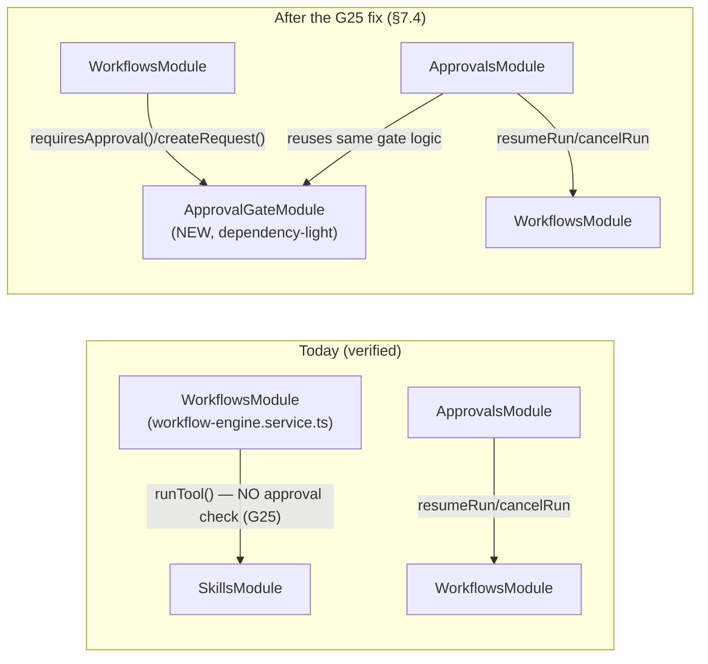
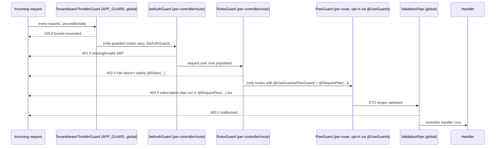

# Orlixa REST API Architecture — Whole-Application, Implementation Level

**Author's note on scope.** This document is the whole-application, implementation-level API
architecture for `apps/api`. It is written to sit next to, not duplicate,
`docs/architecture/workflow-system/13-api.md` (1,885 lines), which already owns the workflow
system's REST conventions, consolidated endpoint inventory, error envelope, realtime gateway, WS
event catalogue, and Execution/Publishing/Analytics API surfaces. Every claim about existing code
below was read directly from source; where a claim could not be verified it is marked **NOT
VERIFIED** rather than guessed. Every element is tagged **EXISTING (KEEP)** / **EXTEND** / **NEW**.

No UI/frontend content appears in this document.

---

## 1. Purpose and relationship to `13-api.md`

**What `13-api.md` already owns (cited, not repeated):**

- §13.A — REST conventions (versioning strategy, status-code discipline, pagination, filtering,
  idempotency keys, ETags) and the consolidated endpoint inventory for the workflow system
  (workflows, versions, templates, node registry, runs, admin/DLQ, audit, approvals, permissions,
  variables/secrets, analytics).
- §13.B — the global error envelope (`ApiErrorResponse`, `AllExceptionsFilter`,
  `WorkflowApiException`).
- §13.C/§13.D — the realtime gateway (Socket.IO, `/realtime`, room isolation) and the WebSocket
  event catalogue, with delivery guarantees over `RunEventOutbox`.
- §13.E/§13.F/§13.G — Execution, Publishing, and Analytics APIs.
- §13.H — cross-cutting rate limiting, webhook-ingress hardening, and the OpenAPI/SDK decision
  (adopt `@nestjs/swagger` with its compiler plugin; gate `/docs` off in production by default).

**What this document adds — the delta:**

1. **Service layer architecture** — 13-api.md does not discuss services at all; it discusses
   routes. This document defines what a service is responsible for, how it composes with Prisma,
   and the tenant-scoping discipline every service method follows.
2. **Controller design patterns** — 13-api.md lists *which* endpoints exist; this document
   specifies *how* a controller in this codebase is written, with a real annotated example and the
   rule for when a route needs its own controller.
3. **DTOs and validation, end to end** — request vs. response DTOs, the `@vaep/types` boundary,
   the mapper layer, and why a response DTO must never be a Prisma model.
4. **RBAC guard wiring** — doc 09 defines the permission *model* (the 8-level PDP); this document
   specifies the *wiring*: the literal guard execution order in this codebase today, and where a
   new `@RequirePermission()`/`ScopedPermissionGuard` slots into that order.
5. **Swagger/OpenAPI implementation** — 13-api.md §13.H makes the *decision* (adopt
   `@nestjs/swagger`, stage the rollout, gate `/docs`). This document is the concrete
   `DocumentBuilder` wiring in `bootstrap.ts`, the decorator conventions per controller, and the
   auth-scheme registration — genuinely greenfield code, not a restated decision.
6. **Employee, HR, and Marketing domain APIs** — 13-api.md is scoped to the workflow system and
   explicitly does not cover these.
7. **The complete `apps/api/src` folder structure**, annotated EXISTING/EXTEND/NEW.
8. **A consolidated webhook-event architecture** — 13-api.md's §13.H covers the *workflow*
   webhook's ingress hardening only (`POST /workflows/webhooks/:token`); doc 04
   (`skills-connectors.md`) covers per-engine signature schemes. This document is the one place
   that puts all five inbound webhook controllers (workflow, billing/Stripe, connector, Chatwoot,
   Postiz) and the outbound webhook surface side by side and states which pattern each follows and
   why they deliberately differ.

Sections 9, 10, 15, and 16 below (Workflow APIs, Execution APIs, Analytics APIs, WebSocket events)
are deliberately thin — they cite `13-api.md` for the endpoint table and add only the
controller/service/DTO *implementation shape*, per the task brief.

---

## 2. Layered architecture

```
Controller  →  Service  →  Repository (Prisma, inline in the service)  →  Postgres / Redis / BullMQ
```

There is **no separate repository class layer** in this codebase — verified across all 38
services (`grep -rL PrismaService apps/api/src/modules/**/*.service.ts` finds only the LLM
provider/executor strategy classes, which are not data-access services). `PrismaService`
(`apps/api/src/common/prisma/prisma.service.ts`, **EXISTING (KEEP)**) is injected directly into
each domain service and called inline. This is a deliberate, existing convention, not a gap: with
Prisma's typed client already providing the query-builder abstraction, an additional repository
interface would be a pass-through layer with no behaviour of its own. **Recommendation: keep this
convention** — do not introduce a repository layer for its own sake. The one place an extra layer
earns its keep is a **mapper** (`*.mapper.ts`, §5 below), which is not a repository — it has no
data-access responsibility, only shape translation.

### 2.1 What belongs in each layer

| Layer | Owns | Never |
|---|---|---|
| **Controller** | HTTP shape: route, guards, param/body binding, status code, delegating to exactly one service call per handler (occasionally two, e.g. `workflows.controller.ts`'s `create()` calling both `workflows` and, on a different route, `generator`) | Business logic, Prisma calls, cross-tenant queries, try/catch translating domain errors (that's the global filter's job, §13.B) |
| **Service** | Business rules, transactions, tenant scoping (`companyId` as an explicit first-class parameter — never inferred, never a hidden field), calling Prisma, calling other services via DI, translating domain failures into Nest `HttpException`s | HTTP concerns (no `Request`/`Response` object ever reaches a service — verified: no service in the 38 imports `express`), no cross-module service reaching without going through the module's public exports |
| **Prisma (inline in service)** | Typed queries, `$transaction`, optimistic-concurrency `where` clauses | Being wrapped in a bespoke repository class that adds no behaviour |

### 2.2 Anti-patterns to reject in review

- **Business logic in controllers.** Every controller read for this document (`workflows.controller.ts`,
  `skills.controller.ts`, `employees.controller.ts`, `approvals.controller.ts`,
  `analytics.controller.ts`) is a thin dispatcher: bind params, call one service method, return its
  result. None contains an `if` branching on business state — that is a service's job.
- **Prisma in controllers.** Zero controllers import `PrismaService` directly (verified by grep
  across all 33 controller files) — this must stay true.
- **Cross-module service reaching.** A service may only inject another module's service if that
  service is exported from its module and imported through Nest DI — never reach into another
  module's internals (e.g. constructing a second, unmanaged instance, or importing a private
  provider not listed in that module's `exports`). The existing pattern for this is explicit:
  `ApprovalsModule` imports `WorkflowsModule` to inject `WorkflowsService`
  (`apps/api/src/modules/approvals/approval.service.ts:51-55`) because `ApprovalService.approve()`
  needs to call `WorkflowsService.resumeRun()`/`cancelRun()` for `WORKFLOW`-kind requests. That is a
  deliberate, one-directional dependency — not an anti-pattern, because it does not create a cycle.
- **Circular module dependencies.** The codebase already avoids one on purpose:
  **`WorkflowsModule` never imports `ApprovalsModule`.** `workflow-engine.service.ts` calls
  `this.skills.runTool(...)` directly for a `TOOL_ACTION` node
  (`apps/api/src/modules/workflows/engine/workflow-engine.service.ts:819`) — it does **not** call
  `ApprovalService.requiresApproval()` first, unlike the chat path's
  `ToolExecutorService.call()` (`apps/api/src/modules/employees/runtime/tool-executor.service.ts:50`),
  which does. This asymmetry is doc 00 §0.3.2's **G25** — a real, verified P0 gap (§7.4 below covers
  the fix). The *reason* the engine doesn't import `ApprovalsModule` today is legitimate:
  `ApprovalsModule` already imports `WorkflowsModule` (for `resumeRun`/`cancelRun`), so the reverse
  import would be circular. **The correct fix is a new dependency-light module that both
  `WorkflowsModule` and `ApprovalsModule` can import without importing each other** — see §7.4.
  Rejecting a "quick fix" that has the engine import `ApprovalsModule` directly is the single most
  important review anti-pattern this document calls out by name, because it would silently
  reintroduce the cycle doc 08 §8.1.9 already designed around (`ApprovalRoutingModule`, "dependency-
  light, imports only `PrismaService`").



---

## 3. Controller design

### 3.1 The house pattern, annotated

`WorkflowsController` (`apps/api/src/modules/workflows/workflows.controller.ts`, **EXISTING
(KEEP)**) and `SkillsController` (`apps/api/src/modules/skills/skills.controller.ts`, **EXISTING
(KEEP)**) are the two reference implementations named in this document's brief. Both share the
identical shape:

```ts
/**
 * All routes are tenant-scoped by companyId from the JWT and JWT-guarded.
 * Authoring workflows (create/update/delete/activate/deactivate) is
 * @Roles('OWNER','ADMIN'); reads + running/firing stay open to any member.
 */
@Controller('workflows')
@UseGuards(JwtAuthGuard, RolesGuard)          // class-level: applies to every route below
export class WorkflowsController {
  constructor(
    private readonly workflows: WorkflowsService,   // exactly one primary collaborator...
    private readonly generator: WorkflowGeneratorService, // ...plus a second when a route
  ) {}                                                    // genuinely needs a different service

  @Post()
  @Roles('OWNER', 'ADMIN')                     // method-level: narrows the class-level guard's check
  create(
    @CurrentTenant() companyId: string,         // tenant boundary — never trust a body/query companyId
    @CurrentUser() user: AuthenticatedUser,     // only bound when the handler needs the actor's identity
    @Body() dto: CreateWorkflowDto,             // class-validator DTO, never a raw `Record<string, unknown>`
  ): Promise<WorkflowDto> {                     // return type is the @vaep/types response DTO, never a Prisma model
    return this.workflows.create(companyId, dto, user.userId); // one line: delegate, nothing else
  }
}
```

**House rules this pattern encodes:**

1. **`@UseGuards(JwtAuthGuard, RolesGuard)` at the class level**, narrowed per-route by `@Roles(...)`
   where authoring differs from reading. A route with no `@Roles()` is open to any authenticated
   member of the tenant (`RolesGuard` returns `true` when no metadata is present —
   `apps/api/src/modules/auth/roles.guard.ts:45-47`).
2. **`@CurrentTenant()` is mandatory on every handler that touches tenant data**, and it is always
   the *first* positional parameter by convention — the tenant boundary should be the first thing a
   reviewer's eye finds, not something buried after three query params.
3. **`@CurrentUser()` is bound only when the handler needs the actor's identity** (writes that
   record `createdBy`/`decidedBy`, e.g. `update(...,  user.userId)`); pure reads (`list`, `get`) omit
   it — an unused injected param is a signal something is wrong, not defensive boilerplate.
4. **One service call per handler.** A handler's body is a single `return this.service.method(...)`
   — no `if`, no `try/catch`, no second await. If a route needs to orchestrate two services, that
   orchestration is a **new service method**, not controller logic (see §4.4 for why).
5. **The response type is always the `@vaep/types` DTO interface**, never a Prisma model, never
   `any`. A controller method's return type is effectively the API contract; it must be traceable to
   an interface a consumer (internal or external) can read.
6. **Status codes are explicit only when they diverge from Nest's default** — `@HttpCode(204)` on
   `remove()`, `@HttpCode(200)` on `activate()`/`deactivate()` (an action, not a creation, per
   13-api.md §13.A.3.1's status-code table). A bare `@Post()` with no `@HttpCode()` is `201` by
   Nest's default (13-api.md §13.0.1's R9 finding: this is exactly the gap that made
   `POST /workflows/:id/run` `201` instead of the intended `202` — a decorator that should have been
   there and wasn't).

### 3.2 Route naming

- Plural, kebab-free resource nouns off the controller root: `/workflows`, `/skills`, `/approvals`,
  `/employees`. Nested resources are path-nested one level (`/workflows/:id/runs`,
  `/employees/:id/conversations`), never flattened into query params for an owned collection.
- Actions that are not CRUD are verbs under the resource id: `/workflows/:id/activate`,
  `/skills/installed/:id/connect`. This is the existing, consistent convention across every
  controller read for this document — do not introduce a competing style (e.g. a query-param
  `?action=activate`) for a new route.
- Fixed path segments that could collide with a parametric `:id` are declared **before** the
  parametric route in the same controller (`workflows.controller.ts:72,85` — `events` and
  `runs/:runId` both come before `@Get(':id')`) — this is not stylistic, it is required by Express's
  first-match routing; violating the order silently shadows the fixed route.

### 3.3 When a separate controller is warranted

The codebase already draws this line in three different ways, and a new domain should reuse
whichever of the three matches its actual trust boundary rather than inventing a fourth:

1. **Fully guarded, one controller per resource** (the default) — `WorkflowsController`,
   `SkillsController`, `EmployeesController`, `ApprovalsController`, `UsersController`, etc. Class-
   level `@UseGuards(JwtAuthGuard, RolesGuard)`, per-route `@Roles()`.
2. **Fully public, a *dedicated* controller with no class-level guard at all** — every inbound
   webhook (§17 below): `WorkflowWebhooksController`, `BillingWebhookController`,
   `ConnectorWebhookController`, `SupportWebhookController`, `MarketingWebhookController`. **This
   split is correct and must be preserved**: a webhook controller authenticates via a
   signature/token in the body or path, never a JWT, and it would be actively wrong to share a
   `@Controller('workflows')` class with `WorkflowsController` — a shared class-level guard would
   either (a) incorrectly demand a JWT from an external system that has none, or (b) require an
   explicit per-route guard override that is one omitted decorator away from a real vulnerability.
   Physically separating the file makes "this route has no JWT" impossible to miss in review.
3. **Mixed: no class-level guard, guards applied per-method** —
   `SkillsOAuthController` (`apps/api/src/modules/skills/oauth/oauth.controller.ts`, **EXISTING
   (KEEP)**) is the one existing example: `authorize()` carries its own
   `@UseGuards(JwtAuthGuard, RolesGuard)` + `@Roles('OWNER','ADMIN')`, while `callback()` on the same
   controller has no guards at all, because the OAuth provider's browser redirect arrives with no
   JWT and must be handled honestly as public, recovering the tenant from the signed `state`
   parameter instead. This pattern is reserved for controllers where *most* routes are guarded and
   exactly one or two genuinely can't be — do not use it as a way to avoid splitting out a webhook
   controller; if more than one or two routes on a controller are public, split the file (as pattern
   2 already does for every webhook).

**Rule for a new domain:** if a route's caller can present a JWT, guard the whole controller
(pattern 1). If a route's caller is an external system authenticating by signature/token instead,
give it its own file with no class-level guard (pattern 2) — never bury an unguarded route inside an
otherwise-guarded controller unless it is the OAuth-callback-style exception (pattern 3), and even
then, only when it's one route among many guarded ones on the same logical resource.

### 3.4 Async/202 discipline

A `POST` that starts work whose result is not yet final returns `202`, not `200`/`201`
(13-api.md §13.A.3.1, restated here because it is a controller-level decorator decision):
`@HttpCode(202)` plus a response body that is the *not-yet-terminal* resource (e.g. a
`WorkflowRunDto` with `status: 'PENDING'`), never an empty body — a 202 caller must be able to
`GET` the resource's id from the response to poll it.

---

## 4. Service design

### 4.1 Single responsibility

One service per bounded concept, not one service per controller. Verified: `SkillsModule` alone has
`SkillsService`, `ConnectorHealthService`, `ConnectorTokenService`, and `OAuthService` — four
services behind two controllers (`SkillsController`, `ConnectorsController`) plus the OAuth
controller, because "manage installed skills," "probe connector health," "manage OAuth tokens," and
"exchange an OAuth code" are four different responsibilities that happen to share a module. A new
domain should default to this granularity rather than one god-service per module.

### 4.2 Dependency injection

Constructor injection only, everywhere — no `ModuleRef.get()` service-locator usage was found in
any of the 38 services. A service declares its collaborators as `private readonly` constructor
parameters; Nest's DI container resolves them. Cross-module injection requires the target service to
be listed in its module's `exports: [...]` array (verified pattern: `WorkflowsModule` exports
`WorkflowsService` so `ApprovalsModule` can inject it).

### 4.3 Transactions

`prisma.$transaction(...)` for any multi-write operation that must be atomic — the codebase's
existing atomic-claim idioms are the model to follow for new code, not a from-scratch design:

- **Optimistic concurrency**: `workflows.service.ts:119`'s `expectedUpdatedAt` mismatch check —
  read-then-conditional-`update`, `409` on mismatch.
- **Race-safe status claim**: `ApprovalService.claim()`
  (`apps/api/src/modules/approvals/approval.service.ts:190-213`) uses
  `updateMany({ where: { id, companyId, status: 'PENDING' }, data: {...} })` and checks
  `result.count === 0` to detect a lost race — a single conditional `UPDATE`, not a
  `SELECT`-then-`UPDATE` pair, which is exactly the difference between "prevents two managers
  double-deciding the same request" and "doesn't." The same idiom appears in
  `workflow-engine.service.ts:231`'s run-claim `updateMany({ where: { status: 'PENDING' } })`. **A
  new service that needs a race-safe state transition should copy this idiom** (conditional
  `updateMany` + `count === 0` check) rather than reach for `prisma.$transaction` with an explicit
  row lock, which is heavier and not the established pattern here.
- Use `prisma.$transaction([...])` (the array form) when the operation is genuinely multiple
  dependent writes with no natural single-`UPDATE` expression (e.g. creating a `Workflow` and its
  first `WorkflowVersion` row together, per doc 00 §0.7.4's Phase 1 folder structure) — not for
  single-row conditional updates, which the `updateMany` idiom above already covers atomically.

### 4.4 Idempotency

Two distinct mechanisms, kept deliberately separate (13-api.md §13.A.3.4, restated at the service
layer because this is where both are actually implemented):

1. **Business idempotency** — a service-level uniqueness/claim check against domain meaning (e.g.
   `WorkflowRun.idempotencyKey` scoped `[companyId, idempotencyKey]`; `StaffService`'s
   `@@unique([companyId, email])` + `P2002` catch pattern, doc 03 §3.1.10).
2. **HTTP idempotency** — the `Idempotency-Key` header convention (13-api.md §13.A.3.4), implemented
   as a **NEW** interceptor (`apps/api/src/common/http/idempotency.interceptor.ts`), not inside
   individual services — a service should never need to know an HTTP header exists.

### 4.5 Error translation

A service throws Nest's built-in `HttpException` subclasses (`NotFoundException`,
`ConflictException`, `ForbiddenException`, `BadRequestException`) directly — verified as the
existing convention in every service read (`approval.service.ts`, `workflows.service.ts`,
`employees.service.ts`). A service **never** returns an ad hoc `{ error: string }` object for a
failure case; the exception *is* the error channel, and the global filter (13-api.md §13.B,
**NEW**) is the single place that shapes it into `ApiErrorResponse`. New domain-specific exceptions
(the `WorkflowApiException` hierarchy, 13-api.md §13.B.7) are thrown from services the same way.

### 4.6 Tenant-scoping discipline

**Every service method that touches tenant data takes `companyId` as an explicit parameter — never
inferred from context, never a hidden instance field.** This is the single most load-bearing
existing convention in the codebase and the one a new service must not violate: `SkillsService`'s
class comment states it outright — *"Every query is scoped by companyId (from the JWT) so tenants
never see each other's skills"* (`skills.service.ts:46-50`) — and the same sentence appears,
essentially verbatim, on `ApprovalService`, `WorkflowsService`, and every other tenant-scoped
service's class doc comment. Two concrete idioms enforce it:

- **`findOwned(companyId, id)`** — every "get one" path does
  `prisma.<model>.findFirst({ where: { id, companyId } })` and throws `NotFoundException` if no row
  matches, *including* when the row exists but belongs to another tenant
  (`workflows.service.ts:539-547`, `approval.service.ts:288-299`). This is deliberate: returning
  `403` for a cross-tenant id would confirm the id's existence to a non-owner, which is its own
  leak (13-api.md §13.A.3.1's status-code table restates this as a `404`-not-`403` rule).
- **No global/ambient `companyId`.** There is no request-scoped provider, no `AsyncLocalStorage`,
  and no `this.currentCompanyId` field anywhere in the 38 services — `companyId` is threaded
  explicitly through every call, from controller to service to (when it crosses another service) the
  next service's method signature. A new service must follow this exactly, even where it feels
  repetitive: implicit tenant context is exactly the kind of thing that is invisible in a diff and
  catastrophic when a refactor drops it.

---

## 5. DTOs

### 5.1 Request vs. response DTOs — two different mechanisms, on purpose

- **Request DTOs** are `class`es using `class-validator`/`class-transformer` decorators
  (`create-workflow.dto.ts`, `run-workflow.dto.ts`, `decide-approval.dto.ts`, …), because the global
  `ValidationPipe` (`bootstrap.ts:14-19`) only understands class-validator metadata — a plain
  `interface` has none at runtime.
- **Response DTOs** are `interface`s re-exported from `@vaep/types` (`WorkflowDto`,
  `AiEmployeeDto`, `ApprovalRequestDto`, …) — plain TypeScript shapes with no runtime validation
  metadata, because a response is constructed by the server, not validated on the way out today.

```ts
// Request DTO — apps/api/src/modules/workflows/dto/create-workflow.dto.ts (EXISTING (KEEP))
export class CreateWorkflowDto implements ICreateWorkflowDto {
  @IsString() @MinLength(1) @MaxLength(160)
  name!: string;

  @IsOptional() @IsString() @MaxLength(2000)
  description?: string;

  @IsOptional() @ValidateNested() @Type(() => WorkflowDefinitionDto)
  definition?: WorkflowDefinitionDto;
}
```

Note the `implements ICreateWorkflowDto` — every request DTO class implements the corresponding
`@vaep/types` interface. This is the mechanism that keeps the class-validator class and the
shared-contract interface from silently drifting: if `@vaep/types` adds a required field to
`CreateWorkflowDto`, the NestJS class fails to compile until it's added too.

### 5.2 The `@vaep/types` shared-contract boundary

`packages/types` is a built CommonJS package both `apps/api` and `apps/web` import
(**EXISTING (KEEP)**). It is the **single source of truth for every DTO shape** — a request DTO
class always `implements` a `@vaep/types` interface; a response is always typed as a `@vaep/types`
interface directly (no local re-declaration). This is what makes API/web type safety "already
perfect, for free, with no code generation step" inside the monorepo (13-api.md §13.H.3) — the
boundary this document adds nothing to except naming it explicitly as a rule: **never declare a DTO
shape that duplicates an existing `@vaep/types` interface field-for-field under a new name.** Two
parallel validation mechanisms already coexist here on purpose and must not be conflated: the
`zod` schemas in `@vaep/types` (144 occurrences) serve `apps/web`'s own **form** validation; the
`class-validator` decorators on the NestJS DTO classes are the API's actual runtime enforcement.
They describe the same shape from two different runtime systems — keeping them in sync when a field
changes is a manual discipline (add the zod field *and* the class-validator field), not something
either the compiler or a lint rule currently guarantees. **NEW recommendation**: add a lint rule or
a small script check (not built here) that fails CI when a `@vaep/types` interface gains a field
with no matching class-validator property on its implementing DTO class, to make this discipline
mechanical rather than reviewer-memory-dependent.

### 5.3 The mapper layer

`*.mapper.ts` is an existing, consistent convention (`workflows.mapper.ts`, `skills.mapper.ts`,
`employees.mapper.ts`, `approvals.mapper.ts`, `users.mapper.ts`, `organization.mapper.ts`,
`events.mapper.ts`, `audit-log.mapper.ts`, `billing.mapper.ts`, `scheduling.mapper.ts` — 10 files,
**EXISTING (KEEP)**). A mapper is a set of pure functions, `toXDto(prismaRow): XDto`, with **no**
DI, no injected dependencies, no side effects — verified: none of the 10 mapper files has an
`@Injectable()` decorator or a constructor. This is deliberate: a mapper is a shape translation, not
a service, and giving it DI would blur that line and invite business logic to creep in.

```ts
// apps/api/src/modules/workflows/workflows.mapper.ts (EXISTING (KEEP), excerpt)
export function toWorkflowDto(w: Workflow): WorkflowDto {
  const definition = (w.definition as unknown as WorkflowDefinition | null) ?? EMPTY_DEFINITION;
  return {
    id: w.id, companyId: w.companyId, name: w.name, description: w.description,
    status: w.status, definition, triggerType: w.triggerType as TriggerType,
    triggerConfig: (w.triggerConfig as TriggerConfig | null) ?? null,
    webhookToken: w.webhookToken ?? null,
    activatedAt: w.activatedAt?.toISOString() ?? null,
    warnings: computeWarnings(definition),
    createdAt: w.createdAt.toISOString(), updatedAt: w.updatedAt.toISOString(),
  };
}
```

### 5.4 Why a response DTO must never be a Prisma model directly

Two concrete, verified reasons a service must always return a mapped DTO, never the raw Prisma
row:

1. **Credential/secret leakage.** `InstalledSkill` and connector rows carry encrypted credential
   blobs (`credentials.util.ts`'s `sealCredentials`/`readCredentials`); returning the Prisma row
   verbatim would serialize the *encrypted ciphertext column* into an HTTP response — not a
   plaintext leak today, but a needless exposure of a field a client has no legitimate use for and
   that should never round-trip through a browser. `toInstalledSkillDto` (`skills.mapper.ts`)
   omits it entirely.
2. **Shape stability.** A Prisma model's shape changes the moment a migration adds a column; a
   hand-written DTO interface changes only when the mapper is updated to populate the new field.
   Returning Prisma rows directly means every schema migration is implicitly also an API contract
   change — the mapper is what makes those two independent.

The one place this rule is *slightly* relaxed by necessity is `WorkflowRunDto`'s optional `steps?`
field (`toWorkflowRunDto`, `workflows.mapper.ts:84-104`), which maps an array of `WorkflowStepRun`
rows via `toWorkflowStepRunDto` — still mapped, never raw, just nested.

---

## 6. Validation

### 6.1 Global pipe configuration

```ts
// apps/api/src/bootstrap.ts:14-19 (EXISTING (KEEP))
app.useGlobalPipes(
  new ValidationPipe({
    whitelist: true,          // strips properties not declared on the DTO class
    transform: true,          // instantiates the DTO class (enables @Type()-driven nested validation)
    forbidNonWhitelisted: false, // does NOT reject a request carrying an unknown property
  }),
);
```

### 6.2 The `forbidNonWhitelisted: false` assessment

**This default is wrong for a multi-tenant SaaS API and should be flipped to `true`, deliberately
and with a migration plan, not left as-is.** The distinction that matters: `whitelist: true` already
*strips* unknown properties before they reach a service — no unknown property is ever persisted or
acted on. `forbidNonWhitelisted: false` only changes what happens to the **client**: today, a
request that includes a typo'd or deprecated field name (e.g. `{"nmae": "..."}` instead of
`{"name": "..."}`) is **silently accepted with the typo'd field dropped and no error** — the caller
gets a `400` only if a *required* field is now missing as a side effect, not a direct signal that
their request had an unrecognized property. Two concrete costs of the current default:

- **Silent integration bugs.** An external integrator (or a stale `apps/web` build after an API
  contract change) that renames a field on the client but not in a payload gets no feedback that the
  new field name was ignored — the request "succeeds" with the old behavior.
- **It undermines the deprecation mechanism this document's own §1 relies on.** 13-api.md's ledger
  item R6 (`PATCH /workflows/:id` deprecation shim) depends on being able to tell, going forward,
  whether a client is still sending a field the server no longer expects — `forbidNonWhitelisted:
  true` would surface that at request time as a `400`, which is a stronger signal than silent
  stripping for catching a caller that never migrated off a removed field.

**Recommendation:** flip to `forbidNonWhitelisted: true` behind a staged rollout: (1) log (not
reject) unknown properties for one release to find any existing caller relying on the current
silent-strip behavior — `ValidationPipe`'s `exceptionFactory` can be overridden to log instead of
throw during this window; (2) flip to hard rejection once the log is clean. This is a real,
customer-facing behavior change (any caller currently sending extra junk fields will start getting
`400`s) and must be communicated, not flipped silently in a patch release.

### 6.3 Per-DTO and custom validators

Standard `class-validator` decorators (`@IsString`, `@MaxLength`, `@IsOptional`, `@ValidateNested`
+ `@Type()` for nested objects) cover the large majority of DTOs, verified across every DTO file
read for this document. A custom validator (a class implementing `ValidatorConstraintInterface`) is
the right tool only when a rule can't be expressed declaratively — e.g. a conditional
cross-field rule like "`eventType` is required only when `triggerType === 'EVENT'`." **Verified
gap, not built today:** `update-workflow.dto.ts`'s conditional `EVENT`-trigger requirement is
currently enforced by a hand-written method, `validateTrigger()`
(`workflows.service.ts:486-508`) — **inside the service, not the DTO** — because `class-validator`'s
declarative conditional decorators (`@ValidateIf`) were not used for it. This is a real, existing
inconsistency worth naming: two different validation mechanisms enforce two halves of the same
DTO's correctness (class-validator for per-field shape, a service method for cross-field business
rules), and 13-api.md §13.H.10 independently flags this exact gap from the Swagger-generation angle
("the plugin captures the shape but not custom cross-field logic"). Not a defect to fix in this
document, but the *pattern* to follow going forward is: prefer `@ValidateIf`-based declarative
conditional validation on the DTO for new conditional-field rules, reserving a service-level
`validateX()` method only for rules that genuinely need DB state (which `validateTrigger()` does
not — recommend migrating it to `@ValidateIf` as a small, isolated follow-up).

### 6.4 Where validation must also happen server-side beyond DTOs

A DTO validates **shape**; it cannot validate **business/graph correctness**. Two examples already
in the codebase establish the pattern a new domain should follow:

1. **Workflow definition validation** — `definition-validator.ts` (**EXISTING (KEEP)**, 32 lines)
   runs *after* the DTO has already passed shape validation: duplicate node ids, edges referencing
   unknown nodes. This is a second validation pass, in the service layer, over data the DTO already
   accepted as *shaped* correctly but not yet *graph*-correctly. Doc 00 §0.3.2's **G14** notes this
   pass is currently structural-only (no cycle detection, no per-node-type config validation) —
   Phase 1/Phase 2 close that gap, but the *pattern* (DTO validates shape, a dedicated
   service-layer validator validates domain correctness) is already right and should be extended,
   not replaced.
2. **Permission checks** — a DTO has no way to know "is this user allowed to publish *this specific*
   workflow" (doc 09 §9.A's PDP, `AuthorizationService.can()`) — that requires DB context
   (`WorkflowPermission` rows, `RoleScopeAssignment` rows) a `class-validator` decorator cannot
   reach. This is precisely why permission checks live in a service (or a guard that calls a
   service), never a DTO (§7 below).

---

## 7. RBAC and guard composition

### 7.1 The exact execution order today

Verified directly (`app.module.ts:64`, every controller's `@UseGuards(...)` list, and each guard's
own doc comment stating it "runs AFTER" its predecessor):



1. **`TenantAwareThrottlerGuard`** (`apps/api/src/common/resilience/tenant-throttler.guard.ts`,
   **EXISTING (KEEP)**) — registered as the global `APP_GUARD` in `app.module.ts:64`, so it runs on
   **every** request, guarded or not, before any other guard. It never inspects `request.user`
   (which doesn't exist yet at this point on an unauthenticated route) — it decodes (not verifies)
   the JWT's `companyId` claim directly off the raw `Authorization` header to pick a rate-limit
   bucket, falling back to per-IP for pre-auth routes.
2. **`JwtAuthGuard`** (`apps/api/src/modules/auth/jwt-auth.guard.ts`, **EXISTING (KEEP)**) — a thin
   `AuthGuard('jwt')` subclass; populates `request.user` as `AuthenticatedUser { userId, companyId,
   role }` on success, throws `401` on failure. Applied per-controller via
   `@UseGuards(JwtAuthGuard, RolesGuard)` — **not global**, because webhook controllers (§3.3
   pattern 2) must not carry it.
3. **`RolesGuard`** (`apps/api/src/modules/auth/roles.guard.ts`, **EXISTING (KEEP)**) — always
   listed *after* `JwtAuthGuard` in a controller's `@UseGuards(...)` array (Nest runs guards in the
   array's declared order), because it reads `request.user.role`, which only exists once
   `JwtAuthGuard` has run. Reads `@Roles(...)` metadata (method overrides class,
   `reflector.getAllAndOverride`); absent metadata means "authenticated-only," not "open to
   everyone" — `JwtAuthGuard` has already run by this point regardless.
4. **`PlanGuard`** (`apps/api/src/modules/billing/plan.guard.ts`, **EXISTING (KEEP)**) — opt-in per
   route via an explicit second `@UseGuards(PlanGuard)` plus `@RequirePlan(...)`
   (`workflows.controller.ts:101-102`, the only current usage: `POST /workflows/generate`). It also
   reads `request.user.companyId`, so it likewise depends on `JwtAuthGuard` having run first, and is
   declared as an *additional* `@UseGuards()` on top of the class-level pair, applied after them at
   the method level.

**Composition rule:** `@Roles(...)` and `@RequirePlan(...)` are independent, additive gates —
both must pass; neither is a substitute for the other. A route can legitimately require
`@Roles('OWNER','ADMIN')` **and** `@RequirePlan('BUSINESS','ENTERPRISE')` simultaneously (no
current route does both, but nothing in the guard design prevents it — they read different pieces
of `request.user`/`companyId` state and throw independently).

### 7.2 Where per-employee/per-workflow permission checks belong — not in guards

Doc 09 §9.A's 8-level PDP (`AuthorizationService.can(ctx, action, resource)`, **NEW**) is
explicitly *not* implemented as a fifth global guard, and this document adopts that placement
rather than proposing a competing one: levels 4-7 (Employee/Workflow/Skill/Node) need **DB
context** — `EmployeeSkill` grants, `WorkflowPermission` rows, `RoleScopeAssignment` rows — that a
guard evaluated purely off `request.user`'s JWT claims cannot reach without itself becoming a
database-querying service in guard's clothing. Doc 09 §9.A.3 states the PDP/PEP split precisely:
`AuthorizationService.can()` is the one **PDP**; a NestJS guard (`ScopedPermissionGuard`, when
built) is one of *several* **PEPs** that call it — the node-attempt processor inside the execution
engine is another PEP calling the exact same PDP, which is the entire point (today, `RolesGuard` is
both the PDP *and* the only PEP, so nothing downstream of HTTP is ever asked at all — precisely why
G25 was possible, per §2.2 above). **The rule for a new permission check going forward:** if it can
be answered from `request.user`'s JWT claims alone (company-wide role), it's a guard. If it needs a
row lookup against a specific resource (does this user hold a grant on *this* workflow/employee),
it is a call to `AuthorizationService.can()` from either a thin guard wrapper (`ScopedPermissionGuard`,
HTTP PEP) or directly from a service method (engine PEP) — never reimplemented inline as ad hoc
Prisma queries scattered across controllers or services (doc 09 §9.A.15's explicit best practice).

### 7.3 Closing G25 at the service layer

**The gap, restated precisely and verified again for this document:** `ToolExecutorService.call()`
(chat path) checks `this.approvals.requiresApproval(employee, skillKey, tool)`
(`tool-executor.service.ts:50`) **before** calling `this.skills.runTool(...)` — if the check is
true, it creates a `PENDING` `ApprovalRequest` and returns `{ ok: false, pendingApproval: true, ...
}` **without executing the tool**. `WorkflowEngineService.execToolAction()` (workflow path) calls
`this.skills.runTool({ companyId, employeeId }, skillKey, tool, args)`
(`workflow-engine.service.ts:819`) directly, with **no** call to `ApprovalService` at all — a tool
flagged `highRisk: true` in the catalog, or matched by an employee's `approvalRules.
requireApprovalForAllTools`, executes with zero human gate the moment it's reached from a
`TOOL_ACTION` node.

**The fix belongs in a service, not a guard or a controller**, for a structural reason: this is a
decision made *inside* the execution engine's node-processing loop, deep in `WorkflowEngineService`
— there is no HTTP request/response cycle at that point for a guard to intercept (the engine is
running inside a BullMQ job processor, not inside a controller's call stack). The only place this
decision can be enforced is exactly where `ToolExecutorService.call()` already enforces it: at the
call site immediately before `runTool()` executes.

**The dependency constraint that made this hard, and its actual fix (not a workaround):**
`WorkflowsModule` cannot import `ApprovalsModule` directly, because `ApprovalsModule` already
imports `WorkflowsModule` (`ApprovalService` needs `WorkflowsService.resumeRun`/`cancelRun` for
`WORKFLOW`-kind requests) — a direct import the other way would be a circular module dependency.
Doc 08 §8.1.9 already designed the correct seam for an unrelated feature (approval routing):
`apps/api/src/modules/approval-routing/`, described there as **"dependency-light, imports only
`PrismaService`."** This document's recommendation is to reuse exactly that seam for G25 rather
than inventing a second one:

```
apps/api/src/modules/approval-gate/                NEW — dependency-light, imports only PrismaService + SkillCatalog
├── approval-gate.module.ts                        exports ApprovalGateService; imports NOTHING module-level
│                                                   that could create a cycle (no WorkflowsModule, no ApprovalsModule)
└── approval-gate.service.ts                        requiresApproval() + createRequest() — the exact two
                                                     methods ApprovalService.requiresApproval/createRequest
                                                     already implement (approval.service.ts:62-95), MOVED here
```

`ApprovalGateService.requiresApproval()`/`createRequest()` are a straight extraction of
`ApprovalService`'s existing methods of the same name (`approval.service.ts:62-95`) — they already
depend on nothing but `PrismaService` and `SkillCatalog`, **not** on `WorkflowsService`, so the
extraction is mechanical, not a redesign. After the extraction:

- `ApprovalsModule` imports `ApprovalGateModule` (re-exports the same two methods `ApprovalService`
  used to own, now delegated) **and** continues importing `WorkflowsModule` for `resumeRun`/
  `cancelRun` — unchanged from today.
- `WorkflowsModule` (specifically `WorkflowEngineService`) imports `ApprovalGateModule` **only** —
  never `ApprovalsModule` — so the cycle doc 08 §8.1.9 already avoids for routing is never
  reintroduced for this fix either.
- `WorkflowEngineService.execToolAction()` gains the identical gate `ToolExecutorService.call()`
  already has:

```ts
// apps/api/src/modules/workflows/engine/workflow-engine.service.ts — execToolAction, EXTEND (fixes G25)
private async execToolAction(
  companyId: string,
  employeeId: string | undefined,
  skillKey: string,
  tool: string,
  args: Record<string, unknown>,
  dryRun: boolean,
): Promise<NodeResult> {
  // ...existing connector-quarantine + dry-run checks, unchanged...

  if (!dryRun && employeeId) {
    const employee = await this.employees.get(companyId, employeeId); // already loaded elsewhere in this path
    if (this.approvalGate.requiresApproval(employee, skillKey, tool)) {
      const request = await this.approvalGate.createRequest({
        companyId, employeeId, skillKey, tool, args,
        description: `Workflow step ${skillKey}.${tool} awaiting approval`,
      });
      // Mirrors the chat path's contract: do NOT execute; surface a pendingApproval
      // result and let the run pause exactly like an APPROVAL node would (reuses
      // the EXISTING pauseForApproval/resume mechanism — no new run-state concept).
      return this.pauseForApproval(request.id, { skillKey, tool, args });
    }
  }

  const call = await this.skills.runTool({ companyId, employeeId }, skillKey, tool, args);
  if (!call.ok) {
    throw new Error(`Tool ${skillKey}/${tool} did not succeed`);
  }
  return { output: call, contextValue: call };
}
```

This reuses the **existing** `pauseForApproval`/`resumeRun` run-state machinery (doc 00 §0.3.1's
"Approval pause/resume" row) rather than inventing a second pause mechanism — a `TOOL_ACTION` node
that trips the gate now pauses the run to `WAITING` exactly the way an `APPROVAL` node already does,
and the *existing* `ApprovalRequest.kind='WORKFLOW'` decision path in `ApprovalService.decideWorkflow()`
resumes or cancels it. No new concept, no new database table — one extraction, one call site.

---

## 8. Swagger / OpenAPI

Adopting `@nestjs/swagger` is 13-api.md §13.H.3's decision, made on the same evidence this document
also verified (`package.json` has zero Swagger references; `nest-cli.json` has no `plugins` entry;
every DTO already validates with `class-validator`, not Zod). What follows is the concrete,
compilable wiring — genuinely new content, not a restatement of the decision.

### 8.1 Packages to add

```
@nestjs/swagger        NEW dependency — apps/api/package.json
swagger-ui-express      NEW transitive dependency (bundled by @nestjs/swagger's SwaggerModule.setup)
```

### 8.2 `nest-cli.json` — enable the compiler plugin

```json
{
  "$schema": "https://json.schemastore.org/nest-cli",
  "collection": "@nestjs/schematics",
  "sourceRoot": "src",
  "compilerOptions": {
    "deleteOutDir": true,
    "tsConfigPath": "tsconfig.build.json",
    "plugins": ["@nestjs/swagger"]
  }
}
```

Verified today (`apps/api/nest-cli.json`, read in full): no `plugins` key exists — this is a
genuinely new addition, not an extension of an existing array.

### 8.3 `DocumentBuilder` setup in `bootstrap.ts`

```ts
// apps/api/src/bootstrap.ts — EXTEND
import { DocumentBuilder, SwaggerModule } from '@nestjs/swagger';

export function configureApp(app: INestApplication): void {
  const config = app.get(ConfigService);

  app.use(cookieParser());
  app.useGlobalPipes(new ValidationPipe({ whitelist: true, transform: true, forbidNonWhitelisted: true /* see §6.2 */ }));
  app.enableCors({ origin: config.get<string>('WEB_ORIGIN') ?? 'http://localhost:3000', credentials: true });

  // NEW — gated OFF unless explicitly enabled (13-api.md §13.H.3, step 3).
  const docsEnabled =
    config.get<string>('NODE_ENV') !== 'production' ||
    config.get<string>('ENABLE_API_DOCS') === 'true';
  if (docsEnabled) {
    const document = SwaggerModule.createDocument(
      app,
      new DocumentBuilder()
        .setTitle('Orlixa API')
        .setDescription('Enterprise AI Employee Operating System — REST API')
        .setVersion(process.env.npm_package_version ?? '0.0.0')
        .addBearerAuth(
          { type: 'http', scheme: 'bearer', bearerFormat: 'JWT' },
          'access-token', // referenced by @ApiBearerAuth('access-token') below
        )
        .addTag('workflows').addTag('employees').addTag('approvals')
        .addTag('hr').addTag('marketing').addTag('analytics')
        .build(),
    );
    SwaggerModule.setup('docs', app, document); // serves /docs (UI) + /docs-json (spec)
  }
}
```

`ENABLE_API_DOCS` is a **NEW** env var (`apps/api/src/config/env.validation.ts`, **EXTEND**) —
optional, defaults unset (falsy), so production stays closed unless an operator opts in explicitly,
matching 13-api.md §13.H.10's edge case ("an operator must opt in explicitly, not opt out").

### 8.4 Decorator conventions

Request-DTO coverage is near-automatic once the compiler plugin is enabled (it introspects
`class-validator` decorators and TS types at build time) — the manual annotation burden is on
**controllers** (tags, operation summaries, auth) and **response shapes** (§8.5):

```ts
// apps/api/src/modules/workflows/workflows.controller.ts — EXTEND, decorator-only diff
@ApiTags('workflows')
@ApiBearerAuth('access-token')
@Controller('workflows')
@UseGuards(JwtAuthGuard, RolesGuard)
export class WorkflowsController {
  @Post()
  @Roles('OWNER', 'ADMIN')
  @ApiOperation({ summary: 'Create a workflow (starts as an empty TRIGGER-only draft)' })
  @ApiResponse({ status: 201, description: 'Created', type: WorkflowResponseDto }) // §8.5
  @ApiResponse({ status: 403, description: 'Caller is not OWNER/ADMIN for this company' })
  create(/* ...unchanged... */) { /* ...unchanged... */ }
}
```

**Convention:** `@ApiTags(...)` once per controller, matching the controller's primary resource
name — never per-method. `@ApiOperation({ summary })` on every method, one sentence, present tense,
stating what the route does (not restating the HTTP verb). `@ApiResponse` for the success case
always; for error cases, only the ones a caller needs to branch on (403/404/409/422 where relevant)
— not an exhaustive list of every theoretically possible status.

### 8.5 Response-DTO wrapper classes

The compiler plugin introspects **classes**, not `interface`s — every response DTO in this codebase
is a plain `@vaep/types` interface (§5.1), so the plugin has nothing to introspect for a return
type like `Promise<WorkflowDto>`. Rather than converting every response interface to a class (which
would blur the request/response DTO distinction §5.1 deliberately keeps separate), the staged
approach from 13-api.md §13.H.3 is: add a **thin wrapper class per high-value response type**, used
*only* for Swagger annotation, never constructed at runtime or returned from a handler:

```ts
// apps/api/src/modules/workflows/dto/workflow.response.ts — NEW, Swagger-only, never instantiated at runtime
import { ApiProperty } from '@nestjs/swagger';
import type { WorkflowDto } from '@vaep/types';

/** Documents the WorkflowDto shape for Swagger. Controllers keep returning
 *  the real WorkflowDto interface — this class exists only so @ApiResponse
 *  has something to introspect. Never `new WorkflowResponseDto()` anywhere. */
export class WorkflowResponseDto implements WorkflowDto {
  @ApiProperty() id!: string;
  @ApiProperty() companyId!: string;
  @ApiProperty() name!: string;
  @ApiProperty({ nullable: true }) description!: string | null;
  @ApiProperty({ enum: ['DRAFT', 'ACTIVE', 'PAUSED', 'ARCHIVED'] }) status!: WorkflowDto['status'];
  // ...remaining fields, one @ApiProperty() per WorkflowDto field...
}
```

Rollout order (13-api.md §13.H.3, restated as the implementation plan): `GET /workflows/:id`,
`GET /runs/:id`, `GET /analytics/*` first — the highest-value reads for an external integrator —
not attempted for every DTO on day one.

### 8.6 Auth scheme

One bearer scheme, registered once (`addBearerAuth(..., 'access-token')` above), applied per
controller via `@ApiBearerAuth('access-token')`. This documents the access token's use exactly as
it already works (`JwtAuthGuard` / passport `'jwt'` strategy) — no second auth scheme is documented
for the public webhook controllers (§17), since they are correctly public and Swagger should say so
by simply carrying no `@ApiBearerAuth()` on those controllers, not by inventing a fake scheme for
them.

### 8.7 Keeping it accurate

The entire point of deriving from the compiler plugin rather than a hand-maintained parallel spec
(13-api.md §13.H.3) is that a DTO's shape and its Swagger schema cannot drift — they are the same
source. The one manual-annotation surface (`@ApiOperation` summaries, response wrapper classes) is
reviewed the same way any other code is: a PR that changes a controller's request/response shape
must update the accompanying `@ApiResponse`/wrapper class in the same diff, enforced by review, not
by a build-time check (no such check exists today — flagged as a **future extension**, not built:
a CI script that fails when a controller method's declared TS return type and its `@ApiResponse type`
argument disagree).

### 8.8 Serving it safely / SDK generation

Both already specified in 13-api.md §13.H.3 (gate off in production by default via
`NODE_ENV`/`ENABLE_API_DOCS`; generate an external TypeScript client via `openapi-typescript` +
`openapi-fetch` from the published `/docs-json`, for third-party integrators only — `apps/web`
keeps consuming `@vaep/types` directly and has no reason to consume a generated client of its own
API). Cited, not re-argued.

---

## 9. Workflow APIs

**Cited in full: `13-api.md` §13.A.6** (the consolidated Workflows/Versions/Templates/Node-registry/
Runs/Admin/Audit/Approvals/Permissions/Variables tables) and §13.0.2 (the reconciliation ledger,
R1-R13). This document adds only the controller/service/DTO shape those routes are built in,
already demonstrated in full by §3.1's annotated `WorkflowsController` example above and §4/§5's
service/DTO conventions — there is no additional implementation shape specific to workflows beyond
the general pattern, which is itself the point: workflows are not special-cased at the
controller/service/DTO layer, only at the domain (graph/engine) layer that 13-api.md and doc 01/02/05
already own.

One addition genuinely new to this document: the **versions/templates/node-registry sub-resources**
(13-api.md §13.A.6, all **NEW**) belong in their own services under
`apps/api/src/modules/workflows/versions/` and `.../templates/` (doc 00 §0.7.4's folder sketch,
§18 below) — **not** folded into the existing, already-large `WorkflowsService`. This follows §4.1's
single-responsibility rule: "manage a workflow container," "manage its versions," and "instantiate
from a template" are three responsibilities, not one, even though they all act on the same
`Workflow` row family.

---

## 10. Execution APIs

**Cited in full: `13-api.md` §13.E** (the `/runs/:id`, `/runs/:id/timeline`, `/runs/:id/attempts`,
`/runs/:id/{cancel,retry,resume,compensate}`, `/runs/waiting` table, all **NEW** routes over a mix
of new and partially-existing service logic — notably `resumeRun()`/`cancelRun()` already exist in
`workflows.service.ts:370-409` with no HTTP route today, per 13-api.md §13.0.1).

**Implementation shape this document adds:** these routes belong on a **new**, dedicated
`RunsController` (`apps/api/src/modules/workflows/runs.controller.ts`, plural resource,
top-level — not nested under `WorkflowsController`, since a run's canonical identity is its own
`runId`, not `workflowId/runId`, matching 13-api.md's ledger R1 decision to make `GET /runs/:id`
canonical). It follows the exact §3.1 pattern:

```ts
@ApiTags('runs')
@ApiBearerAuth('access-token')
@Controller('runs')
@UseGuards(JwtAuthGuard, RolesGuard)
export class RunsController {
  constructor(private readonly runs: RunReadService, private readonly control: RunControlService) {}

  @Get(':id')
  get(@CurrentTenant() companyId: string, @Param('id') id: string): Promise<WorkflowRunDto> {
    return this.runs.get(companyId, id);
  }

  @Post(':id/resume')
  @HttpCode(202)
  resume(@CurrentTenant() companyId: string, @Param('id') id: string): Promise<WorkflowRunDto> {
    return this.control.resume(companyId, id); // thin wrapper delegating to the EXISTING resumeRun()
  }
}
```

Two services, per §4.1's granularity rule: **`RunReadService`** (reads — `get`, `timeline`,
`attempts`) is a pure query service with no side effects; **`RunControlService`** (cancel/retry/
resume/compensate) wraps the **existing** `WorkflowsService.resumeRun()`/`cancelRun()`
(`workflows.service.ts:370-409`, **EXISTING (KEEP)** — reused, not reimplemented) plus the **new**
retry/compensate logic Phase 5's state machine introduces. Splitting read from control mirrors the
same read/write service split already implicit in `ApprovalService` (list/get vs. approve/reject/
modify) and `SkillsService` (catalog/list vs. install/configure/execute).

---

## 11. Employee APIs

**Status: mostly EXISTING (KEEP), extended per doc 03 §3.0.6.** `EmployeesController`
(`apps/api/src/modules/employees/employees.controller.ts`, **EXISTING (KEEP)**) already covers
CRUD + conversation start/list, shown in full in §3.1's controller-pattern discussion above. Full
domain surface, consolidated (doc 03 §3.0.6/§3.0.7 for the underlying interfaces):

| Area | Method/Path | Status | Notes |
|---|---|---|---|
| CRUD | `POST/GET/PATCH/DELETE /employees[/:id]` | EXISTING (KEEP) | `employees.controller.ts:35-78` |
| Chat/conversations | `POST/GET /employees/:id/conversations` | EXISTING (KEEP) | `:80-96` |
| Chat turns | `POST /employees/:id/conversations/:cid/messages` (send), history read | EXISTING (KEEP) | `conversations.controller.ts` — not read in full for this document; routes verified present via the module's controller list |
| Memory/learning | `POST /employees/:id/memory`, `POST /employees/:id/feedback` | EXISTING (KEEP) | `learning.controller.ts` + `learning.service.ts`; DTOs `create-memory.dto.ts`/`create-feedback.dto.ts` verified present |
| Skills assignment | `GET/POST/DELETE /employees/:id/skills` (via `employee-skills.controller.ts`) | EXISTING (KEEP) | separate controller under `skills/`, not `employees/` — the skill↔employee grant is modeled as a Skills-module concern (`EmployeeSkill` table), consistent with §3.3's "one controller per resource" rule: this is a skill-assignment resource, not an employee sub-resource |
| Config (persona, budget, LLM, prompt strategy, execution limits) | `PATCH /employees/:id` | EXTEND | doc 03 §3.0.6/§3.0.7 — `departmentId`, `managerUserId`, `reasoningStrategy`, `llmConfig`, `promptStrategyConfig`, `executionLimits`, `budgetConfig`, `observability` all ride through the existing `employeeConfigSchema` merge point, additive |
| KPIs | `GET /analytics/employees` | EXISTING (KEEP) | owned by `AnalyticsController`, not duplicated here — one KPI read path, not two |
| Role catalog | `GET /employees/roles` | NEW | doc 03 §3.0.6 — `EmployeeRoleTemplate[]` from `ONBOARDING_CATALOG`, shared by the "Add Employee" form and onboarding wizard |
| Available workflows | `GET /employees/:id/workflows` | NEW | doc 03 §3.0.6/§3.0.7 — `EmployeeWorkflowSummaryDto[]`, resolved via the **new** `ROLE_TO_WORKFLOW_CATEGORIES` map (`employees.constants.ts`, EXTEND) |

**New service**, per §4.1: `employee-workflows.service.ts` (**NEW**,
`apps/api/src/modules/employees/`) — "resolve which templates/company workflows this employee's
role makes available" is its own responsibility, not folded into the already-large
`EmployeesService`.

`departmentId` on `PATCH /employees/:id` **must** be validated against the tenant's own
`Department` rows before write — doc 03 §3.0.6 specifies reusing
`OrganizationService.resolveDepartment()` (`organization.service.ts:207-220`, **EXISTING (KEEP)**)
rather than duplicating the check, requiring `EmployeesModule` to import `OrganizationModule` — the
identical cross-module DI pattern §2.2 already names for `ApprovalsModule`/`WorkflowsModule`.

---

## 12. HR APIs

**Status: PROPOSED (doc 03 §3.1) — no `apps/api/src/modules/hr/` directory exists today**
(verified: not present in the full `find apps/api/src -type f -name "*.ts"` listing this document's
recon was built from). Everything below is proposed shape, not shipped code.

**Human-facing REST surface** (doc 03 §3.1.6), deliberately under `/hr/staff`, **not**
`/employees/...` — `StaffMember` (a customer's human workforce) and `AiEmployee` (the digital
worker) are different entities; conflating their routes would be a real API-design mistake the
architecture must not repeat:

| Method | Path | Status |
|---|---|---|
| `POST` | `/hr/staff` | PROPOSED |
| `GET` | `/hr/staff` | PROPOSED — filterable by `status`/`departmentId` |
| `GET` | `/hr/staff/:id` | PROPOSED — with recent leave/attendance/reviews |
| `PATCH` | `/hr/staff/:id` | PROPOSED — fields only, not status transitions |
| `POST` | `/hr/staff/:id/leave-requests` | PROPOSED |

**Per ADR-006 (doc 00): leave/exit/performance *decisions* are NOT bespoke HR endpoints.** They
route through the **existing** `POST /approvals/:id/approve|reject` (`approvals.controller.ts`,
**EXISTING (KEEP)**), because `record_leave_decision`/`initiate_exit_process`/
`create_performance_review` are `highRisk: true` catalog tools — calling them already creates a
`PENDING` `ApprovalRequest` via the existing `ToolExecutorService.call()` →
`ApprovalService.createRequest()` path. A second decision endpoint would fork the audit trail doc
10 depends on having exactly one call site — this is the same "reuse, don't parallel-build" instinct
as §7.4's G25 fix.

**Controller/service shape** (doc 03 §3.1.9, **PROPOSED**):

```
apps/api/src/modules/hr/                    PROPOSED — new module
├── hr.module.ts                            exports StaffService for the skill executor
├── staff.service.ts                        CRUD + status-transition logic
├── staff.controller.ts                     /hr/staff (§12 table above)
├── staff.mapper.ts
├── leave.service.ts                        LeaveRequest CRUD — called by BOTH the
│                                            hr_records.submit_leave_request skill tool
│                                            AND staff.controller.ts's human-initiated route
├── attendance.service.ts
├── performance.service.ts
└── dto/{create-staff,update-staff,create-leave-request}.dto.ts
```

`leave.service.ts` is the concrete illustration of §4.6's "one service, two callers" shape that
recurs across the HR and Marketing domains: the same service backs both an AI tool call and a human
clicking a button in the UI, so the approval gate and the audit trail behave identically regardless
of who initiated the action — there is exactly one code path to get right, not two to keep in sync.

**Response DTOs** (doc 03 §3.1.7, **PROPOSED**, `@vaep/types`): `StaffMemberDto`,
`LeaveRequestDto`, `AttendanceRecordDto`, `PerformanceReviewDto`,
`DocumentVerificationRecordDto` — all follow §5.4's rule (mapped, never a raw Prisma row).

**Security note carried forward from doc 03 §3.1.11:** HR is already in `HIGH_STAKES_ROLES`
(`employees.constants.ts:44`, **EXISTING (KEEP)**), so every chat turn and every
`AI_EMPLOYEE_STEP` node using an HR employee already sets `needsApproval: true` — the HR REST
surface inherits this without needing a new role-level gate.

---

## 13. Marketing APIs

**Status: PARTIALLY SHIPPED, mostly PROPOSED (doc 03 §3.2).** The Postiz **publishing** path
(`SocialAccount`/`ScheduledPost`/`PublishedPost`) is wired and working today via
`apps/api/src/modules/engines/marketing/` (**EXISTING (KEEP)** — `postiz-client.service.ts`,
`marketing-sync.processor.ts`, `marketing-webhook.controller.ts`). Four marketing tables —
`Campaign`, `MediaAsset`, `BrandAsset`, `MarketingAnalyticsSnapshot` — are **schema-ahead-of-code**
(doc 00 §0.3.2's **G21**, independently corroborated twice per that gap's own citation): zero reads
or writes anywhere in the codebase today. Everything below marked PROPOSED wires those four
existing-but-unused tables; it is application wiring, not new schema.

**Human-facing REST surface** (doc 03 §3.2.6), mirroring the HR dual-use pattern — the same
services back both the skill-executor tool calls and a human marketer's direct UI:

| Method | Path | Status |
|---|---|---|
| `POST` | `/marketing/campaigns` | PROPOSED |
| `GET` | `/marketing/campaigns` | PROPOSED |
| `PATCH` | `/marketing/campaigns/:id` | PROPOSED |
| `GET` | `/marketing/brand-assets` | PROPOSED |
| `PATCH` | `/marketing/brand-assets/:id` | PROPOSED — gated the same as the `update_brand_asset` tool for consistency; the REST layer itself does not enforce the AI's tool-level approval gate, an APPROVAL step is still recommended in the UI flow |
| `GET` | `/marketing/analytics/snapshots` | PROPOSED — reads `MarketingAnalyticsSnapshot` history for a `SocialAccount` |

**Existing publishing/scheduling surface** (already covered structurally by 13-api.md's scope note
— Postiz scheduling itself is a **skill/tool** surface, not a REST controller: `postiz.schedule_post`
etc. are catalog tools called via the **existing** `POST /skills/installed/:id/tools/:tool/execute`
route, `skills.controller.ts:118-126`, **EXISTING (KEEP)** — there is no separate
`/marketing/scheduled-posts` REST controller today, and none is proposed; scheduling stays a
tool-call surface, consistent with how the AI employee actually performs it).

**Controller/service shape** (doc 03 §3.2.9, **PROPOSED**):

```
apps/api/src/modules/engines/marketing/
├── postiz-client.service.ts              EXTEND — getInsights() (NEW method)
├── campaigns.service.ts                  NEW — wires the EXISTING Campaign table
├── campaigns.controller.ts               NEW — /marketing/campaigns
├── campaigns.mapper.ts                   NEW
├── brand-assets.service.ts               NEW — wires the EXISTING BrandAsset/MediaAsset tables
├── brand-assets.controller.ts            NEW — /marketing/brand-assets
├── marketing-analytics.service.ts        NEW — wires the EXISTING MarketingAnalyticsSnapshot table
└── dto/{create-campaign,update-brand-asset}.dto.ts   NEW
```

**Verified multi-tenant fairness risk to carry into this API's rate-limiting design** (doc 03
§3.2.10): Postiz's own rate limit is **instance-wide**, not per-tenant
(`marketing-sync.processor.ts:55-60`'s comment: 90/hour instance-wide). Any new bulk-scheduling
capability (e.g. a campaign template that schedules 20 posts at once) **must** route through the
**same shared, per-connector rate limiter** `SkillsService` already uses (`rate-limiter.ts`,
referenced at `skills.service.ts:482-488`) keyed by the shared Postiz connector — not a
per-company check, which would let one tenant's bulk import exhaust the shared budget for every
other tenant. This is a direct instance of §4.6's tenant-scoping discipline **inverted**: here the
correct check is deliberately **not** company-scoped, because the resource being protected
(Postiz's own API budget) is genuinely shared infrastructure, not a per-tenant one. Flag this
explicitly in review — a well-intentioned "scope everything to companyId" reflex would get this one
wrong.

**Webhook note carried forward:** the Postiz webhook (`marketing-webhook.controller.ts`) is
unsigned and unreliable by design (§17.3 below) — any new marketing API that reads publish status
must read from Orlixa's own DB post-sweep, never assume the webhook fired.

---

## 14. Approval APIs

**Base surface: EXISTING (KEEP)**, shown in full in §7.3 (`approvals.controller.ts`). **Routing/
SLA/escalation surface: PROPOSED (doc 08)**, cited rather than re-derived:

| Method | Path | Status | Notes |
|---|---|---|---|
| `GET` | `/approvals?status=&assignedToMe=true` | EXTEND | `assignedToMe` — doc 08 §8.1.6, NEW filter |
| `GET` | `/approvals/:id` | EXISTING (KEEP) | |
| `POST` | `/approvals/:id/{approve,reject,modify}` | EXTEND (guard loosened) | **security-relevant**: `@Roles('OWNER','ADMIN')` today (`approvals.controller.ts:50,63,75`) → any authenticated member, gated instead by a service-level `canDecide()` (doc 08 §8.1.3/§8.1.6/§8.1.11, ledger R12/**G30**). Flagged prominently because loosening a guard must never happen silently — this is an explicit, sign-off-required product decision, not a refactor. |
| `GET` | `/approvals/:id/history` | NEW | doc 08 §8.3 |

**`canDecide()`** (doc 08 §8.1.7, **PROPOSED**) reuses the exported `roleSatisfies` helper
(`roles.guard.ts:21-26`, **EXISTING (KEEP)**) rather than reimplementing the role hierarchy — the
unrouted legacy path (`approverRuleType` absent) evaluates to the exact same
`roleSatisfies(user.role, ['ADMIN'])` check the guard performs today, so a company with zero
routing configuration observes byte-identical behavior after this ships (the same back-compat-by-
construction property doc 09 §9.A.10 states for the 8-level PDP generally).

**The G25 fix's integration point with this surface**: §7.4's `pauseForApproval()` call from the
workflow engine creates an `ApprovalRequest` through the same `ApprovalGateService.createRequest()`
extraction — meaning a workflow-originated high-risk tool call now appears in
`GET /approvals`/`GET /approvals/:id` identically to a chat-originated one, and is decided through
the same `POST /approvals/:id/approve` route. No new approval-surface route is needed for G25; the
fix is entirely about *reaching* the existing surface from a code path that currently bypasses it.

**Service/DTO implementation shape** — new `ApprovalRoutingService`
(`apps/api/src/modules/approval-routing/approval-routing.service.ts`, **NEW**, doc 08 §8.1.9)
resolves an `ApprovalEscalationStep`/`ApprovalRoutingLevel` chain to a `ResolvedAssignee` and
answers `canDecide()`; `ApprovalService` (**EXTEND**) calls it during `approve()`/`reject()`/
`modify()` before `claim()`, and during `createRequest()` when routing config is present, to compute
`assigneeUserId`/`dueAt`/`slaMinutes` on the created row. This is a new **collaborator** for
`ApprovalService`, not a rewrite of it — `ApprovalService`'s existing atomic `claim()` (§4.3) is
unchanged.

---

## 15. Analytics APIs

**Cited in full: `13-api.md` §13.G.** `AnalyticsController` (`apps/api/src/modules/analytics/
analytics.controller.ts`, **EXISTING (KEEP)**) already serves `overview`/`employees`/`activity`,
shown in §3.3's controller-pattern discussion (note: this is the one controller among those read
for this document with **no** `@Roles()` split — `@UseGuards(JwtAuthGuard)` only, no `RolesGuard` at
all, because every analytics read is open to any authenticated member; a correct, minimal guard
list rather than an omission).

**Implementation shape this document adds:** `AnalyticsService` (**EXTEND**) computes each read as
an on-demand aggregation query today (verified: no rollup/materialized table exists yet). 13-api.md
§11 / doc 11 introduces `NodeMetricDaily` (**NEW**, per doc 00 §0.7.3's entity map) and a
`rollup.processor.ts` (**NEW**, `apps/api/src/modules/workflows/analytics/`) that pre-aggregates
per-node/per-workflow metrics on a schedule, so `GET /analytics/nodes`/`/failures`/`/cost`
(13-api.md §13.A.6, all **NEW**) read a small daily-rollup table instead of scanning
`WorkflowStepRun` at request time — the same "cheap read over a pre-aggregated table" shape
`AnalyticsService.employees()` should itself migrate toward once run volume grows past what an
on-demand `GROUP BY` comfortably serves (not urgent today, per doc 00 §0.8's targets, but the
correct direction, and the one the rollup processor already establishes for the workflow-execution
side).

---

## 16. WebSocket events

**Cited in full and authoritative: `13-api.md` §13.C** (gateway architecture, auth, channel
isolation, reconnect/resume protocol) **and §13.D** (event catalogue, delivery guarantees over
`RunEventOutbox`).** This document adds only the two things a NestJS implementer needs that are
genuinely about *this* document's layering concerns, not the gateway's own design:

1. **Module placement matches doc 00 §0.7.4 exactly**: `apps/api/src/modules/workflows/realtime/`
   (`executions.gateway.ts`, `ws-jwt-auth.guard.ts`, `room.ts`, `realtime-outbox.consumer.ts`,
   `realtime.module.ts` — all **NEW**, per 13-api.md §13.C.9). This keeps the realtime gateway a
   **sub-module of `WorkflowsModule`**, not a new top-level module — it has exactly one producer
   (`RunEventOutbox`, owned by the workflow/execution engine) and belongs with its producer, the
   same locality principle §2's layering already applies to every other module boundary in this
   document.
2. **The persistent-host constraint is a deployment fact this document's own §1 (Vercel split)
   context makes concrete**: per the user's own prior work (`vercel-web-api-split.md`), `apps/api`
   already runs as two separate entry points — the Vercel serverless HTTP entry (`api/index.ts`)
   and the long-running process (`main.ts`). The gateway (13-api.md §13.C.3: "can run only on the
   long-running deployment... cannot run on the Vercel serverless entry") is **not a new
   constraint** — it is the identical constraint that already keeps BullMQ workers off Vercel via
   `QUEUE_WORKERS_ENABLED=false`. A new `NEXT_PUBLIC_REALTIME_URL` env var (**NEW**, `apps/web`
   config, out of this document's UI-free scope to specify further) must point at whichever host
   runs `main.ts`, distinct from whatever serves REST traffic.

No further design decision is added here — see §13.C/§13.D for the room model, reconnect protocol,
and event catalogue in full.

---

## 17. Webhook events — consolidated

**13-api.md §13.H covers hardening for exactly one of these** (`POST /workflows/webhooks/:token`)
— size cap, per-token rate limiting, never-echo-internal-errors. **Doc 04
(`skills-connectors.md`) covers per-engine signature schemes individually.** This section is the
one place all five inbound webhook controllers, plus the outbound direction, are compared side by
side.

### 17.1 Inbound — the five controllers, verified, and why each differs

| Controller | Path | Auth mechanism | Signature scheme | Status |
|---|---|---|---|---|
| `WorkflowWebhooksController` | `POST /workflows/webhooks/:token` | Path token (shared secret in the URL) | None — the token *is* the credential | EXISTING (KEEP), hardening NEW (13-api.md §13.H) |
| `BillingWebhookController` | `POST /billing/webhook` | Stripe signature header (`stripe-signature`) | HMAC over the **raw** body, verified by the Stripe SDK inside `BillingService.handleWebhook` | EXISTING (KEEP) |
| `ConnectorWebhookController` | `POST /connectors/:connectorId/webhook` | Per-connector HMAC, verified inside `EventsService.ingestWebhook` | HMAC over the raw body, connector-specific secret | EXISTING (KEEP) |
| `SupportWebhookController` (Chatwoot) | `POST /engines/support/webhook` | `X-Chatwoot-Signature`-style header + timestamp (`CHATWOOT_SIGNATURE_HEADER`/`CHATWOOT_TIMESTAMP_HEADER`) | HMAC over the raw body, verified **before any DB write** except the one read needed to find which secret to check (`chatwoot-client.service.ts`'s `verifyWebhookSignature`) | EXISTING (KEEP) |
| `MarketingWebhookController` (Postiz) | `POST /engines/marketing/webhook` | **None — deliberately unsigned by design** | Postiz's own webhook payload has no signature and no delivery guarantee (`docs/architecture/engines/postiz-engine.md` §13) | EXISTING (KEEP), **deliberate no-op**: the handler logs and returns `{ ok: true }` without touching any `ScheduledPost`/`Campaign` row — its own comment states plainly that a DB write here "would let anyone flip any company's ScheduledPost status," and that the real source of truth is `MarketingSyncProcessor`'s reconciliation sweep, not this endpoint |

Plane's webhook (doc 00 §0.3.2's **G26**) is a sixth, partial case: signature verification code
exists and is unit-tested (`plane-client.service.spec.ts`), but it is wired to **zero controllers**
— inbound Plane events cannot reach Orlixa at all today. The fix (Phase 4) is to route Plane
through the **existing** `ConnectorWebhookController`/raw-event pipeline rather than build Plane its
own sixth webhook controller — unifying on the generic connector-webhook pattern that already
handles arbitrary per-connector HMAC schemes, rather than adding a bespoke `PlaneWebhookController`
alongside it.

**Why these deliberately differ, stated as one rule:** a webhook controller's authentication
mechanism is dictated entirely by what the external system actually sends — Stripe/Chatwoot send a
computable HMAC signature the codebase can verify; Postiz sends nothing to verify, so treating its
payload as authoritative would be a real vulnerability (anyone could `POST` a fake status flip for
any company); the workflow webhook's token *is* Orlixa's own design, so it gets 13-api.md §13.H's
size/rate hardening because Orlixa controls that contract fully. **The common pattern across all
five, restated from §3.3**: verification (when a scheme exists) completes **before** any table is
read or written except the minimal lookup needed to know which secret to check against — the
Chatwoot controller's own comment states this ordering is "non-negotiable," and cites the Postiz
controller's own history (an earlier version reportedly wrote to the DB pre-verification and had to
be fixed at final review) as the mistake this ordering exists to prevent for every controller after
it.

### 17.2 `rawBody` handling

All HMAC-verified webhooks depend on the **raw**, unparsed request body, because an HMAC computed
over a JSON-reserialized body will not match one computed over the exact bytes the sender signed.
This is enabled once, globally, at the Nest factory level:

```ts
// apps/api/src/main.ts:11 (EXISTING (KEEP))
const app = await NestFactory.create(AppModule, { rawBody: true });
```

`rawBody: true` buffers the raw body as `req.rawBody` on **every** request without disabling normal
JSON body parsing for other routes (`req.body` remains parsed as usual) — verified: this is a
single, app-wide flag, not a per-route opt-in, so a new HMAC-verified webhook controller needs no
additional bootstrap change, only `@Req() req: RawBodyRequest<Request>` in its handler signature
and a read of `req.rawBody` (exactly as `BillingWebhookController`, `ConnectorWebhookController`,
and `SupportWebhookController` all already do).

### 17.3 Outbound webhooks

**Status: NOT VERIFIED as existing** — no outbound-webhook-delivery service (customer-configurable
webhook endpoints that Orlixa itself calls, e.g. "notify my system when a run completes") was found
in the recon for this document. This is a genuine gap relative to what an "Enterprise AI Employee
Operating System" pitch typically implies, distinct from G25/G27/G21 (none of doc 00's gap list
names it either) — flagged here as **NOT VERIFIED / apparently absent**, not designed further,
since it is out of this document's brief.

---

## 18. Complete NestJS folder structure

Annotated **EXISTING (KEEP)** / **EXTEND** / **NEW**. Verified against the full 172-file listing of
`apps/api/src` read for this document; entries under `hr/`/`marketing/`(new files)/`approval-gate/`/
`approval-routing/`/`authz/`/`realtime/` are proposed per the phase docs cited throughout.

```
apps/api/src/
├── main.ts                                     EXISTING (KEEP) — long-running entry, app.listen()
├── bootstrap.ts                                 EXTEND — + ValidationPipe.forbidNonWhitelisted:true (§6.2),
│                                                  + Swagger DocumentBuilder/SwaggerModule.setup (§8.3)
├── app.module.ts                                EXTEND — + new feature modules as they land
├── api/index.ts                                 NOT READ IN FULL — Vercel serverless entry (per
│                                                  vercel-web-api-split.md); shares configureApp()
│
├── config/
│   ├── config.module.ts                        EXISTING (KEEP)
│   └── env.validation.ts                       EXTEND — + ENABLE_API_DOCS (§8.3)
│
├── common/
│   ├── prisma/{prisma.module.ts,prisma.service.ts}       EXISTING (KEEP)
│   ├── crypto/{crypto.module.ts,crypto.service.ts,...}    EXISTING (KEEP)
│   ├── pagination.ts                                      EXTEND — cursor helpers (13-api.md §13.A.9)
│   ├── http/                                              NEW (13-api.md §13.A.9/§13.B.9/§13.H.9)
│   │   ├── all-exceptions.filter.ts                       global APP_FILTER (§13.B)
│   │   ├── workflow-api.exception.ts                      exception hierarchy (§13.B)
│   │   ├── cursor.ts                                       encode/decode DecodedCursor
│   │   ├── idempotency.interceptor.ts                      Idempotency-Key handling (§4.4)
│   │   ├── idempotency.constants.ts
│   │   ├── etag.interceptor.ts
│   │   ├── webhook-token-throttler.guard.ts                per-token rate limit (13-api.md §13.H)
│   │   └── webhook-body-limit.middleware.ts                256KB cap, scoped to webhook routes
│   └── resilience/                                         EXISTING (KEEP) — DLQ, circuit breaker,
│                                                             rate limiter, TenantAwareThrottlerGuard
│
├── modules/
│   ├── auth/                                    EXISTING (KEEP) — JwtAuthGuard, RolesGuard,
│   │                                              @CurrentTenant/@CurrentUser/@Roles, auth.provider.ts
│   ├── billing/                                 EXISTING (KEEP) — billing.controller + webhook
│   │                                              controller split (§3.3 pattern 2), PlanGuard/@RequirePlan
│   ├── users/                                   EXISTING (KEEP)
│   ├── tenant/                                  EXISTING (KEEP) — tenant.controller + companies.controller
│   ├── organization/                            EXISTING (KEEP) — departments/teams/security-policy
│   ├── onboarding/                               EXISTING (KEEP) — EXTEND for MARKETING role (doc 03 §3.0.10)
│   ├── knowledge/                                EXISTING (KEEP)
│   ├── scheduling/                               EXISTING (KEEP)
│   ├── marketplace/                              EXISTING (KEEP)
│   ├── audit/                                    EXISTING (KEEP) — /audit-log (human admin-action trail);
│   │                                               distinct from the future /audit-events (Phase 10)
│   ├── analytics/                                EXTEND — rollup-backed reads (§15)
│   ├── admin/                                    EXISTING (KEEP) — DLQ admin surface (13-api.md §13.0.1)
│   ├── health/                                   EXISTING (KEEP)
│   │
│   ├── employees/                                EXTEND (§11)
│   │   ├── employees.{controller,service,mapper,constants}.ts   EXISTING (KEEP), EXTEND per doc 03 §3.0.6
│   │   ├── conversations.controller.ts                          EXISTING (KEEP)
│   │   ├── learning.{controller,service}.ts                     EXISTING (KEEP)
│   │   ├── employee-workflows.service.ts                        NEW (§11)
│   │   ├── permissions/employee-permissions.service.ts          NEW (doc 03 §3.0.9)
│   │   ├── llm/                                                 EXISTING (KEEP)
│   │   └── runtime/                                             EXISTING (KEEP), EXTEND (reasoning strategy,
│   │                                                              G25 approval-gate call — §7.4)
│   │
│   ├── skills/                                   EXISTING (KEEP)
│   │   ├── skills.{controller,service,mapper,catalog}.ts        EXISTING (KEEP), EXTEND (hr_records, +6 postiz tools)
│   │   ├── employee-skills.controller.ts                         EXISTING (KEEP)
│   │   ├── connectors/                                           EXISTING (KEEP)
│   │   ├── oauth/                                                EXISTING (KEEP) — §3.3 pattern 3 example
│   │   └── executors/                                            EXISTING (KEEP), EXTEND (hr_records.*, postiz.* cases)
│   │
│   ├── approvals/                                EXTEND (§14)
│   │   ├── approvals.{controller,mapper}.ts                     EXISTING (KEEP), EXTEND (@Roles loosened — G30)
│   │   └── approval.service.ts                                   EXTEND — delegates requiresApproval/createRequest
│   │                                                              to ApprovalGateModule (§7.4); + canDecide via
│   │                                                              ApprovalRoutingModule (§14)
│   ├── approval-gate/                             NEW (§7.4) — dependency-light, PrismaService + SkillCatalog only
│   │   ├── approval-gate.module.ts
│   │   └── approval-gate.service.ts
│   ├── approval-routing/                          NEW (doc 08 §8.1.9) — dependency-light, PrismaService only
│   │   └── approval-routing.service.ts
│   │
│   ├── authz/                                     NEW (doc 09 §9.A.9) — the 8-level PDP
│   │   ├── authorization.service.ts
│   │   ├── permission-taxonomy.ts
│   │   ├── scoped-roles.{service,controller}.ts
│   │   ├── workflow-permissions.{service,controller}.ts
│   │   ├── authz-introspection.controller.ts
│   │   └── guards/{scoped-roles.guard,workflow-permission.guard}.ts
│   │
│   ├── hr/                                        NEW, PROPOSED (§12, doc 03 §3.1.9)
│   │   ├── hr.module.ts
│   │   ├── staff.{service,controller,mapper}.ts
│   │   ├── leave.service.ts
│   │   ├── attendance.service.ts
│   │   ├── performance.service.ts
│   │   └── dto/
│   │
│   ├── engines/
│   │   ├── marketing/                             EXTEND (§13)
│   │   │   ├── postiz-client.service.ts                          EXISTING (KEEP), EXTEND (+getInsights())
│   │   │   ├── marketing-webhook.controller.ts                   EXISTING (KEEP) — deliberate no-op (§17.1)
│   │   │   ├── marketing-sync.processor.ts                       EXISTING (KEEP)
│   │   │   ├── campaigns.{service,controller,mapper}.ts          NEW, PROPOSED
│   │   │   ├── brand-assets.{service,controller}.ts              NEW, PROPOSED
│   │   │   └── marketing-analytics.service.ts                    NEW, PROPOSED
│   │   ├── support/                                              EXISTING (KEEP) — Chatwoot
│   │   └── pm/                                                    EXISTING (KEEP) — Plane client; webhook NOT
│   │                                                                wired to any controller (G26)
│   │
│   ├── events/                                    EXISTING (KEEP) — connector events/webhooks/reconciliation
│   │
│   └── workflows/                                 EXTEND (§9, §10; doc 00 §0.7.4's own sketch, reconciled here)
│       ├── workflows.{module,controller,service,mapper,constants}.ts   EXISTING (KEEP)
│       ├── webhooks.controller.ts                                       EXISTING (KEEP) — §3.3 pattern 2, §17.1
│       ├── runs.controller.ts                                           NEW (§10)
│       ├── run-read.service.ts / run-control.service.ts                 NEW (§10)
│       ├── dto/                                                         EXISTING (KEEP) + EXTEND (input/idempotencyKey)
│       ├── versions/                                                    NEW (doc 01 Phase 1)
│       ├── templates/catalog/{hr,marketing}/                            NEW (doc 03 §3.1.9/§3.2.9)
│       ├── engine/
│       │   ├── workflow-engine.service.ts                              EXISTING (KEEP), EXTEND — G25 approval gate (§7.4)
│       │   ├── {template,conditions,definition-validator,workflow-generator,workflow.processor}.ts   EXISTING (KEEP)
│       │   └── state-machine/ , nodes/ , variables/ , observability/    NEW (Phases 2/5/6/10)
│       ├── analytics/{workflow-analytics.service,rollup.processor}.ts   NEW (Phase 11)
│       └── realtime/                                                   NEW (§16, 13-api.md §13.C.9)
│           ├── executions.gateway.ts
│           ├── ws-jwt-auth.guard.ts
│           ├── room.ts
│           ├── realtime-outbox.consumer.ts
│           └── realtime.module.ts
```

---

## 19. Cross-cutting

- **Interceptors** — `IdempotencyInterceptor` (**NEW**, §4.4), `EtagInterceptor` (**NEW**,
  13-api.md §13.A.9), applied selectively per-route via `@UseInterceptors(...)`, never globally —
  neither idempotency nor ETags apply to every route (§13.A.3.4/§13.A.3.5's scoped rollout).
- **Filters** — exactly one global filter, `AllExceptionsFilter` (**NEW**, §13.B), registered via
  `APP_FILTER`. No per-module filters — a second filter would create ambiguity about which one
  handles a given exception.
- **Logging / correlation IDs** — `WorkflowRun.correlationId`/`triggerEventId` already exist
  (**EXISTING (KEEP)**, doc 00 §0.3.1) for tying a `CanonicalEvent` to a run and its steps. **NOT
  VERIFIED**: whether a request-level correlation id (e.g. an `X-Request-Id` header, propagated into
  every log line for a single HTTP request) exists today — no middleware/interceptor doing this was
  found in the recon for this document. **NEW recommendation**: a thin `CorrelationIdMiddleware`
  that reads or generates `X-Request-Id`, attaches it to `req`, and echoes it in the response header
  and in `ApiErrorResponse.traceId` (§13.B.7's already-defined, currently-unpopulated field) — small,
  additive, and it is the concrete mechanism that would populate the `traceId` field 13-api.md's
  error envelope already reserves.
- **Pagination** — cited in full, 13-api.md §13.A.3.2 (cursor-based for new endpoints, header-based
  for existing ones). Implemented at the service layer per §4 — a service returns
  `{ items, nextCursor }` or sets the `X-Next-Cursor` response header via a return-value convention
  the controller reads, not via magic in an interceptor (keeping the pagination decision visible in
  the service, not hidden in cross-cutting middleware, matches the "no ambient state" principle
  §4.6 establishes for tenant scoping).
- **Versioning** — cited in full, 13-api.md §13.A.3 (stay unversioned; additive-only changes are
  the actual versioning strategy; `URI` versioning only if a genuinely breaking change becomes
  unavoidable).

---

## 20. Testing strategy for the API layer

E2e conventions already exist — 27 `*.e2e-spec.ts` files verified under `apps/api/test/`
(`workflows.e2e-spec.ts`, `approvals.e2e-spec.ts`, `employees.e2e-spec.ts`, `learning.e2e-spec.ts`,
`skills.e2e-spec.ts`, `analytics.e2e-spec.ts`, `billing.e2e-spec.ts`, and 20 more), run via
`jest --config ./test/jest-e2e.json` (`package.json`'s `test` script, **EXISTING (KEEP)**).

**Verified, load-bearing gotcha:** every e2e spec that exercises the chat/tool-calling loop carries
a comment documenting its required env, e.g.:

```
// apps/api/test/employees.e2e-spec.ts:9
//   LLM_PROVIDER=mock EMBEDDINGS_PROVIDER=hash STORAGE_PROVIDER=local ...
```

**Any e2e test touching the chat/tool-calling loop must set `LLM_PROVIDER=mock` explicitly, or it
silently calls the real OpenAI API using whatever key this repo's own `.env` happens to have set** —
`test/e2e/engines-marketing.e2e-spec.ts:2`'s own comment states this outright: *"This repo's own
.env may set `LLM_PROVIDER=openai`"*. A test suite run without the override is not just slower or
costly — it becomes **non-deterministic** (a real LLM's output varies run to run), which silently
breaks any assertion on exact chat/tool-call content. This is not a hypothetical risk description;
it is copied here verbatim as a standing instruction for any new HR/Marketing/Employee API e2e test:
**always set `LLM_PROVIDER=mock` (and, where a test touches embeddings or storage,
`EMBEDDINGS_PROVIDER=hash`/`STORAGE_PROVIDER=local`) in the test's own run command or its
`beforeAll`, never rely on the ambient `.env`.**

**New testing surfaces this document's additions need:**

- **RBAC guard-order tests** — a test asserting the literal order in §7.1 (throttler → JWT → roles
  → plan) behaves as documented under a 429/401/403 combination, not just each guard in isolation.
- **G25 regression test** — a workflow with a `TOOL_ACTION` node calling a `highRisk: true` tool
  must, after the fix (§7.4), produce a `PENDING` `ApprovalRequest` and a `WAITING` run — **not** a
  completed run with the tool already executed. This is the single most important new e2e test this
  document's recommendations create, precisely because the bug it guards against is silent (the
  run still "succeeds" today, just without the gate).
- **Idempotency-Key replay test** — same key + same body replays the stored response; same key +
  different body returns `409` (13-api.md §13.A.3.4's edge case, directly testable once the
  interceptor exists).
- **Swagger drift smoke test** — build the OpenAPI document in CI and diff its route count against
  the controller decorator count, catching a controller added without `@ApiTags`/`@ApiOperation`
  (a cheap, mechanical check — not full schema validation).

---

## 21. Implementation checklist

Ordered by dependency, not by section number — several items in this document are prerequisites for
others.

1. **G25 fix (§7.4)** — extract `ApprovalGateService` from `ApprovalService`; wire
   `WorkflowEngineService.execToolAction()` to call it before `runTool()`. P0 per doc 00 §0.3.2;
   highest priority in this document because it is a sold-safety-feature bypass, not a convenience
   gap.
2. **Global `AllExceptionsFilter` + `ApiErrorResponse`** (13-api.md §13.B) — prerequisite for every
   other error-shape claim in this document and for populating `traceId` (§19).
3. **`forbidNonWhitelisted: true` migration** (§6.2) — staged (log-then-enforce), independent of
   everything else, should not block other work but should not be forgotten either.
4. **Swagger wiring** (§8) — `nest-cli.json` plugin, `bootstrap.ts` `DocumentBuilder`, `ENABLE_API_DOCS`
   gate, then per-controller `@ApiTags`/`@ApiOperation` as controllers are otherwise touched (no
   need for a single big-bang PR annotating all 33 controllers at once).
5. **`RunsController`/`RunReadService`/`RunControlService`** (§10) — depends on Phase 5's state
   machine for retry/compensate, but `GET /runs/:id` and `POST /runs/:id/resume` can ship earlier,
   thinly wrapping the already-existing `resumeRun()`/`cancelRun()`.
6. **`authz` module** (§7.2, doc 09) — the 8-level PDP; a prerequisite for `WorkflowPermission`/
   `RoleScopeAssignment`-based checks anywhere else in this document.
7. **`approval-routing` module** (§14, doc 08) — the routing/SLA/escalation surface; depends on
   `User.departmentId`/`teamId`/`managerUserId` columns (doc 00 §0.3.2's **G22**) landing first.
8. **HR module** (§12) — new, greenfield; no blocking dependency on the above beyond the existing
   `ApprovalService.createRequest()` path it reuses per ADR-006.
9. **Marketing campaigns/brand-assets/analytics services** (§13) — wires existing, unused schema;
   independent of the HR module; must land the shared-Postiz-rate-limiter check (§13) in the same
   change as any bulk-scheduling capability, not after.
10. **Realtime gateway** (§16, 13-api.md §13.C/§13.D) — depends on the Phase 10 `RunEventOutbox`
    table existing first; genuinely new infrastructure (Socket.IO + Redis adapter), sequence last
    among the items here that touch the workflow engine.
11. **Cross-cutting interceptors** (`IdempotencyInterceptor`, `EtagInterceptor`,
    `CorrelationIdMiddleware`, §19) — additive, can land incrementally per-route as each route
    graduates into the rollout scope 13-api.md §13.A.3.4 already defines.
