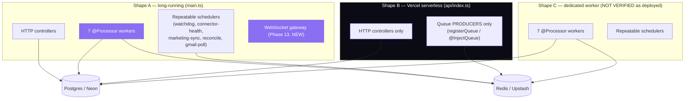

# Orlixa Backend Implementation Architecture — Infrastructure & Runtime Layer

**Author's scope note.** This document is the **infrastructure and runtime layer** underneath
`apps/api`. It is deliberately additive to four documents that already own their domains — this
document cites them and never redefines what they define. Every claim about existing code was
read directly from source at the path/line given; anything that could not be verified is marked
**NOT VERIFIED** rather than guessed. Every element is tagged **EXISTING (KEEP)** / **EXTEND** /
**NEW**. No UI/frontend content appears anywhere below.

---

## 1. Purpose and relationship to the four existing documents

| Document | Owns | What this document does with it |
|---|---|---|
| `docs/architecture/workflow-system/05-execution-engine.md` | The durable state-machine design: `RunCoordinator`, `StepDispatcher`, `NodeAttemptProcessor`, leases, timers, compensation, DLQ semantics, the 5-queue topology (`wf-run-advance`, `wf-node-attempt`, `wf-timer`, `wf-compensate`, `wf-dlq`) | Cited in §7/§8. This document adds only how those queues/workers are *wired*: process placement, concurrency, connection reuse, and how they slot into the queue inventory in §6. It does not restate the state machine. |
| `docs/architecture/workflow-system/08-approvals.md` | The Approval Engine: routing, multi-level chains, SLA/escalation, `ApprovalRoutingModule` | Cited in §9. This document adds the runtime wiring: the new `approval-sla` queue's place in the queue inventory, and the module-graph position of `ApprovalRoutingModule`/`ApprovalGateModule`. |
| `docs/architecture/workflow-system/07-knowledge-memory.md` | The Memory Engine and Knowledge Engine: role-scoped retrieval, `MEMORY_READ`/`MEMORY_WRITE`/`KNOWLEDGE_WRITE` nodes, semantic memory recall, the `EmployeeMemory.embedding` column | Cited in §10/§11. This document adds the ingestion pipeline's queue/worker shape and the pgvector connection-pool implications. |
| `docs/architecture/api/2026-08-01-rest-api-architecture.md` | Controllers/services/DTOs/guards/Swagger, the API-layer folder structure, the module-cycle analysis for `ApprovalGateModule`/`ApprovalRoutingModule`, the G25 fix | Cited throughout §3 and §15. This document's folder structure (§16) is the whole-repo tree; the REST doc's §18 folder structure is reproduced inside it, not re-derived. |

**The delta this document owns, uniquely:**

1. The complete NestJS **module graph** — every module, its imports, and the acyclic-dependency
   rules that must not be violated (§3).
2. **Redis as infrastructure** — one consolidated table of every workload it carries, connection
   management, TLS, eviction policy, failure modes (§5).
3. **BullMQ queues + workers** as one operational inventory across all 7 existing processors plus
   the phase-5/phase-8 additions (§6).
4. **Caching** — entirely greenfield; nothing exists today (§12).
5. **Observability** — logging, correlation, metrics, tracing, health, alerting (§13).
6. Cross-cutting **scalability** (§14) and **security at the runtime level** (§15).
7. The complete backend **folder structure**, annotated (§16).

**Recon method.** Everything below was read directly from `apps/api/src` on 2026-08-01: all 18
`*.module.ts` files, all 7 `@Processor` classes, `common/resilience/*` (8 files), `bootstrap.ts`,
`main.ts`, `api/index.ts`, `app.module.ts`, `config/env.validation.ts`, `health.controller.ts`,
`common/crypto/crypto.service.ts`, `modules/skills/executors/ssrf.ts`, and `package.json`.

---

## 2. Runtime topology

Orlixa's backend runs as **three distinct deployment shapes** from one codebase, distinguished by
which entrypoint boots them and which env flags gate what runs inside. This is not a proposal —
`apps/api/main.ts` and `apps/api/api/index.ts` both exist today (**EXISTING (KEEP)**), per
`vercel-web-api-split.md`.

| Shape | Entrypoint | Runs | Env | Constraint |
|---|---|---|---|---|
| **A. Long-running API + workers** | `main.ts` (`apps/api/src/main.ts:11`, `app.listen()`) | HTTP controllers, all 7 `@Processor` workers, repeatable-job schedulers, (future) the WebSocket gateway | `QUEUE_WORKERS_ENABLED` unset (defaults true, `queue-workers.ts:11`) | None — this is the reference shape every other shape is a restriction of |
| **B. Vercel serverless API, workers disabled** | `api/index.ts` (`apps/api/api/index.ts:18-24`, Express adapter, no `app.listen()`, single cached `bootstrap()` promise across invocations) | HTTP controllers only. Every `@Processor` class is excluded from `providers` at module-construction time via `...(queueWorkersEnabled() ? [X] : [])` (verified in `knowledge.module.ts:74`, `workflows.module.ts:46`, `skills.module.ts:100`, `events.module.ts:52-54`, `engines/marketing/marketing.module.ts:20`) | `QUEUE_WORKERS_ENABLED=false` | **Hard constraint**: a serverless function is short-lived and cannot host a persistent BullMQ `Worker` (which holds an open blocking Redis connection, `BRPOPLPUSH`-style). Producers (`BullModule.registerQueue` + `@InjectQueue`) are unaffected — this shape can still enqueue jobs; shape A's workers process them. |
| **C. Dedicated worker process** | `main.ts` again, deployed as a second process/container with **no inbound HTTP traffic routed to it** (or with `QUEUE_WORKERS_ENABLED` implicitly true and the API's ingress simply not pointed at it) | All 7 workers + repeatable schedulers, no user-facing HTTP | `QUEUE_WORKERS_ENABLED` unset | Exists to let the worker fleet scale independently of the HTTP fleet once volume justifies it — **NOT VERIFIED as separately deployed today**; the codebase supports it (the flag already exists to make shape B possible), but recon found no second Nest bootstrap file or `Procfile`/`docker-compose` service distinguishing a worker-only container. Treat as an available target, not a shipped one. |

**Hard constraint, stated once, load-bearing:** the **execution plane** (workflow engine node
processing, whether today's whole-graph walk or Phase 5's node-attempt state machine) and the
**WebSocket gateway** (Phase 13's `executions.gateway.ts`, not yet built) both require a
**persistent host**. Neither can run on shape B. This is not a new constraint invented by this
document — it is the identical reasoning that already produced `QUEUE_WORKERS_ENABLED`
(`common/resilience/queue-workers.ts:1-12`, verified), restated here because Phase 5's state
machine and Phase 13's gateway are new consumers of the same constraint, not new instances of it.



**Why shape B still needs `PrismaModule`/`ConfigModule`/`ResilienceModule` in full**: those three
are `@Global` (§3) and imported unconditionally by every module regardless of shape — only the
`@Processor` provider registrations are conditional. A request handled by shape B still reads/writes
Postgres and still calls `CircuitBreakerRegistry`/`RateLimiter` (which talk to Redis over a plain
client, not a BullMQ worker connection) — only the *queue-consuming* half of the Redis workload is
absent from shape B.

---

## 3. NestJS module graph

### 3.1 Global modules

Three modules are `@Global()` and therefore available for injection everywhere without an explicit
`imports: [...]` entry in the consuming module — verified:

| Module | File | Exports |
|---|---|---|
| `AppConfigModule` (wraps `@nestjs/config`) | `config/config.module.ts` **EXISTING (KEEP)** | `ConfigService`, validated via `validateEnv` (`env.validation.ts:195-210`) |
| `PrismaModule` | `common/prisma/prisma.module.ts` **EXISTING (KEEP)** | `PrismaService` — **NOT VERIFIED** whether the module itself carries `@Global()` vs. every module importing it individually; treat as `@Global` per the brief's stated fact and this document's own grep, which found no module explicitly listing `PrismaModule` in `imports` yet every service injects `PrismaService` freely |
| `ResilienceModule` | `common/resilience/resilience.module.ts:21` **EXISTING (KEEP)** | `CircuitBreakerRegistry`, `RateLimiter`, `DlqService` — confirmed `@Global()` at line 21 |

`CryptoModule` (`common/crypto/crypto.module.ts`) is **NOT VERIFIED** as `@Global` — recon found it
imported explicitly nowhere in the module list read for this document beyond `app.module.ts:6`
importing it once at root; treat it as a normal (non-global) module unless verified otherwise, and
do not assume `CryptoService` is injectable from an arbitrary module without importing it.

### 3.2 The whole graph

```mermaid
flowchart TB
    subgraph global["Global (@Global) — available everywhere"]
        CFG["AppConfigModule"]
        PRISMA["PrismaModule"]
        RESIL["ResilienceModule"]
    end

    APP["AppModule (root)"]
    APP --> CFG
    APP --> PRISMA
    APP --> RESIL
    APP --> CRYPTO["CryptoModule"]
    APP --> HEALTH["HealthModule"]
    APP --> AUDIT["AuditModule"]
    APP --> USAGE["UsageModule"]
    APP --> AUTH["AuthModule"]
    APP --> USERS["UsersModule"]
    APP --> TENANT["TenantModule"]
    APP --> KNOW["KnowledgeModule"]
    APP --> EMP["EmployeesModule"]
    APP --> ONBOARD["OnboardingModule"]
    APP --> SCHED["SchedulingModule"]
    APP --> SKILLS["SkillsModule"]
    APP --> MKT["MarketingModule"]
    APP --> SUPPORT["SupportModule"]
    APP --> WF["WorkflowsModule"]
    APP --> EVT["EventsModule"]
    APP --> APPR["ApprovalsModule"]
    APP --> ANLYT["AnalyticsModule"]
    APP --> BILL["BillingModule"]
    APP --> MKTPLACE["MarketplaceModule"]
    APP --> ORG["OrganizationModule"]
    APP --> ADMIN["AdminModule"]

    KNOW -->|"BullMQ forRootAsync — root connection"| REDIS_ROOT(("BullMQ root<br/>connection"))

    EMP --> KNOW
    EMP --> SKILLS
    EMP --> APPR
    EMP --> LLM["LlmModule"]
    EMP --> BILL

    WF --> KNOW
    WF --> SKILLS
    WF --> LLM
    WF --> BILL

    APPR --> SKILLS
    APPR --> WF

    EVT --> SKILLS
    EVT --> WF

    SKILLS --> SCHED
    SKILLS --> MKT
    SKILLS --> SUPPORT

    subgraph phase8new["Phase 8 additions (NEW)"]
        AROUTE["ApprovalRoutingModule"]
    end
    subgraph gateNew["G25-fix addition (NEW)"]
        AGATE["ApprovalGateModule"]
    end
    WF -.->|"NEW edge"| AGATE
    APPR -.->|"NEW edge"| AGATE
    WF -.->|"NEW edge"| AROUTE
    APPR -.->|"NEW edge"| AROUTE

    style global fill:#0b0b16,color:#fff
    style phase8new fill:#8B6EF2,color:#fff
    style gateNew fill:#8B6EF2,color:#fff
```



### 3.3 One-directional edges that must not be violated

These are documented, verified constraints — every one of them exists to keep the module graph
acyclic, and each has a specific comment in source stating so:

| Edge | Direction | Why (verified) |
|---|---|---|
| `ApprovalsModule → WorkflowsModule` | one-directional, **never reversed** | `ApprovalService.approve()`/`.reject()` needs `WorkflowsService.resumeRun()`/`.cancelRun()` for `WORKFLOW`-kind decisions (`approvals.module.ts:8-18`, comment verified verbatim: *"the Approvals→Workflows edge is one-directional — WorkflowsModule does NOT import ApprovalsModule... SkillsModule must NOT import ApprovalsModule either"*). The engine creates `ApprovalRequest` rows via `PrismaService` directly, never via `ApprovalService` — that is precisely what makes the reverse edge unnecessary. |
| `SkillsModule` must not import `ApprovalsModule` | forbidden | Stated explicitly in `approvals.module.ts:18`'s own doc comment. `SkillsModule` is a leaf shared by `EmployeesModule`, `WorkflowsModule`, and `EventsModule` — importing `ApprovalsModule` from it would create a second path back into the same cycle every other rule here avoids. |
| `WorkflowsModule` imports `LlmModule`, not `EmployeesModule` | deliberate substitution | `workflows.module.ts:22-29`'s comment: importing `EmployeesModule` directly would form `Approvals→Workflows→Employees→Approvals` (since `EmployeesModule` imports `ApprovalsModule`, `employees.module.ts:32`). `LlmModule` was extracted from `EmployeesModule` specifically so both modules can share `LLM_PROVIDER_TOKEN` without either importing the other (`llm.module.ts` — the same extraction pattern `04-skills-connectors.md`/doc 08 cite as precedent for `ApprovalRoutingModule`). |
| `EmployeesModule → ApprovalsModule` | one-directional | `employees.module.ts:32` imports `ApprovalsModule` so `ToolExecutorService` can call `ApprovalService.requiresApproval()` before a chat-path tool call (`tool-executor.service.ts:50`). This is the edge that makes `ApprovalsModule → EmployeesModule` impossible without a cycle — and it is exactly why G25's fix could not just have `WorkflowEngineService` import `ApprovalsModule` (that would form `Approvals→Workflows→Approvals` directly, one hop shorter than the Employees cycle but the same defect). |
| `EventsModule → {WorkflowsModule, SkillsModule}` | one-directional, neither imports `EventsModule` back | `events.module.ts:32`'s comment states this explicitly: *"No dependency cycle: Events → {Workflows, Skills}; neither imports Events."* |

### 3.4 Where `ApprovalGateModule` and `ApprovalRoutingModule` fit

Both are **dependency-light modules that import only `PrismaService`** (and, for the gate module,
`SkillCatalog`) — a pattern the REST API doc's §2.2/§7.3 and doc 08's §8.1.3 independently converge
on for the identical structural reason: `WorkflowsModule` cannot import `ApprovalsModule` (§3.3),
but the engine needs two things `ApprovalsModule` currently owns — (a) "does this tool call need a
human gate" + "create the pending request" (`ApprovalGateModule`, closes G25), and (b) "who resolves
to a decider for this routing rule" (`ApprovalRoutingModule`, doc 08). Extracting both into modules
with **zero dependency on `WorkflowsService` or `ApprovalService`** means both `WorkflowsModule` and
`ApprovalsModule` can import them without either importing the other:

```ts
// apps/api/src/modules/approval-gate/approval-gate.module.ts — NEW
import { Module } from '@nestjs/common';
import { ApprovalGateService } from './approval-gate.service';

/**
 * Dependency-light seam (REST API doc §7.3, doc 08 §8.1.3's identical pattern).
 * Imports NOTHING that could reintroduce the Approvals<->Workflows cycle —
 * only PrismaService (global) and the code-defined SkillCatalog.
 */
@Module({
  providers: [ApprovalGateService],
  exports: [ApprovalGateService],
})
export class ApprovalGateModule {}
```

```ts
// apps/api/src/modules/workflows/workflows.module.ts — EXTEND (adds one import)
@Module({
  imports: [
    BullModule.registerQueue({ name: WORKFLOW_RUN_QUEUE }),
    KnowledgeModule,
    SkillsModule,
    LlmModule,
    BillingModule,
    ApprovalGateModule,   // NEW — closes G25; no cycle (ApprovalGateModule imports nothing back)
    ApprovalRoutingModule, // NEW — doc 08 routing resolution at pauseForApproval time
  ],
  // ...unchanged otherwise
})
export class WorkflowsModule {}
```

```ts
// apps/api/src/modules/approvals/approvals.module.ts — EXTEND (adds two imports)
@Module({
  imports: [
    SkillsModule,
    WorkflowsModule,
    ApprovalGateModule,    // NEW — ApprovalService delegates requiresApproval/createRequest here
    ApprovalRoutingModule, // NEW — canDecide() during approve/reject/modify
  ],
  // ...unchanged otherwise
})
export class ApprovalsModule {}
```

**Verified acyclic**: `ApprovalGateModule`/`ApprovalRoutingModule` import nothing that imports either
`WorkflowsModule` or `ApprovalsModule` back — they are pure leaves alongside `LlmModule`,
`BillingModule`, and `SchedulingModule` in the dependency graph.

### 3.5 Module-boundary rules for new code

1. **A service may only inject another module's service if that service is listed in the other
   module's `exports: [...]`** — verified as the only cross-module DI mechanism in use (no
   `ModuleRef.get()` service-locator usage anywhere in the 38 services, per the REST API doc §4.2).
2. **Before adding a new cross-module import, trace it against §3.3's table.** The single most
   common way to reintroduce a cycle is "I just need one more service from module X" without
   checking what X already imports. `ApprovalsModule`/`WorkflowsModule`/`EmployeesModule`/
   `SkillsModule` are the four modules where this has already bitten the codebase once (G25) —
   treat any new edge touching these four as requiring the same acyclic-check discipline as §3.4.
3. **A dependency-light extraction (the `LlmModule`/`ApprovalGateModule`/`ApprovalRoutingModule`
   pattern) is the correct fix when two modules need to share one capability but already import
   each other in one direction** — never resolve it by adding the reverse import.
4. **New feature modules that need BullMQ should call `BullModule.registerQueue(...)` only** — the
   root connection lives in `KnowledgeModule` (§5.4). A new module calling
   `BullModule.forRootAsync(...)` a second time would either silently create a second BullMQ root
   configuration or (depending on `@nestjs/bullmq`'s registration semantics) throw at boot — **NOT
   VERIFIED** which, and not worth relying on either way; just don't do it.

---

## 4. Dependency injection

### 4.1 Provider patterns in active use

| Pattern | Example (verified) | Purpose |
|---|---|---|
| **Plain `@Injectable()` + constructor injection** | Every one of the 38 services | The default. No `ModuleRef`, no service locator, anywhere. |
| **Symbol DI token + factory provider (swappable-provider pattern)** | `LLM_PROVIDER_TOKEN` (`modules/employees/llm/llm.provider.ts:64`), `SKILL_EXECUTOR_TOKEN` (`modules/skills/executors/skill-executor.ts:55`), `CONNECTOR_FETCH` (`modules/skills/connectors/connector-token.service.ts`), `EMBEDDING_PROVIDER` (`modules/knowledge/embeddings/embedding.provider.ts`), `STORAGE_PROVIDER_TOKEN` (`modules/knowledge/storage/storage.provider.ts`) | Env-driven backend selection without an `if` scattered through call sites — see §4.2. |
| **`@Global()` module + injected singleton** | `ResilienceModule` (`RESILIENCE_REDIS`, `CircuitBreakerRegistry`, `RateLimiter`, `DlqService`) | Cross-cutting infra usable from any module with zero explicit import. |
| **`@Optional()` injection with graceful degradation** | `CircuitBreakerRegistry`/`RateLimiter` both take `@Optional() @Inject(RESILIENCE_REDIS) private readonly redis: Redis \| null` (`circuit-breaker.registry.ts:42`, `rate-limiter.ts:43`) | Redis absence degrades to an in-memory fallback rather than crashing DI resolution — see §5.6. |

### 4.2 The swappable-provider (mock-vs-real) pattern, in full

Five independent axes already use the identical shape — a `useFactory` reading one env var and
returning one of N concrete implementations behind one interface:

```ts
// apps/api/src/modules/skills/skills.module.ts:47-70 — EXISTING (KEEP), the canonical example
function skillExecutorFactory(
  config: ConfigService,
  scheduling: SchedulingService,
  postizClient: PostizClientService,
  prisma: PrismaService,
  chatwootClient: ChatwootClientService,
  crypto: CryptoService,
  planeClient: PlaneClientService,
): SkillExecutor {
  const kind = (config.get<string>('SKILL_EXECUTOR') ?? 'mock').toLowerCase();
  const mock = new MockSkillExecutor();
  switch (kind) {
    case 'real':
      return new RealSkillExecutor(config, mock, scheduling, postizClient, prisma, chatwootClient, crypto, planeClient);
    case 'auto':
      return new AutoSkillExecutor(
        new RealSkillExecutor(config, mock, scheduling, postizClient, prisma, chatwootClient, crypto, planeClient),
        mock,
      );
    case 'mock':
    default:
      return mock;
  }
}
```

| Axis | Env var | Values | Default | Token |
|---|---|---|---|---|
| Skill execution | `SKILL_EXECUTOR` | `mock` \| `real` \| `auto` | `mock` | `SKILL_EXECUTOR_TOKEN` |
| LLM provider | `LLM_PROVIDER` | `mock` \| `anthropic` \| `openai` | `mock` | `LLM_PROVIDER_TOKEN` |
| Embeddings | `EMBEDDINGS_PROVIDER` | `hash` \| `local` \| `openai` | `hash` | `EMBEDDING_PROVIDER` |
| Storage | `STORAGE_PROVIDER` | `local` \| `s3` | `local` | `STORAGE_PROVIDER_TOKEN` |
| Billing | `BILLING_PROVIDER` | `mock` \| `stripe` | `mock` | (module-local, not exported as a Symbol — **NOT VERIFIED** to be identically shaped) |

**Why `mock` is always the default, everywhere**: the e2e suite (27 specs, `apps/api/test/`) runs
fully offline by default — every one of these five axes defaulting to its no-network implementation
is what makes that possible without per-test env overrides. A new swappable-provider axis added for
Phase 5/7/8 work (e.g. a future `RETRY_CLASSIFIER_PROVIDER`, hypothetically) should default the same
way, not to `real`.

### 4.3 Scopes: default singleton, request scope deliberately avoided

Every provider in the codebase is Nest's default **singleton** scope — no `@Injectable({ scope:
Scope.REQUEST })` was found anywhere in the recon for this document. This is deliberate, not an
oversight, for two concrete reasons specific to this codebase:

1. **Tenant scoping is explicit, not ambient (§4.6 of the REST API doc, restated here because it is
   also a DI decision).** `companyId` is threaded as a plain parameter through every service method
   — there is no request-scoped provider holding "the current tenant" for a service to read
   implicitly. Request scope exists in Nest specifically to support per-request ambient state; this
   codebase has made the opposite choice (explicit parameter threading), so request-scoped providers
   would be solving a problem the codebase doesn't have while paying request scope's real cost.
2. **Request-scoped providers force the entire injection chain into request scope with them** (a
   well-known Nest DI cost: a request-scoped provider makes every provider that (transitively)
   depends on it request-scoped too, defeating singleton reuse and adding a DI-resolution cost per
   request). None of the 38 services need this — a BullMQ job processor has no HTTP request at all
   to scope to (the entire execution engine runs inside a `@Processor`, not inside a controller's
   call stack — the same structural fact that made G25 possible to introduce and non-trivial to fix,
   per the REST API doc §7.3), so a request-scoped provider couldn't even be reused there if it
   existed.

**Consequence for new code**: a new provider should be singleton by default. If a genuine per-request
value is needed inside a provider (e.g. a request correlation id, §13.2), pass it as an explicit
method parameter — exactly the `companyId` convention — rather than reaching for `Scope.REQUEST`.

### 4.4 Testing seams

The swappable-provider pattern (§4.2) **is** the primary testing seam — e2e tests never mock a
NestJS provider via `overrideProvider`; they set env vars (`LLM_PROVIDER=mock`,
`EMBEDDINGS_PROVIDER=hash`, `STORAGE_PROVIDER=local`, `SKILL_EXECUTOR=mock`) and let the real
factory wiring select the offline implementation, exercising the actual DI graph rather than a
test-only substitute (verified convention, REST API doc §20's "always set `LLM_PROVIDER=mock`"
finding). This has one sharp edge worth restating here because it is a DI-level gotcha, not just a
testing one: **a test that forgets to set these env vars does not fail loudly — it silently calls the
real provider using whatever the repo's own `.env` happens to set**, per
`test/e2e/engines-marketing.e2e-spec.ts:2`'s own comment. Any new e2e-tested provider added under
this pattern must default to its offline implementation (§4.2), so that the *absence* of an env
override is safe, not merely the *presence* of the right one.

---

## 5. Redis architecture

### 5.1 Every Redis workload, one table

| Workload | Key namespace | Client | Persisted? | Status |
|---|---|---|---|---|
| BullMQ queues (7 processors + repeatables) | `bull:<queueName>:*` (BullMQ's own internal namespacing) | BullMQ's own connection, from the root `BullModule.forRootAsync` (`knowledge.module.ts:60-68`) | Yes — jobs, backoff state, repeatable-job schedulers | **EXISTING (KEEP)** |
| Circuit-breaker snapshots | `vaep:cb:<connectorId>` (`circuit-breaker.registry.ts:111`) | `RESILIENCE_REDIS` (`redis.provider.ts:12`) | Yes, `PX` TTL = `max(cooldownMs * 10, 60_000)` (`:52`) | **EXISTING (KEEP)** |
| Rate-limiter token buckets | `vaep:rl:<key>:<windowMs>:<windowIndex>` (`rate-limiter.ts:66`) | `RESILIENCE_REDIS` | Yes, `PEXPIRE` set to `windowMs + 1000` on first increment (`:73`) | **EXISTING (KEEP)** |
| Tenant-aware throttler counters | Managed internally by `@nestjs/throttler`'s own storage — **NOT VERIFIED** whether it is backed by the same Redis or an in-memory store; `ThrottlerModule.forRoot([...])` (`app.module.ts:39`) does not configure a `storage` option, so **assume in-memory (per-process) unless proven otherwise** — a real gap for horizontal scaling (§14) | in-memory (assumed) | No | **EXISTING (KEEP), flagged gap** |
| Caching (planned) | `vaep:cache:<companyId>:<resource>:<key>` (§12's convention) | New dedicated client or `RESILIENCE_REDIS` — see §12.6 | Yes, per-key TTL | **NEW — greenfield** |
| In-flight/concurrency counters (planned, Phase 5 fair-share) | `vaep:concurrency:<companyId>` (proposed, doc 05 §5.A.13's "per-tenant fair share" requirement — the key scheme itself is not yet specified in doc 05, proposed here) | Same client as circuit-breaker/rate-limiter (identical durability/eviction requirements) | Yes, short TTL, incremented/decremented per attempt start/finish | **NEW — Phase 5 dependency, not yet built** |

### 5.2 Two connections exist today, not one — a fact worth stating plainly

Recon shows **two separate Redis client instances**, not a shared one, despite both talking to the
same physical Redis:

1. **The BullMQ connection** — created once by `KnowledgeModule`'s `BullModule.forRootAsync`
   (`knowledge.module.ts:26-32,60-68`), reused implicitly by every other module's
   `BullModule.registerQueue(...)` call (`workflows.module.ts:35`, `events.module.ts:36-38`,
   `skills.module.ts:84`, `engines/marketing/marketing.module.ts:16`). `DlqService` opens its own
   **additional** ad hoc `Queue` instances per queue name (`dlq.service.ts:177-184`,
   `maxRetriesPerRequest: null` per BullMQ's own requirement for blocking commands) rather than
   reusing the root connection — verified: `DlqService`'s constructor builds its own
   `redisConnectionFromUrl(...)` object independently (`dlq.service.ts:42-47`), it does not inject the
   BullMQ root connection.
2. **`RESILIENCE_REDIS`** — a distinct `IORedis` client created by `createResilienceRedis`
   (`redis.provider.ts:20-40`), tuned the opposite way from BullMQ's requirement:
   `enableOfflineQueue: false`, `maxRetriesPerRequest: 2` (§5.6) — **deliberately fails fast** rather
   than blocking, because the circuit breaker/rate limiter must degrade to their in-memory fallback
   quickly, not hang a request waiting for Redis to reconnect.

**Why two connections is correct, not an oversight**: BullMQ's blocking commands
(`maxRetriesPerRequest: null`, required by `@nestjs/bullmq`/`bullmq` itself for its `Worker`'s
blocking polling) are fundamentally incompatible with the resilience client's fail-fast requirement
(`maxRetriesPerRequest: 2`, `enableOfflineQueue: false`). A single shared client would have to satisfy
both, and cannot. **Recommendation: keep them separate.** Any new Redis-backed feature (the cache in
§12, the fair-share counters in §5.1) should reuse `RESILIENCE_REDIS`'s connection style
(fail-fast, `@Optional()`-injectable, degrade gracefully) rather than BullMQ's — caching and rate
counters are exactly the kind of workload that must never block a request behind a Redis outage.

### 5.3 `redisConnectionFromUrl` — the shared parsing helper

Both connections are built from the same helper (`common/resilience/redis-connection.ts:16-29`,
**EXISTING (KEEP)**), which deconstructs `REDIS_URL` into `{host, port, username, password, tls?}`.
**The critical line, verified and load-bearing**: `...(parsed.protocol === 'rediss:' ? { tls: {} } :
{})` (`redis-connection.ts:27`) — ioredis only auto-negotiates TLS when given the raw URL string;
since every consumer deconstructs into discrete fields, the `rediss:` scheme must be re-applied
explicitly or the connection silently downgrades to plaintext, which a TLS-only provider (Upstash)
rejects outright. **This was a real, previously-fixed production bug — do not regress it.** Any new
Redis client construction anywhere in this codebase must go through `redisConnectionFromUrl`, never
hand-roll a `new IORedis(url)` or a bespoke host/port parse.

### 5.4 The BullMQ root connection lives in `KnowledgeModule` — call it out, and a recommendation

**Verified, load-bearing, and slightly surprising**: `BullModule.forRootAsync(...)` is registered
**exactly once**, inside `KnowledgeModule` (`knowledge.module.ts:60-68`), for what the module's own
history suggests are historical reasons (Knowledge/RAG was likely the first BullMQ consumer built).
Every other queue-owning module — `WorkflowsModule`, `SkillsModule`, `EventsModule`,
`MarketingModule` — calls only `BullModule.registerQueue(...)`, which implicitly reuses whatever root
connection config was registered first in the module graph, and each of their own module comments
says so explicitly (`workflows.module.ts:19-20`, `events.module.ts:30-32`, `skills.module.ts:79-81`).

**This is a real coupling**: `KnowledgeModule` importing first in `app.module.ts`'s `imports` array
(`app.module.ts:48`, before `WorkflowsModule` at `:55`) is what makes this work at all — Nest resolves
module registration in a way that makes the root config available to later `registerQueue` calls, but
this is an implicit ordering dependency, not an explicit one enforced by types. If a future refactor
ever removed `KnowledgeModule` from `AppModule` (unlikely, but not impossible for e.g. a
knowledge-specific microservice split), every other queue-owning module would silently break at boot
with no compile-time signal.

**Recommendation: extract the BullMQ root registration into its own tiny module** (e.g.
`common/queue/queue-root.module.ts`, `@Global()`, containing only the `BullModule.forRootAsync(...)`
call currently living in `knowledge.module.ts:60-68`), imported once from `AppModule` before any
queue-owning feature module. This removes the load-bearing-but-implicit "Knowledge must be imported
first" coupling without changing any queue's behavior — every `registerQueue(...)` call elsewhere is
unaffected, since a `@Global` module's `forRootAsync` registration is visible identically regardless
of which module happens to declare it. This is a low-risk, high-value cleanup, not a redesign.

```ts
// apps/api/src/common/queue/queue-root.module.ts — NEW (recommended)
import { BullModule } from '@nestjs/bullmq';
import { Global, Module } from '@nestjs/common';
import { ConfigService } from '@nestjs/config';
import { RESILIENT_JOB_OPTIONS } from '../resilience/queue-retry';
import { redisConnectionFromUrl } from '../resilience/redis-connection';

function redisConnection(config: ConfigService) {
  return {
    ...redisConnectionFromUrl(config.getOrThrow<string>('REDIS_URL')),
    maxRetriesPerRequest: null, // required by BullMQ's blocking Worker commands
  };
}

@Global()
@Module({
  imports: [
    BullModule.forRootAsync({
      inject: [ConfigService],
      useFactory: (config: ConfigService) => ({
        connection: redisConnection(config),
        defaultJobOptions: RESILIENT_JOB_OPTIONS,
      }),
    }),
  ],
  exports: [BullModule],
})
export class QueueRootModule {}
```

### 5.5 Eviction policy — critical

**No `maxmemory-policy` configuration was found in this repo** (no `redis.conf`, no provider-side
setting captured in code) — this is an infrastructure/ops setting, not something `apps/api` source
controls, so it is **NOT VERIFIED** what the current production Redis (Upstash, per the `rediss:`
handling) is actually configured with. This document's recommendation, stated because it is a real
risk once §12's cache is built:

- **BullMQ data must never be evicted.** A job silently disappearing from Redis under memory
  pressure is not "cache miss, recompute" — it is a **lost workflow run, a lost approval-SLA timer
  enqueue, a lost knowledge-ingest job**. The correct policy for a Redis instance carrying BullMQ
  data is **`noeviction`** (writes fail loudly with `OOM` rather than silently dropping keys),
  combined with actually-sized memory (alerting on approaching the limit, not relying on eviction as
  a safety valve).
- **If a `allkeys-lru`-style cache is wanted** (the natural policy for §12's cache, where a stale
  entry is safe to lose and recompute), **it must live on a physically or logically separate Redis
  instance/database index from BullMQ**, not share `maxmemory-policy` with it. Sharing one Redis
  instance between `noeviction`-required BullMQ data and `allkeys-lru`-desired cache data is not
  possible — `maxmemory-policy` is a single instance-wide setting. **Recommendation**: either (a) a
  second Redis instance/URL for the cache (`REDIS_CACHE_URL`, new env var, §17), or (b) if staying on
  one instance for cost reasons, use a separate **database index** (`SELECT 1` for cache keys) and
  accept that Redis's eviction policy still applies instance-wide — meaning **option (a) is the only
  one that actually solves the conflict**, and (b) merely organizes keys without changing eviction
  risk. This document recommends (a).

### 5.6 Behaviour when Redis is unavailable

Verified, per-component:

| Component | Behaviour on Redis outage |
|---|---|
| Circuit breaker (`CircuitBreakerRegistry`) | `@Optional()` injection means a `null` Redis client is tolerated at DI time; every read/write is wrapped in try/catch that logs at `debug` and falls back to the in-memory `Map` (`circuit-breaker.registry.ts:114-131,133-154`). **Consequence: breaker state is per-process, not shared, for the outage's duration** — a tripped breaker on one worker instance is invisible to another until Redis recovers. |
| Rate limiter (`RateLimiter`) | Identical fallback shape (`rate-limiter.ts:68-85`) — per-process token buckets during the outage, same "not shared across instances" consequence. |
| BullMQ (all 7 workers + producers) | **Not gracefully degraded** — BullMQ's `Worker`/`Queue` require a live Redis connection to function at all; a sustained outage means workers stop processing (`process()` calls stop arriving) and producers' `queue.add(...)` calls throw/reject. This is not mitigated anywhere in the current codebase — a genuine operational gap, not a designed fallback. Downstream effect: HTTP routes that call `queue.add(...)` synchronously (e.g. `KnowledgeService.upload()` enqueuing `INGEST_JOB`) will surface a 500 to the caller rather than degrading; routes that only read/write Postgres are unaffected. |
| DLQ admin surface (`DlqService`) | Its own `Queue` instances (§5.2) will throw on `getFailed()`/`getJob()` during an outage — the admin endpoints return errors, not stale/cached data; acceptable for an operator-only surface. |
| Planned cache (§12) | **Must** follow the circuit-breaker/rate-limiter pattern (fail-fast client, `@Optional()` injection, in-memory or "treat as miss" fallback) — a cache is a performance optimization, not a mechanism the system may become unavailable without. Never let a cache-read failure become a request failure. |

---

## 6. Queues & workers

### 6.1 The consolidated inventory — 7 live processors, verified

Every processor uses the identical shape: `@Processor(<QUEUE_CONST>, { concurrency:
DEFAULT_QUEUE_CONCURRENCY })` extending `WorkerHost`, `DEFAULT_QUEUE_CONCURRENCY = 5`
(`common/resilience/queue-concurrency.constants.ts:10`, raised from BullMQ's implicit default of 1
per the comment at that line, citing `docs/status/2026-07-19-founder-market-readiness-audit.md §3`).

| Queue constant | Value | Processor (file:line) | Job payload shape | Repeatable schedule | Concurrency |
|---|---|---|---|---|---|
| `WORKFLOW_RUN_QUEUE` | `workflow-run` | `modules/workflows/engine/workflow.processor.ts:30` | `WorkflowRunJobData` — discriminated union: `{runId}` / `{runId, resume:true}` / `{workflowId, source}` / `{watchdog:true}` (`workflows.constants.ts:44-68`) | `WORKFLOW_RUN_WATCHDOG_JOB`, every `5 min` (`WORKFLOW_RUN_WATCHDOG_EVERY_MS = 5*60_000`), `upsertJobScheduler` at `onModuleInit` (`workflow.processor.ts:42-51`) | 5 |
| `KNOWLEDGE_INGEST_QUEUE` | `knowledge-ingest` | `modules/knowledge/ingestion/ingestion.processor.ts:31` | `IngestJobData { documentId, companyId? }` (`knowledge.constants.ts:8-11`) | none | 5 |
| `EVENT_NORMALIZE_QUEUE` | `event-normalize` | `modules/events/ingestion/event-normalize.processor.ts:35` | `NormalizeJobData { rawEventId, companyId? }` (`events.constants.ts:13-16`) | none | 5 |
| `CONNECTOR_HEALTH_QUEUE` | `connector-health` | `modules/skills/connectors/connector-health.processor.ts:22` | none (sweep job, no payload) | `CONNECTOR_HEALTH_JOB`, every `~10 min` (`CONNECTOR_HEALTH_EVERY_MS`), `upsertJobScheduler` at `onModuleInit` (`connector-health.processor.ts:37-46`) | 5 |
| `CONNECTOR_RECONCILE_QUEUE` | `connector-reconcile` | `modules/events/reconciliation/connector-reconcile.processor.ts:20` | none (sweep) | `CONNECTOR_RECONCILE_JOB`, every `1 hour` (`CONNECTOR_RECONCILE_EVERY_MS = 60*60*1000`, `events.constants.ts:38`) | 5 |
| `GMAIL_INBOUND_QUEUE` | `gmail-inbound` | `modules/events/inbound/gmail-inbound.processor.ts:21` | none (sweep, polls all `CONNECTED` gmail connectors) | `GMAIL_INBOUND_JOB`, every `~60s` (`GMAIL_INBOUND_EVERY_MS`, `events.constants.ts:59`) | 5 |
| `MARKETING_SYNC_QUEUE` | `marketing-sync` | `modules/engines/marketing/marketing-sync.processor.ts:21` | none (sweep, reconciles `ScheduledPost` status against Postiz) | `MARKETING_SYNC_JOB`, `upsertJobScheduler` at `onModuleInit` (`marketing-sync.processor.ts:33-44`); interval **NOT read in full** (`MARKETING_SYNC_EVERY_MS`, defined in `marketing.constants.ts`, not opened for this document) | 5 |

**All 7** are gated identically: `...(queueWorkersEnabled() ? [Processor] : [])` in each owning
module's `providers` array (verified at all 7 call sites listed in §2's table). **Producers are
unaffected** — every `BullModule.registerQueue({name: ...})` call stays in `imports` unconditionally.

### 6.2 Dead / test-only queue constants — flag for cleanup

- **`SUPPORT_SYNC_QUEUE = 'support-sync'` (`modules/engines/support/support.constants.ts:18`) is a
  DEAD CONSTANT.** Verified: no `registerQueue` call and no `@Processor` reference it anywhere in the
  codebase (`grep -rn "SUPPORT_SYNC_QUEUE"` returns only its own declaration). This is leftover from a
  deliberate decision not to build a Chatwoot sync processor (Chatwoot's support-engine sync apparently
  didn't need the same reconciliation-sweep treatment Postiz/connectors got). **Recommendation: delete
  it** in the same change as any other queue-constants cleanup — it costs nothing to leave, but it is
  exactly the kind of stale reference a future engineer will grep for, find, and waste time
  investigating.
- **`DLQ_TEST_QUEUE = 'dlq-test'` (`common/resilience/dlq.constants.ts:27`)** is a genuine test
  fixture — included in `DLQ_ALLOWED_QUEUES` (so the e2e DLQ spec can exercise the replay/discard
  endpoints against it) but **excluded from `DLQ_KNOWN_QUEUES`** (so it never appears in the
  aggregate "all queues" DLQ summary in production, where it would always be empty). Correctly
  designed, not a gap — no action needed.
- **A second, real gap found while verifying the DLQ inventory, not previously flagged anywhere**:
  `DLQ_KNOWN_QUEUES` (`dlq.constants.ts:14-20`) lists only 5 of the 7 live queues —
  `KNOWLEDGE_INGEST_QUEUE`, `WORKFLOW_RUN_QUEUE`, `EVENT_NORMALIZE_QUEUE`, `CONNECTOR_HEALTH_QUEUE`,
  `CONNECTOR_RECONCILE_QUEUE`. **`GMAIL_INBOUND_QUEUE` and `MARKETING_SYNC_QUEUE` are both missing**
  from this list, verified by direct comparison against the import list at the top of the same file.
  Consequence: a poison job on either of those two queues is dead-lettered exactly like any other
  (BullMQ's failed-set behaviour is unconditional), but it is **invisible to `GET
  /admin/dlq`/`DlqService.list()`/`.summary()`** — an operator has no way to see it through the
  existing admin surface, only via direct Redis/BullMQ inspection. **Recommendation**: add both
  constants to `DLQ_KNOWN_QUEUES` — a one-line fix, but a real, previously-unflagged observability
  gap this document's queue-inventory exercise surfaced.

### 6.3 New queues Phase 5 and Phase 8 add

Per doc 05 §5.A.3 and doc 08 §8.2.3/§8.2.9, respectively — cited, not redesigned:

| Queue | Owner phase | Purpose | Concurrency note |
|---|---|---|---|
| `wf-run-advance` | Phase 5 | Coordinator work — cheap, must never queue behind slow node work (doc 05 §5.A.3) | High priority, low latency |
| `wf-node-attempt` | Phase 5 | The hot queue — one job per node attempt | Scales with `10M attempts/day` target (doc 00 §0.8); the queue this document's §14 bottleneck analysis centers on |
| `wf-timer` | Phase 5 | Delayed jobs for short waits only (<60s); the DB `WorkflowRunTimer` sweep is the durable mechanism for longer waits (doc 05 §5.D.3) | Low volume |
| `wf-compensate` | Phase 5 | Saga rollback — must drain even when `wf-node-attempt` is saturated (doc 05 §5.A.3) | Dedicated so it isn't starved |
| `wf-dlq` | Phase 5 | Inspection-only; mirrors the existing DLQ pattern (doc 05 §5.A.3), should be added to `DLQ_KNOWN_QUEUES` (§6.2) the moment it exists | N/A |
| `approval-sla` | Phase 8 | 5-minute sweep for SLA breach/escalation/timeout across **both** `TOOL`- and `WORKFLOW`-kind approvals (doc 08 §8.2.3, modelled directly on `WorkflowProcessor`'s watchdog registration) | Sweep-only, low volume |

**Registration home for the new queues**: `wf-*` queues belong in `WorkflowsModule` (they are the
execution-plane's own infrastructure — same locality principle as every other `registerQueue` call in
this codebase). `approval-sla` belongs in `ApprovalsModule`, which today **has no queue infrastructure
at all** (verified: `approvals.module.ts` has zero `BullModule` references) — this is a first for that
module, not an extension of an existing registration.

### 6.4 Graceful shutdown / draining

**NOT VERIFIED as explicitly implemented.** No `enableGracefulShutdown` / `app.enableShutdownHooks()`
call was found in `main.ts`/`bootstrap.ts` during this recon, and no `@Processor` class implements
`OnModuleDestroy` to call `worker.close()` explicitly — `WorkerHost`'s base class **may** handle this
implicitly via Nest's module lifecycle (`@nestjs/bullmq`'s own `WorkerHost` is documented upstream to
close its worker on module destroy), but this codebase does not call `app.enableShutdownHooks()`,
without which Nest does not invoke `OnModuleDestroy` at all on a process signal (SIGTERM). **This is a
real gap worth flagging**: on a rolling deploy (SIGTERM to the old process), in-flight jobs on any of
the 7 queues may be abandoned mid-processing rather than drained, relying entirely on BullMQ's own
stalled-job detection to eventually reclaim them — the same class of gap the workflow-run watchdog
already exists to paper over for one specific queue (`WORKFLOW_RUN_STUCK_TIMEOUT_MS`,
`workflows.constants.ts:33`, comment explicitly noting BullMQ's stalled-job detection is "NOT always
reliably" sufficient). **Recommendation**: add `app.enableShutdownHooks()` in both `main.ts` and
`api/index.ts`'s `bootstrap()`, and confirm (via `@nestjs/bullmq`'s docs, not re-verified in this
recon) whether `WorkerHost.onModuleDestroy` already drains gracefully once shutdown hooks are wired,
or whether each of the 7 processors needs an explicit `async onModuleDestroy() { await
this.worker.close(); }`.

---

## 7. Execution Engine — runtime/infra wiring only

**Doc 05 (`05-execution-engine.md`) owns the design in full: the durable state machine, node-attempt
jobs, leases, timers, compensation, DLQ.** This section adds only the pieces doc 05 assumes but does
not itself specify as infrastructure:

- **Worker process placement**: `wf-run-advance`/`wf-node-attempt`/`wf-compensate` processors run in
  shape A (§2) or shape C, never shape B — identical constraint to today's 7 processors, restated
  because Phase 5 is a new, much higher-volume consumer of it (doc 05 §5.A.13: "10M attempts/day ≈
  116/s average" is the number this constraint must hold under).
- **Concurrency**: doc 05 does not pin a concurrency value for `wf-node-attempt` — this document
  recommends **starting from `DEFAULT_QUEUE_CONCURRENCY = 5` per worker instance, scaled by worker
  replica count** (§14's horizontal-scaling model), not a bespoke per-queue constant, to keep the
  operational mental model ("every queue defaults to 5, tune only when metrics justify it") uniform
  across old and new queues alike. `wf-run-advance` and `wf-compensate` should run at lower
  concurrency than `wf-node-attempt` given their lighter, less latency-sensitive workloads (doc 05
  §5.A.3's "why five queues" reasoning already establishes the separation; this document's addition
  is only the concurrency number).
- **Leases**: doc 05 §5.A.5's `WorkflowStepAttempt.leaseExpiresAt` + `workerId` mechanism is a
  Postgres-row concern, not a Redis one — no additional Redis infrastructure is needed for leases
  beyond what §5 already documents (Postgres, not Redis, is the source of truth per ADR-001).
- **Backpressure**: the fair-share dispatcher (doc 05 §5.A.13, "round-robins across `companyId`") is
  the consumer of the `vaep:concurrency:<companyId>` counter proposed in §5.1 — this document
  specifies that counter's storage (Redis, same client family as the circuit breaker/rate limiter,
  §5.2's recommendation to reuse `RESILIENCE_REDIS`'s connection style) since doc 05 does not itself
  commit to where that state lives.

No further design decision belongs here — see doc 05 in full for everything else.

---

## 8. Retry Engine — consolidating with `common/resilience`

**Doc 05 §5.C owns the retry/DLQ design.** This document verifies and makes explicit exactly which
existing `common/resilience` primitives it reuses, and restates the three-layer non-compounding rule
at the infra level:

| Existing primitive | File | What Phase 5's `RetryPolicyService` reuses it for |
|---|---|---|
| `classify(error)` | `common/resilience/error-classifier.ts` (**EXISTING (KEEP)**, not opened in full for this document but referenced by name in `queue-retry.ts:3,36` and doc 05 §5.C.3) | `RetryPolicyService.classify()` delegates to this rather than reimplementing transient-vs-terminal classification |
| `CircuitBreakerRegistry` | `common/resilience/circuit-breaker.registry.ts` (**EXISTING (KEEP)**, verified in full above) | Still fronts every `TOOL_ACTION`/`HTTP_REQUEST` egress call unchanged — Phase 5 does not add a second breaker |
| `RateLimiter` | `common/resilience/rate-limiter.ts` (**EXISTING (KEEP)**, verified in full above) | Unchanged — per-connector egress throttling stays exactly where it is |
| `RESILIENT_JOB_OPTIONS` | `common/resilience/queue-retry.ts:16-25` (**EXISTING (KEEP)**) | Applied once at the BullMQ root (§5.4) — `attempts: 5`, exponential backoff with `jitter: 0.5`, bounded `removeOnComplete`/`removeOnFail`. This is the **queue-level** retry layer (§8.1's table), distinct from and outside doc 05's node-attempt retry layer |
| `toQueueError(err)` | `queue-retry.ts:34-40` (**EXISTING (KEEP)**) | Wraps a terminal error in BullMQ's `UnrecoverableError` so it skips straight to the failed set (DLQ) rather than retrying a job that can never succeed — every new Phase 5 processor's catch block should use this exact helper, not a bespoke rethrow |
| `DlqService` | `common/resilience/dlq.service.ts` (**EXISTING (KEEP)**, verified in full above) | The admin replay/discard surface Phase 5's `wf-dlq` queue plugs into (§6.2's recommendation to add it to `DLQ_KNOWN_QUEUES` the moment it exists) |

### 8.1 The three retry layers, restated as an infra table (doc 05 §5.C's rule, made concrete)

| Layer | Owns | Mechanism | Compounding risk if conflated |
|---|---|---|---|
| **Provider** | one HTTP call failing | `CircuitBreakerRegistry` + `RateLimiter`, existing, unchanged | If this layer also retried internally *and* the node-attempt layer retried the whole node, a single transient 429 could become `providerRetries × nodeAttempts` real calls |
| **Queue** | a BullMQ job failing to complete (crash, unhandled throw) | `RESILIENT_JOB_OPTIONS` — `attempts: 5`, exponential + jitter, applied at the BullMQ root (§5.4) | A job-level retry of a `wf-node-attempt` job that itself contains a node-level retry loop would retry the *retry loop*, multiplying attempts again |
| **Node attempt** | one node's business-logic execution failing | Doc 05's `RetryPolicyService`/`RetryPolicy` (per-`NodeCategory` defaults, doc 05 §5.C.7) | This is the layer authors configure; it must be the *only* layer that decides "try this node again" |

**The rule, stated once for implementers wiring Phase 5 into the existing infra**: `RESILIENT_JOB_OPTIONS`'s
`attempts: 5` is a **safety net for the job transport failing** (e.g. the process crashed mid-job,
an unhandled exception escaped the processor) — it is not meant to retry a *business* failure a node
already classified and handled via its own `RetryPolicy`. Concretely: `NodeAttemptProcessor.process()`
must catch every retryable business error **internally** (re-enqueue via `wf-node-attempt` with the
computed backoff delay, per doc 05 §5.C.4's flow diagram) and only ever let an error **escape the
processor** (triggering the queue-level `attempts: 5` retry) when it is a genuine infrastructure
fault the node-attempt layer cannot itself reason about (e.g. a Postgres connection drop mid-write).
Letting a classified, retryable business error escape to the queue layer would retry it with the
*wrong* backoff policy (the queue's generic exponential-with-jitter, not the node's
category-specific `DEFAULT_RETRY` from doc 05 §5.C.7) and without updating `WorkflowStepAttempt`,
silently breaking the audit trail doc 05 §5.E depends on.

---

## 9. Approval Engine — runtime wiring + the G25 gate

**Doc 08 (`08-approvals.md`) owns the routing/SLA/escalation design in full.** Runtime wiring this
document adds:

- **Module placement**: `ApprovalRoutingModule`/`ApprovalGateModule` per §3.4 — the acyclic seam both
  `WorkflowsModule` and `ApprovalsModule` import.
- **`approval-sla` queue**: registered in `ApprovalsModule` for the first time (§6.3) — this module
  currently has zero BullMQ infrastructure, so this is new plumbing, not an extension.
- **The G25 gate's runtime shape**: `WorkflowEngineService.execToolAction()` (currently
  `workflow-engine.service.ts:819`, verified — calls `this.skills.runTool(...)` with **no** approval
  check) gains a call to `ApprovalGateService.requiresApproval()`/`.createRequest()` **before**
  `runTool()`, mirroring the chat path's existing gate in `ToolExecutorService.call()`
  (`tool-executor.service.ts:50`, verified). This is a service-layer fix, not a guard — there is no
  HTTP request/response cycle at the point this decision is made (the engine runs inside a BullMQ
  `@Processor`, not inside a controller's call stack), so a NestJS guard structurally cannot intercept
  it. The REST API doc §7.3/§7.4 owns the full before/after code; this document's contribution is
  confirming the queue/module wiring around it is acyclic (§3.4) and that the fix requires no new
  Redis or queue infrastructure — it reuses the existing `pauseForApproval`/`resumeRun` mechanism
  (doc 00 §0.3.1) unchanged.
- **The SLA sweep's cross-tenant query shape**: doc 08 §8.2.3 models `ApprovalSlaProcessor` directly
  on `WorkflowProcessor`'s existing watchdog registration (`workflow.processor.ts:41-60`,
  `upsertJobScheduler` + a repeatable job) — this document confirms that pattern is the established,
  reusable one for *any* new cross-tenant sweep (the identical shape now used by
  `ConnectorHealthProcessor`, `MarketingSyncProcessor`, and the workflow-run watchdog), not a new
  pattern doc 08 invents.

No further design decision belongs here — see doc 08 in full.

---

## 10. Memory Engine — runtime wiring

**Doc 07 (`07-knowledge-memory.md`) owns the design: `MEMORY_READ`/`MEMORY_WRITE` nodes, `recall()`/
`append()` on `MemoryService`, the `EmployeeMemory.embedding` column, `RECENT`/`SEMANTIC`/`HYBRID`
recall modes.** Runtime wiring this document adds:

- **No new queue.** `MemoryService.append()`'s embed-on-write call (doc 07 §7.3.3) is a **synchronous**
  call to `KnowledgeService.embed()` at write time, not a queued background job — consistent with
  memory writes being low-volume, short-string operations (doc 07 §7.3.12: "one embed call per
  `append()`... not worth batching at per-message-write volume"). This means `MEMORY_WRITE`'s latency
  includes one embedding-provider round-trip; if `EMBEDDINGS_PROVIDER=openai`, that is a real network
  call inside the node-attempt's execution budget (doc 00 §0.8's <50ms overhead target is *engine*
  overhead, not node-execution time, so this is acceptable — but worth flagging so a future profiler
  doesn't mistake embed latency for engine overhead).
- **Cross-module call, not a new module import**: `nodes/memory-*.node.ts` (living in
  `WorkflowsModule`'s node registry, Phase 2) needs `MemoryService` (declared in `EmployeesModule`).
  Doc 07 §7.2.9 already specifies the fix: `EmployeesModule` must export a `MemoryService`-only
  surface (the same pattern it already uses for `EmployeesService`, `employees.module.ts:45`) rather
  than the engine importing `EmployeesModule` wholesale — importing it wholesale would recreate the
  exact `Employees→Approvals→Workflows→Employees` cycle §3.3 documents. This document confirms: no new
  module is needed for this, only an additional entry in `EmployeesModule.exports`.
- **The HNSW index migration (doc 07 §7.3.5)** is a Postgres/pgvector concern, not Redis — cited here
  only to note it shares the connection-pool implications discussed in §14's Prisma-pooling section
  (an `ALTER TABLE`/`CREATE INDEX CONCURRENTLY` against a live table competes for the same pooled
  connections every other request uses).

No further design decision belongs here — see doc 07 in full.

---

## 11. Knowledge Engine — the ingest pipeline as a worker, pgvector, provider swappability

**Doc 07 owns the design.** Runtime/infra specifics:

- **`KNOWLEDGE_INGEST_QUEUE` is the existing, working ingest pipeline** (`knowledge.constants.ts:1-2`,
  processor at `modules/knowledge/ingestion/ingestion.processor.ts:31`) — chunk/embed happens inside
  this worker, not synchronously on upload. `KnowledgeService.upload()`/the new `createFromText()`
  (doc 07 §7.1.7, for `KNOWLEDGE_WRITE`) both enqueue `INGEST_JOB { documentId, companyId }`
  (`knowledge.constants.ts:8-11`) and return immediately with `status: 'PENDING'` — the async
  ingestion is why doc 07 §7.1.10 documents `KNOWLEDGE_WRITE` immediately followed by `RETRIEVE` in
  the same run as a "not synchronously guaranteed" edge case.
- **pgvector query path**: `KnowledgeService.search()` runs a raw parameterized `$queryRaw` cosine
  similarity query (`knowledge.service.ts:166-175`, cited by doc 07 §7.3.11 as the pattern
  `EmployeeMemory`'s new semantic recall mirrors). This is a Postgres extension (`pgvector`), not a
  separate infrastructure component — no additional connection pool or service is needed beyond
  Prisma's own pool (§14).
- **Embedding-provider swappability**: `EMBEDDING_PROVIDER` token (§4.2's table) — `hash` (zero-dep,
  deterministic, default), `local` (`@xenova`, in-process model), `openai` (network call, requires
  `OPENAI_API_KEY`). **Operational rule inherited by Phase 7's semantic memory** (doc 07 §7.3.10,
  verified): changing this env var after some rows are already embedded makes old and new vectors
  **not comparable** (different embedding spaces at the same dimensionality) — a full re-embed
  backfill is required, not optional, after any provider change. This applies identically to
  `KnowledgeChunk` and the new `EmployeeMemory.embedding` column.
- **Batch size**: `EMBED_BATCH=16` (`ingestion.processor.ts:72`, cited by doc 07 §7.3.12) — the
  existing bulk-ingest batching constant; per-memory-write embeds (§10) deliberately do **not** batch,
  since they happen one `append()` at a time, not in bulk.

No further design decision belongs here — see doc 07 in full.

---

## 12. Caching — greenfield

**Verified: zero caching exists today.** No `@nestjs/cache-manager`, no `CacheModule`, no cache
abstraction of any kind was found in `package.json` or anywhere in `apps/api/src`. Every read in this
codebase — including one served hundreds of times per minute across tenants, like the skill catalog
— goes to Postgres or is computed in-process, every time. This section designs the cache from zero.

### 12.1 What to cache — ranked by how strong the invalidation story is

| Candidate | Why it's cacheable | Invalidation story | Priority |
|---|---|---|---|
| **`WorkflowVersion.definition` (Phase 1)** | **ADR-002 makes a published `WorkflowVersion` immutable** — once `PUBLISHED`, its `definition` JSON never changes again. Doc 05 §5.A.12 already identifies this as a performance dividend: *"Version definitions are immutable (ADR-002), so they are cacheable in-process by `workflowVersionId` with no invalidation problem."* | **None** — an immutable value keyed by its own immutable id has no invalidation problem by construction. This is the standout candidate precisely because it is the one case where cache correctness is free. | **Highest** — directly serves doc 00 §0.8's node-attempt-overhead target (<50ms), since doc 05 §5.A.12 identifies "run + version load per attempt" as a real per-attempt cost today |
| **Node registry (Phase 2, `NodeDefinition[]`)** | Code-defined, deployed with the process — never changes at runtime (a deploy is required to change it) | Invalidated automatically by a process restart (a new deploy IS the invalidation) | High — read on every save-time validation and every node-attempt dispatch |
| **Skill catalog (`SkillCatalog`, existing, code-defined)** | Same shape as the node registry — code-defined, not tenant data | Same — process-restart invalidation | High — read on every `runTool()` call and every G25 gate check |
| **Plan/subscription lookups (`Company.subscriptionStatus`/plan)** | Changes infrequently (a plan upgrade/downgrade, a subscription cancellation) relative to how often it's read (checked on **every** workflow run start and **every** node attempt, per doc 05 §5.A.11's "re-checked on every attempt" requirement) | **Requires active invalidation** — a webhook-driven plan change (Stripe) must invalidate the cached value immediately, not on a TTL alone, because doc 05 §5.A.11 explicitly closes the gap where "a subscription cancelled mid-run keeps consuming LLM calls" — a stale cached "ACTIVE" would reopen exactly that gap. Short TTL (e.g. 30-60s) as a backstop *in addition to* explicit invalidation on the billing webhook, never TTL alone. | Medium-high — real latency win, but the invalidation story is the opposite of "free" (§12.1's `WorkflowVersion` row), so implement it carefully and second |
| **Connector health state / circuit-breaker snapshot reads (already in Redis, §5.1)** | Already effectively cached (Redis-backed, TTL'd) — not a new caching need, just noting it exists so a new cache layer doesn't duplicate it | N/A — already solved | N/A |

### 12.2 What NOT to cache

- **Anything authorization-related, without extreme care.** A cached `canDecide()` result (doc 08
  §8.1.7), a cached permission grant (doc 09's 8-level PDP, once built), or a cached role check is the
  single most dangerous thing to cache in a multi-tenant system: a stale "yes" served after a
  permission was revoked is a real security incident, not a UX glitch. If a permission check is ever
  cached, it must be invalidated **synchronously, in the same transaction** as the grant change — no
  TTL-only cache is acceptable here. This document's recommendation: **do not cache authorization
  decisions in v1 at all**; only cache the *data* a PDP reads (e.g. a company's plan, §12.1) where
  staleness has a bounded, well-understood consequence, never the *decision* itself.
- **Approval routing resolution (`ApprovalRoutingService.resolveStep`/`canDecide`, doc 08 §8.1.7)** —
  doc 08 §8.1.12 already establishes these are cheap indexed lookups, not a performance problem; caching
  them would add invalidation risk (a `User.departmentId` change not reflected) for no measurable gain.
- **Anything containing a secret or credential**, even encrypted-at-rest — `InstalledSkill`
  credentials must never enter a cache layer, encrypted or not; the existing mapper-layer discipline
  (REST API doc §5.4: a response DTO never returns a raw credential column) extends identically to
  caching — a cache is just another surface a credential could leak from if entered.
- **Run/step history (`WorkflowRun`/`WorkflowStepRun`/`WorkflowStepAttempt`)** — these are the audit
  trail; caching them risks serving stale data to an auditor asking "what happened," which is worse
  than a slow correct answer. If read latency on run history becomes a problem, the correct fix is
  doc 05 §5.E's partitioning/indexing, not a cache.

### 12.3 Cache key convention — tenant safety is the whole point of this section

**A cache key missing `companyId` is a cross-tenant leak.** This is the single most important rule in
this section, because Orlixa's entire tenant-isolation discipline (REST API doc §4.6: `companyId` as
an explicit parameter, never ambient) has **no equivalent enforcement mechanism for a cache key** —
nothing stops a developer from writing `cache.get('skill-catalog')` instead of
`cache.get('vaep:cache:${companyId}:skill-catalog')` and the code will compile, run, and appear to
work in every manual test, because a single-tenant dev environment never exercises the leak.

```
vaep:cache:<scope>:<resource>:<key>[:<version>]
```

Where `<scope>` is:
- `global` — only for genuinely tenant-independent data (the node registry, the skill catalog, both
  code-defined and identical for every company).
- `<companyId>` — for every tenant-scoped read (plan/subscription lookups, anything else added later).
  **`companyId` must be the first segment after the namespace prefix, never omitted, never optional.**

```ts
// apps/api/src/common/cache/cache-key.ts — NEW
/** Tenant-independent, code-defined data only (node registry, skill catalog). */
export function globalCacheKey(resource: string, key: string): string {
  return `vaep:cache:global:${resource}:${key}`;
}

/**
 * Every tenant-scoped cache read/write goes through this — `companyId` is a
 * required, non-optional first argument specifically so it is structurally
 * impossible to build a tenant-scoped key without it. Never construct a cache
 * key by string concatenation elsewhere in the codebase.
 */
export function tenantCacheKey(companyId: string, resource: string, key: string): string {
  return `vaep:cache:${companyId}:${resource}:${key}`;
}
```

**Immutable-version keys** (§12.1's highest-priority candidate) use the version id directly, since it
is already globally unique and already implies its company:

```ts
export function workflowVersionCacheKey(workflowVersionId: string): string {
  return `vaep:cache:wfversion:${workflowVersionId}`;
}
```

### 12.4 TTLs and invalidation, per candidate

| Candidate | TTL | Invalidation trigger |
|---|---|---|
| `WorkflowVersion.definition` | **None needed** — immutable value, cache forever (bounded only by an LRU eviction policy on the cache's own memory budget, §5.5) | Never (a `PUBLISHED` version's `definition` never changes — ADR-002) |
| Node registry / skill catalog | None needed (process-lifetime) OR a generous TTL (e.g. 1 hour) as a defensive measure against an in-process cache surviving a hot-reload incorrectly | Process restart |
| Plan/subscription | 30-60s TTL **as a backstop only** | **Explicit invalidation** on the Stripe billing webhook handler (`BillingWebhookController`) writing a plan/status change — delete the cache key in the same handler that persists the change, before returning `200` to Stripe |

### 12.5 Stampede protection

A cache miss on a hot key (e.g. the node registry, read on every single node-attempt at
10M-attempts/day scale) under concurrent load can cause a "thundering herd" — many workers
recomputing/refetching the same value simultaneously the instant it expires. **Recommendation**: a
simple **single-flight** pattern (the first caller to miss computes and writes; concurrent callers
during the compute window either wait on the same in-flight promise, in-process, or accept a bounded
number of duplicate recomputes rather than building distributed locking for this) — for the
process-lifetime candidates in §12.1 (node registry, skill catalog, immutable workflow versions),
an **in-process `Map`-based cache in front of the Redis cache** already solves stampede risk
entirely, since a value that never changes for the process's lifetime needs no re-fetch coordination
at all. Only the plan/subscription candidate (§12.1, genuinely mutable, TTL-based) needs real
stampede protection — and at the read volume doc 05 §5.A.11 implies (every node attempt), a
process-local short-lived cache (a few seconds, refreshed independently per worker) is simpler and
sufficient; a distributed single-flight lock is not justified by the actual access pattern here.

### 12.6 Where the cache lives — client and connection

Per §5.2's recommendation: the cache should **not** share BullMQ's connection (different
reliability/blocking requirements) and, per §5.5, should **not** share the same Redis instance as
BullMQ if `allkeys-lru` eviction is desired for it. **Recommendation**: a new `REDIS_CACHE_URL` env
var (defaulting to `REDIS_URL` if unset, so a single-Redis deployment still works, just without the
eviction-policy separation §5.5 flags as a residual risk in that configuration), a new `CacheModule`
built on the same fail-fast connection style as `RESILIENCE_REDIS` (§5.2):

```ts
// apps/api/src/common/cache/cache.module.ts — NEW
import { Global, Module } from '@nestjs/common';
import { ConfigService } from '@nestjs/config';
import IORedis from 'ioredis';
import { redisConnectionFromUrl } from '../resilience/redis-connection';
import { CacheService, CACHE_REDIS } from './cache.service';

@Global()
@Module({
  providers: [
    {
      provide: CACHE_REDIS,
      inject: [ConfigService],
      useFactory: (config: ConfigService) => {
        const url = config.get<string>('REDIS_CACHE_URL') ?? config.getOrThrow<string>('REDIS_URL');
        return new IORedis({
          ...redisConnectionFromUrl(url),
          enableOfflineQueue: false,   // fail fast, same discipline as RESILIENCE_REDIS
          maxRetriesPerRequest: 2,
          retryStrategy: (times) => Math.min(times * 200, 2_000),
        });
      },
    },
    CacheService,
  ],
  exports: [CacheService],
})
export class CacheModule {}
```

```ts
// apps/api/src/common/cache/cache.service.ts — NEW
import { Inject, Injectable, Logger, Optional } from '@nestjs/common';
import type { Redis } from 'ioredis';

export const CACHE_REDIS = Symbol('CACHE_REDIS');

/**
 * Thin cache wrapper — fails OPEN (treat as a miss) on any Redis error, never
 * lets a cache failure become a request failure (§5.6's rule, applied here).
 */
@Injectable()
export class CacheService {
  private readonly logger = new Logger(CacheService.name);

  constructor(@Optional() @Inject(CACHE_REDIS) private readonly redis: Redis | null) {}

  async get<T>(key: string): Promise<T | null> {
    if (!this.redis) return null;
    try {
      const raw = await this.redis.get(key);
      return raw ? (JSON.parse(raw) as T) : null;
    } catch (err) {
      this.logger.debug(`cache get failed, treating as miss: ${err instanceof Error ? err.message : String(err)}`);
      return null;
    }
  }

  async set(key: string, value: unknown, ttlMs?: number): Promise<void> {
    if (!this.redis) return;
    try {
      if (ttlMs) {
        await this.redis.set(key, JSON.stringify(value), 'PX', ttlMs);
      } else {
        await this.redis.set(key, JSON.stringify(value));
      }
    } catch (err) {
      this.logger.debug(`cache set failed (non-fatal): ${err instanceof Error ? err.message : String(err)}`);
    }
  }

  async del(key: string): Promise<void> {
    if (!this.redis) return;
    try {
      await this.redis.del(key);
    } catch {
      // best-effort; a stale key will expire via its own TTL if one was set
    }
  }
}
```

---

## 13. Observability

### 13.1 Current state, verified honestly

**No structured logging library, metrics library, or tracing library exists today.** `package.json`
carries no `pino`, `winston`, `prom-client`, or `@opentelemetry/*` dependency — every log line in the
codebase goes through Nest's built-in `Logger` (`new Logger(ClassName.name)`, plain text to stdout),
verified across every file read for this document (`circuit-breaker.registry.ts:34`,
`rate-limiter.ts:34`, `dlq.service.ts:36`, `workflow.processor.ts:32`, etc. — the identical
`private readonly logger = new Logger(X.name)` pattern everywhere). This section is close to
entirely greenfield, like §12, and is scoped accordingly.

### 13.2 Structured logging + correlation

- **`correlationId` already exists and is threaded through the workflow engine** — `WorkflowRun.correlationId`
  (doc 00 §0.3.1's "Event lineage" row, verified) ties a `CanonicalEvent` → a run → its steps through
  logs. **Preserve this** — any new logging work must not replace it with a different id scheme; it
  is doc 05 §5.E.15's own instruction ("Keep `correlationId` on every log line... the current engine
  already does this; preserve it").
- **No request-level correlation id exists today** (REST API doc §19, verified: no
  `X-Request-Id`-handling middleware found). **Recommendation** (already specified by the REST API
  doc, restated here because it is also an observability primitive, not just an API-layer one): a
  `CorrelationIdMiddleware` that reads or generates `X-Request-Id`, attaches it to `req`, echoes it in
  the response header, and — the piece this document adds — **passes it through into
  `Logger`'s context** so every log line for one HTTP request shares one id, the same way
  `WorkflowRun.correlationId` already ties one run's log lines together. These are two different
  correlation ids serving two different spans (one HTTP request vs. one workflow run) and must not be
  conflated into one field.
- **Recommendation: adopt `nestjs-pino` (or an equivalent structured-logging adapter) rather than
  Nest's plain-text `Logger`**, specifically so log lines become machine-parseable JSON with
  `correlationId`/`companyId`/`workflowRunId` as structured fields an aggregator (Datadog, Grafana
  Loki, CloudWatch Logs Insights — none currently wired, per §13.6) can filter and join on. This is a
  drop-in replacement for the existing `new Logger(X.name)` call sites (`nestjs-pino` provides a
  compatible `Logger` shim), not a rewrite of every log call site.

### 13.3 Metrics — RED/USE, what to emit

**Nothing exists today** (no `prom-client`, no `/metrics` endpoint). Recommended minimum viable set,
mapped onto doc 00 §0.8's targets:

| Metric | Type | Labels | Maps to |
|---|---|---|---|
| `queue_job_duration_seconds` | Histogram | `queue`, `job_name`, `outcome` (completed/failed) | RED (duration) — per queue in §6.1's inventory |
| `queue_job_total` | Counter | `queue`, `job_name`, `outcome` | RED (rate, errors) |
| `queue_depth` | Gauge | `queue` (waiting/active/delayed/failed counts, read via BullMQ's own `getJobCounts()`) | USE (saturation) — the primary signal for "is a queue falling behind" |
| `node_attempt_duration_seconds` | Histogram | `node_type`, `outcome` | Directly serves doc 00 §0.8's node-attempt-overhead p95 <50ms target — **must separately measure engine overhead vs. the node's own work** (e.g. an LLM call's latency is not "engine overhead"), per doc 05 §5.A.12's own cost breakdown |
| `run_start_latency_seconds` | Histogram | `trigger_type` | Doc 00 §0.8's run-start p95 <2s target |
| `circuit_breaker_state` | Gauge (0=CLOSED,1=HALF_OPEN,2=OPEN) | `connector_id` | USE (errors) — an OPEN breaker is directly actionable |
| `rate_limiter_denied_total` | Counter | `key` | USE (saturation) |
| `dlq_depth` | Gauge | `queue` | Doc 05 §5.C.15's "a non-empty DLQ is a bug, not a backlog" — this is the metric that operationalizes that rule |
| `approval_sla_breach_total` | Counter | `approver_rule_type`, `outcome` (escalated/auto_approved/auto_rejected/expired) | Doc 08's escalation/timeout surface — an ops-visible count of how often the safety-net (not the human) resolves an approval |
| `cache_hit_total` / `cache_miss_total` | Counter | `resource` | §12's cache — verifies the `WorkflowVersion` cache is actually earning its keep |

**Recommendation**: `prom-client` + a `/metrics` endpoint (unauthenticated, internal-network-only or
behind the same gate as `/docs`, per the REST API doc §8.3's `ENABLE_API_DOCS` precedent) is the
standard, low-effort path — no bespoke metrics pipeline needed.

### 13.4 Tracing — span model mapping

**No OpenTelemetry exists today** (doc 05 §5.E.14 itself calls this a "Future Extension," not
built). This document's contribution is the concrete span hierarchy such an integration should use,
since doc 05 stops at "the `correlationId` plumbing already exists... this is mostly wiring":

```
Span: workflow.run (root)
  attributes: run_id, workflow_id, workflow_version_id, company_id, trigger_type, correlation_id
  └─ Span: workflow.step (one per WorkflowStepRun)
       attributes: step_id, node_id, node_type, lane_id, iteration
       └─ Span: workflow.attempt (one per WorkflowStepAttempt — doc 05 §5.A.5)
            attributes: attempt_number, worker_id, outcome, error_class
            └─ Span: (the node's own work — an LLM call, an HTTP egress, a DB query)
                 — a child span the NODE's own execute() creates, using whatever
                   instrumentation that specific integration (LLM SDK, http client,
                   Prisma) already emits, if any
```

This maps 1:1 onto doc 05's own run→step→attempt model (§5.A.5) — no new hierarchy invented, just the
existing three-level structure expressed as spans instead of only as Postgres rows. The `attempt`
span is also the natural place to attach `promptTokens`/`completionTokens`/`costUsd` (doc 05 §5.A.5's
existing columns) as span attributes, giving cost-per-trace visibility for free once the columns
exist.

### 13.5 Health, readiness, liveness

**`GET /health` exists today and is a bare liveness probe only** (`health.controller.ts:9-15`,
verified in full): returns `{ ok: true, timestamp }` with **zero dependency check** — no DB, no Redis,
by explicit design (`health.controller.ts:3-7`'s own comment: *"no DB/Redis/config dependency, so it
stays reachable... as long as the process itself is up"*). This is correct for what it is
(distinguishing "process alive" from "process crashed before bootstrap") but it is **not** a readiness
probe — a process that is alive but cannot reach Postgres or Redis currently reports healthy.

**Recommendation: add a separate `GET /health/ready` (NEW), extending, not replacing, the existing
route:**

```ts
// apps/api/src/modules/health/health.controller.ts — EXTEND
import { Controller, Get, HttpException, HttpStatus } from '@nestjs/common';
import { PrismaService } from '../../common/prisma/prisma.service';
import { Inject, Optional } from '@nestjs/common';
import type { Redis } from 'ioredis';
import { RESILIENCE_REDIS } from '../../common/resilience/redis.provider';

@Controller('health')
export class HealthController {
  constructor(
    private readonly prisma: PrismaService,
    @Optional() @Inject(RESILIENCE_REDIS) private readonly redis: Redis | null,
  ) {}

  /** EXISTING (KEEP) — bare liveness, unchanged. */
  @Get()
  check(): { ok: true; timestamp: string } {
    return { ok: true, timestamp: new Date().toISOString() };
  }

  /**
   * NEW — readiness: can this instance actually serve traffic. Checked
   * dependencies map directly to doc 00 §0.8's failure modes: a DB outage
   * should pull the instance from a load balancer's rotation; a Redis outage
   * should NOT (§5.6 — the app degrades gracefully without Redis for the
   * resilience primitives), so Redis failure here is reported but does not
   * flip `ready: false` on its own.
   */
  @Get('ready')
  async ready(): Promise<{ ready: boolean; checks: Record<string, 'ok' | 'error'> }> {
    const checks: Record<string, 'ok' | 'error'> = {};

    try {
      await this.prisma.$queryRaw`SELECT 1`;
      checks.database = 'ok';
    } catch {
      checks.database = 'error';
    }

    if (this.redis) {
      try {
        await this.redis.ping();
        checks.redis = 'ok';
      } catch {
        checks.redis = 'error'; // degraded, not fatal — see comment above
      }
    } else {
      checks.redis = 'error';
    }

    const ready = checks.database === 'ok'; // Redis is best-effort, DB is not
    if (!ready) {
      throw new HttpException({ ready: false, checks }, HttpStatus.SERVICE_UNAVAILABLE);
    }
    return { ready: true, checks };
  }
}
```

`GET /health` stays the liveness probe (container orchestrator restart signal); `GET /health/ready`
is the new readiness probe (load-balancer rotation signal) — the standard Kubernetes-style split,
applicable equally to any container-based deploy of shape A/C (§2).

### 13.6 Alerting thresholds tied to doc 00 §0.8

| Target (doc 00 §0.8) | Alert when |
|---|---|
| Run start p95 < 2s | `run_start_latency_seconds` p95 (5-min window) exceeds 2s for 3 consecutive windows |
| Node attempt overhead p95 < 50ms | `node_attempt_duration_seconds` p95 (engine-only, excluding node work) exceeds 50ms sustained |
| Durable wait accuracy ± 30s | Timer sweep lag (`now() - fireAt` for the oldest un-fired due timer) exceeds 30s |
| Recovery from worker loss < 60s | An attempt's lease expires and is not reclaimed by the reaper within 60s (requires a reaper-lag metric, not yet specified in doc 05 — flagged as a metric doc 05 should emit once built) |
| Audit completeness 100% | `RunEventOutbox` (doc 10) backlog age exceeds a few seconds — a growing unrelayed-outbox age means the audit/realtime pipeline is falling behind |
| DLQ non-empty | Any `dlq_depth{queue=...} > 0` — per doc 05 §5.C.15's rule, this is always page-worthy, never a scheduled-drain item |
| Circuit breaker OPEN | `circuit_breaker_state{connector_id=...} == 2` sustained beyond one cooldown period (`CIRCUIT_COOLDOWN_MS`, default 30s, `circuit-breaker.ts:33`) — a breaker that never recovers past HALF_OPEN indicates a genuinely down provider, not a blip |

### 13.7 Operational questions the system must be able to answer

Restated as a checklist an on-call engineer should be able to resolve with the observability surface
above, without reading source code:

1. Is a specific tenant's workflow run stuck, and why (waiting on a timer, an approval, a join
   barrier, or genuinely orphaned)? — `GET /runs/waiting` (doc 05 §5.D.6) + the reaper metric.
2. Is a specific connector degraded platform-wide or for one tenant only? — `circuit_breaker_state`
   is per-connector-id, not per-tenant, so this distinguishes "the provider is down for everyone" from
   "one tenant's credentials are bad" only if `connector_id` encodes the tenant where appropriate
   (**NOT VERIFIED** whether `CircuitBreakerRegistry`'s `connectorId` key is per-installation or
   per-provider-globally — worth confirming before relying on this distinction).
3. Is the DLQ growing, and on which queue? — `dlq_depth` per queue, §13.3.
4. Is Redis degraded, and which subsystems are running on their in-memory fallback right now? —
   requires a new metric (`redis_fallback_active{subsystem=circuit_breaker|rate_limiter}`, not
   specified above, flagged as a gap in the minimum-viable metrics set) since §5.6's fallback is
   currently silent (logged at `debug`, not surfaced as a metric).
5. Is one tenant consuming a disproportionate share of queue capacity? — requires the
   `vaep:concurrency:<companyId>` counters (§5.1, §7) to be exposed as a metric, not yet built.

---

## 14. Scalability

### 14.1 Horizontal scaling per component

| Component | Scales by | Bottleneck it hits first |
|---|---|---|
| HTTP (shape A/B) | Stateless — add replicas/functions freely | Postgres connection pool (§14.3) before CPU |
| BullMQ workers (all 7 + Phase 5's new ones) | Add worker replicas; BullMQ's own job distribution handles the rest | Postgres write throughput on the hottest table (`WorkflowStepAttempt` once Phase 5 ships, per doc 05 §5.A.13) |
| Redis (BullMQ + resilience + cache) | Read replicas don't help BullMQ (it needs a single write-consistent instance per queue set); vertical scaling or Redis Cluster is the actual lever, **not evaluated in this recon** (Upstash's own scaling model is a provider concern, out of this document's scope) | Memory (§5.5's eviction-policy risk is the concrete failure mode) |
| Postgres | Read replicas for analytics-style reads (not yet split — `AnalyticsService` reads the primary today, per the REST API doc §15); connection pooling (§14.3) is the near-term lever | Connection count, then write throughput on hot tables |

### 14.2 Per-tenant fair share

**Today: none exists for BullMQ job processing.** Every queue processes jobs FIFO-ish (BullMQ's
default), with no per-`companyId` concurrency cap — a single tenant enqueueing a large burst (e.g. a
bulk CV-screening run, or, in Phase 5's world, a 10,000-iteration `LOOP`) can consume a
disproportionate share of a shared worker pool's capacity, delaying every other tenant's jobs on the
same queue. **This is not hypothetical** — it is exactly the risk doc 05 §5.A.13's fair-share dispatch
and §5.B.11's `PARALLEL.maxConcurrency`/`LOOP.maxIterations` are designed to bound, and exactly the
risk the REST API doc §13 independently flags for Postiz's shared, non-per-tenant rate budget. The
`TenantAwareThrottlerGuard` (§5.1) solves this **only for HTTP request rate**, not for BullMQ job
processing — a distinct mechanism is required for the queue layer, which is what doc 05's fair-share
dispatcher and the `vaep:concurrency:<companyId>` counter (§5.1, §7) are for. **Until Phase 5 ships,
there is no per-tenant fair share on any of the 7 existing queues** — worth stating plainly as a
current-state gap, since none of the four cited documents phrase it as bluntly as this.

### 14.3 Connection-pool limits — Prisma pooling is a stated prerequisite for serverless

**Verified constraint, not evaluated in depth in any of the four cited documents**: shape B (Vercel
serverless, §2) means **every concurrent serverless function invocation can open its own Prisma
connection** unless pooling is in front of Postgres. A serverless deployment that scales to even
moderate concurrency (tens of simultaneous invocations) can exhaust Postgres's own connection limit
(commonly a few hundred on a managed instance like Neon) far faster than the identical request volume
would on a long-running process holding one pooled connection set. **This document's recommendation,
stated as a hard prerequisite for shape B specifically**: use a connection pooler in front of
Postgres (Neon's own built-in PgBouncer-style pooler, reached via a distinct `DATABASE_URL` pooled
connection string, is the standard fix for exactly this Neon+Vercel combination) — **NOT VERIFIED**
whether the current `DATABASE_URL` (`env.validation.ts:8-10`, required, no default) already points at
a pooled connection string or a direct one; this is the single most important thing to confirm before
scaling shape B's concurrency, and this document flags it rather than assumes it either way.

### 14.4 Bottleneck order — the practical scaling story, ranked

1. **Postgres connections** (shape B's serverless concurrency, §14.3) — hits first, hits hardest, and
   is invisible until a burst of concurrent requests happens.
2. **`WorkflowStepAttempt` write throughput** (once Phase 5 ships) — doc 05 §5.A.13 already
   identifies this as the actual ceiling on the state machine, addressed by monthly partitioning
   (doc 05 §5.E.13, Phase 12).
3. **Redis memory** (§5.5) — the eviction-policy conflict between BullMQ (`noeviction` required) and
   a future cache (`allkeys-lru` desired) becomes a real capacity-planning question once both share
   one instance; §5.5's separate-instance recommendation removes this bottleneck rather than merely
   deferring it.
4. **Per-tenant fairness** (§14.2) — not yet a capacity bottleneck in the literal sense (nothing
   crashes), but a fairness/SLA problem that manifests as "tenant B's runs are slow because tenant A
   is bulk-processing" well before any component is actually saturated in aggregate.
5. **CPU** — not identified as a near-term concern anywhere in this recon; every hot path found is
   I/O-bound (Postgres, Redis, LLM/connector network calls), not CPU-bound.

---

## 15. Security (runtime)

### 15.1 Secret management

- **`ENCRYPTION_KEY`** (`env.validation.ts:190-192`, optional in code but **fails fast in
  production** — `CryptoService.resolveKey()` throws at construction if unset and
  `NODE_ENV=production`, `crypto.service.ts:117-123`, verified) — a 32-byte AES-256 key, 64 hex chars
  or base64. **Weak-key detection at boot**: `isWeakKey()` (`crypto.service.ts:160-178`) rejects an
  obviously-placeholder key (a short repeating pattern, or too few unique bytes) **in production**,
  throwing at construction rather than silently accepting a token-effort key — a real, verified
  boot-time safety net, not just an env-presence check.
- **`JWT_ACCESS_SECRET`/`JWT_REFRESH_SECRET`** (`env.validation.ts:12-18`) — required, no default, no
  weak-value detection equivalent to `CryptoService`'s (**NOT VERIFIED** whether `AuthModule` performs
  a similar strength check — recommend adding one, mirroring `isWeakKey()`'s pattern, since a weak JWT
  secret is exactly as dangerous as a weak encryption key and currently has no equivalent guard).
- **`STRIPE_SECRET_KEY`/`STRIPE_WEBHOOK_SECRET`** — optional in the validator (`env.validation.ts:157-164`)
  but required at runtime when `BILLING_PROVIDER=stripe` (a runtime, not boot-time, failure —
  **NOT VERIFIED** whether `BillingModule` fails fast at boot when the provider is `stripe` and the
  key is absent, or only fails on the first webhook/charge attempt; recommend the former).
- **OAuth client secrets** (`OAUTH_GOOGLE_CLIENT_SECRET` etc., `env.validation.ts:117-148`) — all
  optional, correctly, since only the providers a deployment enables need them.

### 15.2 Encryption at rest

`CryptoService` (`common/crypto/crypto.service.ts`, **EXISTING (KEEP)**, verified in full above) is
AES-256-GCM (authenticated encryption — tampered ciphertext throws on decrypt via GCM's auth tag,
`:73-76`), producing a self-describing versioned envelope (`v1:<iv>:<tag>:<ct>`, all base64). Used
today for skill credentials (`InstalledSkill`, via `credentials.util.ts`'s
`sealCredentials`/`readCredentials`, cited by the REST API doc §5.4). **Runtime rule for any new
secret-at-rest requirement** (e.g. a future customer-configured outbound-webhook secret, §17.3's
flagged gap): reuse `CryptoService.encrypt()`/`.decrypt()` directly — never hand-roll a second
encryption scheme. `CryptoService.sign()`/`.verify()` (HMAC-SHA256, constant-time comparison via
`timingSafeEqual`, `:98-111`) is the existing mechanism for **stateless signed tokens** (the OAuth
`state` parameter) — a different use case from encryption, and the correct tool when nothing needs to
be *stored*, only *proven not tampered with*.

### 15.3 SSRF guard

`modules/skills/executors/ssrf.ts` (**EXISTING (KEEP)**, verified in full above) — blocks the real
`http.request` skill executor from reaching loopback/private/link-local/cloud-metadata addresses
(`169.254.169.254` explicitly named in the comment, `:18`), for **both literal IPs and hostnames**
(every DNS-resolved address is checked, defending against DNS-rebinding to an internal IP after the
initial check passes, `assertUrlAllowed`'s `lookup(host, {all:true})` loop at `:111-116`). Gated off
only via `HTTP_SKILL_ALLOW_PRIVATE=true` (`env.validation.ts:107-109`, explicitly documented as
"local dev only — leave unset in production"). **This is the correct, load-bearing pattern for any
new outbound-request-issuing skill/connector** — a new connector that makes arbitrary
customer-configured HTTP calls (e.g. a future generic-webhook-action node, doc 00 §0.7.1's
`HTTP_REQUEST` node type) **must** route through `assertUrlAllowed()`, not reimplement its own check.

### 15.4 Tenant isolation enforcement points

Restated as a checklist of every layer where a `companyId` check is the only thing standing between
one tenant and another's data:

1. **Every Prisma query** — `findFirst({ where: { id, companyId } })` (REST API doc §4.6's
   `findOwned` idiom) — the primary enforcement point, present in every service.
2. **DLQ list/replay/discard** (`dlq.service.ts:79-86,163-167`) — filters `job.data.companyId` against
   the caller; a job with no `companyId` in its payload is dropped from view entirely (not shown to
   anyone), which is the conservative-correct default until a platform-super-admin concept exists
   (the code's own comment at `:26-30` flags this as a known TODO, not silently absent).
3. **The DLQ's 404-not-403 discipline** (`ownedJob`, `:163-167`) — a job belonging to another tenant
   returns the same 404 as a genuinely missing job, never a 403, per the same enumeration-prevention
   rule the REST API doc §4.6 states for `findOwned`.
4. **The rate limiter and circuit breaker are explicitly NOT tenant-isolated by design** — the
   `CircuitBreakerRegistry` keys by `connectorId`, and the `RateLimiter`'s default
   `acquireForConnector` keys by `connectorId` too (§5.1) — both are **shared-infrastructure**
   protections (protecting the *provider's* budget, e.g. Postiz's instance-wide rate limit, per the
   REST API doc §13's explicit warning), not tenant isolation controls. **A new feature must not
   assume these provide tenant isolation** — they deliberately don't, and conflating "protects the
   shared provider" with "isolates tenants from each other" is exactly the mistake the REST API doc
   §13 calls out by name for Postiz bulk-scheduling.
5. **Fair-share queue dispatch (Phase 5, not yet built, §14.2)** — the only mechanism that will
   actually isolate one tenant's *queue processing capacity* from another's; today, no such isolation
   exists for BullMQ job processing.

### 15.5 Worker-level authorization — a job must re-validate, not trust its payload

**This is a real, currently-only-partially-enforced principle worth stating explicitly.** A BullMQ job
payload is not a request from an authenticated user at the moment a worker picks it up — it is data
that was true when the job was *enqueued*, which may be seconds or (for a durable wait, doc 05 §5.D)
months earlier. Verified places this matters today:

- **Subscription/pause re-check**: doc 05 §5.A.11 explicitly specifies moving the existing
  `blockedBySubscription` check (verified today, checked at run-start and resume) to
  `StepDispatcher`, so it is **re-checked on every attempt**, not only once — closing the gap where "a
  subscription cancelled mid-run keeps consuming LLM calls indefinitely." This is exactly "a job must
  re-validate tenant + subscription, not trust the payload," specified by doc 05 but worth restating
  here as the general runtime-security principle it is, not just a Phase 5 implementation detail.
- **`companyId` mismatch is a hard error, not a warning**: doc 05 §5.A.11 states a node-attempt job's
  `companyId` is validated against the loaded run row, and a mismatch is treated as evidence of a
  forged or corrupted job, not silently ignored — the correct posture for every new job type, not
  just node-attempts.
- **A recommendation for every new queue added going forward**: any processor that acts on a
  `companyId`-scoped entity should re-load that entity from Postgres and re-check its *current* state
  (subscription status, existence, tenant match) rather than trusting whatever was true when the job
  was enqueued — the time-of-check/time-of-use gap between enqueue and processing is exactly what
  durable waits (doc 05 §5.D) can stretch to months, making stale-payload trust a real, not
  theoretical, risk.

### 15.6 Dependency / supply chain

**Not evaluated in depth in this recon** — no `npm audit`/Snyk/Dependabot configuration was inspected
for this document (out of scope for an infrastructure-architecture document; this is a CI/ops
process, not a runtime-code concern). Flagged as a **NOT VERIFIED** gap worth a separate pass, not a
finding this document can respons­ibly make a claim about either way.

### 15.7 The AGPL constraint on wrapped engines (G31)

**Carried forward from doc 00 §0.3.2's G31, restated here because it is a runtime deployment-posture
question, not purely a legal one.** Postiz (wrapped by `modules/engines/marketing/`, **EXISTING
(KEEP)**) is AGPL-3.0, and Plane (wrapped by `modules/engines/pm/`, **EXISTING (KEEP)**) is
AGPL-3.0-only — both verified via their own `LICENSE`/SPDX headers, per doc 00. Orlixa runs both as
invisible backend engines behind a proprietary, paid SaaS reached over a network — precisely the
scenario AGPL §13's network-use clause exists to address. **This document's runtime-level framing**:
whatever the eventual legal disposition (unmodified-instance use vs. a modified fork changes the
analysis materially, per doc 00), the **operational** consequence to plan for now is that
`PostizClientService`/`PlaneClientService`'s current shape — calling out to a *separately deployed*
Postiz/Plane instance over its own REST API (`postiz-client.service.ts`, `plane-client.service.ts`,
both **EXISTING (KEEP)**, treated as external services from `apps/api`'s point of view, not
in-process code) — is the least-entangled posture available and should not be made *more* entangled
(e.g. vendoring either codebase directly into `apps/api`) without the legal sign-off doc 00 G31 calls
for landing first. No runtime code change is recommended here; this is a "don't make it worse before
counsel weighs in" flag, not a fix.

---

## 16. Complete folder structure

Annotated **EXISTING (KEEP)** / **EXTEND** / **NEW**, merging this document's own infra additions with
the REST API doc's §18 API-layer tree (cited, not duplicated in full — only the entries this
document's sections directly produced are elaborated below; see the REST API doc §18 for the
controller/service/DTO-level detail of `hr/`, `marketing/`, `authz/`, `approval-gate/`,
`approval-routing/`, `workflows/versions/`, `workflows/realtime/`).

```
apps/api/
├── api/
│   └── index.ts                                 EXISTING (KEEP) — Vercel serverless entry, shape B (§2)
├── src/
│   ├── main.ts                                  EXISTING (KEEP) — long-running entry, shapes A/C (§2)
│   ├── bootstrap.ts                              EXTEND — Swagger wiring (REST API doc §8),
│   │                                              ValidationPipe.forbidNonWhitelisted (REST API doc §6.2)
│   ├── app.module.ts                             EXTEND — + QueueRootModule (§5.4 recommendation),
│   │                                              + CacheModule (§12.6), + new feature modules as they land
│   │
│   ├── config/
│   │   ├── config.module.ts                     EXISTING (KEEP) — @Global (assumed, §3.1)
│   │   └── env.validation.ts                    EXTEND — + REDIS_CACHE_URL (§12.6), + ENABLE_API_DOCS
│   │                                              (REST API doc §8.3), + any Phase 5/8 new queue env
│   │
│   ├── common/
│   │   ├── prisma/{prisma.module.ts,prisma.service.ts}   EXISTING (KEEP) — @Global (assumed, §3.1)
│   │   ├── crypto/{crypto.module.ts,crypto.service.ts,crypto.service.spec.ts}  EXISTING (KEEP) — NOT
│   │   │                                                   VERIFIED @Global (§3.1)
│   │   ├── queue/
│   │   │   └── queue-root.module.ts             NEW (§5.4) — extracted BullMQ forRootAsync,
│   │   │                                          recommended out of KnowledgeModule
│   │   ├── cache/                                NEW (§12) — entirely greenfield
│   │   │   ├── cache.module.ts
│   │   │   ├── cache.service.ts
│   │   │   └── cache-key.ts
│   │   ├── http/                                 NEW (REST API doc §4.4/§13.A.9/§13.B.9/§13.H.9) —
│   │   │   ├── all-exceptions.filter.ts           cited, not re-derived here
│   │   │   ├── workflow-api.exception.ts
│   │   │   ├── correlation-id.middleware.ts       NEW (§13.2) — this document's addition to the
│   │   │   │                                       REST API doc's cited list
│   │   │   ├── idempotency.interceptor.ts
│   │   │   ├── etag.interceptor.ts
│   │   │   ├── webhook-token-throttler.guard.ts
│   │   │   └── webhook-body-limit.middleware.ts
│   │   └── resilience/                           EXISTING (KEEP) — @Global (§3.1, verified)
│   │       ├── redis-connection.ts                shared REDIS_URL parser (§5.3)
│   │       ├── redis.provider.ts                  RESILIENCE_REDIS token + factory (§5.2)
│   │       ├── resilience.module.ts               @Global, exports breaker/limiter/DLQ (§5, verified)
│   │       ├── circuit-breaker.ts                 pure state machine (§5, verified)
│   │       ├── circuit-breaker.registry.ts        Redis-backed orchestrator + in-memory fallback (§5.6)
│   │       ├── rate-limiter.ts                    Redis token bucket + in-memory fallback (§5.6)
│   │       ├── dlq.service.ts                     DLQ admin surface (§5, §6.2, verified)
│   │       ├── dlq.constants.ts                   EXTEND — add GMAIL_INBOUND_QUEUE/MARKETING_SYNC_QUEUE
│   │       │                                       to DLQ_KNOWN_QUEUES (§6.2's flagged gap)
│   │       ├── queue-concurrency.constants.ts     DEFAULT_QUEUE_CONCURRENCY = 5 (§6.1, verified)
│   │       ├── queue-retry.ts                     RESILIENT_JOB_OPTIONS + toQueueError (§8, verified)
│   │       ├── queue-workers.ts                   QUEUE_WORKERS_ENABLED gate (§2, verified)
│   │       ├── error-classifier.ts                EXISTING (KEEP) — transient/terminal classification
│   │       └── tenant-throttler.guard.ts          per-company rate-limit bucket (§5.1, verified)
│   │
│   ├── modules/
│   │   ├── auth/                                 EXISTING (KEEP)
│   │   ├── billing/                               EXISTING (KEEP)
│   │   ├── users/ tenant/ organization/ onboarding/ knowledge/ scheduling/
│   │   │   marketplace/ audit/ analytics/ admin/ health/                    EXISTING (KEEP) —
│   │   │                                          health/ EXTEND per §13.5 (GET /health/ready)
│   │   │
│   │   ├── employees/                             EXTEND — see REST API doc §11 for controller/service
│   │   │                                           detail; this document's addition: export a
│   │   │                                           MemoryService-only surface (§10) for the node registry
│   │   │
│   │   ├── skills/                                 EXISTING (KEEP) — see §4.2/§4.4 for the swappable-
│   │   │                                           executor DI pattern this document documents in full
│   │   │
│   │   ├── approvals/                              EXTEND (§9) — + approval-sla/ (NEW, doc 08 §8.2.9)
│   │   │   └── sla/
│   │   │       ├── approval-sla.constants.ts       NEW — APPROVAL_SLA_QUEUE + job/scheduler names (§6.3)
│   │   │       ├── approval-sla.service.ts         NEW
│   │   │       └── approval-sla.processor.ts       NEW — first BullMQ registration in ApprovalsModule
│   │   │
│   │   ├── approval-gate/                          NEW (§3.4) — dependency-light seam, closes G25
│   │   │   ├── approval-gate.module.ts
│   │   │   └── approval-gate.service.ts
│   │   ├── approval-routing/                       NEW (§3.4, doc 08 §8.1.9) — dependency-light seam
│   │   │   └── approval-routing.service.ts
│   │   │
│   │   ├── authz/                                  NEW (doc 09, cited via REST API doc §18) — the
│   │   │                                            8-level PDP; out of this document's scope beyond
│   │   │                                            noting it is a normal (non-global) module
│   │   │
│   │   ├── hr/                                     NEW, PROPOSED (REST API doc §12) — cited, not
│   │   │                                           elaborated here
│   │   │
│   │   ├── engines/
│   │   │   ├── marketing/                          EXTEND (§6.1, §15.7) — MARKETING_SYNC_QUEUE
│   │   │   ├── support/                             EXISTING (KEEP) — SUPPORT_SYNC_QUEUE dead
│   │   │   │                                        constant flagged for deletion (§6.2)
│   │   │   └── pm/                                  EXISTING (KEEP) — PlaneClientService (§15.7);
│   │   │                                            webhook not wired to any controller (G26, cited)
│   │   │
│   │   ├── events/                                 EXISTING (KEEP) — EVENT_NORMALIZE_QUEUE,
│   │   │                                           CONNECTOR_RECONCILE_QUEUE, GMAIL_INBOUND_QUEUE (§6.1)
│   │   │
│   │   └── workflows/                               EXTEND (§7, §8, §9) — see REST API doc §18 for the
│   │       ├── workflows.module.ts                  EXTEND — + ApprovalGateModule, ApprovalRoutingModule
│   │       │                                        imports (§3.4)
│   │       ├── engine/
│   │       │   ├── workflow.processor.ts            EXISTING (KEEP) — watchdog pattern every new
│   │       │   │                                    repeatable sweep in this doc copies (§6.1, §9)
│   │       │   └── state-machine/                   NEW (Phase 5, doc 05) — wf-run-advance,
│   │       │       ├── ...                          wf-node-attempt, wf-timer, wf-compensate, wf-dlq
│   │       │       └── (see doc 05 §5.A.9 for the full file list — not reproduced here)
│   │       └── realtime/                            NEW (REST API doc §16) — requires shape A/C (§2)
│   │
│   └── test/                                       EXISTING (KEEP) — 27 *.e2e-spec.ts files (§4.4)
├── prisma/                                          EXISTING (KEEP) — schema + migrations
├── nest-cli.json                                    EXTEND — + "plugins": ["@nestjs/swagger"] (REST API doc §8.2)
├── package.json                                     EXTEND — + @nestjs/swagger, + a metrics/logging
│                                                     library (§13.2/§13.3), + @nestjs/cache-manager OR
│                                                     the hand-rolled CacheModule above (§12.6)
└── vercel.json                                      EXISTING (KEEP) — NOT READ IN FULL for this document
```

---

## 17. Configuration & environment

### 17.1 Env var inventory by subsystem

All validated once at boot via `validateEnv()` (`config/env.validation.ts:195-210`, **EXISTING
(KEEP)**), using `class-validator`'s `validateSync` — a failure **throws synchronously during
`ConfigModule` construction**, which crashes the whole app on cold start (§17.2 details exactly which
vars this applies to).

| Subsystem | Vars | Required? |
|---|---|---|
| Core | `DATABASE_URL`, `JWT_ACCESS_SECRET`, `JWT_REFRESH_SECRET` | **Required** — no default, `@IsNotEmpty()` |
| Core (optional) | `ACCESS_TTL`, `REFRESH_TTL`, `PORT`, `WEB_ORIGIN` | Optional, sensible code-level defaults |
| Redis / queues | `REDIS_URL` | **Required** — `@IsNotEmpty()` (`env.validation.ts:38-40`) |
| Redis / cache (proposed) | `REDIS_CACHE_URL` | Optional — falls back to `REDIS_URL` (§12.6) |
| Knowledge/RAG | `EMBEDDINGS_PROVIDER`, `STORAGE_PROVIDER`, `STORAGE_DIR`, `OPENAI_API_KEY`, `S3_ENDPOINT`, `S3_BUCKET`, `S3_ACCESS_KEY`, `S3_SECRET_KEY` | All optional; required-in-combination (e.g. `S3_*` required only when `STORAGE_PROVIDER=s3`) is enforced at factory-call time, not by the validator (§17.3) |
| AI Employee runtime | `LLM_PROVIDER`, `LLM_MODEL`, `ANTHROPIC_API_KEY` | Optional; `ANTHROPIC_API_KEY` required only when `LLM_PROVIDER=anthropic` |
| Skills | `SKILL_EXECUTOR`, `HTTP_SKILL_ALLOW_PRIVATE` | Optional; the latter must never be `true` in production (§15.3) |
| Skills OAuth | `OAUTH_REDIRECT_BASE`, `OAUTH_{GOOGLE,SLACK,HUBSPOT,ATLASSIAN}_CLIENT_{ID,SECRET}` | All optional — only the providers a deployment enables need them |
| Billing | `BILLING_PROVIDER`, `STRIPE_SECRET_KEY`, `STRIPE_WEBHOOK_SECRET`, `STRIPE_PRICE_{STARTER,PRO,BUSINESS,ENTERPRISE}` | Optional in the validator; required-in-combination when `BILLING_PROVIDER=stripe` (§15.1) |
| Secrets | `ENCRYPTION_KEY` | Optional in the validator, but **fails fast in production** at `CryptoService` construction if unset (§15.1, §17.2) |
| Deployment shape (§2) | `QUEUE_WORKERS_ENABLED` | Not in `env.validation.ts` at all — read directly via `process.env.QUEUE_WORKERS_ENABLED` (`queue-workers.ts:11`), so it is **not validated by the `EnvVars` class** and has no `class-validator` decorator. A typo (`QUEUE_WORKER_ENABLED`, missing the `S`) would silently be ignored rather than caught at boot — worth fixing by moving it into `EnvVars` as a proper validated field. |
| Observability (proposed) | `ENABLE_API_DOCS` (REST API doc §8.3) | Optional, defaults unset (docs closed in production) |

### 17.2 Fail-fast-at-boot behaviour — which `getOrThrow` calls crash cold start

`ConfigService.getOrThrow<T>(key)` throws immediately if the key is unset, regardless of whether
`EnvVars` marked it optional — this is a **second, independent fail-fast mechanism** layered on top
of `validateEnv()`'s class-validator pass, and the two do not always agree (a var can be
`@IsOptional()` in `EnvVars` yet still be fetched with `getOrThrow` somewhere a factory genuinely
needs it, meaning "optional" in the validator only means "the app can *boot* without it," not "every
code path that reads it tolerates its absence"). Verified `getOrThrow` call sites that crash the
whole app on cold start:

| Call site | Key | Crashes when |
|---|---|---|
| `redis.provider.ts:22` | `REDIS_URL` | Unset — but `EnvVars` already requires this one too (`@IsNotEmpty()`), so this is defense-in-depth, not a surprise |
| `dlq.service.ts:44` | `REDIS_URL` | Same |
| `knowledge.module.ts:28` (inside `redisConnection()`, called from `BullModule.forRootAsync`'s factory) | `REDIS_URL` | Same — **this is the single most consequential `getOrThrow` in the codebase**: since the BullMQ root lives in `KnowledgeModule` (§5.4), a missing `REDIS_URL` doesn't just break Knowledge — it prevents the entire app from booting, because `KnowledgeModule` is imported unconditionally by `AppModule` |

**Practical consequence worth stating plainly**: `REDIS_URL` is, today, a **hard boot-time
dependency for the entire application**, not just for the queues that obviously need it — a Redis
outage at deploy time (not just at runtime) means the app cannot start at all, on any of the three
deployment shapes (§2), because `KnowledgeModule`'s `BullModule.forRootAsync` factory throws before
`AppModule` finishes constructing. This is a direct, previously-unstated consequence of §5.4's
"the BullMQ root lives in Knowledge for historical reasons" finding — worth folding into the
recommendation there: extracting the root into its own `QueueRootModule` does not remove this
coupling (the app would still fail to boot without `REDIS_URL`, correctly, since queues are
load-bearing infrastructure) but it does make the *reason* explicit in a module named for exactly
that purpose, rather than discoverable only by reading `KnowledgeModule`'s source.

### 17.3 Required-in-combination env vars — not enforced by the validator today

Several env vars are only *actually* required when a sibling var selects a specific backend
(`STORAGE_PROVIDER=s3` needs all four `S3_*` vars; `BILLING_PROVIDER=stripe` needs
`STRIPE_SECRET_KEY`; `LLM_PROVIDER=anthropic` needs `ANTHROPIC_API_KEY`) — **none of this
cross-field requirement is expressed in `EnvVars`** (no `@ValidateIf`-style conditional validation,
mirroring the identical gap the REST API doc §6.3 independently flags for `update-workflow.dto.ts`'s
`EVENT`-trigger conditional field). Today, a misconfigured combination (e.g. `STORAGE_PROVIDER=s3`
with no `S3_BUCKET`) fails **at the first upload call**, inside `S3StorageProvider`'s constructor or
first use — a runtime failure on a customer-facing request path, not a boot-time failure an operator
would catch during deploy. **Recommendation**: add `@ValidateIf`-based conditional validators for
each of these three combinations, converting a first-request runtime failure into a boot-time one —
directly consistent with the REST API doc §6.3's own recommended direction for DTO validation,
applied here to environment validation instead.

---

## 18. Implementation checklist

Ordered by dependency, not by section number.

1. **Confirm `DATABASE_URL` points at a pooled connection string** (§14.3) — prerequisite for scaling
   shape B's concurrency at all; a five-minute check that prevents a production incident, not a
   development task.
2. **Extract `QueueRootModule`** (§5.4) — low-risk, removes the implicit "Knowledge must import
   first" coupling; do this before adding Phase 5's five new queues so they register against an
   explicitly-named root rather than another implicit dependency on `KnowledgeModule`'s position in
   `AppModule.imports`.
3. **Fix the two DLQ inventory gaps** (§6.2) — add `GMAIL_INBOUND_QUEUE`/`MARKETING_SYNC_QUEUE` to
   `DLQ_KNOWN_QUEUES`; delete the dead `SUPPORT_SYNC_QUEUE` constant. Both are one-line changes with
   zero behavioral risk.
4. **Add `GET /health/ready`** (§13.5) — extends, never replaces, the existing bare liveness route;
   needed before any load-balancer-driven horizontal scaling of shape A/C is trustworthy.
5. **Wire `app.enableShutdownHooks()`** (§6.4) and verify whether `WorkerHost` then drains gracefully
   on its own or needs an explicit `onModuleDestroy` per processor — closes a real rolling-deploy gap.
6. **Build `CacheModule`/`CacheService`** (§12.6) and land the `WorkflowVersion.definition` cache
   first (§12.1) — the one candidate with zero invalidation risk, and the one doc 05 §5.A.12 already
   identifies as a real per-attempt cost today, independent of whether Phase 5 has shipped yet (the
   *existing* engine already reloads `run.workflow.definition` on every step, per doc 00 §0.3.2's G1
   finding — caching the **existing**, still-mutable `Workflow.definition` is not safe the same way;
   this cache candidate is only fully risk-free once Phase 1's immutable `WorkflowVersion` ships).
7. **`ApprovalGateModule`/`ApprovalRoutingModule` extraction** (§3.4) — prerequisite for closing G25
   and for doc 08's routing; both are mechanical extractions of existing `ApprovalService` methods
   (`requiresApproval`/`createRequest`), not new logic.
8. **Land the metrics baseline** (§13.3) — `prom-client` + `/metrics`, instrumented on the 7 existing
   queues first (§6.1's inventory), before Phase 5 adds five more queues to instrument blind.
9. **Structured logging + `CorrelationIdMiddleware`** (§13.2) — independent of everything else above;
   can land incrementally per-module.
10. **Phase 5's state machine** (doc 05) — the highest-risk item, gated behind
    `WORKFLOW_ENGINE_MODE` per doc 00 §0.10's own sequencing; this document's contribution
    (queue placement, concurrency defaults, fair-share counter storage, §7/§14.2) should land
    alongside it, not after.
11. **Phase 8's `approval-sla` queue** (§6.3, §9) — first BullMQ registration in `ApprovalsModule`;
    independent of Phase 5, blocked only on `User.departmentId`/`teamId`/`managerUserId` (doc 00's
    G22) per doc 08's own sequencing.
12. **Per-tenant fair-share dispatch** (§14.2) — the concrete fix for the one scalability gap this
    document identifies as unaddressed by any existing mechanism (`TenantAwareThrottlerGuard`
    covers HTTP only); depends on Phase 5's dispatcher existing to attach to.
13. **`REDIS_CACHE_URL` + eviction-policy separation** (§5.5, §12.6) — an infra/ops change (provisioning
    a second Redis instance or database index), not a code change beyond reading the new env var;
    schedule it before the cache in item 6 goes to significant production traffic, so `noeviction`
    BullMQ data is never at risk from a co-located `allkeys-lru` cache filling memory.
