# Orlixa — Complete Database Design (Whole-Schema Consolidation)

**Date:** 2026-08-01 · **Author:** Principal Database Architect pass · **Status:** Design reference, not yet migrated
**Scope:** every table in the system — the 38 that exist in `apps/api/prisma/schema.prisma` today plus the
tables introduced by the workflow-system architecture set (`docs/architecture/workflow-system/*.md`).

---

## 1. Purpose & relationship to `12-database.md`

`docs/architecture/workflow-system/12-database.md` is the **delta document**. It is Phase 12 of a 15-phase
architecture set, and its job is narrow and deep: reconcile what Phases 1–11 individually asked for into one
set of new/extended tables, resolve the five conflicts found doing that (§12.0.2, C1–C5), and own indexing,
partitioning, retention, and RLS strategy for the *new, high-volume* execution core. It does not re-describe
the 38 tables that already work today except where it changes them.

**This document is the whole-schema artifact.** It exists because nobody implementing a migration, reviewing
a PR, or onboarding onto this codebase should have to hold "38 tables in `schema.prisma`" and "~19 tables
across 6 phase docs" in their head simultaneously and merge them by hand. This document is that merge,
already done, checked for internal consistency (every relation has both sides; every enum referenced exists;
every field in the existing schema is reproduced verbatim), and presented as one ER diagram set and one
Prisma schema.

**Precedence, carried forward unchanged from `12-database.md` §12's own rule:** where `12-database.md` made a
decision — partitioning choice, RLS caveats, conflict resolutions C1–C5, the sentinel-not-NULL fix for the
idempotency key, per-partition hash chaining, the FK trade-off on partitioned tables — **this document does
not relitigate it.** Each is cited at the point it applies. Two *new* conflicts surfaced during this
consolidation that `12-database.md` did not have visibility into (its own `StaffMember` DDL vs. Phase 3's,
and `AiEmployee.reasoningStrategy`'s type). Those are recorded as **C6** and **C7** in §5.7 and in the final
report, following the same "don't silently resolve, write it down" discipline `12-database.md` itself uses.

This document does **not** redesign anything that already works. Every EXISTING model's fields, types,
defaults, relations, `onDelete` behaviour, and indexes are reproduced exactly as found in `schema.prisma`
(997 lines, read in full). No UI content appears anywhere below.

---

## 2. Design principles (derived from what the codebase actually does)

These are observations, not new rules — every one of them is a pattern already used consistently across the
38 existing models, and the ~19 new tables follow the same conventions rather than introducing new ones.

- **Multi-tenancy: application-enforced `companyId`, everywhere, no exceptions.** Every tenant-scoped table
  carries a plain `companyId String` column and (in most cases) a `company Company @relation(..., onDelete:
  Cascade)`. A minority of high-volume/audit tables (`SkillExecution`, `RawEvent`, `CanonicalEvent`, and now
  `AuditEvent`, `WorkflowRun`, `WorkflowStepRun`, `WorkflowStepAttempt`, the three `*MetricDaily` tables, and
  the HR satellite tables `LeaveRequest`/`StaffDocument`/`PerformanceReview`/`OnboardingTask`/
  `AttendanceRecord`) deliberately carry **`companyId` without a `Company` relation** — a plain indexed
  column, not an enforced FK. This is not an oversight; it is the same pattern used today by
  `SkillExecution`/`RawEvent`/`CanonicalEvent` so that very-high-write tables never pay a join/FK-check cost
  on the hot insert path, and so a `Company` delete-cascade never has to walk millions of audit-shaped rows.
  ADR-005 names this explicitly: consistency with the existing 38-model convention outweighs a wholesale RLS
  rewrite. §9 below is the honest accounting of this model's real weakness.
- **id strategy: `cuid()` everywhere except two deliberate exceptions.** Every model's `id` is
  `String @id @default(cuid())`. The two exceptions are `RunEventOutbox.id` and `AuditEvent.id`, both
  `BigInt @id @default(autoincrement())` — a deliberate departure because both need a **cheap, strictly
  monotonic cursor** (the outbox relay's "give me everything after cursor N" query; a partition's hash-chain
  walk), which a cuid cannot provide as an index-friendly integer. This is called out explicitly in
  `12-database.md` §12.B.10.
- **Soft-delete policy: inconsistent today, tightened by one open item (G29).** Most domain data is
  hard-deleted via Prisma's `onDelete: Cascade`/`SetNull` — there is no `deletedAt` convention anywhere in
  the 38 existing models. `Workflow` is the one exception this document set changes: G29 (doc 00 §0.3.2) is a
  verified, currently-shipping bug — `DELETE /workflows/:id` hard-deletes the workflow and, via cascade,
  every run and step run ever recorded for it, with no recovery path. The fix is `Workflow.status =
  ARCHIVED` (a new enum value, §5.5) replacing the hard delete at the API layer — the DB continues to
  support hard delete (nothing stops a `DELETE` statement), the **application** stops issuing one for this
  path. No other model adopts a soft-delete convention in this pass; doing so is out of scope for a schema
  document and belongs to whichever phase touches that model next.
- **JSON vs. column policy: typed columns for anything queried/filtered/indexed; `Json` for graphs,
  free-form config, and payloads nobody joins on.** The existing schema already draws this line consistently
  — `Workflow.definition`, `WorkflowRun.context`/`trigger`, `AiEmployee.permissions`/`goals`/`kpiTargets`,
  `InstalledSkill.config`/`credentials`, every `*.metadata`/`*.payload` column. The new tables follow the
  same rule: `WorkflowVariable.value` and `WorkflowSecretRef` metadata stay `Json`/plaintext-except-secret,
  but anything a hot query filters or sorts by (`status`, `createdAt`, `companyId`, `workflowId`, the four
  routing columns on `ApprovalRequest`) is a real column with a real index. The one deliberate, hand-written
  exception to "no full-text on Json" is `Workflow.search_vector`, a **generated column** derived from two
  plain string columns (`name`, `description`), not from `definition` — see §8.
- **Denormalisation policy: copy a value onto a hot-path row specifically to avoid a join, and say so in a
  comment.** Three precedents already exist in the current schema: `KnowledgeChunk.category` (copied from
  its parent `KnowledgeDocument` because pgvector search filters chunks directly, never through a document
  join) and the `companyId` column on every child table (rather than reaching it via a parent join). The new
  schema adds one more of the same shape and says so explicitly: `WorkflowVersion.companyId` is denormalised
  from `Workflow` "so no query needs a join to filter" (`12-database.md` §12.A.11), and `WorkflowStepRun`
  carries a denormalised `durationMs` for analytics (`12-database.md` §12.B.5) rather than recomputing
  `finishedAt - startedAt` per rollup row. `12-database.md` §12.0.2 C3 documents a third, larger case: cost
  attribution deliberately exists in three places (`UsageEvent`, `WorkflowStepAttempt.costUsd`,
  `AuditEvent.costUsd`) with distinct roles, not as redundant data to be normalised away.
- **Naming conventions.** PascalCase models, camelCase fields, `*Id` for scalar foreign-key columns paired
  with a matching relation field of the referenced model's name (`employeeId` / `employee`), `@@index` order
  is always `[companyId, ...]` first when `companyId` participates in the query the index serves, enum
  values are SCREAMING_SNAKE, and every new table that intentionally omits a `Company` relation (see above)
  says so in a comment rather than leaving it to be discovered in review.

---

## 3. ER diagrams

**Why split, not one diagram.** The consolidated schema is 57 models. A single Mermaid `erDiagram` at that
size is a wall of crossing lines no reviewer can use — readability is the actual goal of an ER diagram, and
one unreadable 60-entity graph serves that goal worse than nine small, correctly-scoped ones plus an overview
of how the domains connect. Each sub-diagram below is scoped to one functional domain; cross-domain edges
that matter are called out in prose under each diagram and appear again, precisely, in the FK table (§6).

### 3.1 High-level domain overview

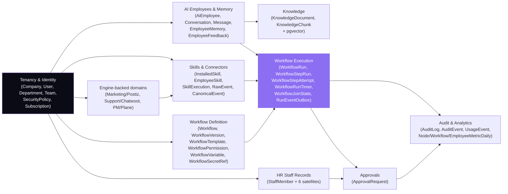

### 3.2 Tenancy & Identity

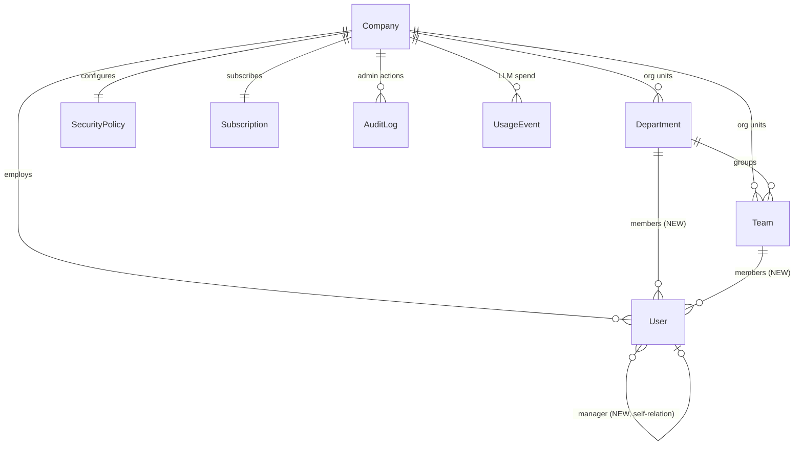

`User.departmentId`/`teamId`/`managerUserId` are **NEW** (closes gap G22). No other edge in this sub-diagram
changes.

### 3.3 AI Employees & Memory

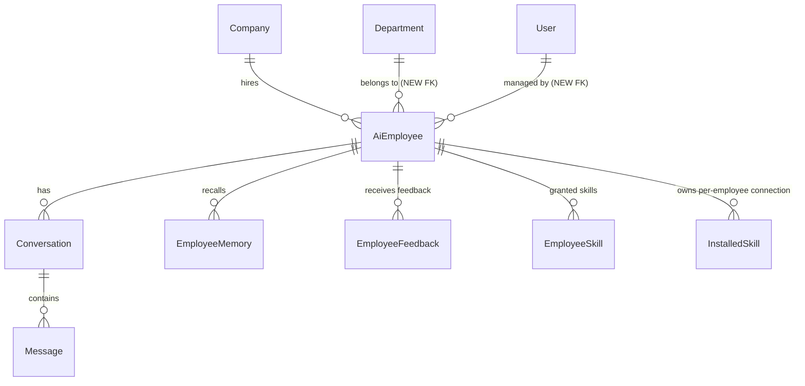

### 3.4 Knowledge

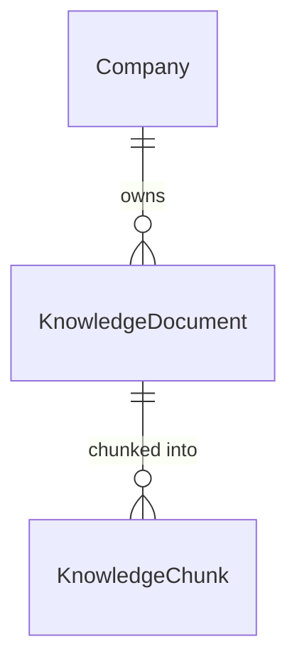

`KnowledgeChunk.embedding` is `Unsupported("vector(384)")` — see §8 and §11 preamble for why this is the
single most dangerous part of any migration touching this table.

### 3.5 Skills & Connectors

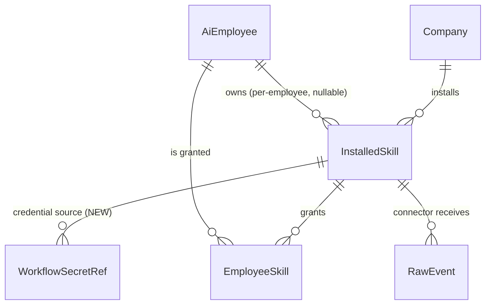

`SkillExecution`, `RawEvent`, `CanonicalEvent` all carry plain `companyId` with **no** `Company` relation
(§2) — omitted from the diagram edges above for that reason, but present in the table catalogue (§4) and FK
table (§6).

### 3.6 Workflow Definition (versioning)

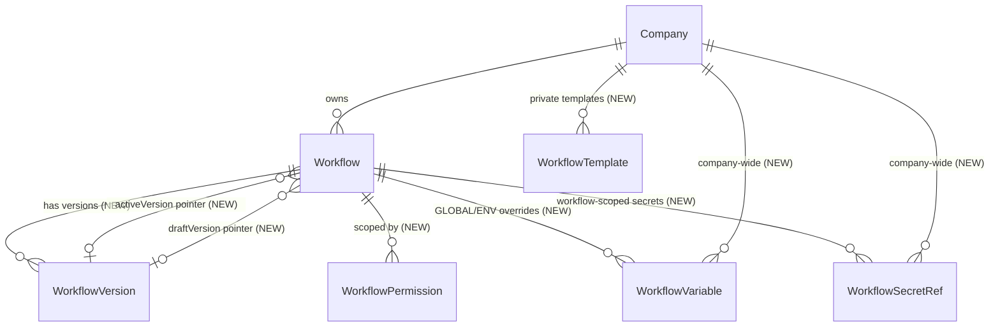

**Fixed vs. `12-database.md` §12.A.4's own diagram:** that diagram drew `WorkflowVersion ||--o{
WorkflowVariable : declares`. The authoritative `WorkflowVariable` DDL (Phase 6 §6.1.5, which owns this
table) has a `workflowId` FK to **`Workflow`**, not a `workflowVersionId` FK to `WorkflowVersion` — WORKFLOW-
scope variable *defaults* live inside `WorkflowDefinition.variables` (versioned JSON), while the
`WorkflowVariable` **table** exists only for company-wide/workflow-level `GLOBAL`/`ENVIRONMENT` overrides,
which are deliberately *not* versioned (§6.1.3's snapshot-at-run-start design). This diagram (and the schema
in §11) follow the Phase 6 DDL, since that phase owns the table; flagged as a documentation inconsistency in
the source material, not something this document silently "fixes" without saying so.

### 3.7 Workflow Execution (the high-volume core)

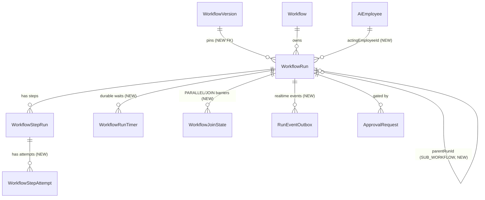

Four tables here — `WorkflowRun`, `WorkflowStepRun`, `WorkflowStepAttempt`, and `AuditEvent` (§3.9) — are
partitioned (§10); this is the reason the FK from `WorkflowStepAttempt.stepId` to `WorkflowStepRun.id` is
**not enforced** at the database level (§6, §12.B.10).

### 3.8 Approvals

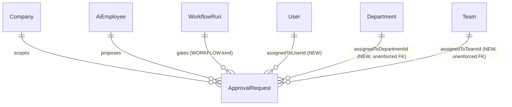

`assignedToDepartmentId`/`assignedToTeamId`/`assignedToRole`/`approverRuleType` are plain columns without a
Prisma `@relation` (consistent with §2's "scope hint, not enforced FK" pattern) — shown here as logical
edges the routing code follows, not DB-enforced foreign keys. `assignedToUserId` likewise has no formal
relation declared in the authoritative DDL (`12-database.md` §12.C.5); preserved as-is.

### 3.9 Audit & Analytics

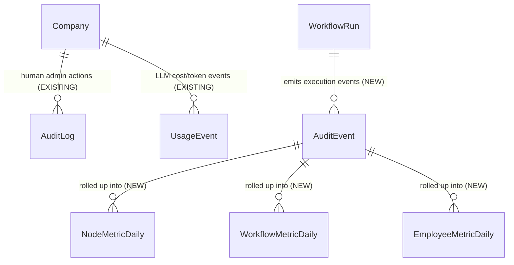

`AuditLog` vs `AuditEvent` is `12-database.md` §12.0.2 conflict **C1**, carried forward unchanged: they are
deliberately two tables with a hard boundary (human admin trail vs. machine execution trail), not a
duplication to be merged. `AuditEvent`→`*MetricDaily` edges are logical (rollup jobs read from partitions),
not FKs — rollup tables carry no FK back to `AuditEvent`.

### 3.10 HR Staff Records

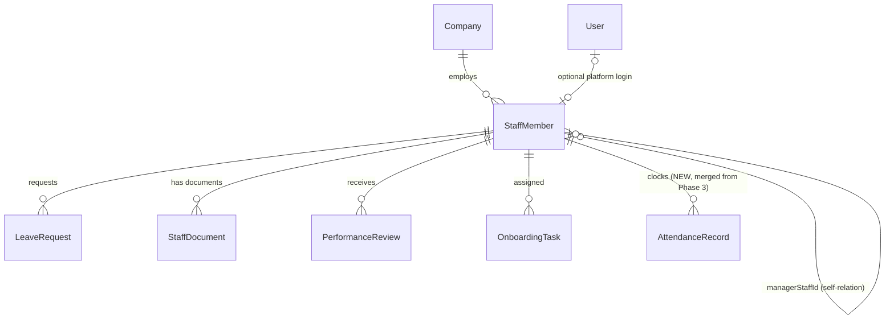

See §5.7 (C6) for how this domain reconciles a genuine conflict between `12-database.md` §12.D and
`03-ai-employees.md` §3.1.5, which specified two materially different `StaffMember` shapes.

### 3.11 Engine-backed domains (Marketing / Support / PM)

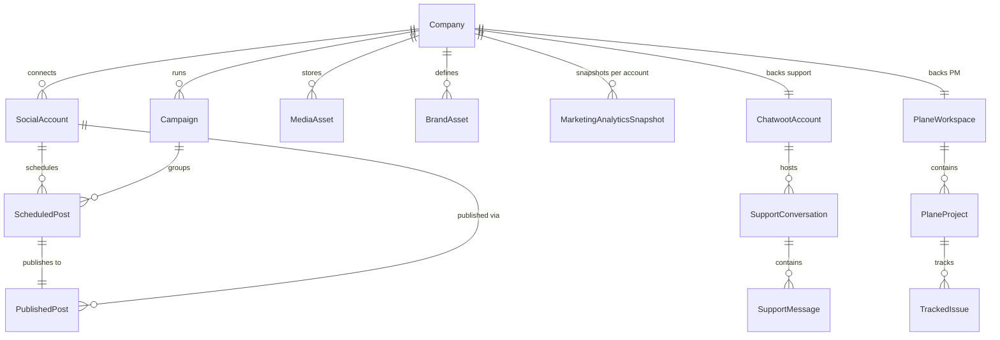

---

## 4. Table catalogue

Status legend: **EXISTING** (untouched) · **EXTENDED** (existing table, new columns/relations) · **NEW**.
Volume classes and partitioning are carried forward verbatim from `12-database.md` §12.0.1 for tables it
covers; classes for engine-backed/HR tables are this document's own assessment (all "small"/"tiny" — none
approach the volume that would justify partitioning).

| Domain | Table | Status | Volume class | Partitioned? | Owning phase |
|---|---|---|---|---|---|
| Tenancy & Identity | `Company` | EXISTING | tiny | no | — |
| | `User` | EXTENDED (+3 org cols, G22) | small | no | 8, 9 |
| | `Department`, `Team` | EXISTING | tiny | no | 9 |
| | `SecurityPolicy` | EXTENDED (+`skillGrantEnforcement`) | tiny | no | 9 |
| | `Subscription` | EXISTING | tiny | no | — |
| | `AuditLog` | EXISTING — see C1 | medium | no | 10 |
| | `UsageEvent` | EXISTING | medium | no | 10, 11 |
| AI Employees & Memory | `AiEmployee` | EXTENDED (+FKs, +reasoning config) | small | no | 3 |
| | `Conversation`, `Message` | EXISTING | medium | no | — |
| | `EmployeeMemory` | EXISTING (+semantic recall later) | medium | no | 7 |
| | `EmployeeFeedback` | EXISTING | small | no | — |
| Knowledge | `KnowledgeDocument` | EXISTING | medium | no | 7 |
| | `KnowledgeChunk` | EXISTING (pgvector) | medium | no | 7 |
| Skills & Connectors | `InstalledSkill`, `EmployeeSkill` | EXISTING | small | no | 4, 9 |
| | `SkillExecution` | EXISTING (+read API, G27) | **high** | no | 4, 10 |
| | `RawEvent`, `CanonicalEvent` | EXISTING | high | no | 4 |
| Workflow Definition | `Workflow` | EXTENDED (+version pointers, category) | small | no | 1 |
| | `WorkflowVersion` | NEW | small | no | 1 |
| | `WorkflowTemplate` | NEW | tiny | no | 1 |
| | `WorkflowPermission` | NEW | small | no | 9 |
| | `WorkflowVariable` | NEW | small | no | 6 |
| | `WorkflowSecretRef` | NEW | small | no | 6 |
| Workflow Execution | `WorkflowRun` | EXTENDED (+9 cols) | **very high** | **yes** | 1, 5 |
| | `WorkflowStepRun` | EXTENDED (+5 cols) | **very high** | **yes** | 2, 5 |
| | `WorkflowStepAttempt` | NEW | **highest** | **yes** | 2, 5 |
| | `WorkflowRunTimer` | NEW | medium | no | 5, 8 |
| | `WorkflowJoinState` | NEW | low | no | 5 |
| | `RunEventOutbox` | NEW | high (transient) | no | 10, 13 |
| Approvals | `ApprovalRequest` | EXTENDED (+routing/SLA/chain) | medium | no | 8 |
| Audit & Analytics | `AuditEvent` | NEW | **highest** | **yes** | 10 |
| | `NodeMetricDaily`, `WorkflowMetricDaily`, `EmployeeMetricDaily` | NEW | low | no | 11 |
| HR Staff Records | `StaffMember` | NEW | small | no | 3 |
| | `LeaveRequest`, `StaffDocument`, `PerformanceReview`, `OnboardingTask` | NEW | small | no | 3 |
| | `AttendanceRecord` | NEW (merged in, C6) | medium | no | 3 |
| Interview scheduling | `InterviewSlot` | EXISTING | small | no | — |
| Marketing / Postiz | `SocialAccount`, `Campaign`, `ScheduledPost`, `PublishedPost`, `MediaAsset`, `BrandAsset`, `MarketingAnalyticsSnapshot` | EXISTING | small | no | — |
| Support / Chatwoot | `ChatwootAccount`, `SupportConversation`, `SupportMessage` | EXISTING | small–medium | no | — |
| PM / Plane | `PlaneWorkspace`, `PlaneProject`, `TrackedIssue` | EXISTING | small | no | — |

**57 models total** (38 EXISTING/EXTENDED + 19 NEW). Four tables are partitioned — `WorkflowStepAttempt`,
`AuditEvent`, `WorkflowRun`, `WorkflowStepRun` — because they are the only ones whose volume class is `high`
or above (`12-database.md` §12.0.1: "volume classes drive every other decision in this document").

---

## 5. Domain-by-domain detail

### 5.1 Workflow tables (definition/versioning)

Tables: `Workflow` (EXTENDED), `WorkflowVersion` (NEW), `WorkflowTemplate` (NEW), `WorkflowPermission` (NEW).

`Workflow` becomes a **container of metadata + pointers**; the executable graph moves to immutable
`WorkflowVersion` rows (ADR-002). `activeVersionId`/`draftVersionId` are both `@unique` on `Workflow` so one
version can never simultaneously be the active version of two workflows, and both use `onDelete: SetNull` so
deleting a version (only possible when no run references it) can never cascade-delete the workflow itself.
`Workflow.definition` (the pre-versioning `Json` graph) is **kept** through the migration and dropped only in
migration M7, after a release with zero fallback-read hits (`12-database.md` §12.E.4) — this is the same
"both present during migration, drop the old one only after proof of zero use" pattern already used for
`AiEmployee.department` (string) vs. the new FK.

`WorkflowTemplate.companyId` is nullable: `null` means a platform-curated template available to every
tenant; set means a private, company-authored template. `WorkflowPermission` is a pure grant table — exactly
one of `userId`/`role`/`departmentId`/`teamId` is set per row (enforced at the application layer, not a DB
CHECK, matching this schema's general preference for app-level multi-column-exclusivity checks over
constraint triggers elsewhere too).

### 5.2 Execution tables (the high-volume core)

Tables: `WorkflowRun` (EXTENDED), `WorkflowStepRun` (EXTENDED), `WorkflowStepAttempt` (NEW),
`WorkflowRunTimer` (NEW), `WorkflowJoinState` (NEW), `RunEventOutbox` (NEW).

This is ADR-001's durable state machine made concrete: Postgres, not Redis, is the run's source of truth.
`WorkflowRun` gains `workflowVersionId` (pins the run to the exact graph that ran — the whole point of
ADR-002), `idempotencyKey` (unique per `companyId`, closing the door on duplicate-triggered runs), and the
saga/cancellation/lineage columns needed by Phase 5. `WorkflowStepRun` gains `attemptCount`, `laneId`
(parallel-branch identity), `iteration` (loop identity), and `employeeId` (cost/analytics attribution).
`WorkflowStepAttempt` is new and carries per-attempt lease/cost/token data — it is `12-database.md` §12.0.2
conflict **C2**'s resolution: Phase 5's fuller definition supersedes Phase 2's 5-column sketch.

The **sentinel-not-NULL fix** on `WorkflowStepRun.@@unique([runId, nodeId, iteration, laneId])` is carried
forward exactly as `12-database.md` §12.B.10 specifies: Postgres treats NULLs as distinct in a unique
constraint, so two rows sharing `(runId, nodeId)` with both `iteration` and `laneId` NULL would both be
permitted — defeating the idempotency guarantee for the ordinary (non-loop, non-parallel) case. The fix is
`iteration` defaulting to `0` and `laneId` defaulting to `'main'` rather than leaving them nullable-and-
unset. **This document reproduces that fix; it is not something to re-derive.**

`RunEventOutbox` uses `BigInt` autoincrement specifically so the WebSocket relay has a cheap monotonic cursor
(`12-database.md` §12.B.10). `WorkflowRunTimer` is the durable-wait mechanism that finally closes gap G2 (the
old `setTimeout`-based wait capped at 10 seconds); `WorkflowJoinState` is the `PARALLEL`/`JOIN` barrier
accounting table that closes G3.

### 5.3 AI Employee tables

Tables: `AiEmployee` (EXTENDED), `Conversation` (EXISTING), `Message` (EXISTING).

`AiEmployee` gains real foreign keys (`departmentId`→`Department`, `managerUserId`→`User`) replacing the
free-text `department`/`managerName` columns — both old and new columns coexist through migration, exactly
as `12-database.md` §12.C.10 specifies, dropped in M7 only after a release shows zero fallback reads. It also
gains `reasoningStrategy`, `llmModel`, `llmTemperature` — closing gap G20 (`AiEmployee.model` was persisted
but never read by any runtime code, verified by grep). **§5.7 (C7) below documents a real conflict in how
this column should be typed**, resolved in this document in favour of the fuller, migration-ready
specification.

### 5.4 Memory tables

Table: `EmployeeMemory` (EXISTING, untouched at the schema level in this pass).

Memory today is recalled by recency, not semantic similarity — there is no vector column on
`EmployeeMemory`. `12-database.md` §12.0.1 flags "semantic recall later" as a future addition owned by
Phase 7, not specified with columns yet; this document does not invent columns Phase 7 hasn't defined. The
`MEMORY_READ`/`MEMORY_WRITE` node types (doc 00 §0.7.1) read/write this table through the existing service,
not through new schema.

### 5.5 Knowledge tables

Tables: `KnowledgeDocument` (EXISTING), `KnowledgeChunk` (EXISTING).

Unchanged by this consolidation. `KnowledgeChunk.embedding` is `Unsupported("vector(384)")` — Prisma cannot
read or write this column at all; every embedding insert/query goes through `$executeRaw`/`$queryRaw` with a
`::vector` cast, and the HNSW index is hand-written SQL appended to the migration (§8). This is **the single
most dangerous fact about this entire schema for migration tooling** — see the pgvector warning in §12.

### 5.6 Skills tables

Tables: `InstalledSkill` (EXTENDED — additive `workflowSecretRefs` back-relation only), `EmployeeSkill`
(EXISTING), `SkillExecution` (EXISTING, +read API is an application change, not a schema change),
`RawEvent`/`CanonicalEvent` (EXISTING).

`InstalledSkill.credentials` remains the one place OAuth/API-key secrets for a *connector* live, encrypted at
rest via `CryptoService`, never returned raw. `WorkflowSecretRef.sourceKind = CONNECTOR_CREDENTIAL` lets a
workflow secret reference reuse this store instead of duplicating a credential — see §5.9.

### 5.7 Reconciling `StaffMember` — conflict C6

`12-database.md` §12.D and `03-ai-employees.md` §3.1.5 both define a `StaffMember` model plus satellites, and
they disagree materially:

| | `12-database.md` §12.D (the consolidation doc) | `03-ai-employees.md` §3.1.5 (Phase 3, the owning phase) |
|---|---|---|
| Name fields | `fullName`, `workEmail`, `personalEmail` | `name`, `email` |
| Manager FK | `managerStaffId` (plain column, no `@relation` declared) | `managerId` with a real `@relation("StaffManager", ...)` self-relation |
| `status` | `String @default("ACTIVE")`, comment lists `CANDIDATE\|ONBOARDING\|ACTIVE\|ON_LEAVE\|EXITING\|EXITED` | Real Prisma enum `StaffStatus` (`CANDIDATE\|ACTIVE\|ON_LEAVE\|OFFBOARDING\|EXITED`) |
| Satellites | `LeaveRequest`, `StaffDocument`, `PerformanceReview`, `OnboardingTask` | `LeaveRequest` (different columns), `AttendanceRecord`, `PerformanceReview` (different columns), `DocumentVerificationRecord` |
| `User` link | `userId String? @unique`, no formal relation declared | `userId String? @unique` **with** `user User? @relation(...)` |

**Resolution adopted in this document.** Per the stated precedence rule ("where `12-database.md` and a phase
doc disagree on a column, `12-database.md` wins" — this document's own governing instruction), §11's schema
uses **`12-database.md`'s field names, the plain-string `status`, and the un-declared `managerStaffId`/
`userId` columns** (consistent with this schema's broader "attribution column, not enforced relation"
pattern used elsewhere — see §2). Two things Phase 3 specifies that `12-database.md`'s satellite set
genuinely lacks are folded in rather than dropped, because they cover real, distinct capabilities (HR
capabilities 4–13, doc `03-ai-employees.md` §3.0):

1. **`AttendanceRecord` is added as a new table**, adapted to the `12-database.md` satellite convention
   (plain `companyId`, no `Company` relation, `staff StaffMember @relation(onDelete: Cascade)`) — nothing in
   `12-database.md`'s satellite set covers attendance at all, so this is a pure addition, not a conflict.
2. **`DocumentVerificationRecord` is *not* added as a separate table.** Its only field not already on
   `12-database.md`'s `StaffDocument` is `confidence Float?` (the AI extraction/classification confidence
   score) — everything else (`documentType`, `storageKey`, a verified/unverified state) already exists on
   `StaffDocument` as `docType`, `storageKey`, and `verifiedAt`. Two tables both representing "a document
   belonging to a staff member with a verification signal" is the same class of problem `12-database.md`
   §12.0.2 C1 diagnosed for `AuditLog`/`AuditEvent` — except here there is no boundary that justifies keeping
   both. **`StaffDocument` is extended with one column, `aiConfidence Float?`**, and `DocumentVerificationRecord`
   is dropped from the consolidated schema. This is this document's own genuine design decision, not a
   verbatim carry-forward, and is called out as such.

### 5.8 Audit tables

Tables: `AuditLog` (EXISTING), `AuditEvent` (NEW).

The C1 boundary from `12-database.md` §12.0.2 is carried forward exactly: `AuditLog` is the low-volume,
UI-queried, human-administrative trail (user created, role changed, workflow published); `AuditEvent` is the
very-high-volume, partitioned, machine-queried execution trail (run/step/attempt/tool-call), hash-chained
per partition for tamper evidence. Merging them would force the admin UI's low-volume trail into a
partitioned table for no benefit and would be a regression on the existing audit screen.

### 5.9 Analytics tables

Tables: `NodeMetricDaily`, `WorkflowMetricDaily`, `EmployeeMetricDaily` (all NEW).

Pre-aggregated daily rollups, each `@@unique` on `[companyId, day, ...]` so a rollup job is a safe
idempotent upsert. These exist specifically so a dashboard load is a handful of indexed row lookups instead
of an aggregate query over millions of `WorkflowStepAttempt`/`AuditEvent` rows — the entire point of Phase
11. `EmployeeMetricDaily.kpiAttainment` is computed at rollup time against `AiEmployee.kpiTargets`.

### 5.10 Tenancy / Identity, Approvals — the org-structure prerequisite (C4)

`12-database.md` §12.0.2 conflict **C4** is carried forward: `User.departmentId`/`teamId`/`managerUserId`
are needed by both approval routing (Phase 8) and department-scoped RBAC (Phase 9), and neither phase can
ship without them — so the columns land once, in Wave 1 (§12), rather than being rediscovered as a blocker
mid-phase. `ApprovalRequest` gains the routing quartet (`assignedToUserId`/`Role`/`DepartmentId`/`TeamId`),
the chain triple (`chainId`/`level`/`escalationTier`), and the SLA triple (`dueAt`/`escalatedAt`/`expiredAt`/
`onTimeout`) — all additive, all nullable/defaulted, so every existing `ApprovalRequest` row and every
existing query against it keeps working unchanged.

### 5.11 Engine-backed domains

**Marketing (Postiz-backed).** `SocialAccount`/`ScheduledPost`/`PublishedPost` are the wired, working
publishing path. `Campaign`/`MediaAsset`/`BrandAsset`/`MarketingAnalyticsSnapshot` are **schema-ahead-of-code**
(gap G21, doc 00 §0.3.2) — the tables exist and are correctly modelled, but zero application code reads or
writes them today. This is an application-wiring gap, not a schema defect; no change is made to these tables
in this consolidation.

**Support (Chatwoot-backed).** `ChatwootAccount` holds two encrypted-at-rest secrets
(`agentBotToken`/`webhookSecret`, via `CryptoService`, same convention as `PlaneWorkspace`).
`SupportConversation`/`SupportMessage` mirror the external Chatwoot conversation/message model 1:1 with a
`chatwootConversationId`/`chatwootMessageId` cross-reference — deliberately not primary keys, since the
external system, not Orlixa, owns those ids' lifecycle.

**PM (Plane-backed).** Same shape as Support: `PlaneWorkspace` holds encrypted `apiToken`/`webhookSecret`;
`PlaneProject`/`TrackedIssue` mirror external ids. Gap G26 (doc 00 §0.3.2) notes the webhook signature
verification code exists and is tested but is wired to zero controllers — an application gap, not a schema
one.

---

## 6. Relationships — full FK reference

"Enforced" = a real Postgres foreign-key constraint exists (via Prisma `@relation`). "Not enforced" = a
plain indexed column the application treats as a reference, with no DB-level constraint — the pattern
already established by `SkillExecution.employeeId`/`RawEvent.connectorId` in the existing schema.

| Parent | Child | FK column | On delete | Enforced? | Why |
|---|---|---|---|---|---|
| `Company` | `User` | `companyId` | Cascade | yes | Tenant deleted ⇒ its logins are meaningless. |
| `Company` | `AiEmployee` | `companyId` | Cascade | yes | Same. |
| `Company` | `KnowledgeDocument` | `companyId` | Cascade | yes | Same. |
| `KnowledgeDocument` | `KnowledgeChunk` | `documentId` | Cascade | yes | A chunk cannot outlive its document. |
| `Company` | `InstalledSkill` | `companyId` | Cascade | yes | Same. |
| `AiEmployee` | `InstalledSkill` | `employeeId` | Cascade | yes | Per-employee connector dies with the employee. |
| `InstalledSkill` | `EmployeeSkill` | `installedSkillId` | Cascade | yes | A grant cannot outlive the thing granted. |
| `AiEmployee` | `EmployeeSkill` | `employeeId` | Cascade | yes | Same, other side. |
| `Company` | `Workflow` | `companyId` | Cascade | yes | Same. |
| `Workflow` | `WorkflowVersion` | `workflowId` | Cascade | yes | A version cannot outlive its container. |
| `WorkflowVersion` | `Workflow.activeVersionId`/`draftVersionId` | — | **SetNull** | yes | Deleting a version must never cascade-delete the workflow (§5.1). |
| `Workflow` | `WorkflowRun` | `workflowId` | Cascade | yes | Existing behaviour, unchanged — **this is the G29 hazard**: a hard `DELETE /workflows/:id` still cascades to every run. The fix is application-level (soft delete via `ARCHIVED`), not a schema change, precisely because the cascade itself is correct/desired for a *genuine* delete — the bug was calling hard delete from a "tidy up my workflow list" UI action. |
| `WorkflowVersion` | `WorkflowRun` | `workflowVersionId` | **SetNull** | yes | A run's history must survive even if its exact version is later pruned (unusual, but the version cannot be deleted while runs reference it in practice — SetNull is the safety net). |
| `WorkflowRun` | `WorkflowStepRun` | `runId` | Cascade | yes | Existing behaviour, unchanged. |
| `WorkflowStepRun` | `WorkflowStepAttempt` | `stepId` | Cascade (declared) / **not enforced at DB level** | **no**, by necessity | Postgres cannot enforce a normal FK from a non-partitioned-key column into a partitioned parent's arbitrary row; `12-database.md` §12.B.10 accepts this trade-off explicitly for the two highest-volume child relationships and relies on application-level integrity plus the run-level `ON DELETE CASCADE`. |
| `WorkflowRun` | `WorkflowStepAttempt` | `runId` | Cascade | yes | This one **is** enforceable (both sides share the run-level relationship, not the partition-crossing one) and stays enforced. |
| `WorkflowRun` | `WorkflowRunTimer` | `runId` | Cascade | yes | A timer for a deleted run is meaningless. |
| `WorkflowRun` | `WorkflowJoinState` | `runId` | Cascade | yes | Same. |
| `WorkflowRun` | `RunEventOutbox` | `runId` | Cascade | yes | Same. |
| `Workflow` | `WorkflowPermission` | `workflowId` | Cascade | yes | A grant cannot outlive the workflow it scopes. |
| `Company`/`Workflow` | `WorkflowVariable` | `companyId`/`workflowId` | Cascade / Cascade | yes | Deleting the workflow removes its overrides; deleting the company removes everything. |
| `Company`/`Workflow`/`InstalledSkill` | `WorkflowSecretRef` | `companyId`/`workflowId`/`installedSkillId` | Cascade / Cascade / Cascade | yes | A secret reference cannot outlive any of its three possible owners. |
| `Company` | `ApprovalRequest` | `companyId` | Cascade | yes | Existing behaviour, unchanged. |
| `Department` | `Team` | `departmentId` | **SetNull** | yes | Existing behaviour: reorganising departments must never delete teams. |
| `Department` | `User` | `departmentId` | **SetNull** | yes | Same principle, extended to people (G22 fix) — never destroy a person because an org unit changed. |
| `Team` | `User` | `teamId` | **SetNull** | yes | Same. |
| `User` | `User` (self, `managerUserId`) | `managerUserId` | **SetNull** | yes | A manager leaving must never delete their reports. |
| `Department` | `AiEmployee` | `departmentId` | **SetNull** | yes | Same principle applied to digital employees. |
| `User` | `AiEmployee` | `managerUserId` | **SetNull** | yes | Same. |
| `Company` | `StaffMember` | `companyId` | Cascade | yes | Tenant deleted ⇒ its HR roster goes with it. |
| `StaffMember` | `StaffMember` (self, `managerStaffId`) | `managerStaffId` | — | **no** (plain column, per §5.7) | Matches `12-database.md`'s literal DDL; a formal self-relation was not declared for this column, unlike the analogous `User.managerUserId`. |
| `StaffMember` | `LeaveRequest`/`StaffDocument`/`PerformanceReview`/`OnboardingTask`/`AttendanceRecord` | `staffId` | Cascade | yes | A satellite record cannot outlive the person it's about. |
| `Company` | `SkillExecution`/`RawEvent`/`CanonicalEvent`/`AuditEvent`/`WorkflowRun`/`WorkflowStepRun`/`WorkflowStepAttempt`/`*MetricDaily`/HR satellites | `companyId` | — | **no** (plain column, §2) | Deliberate: these are the highest-write-volume tables in the system; a `Company` delete-cascade across billions of rows would itself be an operational hazard, and the application already filters every query by `companyId` regardless of whether a DB constraint exists. |

---

## 7. Indexes — complete inventory

| Table | Index | Type | Columns | Serves |
|---|---|---|---|---|
| `User` | (unique) | btree | `[companyId, email]` | Login lookup, existing. |
| `User` | NEW | btree | `[companyId, departmentId]` | Department roster / routing. |
| `User` | NEW | btree | `[companyId, managerUserId]` | "My reports" / manager-routed approvals. |
| `AiEmployee` | existing | btree | `[companyId]` | Employee list. |
| `AiEmployee` | NEW | btree | `[companyId, departmentId]` | Department-scoped employee list. |
| `KnowledgeDocument` | existing | btree | `[companyId]` | Document list. |
| `KnowledgeChunk` | existing | btree | `[companyId]` | Tenant-scoped chunk filter (pre-vector-search). |
| `KnowledgeChunk` | **hand-written** | HNSW | `embedding vector_cosine_ops` | Similarity search — **Prisma cannot express this; see §8**. |
| `InstalledSkill` | existing (unique) | btree | `[companyId, skillKey, employeeId]` | One connection per (company, skill, employee\|null). |
| `InstalledSkill` | existing | btree | `[companyId]`, `[employeeId]` | Lists. |
| `SkillExecution` | existing | btree | `[companyId]` | Tool-call audit list — **flagged: no read API exists yet (G27)**, so this index currently serves nothing; add the read endpoint before assuming this index is "used." |
| `RawEvent` | existing (unique) | btree | `[connectorId, externalId]` | At-least-once webhook dedupe. |
| `CanonicalEvent` | existing (unique) | btree | `[companyId, dedupeKey]` | Idempotent normalisation. |
| `CanonicalEvent` | existing | btree | `[companyId, type]` | EVENT-trigger workflow matching. |
| `Workflow` | existing | btree | `[companyId]` | List. |
| `Workflow` | NEW | btree | `[companyId, status]` | Filter by DRAFT/ACTIVE/PAUSED/ARCHIVED. |
| `Workflow` | NEW | btree | `[companyId, category]` | Library/marketplace filter. |
| `Workflow` | NEW | btree | `[companyId, departmentId]` | Department-scoped workflow list. |
| `Workflow` | **hand-written** | GIN | `search_vector` (generated tsvector) | Full-text library search — see §8. |
| `WorkflowVersion` | NEW (unique) | btree | `[workflowId, version]` | One version number per workflow. |
| `WorkflowVersion` | NEW | btree | `[companyId]` | Tenant scoping (denormalised, §2). |
| `WorkflowVersion` | NEW | btree | `[workflowId, status]` | "Find the DRAFT version" / lifecycle queries. |
| `WorkflowVersion` | NEW | btree | `[companyId, checksum]` | No-op-publish detection as an index seek. |
| `WorkflowTemplate` | NEW | btree | `[companyId]`, `[category, visibility]`, `[employeeRole]` | Catalogue browsing. |
| `WorkflowPermission` | NEW | btree | `[companyId, workflowId]`, `[companyId, userId]` | Permission checks. |
| `WorkflowVariable` | NEW (unique) | btree | `[companyId, workflowId, scope, key]` | One value per (company, workflow-or-null, scope, key). |
| `WorkflowVariable` | NEW | btree | `[companyId]` | List. |
| `WorkflowSecretRef` | NEW (unique) | btree | `[companyId, workflowId, key]` | One secret per name per scope. |
| `WorkflowSecretRef` | NEW | btree | `[companyId]` | List. |
| `WorkflowRun` | existing | btree | `[companyId]`, `[companyId, triggerEventId]` | Lists, lineage. |
| `WorkflowRun` | NEW (unique) | btree | `[companyId, idempotencyKey]` | Dedupe check as an index seek. |
| `WorkflowRun` | NEW | btree | `[companyId, status]` | Status filter. |
| `WorkflowRun` | NEW | btree | `[status, deadlineAt]` | Reaper: runs past their deadline. |
| `WorkflowRun` | NEW | btree | `[companyId, workflowVersionId]` | "Runs on this version" (rollback impact analysis). |
| `WorkflowRun` | NEW | btree | `[parentRunId]` | `SUB_WORKFLOW` parent/child lookup. |
| `WorkflowRun` | NEW | btree | `[companyId, workflowId, createdAt]` | "Recent runs of workflow X" — the run-list screen's main query. |
| `WorkflowStepRun` | existing | btree | `[companyId]` | List. |
| `WorkflowStepRun` | NEW | btree | `[runId, status]` | Timeline for one run. |
| `WorkflowStepRun` | NEW (unique) | btree | `[runId, nodeId, iteration, laneId]` | Engine idempotency key (sentinel-not-NULL, §5.2). |
| `WorkflowStepAttempt` | NEW (unique, per-partition) | btree | `[stepId, attempt]` | Attempt uniqueness — per-month, not global (§10). |
| `WorkflowStepAttempt` | NEW | btree | `[companyId, createdAt]` | Tenant + time-range scan; also the partition key. |
| `WorkflowStepAttempt` | NEW | btree | `[status, leaseExpiresAt]` | Reaper: expired leases. |
| `WorkflowRunTimer` | NEW | btree | `[fireAt, firedAt]` | Timer sweep — the scanning sweeper's only query. |
| `WorkflowRunTimer` | NEW | btree | `[runId]` | Cancel-on-run-completion lookup. |
| `WorkflowJoinState` | NEW (unique) | btree | `[runId, nodeId]` | One barrier row per join node per run. |
| `RunEventOutbox` | NEW | btree | `[publishedAt, id]` | The relay's only query: unpublished, in id order. |
| `RunEventOutbox` | NEW | btree | `[runId]` | Per-run event history. |
| `ApprovalRequest` | existing | btree | `[companyId]`, `[companyId, status]` | Lists. |
| `ApprovalRequest` | NEW | btree | `[companyId, assignedToUserId, status]` | "My approval queue" — the approvals UI's main query. |
| `ApprovalRequest` | NEW | btree | `[companyId, status, dueAt]` | SLA sweep: find approvals nearing/past `dueAt`. |
| `ApprovalRequest` | NEW | btree | `[chainId, level]` | Walking an escalation chain in order. |
| `AuditEvent` | NEW | btree | `[companyId, createdAt]` | Time-range audit query; also the partition key. |
| `AuditEvent` | NEW | btree | `[companyId, runId]` | "Everything that happened in run X." |
| `AuditEvent` | NEW | btree | `[companyId, eventType, createdAt]` | Filter by event type over time. |
| `AuditEvent` | NEW | btree | `[companyId, employeeId, createdAt]` | Per-employee audit trail. |
| `NodeMetricDaily` | NEW (unique) | btree | `[companyId, day, workflowId, nodeId]` | Idempotent rollup upsert. |
| `NodeMetricDaily` | NEW | btree | `[companyId, day]` | Dashboard query — the whole point of the rollup. |
| `WorkflowMetricDaily` | NEW (unique) | btree | `[companyId, day, workflowId, workflowVersionId]` | Same. |
| `WorkflowMetricDaily` | NEW | btree | `[companyId, day]` | Same. |
| `EmployeeMetricDaily` | NEW (unique) | btree | `[companyId, day, employeeId]` | Same. |
| `EmployeeMetricDaily` | NEW | btree | `[companyId, day]` | Same. |
| `StaffMember` | NEW (unique) | btree | `[companyId, employeeCode]` | Import-collision guard. |
| `StaffMember` | NEW | btree | `[companyId, status]`, `[companyId, departmentId]` | Roster filters. |
| `LeaveRequest` | NEW | btree | `[companyId, staffId, status]`, `[companyId, startDate]` | Leave calendar / approval queue. |
| `StaffDocument` | NEW | btree | `[companyId, staffId]`, `[companyId, expiresAt]` | "Documents expiring soon" — a real HR workflow trigger. |
| `PerformanceReview` | NEW | btree | `[companyId, staffId]` | Review history. |
| `OnboardingTask` | NEW | btree | `[companyId, staffId]`, `[companyId, completedAt]` | Onboarding checklist / overdue-task sweep. |
| `AttendanceRecord` | NEW (unique) | btree | `[staffId, date]` | One record per staff member per day. |
| `AttendanceRecord` | NEW | btree | `[companyId]`, `[companyId, staffId, date]` | Tenant scoping / per-staff history. |
| `InterviewSlot` | existing | btree | `[companyId, status, start]` | Slot pool query. |
| `SocialAccount` | existing | btree | `[companyId]`, `[companyId, provider]` | Lists. |
| `ScheduledPost` | existing | btree | `[companyId]`, `[companyId, status]` | Lists, publish-queue scan. |
| `SupportConversation` | existing | btree | `[companyId]`, `[companyId, chatwootConversationId]` | Lists, external-id lookup. |
| `SupportMessage` | existing | btree | `[companyId]`, `[conversationId]` | Lists. |
| `PlaneProject`/`TrackedIssue` | existing | btree | `[companyId]`, plus `[companyId, planeIssueId]` on `TrackedIssue` | Lists, external-id lookup. |

**Flagged as likely-unused today:** `SkillExecution`'s `[companyId]` index — real, correctly built, but
serving no live query path since no read endpoint exists (G27; closed by Phase 10, at which point this index
becomes load-bearing and should be revisited for whether `[companyId, createdAt]` would serve the eventual
list-with-pagination query better than plain `[companyId]`).

**Flagged as a missing index for a known hot query:** none identified beyond what `12-database.md` already
specifies — every hot query enumerated in that document's §12.B.12 performance table has a covering index in
the schema above.

---

## 8. Constraints — PK / unique / check / not-null, and hand-written SQL

Standard Prisma constraints (every `@id`, every `@unique`, every non-optional scalar's implicit `NOT NULL`)
are represented in §11's schema directly and are not re-enumerated here. This section is the SQL Prisma
**cannot** express — all of it hand-written and appended to the generated migration file, the same technique
already used in this repo for the pgvector HNSW index.

**1. Full-text search over the workflow library** (generated column + GIN, `12-database.md` §12.A.5):

```sql
ALTER TABLE "Workflow" ADD COLUMN search_vector tsvector
  GENERATED ALWAYS AS (
    to_tsvector('english', coalesce(name,'') || ' ' || coalesce(description,''))
  ) STORED;
CREATE INDEX workflow_search_idx ON "Workflow" USING GIN (search_vector);
```

**2. Published-version immutability trigger** (`12-database.md` §12.A.5) — defence in depth behind the
service-layer guard; this is what makes "never `UPDATE` a published version's `definition`" a hard guarantee
rather than a convention:

```sql
CREATE OR REPLACE FUNCTION forbid_published_version_mutation()
RETURNS trigger AS $$
BEGIN
  IF OLD.status IN ('PUBLISHED','DEPRECATED','ARCHIVED')
     AND (NEW.definition::text <> OLD.definition::text OR NEW.checksum <> OLD.checksum) THEN
    RAISE EXCEPTION 'WorkflowVersion % is immutable (status=%)', OLD.id, OLD.status;
  END IF;
  RETURN NEW;
END; $$ LANGUAGE plpgsql;

CREATE TRIGGER workflow_version_immutable
  BEFORE UPDATE ON "WorkflowVersion"
  FOR EACH ROW EXECUTE FUNCTION forbid_published_version_mutation();
```

**3. 1 MB definition size check** (`12-database.md` §12.A.13) — enforced at the API layer *and* worth a DB
constraint as defence in depth:

```sql
ALTER TABLE "WorkflowVersion"
  ADD CONSTRAINT workflow_version_definition_size
  CHECK (pg_column_size(definition) < 1048576);
```

**4. pgvector column + HNSW index** (EXISTING, `KnowledgeChunk`) — reproduced here because it is the
constraint every future migration is most likely to accidentally break (§12):

```sql
-- KnowledgeChunk.embedding is Unsupported("vector(384)") in schema.prisma — Prisma neither creates
-- nor manages this column or its index; both are pure hand-written SQL, applied once and never
-- regenerated by `prisma migrate dev`/`diff` without manual review.
ALTER TABLE "KnowledgeChunk" ADD COLUMN embedding vector(384);
CREATE INDEX knowledgechunk_embedding_idx ON "KnowledgeChunk"
  USING hnsw (embedding vector_cosine_ops);
```

**5. Partition DDL for the four high-volume tables** (`12-database.md` §12.B.5) — reproduced in full in §10.

**6. Row-Level Security policies** (`12-database.md` §12.B.5) — reproduced in full in §9.

**7. Exclusivity checks left at the application layer, not as DB `CHECK`s** (consistent with this codebase's
existing style — no multi-column mutual-exclusivity CHECK constraints exist anywhere in the 38-model
baseline either): `WorkflowPermission` (exactly one of `userId`/`role`/`departmentId`/`teamId`),
`WorkflowSecretRef` (`sourceKind = INLINE` ⇒ `encryptedValue` set / `sourceKind = CONNECTOR_CREDENTIAL` ⇒
`installedSkillId`+`credentialField` set), `ApprovalRequest` (`kind = WORKFLOW` ⇒ `workflowRunId` set,
`skillKey`/`tool` null-ish). These are candidates for a future `CHECK` pass but are not added here, to avoid
introducing a constraint style this codebase has never used without a dedicated review.

---

## 9. Multi-tenant design

**The model.** `companyId`-everywhere, application-enforced (ADR-005) — every tenant-scoped query in every
service filters by `companyId` manually; there is no schema-per-tenant or database-per-tenant boundary
anywhere in this system, existing or new.

**Why this over schema-per-tenant or DB-per-tenant.** Schema-per-tenant and DB-per-tenant both give
*database-enforced* isolation, which is strictly stronger than what this system has. They were not chosen
because: (a) 38 existing models already commit to the single-schema, `companyId`-column convention — a
migration to schema-per-tenant now is a full data-migration project with no incremental path, not a design
choice available "for the new tables only" (mixing two tenancy models in one system is its own hazard); (b)
Prisma's connection-pooling story for schema-per-tenant at hundreds/thousands of tenants is materially worse
than a single schema with good indexes, and this system already has a stated serverless-connection-pooling
prerequisite (§13) that schema-per-tenant would make significantly harder; (c) the operational cost of
migrations, backups, and monitoring multiplies by tenant count under either alternative. ADR-005 states this
trade-off plainly: "consistency with the existing codebase matters more than elegance."

**Where it's enforced.** Every service method that reads or writes a tenant-scoped table includes a
`companyId` clause sourced from the authenticated request's JWT — there is no code path that queries these
tables without one (this is a code-review/testing discipline, not a database guarantee).

**Honest statement of the weakness.** This is **application-enforced, not database-enforced.** A single
missing `WHERE companyId = ...` clause in a new query — the most common real-world source of cross-tenant
data leaks in systems built this way — is not caught by the database at all; it is caught only by code
review, tests, or (for the tables that have it) RLS. There is no structural guarantee here, only discipline
and, for four tables, a second layer.

**RLS as defence in depth (ADR-005), and its real limitation** (`12-database.md` §12.B.5, carried forward
verbatim because it is the single fact most likely to be misunderstood):

```sql
ALTER TABLE "WorkflowRun"          ENABLE ROW LEVEL SECURITY;
ALTER TABLE "WorkflowStepRun"      ENABLE ROW LEVEL SECURITY;
ALTER TABLE "WorkflowStepAttempt"  ENABLE ROW LEVEL SECURITY;
ALTER TABLE "AuditEvent"           ENABLE ROW LEVEL SECURITY;

CREATE POLICY tenant_isolation ON "WorkflowRun"
  USING ("companyId" = current_setting('app.company_id', true));
-- … an identical policy is created per table above …
```

The application sets `app.company_id` per request/job. **The limitation, stated without hedging:** Prisma
connects as the table owner, and **a table owner bypasses RLS unless `FORCE ROW LEVEL SECURITY` is set.**
Enabling `FORCE` requires the application to connect as a *non-owner* role — a second database role, which
is a deliberate deployment change not yet made. Until that change ships, this RLS policy catches only queries
made through a non-owner connection (e.g., an analyst's read-only reporting connection, or a future service
connecting under a scoped role) — it does **not** protect against a bug in the main application's own Prisma
client, which still runs as owner. **Nobody should believe tenant isolation is "solved" by this RLS policy
alone.** The real control remains, and will remain, the application-level `companyId` filter on every query.

Why only these four tables get RLS: they are the ones most likely to be queried by *future* analytics or
reporting code written by someone who forgets the filter — the belt-and-braces insurance is cheap there and
not extended to all 57 tables because doing so across the whole schema would be a large, risky refactor for
a benefit that, given the owner-bypass limitation above, is currently mostly theoretical anyway.

---

## 10. Partitioning, retention & archival

**Which four tables, and why only those** (`12-database.md` §12.B.3, §12.0.1): at the stated throughput
target of 10M node-attempts/day (doc 00 §0.8), `WorkflowStepAttempt` grows ~3.6B rows/year, `AuditEvent`
similarly, `WorkflowStepRun` ~3B/year, `WorkflowRun` ~150M/year. Every other table in the system is small
enough (tens to low millions of rows, growing with company/employee/workflow count rather than execution
count) that a good index is sufficient — partitioning a `tiny`/`small`/`medium` table would add operational
complexity (partition management, the DEFAULT-partition monitoring below) for no query-performance benefit.

**Monthly range partitions on `createdAt`.** Chosen because retention becomes `DROP TABLE` (instant, zero
lock contention, zero WAL/vacuum bloat) instead of a mass `DELETE`, which at billions of rows would be
catastrophic for both lock contention and table bloat. This is gap G17 and, per `12-database.md`, "the single
most important scalability decision in this document" — a characterisation this document does not revise.

```sql
CREATE TABLE "WorkflowStepAttempt" ( /* … columns as in §11 … */ ) PARTITION BY RANGE ("createdAt");
CREATE TABLE "WorkflowStepAttempt_2026_08" PARTITION OF "WorkflowStepAttempt"
  FOR VALUES FROM ('2026-08-01') TO ('2026-09-01');
-- one per month, created ahead of time by partition-manager.service.ts (below)

-- The DEFAULT partition is a deliberate safety net: without it, an insert whose createdAt falls
-- outside every defined range FAILS outright — which would take down execution.
CREATE TABLE "WorkflowStepAttempt_default" PARTITION OF "WorkflowStepAttempt" DEFAULT;
```

The identical pattern applies to `AuditEvent`, and — for the two *existing* tables — is a **create-new +
copy + swap** operation (not an online schema change) because Postgres cannot convert an existing
non-partitioned table to partitioned in place. This is migration M3 in §12, and it requires a maintenance
window.

**Consequences accepted for partitioning, carried forward from `12-database.md` §12.B.10:**
- **Unique constraints must include the partition key.** `@@unique([stepId, attempt])` on
  `WorkflowStepAttempt` is therefore enforced **per-partition, per-month**, not globally — accepted because a
  cross-month collision on the same `(stepId, attempt)` is impossible in practice (an attempt belongs to one
  step created at one instant).
- **FK enforcement is dropped on the two highest-volume child relationships** into a partitioned parent
  (`WorkflowStepAttempt.stepId` → `WorkflowStepRun.id`) — Postgres cannot enforce a normal FK into an
  arbitrary partition of a partitioned parent. Application-level integrity plus `ON DELETE CASCADE` at the
  run level replace it (§6).
- **Hash chaining is per-partition, not global** (`12-database.md` §12.D.10): a cross-partition chain would
  make dropping an old partition break verification of every later row — a self-inflicted retention
  deadlock. Each partition's chain seeds from the previous partition's last hash.

**Retention lifecycle** (`12-database.md` §12.E.5): 90 days hot (attached, fully queryable), 400 days cold
(detached + archived to object storage, tenant-configurable, never below a legal minimum), then dropped. This
achieves doc 00 §0.8's stated retention target through partition lifecycle rather than `DELETE`.

**The `DEFAULT` partition as an operational safety net.** Every partitioned table's `_default` partition
should have **zero rows** in steady state. A non-zero row count means the partition-manager job that
pre-creates future months' partitions is running behind schedule — this is an alerting condition, not a
correctness bug (writes still succeed, landing in `_default`), and is monitored explicitly (§13).

```
partition-manager.service.ts — daily at 02:00 UTC
  for each partitioned table:
    ensure partitions exist for [today, today + 2 months]
    alert if any row exists in <table>_default
retention.processor.ts — weekly
  detach partitions older than 90d  → archive to object storage → mark archived
  drop partitions older than 400d   (tenant-configurable; never below a legal minimum)
```

---

## 11. Complete Prisma schema

The full, consolidated, copy-pasteable schema. Every EXISTING field, type, default, relation, `onDelete`
behaviour, and index from the 997-line source file is reproduced verbatim below; every addition is commented
`// NEW` or `// EXTENDED` at the point it appears. `binaryTargets` is preserved unchanged — it is required
for the Vercel serverless deployment (Prisma's documented gotcha: the query engine boots at build time but
crashes at runtime on AWS Lambda without the `rhel-openssl-3.0.x` target).

```prisma
// Orlixa Prisma schema — consolidated whole-database design (2026-08-01).
// Every table carries `companyId`; the tenant guard scopes all queries (application-enforced, §9).
// KnowledgeChunk.embedding is Unsupported("vector(384)") — Prisma cannot manage this column or its
// HNSW index. NEVER run `prisma migrate dev` against this schema (it treats the HNSW index as drift
// and offers to drop it — this has happened on three consecutive migrations, see §12). Use
// `migrate diff --script` + manual review + `migrate deploy` only.

generator client {
  provider      = "prisma-client-js"
  // "native" keeps local dev/build working as-is; "rhel-openssl-3.0.x" is the
  // query-engine binary Vercel's Node.js serverless (AWS Lambda) runtime
  // needs — without it the function boots fine at build time but crashes at
  // runtime the first time Prisma tries to load the engine (Prisma's own
  // documented Vercel deployment gotcha).
  binaryTargets = ["native", "rhel-openssl-3.0.x"]
}

datasource db {
  provider = "postgresql"
  url      = env("DATABASE_URL")
}

// ============================================================================
// ENUMS — 25 EXISTING (6 extended with new values) + 6 NEW = 31 total
// ============================================================================

enum Role {
  OWNER
  ADMIN
  MEMBER
}

enum UserStatus {
  ACTIVE
  DISABLED
}

enum DocumentStatus {
  PENDING
  PROCESSING
  READY
  FAILED
}

// EXTENDED — +MARKETING (closes G10; without it a Marketing Employee must be
// CUSTOM, which silently disables role-scoped knowledge retrieval and
// role-based analytics). Canonical values per doc 00 §0.7.1.
enum EmployeeRole {
  SUPPORT
  SALES
  RECRUITER
  HR
  ACCOUNTANT
  PROJECT_MANAGER
  CUSTOM
  MARKETING // NEW
}

enum EmployeeStatus {
  ACTIVE
  PAUSED
  DISABLED
}

enum KnowledgeAccess {
  ALL
  NONE
}

enum MessageRole {
  USER
  ASSISTANT
  SYSTEM
}

enum MemoryKind {
  FACT
  SUMMARY
}

enum FeedbackRating {
  UP
  DOWN
}

enum SkillExecutionStatus {
  SUCCESS
  ERROR
}

enum SkillConnectionStatus {
  NOT_CONNECTED
  CONNECTED
  DEGRADED
  DISCONNECTED
}

// EXTENDED — +ARCHIVED (replaces the hard-delete path, closing gap G29: the
// old DELETE /workflows/:id cascaded to every run/step run with no recovery).
enum WorkflowStatus {
  DRAFT
  ACTIVE
  PAUSED
  ARCHIVED // NEW
}

enum TriggerType {
  MANUAL
  SCHEDULE
  WEBHOOK
  EVENT
}

// EXTENDED — +CANCELLED, +COMPENSATING, +TIMED_OUT (Phase 5 durable state
// machine; ADR-001).
enum WorkflowRunStatus {
  PENDING
  RUNNING
  WAITING
  COMPLETED
  FAILED
  CANCELLED    // NEW
  COMPENSATING // NEW
  TIMED_OUT    // NEW
}

// EXTENDED — +RETRYING, +WAITING, +COMPENSATED.
enum StepRunStatus {
  PENDING
  RUNNING
  COMPLETED
  FAILED
  SKIPPED
  RETRYING   // NEW
  WAITING    // NEW
  COMPENSATED // NEW
}

// EXTENDED — +ESCALATED, +EXPIRED (Phase 8 SLA/escalation).
enum ApprovalStatus {
  PENDING
  APPROVED
  REJECTED
  ESCALATED // NEW
  EXPIRED   // NEW
}

enum ApprovalKind {
  TOOL
  WORKFLOW
}

enum Plan {
  STARTER
  PRO
  BUSINESS
  ENTERPRISE
}

enum SubscriptionStatus {
  ACTIVE
  PAST_DUE
  CANCELED
}

enum RawEventStatus {
  RECEIVED
  NORMALIZED
  FAILED
  SKIPPED
}

enum SlotStatus {
  OPEN
  BOOKED
  CANCELLED
}

enum SocialAccountStatus {
  CONNECTED
  DISCONNECTED
  DEGRADED
}

enum ScheduledPostStatus {
  DRAFT
  PENDING_APPROVAL
  SCHEDULED
  PUBLISHED
  FAILED
}

enum SupportConversationStatus {
  OPEN
  RESOLVED
  PENDING
}

enum SupportMessageDirection {
  IN
  OUT
}

// ---- NEW enums (6) ---------------------------------------------------------

// NEW — lifecycle of one immutable version of a workflow graph (Phase 1, ADR-002).
enum WorkflowVersionStatus {
  DRAFT      // mutable; the only status whose graph may be edited
  PUBLISHED  // immutable; eligible to be the active version
  DEPRECATED // immutable; superseded, but in-flight runs still reference it
  ARCHIVED   // immutable; retained for audit only
}

// NEW — coarse grouping for the workflow library/marketplace (Phase 1).
enum WorkflowCategory {
  HR
  RECRUITMENT
  MARKETING
  SALES
  SUPPORT
  FINANCE
  OPERATIONS
  IT
  COMPLIANCE
  CUSTOM
}

// NEW — variable scope (Phase 6 §6.1.5). Promoted to a real Prisma enum in
// this migration; previously existed only as the doc 00 §0.7.1 TS type.
enum VariableScope {
  INPUT
  RUNTIME
  WORKFLOW
  GLOBAL
  ENVIRONMENT
  SECRET
  OUTPUT
}

// NEW — declared variable value type (Phase 6 §6.1.5). Also promoted to a
// real Prisma enum in this migration.
enum VariableType {
  string
  number
  boolean
  json
  date
  array
  secret
}

// NEW — how a WorkflowSecretRef's plaintext is sourced (Phase 6 §6.2.5).
enum SecretSourceKind {
  INLINE               // value typed into the builder, encrypted immediately
  CONNECTOR_CREDENTIAL // points at an existing InstalledSkill's credentials
}

// NEW — how an AI Employee reasons (Phase 3 §3.0.5/§3.1.5). Resolves conflict
// C7 (§5.3/§5.7 in the accompanying document): 12-database.md's own §12.C
// DDL sketches this column as a plain `String?`, but Phase 3 (the owning
// phase) fully specifies it as a real enum with a migration and a default —
// that fuller, migration-ready specification is what this schema implements.
enum ReasoningStrategy {
  DIRECT   // single completion
  PLAN_ACT // today's runtime default: plan → retrieve → act → validate
  REACT    // interleaved reason/act loop
  REFLECT  // act, then self-critique before returning
}

// ============================================================================
// TENANCY & IDENTITY
// ============================================================================

model Company {
  id          String    @id @default(cuid())
  name        String
  slug        String    @unique
  industry    String?
  size        String?
  country     String?
  timezone    String?
  website     String?
  logoUrl     String?
  description String?
  onboardedAt DateTime?
  createdAt   DateTime  @default(now())

  users                       User[]
  knowledgeDocuments          KnowledgeDocument[]
  aiEmployees                 AiEmployee[]
  installedSkills             InstalledSkill[]
  workflows                   Workflow[]
  approvalRequests            ApprovalRequest[]
  subscription                Subscription?
  departments                 Department[]
  teams                       Team[]
  securityPolicy              SecurityPolicy?
  interviewSlots              InterviewSlot[]
  auditLogs                   AuditLog[]
  usageEvents                 UsageEvent[]
  socialAccounts              SocialAccount[]
  campaigns                   Campaign[]
  scheduledPosts              ScheduledPost[]
  publishedPosts              PublishedPost[]
  mediaAssets                 MediaAsset[]
  brandAssets                 BrandAsset[]
  marketingAnalyticsSnapshots MarketingAnalyticsSnapshot[]
  chatwootAccount             ChatwootAccount?
  supportConversations        SupportConversation[]
  supportMessages             SupportMessage[]
  planeWorkspace              PlaneWorkspace?
  planeProjects               PlaneProject[]
  trackedIssues               TrackedIssue[]

  // NEW back-relations (additive only — every EXISTING relation above is unchanged)
  workflowTemplates WorkflowTemplate[]
  workflowVariables WorkflowVariable[]
  workflowSecretRefs WorkflowSecretRef[]
  staffMembers      StaffMember[]
}

model AuditLog {
  id          String   @id @default(cuid())
  companyId   String
  company     Company  @relation(fields: [companyId], references: [id], onDelete: Cascade)
  actorUserId String?
  action      String
  entityType  String
  entityId    String?
  metadata    Json?
  createdAt   DateTime @default(now())

  @@index([companyId, createdAt])
  @@index([companyId, entityType, entityId])
}

model UsageEvent {
  id               String   @id @default(cuid())
  companyId        String
  company          Company  @relation(fields: [companyId], references: [id], onDelete: Cascade)
  employeeId       String?
  source           String
  promptTokens     Int
  completionTokens Int
  estimatedCostUsd Float
  createdAt        DateTime @default(now())

  @@index([companyId, createdAt])
  @@index([companyId, employeeId, createdAt])
}

model User {
  id           String     @id @default(cuid())
  companyId    String
  company      Company    @relation(fields: [companyId], references: [id], onDelete: Cascade)
  email        String
  passwordHash String
  name         String
  phone        String?
  role         Role       @default(MEMBER)
  status       UserStatus @default(ACTIVE)
  createdAt    DateTime   @default(now())

  // NEW — closes G22. Required by Phase 8 (approval routing) AND Phase 9 (scoped RBAC).
  departmentId  String?
  department    Department? @relation(fields: [departmentId], references: [id], onDelete: SetNull)
  teamId        String?
  team          Team?       @relation(fields: [teamId], references: [id], onDelete: SetNull)
  managerUserId String?
  manager       User?       @relation("UserManager", fields: [managerUserId], references: [id], onDelete: SetNull)
  reports       User[]      @relation("UserManager")

  // NEW back-relations for FKs other models point at this User
  managedEmployees AiEmployee[] @relation("AiEmployeeManager")

  @@unique([companyId, email])
  @@index([companyId, departmentId])   // NEW
  @@index([companyId, managerUserId])  // NEW
}

model Department {
  id          String   @id @default(cuid())
  companyId   String
  company     Company  @relation(fields: [companyId], references: [id], onDelete: Cascade)
  name        String
  description String?
  createdAt   DateTime @default(now())

  teams Team[]

  // NEW back-relations (Workflow.departmentId has no formal @relation, so no Workflow[] array here —
  // see the comment on Workflow.departmentId)
  users       User[]
  aiEmployees AiEmployee[]

  @@unique([companyId, name])
  @@index([companyId])
}

model Team {
  id           String      @id @default(cuid())
  companyId    String
  company      Company     @relation(fields: [companyId], references: [id], onDelete: Cascade)
  name         String
  departmentId String?
  department   Department? @relation(fields: [departmentId], references: [id], onDelete: SetNull)
  createdAt    DateTime    @default(now())

  // NEW back-relation
  users User[]

  @@unique([companyId, name])
  @@index([companyId])
}

model SecurityPolicy {
  id                    String   @id @default(cuid())
  companyId             String   @unique
  company               Company  @relation(fields: [companyId], references: [id], onDelete: Cascade)
  passwordMinLength     Int      @default(8)
  mfaRequired           Boolean  @default(false)
  sessionTimeoutMinutes Int      @default(0)
  allowedEmailDomains   String[] @default([])
  dataRetentionDays     Int      @default(0)
  createdAt             DateTime @default(now())
  updatedAt             DateTime @updatedAt

  // NEW — Phase 9: staged rollout of execution-time skill-grant enforcement.
  // 'off' (today's behaviour) | 'audit' (log denials, allow) | 'enforce' (deny).
  skillGrantEnforcement String @default("off")
}

model Subscription {
  id                     String             @id @default(cuid())
  companyId              String             @unique
  company                Company            @relation(fields: [companyId], references: [id], onDelete: Cascade)
  plan                   Plan               @default(STARTER)
  status                 SubscriptionStatus @default(ACTIVE)
  provider               String             @default("mock")
  externalCustomerId     String?
  externalSubscriptionId String?
  currentPeriodEnd       DateTime?
  createdAt              DateTime           @default(now())
  updatedAt              DateTime           @updatedAt
}

// ============================================================================
// AI EMPLOYEES & MEMORY
// ============================================================================

model AiEmployee {
  id                String          @id @default(cuid())
  companyId         String
  company           Company         @relation(fields: [companyId], references: [id], onDelete: Cascade)
  name              String
  role              EmployeeRole
  status            EmployeeStatus  @default(ACTIVE)
  persona           String?
  model             String?         // KEPT through migration; unread by runtime (G20) — dropped in M7 once llmModel has zero fallback reads
  department        String?         // KEPT through migration — free text; superseded by departmentId below
  managerName       String?         // KEPT through migration — free text; superseded by managerUserId below
  workingHoursStart String?
  workingHoursEnd   String?
  timezone          String?
  language          String?
  knowledgeAccess   KnowledgeAccess @default(ALL)
  budgetLimit       Int?
  permissions       Json?
  approvalRules     Json?
  goals             Json?
  kpiTargets        Json?
  createdAt         DateTime        @default(now())

  conversations   Conversation[]
  memories        EmployeeMemory[]
  employeeSkills  EmployeeSkill[]
  feedback        EmployeeFeedback[]
  installedSkills InstalledSkill[]

  // NEW — Phase 3: real FKs replacing the free-text columns above (dropped in M7 after backfill).
  departmentId  String?
  departmentRef Department? @relation(fields: [departmentId], references: [id], onDelete: SetNull)
  managerUserId String?
  managerUser   User?       @relation("AiEmployeeManager", fields: [managerUserId], references: [id], onDelete: SetNull)

  // NEW — Phase 3: reasoning configuration (closes G20 — `model` above was persisted but never read).
  reasoningStrategy ReasoningStrategy @default(PLAN_ACT)
  llmModel          String?
  llmTemperature    Float?

  // NEW back-relations
  @@index([companyId])
  @@index([companyId, departmentId]) // NEW
}

model Conversation {
  id         String     @id @default(cuid())
  companyId  String
  employeeId String
  employee   AiEmployee @relation(fields: [employeeId], references: [id], onDelete: Cascade)
  title      String?
  createdAt  DateTime   @default(now())

  messages Message[]

  @@index([companyId])
}

model Message {
  id             String       @id @default(cuid())
  companyId      String
  conversationId String
  conversation   Conversation @relation(fields: [conversationId], references: [id], onDelete: Cascade)
  role           MessageRole
  content        String
  metadata       Json?
  createdAt      DateTime     @default(now())

  @@index([companyId])
}

model EmployeeMemory {
  id         String     @id @default(cuid())
  companyId  String
  employeeId String
  employee   AiEmployee @relation(fields: [employeeId], references: [id], onDelete: Cascade)
  kind       MemoryKind
  content    String
  source     String?
  createdAt  DateTime   @default(now())

  @@index([companyId])
}

model EmployeeFeedback {
  id             String         @id @default(cuid())
  companyId      String
  employeeId     String
  employee       AiEmployee     @relation(fields: [employeeId], references: [id], onDelete: Cascade)
  conversationId String?
  messageId      String?
  rating         FeedbackRating
  note           String?
  correction     String?
  createdAt      DateTime       @default(now())

  @@index([companyId])
  @@index([employeeId])
}

// ============================================================================
// KNOWLEDGE / RAG — pgvector. See §8/§12 for the hand-written HNSW index and
// the "never `migrate dev`" warning; Prisma cannot read/write `embedding`.
// ============================================================================

model KnowledgeDocument {
  id         String         @id @default(cuid())
  companyId  String
  company    Company        @relation(fields: [companyId], references: [id], onDelete: Cascade)
  filename   String
  mimeType   String
  sizeBytes  Int
  storageKey String
  status     DocumentStatus @default(PENDING)
  error      String?
  chunkCount Int            @default(0)
  category   EmployeeRole?
  createdAt  DateTime       @default(now())

  chunks KnowledgeChunk[]

  @@index([companyId])
}

model KnowledgeChunk {
  id         String                      @id @default(cuid())
  documentId String
  document   KnowledgeDocument           @relation(fields: [documentId], references: [id], onDelete: Cascade)
  companyId  String
  content    String
  chunkIndex Int
  embedding  Unsupported("vector(384)")?
  category   EmployeeRole?
  createdAt  DateTime                    @default(now())

  @@index([companyId])
}

// ============================================================================
// SKILLS & CONNECTORS
// ============================================================================

model InstalledSkill {
  id                String                @id @default(cuid())
  companyId         String
  company           Company               @relation(fields: [companyId], references: [id], onDelete: Cascade)
  skillKey          String
  employeeId        String?
  employee          AiEmployee?           @relation(fields: [employeeId], references: [id], onDelete: Cascade)
  displayName       String
  config            Json?
  enabled           Boolean               @default(true)
  connectionType    String?
  connectionStatus  SkillConnectionStatus @default(NOT_CONNECTED)
  credentials       Json?
  lastHealthCheckAt DateTime?
  lastHealthError   String?
  consecutiveErrors Int                   @default(0)
  tokenExpiresAt    DateTime?
  disabledReason    String?
  inboundCursor     String?
  createdAt         DateTime              @default(now())

  employees EmployeeSkill[]

  // NEW back-relation
  workflowSecretRefs WorkflowSecretRef[]

  @@unique([companyId, skillKey, employeeId])
  @@index([companyId])
  @@index([employeeId])
}

model EmployeeSkill {
  id               String   @id @default(cuid())
  companyId        String
  employeeId       String
  installedSkillId String
  createdAt        DateTime @default(now())

  employee       AiEmployee     @relation(fields: [employeeId], references: [id], onDelete: Cascade)
  installedSkill InstalledSkill @relation(fields: [installedSkillId], references: [id], onDelete: Cascade)

  @@unique([employeeId, installedSkillId])
  @@index([companyId])
}

model SkillExecution {
  id             String               @id @default(cuid())
  companyId      String
  employeeId     String?
  conversationId String?
  skillKey       String
  tool           String
  args           Json
  result         Json?
  status         SkillExecutionStatus
  error          String?
  createdAt      DateTime             @default(now())

  @@index([companyId])
}

model RawEvent {
  id                String         @id @default(cuid())
  companyId         String
  connectorId       String
  provider          String
  externalId        String?
  signatureVerified Boolean
  headers           Json?
  payload           Json
  status            RawEventStatus @default(RECEIVED)
  error             String?
  receivedAt        DateTime       @default(now())

  @@unique([connectorId, externalId])
  @@index([companyId])
}

model CanonicalEvent {
  id            String    @id @default(cuid())
  companyId     String
  connectorId   String
  rawEventId    String?
  provider      String
  type          String
  dedupeKey     String
  occurredAt    DateTime?
  receivedAt    DateTime  @default(now())
  subject       Json?
  data          Json?
  schemaVersion String    @default("1.0")

  @@unique([companyId, dedupeKey])
  @@index([companyId, type])
}

// ============================================================================
// WORKFLOW DEFINITION & VERSIONING (Phase 1, ADR-002)
// ============================================================================

model Workflow {
  id            String         @id @default(cuid())
  companyId     String
  company       Company        @relation(fields: [companyId], references: [id], onDelete: Cascade)
  name          String
  description   String?
  status        WorkflowStatus @default(DRAFT)
  definition    Json                                // KEPT through migration — dropped in M7 after backfill (§12)
  triggerType   TriggerType    @default(MANUAL)
  triggerConfig Json?
  webhookToken  String?        @unique
  activatedAt   DateTime?
  createdAt     DateTime       @default(now())
  updatedAt     DateTime       @updatedAt

  runs WorkflowRun[]

  // NEW — Phase 1 versioning/categorisation + Phase 9 scoping
  category        WorkflowCategory @default(CUSTOM)
  tags            String[]         @default([])
  ownerUserId     String?
  departmentId    String?  // plain column, no formal @relation — matches 12-database.md §12.A's
                           // literal DDL (unlike User.departmentId/AiEmployee.departmentId below,
                           // which do declare one)
  activeVersionId String?          @unique
  draftVersionId  String?          @unique
  archivedAt      DateTime?

  versions      WorkflowVersion[] @relation("WorkflowVersions")
  activeVersion WorkflowVersion?  @relation("ActiveVersion", fields: [activeVersionId], references: [id], onDelete: SetNull)
  draftVersion  WorkflowVersion?  @relation("DraftVersion", fields: [draftVersionId], references: [id], onDelete: SetNull)
  permissions   WorkflowPermission[]
  variables     WorkflowVariable[]
  secretRefs    WorkflowSecretRef[]

  @@index([companyId])
  @@index([companyId, status])       // NEW
  @@index([companyId, category])     // NEW
  @@index([companyId, departmentId]) // NEW
  // Hand-written (Prisma cannot express): GIN index on generated `search_vector` — see §8.
}

// NEW — Phase 1. An immutable-once-published graph version (ADR-002).
model WorkflowVersion {
  id                String                @id @default(cuid())
  companyId         String                // denormalised from Workflow — never join to filter (§2)
  workflowId        String
  workflow          Workflow              @relation("WorkflowVersions", fields: [workflowId], references: [id], onDelete: Cascade)
  version           Int
  status            WorkflowVersionStatus @default(DRAFT)
  definition        Json
  checksum          String
  changelog         String?
  publishedAt       DateTime?
  publishedByUserId String?
  deprecatedAt      DateTime?
  validationReport  Json?
  createdAt         DateTime              @default(now())
  updatedAt         DateTime              @updatedAt

  runs      WorkflowRun[]
  activeFor Workflow? @relation("ActiveVersion")
  draftFor  Workflow? @relation("DraftVersion")

  @@unique([workflowId, version])
  @@index([companyId])
  @@index([workflowId, status])
  @@index([companyId, checksum])
  // Hand-written (Prisma cannot express): BEFORE UPDATE trigger forbidding mutation of a
  // PUBLISHED/DEPRECATED/ARCHIVED row's definition/checksum — see §8.
  // CHECK (pg_column_size(definition) < 1048576) — see §8.
}

// NEW — Phase 1. Platform-curated (companyId null) or private (companyId set) starter workflows.
model WorkflowTemplate {
  id               String           @id @default(cuid())
  companyId        String?
  company          Company?         @relation(fields: [companyId], references: [id], onDelete: Cascade)
  name             String
  description      String?
  category         WorkflowCategory
  tags             String[]         @default([])
  definition       Json
  checksum         String
  employeeRole     EmployeeRole?
  minPlan          Plan?
  visibility       String           @default("UNLISTED")
  installCount     Int              @default(0)
  sourceWorkflowId String?
  createdByUserId  String?
  createdAt        DateTime         @default(now())
  updatedAt        DateTime         @updatedAt

  @@index([companyId])
  @@index([category, visibility])
  @@index([employeeRole])
}

// NEW — Phase 9. A permission grant scoped to exactly one of userId/role/departmentId/teamId
// (mutually exclusive at the application layer, not a DB CHECK — see §8).
model WorkflowPermission {
  id           String   @id @default(cuid())
  companyId    String
  workflowId   String
  workflow     Workflow @relation(fields: [workflowId], references: [id], onDelete: Cascade)
  userId       String?
  role         Role?
  departmentId String?
  teamId       String?
  permissions  String[]
  createdAt    DateTime @default(now())

  @@index([companyId, workflowId])
  @@index([companyId, userId])
}

// NEW — Phase 6 §6.1.5. Company-wide (workflowId null) or workflow-scoped GLOBAL/ENVIRONMENT
// overrides. WORKFLOW-scope values are NOT stored here — they live as `default` on
// WorkflowDefinition.variables (versioned, immutable per ADR-002). RUNTIME/INPUT/OUTPUT are
// per-run and live only in WorkflowRun.context.vars.* — never in this table.
model WorkflowVariable {
  id              String        @id @default(cuid())
  companyId       String
  company         Company       @relation(fields: [companyId], references: [id], onDelete: Cascade)
  workflowId      String?
  workflow        Workflow?     @relation(fields: [workflowId], references: [id], onDelete: Cascade)
  scope           VariableScope // app-enforced: only GLOBAL | ENVIRONMENT valid here
  key             String
  type            VariableType
  value           Json
  description     String?
  updatedByUserId String?
  createdAt       DateTime      @default(now())
  updatedAt       DateTime      @updatedAt

  @@unique([companyId, workflowId, scope, key])
  @@index([companyId])
}

// NEW — Phase 6 §6.2.5. Never returns encryptedValue in any DTO (mirrors InstalledSkill.credentials'
// existing "NEVER returned raw" convention).
model WorkflowSecretRef {
  id               String           @id @default(cuid())
  companyId        String
  company          Company          @relation(fields: [companyId], references: [id], onDelete: Cascade)
  workflowId       String?
  workflow         Workflow?        @relation(fields: [workflowId], references: [id], onDelete: Cascade)
  key              String
  sourceKind       SecretSourceKind @default(INLINE)
  encryptedValue   String?          // INLINE only — CryptoService AES-256-GCM envelope "v1:iv:tag:ct"
  installedSkillId String?
  installedSkill   InstalledSkill?  @relation(fields: [installedSkillId], references: [id], onDelete: Cascade)
  credentialField  String?          // CONNECTOR_CREDENTIAL only
  description      String?
  lastAccessedAt   DateTime?
  rotatedAt        DateTime?
  updatedByUserId  String?
  createdAt        DateTime         @default(now())
  updatedAt        DateTime         @updatedAt

  @@unique([companyId, workflowId, key])
  @@index([companyId])
}

// ============================================================================
// WORKFLOW EXECUTION — the high-volume, partitioned core (ADR-001). See §10
// for partition DDL and §9 for the RLS policy on these four tables.
// ============================================================================

model WorkflowRun {
  id             String            @id @default(cuid())
  companyId      String
  workflowId     String
  workflow       Workflow          @relation(fields: [workflowId], references: [id], onDelete: Cascade)
  status         WorkflowRunStatus @default(PENDING)
  source         String            @default("MANUAL")
  dryRun         Boolean           @default(false)
  trigger        Json?
  context        Json?
  triggerEventId String?
  correlationId  String?
  resumeNodeId   String?
  error          String?
  startedAt      DateTime?
  finishedAt     DateTime?
  createdAt      DateTime          @default(now()) // partition key

  // NEW — Phase 1
  workflowVersionId String?
  workflowVersion   WorkflowVersion? @relation(fields: [workflowVersionId], references: [id], onDelete: SetNull)
  idempotencyKey    String?

  // NEW — Phase 5 (durable state machine / saga / cancellation)
  failureClass      String?   // RunFailureClass (doc 00 §0.7.1) — app-validated string, not a DB enum
  deadlineAt        DateTime?
  stepBudgetUsed    Int       @default(0)
  openLanes         Int       @default(0)
  cancelRequestedAt DateTime?
  cancelledByUserId String?
  parentRunId       String?
  parentStepId      String?
  depth             Int       @default(0)

  // NEW — Phase 9: which employee's authority this run executed under. Plain column, no formal
  // @relation — matches 12-database.md §12.C's literal DDL, which does not declare one either.
  actingEmployeeId String?
  startedByUserId  String?

  steps    WorkflowStepRun[]
  attempts WorkflowStepAttempt[]
  timers   WorkflowRunTimer[]
  joins    WorkflowJoinState[]
  outbox   RunEventOutbox[]

  @@unique([companyId, idempotencyKey])
  @@index([companyId])
  @@index([companyId, triggerEventId])
  @@index([companyId, status])                // NEW
  @@index([status, deadlineAt])                // NEW — reaper
  @@index([companyId, workflowVersionId])      // NEW
  @@index([parentRunId])                       // NEW
  @@index([companyId, workflowId, createdAt])  // NEW
  // RLS enabled — see §9. Hand-written partition DDL — see §10.
}

model WorkflowStepRun {
  id         String        @id @default(cuid())
  companyId  String
  runId      String
  run        WorkflowRun   @relation(fields: [runId], references: [id], onDelete: Cascade)
  nodeId     String
  type       String
  status     StepRunStatus @default(PENDING)
  input      Json?
  output     Json?
  error      String?
  startedAt  DateTime?
  finishedAt DateTime?
  createdAt  DateTime      @default(now()) // partition key

  // NEW
  attemptCount      Int     @default(0)
  category          String?
  laneId            String  @default("main") // sentinel, not NULL — see §5.2
  iteration         Int     @default(0)      // sentinel, not NULL — see §5.2
  compensationState String?
  employeeId        String?
  durationMs        Int?

  attempts WorkflowStepAttempt[]

  @@index([companyId])
  @@index([runId, status])                             // NEW
  @@unique([runId, nodeId, iteration, laneId])          // NEW — engine idempotency key
  // RLS enabled — see §9.
}

// NEW — Phase 5 (canonical; supersedes Phase 2's 5-column sketch — conflict C2).
model WorkflowStepAttempt {
  id        String          @id @default(cuid())
  companyId String
  runId     String
  run       WorkflowRun     @relation(fields: [runId], references: [id], onDelete: Cascade)
  stepId    String          // FK to WorkflowStepRun.id — NOT DB-enforced across partitions, see §6/§10
  step      WorkflowStepRun @relation(fields: [stepId], references: [id], onDelete: Cascade)
  attempt   Int
  status    StepRunStatus
  workerId         String?
  leaseExpiresAt   DateTime?
  error            String?
  errorClass       String?   // RunFailureClass — app-validated string
  promptTokens     Int?
  completionTokens Int?
  costUsd          Decimal?  @db.Decimal(12, 6)
  durationMs       Int?
  startedAt  DateTime?
  finishedAt DateTime?
  createdAt  DateTime  @default(now()) // partition key

  @@unique([stepId, attempt]) // per-partition uniqueness only — see §10
  @@index([companyId, createdAt])
  @@index([status, leaseExpiresAt]) // reaper
  // RLS enabled — see §9.
}

// NEW — Phase 5/8. Durable wait / SLA / join-timeout / run-deadline timers.
model WorkflowRunTimer {
  id          String      @id @default(cuid())
  companyId   String
  runId       String
  run         WorkflowRun @relation(fields: [runId], references: [id], onDelete: Cascade)
  nodeId      String?
  kind        String      // WAIT | APPROVAL_SLA | JOIN_TIMEOUT | RUN_DEADLINE
  fireAt      DateTime
  firedAt     DateTime?
  cancelledAt DateTime?
  payload     Json?
  createdAt   DateTime    @default(now())

  @@index([fireAt, firedAt])
  @@index([runId])
}

// NEW — Phase 5. PARALLEL/JOIN barrier accounting.
model WorkflowJoinState {
  id           String    @id @default(cuid())
  companyId    String
  runId        String
  run          WorkflowRun @relation(fields: [runId], references: [id], onDelete: Cascade)
  nodeId       String
  expected     Int
  arrived      Int       @default(0)
  arrivedLanes String[]  @default([])
  satisfiedAt  DateTime?
  createdAt    DateTime  @default(now())

  @@unique([runId, nodeId])
}

// NEW — Phase 10/13. Transactional outbox for the realtime WebSocket relay.
// BigInt id (not cuid) — a cheap, strictly monotonic cursor for the relay.
model RunEventOutbox {
  id          BigInt      @id @default(autoincrement())
  companyId   String
  runId       String
  run         WorkflowRun @relation(fields: [runId], references: [id], onDelete: Cascade)
  eventType   String      // conforms to Phase 13's event envelope (conflict C5 — Phase 13 wins)
  payload     Json
  publishedAt DateTime?
  createdAt   DateTime    @default(now())

  @@index([publishedAt, id]) // the relay's only query
  @@index([runId])
}

// ============================================================================
// APPROVAL CENTER (Phase 8, ADR-006 — extends the existing model, no new subsystem)
// ============================================================================

model ApprovalRequest {
  id             String         @id @default(cuid())
  companyId      String
  company        Company        @relation(fields: [companyId], references: [id], onDelete: Cascade)
  kind           ApprovalKind   @default(TOOL)
  employeeId     String?
  conversationId String?
  workflowRunId  String?  // NOT a formal @relation — matches both the original schema.prisma and
                          // 12-database.md §12.C's literal DDL, neither of which declares one; kept
                          // as a plain pointer rather than introduced as a new enforced FK here.
  skillKey       String?
  tool           String?
  args           Json
  result         Json?
  description    String?
  status         ApprovalStatus @default(PENDING)
  decidedById    String?
  decidedAt      DateTime?
  note           String?
  createdAt      DateTime       @default(now())

  // NEW — Phase 8 routing
  assignedToUserId       String?
  assignedToRole         Role?
  assignedToDepartmentId String?
  assignedToTeamId       String?
  approverRuleType       String?   // ApproverRuleType — app-validated string, not a DB enum

  // NEW — Phase 8 chains: one row per level, not a parallel table
  chainId        String?
  level          Int     @default(1)
  escalationTier Int     @default(0)

  // NEW — Phase 8 SLA
  dueAt       DateTime?
  escalatedAt DateTime?
  expiredAt   DateTime?
  onTimeout   String?   // APPROVE | REJECT | ESCALATE

  // NEW — Phase 5 link for the run-side gate (G25 fix)
  gatedStepId String?

  @@index([companyId])
  @@index([companyId, status])
  @@index([companyId, assignedToUserId, status]) // NEW — "my queue"
  @@index([companyId, status, dueAt])            // NEW — SLA sweep
  @@index([chainId, level])                      // NEW — chain walk
}

// ============================================================================
// AUDIT & ANALYTICS
// ============================================================================

// NEW — Phase 10. Append-only, partitioned, hash-chained per partition (§10).
// Distinct from AuditLog by design (conflict C1, §5.8) — not a duplicate.
model AuditEvent {
  id        BigInt   @id @default(autoincrement())
  companyId String
  userId     String?
  employeeId String?
  actorType  String   // USER | EMPLOYEE | SYSTEM
  workflowId        String?
  workflowVersionId String?
  runId             String?
  stepId            String?
  attemptId         String?
  skillKey          String?
  tool              String?
  eventType String
  result    String?   // SUCCESS | FAILURE | DENIED
  errorClass String?  // RunFailureClass
  input     Json?      // redacted at WRITE time — see §6.2 of the workflow-system doc set
  output    Json?
  durationMs       Int?
  promptTokens     Int?
  completionTokens Int?
  costUsd          Decimal? @db.Decimal(12, 6)
  prevHash  String?  // sha256(prevHash || canonical(row)) — per-partition chain, §10
  hash      String?
  correlationId String?
  createdAt DateTime @default(now()) // partition key

  @@index([companyId, createdAt])
  @@index([companyId, runId])
  @@index([companyId, eventType, createdAt])
  @@index([companyId, employeeId, createdAt])
  // RLS enabled — see §9.
}

// NEW — Phase 11 rollups (all three below share the same shape/purpose).
model NodeMetricDaily {
  id            String   @id @default(cuid())
  companyId     String
  day           DateTime @db.Date
  workflowId    String
  nodeId        String
  nodeType      String
  runs          Int      @default(0)
  successes     Int      @default(0)
  failures      Int      @default(0)
  retries       Int      @default(0)
  p50DurationMs Int?
  p95DurationMs Int?
  p99DurationMs Int?
  totalCostUsd  Decimal? @db.Decimal(14, 6)
  totalTokens   Int      @default(0)

  @@unique([companyId, day, workflowId, nodeId])
  @@index([companyId, day])
}

model WorkflowMetricDaily {
  id                 String   @id @default(cuid())
  companyId          String
  day                DateTime @db.Date
  workflowId         String
  workflowVersionId  String?
  runsStarted        Int      @default(0)
  runsCompleted      Int      @default(0)
  runsFailed         Int      @default(0)
  runsCancelled      Int      @default(0)
  runsTimedOut       Int      @default(0)
  p50DurationMs      Int?
  p95DurationMs      Int?
  totalCostUsd       Decimal? @db.Decimal(14, 6)
  approvalsRequested Int      @default(0)
  approvalsRejected  Int      @default(0)

  @@unique([companyId, day, workflowId, workflowVersionId])
  @@index([companyId, day])
}

model EmployeeMetricDaily {
  id                String   @id @default(cuid())
  companyId         String
  day               DateTime @db.Date
  employeeId        String
  tasksCompleted    Int      @default(0)
  tasksFailed       Int      @default(0)
  toolCalls         Int      @default(0)
  approvalsRequired Int      @default(0)
  totalCostUsd      Decimal? @db.Decimal(14, 6)
  totalTokens       Int      @default(0)
  kpiAttainment     Json?    // computed vs AiEmployee.kpiTargets at rollup time

  @@unique([companyId, day, employeeId])
  @@index([companyId, day])
}

// ============================================================================
// HR STAFF RECORDS (Phase 3) — the customer's human workforce. See §5.7 (C6)
// for how this domain reconciles the 12-database.md vs. 03-ai-employees.md
// conflict; field names/status representation below follow 12-database.md
// (the consolidation document) per the stated precedence rule.
// ============================================================================

// NEW — a single roster spanning CANDIDATE → ... → EXITED as one status
// transition, not a Candidate/Employee hand-off between two systems.
model StaffMember {
  id             String   @id @default(cuid())
  companyId      String
  company        Company  @relation(fields: [companyId], references: [id], onDelete: Cascade)
  userId         String?  @unique // optional link to a platform login — not a formal @relation (§5.7)
  employeeCode   String?
  fullName       String
  workEmail      String?
  personalEmail  String?
  phone          String?
  departmentId   String?  // not a formal @relation, matching this model's own convention (§5.7)
  managerStaffId String?  // not a formal @relation, matching this model's own convention (§5.7)
  jobTitle       String?
  employmentType String?  // FULL_TIME | PART_TIME | CONTRACT | INTERN
  status         String   @default("ACTIVE") // CANDIDATE|ONBOARDING|ACTIVE|ON_LEAVE|EXITING|EXITED
  hiredAt        DateTime?
  exitedAt       DateTime?
  createdAt      DateTime @default(now())
  updatedAt      DateTime @updatedAt

  leaveRequests     LeaveRequest[]
  documents         StaffDocument[]
  reviews           PerformanceReview[]
  onboarding        OnboardingTask[]
  attendanceRecords AttendanceRecord[] // NEW back-relation, merged in per C6

  @@unique([companyId, employeeCode])
  @@index([companyId, status])
  @@index([companyId, departmentId])
}

model LeaveRequest {
  id                String   @id @default(cuid())
  companyId         String
  staffId           String
  staff             StaffMember @relation(fields: [staffId], references: [id], onDelete: Cascade)
  leaveType         String   // ANNUAL | SICK | UNPAID | PARENTAL | OTHER
  startDate         DateTime @db.Date
  endDate           DateTime @db.Date
  days              Float
  reason            String?
  status            String   @default("PENDING") // PENDING|APPROVED|REJECTED|CANCELLED
  approvalRequestId String?
  decidedAt         DateTime?
  createdAt         DateTime @default(now())

  @@index([companyId, staffId, status])
  @@index([companyId, startDate])
}

model StaffDocument {
  id               String    @id @default(cuid())
  companyId        String
  staffId          String
  staff            StaffMember @relation(fields: [staffId], references: [id], onDelete: Cascade)
  docType          String    // ID | VISA | CONTRACT | CERTIFICATE | OTHER
  storageKey       String
  fileName         String
  mimeType         String
  verifiedAt       DateTime?
  verifiedByUserId String?
  // NEW — merged in from 03-ai-employees.md's DocumentVerificationRecord (C6, §5.7): the AI
  // extraction/classification confidence score, rather than a second overlapping table.
  aiConfidence     Float?
  expiresAt        DateTime?
  createdAt        DateTime  @default(now())

  @@index([companyId, staffId])
  @@index([companyId, expiresAt]) // "documents expiring soon" — a real HR workflow trigger
}

model PerformanceReview {
  id             String   @id @default(cuid())
  companyId      String
  staffId        String
  staff          StaffMember @relation(fields: [staffId], references: [id], onDelete: Cascade)
  periodStart    DateTime @db.Date
  periodEnd      DateTime @db.Date
  reviewerUserId String?
  aiDraft        String?
  finalReview    String?
  rating         Int?
  status         String   @default("DRAFT") // DRAFT|IN_REVIEW|SHARED|ACKNOWLEDGED
  createdAt      DateTime @default(now())

  @@index([companyId, staffId])
}

model OnboardingTask {
  id          String   @id @default(cuid())
  companyId   String
  staffId     String
  staff       StaffMember @relation(fields: [staffId], references: [id], onDelete: Cascade)
  title       String
  ownerType   String   // AI_EMPLOYEE | HUMAN
  ownerId     String?
  dueAt       DateTime?
  completedAt DateTime?
  runId       String?  // the workflow run that created/owns this task, for traceability
  createdAt   DateTime @default(now())

  @@index([companyId, staffId])
  @@index([companyId, completedAt])
}

// NEW — merged in from 03-ai-employees.md §3.1.5 (C6, §5.7): 12-database.md's satellite set had
// no attendance table at all; this covers HR capability "attendance tracking" with no overlap.
model AttendanceRecord {
  id        String      @id @default(cuid())
  companyId String
  staffId   String
  staff     StaffMember @relation(fields: [staffId], references: [id], onDelete: Cascade)
  date      DateTime    @db.Date
  status    String      // PRESENT | ABSENT | LATE | HALF_DAY | ON_LEAVE
  note      String?
  createdAt DateTime    @default(now())

  @@unique([staffId, date])
  @@index([companyId])
  @@index([companyId, staffId, date])
}

// ============================================================================
// INTERVIEW SCHEDULING (bulk-hiring slot pool)
// ============================================================================

model InterviewSlot {
  id              String     @id @default(cuid())
  companyId       String
  company         Company    @relation(fields: [companyId], references: [id], onDelete: Cascade)
  start           DateTime
  end             DateTime
  status          SlotStatus @default(OPEN)
  bookedFor       String?
  workflowRunId   String?
  calendarEventId String?
  meetLink        String?
  cancelReason    String?
  createdAt       DateTime   @default(now())

  @@index([companyId, status, start])
}

// ============================================================================
// MARKETING ENGINE (Postiz-backed)
// ============================================================================

model SocialAccount {
  id                  String              @id @default(cuid())
  companyId           String
  company             Company             @relation(fields: [companyId], references: [id], onDelete: Cascade)
  employeeId          String?
  provider            String
  postizIntegrationId String
  postizCustomerId    String?
  displayName         String?
  externalAccountId   String?
  status              SocialAccountStatus @default(CONNECTED)
  createdAt           DateTime            @default(now())
  updatedAt           DateTime            @updatedAt
  scheduledPosts      ScheduledPost[]
  publishedPosts      PublishedPost[]

  @@index([companyId])
  @@index([companyId, provider])
}

model Campaign {
  id           String          @id @default(cuid())
  companyId    String
  company      Company         @relation(fields: [companyId], references: [id], onDelete: Cascade)
  aiEmployeeId String?
  name         String
  goal         String?
  status       String          @default("ACTIVE")
  createdAt    DateTime        @default(now())
  posts        ScheduledPost[]

  @@index([companyId])
}

model ScheduledPost {
  id                String              @id @default(cuid())
  companyId         String
  company           Company             @relation(fields: [companyId], references: [id], onDelete: Cascade)
  socialAccountId   String
  socialAccount     SocialAccount       @relation(fields: [socialAccountId], references: [id])
  campaignId        String?
  campaign          Campaign?           @relation(fields: [campaignId], references: [id])
  content           String
  mediaRefs         Json                @default("[]")
  publishAt         DateTime
  status            ScheduledPostStatus @default(DRAFT)
  postizPostId      String?
  approvalRequestId String?
  createdAt         DateTime            @default(now())
  updatedAt         DateTime            @updatedAt
  publishedPost     PublishedPost?

  @@index([companyId])
  @@index([companyId, status])
}

model PublishedPost {
  id                String        @id @default(cuid())
  companyId         String
  company           Company       @relation(fields: [companyId], references: [id], onDelete: Cascade)
  socialAccountId   String
  socialAccount     SocialAccount @relation(fields: [socialAccountId], references: [id])
  scheduledPostId   String        @unique
  scheduledPost     ScheduledPost @relation(fields: [scheduledPostId], references: [id])
  platformPostId    String?
  permalink         String?
  publishedAt       DateTime      @default(now())
  lastMetricsSyncAt DateTime?

  @@index([companyId])
}

model MediaAsset {
  id         String   @id @default(cuid())
  companyId  String
  company    Company  @relation(fields: [companyId], references: [id], onDelete: Cascade)
  storageKey String
  mimeType   String
  kind       String
  uploadedBy String?
  createdAt  DateTime @default(now())

  @@index([companyId])
}

model BrandAsset {
  id                  String   @id @default(cuid())
  companyId           String
  company             Company  @relation(fields: [companyId], references: [id], onDelete: Cascade)
  kind                String
  mediaAssetId        String?
  structuredValue     Json?
  knowledgeDocumentId String?
  createdAt           DateTime @default(now())

  @@index([companyId])
}

model MarketingAnalyticsSnapshot {
  id              String   @id @default(cuid())
  companyId       String
  company         Company  @relation(fields: [companyId], references: [id], onDelete: Cascade)
  socialAccountId String
  capturedAt      DateTime @default(now())
  metrics         Json

  @@index([companyId, socialAccountId])
}

// ============================================================================
// SUPPORT ENGINE (Chatwoot-backed)
// ============================================================================

model ChatwootAccount {
  id                String                @id @default(cuid())
  companyId         String                @unique
  company           Company               @relation(fields: [companyId], references: [id], onDelete: Cascade)
  chatwootAccountId String
  agentBotId        String
  agentBotToken     String // CryptoService-encrypted at rest
  webhookSecret     String // CryptoService-encrypted at rest
  createdAt         DateTime              @default(now())
  conversations     SupportConversation[]

  @@index([companyId])
}

model SupportConversation {
  id                     String                    @id @default(cuid())
  companyId              String
  company                Company                   @relation(fields: [companyId], references: [id], onDelete: Cascade)
  chatwootAccountId      String
  chatwootAccount        ChatwootAccount           @relation(fields: [chatwootAccountId], references: [id], onDelete: Cascade)
  chatwootConversationId String
  contactEmail           String?
  status                 SupportConversationStatus @default(OPEN)
  lastMessageAt          DateTime                  @default(now())
  messages               SupportMessage[]

  @@index([companyId])
  @@index([companyId, chatwootConversationId])
}

model SupportMessage {
  id                String                  @id @default(cuid())
  companyId         String
  company           Company                 @relation(fields: [companyId], references: [id], onDelete: Cascade)
  conversationId    String
  conversation      SupportConversation     @relation(fields: [conversationId], references: [id], onDelete: Cascade)
  chatwootMessageId String?
  direction         SupportMessageDirection
  content           String
  createdAt         DateTime                @default(now())

  @@index([companyId])
  @@index([conversationId])
}

// ============================================================================
// PM ENGINE (Plane-backed)
// ============================================================================

model PlaneWorkspace {
  id                 String   @id @default(cuid())
  companyId          String   @unique
  company            Company  @relation(fields: [companyId], references: [id], onDelete: Cascade)
  planeWorkspaceSlug String
  apiToken           String   // CryptoService-encrypted at rest
  webhookSecret      String   // CryptoService-encrypted at rest
  createdAt          DateTime @default(now())
  projects           PlaneProject[]

  @@index([companyId])
}

model PlaneProject {
  id               String         @id @default(cuid())
  companyId        String
  company          Company        @relation(fields: [companyId], references: [id], onDelete: Cascade)
  planeWorkspaceId String
  planeWorkspace   PlaneWorkspace @relation(fields: [planeWorkspaceId], references: [id], onDelete: Cascade)
  planeProjectId   String
  name             String
  createdAt        DateTime       @default(now())
  issues           TrackedIssue[]

  @@index([companyId])
}

model TrackedIssue {
  id             String       @id @default(cuid())
  companyId      String
  company        Company      @relation(fields: [companyId], references: [id], onDelete: Cascade)
  planeProjectId String
  planeProject   PlaneProject @relation(fields: [planeProjectId], references: [id], onDelete: Cascade)
  planeIssueId   String
  title          String
  status         String
  assignee       String?
  lastSyncedAt   DateTime     @default(now())

  @@index([companyId])
  @@index([companyId, planeIssueId])
}
```

**Post-schema hand-written SQL** (appended to the generated migration, not expressible in the above): the
pgvector column + HNSW index, the `search_vector` generated column + GIN index, the version-immutability
trigger, the definition-size `CHECK`, the four tables' partition DDL, and the RLS policies — all reproduced
in full in §8, §9, and §10.

---

## 12. Migration path

Ordered per `12-database.md` §12.E, reproduced here with the two hazards spelled out because they are the
most likely ways an implementer breaks something applying this document.

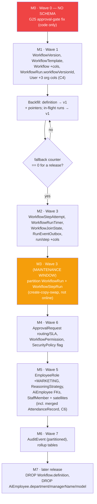

**The recurring pgvector hazard — read this before running anything.** `prisma migrate diff` has generated a
spurious `DROP INDEX "KnowledgeChunk_embedding_idx"` on **three consecutive migrations** in this repo already
(project memory, and `12-database.md` §12.E.10). Every migration file produced against this schema **must**
be opened and that line stripped before it is applied — expect it a fourth, fifth, and sixth time, because
Prisma has no model of the HNSW index and will keep re-detecting it as drift for as long as
`KnowledgeChunk.embedding` stays `Unsupported`. This is not hypothetical: it is the single most likely way
any migration in this plan silently breaks Knowledge search in production.

**`prisma migrate dev` is forbidden against this schema**, for the same reason: it treats the hand-written
HNSW index (and, now, the hand-written partition DDL, the version-immutability trigger, and the RLS
policies) as drift it can "helpfully" fix by dropping. Author every migration with `prisma migrate diff
--script`, review it by hand, and apply with `prisma migrate deploy` only. An interrupted `migrate dev` run
is also the known cause of an orphaned advisory lock (symptom: `P1002` on the next attempt) — terminate the
idle backend holding `pg_advisory_lock` and retry.

**M3 requires a maintenance window.** Converting `WorkflowRun`/`WorkflowStepRun` from non-partitioned to
partitioned is not an online operation — Postgres cannot do it in place. It is create-new + copy + swap +
recreate indexes, and for a table already carrying 150M+ rows should be budgeted in hours and rehearsed on a
restored snapshot first, not attempted cold against production.

**Deliberately-NULL backfill.** `WorkflowRun.workflowVersionId` for historical completed runs is left NULL,
not backfilled to a fabricated "v1" — we cannot know which graph actually ran for a run predating versioning,
and inventing an answer would create false audit data. NULL is the honest gap.

**Rollback.** M1/M2/M4/M5/M6 are additive-only (new nullable columns, new tables) — rollback is "drop what
you added," always safe. M3 is not: keep the pre-swap table until a full release has passed with the new
partitioned table in production before considering it retirable.

---

## 13. Operational runbook

**Connection pooling — a stated prerequisite, not optional.** The API also runs as a Vercel serverless
function; many short-lived function invocations opening direct Postgres connections will exhaust the
connection limit long before query load is the bottleneck. PgBouncer (transaction mode) or Prisma Accelerate
must sit in front of Postgres before this schema goes to production at any real traffic level — already
flagged as deferred in the existing deployment notes (project memory, "Vercel web/api split"), and repeated
here because it is a correctness prerequisite for everything else in this document, not an optimisation.
Partitioning does not help with this; it is an orthogonal constraint.

**Backup/restore.** Standard managed-Postgres (e.g., Neon) point-in-time recovery covers the whole database
including partitioned tables and RLS policies (both are ordinary Postgres objects, backed up like any other).
The one thing to verify explicitly after any restore: the `_default` partitions on all four partitioned
tables are empty, and partition coverage extends at least two months into the future (the partition-manager
job needs a moment to catch up after a restore to an older snapshot).

**Monitoring queries.**

```sql
-- Partition coverage / DEFAULT-partition safety net (should be zero rows in every _default table)
SELECT relname, n_live_tup FROM pg_stat_user_tables WHERE relname LIKE '%\_default' ESCAPE '\';

-- Table/index bloat, top 20 by wasted bytes (standard bloat-estimation query against pg_stat_user_tables
-- + pgstattuple, or the community `bloat` view — schema-agnostic, not reproduced in full here)
SELECT schemaname, relname, n_dead_tup, n_live_tup,
       round(n_dead_tup::numeric / GREATEST(n_live_tup,1), 3) AS dead_ratio
FROM pg_stat_user_tables ORDER BY n_dead_tup DESC LIMIT 20;

-- Slow queries (requires pg_stat_statements)
SELECT query, calls, mean_exec_time, total_exec_time
FROM pg_stat_statements ORDER BY total_exec_time DESC LIMIT 20;

-- Partition row counts per month, the four partitioned tables
SELECT relname, n_live_tup FROM pg_stat_user_tables
WHERE relname ~ '^(WorkflowRun|WorkflowStepRun|WorkflowStepAttempt|AuditEvent)_[0-9]{4}_[0-9]{2}$'
ORDER BY relname;
```

`GET /admin/db/partitions` (`12-database.md` §12.E.6) is the operator-facing surface for the same data — its
absence is exactly how a silently-behind partition-manager job turns into an incident, so it ships alongside
the partition-manager service, not after it.

**Capacity planning at the §0.8 targets** (doc 00): 10M node-attempts/day sustained ⇒ `WorkflowStepAttempt`
~3.6B rows/year, `AuditEvent` similar order of magnitude, `WorkflowStepRun` ~3B/year, `WorkflowRun`
~150M/year. At 90 days hot + 400 days cold, steady-state hot storage for the attempt table alone is on the
order of ~900M rows resident at once (10M/day × 90 days) — size that against the actual average row width of
`WorkflowStepAttempt` (roughly 250–400 bytes with the token/cost columns) for a concrete disk-budget number
before committing to an instance size; this document does not fabricate a number where the row-width
assumption would need re-verifying against real production data.

---

## 14. Verification checklist

Before this schema is considered ready to ship a migration against:

1. **Prisma validates.** `prisma validate` against the schema in §11 passes with zero errors — every
   relation has both sides declared, every enum referenced exists, every `@unique`/`@@unique` is well-formed.
2. **Every EXISTING field survived.** Diff §11 against the current 997-line `schema.prisma` field-by-field;
   the only permitted differences are additions (new columns, new relations) — zero existing field renamed,
   retyped, or dropped in this pass (drops are M7, a separate, later, explicitly-gated migration).
3. **`migrate diff --script` output reviewed by hand**, specifically checked for a spurious `DROP INDEX` on
   `KnowledgeChunk`'s embedding index (§12) before the file is committed.
4. **Partition DDL dry-run on a restored snapshot**, not production, before M3 — confirm the create-copy-swap
   completes within the maintenance window budgeted and that all existing indexes/constraints are recreated
   on the new partitioned table.
5. **RLS policy smoke test**: connect as a non-owner role with `app.company_id` set to tenant A, confirm zero
   rows returned for tenant B's data on the four RLS-enabled tables — and separately confirm (and document)
   that connecting as the table owner still bypasses it, so nobody mistakes this test passing for "tenant
   isolation is DB-enforced" (§9).
6. **`_default` partition is empty** immediately after M3 and stays empty in the following week's monitoring
   window (§13).
7. **Idempotency sentinel check**: insert two `WorkflowStepRun` rows for the same `(runId, nodeId)` with
   `iteration`/`laneId` left at their new defaults (`0`/`'main'`) and confirm the second insert violates the
   unique constraint — this is the concrete regression test for the sentinel-not-NULL fix (§5.2).
8. **Version-immutability trigger check**: attempt to `UPDATE` a `PUBLISHED` `WorkflowVersion.definition` and
   confirm it raises, both directly in SQL and through the application's own update path.
9. **Backfill counters at zero** before each fallback-column drop in M7 — `AiEmployee.model`/`department`/
   `managerName` and `Workflow.definition` all need an instrumented "was the old column read?" counter
   showing zero for a full release before the corresponding `DROP COLUMN` ships.
10. **Every new table appears in the FK table (§6) and the index inventory (§7)** — a table added to §11
    without a corresponding row in both is very likely missing an index a real query will need.
