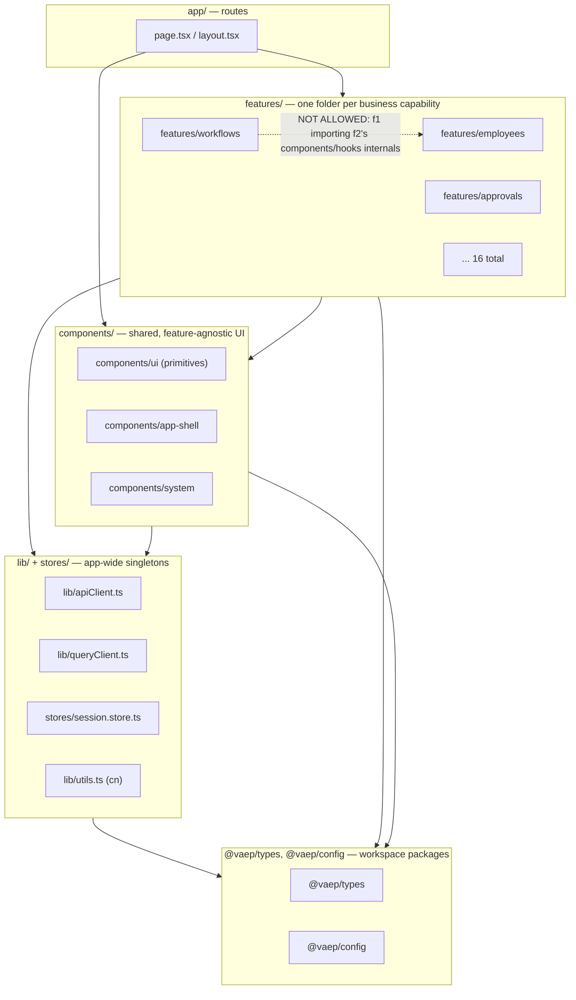
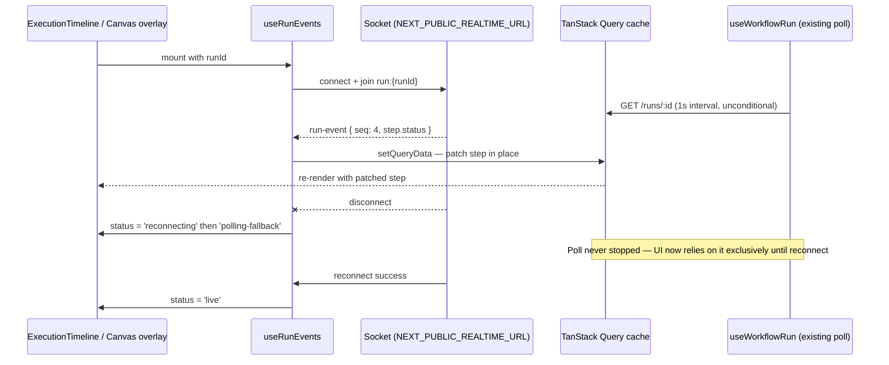

# Frontend Architecture — Orlixa Web (`apps/web`)

**Status:** Approved for implementation · **Date:** 2026-08-01 · **Audience:** frontend engineers
working in `apps/web/src`

**Scope:** architecture only — folder structure, data flow, state ownership, boundaries between
libraries, and how pieces plug together. **No visual design.** Colors, spacing, typography, and
component visual specs live in the (separate) Design System doc. Wherever a visual question comes
up below, the answer is "see the Design System doc," not a color hex code.

---

## 1. Purpose, scope, and delta

This document describes the architecture of the whole `apps/web` Next.js app — the shell every
feature runs inside. It is written because three foundational pieces the target stack assumes
**do not exist yet** (React Flow, shadcn/ui, theme switching — see §1.3) and because the existing
16-feature convention, while sound, has never been written down as a contract anyone can enforce or
copy.

### 1.1 What exists today (verified)

- A working Next.js 14 App Router app with 25 pages across two route groups, `(app)` and `(auth)`.
- A **feature-based architecture** already in place: `src/features/*`, 16 features, each holding its
  own `api.ts` + `hooks.ts` + (some) `labels.ts`/`schemas.ts`/`components/`. This is good and is kept
  — see §3.
- A single axios client (`src/lib/apiClient.ts`), a single `QueryClient`
  (`src/lib/queryClient.ts`), and a single Zustand store (`src/stores/session.store.ts`). All three
  are the correct pattern for this app's size — kept, not replaced.
- A working, if thin, `components/` tree: `app-shell/` (real, used by every authenticated page),
  `auth/`, `marketing-dark/`, `onboarding/`, `svg/`, `system/`, and `ui/` (one file: `Button.tsx`).
- A working Vitest + Testing Library setup, used today in exactly two features (`auth`,
  `onboarding`).
- The workflow **builder screen** is currently a linear list (`NodeList.tsx`, `NodeEditor.tsx`) —
  not a canvas. It works, but it is the thing this whole effort is building toward replacing.

### 1.2 What this document adds

- A **written, enforceable contract** for the feature folder pattern (§3) so the 17th feature looks
  like the first.
- The **complete target folder tree** (§4), every entry marked so nobody has to guess what's safe to
  touch.
- Concrete decisions — not option lists — for the three gaps below (§1.3).
- The state-management boundary (§6), the data layer conventions (§7), the realtime architecture
  (§8), and the React Flow adoption (§9) that the workflow builder needs and nothing in the repo
  today provides.

### 1.3 The three gaps this document exists to close

| # | Gap | Verified | Decision | Where |
|---|---|---|---|---|
| 1 | **No canvas library.** No `reactflow` / `@xyflow/react` in `apps/web/package.json`. | Confirmed — dependency list has neither. | Adopt **`@xyflow/react` v12**. | §9 |
| 2 | **No shadcn/ui.** No `components.json`, no generated primitives. `src/components/ui/` has exactly one file, `Button.tsx` (48 lines). | Confirmed by directory listing. | Adopt shadcn's CLI as a **code generator**, not a runtime dependency; keep `Button.tsx`. | §10.5 |
| 3 | **No theme switching.** No `next-themes`, no dependency, no provider. | Confirmed — grep for `next-themes` and `ThemeProvider` returns nothing. | Add `next-themes` + one `<ThemeProvider>` at the root; token values stay the Design System doc's job. | §5.6 |

### 1.4 Relationship to other documents — read order

1. **`docs/architecture/workflow-system/00-overview-and-canonical-contracts.md` §0.7** — the
   canonical `NodeType`/`WorkflowNode`/`WorkflowDefinition` shapes this document's React Flow
   adapter (§9) converts to and from. §0.8 — the NFR targets (run-start latency, node-attempt
   overhead) that bound what "fast enough" means for the canvas.
2. **`docs/architecture/workflow-system/14-json-contract.md`** — the workflow JSON contract
   (1 MB definition cap, 500-node DB check, node-id regex) the canvas's save path must satisfy, and
   the authoritative `RunEventEnvelope` (§14.B.7) the realtime layer consumes.
3. **`docs/architecture/workflow-system/15-frontend.md` (1,818 lines)** — **already fully specifies
   the workflow builder screen itself**: Sidebar (§15.A), Toolbar (§15.B), Canvas (§15.C), Inspector
   (§15.D), Execution Timeline (§15.E), Node Library (§15.F), Minimap (§15.G), Search (§15.H),
   Templates (§15.I), Context Menu (§15.J), Keyboard Shortcuts (§15.K). **This document does not
   re-specify any of that.** Every mention of the canvas below cites doc 15 for the panel's own
   design and covers only what sits *around* it: the shell it renders inside, the store it reads
   from, the query cache it reconciles with, and the provider it needs mounted above it.
4. **`docs/architecture/api/2026-08-01-rest-api-architecture.md`** — the REST surface, DTO
   boundary (`@vaep/types`), and the WebSocket/webhook event catalogue (§16, §17) this document's
   data layer (§7) and realtime layer (§8) are clients of.
5. **`docs/architecture/backend/2026-08-01-backend-implementation.md`** §2 — the three runtime
   shapes (long-running `main.ts`, Vercel serverless `api/index.ts`, dedicated worker). The
   load-bearing fact for this document: **the WebSocket gateway cannot run on the Vercel serverless
   entry** — it needs the same persistent host as the BullMQ workers. §8 is written around that
   constraint, not around it being solved elsewhere.

### 1.5 A discrepancy this recon surfaced, resolved here

Doc 15 §15.C.10 and §15.C.12 design the canvas against a **500-node** ceiling
(`14-json-contract.md:375`, the DB check constraint). Doc 00 §0.7's gap table (**G16**) documents
today's *actual, live* limit differently: `MAX_WORKFLOW_NODES = 50`, a runtime constant in
`workflows.constants.ts:77`, marked for replacement by Phase 5's step-budget accounting. Both
numbers are correct, at different points in time — this is not a contradiction to flag upward, it's
one to state plainly so nobody designs the canvas against the wrong one: **today's live workflows
top out at 50 nodes; the canvas must perform well at 50 today and not fall over at 500 once Phase 5
ships.** §9.8 designs against 500.

One more small reconciliation worth naming: doc 15 §15.E.7 *proposes* a `RunEventEnvelope` field
named `sequence`; doc 14 §14.B.7, written later and authoritative per doc 15's own §15.0.3 note,
names the same field `seq`. §8 below uses `seq` — the doc 14 spelling — throughout.

---

## 2. Architectural principles

These are the rules everything else in this document follows. When a later section seems to
contradict one of these, the later section is wrong — file it as a bug in this doc, not an
exception.

1. **Server state and client state are different things, handled by different tools, and never
   mixed.** TanStack Query owns anything that came from the API. Zustand owns state that is
   genuinely local to the browser session and has no server source of truth. §6 makes this a hard
   rule, not a guideline.
2. **One feature does not reach into another feature's internals.** A feature exports its public
   surface (hooks, a few components) from files other features are allowed to import; everything
   else is private to the feature. §3.2.
3. **The security boundary is the server, always.** Anything in this document that hides a button,
   disables a field, or redirects a route based on role/plan is a UX improvement, never a security
   control. This is stated once here and not re-argued in every section that touches RBAC.
4. **Every new dependency is adopted for a stated reason, pinned to a version, and given a stated
   boundary.** No "we'll figure out the convention later." §9 (React Flow) and §10.5 (shadcn) are
   the template for how a new dependency gets a home.
5. **Client Components by default; Server Components only where they clearly win.** This is a
   JWT/cookie-authenticated, heavily interactive dashboard, not a content site. §5.3 gives the real
   decision table instead of the generic Next.js advice, which does not fit this app well.
6. **Realtime is an optimization, never a correctness dependency.** Every live feature (§8, and the
   Execution Timeline it feeds) must degrade to polling with zero behavior change beyond latency.
   Doc 15 §15.0.6-3 states this for the timeline specifically; this document generalizes it as a
   house rule.
7. **A component's job is rendering; a hook's job is data and behavior.** Nothing under
   `components/` calls `useQuery`/`useMutation` directly against `apiClient` — it calls a feature
   hook. §11.
8. **Honesty over decoration.** 35 components for 25 pages (§10.1) is thin, and this document says
   so instead of dressing it up. Where something is a real weakness, it is named as one.

---

## 3. Feature-based architecture

### 3.1 Verdict: keep it, formalize it, extend it — do not replace it

`src/features/*` (16 features today: `admin, analytics, approvals, auth, billing, employees,
events, knowledge, marketplace, onboarding, organization, scheduling, skills, tenant, users,
workflows`) is the right shape for this app. The evidence: every feature independently converged on
the same file set (`api.ts`, `hooks.ts`, optionally `labels.ts`/`schemas.ts`/`components/`) without
a written rule forcing it — see the file listing in §3.3. That kind of unforced convergence is a
strong signal the pattern fits the problem. The job here is to write the rule down so it survives
past the 16th feature, not to invent a new one.

### 3.2 The canonical feature folder contract

A feature is a folder under `src/features/<name>/`. It **may** contain:

| File / folder | Required? | Contents |
|---|---|---|
| `api.ts` | Yes, if the feature calls the API | Thin wrapper functions around `apiClient` (§7.1). Returns typed data, throws on error — no React, no TanStack Query here. |
| `hooks.ts` (or `hooks/`, see §11.2) | Yes, if the feature has any client behavior | `useQuery`/`useMutation` hooks built on `api.ts`, the feature's query-key factory (§7.4), and any small UI-state hooks the feature needs. This is the feature's public data/behavior surface. |
| `schemas.ts` | If the feature has forms | Zod schemas + their inferred types, shared between the form (client) and re-used for server-error mapping (§12.3). |
| `labels.ts` | If the feature renders enum values | Pure lookup tables: `Record<SomeEnum, string>` for labels/icons/tones. No JSX, no hooks — this is why it's a separate file from `components/`. |
| `components/` | If the feature has non-trivial UI | Feature-private React components. **Not** exported for other features to import (§3.2.1). |
| `__tests__/` | Recommended, not yet universal | Vitest specs. Today only `auth` and `onboarding` have this — every *new* feature must, per §16. |

A feature **must not** contain:

- Another feature's types, hooks, or components copy-pasted or re-implemented locally.
- A second axios instance or a second `QueryClient` — there is exactly one of each (`lib/apiClient.ts`,
  `lib/queryClient.ts`).
- A new Zustand store. Session/app-global state lives in the one store
  (`stores/session.store.ts`); a feature that thinks it needs global client state should first ask
  whether that state is actually server state it forgot to model as a query (§6.2).
- Route components (`page.tsx`, `layout.tsx`). Those live under `src/app/` and *import from* a
  feature; a feature is never itself routable.

#### 3.2.1 The dependency rule



The rule the diagram encodes: **dependencies point strictly downward.** A feature may import from
`components/`, `lib/`, `stores/`, `@vaep/types`, `@vaep/config` — never from another feature's
`components/` or from another feature's non-exported internals. `app/` may import from any feature
and from `components/`. Nothing below `L3` may import from `L3` or `L4` (a `lib/` helper never
imports a feature).

**The one sanctioned exception, and it's already in the code:** `useAppShellProps.ts`
(`src/components/app-shell/useAppShellProps.ts:1-37`) imports hooks from three features
(`useApprovals` from `features/approvals`, `useCurrentUser`/`useLogout` from `features/auth`,
`useCurrentCompany` from `features/tenant`). This is allowed because it imports each feature's
**public surface** (an exported hook from `hooks.ts`), not internals, and because `app-shell` is
itself `components/` (L2), composing three features' public data for one shared piece of chrome. It
is the template for "shared component needs data from feature X": import feature X's hook, never
its component tree.

If a second feature ever needs another feature's *component* (not just its hook), that component
does not belong in the feature anymore — promote it to `components/` first, then have both features
import it from there. Never import `features/a/components/Foo` from inside `features/b`.

#### 3.2.2 Enforcing it: ESLint boundaries — NEW

**No ESLint configuration exists anywhere in this monorepo today** (verified: no `.eslintrc*`, no
`eslint.config.*`, at repo root or in `apps/web`; root `package.json:12` has a `"lint": "turbo run
lint"` script with nothing behind it). The dependency rule above is currently enforced by nothing
but code review. Add `eslint-plugin-boundaries` (or `eslint-plugin-import`'s `no-restricted-paths`,
which is lighter but less expressive) as part of the migration (§18):

```js
// apps/web/eslint.config.mjs — NEW
import boundaries from 'eslint-plugin-boundaries';

export default [
  {
    plugins: { boundaries },
    settings: {
      'boundaries/elements': [
        { type: 'app', pattern: 'src/app/**' },
        { type: 'feature', pattern: 'src/features/*/**', capture: ['featureName'] },
        { type: 'component', pattern: 'src/components/**' },
        { type: 'lib', pattern: 'src/{lib,stores}/**' },
      ],
    },
    rules: {
      'boundaries/element-types': [
        'error',
        {
          default: 'disallow',
          rules: [
            { from: 'app', allow: ['feature', 'component', 'lib'] },
            { from: 'feature', allow: ['component', 'lib'] }, // NOT other features
            { from: 'component', allow: ['lib'] },
            { from: 'lib', allow: [] },
          ],
        },
      ],
      // Blocks `features/a/components/*` imports from anywhere but `features/a` itself.
      'boundaries/no-private': ['error', { allow: ['hooks.ts', 'api.ts', 'schemas.ts', 'labels.ts'] }],
    },
  },
];
```

This turns §3.2.1's diagram into a CI check instead of a convention people can forget.

### 3.3 How to add a feature

1. `mkdir src/features/<name>` (kebab-case matching the route it backs, e.g. `features/invoices` for
   `/invoices`).
2. Add `api.ts` — thin functions calling `apiClient`, typed against `@vaep/types` DTOs.
3. Add `hooks.ts` — one query-key factory (§7.4) + `useQuery`/`useMutation` hooks. `'use client'` at
   the top (every hooks file today has it, e.g. `features/workflows/hooks.ts:1`).
4. Add `schemas.ts`/`labels.ts` only if the feature has forms/enums to render.
5. Add `components/` only once there's a component; do not scaffold an empty folder.
6. Add `__tests__/hooks.test.tsx` mocking `./api` (the established pattern, verbatim in
   `features/auth/__tests__/hooks.test.tsx:9-30`) — required for new features per §16, not optional.
7. Wire the route under `src/app/(app)/<name>/page.tsx`, importing the feature's hooks/components.
8. If the feature needs shell chrome (sidebar entry, approvals badge), add it to
   `components/app-shell/Sidebar.tsx` and, if it needs shared cross-cutting data, extend
   `useAppShellProps.ts` — never duplicate that wiring per-page.

---

## 4. Complete folder structure

Every entry below is marked **EXISTING (KEEP)** (present today, no change needed),
**EXTEND** (present today, gets new content), or **NEW** (does not exist yet).

```
apps/web/
├── src/
│   ├── app/                                          EXISTING (KEEP) — App Router root
│   │   ├── layout.tsx                                 EXTEND — mounts ThemeProvider (§5.6, NEW)
│   │   ├── page.tsx                                   EXISTING (KEEP) — marketing home
│   │   ├── providers.tsx                              EXTEND — + ThemeProvider (§5.6)
│   │   ├── auth-bootstrap.tsx                          EXISTING (KEEP) — silent refresh on load
│   │   ├── globals.css                                EXISTING (KEEP, NOT VERIFIED path — referenced
│   │   │                                                 by doc 15 §15.C.12 as defining
│   │   │                                                 prefers-reduced-motion overrides)
│   │   ├── demo/page.tsx                              EXISTING (KEEP)
│   │   ├── (auth)/                                    EXISTING (KEEP) — 8 routes
│   │   │   ├── layout.tsx                              EXISTING (KEEP)
│   │   │   ├── login/page.tsx                          EXISTING (KEEP)
│   │   │   ├── register/page.tsx                       EXISTING (KEEP)
│   │   │   ├── forgot-password/page.tsx                EXISTING (KEEP)
│   │   │   ├── reset-password/page.tsx                 EXISTING (KEEP)
│   │   │   ├── verify-email/page.tsx                   EXISTING (KEEP)
│   │   │   ├── verify-otp/page.tsx                     EXISTING (KEEP)
│   │   │   ├── two-factor/page.tsx                     EXISTING (KEEP)
│   │   │   └── account-locked/page.tsx                 EXISTING (KEEP)
│   │   └── (app)/                                     EXISTING (KEEP) — 15 route groups, all
│   │   │                                                 client-guarded (§13)
│   │       ├── layout.tsx                              EXISTING (KEEP) — the route guard (§13.2)
│   │       ├── loading.tsx                             NEW — App Router loading convention (§5.5)
│   │       ├── error.tsx                               NEW — App Router error boundary (§14.1)
│   │       ├── not-found.tsx                            NEW
│   │       ├── dashboard/page.tsx                       EXISTING (KEEP)
│   │       ├── employees/page.tsx                       EXISTING (KEEP)
│   │       ├── employees/[id]/page.tsx                  EXISTING (KEEP)
│   │       ├── approvals/page.tsx                       EXISTING (KEEP)
│   │       ├── billing/page.tsx                         EXISTING (KEEP)
│   │       ├── knowledge/page.tsx                       EXISTING (KEEP)
│   │       ├── marketplace/page.tsx                     EXISTING (KEEP)
│   │       ├── onboarding/page.tsx                      EXISTING (KEEP)
│   │       ├── organization/page.tsx                    EXISTING (KEEP)
│   │       ├── scheduling/page.tsx                      EXISTING (KEEP)
│   │       ├── skills/page.tsx                          EXISTING (KEEP)
│   │       ├── team/page.tsx                            EXISTING (KEEP)
│   │       ├── admin/health/page.tsx                    EXISTING (KEEP)
│   │       ├── workflows/page.tsx                       EXISTING (KEEP) — list view
│   │       └── workflows/[id]/
│   │           ├── page.tsx                             EXTEND — swaps NodeList-based body for
│   │           │                                          CanvasToolbar + WorkflowCanvas (doc 15 §15.C.3)
│   │           ├── loading.tsx                           NEW
│   │           └── error.tsx                             NEW
│   │
│   ├── features/                                      EXISTING (KEEP) — the feature contract, §3
│   │   ├── admin/               {api,hooks}.ts + components/                  EXISTING (KEEP)
│   │   ├── analytics/           {api,hooks,labels}.ts + components/            EXISTING (KEEP)
│   │   ├── approvals/           {api,hooks,labels}.ts + components/            EXISTING (KEEP)
│   │   ├── auth/                {api,hooks,schemas}.ts + components/ + __tests__/   EXISTING (KEEP)
│   │   ├── billing/             {api,hooks,labels}.ts + components/            EXISTING (KEEP)
│   │   ├── employees/           {api,hooks,labels,schemas}.ts + components/     EXISTING (KEEP)
│   │   ├── events/              {api,hooks,labels}.ts + components/            EXISTING (KEEP)
│   │   ├── knowledge/           {api,hooks,schemas}.ts + components/           EXISTING (KEEP)
│   │   ├── marketplace/         {api,hooks,labels}.ts + components/            EXISTING (KEEP)
│   │   ├── onboarding/          {api,hooks,labels,schemas}.ts + components/ + __tests__/  EXISTING (KEEP)
│   │   ├── organization/        {api,hooks,schemas}.ts + components/           EXISTING (KEEP)
│   │   ├── scheduling/          {api,hooks,labels,schemas}.ts + components/     EXISTING (KEEP)
│   │   ├── skills/              {api,hooks,labels,schemas}.ts + components/     EXISTING (KEEP)
│   │   ├── tenant/              {api,hooks}.ts, no components/ (fine — §3.2)    EXISTING (KEEP)
│   │   ├── users/               {api,hooks,labels,schemas}.ts + components/     EXISTING (KEEP)
│   │   └── workflows/                                                          EXTEND — the big one
│   │       ├── api.ts                EXTEND — + getWorkflowNodes, getRunTimeline, template/secret
│   │       │                            endpoints (doc 15 §15.0.7)
│   │       ├── hooks.ts               EXTEND — + useNodeDefinitions, useRunTimeline, useRunEvents,
│   │       │                            useWorkflowTemplates, useUndoRedo (doc 15 §15.0.7)
│   │       ├── labels.ts              EXTEND — + category icons/tones fallback
│   │       ├── schemas.ts             EXTEND
│   │       ├── adapters/
│   │       │   └── graphAdapter.ts     NEW — WorkflowDefinition ⇄ React Flow nodes/edges (§9.5)
│   │       ├── store/
│   │       │   └── canvasHistory.ts    NEW — undo/redo reducer, local to the canvas (§9.9)
│   │       ├── realtime/
│   │       │   └── useRunEvents.ts     NEW — WebSocket client for one run (§8.3)
│   │       ├── components/
│   │       │   ├── WorkflowList.tsx           EXISTING (KEEP)
│   │       │   ├── WorkflowForm.tsx           EXISTING (KEEP)
│   │       │   ├── GenerateWorkflowChat.tsx   EXTEND — generalizes its unresolved-nodes banner
│   │       │   ├── WorkflowCanvas.tsx         NEW — see doc 15 §15.C for the full spec
│   │       │   ├── NodeEditor.tsx             DELETE once Inspector/SchemaForm ships (doc 15 §15.D)
│   │       │   ├── NodeList.tsx               DELETE once WorkflowCanvas ships (doc 15 §15.0.7)
│   │       │   ├── RunSteps.tsx               EXTEND — folds into ExecutionTimeline (doc 15 §15.E)
│   │       │   ├── PastRunsPanel.tsx          EXTEND — folds into ExecutionTimeline History tab
│   │       │   ├── RunPanel.tsx               EXTEND — relocates into Toolbar's Run popover
│   │       │   ├── TriggerPanel.tsx           EXTEND — relocates into Inspector's TRIGGER case
│   │       │   ├── nodes/                     NEW — see doc 15 §15.C.3
│   │       │   ├── edges/                     NEW — see doc 15 §15.C.3
│   │       │   ├── Inspector/                 NEW — see doc 15 §15.D
│   │       │   ├── Toolbar/                   NEW — see doc 15 §15.B
│   │       │   ├── ExecutionTimeline/         NEW — see doc 15 §15.E
│   │       │   ├── NodeLibrary/               NEW — see doc 15 §15.F
│   │       │   ├── Templates/                 NEW — see doc 15 §15.I
│   │       │   ├── ContextMenu/               NEW — see doc 15 §15.J
│   │       │   └── Outline/                   NEW — see doc 15 §15.C.11
│   │       └── __tests__/                     NEW — required, §16 (none exist today)
│   │
│   ├── components/
│   │   ├── ui/                                       EXTEND — shadcn adoption target (§10.5)
│   │   │   ├── Button.tsx                             EXISTING (KEEP) — hand-rolled, stays
│   │   │   ├── button.tsx                             NEW — shadcn-generated variant primitive,
│   │   │   │                                            coexistence rule in §10.5 (naming
│   │   │   │                                            collision handled there)
│   │   │   ├── dialog.tsx                             NEW — shadcn — Modal/Dialog primitive doc 15
│   │   │   │                                            §15.0.5-J calls for (Templates, shortcuts help)
│   │   │   ├── dropdown-menu.tsx                       NEW — shadcn — context menu (doc 15 §15.J)
│   │   │   ├── popover.tsx                             NEW — shadcn — Toolbar Run popover (doc 15 §15.B)
│   │   │   ├── tooltip.tsx                             NEW — shadcn
│   │   │   ├── toast.tsx / use-toast.ts                NEW — shadcn — error/success surfacing (§14.3)
│   │   │   ├── tabs.tsx                                NEW — shadcn — Execution Timeline Live/History
│   │   │   ├── select.tsx                              NEW — shadcn
│   │   │   └── skeleton.tsx                            NEW — shadcn — loading states (§5.5)
│   │   ├── app-shell/                                EXISTING (KEEP) — no change this phase
│   │   │   ├── AppShell.tsx                            EXISTING (KEEP)
│   │   │   ├── Sidebar.tsx                             EXISTING (KEEP)
│   │   │   ├── Topbar.tsx                              EXTEND — theme toggle control mounts here (§5.6)
│   │   │   └── useAppShellProps.ts                     EXISTING (KEEP)
│   │   ├── auth/                                     EXISTING (KEEP)
│   │   ├── marketing-dark/                           EXISTING (KEEP)
│   │   ├── onboarding/                                EXISTING (KEEP)
│   │   ├── svg/                                      EXISTING (KEEP)
│   │   └── system/                                   EXISTING (KEEP)
│   │       └── MotionFlag.tsx                         EXISTING (KEEP)
│   │
│   ├── lib/
│   │   ├── apiClient.ts                              EXISTING (KEEP) — the one axios instance
│   │   ├── queryClient.ts                            EXTEND — per-query-class defaults (§7.5)
│   │   ├── utils.ts                                  EXISTING (KEEP) — `cn()`
│   │   ├── queryKeys.ts                              NEW — typed key-factory helper (§7.4)
│   │   └── realtime/
│   │       └── socketClient.ts                        NEW — the one WebSocket client singleton (§8.2)
│   │
│   ├── stores/
│   │   └── session.store.ts                          EXISTING (KEEP) — the one Zustand store (§6)
│   │
│   └── test/
│       ├── setup.ts                                  NEW — jest-dom matchers, MSW server start (§16.3)
│       └── msw/
│           ├── server.ts                              NEW
│           └── handlers/                              NEW — one file per feature, mirrors api.ts
│
├── components.json                                   NEW — shadcn config (§10.5)
├── eslint.config.mjs                                 NEW — boundaries rule (§3.2.2)
├── next.config.mjs                                   EXTEND — no change needed for React Flow;
│                                                        confirmed no SSR-unsafe import at module
│                                                        scope (§9.2)
├── tailwind.config.js                                EXISTING (KEEP) — Design System doc owns tokens
├── tsconfig.json                                     EXISTING (KEEP)
├── vitest.config.ts                                  EXTEND — + `test/setup.ts` (§16.3)
└── package.json                                      EXTEND — + @xyflow/react, dagre, next-themes,
                                                          shadcn peer deps (radix-ui/*), msw (dev)
```

---

## 5. App Router architecture

### 5.1 Route groups (existing, kept)

`(app)` and `(auth)` are exactly what they should be: `(auth)` for the 8 unauthenticated flows,
`(app)` for the 15 authenticated route groups, each rendering inside the guard at
`app/(app)/layout.tsx:23-46`. No new top-level route group is needed by anything in this document.

### 5.2 Layout nesting

```
app/layout.tsx                    Root HTML shell + Providers (QueryClient, AuthBootstrap, Theme)
├── app/(auth)/layout.tsx         Auth chrome (no AppShell)
│   └── login/page.tsx, ...
└── app/(app)/layout.tsx          Route guard (session status, onboarding redirect)
    └── <page>/page.tsx           Each page mounts <AppShell> itself via useAppShellProps()
```

One thing worth naming plainly: `AppShell` is **not** mounted in `app/(app)/layout.tsx` — it's
mounted per-page (e.g. `workflows/[id]/page.tsx:41`). This means every `(app)` page repeats
`<AppShell {...useAppShellProps()}>`. That's a small duplication (15 call sites), not a bug, and
the fix (lifting `AppShell` into the layout) is deliberately **out of scope** here: it would change
the workflow-detail page's ability to escape `AppShell`'s padding for the canvas (doc 15 §15.C.3's
`-mx-6 sm:-mx-10 -mb-12` trick, `page.tsx` line ~468 in doc 15's own listing) in a way that needs
its own design pass, not a drive-by change bundled into this document.

### 5.3 Server vs. Client Component — the real decision table

The generic Next.js advice ("default to Server Components, opt into Client where needed") does not
fit this app well, and pretending otherwise would be dishonest. Here's why, and the actual rule.

**Why this app is different from the textbook case:** auth is a JWT held in memory (Zustand) plus
an httpOnly refresh cookie exchanged client-side (`auth-bootstrap.tsx:30-50`). There is no
server-side session read today — no middleware, no server-side cookie-to-user resolution. A Server
Component rendered on the server has **no access to the user's identity** unless this document adds
one (it doesn't, see §13.4 for why that's a deliberate non-change this phase). Consequently, almost
every authenticated page needs to be a Client Component simply to know who's logged in before it can
fetch anything user-scoped.

| Situation | Use | Why |
|---|---|---|
| Any page under `(app)/` that shows user/company-scoped data | **Client Component** (status quo) | Needs `useSessionStore`/`useCurrentUser()` before it can fetch anything — data isn't known until the client has a token. |
| Any page under `(auth)/` (login, register, etc.) | **Client Component** (status quo) | Forms, client-side validation, redirect-on-success — no server data need. |
| The workflow canvas and everything in doc 15 | **Client Component** (mandatory) | React Flow is a canvas library built on browser APIs (drag, wheel, ResizeObserver) — cannot render on the server at all. See §9.2. |
| Marketing pages (`app/page.tsx`, future public marketing routes) | **Server Component candidate** | No auth, no user-scoped data, content is the same for every visitor. This is where RSC actually pays off: smaller client bundle, faster first paint, real SEO value. `marketing-dark/` components are the reference for what "public, no session" looks like. |
| A future route handler that just proxies/aggregates a couple of API calls for a static page (e.g. a public pricing page pulling plan data) | **Server Component + `fetch` with Next's cache**, or a `route.ts` handler | Legitimate RSC win: no client-side waterfall, cacheable. |
| Layout components (`RootLayout`, `(auth)` layout) | **Server Component shell wrapping a Client Component** | `app/layout.tsx` itself can stay a Server Component; `Providers` (`providers.tsx:1`, already `'use client'`) is the client boundary inside it. This split is already correct in the code — keep it. |

**The honest summary:** RSC pays off for the still-thin marketing surface (`app/page.tsx`,
`marketing-dark/`) and for genuinely public, non-personalized content. It does not pay off for the
dashboard, because the dashboard's entire data model is "fetch after we know who you are," which is
a client-side concern until server-side session resolution exists (it doesn't — §13.4). Do not force
Server Components onto `(app)/` pages to chase a textbook pattern that doesn't match this app's auth
model.

### 5.4 Route handlers

None exist today and none are needed by this document. All API traffic goes to the separate NestJS
API (`NEXT_PUBLIC_API_URL`) via `apiClient` — `apps/web` has no `app/api/*` routes. If a future need
arises (e.g. proxying a webhook that must originate same-origin), add it under `app/api/<name>/route.ts`
following Next's Route Handler convention; nothing here blocks it, but nothing today requires it.

### 5.5 Loading, error, not-found conventions — NEW

None of `loading.tsx`, `error.tsx`, `not-found.tsx` exist anywhere in `app/` today (verified by the
file listing in §4). Add them at two levels:

```tsx
// app/(app)/loading.tsx — NEW. Generic full-shell skeleton while a page's first query resolves.
export default function Loading() {
  return <div className="flex min-h-screen items-center justify-center">{/* skeleton, see Design System doc */}</div>;
}
```

```tsx
// app/(app)/workflows/[id]/error.tsx — NEW. Route-level error boundary (§14.1) — this is the one
// place a thrown error from a Server Component or a render-phase error in this route subtree lands.
// It does NOT catch query errors (those are handled by TanStack Query's own error state, §7 / §14.2)
// — it catches actual render crashes.
'use client';
export default function WorkflowError({ error, reset }: { error: Error; reset: () => void }) {
  return (
    <div role="alert" className="p-8">
      <p>Something went wrong loading this workflow.</p>
      <button onClick={reset}>Try again</button>
    </div>
  );
}
```

`loading.tsx` is a route-transition skeleton (Suspense boundary), not a replacement for
TanStack Query's `isLoading` — most data-loading UI in this app still comes from query state
(`isLoading`/`isPending` in the hooks, e.g. `hooks.ts:24` in `workflows/[id]/page.tsx`) because the
page itself is a Client Component and the data fetch happens after mount, not during the server
render `loading.tsx` covers. Add `loading.tsx` for route-level navigation feedback; keep query-level
loading state exactly as it is today.

### 5.6 Theme switching — NEW (Gap 3)

**Decision: `next-themes`, mounted once at the root, class-based (`class` strategy, not `data-theme`
attribute), token values owned entirely by the Design System doc.**

Why `next-themes` and not a hand-rolled context: it already solves the two hard parts —
no-flash-of-wrong-theme on first paint (via a blocking inline script) and `prefers-color-scheme`
system-preference sync — correctly, and it's ~1 KB. Building that by hand would just be
re-implementing `next-themes` worse.

```tsx
// app/providers.tsx — EXTEND
'use client';
import type { ReactNode } from 'react';
import { QueryClientProvider } from '@tanstack/react-query';
import { ThemeProvider } from 'next-themes';           // NEW
import { queryClient } from '@/lib/queryClient';
import { AuthBootstrap } from './auth-bootstrap';

export function Providers({ children }: { children: ReactNode }) {
  return (
    <ThemeProvider attribute="class" defaultTheme="system" enableSystem>
      <QueryClientProvider client={queryClient}>
        <AuthBootstrap>{children}</AuthBootstrap>
      </QueryClientProvider>
    </ThemeProvider>
  );
}
```

Architecture note, not a design one: **today the app is not actually theme-agnostic** — it's
"dark by convention" in the authenticated shell (`AppShell.tsx:29`'s `bg-[#02030a]` is a literal,
not a token) and marketing pages hardcode their own palette. Adding `next-themes` gives the *hook*
(`useTheme()`, a `<html class="dark">` toggle) — it does not, by itself, make every hardcoded color
respond to it. That conversion (literals → CSS variables that flip per class) is exactly what the
Design System doc must specify; this document's job stops at "the mechanism exists and is mounted."
A `ThemeToggle` control (using `useTheme()`) is a `components/system/` addition (alongside the
existing `MotionFlag.tsx`), wired into `Topbar.tsx`.

### 5.7 Metadata

Static per-route `export const metadata` (Next's built-in convention) for the few pages that need
it (marketing `page.tsx`, `(auth)` pages for `<title>`). Authenticated `(app)` pages, being Client
Components, cannot export `metadata` from the same file — use a Server Component wrapper only where
a distinct `<title>` per dashboard route is worth the extra file; today's single generic title is an
acceptable default and not a gap worth a migration step of its own.

---

## 6. State management

### 6.1 The hard rule

**If it can be re-fetched from the API, it is TanStack Query's. If it cannot — because it only ever
existed in this browser tab — it is Zustand's (or local component state).** There is no third
category and no "it's kind of both."

A concrete test to apply when unsure: *if the user hard-refreshes the page, should this value come
back exactly as it was?* If yes and the answer requires a network call, it's a query. If yes and the
answer requires nothing but memory, it's local component state (React `useState`) — not global
Zustand. If **no** — the value is genuinely supposed to reset or persist independently of the
server — it's Zustand.

| State | Owner | Why |
|---|---|---|
| Current user, current company, access token, auth status | Zustand (`session.store.ts`) | Not itself an API resource — it's the *result* of calling `/auth/me`, cached client-side for the interceptor/guards to read synchronously (axios interceptors can't `await useQuery()`). |
| The `/auth/me` response *data* | TanStack Query (`useCurrentUser`, `authKeys.me`) | It's a server resource. Note both exist for the same underlying fact today (`auth/hooks.ts:32-40` primes the query cache from the session store's auth response, `auth/hooks.ts:51-56`) — this dual-write is deliberate and documented in §7.6, not an accident. |
| List of workflows, one workflow, run history | TanStack Query | Straightforwardly server data. |
| Sidebar open/closed | Zustand `ui` slice (`session.store.ts:26-29`) | Global, cross-page, no server source. |
| A form's current field values (pre-submit) | React Hook Form's internal state (component-local) | Not global; RHF already owns this correctly. |
| Canvas selection, which panel is open, undo/redo stack | **Local component state / a co-located reducer inside `WorkflowCanvas`** — explicitly **not** Zustand | See §6.3 — this is the one genuinely hard case, worth its own subsection. |
| Theme (light/dark/system) | `next-themes`'s own internal state + `localStorage`, read via `useTheme()` | A third, narrow library-owned store — not Zustand, not Query. Naming it here so nobody invents a fourth place to hold it. |

### 6.2 Why the boundary is drawn exactly here

The tempting mistake is to put frequently-read server data in Zustand "for performance" or to avoid
Query's async ceremony. Resist it. TanStack Query already gives cache, dedup, background refetch,
and invalidation for free; duplicating a server resource into Zustand means now there are two places
that can disagree, and someone has to write the sync code (exactly what `auth/hooks.ts:51-56`'s
comment flags explicitly as an intentional, minimal exception — not a pattern to repeat elsewhere).

The one duplication that exists today (`session.store.ts`'s `user`/`company` vs. `authKeys.me`'s
query cache) is justified for one reason and one reason only: the axios **interceptor**
(`apiClient.ts:42-48`) runs outside React and needs synchronous, non-hook access to the current
token. `useSessionStore.getState()` gives that; a `useQuery` hook cannot be called from an
interceptor. That is the *only* accepted reason to mirror server data into Zustand. If a future
feature is tempted to do this again, this is the bar: "does something outside React's render tree
need synchronous read access?" If not, it's a query, full stop.

### 6.3 The hard case: workflow canvas state

The workflow builder's canvas is the one place this boundary gets genuinely difficult, for four
reasons at once:

1. **It's large.** Up to 500 nodes + edges (§1.5), each with position, config, and (while a run is
   active) a live status overlay.
2. **It's transient.** Selection, which node's Inspector panel is open, hover state — none of it
   should survive a navigation away and back.
3. **It's undo/redo-able.** A user action (move a node, delete an edge) needs to be reversible, which
   means keeping a history stack — something neither Query nor a plain Zustand store gives you for
   free.
4. **It must reconcile with the server on save.** The canvas's local graph and the server's
   `WorkflowDto.definition` are the same logical data at different points in an edit session, and
   they diverge on every drag until Save.

**Decision, matching doc 15 §15.0.5-I / §15.0.6-6 exactly:** none of this goes in
`useSessionStore`. It lives in `WorkflowCanvas`'s own component state, built on React Flow's own
`useNodesState`/`useEdgesState` hooks (which are themselves just `useState` + a memoized reducer
internally) plus one small local undo/redo reducer:

```ts
// features/workflows/store/canvasHistory.ts — NEW
import { useReducer, useCallback } from 'react';
import type { Node, Edge } from '@xyflow/react';

interface CanvasSnapshot {
  nodes: Node[];
  edges: Edge[];
}

interface HistoryState {
  past: CanvasSnapshot[];
  present: CanvasSnapshot;
  future: CanvasSnapshot[];
}

type HistoryAction =
  | { type: 'COMMIT'; snapshot: CanvasSnapshot }   // a discrete, undoable edit (not every pixel of a drag)
  | { type: 'UNDO' }
  | { type: 'REDO' };

const MAX_HISTORY = 50; // bounded — an unbounded stack on a 500-node graph is a real memory risk

function reducer(state: HistoryState, action: HistoryAction): HistoryState {
  switch (action.type) {
    case 'COMMIT':
      return {
        past: [...state.past, state.present].slice(-MAX_HISTORY),
        present: action.snapshot,
        future: [], // committing a new edit clears redo, standard undo/redo semantics
      };
    case 'UNDO': {
      if (state.past.length === 0) return state;
      const previous = state.past[state.past.length - 1];
      return {
        past: state.past.slice(0, -1),
        present: previous,
        future: [state.present, ...state.future],
      };
    }
    case 'REDO': {
      if (state.future.length === 0) return state;
      const [next, ...rest] = state.future;
      return { past: [...state.past, state.present], present: next, future: rest };
    }
  }
}

/** Local to one WorkflowCanvas mount — never global, per doc 15 §15.0.6-6. */
export function useCanvasHistory(initial: CanvasSnapshot) {
  const [state, dispatch] = useReducer(reducer, { past: [], present: initial, future: [] });
  const commit = useCallback((snapshot: CanvasSnapshot) => dispatch({ type: 'COMMIT', snapshot }), []);
  const undo = useCallback(() => dispatch({ type: 'UNDO' }), []);
  const redo = useCallback(() => dispatch({ type: 'REDO' }), []);
  return { snapshot: state.present, canUndo: state.past.length > 0, canRedo: state.future.length > 0, commit, undo, redo };
}
```

**The reconciliation moment is Save, and only Save.** While editing, the canvas's `present` snapshot
is the source of truth for rendering; the server's copy (`useWorkflow(id)`'s query cache) is frozen
from load time. `CanvasToolbar`'s Save button (doc 15 §15.B) calls `useUpdateWorkflow` with the
current snapshot serialized back to a `WorkflowDefinition` (§9.5's adapter) plus the
`expectedUpdatedAt` optimistic-concurrency token already in use today
(`features/workflows/hooks.ts:112-139` for the pattern, `NodeList.tsx:220` for where the codebase
first introduced it). On success, `onSettled` invalidates `workflowKeys.detail(id)` (unchanged,
`hooks.ts:134-137`), which re-syncs the query cache to match what was just saved. There is no
attempt to keep the canvas's live editing state and the query cache continuously in sync while
editing is in progress — that would require every keystroke/drag to round-trip, which is neither
necessary nor what doc 15's autosave-free design calls for.

### 6.4 Store slicing, selectors, and `useShallow`

`session.store.ts` is one store with two slices (`session`, `ui`) — correct for its size (§6.1's
"one store" rule, `session.store.ts:4-16`'s own comment). As the store grows, slice by *concern*,
not by feature, and keep selecting narrowly:

```ts
// GOOD — selects one primitive; only re-renders when accessToken itself changes.
const accessToken = useSessionStore((s) => s.accessToken);

// BAD — selects the whole store; re-renders on every set() call anywhere in the store,
// including unrelated ui.sidebarOpen toggles.
const store = useSessionStore();
```

When a component genuinely needs several fields at once, use Zustand's `useShallow` (v4.5's shallow
comparison helper) rather than either subscribing to the whole store or writing N separate
selectors that re-render independently:

```ts
import { useShallow } from 'zustand/react/shallow';

const { user, company } = useSessionStore(
  useShallow((s) => ({ user: s.user, company: s.company })),
);
```

This is the one selector-performance discipline worth stating explicitly, because a store this
central (read by every `useAppShellProps()` call, i.e. every authenticated page) turning into a
whole-store subscription anywhere would cause a real, hard-to-spot re-render cascade across the
entire shell.

### 6.5 Persistence, hydration, SSR-safety

`session.store.ts` is **deliberately not persisted** (no `zustand/middleware`'s `persist`) — this is
correct, not an oversight: the access token is short-lived and re-derived every hard refresh via
`AuthBootstrap`'s cookie exchange (`auth-bootstrap.tsx:30-50`), which is a stronger security posture
than `localStorage`-persisting a bearer token. Keep it this way; do not add `persist` to this store
without a specific reason, because it would mean a token surviving in `localStorage`, readable by any
injected script.

Zustand stores created with plain `create()` (no persist middleware) are SSR-safe by construction in
this app for one reason worth stating: **every consumer of `useSessionStore` is inside a Client
Component** (§5.3 — there is no `(app)` Server Component reading it). If a future Server Component
ever needs store state, it cannot — Zustand's module-level store instance is a browser-only concept
here; a Server Component must instead read from a cookie/header directly. This is not a limitation
introduced by this document; it is why `AuthBootstrap` exists as a client-side rehydration step in
the first place.

---

## 7. Server state / data layer

### 7.1 The axios client

`lib/apiClient.ts` is correct as-is and needs no structural change:

- Single instance (`apiClient.ts:36-40`), `withCredentials: true` so the httpOnly refresh cookie
  flows automatically.
- Request interceptor (`apiClient.ts:42-48`) attaches the bearer token read synchronously from
  Zustand (`useSessionStore.getState()` — not a hook, because interceptors aren't components; this
  is why the token lives in Zustand at all, §6.2).
- Response interceptor (`apiClient.ts:71-98`) does the single-retry-on-401 dance: on a 401 that
  isn't itself an `/auth/*` call and hasn't already retried, it de-dupes concurrent refreshes into
  one in-flight promise (`apiClient.ts:51,87`), retries the original request once with the new
  token, and otherwise clears the session (logs the user out) and normalizes the error.
- `normalizeError` (`apiClient.ts:16-28`) is the one place an `AxiosError` becomes the
  `NormalizedApiError` every hook's `useMutation`/`useQuery` types against (`{ status, message,
  raw? }`) — every feature hook imports this type (e.g. `workflows/hooks.ts:12`), never the raw
  axios error.

**Nothing here needs to change.** This is the reference pattern; new features add functions to their
own `api.ts` that call `apiClient`, never construct their own axios instance.

### 7.2 The token-refresh race, made explicit

Two places call the refresh endpoint independently — `apiClient.ts`'s interceptor (for a 401 mid-
session) and `auth-bootstrap.tsx` (on cold load). They don't race each other in practice because
`AuthBootstrap` only runs once on mount before any other request is in flight (guarded by its
`useEffect`'s empty dependency array, `auth-bootstrap.tsx:20`), and `apiClient`'s own `refreshing`
promise (`apiClient.ts:51`) de-dupes any *subsequent* concurrent 401s from parallel requests into a
single network call. The one scenario this doesn't fully cover — a request firing in the few
milliseconds before `AuthBootstrap`'s effect resolves — is why every query hook gates on
`enabled: Boolean(accessToken)` (e.g. `workflows/hooks.ts:43`), not just on component mount: a query
with no token yet simply doesn't fire rather than firing and 401ing into a redundant second refresh.

### 7.3 Error normalization → error handling

`NormalizedApiError` (`apiClient.ts:10-14`) is the one shape every hook's generic type parameter
uses (`useQuery<T, NormalizedApiError>`, consistently across every `hooks.ts` file). This is what
lets `error.message` be trusted as user-displayable text everywhere in the app without each component
re-deriving it from a raw axios shape. See §14.2 for what components do with it.

### 7.4 Query-key factory convention — a concrete typed implementation

Every feature already does this informally (`workflowKeys` in `workflows/hooks.ts:28-34`,
`authKeys` in `auth/hooks.ts:23-25`). Formalize it as a small typed helper so every new feature gets
the same shape without reinventing the array-literal convention each time:

```ts
// lib/queryKeys.ts — NEW
/**
 * Builds a query-key factory for one feature. Keeps the `as const` discipline (so TanStack Query's
 * key-based invalidation matching works correctly) without every feature hand-writing it.
 */
export function createQueryKeys<TEntity extends string>(entity: TEntity) {
  return {
    all: [entity] as const,
    lists: () => [entity, 'list'] as const,
    list: (filters?: Record<string, unknown>) => [entity, 'list', filters] as const,
    details: () => [entity, 'detail'] as const,
    detail: (id: string) => [entity, 'detail', id] as const,
  };
}
```

```ts
// features/workflows/hooks.ts — EXTEND, migrating the existing hand-written keys onto the helper
import { createQueryKeys } from '@/lib/queryKeys';

const base = createQueryKeys('workflows');
export const workflowKeys = {
  ...base,
  runs: (id: string) => ['workflows', id, 'runs'] as const,
  run: (runId: string) => ['workflows', 'run', runId] as const,
  nodeDefinitions: ['workflows', 'node-definitions'] as const, // NEW — doc 15 §15.F
};
```

This is additive, not a breaking rename — `workflowKeys.detail(id)` still resolves to the exact same
tuple `['workflows', 'detail', id]` every call site already invalidates against
(`hooks.ts:136,197,200,205`).

### 7.5 `staleTime`/`gcTime` policy per data class

The global default (`queryClient.ts:6-10`: `staleTime: 30_000`, `retry: 1`,
`refetchOnWindowFocus: false`) is a reasonable baseline but is not the right number for every data
class. Override per-hook, not globally:

| Data class | `staleTime` | Why |
|---|---|---|
| Current user / current company (`useCurrentUser`) | `60_000` (already set, `auth/hooks.ts:38`) | Changes rarely within a session; a full minute of staleness is invisible to the user. |
| Workflow list, workflow detail | Global default (`30_000`) | Edited by the same user in the same tab; short staleness is fine, and mutations invalidate explicitly anyway (§7.6). |
| A running workflow run (`useWorkflowRun`) | `0` (implicit — the `refetchInterval` poll makes staleTime moot, `hooks.ts:260`) | It's live data; polling every 1s while active already supersedes any staleTime consideration. |
| Node definitions registry (`useNodeDefinitions`, NEW) | **`Infinity`** (or a very long `staleTime` like `10 * 60_000`) | This is close to static config — the registry changes on deploys, not per-user-action. Refetching it on every mount is wasted network for data that cannot have changed. |
| Workflow templates (NEW) | `5 * 60_000` | Shared, curated content; a few minutes of staleness across users is fine. |

`gcTime` (formerly `cacheTime`) — leave at TanStack Query v5's default (5 minutes) everywhere except
the node-definitions registry, where a longer `gcTime` (or none, since it's near-static) avoids
re-fetching it every time a user re-opens the workflow builder within a session.

### 7.6 Optimistic updates — the established triad, kept

Every mutation in this app already follows the same three-step pattern — `onMutate` (snapshot +
apply optimistic change), `onError` (roll back from the snapshot), `onSettled` (invalidate so server
truth lands) — verified in `useCreateWorkflow` (`workflows/hooks.ts:61-104`), `useUpdateWorkflow`
(`:112-139`), `useDeleteWorkflow` (`:142-163`), `useSetActive` (`:175-208`), and `useLogin`/
`useLogout` in `auth/hooks.ts:64-89,122-144`. This is the house pattern; every new mutation hook
follows it verbatim rather than inventing a variant. The one deliberate exception:
`useGenerateWorkflowDraft` (`workflows/hooks.ts:265-269`) has no cache to update at all — it's a
stateless AI call whose result lives in the calling component's own state, not the query cache,
because a generated draft isn't a persisted resource until the user saves it.

### 7.7 Invalidation strategy

Invalidate by the **narrowest key that covers everything the mutation could have changed**, not by
`invalidateQueries()` with no key (which would refetch the entire cache). The existing code already
gets this right — `useUpdateWorkflow` invalidates both `workflowKeys.list` and
`workflowKeys.detail(id)` (`hooks.ts:135-136`) because a rename changes both views; `useRunWorkflow`
invalidates only `workflowKeys.runs(id)` (`hooks.ts:231`) because starting a run cannot change the
workflow definition itself. Keep this granularity as new mutations are added — it's the difference
between "one row refetches" and "every open query on the page refetches."

### 7.8 Pagination / infinite queries — NEW territory

Nothing in the app paginates today (verified: no `useInfiniteQuery` anywhere in any `hooks.ts`). This
is a real gap once lists grow — approvals, audit logs, run history are all unbounded-growth lists.
Adopt `useInfiniteQuery` per-list as each list's API gains cursor pagination (a backend change, not
this document's to design), with the convention:

```ts
// features/approvals/hooks.ts — future EXTEND, pattern for any list needing it
export function useApprovalsInfinite(status: ApprovalStatus) {
  return useInfiniteQuery({
    queryKey: [...approvalKeys.list(status), 'infinite'] as const,
    queryFn: ({ pageParam }) => listApprovals({ status, cursor: pageParam }),
    initialPageParam: undefined as string | undefined,
    getNextPageParam: (lastPage) => lastPage.nextCursor ?? undefined,
  });
}
```

Do not paginate the Execution Timeline's step list this way — doc 15 §15.E.10/§15.E.12 already
specifies server-side collapsing for large `LOOP` runs (10,000-step case) with an expand
affordance, which is a different (and already-designed) mechanism; don't duplicate it with a second,
competing pagination scheme.

### 7.9 Prefetching

Use `queryClient.prefetchQuery` on hover/focus for the one place it clearly pays off today: hovering
a row in `WorkflowList` before navigating to `workflows/[id]`. Not worth doing broadly yet — with 25
pages and no measured navigation-latency complaint, speculative prefetching everywhere is
premature optimization this document explicitly declines to prescribe.

---

## 8. Realtime

### 8.1 Recommended approach: native WebSocket client, one singleton, degrading to the existing poll

**Decision: a plain WebSocket (via the Socket.IO client, since doc 15/13-api's gateway is a NestJS
`@WebSocketGateway`, which defaults to Socket.IO's protocol — confirm the gateway's `transport`
config when Phase 13 lands, but Socket.IO is the safer default given NestJS's own defaults) — not a
generic pub/sub library, not a re-implementation of TanStack Query's own (currently unused)
`subscribe` primitives.** The reasoning: this app has exactly one realtime consumer today (the
Execution Timeline / canvas run overlay), the event shape is already fully specified
(`RunEventEnvelope`, doc 14 §14.B.7), and doc 15 §15.0.6-3 already mandates the fallback behavior.
Adding a heavier realtime framework for one consumer would be solving a problem this app doesn't
have yet.

### 8.2 The client — one singleton, lazily connected

```ts
// lib/realtime/socketClient.ts — NEW
import { io, type Socket } from 'socket.io-client';
import { useSessionStore } from '@/stores/session.store';

const realtimeUrl = process.env.NEXT_PUBLIC_REALTIME_URL ?? process.env.NEXT_PUBLIC_API_URL!;

let socket: Socket | null = null;

/**
 * Lazily creates the ONE socket connection for the whole app, authenticated with the current
 * access token (per doc backend §16's ws-jwt-auth.guard.ts). Reused across every `run:{runId}`
 * room subscription — rooms are joined/left per-run (§8.3), the underlying connection is not
 * torn down between runs.
 */
export function getRealtimeSocket(): Socket {
  if (socket) return socket;
  socket = io(realtimeUrl, {
    autoConnect: false,
    withCredentials: true,
    auth: (cb) => cb({ token: useSessionStore.getState().accessToken }),
    reconnection: true,
    reconnectionDelay: 1000,
    reconnectionDelayMax: 10_000,
    randomizationFactor: 0.5, // jitter — avoid a reconnect thundering herd after a gateway restart
  });
  return socket;
}
```

Note this points at `NEXT_PUBLIC_REALTIME_URL` — a **new** env var, distinct from
`NEXT_PUBLIC_API_URL`, precisely because the backend doc's §16 is explicit that the gateway can only
run on the long-running host (`main.ts`), which may not be the same deployment as whatever serves
REST if `apps/api`'s Vercel serverless entry (`api/index.ts`) is ever what `NEXT_PUBLIC_API_URL`
points at. Falling back to `NEXT_PUBLIC_API_URL` when the realtime var is unset keeps local dev
(where both are the same `main.ts` process) working without extra config.

### 8.3 Per-run subscription hook

```ts
// features/workflows/realtime/useRunEvents.ts — NEW
'use client';
import { useEffect, useRef, useState } from 'react';
import { useQueryClient } from '@tanstack/react-query';
import type { RunTimelineDto, StepTimelineDto } from '@vaep/types'; // NEW DTOs, doc 05 §5.E.7
import { getRealtimeSocket } from '@/lib/realtime/socketClient';
import { workflowKeys } from '../hooks';

/** doc 14 §14.B.7 — the field is `seq`, not `sequence` (doc 15 §15.E.7's proposal is superseded). */
interface RunEventEnvelope {
  type: 'run.status' | 'step.status' | 'step.attempt';
  runId: string;
  companyId: string;
  emittedAt: string;
  seq: number;
  data: Partial<RunTimelineDto> | Partial<StepTimelineDto>;
}

export type RealtimeStatus = 'connecting' | 'live' | 'reconnecting' | 'polling-fallback';

/**
 * Subscribes to `run:{runId}` while mounted (doc 15 §15.E.7's channel model — join on mount, leave
 * on unmount, never a company-wide firehose). Patches the `useRunTimeline` query cache directly on
 * each event rather than triggering a refetch — see §8.4 for why a direct patch is correct here and
 * a naive `invalidateQueries` would be wrong.
 */
export function useRunEvents(runId: string | null): RealtimeStatus {
  const qc = useQueryClient();
  const [status, setStatus] = useState<RealtimeStatus>('connecting');
  const lastSeq = useRef(0);

  useEffect(() => {
    if (!runId) return;
    const socket = getRealtimeSocket();
    if (!socket.connected) socket.connect();

    socket.emit('join', { room: `run:${runId}` });
    setStatus('connecting');

    const onConnect = () => setStatus('live');
    const onDisconnect = () => setStatus('reconnecting');
    const onReconnectFailed = () => setStatus('polling-fallback');

    const onEvent = (envelope: RunEventEnvelope) => {
      if (envelope.runId !== runId) return; // defensive — room scoping should already guarantee this

      const expected = lastSeq.current + 1;
      if (lastSeq.current !== 0 && envelope.seq !== expected) {
        // Gap detected — doc 14 §14.B.7's own resolution: don't try to reconcile the hole client-side,
        // just refetch the whole timeline and resync `lastSeq` from the fresh response.
        qc.invalidateQueries({ queryKey: workflowKeys.run(runId) });
        lastSeq.current = envelope.seq;
        return;
      }
      lastSeq.current = envelope.seq;

      // Direct cache patch — merges the partial update into the existing RunTimelineDto/StepTimelineDto
      // in place (§8.4), not a refetch, so a burst of step events doesn't cause a burst of network calls.
      qc.setQueryData(workflowKeys.run(runId), (old: RunTimelineDto | undefined) =>
        old ? mergeRunEvent(old, envelope) : old,
      );
    };

    socket.on('connect', onConnect);
    socket.on('disconnect', onDisconnect);
    socket.on('reconnect_failed', onReconnectFailed);
    socket.on('run-event', onEvent);

    return () => {
      socket.emit('leave', { room: `run:${runId}` });
      socket.off('connect', onConnect);
      socket.off('disconnect', onDisconnect);
      socket.off('reconnect_failed', onReconnectFailed);
      socket.off('run-event', onEvent);
      lastSeq.current = 0;
    };
  }, [runId, qc]);

  return status;
}

function mergeRunEvent(old: RunTimelineDto, envelope: RunEventEnvelope): RunTimelineDto {
  if (envelope.type === 'run.status') return { ...old, ...(envelope.data as Partial<RunTimelineDto>) };
  const stepPatch = envelope.data as Partial<StepTimelineDto> & { stepId: string };
  return {
    ...old,
    steps: old.steps.map((s) => (s.stepId === stepPatch.stepId ? { ...s, ...stepPatch } : s)),
  };
}
```

### 8.4 Why a direct cache patch, not an invalidate-and-refetch

This is the subtle part the brief calls out, so it's worth being explicit about the reasoning rather
than just showing code. Two options exist whenever a realtime event arrives:

1. **Invalidate and refetch** `workflowKeys.run(runId)`, letting TanStack Query re-`GET
   /runs/:id/timeline`.
2. **Patch the existing cached object directly** with `setQueryData`, merging in just what the event
   says changed.

Option 1 is simpler but wrong for this data shape at this event frequency: a run with active
`PARALLEL` lanes can emit several `step.status` events per second, and refetching the *whole*
timeline (potentially hundreds of steps, doc 15 §15.E.12) on every single one defeats the entire
purpose of having a WebSocket — you'd be doing a full GET per event, just triggered by a push instead
of a poll interval, with **worse** latency characteristics than the 1-second poll it's supposed to
improve on. Option 2 (used above) applies each event as an O(1) patch to the one step or the run
envelope it names, which is why the run-detail query's *shape* (`RunTimelineDto` with a `steps[]`
array keyed by `stepId`) must support being patched incrementally — a design constraint on the DTO,
not just the frontend.

The one place invalidate-and-refetch is *correct*, not a shortcut, is the `seq` gap case (above):
once ordering can no longer be trusted, patching further would risk applying an event to already-
stale base state, so falling back to a full re-fetch is the honest, self-healing choice doc 14
itself specifies (`14-json-contract.md:554`).

### 8.5 Reconnection / backoff

Handled by Socket.IO's built-in reconnection (`reconnection: true`, exponential-ish delay with
jitter, `socketClient.ts` config above) — no custom backoff implementation needed. The
`RealtimeStatus` state machine (`connecting → live → reconnecting → polling-fallback`) is surfaced
as a small pill next to the Execution Timeline heading, exactly as doc 15 §15.E.7 specifies; this
document supplies the hook that drives it.

### 8.6 Fallback to polling — the correctness guarantee

`polling-fallback` status hands control back to `useWorkflowRun`'s existing `refetchInterval`
poll (`workflows/hooks.ts:254-262`, the proven `isActive`-gated 1-second interval) — **unchanged**.
`useRunEvents` and `useWorkflowRun` are used together, not as alternatives: `useWorkflowRun` always
polls while the run is active regardless of socket status; `useRunEvents`, when connected, makes that
poll functionally redundant (the cache is already fresh from push events) but never disables it.
This is the concrete form of §2's rule 6 ("realtime is an optimization, never a correctness
dependency") — if the whole realtime layer were deleted tomorrow, the Execution Timeline would work
exactly as it does today, one second slower per update.

### 8.7 The persistent-host constraint, restated for the frontend

Per backend doc §2 and §16: the WebSocket gateway only runs on the long-running deployment
(`main.ts`), never on the Vercel serverless entry (`api/index.ts`). This is why
`NEXT_PUBLIC_REALTIME_URL` is a separate env var (§8.2) — in a deployment where REST traffic goes to
a Vercel serverless function and realtime traffic must go to a different, persistently-running host,
pointing both at the same URL would mean every WebSocket connection attempt fails, silently degrading
every run's timeline to `polling-fallback`. That degradation is safe (§8.6) but should be a deliberate
ops choice, not an accidental misconfiguration — document the two URLs distinctly in
`.env.local.example` when this ships.



---

## 9. React Flow architecture

### 9.1 Package choice and version — Gap 1, resolved

**Decision: `@xyflow/react` v12.** This is the current package name — `reactflow` (the pre-v12 name,
last major v11) was renamed and is now the legacy/deprecated package pointing users toward
`@xyflow/react`. Doc 15's own governing design (`docs/superpowers/specs/2026-07-27-visual-workflow-
builder-design.md`, cited at `15-frontend.md:8`) already specifies `@xyflow/react` — this document
confirms and carries that choice forward rather than re-litigating it. Add `dagre` alongside it for
auto-layout of position-less legacy graphs (doc 15 §15.C.4's flow diagram, `15-frontend.md:532`).

```json
// apps/web/package.json — EXTEND
{
  "dependencies": {
    "@xyflow/react": "^12.3.0",
    "dagre": "^0.8.5"
  },
  "devDependencies": {
    "@types/dagre": "^0.7.52"
  }
}
```

React 18.3.1 compatibility: confirmed — `@xyflow/react` v12 supports React 18 (peer range `>=17`);
no React 19 upgrade is required or implied by this adoption.

### 9.2 SSR / `'use client'` handling

React Flow reads `window`/`ResizeObserver`/pointer events at module scope in places and its
`<ReactFlowProvider>` mounts a canvas that cannot exist server-side. The whole workflow builder
subtree is already forced into Client Component territory by §5.3's decision table independent of
React Flow — so there is no additional SSR hazard to design around beyond the existing rule: mount
`WorkflowCanvas` only inside a `'use client'` boundary, which `workflows/[id]/page.tsx` already is
(`page.tsx:1`). No `next/dynamic(() => import(...), { ssr: false })` wrapper is needed **because the
whole page is already client-rendered** — that escape hatch exists for pages that are otherwise
Server Components and want to carve out one client-only island; this page isn't one.

```tsx
// features/workflows/components/WorkflowCanvas.tsx — NEW, top of file
'use client';
import { ReactFlow, ReactFlowProvider, Background, Controls } from '@xyflow/react';
import '@xyflow/react/dist/style.css'; // base styles — Design System doc layers app tokens on top
```

### 9.3 Provider placement

`<ReactFlowProvider>` wraps `WorkflowCanvas`'s own tree, mounted **once per canvas instance**, not
globally at the app root — there is exactly one canvas visible at a time (the workflow detail page),
so a global provider would add nothing and would leak React Flow's internal store to a route that
never uses it.

```tsx
export function WorkflowCanvas({ workflow, readOnly = false, activeRunId }: WorkflowCanvasProps) {
  return (
    <ReactFlowProvider>
      <WorkflowCanvasInner workflow={workflow} readOnly={readOnly} activeRunId={activeRunId} />
    </ReactFlowProvider>
  );
}
```

### 9.4 The custom node type registry — mapping to the backend's node types

**Today's backend has 8 `NodeType` values** (`packages/types/src/index.ts:965-973`: `TRIGGER,
RETRIEVE, AI_STEP, TOOL_ACTION, WAIT, CONDITION, NOTIFY, APPROVAL`). **The target contract has 26**
(doc 00 §0.7.1, `00-overview-and-canonical-contracts.md:392-419`). The entire point of React Flow's
custom-node mechanism here — and of doc 02's `NodeDefinitionDto` registry it's built on — is that the
frontend never hardcodes a per-type switch statement for either count. There is exactly **one**
custom node type registered with React Flow:

```tsx
// features/workflows/components/nodes/WorkflowNodeCard.tsx — NEW (full design: doc 15 §15.C.3)
import { memo } from 'react';
import type { NodeProps, Node } from '@xyflow/react';
import type { WorkflowNode, NodeDefinitionDto, StepRunStatus } from '@vaep/types';

interface WorkflowNodeCardData {
  node: WorkflowNode;
  definition?: NodeDefinitionDto;   // undefined while the registry query is still loading
  runStatus?: StepRunStatus;
  attemptCount?: number;
  readOnly: boolean;
}
type WorkflowNodeCardType = Node<WorkflowNodeCardData, 'workflowNode'>;

export const WorkflowNodeCard = memo(function WorkflowNodeCard({ data, selected }: NodeProps<WorkflowNodeCardType>) {
  // Renders by CATEGORY (12 values, doc 00 §0.7.1) and TYPE (26 values), read from `data.definition`
  // — never a `switch (data.node.type)` block. See doc 15 §15.C.3 for the full render spec (icons,
  // tones, handle rendering) and the Design System doc for the visual language itself.
  return <div /* ... */ />;
});

// Registered once, at the React Flow instance:
const nodeTypes = { workflowNode: WorkflowNodeCard } as const;
```

Every one of the 26 `NodeType`s (present and future) renders through this one component, driven by
`NodeDefinitionDto` fetched from `GET /workflow-nodes` (doc 02 §2.A.6, **NEW** endpoint) — adding
node type #27 requires zero frontend code change, which is ADR-003's stated goal (doc 02 §2.A.1) and
the reason this registry-driven design is the recommended approach over a per-type component map
(the naive alternative, rejected because it re-introduces exactly the "new node type needs a
frontend PR" coupling ADR-003 exists to remove).

### 9.5 Custom edges

One custom edge type, `WorkflowEdgeLine`, rendering `WorkflowEdge.label` as a pill and animating a
dashed stroke (`flow` keyframe, `tailwind-preset.cjs:86-110`, already used by the marketing mockup's
visual language) while the edge's `from` node is `RUNNING`:

```tsx
// features/workflows/components/edges/WorkflowEdgeLine.tsx — NEW
import type { EdgeProps } from '@xyflow/react';
import { BaseEdge, EdgeLabelRenderer, getBezierPath } from '@xyflow/react';

export function WorkflowEdgeLine({ sourceX, sourceY, targetX, targetY, data, selected }: EdgeProps) {
  const [path, labelX, labelY] = getBezierPath({ sourceX, sourceY, targetX, targetY });
  return (
    <>
      <BaseEdge path={path} className={data?.isActive ? 'animate-flow' : undefined} />
      {data?.label ? (
        <EdgeLabelRenderer>
          <div style={{ transform: `translate(${labelX}px, ${labelY}px)` }}>{data.label}</div>
        </EdgeLabelRenderer>
      ) : null}
    </>
  );
}

const edgeTypes = { workflowEdge: WorkflowEdgeLine } as const;
```

### 9.6 Controlled vs. uncontrolled state ownership

**Decision: controlled, via React Flow's own `useNodesState`/`useEdgesState` hooks, held in
`WorkflowCanvas`'s local state — not the fully-uncontrolled default, and not lifted into Zustand.**
This is doc 15's own explicit choice (`15-frontend.md:524`, "backed by React Flow's
`useNodesState`/`useEdgesState`, exactly as the canvas spec specifies") and this document's §6.3
already designed the undo/redo layer on top of exactly this ownership model. Concretely:

```tsx
// features/workflows/components/WorkflowCanvas.tsx (inner component) — NEW
import { useNodesState, useEdgesState, applyNodeChanges, applyEdgeChanges } from '@xyflow/react';

function WorkflowCanvasInner({ workflow, readOnly, activeRunId }: WorkflowCanvasProps) {
  const initial = definitionToGraph(workflow.definition); // §9.7 adapter
  const [nodes, setNodes, onNodesChange] = useNodesState(initial.nodes);
  const [edges, setEdges, onEdgesChange] = useEdgesState(initial.edges);
  const history = useCanvasHistory({ nodes: initial.nodes, edges: initial.edges }); // §6.3

  // React Flow owns the moment-to-moment drag frames (uncontrolled at 60fps internally);
  // `onNodesChange` is where THIS app decides whether a change is undo-worthy (a drop, not every
  // intermediate drag frame) and commits a history snapshot.
  const handleNodesChange: typeof onNodesChange = (changes) => {
    onNodesChange(changes);
    const isDragEnd = changes.some((c) => c.type === 'position' && c.dragging === false);
    if (isDragEnd && !readOnly) history.commit({ nodes, edges });
  };

  // ...
}
```

This is why the state is "controlled" in React's sense (the app holds `nodes`/`edges` and passes them
to `<ReactFlow nodes={nodes} edges={edges} ...>`) while still delegating the high-frequency
drag-frame math to React Flow internally — the alternative (fully uncontrolled, reading the graph
back only on Save via `getNodes()`/`getEdges()`) would make the undo/redo stack in §6.3 impossible to
drive, since there'd be no change-event hook to commit a snapshot from.

### 9.7 The workflow-JSON ⇄ React-Flow-graph adapter — both directions

This is the one piece of real, non-visual logic this section adds. It converts between the
canonical, backend-owned `WorkflowDefinition` (doc 00 §0.7.2) and React Flow's `Node<T>[]`/`Edge<T>[]`
shape. Both directions live in one file so they're tested and reasoned about together.

```ts
// features/workflows/adapters/graphAdapter.ts — NEW
import type { Node, Edge } from '@xyflow/react';
import type { WorkflowDefinition, WorkflowNode, WorkflowEdge } from '@vaep/types';
import dagre from 'dagre';
import type { WorkflowNodeCardData } from '../components/nodes/WorkflowNodeCard';

const NODE_WIDTH = 220;
const NODE_HEIGHT = 88;

/** Definition → React Flow graph. Runs dagre layout only for nodes with no persisted `position`. */
export function definitionToGraph(definition: WorkflowDefinition): {
  nodes: Node<WorkflowNodeCardData, 'workflowNode'>[];
  edges: Edge[];
} {
  const needsLayout = definition.nodes.some((n) => !n.position);
  const positions = needsLayout ? computeDagreLayout(definition) : null;

  const nodes = definition.nodes.map((n): Node<WorkflowNodeCardData, 'workflowNode'> => ({
    id: n.id,
    type: 'workflowNode',
    position: n.position ?? positions!.get(n.id) ?? { x: 0, y: 0 },
    data: { node: n, readOnly: false }, // `definition`/`runStatus` merged in by the caller (§9.4, §9.8)
  }));

  const edges = definition.edges.map((e): Edge => ({
    id: `${e.from}-${e.to}-${e.branch ?? 'default'}`, // stable id — React Flow requires uniqueness
    source: e.from,
    target: e.to,
    type: 'workflowEdge',
    data: { label: e.label, branch: e.branch },
  }));

  return { nodes, edges };
}

/** React Flow graph → definition, for the Save payload. Inverse of the above, lossless for the
 *  canonical fields; UI-only fields (`position`, `label`) are the whole reason they're OPTIONAL on
 *  the canonical type (doc 00 §0.7.2's ADR-004 note). */
export function graphToDefinition(
  nodes: Node<WorkflowNodeCardData, 'workflowNode'>[],
  edges: Edge[],
  existing: WorkflowDefinition,
): WorkflowDefinition {
  const workflowNodes: WorkflowNode[] = nodes.map((n) => ({
    ...n.data.node,          // preserves config/retry/onError/etc. untouched by the canvas
    position: n.position,     // the one field the canvas is authoritative for
  }));

  const workflowEdges: WorkflowEdge[] = edges.map((e) => ({
    from: e.source,
    to: e.target,
    branch: e.data?.branch as string | undefined,
    label: e.data?.label as string | undefined,
  }));

  return { ...existing, nodes: workflowNodes, edges: workflowEdges };
}

function computeDagreLayout(definition: WorkflowDefinition): Map<string, { x: number; y: number }> {
  const g = new dagre.graphlib.Graph();
  g.setGraph({ rankdir: 'TB', nodesep: 60, ranksep: 100 });
  g.setDefaultEdgeLabel(() => ({}));
  definition.nodes.forEach((n) => g.setNode(n.id, { width: NODE_WIDTH, height: NODE_HEIGHT }));
  definition.edges.forEach((e) => g.setEdge(e.from, e.to));
  dagre.layout(g);

  const out = new Map<string, { x: number; y: number }>();
  definition.nodes.forEach((n) => {
    const { x, y } = g.node(n.id);
    out.set(n.id, { x: x - NODE_WIDTH / 2, y: y - NODE_HEIGHT / 2 });
  });
  return out;
}
```

`graphToDefinition` is deliberately built by spreading `n.data.node` first and overriding only
`position` — this guarantees fields the canvas doesn't touch (`retry`, `timeoutMs`, `onError`,
`compensation`, `config`) survive a save unchanged even before the Inspector (doc 15 §15.D) is wired
to mutate them, which matters because it makes the canvas safe to ship incrementally (§18) — a
canvas that only supports move/connect/delete cannot silently corrupt a node's config it never
touched.

### 9.8 Viewport / layout persistence

`position` is the one new field this phase adds to `WorkflowNode` (doc 00 §0.7.2, marked
"from the approved canvas design") and it round-trips through the same `PATCH /workflows/:id` the
app already calls (`useUpdateWorkflow`, `hooks.ts:112-139`) — no new endpoint. Viewport (pan/zoom),
by contrast, is **not persisted** to the server; it's ephemeral per-session UI state, restored to
"fit view" on load (`fitView` prop) rather than remembered. This matches doc 15's scope (it doesn't
propose a persisted-viewport field) and avoids adding a field to the canonical contract for something
with no multi-user meaning (my last-viewed pan position is not useful to a teammate opening the same
workflow).

### 9.9 Undo/redo

Covered fully in §6.3 — the history reducer lives beside the canvas, not in this section, because
it's a state-ownership question, not a React-Flow-specific one. The one React-Flow-specific detail:
`useCanvasHistory`'s `commit` is called from `onNodesChange`/`onEdgesChange` handlers (§9.6), scoped
to drag-end/connect/delete events, not every intermediate frame — committing on every `position`
change event (which fires continuously during a drag) would flood the history stack with
hundreds of intermediate snapshots per single logical move.

### 9.10 Performance at scale — designed for 500, live-tested at 50

Per §1.5's reconciliation: today's actual workflows cap at 50 nodes (the live `MAX_WORKFLOW_NODES`
constant); the canvas must be **designed** against the 500-node ceiling doc 14 §14.A.10 and doc 15
§15.C.12 specify, because that cap is what Phase 5 will actually enforce once it ships, and building
a canvas that only works up to 50 would mean a second rewrite in a few months.

| Technique | Applied where | What breaks without it |
|---|---|---|
| `onlyRenderVisibleElements` (React Flow prop) | Always on | Without it, all 500 DOM nodes cost layout/paint even off-screen — the documented reason doc 15 §15.C.12 calls this "required at doc 00 §0.8's implied node-count ceiling." |
| `React.memo(WorkflowNodeCard)` + stable `data` object identity | Always on (§9.4) | Without stable references for callbacks passed into node `data`, memoization is defeated — every parent re-render (e.g. a run-status tick, §8) would re-render all 500 cards. |
| `dagre.layout()` runs once on load / explicit "Auto-arrange," never per-render | `definitionToGraph` (§9.7) called once per mount, not in a render path | Re-running dagre on every keystroke/drag reintroduces O(n) layout cost continuously — the exact mistake doc 15 §15.C.12 names explicitly as "the easy mistake." |
| Bounded undo stack (`MAX_HISTORY = 50`, §6.3) | `canvasHistory.ts` | An unbounded history of 500-node snapshots is a real memory leak risk over a long editing session. |
| Windowed rendering of long step lists (Execution Timeline) | doc 15 §15.E.12, cited not re-specified | A 10,000-step `LOOP` run rendering every row would blow the DOM regardless of canvas performance. |

**What actually breaks past 500 nodes, honestly:** dagre's layout algorithm itself is roughly
`O(n log n)` to `O(n²)` depending on edge density for a top-to-bottom layered layout — at 500 nodes
this is sub-second; nothing in this design has been load-tested past that number, and doc 14's own DB
constraint (`pg_column_size(definition) < 1048576`, i.e. the 1 MB cap, `14-json-contract.md:88`) is
the actual hard backstop that prevents a workflow from growing large enough for this to become the
canvas's problem rather than the database's.

---

## 10. Component architecture

### 10.1 The honest state of things

**35 components for 25 pages is thin, and it shows.** It means most pages are still assembling raw
JSX + Tailwind classes inline rather than composing from a shared vocabulary, and it means the
`components/ui/` layer — the thing every other layer should be built from — is effectively empty
(one component, `Button.tsx`). This isn't a crisis; it reflects an app that grew feature-first
(reasonably, per §3.1) without yet circling back to extract the shared pieces. But it does mean:
adding the workflow canvas (a UI-dense feature needing a modal, dropdown, popover, tabs, toasts —
none of which exist) is exactly the forcing function that makes the shadcn adoption (§10.5) overdue
rather than optional.

### 10.2 The layering

```
ui primitives (components/ui/)
  → shared composites (components/ — app-shell, auth, marketing-dark, system)
    → feature components (features/*/components/)
      → route pages (app/**/page.tsx)
```

A **primitive** (`ui/`) knows nothing about the app's domain — `Button`, `Dialog`, `Tabs` have no
idea a "workflow" exists. A **composite** (`components/`) may compose primitives and know about
app-wide concerns (auth, shell chrome) but not about one specific feature's data. A **feature
component** (`features/*/components/`) is the first layer allowed to import a feature's own hooks
and render domain data. A **route page** composes feature components and passes them page-level
params; it should have very little logic of its own beyond wiring.

### 10.3 When something belongs in `components/ui` vs. a feature folder

The test: **would a second, unrelated feature plausibly want this exact component with zero domain
awareness?** `Button`, `Dialog`, `Tabs`, `Skeleton` — yes, obviously; they went in `ui/`.
`WorkflowNodeCard` — no, it renders a `WorkflowNode`, a domain type; it belongs in
`features/workflows/components/nodes/`. The borderline case worth naming: `NodeContextMenu` (doc 15
§15.J) is built from a generic `DropdownMenu` primitive (`ui/dropdown-menu.tsx`) but its *content*
(Delete/Duplicate/Disable/"Connect to…") is workflow-domain-specific — the primitive goes in `ui/`,
the assembled menu stays in `features/workflows/components/ContextMenu/`.

### 10.4 Composition patterns, CVA, and prop conventions

`Button.tsx`'s variant map (`Button.tsx:14,25-39`) is already the correct pattern —
`class-variance-authority` (already a dependency, unused today outside this hand-rolled version) is
the tool to formalize it with once shadcn components land, since every shadcn-generated primitive is
itself CVA-based. Convention going forward:

- **Use CVA for any component with more than ~2 visual variants** (a `variant`/`size` prop matrix).
  Below that, a plain conditional class string (as `Button.tsx` does today) is fine — don't reach for
  CVA on a component with one boolean prop.
- **Every primitive forwards `ref`.** `Button.tsx` today does **not** (`Button.tsx:46-48` is a plain
  function component, no `forwardRef`) — this is a real gap once shadcn primitives (which all use
  `forwardRef`) sit next to it; a consumer that needs to focus a `Button` imperatively (e.g. after a
  validation error) cannot today. Fix when `Button` is touched next (§10.5's migration note), not
  urgent enough to justify a standalone change.
- **`asChild` (Radix's `Slot` pattern)** is used wherever a shadcn primitive needs to render as a
  different underlying element — e.g. a `Button`-styled `<Link>` (the existing `buttonClasses()`
  export, `Button.tsx:42-44`, is this app's current hand-rolled answer to the same problem: "I want
  button styling on an `<a>`"). Once shadcn's `Button` is adopted, prefer `asChild` over
  `buttonClasses()` for new code, since it composes with any element rather than requiring a
  parallel class-string export per component.
- **Props**: `variant`/`size` as the two standard visual-variant prop names (matching `Button.tsx`'s
  own naming, `Button.tsx:14-15`) — don't introduce `kind`, `type`, or `appearance` as synonyms
  elsewhere.

### 10.5 The shadcn/ui adoption plan — Gap 2, resolved

**Decision: adopt shadcn/ui as a code generator (CLI copies component source into
`components/ui/`), not as an npm runtime dependency** — this is shadcn's own model (there is no
`shadcn-ui` package to `import` from; the CLI scaffolds Radix-based source files you own and edit
directly). This is the right fit here specifically *because* `components/ui/` today has exactly one
hand-rolled file — there's no existing shadcn install to reconcile with, just one component to
decide the fate of.

**Setup:**

```jsonc
// apps/web/components.json — NEW
{
  "$schema": "https://ui.shadcn.com/schema.json",
  "style": "default",
  "rsc": false,          // this app's ui/ consumers are Client Components (§5.3) — no RSC-specific output needed
  "tsx": true,
  "tailwind": {
    "config": "tailwind.config.js",
    "css": "src/app/globals.css",
    "baseColor": "zinc",   // placeholder — Design System doc owns the real token mapping
    "cssVariables": true
  },
  "aliases": {
    "components": "@/components",
    "utils": "@/lib/utils"
  }
}
```

```bash
npx shadcn@latest init
npx shadcn@latest add dialog dropdown-menu popover tooltip tabs select skeleton toast
```

This generates lowercase-named files (`dialog.tsx`, `dropdown-menu.tsx`, ...) using `cn()` from
`lib/utils.ts:5-7` (already present, already shadcn-compatible — its doc comment even says
"shadcn/ui-style class merger," `utils.ts:4`) and pulls in the Radix primitives each needs as real
npm peer dependencies (`@radix-ui/react-dialog`, `@radix-ui/react-dropdown-menu`, etc. — these *are*
real runtime deps, unlike the shadcn CLI itself).

**Coexistence with the existing `Button.tsx`, decided:** **keep `Button.tsx`, do not run `shadcn add
button`.** Reasoning: `Button.tsx`'s variant set (`primary | cta | hire | ghost | link | violet`,
`Button.tsx:14`) is not generic UI — `hire` and `cta` are load-bearing product semantics (`hire`'s own
comment: "reserved ONLY for Hire actions... warmth is the signal that a human decision is happening,"
`Button.tsx:9-10`). Replacing it with shadcn's generic `default | secondary | outline | ghost | link`
variant set would lose that semantic without gaining anything — shadcn's Button is not
meaningfully more capable than this one, just differently named. The `ref`-forwarding and `asChild`
gaps noted in §10.4 are worth fixing **inside `Button.tsx` directly** (add `forwardRef`, add an
`asChild` prop using Radix's `Slot`) rather than by swapping in a different component. Every *other*
`shadcn add` target (`dialog`, `dropdown-menu`, `popover`, `tabs`, `select`, `tooltip`, `skeleton`,
`toast`) has no existing hand-rolled equivalent — those are pure additions, no coexistence question
to resolve.

**The rule for future primitives:** if it's a Radix-backed interaction pattern (anything requiring
focus-trapping, portal rendering, or ARIA roles more complex than a button/link — dialogs, menus,
popovers, tooltips, tabs, comboboxes) → `shadcn add` it, don't hand-roll it. If it's simpler than that
and carries app-specific semantics (like `Button`'s `hire` variant) → hand-roll it in `ui/` following
`Button.tsx`'s pattern.

---

## 11. Hooks architecture

### 11.1 Categories

| Category | Naming | Example | Lives in |
|---|---|---|---|
| Query hooks | `use<Noun>` / `use<Noun>s` | `useWorkflow(id)`, `useWorkflows()` | `features/*/hooks.ts` |
| Mutation hooks | `use<Verb><Noun>` | `useCreateWorkflow()`, `useActivateWorkflow()` | `features/*/hooks.ts` |
| Store hooks | `use<Noun>Store` (the store itself) + narrow selector usage at call sites | `useSessionStore((s) => s.accessToken)` | `stores/session.store.ts` |
| UI-only hooks (no server/store dependency) | `use<Behavior>` | `useCanvasHistory`, `useCanvasKeyboardShortcuts` (doc 15 §15.K) | Co-located with the feature/component that needs it |
| Cross-feature composition hooks | `use<Context>Props` | `useAppShellProps()` | `components/<composite>/` — see §3.2.1's sanctioned exception |

### 11.2 The `hooks.ts`-vs-`hooks/` question, decided

**Recon finding:** 16 features, one file matching `use*` outside `hooks.ts` barrels — every feature
puts all its hooks in a single `hooks.ts` (workflows: 269 lines; employees: 393 lines; auth: 144
lines).

**Decision: keep single-file `hooks.ts` as the default; split to a `hooks/` directory only once a
feature's file crosses roughly 300–400 lines or contains hooks that are conceptually unrelated
enough to want independent test files.** Reasoning, not just a threshold: `hooks.ts`'s value today is
that every hook in a feature is one `import` away and easy to scan as a whole (e.g. seeing all of
`workflows`' query/mutation surface in one 269-line file, `workflows/hooks.ts`). That value degrades
past a few hundred lines, and specifically **will** degrade for `workflows` once this phase adds
`useNodeDefinitions`, `useRunTimeline`, `useRunEvents`, `useWorkflowTemplates`,
`useInstantiateTemplate`, `useUndoRedo` on top of the existing 269 lines (doc 15 §15.0.7's own
extend-list) — that's a realistic path to 500+ lines in one file.

**Concretely: `workflows` is the one feature that should split now** (or at the point this phase's
hooks are added), because it's already the largest `hooks.ts` and this phase adds the most to it.
Every other feature stays as a single `hooks.ts` — splitting `employees` (393 lines, but a stable,
slow-growing feature) preemptively would be solving a problem that hasn't shown up yet, contradicting
§2's own "adopt a pattern for a stated reason" principle.

```
features/workflows/
├── hooks.ts                 EXISTING (KEEP) — re-exports everything below for import-site stability
└── hooks/                    NEW, once the split happens
    ├── useWorkflows.ts        the CRUD hooks (§7.6's optimistic triad)
    ├── useWorkflowRuns.ts      run/timeline hooks (§7, §8)
    ├── useNodeDefinitions.ts   registry hook (doc 15 §15.F)
    └── useWorkflowTemplates.ts
```

Keeping `hooks.ts` as a barrel re-export (`export * from './hooks/useWorkflows'`, etc.) means every
existing `import { useWorkflow } from '@/features/workflows/hooks'` call site (every page/component
using it today) keeps working unchanged — the split is purely internal reorganization, not a breaking
rename, which is why it's safe to do incrementally (§18).

### 11.3 Testing seams

Every hook is testable in isolation by mocking `./api` (the established pattern,
`features/auth/__tests__/hooks.test.tsx:9-30`) and wrapping in a fresh `QueryClientProvider` per test
(`hooks.test.tsx:32-42`, `retry: false` so failures don't hang a test on retry backoff). This works
identically whether hooks live in one `hooks.ts` or a `hooks/` directory — the import path in the
test file's `vi.mock('../api', ...)` call is the only thing that would change, per §16.2.

---

## 12. Forms & validation

### 12.1 The established pattern, kept

`react-hook-form` + `@hookform/resolvers/zod` + `zod` schemas in each feature's `schemas.ts`
(`features/auth/schemas.ts`, `features/employees/schemas.ts`, etc.) is correct and needs no
structural change. `WorkflowForm.tsx` (`workflows/components/WorkflowForm.tsx`, 86 lines) is the
reference example of "blank-create form (rhf + zod)" per doc 15 §15.0.2's own file table.

### 12.2 Sharing zod schemas with API DTOs

`@vaep/types` (`packages/types/src/index.ts`) already exports both the zod schema and its inferred
DTO type side-by-side for request shapes — visible in the pattern at `index.ts:1180-1181`
(`RunWorkflowDto = z.infer<typeof runWorkflowSchema>`, `FireEventDto = z.infer<typeof
fireEventSchema>`). Feature `schemas.ts` files re-export or narrow these (per doc 15 §15.0.2's own
note on `workflows/schemas.ts`: "Re-exports of `@vaep/types` zod schemas") rather than hand-writing a
second, parallel schema that could drift from the DTO the API actually validates against. This is the
one mechanism keeping client-side validation and server-side DTO validation (backend doc §6) honest
with each other — a form schema is only trustworthy as a *preview* of server validation if it's
literally the same zod object, not a hand-copied approximation.

### 12.3 Server-error mapping

`NormalizedApiError.message` (§7.3) sometimes carries a field-level validation message from the
API's `class-validator` pipe (backend doc §6.1) as a joined string (`apiClient.ts:22-24`: `Array.isArray(data?.message)
? data?.message.join(', ') : ...`). Today this is surfaced as one flat error banner, not mapped back
onto individual RHF fields. That's an acceptable default for simple forms (login, register) where a
single error line is enough context. For the Inspector's dynamic forms (§12.4), where a save can fail
validation on one specific field among many, map it back:

```ts
// A small helper, NEW — used by any form wanting field-level server-error mapping
function applyServerErrors<T extends Record<string, unknown>>(
  error: NormalizedApiError,
  setError: UseFormSetError<T>,
) {
  const raw = error.raw as { errors?: Array<{ field: string; message: string }> } | undefined;
  raw?.errors?.forEach(({ field, message }) => setError(field as Path<T>, { message }));
}
```

This depends on the API returning a structured `errors[]` array (field + message), not just a joined
string — **NOT VERIFIED** whether every DTO validation failure today includes that structure (backend
doc §6.3 covers per-DTO validators but this document did not re-verify the exact error-response shape
for every endpoint). Flag this as a prerequisite to confirm before building field-level mapping for
the Inspector, rather than assuming the shape.

### 12.4 The hard case: the node Inspector's dynamic forms

This is the one place forms get genuinely hard, and it's fully specified in doc 15 §15.D — cited
here, not re-specified. The shape of the problem: a node's configurable fields are not known at
build time — they come from `NodeDefinitionDto.configSchema: NodeConfigField[]` (doc 00 §0.7.2,
`00-overview-and-canonical-contracts.md:587`), fetched at runtime from `GET /workflow-nodes`. This
means the Inspector cannot be a hand-written `react-hook-form` form per node type (the old
`NodeEditor.tsx`'s pattern, "one `if` block per `NodeType`," doc 15 §15.0.2's own table,
`15-frontend.md:33`) — it must be a **generic renderer**: one component per `NodeConfigField.type`
(text, number, select, secret-picker, expression, etc., doc 15 §15.D.7), assembled at runtime into an
RHF form whose Zod schema is *also* built at runtime from the same `configSchema` array, not
hand-written per node type. Doc 15 §15.D.3 is the full reconciliation of why this generalizes past
the original canvas spec's "form logic unchanged" assumption — read it there; this document's only
addition is the reminder that this is a **forms-architecture** problem (runtime schema construction,
not just runtime rendering) as much as a canvas one, which is why it's cited from this section too.

---

## 13. Auth & route protection

### 13.1 The house rule, stated once

**Every gate described in this section is UX, never security.** The API enforces authorization on
every request regardless of what the UI shows, hides, or redirects (backend doc §7, §15). A hidden
"Activate" button, a redirected route, a disabled Inspector field — none of them are the reason an
unauthorized action fails; the reason is the server rejecting the request. This is doc 09's own
language (§9.A.11, quoted in doc 15 §15.0.6-1: "Enforcement is server-side only… a hidden button is
not a security control") generalized here as a whole-app rule, not just a canvas one.

### 13.2 The route guard — existing, kept

`app/(app)/layout.tsx:23-46` is the entire route-protection mechanism today, and it's sound for what
it does:

- Waits for `status !== 'loading'` (`:40`) before making any redirect decision — this is the fix for
  the exact bug this codebase already hit once (documented in project memory as the "logout cookie
  fix": redirecting before rehydration finishes bounces a valid session to `/login`).
- `guest` → `/login` (`:33`).
- `authenticated` + not onboarded + not already on `/onboarding` → force the wizard (`:35`).
- `authenticated` + onboarded + sitting on `/onboarding` → `/dashboard` (`:36`).
- Renders `null` during a pending redirect decision (`:43-44`) specifically to avoid a flash of the
  wrong page — worth keeping as-is; removing those `null` returns to "simplify" the component would
  reintroduce a visible flash.

No change needed here for anything this document adds — the workflow canvas is just another
`(app)` page behind the same guard.

### 13.3 Token refresh, races — see §7.2

Covered fully in the data-layer section since it's really an axios/Query concern, not a routing one;
cross-referenced here because "auth" as a mental category spans both.

### 13.4 Why no middleware — a deliberate non-change, not an oversight

**No `middleware.ts` exists** (verified — no file matches). This means there is **no server-side**
check before a request reaches a page; all protection is the client-side guard in §13.2. This is a
real architectural weakness worth naming plainly: a not-yet-authenticated request for
`/dashboard` still downloads the full page's JS bundle and renders (briefly, as `null` per `:41`)
before the client-side redirect fires — there is no server-side 307 to `/login` the way `middleware.ts`
could provide. **This document does not add middleware**, for a specific reason: the access token
lives only in memory (Zustand) plus an httpOnly cookie exchanged via a client-side call
(`auth-bootstrap.tsx`); a `middleware.ts` check would need to either read that cookie directly (which
it can, cookies are available in Edge middleware) and make its own auth decision, duplicating logic
that today lives entirely in `AuthBootstrap`/the route guard, or call the API from middleware (an
extra network hop on every navigation). Doing this properly is a real, scoped piece of work
(deciding what middleware verifies, whether it decodes the JWT or just checks cookie presence, how it
interacts with `AuthBootstrap`'s own refresh) that deserves its own design pass rather than a
paragraph bolted onto this document. **Flagged as a known gap, explicitly out of scope here** — see
§18's migration plan for where it could land if prioritized.

### 13.5 RBAC / plan gating in the UI

The existing pattern — compute a boolean from `user.role` / plan and conditionally render
(`useAppShellProps.ts:22`: `canManageOrg = user?.role === 'OWNER' || user?.role === 'ADMIN'`) — is
correct and stays exactly this shape for new gates (e.g. a future `canEditWorkflow` boolean feeding
the canvas's `readOnly` prop, doc 15 §15.C.11's "computed from a permission check the *page* makes").
Compute these booleans once, at the page or shell level, and pass them down as props — don't
re-derive `user.role === 'ADMIN'` scattered across multiple components, which is how these checks
silently drift out of sync with each other over time.

---

## 14. Error handling & resilience

### 14.1 Error boundaries per level

| Level | Mechanism | Catches |
|---|---|---|
| Route segment | `error.tsx` (§5.5, NEW) | Render-phase crashes in that route's Server/Client Component tree — not query errors. |
| Root | `app/global-error.tsx` (NEW) | A crash in the root layout itself (rare — only needed if `app/layout.tsx` can throw, which today it barely does). |
| Canvas subtree | A dedicated boundary inside `WorkflowCanvas` (NEW) | React Flow internals throwing on a malformed graph — paired with doc 15 §15.C.10's "unknown node type" fallback card, which handles the *data* case (a node whose type has no registry definition) without needing the boundary to fire at all; the boundary is the last resort for something even that fallback didn't anticipate. |

### 14.2 Query error handling

Every query/mutation already types its error as `NormalizedApiError` (§7.3) — components read
`error.message` directly rather than branching on axios internals. The convention: a query's
`error` state renders inline, near the data it failed to load (e.g. `WorkflowList`'s own error state,
not a global banner) — a mutation's error additionally surfaces as a toast (§14.3) since a failed
*action* (not a failed page load) is the kind of thing a user expects a transient acknowledgment for,
not a permanent page-level message.

### 14.3 Toasts — NEW

**No `Toast` primitive exists today** (doc 15 §15.0.2 confirms this directly: "No `Modal`/`Dialog`/
`Toast` primitive exists anywhere in `apps/web/src`"). Adopt shadcn's `toast` (§10.5) as the one
mechanism for transient success/error acknowledgment (mutation success, mutation error, WebSocket
reconnect notices). Mount the `<Toaster />` once, at the root:

```tsx
// app/layout.tsx — EXTEND
import { Toaster } from '@/components/ui/toaster'; // shadcn-generated

export default function RootLayout({ children }: { children: React.ReactNode }) {
  return (
    <html lang="en">
      <body>
        <Providers>{children}</Providers>
        <Toaster />
      </body>
    </html>
  );
}
```

### 14.4 Retry

TanStack Query's own `retry` config is the retry mechanism — already sensibly configured globally
(`queryClient.ts:8`: `retry: 1` for queries, `:12`: `retry: 0` for mutations — correct, since retrying
a mutation automatically risks a duplicate side effect, e.g. double-creating a workflow). Leave this
as the default; override `retry` upward only for a query hitting a known-flaky read (none identified
today) and never override mutation retry to be non-zero without also making the underlying mutation
idempotent server-side first (backend doc §4.4 covers the server half of this).

### 14.5 Offline

No offline strategy exists today and none is proposed as a priority — this is a JWT/cookie-authed
enterprise dashboard, not an offline-first app, and TanStack Query's `networkMode: 'online'` default
(implicit) already means queries simply pause rather than error when the browser is offline, which is
an acceptable baseline. The one thing worth doing cheaply: a small global "you're offline" banner
driven by the browser's `navigator.onLine` / `online`/`offline` events, so a user mid-edit on the
canvas gets an honest signal rather than a confusing hang on Save — a UI nicety, not a resilience
architecture, and scoped accordingly (§18, low priority).

---

## 15. Performance

### 15.1 Code splitting

Next's App Router already code-splits per route by default — no manual `next/dynamic` splitting is
needed for most pages. The one place it's worth using deliberately: the workflow canvas's dependency
weight (`@xyflow/react` + `dagre`, §9.1) should not be in the bundle for every other `(app)` page.
Since `workflows/[id]/page.tsx` is itself the route boundary, Next's default per-route chunking
already achieves this — confirm with a bundle analysis (`@next/bundle-analyzer`, add as a dev
dependency) once the canvas ships, rather than assuming.

### 15.2 Bundle budgets

No budget is enforced today (no `next.config.mjs` bundle-size check, no CI gate). Add one concrete,
checkable number once the canvas ships: **the workflow route's first-load JS should not exceed the
app's current largest route by more than the cost of `@xyflow/react` + `dagre` themselves** (roughly
+80–120 KB gzipped, typical for this pairing) — track via `next build`'s own output table
(`.next/analyze` or the build's route-size printout) rather than inventing a separate tool.

### 15.3 Memoization discipline

`React.memo` on `WorkflowNodeCard` (§9.4, §9.10) is the one place memoization is load-bearing, not
optional — stated once here as the house rule for the whole app: **memoize a component only when
profiling shows it re-renders needlessly at a frequency that matters** (the canvas, rendering
hundreds of nodes on every parent state change, clearly qualifies). Don't reflexively wrap every
component in `memo`/`useMemo`/`useCallback` elsewhere in a 35-component app this size — that's
premature optimization with a real readability cost and no measured benefit outside the canvas.

### 15.4 Virtualization for large tables/lists

Nothing virtualizes today (no `react-window`/`@tanstack/react-virtual` dependency). Two concrete
future consumers, both already named in doc 15: the Execution Timeline's step list for a large
`LOOP` run (§15.E.12's 10,000-step case) and, if approvals/audit logs grow large (§7.8), those lists
too. Add `@tanstack/react-virtual` (same maintainers as `react-query`, consistent API conventions)
when the first of these ships — not speculatively today, since no current list is large enough to
need it.

### 15.5 Image / font strategy

Marketing pages already use `next/image` where images exist (`marketing-dark/`, **NOT VERIFIED**
exhaustively — worth confirming during the migration's first pass rather than assumed here). No
change proposed; this is a Design System doc concern for anything involving actual asset choices.

### 15.6 Core Web Vitals targets

Since almost every authenticated page is a Client Component (§5.3), classic RSC-driven LCP wins don't
apply here the way they would on a content site — the realistic targets for this app:

| Metric | Target | Why this number |
|---|---|---|
| LCP (marketing pages only) | < 2.5s | Standard "good" threshold; these pages are the ones RSC can actually help. |
| INP (workflow canvas, dragging a node) | < 200ms | This is where §9.10's memoization/virtualization work pays off directly — a dropped frame during a drag is the single most noticeable perf failure a canvas can have. |
| TTI (dashboard first load) | Not a priority metric here | Dominated by the auth bootstrap round-trip (`auth-bootstrap.tsx`'s cookie exchange, a network-bound step no code-splitting fixes) — track it, but don't chase it with client-bundle optimizations that won't move it. |

---

## 16. Testing

### 16.1 What exists

Vitest 2.1 + Testing Library + jsdom (`vitest.config.ts:1-18`), used today in exactly two features
(`auth`, `onboarding`), one file each (`hooks.test.tsx`). The pattern (mock `./api`, wrap in a fresh
`QueryClientProvider` with `retry: false`, assert on the Zustand store's resulting state,
`features/auth/__tests__/hooks.test.tsx:9-63`) is the reference every new feature's tests follow.

### 16.2 Unit vs. integration vs. e2e

| Level | Tool | What | Where |
|---|---|---|---|
| Unit | Vitest | Pure functions: `graphAdapter.ts`'s two directions (§9.7), `canvasHistory.ts`'s reducer (§6.3), `mergeRunEvent` (§8.3), label/tone lookups. No React rendering needed for these — plain input/output assertions. | Co-located `*.test.ts` next to the file. |
| Integration | Vitest + Testing Library + MSW (NEW, §16.4) | A feature's hooks against a mocked API (extending today's `vi.mock('./api')` pattern to full HTTP-level mocking once tests need to exercise `apiClient`'s interceptors too, not just the hook), and component rendering (`WorkflowNodeCard` renders correctly for a given `NodeDefinitionDto`). | `features/*/__tests__/` |
| E2E | **NOT VERIFIED / not present** — no Playwright/Cypress config found in `apps/web`. Recommended addition, out of this document's scope to fully design: a handful of critical-path flows (login → dashboard, create workflow → save → run) once the canvas is stable enough to be worth locking down at that level. | New addition, own setup |

### 16.3 MSW for API mocking — NEW

Today's tests mock `./api` directly (module-level `vi.mock`), which is fine for hook unit tests but
doesn't exercise `apiClient`'s interceptors (§7.1-§7.2) at all — a real gap if a future test needs to
verify the token-refresh-on-401 behavior itself. Add MSW for that class of test:

```ts
// src/test/msw/server.ts — NEW
import { setupServer } from 'msw/node';
import { handlers } from './handlers';

export const server = setupServer(...handlers);
```

```ts
// src/test/setup.ts — NEW, wired into vitest.config.ts's `setupFiles`
import '@testing-library/jest-dom/vitest';
import { beforeAll, afterEach, afterAll } from 'vitest';
import { server } from './msw/server';

beforeAll(() => server.listen({ onUnhandledRequest: 'error' }));
afterEach(() => server.resetHandlers());
afterAll(() => server.close());
```

Keep the existing `vi.mock('./api')` pattern for pure hook-logic tests (it's simpler and faster);
reach for MSW specifically when a test needs to go through the real `apiClient` instance (interceptor
behavior, retry-on-401, or a component test that renders something making its own fetch rather than
going through an already-mocked hook).

### 16.4 Testing Zustand

`session.store.ts` needs no special test harness — it's a plain module-level store, so tests call
`useSessionStore.getState().clear()` in `beforeEach` (exactly as `hooks.test.tsx:45-47` already does)
to reset state between tests, and assert against `useSessionStore.getState()` directly rather than
needing to render a component that reads it. This is already the correct, minimal pattern — no
change needed.

### 16.5 Testing React Flow

React Flow components need `<ReactFlowProvider>` in the test wrapper (§9.3) — a `renderWithFlow`
test helper is worth adding once the canvas ships:

```tsx
// test/renderWithFlow.tsx — NEW
import { render } from '@testing-library/react';
import { ReactFlowProvider } from '@xyflow/react';
import type { ReactElement } from 'react';

export function renderWithFlow(ui: ReactElement) {
  return render(<ReactFlowProvider>{ui}</ReactFlowProvider>);
}
```

Test the **adapter functions** (`definitionToGraph`/`graphToDefinition`, §9.7) as pure unit tests with
no React Flow rendering at all — that's where the actual logic worth testing lives (does a
`WorkflowDefinition` round-trip losslessly through both directions, does dagre layout get applied only
when `position` is missing). Testing `WorkflowNodeCard`'s own rendering needs `renderWithFlow`; testing
whether the canvas *saves the right payload* does not — prefer testing the adapter in isolation over
mounting the whole canvas for logic that doesn't need a DOM.

---

## 17. Accessibility & i18n hooks

Architectural provisions only — the Design System doc owns concrete a11y specifics (contrast, focus
ring styling) and there is no i18n requirement today (no `next-intl`/`next-i18next` dependency, no
locale routing — **NOT a gap being closed here**, just noting it's absent).

- **Canvas accessibility is fully specified in doc 15 §15.C.11** (role="application", keyboard focus
  cycle, non-drag equivalents for every drag gesture, the Outline view fallback for screen-reader
  graph comprehension) — cited, not repeated. This document's only addition: the Outline view
  (§15.C.11.1) is a genuinely new UI surface (a read-only textual tree next to the Node
  Library/Timeline docks) that needs a route in the same Toolbar/dock area as those other panels
  (doc 15 §15.B) — a layout slot to reserve, not a fresh accessibility design.
- **i18n hook, if ever needed:** every user-facing string today is an inline literal (no
  `t('key')` abstraction anywhere). If i18n becomes a requirement, the entry point is wrapping
  `app/layout.tsx`'s `Providers` with a `next-intl`/similar provider and migrating strings
  feature-by-feature — not attempted here since there's no current requirement driving it, and
  speculatively wrapping every string in a translation function today would be pure overhead.
- **Reduced motion:** already handled globally (§9.10's citation of `globals.css`'s
  `prefers-reduced-motion` override, doc 15 §15.C.12) — any new animation (canvas run-overlay
  pulses, toast enter/exit) must respect that existing global rule rather than introducing a
  parallel, forgettable override.

---

## 18. Migration plan

Ordered so each step ships and is useful on its own — nothing here requires the whole document to
land at once.

1. **ESLint boundaries (§3.2.2).** Zero behavior change; makes the existing (already-correct)
   feature-dependency convention enforceable in CI. Ship first because everything after this benefits
   from the guardrail while it's built.
2. **shadcn/ui init + first primitives (§10.5).** `components.json`, `cn()` already exists, add
   `dialog`, `dropdown-menu`, `popover`, `tabs`, `toast`, `skeleton`. No feature code changes yet —
   this just makes the primitives available.
3. **Toasts + error/loading/not-found route conventions (§14.3, §5.5).** Small, isolated,
   immediately useful independent of the canvas — every existing mutation's error handling improves
   the moment `<Toaster />` is mounted and hooks call `toast.error(error.message)` in their
   `onError`.
4. **Theme provider (§5.6).** Mount `next-themes`, ship one `ThemeToggle` in `Topbar`. Does not
   require every hardcoded color to migrate yet — that's the Design System doc's separate, larger
   effort; this step just makes the mechanism exist and be testable.
5. **React Flow dependency + adapter layer, no UI yet (§9.1, §9.7).** Add `@xyflow/react` + `dagre`;
   write and unit-test `graphAdapter.ts` against real `WorkflowDto` fixtures. Ships as tested,
   dead code — genuinely lower risk than writing the adapter and the canvas UI in the same PR.
6. **`WorkflowCanvas` v1: view + move + connect + delete, no Inspector rewrite yet (§9.4-§9.9).**
   Replaces `NodeList.tsx` for viewing/rearranging; `NodeEditor.tsx` stays mounted for node
   configuration (a deliberate, temporary two-surface state — acceptable because the adapter in step
   5 guarantees fields the canvas doesn't touch survive a save untouched, §9.7's closing note).
7. **Inspector / `SchemaForm` (doc 15 §15.D), replacing `NodeEditor.tsx`.** Now `NodeEditor.tsx` is
   safe to delete per doc 15 §15.0.7.
8. **Toolbar (doc 15 §15.B), relocating `TriggerPanel`/`RunPanel`.**
9. **Execution Timeline + realtime layer (§8, doc 15 §15.E).** Ships the WebSocket client; the
   polling fallback (§8.6) means this is safe to ship even before the backend's Phase 13 gateway
   exists — `useRunEvents` simply never connects and `RealtimeStatus` sits at `polling-fallback`
   forever until the backend catches up, with zero behavior regression.
10. **Node Library, Templates, Context Menu, Minimap, Search, Keyboard Shortcuts, Outline view** —
    doc 15 §15.F/§15.I/§15.J/§15.G/§15.H/§15.K/§15.C.11.1, each independently shippable per that
    document's own per-panel design.
11. **`hooks.ts` → `hooks/` split for `workflows`** (§11.2) — do this opportunistically as steps 6–10
    add hooks, not as a single big-bang refactor.
12. **MSW test infra (§16.3)** — add whenever the first test needs it (likely step 9's realtime
    reconnect behavior); not needed for steps 1–8.
13. **Middleware / server-side route protection (§13.4)** — explicitly deferred, own design pass,
    not blocking anything above.

---

## 19. Implementation checklist

- [ ] `eslint.config.mjs` with `eslint-plugin-boundaries` rules matching §3.2.1's dependency diagram;
      CI fails on a feature-to-feature internal import.
- [ ] `components.json` added; `dialog`, `dropdown-menu`, `popover`, `tabs`, `toast`, `skeleton`
      generated via `shadcn add`; `Button.tsx` kept as-is (not replaced), `forwardRef` + `asChild`
      added to it directly.
- [ ] `<Toaster />` mounted in `app/layout.tsx`; at least one existing mutation's `onError` wired to
      show a toast, proving the pattern before every mutation is migrated.
- [ ] `app/(app)/loading.tsx`, `app/(app)/error.tsx`, `app/(app)/not-found.tsx`, plus
      `workflows/[id]/error.tsx` added.
- [ ] `next-themes` installed; `ThemeProvider` wraps `Providers`; one `ThemeToggle` control in
      `Topbar.tsx`, using `useTheme()`.
- [ ] `@xyflow/react` + `dagre` (+ `@types/dagre`) added to `apps/web/package.json`.
- [ ] `graphAdapter.ts` written with unit tests covering: round-trip losslessness, dagre applied
      only when `position` is absent, node-id regex compliance (`^[A-Za-z0-9_-]{1,64}$`, doc 14).
- [ ] `WorkflowCanvas.tsx` renders via `WorkflowNodeCard`/`WorkflowEdgeLine` custom types, wrapped in
      `ReactFlowProvider`, with `onlyRenderVisibleElements` enabled.
- [ ] `useCanvasHistory` (§6.3) wired to drag-end/connect/delete events, bounded at `MAX_HISTORY`.
- [ ] `workflows/[id]/page.tsx` escapes `AppShell` padding for the canvas exactly per doc 15 §15.C.3's
      `-mx-6 sm:-mx-10 -mb-12` pattern.
- [ ] `socketClient.ts` + `useRunEvents` implemented against `seq` (doc 14's field name, not doc 15's
      superseded `sequence`); `RealtimeStatus` pill wired into the Execution Timeline header.
- [ ] `NEXT_PUBLIC_REALTIME_URL` documented in `.env.local.example`, falling back to
      `NEXT_PUBLIC_API_URL` when unset.
- [ ] `queryKeys.ts` factory added; `workflowKeys` migrated onto it without changing any existing key
      tuple's resolved value.
- [ ] Per-query-class `staleTime` overrides applied per §7.5's table (especially
      `useNodeDefinitions`'s long/`Infinity` staleTime once that hook exists).
- [ ] `hooks.ts` → `hooks/` split done for `workflows` once its hook count grows past this phase's
      additions, with `hooks.ts` kept as a re-export barrel so no import site breaks.
- [ ] MSW (`src/test/msw/`) added; at least the token-refresh-on-401 path has one integration test
      going through the real `apiClient`, not just a mocked hook.
- [ ] `renderWithFlow` test helper added; `graphAdapter.ts` has full unit coverage; at least one
      `WorkflowNodeCard` render test exists.
- [ ] New feature checklist (§3.3) followed for `workflows`' new sub-surfaces
      (`Inspector/`, `Toolbar/`, `ExecutionTimeline/`, etc.) — each gets its own `__tests__/`, not
      deferred as "add tests later."
