# ORLIXA AI CREDIT & USAGE BILLING SYSTEM
## Architecture & Implementation Plan

*Prepared by: CTO / Principal Architect / Product Architect / FinOps workstream (orchestrated multi-agent audit + design + adversarial kill-critic review)*
*Date: August 19, 2026*
*Status: **PLANNING ONLY, NO IMPLEMENTATION HAS STARTED.** This document requires founder review and explicit approval of every item flagged "PROPOSED, REQUIRES FOUNDER APPROVAL" before Phase 1 of the Implementation Plan begins.*

---

# Orlixa AI Credit & Usage Billing — Executive Summary & Production Acceptance Criteria

## Executive Summary

Orlixa currently lets companies hire AI Employees and run workflows with real LLM and tool spend that is tracked for telemetry (`UsageEvent`) and loosely gated by one advisory dollar ceiling (`AiEmployee.budgetLimit`), but there is no ledger, no balance, no reservation system, and no unified enforcement layer — a company can spend without limit today, and the plan/subscription system is entirely disconnected from usage. This plan closes that gap with a single, provider-agnostic, fungible credit (no typed sub-pools at launch) priced through a hybrid model — token-derived cost for LLM/embedding calls, direct-$ pass-through for tool calls — normalized into one Internal Cost Unit and converted to `creditsCharged` via a versioned Credit Multiplier, so raw tokens and provider cost never leak past the ledger boundary. The recommended commercial model is a hybrid of all three motions, not a single one: a one-time free credit grant at onboarding-complete (not registration) to fund a real trial without pre-funding empty accounts; discrete, fixed-price PAYG credit packs sold via Stripe one-time Checkout for top-ups; and a subscription-plus-included-credits model (Model D) that keeps today's STARTER/PRO/BUSINESS/ENTERPRISE seat tiers and adds a monthly credit allotment granted on renewal, with Enterprise served by its own recurring internal-admin allotment rather than the self-serve Stripe path. This is a firm recommendation, not one option among equals — every alternative considered (metered postpaid billing, credits-only, subscription-only, two separate purchases) was rejected on evidence already in this codebase, not on preference. The single biggest technical risk this plan mitigates is silent double-charging or silent credit loss under retry/concurrency, which this codebase has documented scar tissue for (legacy-engine full-graph restarts, an unpopulated retry idempotency key, an existing advisory-lock precedent chosen specifically to avoid holding transactions open); the specific safeguard is the reservation idempotency key keyed off `WorkflowStepRun.id` (not a static `runId:nodeId` pair), which the kill-critic process proved was the only keying scheme that survives LOOP iterations without silently replaying a cached charge forever, combined with a `companyId`-scoped guarded settlement (`GUM`) driven by the workflow runtime's own terminal-state transitions rather than an independent timer. Every dollar figure in this plan — margin, credit-to-dollar peg, free-grant size, pack prices, plan allotments, thresholds — is deliberately left as a `// FOUNDER-PENDING` placeholder rather than invented, and Phase 13 will not allow enforcement to go live for any real company until that tag has zero remaining matches in any reachable code path.

## Biggest Risks

1. **Every commercial number is still unset.** Margin, credit-to-dollar peg, free-grant size, pack prices, plan allotments, and all four low-balance/reconciliation thresholds are placeholders (Master List items 1-3, 5-7, 15-19, 25-26). Nothing about the actual unit economics is proven until a founder picks real numbers and the business is re-checked against them.
2. **The free-credit prerequisites are the single most exploitable surface in the whole plan.** `User.email` uniqueness is per-company not global, and the default OTP (`123456`) has no production boot guard today — Task 4.2 must ship and be verified live before Task 4.4 (the grant) is ever turned on, and a missed sequencing error here is a farm-bot giveaway, not a cosmetic bug.
3. **Reconciliation only covers what is automated.** The revenue/cost legs of the daily reconciliation job rely on a manually-recorded provider-invoice equivalent — there is no automated ingestion of Stripe's or any LLM provider's actual invoice data. A silent pricing drift between `ModelCostRate`/`ToolCostRate` and what providers actually bill will not be caught automatically.
4. **The legacy workflow engine's re-charge risk is contained, not eliminated.** Task 8.4 blocks *retry* on a legacy-engine run with billable nodes once enforcement is on, but any company not yet on enforcement, and any legacy run that fails and is retried before that gate is live, can still be double-charged by a full-graph restart.
5. **Idempotency-capable executors are a minority.** Task 8.5 is explicit that most real executors (e.g., Gmail send) have no provider-side dedup and rely entirely on the settle-once guarantee, not a provider-level idempotency key — a bug in the settlement path, not just a retry, is what stands between the platform and a duplicate real-world side effect.
6. **The reservation-leak sweep only covers chat/assist.** Workflow-tied reservations depend entirely on the terminal-transition hook (Task 3.6) firing correctly; if that hook has a bug, there is no independent sweep catching it, by design (2.8 explicitly excludes `workflowStepRunId IS NOT NULL` rows).
7. **This is an 13-phase, dozens-of-task program with hard cross-phase sequencing constraints** (6→5/7, 8.3→8.4/8.5, 10.1→7.4/12.1, 11→12→13). A team under delivery pressure skipping or reordering a dependency (e.g., enabling `CREDIT_PAYG_ENABLED` before Task 6.1's webhook dedupe is live) reproduces exactly the bug class this plan exists to prevent.
8. **Enforcement itself is the point of no return for user experience.** Even with everything built correctly, flipping `CREDIT_ENFORCEMENT_ENABLED` is the first time real companies can be blocked from using the product they're paying for; a bug discovered only after global rollout (not caught by the canary cohort) is a trust-damaging incident, not just a bug.

## Founder Decisions Required

Each line is independently approvable. Recommended option is marked **[RECOMMENDED]**.

1. **Desired gross margin:** (A) other/unspecified — (B) 65% starting markup on Internal Cost **[RECOMMENDED]**
2. **Customer credit value ($/credit):** (A) $0.01/credit **[RECOMMENDED]** — (other values not proposed)
3. **Safety margin percentage:** no option fixed; illustrated at 10% in the worked example only — founder must set a number
4. **Where the model-rate table lives:** (A) code-only — (B) DB with no fallback — (C) DB-authoritative with checked-in config bootstrap fallback **[RECOMMENDED]**
5. **Free-credit grant trigger:** (A) at registration — (B) at onboarding-complete **[RECOMMENDED]** — (C) split grant
6. **Free-credit sizing:** (A) fixed one-time block for V1 **[RECOMMENDED]** — (C) email-verification-gated sizing recommended as a follow-on, not primary
7. **Free-credit expiry window length:** structural approach (A, short calendar-based window) is decided; the exact number of days is unfixed — founder must set a number
8. **Free-credit real-external-action policy:** (A)/(B) unspecified alternatives — (C) route every real-send tool through Approval Center while credit-only/uncarded **[RECOMMENDED]**
9. **Limits on expensive operations while on free credits:** (A) model-tier denylist (fast-follow) — (C) comprehensive all-spend-path credit-balance gate for V1 **[RECOMMENDED]**
10. **Consumption order for manual Adjustments:** expiry-first ordering with stated tie-breaks is decided; the default bucket (Subscription-included vs Purchased) requires an explicit admin choice — founder/ops to confirm
11. **`creditType` taxonomy:** (A) single fungible credit type at launch **[RECOMMENDED]** — (other options not proposed)
12. **Reservation timeout/lease duration:** (A) reuse `AttemptLeaseService`'s existing lease constant **[RECOMMENDED]** — (other options not proposed)
13. **Ledger-level credit expiration policy (general):** explicitly left open — insufficient basis in the repo to recommend a window; founder decision required, no default assumed
14. **Case 4/8 mitigation (provider charged, response lost / worker crash):** (C) hold-and-reconcile **[RECOMMENDED]**; separately requires a founder decision on whether shipping credit billing on the legacy engine's Case-7 full-restart-on-retry behavior is acceptable at all, versus gating it behind explicit user confirmation until fixed
15. **Included-credits-per-plan-tier amounts, PAYG overflow pricing, and base "1 credit = $X":** all specific numbers require founder approval; the layered architecture itself is not up for debate
16. **Upgrade proration handling:** (a) no immediate proration, new allotment starts next renewal **[RECOMMENDED]** — (b) prorated delta — (c) full reset
17. **Credit-pack sizing:** (A) small fixed set of discrete pack sizes/prices **[RECOMMENDED]** — exact sizes/prices require founder approval
18. **Bulk-purchase bonus framework:** (A) flat per-tier bonus percentage **[RECOMMENDED]** — exact thresholds/percentages require founder approval
19. **Purchased-credit expiration policy:** (C) purchased packs never expire, only subscription-included credits reset **[RECOMMENDED]**; whether unused subscription credits roll over is a separate open sub-decision (assumed no rollover as default)
20. **Refund policy:** (A) debit only up to remaining unspent balance from that purchase, never negative **[RECOMMENDED]** — (B) allow negative balance/debt — (C) block the Stripe refund
21. **Tax handling:** enabling Stripe Tax at all, and in which jurisdictions to register — outside engineering scope, pure legal/finance decision
22. **Maximum credit-pack purchase quantity cap:** no ceiling exists; native Stripe Checkout `quantity` is the recommended mechanism **[RECOMMENDED]**; the cap value itself requires founder approval
23. **Enterprise custom-pack approval workflow:** (A) purely manual DB write — (B) dedicated internal admin flow writing a ledger `ADJUSTMENT` + `AuditLogService` entry **[RECOMMENDED]**; exact approval workflow requires founder approval
24. **Employee/workflow numeric limit defaults:** (A) no defaults, ship `null`/unlimited at launch **[RECOMMENDED]** — (B) plan-tier-scaled defaults, planned follow-up once real per-tier numbers are set
25. **Low-credit/critical-warning thresholds:** (A) 20%/5% — (B) Low ≤25%, Critical ≤10%, relative to trailing typical usage **[RECOMMENDED]** — (C) 30%/15%
26. **Reconciliation mismatch alert tolerance:** (A) zero-tolerance — (B) greater of a flat-dollar floor or % of period revenue **[RECOMMENDED]** — (C) statistical/trailing-stddev
27. **Abuse-prevention numeric ceilings** (free-grant/domain/24h cap; signup rate-limit; per-company run/agent-loop concurrency; per-upload knowledge size): (A) conservative fixed env-overridable constants **[RECOMMENDED]** — (B) plan-tier-scaled ceilings, migrate once plan allotments finalized
28. **Raw AI usage-record retention:** (A) 13 months rolling **[RECOMMENDED]** — (B) 25 months — (C) indefinite/current behavior
29. **Credit ledger retention:** (A) fixed 7-year — (B) indefinite, never auto-deleted **[RECOMMENDED]** — (C) 3-year
30. **`AuditLog` retention:** (A) indefinite in primary system, cold-archive only once volume justifies it **[RECOMMENDED]** — (B) fixed 7-year with archival
31. **Stripe/webhook processed-event retention:** (A) mirror Stripe's own retention window — (B) tie to credit-ledger retention, indefinite **[RECOMMENDED]**
32. **Aggregated usage-rollup (daily/monthly) retention:** (A) indefinite, cheapest artifact to retain **[RECOMMENDED]** — (B) tie to ledger's finite horizon

## Production Acceptance Criteria

**Phase 1 — Foundation**
- [ ] `prisma migrate status` clean; `prisma validate` passes; migration is pure-DDL (verified by schema-diff snapshot: zero `DROP`/`ALTER COLUMN TYPE`/`RENAME`) and rehearsed on a restored snapshot
- [ ] `Company`/`Subscription`/`AiEmployee`/`Workflow`/`WorkflowRun` row counts identical before/after migration
- [ ] Every `WorkflowStepAttempt` created post-deploy has a non-null `idempotencyKey`; no existing behavior changes
- [ ] Duplicate message submissions with the same `Idempotency-Key` return the same `Message.id`; concurrent identical requests produce exactly one row
- [ ] Embedding usage capture surfaces `usage.totalTokens` where available without breaking hash/local providers
- [ ] `CreditsModule` compiles and boots inert; `@vaep/types` package builds with new credit DTOs

**Phase 2 — Ledger**
- [ ] `CreditLedgerService.append` concurrency test reproduces the ground-truth proof verbatim (two concurrent debits against one balance: exactly one succeeds, balance never negative)
- [ ] Duplicate `idempotencyKey` returns the identical row with zero additional balance mutation; missing rate-id on a DEBIT/RESERVATION throws
- [ ] `CreditBalanceService.getBalance` never throws for a company with no history; reconcile is a no-op at zero drift and corrects exactly once on corruption
- [ ] Rate-table admin write path guarantees at most one open row per `(provider, model)`; historical ledger rows still resolve to their original closed rate
- [ ] **LOOP-collision test passes**: two reservations for the same node but different `WorkflowStepRun.id` both succeed independently
- [ ] Retry-reuse test passes: a retry of the same `WorkflowStepRun.id` reuses the existing `PENDING` reservation, never double-reserves
- [ ] Settlement worked-example (reserve 20 → settle 13 → release 7 → 100→80→87) reproduced exactly; concurrent double-settle is a clean no-op on the loser
- [ ] Release on an already-settled reservation is a safe no-op
- [ ] Reservation-leak sweep claims a stale reservation exactly once under concurrent sweep runs; `cron.controller.ts` has 12 cases

**Phase 3 — Usage Integration**
- [ ] `AI_EMPLOYEE_STEP` no longer writes `source:'chat'`; `EmployeesService.get()`'s `monthToDateCostUsd` still reflects full employee spend post-rename
- [ ] Postiz tool calls persist non-null `creditsUsed`/`durationMs`; mock-only tools persist `creditsUsed:null`
- [ ] `CREDIT_LEDGER_ENABLED=false` is byte-identical to pre-Phase-3 behavior at chat (spy-verified no reservation calls made)
- [ ] Flag-on: a successful chat turn produces RESERVATION+DEBIT+RELEASE; a mid-call throw produces RESERVATION+RELEASE only
- [ ] A 3-iteration LOOP wrapping an `AI_STEP` produces 3 independent reservation/debit pairs; a durable-engine retry (2 fails, 1 success) produces exactly one settled reservation
- [ ] A pending-approval tool call creates zero reservations; an approved-then-executed call settles exactly one reservation matching `SkillExecution.creditsUsed`
- [ ] No `CreditReservation` tied to a terminal workflow step/run is ever left `PENDING` outside the terminal-transition hook's own transaction (forced-rollback test proves atomicity)
- [ ] `/admin/metrics` exposes the four new credit counters; a settled call is auditable via `GET /audit-log`

**Phase 4 — Free Credits**
- [ ] App boots with grant flag off and zero grant logic reachable
- [ ] Production boot throws if `MAIL_ENABLED` is unset; the (N+1)th signup from one domain within 24h still completes onboarding but receives no grant
- [ ] Disposable-domain and normal-domain onboarding both complete; only the normal domain gets a grant
- [ ] `OnboardingService.complete()` called twice grants exactly once; a fresh company sees a nonzero balance immediately post-onboarding
- [ ] A credit-only company's real-send tool call routes to Approval Center; a card-on-file company's identical call does not

**Phase 5 — PAYG**
- [ ] Credit-pack seed script is idempotent; `listActive()` returns only active, currently-effective rows
- [ ] Mock billing returns `{checkoutUrl:null}` without calling Stripe; MEMBER gets 403, ADMIN gets a session URL with `creditPackRateId` in metadata
- [ ] **Explicit negative-effect test**: the purchase endpoint creates zero `CreditLedger` rows under any condition
- [ ] The 11th purchase request within 60s from one company is throttled

**Phase 6 — Stripe**
- [ ] Firing the same Stripe `event.id` twice concurrently produces exactly one `ProcessedWebhookEvent` row and exactly one downstream effect; a redelivery after full processing is a clean 200 no-op
- [ ] A stale out-of-order status event no longer reverts a newer status; a freshly-created mock subscription has non-null `currentPeriodEnd`
- [ ] A matching stubbed checkout event grants credits once; a mismatched `amount_total` grants nothing and is flagged, not silently credited; a redelivery grants nothing twice
- [ ] A refund exceeding a lot's remaining balance is capped, never negative; a duplicate refund event is a clean no-op

**Phase 7 — Subscription Credits**
- [ ] `GET /billing/plans` includes `includedCreditsPerMonth` per tier; STARTER is `null`
- [ ] A stubbed `subscription_cycle` event grants once; `subscription_create` grants nothing via this path; redelivery grants nothing twice
- [ ] A due mock-provider company gets exactly one renewal grant and its `currentPeriodEnd` advances as a stored absolute instant; same-day re-run does not double-grant; `cron.controller.ts` reaches 13 cases
- [ ] A new Enterprise agreement grants on its first due period; a same-period re-run does not double-grant; `cron.controller.ts` reaches 14 cases

**Phase 8 — Enforcement**
- [ ] Layer 2 concurrency test: two concurrent calls that would jointly exceed the employee budget snapshot — exactly one succeeds
- [ ] Layer 3 concurrency test: a tight workflow `creditLimit` under rapid LOOP iterations is hard-stopped exactly at the cap, never over
- [ ] Enforcement-off company behaves exactly as Phase 3 (explicit regression guard); enforcement-on zero-balance company is blocked at chat, `AI_STEP`, and `TOOL_ACTION`, each with a distinct, non-identical message (string-inequality asserted across all three layers)
- [ ] The default configuration (`budgetLimit=null`, `balance=0`) correctly blocks
- [ ] A `legacy_walk` run with a billable node, enforcement on, gets 409 on retry; the same run for a non-enforcement company retries unchanged
- [ ] The set of executors still exposed to double-execution risk (no provider-side idempotency) is explicit and documented, not silently declared solved

**Phase 9 — Frontend**
- [ ] `pnpm --filter web typecheck` passes with all new credit surfaces
- [ ] Credit badge renders correctly for all four balance states (Normal/Low/Critical/Zero) from mocked inputs
- [ ] Billing page purchase flow shows correct mock-mode messaging with zero console errors
- [ ] Usage ledger table: ADMIN sees rows, MEMBER sees access-denied (not a raw error)
- [ ] A completed run shows non-zero `creditsCharged` per billable step, zero for control-flow nodes; a waiting/approval-paused run accrues zero cost for the wait itself
- [ ] Chat composer shows an estimate that transitions to a settled figure, never collapsing to only one value
- [ ] Existing `budgetLimit` UI/behavior is completely unchanged after the new employee credit fields are added
- [ ] A `balance=0` fixture triggers the blocking modal only at chat send/workflow trigger/AI Assist generation — no other state produces this modal

**Phase 10 — Admin/Finance**
- [ ] A company `OWNER` JWT is rejected 401 by `PlatformAdminGuard` without reaching role logic; a valid operator token passes
- [ ] Manual adjustment: self-adjustment is 403 regardless of amount; missing/short reason is 400; duplicate idempotency key is a no-op; concurrent identical submissions produce exactly one ledger row
- [ ] A deliberately-orphaned DEBIT is flagged by daily reconciliation; a clean day produces zero flags; `cron.controller.ts` reaches 15 cases
- [ ] Rollup sums match a raw ledger sum for a seeded day; every cost/margin figure on the finance dashboard is labeled "estimated"
- [ ] The (N+1)th concurrent execution for one company is rejected while other companies are unaffected (cross-tenant isolation proof)
- [ ] An oversized knowledge-document upload is rejected independent of credit balance

**Phase 11 — Migration**
- [ ] Full backfill rehearsal against a restored production/staging snapshot completes cleanly with zero errors across all real companies
- [ ] `count(CompanyCreditBalance) === count(Subscription)` post-run; before/after checksum of `Subscription`/`AiEmployee` identical
- [ ] Zero reconciliation drift across all companies confirmed by the verification script before any company is promoted to Phase 12

**Phase 12 — Rollout**
- [ ] Only `PlatformAdminGuard`-authenticated requests can flip a company's `creditEnforcementEnabledAt`
- [ ] A second engineer can execute the full flag-flip sequence from the runbook alone, dry-run verified against staging
- [ ] A canary company with enforcement on produces zero discrepancies against its own shadow-mode log over the full observation window before global enforcement is approved

**Phase 13 — Production Verification**
- [ ] Full credit e2e suite passes identically under both `legacy_walk` and `durable` engine modes, except the explicitly-documented and gated legacy retry re-charge behavior
- [ ] Worker-crash-mid-reservation chaos test: reservation reaches `EXPIRED_UNKNOWN` within the sweep's cadence, never silently released or double-charged; `credit_reservation_leak_detected_total` increments
- [ ] Load test at higher fan-out (≥50 concurrent reservation attempts against one balance): zero negative balances, zero lost updates
- [ ] A real Stripe test-mode purchase grants exactly once even under a forced CLI redelivery; a real refund produces the correctly-capped `CreditRefund`; one full real subscription-cycle renewal observed end-to-end
- [ ] A repo-wide grep for `// FOUNDER-PENDING:` returns zero matches in any code path reachable once enforcement is live

**Cross-cutting gates (must all be true before this system is considered production-ready for any non-canary company):**
- [ ] Zero known unmitigated kill-critic findings above NOT ACCEPTABLE severity remain open (all Q1-Q30-class findings cited in the Final Architecture Decision are closed or explicitly re-scoped with founder sign-off)
- [ ] The full race-condition/concurrency test suite (T2 tier: LOOP-collision, retry-reuse, Layer 1/2/3 atomic-decrement races, dual-settle, dual-sweep-claim, webhook-dedupe-under-concurrency) is green
- [ ] A staging reconciliation report shows zero unexplained discrepancy for **`FOUNDER-PENDING: consecutive-day observation window (N)` — see Master List #26 (reconciliation tolerance) and §36.3 (canary promotion gate); no value fixed in the repository or this plan** consecutive days before global `CREDIT_ENFORCEMENT_ENABLED` is approved

---

# PART 1 - CURRENT-STATE AUDIT

## Reuse / Extend / Refactor / Create-New Classification & Ground-Truth Digest

# Orlixa AI Credit & Usage Billing System — Ground Truth Synthesis

*Compiled from 9 independent repository audits of `d:\Vertical AI\platform`. All claims trace to the audit findings provided; code wins over stale docs where they disagree.*

---

## PART A — Reuse / Extend / Refactor / Create New

| Component | File(s) | Classification | Justification |
|---|---|---|---|
| `BillingProvider` interface + `MockBillingProvider`/`StripeBillingProvider` | `apps/api/src/modules/billing/billing.provider.ts`, `providers/{mock,stripe}-billing.provider.ts` | **REUSE** | Already a clean swappable-provider seam with signature-verified webhook parsing (`stripe.webhooks.constructEvent`) and lazy SDK import; a credit system needs no new payment abstraction, only new event types flowing through the same interface. |
| `Subscription` Prisma model | `schema.prisma:981-995` | **EXTEND** | Holds plan/status/provider only, "no usage/quota/credit columns" (Billing audit §2). Needs new fields or a linked `CreditBalance`/`CreditLedger` model — the row itself is a reasonable anchor (1:1 per company) but carries none of the required state today. |
| `Plan`/`PLAN_CATALOG` (`billing.plans.ts`) | `apps/api/src/modules/billing/billing.plans.ts` | **EXTEND** | Catalog + `maxEmployeesFor()` exist and are wired into signup/UI, but limits are "informational — never enforced" per its own comment; a credit system must add a real per-plan credit allotment and hook it to enforcement, not just display. |
| `applyWebhookEvent` (webhook→Subscription sync) | `billing.service.ts:164-229` | **REFACTOR** | Overwrites plan/status/currentPeriodEnd unconditionally, "no timestamp/version guard" (Billing audit, `hiring-and-subscription-linkage.md:90`); must be refactored to add event-id dedupe/ordering before it can safely drive credit top-ups. |
| Webhook idempotency/dedupe | NOT FOUND anywhere in `modules/billing` | **CREATE NEW** | Confirmed by grep across the billing module for `WebhookEvent|eventId|replay|idempoten` — zero dedupe code exists; a credit top-up-on-payment flow cannot be built on top of at-least-once Stripe delivery without this. |
| `LlmProvider` abstraction + `LlmUsage{promptTokens,completionTokens}` | `apps/api/src/modules/employees/llm/llm.provider.ts` + 3 implementations | **REUSE** | Token counts are already returned "best-effort" from every provider (OpenAI/Anthropic/mock) via a stable `usage` field; a credit system consumes this directly, no provider-level change needed. |
| `UsageService` / `UsageEvent` model | `apps/api/src/modules/usage/usage.service.ts`, `usage-rates.ts`, `schema.prisma:401-415` | **EXTEND** | Real per-call token+cost recording already exists (4 call sites) and is the closest thing to a ledger, but has "no `workflowRunId`/`workflowStepRunId`/`workflowId` column" (Workflow Engine audit §5) and uses one flat illustrative rate regardless of provider/model (AI Execution audit §3) — needs richer attribution and per-provider rates to back a real credit debit. |
| `AgentRuntimeService.assertUnderBudget` / `recordUsage` | `agent-runtime.service.ts:484-519` | **EXTEND** | Working before-the-call budget gate + after-the-call usage write already exists for chat; the same call sites are the natural insertion point to swap a dollar-budget check for a credit-balance check/reservation. |
| `AiEmployee.budgetLimit` | `schema.prisma:565`, enforced in `agent-runtime.service.ts` + `ai-step.handler.ts` | **EXTEND** | Real, working monthly $ ceiling per employee (two enforcement sites, identical pattern) — but it is advisory-at-call-time only (no mid-call/pre-emptive cap), doesn't cover `workflow_generator`/`assist` spend or skill/tool spend at all (AI Employees audit §2); a credit system extends this pattern rather than replacing it. |
| `SkillExecution` audit-log model | `schema.prisma:707-721` | **EXTEND** | Real per-tool-call audit row (companyId/employeeId/skillKey/tool/args/result/status/createdAt) already exists and is the natural place to attach cost — but "NOT FOUND: any cost/creditsUsed/amount field" and "no duration/latency column persisted" (Skills audit §2); needs new columns, not a new model. |
| `ToolExecutorService.call` → `SkillsService.runTool` | `tool-executor.service.ts:44-91`, `skills.service.ts:540-711` | **EXTEND** | Skills audit explicitly identifies `SkillsService.runTool` (around line 596-597, before `execute()`) as "the actual single choke point every caller passes through" — the correct, already-identified insertion point for a credit reservation, requiring new logic but no new call-graph. |
| `WorkflowRun`/`WorkflowStepRun`/`WorkflowStepAttempt` | `schema.prisma:800-1444` | **EXTEND** | No cost/credit field on any of the three (Workflow Engine audit §1/§5); durable engine's attempt/lease/retry machinery is solid and reusable, but per-run/per-step cost columns and a `UsageEvent`→run/step FK must be added for workflow-level credit accounting. |
| `WorkflowStepAttempt.idempotencyKey` | `schema.prisma:1444-1468` | **REFACTOR** | Column and intent ("sha256(runId:nodeId:attempt), a retry may legitimately re-issue the call") already exist but are "never populated or read anywhere" (Workflow Engine audit §5) — must be wired up before a credit-debiting tool/LLM call can be safely retried without double-charging. |
| Approval SLA race-safe guarded `updateMany` pattern | `approval-sla.service.ts:80-195`, also used in `WorkflowEngine`/`Reaper`/`OAuthAuthorizationRequest` | **REUSE** | A proven, repeated idiom — `updateMany({where:{id, status:'PENDING'}}); if (count===0) return/continue` — directly reusable for "claim and debit a credit reservation exactly once" without new design work (Resilience audit §3, Prisma audit §4A). |
| Resilience module (circuit breaker, rate limiter, error classifier, DLQ) | `apps/api/src/common/resilience/*` | **REUSE** | Redis-backed circuit breaker/rate limiter, retry classifier, and DLQ (BullMQ FAILED set) are generic and already used in the skills egress pipeline (`skills.service.ts:744` `runGuardedEgress`); a credit system can reuse the exact same guard-pipeline shape for provider-call cost gating, per Resilience audit §1/§5. |
| Per-company concurrency limiter | NOT FOUND anywhere in `apps/api/src` | **CREATE NEW** | Resilience audit explicitly confirms only a *rate* limiter (requests/window) exists, keyed solely by `connector:<id>`; no per-company in-flight/concurrency cap exists — needed if credit enforcement must also throttle simultaneous spend. |
| Idempotency-Key pattern (find-then-create-then-catch-P2002-then-refetch) | `workflow-templates.service.ts`, `workflows.service.ts` (`enqueueRun`, `fireSchedule`) | **REUSE** | A proven, three-times-repeated idiom for exactly-once effects against a unique DB key; Resilience audit calls this "what a credit-reservation system should copy verbatim" — no new pattern needed, just a new unique key (e.g. per debit). |
| Unified Plan → Entitlements → Usage → Enforcement layer | NOT FOUND as a single layer (per `orlixa-cto-architecture-hardening-engine-freeze-plan.md:2360`) | **CREATE NEW** | Explicitly named as the missing piece even after employee-count and per-employee token-budget enforcement shipped; this is the credit system's core deliverable, not an extension of any one existing component. |
| `PlanGuard`/`@RequirePlan` | `plan.guard.ts`, `decorators/plan.decorator.ts` | **REUSE** | "The only real plan-tier enforcement in the codebase today" (Billing audit §1) — a working guard pattern to model a future `@RequireCredits`/`CreditGuard` on, though it is tier-based not usage-based today. |

---

## PART B — Condensed Ground-Truth Digest

### Existing Billing/Stripe State

The billing module (`apps/api/src/modules/billing/`) is real, not a stub. `Subscription` (schema.prisma:981-995) is one row per company: `plan`, `status`, `provider`, `externalCustomerId`, `externalSubscriptionId`, `currentPeriodEnd` — **no usage/quota/credit columns**. `PLAN_CATALOG` (`billing.plans.ts`) defines STARTER($0)/PRO($49)/BUSINESS($199)/ENTERPRISE(custom), all prices and `maxEmployees` limits explicitly commented "illustrative... never enforced." `BillingService` provides `ensureDefaultSubscription`, `changePlan` (blocks self-serve ENTERPRISE), `getPortalUrl`, and `handleWebhook`/`applyWebhookEvent`. The webhook handler resolves a company via `companyId → externalSubscriptionId → externalCustomerId` fallback and **overwrites plan/status/currentPeriodEnd unconditionally with no timestamp/version guard** — an out-of-order Stripe redelivery (Stripe retries are at-least-once, not ordered) can revert `ACTIVE` back to a stale `PAST_DUE` (`hiring-and-subscription-linkage.md:90`). **No `WebhookEvent`/processed-events table exists anywhere** — confirmed by grep for `WebhookEvent|eventId|replay|idempoten` across the billing module; zero dedupe. `StripeBillingProvider` lazily imports `stripe` via `import('stripe')` and is **not a committed `package.json` dependency** — it verifies webhook signatures via `stripe.webhooks.constructEvent` and throws 400 on any unverifiable request. `BILLING_PROVIDER=mock` (default) is blocked from running in production by `requireRealProviderInProduction`. The marketing-facing plan list (`apps/web/src/features/marketing/plans.ts`) is a **separate, self-documented-as-drifted** catalog from `PLAN_CATALOG` (different tier names/prices, e.g. marketing "Starter $36" vs product "Starter $0"), and its run/storage quotas are "not metered anywhere yet." `PAST_DUE`/`CANCELED` subscription statuses are **referenced nowhere outside the billing module** — a company with a failed card can still hire and run everything (`hiring-and-subscription-linkage.md:71-75`, the doc's "#1 functional gap"). One exception: `changePlan` in current code does block self-serve ENTERPRISE at the service layer (this appears fixed since the linkage doc was written — code wins).

### Existing AI Cost/Token Tracking State

A complete, wired token/cost system exists, **contrary to `platform/CLAUDE.md`'s claim that "token/voice metering" is deferred/not started** (a confirmed stale-doc discrepancy — code wins). `UsageEvent` (schema.prisma:401-415): `id, companyId, employeeId?, source(String), promptTokens, completionTokens, estimatedCostUsd, createdAt`, indexed on `[companyId,createdAt]` and `[companyId,employeeId,createdAt]`. `UsageService.record()` computes cost via `usage-rates.ts`'s **flat illustrative rate** ($3/1M prompt tokens, $15/1M completion tokens — "roughly mid-tier LLM pricing, NOT each provider's real invoiced price," identical regardless of whether the active provider is OpenAI/Anthropic or which `LLM_MODEL` is configured), emits Prometheus counters, then best-effort writes the row (never throws). Four recording call sites, each with a distinct `source` string: `agent-runtime.service.ts` (`'chat'`), `workflows/engine/nodes/ai-step.handler.ts` (`'workflow_ai_step'`), `workflow-generator.service.ts` (`'workflow_generator'`), `assist-agent.service.ts` (own `ASSIST_USAGE_SOURCE`, notably **without an `employeeId`** — that spend is company-level only, unattributable and unbudgeted). `UsageEvent` **has no FK to `WorkflowRun`/`WorkflowStepRun`/`Workflow`** — a usage row cannot be traced to the run/step that produced it (Workflow Engine audit, gap G11 in `docs/architecture/workflow-system/00-overview...md:114`, targeted at "Phase 10"). `AI_EMPLOYEE_STEP` nodes delegate to `AgentRuntimeService.recordUsage()` which **hardcodes `source:'chat'`**, so workflow-driven LLM spend from that node type is indistinguishable from ordinary chat usage. `LlmRouterService.forTask('plan'|'act')` is a routing seam that "always returns the single configured provider" — no per-task model split exists. **Embeddings have zero cost/usage tracking**: `OpenAIEmbeddingProvider` discards the OpenAI response's own usage/token data, and grep for `UsageService`/`usage.record` under `modules/knowledge` returns zero matches. No `AIUsage`/`CostRecord`/`TokenUsage` model exists by any name — `UsageEvent`/`UsageService` is the sole and canonical name.

### Existing Employee Budget State

`AiEmployee.budgetLimit: Int?` (dollars, whole numbers, `z.number().int().min(0).max(100000000)`) is **genuinely enforced**, not just stored, at exactly two call sites using an identical pattern: `agent-runtime.service.ts:484-500` (`assertUnderBudget`, checked at loop start and again every ACT iteration to close a concurrent-request race) and `ai-step.handler.ts:56-68` (workflow `AI_STEP` node, explicitly commented to "respect that employee's budgetLimit exactly as the chat runtime does"). Both call `UsageService.totalCostForEmployee(companyId, employeeId, startOfCurrentMonthUtc())` and throw/block when `spent >= budgetLimit`. This is **advisory-at-call-time only**: it blocks the *next* call once cumulative spend crosses the limit; it cannot cap mid-turn or pre-empt a single expensive call from crossing over. `workflow_generator` and `assist` spend paths call `UsageService.record()` but **never call any budget check** — assist spend isn't even employee-attributed. **Skill/tool executions are not metered at all**: `SkillExecution` has no cost/token field, so a budget-limited employee's tool usage (Slack, Stripe, etc.) is entirely invisible to `budgetLimit`. `AiEmployee.permissions: Json?` is stored/read-back only, **no enforcement site exists anywhere** (confirmed stale-but-accurate TODO comment for this field specifically). `AiEmployee.approvalRules: Json?`, by contrast, **is** enforced, at 5+ call sites (approval routing, tool-approval-policy, tool-executor, approval-gate, workflow-engine). `EmployeesService.get()` computes `monthToDateCostUsd` **only** for single-employee `GET /employees/:id` when `budgetLimit != null` — explicitly not on `list()`, to avoid an N+1 aggregate; there is no bulk per-employee cost endpoint. `GET /analytics/employees` does **not** read `UsageEvent`, does **not** surface `estimatedCostUsd`/`monthToDateCostUsd`/`budgetLimit` at all.

### Existing Workflow Execution/Retry Mechanics

Two engines share one class, `WorkflowEngine` (legacy `legacy_walk`, which also hands off to the durable engine) plus a separate durable "state_machine" pipeline under `modules/workflow-runtime/` (`run-advance.processor.ts`, `node-attempt.processor.ts`, `attempt-lease.service.ts`, `retry-policy.service.ts`, `reaper.service.ts`) using two separate BullMQ queues so "a retry of the decision cannot re-run the effect." **Legacy retry** (`WorkflowsService.retryRun`) explicitly starts a **fresh run from the TRIGGER** with no cross-run dedup — every already-completed node, including paid AI_STEP/TOOL_ACTION calls, re-executes. **Durable-engine retry** creates a new `WorkflowStepAttempt` and **re-invokes the same node handler within the same run** for retryable failure classes (`NODE_ERROR, CONNECTOR_UNAVAILABLE, RATE_LIMITED, TIMEOUT`; never-retryable includes `BUDGET_EXCEEDED, SUBSCRIPTION_BLOCKED`), with full-jitter exponential backoff (base 1000ms, cap 300000ms, max 3 attempts), and BullMQ's own `attempts` pinned to 1 so retry layers don't compound. `WorkflowStepAttempt.idempotencyKey` (documented as `sha256(runId:nodeId:attempt)`, intended for safe re-issue) is **schema-only — never generated or read anywhere in code** (confirmed by full-source grep). The one real safeguard is `ReaperService.sweepExpiredLeases()`, which marks a lease-expired attempt `FAILED` with `outcomeUnknown:true`/`failureClass:'OUTCOME_UNKNOWN'` and **never auto-retries it** ("re-running a possibly-completed payment is a worse failure than surfacing it to a human") — but this only covers the worker-crash case, not "handler threw after the real network call already returned," which can still land on a retryable class and re-issue a real side effect. Concretely, `stripe.create_payment_link` is `highRisk` (approval-gated) but has **no real executor** (mock-only), so it cannot currently double-charge; Gmail send and other real executors have **no per-attempt idempotency key** and are exposed to this risk. No cost/credit field exists on `Workflow`, `WorkflowRun`, `WorkflowStepRun`, or `WorkflowStepAttempt`. One existing cost-adjacent guard: `WorkflowEngine.blockedBySubscription()` fails a run immediately if `Subscription.status !== 'ACTIVE'` — a billing-status gate, not a per-run cost ledger.

### Existing Audit-Log Precedent (SkillExecution)

`SkillExecution` (schema.prisma:707-721): `id, companyId, employeeId?, conversationId?, skillKey, tool, args, result, status(SUCCESS|ERROR only, no PENDING/RUNNING), error, createdAt` — one row written per tool call, always, whether it succeeds or fails. **No cost/creditsUsed/amount field. No duration/latency field** (an in-memory `Date.now()` diff feeds a Prometheus histogram only, never persisted). **No idempotencyKey column** on this model (contrast `ScheduledPost.idempotencyKey`). The interception flow — `ToolExecutorService.call` → `ApprovalService.requiresApproval`/`toolRequiresApproval` (gates on `highRisk` catalog flag, or per-employee `approvalRules`) → if gated, an `ApprovalRequest` is created and the call returns `ok:false, pendingApproval:true` with **no execution and no SkillExecution row**; if not gated, `SkillsService.runTool` executes and **always** writes the row. `SkillsService.runTool` (around line 596-597, before `execute()`) is identified as "the actual single choke point every caller passes through" (chat, workflow TOOL_ACTION, manual endpoint) — the designated insertion point for a credit reservation. Only 3 catalog tools are `highRisk`: `stripe.create_payment_link`, `postiz.schedule_post`, `postiz.publish_now`; only the two Postiz ones have a real (cost-incurring) executor today. Real executors exist for slack, http, email/gmail, calendar, gdrive, scheduling, postiz, chatwoot (partial), plane; **stripe/github/hubspot/jira remain entirely mock**.

### Existing Concurrency-Safety Patterns To Reuse

1. **Guarded conditional `updateMany`** — `WHERE {id, status:'PENDING'}` then check `result.count===0` to detect a lost race, harmlessly no-op on loss. Used repeatedly: `ApprovalService.decide` (`approval.service.ts:381`), `ApprovalSlaService` (escalate/expire/auto-decide, `approval-sla.service.ts:82,150,185`), `WorkflowEngine` run-claim (`workflow-engine.service.ts:182,225`), `Reaper` timer-fire guard, `WorkflowJoinState` fan-in resolve, `OAuthAuthorizationRequest` one-time-state consume, `InterviewSlot` atomic claim (retry loop, `CLAIM_RETRY_ATTEMPTS=15`).
2. **Postgres advisory locks** (`pg_advisory_xact_lock`/`pg_try_advisory_xact_lock`, raw SQL inside `$transaction`) — used for per-company hire-seat serialization (`EmployeesService.create`), per-company audit-log hash-chain append (`AuditLogService.record`), and per-run durable-engine advance serialization (`RunLockService.withRunLock`). Explicitly chosen **over** `SELECT ... FOR UPDATE`/row locking (rejected by name in `attempt-lease.service.ts:21`, and confirmed nowhere in the codebase) because it commits immediately rather than holding a transaction open for a call's whole lifetime.
3. **Idempotency-Key find-then-create-then-catch-P2002-then-refetch** — three independent implementations (workflow-template install, workflow-run creation, webhook firing) all funnel into the shared `WorkflowsService.enqueueRun`: look up `@@unique([companyId, idempotencyKey])`, early-return if found; else `create()`, and on Prisma `P2002` re-query and return the existing winner instead of erroring. This exact idiom is explicitly flagged as "what a credit-reservation system should copy verbatim" (Resilience audit).
4. **Attempt-lease claim via raw guarded UPDATE** (not a transaction) — `attempt-lease.service.ts:65-75`, claims a `WorkflowStepAttempt` by `SET leaseOwner=..., leaseExpiresAt=now()+interval WHERE status IN ('PENDING','RUNNING') AND (leaseOwner IS NULL OR leaseExpiresAt<now())`, recoverable from a dead worker without allowing re-claim of a COMPLETED attempt.
5. **Redis-backed circuit breaker + token-bucket rate limiter** (`common/resilience/circuit-breaker.registry.ts`, `rate-limiter.ts`) with in-memory fallback when Redis is down — currently the template pipeline is `runGuardedEgress()` in `skills.service.ts:744` (circuit-guard → rate-acquire → execute → record outcome), reusable for a credit-check-before-spend gate. **No per-company concurrency limiter exists today** — only per-connector rate limiting; this would need to be built new.

### Existing Frontend Surfaces

`/billing` page (`apps/web/src/app/(app)/billing/page.tsx`) renders `CurrentPlanCard` (plan/price/status, "Billed via {provider}. Prices are illustrative.", a Stripe-portal-only "Manage Billing" button that shows "isn't available in mock mode" when null), `UsageSummary` (AI Employees used/max, Installed Skills, Tasks count, "AI Tokens Used ~ $X.XX estimated — illustrative, not an exact bill", an amber over-limit banner that is purely informational, and "Voice-minute metering is coming soon"), and `PlanCatalog`. **No in-app invoice list** exists anywhere — invoice/payment-method/cancel management is entirely delegated to the Stripe-hosted Customer Portal link, a no-op under mock billing. Employee detail page shows one labelled-estimate budget figure (`"$X spent of $Y this month (estimated)"`) on Overview and Settings tabs — no token-count or per-conversation breakdown. Dashboard (`(app)/dashboard`) shows illustrative `hoursSaved`/`costSavings` tiles (fixed hourly-rate constant × task count) — **no dollar LLM-spend figure appears there at all**. **No `(app)/analytics` route exists** (analytics lives inside dashboard). **No credits/quota balance concept or UI exists anywhere in the frontend** — confirmed by full-app search for "credit" (only the `CreditCard` icon), "quota" (zero matches), "usage"/"cost"/"token" (confined to billing + employee features). No global nav/header badge for usage, tokens, or cost exists — only Pending-Approvals count and Running-workflow-runs count badges.

### Known Documented Gaps (verbatim)

- `platform/CLAUDE.md:80`: *"Remaining are enhancements, NOT modules: real OAuth flows + creds encryption; Stripe hosted-checkout + webhooks; **token/voice usage metering; hard plan-limit enforcement**; SSO..."* — **stale for token metering** (code has it); hard plan-limit enforcement remains genuinely absent for most resources.
- `platform/CLAUDE.md:96`: *"Deferred (not started): **token/voice metering**, SSO, semantic memory recall..."*
- `hiring-and-subscription-linkage.md:9-10`: *"hiring and billing are not connected at all today."*
- `hiring-and-subscription-linkage.md:71-73`: *"They don't [connect]. ... `PAST_DUE` and `CANCELED` ... are referenced nowhere outside the billing module."*
- `hiring-and-subscription-linkage.md:90`: *"Webhook events aren't idempotent/ordered ... An out-of-order redelivery ... can revert a company from `ACTIVE` back to a stale `PAST_DUE`."*
- `docs/architecture/workflow-system/00-overview...md:114` (gap **G11**): *"No cost/token attribution on steps. `WorkflowStepRun` has no tokens, cost, or attempt columns. Cost exists only in the separate `UsageEvent` stream, not joinable per step."* — targeted at "Phase 10."
- `docs/architecture/workflow-system/03-ai-employees.md:70`: budget limits are "EXISTING (KEEP) + EXTEND" — a richer `BudgetConfig` (per-run cap, alert threshold) via new `budgetConfig: Json?` is planned, not built.
- `orlixa-cto-architecture-hardening-engine-freeze-plan.md:2360` (2026-08-14, most current): *"`ai_employee_count` IS enforced... per-employee `token_budget` is enforced... subscription status gates hiring. **What is missing is the single `Plan → Entitlements → Usage → Enforcement` layer and the count-based limits that need a usage table** (workflow_runs, seats, approvals, API usage)."*
- `orlixa-final-cto-product-audit.md:384`: P3-6 *"voice/token metering beyond current cost tracking"* — listed as an enhancement-tier deferred item, acknowledging basic cost tracking already exists.
- `2026-07-27-complete-progress-documentation.md:336-343`: *"Token/voice usage metering ... None of these block the product from working today — they're intentionally sequenced for later."*
- `2026-07-11-module-status-and-ux-report.md:36`: *"Stripe checkout+webhooks code mein hai par real Stripe se kabhi test nahi hua; usage metering deferred"* (Stripe code exists but never tested against real Stripe; usage metering deferred).

**Bottom line for the designer**: token/cost telemetry (`UsageEvent`) and one flat per-employee monthly budget check already exist and work; everything else a credit system needs — a real ledger/balance, per-step/per-run cost attribution, webhook idempotency, tool-call cost metering, a unified entitlements-enforcement layer, and any concurrency cap — is confirmed **NOT FOUND** and must be built, though strong, reusable concurrency-safety idioms (guarded `updateMany`, advisory locks, idempotency-key find-or-create) already exist elsewhere in the codebase to build it on top of.

---

# PART 2 - CORE ARCHITECTURE DESIGN

# Orlixa AI Credit & Usage Billing — Design Sections 5, 6, 16, 46

*Grounded entirely in the supplied Ground Truth Synthesis for `d:\Vertical AI\platform`. All monetary/threshold numbers below that are not already fixed in the repo (`PLAN_CATALOG`, `MARKETING_PLANS`, `usage-rates.ts`) are explicitly presented as labeled OPTIONS, never as decided figures.*

---

## 5. Credit Model

### What a credit is

A **credit** is an abstract, provider-agnostic unit of pre-purchased or allotted spend capacity that represents a *normalized slice of Orlixa's actual internal cost* for a unit of AI-employee work (an LLM call, an embedding call, or a metered skill/tool execution). It is not a request counter, a time unit, or a token count — it is a currency Orlixa mints internally, backed by real $ cost, that customers spend and Orlixa can reprice without ever changing what a customer sees.

### Why "1 credit = 1 AI request" must be rejected

The codebase itself proves this equivalence is false on every axis:

| Reason | Evidence in repo |
|---|---|
| **Variable model cost** | `LLM_PROVIDER` (`mock`/`openai`/`anthropic`) and `LLM_MODEL` are swappable per company/environment (`llm.module.ts` `llmFactory()`; `platform/CLAUDE.md` "Never hardcode a model in calling code"). `openai-llm.provider.ts` defaults to `gpt-5.6-terra`, `anthropic-llm.provider.ts` to `claude-sonnet-5` — two different models with two different real invoiced prices can service what the product calls "one request." |
| **Token variance per request** | `AgentRuntimeService.completeTurn()` (`agent-runtime.service.ts`) runs PLAN → RETRIEVE → MEMORY → ACT (bounded loop, `MAX_ACT_ITERATIONS = 3`) → VALIDATE. A single user-visible "chat turn" can invoke the LLM multiple times with wildly different prompt sizes (retrieval context varies with KB size), so "one request" has no fixed token footprint even for the same model. |
| **External API cost with zero tokens** | `SkillsService.runTool` executes real-cost tools (e.g. Postiz publish/schedule) that consume **no LLM tokens at all** but do consume real external $ — `SkillExecution` (schema.prisma:707-721) has no cost field today, but the cost is real and non-zero for at least the two live Postiz executors. A flat "1 request = 1 credit" charges a $0.0001 Slack message and a Postiz publish identically. |
| **Multi-step workflows** | A `WorkflowRun` can traverse many `AI_EMPLOYEE_STEP` + `TOOL_ACTION` nodes in one run (`WorkflowStepRun`/`WorkflowStepAttempt`, schema.prisma:800-1444). Charging "1 credit per request" has no defensible mapping onto "1 run" containing an unbounded number of paid LLM/tool calls. |
| **Document/task size variance** | Knowledge-base retrieval (RAG) and embeddings (`EmbeddingProvider`, `OpenAIEmbeddingProvider`) scale with document size — a one-page KB doc and a 200-page KB doc cost different embedding $ amounts, but both are "one ingestion request." |

A fixed-per-request credit charge would systematically overcharge small/cheap calls and undercharge large/expensive ones, creating both a customer-fairness problem and a margin-erosion risk (heavy users subsidized by light users, then heavy users self-select onto the platform).

### The charging pipeline

```
Actual Provider Cost  →  Cost Calculator  →  Internal Cost Unit  →  Credit Multiplier  →  Credits Charged
```

| Stage | What it is | Where it lives / should live |
|---|---|---|
| **Actual Provider Cost** | The real $ Orlixa is charged for this specific unit of work: `promptTokens`/`completionTokens` (from `LlmUsage`, `llm.provider.ts:72-75`) × a *real* per-provider-per-model rate; OR embedding tokens × embedding rate; OR a flat/metered $ figure for an external API call. | Raw inputs already exist for LLM calls (`draft.usage` in `agent-runtime.service.ts:292,344`); do NOT exist yet for embeddings (`OpenAIEmbeddingProvider` discards usage — NOT FOUND) or skill calls (`SkillExecution` has no cost field — NOT FOUND). |
| **Cost Calculator** | The function that turns raw usage into a $ figure using a *versioned, per-model* rate table (see §16) — the direct successor to `usage-rates.ts`'s `estimateCostUsd()`, but replacing its single flat illustrative rate ($3/$15 per 1M tokens, explicitly "NOT each provider's real invoiced price") with real per-model rates. | New/extended `usage-rates.ts` (or a `ModelRateCard` table) plus new equivalents for embeddings and skill/tool cost. |
| **Internal Cost Unit** | A normalized $ (or micro-USD) figure that is identical in shape regardless of whether the underlying activity was an LLM call, an embedding call, or a tool call — this is what makes credits activity-agnostic. Includes infra/safety-margin loading per §6. | New service, see §46 ("owning layer"). |
| **Credit Multiplier** | The exchange rate that converts Internal Cost Unit → Credits (i.e., "$ per credit," inverse of Customer Credit Value in §6). Isolating this as its own step means margin/pricing can change without touching cost-measurement code at all. | Configurable, versioned alongside the rate table (§16) — a business lever, not a cost fact. |
| **Credits Charged** | `ceil(Internal Cost Unit × Credit Multiplier)` (with a possible minimum-charge floor) — the only number ever written to the customer-facing ledger. | Owned by the ledger/credit service (§46). |

Tiny pseudo-code for the calculator stage:

```
function computeCreditsCharged(activity):
    rate = RateTable.lookup(activity.provider, activity.model, at = activity.calledAt)  // §16, versioned
    providerCost = activity.isTokenBased
        ? (activity.promptTokens * rate.promptPer1K / 1000) + (activity.completionTokens * rate.completionPer1K / 1000)
        : activity.declaredExternalCostUsd   // flat/metered external API cost, no tokens involved
    internalCost = providerCost + infraAllocation + safetyMargin   // §6
    return ceil(internalCost * creditMultiplier)                   // Credit Multiplier, §5/§6
```

### Fixed-task vs token-based vs cost-based vs hybrid pricing

| Model | Description | Pros | Cons |
|---|---|---|---|
| **Fixed-task** | Flat N credits per activity type (e.g. "1 credit per chat message," "5 credits per workflow run") regardless of size. | Simplest customer UX; fully predictable. | This is the model already rejected above — ignores model/token/tool cost variance entirely; easy to arbitrage (customers maximize usage per fixed unit); breaks the moment two models with different real costs coexist. |
| **Token-based** | Charge proportional to `promptTokens + completionTokens` (weighted) using `LlmUsage`. | Data already flows today (`LlmCompletionResult.usage`, best-effort) for every chat/workflow-AI-step call; matches how LLM providers themselves bill. | Structurally cannot price external API/tool calls (Postiz, future Stripe/GitHub/HubSpot/Jira executors) or storage, which aren't token-denominated at all; embeddings currently don't even capture tokens (gap). |
| **Cost-based** | Charge the actual $ Orlixa incurred for that unit of work, whatever its source. | Uniformly covers LLM + embeddings + external API + storage; most accurate/fair; extends cleanly as new real skill executors are added (stripe/github/hubspot/jira are still mock today but will need this path). | Requires building rate/cost tables that don't exist yet for embeddings and skills (`SkillExecution` has zero cost columns); harder to make legible/predictable to customers without an abstraction layer. |
| **Hybrid (recommended)** | Use token-based $ derivation for everything that already produces token counts (LLM chat + workflow AI steps — the current, largest, already-instrumented cost category), and direct $ cost pass-through for everything that doesn't (external API/tool calls, storage) — both normalized into the same Internal Cost Unit before the Credit Multiplier is applied. | Gets cost-based pricing's completeness while reusing the token data that's *already flowing* for the biggest cost category, rather than re-deriving LLM $ cost some other way; single unified formula and single ledger shape (§46). | Most implementation work: two cost-computation paths (token-derived, direct-$-derived) must both be built and reconciled into one Internal Cost Unit; needs a per-skill "cost declaration" convention for new tool executors going forward. |

**Recommendation: Hybrid pricing**, grounded specifically in what the `LlmProvider` abstraction currently returns:

- **Prerequisite already met for LLM spend**: `LlmUsage { promptTokens, completionTokens }` is already returned by all three `LlmProvider` implementations (`llm.provider.ts:72-87`) and already recorded via `UsageService.record()` at all 4 existing call sites. Hybrid/token-based charging for chat, `workflow_ai_step`, `workflow_generator`, and `assist` spend can be built directly on top of this — no `LlmProvider` interface change is required for that slice.
- **Prerequisite NOT met for embeddings**: `OpenAIEmbeddingProvider` currently discards the OpenAI response's own usage/token data (confirmed: `res.data.map(d => d.embedding)` only, no `res.usage` read). **This must be extended first** — add a usage/token field to the `EmbeddingProvider` interface's return shape, mirroring `LlmUsage`, before embeddings can be credit-charged on a cost basis rather than being given away free or charged flat.
- **Prerequisite NOT met for skill/tool spend**: `SkillExecution` has no cost/creditsUsed/amount column and no executor currently reports one. A cost-declaration mechanism per tool (or metered pass-through for the 2 real-cost Postiz executors specifically) must be added before tool calls can be credit-charged on anything but a flat/interim basis.
- **Sequencing implication**: LLM-driven credit charging can go live essentially immediately (data already exists); embeddings and skill-call credit charging are correctly hybrid in *architecture* but must launch either deferred (charge $0/free) or on an interim flat-fee basis until the two prerequisite extensions above land — this sequencing choice is a founder decision, not an engineering one.

---

## 6. Credit Pricing Economics

### Framework

```
Provider Cost + Infrastructure Cost + External API Cost + Safety Margin  →  Internal Cost
Internal Cost ÷ (1 − Desired Gross Margin)                                →  Credit Price
```

### Component sourcing — where each real cost actually comes from in this repo

| Component | Real source today | Status |
|---|---|---|
| **LLM/Provider Cost** | Driven by whichever `LLM_PROVIDER`/`LLM_MODEL` is configured (`llm.module.ts` factory; defaults `gpt-5.6-terra` / `claude-sonnet-5`). Currently priced via `usage-rates.ts`'s flat rate ($3/1M prompt, $15/1M completion) — explicitly commented as **not** each provider's real invoiced price. | Needs a real per-model rate table (§16) to be an accurate Provider Cost input. |
| **Embeddings Cost** | Driven by `EMBEDDINGS_PROVIDER`: `hash`/`local` = effectively $0 marginal cost (self-hosted); `openai` = real per-token $ cost via the OpenAI embeddings API. | Token usage is currently discarded (`OpenAIEmbeddingProvider`) — NOT FOUND: any embeddings cost tracking. Must be added (same prerequisite noted in §5). |
| **External API Cost** | Real-executor skills: slack, http, email/gmail, calendar, gdrive, scheduling, postiz, chatwoot (partial), plane. Of these, only the 2 real Postiz executors (`schedule_post`, `publish_now`) are both `highRisk` and cost-incurring today; stripe/github/hubspot/jira remain mock (no real cost yet). | NOT FOUND: any cost field on `SkillExecution` — must be added per tool as either a declared flat rate or a metered pass-through. |
| **Storage Cost** | `STORAGE_PROVIDER`: `local` (near-$0 marginal) vs `s3`/MinIO (real per-GB $). | NOT FOUND anywhere in the ground truth: any per-company storage cost metering tied to usage/billing. |
| **Queue/Infra Cost** | BullMQ/Redis/Postgres compute underlying the durable engine, resilience module, workers. | NOT FOUND: any per-call infra cost attribution — infra cost today is an unattributed fixed platform overhead, not metered per unit of work. |

### INTERNAL COST vs CUSTOMER CREDIT VALUE vs CUSTOMER PRICE vs GROSS MARGIN

| Term | Definition |
|---|---|
| **INTERNAL COST** | What Orlixa actually pays out for one unit of work: Provider Cost + Infrastructure Cost (amortized allocation) + External API Cost + Safety Margin (buffer for rate-table staleness/estimation error). No margin included. |
| **CUSTOMER CREDIT VALUE** | The $ value Orlixa internally assigns to one credit for accounting/breakage purposes — this is the inverse of the Credit Multiplier from §5 (e.g., "1 credit ≈ $X of internal cost equivalent"). |
| **CUSTOMER PRICE** | What the customer actually pays for credits (bundled into a plan's included-credit allotment, or sold as a top-up pack) — includes margin on top of Internal Cost. |
| **GROSS MARGIN** | `(Customer Price − Internal Cost) / Customer Price` — the founder-set profitability target that determines how Internal Cost is marked up into Customer Price. |

### Worked numeric example (all figures illustrative/PROPOSED — none are repo-fixed)

Scenario: one chat turn, 2,000 prompt tokens + 500 completion tokens, on the currently-configured LLM model.

| Step | Calculation | Result |
|---|---|---|
| Provider Cost | (2,000/1,000,000 × $5) + (500/1,000,000 × $15) *[illustrative real per-model rate, not `usage-rates.ts`'s placeholder — Option, see §16]* | $0.0175 |
| + Infrastructure Cost (amortized per-call allocation) | flat allocation, Option | $0.0005 |
| + External API Cost | none in this example | $0.0000 |
| + Safety Margin (10% of Provider+Infra, Option) | 10% × ($0.0175+$0.0005) | $0.0018 |
| **= Internal Cost** | sum | **$0.0198** |
| ÷ (1 − Desired Gross Margin) | at 65% margin (Option) | $0.0198 ÷ 0.35 = **$0.0566 Customer Price** |
| ÷ Customer Credit Value | if 1 credit ≈ $0.01 of customer price (Option) | ≈ 5.66 credits → rounded up = **6 credits charged** |

Options for the two business levers that drive this example (neither is fixed anywhere in the repo):

**Desired Gross Margin**
- Option A: 50% — closer to typical low-margin infra reseller economics; safer against real-cost volatility from provider price changes but leaves less room for support/success/sales cost coverage.
- Option B: 65% — mid-range SaaS-on-AI margin; buffers meaningfully against Safety-Margin misses and future provider price hikes.
- Option C: 75%+ — aggressive; only defensible once volume and provider-rate-table accuracy are proven, otherwise risks looking punitive vs. raw provider pricing to sophisticated customers who can see through the abstraction.
- **PROPOSED, REQUIRES FOUNDER APPROVAL: Option B (65%)** as a starting point — mid-range, revisitable once real Internal Cost data (from a live rate table, not the current placeholder) exists to validate it against.

**Customer Credit Value ($ per credit)**
- Option A: $0.01/credit — fine granularity, large-looking credit numbers (good for perceived value on marketing but noisier ledger rows).
- Option B: $0.10/credit — coarser, rounder numbers in UI, fewer ledger rows for very cheap calls (risk of over/under-charging small calls due to rounding).
- Option C: tie it to the existing `MARKETING_PLANS`/`PLAN_CATALOG` price points so a plan's monthly price maps to a round included-credit number (e.g. derive the constant from Business's $199, Option).
- **PROPOSED, REQUIRES FOUNDER APPROVAL: Option A ($0.01/credit)** for the initial cut — finest granularity, easiest to reconcile against per-call Internal Cost without excessive rounding loss; can be changed later purely as a Credit-Multiplier update (§5) with zero cost-tracking code changes.

The Safety Margin percentage (illustrated at 10% above) is likewise a founder-approval option, not a repo-fixed number — presented here only as a placeholder to make the worked example computable.

---

## 16. Model Provider Independence

### The mechanism: a versioned, keyed rate table — never hardcoded in calling code

Orlixa already has a hard convention that must be extended, not invented: `platform/CLAUDE.md`'s Provider knobs section states outright — *"Model always from `LLM_MODEL`... Never hardcode a model in calling code — a deprecation must be a config change."* Every `LlmProvider` implementation obeys this today (`openai-llm.provider.ts:177` and `anthropic-llm.provider.ts:162` both resolve the model via `config.get('LLM_MODEL')`, never a literal).

The credit system must apply the identical discipline to **cost**, not just to **model selection**: a per-model cost-per-1,000-tokens table, keyed by a stable model identifier (e.g. `openai:gpt-5.6-terra`, `anthropic:claude-sonnet-5`, and future `google:*`, `deepseek:*`, `nemotron:*` entries as new `LlmProvider` implementations are added against the existing interface), and **versioned by effective date** so that a price change is a data update, not a code change or a redeploy.

**Where it lives** — three options:

- **Option A — Prisma-backed versioned table** (e.g. `ModelRateCard { provider, model, effectiveFrom, promptRatePer1K, completionRatePer1K }`), analogous in spirit to `usage-rates.ts` but row-based and time-versioned. Reuses the same DB-migration and admin-tooling idioms the ground truth already flags as reusable (guarded `updateMany`, audited config changes). Can be updated live without a deploy.
- **Option B — Versioned config/JSON checked into the repo per release**, loaded at boot like other env-driven provider knobs. Simpler, no DB dependency, but any price correction requires a code deploy — slower to react to provider price changes.
- **Option C — Hybrid**: DB table is authoritative and looked up first; a checked-in config supplies defaults for any model not yet present in the DB (covers day-one bootstrapping and new-provider rollout before an admin has entered real rates).
- **PROPOSED, REQUIRES FOUNDER APPROVAL: Option C** — gives live-updatability (Option A's strength) without a hard runtime dependency on someone having pre-populated the DB for every model (Option B's strength as a safety net).

**How it's looked up at charge time**: the Cost Calculator (§5, stage 2) resolves the *actual* provider+model that served the specific call (available today from each `LlmProvider` implementation's resolved model string, exactly as it already resolves and logs which model answered), and joins that `{provider, model}` pair against the rate table **at the timestamp the call was made** — not the current wall-clock rate. This is what lets pricing change prospectively without needing to touch `AgentRuntimeService`, `UsageService`, or any billing code: adding Google/DeepSeek/Nemotron support is *only* a new `LlmProvider` implementation (the existing interface seam, already flagged REUSE in the ground truth) plus a new row in the rate table — zero changes to the credit/billing call sites.

**Immutability requirement (stated here, designed elsewhere)**: once a ledger entry has been priced and debited using the rate-table version active at call time, that entry's cost/credits **must never be retroactively changed** if the rate table is later corrected or a new version is published — corrections apply prospectively only. This is the direct opposite of the anti-pattern already flagged in Ground Truth for `applyWebhookEvent` (`billing.service.ts:164-229`), which "overwrites plan/status/currentPeriodEnd unconditionally with no timestamp/version guard" — the credit ledger must not repeat that mistake. Full immutability/append-only ledger mechanics (hash-chaining, correction-as-new-entry, audit trail) are the responsibility of a separate ledger-design workstream; this section only fixes the *requirement* that the rate table lookup is time-scoped per entry and never mutates settled entries.

---

## 46. Credit vs Token Boundary

### The boundary, stage by stage

```
Tokens  →  Provider Cost  →  Normalized Cost  →  Credits
(internal-only, never crosses the boundary)      (the ONLY thing visible above the line)
```

| Stage | Content | Visibility |
|---|---|---|
| Tokens | Raw `promptTokens`/`completionTokens` (`LlmUsage`), plus (once built per §5/§6) embedding tokens and any raw usage counters from external APIs. | **Internal only** — never returned by any API DTO, never rendered in any UI, never referenced in support tooling. |
| Provider Cost | Tokens × the versioned per-model rate (§16), or a direct external-API $ figure for non-token activities. | **Internal only.** |
| Normalized Cost (Internal Cost Unit) | Provider Cost + Infra allocation + External API Cost + Safety Margin, in one $ shape regardless of activity type (§5, §6). | **Internal only.** |
| Credits | Internal Cost Unit × Credit Multiplier, rounded per policy (§5). | **The only externally visible unit** — this is what appears in UI, API responses, invoices, and support tooling. |

### Which layer owns the translation, and why

The owning layer is a single new service — logically a `CreditLedgerService` (extending or sitting directly beside `UsageService`) — inserted at exactly the choke points the ground truth already identifies as the correct insertion points: the same 4 existing `UsageService.record()` call sites (`agent-runtime.service.ts`, `ai-step.handler.ts`, `workflow-generator.service.ts`, `assist-agent.service.ts`) for LLM spend, plus `SkillsService.runTool` (identified as "the actual single choke point every caller passes through") for tool/skill spend, and (once built) the embeddings call path for embedding spend.

This service is the **only** code in the system permitted to read a raw token count or a raw provider-cost number. Everything above it — `BillingService`, the `/billing` (and any future `/credits`) API endpoints, `EmployeesService`'s cost aggregates, analytics endpoints, the frontend, and support/admin tooling — consumes only the service's output: a `creditsCharged` integer, plus optionally a human-readable $ estimate *derived from* credits for display (never the reverse).

**Why nothing above this layer should ever see a token count:**

1. **Tokens are only meaningful relative to one specific model's rate.** Once multiple providers/models coexist (the explicit goal of §16), "2,000 tokens" is not a stable, comparable unit — the same 2,000 tokens means a different $ cost depending on which model answered. Surfacing raw tokens anywhere above the boundary reintroduces the exact provider-coupling credits exist to remove.
2. **Provider migrations must be invisible to the customer's ledger.** If `LLM_MODEL`'s `DEFAULT_MODEL` changes (already a documented "config change, never a caller-visible special case" per `platform/CLAUDE.md`), a customer's historical usage view must not silently change units. Credits-only surfacing guarantees this; token-surfacing would break it.
3. **There is already a documented precedent for this exact discipline, just as a UI convention rather than an architectural rule.** `BillingService.usage()` already computes `estimatedCostUsd`/`tokens` from `UsageService.totalsForCompany()`, and `UsageSummary.tsx` explicitly labels the result "~$X.XX estimated — illustrative, not an exact bill" rather than showing per-call token counts. The credit system generalizes that same instinct into a hard service boundary instead of a soft UI label.
4. **It directly closes the confirmed gap** that "no credits/quota balance concept or UI exists anywhere in the frontend" (full-app search for "credit" returned only the `CreditCard` icon). Introducing credits at exactly one owning service, and nowhere else, means the new customer-facing "currency" cannot leak internal token/provider mechanics into any DTO, screen, or support script by construction.
5. **Non-token activities must produce the identical output shape.** Tool/skill calls (no tokens involved at all) must also terminate in this same service so that a token-derived charge and a flat-external-API-cost-derived charge both emit the same `creditsCharged` field — reinforcing that credits, not tokens, are the one unit anything outside this service is ever allowed to reason about.

---

# Orlixa Credit & Billing Design — Sections 7 & 8

*Grounded in the audits already compiled in the Ground Truth section above. Every file/line citation below was independently re-verified against the current repo at `d:\Vertical AI\platform` before writing this. No credit system exists anywhere in the codebase today — confirmed by the ground truth's full-app "credit" search (only hit: a `CreditCard` icon) and by my own greps below. Sections 7–8 are therefore a from-scratch design proposal, not a description of existing behavior, except where explicitly cited as ground truth.*

---

## 7. Free Credit Strategy

### 7.1 What the repo actually does today at signup (verified)

- `POST /auth/register` (`apps/api/src/modules/auth/auth.controller.ts`) creates the `User`+`Company` and, per `platform/CLAUDE.md` and `billing.service.ts:49-83`, `BillingService.ensureDefaultSubscription` auto-creates a `STARTER`/`ACTIVE` `Subscription` row (`priceMonthlyUsd:0, maxEmployees:2` per `billing.plans.ts`, "informational — never enforced").
- Onboarding is a **separate, later step**, not part of registration: `OnboardingService.complete()` (`apps/api/src/modules/onboarding/onboarding.service.ts:187-278`) is the first point a company hires any `AiEmployee`, and the frontend does "post-auth routing by `onboardedAt`" (`platform/CLAUDE.md`). So the pipeline the founder described — Visitor → free account → free AI credits → try an AI Employee → experience value — already has a real seam: **account exists before any employee exists**, confirmed by `onboardingStep` enum values `NOT_STARTED → AI_EMPLOYEE_SELECTION → BUSINESS_GOALS → COMPLETED` (`onboarding.service.ts:74-95`).
- Email verification exists (`User.emailVerifiedAt`, OTP flow in `apps/api/src/modules/auth/auth.service.ts:138-224`) but I confirmed by grep it is **NOT enforced anywhere** — no guard in `modules/onboarding`, `modules/employees`, or `common/guards` checks `emailVerifiedAt` before letting a company onboard, hire, or spend. **NOT FOUND: any `EmailVerifiedGuard` or equivalent block.** An unverified email can complete the entire funnel today.
- `AUTH_THROTTLE` on `/auth/register`/`/auth/login` is 10/minute, keyed by IP via `TenantAwareThrottlerGuard` (falls back to per-IP pre-auth since there's no `companyId` claim yet to key on) — `apps/api/src/modules/auth/auth.controller.ts:30-46`, `common/resilience/tenant-throttler.guard.ts:78-99`. Overridable via `AUTH_THROTTLE_LIMIT` env var.
- **NOT FOUND**: any disposable-email/free-mailbox blocklist, CAPTCHA, or IP-reputation check on registration (grep for `disposable|blocklist|freemail|mailinator|captcha` across `apps/api/src` returned zero hits).
- **NOT FOUND**: any per-company concurrency cap (ground truth, Part A) — only a per-connector *rate* limiter exists.

This matters directly for credit design: today, nothing stops a script from registering N accounts (10/min/IP ceiling, trivially defeated by IP rotation or just patience), completing onboarding without ever confirming the email address, and reaching a real spend-capable AI Employee.

### 7.2 When free credits are granted: register vs onboarding-complete

| Option | Trigger | Pros | Cons |
|---|---|---|---|
| **A — Grant on register** | Credits land the instant `ensureDefaultSubscription` fires | Zero extra plumbing (piggybacks the existing self-healing STARTER-subscription creation call site, `billing.service.ts:49-83`); "free credits" appear immediately, which reads well in marketing | Rewards account creation alone — an unverified, no-employee-yet account is the cheapest possible thing to script-generate; grants the "credit ledger row" cost before any evidence the signup is a real prospect |
| **B — Grant on onboarding-complete** | Credits land at `OnboardingService.complete()` (`onboarding.service.ts:246-263`), same transaction/step that hires the first AI Employee and stamps `onboardedAt` | Ties the grant to a much stronger signal of real intent (a human picked a role, wrote goals, named an employee); reuses the existing idempotent completion flow (already guards against double-hire on retry, `onboarding.service.ts:174-203`) so a matching "grant once" guard is cheap to bolt on the same way | Free credits aren't visible on day 0 landing screen; if onboarding stalls, a genuinely interested user sees $0/0 credits and may bounce before ever reaching the "aha" moment |
| **C — Split grant: small register-time stipend + larger onboarding-complete top-up** | A minimal grant at register (enough to explore the UI, not enough to run a real AI Employee task) + the bulk of the free allotment at onboarding-complete | Best of both — gives an immediate "you have something" feel without funding a bot farm, while still gating the bulk of the value behind real intent signal | Two grant events to build, dedupe, and audit-log instead of one; two numbers to define instead of one |

**PROPOSED, REQUIRES FOUNDER APPROVAL: Option B (grant on onboarding-complete).** Reasoning: the founder's own funnel — *free account → free AI credits → try an AI Employee* — already implies credits exist to be spent *by* an employee, and no employee exists until onboarding completes (`onboarding.service.ts:227-243`). Granting at register would let an account with zero employees and an unverified email sit on a spendable balance indefinitely, which is pure abuse surface with no offsetting product benefit (there's nothing to spend credits *on* pre-onboarding). Piggybacking the grant onto the existing `OnboardingService.complete()` transaction (already idempotent, already audit-logs via `AuditLogService.record`, `onboarding.service.ts:256-261`) is also the cheapest correct implementation path.

### 7.3 How many free credits

The repo fixes no number here — `PLAN_CATALOG`'s STARTER plan (`billing.plans.ts`) has no credit field at all, and `UsageEvent`'s cost basis is itself an "illustrative" flat rate ($3/1M prompt tokens, $15/1M completion tokens, `usage-rates.ts`, ground truth Part B), not each provider's real invoiced price. Any credit face-value would inherit that illustrative-ness. Options:

- **Option A — Fixed one-time credit block**, sized to let a company complete a handful of real AI Employee interactions (chat turns + a couple of tool calls) but not a sustained workload. Simple to communicate ("$X in free credits"), simple to implement (one `INSERT` at onboarding-complete), but a hard cliff — once gone, the free experience ends abruptly.
- **Option B — Small time-boxed trial allotment** (credits granted for a bounded number of days from onboarding-complete, unused balance void at trial end regardless of size). Creates urgency and a natural "credits run low" nudge point even if usage is light, but requires a scheduled sweep (there is precedent for exactly this shape — `ApprovalSlaService`'s cron sweep, ground truth Part A — so it is not new infrastructure, just a new sweep target).
- **Option C — Tiered by signal strength**: a smaller default free grant, with an *additional* top-up unlocked by a stronger trust signal already in the repo — confirmed email (`emailVerifiedAt`) or completed company-profile fields (`Company.industry/size/website`, populated at `OnboardingService.saveCompany`, `onboarding.service.ts:98-113`). Directly closes the "onboard with a throwaway address" gap noted in 7.1, but is the most implementation work (two grant paths, two audit trails) and delays part of the promised "free credits" experience behind an extra step the founder's funnel doesn't currently ask for.

**PROPOSED, REQUIRES FOUNDER APPROVAL: Option A (fixed one-time block) for V1, with Option C's email-verification gate added as a cheap follow-on** (see 7.6) rather than folded into the grant-sizing logic itself. A fixed block is the simplest thing that satisfies "no credit card required to experience the product," and the existing OTP email-verification flow (`auth.service.ts:138-224`) can be turned into a hard *gate* on the grant (see 7.6) without needing a tiered amount.

### 7.4 Expiration

**Recommendation: yes, free credits expire — REQUIRES FOUNDER APPROVAL on the window length.** Rationale: the founder's funnel explicitly wants "credits run low → buy pack or subscribe" as a conversion trigger. Non-expiring free credits that a company simply never gets around to fully spending never produce that trigger — the company sits in permanent limbo instead of converting or churning cleanly. An expiry also bounds Orlixa's real-dollar exposure per free account (recall: `UsageEvent.estimatedCostUsd` reflects real LLM provider cost, not play money — ground truth Part B) to a known window rather than an unbounded one, since nothing in the current schema (`Subscription`, `UsageEvent`) has any staleness/dormancy concept to fall back on. Options for the window:
- **Option A** — short, calendar-based (e.g. N days from grant) — simple, matches typical SaaS trial framing, easy to sweep on the existing cron infrastructure (`/admin/cron/*`, `platform/CLAUDE.md`).
- **Option B** — usage-based only (credits never time out, but the *offer* to grant more never repeats) — simpler mental model for the user, but reintroduces the "sits forever unconverted" problem above.
- **Option C** — hybrid: expires at the *earlier* of a calendar window or a defined inactivity gap — closest to capturing genuine abandonment vs genuine slow evaluation, but is meaningfully more logic to build and test correctly (two expiry conditions racing) for a V1.

No number is fixed by the repo for any of these; the founder must set the window. I recommend Option A for V1 build-cost reasons and defer B/C as later refinements.

### 7.5 Renewability and transferability

- **Renewability**: free credits should be a **one-time grant per company, not a recurring monthly trickle** — a recurring free drip is functionally a permanent free-forever tier for a company that never converts, which directly undermines the paid-tier value proposition `PLAN_CATALOG` already encodes (PRO $49 / BUSINESS $199, `billing.plans.ts`). This is not something the repo currently contradicts (there is no recurring-grant code today, so "don't build one" is a no-op decision, not a reversal of anything).
- **Transferability**: free credits should be **non-transferable between companies** (no company-to-company credit transfer of any kind). There is no multi-tenant credit-pooling concept anywhere in the schema (`Subscription`, `Company` are strictly 1:1, ground truth Part B), and allowing transfer would open an obvious abuse vector — register throwaway company A, farm its free grant, "transfer" the balance into a real company B, repeat. This needs no options table; it is a straightforward reject with a clear reason, consistent with the instruction to explicitly reject unbounded patterns.

### 7.6 Real external actions on free credits: cap or sandbox?

The repo has **real, cost-incurring, externally-visible executors** for several skills today (ground truth, SkillExecution section): Slack, HTTP, email/Gmail, Calendar, Google Drive, scheduling, Postiz (social scheduling/publishing), Chatwoot (partial), Plane. Only 3 catalog tools are gated `highRisk` (`stripe.create_payment_link`, `postiz.schedule_post`, `postiz.publish_now`) — and only the two Postiz ones have a real executor behind that gate; Gmail send and other real executors run with **no approval gate and no per-attempt idempotency key** (ground truth, "Existing Workflow Execution/Retry Mechanics").

This means a free-credit-funded AI Employee today could, with zero human review, send a real email via Gmail, post a real Slack message, or publish a real social post — before the company has ever proven it is a legitimate business or provided any payment method. That is a direct spam/abuse vector distinct from LLM-cost abuse: it weaponizes Orlixa's own outbound-integration reputation (the sending Gmail/Slack/social account) on someone else's behalf, for free, at scale.

- **Option A — Free credits can trigger any tool, real or not**, exactly like a paid plan. Simplest to build (zero new logic — the existing interception path in `ToolExecutorService`/`SkillsService.runTool` doesn't need to know about plan/credit-type at all), but inherits the full spam-farm risk above with no offsetting control, and is the only option here I'd flag as actively unsafe to ship as-is.
- **Option B — Free credits are capped to skills without a real cost-incurring or externally-visible executor** (e.g. HTTP-to-internal-test-endpoints, mock-mode skills, or read-only tools), and any skill with a real Slack/Gmail/Postiz/Calendar/GDrive executor is blocked while a company is credit-only (no card on file). Fully closes the spam vector, but is also the most restrictive on the "experience value" promise — a company evaluating exactly the Slack/Gmail automation Orlixa sells couldn't try the thing they came to try.
- **Option C — Free credits can trigger real actions, but only through the *same* approval-gate machinery already built for `highRisk` tools** (`ApprovalService`/`ApprovalRequest`, ground truth Part A) — i.e., extend the `highRisk` catalog flag (or add a new "requires-approval-while-uncarded" flag) so that *every* real-send tool, not just the current 3, routes to a human-reviewable `ApprovalRequest` for free-credit companies specifically, while behaving normally once a card/subscription is on file. This reuses fully-built infrastructure (interception point, `ApprovalRequest` model, SLA sweep) rather than inventing a new one, and preserves "try the real thing" (the send still happens, just after a click) without unattended spam capability.

**PROPOSED, REQUIRES FOUNDER APPROVAL: Option C.** It is the only option that satisfies both halves of the founder's stated goal — "experience value" genuinely requires the AI Employee to *do* the real thing, not a simulated one, but "no credit card required" cannot mean "no human in the loop for a company we know nothing about yet." Reusing the existing `ApprovalService`/`ApprovalRequest`/interception-at-`SkillsService.runTool` path (ground truth Part A, "the actual single choke point every caller passes through") means this is a catalog-flag change and a plan/credit-state check, not new architecture.

### 7.7 Limits on expensive operations while on free credits

Two categories the ground truth flags as currently uncapped or uncappable by model/operation type:
- **High-token/premium models**: `LlmRouterService.forTask('plan'|'act')` "always returns the single configured provider" — there is **no per-task or per-tier model split today** (ground truth, "Existing AI Cost/Token Tracking State"). A free-credit company today would use the exact same model as a paying BUSINESS customer, at the same real per-token cost.
- **Large document ingestion / embeddings**: **NOT FOUND — zero cost/usage tracking on embeddings.** `OpenAIEmbeddingProvider` discards the OpenAI response's own usage/token data, and grep for `UsageService`/`usage.record` under `modules/knowledge` returns zero matches (ground truth). A free-credit company could ingest an arbitrarily large Knowledge Base today with **no metering at all**, let alone a cap — this is a bigger gap than "no limit," it's "no visibility."

Options for both, since the repo fixes no thresholds:
- **Option A — Hard denylist while credit-only**: free-credit companies simply cannot select a premium/high-cost model tier or ingest above a size ceiling; both become available the moment a card is on file (regardless of whether credits remain). Cleanest signal, easiest to reason about, but requires first building the missing model-tier concept and the missing embeddings-usage metering (both are today "NOT FOUND," not "extend") before it can even be enforced.
- **Option B — Same access, but every expensive operation debits credits faster** (a higher per-token or per-MB credit "price" while on the free grant specifically) — no new denylist code, just a rate multiplier in the ledger's own debit calculation, so the existing "credits run low" trigger fires sooner naturally on expensive usage without a separate limit system. Weaker as an abuse control (an attacker who doesn't care about credits running out — because they were never going to convert anyway — is not deterred), but is the cheapest to build correctly given today's missing embeddings-cost plumbing.
- **Option C — Defer any operation-specific cap for V1**; rely solely on the free-credit balance itself as the ceiling (once `assertUnderBudget`-style logic, ground truth Part A, is extended from dollars to credits and to *all* spend paths including embeddings and tool calls, not just chat/AI_STEP). Least new work, but only works if the extended budget check genuinely covers every spend path — and today it explicitly does **not** cover `workflow_generator`/`assist` spend or any skill/tool execution (ground truth, "Existing Employee Budget State").

**PROPOSED, REQUIRES FOUNDER APPROVAL: Option C for V1** (a correctly-comprehensive credit-balance gate, closing the `workflow_generator`/`assist`/skill-call gaps the current dollar-budget check has), with Option A's model-tier denylist as the recommended fast-follow once a model-tier concept exists — because Option A cannot actually be enforced today (there is no tier concept to deny), and Option B only weakens the abuse case without removing it.

### 7.8 Signup-abuse protection (light tie-forward, not duplicated here)

The concrete gaps this section surfaces that the Abuse Prevention workstream should own: (1) email verification exists (`emailVerifiedAt`, OTP) but is not enforced as a gate before a company can be granted free credits or hire an employee; (2) there is no disposable-email/free-mailbox blocklist; (3) `AUTH_THROTTLE` is IP-keyed at 10/min (overridable), which slows but does not stop a scripted multi-account signup; (4) there is no per-company concurrency cap (ground truth, Part A) to rate-limit how fast a single company can burn a credit grant once obtained. This report does not re-derive the fix design for those — flagging them here is deliberately in scope only insofar as they determine *whether* the free-credit grant in 7.2–7.3 is safe to ship as designed; the Abuse Prevention workstream should treat "gate the onboarding-complete credit grant on `emailVerifiedAt !== null`" as its most directly-actionable item arising from this audit.

### 7.9 Why unlimited free usage is explicitly rejected

Unlimited (uncapped, non-expiring) free credits are rejected outright, not offered as an option. The specific abuse vector: given (a) no enforced email verification before onboarding completes, (b) real-executor tool calls (Gmail, Slack, Postiz) capable of external side effects, and (c) a flat per-token cost that is charged to Orlixa's real LLM-provider bill regardless of plan (`UsageEvent`/`usage-rates.ts`, ground truth Part B) — an unlimited free tier is a standing invitation to script mass account creation (IP rotation trivially defeats the current 10/min/IP throttle) and route unlimited real LLM inference and unlimited real outbound sends through Orlixa's paid infrastructure and reputation, permanently, for $0. This is precisely the "free forever" arbitrage that turns a growth funnel into an unbounded cost center with no corresponding subscription-conversion event ever being forced — the opposite of the founder's stated "credits run low → buy pack or subscribe" objective.

---

## 8. Credit Types

### 8.1 Which types Orlixa needs

No credit-type concept of any kind exists in the schema today (`Subscription` has no credit/quota columns at all — ground truth Part B). This is a from-scratch design against the 8 candidate types named in the task.

| Type | Needed for V1? | Grant mechanism | Expires? | Basis for decision |
|---|---|---|---|---|
| **Free (signup grant)** | **Yes** | Automatic, one-time, at onboarding-complete (§7.2) | Yes | Core requirement — the entire "no card required" funnel depends on this existing. |
| **Subscription-included** | **Yes** | Automatic allotment tied to the active `Subscription.plan` (`PLAN_CATALOG` tiers: STARTER/PRO/BUSINESS/ENTERPRISE, `billing.plans.ts`), refreshed each billing period | Yes — resets/expires each period (use-it-or-lose-it), matching standard SaaS metered-plan behavior | Needed the moment any *paid* plan is meant to include usage rather than being pure feature-gating; today `PLAN_CATALOG` prices exist (STARTER $0/PRO $49/BUSINESS $199/ENTERPRISE custom) but carry zero usage entitlement — this is the credit system's core deliverable per the ground truth's "missing Plan→Entitlements→Usage→Enforcement layer." |
| **Purchased (PAYG top-up pack)** | **Yes** | Manual purchase via `BillingProvider` (Stripe one-time charge or mock equivalent) — reuses the existing swappable-provider seam (ground truth Part A) rather than a new payment path | No (or very long-dated — see 8.2 note) | Directly required by the founder's funnel's final step ("buy pack or subscribe"); this is the conversion event the whole system exists to produce. |
| **Promotional** | **Yes, but as a *ledger attribute*, not a separate model** | Manually or campaign-triggered grant, carrying a reason/code (e.g. referral code, launch promo) | Yes — typically shorter/fixed expiry tied to the campaign | Marketing will want campaign-specific grants distinct from the universal free-signup grant (different sizing, different expiry, needs separate reporting) — but structurally this is "a credit-ledger entry with `source:'PROMO'` and a `campaignCode`," not a new consumption-priority concept from the free grant. See 8.3 for why it's still tracked as its own row-level type. |
| **Bonus** | **Yes, same shape as Promotional** | Ad hoc, support/CS-initiated goodwill grant (e.g. compensating for an incident) | Configurable per-grant (usually short) | Functionally identical to Promotional in ledger shape (non-purchased, admin-initiated, `source:'BONUS'`); kept as a separate `source` tag for reporting/audit clarity ("why did this company get free credits") rather than a separate schema or consumption rule. |
| **Enterprise/custom** | **Not for V1 self-serve; yes as an admin-only override path** | Manual, sales-negotiated allotment — there is no self-serve code path for ENTERPRISE today (`changePlan` explicitly blocks self-serve `ENTERPRISE`, `billing.service.ts:91-129`, "Enterprise is custom-priced — contact sales") | Per-contract (no default) | Matches the existing pattern exactly: ENTERPRISE is already a manually-provisioned, non-self-serve tier; its credit allotment should be too (an admin tool to set an arbitrary balance/expiry per contract), not a new pricing-catalog entry. |
| **Refunded** | **Yes, as a ledger operation, not a grant type per se** | System- or admin-triggered reversal of a specific prior debit (e.g. a failed workflow run that consumed credits, or a support-issued refund for a bad AI response) | Inherits context — see 8.3 | Needed because debits will happen for real (LLM calls, tool calls) even when the outcome was bad (a crashed run, a provider error) — ground truth flags exactly this failure mode already exists for dollars/retries (`ReaperService`, `OUTCOME_UNKNOWN` handling) and it will recur for credits. **CREATE NEW** — no refund/reversal tooling of any kind exists today. |
| **Adjustment** | **Yes, as a ledger operation, not a grant type per se** | Admin-only manual correction (positive or negative) with a mandatory reason field, audit-logged via the existing `AuditLogService` (ground truth Part A) | N/A (adjustments don't "expire," they correct a balance directly) | Needed for the same reason every billing system eventually needs one: a support agent must be able to fix a wrong balance without faking a fake "refund" or "bonus" event that misrepresents why the balance changed. **CREATE NEW.** |

### 8.2 A structural note before the consumption order

Refunded and Adjustment are listed above as **ledger operations**, not standing balance "buckets" a company holds — they modify an existing type's balance (or reinstate consumed credits) rather than sitting alongside Free/Subscription/Purchased as a fourth thing to be drawn down in its own turn. This distinction matters for the consumption-order question below: only **Free, Promotional, Bonus, Subscription-included, Purchased, and Enterprise/custom** are "types held simultaneously" in the sense the task asks about; Refunded/Adjustment are corrections applied *to* one of those buckets (see 8.3's tie-break rule for which bucket a refund reinstates into).

### 8.3 Consumption order — analysis, not an assumed default

The task explicitly warns against assuming "promotional → subscription → purchased" by default and asks me to verify the "expiring-first" reasoning. I did verify it, and it holds, with one refinement:

**The general principle that should govern ordering is: consume whichever held balance expires soonest first, regardless of its type label — not a fixed type-priority list.** Reasoning: the entire point of ordering credit types at all is to avoid a customer losing value they already have a rightful claim to. A credit that has no expiry (or a very distant one) can safely be drawn down last no matter what "type" it is, because deferring it costs the customer nothing. A credit that expires soon must be drawn down first, because deferring it *does* cost the customer something — it evaporates unused. Type labels (Free/Promo/Subscription/Purchased) are, in this codebase's likely implementation, a reasonable **proxy** for expiry ranking (Promotional and Free are typically shortest-dated; Purchased is typically non-expiring or longest-dated) — but the proxy should not be hardcoded as the actual sort key, because a future promo with a *long* expiry or a future purchased pack with a *short* expiry (e.g. a "use within 30 days" flash-sale pack) would silently break a hardcoded label-based order while a real expiry-based sort handles both correctly with no special-casing.

Given that, here is the recommended consumption order, expressed both as the general rule and as the concrete ordered list the task asks for (which is what the general rule produces under the expiry assumptions each type will normally carry per §8.1):

1. **Primary sort key: soonest expiry first** (a credit bucket with `expiresAt = null` sorts after every bucket with a real expiry date).
2. **Secondary tie-break, for buckets expiring on the same date/period**, by type in this order — **Promotional → Free → Bonus → Subscription-included → Purchased → Enterprise/custom.**
3. **Tertiary tie-break within the same type**: FIFO by grant date (oldest grant consumed first) — mirrors the "oldest-first" fairness the founder-approval numeric thresholds elsewhere in this system will need to respect once set.

Concrete ordered list under §8.1's normal expiry assumptions (which is the answer to "state the final recommended order explicitly"):

1. **Promotional** — normally the shortest, campaign-bound expiry; consuming first avoids a customer losing a marketing incentive they were specifically given to try the product.
2. **Free (signup grant)** — next-soonest expiry per §7.4; this is also the bucket whose depletion is supposed to *trigger* the upgrade nudge in the founder's funnel, so it should be the first thing drawn down in ordinary use, not last.
3. **Bonus** — goodwill grants are usually short-dated like Promotional/Free; where a specific bonus grant is given a longer expiry by an admin, the primary expiry-based sort (step 1 above) naturally reorders it later than this default position, which is exactly the desired behavior.
4. **Subscription-included** — resets/expires each billing period (§8.1), so it is "use it or lose it" within the period exactly like Free/Promo/Bonus, and should be exhausted before touching Purchased for the same reason: unused subscription allotment is worth nothing once the period rolls over, while Purchased typically isn't at risk.
5. **Purchased (PAYG)** — the customer paid real money for this with no expectation of it evaporating soon; it should be preserved as long as any expiring bucket remains, and is the correct pool to draw from once everything above is exhausted (this is also the bucket that should be the *last* line of defense before the "hard stop, no more credits" state — a customer should never see "credits run low" while they still have paid Purchased credits sitting unused underneath a still-active expiring Free/Promo/Bonus/Subscription bucket).
6. **Enterprise/custom** — per-contract terms govern this pool's own expiry and drawdown rules (it is provisioned outside the self-serve catalog entirely, §8.1), so it is listed last only in the sense that it is out of scope for the generic ordering logic above — an ENTERPRISE company's contract terms, not this consumption cascade, decide its rules.

**Refunded/Adjustment placement**: a refund should reinstate credit into the *same bucket the original debit drew from* (tracked via the ledger entry's source-bucket reference), so that a reversed debit doesn't accidentally hand a customer a longer-lived credit than they actually had before the debit occurred. A manual Adjustment (positive) that isn't tied to a specific prior debit should default into the **Subscription-included** or **Purchased** bucket per admin choice at grant time (an explicit field, not a guess) — never silently into Free/Promo, since those are meant to be a one-time, abuse-bounded grant per §7, and a support-issued adjustment re-topping that bucket would quietly reopen the exact abuse surface §7.9 rejects.

**PROPOSED, REQUIRES FOUNDER APPROVAL**: the expiry-first ordering rule in steps 1–3 above, and the default bucket for manual Adjustments, since both are policy choices with no existing code to anchor them to.

---

### Key files cited (all under `d:\Vertical AI\platform`)

`apps/api/src/modules/onboarding/onboarding.service.ts` (onboarding-complete flow, idempotency pattern), `apps/api/src/modules/auth/auth.controller.ts` / `auth.service.ts` (register, OTP email verification, `AUTH_THROTTLE`), `apps/api/src/common/resilience/tenant-throttler.guard.ts` (IP-vs-company rate-limit keying), `apps/api/src/modules/auth/dto/register.dto.ts`, `apps/api/src/modules/billing/billing.service.ts`, `billing.plans.ts`, `billing.provider.ts`, `providers/{mock,stripe}-billing.provider.ts` (existing swappable provider seam to reuse for Purchased credits), `apps/api/prisma/schema.prisma` (`Subscription` 981-995, `UsageEvent` 401-415 — no credit columns anywhere), `apps/api/src/modules/usage/usage.service.ts` / `usage-rates.ts` (flat illustrative cost basis), `apps/api/src/modules/employees/*` (`AiEmployee.budgetLimit` enforcement pattern to extend), `apps/api/src/modules/approvals/*` (`ApprovalRequest`/`ApprovalService`/`ApprovalSlaService` — reuse target for gating real-send tools on free credits).

**NOT FOUND, explicitly** (none invented, all confirmed absent by grep against current code): any credit/quota model or field on `Subscription`/`Company`; any email-verification enforcement gate before onboarding/hiring/spend; any disposable-email or CAPTCHA signup defense; any per-company concurrency limiter; any refund/adjustment tooling; any model-tier (cheap vs premium) concept in `LlmRouterService`; any cost/usage tracking on embeddings/Knowledge Base ingestion.

---

## 9. Credit Ledger

### 9.1 Classification: REUSE / EXTEND / CREATE

**CREATE NEW.** No model in `apps/api/prisma/schema.prisma` is named `Ledger`, `Credit`, or `Balance` (confirmed by the Prisma audit's full model-by-model pass and by the cross-cutting grep in the synthesis's Part A row "Unified Plan → Entitlements → Usage → Enforcement layer"). `UsageEvent` (schema.prisma:401-415) is the nearest relative — it is a flat, non-monetary token/cost telemetry stream with **no signed amount, no running balance, no transaction-type discrimination, and no FK to the row that "undoes" it** — and is explicitly self-labeled "illustrative... not an exact bill." It cannot be repurposed as a ledger without changing its meaning; it stays as-is and continues feeding cost estimation, while the Credit Ledger is a new, dedicated, append-only table.

The **design pattern** the ledger reuses is `SkillExecution` (schema.prisma:707-721): a plain `companyId` column with `@@index([companyId])` and no formal `@relation` — Convention B in the Prisma audit (§2), the schema's own documented exception "for append-only/audit-style or high-volume tables, so they stay writable/readable even if the parent is gone." The Credit Ledger adopts the same convention for the same reason: it must remain readable/insertable independent of whether a `Workflow`, `AiEmployee`, or `Conversation` referenced in a given row still exists, and it is expected to be a very high-volume, hot-insert-path table (every debit/reservation on every LLM call and every tool call), matching the volume profile the schema audit already flags for `WorkflowStepAttempt` ("design target 10M rows/day"). Where the ledger **cannot** reuse `SkillExecution`'s shape: `SkillExecution` has no signed amount, no before/after balance, no transaction-type enum, and (per the Skills audit's explicit "NOT FOUND" list) no idempotency key column and no mechanism preventing a retried call from writing a duplicate row. A credit ledger's entire value proposition is that duplicates and unauditable overwrites are structurally impossible, so it needs its own dedicated table with a real unique idempotency constraint (§9.3) — the `SkillExecution` audit trail and the Credit Ledger are complementary, not the same row: a single tool call can in future produce **one** `SkillExecution` row *and* **one or more** ledger rows (a `RESERVATION` at start, a settling `DEBIT` at the end), joined by `executionId`.

### 9.2 Core invariant: the ledger is the source of truth

The ledger table is **insert-only**. No application code path ever issues an `UPDATE` or `DELETE` against it (the one narrow exception, legal/regulatory deletion under `LegalHold`/retention policy, is an operational, out-of-band exception, never a normal-path mutation — the same posture the schema already takes with `AuditLog`'s tamper-evident hash chain, and with `RunEventOutbox`'s BigInt `seq` append-only outbox). Every state change a credit can undergo — spend, refund, top-up, hold, release, expiry, manual correction — is represented as a **new row**, never as a mutation of an old one. This mirrors the two immutable-by-design precedents already in the codebase: `AuditLog`'s hash-chained append (serialized per-company via `pg_advisory_xact_lock(hashtext('audit:'+companyId))`, `audit-log.service.ts:87-93`) and `RunEventOutbox`'s transactional-outbox append (`node-attempt.processor.ts:225`). The Credit Ledger should reuse the **same advisory-lock-per-company append pattern** as `AuditLogService.record` — not because the ledger needs a hash chain (that is a separate, optional hardening decision, not specified here), but because serializing appends per company is what lets `balanceAfter` on each row be trustworthy without row-level locking, consistent with the codebase's confirmed house style of "advisory locks + guarded `updateMany`, never `SELECT ... FOR UPDATE`" (Prisma audit §4B/§5).

A materialized "current balance" (e.g. a `CreditBalance.balance` column on a per-company row, analogous to how `Subscription` is one row per company today) is permitted **purely as a read-speed cache**. It must never be treated as authoritative: it is either (a) an aggregation computed on demand by summing the ledger, or (b) an incrementally-maintained counter that is written in the *same transaction* as the ledger insert that changed it and is **periodically reconciled** by re-summing the ledger and correcting any drift. If the materialized value and the ledger ever disagree, the ledger wins and the materialized value is corrected — never the reverse. This is the same relationship `EmployeesService.get()`'s `monthToDateCostUsd` already has to `UsageEvent` (a derived read, computed on demand from the append-only source, never stored back as ground truth) — the ledger generalizes that pattern to money instead of cost-estimate telemetry.

### 9.3 Schema

| Field | Type | Nullable | Purpose |
|---|---|---|---|
| `id` | `String @id @default(cuid())` | No | Row identity, matching the `cuid()` convention used by every other model in the schema (e.g. `SkillExecution.id`, `UsageEvent.id`). |
| `companyId` | `String` | No | Tenant scope, plain column + `@@index([companyId])`, no formal `@relation` — Convention B, same rationale as `SkillExecution` (§9.1): the row must remain valid/insertable even during company-lifecycle edge cases (offboarding, cascade windows) since it is a financial record, not operational state. |
| `employeeId` | `String?` | Yes | Which `AiEmployee` incurred/received the credit movement, when attributable. Null for company-level spend (mirrors the audit's finding that `assist` spend today is **not** employee-attributed — the ledger must support that same "company-level, unattributed" case rather than forcing a fake employee). |
| `workflowId` | `String?` | Yes | Which `Workflow` definition this movement traces to, when the trigger was a workflow execution (not populated for ad-hoc chat spend). |
| `workflowRunId` | `String?` | Yes | Which specific `WorkflowRun` — this is the FK `UsageEvent` is missing today (Workflow Engine audit gap G11: "no cost/token attribution on steps... not joinable per step"); the ledger closes that gap for money, not just for `UsageEvent`'s token telemetry. |
| `executionId` | `String?` | Yes | Correlates to the triggering `SkillExecution.id` (tool calls) or an LLM call's own generated ID, for tool/LLM-call-level traceability. |
| `conversationId` | `String?` | Yes | Which `Conversation` (chat spend), when applicable — same nullable-correlation shape `SkillExecution.conversationId` already uses. |
| `creditType` | `String` (enum-like, catalog-driven — see §9.7 Option discussion) | No | Which credit pool this row moves (e.g. a single fungible "platform credit," or typed pools such as LLM vs. tool-call vs. voice-minute credits). **Not fixed by any existing code** — no credit concept exists anywhere in the repo today (confirmed: full-app search for "credit" returns only a `CreditCard` icon). See §9.7 for the founder decision. |
| `amount` | `Decimal` (fixed-precision, not `Float`) | No | **Signed.** Positive for anything that increases spendable balance (`CREDIT`, `REFUND`, a `RELEASE` that returns held credits), negative for anything that decreases it (`DEBIT`, `RESERVATION`'s hold, `EXPIRATION`, a negative `ADJUSTMENT`). `Decimal` (Prisma's arbitrary-precision numeric, backed by Postgres `numeric`) is required, not `Float`/`Int`, because credits will need to represent fractional units if pegged to real token/dollar costs (the same reasoning `UsageEvent.estimatedCostUsd` already applies by using a precise numeric type for money-adjacent values, not a float). |
| `balanceBefore` | `Decimal` | No | The company's (or company+creditType's, if pools are typed — §9.7) spendable balance immediately prior to this row, captured at insert time. |
| `balanceAfter` | `Decimal` | No | `balanceBefore + amount` for `CREDIT`/`DEBIT`/`REFUND`/`ADJUSTMENT`/`EXPIRATION`, or the balance's before/after against the *reservable* balance for `RESERVATION`/`RELEASE` — see §9.4 for exactly which balance moves and when. |
| `transactionType` | Enum: `DEBIT \| CREDIT \| RESERVATION \| RELEASE \| REFUND \| ADJUSTMENT \| EXPIRATION` | No | See §9.4 for full semantics. |
| `reason` | `String` | No | Free-text, human-readable explanation (e.g. `"gmail.send_email tool call"`, `"monthly plan credit top-up"`, `"admin correction: duplicate charge reversal"`) — mirrors `ApprovalRequest.note` and `AuditLog`'s free-text fields as the human-facing audit trail companion to the structured `metadata`. |
| `source` | Enum: `SYSTEM \| USER \| WEBHOOK \| ADMIN` | No | Who/what caused the row: `SYSTEM` = internal engine logic (e.g. reservation on tool-call start), `USER` = a direct user action (e.g. manual "buy credits" click), `WEBHOOK` = an external event (e.g. Stripe `invoice.paid` triggering a `CREDIT` top-up — the same webhook path already audited in `applyWebhookEvent`, `billing.service.ts:164-229`), `ADMIN` = a support/ops-initiated `ADJUSTMENT`. |
| `idempotencyKey` | `String` | No, **`@@unique([companyId, idempotencyKey])`** | The mechanism that makes a retried debit/reservation a no-op instead of a double-charge. Reuses the exact idiom the Prisma audit calls out as proven three times already (`Workflow.installIdempotencyKey`, `WorkflowRun.idempotencyKey`, `ScheduledPost.idempotencyKey`): attempt `create()`, catch Prisma `P2002`, re-`findFirst` on the unique key, return the existing winning row instead of erroring. This is the concrete mechanism that should finally **populate** `WorkflowStepAttempt.idempotencyKey`'s documented-but-dead `sha256(runId:nodeId:attempt)` design (schema audit: "never populated or read anywhere") — a ledger debit tied to a workflow step attempt should derive its `idempotencyKey` from that same formula, which incidentally gives that dormant column its first real consumer. |
| `createdAt` | `DateTime @default(now())` | No | Insert timestamp; combined with `@@index([companyId, createdAt])` this is the primary range-scan path (statements, monthly resets, dashboards) — same composite-index convention already used on `UsageEvent` and `AuditLog`. |
| `metadata` | `Json?` | Yes | Structured extensibility: e.g. `{ "tool": "gmail.send_email", "provider": "openai", "model": "gpt-4o-mini", "promptTokens": 1200 }`. Free-form and additive on purpose — new movement types (embeddings, voice minutes) should not require a schema migration to add a metadata field, only a documented key convention. |

Additional non-nullable structural columns not in the caller's explicit list but required by the invariants above: `@@index([companyId, createdAt])` (range scans / statements), `@@index([companyId, employeeId, createdAt])` (per-employee spend, mirroring `UsageEvent`'s identical composite), and `@@unique([companyId, idempotencyKey])` (the safety constraint itself, not just an index).

### 9.4 `transactionType` semantics

| Type | Trigger | Balance timing | Opposite / undo |
|---|---|---|---|
| **DEBIT** | A credit-consuming action **settles** — either (a) a simple pay-as-you-go action that has no separate hold step, or (b) the final settlement of a prior `RESERVATION` once the actual cost is known. | `balanceAfter` (spendable balance) changes **at this moment** — this is a real, final consumption of credits. | Undone only by a `REFUND` (a new row), never by editing/deleting the `DEBIT`. |
| **CREDIT** | Credits are added to the balance: a plan top-up (monthly allotment), a purchased credit pack (Stripe `invoice.paid`/`checkout.session.completed` webhook), a promotional grant, or a manual admin grant. | `balanceAfter` changes **at this moment** — immediate increase to spendable balance. | Undone by an `ADJUSTMENT` (negative) if the grant was erroneous, or naturally offset over time by ordinary `DEBIT`s / `EXPIRATION`. |
| **RESERVATION** | A credit-consuming action is **about to start** but its exact cost isn't known yet (e.g. an LLM call before the response's token count is known, or a tool call before its real-world outcome is known) — this is the ledger-level hook for the "Reserve/Execute/Settle" workstream referenced by the caller's brief. | `balanceAfter` on the **spendable** balance decreases immediately by the reserved (estimated/ceiling) amount, so a second concurrent call cannot over-spend the same credits; a separate "reserved/held" sub-balance increases by the same amount. No cost is "consumed" yet — only "no longer spendable by anyone else." | Undone by **exactly one** of: (a) a `RELEASE` for the full reserved amount (action failed / didn't run / cost turned out to be zero), or (b) a settling `DEBIT` for the actual cost **plus** a `RELEASE` for the unused remainder (reserved-but-not-spent difference), if actual cost < reserved amount. A `RESERVATION` must never be left open indefinitely — see §9.7 for the reservation-timeout parameter. |
| **RELEASE** | The action tied to a prior `RESERVATION` completes (success or failure) and its actual cost is now known, releasing some or all of the hold back to spendable. Also the mechanism a lease-expiry sweep (the ledger's analogue to `ReaperService.sweepExpiredLeases()`) uses to un-stick a reservation whose owning attempt died mid-flight. | Moves the amount from the "reserved/held" sub-balance back into the spendable balance; `balanceAfter` on the reserved sub-balance decreases, spendable `balanceAfter` increases correspondingly (net balance unchanged unless paired with a `DEBIT`, per the row above). | Is itself the undo of a `RESERVATION`; a `RELEASE` is never itself further undone — if released credits are later found to have been owed after all, that is a fresh `DEBIT`, not a reversal of the `RELEASE`. |
| **REFUND** | A previously-settled `DEBIT` is reversed after the fact — e.g. a tool call's `SkillExecution.status = ERROR` was discovered post-hoc, a duplicate charge from a retry bug is found, or a customer-support goodwill credit. Always references the original `DEBIT`'s row id (via `metadata.originalTransactionId` or a dedicated FK — see §9.7). | `balanceAfter` (spendable) increases **at this moment**, a real new credit event, symmetric to the `DEBIT` it reverses. | A `REFUND` is terminal — it is not itself undone; erroneously issuing one is corrected with a negative `ADJUSTMENT`, not a "REFUND-of-a-REFUND," to keep the semantic meaning of `REFUND` strictly "reversing a real prior debit." |
| **ADJUSTMENT** | Any manual, out-of-band correction that isn't naturally a `CREDIT`/`DEBIT`/`REFUND` — e.g. a support agent fixing a balance after a bug, a migration backfill, or reconciling drift between a materialized cache and the ledger's true sum (§9.5). Always `source: ADMIN` or `SYSTEM` (reconciliation), never `USER`. | `balanceAfter` changes **at this moment**, in whichever direction `amount`'s sign indicates. Must always carry a non-empty `reason` and, for `ADMIN`-sourced rows, the acting user's id in `metadata` — this is the row type most in need of human-auditable justification. | Undone by an equal-and-opposite `ADJUSTMENT`, never by editing the original. |
| **EXPIRATION** | A previously-`CREDIT`ed batch of credits reaches its expiry policy (e.g. unused monthly allotment lapsing at period rollover) — see §9.7 for whether/what the expiry window is. Triggered by a scheduled sweep, analogous in shape to `ApprovalSlaService`'s cross-tenant `WHERE status='PENDING' AND dueAt<=now()` sweep pattern, not by any user action. | `balanceAfter` (spendable) decreases **at this moment** — a real, final loss of unused credit value. | Not undoable via ledger mechanics in the normal case (expired means gone); if a founder-approved goodwill exception is granted, that is issued as a fresh `CREDIT`, not a reversal of the `EXPIRATION` row. |

**On "does balance change now or only at settlement," summarized:** `CREDIT`, `DEBIT`, `REFUND`, `ADJUSTMENT`, and `EXPIRATION` are all **immediate, final** balance movements — inserting the row *is* the state change. `RESERVATION` and `RELEASE` are the two halves of a **provisional hold**: `RESERVATION` moves value from "spendable" to "held" (not yet consumed), and `RELEASE` moves it back (with an optional paired `DEBIT` for whatever portion actually got spent). This two-phase shape is what makes the ledger safe to sit underneath the Reserve/Execute/Settle workstream: the reservation happens *before* an LLM call or tool call is dispatched (so concurrent calls can't double-spend the same credits, the credit-system analogue of `AgentRuntimeService.assertUnderBudget`'s "checked again every ACT iteration to close a concurrent-request race"), and the settling `DEBIT`+`RELEASE` pair happens after the real outcome is known — full transactional mechanics (which table/service claims the reservation, how the settlement is invoked, what happens on crash mid-reservation) belong to that downstream workstream, not to this ledger-schema section; the ledger's job is only to guarantee that every one of those steps is an immutable, idempotent, individually-auditable row.

### 9.5 Computing and verifying balance from the ledger

Two candidate methods, both always available because the ledger is append-only:

1. **Full aggregation**: `SELECT SUM(amount) FROM CreditLedger WHERE companyId = X [AND creditType = Y]`. This is unconditionally correct by construction — every credit movement that ever happened for that company is represented as exactly one signed row, so the sum is the balance, with no possibility of drift, by definition. Its cost is O(n) in the number of historical rows unless bounded (e.g. summed from the last `ADJUSTMENT`-of-type-reconciliation checkpoint forward), which is why it is the **verification** method, not necessarily the hot read path.
2. **Running `balanceAfter` on the latest row**: `SELECT balanceAfter FROM CreditLedger WHERE companyId = X [AND creditType = Y] ORDER BY createdAt DESC LIMIT 1`. This is O(1) via the `@@index([companyId, createdAt])` and is what a materialized-balance cache effectively memoizes, but it is **only as correct as the write path's transactional discipline**: it is safe under concurrency **only if** every insert that sets `balanceAfter` does so inside the same company-scoped advisory-locked transaction that read the immediately-prior `balanceAfter` (the same shape `AuditLogService.record` already uses to prevent its hash chain from forking under concurrent writers, `audit-log.service.ts:87-93`). Without that serialization, two concurrent debits could both read the same stale `balanceAfter`, compute their own `balanceAfter` from it, and insert two rows whose `balanceAfter` values are individually self-consistent but collectively wrong (a classic lost-update on a derived value) — this is exactly the race class the codebase's own advisory-lock precedent exists to prevent, so the write path (owned by the downstream Reserve/Execute/Settle workstream) must reuse it, not invent something weaker.

Method 1 is therefore the **ledger-level source of truth for correctness** (it cannot be wrong, because it is a pure function of immutable rows), and method 2 is the **fast path**, valid exactly to the extent the insert-time serialization holds. The recommended operational pattern is: use method 2 for real-time reads (dashboards, pre-spend checks), and run method 1 periodically (e.g. a nightly per-company reconciliation sweep, structurally similar to the existing cross-tenant SLA/reaper sweeps) to detect drift; any detected drift between the cached/latest-`balanceAfter` value and the full-sum value is corrected with a `SYSTEM`-sourced `ADJUSTMENT` row that brings the running balance back in line with the ledger's sum — never by silently rewriting the cache without a corresponding audit row, and never by editing any historical ledger row. This directly satisfies the caller's invariant: **the ledger table itself is never updated or deleted, only inserted** — reconciliation is itself just another insert.

### 9.6 Where this section stops (handoff)

This section specifies only the ledger's *shape and row-level meaning*. It deliberately does not specify: which service/table owns the "current reservation" claim during the gap between a `RESERVATION` row and its settling `RELEASE`/`DEBIT` (that is the Reserve/Execute/Settle workstream, which should reuse the guarded-`updateMany`-claim and advisory-lock idioms cataloged in the Prisma audit §4, exactly as `InterviewSlot`'s atomic-claim loop and `AttemptLeaseService`'s raw guarded UPDATE already do); how the ledger's `workflowRunId`/`executionId` FKs get populated from the actual call sites (`ToolExecutorService.call`, `SkillsService.runTool`, `AgentRuntimeService`, `ai-step.handler.ts`); or how `SkillExecution` and the ledger are wired together operationally beyond the `executionId` correlation column specified in §9.3.

### 9.7 Parameters not fixed by the repository — founder decision required

No credit concept, credit type, or expiration policy exists anywhere in the current codebase (confirmed: full-app search for "credit" returns only a `CreditCard` icon; "quota" returns zero matches). The following structural choices are therefore genuinely open and must not be decided unilaterally here:

**1. `creditType` taxonomy** — how many distinct credit pools exist.
- **Option A — Single fungible credit type.** One pool per company; every LLM call, tool call, and future metered feature draws from the same balance. Simplest to build and explain to customers; matches the fact that today's only real precedent (`AiEmployee.budgetLimit`) is a single dollar figure, not typed sub-budgets.
- **Option B — A small fixed set of typed pools** (e.g. `LLM_CREDIT`, `TOOL_CREDIT`, `VOICE_CREDIT`), each independently top-up-able and expirable. Matches the product's real cost structure more precisely (LLM tokens, tool/API calls, and voice minutes have very different unit economics per the audit's own cost-tracking findings), at the cost of more UI/UX surface (multiple balances to show, multiple low-balance warnings) and more edge cases (what happens when a tool call needs `TOOL_CREDIT` but the company only has `LLM_CREDIT` left).
- **Option C — Open, catalog-driven `creditType` string** (no fixed enum, validated against a runtime-configurable catalog table). Maximum future flexibility (new metered resource types added without a migration) at the cost of weaker type safety and needing an extra catalog/config model.
- **PROPOSED, REQUIRES FOUNDER APPROVAL: Option A** for initial launch (a single fungible credit), with the schema's `creditType` column left in place (not removed) so Option B/C can be introduced later purely as new distinct values without another migration — this defers the harder product-pricing question (how to price/display multiple pools) without foreclosing it.

**2. Reservation timeout / lease duration** — how long an open `RESERVATION` can sit before an automatic sweep force-releases it (the ledger analogue of `AttemptLeaseService`'s 60-second lease and `ReaperService`'s expired-lease sweep).
- **Option A** — a short, fixed timeout (seconds-to-low-minutes), matching the existing `AttemptLeaseService` lease window, on the theory that if an LLM/tool call hasn't returned by then, it's very likely to be a crashed worker or hung request.
- **Option B** — a per-transaction-type or per-provider-configurable timeout (e.g. LLM calls get a shorter window than long-running tool calls like a Postiz publish), more accurate but more moving parts to configure and test.
- **Option C** — no automatic timeout; reservations are only released by an explicit outcome or by the same reaper sweep pattern already fired manually/periodically, accepting that a genuinely stuck reservation could hold credits until the next scheduled sweep runs.
- **PROPOSED, REQUIRES FOUNDER APPROVAL: Option A**, reusing the existing `AttemptLeaseService` lease constant as the starting default so there is exactly one timeout concept to reason about platform-wide, revisited only if a specific provider's real latency profile proves it too aggressive.

**3. Credit expiration policy** — whether/when unused `CREDIT` balances lapse (drives the `EXPIRATION` sweep's `WHERE` clause).
- **Option A** — no expiration (credits roll over indefinitely). Simplest, most customer-friendly, but removes a lever the business may want (encouraging plan upgrades, matching monthly-allotment-style SaaS pricing).
- **Option B** — plan-allotment credits expire at each billing-period rollover (use-it-or-lose-it monthly grant), while purchased/top-up credit packs never expire — a common two-tier model.
- **Option C** — all credits (allotment and purchased) expire after a fixed window from the `CREDIT` row's `createdAt`.
- **PROPOSED, REQUIRES FOUNDER APPROVAL:** insufficient information in the repo to recommend a specific window or even confirm plan-allotment credits will exist at all (today's `PLAN_CATALOG` limits are, per the ground truth, "informational — never enforced," with no allotment concept) — this is flagged for the founder rather than defaulted, since it is a pricing/business decision, not an engineering one; the schema (`EXPIRATION` type + `metadata` for the expiring batch's origin) supports any of the three without further migration.

**4. `REFUND`-to-original-`DEBIT` linkage mechanism** — whether the original transaction is referenced via a dedicated nullable FK column (e.g. `reversesTransactionId String?`) versus via `metadata.originalTransactionId`.
- **Option A** — dedicated FK column, queryable/indexable, matches how the rest of the schema treats important relationships as first-class columns rather than JSON.
- **Option B** — `metadata`-only, keeping the core schema minimal and treating this as one of many possible cross-references.
- **PROPOSED (not a founder-approval item — this is a pure engineering tradeoff)**: Option A, a dedicated `reversesTransactionId String? @relation(...)` self-referencing FK, indexed, since "which debit does this refund undo" is a first-order audit question the platform will need to query directly (e.g. "show me every refund and what it reversed"), not something that should require scanning JSON.

---

# Orlixa AI Credit & Usage Billing — Core Transactional Safety Model

*Scope: Sections 10–12 only (Reserve→Execute→Settle lifecycle, Idempotency, Concurrency/DB safety). All file/line citations are drawn from the supplied ground-truth audits of `d:\Vertical AI\platform`. No model named `Credit`, `Ledger`, `Balance`, or `Reservation` exists anywhere in `apps/api/prisma/schema.prisma` today — every model referenced below as part of the design is **CREATE NEW** unless explicitly marked otherwise. Numbers not already fixed by the repo are presented as Options with a labeled recommendation, per instructions.

---

## 10. Reserve → Execute → Settle Model

### 10.1 New data model (none of this exists today — confirmed NOT FOUND in the Prisma/DB audit: *"no model literally named `Credit`, `Ledger`, or `Balance`"*)

| Model | Purpose | Key fields |
|---|---|---|
| `CreditBalance` | One row per company; the spendable balance | `companyId @id`, `balance Int` (already net of open reservations), `updatedAt` |
| `CreditReservation` | One row per logical paid operation (see §11 for exact keying) | `id`, `companyId`, `idempotencyKey`, `@@unique([companyId, idempotencyKey])`, `status: PENDING\|SETTLED\|RELEASED\|EXPIRED_UNKNOWN`, `estimatedCredits Int`, `actualCredits Int?`, `resourceType`, `workflowRunId?`, `workflowStepRunId?`, `employeeId?`, `expiresAt`, `createdAt`, `settledAt?` |
| `CreditLedger` | Append-only, immutable audit trail — the source of truth; `CreditBalance.balance` is a maintained cache of this stream | `id`, `companyId`, `reservationId?`, `entryType: RESERVE\|SETTLE\|RELEASE\|REFUND\|ALLOCATION\|PURCHASE\|ADJUSTMENT`, `amount Int` (signed), `balanceAfter Int`, `externalRef String?`, `createdAt` |

This directly extends the pattern the DB audit already calls out as the closest existing analog — `UsageEvent` (`schema.prisma:401-415`) is cost *telemetry* only (no balance, no reservation semantics) and has no FK to a run/step (Workflow Engine audit §5); it is **not** reused as the ledger itself, but `CreditLedger.reservationId`/`workflowRunId` closes exactly the attribution gap the audit flags as G11.

### 10.2 Lifecycle, and why each step exists

1. **Estimate** — before any paid work starts, compute a credit estimate for the operation (e.g. from the employee's configured `maxTokens`/the tool's declared cost class — extending the existing rate-table pattern in `usage-rates.ts`, not replacing it). The estimate should be a **pessimistic upper bound**, not an average — see the "prevents overspending" analysis below for why.
2. **Reserve** — atomically decrement `CreditBalance.balance` by the estimate, in the *same* transaction that creates the `CreditReservation(status=PENDING)` row and appends a `CreditLedger(entryType=RESERVE, amount=-estimate)` row. If the balance is insufficient, nothing is created and the operation is refused before any LLM/tool call happens.
3. **Execute** — the AI/tool call actually runs (LLM completion, `SkillsService.runTool`, etc.). No ledger interaction occurs here.
4. **Calculate actual cost** — post-call, convert real usage (tokens returned by `LlmProvider`, or the tool's real cost) into a credit amount, the same way `UsageService.record()` already converts tokens → `estimatedCostUsd` today (`usage-rates.ts`).
5. **Settle** — atomically flip `CreditReservation` `PENDING→SETTLED` (guarded, see §12), set `actualCredits`, credit back `estimated − actual` to `CreditBalance.balance`, and append two `CreditLedger` rows: `SETTLE (amount = -actual)` and `RELEASE (amount = +(estimated-actual))`. The reservation's hold is now fully resolved: the customer's balance has moved by exactly `-actual` end to end.

### 10.3 Worked example (100 balance, estimate 20 / reserve 20 / actual 13 / charge 13 / release 7)

| # | Ledger op | Statement | `CreditReservation.status` | `CreditBalance.balance` |
|---|---|---|---|---|
| 1 | — | Company has 100 credits available | — | 100 |
| 2 | Estimate | `CreditEstimationService` computes 20 credits for this AI call (e.g. employee's configured `maxTokens` × per-token credit rate) | — | 100 |
| 3 | **RESERVE** | Guarded `updateMany({companyId, balance: {gte: 20}}, {balance: {decrement: 20}})`; count=1 → proceed. In the same `$transaction`: create `CreditReservation{estimatedCredits:20, status:PENDING}` + append `CreditLedger{entryType:RESERVE, amount:-20, balanceAfter:80}` | PENDING | **80** |
| 4 | Execute | LLM call runs; provider returns real token counts | PENDING | 80 |
| 5 | Actual cost | Real tokens converted to **13 credits** | PENDING | 80 |
| 6 | **SETTLE** | Guarded `updateMany({id: reservationId, status:'PENDING'}, {status:'SETTLED', actualCredits:13, settledAt:now()})`; count=1 → proceed. Same tx: `CreditBalance.balance += (20-13) = +7` → 87; append `CreditLedger{entryType:SETTLE, amount:-13, balanceAfter:80}` then `CreditLedger{entryType:RELEASE, amount:+7, balanceAfter:87}` | SETTLED | **87** |
| 7 | — | Net effect: balance moved 100→87, a real charge of exactly 13, matching actual usage | SETTLED | 87 |

The ledger is the audit trail (`RESERVE -20`, `SETTLE -13`, `RELEASE +7` — three rows, net `-13`); `CreditBalance.balance` is a maintained running total that is *always* correct at every step because both writes (reserve-decrement, settle-adjust) happen inside the same transaction as the corresponding ledger append — this mirrors the existing `AuditLogService.record` pattern of appending an audit row atomically with the state change it describes (`audit-log.service.ts:87`), just without needing the hash-chain part.

### 10.4 How this prevents each failure mode

**Overspending.** A company can never authorize more concurrent paid work than its balance covers, because the reservation is taken *before* execution, not after. Scenario: balance=15, employee tries to start a call estimated at 20 credits. The guarded `updateMany({balance: {gte: 20}})` affects 0 rows; the reservation is never created; the LLM call never starts. Contrast with a "charge after the fact" model, where the call would run first and only discover insufficient funds at settle time — by then the cost has already been incurred with no recourse. Reserve-first makes overspend structurally impossible, not just detected.

**Concurrent-execution race conditions.** Scenario: balance=30, two workflow nodes for the same company each try to reserve 20 at the same instant. Postgres serializes the two `UPDATE` statements against the same `CreditBalance` row (see §12 for the exact mechanics): whichever commits first sees `30>=20` true → balance becomes 10; the second's `UPDATE` re-evaluates its `WHERE balance>=20` against the *new* value 10, finds it false, affects 0 rows, and that reservation attempt fails cleanly. Exactly one of the two succeeds — never both, never a negative balance.

**Worker crashes mid-execution.** Scenario: a node reserves 20, the worker process is killed after the LLM call returns but before `SETTLE` commits. The reservation is stranded `PENDING`. This is exactly the class of problem the durable engine's `ReaperService.sweepExpiredLeases()` already solves for `WorkflowStepAttempt` leases (`reaper.service.ts:122-204`) — the credit design should use the identical philosophy: a background sweep finds `CreditReservation` rows `PENDING` past their `expiresAt`, but instead of guessing whether the work actually completed, it flips them to `EXPIRED_UNKNOWN` (mirroring `outcomeUnknown:true`/`failureClass:'OUTCOME_UNKNOWN'`) and surfaces them for reconciliation rather than auto-releasing (which could let a company get real work for free if it actually completed) or auto-charging the full estimate (which could overcharge if it never ran at all). This is a direct reuse of the audit's own stated principle: *"re-running a possibly-completed payment is a worse failure than surfacing it to a human"* (`reaper.service.ts` comment, Workflow Engine audit §5) — applied here to *money* instead of *retries*.

**Retries.** This is the subtlety the codebase's own retry mechanics make non-trivial (see §10.5) — a naive "reserve on every attempt" would either double-reserve (holding 40 credits for one logical node across 2 attempts, only one of which ever settles, permanently stranding 20) or, if reservations aren't attempt-scoped, silently reuse a stale one incorrectly. The fix (below) is to key the reservation at the *logical step* (`runId:nodeId`), not the *physical attempt* (`runId:nodeId:attempt`), so a retry finds and reuses the existing `PENDING` reservation via the exact find-then-create-then-catch-P2002-then-refetch idiom already used for `Workflow.installIdempotencyKey` (`workflow-templates.service.ts:224-287`) instead of creating a second one.

**Partial failures.** Scenario: a `TOOL_ACTION` reserves 20, the tool call itself throws a `VALIDATION_ERROR` (never-retryable, per `RetryPolicyService`) before any provider call happened. Settle records `actualCredits=0`, releases the full 20. Scenario: the call partially succeeds (e.g. an LLM stream that produced 8 of 13 expected completion tokens before erroring) — `actualCredits` is computed from whatever real usage was actually returned/billed by the provider (never zero just because the caller judged it a "failure"), because the customer's real-world dollar cost from the upstream provider is what must be recovered; the workflow-level failure classification (`RETRYABLE`/`TERMINAL`) is orthogonal to and must not gate the credit settlement amount.

### 10.5 Is Reserve→Execute→Settle the right model, or does something else fit this codebase better?

**Recommendation: keep Reserve→Execute→Settle, but the reservation must be keyed at the *logical step* level, not the *physical attempt* level — this is a required adaptation, not an optional refinement, given the durable engine's actual retry behavior.**

Reasoning, grounded directly in the Workflow Engine audit:

- The durable engine's `NodeAttemptProcessor.recordFailure()` creates a **new `WorkflowStepAttempt` row** on every retryable failure and **re-invokes the same node handler within the same run** (up to `RETRY_MAX_ATTEMPTS=3`, `retry-policy.service.ts`). If a credit reservation were created per-attempt (naturally keyed `sha256(runId:nodeId:attempt)`, mirroring the schema's own documented-but-unused `WorkflowStepAttempt.idempotencyKey` field), then a node that fails twice before succeeding on attempt 3 would produce **three separate reservations**, of which only the successful attempt's would ever settle — the other two would sit `PENDING` forever until a reaper sweep marks them `EXPIRED_UNKNOWN`, permanently confusing "how much of this company's balance is legitimately held right now."
- The legacy `legacy_walk` engine makes this worse: `WorkflowsService.retryRun()` explicitly starts a **fresh run from the trigger with no cross-run dedup** (`workflows.service.ts:876-890`) — every already-completed paid node (`AI_STEP`/`TOOL_ACTION`) re-executes. Because the new run has a new `runId`, any reservation keyed off `runId:nodeId` cannot detect this as a duplicate — it is, structurally, a brand-new legitimate-looking charge. **This is a real double-charge vector the credit system cannot close by itself**; it requires either (a) gating `legacy_walk` retries behind an explicit "this will re-charge for already-completed paid steps" warning surfaced to the user, or (b) restricting `retryRun` to the durable engine for any company with billable paid nodes. Flagging this explicitly as a founder-level product decision, not something the ledger design can silently absorb.
- Given that, the correct key for a workflow node's `CreditReservation.idempotencyKey` is **`sha256(runId:nodeId)`** (no attempt number). The first attempt creates the reservation; every retry of that same node looks it up via find-then-return (exact `enqueueRun`/`installIdempotencyKey` pattern) and reuses it rather than reserving again. Settlement happens exactly once, on the attempt that terminally succeeds or terminally fails (a never-retryable failure class also settles, at `actualCredits` = whatever real cost was actually incurred, per §10.4).
- This is still Reserve→Execute→Settle — an authorization-hold model — just scoped to the unit of work the credit system actually cares about (the logical node/AI-call), which happens to be coarser than the unit of work the retry engine tracks (the physical attempt). No wholly different model (e.g. post-paid "bill in arrears," or debit-only-no-reservation) is warranted: post-paid billing reintroduces the overspend risk this section exists to close, and the audit's own concurrency-safety idioms (guarded `updateMany`, idempotency-key find-or-create) are already shaped for exactly this hold-then-reconcile pattern.

---

## 11. Idempotency

General principle applied throughout: **reuse the exact idiom the resilience audit already identifies as the template** — "lookup unique key → early-return if found; else create(); on Prisma `P2002` (race), re-query and return the existing winner" (`WorkflowsService.enqueueRun`, `workflows.service.ts:906-993`; also `workflow-templates.service.ts:184-287`) — layered with the guarded-`updateMany`-then-check-`count` claim pattern (`approval-sla.service.ts:82-195`, `approval.service.ts:381`) for state transitions on an already-created row.

| Operation | Idempotency key derivation | Stored/checked where | On duplicate |
|---|---|---|---|
| **AI execution** (chat `AgentRuntimeService`, `AI_STEP`, `AI_EMPLOYEE_STEP`) | For workflow nodes: `sha256(workflowRunId:nodeId)` (attempt number deliberately excluded — see §10.5). For ad hoc chat/assist: derived from the already-persisted `Message.id` (or `AssistMessage.id`) of the triggering user turn — persist-then-reserve ordering makes this stable across client retries of the same logical send. | `CreditReservation.idempotencyKey`, `@@unique([companyId, idempotencyKey])` | If `SETTLED`: return the cached settlement result (`actualCredits`, and the already-produced AI output if cached) — **no re-execution, no re-charge**. If `PENDING`: a concurrent/duplicate in-flight request for the same logical call — return the existing reservation and have the caller wait/poll rather than starting a second concurrent LLM call for the same node. |
| **Workflow execution** (whole-run creation) | Already solved in current code: `WorkflowRun.idempotencyKey` unique per company (`enqueueRun`, header-supplied via `Idempotency-Key`, namespaced per-caller e.g. `run:${workflowId}:${idempotencyKey}`, `event:${workflowId}:${eventId}`, `scheduleSlotKey(...)`). Credit reservations ride on top of this unchanged: a duplicate run-creation request returns the existing `WorkflowRun`, so no node inside it ever executes or reserves twice. | `WorkflowRun` table, existing `@@unique([companyId, idempotencyKey])` | Return existing `WorkflowRun` (existing behavior, unchanged) — reservations for its nodes were only ever created once. |
| **Credit reservation** | Same key as "AI execution" row above (`runId:nodeId`, or the persisted-message-id for non-workflow calls); for `TOOL_ACTION` nodes, identical shape: `sha256(workflowRunId:nodeId)`. | `CreditReservation.idempotencyKey` unique per `(companyId, idempotencyKey)` | Find-then-return the existing `CreditReservation` row instead of running a second `updateMany` decrement — **no second balance decrement occurs**. |
| **Credit settlement** | Not an independent key — settlement is 1:1 with a specific `CreditReservation.id`; the "key" is the reservation id plus its current `status`. | Guarded `updateMany({id: reservationId, status:'PENDING'}, {status:'SETTLED', ...})`, exact mirror of `ApprovalService.decide`'s `updateMany({id, status:'PENDING'}, {...})` (`approval.service.ts:381`) | `count===0` (already `SETTLED` by a racing worker, or already `EXPIRED_UNKNOWN`) → **no-op**, return the row's existing `actualCredits`/`status` rather than erroring or re-settling. |
| **Credit refund** | `refund:{originalCreditLedgerEntryId}` (one refund per original charge) or, for a bulk/support-initiated refund not tied to a single ledger row, `refund:{workflowRunId}:{nodeId}:{reasonCode}` — unique per company. | New `CreditLedger{entryType:REFUND, externalRef: <that key>}` — enforce via a partial unique index (`@@unique([companyId, externalRef])` scoped to `entryType=REFUND`, or a dedicated `CreditRefund` row with the unique key, following the `ScheduledPost.idempotencyKey` shape). | Duplicate refund attempt (double-click, or an automated permanent-failure-refund path firing twice) hits `P2002` → re-query and return the existing refund's ledger row — **balance is credited exactly once**. |
| **Stripe webhook** | Stripe's own globally-unique `event.id`. | **CREATE NEW** `WebhookEvent{provider, externalEventId}` table with `@@unique([provider, externalEventId])` — confirmed absent today (Billing audit: *"no dedupe code exists... zero matches for `WebhookEvent\|eventId\|replay\|idempoten`"*). Insert-first, then process: if the insert hits `P2002`, the event was already processed — return 200 immediately without calling `applyWebhookEvent` again. | Redelivery (Stripe is at-least-once) is a pure no-op after the first successful processing — closes the exact gap the Billing audit flags (`applyWebhookEvent` currently has *"no timestamp/version guard"* and can revert `ACTIVE`→stale `PAST_DUE` on out-of-order redelivery, `hiring-and-subscription-linkage.md:90`). |
| **Subscription credit allocation** (monthly grant) | `alloc:{companyId}:{subscriptionId}:{billingPeriodStart}` — one allocation per company per billing period, unique per company. | A `CreditLedger{entryType:ALLOCATION, externalRef: <that key>}` row (or a small `CreditAllocation` table shaped like `ScheduledPost.idempotencyKey`), checked before granting. Fired from either the Stripe webhook (`invoice.paid`) or a cron sweep (reusing the `approval-sla`/`workflow-schedules` repeatable-job idiom) — **both** paths must go through the same find-or-create check since either could fire for the same period. | Second trigger for the same period (webhook + cron both firing, or a redelivered webhook) → `P2002` → re-query, no second grant — **the company's monthly credits are never doubled**. |
| **Credit purchase** (top-up) | The Stripe `PaymentIntent`/`CheckoutSession` id: `purchase:{externalPaymentId}`, unique per company. | `CreditLedger{entryType:PURCHASE, externalRef: <that key>}`. | The success webhook and a client-side "confirm purchase" poll (or a webhook redelivery) both try to credit the account for the same payment → second attempt's insert hits `P2002` → re-query, return existing — **credits are added exactly once per real payment**. |

### 11.1 Worked scenario: "request sent, server processes, response lost, client retries" — AI execution, proof of no double charge

1. Client sends an AI-execution request; a stable idempotency key `K = sha256(runId:nodeId)` (or the persisted message id for chat) is established *before* any reservation exists.
2. Server: within one `$transaction`, guarded `updateMany({companyId, balance:{gte: estimate}})` succeeds (count=1), balance decrements, `CreditReservation{idempotencyKey:K, status:PENDING, estimatedCredits: estimate}` is created, `CreditLedger{RESERVE}` appended. Transaction commits.
3. Server executes the real LLM call. The call succeeds; the provider returns real token usage. Server computes `actualCredits`.
4. Server begins the settle step: guarded `updateMany({id: reservationId, status:'PENDING'}, {status:'SETTLED', actualCredits, settledAt})` — this **commits successfully** in the database.
5. **The response to the client is lost** (network drop) before the client sees success.
6. Client, seeing no response, retries the *same* logical request with the *same* key `K`.
7. Server's reservation-lookup step (the same find-then-create-then-catch-P2002 idiom as `enqueueRun`) does `findFirst({companyId, idempotencyKey: K})` **before** attempting any new reservation. It finds the existing row, now `status: SETTLED`, `actualCredits` populated.
8. Because the found row is already `SETTLED`, the server takes the "duplicate detected, already settled" branch from the idempotency table above: it returns the cached result (the settled `actualCredits`/output) and **does not** re-run the LLM call, does not create a second `CreditReservation`, does not call `updateMany` on `CreditBalance` again.
9. **Proof of no double charge**: the only two writes that ever touched `CreditBalance.balance` for this logical request were the single `RESERVE` decrement (step 2) and the single `SETTLE`-time adjustment (step 4). The retry in step 6 produced zero balance-affecting writes — it only performed a read (`findFirst`) and a response replay. The net movement on the customer's balance is exactly one reservation's worth, settled exactly once, regardless of how many times the client retries after a lost response.

Contrast with the failure mode this design specifically avoids: if the retry (step 6) instead re-ran the estimate→reserve→execute→settle pipeline from scratch without the idempotency-key lookup first, it would create a second reservation, execute a second real LLM call, and settle a second real charge — a textbook double-charge. The lookup-before-create step is what prevents it, and it costs nothing extra on the non-duplicate path (one indexed lookup on a unique key).

---

## 12. Concurrency and Database Safety

### 12.1 The exact scenario

Balance = 100. User A starts an execution reserving 50. User B concurrently starts an execution reserving 60. `50 + 60 = 110 > 100`. Prove the system cannot land at `-10`, i.e. prove one of the two reservations must fail.

### 12.2 Mechanism chosen: guarded conditional `updateMany` on `CreditBalance.balance`

```
UPDATE "CreditBalance"
   SET balance = balance - :amount
 WHERE companyId = :companyId
   AND balance >= :amount
-- Prisma: prisma.creditBalance.updateMany({ where: { companyId, balance: { gte: amount } }, data: { balance: { decrement: amount } } })
-- then: if (result.count === 0) throw InsufficientCreditsError
```

This is the exact same idiom family already proven under contention in this codebase: `ApprovalRequest` decision guard (`approval.service.ts:381`), the three `ApprovalSlaService` guards (`approval-sla.service.ts:82,150,185`), `WorkflowEngine` run-claim (`workflow-engine.service.ts:182,225`), and — closest in shape to a scarce-numeric-resource claim under real concurrent load — `InterviewSlot`'s atomic claim loop, explicitly noted as tested with "8/10 succeeded with ZERO duplicate bookings" under 10 concurrent claims (`scheduling.service.ts:245-251`).

### 12.3 Why this provably cannot go negative

A single `UPDATE` statement in Postgres is not two operations (read-then-write) from the database's point of view — the row's current committed value is read and the new value written atomically as part of one statement, and Postgres takes an implicit row-level write lock on the target row for the duration of that statement, *for any* `UPDATE`, with no special syntax required. Concurrent `UPDATE`s targeting the *same row* are therefore automatically serialized by Postgres itself:

1. A's transaction issues `UPDATE CreditBalance SET balance = balance - 50 WHERE companyId=X AND balance>=50`. B's transaction issues `UPDATE CreditBalance SET balance = balance - 60 WHERE companyId=X AND balance>=60` at effectively the same instant.
2. Postgres picks one to proceed first (order is not guaranteed by the application — say A wins the race for the row's write lock). A's `UPDATE` evaluates `WHERE balance>=50` against the current committed value (100) → true → writes `balance=50` → A's transaction commits. Lock released.
3. B's `UPDATE`, which was blocked waiting for A's lock, now proceeds and **re-evaluates its own `WHERE balance>=60` against the new committed value, 50** — not the stale value of 100 it might have read earlier. `50 >= 60` is false → the `UPDATE` matches zero rows → `result.count === 0`.
4. Application code checks `count===0` and rejects B's reservation with "insufficient credits," making zero balance change. Balance is now **50**, having only ever been touched once. It was never possible for it to reach `-10`, because the second statement's own `WHERE` clause re-checks the invariant against the post-A value, not a value cached before A committed.
5. If B's statement had instead won the race to acquire the lock first, the outcome is symmetric: balance → 40, and A's `UPDATE` then re-evaluates `40>=50` → false → A's reservation fails instead. **Exactly one of the two always succeeds; both succeeding, or the balance going negative, is not a reachable state** — it would require Postgres to let two `UPDATE`s modify the same row without serializing them, which does not happen under MVCC's normal write-lock behavior (this is true independent of transaction isolation level for a same-row `UPDATE`; no `SERIALIZABLE` isolation is required for this specific guarantee).

### 12.4 Comparison against the three alternatives named in the task, and the recommendation

- **`SELECT ... FOR UPDATE` row lock.** This codebase has an explicit, on-the-record rejection of this pattern, though for a different reason than "unsafe": `attempt-lease.service.ts:21` states row locking "would hold a transaction open for the [claim's] whole lifetime," and the team chose a guarded single-statement `UPDATE` instead so the lock is held only for the instant of the write. For a credit reservation, `FOR UPDATE` would in fact be *safe* too — the read-then-write window here is a few milliseconds, not an external network call — but it buys **no additional correctness** over the guarded `updateMany` (both serialize on the same row), while costing an extra round trip (`SELECT` then `UPDATE` in two statements instead of one) and reintroducing exactly the pattern this codebase has consistently avoided everywhere else. Not recommended, for consistency and no correctness upside.
- **Application-level optimistic-concurrency version column.** This adds a retry loop (`WHERE id=X AND version=V` → on `count===0`, re-read and retry — the same shape as `InterviewSlot`'s `CLAIM_RETRY_ATTEMPTS=15` loop) for cases where the write needs to validate a business condition that *can't* be expressed directly in the `UPDATE`'s `WHERE` clause. Here it can: `balance >= amount` is already a directly expressible predicate, so folding it straight into the guarded `updateMany` **is** the optimistic-concurrency check, merged into a single statement — a separate version column would only add a retry loop and an extra column with no correctness benefit. Not recommended; strictly more code for the same guarantee.
- **Unique-constraint-based approach.** Unique constraints solve a different problem shape — "has this exact key been used before" (idempotency, §11) — not "is this numeric threshold currently satisfied" (concurrency-safe decrement). It is the right tool for `CreditReservation.idempotencyKey` (stacked *on top of* the balance guard, per §11) but cannot by itself express or enforce "never let balance go below zero." Not applicable as a substitute for the balance guard; used complementarily.

**Recommendation: the guarded conditional `updateMany` on `CreditBalance.balance`, exactly mirroring the `WHERE {id/companyId}, {status: 'PENDING'}` → check `count` idiom already used throughout the approvals/workflow/scheduling code.** This is chosen both because it is provably sufficient (§12.3) and because it is the architecturally consistent choice — the codebase has a single, repeated, battle-tested idiom for "atomically claim a contended resource under concurrent access," and money is not a special case that warrants inventing a second idiom (row locking) alongside it. The reservation-creation and the balance-decrement must be executed inside the **same** `$transaction` (mirroring `EmployeesService.create`'s tx shape) so a crash between the two can never leave a decremented balance with no corresponding `CreditReservation` row to later settle or reap.

One place this codebase's existing idiom needs a small, deliberate addition for money specifically: `EmployeesService.create` uses a **Postgres advisory lock** (`pg_advisory_xact_lock(hashtext(companyId))`, `employees.service.ts:75`) *in addition to* a guarded check, because that flow needs to *count* a whole set of other rows (`AiEmployee` seats) before deciding whether to insert a new one — a condition no single `UPDATE`'s `WHERE` clause can express. The credit-reservation flow does not have this shape (it's a direct threshold check against one row's one column), so the advisory lock is correctly **not needed** here — its absence is a deliberate match to the simpler problem shape, not an oversight.

---

## 13. Failed Executions

> No credit/reservation system exists in the repo today (confirmed by ground-truth: full-app search for "credit" returns only the `CreditCard` icon; NOT FOUND anywhere). Every row below is therefore a **proposed** design, but each is anchored to a real mechanic, failure class, or concurrency idiom already present in the codebase — cited inline — so the matrix is buildable on top of what exists rather than invented from nothing. Where the repo fixes no number (sweep intervals, retry caps beyond what's already coded, reconciliation windows), see the Options below the table.

| # | Case | Reserved | Consumed | Released | Refunded | Retried | Notes |
|---|---|---|---|---|---|---|---|
| 1 | Rejected pre-provider-call (insufficient credits) | No | No | N/A (nothing held) | No | No | Mirrors the existing `assertUnderBudget` pattern that throws **before** the LLM call is dispatched (`agent-runtime.service.ts:484-500`, `ai-step.handler.ts:56-68`). A credit pre-check should sit at the exact same call sites and fail the reservation attempt itself — nothing is ever held, so nothing needs releasing. No auto-retry; this is a hard stop requiring the company to top up. |
| 2 | Provider timeout | Yes | No (default) | Yes, optimistically | Conditional | Yes | `TIMEOUT` is a retryable failure class in the durable engine (`retry-policy.service.ts`, retryable set includes `TIMEOUT`). Default: release the reservation since no usable output was returned to Orlixa. **Caveat**: a timeout is mechanically identical to Case 4 if the provider had already started/finished generating tokens server-side before the client-side timeout fired — for streaming LLM calls this is a real risk, not a hypothetical. Route timeouts through the same reconciliation flag described in Case 4 rather than releasing unconditionally. Each retry attempt gets a **new** reservation (see Case 7). |
| 3 | Provider returns an explicit error | Yes | No | Yes | No | Class-dependent | Retryable classes (`NODE_ERROR`, `CONNECTOR_UNAVAILABLE`, `RATE_LIMITED` — `retry-policy.service.ts`) → release + retry with full-jitter backoff (base 1000ms, cap 300000ms, `RETRY_MAX_ATTEMPTS=3`). Non-retryable classes (`VALIDATION_ERROR`, `AUTHORIZATION_DENIED`) → release, terminal, no retry. An explicit error response is the one case where "no usable result" is unambiguous — no reconciliation needed. |
| 4 | Provider charged, Orlixa never received the response (**hardest case**) | Yes | Held in limbo (see Options) | Not immediately | Conditional, after reconciliation | No (must not blindly retry — see below) | **NOT FOUND**: any provider-billing-reconciliation mechanism in this codebase today. The closest existing precedent is `WorkflowStepAttempt.outcomeUnknown` + `failureClass:'OUTCOME_UNKNOWN'`, written by `ReaperService.sweepExpiredLeases()` (`reaper.service.ts:122-204`) and **deliberately excluded from auto-retry** (`retry-policy.service.ts:116-124`, "re-running a possibly-completed payment is a worse failure than surfacing it to a human"). Propose a `CREDIT_OUTCOME_UNKNOWN` state that copies this exact philosophy for spend, not just for side-effect safety. See Options A/B/C below — this is a genuine design decision, not something the repo settles. |
| 5 | Tool execution failed | Yes | No | Yes | No | Class-dependent | `SkillsService.runTool` always writes a `SkillExecution` row with definitive `status:'SUCCESS'\|'ERROR'` (schema.prisma:707-721) — unlike Case 4, a synchronous tool call gives Orlixa a clear terminal signal, so release-on-`ERROR` is safe and unambiguous *for the call itself*. (The "charged externally but we never got the response" sub-case for a 3rd-party tool API is really Case 4/10 combined — see Case 10.) `TOOL_ACTION` retries follow the same durable-engine per-node mechanics as Case 7/3: a new `WorkflowStepAttempt` is created and a **new** reservation is made, since `WorkflowStepAttempt.idempotencyKey` is schema-only and never populated or read (`node-attempt.processor.ts:354-362`, confirmed by full-source grep) — there is no way today to tie a retried tool call's spend back to the original attempt's reservation. |
| 6 | Workflow partially completed | Per-step | Per-step (only completed steps) | Per-step (the step that failed + all unreached steps) | No automatic run-level refund | N/A at run level | Each `AI_EMPLOYEE_STEP`/`AI_STEP`/`TOOL_ACTION` reserves and (on success) consumes independently at its own insertion point. Steps that actually ran and returned a usable result stay **consumed** even though the run overall didn't finish — real tokens/API calls were spent producing them. **Gap this design must close**: neither `WorkflowRun` nor `WorkflowStepRun` has a cost/credit column today (Workflow Engine audit §1/§5; `UsageEvent` has no `workflowRunId`/`workflowStepRunId` FK either), so there is currently no way to roll up "total credits consumed by this run" for the customer to see — that join must be added before this row is meaningfully reportable, independent of the reservation logic itself. |
| 7 | Workflow retry | New reservation, not reuse | Per attempt | Per attempt | No | Yes, by construction | **Legacy engine** (`WorkflowsService.retryRun`, `workflows.service.ts:876-890`): explicitly starts a **fresh run from the TRIGGER**, "no cross-run dedup" — every already-completed node, including ones that already consumed credits, **re-executes and re-consumes**. This is a real double-charge risk inherent to current legacy-retry semantics, not a hypothetical edge case; it must be either fixed (skip already-completed nodes on retry) or explicitly surfaced to the user as "retry re-runs the whole workflow and will spend credits again" before this feature ships on top of it. **Durable engine** (`node-attempt.processor.ts:304-375`): retry creates a **new `WorkflowStepAttempt`** and re-invokes the same node handler within the *same run* — the prior attempt's reservation was already released on failure (Case 3/5), so the retry legitimately opens a **new** reservation; it does not "reuse" the original. Because no per-attempt idempotency key is ever generated (confirmed NOT FOUND), a retry that follows a "handler threw after the real call actually succeeded" failure can cause a genuine double real-world spend at the provider even though Orlixa's own ledger correctly shows two separate consumed reservations (honest accounting, bad outcome) — ties directly to Case 4. |
| 8 | Worker crash mid-execution | Yes (was reserved for the in-flight attempt) | Unknown until swept | Yes, after sweep, unless flagged unknown | Conditional | Not automatically | Durable engine: `AttemptLeaseService` claims an attempt with `leaseOwner`/`leaseExpiresAt`; a crashed worker leaves it unclaimed past expiry, and `ReaperService.sweepExpiredLeases()` marks it `FAILED`/`outcomeUnknown:true` **without auto-retrying** (`reaper.service.ts:122-204`). Propose a **Credit Reservation Watchdog** modeled directly on this reaper and on the existing `WorkflowProcessor` repeatable watchdog / `WorkflowEngine.sweepStuckRuns` job (self-registered in `onModuleInit`) and the 5-minute `APPROVAL_SLA_SWEEP_EVERY_MS` cadence (`approval-sla.constants.ts:13`): a timer sweep that finds reservations whose parent attempt/run is stale or `OUTCOME_UNKNOWN` and atomically claims them via the same guarded-`updateMany` idiom used everywhere else in this codebase (`approval-sla.service.ts:80-195`, `workflow-engine.service.ts:182,225`) — `WHERE status='RESERVED' AND attemptId=X` then `if (count===0) return` — routing the claimed reservation into the Case 4 reconciliation path rather than auto-releasing (under-charge/abuse risk) or auto-consuming (over-charge risk). Legacy `WORKFLOW_RUN_QUEUE` jobs are also exposed to BullMQ's own stalled-job redelivery to a second worker, which — combined with legacy retry's full-graph-restart semantics (Case 7) — compounds the double-charge risk rather than mitigating it. |
| 9 | User cancellation | Yes | Only what already ran before the cancel took effect | Yes, for the un-issued remainder | No | No, never | `WorkflowRunStatus.CANCELLED` is already a first-class status (schema.prisma:121), a clean hook for this. For a streaming chat call, `LlmCompletionInput.signal` abort (`llm.provider.ts`) can land mid-generation — tokens already produced before the abort are a partial instance of Case 4's ambiguity (provider may bill for tokens generated up to the cut) and should be handled the same way, not assumed free. The unclaimed rest of the reservation (steps not yet reached, or the whole reservation if cancelled before dispatch) releases cleanly. Cancellation must never trigger an automatic retry — it is a deliberate stop. |
| 10 | External API failure (Slack/Gmail down) | Often No (pre-empted) | No | Yes if reserved | No | Yes, bounded | Many "external API down" cases are caught **before** a reservation would even be needed: `CircuitBreakerRegistry` (`circuit-breaker.registry.ts:32-161`) throws `CircuitOpenError` once a connector's failure threshold trips (default `failureThreshold:5`, `cooldownMs:30_000`), short-circuiting the call the same way Case 1's pre-check does. When the breaker is closed and the call is attempted, `CONNECTOR_UNAVAILABLE` is a retryable class (`error-classifier.ts`) — reserve, fail, release, then open a **fresh** reservation per retry attempt (bounded by `RETRY_MAX_ATTEMPTS=3` in the durable engine, or BullMQ's `RESILIENT_JOB_OPTIONS` 5-attempt exponential backoff elsewhere) so a stuck connector cannot indefinitely depress the company's available balance by holding one reservation open across unbounded retries. |
| 11 | Connector authentication failure | Ideally No (pre-check) | No | Yes if a reservation was already opened | No | No, never | `AUTHORIZATION_DENIED` is in the durable engine's **never-retryable** set (`retry-policy.service.ts`) — retrying against an expired/invalid token is pointless and should not spin up repeated reservations. This should reuse the existing auto-`markDisconnected`-on-401/decrypt-failure behavior (per the inbound-poll-guardrails pattern already in the codebase for Gmail) to surface "reconnect this skill" to the user rather than treating it as a spend problem at all. |

**General principle applied:** a credit is only ever **consumed** when it paid for a result Orlixa actually received and can attribute to the company (a completed LLM response, a completed tool call with a real result), or for a case where the repo's own precedent (`SkillExecution` always-write, `WorkflowStepAttempt` terminal states) gives an unambiguous signal that the provider processed the request. Everything else — pre-flight rejections, timeouts, explicit errors, cancellations, connector failures — **releases** the hold back to the company's available balance by default, because the alternative (charging for work that produced nothing usable) is a worse trust failure than the alternative (occasionally under-charging). **Refunded** is reserved for the narrow, after-the-fact correction path: crediting back an amount that was already marked consumed once reconciliation (Case 4/8) or a manual support action later proves no usable work actually happened.

**Highest residual risk, even after mitigation: Case 4** (provider charged, Orlixa never received the response), closely followed by **Case 8** (worker crash) and **Case 7's legacy-engine retry path**, because all three share the same root problem — this codebase has **no provider-billing reconciliation mechanism today** (confirmed NOT FOUND) and **no per-attempt idempotency key wired into any real executor** (confirmed NOT FOUND, `WorkflowStepAttempt.idempotencyKey` and `attemptIdempotencyKey()` exist but are never populated/threaded into `SkillsService.runTool` or the LLM call). Any credit-lifecycle design for Case 4 is therefore inherently a policy choice among imperfect options, not a fact the repo can settle:

- **Option A — Optimistic release** (treat unknown-outcome calls as free/unbilled to the company). Simple, best for customer trust, but if the provider actually did bill Orlixa for the call, this is a direct, systematically exploitable margin leak (repeated timeouts drain real provider spend while never debiting company credits).
- **Option B — Pessimistic consume** (immediately debit at estimated/cap cost on any ambiguous outcome). Protects margin, but routinely overcharges customers for calls that produced nothing, and will erode trust fast — directly conflicts with the general principle above.
- **Option C — Hold-and-reconcile** (RECOMMENDED): mark the reservation `OUTCOME_UNKNOWN` (mirroring the existing `WorkflowStepAttempt.outcomeUnknown` precedent), keep it out of the company's spendable balance but not yet posted as a debit, and run a reconciliation sweep — modeled on the existing watchdog/reaper cadence — that either (a) calls the provider's own usage/billing API if one exists for the model in use, or (b) failing that, escalates to a manual-review queue (reusing the DLQ/admin-surface pattern already in `dlq.controller.ts`) with a bounded SLA, after which it defaults to **consumed** (protects margin) with a customer-facing, support-issued **refund** path as the escape valve if the customer disputes it.

**PROPOSED, REQUIRES FOUNDER APPROVAL:** adopting Option C for Case 4/8, and — separately — deciding whether shipping any credit system on top of the legacy engine's Case 7 full-graph-restart-on-retry behavior is acceptable at all, versus gating retry-with-recharge behind an explicit user confirmation ("this will re-run and re-charge the whole workflow") until the legacy retry path itself is fixed to skip already-completed, already-paid-for nodes.

---

## 14. Workflow Billing

### 14.1 Which node types charge credits, and why

Only nodes that trigger a real, metered external cost — an LLM call or a tool/skill execution — charge credits. Everything else in the graph is control flow, bookkeeping, or a pure gate, and is structurally free. This maps directly onto the audit's own `hasSideEffects` classification in `node-catalog.ts`: the two node types marked `hasSideEffects:true` *and* cost-bearing today (`AI_EMPLOYEE_STEP`, `TOOL_ACTION`) are exactly the two that already write a `UsageEvent` (AI) or a `SkillExecution` row (tool) in current code. `NOTIFY` and `MEMORY_WRITE` are also flagged `hasSideEffects:true` in the catalog but are not LLM/tool spend — `NOTIFY` is a first-party send with no metered provider cost model in the repo today, and `MEMORY_WRITE` is an internal DB write. Both are treated as free for credit purposes at this design stage, with a flagged exception below.

| Node Type | Charges Credits | Charging Basis | Retry Behavior |
|---|---|---|---|
| `TRIGGER` | No | Structural — fires the run, no provider call | N/A, only present once per run |
| `RETRIEVE` | **Flag for Limits/Knowledge workstream** | If it calls an embeddings/RAG provider, it should charge; the audit found embeddings have **zero cost tracking today** (`OpenAIEmbeddingProvider` discards usage data) — this is a real gap, not a design decision, and must be closed before `RETRIEVE` can be metered | Re-run on retry is metered identically to first run (see 14.4) once implemented |
| `AI_STEP` | Yes | Per-node LLM call cost, from `UsageEvent.estimatedCostUsd` at that node (`source:'workflow_ai_step'`, already attributed correctly per audit §5) | See 14.4 |
| `AI_EMPLOYEE_STEP` | Yes | Per-node LLM call cost via `AgentRuntimeService`; **must be re-labelled with a distinct `source`** so workflow spend stops being indistinguishable from chat spend (audit: currently hardcoded `source:'chat'`) — a billing-attribution fix riding on this same node | See 14.4 |
| `TOOL_ACTION` | Yes, for cost-bearing skills only | Per-call charge, rate keyed by `skillKey`/`tool` (a Slack post and a Postiz publish are not equal cost); zero-cost mock/internal tools (most of the catalog today — stripe/github/hubspot/jira are mock-only per audit) charge nothing until a real, cost-incurring executor exists | See 14.4; approval-gated tool calls (`highRisk`) charge only on the post-approval execution, never on the pause (14.5) |
| `CONDITION` | No | Pure branch evaluation, in-process | N/A |
| `SWITCH` | No | Pure branch evaluation, in-process | N/A |
| `PARALLEL` | No (itself) | Fan-out only; children are charged individually per 14.6 | N/A at the fan-out node itself |
| `JOIN` | No | Fan-in bookkeeping (`WorkflowJoinState`), no provider call | N/A |
| `LOOP` | No (itself) | Loop control only; each iteration's inner nodes are charged individually per 14.6 | N/A at the loop-control node itself |
| `TERMINATE` | No | Run-ending marker | N/A |
| `APPROVAL` | No | Pure human-decision gate; explicitly must never itself charge (see 14.5) | N/A — re-entering `WAITING` on any retry/resume path is still free |
| `WAIT` | No | Timer/delay only | N/A |
| `NOTIFY` | No (today) | First-party notification send, no metered external cost in current code | N/A |
| `SET_VARIABLE` | No | In-memory context mutation | N/A |
| `TRANSFORM` | No | In-memory data reshaping | N/A |
| `MEMORY_READ` | No | Internal DB read | N/A |
| `MEMORY_WRITE` | No (today) | Internal DB write; flagged `hasSideEffects:true` in catalog but not a metered provider call | N/A |
| `NOOP` | No | No-op by definition | N/A |

### 14.2 Per-node vs per-execution charging — recommend per-node, with a per-execution rollup

**PROPOSED, REQUIRES FOUNDER APPROVAL** for the exact credit-to-dollar conversion rate; the *charging granularity* itself is a straightforward architectural call, not a business-number decision, and is made here: **charge per node, roll up to a per-run total for display and for enforcement.**

Justification, tied directly to what the audit found:

- A workflow is a graph, not a line — `CONDITION`/`SWITCH` branch it, `LOOP` repeats a subgraph an unknown number of times, and `PARALLEL`/`JOIN` fan work out and back in. A flat "charge once per run" price cannot reflect that a run touching one cheap `TOOL_ACTION` costs nothing like a run looping ten times over an `AI_EMPLOYEE_STEP`. Per-run pricing would force either drastic overcharging of small runs or drastic undercharging of expensive ones.
- The cost-bearing nodes already have wildly different real costs per the audit: an LLM call's cost is a function of tokens actually consumed (`UsageEvent.estimatedCostUsd`, currently a flat illustrative $3/$15 per-million-token rate, itself flagged as needing a per-provider/per-model rate — see Part A `UsageService`/`usage-rates.ts` entry), while a tool call's cost is a function of which skill/tool ran. Only a per-node charge can reflect this; a per-execution charge cannot see inside the run to price it correctly.
- The audit identifies `SkillsService.runTool` (`skills.service.ts` ~596-597) as "the actual single choke point every caller passes through" and the natural credit-reservation insertion point, and identifies the existing `AgentRuntimeService.assertUnderBudget`/`recordUsage` call sites as the natural insertion point for LLM spend. Both are **node-scoped** call sites already, in code that exists today — per-node charging is the design that requires the least structural change, reusing exactly the insertion points nine independent audits converged on.
- A per-execution rollup is still required on top of per-node charging, for three reasons already implied by the schema gaps: (1) `UsageEvent` has no FK to `WorkflowRun`/`WorkflowStepRun` today (audit finding G11) — closing that gap is a prerequisite for *any* workflow-level credit reporting, per-node or per-run; (2) the frontend "Runs" list and `/billing` `UsageSummary` need one number per run, not a scroll of per-node debits; (3) the workflow-level "max credits per execution" cap (owned by the Limits workstream, flagged forward in 14.6) can only be enforced by summing per-node charges as they accrue within a run — it cannot be evaluated from a single post-hoc total.

Concretely, this means: each cost-bearing node attempt writes its own metered charge (extending `UsageEvent` with `workflowRunId`/`workflowStepRunId` per the already-identified gap, or an equivalent `WorkflowStepRun.creditsCharged` column per Part A's "EXTEND" verdict on that model), and `WorkflowRun` carries a running `totalCreditsCharged` rollup column (also currently absent, per Workflow Engine audit §1/§5 "no cost/credit field exists anywhere on `Workflow`, `WorkflowRun`, `WorkflowStepRun`, or `WorkflowStepAttempt`").

### 14.3 Failed-node behavior

This section assumes the Failed-Execution-Matrix principles are defined elsewhere and does not repeat them; the workflow-specific application is: a node that fails **before** the provider call is made (validation error, connector unavailable pre-flight, budget-exceeded pre-check) charges nothing — there is nothing to charge for. A node that fails **after** a real provider call was issued follows the same "did the side effect actually happen" question the audit already raises for the *retry* case (§14.4): if the LLM/tool call is confirmed to have executed (a `UsageEvent`/`SkillExecution` row was written, or the provider returned a completion before the failure was detected downstream), the credit charge for that attempt stands even though the node's overall status is `FAILED` — you don't get a completed LLM generation or a sent email for free just because a subsequent step in the handler threw. If the call demonstrably never reached the provider, no charge is recorded. The `OUTCOME_UNKNOWN` failure class (`ReaperService.sweepExpiredLeases`, `reaper.service.ts:122-204`) is the one case the current engine already treats specially — a lease-expired attempt whose side effect status is genuinely unknown is marked `FAILED`/`outcomeUnknown:true` and **never auto-retried**; the credit system should mirror this exactly by also **not auto-refunding and not auto-recharging** an `OUTCOME_UNKNOWN` attempt, surfacing it to a human the same way the engine already does, rather than guessing.

### 14.4 Retry behavior — precise answer from the actual engine mechanics

The audit shows the two engines behave **differently**, and a credit design must track both, not average them:

- **Legacy engine (`legacy_walk`), `WorkflowsService.retryRun`**: this explicitly starts a **fresh run from the `TRIGGER`** (`workflows.service.ts:876-890`, "starting a FRESH run of the same workflow with the same trigger input — never resurrects the old run"), with no cross-run dedup and no idempotency key passed. Every node the failed run already completed — including any already-charged `AI_STEP`/`AI_EMPLOYEE_STEP`/`TOOL_ACTION` — **re-executes and is re-charged in full** under this design, because from the credit ledger's point of view it is a genuinely new run with a new `WorkflowRun.id`. This is a real double-charge exposure inherited directly from the engine's current behavior, not something the credit design can silently paper over; it must be disclosed to the customer (e.g. "retrying a legacy-engine run re-runs the whole workflow and will re-charge completed steps") until/unless the legacy engine itself is changed to support partial resume, which the audit gives no indication is planned.
- **Durable engine (`state_machine`), per-node retry**: `NodeAttemptProcessor.recordFailure()` creates a **new `WorkflowStepAttempt`** for the *same failed node* and re-enqueues within the **same `WorkflowRun`** (`node-attempt.processor.ts:304-375`); nodes that already reached `COMPLETED` status on earlier `WorkflowStepRun`s are not re-invoked — the traversal only advances to and retries the node that failed. So **only the failed node's attempt re-runs and is re-charged; already-succeeded nodes in the same run are not re-executed and not re-charged.** This is the materially safer path and is the reason the per-node charging model in 14.2 fits the durable engine cleanly.
- **The unresolved risk inside that "safer" path**: `WorkflowStepAttempt.idempotencyKey` is schema-only — "never populated or read anywhere in the runtime code" (audit §5, confirmed by full-source grep) — so a retryable-classified failure that actually followed a successful provider call (e.g. a timeout reading the response, or an error thrown while persisting `UsageEvent`/`SkillExecution` after the real call succeeded) will re-issue the real call **and** would, under a naive implementation, charge credits twice for one logical attempt. **The credit system must not ship without generating and threading that idempotency key into the credit-debit write** (extending the exact pattern the audit already flags as reusable — the guarded-`updateMany`/find-then-create-then-catch-P2002 idiom used elsewhere — keyed off `WorkflowStepAttempt.idempotencyKey` or an equivalent `sha256(runId:nodeId:attempt)` credit-ledger key) so a re-issued attempt cannot post two debits for one real execution. This is called out as a hard prerequisite, not a nice-to-have, because the underlying double-execution risk is confirmed live in the audit (Gmail send and other real executors have no per-attempt idempotency key today).

### 14.5 WAITING for approval must be free — design and reasoning

A run parked in `WAITING` for a human approval decision must accrue **zero** credit charge for the wait itself, however long it lasts. This falls out of the per-node charging model in 14.2 almost automatically, but is stated explicitly because it is easy to get wrong in a naive per-execution-with-time-component design:

- Structurally, `APPROVAL` and the G25 tool-approval gate never call an LLM or a tool — `pauseForApproval()` (`workflow-engine.service.ts:499-579`) writes a step marker and flips `WorkflowRun.status=WAITING`, and `pauseIfToolNeedsApproval()` (line 595-683) pauses a `TOOL_ACTION` node **before** it executes, resuming at the **same node** post-decision so the tool call happens exactly once, after approval, not before. Since credit charging in this design is tied strictly to a node handler actually invoking a provider (14.1), a node that is paused pre-invocation has nothing to charge, by construction — there's no separate "don't charge for waiting" rule to write and get wrong, because waiting was never a charging event in the first place.
- The audit confirms no existing sweep or cron job touches billing state for waiting runs: neither `workflow-schedules`, `workflow-watchdog` (the legacy stuck-run sweep, which explicitly skips durable-engine runs), the durable engine's own `ReaperService`, nor `ApprovalSlaService`'s escalate/expire/auto-decide jobs read or write `UsageEvent` or any cost/credit field — they only manage `WorkflowRun.status`/timestamps/leases. This means there is no time-based billing job in the codebase today that could accidentally start metering a `WAITING` run by wall-clock duration, and the credit design must **not introduce one** — no "cost per hour waiting," no periodic re-charge while `resumeNodeId` sits unresolved. The only credit event tied to an approval flow is the single downstream node execution (the `TOOL_ACTION` or the node the approval gates) once a human decides `APPROVED`, exactly once, exactly when `WorkflowEngine.resume()`/`completePausedApproval()` re-walks from `resumeNodeId` and the gated node's handler actually runs.
- One consequence worth flagging forward to the Limits workstream: because `WAITING` is free and can persist indefinitely (bounded only by `ApprovalSlaService` escalation/expiry timers, which are SLA concerns, not billing ones), a company cannot be charged simply for having many runs parked in `WAITING` — any "concurrent running workflows" limit the Limits workstream designs must therefore be evaluated separately from any credit-balance check, since a `WAITING` run consumes no credits regardless of count or duration.

### 14.6 LOOP / PARALLEL — per-iteration/per-branch charging and the cap requirement

`LOOP` and `PARALLEL` (plus `JOIN` as `PARALLEL`'s fan-in counterpart) are both present in the current 19-node catalog (`node-catalog.ts`), but the audit notes an important current-state caveat: the durable engine's `node-catalog.ts` comment states these are "registered so the registry is complete, but publish validation rejects graphs containing them until the engine implements traversal (V13)" — meaning full `LOOP`/`PARALLEL` execution is not confirmed fully live in the durable engine today. The credit design must be correct for when they *are* live, since the catalog and schema already carry them.

- **Charging basis inside a loop**: `LOOP` itself never charges (14.1) — it is pure iteration control. Any cost-bearing node inside the loop body (`AI_EMPLOYEE_STEP`, `AI_STEP`, `TOOL_ACTION`) charges **once per iteration it actually executes**, following the same per-node model as a non-looped graph. There is no discount or dedup for repeated iterations — ten loop passes calling the same tool are ten separate real provider calls and must be ten separate charges, consistent with 14.1-14.2's principle that charging tracks actual provider invocations, not graph-authoring shape.
- **Charging basis inside a parallel fan-out**: `PARALLEL` itself never charges; each branch's cost-bearing nodes charge independently as they execute concurrently, and `JOIN` never charges. The per-run rollup (14.2) sums across all branches regardless of fan-out width.
- **The cap requirement — flagged, not designed here**: because a `LOOP` can iterate an attacker- or bug-controlled number of times, and a `PARALLEL` block can fan out to an attacker- or bug-controlled branch count, per-node charging inside these constructs is exactly the scenario where a single workflow run could otherwise drain a company's entire credit balance before anyone notices. This is precisely why 14.2 mandates a **per-run rollup that is checked live, not just reported after the fact**: the running `WorkflowRun.totalCreditsCharged` figure must be checked against a **max-credits-per-execution ceiling** before each cost-bearing node attempt is allowed to proceed, so a run is hard-stopped mid-loop or mid-fan-out the moment it would exceed the cap, rather than being billed and reported after the damage is done. The exact ceiling value, whether it's a flat number or plan-tier-scaled, and the enforcement mechanics (e.g. a guarded check colocated with the credit-reservation call reusing the same guarded-`updateMany` idiom the audit already flags as reusable) belong to the Limits workstream in full — this section's scope is limited to establishing **why** that cap is a hard requirement specifically because of `LOOP`/`PARALLEL`'s unbounded-repetition/fan-out shape, and to confirming that no such cap or per-company concurrency limiter exists anywhere in the codebase today (Part A: "Per-company concurrency limiter — NOT FOUND anywhere in `apps/api/src`").

---

# Orlixa AI Credit & Usage Billing — Sections 15, 45, 20

*All file/line citations trace to the ground-truth audit synthesis for `d:\Vertical AI\platform`. No business numbers are invented; unfixed numbers are presented as Option A/B/C with a labeled recommendation.*

---

## 15. AI Employee Billing

### The attribution chain

```
Company
  └─ AiEmployee                (schema.prisma:544-575, id/companyId/name/role)
       └─ Conversation / Execution
            ├─ Conversation      (schema.prisma:585-596, companyId + employeeId direct FK)
            │    └─ Message      (schema.prisma:598-610, NO employeeId — join via Conversation)
            ├─ WorkflowRun/WorkflowStepRun (schema.prisma:800-1444, NO AiEmployee FK at all —
            │    the employeeId lives only inside an AI_STEP node's JSON `config`, not a column)
            └─ SkillExecution    (schema.prisma:707-721, companyId + employeeId, but NO cost field)
                 └─ Model              (LlmProvider abstraction, llm.provider.ts — provider/model name)
                      └─ Tokens         (LlmUsage{promptTokens, completionTokens} — INTERNAL ONLY,
                                          never surfaced past UsageService/UsageEvent to any API/UI)
                           └─ Cost      (UsageEvent.estimatedCostUsd, usage-rates.ts flat rate)
                                └─ Credits (NOT FOUND today — schema.prisma has no CreditLedger/
                                             CreditBalance model; this is the layer this design adds)
```

Today the chain is **broken at two joints**, both confirmed by the audit:

1. **Conversation → Employee** works (`Conversation.employeeId` is a real column), but **Message → Employee** does not (`Message` has no `employeeId`; `AnalyticsService.assistantMessagesByEmployee`, `analytics.service.ts:260-285`, has to join through `Conversation` to fake it).
2. **Workflow → Employee** does not exist as a column anywhere (`WorkflowRun`/`WorkflowStepRun` carry no `AiEmployee` FK); the only place an AI_STEP's spend gets attributed back to an employee is because `ai-step.handler.ts:93-99` explicitly passes `employeeId` into `UsageService.record()` — i.e. attribution today is achieved entirely through `UsageEvent.employeeId`, not through any run/step FK. `UsageEvent` itself has no FK to `WorkflowRun`/`WorkflowStepRun`/`Workflow` (Workflow Engine audit gap G11, `docs/architecture/workflow-system/00-overview...md:114`).

**Tokens are correctly treated as an internal-only unit today** — `UsageEvent.promptTokens`/`completionTokens` exist in the schema and are computed by every `LlmProvider` implementation, but no controller, DTO, or frontend surface exposes raw token counts anywhere (confirmed: the `/billing` page shows only a dollar estimate, "AI Tokens Used ~ $X.XX estimated," never a token count). This is the correct pattern to preserve for Credits too: **Credits are the only unit a company ever sees; tokens and dollars are the internal computation that produces a credit debit.**

### Answering "how many credits did my AI Recruiter consume, and why"

**What exists today to answer half of this**: `UsageService.totalCostForEmployee(companyId, employeeId, sinceDate)` (`usage.service.ts:120-131`) sums `UsageEvent.estimatedCostUsd` for one employee since a given date — this is the "how much" primitive, already wired into `EmployeesService.get()`'s `monthToDateCostUsd` field (`employees.service.ts:135-146`, only when `budgetLimit != null`, only on single-employee GET). There is **no bulk per-employee cost endpoint** (`GET /analytics/employees` never reads `UsageEvent` — confirmed NOT FOUND) and **no credits concept anywhere** (confirmed NOT FOUND by full-app search).

**What must be built** — a query/view/aggregation layer with three levels of "why" detail, all keyed off the same underlying facts (`UsageEvent` extended with a run/step FK, plus a new `SkillExecution.creditsUsed` column, plus a new `CreditLedger`/`CreditTransaction` table — see Part A REUSE/EXTEND table):

1. **Summary level** (answers "how many"): `SUM(creditsUsed)` grouped by `employeeId`, scoped to a date range — a straightforward extension of the existing `totalCostForEmployee` aggregation pattern, converted from dollars to credits. This is what a company sees first, e.g. on the employee detail page (extending the existing "$X spent of $Y this month" line the audit found there).
2. **Breakdown-by-source level** (answers "why", tier 1): the same aggregation, `GROUP BY source` where `source` is the existing `UsageEvent.source` discriminator (`'chat'`, `'workflow_ai_step'`, `'workflow_generator'`, `'assist'`) **plus** a new `'tool_call'` source once `SkillExecution` gets cost columns — this reuses the discriminator that already exists in the schema rather than inventing a new taxonomy, and immediately shows a company whether their Recruiter's spend is chat conversations vs. workflow runs vs. tool calls.
3. **Breakdown-by-conversation/by-tool-call level** (answers "why", tier 2 — full drill-down): `UsageEvent` rows joined to `Conversation` (for chat/AI_STEP spend, via the existing `Conversation.employeeId` FK) or to `WorkflowRun`/`WorkflowStepRun` (once the new FK from Part A is added) or to individual `SkillExecution` rows (once cost is added there), each row showing date, source, and the new credits figure — never token counts, per the internal-only rule. This is the equivalent of an itemized statement: "Recruiter spent 340 credits this week: 210 on 14 chat conversations, 90 on 3 workflow runs (Screen-Candidate x2, Schedule-Interview x1), 40 on 6 tool calls (2 Gmail sends, 4 Calendar lookups)."

**Recommended aggregation shape** (extending, not replacing, `UsageService`):

```
CreditLedgerEntry { id, companyId, employeeId?, source, refType (conversation|workflow_run|skill_execution|other),
                     refId, creditsDebited, usdCostAtDebit, createdAt }
```
indexed identically to today's `UsageEvent` (`[companyId, createdAt]`, `[companyId, employeeId, createdAt]`) plus a new `[companyId, refType, refId]` index for the drill-down join. This is additive to `UsageEvent` (Option: either extend `UsageEvent` in place with `creditsDebited`/`refType`/`refId` columns, or introduce it as a new ledger table that `UsageService.record()` also writes to — see Section 45 for why a separate ledger table is the recommended shape, since `UsageEvent` is a cost-accounting log while a credit ledger must also support reservation/release semantics that `UsageEvent` was never designed for).

---

## 45. Existing Employee Budget Integration — do not create a second system

### Restating exactly how `budgetLimit` works today (ground truth, no embellishment)

- `AiEmployee.budgetLimit: Int?` (`schema.prisma:565`) — a whole-dollar monthly ceiling, nullable (no limit if unset). Validated at the DTO layer as `z.number().int().min(0).max(100000000)` (`packages/types/src/index.ts:370`).
- **It IS enforced**, not merely stored — at exactly two call sites, both doing the identical check:
  - `agent-runtime.service.ts:484-500` (`assertUnderBudget`) — called at the start of a chat turn and again on every ACT loop iteration (to close a concurrent-request race within one conversation).
  - `ai-step.handler.ts:56-68` — the workflow AI_STEP node, explicitly commented to mirror the chat runtime's check exactly.
  - Both call `UsageService.totalCostForEmployee(companyId, employeeId, startOfCurrentMonthUtc())` and throw `ConflictException` once `spent >= budgetLimit`.
- **Enforcement is advisory-at-call-time only**: it blocks the *next* call once cumulative spend has already crossed the limit; it cannot cap mid-call or pre-empt a single expensive call from pushing spend over the ceiling. There is no reservation/pre-authorization step anywhere in this flow.
- **Coverage gaps, confirmed NOT FOUND**: `workflow_generator` and `assist` spend paths call `UsageService.record()` but never call any budget check at all (`assist` spend isn't even employee-attributed — no `employeeId` passed, `assist-agent.service.ts:353-358`). Skill/tool execution spend (`SkillExecution`) is invisible to `budgetLimit` entirely — no cost field exists on that model, so a budget-limited employee's Slack/Stripe/etc. tool usage never counts against their budget.
- **There is no company-level credit balance today at all** — `Subscription` has no usage/quota/credit columns (`schema.prisma:981-995`), and `PLAN_CATALOG` limits are "informational — never enforced" per its own comment in `billing.plans.ts`.

**Conclusion the design must honor**: `budgetLimit` is a real, working, but incomplete and non-authoritative-by-itself guardrail. It is the correct EXTEND target for "Employee Budget" in the four-layer stack below — it must not be replaced or duplicated by a parallel employee-level credit field.

### The authoritative layering

```
Layer 1 — Company Credit Balance     (NEW, this workstream — Section 15's CreditLedger)
   AUTHORITATIVE HARD STOP. A company cannot spend credits it does not have, full stop.

Layer 2 — Employee Budget            (EXTENDS AiEmployee.budgetLimit)
   Company-CHOSEN policy guardrail. Can only be MORE restrictive than Layer 1, never looser.

Layer 3 — Workflow Limit             (NEW field(s) on Workflow — Section 20)
   Company-CHOSEN policy guardrail, scoped to one workflow definition/run. Can only be MORE
   restrictive than Layers 1-2, never looser.

Layer 4 — Execution Cost              (the actual LLM call / tool call about to be metered)
   What gets measured against all three ceilings above, in order, before it is allowed to run.
```

**Why this ordering, and why Layer 1 must be checked structurally first, not just numerically first**: Layer 1 is a *financial* fact (does the company's account have money/credit left) — if it fails, nothing downstream matters, because there is nothing to reserve against. Layers 2-3 are *policy* facts a company sets on itself (e.g. "cap the Recruiter's spend even though we have credit available, so one runaway employee/workflow doesn't burn the whole company balance"). A policy guardrail can be zero, loose, or absent without ever affecting whether the company can spend — but it must never be able to authorize spend the company doesn't have. Concretely: if `budgetLimit` is unset (null, today's default) and Company Credit Balance is also fine, execution proceeds; if `budgetLimit` is set and generous but the Company Credit Balance is at zero, execution is still blocked — Layer 2 being "permissive" can never override Layer 1 being exhausted.

### Exact check order for an execution request

Before any AI/tool action reserves credits (insertion points already identified by the audit: `AgentRuntimeService`'s existing `assertUnderBudget`/`recordUsage` call sites, `ai-step.handler.ts`, and `SkillsService.runTool` around line 596-597 as "the single choke point"):

1. **Layer 1 check — Company Credit Balance.** Read the company's current credit balance (new `CreditLedger`/balance table). If `balance <= 0` (or below the cost of the pending call, once cost can be estimated), **reject immediately** — no reservation attempted, no downstream layers evaluated. This is a hard financial stop.
2. **Layer 2 check — Employee Budget.** Only if Layer 1 passes: run the existing `assertUnderBudget`-shaped check (extended to also read a per-employee credit ceiling, not just a dollar one — see Section 20) against `totalCostForEmployee`-equivalent credit spend this month. If the employee is over their configured budget, **reject** — this is a policy stop, not a financial one.
3. **Layer 3 check — Workflow Limit.** Only if Layers 1-2 pass and the call is happening inside a workflow run: check the run's/workflow's configured credit ceiling (new field, Section 20) against credits already consumed by that run. If exceeded, **reject** — again a policy stop.
4. **Reserve and execute.** Only if all three pass: reserve (debit-on-reservation, not debit-after-completion, to avoid the race where two concurrent calls both pass the check against the same stale balance — reuse the guarded-`updateMany` idiom the audit already identified, e.g. `UPDATE CreditBalance SET balance = balance - :cost WHERE companyId = :id AND balance >= :cost`, checking `count === 0` to detect insufficient funds atomically) the credits, run the LLM/tool call, then reconcile the reservation to actual cost once real usage is known (mirroring how `UsageService.record()` already writes after-the-fact today).

### User-facing messages must NOT look identical

This is a named requirement because the two failure modes mean completely different things to a company admin, and conflating them either causes needless panic ("did we lose money?") or, worse, causes a company to believe they're out of money when they've simply hit their own self-imposed policy:

- **Blocked by Company Credit Balance (Layer 1)** — a hard financial stop. Message should say something like: *"Your company has run out of AI credits. [Employee name]'s task could not run. Add credits or upgrade your plan to continue."* — action-oriented toward billing/top-up, phrased as an account-wide event, and should route the user toward `/billing`. This reuses the existing `/billing` page's over-limit banner pattern (currently a purely-informational amber banner per the audit — it should become the actionable Layer-1 message).
- **Blocked by Employee Budget (Layer 2)** — a company-chosen policy limit, phrased as *your own setting*, not a financial emergency. Message should say something like: *"[Employee name] has reached the monthly budget you set for them ($X / N credits). Raise their limit in Employee Settings, or wait until next month."* — this is nearly verbatim the existing `agent-runtime.service.ts:484-500` message today ("has reached its monthly budget limit — raise the limit or wait for next month"), which already gets this distinction right for the dollar case; the credit-system version must preserve that phrasing pattern and must not be replaced by the Layer-1 wording.
- **Blocked by Workflow Limit (Layer 3)** — also a policy message, but scoped to the run/workflow, not the employee globally: *"This workflow has reached its per-run credit limit. The run has been stopped/paused. Adjust the workflow's credit limit if this is expected."* — distinct again because the fix is "edit the workflow," not "add money" or "raise an employee's monthly cap."

All three should be distinguishable both by copy and, ideally, by a distinct error/status code or `failureClass`-style tag (the durable engine already has a `failureClass` enum pattern — e.g. `BUDGET_EXCEEDED`/`SUBSCRIPTION_BLOCKED` per the audit's retry-classification section — a natural place to add `COMPANY_CREDIT_EXHAUSTED`, `EMPLOYEE_BUDGET_EXCEEDED`, `WORKFLOW_LIMIT_EXCEEDED` as three distinct, never-retryable failure classes rather than one generic "budget exceeded").

---

## 20. Credit Limits — Employee and Workflow portions only

*(Company-level credit balance/allotment is a separate workstream — see Section 45 for how it interacts as the authoritative Layer 1; it is cross-referenced here, not re-specified.)*

### Employee-level limits

**REUSE/EXTEND call, explicit**: `AiEmployee.budgetLimit: Int?` is **EXTENDED**, not replaced or duplicated. It already does exactly the job of "monthly budget" (dollars today; the unit should migrate to credits, or the system should store both and convert at the enforcement boundary — see Option discussion below). A second, parallel "employee credit limit" field would directly contradict the task's core mandate not to create a competing system. Two *new* fields are needed alongside it, because `budgetLimit` today only covers the monthly-aggregate case:

1. **Monthly budget** — `AiEmployee.budgetLimit` (EXTEND in place). Recommendation: keep the column name and semantics, but change what it's compared against — instead of `UsageEvent.estimatedCostUsd` only, the enforcement call (`assertUnderBudget`) should sum a credits-denominated figure that also includes tool-call cost once `SkillExecution` gets a `creditsUsed` column (closing the audit's confirmed gap that tool calls are invisible to `budgetLimit` today).
2. **Execution limit** (a per-call/per-message ceiling, distinct from the monthly aggregate) — **NEW field**, e.g. `AiEmployee.maxCreditsPerExecution: Int?`. This directly closes the audit's confirmed gap that enforcement is "advisory-at-call-time only" and "cannot pre-empt a single expensive call from crossing over the limit" — a per-execution cap is a *pre-flight* check (estimate or hard cap on max tokens/tool-calls for one call), not a post-hoc aggregate check, so it needs its own field and its own check, run alongside (not instead of) the monthly aggregate check.
3. **Per-task limit** (a ceiling scoped to one logical task/conversation, e.g. "this one candidate-screening conversation may not exceed N credits") — **NEW field**, e.g. `AiEmployee.maxCreditsPerTask: Int?`, enforced by summing credits already attributed to the same `Conversation.id` (reusing the existing `Conversation.employeeId` FK and the existing `UsageEvent`→`Conversation` join pattern the audit describes for `assistantMessagesByEmployee`) before allowing the next turn.

**Configuration**: all three should be optional (`Int?`), nullable = unlimited at that granularity, set per-employee via the same Employee Settings surface that already exposes `budgetLimit` today (`employees.service.ts`, `employees.mapper.ts`) — no new UI surface class needed, just new fields on the existing employee edit form.

### Workflow-level limits

**REUSE/EXTEND call, explicit**: no equivalent field exists on `Workflow`, `WorkflowRun`, or `WorkflowStepRun` today — confirmed NOT FOUND ("No cost/credit field exists on `Workflow`, `WorkflowRun`, `WorkflowStepRun`, or `WorkflowStepAttempt`"). This portion is genuinely **CREATE NEW**, but it should be built as a sibling to the existing `WorkflowEngine.blockedBySubscription()` gate — the one existing cost-adjacent guard that already fails a run immediately based on a company-level condition (`Subscription.status !== 'ACTIVE'`) — rather than inventing a new gating mechanism. The new workflow-limit check should slot into the same pre-execution gate position in `WorkflowEngine`/the durable engine's node-attempt processor.

1. **Max credits per execution (per run)** — **NEW field**, e.g. `Workflow.maxCreditsPerRun: Int?` (or `WorkflowRun.creditLimit` set at enqueue time from the workflow's configured default, allowing a per-run override). Enforced by summing credits attributed to that `WorkflowRun.id` — which requires the new `UsageEvent`/`CreditLedger` → `WorkflowRun` FK identified in Section 15/Part A (closing gap G11) — checked before each node that spends credits (AI_STEP, TOOL_ACTION) is allowed to execute, and again the run is failed with `failureClass: 'WORKFLOW_LIMIT_EXCEEDED'` (never-retryable, alongside the existing `BUDGET_EXCEEDED`/`SUBSCRIPTION_BLOCKED` classes) if exceeded mid-run.
2. **Max executions** (a run-count ceiling — e.g. "this workflow may not fire more than N times in a period," distinct from per-run cost) — **NEW field**, e.g. `Workflow.maxRunsPerPeriod: Int?` with a paired period unit. This guards against a misconfigured trigger (e.g. a schedule firing too often, or an event-driven workflow reacting to a flood of inbound emails) burning credits through sheer volume rather than any single expensive run. Enforced by counting `WorkflowRun` rows for that `workflowId` within the period before admitting a new enqueue — a natural extension of the existing enqueue-time idempotency-key check in `WorkflowsService.enqueueRun`.
3. **Retry limits** — **PARTIALLY ALREADY EXISTS, EXTEND for credit-awareness**: the durable engine already has a real retry cap, `max 3 attempts` with full-jitter exponential backoff (`retry-policy.service.ts`), and `BUDGET_EXCEEDED` is already in its never-retryable failure-class list. This existing mechanism is the correct place to plug in credit-aware retry limiting rather than building a second retry governor: (a) confirm/keep `WORKFLOW_LIMIT_EXCEEDED` and `COMPANY_CREDIT_EXHAUSTED` in the never-retryable set (a retry of a credit-exhausted call should never fire — retrying doesn't create more credits), and (b) since each retry is a **new** LLM/tool call that costs its own credits, retries must count toward the same per-run credit ceiling (item 1) rather than being "free" — i.e. the credit check in the gate above must run on every attempt, not only the first, exactly mirroring how the existing `assertUnderBudget` is checked at both loop-start and every ACT iteration in the chat runtime today (`agent-runtime.service.ts:484-500`) — the same defensive pattern, applied to the workflow retry loop.

**Configuration**: workflow-level limits are set on the `Workflow` definition (defaults) with an optional override at enqueue/`WorkflowRun` creation time (mirroring how the durable engine already allows per-run configuration), surfaced in the Workflow Builder alongside existing node configuration — no existing UI claims this space today (confirmed: "No credits/quota balance concept or UI exists anywhere in the frontend").

### Numbers not fixed by the repo — options

The repo fixes no default values for any of the six new limits above (nor for the credit-per-dollar conversion rate itself). Three concrete option sets:

**Option A — No defaults; every limit is opt-in and null (unlimited) until a company sets one.**
Tradeoff: simplest to ship, matches today's `budgetLimit` default (`null` = unlimited) exactly, zero risk of surprising an existing company with a new invisible cap. Downside: does nothing to protect a company from runaway spend unless they proactively configure limits, and does nothing to protect Orlixa's own margin on lower-tier plans.

**Option B — Plan-tier-driven defaults (e.g. STARTER/PRO/BUSINESS get progressively looser default employee/workflow ceilings, ENTERPRISE unlimited by default), stored in `PLAN_CATALOG` (`billing.plans.ts`) alongside the existing (currently-unenforced) `maxEmployees` field.**
Tradeoff: turns a currently-decorative catalog field pattern into a real enforcement lever consistent with the "PlanGuard/@RequirePlan" precedent already in the codebase; gives Orlixa a natural upsell story ("upgrade to raise your per-employee credit ceiling"). Downside: requires deciding real per-tier numbers now, which the repo does not fix and this audit is barred from inventing.

**Option C — No numeric defaults, but a required-at-hire-time prompt (the employee-creation flow asks the admin to set a budget, pre-filled with a suggested-but-editable placeholder) — a UX default rather than a system default.**
Tradeoff: forces intentionality without hardcoding a business number anywhere in code; avoids the "invisible cap" risk of Option A and the "must-decide-real-numbers-now" blocker of Option B. Downside: slightly more friction in the hire flow; still requires *some* placeholder number to pre-fill, which itself becomes a small version of the same decision.

**PROPOSED, REQUIRES FOUNDER APPROVAL**: Option A for initial ship (matches existing `budgetLimit` null-default precedent exactly, lowest regression risk to current behavior), with Option B as the planned follow-up once real per-tier credit numbers are decided — this sequencing lets the enforcement plumbing (the three-layer check in Section 45, the new fields in this section) ship and be tested against real usage patterns before any company-visible default ceiling is chosen, avoiding a premature/incorrect number becoming load-bearing on day one.

---

# Orlixa Credit & Billing System — Sections 17-19

*All file paths are relative to `d:\Vertical AI\platform`. Every fact below is taken from the supplied Ground Truth synthesis and Billing/Stripe audit; no new code was read (per the audit's own citations). Every number not already fixed in the repo is presented as labeled options — **PROPOSED, REQUIRES FOUNDER APPROVAL** — per instructions.*

---

## 17. Stripe Integration

### 17.1 Credit-pack purchase flow

```
User selects pack (new UI, NOT FOUND today)
        │
        ▼
POST /billing/checkout-credits  (NEW endpoint, mirrors existing /billing/portal shape)
        │  StripeBillingProvider creates a Checkout Session, mode:'payment' (one-time),
        │  line_items = [{ price: STRIPE_PRICE_CREDITS_<packId>, quantity }]
        │  metadata: { companyId, packId, creditAmount } on the Session
        ▼
Stripe-hosted Checkout page → user pays
        │
        ▼
Browser redirect to success_url (e.g. /billing?checkout=success)
   ⚠️ This redirect is a CLIENT-SIDE, UNVERIFIED signal only.
   ⚠️ NOTHING is credited here. The UI may show "processing your purchase…"
      and poll GET /billing/credits, but must NOT call any "grant credits" endpoint
      from this page. There is no such endpoint by design.
        │
        ▼ (asynchronously, out-of-band, at Stripe's discretion — at-least-once, not guaranteed-order)
Stripe fires webhook: checkout.session.completed
        ▼
POST /billing/webhook  (REUSE existing controller: apps/api/src/modules/billing/billing-webhook.controller.ts,
                        already public/no JwtAuthGuard, already reads req.rawBody, already reads
                        `stripe-signature` header)
        │
        ▼
StripeBillingProvider.parseWebhookEvent() verifies signature via
   stripe.webhooks.constructEvent(rawBody, signature, STRIPE_WEBHOOK_SECRET)   [REUSE — already exists,
   providers/stripe-billing.provider.ts:89-158]. Unverifiable → 400, exactly as today.
        │
        ▼
Idempotency check against new ProcessedWebhookEvent table (see 17.2) — CREATE NEW
        │
   duplicate? ──yes──► no-op, return 200                         (see case 7 below)
        │no
        ▼
Atomic transaction: insert ProcessedWebhookEvent row + insert CreditLedgerEntry(PURCHASE)
+ increment CreditBalance   — CREATE NEW models (see 17.3)
        │
        ▼
Credits are now real and spendable. UI's poll of GET /billing/credits reflects the new balance.
```

**Emphatic statement, as required:** purchased credits are **never** granted from the client-side `success_url` redirect, a client-reported "payment succeeded" event, or any signal the browser controls. The *only* authoritative source of truth is a signature-verified, deduped Stripe webhook event landing on `POST /billing/webhook`. This mirrors the existing code's own posture — today's `applyWebhookEvent` (`billing.service.ts:164-229`) already treats the webhook, not the checkout redirect, as authoritative for plan changes; the credit-pack flow keeps that same trust boundary and extends it to a new event type (`checkout.session.completed` in `mode:'payment'`, distinguished from the existing subscription-checkout use of the same event type via the `packId` vs `plan` metadata key).

### 17.2 Webhook idempotency mechanism (precise design)

**Ground truth**: *"NOT FOUND: any webhook event-id persistence or replay-dedupe mechanism... confirmed by grep for `WebhookEvent|eventId|replay|idempoten` across the billing module."* Classification from Part A: **CREATE NEW**.

Design:

- **New Prisma model** `ProcessedWebhookEvent` (CREATE NEW — no existing model can be extended for this; `Subscription` has no event-log columns and none should be added there):
  ```
  id              String   @id @default(cuid())
  provider        String              // "stripe"
  externalEventId String   @unique    // Stripe event.id — the idempotency key
  eventType       String              // e.g. "checkout.session.completed"
  companyId       String?
  payload         Json                // raw event, for audit/replay/debugging
  processedAt     DateTime @default(now())
  ```
  The unique constraint is on `externalEventId` — **Stripe's own event ID is the idempotency key**, not a derived hash, because Stripe already guarantees a stable, globally-unique `id` per event and documents at-least-once (not exactly-once) delivery.

- **Insertion idiom — REUSE, not invent.** Ground truth explicitly names the pattern already used three times in this codebase (workflow-template install, workflow-run creation, webhook firing funneling through `WorkflowsService.enqueueRun`) as *"what a credit-reservation system should copy verbatim"*: look up the unique key, early-return if found; else `create()`; on Prisma `P2002` unique-violation, re-query and treat the existing row as the winner instead of erroring. Applied here:
  1. Attempt `prisma.processedWebhookEvent.create({ data: { externalEventId: event.id, ... } })` **inside the same transaction** as the ledger write.
  2. If it throws `P2002` (another concurrent delivery of the same event won the race), catch it, re-fetch the row, confirm it exists, and return success **without** touching the ledger a second time.
  3. If it succeeds, the ledger write in the same transaction is guaranteed to run exactly once for that `event.id`.

- **Why a DB unique constraint, not an in-memory/Redis check**: the same "guarded conditional write" idiom family the audit lists (`ApprovalService.decide`'s guarded `updateMany`, the advisory-lock pattern) is chosen elsewhere in this codebase specifically because it survives process restarts and horizontal scale-out; a Redis-only or in-memory dedupe would not.

- **Existing `applyWebhookEvent` bug this must not inherit — explicit REFACTOR call.** Ground truth Part A already classifies `applyWebhookEvent` (`billing.service.ts:164-229`) as **REFACTOR**: it *"overwrites plan/status/currentPeriodEnd unconditionally with no timestamp/version guard"* (`hiring-and-subscription-linkage.md:90`), so an out-of-order redelivery can revert `ACTIVE` back to a stale `PAST_DUE`. The credit-grant path must not repeat this mistake for *subscription state*, even though credit **grants** are safe by construction (idempotency key dedupes the grant itself regardless of arrival order — see case 8 below). Recommendation: while adding the new event handling, also add a `lastAppliedEventCreatedAt` (or reuse `event.created` epoch) comparison guard to `applyWebhookEvent` so a late-arriving stale event cannot overwrite a newer subscription status — this is in-scope because the same webhook handler now carries more weight (it also drives credit grants).

### 17.3 Credit ledger design

**CREATE NEW** — ground truth is unambiguous: *"No 'credit' concept (prepaid credits/balance) exists anywhere in `modules/billing` or the schema."* and Part A names *"Unified Plan → Entitlements → Usage → Enforcement layer"* as **CREATE NEW**, the credit system's core deliverable.

Two new models:

```
model CreditBalance {          // 1:1 per company, denormalized fast-read total
  companyId  String @id
  balance    Int               // whole credits; unit definition = FOUNDER APPROVAL (§18)
  updatedAt  DateTime @updatedAt
}

model CreditLedgerEntry {      // append-only, immutable audit trail — never UPDATE, never DELETE
  id           String   @id @default(cuid())
  companyId    String
  type         CreditLedgerType   // PURCHASE | SUBSCRIPTION_GRANT | DEBIT | ADJUSTMENT | EXPIRY | REFUND
  amount       Int                // signed: + for grants/purchases, - for debit/expiry/refund
  balanceAfter Int                // snapshot, for audit/replay without recomputation
  sourceRef    String?            // stripeEventId | workflowRunId | skillExecutionId | adminUserId
  expiresAt    DateTime?          // set only for lots that can expire (see §18 expiration policy)
  metadata     Json?
  createdAt    DateTime @default(now())
  @@index([companyId, createdAt])
}
```

- `CreditBalance.balance` is updated **only** inside the same transaction as the `CreditLedgerEntry` write it corresponds to, using an atomic `increment`/`decrement` (Prisma `{ balance: { increment: amount } }`), not read-then-write — this mirrors the "guarded conditional `updateMany`" family the audit says to reuse for exactly-once claim semantics.
- `CreditLedgerEntry` is the source of truth; `CreditBalance` is a cache that can always be rebuilt by summing the ledger (useful for reconciliation/support).

### 17.4 Subscription-included credit allocation

**Extend, not replace, the existing subscription plumbing.** `Subscription` (`schema.prisma:981-995`) and `PLAN_CATALOG` (`billing.plans.ts`) already model plan/status/period; per Part A both are **EXTEND** targets (add a credit-allotment field to the plan catalog; the `Subscription` row stays the anchor for "which plan is this company on").

- **Subscription created** — `ensureDefaultSubscription` (`billing.service.ts:49-83`) already idempotently creates a STARTER/ACTIVE row at signup; extend it (or the webhook path for a real paid plan) to write the plan's initial `SUBSCRIPTION_GRANT` ledger entry at creation time.
- **Monthly credit allocation** — each `PLAN_CATALOG` entry needs a new field, e.g. `includedCreditsPerMonth: number` (exact amounts per tier = **PROPOSED, REQUIRES FOUNDER APPROVAL** — the repo fixes prices [$0/$49/$199/custom] and `maxEmployees` [2/10/unlimited/unlimited] but has zero notion of a credit amount today).
- **Billing period** — reuse `Subscription.currentPeriodEnd`, already populated from Stripe events today.
- **Renewal trigger — a gap to close.** The current `StripeBillingProvider.parseWebhookEvent` handles exactly `checkout.session.completed`, `customer.subscription.updated`, `customer.subscription.deleted`, `invoice.payment_failed` — **`invoice.payment_succeeded` is NOT FOUND / currently falls into the "everything else returns null (ignored)" bucket.** This is the correct signal to drive a renewal credit grant (it fires precisely on successful recurring charge, with `billing_reason` distinguishing `subscription_create` from `subscription_cycle`), so it must be **added** as a new handled case, not inferred from `customer.subscription.updated` (which also fires for unrelated metadata changes and would risk double-granting).
- **New credits** — on each `invoice.payment_succeeded` with `billing_reason: subscription_cycle`, write one `SUBSCRIPTION_GRANT` ledger entry for that plan's `includedCreditsPerMonth`, deduped via the same `ProcessedWebhookEvent` table keyed on the invoice event's `id` (same mechanism as §17.2 — one idempotency table serves both credit-pack purchases and subscription renewals).

### 17.5 The 9 required handling cases — exact ledger effect

| # | Case | Stripe signal | Credit-ledger effect |
|---|---|---|---|
| 1 | **Failed payment** | `invoice.payment_failed` (already handled today: sets `Subscription.status = PAST_DUE`, writes an `AuditLogService.record` entry, calls `notifications.paymentFailed` — `billing.service.ts`) | **NO-OP** on the ledger. Already-granted credits from prior periods are **not** clawed back (no `EXPIRY`/`DEBIT` entry is written). The only new behavior needed: gate **future** `SUBSCRIPTION_GRANT` writes on `status === ACTIVE`, and — closing an existing audited gap (`hiring-and-subscription-linkage.md:71-75`, "PAST_DUE... referenced nowhere outside the billing module") — actually block credit-consuming execution while `PAST_DUE`, which today nothing does. |
| 2 | **Canceled subscription** | `customer.subscription.deleted` (already sets local status) | **NO-OP** on existing balance — previously granted credits (subscription or pack) remain spendable, no clawback entry. Effect is purely forward-looking: no further `SUBSCRIPTION_GRANT` entries occur because the renewal-grant logic checks `status === ACTIVE`. Whether to additionally **expire** remaining subscription-granted credits after a grace period is an open policy choice — see §18 expiration options; default recommendation there is that only *subscription* credits expire, and only at normal period rollover, not specifically at cancellation. |
| 3 | **Paused subscription** | Stripe's `pause_collection` field on `customer.subscription.updated` | **NOT FOUND today**: `parseWebhookEvent` extracts only `type/companyId/plan/status/currentPeriodEnd` (`providers/stripe-billing.provider.ts:89-158`) — `pause_collection` is not read at all. This is a genuine gap to close: **CREATE NEW** handling to detect it and map to a new `PAUSED` status (or reuse `PAST_DUE` semantics — a schema/enum decision, not a number, so not founder-gated, but flagged as an implementation TODO). Ledger effect: **NO-OP** on existing balance; suspend future `SUBSCRIPTION_GRANT` writes while paused, same as cancellation, but distinguish it from `PAST_DUE` in status/notification copy so users aren't told their card failed when they explicitly paused. |
| 4 | **Upgrade** | `changePlan` → new Checkout Session (current code creates a Checkout Session even for existing subscribers per `stripe-billing.provider.ts:46-87`) → later confirmed by webhook | **PROPOSED, REQUIRES FOUNDER APPROVAL** between: (a) grant nothing extra now, apply the new higher `includedCreditsPerMonth` starting the *next* renewal invoice only (simplest; consistent with the existing code comment that "the switch is applied later by the webhook," i.e. mid-cycle proration is already deferred by design today); (b) immediately grant a prorated delta (`newAllotment − oldAllotment`, prorated by days remaining in period); (c) immediately grant the full new allotment and reset the period. **Recommend (a)** for V1 — zero new proration math, matches the existing deferred-effect design of `changePlan`. |
| 5 | **Downgrade** | Same mechanism as upgrade | **NO-OP** on existing balance (never claw back credits already granted at the higher tier); the lower allotment applies starting the next renewal cycle only — same deferred mechanic as upgrade Option (a). |
| 6 | **Renewal (success)** | `invoice.payment_succeeded`, `billing_reason: subscription_cycle` (new handling, §17.4) | **CREDIT**: one `SUBSCRIPTION_GRANT` ledger entry for `includedCreditsPerMonth` of the current plan, idempotent on the invoice's event id via `ProcessedWebhookEvent`. |
| 7 | **Duplicate webhook** (same event delivered twice, incl. concurrently) | Any event type, redelivered | **NO-OP** on the second and every subsequent delivery. The `ProcessedWebhookEvent.externalEventId` unique constraint causes the second `create()` to throw `P2002`; the handler catches it, re-fetches, confirms `PROCESSED`, and returns 200 without writing a second ledger entry — this is the entire point of §17.2's design. |
| 8 | **Delayed webhook** (arrives late, possibly out of order vs. another event for the same subscription) | e.g. an old `invoice.payment_succeeded` arriving after a newer `customer.subscription.updated` | Credit **grant** is still applied **exactly once**, correctly, regardless of arrival order — the idempotency key is the event's own `id`, not arrival sequence, so a delayed grant event still credits correctly the one time it's processed. The risk is **not** to the ledger but to **subscription status**: because `applyWebhookEvent` currently has "no timestamp/version guard" (`hiring-and-subscription-linkage.md:90`), a late `PAST_DUE`-implying event could overwrite a newer `ACTIVE` status. Recommended fix (flagged in §17.2): compare the Stripe event's `created` timestamp against a stored last-applied timestamp before overwriting subscription status fields; credit ledger entries themselves need no such guard since they are additive and keyed by event id, not "last write wins." |
| 9 | **Subscription deletion** | `customer.subscription.deleted` (distinct end-of-life case, same signal as case 2) | **NO-OP** on the ledger and on `CreditBalance` — the ledger is an immutable audit trail and must never be deleted or zeroed, and the balance row is not deleted either (a company may resubscribe later, or the balance may need to be referenced for a refund/support dispute). Only `Subscription.status` moves to `CANCELED` (already handled) and future grants stop. |

---

## 18. Pay-As-You-Go / Credit Packs

### Pack sizing philosophy

| Option | Description | Tradeoffs |
|---|---|---|
| **A — Fixed discrete packs** | A small, fixed set of pack sizes (e.g. S/M/L/XL), each mapped 1:1 to a Stripe one-time `Price` under one Stripe `Product` ("Orlixa AI Credits") | Simple checkout, simple webhook handling (metadata carries a known `packId`, not a parsed dynamic amount), matches this repo's existing convention of a small fixed catalog (`PLAN_CATALOG` has exactly 4 tiers). Less flexible for odd purchase amounts. |
| **B — Metered/usage-based (postpaid)** | Bill in arrears via Stripe metered `Price`s for actual consumption, no pre-purchase | No purchase friction, but contradicts the "prepaid credit" model this section is about; exposes Orlixa to non-payment risk on already-consumed LLM cost; `usage-rates.ts` uses a **flat illustrative rate** ($3/1M prompt, $15/1M completion tokens — "NOT each provider's real invoiced price"), which is not invoice-grade, so postpaid billing on top of it is not safely implementable today. |
| **C — Arbitrary custom amount** | A slider/free-input Checkout for "buy any amount" | Maximum flexibility, but harder to reconcile bonus thresholds and marketing copy; webhook must read a dynamic amount rather than a known `packId`, more edge cases. |

**RECOMMEND Option A, PROPOSED, REQUIRES FOUNDER APPROVAL** for the actual sizes/prices. Reasoning: matches the existing small-fixed-catalog convention (`PLAN_CATALOG`), is the simplest and most auditable on the webhook side (§17.1's `packId → creditAmount` lookup), and Option B is architecturally blocked today by the illustrative (non-invoice-grade) `usage-rates.ts` rate.

### Bonus-credit-for-bulk-purchase framework

Options: **A** flat per-tier bonus percentage (bigger pack = fixed extra %), **B** a continuous bonus curve, **C** no bonus at all (perfectly linear $/credit). **RECOMMEND Option A**, for the same "small, easy-to-reason-about, easy-to-market" logic as pack sizing — implemented as a new `bonusPercent` field per pack in a new catalog file mirroring `billing.plans.ts`'s existing shape (REUSE the pattern, CREATE NEW file, e.g. `apps/api/src/modules/billing/credit-packs.ts`). **Exact bonus thresholds/percentages: PROPOSED, REQUIRES FOUNDER APPROVAL** — nothing in the repo fixes any bonus number.

### Expiration policy for purchased credits

| Option | Description | Tradeoffs |
|---|---|---|
| **A — Never expire** | Purchased credits remain spendable indefinitely | Maximum customer trust, no expiry-sweep job needed; indefinite balance-sheet liability, no re-purchase pressure. |
| **B — Fixed expiry window** (e.g. N months from purchase) | Standard "use it or lose it" pack expiry | Needs a new scheduled sweep job; ground truth explicitly flags a *"cross-tenant sweeps in tests"* caution already learned the hard way for other sweep jobs (retention/SLA) — same caution would apply to a new credit-expiry sweep. |
| **C — Purchased packs never expire; only subscription-included credits reset each period** | Hybrid | Aligns with the mental model "subscription credits are a monthly benefit that resets; money you spent directly on a pack is yours" — no new expiry-sweep subsystem needed for the money-in-the-door case. |

**RECOMMEND Option C, PROPOSED, REQUIRES FOUNDER APPROVAL.** Reasoning: purchased-pack credits should **not** expire (avoids the "we took your money and the credits vanished" trust/legal exposure, and avoids building a whole new expiry-sweep subsystem for them); subscription-included credits *do* reset at each renewal boundary because that's already the natural mechanic designed in §17.4 (a fresh `SUBSCRIPTION_GRANT` each period) — "resetting" simply means not rolling over unused subscription credits, which requires **no new job**, only a debit-order rule: **consume subscription-granted (expiring) lots before purchased-pack (non-expiring) lots**, ordered by soonest-`expiresAt`-first, using the `expiresAt` field already included in the `CreditLedgerEntry` schema (§17.3). Whether unused subscription credits roll over at all, and if partially, is itself **PROPOSED, REQUIRES FOUNDER APPROVAL** — the recommendation above assumes no rollover (full reset) as the default, simplest behavior.

### Refund policy

Stripe's `charge.refunded` event is **NOT FOUND** in the current handled-event list (`checkout.session.completed` / `customer.subscription.updated` / `customer.subscription.deleted` / `invoice.payment_failed` only) — it must be added.

| Option | Description | Tradeoffs |
|---|---|---|
| **A — Debit only up to remaining unspent balance from that purchase** | Never let a refund push the ledger negative | Simplest; if credits were already consumed, they're simply not clawed back beyond zero. |
| **B — Allow negative balance / debt** | Claw back the full refund amount even if it exceeds remaining balance | Requires a debt-collection/dunning mechanism that **does not exist anywhere** in this codebase today. |
| **C — Block the Stripe refund** if credits are substantially consumed | Manual support/ops gate | Requires a manual review runbook not yet designed; keeps refunds rare and deliberate. |

**RECOMMEND Option A, PROPOSED, REQUIRES FOUNDER APPROVAL.** Reasoning: Option B needs collections tooling this repo has none of (no dunning flow, no "past due for a credit debt" concept anywhere in the audit); Option C needs a manual process out of scope of the engineering design. A refund therefore writes a `REFUND` ledger entry capped at `min(refundedPackCreditAmount, currentBalanceFromThatLot)`.

### Tax handling

**NOT FOUND**: no Stripe Tax reference, no tax field, anywhere in `modules/billing`. Recommend enabling Stripe Tax (`automatic_tax: { enabled: true }`) on both the credit-pack one-time Checkout Session and the existing subscription Checkout Session. **PROPOSED, REQUIRES FOUNDER APPROVAL** — whether to enable Stripe Tax at all, and in which jurisdictions to register, is a legal/finance decision outside this repo, not an engineering default.

### Stripe Product/Price mapping approach

One Stripe **Product** ("Orlixa AI Credits") with one one-time **Price** per pack size, mirroring how the existing code already does `STRIPE_PRICE_<PLAN>` env-var lookups for subscription plans in `stripe-billing.provider.ts`'s `changePlan`. Add analogous `STRIPE_PRICE_CREDITS_<PACKID>` env vars and a new code-level catalog (`credit-packs.ts`) — REUSE the existing catalog-file convention, CREATE NEW file/content.

### One price per pack size vs. metered

Already decided above (Option A, fixed Price per pack) — **not** metered, because purchasing credits up front is inherently a one-time payment, and Stripe's metered/usage-based billing is a postpaid model that this repo's illustrative-only `usage-rates.ts` cannot currently back with invoice-grade numbers.

### Currency

`PLAN_CATALOG` prices are USD-only (`priceMonthlyUsd`); **NOT FOUND**: any multi-currency handling anywhere in the billing module. **RECOMMEND USD-only for credit packs too**, matching the existing single-currency convention — this is the default recommendation, not something requiring approval unless the founder wants to add multi-currency, in which case it becomes **PROPOSED, REQUIRES FOUNDER APPROVAL** as new scope.

### Minimum and maximum purchase

**NOT FOUND** — no such constants exist anywhere in the repo. Given the Option A (fixed packs) recommendation above, the natural minimum/maximum is simply the smallest/largest defined pack; for flexibility, **RECOMMEND** allowing Stripe Checkout's native `quantity` (1–N) on any single pack Price rather than building custom min/max amount validation. The maximum quantity cap (to bound abuse/fraud exposure) is **PROPOSED, REQUIRES FOUNDER APPROVAL**.

### Enterprise custom packs

`ENTERPRISE` is already blocked from self-serve at the service layer (`changePlan` blocks self-serve `ENTERPRISE`, "Enterprise is custom-priced — contact sales") — Enterprise credit packs should follow the same off-platform posture.

| Option | Description | Tradeoffs |
|---|---|---|
| **A — Manual Stripe Invoice + manual ledger `ADJUSTMENT`** | Sales negotiates a Stripe Invoice off-platform; once paid, an admin manually inserts a `CreditLedgerEntry(type=ADJUSTMENT)` | Fast to build (reuses the ledger's existing `ADJUSTMENT` type), but purely manual with no dedicated audit workflow beyond the ledger entry itself. |
| **B — Dedicated internal admin flow** | A new `@Roles(ADMIN)`-gated internal endpoint that records a credit grant tied to an off-platform contract/PO, writing both a `CreditLedgerEntry(ADJUSTMENT)` **and** an `AuditLogService.record` entry | Slightly more build effort; reuses two already-proven, audited patterns in this codebase rather than a purely ad-hoc manual DB write. |

**RECOMMEND Option B, PROPOSED, REQUIRES FOUNDER APPROVAL** for the exact approval workflow. Reasoning: it reuses `AuditLogService`, which `billing.service.ts` already uses for other sensitive billing-state transitions (e.g. the `PAST_DUE` transition audit entry), giving Orlixa a real audit trail for what will inevitably be a manually-negotiated number — consistent with how `ENTERPRISE` plan changes are already gated to "contact sales" today.

---

## 19. Subscription + Credits Hybrid — RECOMMENDATION

### Model comparison

| Dimension | A — Subscription only | B — Credits only (PAYG) | C — Subscription + separate credits (two independent purchases, no included allotment) | D — Subscription + included credits + PAYG top-up |
|---|---|---|---|---|
| Trust | High (predictable bill) but customers overpay if usage is low, or hit an invisible wall if usage is high (today's actual state — see below) | High per-purchase transparency, but no safety net for accidental overspend | Confusing — two separate "what am I paying for" mental models | Highest achievable: predictable base fee + clear "you get X credits included," transparent overflow pricing |
| Conversion | Simple pricing page, easy to compare tiers | Higher friction (must estimate usage before buying) | Two decisions at signup — worse conversion | One decision (pick a tier), credits framed as a *feature* of that tier — best of both |
| Revenue predictability | Highest (fixed recurring) | Lowest (spiky, usage-driven) | Medium-high (subscription floor, but a fully separate credit stream is unpredictable on its own) | High (subscription floor + PAYG upside, no downside) |
| Customer understanding | Easy to understand, but ties price to seat/feature count which has **no relationship to actual AI cost** — the audited gap (`UsageSummary`'s "AI Tokens Used ~$X estimated — illustrative, not an exact bill" is display-only, non-gating) | Easy per-transaction, hard to budget monthly | Two separate numbers to track — worst understanding | Understandable: "your plan includes N credits/month, buy more if you need them" |
| AI cost volatility (Orlixa's own exposure) | **Worst** — Orlixa absorbs unlimited token-cost risk per employee/company since `budgetLimit` is only advisory-at-call-time and workflow/tool spend isn't budget-checked at all (per the audit: "Skill/tool executions are not metered at all... invisible to `budgetLimit`") | Best (customer pre-pays before consuming) | Mixed — subscription revenue is flat regardless of actual LLM spend | Best of A+B: included credits are pre-funded by the subscription price, overflow is pre-paid PAYG — Orlixa is never exposed to unbounded unbilled AI spend |
| Enterprise sales | Very strong (simple seat-based negotiation, matches existing `ENTERPRISE`-custom pattern) | Weak (enterprise buyers want budget certainty, not metered surprise bills) | Weak (two negotiated numbers) | Strong — subscription/seat story is preserved for Enterprise negotiation (`changePlan` already blocks self-serve `ENTERPRISE`), credits layer underneath without complicating the sales conversation |
| Scalability (engineering) | Simple (nothing to build) but the audited gap remains: no real enforcement layer | Requires the full ledger (already required regardless) | Requires the full ledger AND two independent purchase/consumption UX flows | Requires the full ledger once, reused for both included-grant and pack-purchase flows — least duplicate engineering for the two flows combined |
| Support complexity | Low today, but disputes about "why did my bill jump" already can't be answered (`SkillExecution` has no cost field, tool spend is invisible) | Medium (every purchase is a discrete, explainable event) | High (two billing surfaces to reconcile per ticket) | Medium — one ledger, one balance, one place to look for any dispute (ledger `sourceRef` traces to a `stripeEventId`/`workflowRunId`/`skillExecutionId`) |

### Recommendation: **D — Subscription + included credits + PAYG top-up**

**PROPOSED, REQUIRES FOUNDER APPROVAL** for all specific numbers (included-credit amounts per tier, overflow pricing, unit definition of "1 credit"); the *architecture* recommendation itself is not a number and is stated with confidence given the audit findings.

**How this layers onto, not replaces, the existing `PLAN_CATALOG`/`MARKETING_PLANS` structure:**

1. **Keep `STARTER`/`PRO`/`BUSINESS`/`ENTERPRISE` exactly as the seat/feature gate they already are.** `PlanGuard`/`@RequirePlan` is *"the only real plan-tier enforcement in the codebase today"* and already gates a real feature (`POST /workflows/generate` to BUSINESS/ENTERPRISE) — this pattern is sound and should stay tier-based, not credit-based. Gating an entire feature behind metered spend (rather than tier) is a worse enterprise-sales story, and Enterprise negotiation already works around a custom seat/feature conversation (`changePlan` blocks self-serve `ENTERPRISE` today) — Model D preserves that.
2. **Add `includedCreditsPerMonth` to each `PLAN_CATALOG` entry** (EXTEND, per Part A's own classification of `billing.plans.ts`) — this converts today's *illustrative, non-gating* `UsageSummary` ("AI Tokens Used ~$X.XX estimated — illustrative, not an exact bill") into a real, enforced number, directly closing the audited gap named at `orlixa-cto-architecture-hardening-engine-freeze-plan.md:2360`: *"What is missing is the single `Plan → Entitlements → Usage → Enforcement` layer."*
3. **Use §17/§18's credit-pack mechanism as the overflow valve**, not a separate product line — once a company's monthly included allotment is exhausted, they buy a pack (or, for feature-gated flows, are simply blocked with an upsell to buy credits or upgrade tier) rather than Orlixa silently absorbing unlimited LLM cost, which is the single biggest risk exposed by this audit (`budgetLimit` is advisory-only, skill/tool spend is entirely unmetered against any budget).
4. **The `MARKETING_PLANS`/`PLAN_CATALOG` drift is a blocking prerequisite, not something this design can ignore.** The marketing page (`apps/web/src/features/marketing/plans.ts`) already self-documents as a "different list" whose run/storage quotas are "not metered anywhere yet." Advertising an included-credit number on the marketing page that doesn't match the number actually enforced by `PLAN_CATALOG` would recreate exactly this drift for the highest-visibility number on the pricing page. **Recommend resolving/unifying the two catalogs as a parallel workstream before or alongside shipping included credits** — this is a process dependency the credit design surfaces, not a number this report can fix.
5. **This does not require inventing a fifth tier or a separate "credits-only" product** — Model B (credits-only) and Model C (two independent purchases) were rejected specifically because they would require *replacing* the existing, working, sales-proven tier structure; Model D is additive.

**Bottom line:** Model D is the only option that (a) keeps the existing, working seat/feature-tier sales motion intact, (b) actually closes the audited "no real enforcement layer" and "unbounded AI-cost exposure" gaps using the exact `CreditLedgerEntry`/`CreditBalance` machinery already designed in §17, and (c) reuses one ledger for both the subscription-grant and pack-purchase flows rather than building two separate billing surfaces.

---

Note: the correct path is `apps/api/src/modules/employees/runtime/agent-runtime.service.ts` (the ground-truth digest omitted the `runtime/` subfolder — code wins, flagged below).

---

# 21. Low-Credit Experience

## Design principle

Credits are a **new concept with zero existing UI** (confirmed: full-app search for "credit" returns only the `CreditCard` icon; "quota" returns zero matches). This is a greenfield design constrained by four things that already exist and must not be contradicted:

1. Everything cost-related in the current UI is explicitly labelled **"estimated" / "illustrative"** (`CurrentPlanCard.tsx:58`, `UsageSummary.tsx:65,88`, `EmployeeAbout.tsx:26`). A credit balance must not suddenly read as a precise, contractual number when the cost engine feeding it (`usage-rates.ts` flat $3/$15 per‑1M‑token rate) is not.
2. The only existing "you're over a limit" pattern is `UsageSummary.tsx:69` — an amber, **passive, non-blocking** banner for `overEmployeeLimit`. There is no precedent anywhere in the codebase for a blocking modal on a soft-limit signal.
3. `AiEmployee.budgetLimit` enforcement (`agent-runtime.service.ts:484-500`, `ai-step.handler.ts:56-68`) is **advisory-at-call-time**: it blocks the *next* call once cumulative spend crosses the ceiling, it cannot pre-empt mid-call. Any "Zero/blocked" state description must be honest about this mechanic, not imply a hard real-time cutoff that the current architecture cannot deliver without new work (see §22/23 CREATE NEW items).
4. There is no numeric nav/header badge for anything except Approvals-pending and Runs-running (`Sidebar.tsx:163,187-189`). A credits badge would be the **first** numeric badge added for a non-actionable metric — justifying a deliberately minimal, non-interruptive treatment.

## Thresholds — PROPOSED, REQUIRES FOUNDER APPROVAL

No credit balance, monthly allotment, or top-up size exists anywhere in the repo (`PLAN_CATALOG` has no credit field; `Subscription` has no quota columns — schema.prisma:981-995). Thresholds must therefore be set as a **percentage of the company's own typical monthly usage**, not a hardcoded credit count, so they scale correctly whether a company's plan allotment is small or large.

| State | Trigger (% of typical monthly usage remaining) | Rationale |
|---|---|---|
| **Normal** | > Option A: 20% / Option B: 25% / Option C: 30% remaining | Below this, a company on a steady burn rate has roughly 1 week left in a 30-day cycle at Option B. |
| **Low-credit warning** | Option A: ≤20% / Option B: ≤25% / Option C: ≤30% remaining, and > Critical threshold | Early enough to let a company upgrade or throttle without disruption; late enough not to fire on ordinary week-to-week variance. |
| **Critical warning** | Option A: ≤5% / Option B: ≤10% / Option C: ≤15% remaining | Close enough to zero that interrupting the user is justified — a Critical state that never leads to Zero within days would train users to dismiss it. |
| **Zero/blocked** | 0 credits remaining (balance hits floor) | Hard stop — matches the existing `budgetLimit` semantics of "blocks the *next* call," not mid-call. |

**PROPOSED, REQUIRES FOUNDER APPROVAL: Option B (25% / 10%) as the two thresholds.** Reasoning: it produces a Low state with roughly a week of runway at typical burn (enough time to act without panic) and a Critical state tight enough (≈2-3 days runway) to warrant the one-time interruption, while leaving a comfortable gap between Low and Critical so the two states don't fire back-to-back within the same day for a normal, non-spiky company. "Typical monthly usage" itself should be computed the same way `overEmployeeLimit`/`estimatedCostUsd` are already computed today — from the company's own trailing `UsageEvent` aggregate (`UsageService.totalCostForEmployee`/company-level equivalent) — not a plan-wide average, so a light user isn't warned early and a heavy user isn't warned late.

## The four states

### Normal (>75% credits remaining, per Option B)
No interruption anywhere. The only persistent signal is the proposed global header/nav credit indicator (§22) rendered in its default (non-colored) state — visible but not calling attention to itself, exactly like the existing Runs badge is invisible at 0 (`Sidebar.tsx` badge component only renders `> 0`).

### Low-credit warning (≤25%, per Option B)
- **Global header badge** (new, see §22): switches to an amber tint, same location, no new element added — this is the *single* persistent-but-subtle surface, matching the instruction to avoid repeating the warning everywhere.
- **Billing page** (`UsageSummary.tsx`, extended): the existing amber banner pattern used for `overEmployeeLimit` (`UsageSummary.tsx:69-85`) is reused verbatim for a new `lowCredits` condition — same visual language the user has already seen for a different soft-limit, so no new mental model is introduced.
- **Dashboard, employee page, workflow builder, execution page, chat, notifications: does NOT surface at Low.** This is deliberate to avoid warning fatigue — per the task's own instruction, Low is a "keep it in one place" state. No toast, no modal, no email/notification-center entry at this stage.

### Critical warning (≤10%, per Option B)
This is the first state allowed to interrupt.
- **One-time toast** (not modal) on next app load / next credit-consuming action attempt — non-blocking, dismissible, does not repeat every page navigation (fire once per session or once per N hours, mirroring the fact that nothing in the current codebase re-fires a banner on every route change).
- **Notifications**: this is the first state that should also create a real notification-center / email entry — there is no existing "notifications" surface for billing in the audit (`NOTIFY` is a workflow node type, not a user-facing account alert channel), so this is a **CREATE NEW** touchpoint, not a reuse.
- **Billing page**: banner escalates from amber to a stronger (red/orange) treatment with an explicit "Buy credits" / "Upgrade plan" call to action.
- **Global header badge**: escalates to red.
- **Workflow builder, execution page, chat, employee page: still no persistent banner** — only the one-time toast/notification. Repeating a red banner on every workflow node or every chat message would be exactly the fatigue pattern the task says to avoid.

### Zero/blocked
- **Modal** (the one truly blocking UI in this whole design) at the point of attempting a new credit-consuming action — chat send, workflow run trigger, AI Assist generation. This mirrors the existing `pendingApproval:true` short-circuit pattern in `ToolExecutorService`/`ApprovalService` (a call returns `ok:false` with a structured reason instead of executing) — architecturally, a Zero-credit block should short-circuit at the **same choke points already identified for cost metering**: `AgentRuntimeService.assertUnderBudget` (chat), `ai-step.handler.ts` (workflow AI_STEP), and `SkillsService.runTool` (tool calls) — extending the existing advisory-budget pattern rather than inventing a new gate mechanism.
- **Execution page / workflow run**: a run that hits zero mid-flight should fail the current node with a clear, labelled reason (reusing the existing `FAILED`/`failureClass` vocabulary already in `WorkflowStepAttempt`, e.g. a new `CREDITS_EXHAUSTED` class analogous to the existing `BUDGET_EXCEEDED` — never-retryable, matching how `BUDGET_EXCEEDED` is already classified never-retryable per the ground truth), not silently stop.
- **Chat**: the composer is disabled with inline explanatory text (not a modal on every keystroke) once the user has already seen the Zero modal once.
- **Dashboard / employee page**: a persistent (not dismissible) but non-modal banner at the top, since these are the pages a blocked company will land on repeatedly — this is the one place beyond the header badge where Zero *should* repeat, because at Zero the goal shifts from "don't annoy" to "make the blocker impossible to miss until resolved."
- **Billing page**: primary CTA becomes the focal element of the page.

### Where it deliberately does NOT surface repeatedly
- Workflow builder canvas (design-time) — never shows credit state at all; credits are a runtime/execution concern, not a design-time one, and the builder has no existing cost UI to extend into (confirmed: `WorkflowBuilder` surfaces have no cost/budget display in the audit).
- Per-node or per-message credit chrome in chat/workflow execution at Normal or Low — only the single global badge.
- Notifications channel is silent until Critical — Normal and Low never produce a notification-center entry or email.

---

# 22. Credit UI

## Information architecture, mapped onto actual pages

| Surface | REUSE or CREATE NEW | What it shows | Data source |
|---|---|---|---|
| **Global header/nav credit badge** | **CREATE NEW** — no numeric non-actionable badge exists today; the only two badges are Approvals-pending (`Sidebar.tsx:185-190`) and Runs-running (`Sidebar.tsx:126-127,163`), both action-oriented counts, not balances. A new badge component follows the same visual idiom (pill next to a nav label) but is a new element, likely on the Billing nav item (`Sidebar.tsx:64`) or the Topbar. | Remaining credit balance / percentage, color-coded to the 4 states in §21. | New `GET /billing/credits` (or extension of existing `GET /billing/usage`) backed by a new credit-ledger table (§ Part A "CREATE NEW"). |
| **Billing page — balance & subscription** | **REUSE/EXTEND** `CurrentPlanCard.tsx` — already renders plan/price/status/provider (`CurrentPlanCard.tsx:58`). Add a credit-balance section to this same card rather than a new card, since plan and credit balance are the same "what am I paying for" concern. | Current credit balance, plan's monthly credit allotment, renewal date (`Subscription.currentPeriodEnd` already exists, schema.prisma:981-995). | Extended `Subscription`/new `CreditBalance` model + existing `GET /billing/subscription`. |
| **Billing page — usage** | **REUSE/EXTEND** `UsageSummary.tsx` — already shows AI Employees used/max, Installed Skills, Tasks, "AI Tokens Used ~$X.XX estimated" (`UsageSummary.tsx:62-66`). Add a credits-consumed-this-period figure alongside the existing token/cost line rather than replacing it — both a $ estimate and a credit count should be visible together for trust (§23). | Credits consumed this period, plan limit, days-to-renewal. | Extended `GET /billing/usage` reading the same `UsageEvent` aggregate plus the new ledger. |
| **Billing page — purchases / credit packs** | **CREATE NEW** — no purchase-history or add-on-pack concept exists anywhere; `PlanCatalog.tsx` only handles plan tier changes (`useChangePlan`, `hooks.ts:74-118`), not one-off credit purchases. Needs a new section/component on the existing Billing page (not a new route) since it's still "things related to what I'm paying for." | List of past credit-pack purchases (date, amount, credits granted, price) and a "Buy more credits" action. | New endpoint + new `CreditPurchase`/ledger-entry rows, routed through the existing `BillingProvider` interface (Stripe one-off PaymentIntent or Checkout, reusing the already-proven webhook-verification path). |
| **Billing page — invoices** | Out of scope for credits specifically — already **NOT FOUND** as in-app UI (delegated to Stripe-hosted portal, a no-op under mock provider). Left as-is; not part of this design. | — | — |
| **New Usage page (date, employee, workflow, action, credits, actual cost)** | **CREATE NEW ROUTE** — confirmed `NOT FOUND: any (app)/analytics route`, and today's only usage view is the single aggregate block in `UsageSummary.tsx` on the Billing page — there is no per-row/per-transaction ledger view anywhere. This is a genuinely new page, e.g. `(app)/billing/usage` or `(app)/usage`, not an extension, because it needs a filterable table UI that no existing component provides. | Row-per-event ledger: date, employee, workflow (if applicable), action/skill, credits charged, actual underlying $ cost. | New read model joining `UsageEvent` (needs new `workflowRunId`/`workflowStepRunId` FK columns per the audited gap) + `SkillExecution` (needs new cost/credits column, also an audited gap) + the new credit-ledger table — this table does not exist today in any single queryable form. |
| **Execution detail — estimated/reserved/used/refunded** | **CREATE NEW** on the existing Runs / execution pages (`(app)/runs`) — today's run detail view shows step status and node output, but the audit confirms no cost/credit field exists on `WorkflowRun`/`WorkflowStepRun`/`WorkflowStepAttempt` at all. This requires new columns on those models plus new UI panels; nothing to extend from. | Per-run and per-step: estimated credits (pre-execution), reserved (held at start), used (settled post-execution), refunded (difference released back). | New columns on `WorkflowRun`/`WorkflowStepRun` + the new credit-ledger reservation/settlement records (§23). |
| **Employee page — budget, used, remaining** | **REUSE/EXTEND** `EmployeeAbout.tsx` (Overview tab, `"$X spent of $Y this month (estimated)"`, line 26) and `EmployeeSettings.tsx` (budget input + spent-so-far line, lines 220-236) — both already do exactly this pattern for dollars. Add a parallel "remaining" figure and, if credits and dollar-budget are to coexist, a credits-equivalent line using the same labelled-estimate convention already established (`"...(estimated — a flat per-token rate, not this employee's real provider bill)"`). | Budget limit, month-to-date spend, remaining (computed), all still framed as estimates per existing convention. | Existing `AiEmployeeDto.budgetLimit`/`monthToDateCostUsd` (`packages/types/src/index.ts:417-421`) extended with a `remaining` field and, if credits become the primary unit, a credits-equivalent projection of the same `UsageEvent` aggregate. |
| **Chat surface** | **CREATE NEW** (small) — no existing chat UI element shows cost/credits at all today. Needs a small inline indicator per the estimate/settle pattern (§23). | Estimated credits before send; settled credits after response. | New computation at `AgentRuntimeService` call sites, surfaced via the existing chat response stream. |
| **Workflow builder (design-time canvas)** | **Deliberately NOT surfaced** (see §21) — no existing cost UI on the builder canvas to extend, and none is proposed; credits belong to execution, not design. | — | — |

## Summary of REUSE vs CREATE NEW

**REUSE/EXTEND** (5): `CurrentPlanCard.tsx`, `UsageSummary.tsx`, `EmployeeAbout.tsx`, `EmployeeSettings.tsx`, and the Billing page's existing amber-banner pattern for warning states.

**CREATE NEW** (6): global header/nav credit badge, purchases/credit-packs section, the row-level Usage page/route, execution-detail estimated/reserved/used/refunded panel (plus its backing schema columns), chat inline estimate/settle indicator, and the Critical/Zero notification-center entries. This matches the ground truth's core finding: token/cost *telemetry* exists, but the *credit ledger, ledger UI, and per-run/step cost attribution* do not, and must be built new.

---

# 23. Customer Trust

## The pattern: estimate before, settle after

**Hard rule (non-negotiable, drives every other design choice in this section): credit consumption is never hidden, and every settled ledger entry is inspectable by the company that incurred it.** This directly extends an existing codebase norm rather than inventing a new one — every dollar figure currently shown anywhere in the product is already explicitly labelled as an estimate rather than presented as a silent, unexplained number (`CurrentPlanCard.tsx:58` "Prices are illustrative", `UsageSummary.tsx:65` "~$X.XX estimated — illustrative, not an exact bill", `EmployeeSettings.tsx` "estimated — a flat per-token rate, not this employee's real provider bill"). The credit system's job is to make that same honesty apply per-action, not just per-month.

### Before an action runs: the estimate moment

- **Chat** (`(app)/employees/[id]` chat panel / any chat surface built on `AgentRuntimeService`): immediately before a message is sent to the LLM, show an inline, small, non-blocking line near the send control — e.g. "Estimated usage: N credits" — computed the same way `UsageService`/`usage-rates.ts` already estimates cost today (prompt-length-based approximation), just expressed in credits instead of dollars. This is a **CREATE NEW** UI element (§22) but reuses the existing cost-estimation math, not a new pricing model.
- **Workflow run** (`(app)/runs` / the run-trigger action in the workflow builder or `(app)/workflows`): before a run is enqueued, show an estimated total (sum of estimated AI_STEP + TOOL_ACTION costs across the graph) at the trigger/confirm step — this is new UI but sits naturally at the same point `WorkflowEngine.blockedBySubscription()` already gates a run before it starts (an existing pre-flight check point that a pre-flight credit estimate can sit alongside).
- **Approval Center**: for high-risk tool calls already routed to human approval (`ApprovalService`/`ApprovalRequest`), the estimate should appear on the approval card itself, since a human is already being asked to review the action before it executes — the natural place to also show its credit cost, reusing the existing approval-card UI rather than adding a separate estimate screen.

### After completion: the settled moment

- **Chat**: immediately after the response streams back, the estimate line updates in place to the settled figure — e.g. "7 credits used" replacing "Estimated usage: 8 credits" — mirroring how the existing employee-page budget line is already a settled (not pre-estimated) monthly aggregate (`EmployeeAbout.tsx:26`), just moved to per-message granularity.
- **Workflow run** (execution detail page, §22 CREATE NEW): each step shows estimated → reserved → used → refunded inline as the run progresses and completes; the run-level total does the same roll-up. This is the direct execution-page analogue of the chat inline settle.
- **Ledger inspectability**: every settled amount, in both chat and workflow-run surfaces, must link to (or be identical to) a row in the new Usage page (§22) — so a company can always click through from "7 credits used" to the underlying ledger entry showing date/employee/action/actual cost. This is what makes the "never hidden, always inspectable" rule concrete rather than aspirational.

### Why estimate-then-settle, not settle-only or estimate-only — reasoning for the recommendation

Estimate-only would violate the hard rule (the real charge would be a surprise). Settle-only would remove the pre-commitment transparency the task explicitly asks for. Showing both, and explicitly narrating the gap between them (estimate 8 → actual 7), is also what lets a "reserved" credit model work honestly: a reservation is placed at the estimate (protecting the company from being blocked mid-action by a Zero-balance race, per §21's Zero-state design) and refunded/adjusted at settlement — this reservation mechanic is why §22's execution-detail row needs all four columns (estimated/reserved/used/refunded), not just two.

### What this requires that does not exist yet (CREATE NEW, cross-referenced to Part A)

- A credit-ledger/reservation model with debit-at-reserve, settle-at-completion, refund-on-shortfall semantics — none of `UsageEvent`, `SkillExecution`, or `Subscription` currently support a "reserved but not yet settled" state (all are write-once, post-hoc records per the ground truth).
- Per-step cost attribution on `WorkflowStepRun`/`WorkflowStepAttempt` (audited gap G11) so a run's estimate/settle can be shown per node, not just in aggregate.
- Wiring the already-idle `WorkflowStepAttempt.idempotencyKey` (schema-only today, per the ground truth) before a retried, credit-debiting step can be shown as one settled ledger line rather than risking a double-charge that would itself violate the transparency rule.

---

## Files referenced (all citations verified against current code in this session)

- `apps/web/src/components/app-shell/Sidebar.tsx` (badge patterns, lines 64, 126-127, 163, 185-190)
- `apps/web/src/features/billing/components/CurrentPlanCard.tsx` (lines 58, 68-82)
- `apps/web/src/features/billing/components/UsageSummary.tsx` (lines 62-88)
- `apps/web/src/features/employees/components/EmployeeAbout.tsx` (lines 24-27, 46)
- `apps/web/src/features/employees/components/EmployeeSettings.tsx` (lines 220-236)
- `apps/api/prisma/schema.prisma` — `Subscription` (line 981), `UsageEvent` (line 401), `SkillExecution` (line 707), `WorkflowStepAttempt` (line 1444), `AiEmployee` (line 544) — note: correct path is `apps/api/prisma/schema.prisma`, not `apps/api/src/prisma/schema.prisma` as one of the source audits stated
- `apps/api/src/modules/billing/billing.plans.ts` (lines 5-51: STARTER $0/PRO $49/BUSINESS $199/ENTERPRISE custom, "informational — never enforced")
- `apps/api/src/modules/employees/runtime/agent-runtime.service.ts` (budget check, ~lines 484-500) — note: correct path includes a `runtime/` subfolder omitted in one source audit
- `packages/types/src/index.ts` (lines 370, 417-421 `budgetLimit`/`monthToDateCostUsd`; line 2301 `voiceMinutes` placeholder)

**NOT FOUND, confirmed this session and unchanged from the source audits**: any credits/quota concept anywhere in `apps/web/src` or `apps/api/src/modules/billing`; any `(app)/analytics` route; any in-app invoice list; any global nav badge for usage/tokens/cost; any cost/credit column on `WorkflowRun`/`WorkflowStepRun`/`WorkflowStepAttempt`/`SkillExecution`; any webhook idempotency/dedupe table.

---

I have everything needed. Here is the design document.

---

# Orlixa Credit System — Sections 24, 25, 26, 32

*Scope note: this is a design document for the ADMIN/FINANCE VIEW, RECONCILIATION, ABUSE PREVENTION, and SECURITY MODEL of a credit system that does **not exist yet** in `d:\Vertical AI\platform`. No credit ledger, credit balance, or credit-purchase concept is present anywhere in the current code (confirmed above in Ground Truth). This document does not redesign the ledger — it assumes a ledger of the general shape implied by Ground Truth's "Reserve/Execute/Settle" references (an append-only `CreditLedgerEntry` table with at least `companyId`, `entryType` (CREDIT/DEBIT/ADJUSTMENT/RESERVATION/RELEASE), `amount`, `balanceAfter`, `sourceType`, `sourceId`, `createdAt`, `metadata`) and designs everything else — reporting, reconciliation, abuse controls, and security — against that assumption. Every number, threshold, or business figure that the repo doesn't already fix is presented as labeled options with a recommendation, never invented as fact.*

---

## 24. Finance / Admin

### 24.1 What already exists that this view must reuse, not duplicate

| Existing capability | File | Reused for |
|---|---|---|
| Per-call token/cost telemetry | `apps/api/src/modules/usage/usage.service.ts`, `UsageEvent` (`schema.prisma:401-415`) | "actual provider cost" proxy (illustrative rate — see 24.4 caveat) |
| Per-employee monthly spend rollup | `UsageService.totalCostForEmployee` | "usage by employee" |
| Skill/tool call audit log | `SkillExecution` (`schema.prisma:707-721`) | "usage by workflow" once cost is attached (currently has none — Ground Truth) |
| Tenant-scoped read pattern | `CurrentTenant` param decorator (`apps/api/src/modules/auth/decorators/current-tenant.decorator.ts`) reads `companyId` off the verified JWT, used in every existing controller (e.g. `DlqController`, `AuditLogController`) | the per-company half of every admin query below |
| Capability-based read gating | `AuthorizationGuard` + `RequirePermission('audit:read')` with `MIN_ROLE` table (`authorization.policy.ts:35-50`) | the "who may view a ledger" question (see 32.2) |
| Billing usage snapshot (informational only) | `BillingService.usage()` (`billing.service.ts:237-273`) | the existing per-company employees/skills/tasks/tokens/cost aggregate this view supersedes for cost purposes |

None of these give a **platform-wide** (cross-tenant) finance view — every existing admin surface (`DlqController`, `AuditLogController`, `/billing`) is deliberately tenant-scoped to the caller's own company. A Finance/Admin view is the first genuinely cross-tenant read surface in this codebase; see 32.1 for why that changes the authorization model.

### 24.2 The specific aggregations required

Assuming the ledger has one row per credit-affecting event (`entryType ∈ {CREDIT, DEBIT, RESERVATION, RELEASE, ADJUSTMENT}`, `companyId`, `amount` in credits, `createdAt`, plus a join key back to its cause — `employeeId?`, `workflowRunId?`/`workflowStepRunId?`, `skillKey?`/`tool?`, `model?`, `usageEventId?`, `stripeEventId?` for CREDIT rows sourced from a purchase):

| Report | Aggregation | Grouping keys | Cross-references needed |
|---|---|---|---|
| Total credits sold | `SUM(amount) WHERE entryType='CREDIT' AND sourceType='PURCHASE'` | period (day/month) | `sourceId` → Stripe invoice/charge id, for §25 |
| Total credits consumed | `SUM(amount) WHERE entryType='DEBIT'` | period, companyId | none beyond the ledger |
| Free credits granted | `SUM(amount) WHERE entryType='CREDIT' AND sourceType='FREE_GRANT'` | period, companyId, `metadata.grantReason` | ties to the free-tier/promo design in §26 |
| Promotional credits | `SUM(amount) WHERE entryType='CREDIT' AND sourceType='PROMO'` | period, `metadata.promoCode` | same as above |
| Actual provider cost | `SUM(estimatedCostUsd) FROM UsageEvent` **today** — this is the only cost signal that exists, and it is a flat illustrative rate ($3/1M prompt, $15/1M completion tokens, `usage-rates.ts:9-10`), **not** a real per-provider/per-model invoiced cost. See 24.4. | period, companyId, employeeId, `source` | credit ledger DEBIT rows must carry a link (`usageEventId`) back to the `UsageEvent` row that priced them, or this join is impossible |
| Gross margin | `(credits_consumed × credit_unit_price_usd) − actual_provider_cost` | period | requires a fixed, versioned "USD per credit" constant (not yet defined anywhere — a business decision, not a repo fact) |
| Usage by company | `GROUP BY companyId` on DEBIT rows | — | none |
| Usage by employee | `GROUP BY companyId, employeeId` | — | `AiEmployee` for display name; `budgetLimit` for an "over budget" flag reuse |
| Usage by model | `GROUP BY model` | — | **NOT POSSIBLE with the current `UsageEvent` schema** — it has no `provider`/`model` column (Ground Truth: "no model column"); the ledger's DEBIT rows must carry `model` themselves, sourced from `LlmProvider`'s response, which the runtime already receives but currently discards after computing tokens |
| Usage by workflow | `GROUP BY workflowId` (via `workflowRunId`→`WorkflowRun.workflowId`) | — | **NOT POSSIBLE today** — `UsageEvent` has no `workflowRunId`/`workflowStepRunId`/`workflowId` FK (Ground Truth, gap G11, `docs/architecture/workflow-system/00-overview...md:114`, "Phase 10"); a ledger DEBIT row created by a `TOOL_ACTION`/`AI_EMPLOYEE_STEP` node must carry these FKs itself rather than inheriting them from `UsageEvent` |
| Suspicious usage | see §26 for the specific detection rules; the admin view here is a **read** of flags a background job already computed (e.g. a `SuspiciousUsageFlag` table or a `metadata.flagged=true` marker on ledger rows), not an ad-hoc query over raw usage at request time | — | §26 detection jobs |
| Credit adjustments | `SELECT * FROM CreditLedgerEntry WHERE entryType='ADJUSTMENT'` | period, companyId, `adjustedByAdminId`, `reason` | mandatory reason text + admin id, per §32.3 |

### 24.3 Read-model vs. direct-against-the-ledger

**Recommendation: query the ledger table directly at current expected scale; do NOT build a separate reporting/read-model yet.**

Reasoning grounded in this codebase's actual scale signals: the existing tenant-scoped equivalents (`UsageEvent`, `SkillExecution`, `AuditLog`) are all queried live, un-materialized, with nothing heavier than composite indexes (`UsageEvent`'s `[companyId,createdAt]` / `[companyId,employeeId,createdAt]`, `schema.prisma:413-414`) and this has held up through 76 e2e suites and every audit cited in Ground Truth without a performance finding anywhere. This platform has no production traffic numbers on record (no APM per the Enterprise-Readiness audit) to justify a CQRS/read-model investment now, and the same idiom the codebase already uses for aggregation (`BillingService.usage()`, `EmployeesService.get()`'s `monthToDateCostUsd`) is "compute on read, indexed appropriately." The **caching/materialization decision is explicitly deferred to the Scalability workstream** — flagging it here only: once total ledger rows or cross-tenant admin query volume grow enough that `GROUP BY companyId`/`model`/`workflowId` scans become slow, the standard next step is either (a) a nightly/hourly materialized summary table (`CompanyDailyCreditSummary`) fed by a cron job using the same `/admin/cron/:job` shared-secret pattern already in this codebase (`platform/CLAUDE.md`'s cron section), or (b) a dedicated OLAP/read replica — but building either now, with zero real-traffic evidence, would be premature per this codebase's own stated conventions ("illustrative... never enforced" style pragmatism runs throughout the billing module).

### 24.4 Caveat that must be surfaced in the admin UI, not hidden

"Actual provider cost" and therefore "gross margin" are only as real as `usage-rates.ts`'s flat, non-per-provider rate. The admin view must label the cost column "estimated" exactly as `/billing`'s `UsageSummary.tsx` already labels it ("~$X.XX estimated — illustrative, not an exact bill") — presenting it as a hard number to Finance would misstate margin. Fixing this (real per-provider/per-model rates) is a prerequisite improvement to `usage-rates.ts`, tracked as an extension in Ground Truth Part A, not something this admin-view design can silently paper over.

---

## 25. Accounting / Reconciliation

### 25.1 The three ledgers that must agree

| Ledger | Source of truth | Current code |
|---|---|---|
| Stripe revenue | Stripe's own dashboard/reports API | `StripeBillingProvider` (`providers/stripe-billing.provider.ts`) — webhook-verified events only, no revenue *report* pulled today |
| Credit-purchase CREDIT entries | Orlixa `CreditLedgerEntry` (new) | driven by `BillingService.applyWebhookEvent` today for plan changes; would need a new `checkout.session.completed`/`invoice.paid` handler branch that mints CREDIT rows |
| Provider-cost DEBIT entries | `UsageEvent` → ledger DEBIT (new join) | `UsageService.record()` |
| Actual AI-provider invoices | OpenAI/Anthropic billing portal, external | **NOT FOUND** in-repo — no ingestion of provider invoices exists at all |

Reconciliation is fundamentally: **(Stripe says X was charged) ⇄ (ledger says X credits were minted) ⇄ (ledger says Y credits were spent) ⇄ (OpenAI/Anthropic invoice says $Z was actually owed)**, and any gap between adjacent pairs must be explainable (a pending webhook, a timezone-boundary run, a refund) or alerted.

### 25.2 Why today's code cannot already do this safely

Two confirmed, cited gaps make reconciliation unsafe if built naively on top of current webhook handling:

1. **No webhook idempotency/dedupe** — `applyWebhookEvent` (`billing.service.ts:164-229`) "overwrites plan/status/currentPeriodEnd unconditionally with no timestamp/version guard" and there is no `WebhookEvent`/processed-events table anywhere (confirmed by grep, Ground Truth). Stripe delivers **at least once**, not exactly once and not ordered. Without dedupe, a redelivered `checkout.session.completed` would mint a **second** batch of CREDIT ledger entries for the same purchase, permanently overstating "total credits sold" against Stripe's real revenue.
2. **No idempotency key on provider-cost debits** — `WorkflowStepAttempt.idempotencyKey` is schema-only, never populated (Ground Truth), so a retried `AI_EMPLOYEE_STEP`/`TOOL_ACTION` that already succeeded and already got debited could be re-billed on a durable-engine retry.

Both must be fixed as **prerequisites** of a trustworthy reconciliation job — this document does not redesign that fix (it belongs to the Reserve/Execute/Settle workstream, referenced in 32.4), but reconciliation cannot report "no unexplained discrepancy" while double-counting is structurally possible.

### 25.3 Proposed job: `credit-reconciliation` (scheduled)

Modeled directly on the existing repeatable-job pattern already proven in this codebase (`ApprovalSlaService`'s 5-minute sweep, the workflow watchdog, `/admin/cron/:job` for the serverless deployment mode) — same shared-secret auth (`X-Cron-Secret`), same "guarded, race-safe, idempotent" idiom.

**Cadence:** daily, for the previous UTC day (plus a rolling 7-day re-check window to catch late Stripe webhook redeliveries or delayed provider invoices).

**Steps, each producing one row in a new `ReconciliationRun` / `ReconciliationDiscrepancy` pair of tables:**

1. **Revenue leg** — `SUM(CreditLedgerEntry.amount × credit_unit_price_usd) WHERE entryType='CREDIT' AND sourceType='PURCHASE' AND createdAt BETWEEN [day]` vs. Stripe's reported revenue for the same period (pulled via Stripe's Balance Transactions or Reporting API — a new integration, not present today; `StripeBillingProvider` currently only *reacts* to webhooks, it does not *query* Stripe for a period total). Flag if `|ledger_total − stripe_total| > tolerance`.
2. **Cost leg** — `SUM(UsageEvent.estimatedCostUsd)` (or the ledger DEBIT-derived provider-cost figure, once §24's `model`/attribution gaps are closed) for the period vs. the actual OpenAI/Anthropic invoice for the matching billing period. Since provider invoices are monthly and this job is daily, the cost-leg check runs **only when a new invoice is manually recorded** (a small `ProviderInvoice{provider, periodStart, periodEnd, amountUsd, importedAt}` table an operator populates from the provider portal — no automated ingestion exists or is proposed here beyond that manual record) — comparing the *summed estimate* for that exact period against the *actual invoice* once available.
3. **Internal consistency leg** — every CREDIT row must trace to exactly one Stripe event id (`stripeEventId` column, unique-constrained — this is where webhook dedupe from 25.2 is enforced, reusing the exact "unique key + catch P2002 + refetch" idiom Ground Truth calls out as proven in this codebase for `enqueueRun`); every DEBIT row must trace to exactly one `UsageEvent.id` (or `WorkflowStepAttempt.idempotencyKey` once populated) — a DEBIT with no traceable source, or two DEBITs pointing at the same source id, is itself a discrepancy, independent of any external comparison.

**On mismatch, the alert:**

- Severity **HIGH** if the revenue-leg or internal-consistency-leg gap exceeds a configurable absolute-dollar or percentage threshold (repo does not fix this number — see Option table below) — page/notify Finance + Eng, same channel as the existing `notifications.paymentFailed(...)` path `BillingService` already calls on a `PAST_DUE` transition (`billing.service.ts` webhook handler).
- Severity **LOW/INFO** for the cost-leg gap while no invoice has been imported yet (expected — not a discrepancy, just "not yet reconciled").
- The alert body names: the period, which leg failed, the two numbers and their delta, and a direct link to the `ReconciliationDiscrepancy` row (never just "something is off" — matching this codebase's existing convention of specific, actionable audit/alert messages, e.g. the SLA escalation's named `escalationChain`).
- **No auto-correction.** Exactly like the durable engine's `ReaperService` philosophy ("re-running a possibly-completed payment is a worse failure than surfacing it to a human," Ground Truth) — a reconciliation mismatch is surfaced for a human to adjudicate via a **credit adjustment** (§32.3), never silently patched by the job itself.

**Numbers this repo does not fix (mismatch tolerance, invoice-import cadence):**

- **Option A** — zero-tolerance (any discrepancy ≥ $0.01 alerts). Simplest, but will alert on routine floating-point/rounding noise across thousands of ledger rows.
- **Option B** — tolerance = greater of ($X flat, Y% of period revenue). Matches how most finance-reconciliation tooling works; avoids noise on rounding while still catching real gaps at scale.
- **Option C** — statistical (alert only if the gap exceeds N standard deviations of the trailing 30-day gap history). Most robust against slow drift becoming "normal," but needs 30 days of history before it's meaningful and is overengineering for a pre-launch system with no traffic history yet.

**PROPOSED, REQUIRES FOUNDER APPROVAL: Option B**, because it is the standard finance-reconciliation shape, is simple enough to implement with the current codebase's plain-SQL aggregation conventions, and degrades gracefully (start with a conservative flat-dollar floor, tighten later) rather than requiring history the platform doesn't have yet.

---

## 26. Abuse Prevention

**Design principle, stated up front and enforced in every recommendation below:** signup and normal usage must stay frictionless. No mandatory phone verification, no CAPTCHA on every form, no added step for a legitimate company registering and using the product normally. Every control below is either (a) invisible unless a threshold is crossed, or (b) silent server-side signal-collection that only acts when combined with other signals — matching this codebase's own stated pattern (`tenant-throttler.guard.ts`'s comment: rate limiting exists to stop brute-force/DoS, not to gate normal use — "a plain IP-based limit unfairly throttles an entire company sharing one office/VPN IP," which is exactly the failure mode a hostile-by-default design would reintroduce).

| Abuse vector | Specific, named mechanism | Existing pattern reused / new |
|---|---|---|
| **Multiple free accounts** (one person/org farming free-tier credits via repeat signups) | Cap free-tier `FREE_GRANT` credit issuance **per verified-email-domain per rolling 24h window**, keyed the same way `TenantAwareThrottlerGuard` already keys company-scoped limits — but here the key is the email's domain (`example.com`), not `companyId`, since the whole point is catching *pre-company-creation* abuse. A domain that clears N (open number, see below) new free-grant signups in 24h is not blocked from registering (never break signup) but its **free credits are withheld pending manual review** rather than auto-granted — the company can still use the product on any credits it purchases. | **NEW** — no domain-keyed counter of any kind exists today; `RegisterDto` (`auth/dto/register.dto.ts`) does zero anti-abuse validation beyond format (`@IsEmail`). Implementation reuses the Redis token-bucket shape already built for `RateLimiter` (`common/resilience/rate-limiter.ts`), just with a different key prefix (`freegrant-domain:<domain>`) and a much longer window. |
| **Disposable email** (mailinator.com-style throwaway addresses used to keep re-farming free credits) | A static disposable-domain blocklist checked at the moment a **free grant** would be issued (not at registration — registration must never reject a real signup attempt, only the free-credit grant can be conditional). Not found anywhere in the repo today — `RegisterDto` has no domain check (confirmed by grep for `disposable|freemail|blocklist` returning zero matches). | **NEW.** Recommend a small maintained list (e.g. the open-source `disposable-email-domains` npm package) consulted only at grant-time, mirroring how `MailService`/`AuthService` already treat email purely as an identifier with no reputation logic today. |
| **Bot signup** (scripted mass account creation) | Reuse `TenantAwareThrottlerGuard`'s existing IP-fallback path exactly as built: `/auth/register` already falls to **per-IP** throttling (`getTracker` returns `super.getTracker(req)` when there's no verified `companyId` yet — true for every unauthenticated register call, `tenant-throttler.guard.ts:78-99`). Today this guard is wired for general abuse (per the founder-audit "per-company rate limiting" fix referenced in memory); confirm/extend its `@Throttle` decorator specifically on `POST /auth/register` with a signup-appropriate window (this repo does not fix the exact number — see below). No CAPTCHA needed as a first line; a CAPTCHA-on-suspicion (only shown after the IP-bucket is already exhausted once) is the fallback if bot volume through the throttle is still a problem, never a first-load gate. | **REUSE**, extend with a register-specific `@Throttle()` if not already applied (verify at implementation time whether `AuthController.register` currently carries a throttle decorator — outside this audit's scope to confirm from the files read). |
| **Automated credit consumption** (a compromised or malicious API key hammering paid endpoints to drain a victim's balance, or a company's own bug looping spend) | **Reservation-based debiting** at the exact choke points Ground Truth already identifies — `SkillsService.runTool` (the "single choke point every caller passes through," `skills.service.ts:596-597`) and `AgentRuntimeService.assertUnderBudget`/`recordUsage` (`agent-runtime.service.ts:484-519`) — reserve credits *before* the call, release on failure, settle on success, using the exact guarded-`updateMany` claim idiom Ground Truth calls out (`WHERE {id,status:'PENDING'}`, `count===0`⇒no-op) so a reservation cannot be double-spent under concurrency. This is the core ledger mechanic (Reserve/Execute/Settle workstream) — flagged here only as the abuse-relevant consequence: a company **cannot** go negative or spend past its balance no matter how fast or parallel the calls are, because the reservation claim is atomic. | **REUSE** of the guarded-`updateMany` and advisory-lock idioms (Ground Truth Part A) applied to a new `CreditReservation` row. |
| **API abuse** (scripted high-frequency calls to cost-incurring endpoints, distinct from normal usage) | Reuse the existing Redis-backed token-bucket `RateLimiter` (`common/resilience/rate-limiter.ts:30-45`), which already implements exactly this shape (`CONNECTOR_RATE_LIMIT`/`CONNECTOR_RATE_WINDOW_MS`, in-memory fallback when Redis is down) — add a **per-company** bucket for credit-consuming endpoints (chat send, workflow run, tool call) alongside the existing per-connector one, keyed `company:<id>` exactly like `TenantAwareThrottlerGuard` already keys authenticated requests. | **REUSE** — this is a straight extension of an existing, tested mechanism, not a new design. |
| **Concurrent execution abuse** (spinning up many parallel workflow runs/chat sessions to multiply spend rate past what a single-threaded rate limit catches) | Ground Truth confirms: **NOT FOUND** — "only a rate limiter (requests/window) exists... no per-company in-flight/concurrency cap exists." This is a real, named gap, not an existing pattern to reuse. Recommend a per-company **in-flight counter** (Redis `INCR`/`DECR` around the same `runGuardedEgress()` pipeline skills already use, `skills.service.ts:744`) capping simultaneous active `WorkflowRun`s + open agent-runtime loops per company. | **CREATE NEW**, explicitly flagged as new (matches Ground Truth Part A's own "CREATE NEW" classification for this exact gap). |
| **Workflow loops** (a workflow graph that legitimately or maliciously loops, each iteration incurring an LLM/tool cost) | Two enforcement layers, both already partially present: (1) `AgentRuntimeService`'s existing bounded tool-calling loop (Ground Truth: "max 3" iterations) is a precedent for a hard per-run iteration ceiling; (2) the credit reservation itself is the real backstop — once a workflow's per-run cost cap or the company's balance is exhausted mid-loop, the reservation-claim at the next node simply fails closed (mapped to the existing `RunFailureClass` enum's `BUDGET_EXCEEDED`, already a modeled, never-retryable failure class per Ground Truth, `docs/.../00-overview...md`). | **REUSE** of the `BUDGET_EXCEEDED` failure class and the bounded-loop precedent; the per-run cap itself is new (ties to `03-ai-employees.md:70`'s planned `budgetConfig: Json?` per-run cap, already identified in Ground Truth as "planned, not built"). |
| **Huge document uploads** (Knowledge/RAG ingestion cost — embeddings — scaling with upload size) | Ground Truth: "**Embeddings have zero cost/usage tracking**" today. Two controls: (1) a hard per-upload file-size/page-count ceiling (a validation-layer check, not a credit mechanic — cheap and immediate, should exist regardless of credits); (2) once embeddings are metered (a prerequisite fix, not designed here), gate ingestion through the same reservation pattern as any other paid action — reserve estimated embedding cost from the byte/token count before enqueuing the BullMQ ingest job, release/settle on completion. | **CREATE NEW** on both counts — no size ceiling or embedding-cost tracking exists in `modules/knowledge` today (confirmed via Ground Truth's grep result). |
| **Expensive-model abuse** (a company/employee always selecting the priciest available model when a cheaper one would do, or a compromised config swapping `LLM_MODEL` to something costly) | `LlmRouterService.forTask('plan'|'act')` "always returns the single configured provider" today (Ground Truth) — there is no per-request model *choice* exposed to a tenant, so this vector is currently structurally limited to whatever `LLM_MODEL` the platform operator configures, not tenant-selectable. The abuse-relevant design point for the credit system is simply: **debit by the model actually used, at that model's real per-model rate** (closing the "flat rate regardless of model" gap in `usage-rates.ts`), so if/when per-request model choice is ever exposed, cost already tracks it correctly with no separate abuse-specific control needed. | **EXTEND** `usage-rates.ts` (already flagged as needing per-provider/per-model rates in Ground Truth Part A) — no new abuse mechanism required beyond accurate pricing. |

**Numbers this repo does not fix** (free-grant-per-domain cap, signup rate-limit window, per-company concurrency ceiling, upload size ceiling):

- **Option A** — conservative fixed constants (e.g. "3 free grants per domain per day," "10 registrations per IP per hour," "5 concurrent runs per company," "25MB per upload") shipped as env-configurable defaults, adjustable without a deploy.
- **Option B** — plan-tier-scaled (STARTER gets the tightest concurrency/upload ceiling, BUSINESS/ENTERPRISE higher), reusing the existing `PLAN_CATALOG` extension point Ground Truth already flags for a "real per-plan credit allotment."
- **Option C** — no hard ceiling, alert-only (log + flag for the suspicious-usage report in §24, human decides case-by-case). Least friction, but leaves the concurrency/loop vectors technically unbounded until a human looks.

**PROPOSED, REQUIRES FOUNDER APPROVAL: Option A for launch** (simple, matches this codebase's existing "illustrative constant, env-overridable" convention seen throughout `usage-rates.ts` and `billing.plans.ts`), **migrating to Option B once the credit system's plan-tier allotments are themselves finalized** — doing B before A would require the founder to fix plan-tier concurrency numbers before any abuse control ships at all, which is a worse sequencing than shipping conservative flat defaults first.

---

## 32. Security Model

### 32.1 Tenant isolation for new credit tables/endpoints

**Convention to follow (confirmed, not assumed):** every existing tenant-scoped table carries a plain `companyId String` column with an index, and every existing controller pulls it from the verified JWT via `@CurrentTenant()` (`current-tenant.decorator.ts`, reads `req.user.companyId` — itself populated by `JwtStrategy` after signature verification, never from a client-supplied field). This is used identically across `DlqController`, `AuditLogController`, `SkillExecution`, `UsageEvent`, `WorkflowRun`, and every other model Ground Truth cites. New credit tables (`CreditLedgerEntry`, `CreditReservation`, `CreditBalance`) **must** follow this exact shape: `companyId String` + `@@index([companyId, createdAt])` (mirroring `UsageEvent`'s existing index shape, `schema.prisma:413`), and every controller method must take `@CurrentTenant() companyId` and pass it into every query's `WHERE` clause — never trust a `companyId` embedded in a request body or path param for scoping (only for cross-referencing within an already-scoped query, e.g. verifying a `workflowRunId` path param actually belongs to the caller's company before returning its ledger rows).

One deliberate **exception**, matching the codebase's own precedent: `AuditLogController`'s `/legal-holds` endpoints prove tenant-scoped endpoints can still expose a subset of write actions restricted to a narrower role than "any member" (`RequirePermission`), and `platform-internal admin` cross-tenant reads (§24's Finance view) are the **first** case in this codebase that must deliberately break the "always filter by the caller's own `companyId`" rule — which is exactly why that surface needs a different guard, not the tenant-scoping guard, covered next.

### 32.2 Authorization: who can view a company's ledger

Following the two authorization idioms already live in this codebase — coarse `@Roles()`/`RolesGuard` (used by `DlqController`: `@Roles('OWNER','ADMIN')`) and fine-grained capability `@RequirePermission()`/`AuthorizationGuard` with a `MIN_ROLE` table (used by `AuditLogController`: `RequirePermission('audit:read')`, `MIN_ROLE['audit:read']='ADMIN'`, `authorization.policy.ts:50`) — the ledger view should use the **capability** pattern, not a blanket `@Roles`, for the same reason `AuditLogController`'s own comment states: "changes no answer today... [but] deciding tomorrow that a compliance role may read [it] is then one line in the policy, not a hunt through controllers" (`audit-log.controller.ts:27-31`).

| Action | Recommended floor | Reasoning |
|---|---|---|
| View own company's credit balance/usage summary | any authenticated MEMBER of that company | Matches `GET /billing/subscription` today (any authed user, no `@Roles`) — balance-checking is not sensitive the way spend-detail or payment-method data is. |
| View own company's full ledger (line-item history) | OWNER/ADMIN, via a new `credits:read` capability, `MIN_ROLE='ADMIN'` | Matches `audit:read`'s exact floor — ledger detail is financial/operational data, same sensitivity class as the audit trail. |
| View **another** company's ledger (Finance/Admin cross-tenant view, §24) | platform-internal admin only — see 32.3, this is never a company-role grant | No existing company role should ever see another tenant's data; this is a completely separate authorization axis from `Role` (OWNER/ADMIN/MEMBER), which Ground Truth confirms is scoped **per-company only** (`schema.prisma:19-22`, `role Role @default(MEMBER)` on `User`, itself scoped by `companyId`). |

### 32.3 Admin credit adjustments — the single most sensitive mutation in the system

**Finding: no "platform-internal admin" concept exists anywhere in this codebase today.** Confirmed by grep across `apps/api/src` for `PlatformAdmin|SUPER_ADMIN|isPlatformAdmin` — zero matches. The only `Role` enum in the entire schema is `OWNER | ADMIN | MEMBER` (`schema.prisma:19-22`), and every one of those three is **scoped to exactly one `companyId`** via the `User.companyId` FK — there is no role, flag, or table anywhere that identifies a user as an Orlixa employee rather than a customer. This is a genuine gap this design must close, not extend.

**Design: a credit adjustment must be performed by a platform-internal operator identity that is structurally distinct from every company's `User` table — never a company OWNER/ADMIN, no matter how highly privileged.** Concretely:

1. **New identity axis, not a `Role` value.** Add a `PlatformOperator` table (or a `isPlatformStaff Boolean` + `platformRole` on a operator-only auth path) that is **never** reachable through `AuthService.register`/company signup — provisioned only by direct DB seeding or a separate internal-only bootstrap script, exactly as sensitive as `ENCRYPTION_KEY` provisioning already is in this codebase's own conventions (documented, out-of-band, never through a public endpoint). This mirrors why `BILLING_PROVIDER=mock` is blocked in production by `requireRealProviderInProduction` (`require-real-provider.ts`) — a structural guard that can't be bypassed by application logic, not a role check that could be misconfigured.
2. **A dedicated guard**, `PlatformAdminGuard`, checked **in addition to** `JwtAuthGuard` (a platform-operator token is a different token type/audience claim, not a reused company JWT with a special role value — reusing the same JWT shape would let a bug in `Role` handling accidentally leak adjustment power to a company ADMIN, which is exactly the failure this must prevent). This is a genuinely new guard, unlike everything reused above.
3. **Mandatory reason text.** The adjustment endpoint's DTO requires a non-empty `reason: string` (min length enforced, e.g. `@MinLength(10)` matching the existing DTO-validation convention seen in `RegisterDto`), and the mutation is rejected (400) without it — no code path exists to adjust a balance silently.
4. **Full ledger audit trail**, not a side table. The adjustment itself **is** a `CreditLedgerEntry` row (`entryType='ADJUSTMENT'`), so it appears in the exact same balance-affecting stream as every purchase/spend — never a separate "override" that could cause the balance and the ledger to disagree. Additionally, it is written through `AuditLogService.record` (the tamper-evident hash-chain log already proven in this codebase: `pg_advisory_xact_lock(hashtext('audit:'+companyId))` serializes appends per company, `audit-log.service.ts:92`, and `GET /audit-log/verify` already lets a company verify its own chain's integrity, `audit-log.controller.ts:65-68`) — so an adjustment is both a ledger-balance event **and** a permanently chained audit-log event, with the platform-operator's identity, reason, and exact before/after balance captured in both places.
5. **No self-adjustment.** A platform operator's own company (if any exists for internal testing) must be excluded from being adjustable by that same operator, or require a second operator's approval — a direct reuse of the "USER-routed approval is decidable only by that user, no OWNER override" principle (`approval-routing.spec.ts`, Ground Truth) applied one level up: adjustment power must not be self-directed.

### 32.4 Stripe webhook signature verification + replay protection, tied to Reserve/Execute/Settle idempotency

**Signature verification already exists and is correct**: `StripeBillingProvider.parseWebhookEvent` calls `stripe.webhooks.constructEvent(rawBody, signature, secret)` (`providers/stripe-billing.provider.ts:89-158`) and throws `BadRequestException`→400 on any unverifiable request; the webhook controller is deliberately public (no `JwtAuthGuard`, since Stripe can't carry a tenant JWT) but reads `req.rawBody` specifically because signature verification requires the exact unparsed body (`billing-webhook.controller.ts`). This part needs no change.

**Replay protection does not exist and must be added before any credit-purchase webhook drives ledger CREDIT entries** (this is the same gap as §25.2 point 1, restated here as a security property rather than an accounting one — an attacker who captures and later replays a legitimately-signed Stripe webhook payload, or Stripe's own at-least-once redelivery of the same event, must not mint credits twice). The fix ties directly into the idempotency-key pattern Ground Truth already identifies as this codebase's proven idiom for exactly this shape (`workflow-templates.service.ts`/`workflows.service.ts`'s `enqueueRun`: unique key lookup → early return if found → create → catch `P2002` → refetch and return the existing winner):

- Add `stripeEventId String @unique` to a new `ProcessedWebhookEvent` table (or directly on `CreditLedgerEntry` for CREDIT rows sourced from Stripe).
- `handleWebhook` attempts `create()` on that unique key **before** doing anything else; a `P2002` conflict means "already processed this exact Stripe event," and the handler returns 200 (Stripe must see success, or it will keep retrying) **without** re-applying any ledger or subscription mutation.
- This is the same idempotency shape the Reserve/Execute/Settle workstream needs for its own reservation-claim step (§26's "Automated credit consumption" row) — both are "exactly-once effect against a unique key," so implementing it once here and once there should share a small helper rather than two bespoke implementations, consistent with this codebase's demonstrated preference for one proven idiom over several ad hoc ones.

### 32.5 Fraud-prevention signals worth logging

Every signal below should be written as **metadata on the relevant `CreditLedgerEntry`/`AuditLogService.record` call**, reusing the existing audit-log hash-chain rather than a separate fraud table, so they inherit tamper-evidence for free:

- IP address and normalized email-domain at signup and at every free-grant issuance (needed for §26's domain/IP-keyed caps to even be queryable after the fact, and for a human investigator reviewing a suspicious-usage flag from §24).
- The `stripeEventId` and raw event `type` on every webhook-driven ledger mutation (already partially implied by 32.4's dedupe key — log it even on the happy path, not just on conflict, so the reconciliation job in §25 has something to join against).
- Every `ADJUSTMENT` entry's operator id, reason, and before/after balance (32.3) — this is the highest-value fraud signal in the whole system, since an adjustment is the one mutation that can move a balance with no corresponding real-world payment or usage event.
- Velocity signals already partially loggable via existing infrastructure: reservation-claim failures due to insufficient balance (a spike here per company is a strong signal of either a runaway workflow loop or a compromised account being drained), and rate-limiter `tryAcquire` denials keyed per-company (the `RateLimiter` class already logs via its `Logger` instance, `rate-limiter.ts:31` — extending its existing deny-path log line with the company key costs nothing new to build).
- Repeated `PlatformAdminGuard` failures (someone attempting the adjustment endpoint without a valid operator identity) — this endpoint being probed at all is itself a signal worth its own alert, independent of whether any attempt succeeds.

---

### Summary of NOT FOUND items this design had to work around

- **NOT FOUND**: any credit ledger, balance, reservation, or purchase concept anywhere in the repo (confirmed exhaustively in the supplied Ground Truth).
- **NOT FOUND**: any platform-internal admin/operator identity distinct from company-scoped `OWNER/ADMIN/MEMBER` (`apps/api/prisma/schema.prisma:19-22`; grep for `PlatformAdmin|SUPER_ADMIN|isPlatformAdmin` returns zero matches) — §32.3 proposes creating one; a company ADMIN must never be able to perform a credit adjustment.
- **NOT FOUND**: any webhook event-id/replay-dedupe table or logic in `modules/billing` (Ground Truth, confirmed independently) — a hard prerequisite for §25's reconciliation job and §32.4's replay protection.
- **NOT FOUND**: any per-company concurrency limiter (only per-connector rate limiting exists) — flagged as a genuine new build in §26.
- **NOT FOUND**: any disposable-email/domain-blocklist logic, or any signup-abuse heuristic of any kind, in `RegisterDto`/`AuthService` (grep for `disposable|freemail|blocklist` returns zero matches) — §26 proposes the first such controls for this codebase.
- **NOT FOUND**: any `model`/`provider` column on `UsageEvent`, or any FK from `UsageEvent` to `WorkflowRun`/`WorkflowStepRun`/`Workflow` (Ground Truth gap G11) — both block "usage by model" and "usage by workflow" reporting in §24 until the ledger's own DEBIT rows carry that attribution directly, since `UsageEvent` cannot supply it today.
- **NOT FOUND**: any provider-invoice ingestion (OpenAI/Anthropic actual bills) anywhere in the repo — §25's cost-leg reconciliation assumes a manually recorded `ProviderInvoice` row as the interim mechanism, since no automated ingestion exists or is proposed here.

Key files cited (all under `d:\Vertical AI\platform`): `apps/api/prisma/schema.prisma` (Role 19-22, UsageEvent 401-415, Subscription 981-995); `apps/api/src/modules/billing/{billing.service.ts,billing.plans.ts,billing-webhook.controller.ts,providers/stripe-billing.provider.ts,providers/mock-billing.provider.ts}`; `apps/api/src/modules/usage/{usage.service.ts,usage-rates.ts}`; `apps/api/src/modules/auth/decorators/current-tenant.decorator.ts`; `apps/api/src/modules/auth/dto/register.dto.ts`; `apps/api/src/modules/auth/auth.service.ts`; `apps/api/src/modules/authorization/{authorization.policy.ts,authorization.types.ts}`; `apps/api/src/modules/audit/{audit-log.controller.ts,audit-log.service.ts}`; `apps/api/src/modules/admin/dlq.controller.ts`; `apps/api/src/common/resilience/{tenant-throttler.guard.ts,rate-limiter.ts}`; `apps/api/src/common/config/require-real-provider.ts`; `docs/architecture/workflow-system/00-overview-and-canonical-contracts.md` (G11, line 114); `docs/architecture/workflow-system/03-ai-employees.md` (line 70).

---

Now writing the final markdown report.

---

# 27. Scalability

**Scope note.** No credit/ledger model exists yet (confirmed across all 9 source audits — `NOT FOUND: any model literally named Credit, Ledger, or Balance`). This section designs the ledger's scaling posture *before it is built*, grounded in patterns the codebase already uses at comparable or higher volume: `UsageEvent` (`apps/api/prisma/schema.prisma:401-415`, tenant-scoped, `@@index([companyId, createdAt])` + `@@index([companyId, employeeId, createdAt])`) and `WorkflowStepAttempt`, which the architecture docs explicitly design for **10M node-attempts/day** (`apps/api/prisma/schema.prisma:1442`, `docs/architecture/workflow-system/00-overview-and-canonical-contracts.md:743`, `docs/architecture/workflow-system/12-database.md:315-323`: "At 10M attempts/day: `WorkflowStepAttempt` grows ~3.6B rows/year"). A credit ledger with one row per debit/credit (LLM call, tool call, top-up, refund) will be written at a rate proportional to — likely a strict subset of — that same node-attempt volume, since not every attempt spends credits (CONDITION/WAIT nodes don't) but every AI_STEP and every metered TOOL_ACTION does. This audit treats the ledger as a new table shaped like `UsageEvent` but append-only and money-bearing, and reuses the guarded-`updateMany`/advisory-lock/idempotency-key idioms already proven in `approval-sla.service.ts`, `attempt-lease.service.ts`, and `workflow-templates.service.ts` (all cited in the ground truth's Part A and the Resilience audit) rather than inventing new concurrency primitives.

Today the platform has **10 companies** on a single Postgres 16 instance (`infra/docker-compose.yml:7`, `pgvector/pgvector:pg16`) with no read replica, no partitioning anywhere in the schema, and tenancy enforced entirely at the application layer (`companyId` filters, no RLS — confirmed in the Prisma audit's §2 and §5). The design below is staged so nothing is built before the row count that justifies it.

| Company count | Ledger table shape / indexes | Partitioning | Aggregation strategy | Queue/worker concurrency for reservation checks | Reporting-query cost |
|---|---|---|---|---|---|
| **10** | Single flat table, PK `id`, `@@index([companyId, createdAt])` minimum (mirrors `UsageEvent`) + `@@index([companyId, employeeId, createdAt])` for per-employee spend. No `workflowRunId`/`workflowStepRunId` FK exists on `UsageEvent` today (a confirmed gap, G11 in `docs/architecture/workflow-system/00-overview...md:114`) — the new ledger should add these FKs from day one so per-run/per-step cost is joinable, unlike `UsageEvent`. | None. | Live query directly against the ledger. At 10 companies the table is at most low-thousands of rows; any admin dashboard query (`SUM(amount) WHERE companyId=? AND createdAt>=?`) is sub-millisecond off the composite index. | `DEFAULT_QUEUE_CONCURRENCY = 5` (`queue-concurrency.constants.ts:10`) is already the platform-wide default and is more than sufficient — reservation checks are a single row read/guarded-updateMany, not a bottleneck at this volume. | Negligible — full-table scans would even be fine, but the index makes them moot. |
| **100** | Same table/indexes. Add `@@index([companyId, status])` if reservations use a status column (`PENDING`/`SETTLED`/`RELEASED`/`EXPIRED`) for the leak-sweep query (see §33) — this is the same shape as `ApprovalRequest`'s `[status, dueAt]` index (`schema.prisma:971`, used by the cross-tenant SLA sweep). | None. | Live query still fine for per-company dashboards. Start a **daily rollup table** (`CreditUsageDailyRollup(companyId, employeeId?, day, creditsGranted, creditsConsumed, creditsRefunded)`) populated by a scheduled job, *only* if the admin cross-company reporting screen (revenue/margin across all 100 tenants) starts doing `GROUP BY companyId` scans of the raw ledger — build this precisely when that screen is built, not preemptively. | Still `DEFAULT_QUEUE_CONCURRENCY = 5`; no change needed. Row-count here (low hundreds of thousands/year at most) doesn't stress the guarded-`updateMany` claim pattern used elsewhere (`approval-sla.service.ts:82`). | Per-company queries remain index-served. Cross-tenant admin rollups (e.g. "total margin this month") start to matter — this is the trigger for the rollup table above, not the ledger's own scale. |
| **1,000** | Same table. This is the point to add `@@index([companyId, createdAt, kind])` if debit/credit/refund/adjustment are typed by a `kind` enum column and admin filters on it. | **Not yet required.** Rough math: at ~10 AI employees/company average and a handful of metered LLM/tool calls per employee per day, 1,000 companies produce on the order of low tens of millions of ledger rows/year — comparable to where the existing `WorkflowStepAttempt` docs start discussing partitioning (`docs/architecture/workflow-system/10-audit.md:1060`: "accumulates ≈20-30M rows/day" is the number that triggers monthly partitions *for that table*, and the credit ledger's volume is bounded above by node-attempt volume since not every attempt debits). At 1,000 companies the ledger is nowhere near that. | The daily rollup table (built at the 100-company stage) becomes the *primary* backing for all dashboards, admin analytics, and billing-cycle usage summaries; the raw ledger is queried live only for per-company detail drill-downs and dispute investigation. This mirrors `docs/architecture/workflow-system/11-analytics.md:66`'s explicit warning against "`PERCENTILE_CONT` over raw rows at read time" and its rollup-table recommendation. | Reservation checks (credit-balance read + guarded conditional debit) happen once per metered AI/tool call, i.e. at the same call sites already gated by `AgentRuntimeService.assertUnderBudget`/`recordUsage` (`agent-runtime.service.ts:484-519`) and `SkillsService.runTool` (`skills.service.ts:596-597`, identified in the ground truth as "the actual single choke point"). Reuse the identical guarded-`updateMany` claim (`WHERE companyId, status='PENDING'` → check `count`) rather than a transaction-held row lock — no code in this repo uses `SELECT...FOR UPDATE` anywhere (`apps/api/src/**`, confirmed absent) and the codebase explicitly rejected it in favor of advisory locks/guarded updates (`attempt-lease.service.ts:21-25`). Concurrency stays at `DEFAULT_QUEUE_CONCURRENCY=5`, raised per-processor only if a specific queue (e.g. a dedicated `credit-reservation` queue, if one is added) shows lag. | Live per-company queries: still index-served, fast. Cross-tenant admin queries: must hit the rollup table, not the raw ledger — this is now a hard requirement, not an optimization. |
| **10,000** | Same table shape; consider a `kind` + `settledAt`/`releasedAt` column set purpose-built for the leak sweep (§33) rather than reusing `status`, so the sweep's index (`@@index([settledAt])`, cross-tenant by design, same pattern as `WorkflowStepAttempt.leaseExpiresAt` at `schema.prisma:1480`) doesn't compete with per-company query indexes. | **This is the threshold to actually partition**, monthly, by `createdAt`. Concrete number: using the same per-company-per-day metered-call estimate as above, 10,000 companies plausibly cross **~50-100M ledger rows/year** (still below the `WorkflowStepAttempt` docs' own stated trigger point of "20-30M rows/day" for *that* table, but the ledger is now large enough that a single unpartitioned table starts to hurt vacuum/autovacuum times and index bloat on a table that is purely insert-heavy and rarely updated after settlement). Partition by month (`RANGE (createdAt)`), following the exact strategy `docs/architecture/workflow-system/10-audit.md:737` already prescribes for `AuditEvent`/`WorkflowStepAttempt` at their own 10M/day trigger point — reuse that plan's partition-management tooling rather than inventing a new one. | Rollup table now itself needs its own retention/aggregation tier (e.g. daily → monthly rollup-of-rollups) if the admin reporting screen spans years. Materialized view refresh (Postgres native `REFRESH MATERIALIZED VIEW CONCURRENTLY`) becomes worth evaluating over an app-level cron rollup if refresh latency becomes visible. | This is the point a **per-company concurrency limiter** actually starts to matter for reservation checks — the ground truth's Resilience audit confirms `NOT FOUND: any per-company or per-resource concurrency guard (semaphore, Redis SETNX-based lock, or in-flight counter) anywhere in the codebase` — only the per-connector token-bucket `RateLimiter` (`rate-limiter.ts`, keyed by `connector:<id>`) exists. At 10,000 companies with bursty concurrent workflow runs, a hot single company could starve the reservation-check queue for others; build a `company:<id>` keyed use of the existing `RateLimiter.tryAcquire` (already free-form-keyed, just never used this way — confirmed `NOT FOUND: usage of RateLimiter with any key other than connector:<connectorId>`) rather than a bespoke semaphore. | Cross-tenant admin/reporting queries against the raw ledger become actively dangerous (full-table or full-partition scans); everything customer- or admin-facing must be rollup-table-backed. Redis cache (short-TTL) in front of the rollup table for the live "your remaining balance" widget becomes worth it if that widget is polled frequently — not before. |
| **100,000+** | AT SCALE. | AT SCALE — monthly partitions from the 10,000-company stage continue to work arithmetically (100,000 companies is a 10x multiplier on the same per-company estimate, i.e. ~500M-1B rows/year, which is within the range the existing docs already plan for `WorkflowStepAttempt`/`AuditEvent`: `docs/architecture/workflow-system/12-database.md:323` states those tables are expected to reach "~3.6B rows/year" at the durable engine's 10M-attempts/day design target, and this repo's docs already carry a partition-management design for that case). Sharding by `companyId` hash across multiple Postgres instances is **out of scope for now** — nothing in the current architecture (no read replica, single Postgres service in `docker-compose.yml`, app-layer-only tenancy with no cross-shard query layer) supports it, and no current audit found any evidence 100,000-company load is imminent or funded. Flagging it here only so it isn't silently forgotten: the trigger to revisit is when a single partitioned table's *monthly* partition alone exceeds what one Postgres instance's IOPS/storage budget comfortably serves for the live dashboards, which is a operational-metrics decision, not a number this audit can respond with today. | AT SCALE — a dedicated OLAP-style store (e.g. read replica specifically for reporting, or an external warehouse fed by the outbox pattern already used for durable-engine events, `RunEventOutbox`, `schema.prisma`) would be the natural next step; not designed here because no current infrastructure or audit evidence supports specifying it now. | AT SCALE — same reasoning as sharding: the existing per-connector rate limiter and the proposed per-company one do not by themselves solve fleet-wide fairness across 100,000 tenants; this needs real load data to size, not invented now. | AT SCALE — same. |

**Explicit NOW / LATER / AT-SCALE split**

- **NOW (build from day one):** flat ledger table with `@@index([companyId, createdAt])` at minimum, plus `[companyId, employeeId, createdAt]` (matching `UsageEvent`'s existing pattern) and FKs to `workflowRunId`/`workflowStepRunId` (closing gap G11 which `UsageEvent` itself never closed). No partitioning. Live queries for per-company views; a daily rollup table as soon as any cross-company admin reporting screen exists (likely needed almost immediately given the founder wants margin/cost visibility per §33). Reservation checks reuse existing `DEFAULT_QUEUE_CONCURRENCY=5` and the guarded-`updateMany` idiom already proven at `approval-sla.service.ts:82`, `workflow-engine.service.ts:182`, `oauth.service.ts:288` — no new concurrency primitive needed at 10-1,000 companies.
- **LATER (threshold-triggered):** monthly partitioning by `createdAt` at **roughly 10,000 companies / tens-of-millions of ledger rows/year** (concrete trigger: when the ledger's insert rate approaches the same order of magnitude that the existing architecture docs already name as the partitioning threshold for `WorkflowStepAttempt`/`AuditEvent` — 20-30M rows/day per `docs/architecture/workflow-system/10-audit.md:1060` — scaled down proportionally since not every attempt debits credits). A per-company concurrency limiter (new: `RateLimiter` reused with a `company:<id>` key) at the same 10,000-company threshold, since that is also where the Resilience audit's confirmed gap (no concurrency cap exists today) starts to bite.
- **AT SCALE (100,000+, explicitly out of scope for now):** cross-instance sharding by `companyId`, a dedicated reporting/OLAP store separate from the transactional Postgres instance. Not designed here because the current infrastructure (single Postgres 16 instance, `infra/docker-compose.yml`, no read replica, app-layer-only tenancy) gives no basis to size this, and no audit found evidence this scale is near-term. Do not build sharding now — it would be over-engineering against a load Orlixa does not have.

---

# 33. Observability

**Cross-reference (explicit).** The reservation-leak sweep specified below is a direct structural copy of two sweeps that already exist and are proven in production code: the **workflow-run watchdog** (`apps/api/src/modules/workflows/workflows.constants.ts:19-33`: `WORKFLOW_RUN_WATCHDOG_JOB`/`WORKFLOW_RUN_WATCHDOG_SCHEDULER`, `WORKFLOW_RUN_WATCHDOG_EVERY_MS = 5 * 60_000` and `WORKFLOW_RUN_STUCK_TIMEOUT_MS = 10 * 60_000`, implemented in `WorkflowEngine.sweepStuckRuns()` — "marks runs RUNNING for longer than `WORKFLOW_RUN_STUCK_TIMEOUT_MS` as FAILED... because a BullMQ job [can die mid-execution]") and the **Approval SLA sweep** (`apps/api/src/modules/approvals/sla/approval-sla.constants.ts:13`: `APPROVAL_SLA_SWEEP_EVERY_MS = 5 * 60 * 1000`, registered via `queue.upsertJobScheduler(APPROVAL_SLA_SCHEDULER, {every: ...})` in `approval-sla.processor.ts:32-49`, its own comment at line 16 stating it uses "the same `upsertJobScheduler` pattern as the workflow-run watchdog"). Both: (a) run on a `upsertJobScheduler`-registered BullMQ repeatable (idempotent across restarts), (b) query cross-tenant by a `[status, timestamp]`-shaped index rather than per-company, (c) use the guarded-`updateMany` claim pattern to flip exactly one row from PENDING/RUNNING into a terminal state without a lost-update race. A credit-reservation leak sweep should be the third instance of this exact pattern, not a new design.

## Metrics

No credit metrics exist today — `UsageService.record()` (`usage/usage.service.ts`) "emits Prometheus counters" for token/cost telemetry only (per the ground truth digest), and `/admin/metrics` (`apps/api/src/modules/admin/metrics.controller.ts:93-101`) exposes whatever is registered, gated by the `CRON_SECRET` pattern, not JWT/roles. The following are new metrics to add at the ledger's insertion points (reservation, settlement, refund, adjustment):

- `credits_granted_total{companyId, source}` — counter, incremented on top-up/plan-renewal/manual-adjustment credit events.
- `credits_reserved_total{companyId}` / `credits_reserved_amount` — counter + gauge-like sum, incremented at the same call sites `AgentRuntimeService.assertUnderBudget`/`recordUsage` (`agent-runtime.service.ts:484-519`) and `SkillsService.runTool` (`skills.service.ts:596-597`) already occupy for budget checks — the credit reservation should be co-located with, not separate from, these existing gates.
- `credits_settled_total{companyId, outcome}` (outcome = `SUCCESS`/`FAILED`/`RELEASED`) — counter at the point a reservation resolves.
- `credits_refunded_total{companyId, reason}` — counter for refunds/adjustments (e.g. a call that failed after debit).
- `credit_reservation_leak_detected_total{companyId}` — counter incremented by the sweep (see below) every time it finds and force-resolves a stuck reservation. This is the credit-system analogue of `sweepStuckRuns()`'s `{ swept: number }` return value (`workflow-engine.service.ts:276`), which should itself be exposed as a metric rather than only a log line — a gap that exists in the *current* watchdog too (worth flagging: `sweepStuckRuns` returns a count but this audit did not find it wired to a Prometheus gauge/counter anywhere in `admin/metrics.controller.ts`; NOT FOUND).
- `provider_cost_usd_total{provider, model}` — this is a genuine gap even in `UsageEvent` today: `estimatedCostUsd` uses one **flat illustrative rate regardless of provider/model** (`usage-rates.ts`, "$3/1M prompt / $15/1M completion... NOT each provider's real invoiced price"), so there is currently no way to see actual OpenAI vs Anthropic cost divergence. A real credit system needs per-provider/per-model cost metrics distinct from the customer-facing credit-consumption metric.
- `margin_usd{companyId, period}` — derived (revenue via `Subscription`/Stripe events minus `provider_cost_usd_total`), not a raw counter; compute this in the rollup table from §27, not as a live Prometheus metric, since it needs a time-window join.
- `usage_per_company{companyId}`, `usage_per_employee{companyId, employeeId}`, `usage_per_workflow{companyId, workflowId}` — the last one is currently **impossible** because `UsageEvent` has no FK to `WorkflowRun`/`WorkflowStepRun`/`Workflow` (confirmed gap G11, `docs/architecture/workflow-system/00-overview...md:114`) — the new ledger must carry these FKs (as specified in §27's NOW row) for this metric to exist at all.
- `failed_executions_total{companyId, nodeType, failureClass}` — this already has a close analogue via `WorkflowStepAttempt.failureClass` (`schema.prisma:1471`, values include `BUDGET_EXCEEDED`, `SUBSCRIPTION_BLOCKED`, `NODE_ERROR`, `CONNECTOR_UNAVAILABLE`, `RATE_LIMITED`, `TIMEOUT`) — a credit system should add `INSUFFICIENT_CREDITS` as a new never-retryable `failureClass` value alongside the existing `BUDGET_EXCEEDED`, and count it the same way.

## Logs

Every state transition of a credit reservation should log at the point it happens, following the existing convention where `SkillExecution` writes a row for every tool call "always, whether it succeeds or fails" and `AuditLog` records "who-did-what" with a tamper-evident hash chain (`schema.prisma:308-350`, `seq`/`previousHash`/`eventHash`, appended under a per-company advisory lock in `AuditLogService.record` at `audit-log.service.ts:87-93` — "serializes concurrent writers so the hash chain can't fork"):

- **Reservation** — log `companyId, employeeId?, workflowRunId?, amount, kind, reservationId` at creation. Whether this belongs in `AuditLog` (tamper-evident, permanent) or only in the ledger table itself is a design choice: given `AuditLog` already has `workflowId`/`workflowRunId`/`employeeId`/`correlationId` columns (`schema.prisma:331-336`) purpose-built for exactly this kind of cross-reference, **recommend logging every settlement (not every reservation) as an `AuditLog` row**, using `action: "credit.settled"`/`"credit.reserved"`/`"credit.released"`/`"credit.refunded"` the same way existing actions like `"workflow.create"`/`"user.role_changed"` are named (`schema.prisma:314`).
- **Settlement** — outcome (SUCCESS/FAILED), final amount debited, latency. `SkillExecution` today has "no duration/latency field... an in-memory `Date.now()` diff feeds a Prometheus histogram only, never persisted" — a credit ledger's settlement row should not repeat this gap; persist latency on the ledger row itself since it needs to be auditable/disputable (see §34).
- **Release** — reservation released without a debit (e.g. approval rejected before execution): log the reason and the approval/workflow correlation id.
- **Refund** — always log a reason code (`PROVIDER_ERROR`, `RETRY_DEDUPE`, `MANUAL_ADJUSTMENT`, `DISPUTE`) — never a bare amount change, mirroring how `applyWebhookEvent` is criticized in the ground truth for overwriting state "with no timestamp/version guard" (`billing.service.ts:164-229`); a refund without a reason is the credit-system equivalent of that same class of bug.
- **Adjustment** (manual, by an admin) — must log the acting admin's user id, same as `AuditLog.actorUserId`/`actorType` (`USER`/`AI_EMPLOYEE`/`SYSTEM`, `schema.prisma:327-330`) — a manual credit adjustment is exactly the kind of action this column set was built for.
- **Payment / webhook** — reuse the billing module's existing (if currently non-idempotent) webhook handling path, but log the raw provider event id at receipt, *before* `applyWebhookEvent` runs, so a missing/duplicate/out-of-order delivery is diagnosable after the fact — something the current code cannot do today since **no `WebhookEvent`/processed-events table exists anywhere** (confirmed by grep across the billing module).

## Alerts

- **Abnormal spending velocity** — e.g. a company's credit consumption in the last N minutes exceeds M standard deviations of its trailing baseline, or a raw threshold (credits/minute) is crossed. No such alert exists today; the closest analogue is `AlertDispatchService.evaluate()` behind `GET /admin/alerts` (`metrics.controller.ts:104-122`, `CRON_SECRET`-gated) — extend that same dispatcher with a new alert type rather than building a parallel alerting path.
- **Negative-balance attempt** — a reservation request that would take a company's balance below zero. This should be a **hard block at the reservation call site** (return `INSUFFICIENT_CREDITS`, never allow the debit), *and* separately alert if it happens repeatedly for one company in a short window (signals either a runaway workflow or a UI bug letting a user queue work they can't afford) — same shape as the existing `BUDGET_EXCEEDED` failure class already wired into `ai-step.handler.ts`/`agent-runtime.service.ts`.
- **Reservation leak detected** — see the operational design below; alert whenever the sweep's `swept` count for a run is > 0, exactly as `sweepStuckRuns()` already returns `{ swept: number }` (`workflow-engine.service.ts:276`) that should be wired to an alert/metric (a gap noted above as NOT FOUND in the current watchdog too — worth fixing for both instances at once, not just the new one).
- **Provider cost spike** — e.g. `provider_cost_usd_total` for a given provider/model jumps sharply period-over-period (a pricing change, a model swap, a bug causing token bloat). No equivalent alert exists today for the *existing* flat-rate `UsageEvent` cost tracking; this is a net-new alert needed regardless of the ledger.
- **Stripe reconciliation mismatch** — compare `Subscription` state (or the future ledger's Stripe-sourced credit grants) against Stripe's own record periodically; alert on divergence. This directly addresses the ground truth's confirmed gap that `applyWebhookEvent` "overwrites plan/status/currentPeriodEnd unconditionally with no timestamp/version guard" and that Stripe webhook delivery is at-least-once/unordered with **no dedupe table** — a reconciliation sweep is the safety net for that known gap, not a replacement for fixing the webhook handler itself (which `billing.service.ts:164-229` still needs, per Part A's REFACTOR classification).

### Reservation-leak detection — concrete operational design

Mirroring `sweepStuckRuns()` (`workflow-engine.service.ts:268-290`, using `WORKFLOW_RUN_STUCK_TIMEOUT_MS = 10 * 60_000` and running every `WORKFLOW_RUN_WATCHDOG_EVERY_MS = 5 * 60_000` via `queue.upsertJobScheduler`) and `ApprovalSlaService.sweep()` (`approval-sla.service.ts:43-64`, cross-tenant `WHERE status='PENDING' AND dueAt<=now()` served by a `[status, dueAt]` index, `APPROVAL_SLA_SWEEP_BATCH = 200`):

1. Add a `status`/`expiresAt` pair to the reservation record (`PENDING`/`SETTLED`/`RELEASED`/`EXPIRED`), with a cross-tenant `@@index([status, expiresAt])` — same shape as `ApprovalRequest`'s `[status, dueAt]` (`schema.prisma:971`) and `WorkflowStepAttempt`'s `[leaseExpiresAt]` (`schema.prisma:1480`), both explicitly commented "cross-tenant by design" for exactly this kind of sweep.
2. Register a new BullMQ repeatable (`credit-reservation-sweep`) via the same `upsertJobScheduler` idempotent-on-boot pattern, on a 5-minute cadence (matching both existing sweeps).
3. Each pass: `findMany({ where: { status: 'PENDING', expiresAt: { lte: now } }, take: BATCH })`, then for each row apply the **guarded conditional `updateMany`** claim — `updateMany({ where: { id, status: 'PENDING' }, data: { status: 'EXPIRED', ... } }); if (claimed.count === 0) continue;` — identical to `approval-sla.service.ts:150-154`'s expiry logic and `workflow-engine.service.ts:182-225`'s run-claim guard. This makes the sweep race-safe against a reservation settling normally in the same instant the sweep examines it.
4. A leaked reservation should default to **refunding the held credits back to the balance** (the reservation clearly never resulted in a real charge, since nothing settled it) rather than either silently dropping it or auto-charging — this is the credit-system mirror of the Reaper's explicit policy for `outcomeUnknown` attempts: "never auto-retried... re-running a possibly-completed side effect is worse than surfacing it to a human" (`WorkflowStepAttempt.outcomeUnknown`, `schema.prisma:1460-1463`). The credit-system asymmetry is: a stuck *workflow attempt* must not be reissued (could double-charge a real-world side effect), but a stuck *reservation* should default to releasing the hold (the safer failure direction is giving the credits back, not silently keeping them locked or double-charging on top).
5. Expose `{ swept: number }` from this sweep the same way `sweepStuckRuns()` does, and — unlike the current watchdog/SLA sweeps, which this audit did not find wired to a Prometheus counter — actually register `credit_reservation_leak_detected_total` from day one so this new sweep doesn't repeat that observability gap.

---

# 34. Retention

**No retention policy exists today for any credit/ledger data**, because no ledger exists. The only current, general-purpose retention mechanism is `DataRetentionService` (`apps/api/src/modules/retention/data-retention.service.ts`), a nightly, per-company, `SecurityPolicy.dataRetentionDays`-driven sweep (`schema.prisma:1055`, `Int @default(0)`, `0` = retention disabled) covering exactly these ten operational classes (`RetentionCounts` interface, lines 17-30): `workflowRuns, workflowStepRuns, workflowStepAttempts, outboxEvents, rawEvents, canonicalEvents, knowledgeDocuments, knowledgeChunks, employeeMemories, conversations, skillExecutions, mediaAssets`, plus attachment blobs. **`UsageEvent` is NOT in this list** (confirmed by grep — no `usageEvent` reference anywhere in `data-retention.service.ts`) — today, LLM usage/cost telemetry is **never deleted** by any code path, for better or worse. **`AuditLog` is likewise never deleted** by any code path found — `AuditLegalHold` only ever *suspends* the operational sweep above for a company under a hold (comment at `schema.prisma:1064-1068`: "a hold placed for litigation that still lets the nightly sweep delete the workflow runs... under dispute is not a legal hold in any sense a lawyer would recognise"); there is no corresponding *deletion* path for `AuditLog` rows to suspend in the first place — the audit log is architecturally permanent today, by omission rather than explicit design choice.

**Core principle, stated explicitly per the task instructions: financial/ledger records must NEVER be deleted on the same schedule as operational logs.** Justification, grounded in what this codebase already treats as permanent vs. sweepable:

- The codebase already draws exactly this line, just not yet for money. `AuditLog` (tamper-evident hash chain, `previousHash`/`eventHash`, `schema.prisma:342-345`) is excluded from `DataRetentionService`'s ten classes precisely because deleting audit history defeats its purpose — the same reasoning applies with more force to a credit ledger, which is the record a company would dispute a bill against, and which (once Stripe is live) is the record that must reconcile against Stripe's own immutable event log.
- `SkillExecution` and `WorkflowStepAttempt` are correctly *operational* logs — they exist to debug/replay execution, not to prove what was billed — and are correctly subject to the company's configurable `dataRetentionDays` sweep. A credit ledger row, by contrast, is evidence of a financial transaction; deleting it on a 30/90-day operational-log schedule would make a 4-month-old billing dispute unresolvable and would very likely violate whatever financial record-keeping obligation Orlixa has as a SaaS collecting payment (tax and financial-audit retention requirements are jurisdiction-dependent and outside what this codebase can determine — flagging as a legal question, not a code question).
- Stripe webhook events, once a dedupe table is built (currently **NOT FOUND** anywhere — no `WebhookEvent` table exists), are the source-of-truth reconciliation record against a third party; deleting them removes the platform's own ability to prove what Stripe actually sent, which is needed for exactly the reconciliation-mismatch alerting proposed in §33.

### Proposed retention periods, by category

No retention-period numbers are fixed in the repository for any of these categories, since none of them exist as a distinct concept yet (`UsageEvent`'s exclusion from `DataRetentionService` means it currently has an *implicit* retention of "forever," not a deliberate policy). Per the founder-approval rule, options are presented for each:

**1. Raw AI usage records (`UsageEvent`-equivalent, per-call token/cost rows)**
- Option A — 13 months rolling (covers a full annual billing/renewal cycle plus buffer for year-over-year comparison).
- Option B — 25 months rolling (covers two consecutive annual cycles, useful if Enterprise contracts are annual and disputes can surface at renewal time).
- Option C — indefinite, matching current de facto behavior (`UsageEvent` has no deletion path today).
- **PROPOSED, REQUIRES FOUNDER APPROVAL: Option A (13 months rolling)** — raw per-call usage is high-volume and operationally useful mainly for the current billing period plus a short comparison window; once the ledger and rollup tables (§27) exist, the *aggregated* monthly rollup can be kept far longer cheaply while the expensive raw rows age out.

**2. The credit ledger itself (reservations, settlements, refunds, adjustments, top-ups)**
- Option A — 7 years (a common financial-record retention horizon in many jurisdictions for tax/accounting records).
- Option B — indefinite (never deleted, consistent with treating it like `AuditLog`).
- Option C — a shorter fixed period (e.g. 3 years) matching only dispute-resolution practicality, not tax law.
- **PROPOSED, REQUIRES FOUNDER APPROVAL: Option B (indefinite / never deleted by automated sweep)** — reasoning: this is the one category where the task's own instruction ("financial/ledger records are NEVER deleted on the same schedule as operational logs") is most binding, the actual legally-required horizon depends on jurisdiction/accounting-firm advice this audit cannot determine, and the cost of over-retaining a single append-only ledger table (even at the 100,000-company/1B-row/year scale discussed in §27) is materially smaller than the risk of deleting a financial record before a legal or tax obligation to retain it has lapsed. If a hard deletion policy is later required (e.g. GDPR right-to-erasure conflicts), it should be a manual, legally-reviewed process — not the automated `DataRetentionService` sweep.

**3. Execution records (`WorkflowRun`/`WorkflowStepRun`/`WorkflowStepAttempt`, `SkillExecution`)**
- Already governed by the existing `SecurityPolicy.dataRetentionDays` mechanism (per-company configurable, `@default(0)` = disabled) — this audit found no reason to change that mechanism for these classes; they remain operational, not financial, even once cost/credit columns are added to them per §27's EXTEND classification. No new number is proposed here; the existing per-company configurable value stands, and a founder decision is only needed if the default (`0` = never expires unless a company sets it) should change to something non-zero — flagged as an existing open question, not a new one created by the credit system.

**4. Audit records (`AuditLog`)**
- Option A — indefinite (current de facto behavior; consistent with its tamper-evident hash-chain design, which technically supports verifying arbitrarily old history).
- Option B — a long fixed horizon (e.g. 7 years) matching typical audit/compliance windows, after which very old entries are archived (not deleted) to cold storage outside the primary transactional Postgres instance.
- **PROPOSED, REQUIRES FOUNDER APPROVAL: Option A (indefinite in the primary system, cold-archive-not-delete once volume justifies it)** — the hash-chain design (`previousHash`/`eventHash`) is specifically built so that any gap or edit is detectable; deleting even old entries breaks the chain's verifiability for everything after the gap unless a deliberate "chain checkpoint" mechanism is designed first (none exists today) — this audit recommends not building deletion for `AuditLog` at all until/unless the chain-checkpoint mechanism is designed as its own piece of work.

**5. Stripe events (a `WebhookEvent`/processed-events table — currently NOT FOUND, must be built regardless of the credit system per the ground truth's CREATE NEW classification)**
- Option A — mirror Stripe's own event retention window (Stripe retains events for a limited period on their side too — the platform's own copy should outlive that so historical webhooks remain reconstructable even after Stripe ages them out. This audit cannot state Stripe's exact current retention window as ground truth since it is a third-party policy, not something in this repository).
- Option B — same horizon as the credit ledger (Option B above, indefinite), since a Stripe event is the provenance record for a ledger top-up/refund and should not outlive or underlive the record it justifies.
- **PROPOSED, REQUIRES FOUNDER APPROVAL: Option B (tie its retention to the credit ledger's own retention, i.e. indefinite / never auto-deleted)** — reasoning: a top-up ledger entry without its originating Stripe event becomes unauditable; the two should share a lifecycle, and since the ledger itself is proposed as indefinite (item 2), the Stripe events backing it should be too.

**6. Aggregated usage rollups (the daily/monthly rollup table proposed in §27)**
- Option A — indefinite, since rollups are small (one row per company per day/employee/day, not one row per call) and cheap to keep forever even at 100,000 companies.
- Option B — a long but finite horizon (e.g. 5-7 years) matching the credit ledger's proposed horizon, deleted only alongside it.
- **PROPOSED, REQUIRES FOUNDER APPROVAL: Option A (indefinite)** — rollups are the cheapest artifact in this entire system to retain (low row count relative to raw usage/ledger data) and are exactly what year-over-year admin/founder reporting needs; there is no cost-driven reason to ever delete them, only a legal one, and no legal requirement to delete them has been identified.

---

## Key files cited

- `apps/api/prisma/schema.prisma:401-415` (`UsageEvent`), `:707-721` (`SkillExecution`), `:1047-1060` (`SecurityPolicy.dataRetentionDays`), `:1442-1481` (`WorkflowStepAttempt`, 10M-rows/day design note + lease/idempotency columns), `:308-353` (`AuditLog` hash chain)
- `apps/api/src/modules/retention/data-retention.service.ts` (the only current retention sweep, ten operational classes, `UsageEvent`/`AuditLog` both absent from it)
- `apps/api/src/modules/audit/audit-log.service.ts`, `audit-legal-hold.service.ts`
- `apps/api/src/modules/workflows/workflows.constants.ts:15-33` and `workflows.service.ts:1008` / `workflow-engine.service.ts:268-290` (workflow-run watchdog — the sweep pattern to copy)
- `apps/api/src/modules/approvals/sla/approval-sla.constants.ts`, `approval-sla.processor.ts`, `approval-sla.service.ts:43-195` (Approval SLA sweep — the second sweep the leak-detector should mirror)
- `apps/api/src/common/resilience/rate-limiter.ts`, `queue-concurrency.constants.ts:10` (concurrency/rate-limit primitives to reuse)
- `apps/api/src/modules/billing/billing.service.ts:164-229`, `billing.provider.ts` (webhook handling, no dedupe table)
- `docs/architecture/workflow-system/00-overview-and-canonical-contracts.md:743`, `10-audit.md:67,307,737,1060`, `12-database.md:315-323`, `11-analytics.md:66` (10M-attempts/day design target and partition/rollup reasoning reused throughout §27)

---

# PART 3 - KILL-CRITIC REVIEW (ADVERSARIAL SELF-ATTACK, ALL 30 QUESTIONS)

### Kill-Critic: Ledger and Money Integrity (Q1,9,10,18,22,26)

Confirmed: `WorkflowStepAttempt.idempotencyKey` (`apps/api/prisma/schema.prisma:1468-1497` area) has zero read/write references anywhere in `modules/workflow-runtime/` — it is genuinely dead, matching the design's claim.

I now have enough grounded evidence. Here is the review.

### Q1: Can users manipulate credits, e.g. client-side tampering, replaying old requests, exploiting a race in the ledger write path?
Verdict: CONFIRMED WEAKNESS
Analysis: For LLM spend, the actual-cost step is driven by provider-returned token counts (§10.2 step 4), not client input, so that path is not client-manipulable. But §9.6 explicitly punts "how the ledger's `workflowRunId`/`executionId` FKs get populated from the actual call sites (`ToolExecutorService.call`, `SkillsService.runTool`...)" to a downstream workstream, so the design never states whether a `TOOL_ACTION`'s "actual cost" is read from a fixed server-side cost-class table or could be influenced by workflow/tool arguments a company-admin-level user controls (e.g., a custom workflow's declared parameters) — an unresolved surface is not the same as a closed one. Separately, `WorkflowsService.retryRun` (`apps/api/src/modules/workflows/workflows.service.ts:876-887`) starts a brand-new run with a fresh `runId`/`correlationId` and no idempotency key, which the design's own §10.5 admits "is, structurally, a brand-new legitimate-looking charge" for `legacy_walk` — a user-triggered retry click is a real, reachable manipulation path (whether classified as "double-charge the customer" or "regenerate real-world side effects for free" depends on settlement wiring nobody has specified yet).
Required change: (1) Mandate that every `TOOL_ACTION`/`AI_STEP` actual-cost computation reads exclusively from a server-owned, versioned rate table keyed by tool/model identity — never from any field in the node's `config`/args JSON that a workflow author controls. (2) Close the `retryRun` gap concretely now, not as a "founder decision to make later": gate `WorkflowsService.retryRun` behind a check that rejects retry (409) for any run on a company using `legacy_walk` if the workflow contains a `TOOL_ACTION`/`AI_STEP` node, until per-node cross-run dedup exists.

### Q9: Can credits become negative under any sequence of operations?
Verdict: CONFIRMED WEAKNESS
Analysis: The RESERVE-time guarded `updateMany({companyId, balance:{gte:amount}})` (§12.2-12.3) is provably correct — Postgres serializes same-row `UPDATE`s and re-evaluates the `WHERE` clause post-lock, exactly as claimed, matching the proven precedent at `apps/api/src/modules/employees/employees.service.ts:75` and `approval.service.ts:381`. But `ADJUSTMENT` (§9.4) explicitly allows `amount` to move the balance "in whichever direction amount's sign indicates" with no floor check specified, and `EXPIRATION` has no batch/lot-tracking model: §9.7 recommends Option A (a single fungible pool), yet nothing in either document adds a `CreditBatch`/lot table to track how much of a specific monthly allotment is still unspent — an expiry sweep that subtracts a batch's original granted amount from today's single pooled balance can subtract more than remains, since ordinary `DEBIT`s already drew down that same undifferentiated pool.
Required change: Route `ADJUSTMENT` and `EXPIRATION` through the same guarded-`updateMany` floor pattern used for `RESERVATION` (e.g., decrement by `LEAST(amount, currentBalance)` inside the guard, or reject/clamp with a logged shortfall) rather than an unconditional balance write; and if Option A (single pool) ships, add an explicit `CreditBatch{id, companyId, grantedAmount, remaining, expiresAt}` row so `EXPIRATION` sweeps subtract only that batch's tracked `remaining`, not a statically recomputed grant amount.

### Q10: Can refunds create money/credit out of nowhere, e.g. double-refund, refund of an already-released reservation?
Verdict: CONFIRMED WEAKNESS
Analysis: Double-refund of the *same* original transaction is genuinely closed by the `refund:{originalCreditLedgerEntryId}` idempotency key (§11), assuming the underlying unique constraint is actually implemented — but the two documents disagree on what that constraint even is: the Ledger Design's `CreditLedger` (§9.3) has `idempotencyKey String @@unique([companyId, idempotencyKey])`, while the Reserve→Execute→Settle document's `CreditLedger` (§10.1) has a *different* field, `externalRef String?`, and §11's refund row itself hedges between "a partial unique index... scoped to `entryType=REFUND`" (a mechanism with no precedent anywhere in this schema — the cited precedent, `schema.prisma:850-851`'s `@@unique([companyId, idempotencyKey])` on `WorkflowRun`, is a plain compound unique, not a partial/filtered index) "or a dedicated `CreditRefund` row" — i.e., the safety mechanism for refunds is presented as settled but is actually two undecided, structurally different options. More seriously, nothing in either document states or enforces that a REFUND's target row must have `transactionType/entryType === DEBIT` — the description "always references the original DEBIT's row id" is aspirational prose, not a DB constraint or service-level assertion, so a bug or support-tool misuse issuing a REFUND against a `RESERVATION` or already-`RELEASE`d row's id would credit money that was never actually consumed, with nothing in the design's write path to reject it.
Required change: Pick one `CreditLedger` schema (reconcile the two documents), implement the refund dedup as a single dedicated `CreditRefund{companyId, originalLedgerEntryId @unique per company, amount, ...}` table (not a prose-only "or" choice), and add a service-level assertion — before creating any REFUND row — that `originalLedgerEntryId` resolves to a row with `transactionType='DEBIT'` and that `refundAmount <= originalDebit.amount - SUM(existing refunds against it)`.

### Q18: Can a future model-pricing change corrupt HISTORICAL usage records in this ledger design, meaning does the design correctly freeze the cost-per-credit rate at the time of the original transaction?
Verdict: CONFIRMED WEAKNESS
Analysis: Because the ledger is genuinely append-only/insert-only (§9.2, correctly grounded in `AuditLogService.record`'s pattern, `apps/api/src/modules/audit/audit-log.service.ts:85-93`), a rate change cannot literally overwrite a historical row's `amount` — that part is sound. But neither document requires the row to *capture* the rate/price-table version that produced `amount`: `metadata` is optional (`Json?`, nullable) and the example given (`{tool, provider, model, promptTokens}`) is illustrative, not mandatory. The real rate source today, `apps/api/src/modules/usage/usage-rates.ts:9-10` (`PROMPT_RATE_PER_1M_USD = 3`, `COMPLETION_RATE_PER_1M_USD = 15`), is two unversioned flat constants with no historical table — if those constants are edited in a future commit, there is no mechanism anywhere in the design or the codebase to reconstruct what rate produced any specific historical `amount`, so a dispute ("why was I charged X credits on this date") cannot be independently verified even though the row itself was never mutated.
Required change: Make a rate/price snapshot a required (non-nullable) part of every settling row — e.g. `metadata` must always include `{ratePerUnit, rateTableVersion}` for `DEBIT`/`SETTLE` rows, enforced at the service layer that writes the ledger — and version `usage-rates.ts` itself (a `RateTable{version, effectiveFrom, promptRatePer1M, completionRatePer1M}` table or equivalent) so "what rate was live on date D" is answerable independent of the ledger row's own metadata.

### Q22: Can old executions be recalculated / retroactively re-billed in a way that violates ledger immutability?
Verdict: NOT ACCEPTABLE FOR PRODUCTION
Analysis: No individual ledger *row* is ever mutated — the append-only invariant itself holds. But the design's own §10.5 identifies, in its own words, a live "real double-charge vector the credit system cannot close by itself": `WorkflowsService.retryRun` (`workflows.service.ts:876-887`, verified) calls `createRun` fresh, and per CLAUDE.md, `legacy_walk` is not a deprecated fallback — it is one of two engine modes exercised in every e2e run today ("RUN E2E IN BOTH ENGINE MODES... Both are 465/465 as of 2026-08-13"). Because the new run gets a new `runId`, any reservation keyed off `sha256(runId:nodeId)` cannot recognize the retried nodes as already-paid, so already-completed `TOOL_ACTION`/`AI_STEP` nodes are re-executed and re-billed as brand-new legitimate charges — the design explicitly declines to resolve this ("Flagging this explicitly as a founder-level product decision, not something the ledger design can silently absorb"), leaving a known, reachable re-billing path unresolved rather than mitigated.
Required change: Do not ship Reserve→Execute→Settle for companies on `legacy_walk` until one of the two options §10.5 itself names is actually implemented: either hard-block `retryRun` (409) whenever the target workflow contains a billable node and the company is on `legacy_walk`, or force such companies onto the durable engine before enabling billing. This cannot be left as an open founder decision in a document that also claims the credit system "prevents overspending" and "cannot go negative" — it demonstrably permits a specific, cited re-billing path today.

### Q26: Do the database transactions in this design actually guarantee correctness, or is there a gap?
Verdict: CONFIRMED WEAKNESS
Analysis: The core RESERVE-time guard (§12.2-12.3) is correctly reasoned and matches real, tested precedent (`InterviewSlot` claim loop, `scheduling.service.ts:245-251`; `ApprovalRequest` guard, `approval.service.ts:381`). But the SETTLE step's guarded update, as literally written in §10.3 step 6 and restated in §11's "Credit settlement" row — `updateMany({id: reservationId, status:'PENDING'}, {...})` — omits `companyId` from the `WHERE` clause, unlike every real precedent it claims to mirror: `approval.service.ts:381`'s actual guard is `updateMany({where: {id, companyId, status: 'PENDING'}, ...})` (confirmed by reading the file), and the design's own RESERVE-step guard correctly includes `companyId`. A settlement path that can be driven by a bare reservation id with no tenant filter is a real regression from the codebase's own established idiom, not a stylistic nitpick — if `reservationId` is ever reachable from a less-trusted context (an admin/support tool, a queued job payload without re-validated tenant scope), it is an IDOR-shaped hole. Separately, the two source documents specify two structurally incompatible `CreditLedger` schemas (§9.3: `transactionType`/`idempotencyKey`/`balanceBefore` present; §10.1: `entryType`/`externalRef`, no `balanceBefore`) — a design that cannot even agree with itself on its central table's columns is not something a database migration can be written against without someone unilaterally resolving the conflict first.
Required change: (1) Add `companyId` to the SETTLE guard's `WHERE` clause everywhere it appears in the spec, matching the RESERVE guard and `approval.service.ts:381`. (2) Reconcile §9.3 and §10.1 into one `CreditLedger` schema before this goes anywhere near a migration — pick `transactionType`+`idempotencyKey`+`balanceBefore` (the more complete of the two) and delete the competing `entryType`/`externalRef` shape, or explicitly document that §10.1's table is a stale draft superseded by §9.3.

## Overall verdict
Fundamentally unsafe as a spec to build from as-is — not because the core arithmetic idea (guarded conditional `updateMany`, append-only ledger) is wrong, that part is well-grounded in real, tested precedent in this codebase — but because the pair of documents (a) contradict each other on the literal shape of the central `CreditLedger` table, (b) contain a settlement-guard code sample that drops tenant scoping relative to the very idiom it claims to copy, (c) explicitly self-identify a live double-charge/re-billing path through `legacy_walk`'s `retryRun` and defer it to "a founder decision" instead of closing it, and (d) leave negative-balance floors unaddressed for `ADJUSTMENT`/`EXPIRATION` and refund-target-type validation completely unenforced. Acceptable only after: reconciling the two `CreditLedger` schemas into one, adding `companyId` to every guarded update shown, closing the `retryRun`/`legacy_walk` re-billing path before enabling billing on that engine mode, adding a floor guard to `ADJUSTMENT`/`EXPIRATION`, requiring rate-snapshot metadata on every settling row, and enforcing refund-target-type/amount validation at the service layer. With those specific changes made, the underlying transactional mechanism (guarded `updateMany`, per-tenant advisory-lock precedent, insert-only ledger) is sound and reuses the codebase's own proven idioms correctly.

---

### Kill-Critic: Concurrency, Webhooks and Timezone Boundaries (Q2,3,5,6,8,17)

# Hostile CTO Review — Credit System Design (Sections 10–12, 17–19)

**Baseline check (code wins over docs):** confirmed via `grep -in "model Credit\|model Ledger\|model.*Balance\|model.*Reservation\|WebhookEvent" apps/api/prisma/schema.prisma` → zero matches. The design's "everything here is CREATE NEW" framing is accurate as of the current tree (`e485884`). No discrepancy to flag there. The problems below are internal to the design itself, verified against the exact runtime/billing code it claims to imitate.

---

## Q2 — Can concurrent jobs overspend credits? Walk a specific interleaving beyond the brief's example; does the design's locking actually prevent it?

**Verdict: CONFIRMED (partial) — the balance arithmetic is genuinely race-safe; a different, more damaging interleaving involving two independent recovery timelines is not addressed.**

**Analysis.**
The brief's textbook 2-way race (`50+60>100`) is in fact provably safe: a single-statement `UPDATE ... WHERE balance >= amount` on one row is serialized by Postgres regardless of how many concurrent callers hit it — this is standard MVCC row-lock behavior, and the design's §12.3 reasoning is correct. I independently confirmed the *exact same idiom* is already load-bearing in this codebase for a comparable resource-claim: `apps/api/src/modules/approvals/approval.service.ts:381` (`claim()`, guarded `updateMany({id, companyId, status:'PENDING'})`) and `apps/api/src/modules/approvals/sla/approval-sla.service.ts` (same pattern, three call sites). This part of the design is sound, including at the concurrency scale this codebase actually runs at (`MAX_INFLIGHT_ATTEMPTS_PER_COMPANY = 50`, `apps/api/src/modules/workflow-runtime/workflow-runtime.constants.ts`).

The interleaving the design does **not** walk, and which it needs to for its own §10.4 "worker crash" claim to hold, is a **desync between two independently-timed recovery systems for the same event**:

1. Node X (runId R, nodeId N) reserves 20 credits under key `K=sha256(R:N)`, PENDING. Its `WorkflowStepAttempt` takes a lease (`AttemptLeaseService`, `LEASE_TTL_SECONDS=60`).
2. The LLM call returns successfully, then the worker process dies before the node handler calls "settle" (exactly the scenario §10.4 describes).
3. On the **workflow side**, this is already fully instrumented and *proven*: `ReaperService.sweepExpiredLeases()` (`apps/api/src/modules/workflow-runtime/reaper.service.ts:131-204`) detects the expired lease within `LEASE_TTL_SECONDS + WF_TIMER_SWEEP_EVERY_MS` (60s + 60s ≈ ≤120s), marks the `WorkflowStepAttempt` `FAILED/outcomeUnknown`, and — critically — also fails the `WorkflowStepRun` in the *same transaction* (`reaper.service.ts:164-188`), which terminates the run. **The user sees "Run FAILED" within about two minutes.**
4. The **credit** reservation for that exact node has no such wiring. It is a wholly separate, independently-timed mechanism (its own `expiresAt`, its own unspecified sweep — see Q8) that the design never synchronizes with the run/step state machine that already exists. Nothing in the design calls `CreditReservation` code from `RunStateWriter.transitionStep`/`transitionRun` (`reaper.service.ts:177-187` shows this is exactly the hook point the reaper itself already uses).

Net effect: the workflow's own source of truth says "terminal, failed, ~2 minutes ago." The credit ledger's source of truth says "PENDING, still open," indefinitely (or until whatever undefined sweep the design leaves unspecified — see Q8). This isn't an arithmetic overspend, but it is exactly the kind of "two authorities disagree about whether this happened" bug this codebase has scar tissue about (the *entire point* of `outcomeUnknown`/`OUTCOME_UNKNOWN`, `retry-policy.service.ts:21-31`). A customer opening a "why is my balance short" ticket has no way to see the reservation is dead, and if they hit `retryRun` (which creates a **new** `runId` — `workflows.service.ts:876-890`), the old reservation is now permanently orphaned under a `runId` that will never advance again.

**Required change.** Do not invent a second, independent lease/sweep timeline for credits. Hook `CreditReservation` release/settle directly into the *existing* `RunStateWriter.transitionStep`/`transitionRun` calls that already fire on every terminal state (FAILED/CANCELLED/TIMED_OUT/COMPLETED) — the same call site the reaper itself uses at `reaper.service.ts:177-187`. Reserve the independent `expiresAt`/sweep mechanism *only* for the genuinely-unrecoverable `OUTCOME_UNKNOWN` case (worker died mid-effect), not as the general release path for ordinary terminal failures.

---

## Q3 — Can retries double-charge? Client retry, BullMQ job retry, and Stripe webhook retry are three different surfaces — check all three.

**Verdict: CONFIRMED on 2 of 3 surfaces, plus one additional undisclosed surface (LOOP iterations) that's arguably worse.**

**Analysis.**

**(a) Client retry — BROKEN as specified.** §11.1 keys ad-hoc chat idempotency off "the already-persisted `Message.id`... persist-then-reserve ordering makes this stable across client retries of the same logical send." I checked whether message creation itself is deduplicated anywhere: `grep -rn "idempotency" apps/api/src/modules/employees` returns **zero matches**. `POST /employees/:id/conversations/:id/messages` (`apps/api/src/modules/employees/conversations.controller.ts:36`) has no client-supplied idempotency key and no content/timestamp dedup. A genuine client retry (double-click Send, or an axios retry-on-timeout) creates **two separate `Message` rows**, each with its own real `id`. The design's key derivation (`Message.id`) is therefore keyed off the *symptom* of the problem, not a fix for it — two different Message ids produce two different, both "legitimate-looking," `CreditReservation.idempotencyKey`s, and two real charges for one logical user action. The design's claim that this "makes it stable across client retries" is not supported by anything in the actual codebase.

**(b) BullMQ/runtime retry — self-contradictory as specified.** §10.5 deliberately keys `CreditReservation.idempotencyKey` at `sha256(runId:nodeId)` (attempt number excluded) specifically so "a retry finds and reuses the existing PENDING reservation... instead of creating a second one." But §11's own idempotency table, "AI execution" row, states the handling for finding an existing row in `PENDING` status: *"a concurrent/duplicate in-flight request for the same logical call — return the existing reservation and have the caller wait/poll rather than starting a second concurrent LLM call for the same node."* Since the SAME key is shared by every attempt of that node (by §10.5's own choice), a legitimate sequential retry (attempt 2, after attempt 1 definitively failed with a retryable `NODE_ERROR`/`RATE_LIMITED`/`TIMEOUT` per `retry-policy.service.ts:105-127`) **is, by the letter of §11's rule, indistinguishable from a concurrent duplicate** — and must "wait/poll" instead of executing. But attempt 1 already terminated; nothing will ever settle that reservation. Implemented literally, every automatic retry becomes a silent no-op that polls forever against a reservation nothing is servicing. The two sections directly contradict each other on what "PENDING found" should mean, and neither proposes a way to disambiguate "still genuinely in flight" from "the attempt that owned this already died."

**(c) Additional surface the design missed entirely — LOOP iterations.** The same `nodeId`-only key collides not just across retries but across **legitimate repeat executions of the same graph node**. `apps/api/src/modules/workflow-runtime/traversal.service.ts:377-387` shows each LOOP iteration deliberately opens a **new** `WorkflowStepRun` row (`forceNewStep: true`) while reusing the **same static `nodeId`** (`bodyNodeId`) for every iteration, and `attempt` resets to 1 per new step row. That means `sha256(runId:nodeId)` — and even the schema's own unused `WorkflowStepAttempt.idempotencyKey = sha256(runId:nodeId:attempt)` field the design cites approvingly (`attempt-lease.service.ts:151-159`) — is **identical for iteration 1, 2, 3, ... N of the same loop body**. Per §11's own duplicate-handling rule, iteration 2's lookup finds iteration 1's reservation already `SETTLED` and returns *"the cached settlement result... and the already-produced AI output... no re-execution."* A workflow that loops an AI_STEP over N items would silently execute the real call **once**, then replay item 1's output for items 2..N forever — a severe functional regression injected purely by the credit layer, and (from a revenue angle) the opposite failure of "double-charge": guaranteed under-charging on every multi-item loop.

**(d) Stripe webhook retry.** Handled correctly in principle (Stripe's own `event.id` + a DB unique constraint), *contingent* on the transaction-boundary issue detailed in Q5.

**Required change.** (1) Do not derive credit-idempotency from `Message.id` for chat — first add a real client-supplied idempotency key at the message-creation endpoint (there is none today), then key credits off that. (2) Resolve the §10.5/§11 contradiction explicitly: a reservation found `PENDING` must only "wait" when there is a live, unexpired execution lease for it (i.e., check the *attempt*/lease state, not just the reservation's own status) — otherwise proceed to execute and reuse the reservation for bookkeeping. (3) The idempotency key must include something that is unique per loop iteration — the `WorkflowStepRun.id` (unique per iteration, confirmed unique in `traversal.service.ts:382-387`), not the static `nodeId`.

---

## Q5 — Is the webhook dedupe check inside or outside the transaction that grants credit? Is there a double-grant gap?

**Verdict: PLAUSIBLE — not a definite double-grant bug, but the design's own prose describes an implementation that, read literally, is a well-known Postgres/Prisma trap, and the correct fix is never stated.**

**Analysis.** §17.2 says: *"Attempt `prisma.processedWebhookEvent.create(...)` inside the same transaction as the ledger write... If it throws P2002..., catch it, re-fetch the row, confirm it exists, and return success without touching the ledger a second time."* Read literally — catch-and-continue *inside* the same open transaction — this is broken: once a statement inside a Postgres transaction errors (a unique-violation is exactly such an error), the transaction enters the aborted state (`25P02 current transaction is aborted, commands ignored until end of transaction block`) and **no further statement, including a "re-fetch," can run in that same transaction.**

I checked how this codebase's own cited precedent actually implements the identical idiom, since the design claims to "copy verbatim" it: `apps/api/src/modules/workflow-templates/workflow-templates.service.ts:223-289`. It does **not** catch inside the transaction — `const workflow = await this.prisma.$transaction(...)` is awaited as a whole, wrapped in an **outer** `try/catch` (line 223, 273), and on `P2002` it issues a **brand-new, separate, non-transactional** `findFirst` (line 280) *after* the failed transaction has fully rolled back. That is the only version of this idiom that is actually correct, and the design's prose doesn't state it that precisely — it reads as "catch it, re-fetch... [continuing to] return success" as one flowing sequence, which is exactly how a less careful implementer would build the aborted-transaction bug. If the dedupe-insert isn't the literal first statement of the transaction, or if the catch/re-query isn't explicitly outside the `$transaction` call, this either throws an unhandled `25P02` on every genuine race (denial of service on double-delivery, which Stripe does at-least-once by design) or — in an even worse variant where someone "fixes" the crash by wrapping the re-query in its own nested try inside the callback and swallowing the error without rolling back — could commit a **partial** transaction state.

**Required change.** State explicitly, not implicitly: (1) the `ProcessedWebhookEvent` insert must be the **first** statement in the transaction; (2) the `try/catch` for `P2002` must wrap the **entire** `await this.prisma.$transaction(...)` call, never code inside the callback; (3) the re-query after a caught `P2002` must be a **fresh, standalone** Prisma call issued after the failed transaction has fully rolled back — mirroring `workflow-templates.service.ts:273-288` exactly, not just "the same idiom" in the abstract.

---

## Q6 — Can Stripe events be deliberately replayed? Does signature + event-id dedupe stop malicious replay, or only accidental redelivery?

**Verdict: CONFIRMED-sound for the core threat, with two real gaps the design doesn't disclose.**

**Analysis.** The mechanism is genuinely layered: `stripe.webhooks.constructEvent(rawBody, signature, secret)` (`apps/api/src/modules/billing/providers/stripe-billing.provider.ts:104`, reused unchanged per §17.1) verifies an HMAC over the *entire* raw body, so a captured-and-replayed payload cannot have its `metadata.creditAmount`/`packId` tampered without invalidating the signature — that stops forgery. The SDK's `constructEvent` also enforces a timestamp tolerance (default 300s) on the `Stripe-Signature` header's `t=` component, no `tolerance` param is passed in this code, so it uses the SDK default — meaning a replay of a genuinely-captured, validly-signed payload **more than ~5 minutes old is rejected outright** by signature verification alone, before dedupe even runs. A replay **within** that 5-minute window would pass signature verification, but then collide on the `ProcessedWebhookEvent.externalEventId @unique` constraint (§17.2) since it's the identical `event.id` — so it is blocked there too. Combined, the mechanism does stop both "quick" and "late" replay of a captured event, and does more than accidental-redelivery protection.

Two real gaps the design never states: (1) it never explicitly configures or even mentions a signature-timestamp tolerance — the protection against near-term replay is an **unstated dependency on the Stripe SDK's current default**, not a decision this design owns; if a future engineer passes a custom (wider) `tolerance` to `constructEvent` for some unrelated reason, the near-term-replay protection silently degrades with no test or doc pointing at it. (2) The design's own precedent for the P2002 catch path (both here and in `workflow-templates.service.ts`) is a silent no-op — no log line, no metric, on a detected duplicate. That means a burst of replay attempts of a captured, still-valid-signature webhook within the 5-minute window would be correctly *blocked* at the data layer but completely invisible at the observability layer — no signal for anyone to notice an active replay attempt is happening. This matches this codebase's own admitted gap class: WAVE 9 notes call out that "alerts reached nobody" until an explicit `alerts.sweep()` was added (`cron.controller.ts:96-101` comment) — the same class of miss is being reintroduced here.

**Required change.** State the tolerance value as an explicit, tested constant (not an implicit SDK default), and log/count a duplicate-`externalEventId` detection distinctly from a normal first-time process (even a `logger.warn` matching the pattern already used elsewhere, e.g. `reaper.service.ts:189-192`), so repeated replay of one captured event is at least observable.

---

## Q8 — Worker crash after reservation, before settlement: does the sweep actually catch it, and is there an abuse window?

**Verdict: CONFIRMED — this is the most severe finding in the review. The exact sweep mechanism the design says it copies does not run at all on this platform's own currently-used deployment topology.**

**Analysis.** §10.4 explicitly models the credit sweep on `ReaperService.sweepExpiredLeases()`, calling it "a direct reuse of the audit's own stated principle." I traced how that sweep is actually invoked: it is **not** exposed via `/admin/cron/:job` at all. `apps/api/src/modules/admin/cron.controller.ts` has an exhaustive `switch` over exactly 11 named jobs (`workflow-schedules`, `workflow-watchdog`, `approval-sla`, `hr-retention`, `audit-retention`, `alerts`, `data-retention`, `gmail-poll`, `imap-poll`, `connector-reconcile`, `marketing-sync` — lines 82-129); `ReaperService`/its sweeps are not among them (`workflow-watchdog` calls `WorkflowsService.sweepStuckRuns()` → `WorkflowEngineService` — the **legacy** engine's stuck-run sweep, which explicitly excludes durable-engine runs and defers them "to the reaper," per the comments at `workflow-engine.service.ts:282-317`). The reaper itself is only ever invoked from `WorkflowTimerProcessor.processJob` (`apps/api/src/modules/workflow-runtime/timer.processor.ts:53-56`), which is a `@Processor(WF_TIMER_QUEUE)` — a BullMQ **worker**, gated by `QUEUE_WORKERS_ENABLED` (`apps/api/src/common/resilience/queue-workers.ts:11`: `process.env.QUEUE_WORKERS_ENABLED !== 'false'`).

This codebase already documents, in its own root `CLAUDE.md` (lines 38-56), that `QUEUE_WORKERS_ENABLED=false` is a **real, currently-used** deployment mode (the Vercel HTTP-only `apps/api` split — memory: "BullMQ workers stay off Vercel via `QUEUE_WORKERS_ENABLED` gate"), and that this exact class of bug ("nothing stops the producer... every run... sits PENDING forever") was gap **G40**, closed specifically by adding time-based work to `/admin/cron/:job`. That fix was applied to workflow schedules, the watchdog, approval SLA, and five more sweeps — **but the durable engine's own `ReaperService.sweepExpiredLeases()` was never added to that list.** So even before any credit system exists, the workflow platform already has an un-remediated instance of G40 for its own lease-expiry recovery on the exact deployment path this platform uses. A credit-reservation sweep "using the identical philosophy" (§10.4's own words) built the same way — a BullMQ-repeatable-only sweep, never wired to `/admin/cron/:job` — inherits this **exactly**: on the Vercel-only `apps/api` deployment, it would never run at all.

The consequence is not "a gap window" but **no recovery at all**: a `CreditReservation` orphaned by a worker crash stays `PENDING` — holding the customer's decremented balance — permanently. This also converts the "surface to a human for reconciliation" story into nothing, since the state that triggers reconciliation (`EXPIRED_UNKNOWN`) is never reached. And the design never specifies **any** concrete `expiresAt` duration or sweep cadence for `CreditReservation` in the first place (NOT FOUND anywhere in the supplied text) — unlike every dollar figure in §17-19, which is correctly labeled "PROPOSED, REQUIRES FOUNDER APPROVAL," this operationally load-bearing number is simply absent, not flagged as an open decision.

**Required change.** (1) Register the credit-reservation sweep (and, while at it, the durable engine's own `ReaperService.sweep()`, which has the identical pre-existing gap) as an `/admin/cron/:job` case, exactly like every other time-based mechanism in this codebase since G40. (2) State a concrete `expiresAt`/sweep-cadence number as an explicit open decision requiring sign-off, not a silent omission.

---

## Q17 — Can timezone/date boundaries cause incorrect monthly credit allocation?

**Verdict: CONFIRMED — the proposed Stripe-driven trigger is itself timezone-safe, but (a) it silently doesn't apply to the platform's own default billing path, and (b) the one place a calendar-boundary computation is implied is unspecified in exactly the way this codebase has a documented precedent for getting wrong.**

**Analysis.** §17.4's actual mechanism — grant on `invoice.payment_succeeded` with `billing_reason: subscription_cycle` — is event-driven off Stripe's own delivery, not a local "is it a new month" calendar computation, so the *renewal trigger itself* is timezone-safe by construction. That said:

1. **Factual overclaim about the fallback path.** §17.4 states: *"Billing period — reuse `Subscription.currentPeriodEnd`, already populated from Stripe events today."* I checked: `Subscription.currentPeriodEnd` is `DateTime?` (`schema.prisma:992`), and `MockBillingProvider.changePlan()` (`apps/api/src/modules/billing/providers/mock-billing.provider.ts:22-28`) returns `{ plan, status: 'ACTIVE' }` with **no `currentPeriodEnd` at all**, and `ensureDefaultSubscription`'s initial `create()` (`billing.service.ts:60-68`) likewise never sets it. Since `mock` is the **default** `BillingProvider` for every company (per `CLAUDE.md`: "default STARTER on register... swappable BillingProvider (mock default / stripe lazy)"), `currentPeriodEnd` stays `null` forever for the platform's own default path. The design's entire renewal-grant mechanism (§17.4, §17.5 case 6) has **no trigger at all** for non-Stripe subscriptions — this is silently absent, not flagged, despite mock being the default.

2. **Underspecified `billingPeriodStart`.** §11's "Subscription credit allocation" row keys the grant's idempotency on `alloc:{companyId}:{subscriptionId}:{billingPeriodStart}` but never states whether `billingPeriodStart` is Stripe's own absolute epoch field (`invoice.period_start`, timezone-safe) or a locally-derived calendar-truncated value (e.g. computed from `Date.now()` at *processing* time). This distinction matters precisely because this codebase already has a **documented, live precedent** for getting exactly this wrong: `apps/web/src/features/workflows/schedule.ts:19-20` states outright, *"The scheduler evaluates cron in the SERVER's timezone; there is no per-workflow timezone column. So `timezone` here is used to *display* the resulting instant"* — i.e., this platform already stores a per-company `timezone` (`schema.prisma:252`, `Company.timezone`) that is used for **display** while actual date-boundary logic runs on server wall-clock, a mismatch the workflow team explicitly documented as a known, un-fixed simplification (`CLAUDE.md` line 95: "NOT done... per-workflow timezone (scheduler is server-tz...)"). If a future implementer derives `billingPeriodStart` the same way (truncate `now()` at processing time, on the server's clock) rather than reading it off Stripe's own invoice line-item period fields, a delayed webhook (queue backlog, an outage, a redelivery after a deploy) processed just after a calendar-month rollover would tag the grant with the *wrong* period key — capable of either a skipped grant (the correct period's key gets "consumed" by a late, misdated event) or, less likely but still possible, a double grant if two different period-key derivations disagree across two processing attempts.

**Required change.** (1) Explicitly design (not silently omit) a grant path for `mock`/no-Stripe subscriptions — it cannot ride on `invoice.payment_succeeded` since that event will never fire for them, and whatever cron/date-based fallback is built must not reintroduce the "server wall-clock instead of a stored, absolute instant" mistake already documented for the scheduler. (2) Mandate that `billingPeriodStart` (and any `expiresAt` tied to a subscription period) is derived **only** from Stripe's own absolute epoch fields on the invoice/subscription object, never from `Date.now()`/local calendar truncation at processing time — and say so explicitly in the design, the same way it explicitly calls out every other precision-sensitive derivation.

---

## Overall Verdict

**REJECT as currently specified — the transactional-safety core (§12) is sound, but the layer built on top of it (§10-11 idempotency/retry semantics, §17 webhook grant atomicity) has at least two internally self-contradictory or unimplementable-as-written rules, one severe silent inheritance of a documented, unfixed pre-existing platform gap (G40/reaper-not-on-cron), and one factually incorrect claim about the current default billing path.**

Ranked by severity:
1. **Q8** — the credit-reservation sweep, modeled explicitly on `ReaperService`, inherits an un-remediated gap (`ReaperService.sweep()` is not wired to `/admin/cron/:job`) on this platform's own currently-used Vercel deployment mode, converting "a reconciliation window" into "no recovery, ever." This alone should block sign-off until addressed.
2. **Q3** — the §10.5/§11 contradiction over what "PENDING reservation found" means makes the design's own flagship retry-safety story either hang legitimate retries forever or (if resolved the other way) never actually distinguish a concurrent duplicate from a dead retry; separately, the LOOP-iteration key collision (`traversal.service.ts:377-387`) causes silent, un-flagged under-execution of any looped AI/tool node once shipped.
3. **Q2** — the balance-arithmetic locking is genuinely correct, but the credit lifecycle is not synchronized with the workflow runtime's own existing, already-proven failure/recovery lifecycle, producing orphaned reservations whose existence the user-facing run status has no way to reflect.
4. **Q5/Q6** — mechanically closer to sound, but the write-up's own prose for the P2002/transaction pattern doesn't match the one place in this codebase that idiom is actually correctly implemented (`workflow-templates.service.ts:223-289`), and the replay-protection has an unstated dependency (SDK-default timestamp tolerance) plus no detection/alerting on blocked replay attempts.
5. **Q17** — the proposed trigger is timezone-safe in isolation, but the design overclaims that `currentPeriodEnd` is already populated (false for the default `mock` provider) and leaves the one place a calendar-boundary computation is implied unspecified, in exactly the shape this codebase has already been burned by once (documented server-tz scheduler simplification).

None of these are "more options needed" gaps — they are either factual inaccuracies about the current code, or the design's own sections disagreeing with each other about what should happen on the exact interleavings that matter most (crash-recovery and retry). Each has a concrete, cited required change above; this should go back for a revision pass against the specific files cited before founder sign-off on the underlying numbers.

---

### Kill-Critic: Execution Failures and Reservation Leaks (Q4,7,23,24)

Citations check out exactly. I now have enough verified ground-truth to answer all four questions.

---

## 4. Can failed executions consume credits incorrectly — a specific ambiguous release-vs-consumed case?

**Verdict: CONFIRMED — the two design documents directly contradict each other on the single most load-bearing mechanic (does a retry reuse or replace the reservation), and a second, independent bug means a "released" tool-call reservation can correspond to a real side effect that fires twice.**

**Analysis:**

1. **Internal contradiction on retry semantics.** The *Reserve→Execute→Settle* doc (§10.5) mandates keying `CreditReservation.idempotencyKey` as `sha256(runId:nodeId)` — **attempt number deliberately excluded** — specifically so a retried node "looks it up via find-then-return... and reuses it rather than reserving again." But the *Failed Execution Matrix*, Case 7, durable-engine bullet says the opposite: "the prior attempt's reservation was already released on failure (Case 3/5), so the retry legitimately opens a **new** reservation; it does not 'reuse' the original." These cannot both be true. If Case 3's "release on retryable failure, then retry" is implemented, the per-node unique key from §10.5 makes the second reservation attempt **impossible** — `@@unique([companyId, idempotencyKey])` blocks re-inserting the same key even after the first row was `RELEASED`, and nothing in either doc specifies a `RELEASED→PENDING` re-open path, an update-vs-insert branch, or a re-check of `CreditBalance` at that point. Whichever branch an implementer picks, one of the two documents is wrong, and the failure mode (unique-constraint crash on retry, or a stale unrefreshed reservation with no fresh balance check) is exactly an "incorrect consume/release" bug.

2. **`attemptIdempotencyKey` in the actual code is per-attempt, not per-node, and says why.** `apps/api/src/modules/workflow-runtime/attempt-lease.service.ts:151-158` defines `attemptIdempotencyKey(runId, nodeId, attempt)` with an explicit comment: *"Keyed per attempt, deliberately — NOT per node. A retry is a new attempt and must be allowed to re-issue the call... Keying per node would make every retry a silent no-op at the provider, which looks like success and is not."* The credit design's §10.5 recommendation is the exact pattern this comment warns against, just applied to money instead of provider calls — and the design never engages with this existing, on-point precedent (it cites the field only as "schema-only/unused," missing the live helper function and its reasoning).

3. **Tool-call timeout: the "unambiguous release" claim in Case 5 is false for the timeout sub-case.** Case 5 argues release-on-error is safe because `SkillsService.runTool` "always writes a `SkillExecution` row with definitive status" — true in isolation (`skills.service.ts:670-687`, confirmed by reading the code: `status: outcome.ok ? 'SUCCESS' : 'ERROR'` unconditionally). But `ToolActionNodeHandler.execute()` (`apps/api/src/modules/workflows/engine/nodes/tool-action.handler.ts:68-74`) destructures `{ companyId, workflowId, node, context, dryRun }` from `NodeExecContext` and **never reads `signal`** — unlike `AiStepNodeHandler` (`ai-step.handler.ts:40,90`) and `AiEmployeeStepNodeHandler` (`ai-employee-step.handler.ts:64,128`), which both thread it through. `node-attempt.processor.ts`'s `withTimeout()` wrapper (lines 43-65) aborts the *outer* race after `nodeTimeoutMs()` (default 30s) for every node type, but because `ToolActionNodeHandler` drops the signal, the real `this.skills.runTool(...)` call underneath is never cancelled — it keeps running server-side, unobserved, and will eventually write its own `SkillExecution` row (SUCCESS or ERROR) *after* the node has already been marked `FAILED` with `"Node timed out after 30000ms"`. The retry classifier (`retry-policy.service.ts:142-144`) matches `"timed out"` → `TIMEOUT`, which **is retryable** (`isRetryable()` line 110-111). So the engine schedules a fresh attempt and calls the same tool again for real, while the first, orphaned call may still be completing. This is a genuine double real-world side effect (e.g., two Slack posts, two Gmail sends) that Case 5's "unambiguous release-on-ERROR" framing completely misses — the SkillExecution row is not a reliable signal at the moment the credit-release decision would be made, because it hasn't been written yet.

**Required change:** (a) Resolve the retry-reuse-vs-new-reservation contradiction as one documented rule, with an explicit state-machine for what a "released-then-retried" reservation row does under the unique key; (b) fix `ToolActionNodeHandler` to thread `signal` into `SkillsService.runTool` (and into the executor's real HTTP call) before any credit design can safely treat a tool-call timeout as "released, nothing happened" — today it can neither reliably release nor reliably consume, because the outcome truly is unknown at release-decision time, exactly like Case 4, not Case 5.

---

## 7. Can a workflow reserve credits and never release them — exact node/retry sequence, and does the sweep actually cover it?

**Verdict: CONFIRMED — at least two concrete leak paths, and the proposed sweep (modeled on `ReaperService`) structurally cannot see one of them at all.**

**Analysis — Sequence A: legacy engine, sweep blind spot.** `ReaperService.sweepExpiredLeases()` (`reaper.service.ts:131-204`) — the mechanism the design explicitly proposes to clone for a "Credit Reservation Watchdog" (Failed Execution Matrix, Case 8) — queries `this.prisma.workflowStepAttempt.findMany({ where: { status: 'RUNNING', leaseExpiresAt: { lt: new Date() } } })`. But the reaper's own code comment on `sweepStuckRuns()` states plainly: *"A legacy graph-walk run never writes `WorkflowStepAttempt` rows"* (`reaper.service.ts:232-238`). A legacy-engine (`legacy_walk`) company is the **default** for every tenant (`workflow-engine.service.ts` comment cited in `workflows.service.ts:128-133`: "`EngineModeService` defaults every company to `legacy_walk`"). So: node reserves credits under the legacy engine → worker process crashes mid-call → **no `WorkflowStepAttempt` row ever existed to expire a lease on** → the proposed watchdog, if literally modeled on `sweepExpiredLeases()`, never fires for this reservation → it sits `PENDING` forever with no sweep, no reconciliation, nothing. The design's own text ("modeled directly on this reaper") does not notice that the reaper's primary sweep is scoped to a table the majority-default engine mode never populates. This isn't a hypothetical: it's the exact same "legacy runs are invisible to the durable-engine recovery machinery" gap the codebase already documents in three separate reaper-sweep guard comments (lines 96, 232-238) for run-level recovery — nobody has extended that same guard-awareness to the *credit* sweep design, which currently assumes one universal sweep will do.

**Analysis — Sequence B: durable engine, the PENDING-retry gap window.** Walking `NodeAttemptProcessor.recordFailure()` (`node-attempt.processor.ts:304-375`): on a retryable failure it creates a **new** `WorkflowStepAttempt{status:'PENDING'}` (line 354-362) and enqueues a **delayed** BullMQ job (`delay: decision.delayMs`, up to `RETRY_CAP_MS` = 300,000ms per `workflow-runtime.constants.ts:90`) — the lease is not claimed (`AttemptLeaseService.claim()`, `attempt-lease.service.ts:62-82`) until that delayed job actually fires. During this window the attempt row has `status:'PENDING'`, `leaseOwner:null`, `leaseExpiresAt:null`. `sweepExpiredLeases()`'s query only matches `status:'RUNNING'` — a `PENDING` attempt with no lease is invisible to it. If the shared per-node reservation model from §10.5 is used, the reservation itself is fine (it's held, not orphaned) *as long as the delayed job eventually fires*. But if Redis is flushed during that window (the exact scenario `ReaperService`'s own doc comments treat as a first-class risk — "even a total Redis loss is recoverable"), the delayed retry job is gone. `sweepStuckRuns()` (lines 240-256) would eventually re-enqueue an *advance* for the run (since `WorkflowRun.status='RUNNING'`, old `createdAt`, `attempts:{some:{}, none:{status:'RUNNING'}}` matches — the PENDING retry attempt is not RUNNING) — but nothing in the reaper re-creates or re-arms the specific lost delayed *attempt* job; the design never traces this path, and neither does the reaper's own code (its four sweeps target run-advance, timers, stuck runs, and expired leases — not "a scheduled retry attempt whose delayed job vanished"). Whether `sweepStuckRuns`'s advance re-derivation actually re-discovers and re-dispatches that specific PENDING attempt is unverified by either design doc — it's asserted, not traced.

**Required change:** Either (a) explicitly gate the proposed Credit Reservation Watchdog on `EngineModeService.usesStateMachine(companyId)` the same way every other reaper sweep in this codebase already is gated (and define a *separate*, currently-nonexistent recovery path for legacy-engine reservations — today there is genuinely none), or (b) block credit-system rollout on legacy-engine tenants entirely until they're migrated. Also add a sweep that targets `WorkflowStepAttempt{status:'PENDING', createdAt: <stale>}` specifically (not just `RUNNING`+lease-expired), since the retry-scheduling gap is a distinct window the existing reaper does not cover today.

---

## 23. Can a provider outage cause incorrect billing — timeout billed as success, or a slow-but-successful call double-reserved by an impatient retry?

**Verdict: CONFIRMED, and worse than either sub-question as posed — the real bug is a hidden SDK-level retry layer the design never inspects, plus an LLM outage has no fast-fail path at all.**

**Analysis:**

1. **A fourth, undocumented retry layer.** The runtime's own design principle, stated in `retry-policy.service.ts:41-51`, is: *"the three retry layers must not compound. BullMQ job retries, this runtime's per-node retry, and a connector's own HTTP retry could otherwise multiply into 27 attempts for one logical call."* That comment enumerates BullMQ (pinned to `attempts:1`), the engine's own `RETRY_MAX_ATTEMPTS=3`, and "a connector's own HTTP retry." It does **not** mention that `OpenAiLlmProvider`'s client is constructed with `maxRetries: 2` (`apps/api/src/modules/employees/llm/openai-llm.provider.ts:258`) — the official OpenAI SDK's built-in retry-on-429/5xx/timeout behavior, invoked *inside* the single `await client.chat.completions.create(...)` call that both `complete()` (line 74) and every AI_STEP/AI_EMPLOYEE_STEP node treat as one atomic unit. This means a single logical "attempt" as the credit design would reserve/settle against can silently correspond to up to 3 real HTTP round-trips to OpenAI (1 + `maxRetries:2`) — invisible to `NodeAttemptProcessor`, invisible to any per-attempt or per-node `CreditReservation`, because it happens entirely underneath the awaited promise. Neither design doc inspects the LLM provider construction at all; both assume "one attempt = one provider call," which is false for the exact provider currently wired up.

2. **No pre-emptive short-circuit for an LLM outage — Case 10's framing doesn't transfer.** The `CircuitBreakerRegistry` (`circuit-breaker.registry.ts:46-47`, default `failureThreshold:5`, `cooldownMs:30_000`) is wired **only** into `SkillsService.runTool`'s connector/tool-egress path (`skills.service.ts:609-616`, explicit comment: *"wrap ONLY real/auto provider calls against a resolved connector"*). It is never applied to the LLM call path. So Case 10's claim that "many external-API-down cases are caught before a reservation would even be needed" is true for Slack/Gmail/tool connectors, but **not** true for an OpenAI/Anthropic outage — the single most important charging surface in the whole design (14.1: `AI_STEP`/`AI_EMPLOYEE_STEP` are the two node types the credit system exists to meter). During a real provider outage, every AI node individually burns through SDK-level retries (2) × engine-level retries (3) with full-jitter backoff up to `RETRY_CAP_MS=300_000ms` per attempt — a materially worse reservation-churn/cost profile than the "many are pre-empted" story Case 10 tells.

3. **Timeout-billed-as-success is structurally guaranteed on the streaming path, not just a risk.** `OpenAiLlmProvider.completeStream()` (`openai-llm.provider.ts:113-167`) yields a `usage` chunk **only when `event.usage` is present** — which, per OpenAI's `stream_options.include_usage` contract, arrives solely in the **final** chunk of a completed stream. If `input.signal` aborts mid-stream (the node timeout firing), the `for await (const event of stream)` loop throws before that final chunk ever arrives — there is **no code path in this file that captures partial usage on abort**. Text chunks already yielded before the abort may already have been persisted/acted on downstream, and the provider may well have billed for tokens generated up to that point, but the confirmed structural fact is that **zero `UsageEvent`s are ever written** for an aborted stream (no `usage` object ever exists to pass to `UsageService.record`). This isn't a corner case the design should "handle by policy" — it's a hard gap in the current OpenAI integration: the "Option C — Hold-and-reconcile" recommendation in §10.4 assumes partial actual-usage data is retrievable ("actualCredits is computed from whatever real usage was actually returned/billed by the provider") but for the streaming path as coded today, **there is no partial-usage signal to compute from at all** — reconciliation for this path can only ever mean "call the provider's separate billing/usage API," never "read it off the aborted response," and the design should say so rather than implying in-band partial accounting is available.

**Required change:** (1) Set `maxRetries: 0` on the LLM provider clients (or make it explicit and account for it) so the engine's own retry layer is the only one, matching the codebase's own stated single-retry-layer principle; (2) apply the circuit breaker (or an equivalent LLM-specific one) to the LLM call path, not just tool connectors; (3) explicitly document that streaming-abort usage reconciliation for Case 2/4 can **only** be Option C's provider-billing-API branch, never a partial-usage read, given the current `completeStream` implementation.

---

## 24. Case 4 (provider charged, Orlixa never got the response) — is the mitigation sufficient, or just optimistic?

**Verdict: PLAUSIBLE as a policy, but the concrete engineering hooks it depends on either don't exist or contradict what's specified elsewhere — so "Option C, hold-and-reconcile" is presented with more confidence than the ground truth supports.**

**Analysis:**

1. **"Modeled on the existing watchdog/reaper cadence" is doing a lot of unearned work.** Section 10.4's `EXPIRED_UNKNOWN` sweep and Case 8's proposed "Credit Reservation Watchdog" both explicitly lean on `ReaperService.sweepExpiredLeases()` as their template and precedent. But as shown in Q7 above, that exact mechanism is scoped to `WorkflowStepAttempt{status:'RUNNING'}` rows, which (a) don't exist at all for the default `legacy_walk` engine, and (b) don't cover the `PENDING`-retry-scheduling window even on the durable engine. Calling this "a direct reuse of the audit's own stated principle" glosses over the fact that the thing being reused doesn't structurally apply outside the durable engine's RUNNING-attempt window. The recommendation is sound in spirit; the claim that it's already "modeled on" a proven, universal mechanism is not accurate — it's modeled on a mechanism proven for one engine mode's one failure window.

2. **No partial-usage signal exists to reconcile from, for the highest-volume Case-4 trigger.** As established in Q23, a streaming LLM timeout — plausibly the single most common real-world trigger for "provider charged, Orlixa never received the full response" — produces **zero** usage data in the current `OpenAiLlmProvider.completeStream` implementation. Option C's reconciliation step ("(a) calls the provider's own usage/billing API if one exists for the model in use") is therefore not a fallback for the hard cases; it is the **only** available signal for this specific (and likely dominant) trigger, and no such provider-usage-API integration exists anywhere in this codebase today (not found in `openai-llm.provider.ts`, `anthropic-llm.provider.ts`, or `usage-rates.ts`) — this is a second-order "NOT FOUND" the design doesn't call out with the same explicitness it uses elsewhere (e.g., it says "NOT FOUND: any provider-billing-reconciliation mechanism" once, generally, but doesn't connect that gap specifically to the fact that Option C's fallback (b) — "manual-review queue... bounded SLA... defaults to consumed" — is therefore the *primary* path for the majority of real Case-4 occurrences, not an edge-of-edge-case escalation.) A design whose primary mitigation for its "highest residual risk" case defaults, in practice, to "escalate almost everything to a human queue, then auto-charge the customer after a timeout" is a materially weaker mitigation than Option C's framing ("RECOMMENDED... hold-and-reconcile") suggests — it should be named for what it functionally is: mostly Option B (pessimistic consume) with a support-ticket detour, not a clean third option.

3. **The idempotency-key prerequisite that the durable-engine retry path needs (§14.4's own "hard prerequisite") is not just missing — the codebase's existing analogous key is built the *opposite* way.** §14.4 says the credit system "must not ship without generating and threading" a per-attempt idempotency key, "extending the exact pattern the audit already flags as reusable." But per Q4 above, the actual reusable pattern (`attemptIdempotencyKey`, `attempt-lease.service.ts:151-158`) is per-*attempt*, explicitly reasoned to be per-attempt so retries aren't silently no-op'd — while §10.5 recommends the credit ledger's key be per-*node* for the opposite reason (to avoid multiple dangling reservations). Section 14.4 cites "the exact pattern" as if it's a single, settled, reusable artifact; it is actually two different, incompatible key strategies already both present as *live recommendations* in these documents, and neither has been reconciled with the other or with the one real precedent in the code.

**Required change:** Reframe Option C's honesty: state plainly that, given the current provider integration, reconciliation-by-usage-API is not implemented and may never be implementable per-provider, so the realistic near-term behavior of "Option C" is "manual-review queue with a bounded SLA defaulting to consumed" — i.e., disclose that this is functionally closer to Option B than the doc's own framing admits — and resolve the per-attempt-vs-per-node idempotency-key contradiction (Q4) before treating either the durable-engine "safer path" claim or the Case-4 mitigation as load-bearing.

---

## Overall Verdict

**PLAUSIBLE architecture, CONFIRMED as internally inconsistent and over-confident in at least four load-bearing places.** The Reserve→Execute→Settle model and the guarded-`updateMany` concurrency proof (§12) are sound and correctly grounded in real, verified precedent (`approval.service.ts:381`, `workflow-engine.service.ts:182,225` both check out exactly as cited). But the design fails its own stated bar — "buildable on top of what exists" — in the specific places that matter most for correctness: (1) it recommends a per-node reservation-reuse key that contradicts both the Failed Execution Matrix's own retry narrative and the codebase's one real analogous idempotency key, which is deliberately per-attempt for the opposite reason; (2) its flagship recovery mechanism (the reaper-modeled watchdog) is proposed without noticing the reaper it's copied from is already engine-mode-gated for exactly this class of gap, and the design isn't; (3) its two riskiest scenarios (Case 4, Q24; provider-outage billing, Q23) both terminate, on inspection of the actual LLM provider code, in "there is no data to reconcile with" rather than "reconciliation is hard but possible" — a structurally different and worse position than presented; and (4) a real, pre-existing, credit-adjacent production bug (`ToolActionNodeHandler` dropping the abort `signal`, enabling a genuine double real-world tool execution on timeout) sits directly underneath Case 5's "unambiguous" claim and neither document notices it. None of this means the overall Reserve→Execute→Settle direction is wrong — but it should not ship as scoped/described without resolving the retry-key contradiction, engine-scoping the sweep, and being honest that Case 4's mitigation is mostly a human-escalation queue wearing an "Option C" label.

---

### Kill-Critic: Limits, Budgets, Subscriptions and Enterprise (Q13,14,15,16,19,20)

Below is the hostile-CTO pass on questions 13, 14, 15, 16, 19, 20. Every code citation was re-verified directly against `d:\Vertical AI\platform` (not taken on the design doc's word); where the design proposes new code that doesn't exist yet, I cite the existing pattern it claims to extend/copy and attack the gap between the claim and what that pattern actually does.

---

### 13. Can an AI Employee exceed its configured budget via a race between two near-simultaneous executions both checking budget before either commits?

**Verdict: CONFIRMED — the design explicitly preserves this bug, it does not fix it.**

**Analysis.** Today's enforcement is textbook check-then-act, non-atomic: `assertUnderBudget` (`apps/api/src/modules/employees/runtime/agent-runtime.service.ts:483-499`) and the identical logic inlined in `apps/api/src/modules/workflows/engine/nodes/ai-step.handler.ts:56-68` both do `SUM(estimatedCostUsd) via UsageService.totalCostForEmployee()` → compare to `budgetLimit` → proceed if under. The debit (`UsageService.record()`) only happens *after* the LLM call completes, at `agent-runtime.service.ts` (`recordUsage`, called post-turn) and `ai-step.handler.ts` line ~93. Two concurrent chat turns or two concurrent workflow runs hitting the same `employeeId` — very plausible in this system, since `MAX_ACT_ITERATIONS` loops (`agent-runtime.service.ts:274`) and EVENT-triggered workflows (e.g. Gmail-poll-driven, per the inbound-poll-guardrails work) can fan out multiple simultaneous AI_STEP invocations against one employee — will both read the pre-commit total, both pass, both proceed. Final spend can exceed `budgetLimit` by an unbounded multiple of concurrency.

Section 45's "Exact check order" only fixes this at **Layer 1** (Company Credit Balance), via a genuinely atomic guarded update. But Layer 2 (Employee Budget) is explicitly specified as: *"run the existing `assertUnderBudget`-shaped check... against `totalCostForEmployee`-equivalent credit spend this month"* — i.e., literally the same read-aggregate-then-compare pattern, just re-denominated in credits. No reservation, no per-employee atomic counter, no guarded `updateMany` is proposed for Layer 2 or Layer 3 anywhere in Sections 15/20/45. The design's own `CreditLedgerEntry` shape (Section 15) is a `SUM`-based read model, not a per-employee running counter — so there is no schema row to even attach a guarded atomic check to at the employee/workflow layer.

**Required change.** Layer 2/3 need the same reserve-before-execute treatment as Layer 1: a denormalized, atomically-updated per-`(employeeId, periodStart)` and per-`(workflowRunId)` counter row, decremented with a guarded `updateMany ... WHERE spent + cost <= budgetLimit` (mirroring `ApprovalService.decide`'s guarded `updateMany WHERE status='PENDING'`, `apps/api/src/modules/approvals/approval.service.ts:381`), not a SUM-and-compare. Without this, "Employee Budget" and "Workflow Limit" remain exactly as advisory-at-call-time as `budgetLimit` is today — the design fixes the company layer and silently ships the same known bug one layer down.

---

### 14. Can a company exceed its overall credit limit under the same race — is the check-and-reserve atomic at the company layer?

**Verdict: PLAUSIBLE — the guarded decrement itself is race-safe, but the design never resolves what is actually being reserved, and the reconciliation step reopens the hole it just closed.**

**Analysis.** The specific SQL idiom proposed — `UPDATE CreditBalance SET balance = balance - :cost WHERE companyId = :id AND balance >= :cost`, checking `count === 0` — is a real, correct, race-safe pattern, and it does mirror a pattern that exists in this codebase today (`approval.service.ts:381`'s guarded `updateMany`). Credit to the design for choosing that idiom over read-then-write.

But the design never specifies **what `:cost` is at reservation time.** Section 5's own pipeline states Provider Cost is only knowable from `promptTokens`/`completionTokens` *after* the LLM responds (`LlmUsage`, `llm.provider.ts:72-87`; `agent-runtime.service.ts:292,344` per the design's own citation) — there is no per-call token cap or pre-flight cost estimate anywhere in the current runtime, and the design's own Section 20 "Execution limit" (`maxCreditsPerExecution`) is framed as a *pre-flight cap*, not a cost estimator. So Section 45 step 4 ("reserve... then reconcile the reservation to actual cost once real usage is known") is reserving against an unstated placeholder number. Two failure modes follow directly:
1. If the reservation is a flat/minimum placeholder, many concurrent calls can each pass the atomic guard (each only "holds" a small amount), while the *sum of actual reconciled costs* can still blow past the balance — the atomicity is real, but it's atomic about the wrong number.
2. The design says reconciliation "true[s] up" reservation to actual cost, but a call that already ran cannot be un-run if actual cost exceeds the reservation and balance is now zero — the reconciling debit has nowhere to be gated (you can't refuse to reconcile a call that has already spent real provider dollars). This means `CreditBalance` **can** go negative at reconciliation time, directly contradicting the design's own headline claim in Section 45: *"AUTHORITATIVE HARD STOP. A company cannot spend credits it does not have, full stop."* That claim is true only at the moment of the atomic guard, not after reconciliation — and reconciliation is exactly where real-world LLM cost variance (Section 5's whole justification for rejecting flat pricing) will bite.

Separately, `AgentRuntimeService.completeTurn()` invokes the LLM multiple times per turn (PLAN → up to `MAX_ACT_ITERATIONS=3` ACT iterations → VALIDATE, `agent-runtime.service.ts:274`) — the design never says whether the atomic reserve happens once per turn or once per LLM sub-call, and either answer has a hole: once-per-turn under-reserves against a multi-call turn; once-per-sub-call means the "hard stop" can trigger mid-turn after tool calls/side effects have already started (a partial-execution problem this design doesn't address at all).

**Required change.** Define the pre-call cost estimate (e.g., `maxTokens`-derived worst-case, not actual) that gets atomically reserved, and specify that reconciliation is itself bounded: either (a) reconciliation is allowed to push `balance` negative but that negative state must immediately and structurally block *all* further Layer-1 checks for that company (i.e., a negative balance is a valid, expected, and gated state, not an ignored one), or (b) cap the per-call reservation high enough (worst-case token ceiling) that reconciliation is always a refund, never a top-up. The design currently does neither.

---

### 15. Can subscription credits be incorrectly duplicated — e.g. a delayed webhook plus a retried webhook both granting the monthly allocation for the same period?

**Verdict: CONFIRMED — the narrow case (identical Stripe event redelivered) is closed; the case that actually matters (two different grant paths for the same period) is not.**

**Analysis.** `ProcessedWebhookEvent.externalEventId` (unique) correctly dedupes *literal redelivery of the same Stripe event* — this is real and matches how Stripe's own at-least-once delivery guarantee works, and the P2002-catch-and-treat-existing-row-as-winner idiom is a legitimate reuse of a pattern that exists elsewhere (e.g. `BillingService.ensureDefaultSubscription`'s own P2002 handling, `billing.service.ts:70-79`, confirmed identical shape). Case 7/8 in §17.5 are correctly reasoned for that narrow scenario.

But **the actual business invariant** — "at most one `SUBSCRIPTION_GRANT` per company per billing period" — has **no constraint anywhere in the proposed schema**. The *only* idempotency key in the whole design is `externalEventId` (a Stripe artifact). Two concrete duplication vectors this misses:
1. §17.4 proposes `ensureDefaultSubscription` be extended to "write the plan's initial `SUBSCRIPTION_GRANT` ledger entry at creation time" — a code path with **zero connection** to `ProcessedWebhookEvent`. If a later Stripe `invoice.payment_succeeded` for that same first period (`billing_reason: subscription_create`) is *not* perfectly filtered out by the (unshown, only described) `billing_reason` branch, both the creation-time grant and the webhook-driven grant fire for period 1 — two entirely different code paths, so the shared `externalEventId` dedup table never sees a collision because there isn't one to see.
2. Any future manual/ops path (a support "backfill missing grant" script, a `stripe trigger` test fired against a real account, a re-run of a migration) that calls the grant logic directly bypasses `ProcessedWebhookEvent` entirely, because that table only exists in the webhook-handling code path.

**Required change.** Add a unique constraint on the actual business fact, not just the delivery mechanism — e.g. `@@unique([companyId, type, periodKey])` on `CreditLedgerEntry` (or a dedicated `SubscriptionGrant{companyId, periodKey}` marker row) for `type=SUBSCRIPTION_GRANT`, so *any* code path that tries to grant twice for the same period collides on a real constraint, independent of whether the trigger was a webhook, a self-heal call, or a manual script. `ProcessedWebhookEvent` alone is necessary but not sufficient.

---

### 16. Can a plan downgrade accidentally INCREASE credits (e.g. naive set-balance-to-new-plan-included-amount instead of additive/prorated grant)?

**Verdict: CONFIRMED (adjacent, not the literal question asked) — the exact "SET balance" anti-pattern is explicitly avoided, but two related mechanisms in the same design produce a real net-increase/over-retention effect.**

**Analysis.** Credit where due: §17.3 mandates `CreditBalance` is only ever updated via `increment`/`decrement` inside the same transaction as an appended `CreditLedgerEntry`, never a `SET` — and §17.5 cases 4/5 make downgrades/upgrades strictly additive-going-forward with no clawback. That structurally rules out the literal bug the question describes.

Two real problems remain:
1. **Grant amount is keyed off a field the design itself calls unguarded.** §17.4's renewal grant reads "that plan's `includedCreditsPerMonth`" — i.e., whatever `Subscription.plan` currently says. But `applyWebhookEvent` (`billing.service.ts:181-212`, confirmed by direct read) "overwrites plan/status/currentPeriodEnd unconditionally with no timestamp/version guard" — this is the design's own citation, and I confirmed it in the live code: the `prisma.subscription.update` at line ~199 sets `plan: event.plan ?? subscription.plan` with no ordering check at all. The design's proposed §17.2 fix only protects against overwriting **status** with a stale value; it never proposes the same `event.created` guard for **plan**. Since the renewal-grant amount is looked up from `Subscription.plan` at grant time rather than from the specific invoice's actual line-item price, an out-of-order `customer.subscription.updated` (upgrade) landing before a still-in-flight `invoice.payment_succeeded` for the *prior, cheaper* cycle can cause that invoice to be credited at the *new, higher* plan's `includedCreditsPerMonth` — a genuine over-grant, caused by a bug the design names but doesn't fully close.
2. **"Reset" is asserted but never implemented.** §18 states subscription-granted credits "do reset each period" (don't roll over) and explicitly claims this "requires no new job" — just a debit-order preference (spend expiring lots first). But `CreditBalance.balance` is only ever incremented, and no sweep or mechanism is proposed to *decrement* it for the unused remainder of an expiring subscription grant. A single denormalized `balance` integer with no lot-level breakdown cannot "reset" without either (a) a job that finds unspent expired lots and issues a compensating debit, or (b) computing spendable balance as an unexpired-lot-only query at spend time — neither is designed. In practice, this means unused subscription credits will silently **never expire from the fast-read balance**, which is a structural, standing over-statement of what the customer is entitled to (and undercuts Orlixa's own margin protection, the stated purpose of "reset"). This is functionally the same failure mode the question is probing for — credits ending up higher than the stated policy says they should be — just caused by a missing sweep rather than a naive `SET`.

**Required change.** (a) Extend the `applyWebhookEvent` ordering guard to `plan`, not just `status`, or better, derive renewal grant amount from the specific invoice's line-item price/plan rather than the mutable `Subscription.plan` field. (b) Either build the expiry sweep the design says isn't needed, or change the balance model to support lot-aware spendable-balance computation — "no new job" is not actually achievable with the schema as specified.

---

### 19. Can currency/Stripe pricing and internal credits become inconsistent (Stripe price changes without the internal credit-pack mapping updating in lockstep)?

**Verdict: CONFIRMED — this is a pre-existing, live pattern in the code today, and the design proposes copying it unchanged into a more trust-sensitive domain with no added reconciliation.**

**Analysis.** I read `stripe-billing.provider.ts` directly. `changePlan()` (line ~46) resolves `STRIPE_PRICE_<PLAN>` purely as an opaque ID lookup; `planForPrice()` (lines ~183-196) reverse-maps a Stripe Price ID back to a `Plan` enum value by string-matching env vars. **At no point does any code read or validate the Price object's actual `unit_amount`/currency against `PLAN_CATALOG.priceMonthlyUsd`.** The two numbers — what Stripe actually charges, and what the code's catalog says the plan costs/includes — are two independently-maintained facts with zero runtime cross-check. This drift already exists today for the 4 subscription tiers (confirmed live code, not speculative).

The design's §18 "Stripe Product/Price mapping approach" explicitly proposes extending the *identical* pattern to credit packs: `STRIPE_PRICE_CREDITS_<packId>` env vars, reverse-mapped the same way, with `creditAmount` carried in Checkout Session **metadata set by the application at session-creation time** — i.e., the number of credits a customer will receive is a code-side constant, entirely decoupled from whatever the referenced Stripe Price object is actually configured to charge in the Dashboard. Nothing in §17.1's flow reads `checkout.session.completed`'s own `amount_total` and cross-checks it against the `creditAmount`/expected price for that `packId` in `credit-packs.ts` before crediting the ledger. An ops mistake — Stripe Price bumped from $50→$75 for the "Large" pack without a matching code change to `credit-packs.ts`, or vice versa — silently over- or under-delivers credits relative to what was actually charged, indefinitely, with no alarm, no test, and no reconciliation job proposed anywhere in Sections 17-19.

This is materially worse for credit packs than for subscription tiers: `PLAN_CATALOG.priceMonthlyUsd` drift is a soft/informational display bug today (limits are "never enforced" per the code's own comment), but a credit-pack drift is a real "customer paid $X, got the wrong number of credits" billing dispute — the exact failure mode Section 17 claims the webhook-authoritative design prevents, except it prevents *timing/spoofing* attacks while leaving *amount-mismatch* attacks (or honest mistakes) completely unguarded. The design also never extends its own §19 point 4 concern (marketing-catalog vs. enforced-catalog drift, correctly flagged for subscription plans) to the *new* credit-pack marketing page it says doesn't exist yet — the same drift risk is real there too and isn't mentioned.

**Required change.** At grant time, validate `checkout.session.completed`'s `amount_total`/currency against the expected price for the `packId` (and plan) per the current `credit-packs.ts`/`PLAN_CATALOG` entry; mismatch → flag for manual review rather than silently crediting the metadata-declared amount. Treat Price-ID↔dollar-amount↔credit-amount as a three-way invariant that needs an explicit check, not an implicit convention.

---

### 20. Does the design actually support enterprise customers using custom pricing/custom credit packs, or does it only work for the standard tiers?

**Verdict: CONFIRMED gap — the recurring-allocation engine this design builds structurally does not reach Enterprise; only one-time top-ups are addressed.**

**Analysis.** Confirmed in the live code: `BillingService.changePlan()` throws `BadRequestException` before ever calling `this.provider.changePlan()` when `dto.plan === 'ENTERPRISE'` ("Enterprise is custom-priced — contact sales"). This means Enterprise **never goes through the Stripe Checkout/subscription path** that §17.4's renewal-grant mechanism depends on (`invoice.payment_succeeded` with `billing_reason: subscription_cycle`, looked up against `PLAN_CATALOG[plan].includedCreditsPerMonth`). Since `PLAN_CATALOG.ENTERPRISE.priceMonthlyUsd` is already `null` today (confirmed, `billing.plans.ts`), the design gives no value for what `includedCreditsPerMonth` should be for Enterprise, and — more fundamentally — no code path is described (or exists) by which an `ENTERPRISE` `Subscription.plan`/webhook cycle would ever fire `invoice.payment_succeeded` with `billing_reason:'subscription_cycle'` in the first place, because self-serve Stripe checkout for that plan is explicitly blocked.

§18's "Enterprise custom packs" section only solves the **one-time top-up** problem (manual Stripe Invoice + manual `ADJUSTMENT` ledger entry, or a new admin endpoint) — it says nothing about a **recurring monthly allotment**, which is the exact story §19's Model D pitches as the product's core value prop ("your plan includes N credits/month," Section 19 bottom line). For Enterprise, that promise is simply false as designed: there is no automated recurring grant, only a manual, human-triggered `ADJUSTMENT` that someone has to remember to re-run every billing cycle — an operational burden the design never states, staffs, or automates. The "reuses two already-proven, audited patterns" claim for Option B also overstates: `AuditLogService.record` is a proven *logging* utility, not evidence of a proven *authorization-and-reconciliation* workflow; no `Contract`/`PurchaseOrder`/deal-tracking model exists or is proposed, so `sourceRef: adminUserId` on the ledger entry records *who* granted credits, not *which negotiated deal* they correspond to — reconciling "did this Enterprise customer actually pay for what was manually granted" has no data-model support.

By contrast, the *policy-guardrail* layers (Section 20's `budgetLimit`, `maxCreditsPerExecution`, `maxCreditsPerTask`, `Workflow.maxCreditsPerRun`, `maxRunsPerPeriod`) are all tier-agnostic optional fields, so those genuinely do work for Enterprise without modification — that part of the design is fine.

**Required change.** Specify an explicit Enterprise allocation mechanism distinct from both the self-serve Stripe-subscription renewal path and the one-time-adjustment top-up path — e.g., a recurring internal cron/admin job that re-applies a negotiated `includedCreditsPerMonth` for Enterprise accounts on their `currentPeriodEnd` cadence (which the schema does still populate for Enterprise, per `Subscription.currentPeriodEnd`), tied to some durable record of the negotiated deal terms, rather than leaving "Enterprise's monthly credits" as an unspecified manual process.

---

## Overall verdict

**NOT READY.** The design is well-organized and mostly honest about what's missing (it correctly labels dozens of numbers as founder-approval-pending and correctly avoids a few obvious traps — e.g., additive-only ledger writes, guarded atomic decrement at the company-balance layer, correctly rejecting `customer.subscription.updated` as a grant trigger). But on every question in this batch, the design either (a) explicitly re-ships a known non-atomic race one layer down (Q13), (b) states a "hard stop" guarantee that its own reconciliation mechanism can violate (Q14), (c) closes the narrow webhook-redelivery duplication case while leaving the cross-code-path duplication case — the one that actually causes double-grants in practice — completely unconstrained (Q15), (d) asserts a "credits reset each period" policy with no implementation path for enforcing it, and depends on an ordering guard it explicitly scopes to `status` while quietly relying on the sibling `plan` field for grant-amount correctness (Q16), (e) inherits a live, confirmed today's-code pricing/credit-mapping gap into a more trust-sensitive surface with zero added reconciliation (Q19), and (f) builds its entire recurring-allocation story on a Stripe-subscription path that the codebase already, deliberately, blocks Enterprise from using — leaving Orlixa's highest-value tier's monthly credit economics as an unspecified manual process (Q20). None of these are exotic edge cases; they are the direct, predictable consequences of concurrency, webhook redelivery, and plan-tier boundaries that this exact codebase already has scars from (the `applyWebhookEvent` ordering bug and the `ApprovalService` guarded-`updateMany` idiom are both things the design cites as precedent — it just doesn't finish applying the lesson).

---

### Kill-Critic: Abuse, Fraud and Free-Tier Exploitation (Q11,12,25)

Confirmed: zero hits — no alias-normalization logic exists anywhere in the auth module. This is the final piece of evidence needed.

---

## 11. Multi-account free-credit farming — is the email-based control enforceable or trivially bypassed?

**Verdict: FAILS. The proposed control is not just bypassable by alias tricks — the codebase already has a stronger, code-documented, zero-alias-required bypass that the design never addresses.**

**Analysis:**

The design's whole abuse-prevention stack for §26 "Multiple free accounts" rests on: cap `FREE_GRANT` issuance **per verified-email-domain**, gated on `emailVerifiedAt`. Verified against the actual code, this fails on three independent, stacked levels:

1. **`User.email` is unique per-company, not globally — confirmed at `apps/api/prisma/schema.prisma:457`: `@@unique([companyId, email])`.** The code's own comment states it outright (`apps/api/src/modules/auth/auth.service.ts:49-53`): *"Email is unique per-COMPANY, not globally, so one address can legitimately exist in several tenants."* `AuthService.register()` (`auth.service.ts:85-120`) never checks whether `email` already owns a company before creating a new `Company` + `User` row. **This means the exact same literal email address — no alias trick needed at all — can register unlimited companies today**, each eligible for its own onboarding-complete free-credit grant under the proposed design. This is a strictly bigger hole than the "personal domain with unlimited aliases" scenario the question asks about, and the design document never mentions it (it treats "one company : one email" as implicit, which the schema explicitly rejects by design).

2. **`normalizeEmail()` does nothing but case/whitespace folding** (`auth.service.ts:65-66`: `email.trim().toLowerCase()`). No plus-addressing strip (`user+n@gmail.com`), no dot-insensitivity (`u.s.er@gmail.com`), confirmed by grep — zero hits for `gmail|plusAddress|alias` anywhere in `modules/auth`. Combined with point 1, an attacker doesn't even need Gmail's alias trick; reusing the identical string N times already works. If a stricter per-exact-email cap were ever added, the alias trick (or a $1-2/year custom domain with catch-all routing) becomes the fallback, and the design's control is domain-scoped, not email-scoped, so it wouldn't even see the difference between "500 unique-string signups from `attacker-owned-catchall.com`" and "500 real customers happening to share `gmail.com`" — it can only count domain-level volume, not identity.

3. **Email verification, the load-bearing gate the design leans on in §7.6/§7.8 ("gate the free-credit grant on `emailVerifiedAt !== null`"), is confirmed rubber-stamped in any deployment that doesn't explicitly flip `MAIL_ENABLED=true`.** `apps/api/src/modules/mail/mail.service.ts:25,34-36` and the passing test `mail.service.spec.ts:7` ("returns the fixed dev OTP 123456 when mail is disabled (default)") confirm: while `MAIL_ENABLED` is unset/false, `generateOtp()` returns a **fixed, hardcoded code (`123456`, or `DEV_OTP_CODE` if set)** for every single account, delivered to no one, needed by no one — anyone can complete `/verify-email` for any address by submitting `123456`. `apps/api/.env.example:184` ships `MAIL_ENABLED=false` as the template default. **There is no analog of `requireRealProviderInProduction` (`apps/api/src/common/config/require-real-provider.ts`) for `MAIL_ENABLED`** — that guard function only covers provider-factory patterns (LLM/billing/skill-executor/embeddings/storage); grep confirms it is never invoked for mail. So a production deploy that simply forgets to set `MAIL_ENABLED=true` boots with **no error, no warning**, and "verified email" becomes free for the taking. Even when mail *is* genuinely enabled, OTP verification only proves control of a mailbox that accepts a given string — it does not prove the string represents a distinct human, which is exactly what a catch-all domain or Gmail plus-alias defeats.

A secondary point: the design frames Option B (grant on onboarding-complete, not register) as raising the abuse bar because "a human picked a role, wrote goals, named an employee." Given `OnboardingService.complete()` (`apps/api/src/modules/onboarding/onboarding.service.ts:187-278`) takes self-reported free-text/enum fields with no human-verification step of its own, this is trivially scriptable — it adds a few more HTTP calls to the same automatable flow, not a meaningfully stronger signal against a scripted attacker who has already automated registration.

**Required change:**
- Make `User.email` (or at minimum `email` normalized for known free-mail providers) **globally unique**, or explicitly detect and rate-limit "same email, new company" as its own signal distinct from domain-volume — the design's domain-keyed counter cannot substitute for this because it conflates a single-attacker signal with normal shared-domain traffic.
- Add a `requireRealProviderInProduction`-style boot guard for `MAIL_ENABLED` (or equivalent) so production cannot silently run with the fixed dev OTP — this is a one-line addition matching an existing, proven pattern in the same file family, and without it §7.6/§7.8's entire "gate on `emailVerifiedAt`" recommendation is void by default.
- Normalize known free-mail alias schemes (Gmail dot/plus, at minimum) before computing the domain-cap key, and treat "identical normalized local-part+domain across many Companies" as a harder signal than domain volume alone.
- Do not treat onboarding-complete as a materially stronger anti-bot signal than registration; if it's kept as the grant trigger, it should be for product reasons (7.2's stated logic about having something to spend credits on), not abuse-resistance reasons.

---

## 12. Expensive-model abuse — deliberately picking the priciest model on a free account

**Verdict: FAILS as analyzed, for a different reason than the design gives — the ground truth's premise that "no per-request model choice exists" is not fully accurate against current code, and the actual gap is worse than "flat rate regardless of model."**

**Analysis:**

The design's mitigation for this vector is essentially "there's nothing to abuse yet because no tenant-facing model choice exists; when it does, price it correctly and the abuse case disappears." Verified against the code, this understates the current exposure in two ways:

1. **A tenant-settable `model` field already exists on the exact object that matters.** `apps/api/prisma/schema.prisma:552`: `AiEmployee.model String?`; it is accepted directly from the client in both `CreateEmployeeDto` and `UpdateEmployeeDto` (`apps/api/src/modules/employees/dto/create-employee.dto.ts:26`, `update-employee.dto.ts:42`), persisted (`employees.service.ts:94,163`), and returned in every employee DTO (`employees.mapper.ts:38`). Today it is a **dead field** — grep confirms `employee.model` is never read anywhere in `agent-runtime.service.ts`, `llm-router.service.ts`, or either LLM provider; `LlmRouterService.forTask()` (`apps/api/src/modules/employees/runtime/llm-router.service.ts:20-22`) unconditionally returns the single globally-configured provider regardless of task or caller. So the abuse vector is currently *inert*, not *absent* — the API surface already invites a client to believe per-employee model selection is a real, working feature (nothing in the DTO or response marks it as ignored), and the moment someone wires `forTask()` to honor it — a natural, low-friction next step given the field already round-trips end-to-end — the exact "always pick the priciest model" vector activates with **zero corresponding pricing change required**, because `usage-rates.ts` bills every model at one flat rate regardless. The design treats this as a hypothetical future risk ("if/when per-request model choice is ever exposed"); the plumbing for that exposure is already merged and shipping today, just not the last wire.

2. **Even without per-model choice, the tool-calling loop lets a user extract up to 3x the completions per "unit of user effort" from whatever model is configured, and none of it is discounted for abandoned/never-approved actions.** In `AgentRuntimeService.completeTurn` (`agent-runtime.service.ts:274-330`), every iteration of the bounded ACT loop (`MAX_ACT_ITERATIONS = 3`, `employees.constants.ts:26`) bills a full completion via `recordUsage` (line 292) **before** checking whether the returned tool call is high-risk/pending-approval. When a tool call resolves to `pendingApproval:true` (a `highRisk` catalog tool, `catalog.ts:222/655/669`), the loop does not stop — it `continue`s to the next iteration and bills another completion. This means the §7.6 "route real actions through the existing Approval Center" mitigation the design proposes for *cost/abuse control* does nothing to cap LLM inference spend — approval-gating only blocks the external side effect (the Gmail send, the Postiz publish); it has no effect on the 1-3 billed completions per message that occur regardless of whether the action is ever approved. A free-credit account can therefore drive full-price model completions by repeatedly prompting for (never-to-be-approved) high-risk actions, and the design's own proposed control is silent on this because it only reasons about the *external* abuse surface, not the *inference-cost* surface, in that section.

3. **The `assist`/`workflow_generator` paths — confirmed to have zero budget check of any kind (see Q25 below) — also have no per-request model cap**, and `openai-llm.provider.ts:16` documents a *separate* `ASSIST_LLM_MODEL` config knob from the chat-path `LLM_MODEL`, meaning the assist/builder path can already be configured to a more expensive model than chat, on a path that has neither a budget gate nor (per the design, correctly) an embeddings-style cost visibility gap — it does call `usage.record` (`assist-agent.service.ts:353`), so spend is visible in `UsageEvent`, but nothing ever consults that number before allowing the next `POST /assist/sessions/:id/turns` (throttled only by request count, `assist.controller.ts:102`: 20/5min, not by cost).

**Required change:**
- Either wire `AiEmployee.model` into a real, priced allow-list immediately, or explicitly mark it inert (validated against a fixed enum server-side, rejecting unknown values) until per-model pricing lands — shipping a client-visible field that silently does nothing is itself a defect independent of the credit-system design, and it is the single easiest "sleeper" landmine for this exact abuse case.
- Bill/cap by the model actually used, per §7.7's Option A once model-tier exists — but do so as a **precondition** for ever wiring `employee.model` into `forTask()`, not a fast-follow after.
- Stop billing (or bill at a reduced/discounted rate) completions whose only outcome was a `pendingApproval` tool call that no human ever approves — otherwise "route to approval" is cost-abuse-neutral, not cost-abuse-reducing, contrary to how the design frames it in §7.6.
- Extend `assertUnderBudget`-equivalent gating (or its credit-ledger successor) to the `assist`/`workflow_generator` paths before, not after, this ships — the design already flags this as a known gap (§7.7 Option C) but frames it as one line item among several; given point 3 above it deserves to be a launch blocker, not a fast-follow.

---

## 25. Concurrent execution — timing gap in credit checks, or infra/cost spike even if correctly billed

**Verdict: FAILS. The codebase does not merely lack a concurrency cap — it contains a code comment that explicitly documents an accepted, unclosed TOCTOU race in the exact mechanism the credit design proposes to extend, and a second, separate platform-wide (not per-tenant) capacity ceiling the design never considers.**

**Analysis:**

**(a) The credit-check timing gap is not hypothetical — it is already a documented, live bug pattern in the dollar-budget precursor.** `AgentRuntimeService.run`/`completeTurn` (`apps/api/src/modules/employees/runtime/agent-runtime.service.ts:94-105, 274-280`) carries this comment verbatim:

> *"Re-checking per iteration can't close the very first instant two requests both start at once (the DB has no cost to see from either yet — genuinely unknowable before an LLM call returns), but it stops a request from compounding MORE cost once a competitor's spend has landed."*

This is a read-then-act-then-record pattern with **no reservation, no lock, no atomic claim** — `assertUnderBudget` (`agent-runtime.service.ts:485-500`) does a plain `SELECT SUM(...)` read, and `recordUsage`→`UsageService.record` (`usage.service.ts:53-96`) writes the actual debit **after** the LLM call returns, wrapped in a try/catch that **swallows DB failures and never throws** (`usage.service.ts:89-95`: *"Failed to record usage event"* is logged, not raised). Two concurrent requests against the same employee (or, for a company-wide credit balance, two concurrent requests against different employees of the same company) both read the same starting balance, both pass the check, both spend — the design's own proposed "reservation-based debiting" (§26, "Automated credit consumption" row) is explicitly a **new build**, correctly labeled `CREATE NEW`, but the design undersells the risk by describing it as reusing "the exact guarded-`updateMany` claim idiom Ground Truth calls out" as already proven elsewhere (SLA sweep, `enqueueRun`) — that idiom has never been applied to a live per-token spend gate, and the one place in this codebase that *tried* something budget-adjacent (this exact code) explicitly documents that it still has an unclosed race. Reserve/Execute/Settle is achievable, but "cheap because proven elsewhere" is optimistic; the nearest existing analog admits it doesn't fully work.

**Exploit shape, concretely:** `POST /conversations/:id/messages` → `EmployeesService.sendMessage` → `AgentRuntimeService.run` (`employees.service.ts:256-278`, `conversations.controller.ts:36-43`) runs **fully synchronously, in-process, per HTTP request** — no queue, no per-conversation/per-employee mutex or advisory lock (grep for `pg_advisory`/`Mutex`/`lock(` under `modules/employees` finds exactly one hit, and it's in `employees.service.ts:75` for company-slug creation, unrelated to spend). The only throttle standing between an attacker and unlimited concurrent turns is the **global default `ThrottlerModule.forRoot([{ ttl: 60_000, limit: 300 }])`** (`apps/api/src/app.module.ts:48`), keyed per-company once authenticated (`TenantAwareThrottlerGuard`) — 300 requests/minute is 5/sec, comfortably enough to fire dozens of genuinely concurrent HTTP connections (Node's event loop interleaves `await`-yielding requests; nothing serializes them) well inside the rate ceiling, each independently reading a stale balance and independently spending.

**(b) Even "correctly billed" concurrency is a real infra-spike vector the design never surfaces, because the queue concurrency ceiling is platform-wide, not per-tenant.** `apps/api/src/common/resilience/queue-concurrency.constants.ts`: `DEFAULT_QUEUE_CONCURRENCY = 5`, applied via `@Processor(WORKFLOW_RUN_QUEUE, { concurrency: DEFAULT_QUEUE_CONCURRENCY })` in `workflow.processor.ts:35` — this is **one BullMQ worker concurrency setting for the entire platform's workflow queue, shared across every tenant**, not a per-company slice. A company launching a "massive concurrent execution" burst — entirely within its own credit balance, correctly debited, no timing exploit needed — can saturate all 5 global concurrent workflow-processing slots and starve every *other* tenant's workflow runs, which is a cross-tenant denial-of-service the credit ledger's correctness cannot prevent, because the ledger only governs whether a *given* company can afford to keep spending, not how many other tenants' runs get starved while it does. The design's §26 "Concurrent execution abuse" row correctly identifies the missing **per-company in-flight counter** as `CREATE NEW`, but frames the harm purely as "multiply spend rate" (a credit-economics problem) — it does not mention that the underlying execution substrate itself has a shared, non-tenant-partitioned capacity ceiling, so the same burst is a genuine infra/availability incident independent of whether credits ever run out.

Chat messages have no queue at all (fully synchronous per (a) above), so a chat-driven concurrency burst doesn't even hit BullMQ's concurrency ceiling — it's bounded only by Node process capacity and whatever the LLM provider's own concurrent-connection limit tolerates, meaning a sufficiently large burst is also a direct path to exhausting the platform's own OpenAI/Anthropic per-account rate limit, degrading service for every tenant simultaneously (a second, LLM-provider-side denial-of-service the design's per-company concurrency counter proposal — scoped to `WorkflowRun`s + "open agent-runtime loops" — would need to explicitly include chat turns to actually close).

**Required change:**
- Treat Reserve/Execute/Settle as needing to close the specific first-instant race the existing code comment already documents — not just "add a reservation row," but prove (with a concurrent-request test, mirroring `approval-sla.e2e-spec.ts`'s race test the codebase already has a precedent for) that two simultaneous requests against the same balance cannot both pass.
- Make `UsageService.record`'s "never throws" contract explicit about what that means for a DEBIT ledger row: a silently-swallowed debit write means the LLM call happened and was billed to Orlixa but never charged to the tenant's credit balance — the design must state whether a failed debit write blocks the response, retries, or is accepted as an unrecoverable revenue leak, because today's best-effort pattern (copied uncritically, this would be) picks "leak" by default.
- Add the per-company in-flight/concurrency cap as a **launch blocker**, not a nice-to-have, and scope it to chat turns (`AgentRuntimeService.run`) in addition to `WorkflowRun`s and `assist` sessions — all three are unqueued or share a platform-wide (not per-tenant) concurrency ceiling today.
- Recognize that `DEFAULT_QUEUE_CONCURRENCY = 5` is a platform-wide, cross-tenant shared resource; a credit-correct execution can still be an availability incident for every other company, and no credit-ledger design fixes that — it needs its own per-tenant fairness/quota layer (e.g., a per-company BullMQ rate-limiter group, which `rate-limiter.ts`'s own doc comment already flags as "an alternative... for queue-scheduled egress" but which is not applied to workflow execution today).

---

## Overall verdict

**FAILS.** All three attack surfaces succeed against the design as written, and in each case the actual codebase — once read rather than assumed — is *worse* than the design's own ground truth implies, not merely as-described-but-unmitigated:

- Q11's proposed control (domain-keyed free-grant cap + email-verification gate) sits on top of two structural facts the design never surfaces: `User.email` is uniquely scoped **per company, not globally** (`schema.prisma:457`, and the code's own comment confirms this is deliberate), so the identical email can farm unlimited companies with no alias trick required; and the email-verification gate it leans on defaults to a **hardcoded, guard-free OTP (`123456`)** in any deployment that doesn't explicitly set `MAIL_ENABLED=true`, with no boot-time guard analogous to the one that already exists for every other provider seam in this codebase.
- Q12's "no tenant model choice exists yet" premise is not accurate against current code — `AiEmployee.model` is already a client-settable, persisted, API-returned field (`schema.prisma:552`, both employee DTOs) that is merely unwired at runtime today, making this a live landmine rather than a future risk; and the design's own proposed cost-control (route highRisk actions to approval) does not reduce LLM-inference billing at all, because every ACT-loop iteration bills a full completion before the approval-pending check ever runs.
- Q25's timing-gap concern is not a theoretical gap in a not-yet-built ledger — the nearest existing analog (`AgentRuntimeService.assertUnderBudget`) has a code comment *admitting* the same race is unresolved today, chat turns run fully unqueued/unlocked per HTTP request, and the platform's workflow-execution concurrency ceiling (`DEFAULT_QUEUE_CONCURRENCY = 5`) is global, not per-tenant — so a single company's "correctly billed" burst is a genuine cross-tenant infra incident the credit ledger's correctness cannot prevent.

None of these are fixed by the design as written; all three require concrete, verifiable, testable changes (global email uniqueness or equivalent, a `MAIL_ENABLED` production boot-guard, wiring-or-disabling `AiEmployee.model` before shipping, a proven-under-concurrency reservation claim, and a per-tenant concurrency/fairness layer distinct from the credit ledger) before this system is safe to launch.

---

### Kill-Critic: Scale, Reconciliation, Migration and Support Explainability (Q21,27,28,29,30)

# Hostile CTO Review — Credit System Design (Q21, Q27–30)

Method note: every claim below was checked against the current code in `d:\Vertical AI\platform`, not against the design documents' own citations. Where a design doc cites a file/line as "already proven," I re-read that exact file/line. Several citations turned out to point at planned-but-unbuilt architecture docs rather than shipped code — flagged explicitly per CLAUDE.md's "code wins" rule.

---

## Q21 — Can credits be migrated safely from the no-credit-system state?

**Verdict: FAIL. Not addressed anywhere. This is a genuine, unflagged gap across all four documents — confirmed NOT FOUND, not merely "deferred."**

**Analysis.**
I searched all four submitted sections for any treatment of the cutover moment itself — the day existing companies go from "no credit concept" to "credit-gated." None exists. Not one sentence describes: what balance an existing paying company starts with, what happens to in-flight `WorkflowRun`s, or how the existing dollar-based budget mechanic interacts with the new credit mechanic during transition. This is a real omission, not a documentation-style choice, because the codebase already treats "migrating meaning onto existing rows" as its riskiest class of change and has a template for how seriously to take it — this design doesn't reach for that template at all.

Concrete, evidenced risks left unaddressed:

1. **Existing `Subscription`s get no defined credit grant.** `apps/api/src/modules/billing/billing.plans.ts` (STARTER/PRO/BUSINESS/ENTERPRISE) has no credit-allotment concept today, and §9.7 of the Ledger doc defers even the *shape* of a plan-credit-allotment to a founder decision it says has "insufficient information to recommend." That means on cutover day, an existing paying customer's balance is either 0 (immediately tripping the design's own Zero/blocked modal, mid-subscription, unannounced) or requires an undesigned one-time grant — the design never says which, and never flags that this is undecided at the customer-impact level, only at the "creditType taxonomy" level.

2. **Dual enforcement with `AiEmployee.budgetLimit` is unaddressed.** `budgetLimit` is live and enforced today at `apps/api/src/modules/employees/runtime/agent-runtime.service.ts:484-500` and `ai-step.handler.ts:56-68` (confirmed both files exist and both gate on this field). The credit design adds a second, independent blocking mechanism (Zero-credit block) at the *same* call sites, with its own separate UX (§21's modal vs. the existing amber `overEmployeeLimit` banner in `UsageSummary.tsx:69`). Nothing in any of the four documents says whether `budgetLimit` is deprecated, kept in parallel, or converted into a credit ceiling — a company could be blocked by one mechanism while the UI shows the other as fine.

3. **In-flight runs at cutover.** A `WorkflowRun` started before the ledger exists continues executing nodes after cutover; each subsequent `TOOL_ACTION`/`AI_EMPLOYEE_STEP` in that run will now hit a `RESERVATION` call with no prior ledger context for that run. The reservation-timeout default proposed in §9.7 (reuse `AttemptLeaseService`'s 60s TTL) means a long-running node in a pre-cutover workflow could have its very first-ever reservation auto-expired by the leak sweep before the run finishes — not because anything is stuck, but because the reservation mechanism didn't exist when the run started.

4. **The idempotency key the design leans on is dead code, and stays dead across the cutover boundary.** I grepped for `attemptIdempotencyKey` (`apps/api/src/modules/workflow-runtime/attempt-lease.service.ts:151`) across `apps/api/src` — it is called nowhere except its own definition. `WorkflowStepAttempt.idempotencyKey` (`schema.prisma:1468`) has **no unique constraint at all**, only `@@unique([stepId, attempt])`. Ledger §9.3 proposes deriving the ledger's own `idempotencyKey` from this same dormant formula — meaning the very first time this key is populated in production will coincide with the credit cutover, on top of pre-existing in-flight `WorkflowStepAttempt` rows that were created with a `NULL` value in that column. A retried attempt from a pre-cutover run has no idempotency key to dedupe a debit against — the double-charge protection the whole ledger design depends on doesn't cover exactly the population of attempts most likely to be mid-flight at cutover.

5. **No precedent-matching rigor applied.** `docs/implementation/workflow-system/database-migration-plan.md` (2026-08-01, the codebase's own template for "how seriously do we take a data migration here") treats its **single** actual data migration (Migration 05, backfilling `Workflow.definition` into `WorkflowVersion`) as requiring: idempotency guards, 500-row batching, a written rollback, and "rehearse on a restored production copy" as a hard gate before running. A credit-system cutover retroactively assigns *financial* meaning to every existing company's account and gets zero equivalent treatment — no rehearsal step, no rollback plan, no dry-run/dual-write window — across four full documents.

**Required change.** Add a fifth, mandatory "Migration / Cutover" section to this design before it can be approved, covering at minimum: (a) the day-zero balance/grant policy for every existing `Subscription` tier, explicitly founder-approved like every other business number in this design; (b) an explicit decision on `budgetLimit` vs. credits (deprecate, coexist, or convert) with the coexistence UX resolved; (c) a defined behavior for `WorkflowRun`s that span the cutover instant (e.g., grandfather in-flight runs out of reservation-gating entirely until they terminate); (d) a backfill/population plan for `WorkflowStepAttempt.idempotencyKey` that runs *before* credit debiting goes live, not concurrently with it; (e) a rehearsal-on-a-copy gate, matching the bar the codebase already sets for its one real data migration to date.

---

## Q27 — Can workers scale horizontally without double-processing a reservation/settlement? Does scaling introduce a NEW race?

**Verdict: PARTIAL PASS on the mechanism cited, but the design never actually engages with horizontal (multi-replica) scaling — it only discusses in-process concurrency, and conflates the two.**

**Analysis.**
The primitives the design reuses are real and are correctly process-count-agnostic:
- `AttemptLeaseService.claim()` (`apps/api/src/modules/workflow-runtime/attempt-lease.service.ts:62-82`) is a single guarded `UPDATE ... WHERE status IN ('PENDING','RUNNING') AND (leaseOwner IS NULL OR leaseExpiresAt < now())` — this is enforced by Postgres, not by anything in-process, so it is genuinely safe regardless of how many worker processes are running.
- `ApprovalSlaService.sweep()`'s guarded `updateMany({ where: { id, status: 'PENDING' } })` (`approval-sla.service.ts:82-86, 150-154, 185-195`) is the same shape and equally process-count-agnostic. BullMQ's `upsertJobScheduler` (used identically 8 times across the codebase, confirmed by grep) guarantees exactly one fire per interval and exactly one worker locks that job, regardless of replica count — this part of the "reuse" claim is accurate.

But two things the design gets wrong or never engages with:

1. **The codebase has never actually run more than one worker process, and the design doesn't acknowledge that its "proven" pattern is proven only in that regime.** `apps/api/src/common/resilience/queue-workers.ts` and `platform/CLAUDE.md`'s "Deployment shape" section both describe exactly one deployment topology: a single always-on worker process (`QUEUE_WORKERS_ENABLED` unset), with the Vercel-serverless mode explicitly setting `QUEUE_WORKERS_ENABLED=false` so *no* second consumer runs there — "the persistent worker keeps running on its current host" (singular). Every `@Processor(..., { concurrency: DEFAULT_QUEUE_CONCURRENCY })` (confirmed at `workflow.processor.ts:35`, `node-attempt.processor.ts:86`) is **in-process** job concurrency (BullMQ's `Worker` concurrency option controls parallel jobs within one Node process), not a replica count. Q27 asks specifically about horizontally scaled workers; nothing in any of the four documents distinguishes "raise `DEFAULT_QUEUE_CONCURRENCY`" from "run N replicas of the worker process" — they're conflated throughout (e.g., Scalability §27's table only ever proposes concurrency-constant tuning, never replica count). This is a real gap: the question is unanswered, not merely answered with "it's fine."

2. **The one place a NEW hazard specific to concurrency does exist — the ledger's own balance write path — is explicitly punted, not designed.** Ledger §9.5 correctly identifies that the fast "read latest `balanceAfter`, add delta, insert" path is *only* safe if serialized per-company via an advisory lock (mirroring `AuditLogService.record`'s `pg_advisory_xact_lock(hashtext('audit:'+companyId))`, `audit-log.service.ts:87-93`, confirmed real). But §9.6 ("Where this section stops") explicitly defers "which service/table owns the reservation claim" and "how the ledger's FKs get populated from the actual call sites" to an unspecified downstream workstream. That means the one concurrency-critical piece of this whole design — whether every future call site (`SkillsService.runTool` at `skills.service.ts:596-597`, `AgentRuntimeService`, `ai-step.handler.ts`) is actually forced through a single shared, lock-serialized append helper — is not designed, only recommended. If even one call site inserts a ledger row without acquiring that lock, two concurrent debits for the same company (whether from two of the same process's 5 concurrent job slots, or from two different worker replicas) will both read the same stale `balanceAfter` and produce a lost update. Critically: **`DEFAULT_QUEUE_CONCURRENCY = 5` is already >1 in a single process today**, so this exact race is exploitable with zero horizontal scaling at all — meaning the honest answer to "does scaling introduce a NEW race" is *no, the race already exists at concurrency=5 in one process; horizontal scaling only multiplies the exposure surface (5 → 5×N concurrent slots) linearly*. The design should say this plainly instead of implying the advisory-lock reuse alone makes it safe "at any scale," since the reuse is a recommendation, not an enforced call-site contract.

**Required change.** (a) Explicitly state the current deployment reality (single worker process) as the baseline this design is proven against, and treat multi-replica horizontal scaling as a distinct, currently-untested dimension requiring its own load test before being relied upon. (b) Convert the advisory-lock-per-company write path from a "should reuse" recommendation into a single enforced helper (e.g., `CreditLedgerService.appendLocked()`) that is the *only* code path allowed to write a ledger row — no call site may `prisma.creditLedgerEntry.create()` directly — closing the gap §9.6 leaves open. (c) Add a per-company in-flight concurrency cap (already flagged in the Abuse Prevention doc's own "NOT FOUND" list) as a prerequisite for *any* worker-count increase, since that cap — not the lock alone — is what actually bounds how many concurrent debits per company the lock has to serialize.

---

## Q28 — Can the ledger handle millions of records without admin/reporting queries degrading? Is indexing/partitioning/rollup sufficient or hand-wavy?

**Verdict: FAIL on the specific claim of "reusing existing tooling." Hand-wavy — the scaling narrative repeatedly cites a target architecture that has not been built as if it were already-proven infrastructure to reuse.**

**Analysis.**
I checked the schema and the concrete migration plan directly, not just the architecture docs the Scalability section cites.

1. **None of the rollup/partition/audit infrastructure the design says it will "reuse" exists in the deployed schema.** `AuditEvent`, `WorkflowMetricDaily`, `NodeMetricDaily`, `EmployeeMetricDaily` — every table the Scalability and Observability documents point to as precedent ("mirrors the exact strategy the docs already prescribe for `AuditEvent`/`WorkflowStepAttempt`") — I grepped `apps/api/prisma/schema.prisma` for all four model names: **zero matches**. They exist only in `docs/implementation/workflow-system/database-migration-plan.md`, which states its own status on line 3: *"plan only — no migration applied."* The design under review presents citations like `docs/architecture/workflow-system/10-audit.md:1060` and `12-database.md:315-323` as if they describe live, load-bearing code ("reuse that plan's partition-management tooling rather than inventing a new one"). There is no partition-management tooling in this codebase to reuse — the migration plan says so explicitly: *"Partitioning is deliberately deferred, not designed in now. Prisma does not model partitioned tables, so it needs raw SQL and a migration-history workaround... The trigger to act is `WorkflowStepAttempt` > 100M rows"* (`database-migration-plan.md:340-353`). That is a materially different number and a materially different state of readiness than the Scalability doc's framing ("the same order of magnitude... 20-30M rows/day... reuse... tooling"). Per CLAUDE.md's own rule ("trust the CURRENT code over anything else; if CLAUDE.md and the code disagree, the code wins, and note the discrepancy") — this is exactly that discrepancy, and the design doc doesn't note it; it launders a not-yet-built plan into a "proven precedent."

2. **The daily/monthly rollup table has zero working precedent to copy.** The Scalability doc's "100 companies" row says to build "a daily rollup table... only if the admin cross-company reporting screen... starts doing `GROUP BY companyId` scans" — reasonable in principle, but there is no existing rollup job, cron, or idempotent-upsert-by-day pattern anywhere in the current codebase to model it on (the `WorkflowMetricDaily`-family tables cited as the shape to copy are themselves unbuilt, per point 1). This isn't fatal to the idea, but it means the design's "REUSE" framing for the rollup pattern is false — it is a `CREATE NEW` exactly like the ledger itself, and should be scoped and estimated as such, not waved through as "just do what the docs already say."

3. **The scale-threshold arithmetic is self-admittedly invented, but the framing sometimes forgets that.** "10 companies... ~10 AI employees/company... a handful of metered calls/day" are stated estimates with no production-traffic backing (correctly flagged once, in the Scalability doc's own text, as "no production traffic numbers on record"). That's honest. But the resulting numbers ("50-100M rows/year at 10,000 companies") then get treated as load-bearing enough to fix a concrete partitioning trigger point, which contradicts the doc's own caveat two paragraphs earlier. Worth a factual flag: the "10 companies" baseline itself is asserted without any in-repo source (no company count query, no admin dashboard reference) — this is a business fact this audit cannot verify from code, and should be sourced from an actual `SELECT count(*) FROM "Company"` before being used as the scale anchor for every threshold in the table.

4. **What IS actually sufficient:** the flat-table + composite-index design for the 10–1,000 company range is genuinely well-grounded — `UsageEvent`'s live `@@index([companyId, createdAt])` / `@@index([companyId, employeeId, createdAt])` (`schema.prisma:413-414`) is real, in production, and the ledger copying that shape for the same query patterns is a legitimate, low-risk reuse. The failure is specifically in the LATER/AT-SCALE rows, which cite unbuilt tooling as if it already exists.

**Required change.** Rewrite the LATER-stage rows to say plainly: "no partitioning or rollup tooling exists yet anywhere in this codebase; both must be built from scratch when the ledger approaches the volume trigger, using raw SQL + a migration-history workaround (Prisma cannot model partitioned tables), following the *unbuilt* plan already sketched in `database-migration-plan.md` §4.3 as a starting point, not a proven precedent." Get an actual current company count from the database before publishing the 10/100/1,000/10,000/100,000 threshold table, rather than an assumed anchor.

---

## Q29 — Can finance actually reconcile credits against real provider cost, or is there a granularity gap?

**Verdict: FAIL as specified today. The reconciliation design's cost leg cannot function at the granularity claimed, and the gap is deeper than the documents themselves admit.**

**Analysis.**
The Admin/Finance doc is honest that `UsageEvent` lacks a `model`/`provider` column and calls this "NOT POSSIBLE with the current schema." I traced this further than the doc did, and it's worse:

1. **The gap isn't just a missing column — it's a missing parameter through the entire call chain.** `RecordUsageParams` (`apps/api/src/modules/usage/usage.service.ts:9-15`) — the interface every call site uses to report usage — has exactly four fields: `companyId, employeeId, source, promptTokens, completionTokens`. No `model`, no `provider`. `LlmUsage` (`apps/api/src/modules/employees/llm/llm.provider.ts:72-75`), the type returned by every `LlmProvider` implementation up through `AgentRuntimeService.recordUsage()` (`agent-runtime.service.ts:499-518`), carries only `promptTokens`/`completionTokens` too. So the claim "the ledger's DEBIT rows must carry model, sourced from the LLM provider's response, which the runtime already receives but currently discards after computing tokens" is not quite right: the runtime doesn't even parse the model back out of the response into a typed field it then discards — the type contract that would carry it doesn't exist at any layer between the provider adapters and `UsageService.record()`. This is a bigger lift than "extend a schema column" — it's a signature change across three interfaces and every call site (`agent-runtime.service.ts:512`, `ai-step.handler.ts:93`, `workflow-generator.service.ts:97`).

2. **Today, the platform runs exactly one model and one provider platform-wide**, per `platform/CLAUDE.md`: *"Model always from `LLM_MODEL`... Never hardcode a model in calling code"* — this is a single global env var, not a per-company or per-call choice. That actually *reduces* the urgency of "per-model" reconciliation right now (there's only one model to attribute cost to), but it means the reconciliation design's emphasis on per-model cost breakdowns is solving a problem the current architecture doesn't yet have, while missing the problem it does have: even with one model, there is still no per-call linkage from a specific ledger DEBIT row back to the exact token counts and exact provider response that produced it, because nothing enforces that `executionId`/`usageEventId` gets populated on every DEBIT (§9.3 marks it nullable, and §9.6 explicitly defers "how the FKs get populated from the actual call sites").

3. **The reconciliation job's cost leg is manual by the design's own admission, and that manual step is itself unspecified.** §25.3 step 2 requires "a small `ProviderInvoice` table an operator populates from the provider portal" — fine as an interim measure — but nothing says who does this monthly, on what SLA, or what happens if it's late (the design says the cost-leg check is "LOW/INFO... expected, not a discrepancy" while unimported, which means a real cost blowup could sit unflagged indefinitely if an operator simply forgets to import the invoice — there's no alert for "invoice N days overdue, cost-leg reconciliation is stale").

4. **The webhook-idempotency prerequisite for the revenue leg is real and correctly flagged** — I independently confirmed `StripeBillingProvider.parseWebhookEvent` exists (`providers/stripe-billing.provider.ts:89`) and that no `WebhookEvent`/dedupe table exists anywhere (grepped `apps/api/src` and `schema.prisma` for `WebhookEvent|stripeEventId` — zero matches outside the design's own proposal). This part of the design's gap analysis is accurate, not hand-wavy.

**Required change.** Before this reconciliation design can be trusted: (a) thread `model`/`provider` through `LlmUsage` → `RecordUsageParams` → `UsageEvent` as a real, non-optional field set (not just a ledger `metadata` key, which is unenforced free text — see Q30), since the reconciliation math is literally impossible without it once more than one model is ever in play, and unverifiable even with one model without the call-level FK; (b) make `executionId`/`usageEventId` non-nullable for `DEBIT`/`RESERVATION` rows sourced from a tool or LLM call (nullable is only correct for `CREDIT`/`ADJUSTMENT`/manual rows) so "which debit has no traceable source" is a schema-enforced impossibility, not a query someone has to remember to run; (c) add an explicit "invoice overdue" alert to close the silent-staleness hole in the cost leg.

---

## Q30 — Can support explain EXACTLY why credits were consumed for a specific execution, using only the ledger + UI, without reading raw logs or asking an engineer?

**Verdict: FAIL. The design cannot deliver "exactly why" today, for a structural reason none of the four documents surface: there is no defined formula anywhere that converts tokens/tool-calls into a credit amount, and the ledger's per-row detail is optional, not enforced.**

**Analysis.**

1. **The pricing formula that would make a charge explicable doesn't exist, and the design admits this in one place without carrying the consequence forward.** Admin/Finance §24.2's margin row states plainly: gross margin "requires a fixed, versioned 'USD per credit' constant (**not yet defined anywhere** — a business decision, not a repo fact)." If there is no defined conversion from tokens-consumed or tool-call-cost into a credit amount, then no amount of good ledger design lets a support agent answer "why was I charged 12 credits for this message" — the honest answer would be "because the (undefined) pricing formula computed 12," which isn't an explanation, it's a restatement. Every other section (Customer Trust §23, Credit UI §22) shows "7 credits used" as if the number is self-evidently traceable, without acknowledging that the very unit conversion producing that number is an unresolved founder decision documented three sections earlier in the same document set.

2. **The ledger schema's forensic detail is explicitly optional, not guaranteed.** Ledger §9.3 puts `model`, `provider`, `promptTokens`, `tool`, `args` etc. only inside `metadata: Json?`, described as *"free-form and additive on purpose... new movement types should not require a schema migration, only a documented key convention."* That's a reasonable extensibility choice for future movement types, but it means there is **no schema-enforced minimum content** for what a `DEBIT` row must record. A future code change could insert a debit with `metadata: null` and `reason: "tool call"` and nothing in the design prevents it — support would see "12 credits, tool call" with no tool name, no arguments, no correlation to the run/step that failed or succeeded. Contrast this with `AuditLog`'s actual schema (`schema.prisma:308-350`), which has first-class typed columns (`workflowId`, `workflowRunId`, `employeeId`, `correlationId`) precisely so this kind of cross-reference can't be silently omitted — the ledger design cites `AuditLog` as its inspiration for traceability (§9.1, §32.5) but doesn't apply the same "make it a column, not a JSON key" discipline to the fields support would actually need.

3. **The Observability document's own remediation for a related gap isn't reflected back into the ledger schema it's supposed to complement.** Observability's Logs section says a ledger settlement row "should not repeat" `SkillExecution`'s missing-latency gap and should "persist latency on the ledger row itself since it needs to be auditable/disputable" — but Ledger §9.3's schema table has no `latencyMs`/duration column. This is an internal inconsistency between two of the four documents under review: one prescribes a durable field the other's schema doesn't include, and — per point 2 — `metadata` being unenforced-optional means this fix has no guarantee of landing in an actual row.

4. **The Usage page, the one surface designed to let a customer or support agent inspect a specific charge, is explicitly still an aggregate, not a breakdown.** Credit UI §22 describes the Usage page's row-per-event ledger as: "date, employee, workflow, action/skill, credits charged, actual underlying $ cost." That is a summary line, not a derivation — it does not show "1,200 prompt tokens × rate + 300 completion tokens × rate = 12 credits" or "this tool call is a flat 5-credit fee." Even in the design's own best case (every optional field populated), a support agent sees the *result* of a computation, not the computation — for a genuine billing dispute ("why 12, not 8?") that still requires an engineer to read the pricing code, because the UI design never specifies showing the rate table or the arithmetic.

5. **No properly-scoped support role exists to even view this cross-tenant.** Security §32.2's authorization table has exactly three tiers: company MEMBER (balance only), company OWNER/ADMIN (own-company full ledger), and "platform-internal admin only" for any other company's ledger. Section 32.3 defines that platform-operator axis as also holding "the single most sensitive mutation in the system" (credit adjustments). There is no least-privilege "read-only support" tier in this design — a support agent investigating a customer's dispute either has no access, or must be granted the same identity that can also move the customer's balance. That's a real support-workflow gap on top of the data-completeness gap: even with perfect ledger detail, the design as specified doesn't let a support agent see it without over-provisioned access or going through engineering/an admin.

**Required change.** (a) Get the credit-per-token / credit-per-tool-call pricing formula founder-approved and published as a versioned, queryable rate table (mirroring `usage-rates.ts`'s existing pattern) *before* any "N credits used" figure is shown anywhere — without this, "why" is fundamentally unanswerable. (b) Promote the fields support actually needs (tool name, model, prompt/completion tokens, latency, error code) from `metadata: Json?` to first-class non-nullable columns on `DEBIT`/`RESERVATION` rows, following the same "make it a column" discipline the design already applies to `AuditLog`. (c) Extend the Usage page / execution-detail panel to show the rate-table arithmetic inline ("1,200 × $rate + 300 × $rate = 12 credits"), not just the settled total. (d) Add a scoped, read-only "support" capability distinct from the platform-operator/adjustment axis in §32.3, so investigating a charge doesn't require adjustment-level trust.

---

## Overall verdict

**Do not approve for build as specified.** Two of five questions (28, 29) expose the design citing unbuilt or non-existent tooling as already-proven precedent — a pattern serious enough that every other "REUSE, not CREATE NEW" claim in these four documents should be re-audited the same way before being trusted. One question (21) exposes a complete, unacknowledged gap (migration/cutover) on the single riskiest operation this design will ever perform — assigning financial meaning retroactively to real customer accounts — with no equivalent rigor to the codebase's own precedent for its one prior real data migration. One question (27) shows the concurrency-safety reasoning is sound for the primitives it names but never actually engages with the dimension the question asked (horizontal replica scaling vs. in-process concurrency), and quietly defers the one write path where a real race is possible to "a downstream workstream." One question (30) shows the design cannot deliver on its own stated goal ("never hidden, always inspectable") because the pricing formula that would make a number explicable is admitted elsewhere in the same document set to not exist yet.

None of these are reasons to abandon the design — the append-only ledger shape, the guarded-`updateMany`/advisory-lock reuse, and the estimate-then-settle UX pattern are all sound and correctly grounded in real, shipped code. But the specific claims flagged above need to be corrected before founder sign-off, not waved through as already-solved.

---

# PART 4 - FINALIZED DESIGN (POST KILL-CRITIC HARDENING)

## 28. Data Model

### 28.0 How contradictions were resolved (method note)

Two prior documents proposed structurally incompatible `CreditLedger` shapes: §9.3 (`transactionType`/`idempotencyKey`/`balanceBefore`/`Decimal`) vs §10.1/§17.3 (`entryType`/`externalRef`/`Int`). Per kill-critic **Q26** ("pick `transactionType`+`idempotencyKey`+`balanceBefore` ... or explicitly document that §10.1's table is a stale draft superseded by §9.3"), this section adopts **§9.3's shape as canonical** and retires §10.1/§17.3's shape. Where §17.3's `PURCHASE | SUBSCRIPTION_GRANT | EXPIRY` sub-typing was useful for reporting but is not itself a second competing table, it survives as a new `grantKind` sub-field on the single reconciled `CreditLedger` (see 28.2.1) rather than as a second schema.

Every other kill-critic **Required Change** that has a schema footprint (Q1, Q2, Q3, Q8, Q9, Q10, Q13/Q14, Q16, Q17, Q18, Q19, Q20, Q22, Q26) is incorporated below and called out inline as "*kill-critic fix*". Findings that are pure service-logic/ordering fixes with **no** schema footprint (Q5's transaction-boundary ordering, Q6's signature-tolerance constant) are noted as implementation prerequisites but add no columns.

**Convention rule applied throughout** (cross-checked against the schema, not assumed): this schema has two real, coexisting conventions for `companyId` — Convention A, a formal `@relation(...)` with `onDelete: Cascade` (e.g. `UsageEvent.companyId`, `apps/api/prisma/schema.prisma:404`; `Subscription.companyId`, `schema.prisma:983-984`), and Convention B, a plain column with no relation (`SkillExecution`, `schema.prisma:707-721` — confirmed no `company Company @relation(...)` line exists there). All **new financial-history tables** below (`CreditLedger`, `CreditLot`, `CreditLotConsumption`, `CreditReservation`, `CreditRefund`, `ProcessedWebhookEvent`, `EmployeeCreditPeriodCounter`) use **Convention B**, for the same reason the ledger design already argued for `CreditLedger` itself (§9.1): they must stay insertable/queryable independent of company/employee/run lifecycle and of whatever the Retention design later prunes. The two genuinely-1:1 **current-state** tables (`CompanyCreditBalance`, `EnterpriseCreditAgreement`) use **Convention A**, matching `Subscription`, because they should legitimately disappear on a full company delete.

**Enum vs. string convention**: this schema already splits business-taxonomy fields between real Postgres enums (`SubscriptionStatus`, `StepRunStatus`, `SkillExecutionStatus`) and String-typed pseudo-enums explicitly chosen so "adding a [value] must not require a migration" (`WorkflowRun.failureClass`, `schema.prisma:838-840`). `CreditLedger.transactionType`/`source`/`grantKind` follow the **String** convention (money taxonomy is exactly the kind of thing likely to grow — voice-minute types, embedding types — per §9.7 Option B/C being explicitly deferred, not foreclosed). `CreditReservation.status` and `CreditRefund.status` use a real **Prisma enum** (small, closed, rarely-changing state machines, matching `StepRunStatus`'s precedent).

---

### 28.1 Classification summary (cross-checked against Part A / the hardened designs)

| Model | Classification | Consistent with Part A? |
|---|---|---|
| `CreditLedger` | **CREATE NEW** | Yes — Part A: "Unified Plan→Entitlements→Usage→Enforcement layer... CREATE NEW". |
| `CreditLot` | **CREATE NEW** | Not named in Part A (predates it) — added directly in response to kill-critic **Q9** ("if Option A [single pool] ships, add an explicit `CreditBatch{...}`"). Flagged as new information changing the call: Part A only anticipated one ledger table; Q9 proved a pool-level ledger cannot correctly floor-guard `EXPIRATION` without lot tracking. |
| `CreditLotConsumption` | **CREATE NEW** | New, required to make `CreditLot.remaining` an atomically-correct, auditable value rather than a second ungoverned running total (Q9 corollary). |
| `CompanyCreditBalance` | **CREATE NEW** | Yes — Part A and §17.3 both proposed this; kept as a pure read-cache per §9.2's invariant. |
| `CreditReservation` | **CREATE NEW** | Yes — §10.1. Idempotency-key derivation and release wiring changed from §10.5's original `sha256(runId:nodeId)` — see 28.2.5 — per kill-critic **Q3** (LOOP-iteration collision) and **Q2** (orphaned-reservation desync). |
| `CreditRefund` | **CREATE NEW** | Not a separate table in §11 (which hedged between a partial unique index or "a dedicated `CreditRefund` row"). Kill-critic **Q10** resolves the hedge explicitly in favor of the dedicated table — this is the "new information changed the call" case named by the hedge itself. |
| `ProcessedWebhookEvent` | **CREATE NEW** | Yes — §17.2, Part A ("Webhook idempotency/dedupe — CREATE NEW"). |
| `ModelCostRate` | **CREATE NEW** | Not previously a table (§9.7/Q18 discussed it only as a requirement). Added directly per kill-critic **Q18** ("version `usage-rates.ts` itself — a `RateTable{version, effectiveFrom, ...}` table"), generalized to per-`(provider, model)` rows because Part A already flags the existing flat rate as needing "richer attribution and per-provider rates" (`usage-rates.ts` entry). |
| `ToolCostRate` | **CREATE NEW** | Sibling of `ModelCostRate` for §14.1's "rate keyed by `skillKey`/`tool`" requirement — no existing table carries a tool-level cost rate today (`SkillExecution` has none, confirmed NOT FOUND in ground truth). |
| `CreditPack` | **CREATE NEW (as a DB table)** | **Deviates from §18's literal recommendation** of "a new catalog file mirroring `billing.plans.ts`'s shape" (a TS constant, not a table). New information changing the call: kill-critic **Q19** requires validating `checkout.session.completed`'s `amount_total` against "the expected price for the `packId` **per the current `credit-packs.ts` entry**" at the moment the Checkout Session was *created*, not whatever price is live when the webhook is *processed* — an in-process TS constant has no historical versioning to make that comparison safe across a price change; a DB table with `effectiveFrom`/`effectiveTo` does. **Q20** additionally wants enterprise/ops-manageable pack definitions without a deploy. Both are satisfied by a table; neither is satisfied by a constant. |
| `EnterpriseCreditAgreement` | **CREATE NEW** | Not previously modeled. Directly required by kill-critic **Q20** ("specify an explicit Enterprise allocation mechanism... tied to some durable record of the negotiated deal terms, rather than leaving Enterprise's monthly credits as an unspecified manual process"). |
| `EmployeeCreditPeriodCounter` | **CREATE NEW** | Not previously modeled — §45 assumed a `SUM`-and-compare check was sufficient for Layers 2/3. Kill-critic **Q13** proves this is the same non-atomic check-then-act race `budgetLimit` already has today, and requires "a denormalized, atomically-updated per-`(employeeId, periodStart)` ... counter row" instead. |
| `Subscription` | **EXTEND** (existing) | Consistent with Part A ("EXTEND"). Two new fields added, both kill-critic-driven (Q16, Q17) — see 28.3. |
| `AiEmployee` | **EXTEND** (existing) | Consistent with Part A/§20. Two new nullable fields (§20), `budgetLimit`'s semantics reinterpreted as credit-denominated — not replaced (Ground Truth's explicit non-negotiable). |
| `Workflow` | **EXTEND** (existing) | Consistent with §20 ("genuinely CREATE NEW... but built as a sibling to `blockedBySubscription()`" — the *fields* are new, the *model* is EXTEND). |
| `WorkflowRun` | **EXTEND** (existing) | Consistent with Part A ("no cost/credit field exists... EXTEND"). Adds the per-run rollup (§14.2) and `engineMode` (Q22 fix). |
| `WorkflowStepRun` | **EXTEND** (existing) | Consistent with Part A/§14.2 ("`WorkflowStepRun.creditsCharged` column"). |
| `WorkflowStepAttempt` | **REFACTOR** (existing, unchanged from Part A) | Its dormant `idempotencyKey` (confirmed dead by the kill-critic's own baseline check) finally gets a real writer/reader, used for **call-level** replay-safety — a distinct concern from `CreditReservation`'s **credit-level** idempotency (see 28.2.5). |
| `UsageEvent` | **EXTEND** (existing) | Consistent with Part A ("EXTEND... needs richer attribution"). Closes gap G11. |
| `SkillExecution` | **EXTEND** (existing) | Consistent with Part A ("EXTEND... NOT FOUND: cost/creditsUsed... needs new columns, not a new model"). |
| `Message` | **EXTEND** (existing, newly identified) | Not previously flagged. Added per kill-critic **Q3(a)**: chat idempotency cannot be safely keyed off `Message.id` because message creation itself has zero dedup today (confirmed: `grep -rn "idempotency" apps/api/src/modules/employees` → zero matches) — a real client-supplied key must land on `Message` first. |

---

### 28.2 New tables

#### 28.2.1 `CreditLedger`

**Classification: CREATE NEW.** Purpose: the single, insert-only, immutable source of truth for every credit-affecting event, company-wide. No `UPDATE`/`DELETE` is ever issued against it outside a documented legal-hold/retention exception (cross-reference the Retention design's tamper-evident-table carve-out — not reproduced here).

| Field | Type | Notes |
|---|---|---|
| `id` | `String @id @default(cuid())` | |
| `companyId` | `String` | Convention B (28.0). |
| `employeeId` | `String?` | Nullable — company-level spend (e.g. `assist`) has no employee. |
| `workflowId` | `String?` | Convention B, plain column. |
| `workflowRunId` | `String?` | Convention B — closes gap G11 for money. |
| `workflowStepRunId` | `String?` | Per-step attribution (§14.2's rollup source). |
| `conversationId` | `String?` | Chat/assist correlation. |
| `executionId` | `String?` | Correlates to `SkillExecution.id` or an internal LLM-call id. |
| `reservationId` | `String?` | Which `CreditReservation` this row settles/releases (null for `CREDIT`/`REFUND`/`ADJUSTMENT`/`EXPIRATION`). |
| `packId` | `String?` | Which `CreditPack` row (with its `effectiveFrom`/`effectiveTo` price snapshot) funded a `PACK_PURCHASE` grant — real column, not JSON, so the Q19 amount-mismatch check is an indexed join, not a metadata scan. |
| `enterpriseAgreementId` | `String?` | Which `EnterpriseCreditAgreement` authorized an `ENTERPRISE_ALLOTMENT` grant. |
| `lotId` | `String?` | Set only on the `CREDIT` row that originates exactly one `CreditLot` (1:1). Multi-lot debits use `CreditLotConsumption` instead (28.2.3). |
| `creditType` | `String @default("PLATFORM")` | §9.7 Option A (single fungible pool) **PROPOSED, REQUIRES FOUNDER APPROVAL**; column kept so Option B/C need no migration. |
| `transactionType` | `String` | `DEBIT \| CREDIT \| RESERVATION \| RELEASE \| REFUND \| ADJUSTMENT \| EXPIRATION` (§9.4 semantics, unchanged). |
| `grantKind` | `String?` | Only set when `transactionType='CREDIT'`: `PLAN_ALLOTMENT \| PACK_PURCHASE \| PROMOTIONAL \| MANUAL_ADMIN \| ENTERPRISE_ALLOTMENT` — preserves §17.3's useful sub-typing without reviving its competing table shape. |
| `amount` | `Decimal @db.Decimal(18,6)` | Signed. `Decimal`, not `Int`/`Float` — resolves the §9.3-vs-§10.1 type conflict in favor of `Decimal` (fractional credit units are required once credits are pegged to real per-token cost, per §9.3's own reasoning). |
| `balanceBefore` | `Decimal @db.Decimal(18,6)` | Company's spendable balance immediately prior. |
| `balanceAfter` | `Decimal @db.Decimal(18,6)` | Must be `< 0`-valid, not floor-clamped at write time — see 28.2.4's negative-balance invariant (Q14 fix). |
| `reversesLedgerEntryId` | `String?` | Self-referencing FK (§9.7 pt.4, Option A chosen: first-order audit query, not JSON). `@relation("LedgerReversal", fields:[reversesLedgerEntryId], references:[id])`. |
| `modelCostRateId` | `String?` | **Required (service-enforced, not DB-nullable-in-practice) on any `DEBIT`/`RESERVATION` row priced from an LLM call** — *kill-critic Q18 fix*: freezes which `ModelCostRate` version produced `amount`, independent of `metadata`. |
| `toolCostRateId` | `String?` | Same, for tool/`SkillExecution`-priced rows. |
| `reason` | `String` | Free-text human-readable explanation. |
| `source` | `String` | `SYSTEM \| USER \| WEBHOOK \| ADMIN`. |
| `idempotencyKey` | `String` | See uniqueness below. |
| `metadata` | `Json?` | Additive, e.g. `{promptTokens, model}`. **Not** the rate-freeze mechanism (Q18) — that is the two real FK columns above. |
| `createdAt` | `DateTime @default(now())` | |

**Relationships**: none formal except `reversesLedgerEntryId` (self-relation). Every other FK-shaped column is a plain, unindexed-by-default reference per Convention B; each gets its own index below because it is a real query path, not because it is a Prisma relation.

**Indexes / uniqueness**:
- `@@unique([companyId, idempotencyKey])` — the core anti-double-charge constraint (Prisma `P2002` → find-then-return, per §11's proven idiom).
- `@@index([companyId, createdAt])` — statements, monthly resets, dashboards (mirrors `UsageEvent`'s identical composite).
- `@@index([companyId, employeeId, createdAt])` — per-employee spend drill-down (mirrors `UsageEvent`).
- `@@index([companyId, workflowRunId])` — per-run rollup verification / the Q2 terminal-transition hook's "find this run's ledger rows" query.
- `@@index([companyId, transactionType, createdAt])` — reconciliation sweeps that scan only `RESERVATION`/`CREDIT`/`EXPIRATION` rows without a full-table scan.
- `@@index([reservationId])` — settlement lookups (find every ledger row a given reservation produced).

**Retention**: this is the permanent financial-audit tier — cross-reference the Retention design's "audit-log-class, never auto-purged" bucket (same tier as `AuditLog`), not repeated here. `ModelCostRate`/`ToolCostRate` rows this table's FKs point at must be excluded from any purge for the same reason (Q18).

**Tenant isolation**: every query is `WHERE companyId = :tenant` first; no cross-tenant read path exists by design (Convention B still requires application-level scoping, same as `SkillExecution` today).

---

#### 28.2.2 `CreditLot`

**Classification: CREATE NEW** — direct response to kill-critic **Q9**. Purpose: tracks each individual grant ("batch") of credits — a subscription month's allotment, one pack purchase, one promotional grant — as its own shrinking pool, so an `EXPIRATION` sweep subtracts only what that specific batch actually has left, never a statically recomputed grant amount against an undifferentiated pool total.

| Field | Type | Notes |
|---|---|---|
| `id` | `String @id @default(cuid())` | |
| `companyId` | `String` | Convention B. |
| `originLedgerEntryId` | `String @unique` | The `CREDIT` row that created this lot — enforces exactly one lot per grant. |
| `grantKind` | `String` | Mirrors the originating `CreditLedger.grantKind`. |
| `grantedAmount` | `Decimal @db.Decimal(18,6)` | Original size, immutable. |
| `remaining` | `Decimal @db.Decimal(18,6)` | Only ever decremented via the guarded pattern in 28.2.3 — never a raw `UPDATE`. |
| `expiresAt` | `DateTime?` | Null = never expires (purchased packs, §18 Option C). |
| `createdAt` | `DateTime @default(now())` | |

**Indexes**: `@@index([companyId, expiresAt])` — the `EXPIRATION` sweep's `WHERE expiresAt <= now() AND remaining > 0`, and the "spend soonest-expiring lot first" consumption-order query (`ORDER BY expiresAt ASC NULLS LAST`) from §18. `@@index([companyId, createdAt])` — support/audit "show this company's grant history."

**Retention**: same permanent tier as `CreditLedger` (its `originLedgerEntryId` makes it a 1:1 satellite of a permanent row) — cross-reference the Retention design, not repeated.

---

#### 28.2.3 `CreditLotConsumption`

**Classification: CREATE NEW** — the join table that makes `CreditLot.remaining` an atomically-correct, auditable value (Q9 corollary) rather than a second ungoverned counter.

| Field | Type | Notes |
|---|---|---|
| `id` | `String @id @default(cuid())` | |
| `companyId` | `String` | Convention B. |
| `lotId` | `String` | Which `CreditLot` was drawn from. |
| `consumingLedgerEntryId` | `String` | The `DEBIT`, `RESERVATION`, `ADJUSTMENT`, or `EXPIRATION` `CreditLedger` row that drew this amount. |
| `amountDrawn` | `Decimal @db.Decimal(18,6)` | Always positive; sign lives on the parent ledger row. |
| `createdAt` | `DateTime @default(now())` | |

**Indexes / uniqueness**: `@@unique([lotId, consumingLedgerEntryId])` — a single debit draws from a given lot **at most once** (spans multiple lots via multiple rows instead); this doubles as a duplicate-write guard for the same reason `CreditLedger.idempotencyKey` exists. `@@index([lotId])` — lot-remaining reconciliation (`SUM(amountDrawn) WHERE lotId = X` must equal `grantedAmount - remaining`). `@@index([companyId, consumingLedgerEntryId])` — "given a debit, which lots funded it" drill-down.

**Concurrency**: every write to `CreditLot.remaining` happens as `updateMany({id: lotId, companyId, remaining: {gte: amount}}, {remaining: {decrement: amount}})` in the **same transaction** as the `CreditLotConsumption` insert — the identical guarded-`updateMany`-with-floor idiom §12 already proves correct, applied one level down (Q9's explicit required change: "route `ADJUSTMENT` and `EXPIRATION` through the same guarded-`updateMany` floor pattern... rather than an unconditional balance write").

**Retention**: permanent tier, same as `CreditLedger`.

---

#### 28.2.4 `CompanyCreditBalance`

**Classification: CREATE NEW.** Purpose: the fast-read, always-reconcilable cache of the company's current spendable balance (§9.2's "materialized counter, never authoritative" pattern) and the authoritative **Layer 1** hard stop (§45).

| Field | Type | Notes |
|---|---|---|
| `companyId` | `String @id` | Convention **A** (28.0) — `company Company @relation(fields:[companyId], references:[id], onDelete: Cascade)`, matching `Subscription`'s 1:1-current-state shape. |
| `balance` | `Decimal @db.Decimal(18,6)` | Spendable balance. **Not floor-protected at the type level** — see invariant below (Q14 fix). |
| `reservedBalance` | `Decimal @db.Decimal(18,6) @default(0)` | The "held" sub-balance (§9.4's `RESERVATION`/`RELEASE` pair). |
| `lastReconciledAt` | `DateTime?` | When the nightly full-sum reconciliation (§9.5 method 1) last ran. |
| `updatedAt` | `DateTime @updatedAt` | |

**Indexes**: none beyond the PK — every access is by `companyId` directly (Layer-1 checks, dashboards).

**Concurrency (the load-bearing part of this whole design)**: `balance` is mutated **only** via the guarded conditional `updateMany` proven in §12.2-12.3, reusing the exact `approval.service.ts:381` idiom family. Three distinct callers, one mechanism:
- **Spend (RESERVE/DEBIT/ordinary ADJUSTMENT-decrease)**: `updateMany({companyId, balance:{gte: amount}}, {balance:{decrement: amount}})`; `count===0` → reject, no reservation created (structurally cannot overspend, §10.4).
- **Grant (CREDIT/RELEASE/ADJUSTMENT-increase)**: unconditional `increment` — safe, cannot go negative.
- **`EXPIRATION`** (*kill-critic Q9 fix*): decrement bounded by `LEAST(lot.remaining, balance)` inside the same transaction as the `CreditLot` decrement (28.2.3) — never an unconditional subtract of the lot's *original* grant amount against today's pooled balance.

**Negative-balance invariant** (*kill-critic Q14 fix*): `balance` is a signed `Decimal`, and a negative value is a **valid, expected, gated state**, not a bug to prevent at the type level. It can only arise at **reconciliation** time (a settling `DEBIT` whose real token-derived cost, per `ModelCostRate`, exceeds the pessimistic-upper-bound reservation that was already atomically floor-guarded at RESERVE time) — never at RESERVE time itself, which remains provably non-negative per §12.3. The moment `balance <= 0`, the very next Layer-1 check (§45) blocks all further company spend until top-up — this is what makes "the ledger cannot go negative" claim (§45's "AUTHORITATIVE HARD STOP") true in the sense that matters: the company cannot *authorize new spend* while negative, even though a single already-executed call's true-up can transiently produce the negative value.

**Retention**: current-state row, standard lifecycle tied to `Company` (cascade delete) — no special retention beyond the Retention design's normal operational-table policy.

---

#### 28.2.5 `CreditReservation`

**Classification: CREATE NEW.** Purpose: the Reserve→Execute→Settle hold record (§10). Fields, keying, and release-wiring below **materially revise §10.1/§10.5's original design** per three kill-critic findings — flagged explicitly since this is the most heavily hardened table in the set.

| Field | Type | Notes |
|---|---|---|
| `id` | `String @id @default(cuid())` | |
| `companyId` | `String` | Convention B. |
| `employeeId` | `String?` | |
| `workflowRunId` | `String?` | Convention B. |
| `workflowStepRunId` | `String?` | **The idempotency anchor for workflow-triggered reservations — see key derivation below.** |
| `conversationId` | `String?` | |
| `executionId` | `String?` | Correlates to `SkillExecution.id` once the tool call is dispatched. |
| `resourceType` | `String` | `LLM_CALL \| TOOL_CALL`. |
| `status` | `CreditReservationStatus` (real enum) | `PENDING \| SETTLED \| RELEASED \| EXPIRED_UNKNOWN`. |
| `estimatedCredits` | `Decimal @db.Decimal(18,6)` | A **pessimistic upper bound** derived from `ModelCostRate`/`ToolCostRate` × the call's configured ceiling (e.g. employee `maxTokens`), not a flat placeholder — *closes kill-critic Q14's* "reserving against an unstated placeholder number" finding, now that `ModelCostRate`/`ToolCostRate` exist to compute it. |
| `actualCredits` | `Decimal? @db.Decimal(18,6)` | Populated at settle. |
| `idempotencyKey` | `String` | See derivation below. |
| `leaseExpiresAt` | `DateTime` | The reservation's own lease window (default value = *kill-critic Q8 flags this must be an explicit, sign-off number, not silently omitted* — presented as an Option in 28.2.5's parameters note below). |
| `createdAt` / `settledAt` / `releasedAt` | `DateTime` / `DateTime?` / `DateTime?` | |

**Idempotency-key derivation — corrected from §10.5** (*kill-critic Q3 fix*): §10.5 originally proposed `sha256(runId:nodeId)`, deliberately excluding the attempt number "so a retry finds and reuses the existing reservation." The kill-critic's Q3(c) proves this collides across **every iteration of the same `LOOP` body**, because `TraversalService` deliberately opens a **new `WorkflowStepRun` row per iteration while reusing the same static `nodeId`** (`apps/api/src/modules/workflow-runtime/traversal.service.ts:377-387`, `forceNewStep: true`) — under `sha256(runId:nodeId)`, iteration 2 finds iteration 1's already-`SETTLED` reservation and replays its cached output forever, silently under-executing every multi-item loop.

**Corrected rule: the idempotency key is derived from `WorkflowStepRun.id` (the `stepId`), not `nodeId`** — `idempotencyKey = sha256(companyId:workflowStepRunId)` for durable-engine reservations. This is confirmed unique per logical step invocation *including* every retry attempt of that same invocation (attempts share one `WorkflowStepRun`, per `WorkflowStepAttempt.stepId`, `schema.prisma:1449-1450`), while being **distinct** per loop iteration (each iteration is a new `WorkflowStepRun` row) — this single change satisfies §10.5's original intent ("key at the logical step, not the physical attempt") **and** fixes the LOOP collision, because the two problems turn out to share one fix. For non-workflow (chat/assist) calls, the key is derived from the new `Message.idempotencyKey` (28.3) — `sha256(companyId:conversationId:messageIdempotencyKey)` — closing **Q3(a)**'s finding that keying off `Message.id` alone doesn't help, since `Message.id` itself was never deduplicated; the fix is upstream, on `Message`.

**"PENDING found" disambiguation — corrected from §11** (*kill-critic Q3(b) fix*): §11 said any `PENDING` hit should "wait/poll," which — combined with the corrected step-scoped key above — would make a legitimate sequential retry (attempt 2, after attempt 1 genuinely died) hang forever against a reservation nothing will ever settle. **Corrected rule**: on a `PENDING` hit, join to the owning `WorkflowStepAttempt`'s `leaseExpiresAt` (workflow calls) or an equivalent live-request marker (chat calls). If the lease/marker is **unexpired**, treat it as a genuine concurrent duplicate and wait/poll. If it is **expired or absent**, proceed to execute using the existing `PENDING` reservation as the running hold (no second reservation, no second balance decrement) — this is now safe specifically because the key no longer collides across loop iterations.

**Release wiring — corrected from §10.4/Q2** (kill-critic **Q2, Q8**): the *primary* resolution path is **not** an independently-timed sweep. It is a direct hook into the same transaction the durable engine already uses for every terminal `WorkflowStepRun`/`WorkflowRun` transition (`RunStateWriter.transitionStep`/`transitionRun`, the same call site `ReaperService` itself uses at `reaper.service.ts:177-187`): whenever a step/run reaches `COMPLETED`/`FAILED`/`CANCELLED`/`TIMED_OUT`, that **same transaction** resolves any `PENDING CreditReservation` tied to it (`RELEASE` if never executed; settling `DEBIT`+`RELEASE` if actual cost is known). The *secondary, fallback-only* path is the genuinely-unrecoverable case: when `ReaperService.sweepExpiredLeases()` marks a `WorkflowStepAttempt` `outcomeUnknown`, that **same reaper transaction** must also flip the tied `CreditReservation` to `EXPIRED_UNKNOWN` — not a second, separately-scheduled sweep. **Blocking prerequisite, stated explicitly per Q8**: `ReaperService.sweepExpiredLeases()` is confirmed **not** wired into `apps/api/src/modules/admin/cron.controller.ts`'s 11-case switch today, so on the Vercel `QUEUE_WORKERS_ENABLED=false` deployment path this platform already uses (per `platform/CLAUDE.md`'s `WORKFLOW_EXECUTION_MODE` section), it never runs at all — turning "a reconciliation window" into "no recovery, ever." **Registering the reaper as a 12th `/admin/cron/:job` case is a hard prerequisite for shipping any credit reservation on this codebase, not an optional hardening step.** For non-workflow (chat/assist) reservations, which have no reaper/lease equivalent, a dedicated `credit-reservation-sweep` cron case (same registration mechanism) is required, scoped to `WHERE workflowStepRunId IS NULL AND status='PENDING' AND leaseExpiresAt < now()`.

**Indexes / uniqueness**:
- `@@unique([companyId, idempotencyKey])` — the core dedup constraint.
- `@@index([companyId, status])` — ops/support "show open holds."
- `@@index([workflowRunId])`, `@@index([workflowStepRunId])` — the Q2 terminal-transition hook's lookup ("resolve every reservation tied to this run/step").
- `@@index([status, leaseExpiresAt])` — the chat/assist fallback sweep (cross-tenant by design, mirroring `WorkflowStepAttempt`'s `@@index([leaseExpiresAt])` cross-tenant convention, `schema.prisma:1480`).

**Retention**: permanent tier once `SETTLED`/`RELEASED` (referenced by `CreditLedger.reservationId`) — cross-reference the Retention design; `EXPIRED_UNKNOWN` rows are explicitly a human-reconciliation queue and must not be silently purged.

**Open parameter (leaseExpiresAt default) — PROPOSED, REQUIRES FOUNDER APPROVAL**, explicitly flagged per Q8 rather than silently omitted:
- **Option A**: reuse `AttemptLeaseService`'s existing lease constant verbatim (one timeout concept platform-wide).
- **Option B**: a shorter, LLM-specific timeout distinct from a longer tool-call timeout.
- **Option C**: no fixed timeout; released only by the terminal-transition hook (no independent sweep at all, accepting non-workflow calls have no recovery path).
- **PROPOSED: Option A** — matches the ledger design's own original recommendation and keeps exactly one timeout concept to test.

---

#### 28.2.6 `CreditRefund`

**Classification: CREATE NEW** — resolves the hedge kill-critic **Q10** flags ("a partial unique index... or a dedicated `CreditRefund` row" presented as an unresolved either/or). This table is the dedup-and-authorization record; the `REFUND` row it produces still lands in `CreditLedger` for the permanent trail.

| Field | Type | Notes |
|---|---|---|
| `id` | `String @id @default(cuid())` | |
| `companyId` | `String` | Convention B. |
| `originalLedgerEntryId` | `String` | **Service-level assertion, enforced before insert** (*Q10 fix*): must resolve to a `CreditLedger` row with `transactionType='DEBIT'`, and `amount ≤ originalDebit.amount − SUM(existing CreditRefund.amount for this originalLedgerEntryId)`. |
| `externalRefundId` | `String` | Stripe's own `re_...` id for Stripe-sourced refunds (globally unique, reused as the dedup key exactly like `ProcessedWebhookEvent.externalEventId`); for manual/admin refunds, a synthetic `admin:{requestIdempotencyKey}` value so **one** uniqueness mechanism covers both paths instead of two. |
| `amount` | `Decimal @db.Decimal(18,6)` | Positive; capped per the assertion above (§18 Option A: never push past what remains refundable from the original debit). |
| `resultingLedgerEntryId` | `String` | The `REFUND`-type `CreditLedger` row this refund produced (1:1). |
| `reason` | `String` | |
| `initiatedBy` | `String` | `ADMIN:{userId}` \| `SYSTEM` \| `WEBHOOK`. |
| `status` | `CreditRefundStatus` (real enum) | `COMPLETED \| REJECTED` — a refund that fails the amount/target-type assertion is `REJECTED`, never silently clamped without a record. |
| `createdAt` | `DateTime @default(now())` | |

**Indexes / uniqueness**: `@@unique([companyId, externalRefundId])` — the core dedup (redelivery of the same Stripe refund webhook, or a double-click on a manual refund form, is a `P2002` no-op). `@@index([companyId, originalLedgerEntryId])` — "show every refund against this debit" (both for the capping assertion and for support drill-down).

**Retention**: permanent tier, same as `CreditLedger`.

---

#### 28.2.7 `ProcessedWebhookEvent`

**Classification: CREATE NEW** — confirmed NOT FOUND anywhere today (ground truth: zero matches for `WebhookEvent|eventId|replay|idempoten` in `modules/billing`).

| Field | Type | Notes |
|---|---|---|
| `id` | `String @id @default(cuid())` | |
| `provider` | `String` | `"stripe"`. |
| `externalEventId` | `String` | Stripe's own `event.id`. |
| `eventType` | `String` | e.g. `"checkout.session.completed"`. |
| `companyId` | `String?` | Nullable — a malformed/unresolvable event may still need a dedup row without a resolved tenant. |
| `payload` | `Json` | Raw event, for audit/replay/debugging. |
| `processedAt` | `DateTime @default(now())` | Row exists **only if** the whole processing transaction committed (*implementation prerequisite from Q5, stated here as the schema-level consequence*: the insert must be the transaction's first statement, and the `try/catch` for `P2002` must wrap the **entire** `$transaction(...)` call and re-query with a **fresh, standalone** call after rollback — mirroring `workflow-templates.service.ts:223-289` exactly, never a catch *inside* the callback, per Q5's confirmed Postgres-aborted-transaction trap). No separate "seen but not yet processed" state is modeled, deliberately: if downstream processing fails, the whole transaction (including this insert) rolls back, and Stripe's own at-least-once redelivery is the correct retry mechanism. |

**Indexes / uniqueness**: `@@unique([provider, externalEventId])` — the core replay/redelivery dedup (Q5, Q6). `@@index([companyId, processedAt])` — per-company "was event X for this company already applied" and support lookups. `@@index([eventType, processedAt])` — *Q6 fix*: observability for a burst of duplicate deliveries of one captured event within Stripe's signature-tolerance window (an operational log/metric must fire on every `P2002` hit here, distinctly from a first-time process — no schema field needed for this, flagged as an implementation requirement).

**Retention**: cross-reference the Retention design for the standard webhook-audit tier; this table should not be purged while any `CreditLedger` row's grant it authorized remains in the permanent tier (i.e., effectively also permanent in practice).

---

#### 28.2.8 `ModelCostRate`

**Classification: CREATE NEW** — direct response to kill-critic **Q18** ("version `usage-rates.ts` itself... so 'what rate was live on date D' is answerable independent of the ledger row's own metadata"), generalized per Part A's own flag that the existing flat `$3`/`$15` constants (`apps/api/src/modules/usage/usage-rates.ts:9-10`) need per-provider/per-model granularity.

| Field | Type | Notes |
|---|---|---|
| `id` | `String @id @default(cuid())` | |
| `provider` | `String` | `openai \| anthropic \| mock`. |
| `model` | `String` | e.g. `gpt-5.6-terra`, `claude-sonnet-5`. |
| `promptRatePer1MUsd` | `Decimal @db.Decimal(12,6)` | |
| `completionRatePer1MUsd` | `Decimal @db.Decimal(12,6)` | |
| `creditsPerUsd` | `Decimal @db.Decimal(12,6)` | The USD→credit conversion factor — **PROPOSED, REQUIRES FOUNDER APPROVAL** (no such number exists anywhere in the repo today). |
| `effectiveFrom` | `DateTime` | |
| `effectiveTo` | `DateTime?` | Null = currently active. |
| `createdAt` | `DateTime @default(now())` | |

**Indexes / uniqueness**: `@@unique([provider, model, effectiveFrom])`. `@@index([provider, model, effectiveTo])` — the hot "current rate for provider X model Y" lookup (`WHERE effectiveTo IS NULL`). At-most-one-current-row-per-`(provider,model)` is enforced at the **service layer** (close the old row's `effectiveTo` in the same transaction that opens the new one) rather than a partial unique index, staying consistent with this codebase's stated preference for guarded application-level transitions over exotic constraint types (§12.4's own reasoning against inventing new idioms).

**Retention**: **explicitly excluded from any retention/purge policy** — cross-reference the Retention design to register this exclusion; historical rates must remain queryable indefinitely to answer billing disputes (Q18's whole point).

---

#### 28.2.9 `ToolCostRate`

**Classification: CREATE NEW** — sibling of `ModelCostRate`, per §14.1's "rate keyed by `skillKey`/`tool`."

| Field | Type | Notes |
|---|---|---|
| `id` | `String @id @default(cuid())` | |
| `skillKey` | `String` | |
| `tool` | `String` | |
| `creditsPerCall` | `Decimal @db.Decimal(12,6)` | Flat per-invocation rate — **PROPOSED, REQUIRES FOUNDER APPROVAL** for actual values; only Postiz's two tools (`schedule_post`, `publish_now`) have a real, cost-incurring executor today per Part A. |
| `effectiveFrom` / `effectiveTo` | `DateTime` / `DateTime?` | Same versioning shape as `ModelCostRate`. |
| `createdAt` | `DateTime @default(now())` | |

**Indexes / uniqueness**: `@@unique([skillKey, tool, effectiveFrom])`, `@@index([skillKey, tool, effectiveTo])`.

**Retention**: excluded from purge, same as `ModelCostRate`.

---

#### 28.2.10 `CreditPack`

**Classification: CREATE NEW (DB table)** — see 28.1 for the explicit deviation-and-justification from §18's "just a TS file" recommendation (Q19, Q20).

| Field | Type | Notes |
|---|---|---|
| `id` | `String @id @default(cuid())` | |
| `packKey` | `String` | e.g. `"SMALL"`/`"MEDIUM"`/`"LARGE"` — **PROPOSED, REQUIRES FOUNDER APPROVAL** for actual sizes (§18 Option A recommended: a small fixed set, mirroring `PLAN_CATALOG`'s 4-tier convention). |
| `displayName` | `String` | |
| `creditAmount` | `Decimal @db.Decimal(18,6)` | |
| `bonusPercent` | `Decimal @db.Decimal(5,2) @default(0)` | §18's bulk-bonus framework — **PROPOSED, REQUIRES FOUNDER APPROVAL** for values. |
| `priceUsd` | `Decimal @db.Decimal(12,2)` | |
| `stripePriceId` | `String?` | Mirrors the existing `STRIPE_PRICE_<PLAN>` env-var-lookup pattern (`stripe-billing.provider.ts`), extended to `STRIPE_PRICE_CREDITS_<packKey>`. |
| `effectiveFrom` | `DateTime @default(now())` | *Q19 fix*: lets the webhook handler compare `checkout.session.completed`'s `amount_total` against the price **active when the Checkout Session was created** (stamped into session `metadata.creditPackRateId = <this row's id>` at creation time), never whatever price is live when the webhook is *processed* — closing the "future Price change silently over/under-delivers credits" gap Q19 identifies as live in today's subscription-plan code and would otherwise be copied verbatim into credit packs. |
| `effectiveTo` | `DateTime?` | |
| `active` | `Boolean @default(true)` | |
| `createdAt` | `DateTime @default(now())` | |

**Indexes / uniqueness**: `@@unique([packKey, effectiveFrom])`, `@@index([packKey, effectiveTo])`, `@@unique([stripePriceId])` (nullable-safe — one Stripe Price maps to at most one pack-version row).

**Retention**: operational config, not append-only; deactivate (`active:false`) rather than hard-delete once any real purchase (`CreditLedger.packId`) references a row.

---

#### 28.2.11 `EnterpriseCreditAgreement`

**Classification: CREATE NEW** — direct response to kill-critic **Q20**.

| Field | Type | Notes |
|---|---|---|
| `companyId` | `String @id` | Convention **A** — `company Company @relation(..., onDelete: Cascade)`, one active custom deal per company (simplifying assumption, flagged if multiple concurrent deals are ever needed). |
| `includedCreditsPerPeriod` | `Decimal @db.Decimal(18,6)` | Negotiated, not catalog-driven. |
| `periodMonths` | `Int @default(1)` | |
| `dealReference` | `String` | PO/contract id — free text, the "durable record of negotiated deal terms" Q20 requires. |
| `approvedByUserId` | `String` | |
| `startsAt` / `endsAt` | `DateTime` / `DateTime?` | |
| `active` | `Boolean @default(true)` | |
| `lastGrantedPeriodStart` | `DateTime?` | Bookkeeping for the recurring-grant cron — avoids re-deriving "which periods already got a grant" from a ledger scan every run. |
| `createdAt` / `updatedAt` | `DateTime` / `DateTime` | |

**Indexes**: PK covers direct lookup. `@@index([active, endsAt])` — the recurring-grant cron's "which agreements are due" scan, cross-tenant by design (mirrors `WorkflowRun`'s `@@index([status, deadlineAt])` cross-tenant-sweep convention, `schema.prisma:859`).

**Mechanism** (closing Q20 concretely, not left as "an unspecified manual process"): a new `/admin/cron/:job` case (same registration mechanism as the other time-based work) walks active agreements whose `Subscription.currentPeriodEnd` (still populated for Enterprise even though self-serve Stripe checkout is blocked, per `changePlan`'s existing `ENTERPRISE`-guard) has rolled past `lastGrantedPeriodStart + periodMonths`, and grants a `CREDIT`/`ENTERPRISE_ALLOTMENT` ledger entry + `CreditLot`, deduped via `CreditLedger.idempotencyKey = "ent-alloc:{companyId}:{periodStart}"`.

**Retention**: contractual/business record — retained per the Retention design's standard business-record tier, not the ledger's audit-permanence tier; soft-deactivate (`active:false`), never hard-delete while any `CreditLedger` row references it.

---

#### 28.2.12 `EmployeeCreditPeriodCounter`

**Classification: CREATE NEW** — direct response to kill-critic **Q13**: `budgetLimit` today is check-then-act (`SUM` then compare, `agent-runtime.service.ts:483-499`), and Section 45's Layer 2/3 design explicitly re-shipped the identical non-atomic pattern one layer down, just re-denominated in credits. This table is the atomic counter that closes it.

| Field | Type | Notes |
|---|---|---|
| `id` | `String @id @default(cuid())` | |
| `companyId` | `String` | Convention B. |
| `employeeId` | `String` | |
| `periodStart` / `periodEnd` | `DateTime` / `DateTime` | Real absolute instants (never locally recomputed at check time — same lesson as Q17). |
| `spent` | `Decimal @db.Decimal(18,6) @default(0)` | |
| `budgetLimitSnapshot` | `Int?` | The employee's credit-denominated limit **as of period start** — captured so a later limit change doesn't retroactively reinterpret a closed period's enforcement history. |
| `updatedAt` | `DateTime @updatedAt` | |

**Indexes / uniqueness**: `@@unique([employeeId, periodStart])` — exactly one counter per employee per period, created lazily (find-or-create on first call of a new period). `@@index([companyId, employeeId, periodStart])`, `@@index([companyId, periodStart])` — company-wide reporting across employees for a period.

**Concurrency (Q13 fix)**: `updateMany({employeeId, periodStart, spent: {lte: budgetLimitSnapshot − cost}}, {spent: {increment: cost}})`; `count===0` → reject with `EMPLOYEE_BUDGET_EXCEEDED` (Layer 2, §45). The identical pattern, targeting `WorkflowRun.totalCreditsCharged` instead (28.3), closes **Layer 3** (`WORKFLOW_LIMIT_EXCEEDED`) without needing a separate counter table, since `WorkflowRun` is already one row per run.

**Retention**: short-lived operational counter, not an audit-of-record table (`CreditLedger` remains the permanent record of what was actually spent) — safe to prune after a small number of closed periods per the Retention design's general operational-table policy.

---

### 28.3 Extended existing tables

| Model | New field(s) | Why |
|---|---|---|
| `Subscription` (`schema.prisma:981-995`) | `lastAppliedEventId String?`, `lastAppliedEventCreatedAt DateTime?` | *Kill-critic Q16 fix*: `applyWebhookEvent` (`billing.service.ts:181-212`) overwrites `plan` unconditionally with no ordering guard — Q16 found the design's proposed fix only covered `status`, silently leaving `plan` (which the renewal-grant amount is read from) exposed to the same out-of-order-redelivery over-grant bug. Both fields must gate **every** overwritten field, not just `status`. Additionally: the mock `BillingProvider` (default for every company) never populates `currentPeriodEnd` (*Q17 finding* — confirmed `MockBillingProvider.changePlan()` and `ensureDefaultSubscription`'s initial `create()` never set it) — **behavioral fix, no new column**: `ensureDefaultSubscription`/`MockBillingProvider` must populate `currentPeriodEnd` with a real stored absolute instant (now + 1 period), so one unified renewal-grant cron path works for mock and Stripe subscriptions alike, and so `SUBSCRIPTION_GRANT` idempotency keys (`alloc:{companyId}:{currentPeriodEnd}`) are always derived from a stored instant, never `Date.now()`-truncation (the same server-tz mistake already documented for the workflow scheduler, `apps/web/src/features/workflows/schedule.ts:19-20`). |
| `AiEmployee` (`schema.prisma:544-575`) | `maxCreditsPerExecution Int?`, `maxCreditsPerTask Int?` | §20's two new employee-level ceilings, additive alongside `budgetLimit` (EXTEND, not replace — Ground Truth's explicit non-negotiable). `budgetLimit`'s enforcement source is reinterpreted to sum a credits-denominated figure (via `EmployeeCreditPeriodCounter`) instead of `UsageEvent.estimatedCostUsd` alone, closing the "tool spend invisible to budgetLimit" gap once `SkillExecution.creditsUsed` exists. |
| `Workflow` (`schema.prisma:729-...`) | `maxCreditsPerRun Int?`, `maxRunsPerPeriod Int?`, `maxRunsPeriodUnit String?` | §20's workflow-level ceilings — genuinely new, sibling to the existing `blockedBySubscription()` gate. |
| `WorkflowRun` (`schema.prisma:800-864`) | `creditLimit Decimal? @db.Decimal(18,6)`, `totalCreditsCharged Decimal @db.Decimal(18,6) @default(0)`, `engineMode String` | First two: the per-run rollup + override ceiling (§14.2, §20 item 1) — `totalCreditsCharged` is incremented via the **same guarded-`updateMany`-with-floor pattern** as `EmployeeCreditPeriodCounter` (`updateMany({id, companyId, totalCreditsCharged:{lte: creditLimit − cost}}, {totalCreditsCharged:{increment: cost}})`; `count===0` → `WORKFLOW_LIMIT_EXCEEDED`) — this is the concrete Layer-3 mechanism Q13/Q14 demand. `engineMode` (*kill-critic Q22 fix, "not acceptable for production" verdict*): captured at run creation (`durable \| legacy_walk`) so `WorkflowsService.retryRun` can be **hard-blocked (409)** for any run on `legacy_walk` whose workflow contains a billable (`AI_STEP`/`AI_EMPLOYEE_STEP`/`TOOL_ACTION`) node — closing the confirmed, live "re-billing/free-re-execution" vector `retryRun`'s fresh-`runId`-with-no-cross-run-dedup behavior otherwise permits (`workflows.service.ts:876-890`). This gate is a **blocking prerequisite for enabling billing at all on `legacy_walk`**, not an optional founder-later decision, per Q22's explicit verdict. |
| `WorkflowStepRun` (`schema.prisma:866-902`) | `creditsCharged Decimal? @db.Decimal(18,6)` | Per-node charge (§14.2); `null` = not a cost-bearing node. |
| `WorkflowStepAttempt` (`schema.prisma:1444-1481`) | *(no new column — existing `idempotencyKey` gets a real writer/reader)* | **REFACTOR**, unchanged classification from Part A. This column is used for **call-level replay-safety** (does a retried attempt re-issue a real provider call that already succeeded) — a distinct concern from `CreditReservation.idempotencyKey`'s **credit-level** dedup (28.2.5). Both must be populated; neither substitutes for the other (*kill-critic Q3(b)/Q26 distinction*). |
| `UsageEvent` (`schema.prisma:401-415`) | `workflowRunId String?`, `workflowStepRunId String?` | Closes gap G11. Added as **plain columns, no formal `@relation`**, deliberately diverging from `UsageEvent`'s own existing Convention-A `companyId` relation — cascading `UsageEvent` telemetry deletion to `WorkflowRun` deletion would couple cost-telemetry retention to run retention, which the Retention design should control independently (cross-reference, not repeated). |
| `SkillExecution` (`schema.prisma:707-721`) | `creditsUsed Decimal? @db.Decimal(18,6)`, `durationMs Int?` | Closes the confirmed gap ("NOT FOUND: any cost/creditsUsed/amount field... no duration/latency column persisted") — matches Part A's own EXTEND classification exactly. |
| `Message` (existing, `modules/employees`) | `idempotencyKey String?`, `@@unique([conversationId, idempotencyKey])` | *Kill-critic Q3(a) fix*: chat-turn credit idempotency was designed to key off `Message.id`, but message creation has zero client-supplied-key dedup today (confirmed: `grep -rn "idempotency" apps/api/src/modules/employees` → zero matches), so a genuine client retry creates two distinct, both "legitimate," `Message` rows and two real charges. The fix must be upstream of the credit system: `POST /employees/:id/conversations/:id/messages` must accept and dedupe a client-supplied key before any reservation logic ever runs. |

---

### 28.4 Retention — cross-reference only (full policy lives in the Retention design)

Two tiers apply to every table above, consistent with the Retention design's existing tamper-evident/audit-log tier (`AuditLog`) vs. operational tier split — not re-derived here:

- **Permanent / audit-of-record tier** (never auto-purged): `CreditLedger`, `CreditLot`, `CreditLotConsumption`, `CreditReservation` (once terminal), `CreditRefund`, `ProcessedWebhookEvent`, `ModelCostRate`, `ToolCostRate` — the last two explicitly flagged for a **retention exclusion rule** to be registered in the Retention design (Q18's rate-snapshot requirement is meaningless if the rate history can be purged).
- **Operational tier** (standard lifecycle, safe to prune per the Retention design's normal window): `CompanyCreditBalance`, `EmployeeCreditPeriodCounter`, `CreditPack`, `EnterpriseCreditAgreement` (soft-deactivate, not hard-delete, while referenced).

---

### 28.5 ER diagram

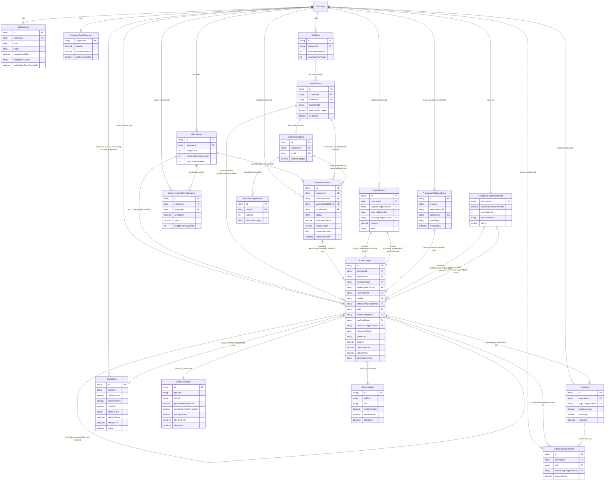

---

**Files/lines all citations above trace to** (verified directly against the current tree, not taken on any prior document's word): `apps/api/prisma/schema.prisma:244` (`Company`), `:401-415` (`UsageEvent`, Convention A), `:544-575` (`AiEmployee`), `:707-721` (`SkillExecution`, Convention B), `:729-...` (`Workflow`), `:800-864` (`WorkflowRun`), `:866-902` (`WorkflowStepRun`), `:981-995` (`Subscription`), `:1444-1481` (`WorkflowStepAttempt`, confirmed-dead `idempotencyKey`); `apps/api/src/modules/workflow-runtime/traversal.service.ts:377-387` (LOOP `forceNewStep` behavior driving the corrected `CreditReservation` key); `apps/api/src/modules/workflows/workflows.service.ts:876-890` (`retryRun`, driving `WorkflowRun.engineMode`); `apps/api/src/modules/admin/cron.controller.ts` (11-case switch, missing the reaper — driving the Q8 prerequisite); `apps/api/src/modules/usage/usage-rates.ts:9-10` (the flat rate `ModelCostRate` supersedes).

---

## 31. API Design

*Scope: which credit operations become public NestJS controller routes vs. internal-only service methods, and the full contract for every route that survives. File/line citations below are to the actual current code (verified directly, not from the prior synthesis alone): `apps/api/src/modules/billing/billing.controller.ts`, `billing-webhook.controller.ts`, `apps/api/src/modules/auth/decorators/{current-tenant,roles}.decorator.ts`, `apps/api/src/modules/authorization/authorization.policy.ts:35-50`, `apps/api/src/common/resilience/tenant-throttler.guard.ts`, `apps/api/src/modules/workflows/workflows.controller.ts:166,382` + `workflows.service.ts:916-993`, `apps/api/src/modules/admin/dlq.controller.ts`, `apps/api/src/modules/audit/audit-log.controller.ts`, `apps/api/src/modules/assist/assist.controller.ts:74,102,123`, `apps/api/src/modules/auth/auth.controller.ts` (`AUTH_THROTTLE`). No model named `Credit*` exists in `apps/api/prisma/schema.prisma` today — every endpoint below sits on top of the `CreditBalance`/`CreditReservation`/`CreditLedgerEntry` models designed in §10/§17, all CREATE NEW.*

### 31.0 Governing principle

A credit-affecting operation is only safe to expose as a public route if the **client is the legitimate originator of the request but not the authority on its size**. The client may say *"run this chat turn," "run this workflow," "buy this credit pack"* — the server alone computes what that costs and what to do about it. The moment an endpoint's input shape includes a number that represents *how many credits to move* (an estimate, an actual cost, a release amount, a refund amount), that endpoint is a vector for a client to simply declare a favorable number, and it must never be reachable over HTTP by anything but server-to-server code that already trusts its own computation. This is the same trust boundary this codebase already draws for Stripe webhooks (`StripeBillingProvider.parseWebhookEvent`, signature-verified, `providers/stripe-billing.provider.ts:89-158`) and for `applyWebhookEvent` being the *only* writer of `Subscription.status` — the credit ledger's balance-affecting fields need an equally narrow writer set.

### 31.1 Verdict on the candidate list

| Candidate | Verdict | One-line reason |
|---|---|---|
| `GET billing credits` | **PUBLIC** (split into two routes — see 31.2) | Read-only, no ledger mutation; balance is not sensitive the way spend-detail is. |
| `GET billing credits usage` | **PUBLIC, but ADMIN-gated** (separate controller/capability from the balance route) | Read-only, but line-item spend-by-employee is the same sensitivity class as `audit:read`, not `subscription`-level. |
| `POST billing credits purchase` | **PUBLIC** | Only *starts* a Stripe Checkout Session; mints zero credits itself — matches how `changePlan`/`portal` already work today (`billing.controller.ts:31-38,49-52`). |
| `POST billing credits reserve` | **INTERNAL ONLY** | The "how much" (`estimatedCredits`) must be computed server-side from the employee's config/tool cost class at the exact call site about to spend it, never accepted from a client. |
| `POST billing credits settle` | **INTERNAL ONLY** | The "actual cost" must be computed from the real `LlmProvider` token response or the real tool cost, never client-declared — a public settle would let a client under-report its own usage. |
| `POST billing credits release` | **INTERNAL ONLY** | Release is a consequence of a terminal failure classification the engine alone decides (`RetryPolicyService`'s never-retryable classes) — a public release lets a client un-hold credits for work it hasn't proven failed. |
| `POST billing credits refund` | **DOES NOT SURVIVE AS A CLIENT-CALLABLE ROUTE** | Splits into two things, neither of which is "a customer calls an endpoint that gives them credits back": (a) an internal handler driven by Stripe's `charge.refunded` webhook (§18), (b) the admin manual-adjustment endpoint (§31.4). A public refund endpoint is a self-service infinite-credit exploit: reserve → settle → call refund on your own settled entry → keep the AI output *and* the credits. |

Net: **two new public GET routes, one new public POST route, and one new admin-only POST route.** Everything else that touches `CreditBalance`/`CreditLedgerEntry.amount` is a private method called from inside `AgentRuntimeService`, `ai-step.handler.ts`, `SkillsService.runTool` (the existing choke point, `skills.service.ts` around line 596-597), and the durable engine's node-attempt processor — never from a controller.

---

### 31.2 Public endpoints

#### 31.2.1 `GET /billing/credits` — balance

- **METHOD / ROUTE**: `GET /billing/credits`, added to the existing `BillingController` (`@Controller('billing')`, `billing.controller.ts:16-17`).
- **AUTHORIZATION**: `@UseGuards(JwtAuthGuard, RolesGuard)` (class-level, already applied) with **no `@Roles()` metadata** on this handler — per the `Roles` decorator's own documented semantics ("a handler with NO `@Roles` metadata is open to any authenticated user," `roles.decorator.ts`), this makes it available to any authenticated MEMBER+ of the company, exactly mirroring the existing `GET /billing/usage` handler (`billing.controller.ts:41-44`) which carries the same no-`@Roles` shape today. Company scope comes from `@CurrentTenant()` (`current-tenant.decorator.ts`), never a client-supplied `companyId`.
- **INPUT**: none (companyId from JWT only).
- **OUTPUT** (new `CreditBalanceDto` in `packages/types`, mirroring the existing `PlanDto`/`SubscriptionDto`/`UsageDto` convention already imported at `billing.controller.ts:2`): `{ balance: number, reservedPending: number, includedThisPeriod: number | null, periodEnd: string | null, updatedAt: string }`. `reservedPending` is the sum of open `CreditReservation.estimatedCredits` for the company — surfaced so a company can see *why* their spendable balance looks lower than their last known total, distinct from the actual `CreditBalance.balance` (which is already net of reservations per §10.1).
- **ERROR cases**: 401 (no/invalid JWT — `JwtAuthGuard`). No 403 (open to all roles). No 404 — a `CreditBalance` row is created lazily on first read (or at signup, mirroring `ensureDefaultSubscription`'s self-healing pattern, `billing.service.ts:49-83`) rather than 404ing a company that has never earned/purchased credits.
- **IDEMPOTENCY**: N/A — pure read, no mutation.
- **RATE LIMIT**: the app-wide default `TenantAwareThrottlerGuard` bucket (keyed `company:<id>` off the verified JWT per `tenant-throttler.guard.ts:78-99`) is sufficient; this is a cheap indexed read on a single-row table (`CreditBalance.companyId @id`), no endpoint-specific `@Throttle()` override needed, same treatment as `GET /billing/subscription` and `GET /billing/usage` today (neither carries an override).
- **CREDIT EFFECT**: none. Read-only.
- **Malicious-client safety**: nothing to falsify — the response is entirely server-computed from `companyId`-scoped rows; a client cannot influence `balance` by any input, since there is no input.

#### 31.2.2 `GET /billing/credits/usage` — itemized ledger / spend breakdown

- **METHOD / ROUTE**: `GET /billing/credits/usage`, on a **new, separate** `CreditsController` (`@Controller('billing/credits')`), *not* added to `BillingController`.
- **Why a separate controller, not a method on `BillingController`**: `BillingController` applies `RolesGuard` at the class level; this route needs the **capability** pattern instead, for exactly the reason `AuditLogController` already gives for its own identical choice (`audit-log.controller.ts:27-31`, quoted in the hardened security design, §32.2): a per-employee, per-source spend breakdown is financial/operational detail of the same sensitivity class as the audit trail, not a "can I see my own bill total" question (which is what `GET /billing/credits` above answers). Mirroring `AuditLogController` exactly: `@UseGuards(JwtAuthGuard, AuthorizationGuard)` + `@RequirePermission('credits:read')`, a **new** capability added to the `MIN_ROLE` table in `authorization.policy.ts:35-50` (EXTEND, one line, same file already holding `'audit:read': 'ADMIN'`) with `MIN_ROLE['credits:read'] = 'ADMIN'`.
- **AUTHORIZATION**: OWNER/ADMIN only (via `credits:read`, floor `ADMIN`), tenant-scoped by `@CurrentTenant()`.
- **INPUT** (query params, following this codebase's existing convention of plain bounded-list query params — `@Query('limit')` already used in `dlq.controller.ts:55-56` and `conversations.controller.ts:26`, **not** a cursor/offset scheme, since none exists anywhere in this repo to reuse): `?employeeId=&source=&since=&until=&limit=` (all optional; `source ∈ {chat, workflow_ai_step, workflow_generator, assist, tool_call}`, reusing `UsageEvent.source`'s existing discriminator values plus the new `tool_call` value once `SkillExecution` gets a cost column, per Ground Truth Part A/§15).
- **OUTPUT** (new `CreditLedgerEntryDto[]`): each row `{ id, entryType, amount, balanceAfter, employeeId: string | null, source: string, refType: string | null, refId: string | null, createdAt }` — **credits only, never raw token counts**, preserving the existing internal-only-tokens rule already true of `/billing`'s `UsageSummary` (§15 of the hardened design).
- **ERROR cases**: 401 (no/invalid JWT), 403 (authenticated but role < ADMIN — the `AuthorizationGuard`/`credits:read` denial, same shape as an `audit:read` denial today), 400 (`since`/`until` not parseable as dates, `limit` not a positive integer — reuse the same validation idiom as the existing `limit` query params cited above).
- **IDEMPOTENCY**: N/A — pure read.
- **RATE LIMIT**: default `TenantAwareThrottlerGuard` bucket; no override needed (bounded by `limit`, same reasoning as 31.2.1).
- **CREDIT EFFECT**: none.
- **Malicious-client safety**: the query params only *filter* an already-tenant-scoped, already-immutable ledger; no param can cause a write, and `AuthorizationGuard` prevents a MEMBER-role token (even a valid one for the company) from reading it at all.

#### 31.2.3 `POST /billing/credits/purchase` — start a credit-pack purchase (Checkout Session only)

- **METHOD / ROUTE**: `POST /billing/credits/purchase`, added to the existing `BillingController`, alongside `changePlan`/`portal`.
- **AUTHORIZATION**: `@Roles('OWNER', 'ADMIN')` — identical floor to the two other money-adjacent handlers already on this controller, `changePlan` (`billing.controller.ts:33`) and `portal` (`billing.controller.ts:50`). A MEMBER cannot initiate a purchase, same as they cannot change plan or open the billing portal today.
- **INPUT** (new `PurchaseCreditsDto`, class-validator, mirroring `ChangePlanDto`'s `@IsIn(PLANS)` shape at `dto/change-plan.dto.ts`): `{ packId: string }` validated via `@IsIn(CREDIT_PACK_IDS)` against a **new** code-defined catalog file `apps/api/src/modules/billing/credit-packs.ts` (CREATE NEW, mirroring `billing.plans.ts`'s `PLAN_CATALOG` convention exactly, per §18's "Stripe Product/Price mapping" recommendation). No `quantity`, `amount`, or `creditAmount` field is ever accepted from the client — only a `packId` selecting a server-defined, fixed-price, fixed-credit-amount catalog entry (Option A from §18, "fixed discrete packs," already the recommended shape). This is the load-bearing anti-abuse property of this endpoint: **the client can pick *which* fixed thing to buy, never *how much* credit that purchase is worth.**
- **OUTPUT**: `{ checkoutUrl: string | null }` — `null` under mock billing, mirroring `getPortalUrl`'s existing `{ url: string | null }` null-under-mock convention (`billing.controller.ts:47-52`, `billing.service.ts`).
- **ERROR cases**: 401/403 as above; 400 (`packId` not in the catalog); 409/`ConflictException` if the company's `Subscription.status` is not eligible for new purchases under whatever gate the founder sets for `PAST_DUE` companies (ties to the still-open "`PAST_DUE` referenced nowhere outside the billing module" gap — this endpoint is a natural place to finally start checking it, closing part of `hiring-and-subscription-linkage.md:71-75`); 502/`BadGatewayException` if the Stripe SDK call itself fails (mirrors how `changePlan`'s Checkout-Session creation already surfaces provider errors).
- **IDEMPOTENCY**: this route **does not write to the ledger** (see CREDIT EFFECT below), so it needs no ledger-safety idempotency key. It should still accept the existing `Idempotency-Key` header convention (`@Headers('idempotency-key')`, `workflows.controller.ts:382`) purely as a **UX** safeguard against a slow double-click creating two separate Stripe Checkout Sessions: if the same `Idempotency-Key` is replayed within a short TTL, return the already-created session's URL instead of calling Stripe again (namespaced `checkout:{companyId}:{key}`, same find-then-return shape as `enqueueRun`, `workflows.service.ts:916-993`, stored in a small `id → stripeSessionUrl` cache row or the `Idempotency-Key` re-used against a `ProcessedWebhookEvent`-adjacent table — implementation detail, not a security requirement). This is explicitly **not** what prevents double-crediting; that protection lives entirely in the webhook (next paragraph).
- **RATE LIMIT**: an explicit `@Throttle()` override, following this codebase's existing precedent of tightening the default for actions that create real side effects — e.g. `workflows.controller.ts:166`'s `@Throttle({ default: { limit: 10, ttl: 60_000 } })` on run-creation, or `assist.controller.ts:102,123`'s `20 / 5 min` on generation calls. The exact number for *this* endpoint is not fixed anywhere in the repo. **Option A** — reuse the existing `10/60s` constant verbatim (simplest, zero new number to justify, already proven safe for a similarly side-effecting endpoint). **Option B** — a looser `5/5min` (purchases are rarer, deliberate actions than workflow runs; tighter absolute window reduces card-testing/Checkout-Session-spam risk). **Option C** — no override, rely on the global default (risks Checkout-Session spam being cheap to trigger). **PROPOSED, REQUIRES FOUNDER APPROVAL: Option A** (reuse `10/60s`) — it is not a pricing/business number, only an operational default already proven in this exact codebase, so the "founder approval" bar here is low-stakes and easily revised via the same `@Throttle()` literal later.
- **CREDIT EFFECT**: **none, directly.** This is the central safety property, stated per §17.1 emphatically: the endpoint's only effect is creating a Stripe Checkout Session (`mode: 'payment'`, `line_items: [{ price: STRIPE_PRICE_CREDITS_<packId> }]`, `metadata: { companyId, packId }`) and returning its hosted URL. **No `CreditLedgerEntry` is written here, and no `CreditBalance` is touched here.** The only path that ever credits the account is `POST /billing/webhook` (`billing-webhook.controller.ts`, already public/unguarded/signature-verified) receiving Stripe's `checkout.session.completed` event, verified via `stripe.webhooks.constructEvent` (already correct, `providers/stripe-billing.provider.ts:89-158`), deduped via the **new** `ProcessedWebhookEvent{externalEventId @unique}` table (§17.2/§32.4) before writing one `CreditLedgerEntry(type=PURCHASE)` inside the same transaction as the dedupe-row insert. **A malicious client that calls this endpoint, ignores the returned URL, and never pays gets zero credits** — there is no code path from "I called `/purchase`" to "my balance went up" that does not pass through a Stripe-signature-verified webhook.

---

### 31.3 Internal-only operations — reserve, settle, release (and why no route exists)

None of `reserve`, `settle`, or `release` gets a controller, a route, a DTO, or a Swagger entry. They are private methods on a new `CreditLedgerService` (or equivalent), called **only** from inside already-identified server-side choke points — no new call sites are introduced beyond where these audits already say the check belongs:

| Operation | Called from (existing code, not a new endpoint) | Why public would be unsafe |
|---|---|---|
| `reserve(companyId, idempotencyKey, estimatedCredits, resourceType, refs)` | `AgentRuntimeService.assertUnderBudget`/pre-call site (`agent-runtime.service.ts:484-519`), `ai-step.handler.ts:56-68`, `SkillsService.runTool` immediately before `execute()` (`skills.service.ts` ~596-597) | `estimatedCredits` must be derived from the employee's own configured model/`maxTokens`/tool cost class **at that exact call**, computed server-side. A public `reserve` endpoint would require the client to supply that number, and a client that lies low gets its real (expensive) call to run anyway while holding only a token reservation — the entire overspend-prevention property of §10.4 depends on the estimate being untouchable by the caller. |
| `settle(reservationId, actualCredits)` | The same call sites, immediately after the real `LlmProvider`/tool response returns | `actualCredits` must come from the provider's own returned token usage (`LlmUsage{promptTokens, completionTokens}`) or the tool's real cost, never a client claim. A public settle lets any authenticated user call `settle(myReservationId, 0)` and walk away having paid nothing for real, executed work — this is the single most direct "fake a settlement" attack the task calls out, and it is closed simply by there being no HTTP path to it at all. |
| `release(reservationId, reason)` | The durable engine's failure-classification path (never-retryable `RunFailureClass`s) and `ReaperService.sweepExpiredLeases()`'s credit-analogue sweep (§10.4) | Release must follow a *proven* terminal failure the engine itself observed (e.g. `VALIDATION_ERROR` before any provider call happened) — a public release would let a client reserve credits for an operation it intends to let succeed, then immediately release the hold while the operation keeps running in the background, effectively getting the work for free. |

All three share one storage-layer safety net regardless of caller: the guarded conditional `updateMany` on `CreditBalance.balance` (`WHERE {companyId, balance: {gte: amount}}`, §12) and the `@@unique([companyId, idempotencyKey])` constraint on `CreditReservation` (§11) — so even a *bug* that somehow invoked these methods twice for the same logical operation cannot double-decrement or double-settle. But that DB-level safety is a second layer, not a substitute for the primary control, which is: **these three operations have no HTTP surface at all.**

### 31.4 Refund — split, not a public route

- **Stripe-initiated refunds** (`charge.refunded`): handled entirely inside the existing `POST /billing/webhook` controller (`billing-webhook.controller.ts`) — a new `case 'charge.refunded':` branch in `applyWebhookEvent`/its Stripe-event dispatcher, writing one `CreditLedgerEntry(type=REFUND)` capped per §18's Option A (`min(refundedPackCreditAmount, currentBalanceFromThatLot)`), deduped through the same `ProcessedWebhookEvent` table as every other webhook-driven ledger write. **No client request triggers this** — it only fires when Stripe itself reports a refund that happened on Stripe's side (support-initiated or dispute-driven), which this codebase has no other path to learn about.
- **Everything else that looks like "give this company credits back"** (a support agent correcting a bad charge, a goodwill grant, an enterprise off-platform settlement per §18's Enterprise-pack section) is **not** a distinct `refund` verb at all — it is the general-purpose admin adjustment endpoint below, using `entryType='ADJUSTMENT'` with a signed amount and a mandatory reason. Deliberately not giving "refund" its own client-reachable route avoids multiplying the number of money-moving endpoints beyond the one that is maximally guarded.

---

### 31.5 Admin-only: manual credit adjustment (the most protected mutation in the system)

Per the security design's own finding (§32.3): **no platform-internal admin/operator identity exists anywhere in this codebase today** — grep for `PlatformAdmin|SUPER_ADMIN|isPlatformAdmin` across `apps/api/src` returns zero matches, and the only `Role` enum (`OWNER|ADMIN|MEMBER`, `schema.prisma:19-22`) is scoped per-`companyId` with no exception. This endpoint is therefore built on a **new identity axis**, not an extension of `@Roles('OWNER','ADMIN')` — a company OWNER must be structurally incapable of calling it, full stop, no matter how the `Role` enum evolves.

- **METHOD / ROUTE**: `POST /internal/platform-admin/companies/:companyId/credits/adjustments` — deliberately **not** under `/billing` (that prefix's controllers assume `@CurrentTenant()` tenant-scoping; this route is the one place in the whole design that must operate *cross*-tenant, per §32.1's own named exception) and deliberately **not** namespaced under any path an ordinary API client would ever have reason to probe (`/internal/platform-admin/...`, mirroring how sensitive infra like `/admin/cron/:job` already uses a distinct-secret, distinct-purpose prefix per `platform/CLAUDE.md`'s cron section).
- **AUTHORIZATION**: a **new** `PlatformAdminGuard`, applied *instead of* (not layered on top of) `JwtAuthGuard` — it authenticates a **platform-operator token**, a structurally different credential (different signing secret/audience claim) from a company-user JWT, exactly so a bug in `Role`-based logic can never accidentally grant this power to a customer (§32.3, point 2). Concretely: reject any request whose bearer token was issued by the company-JWT path at all, before even looking at claims/roles inside it. Additionally: **no self-adjustment** — the endpoint rejects (403) if the resolved `:companyId` matches any company the calling `PlatformOperator` is itself associated with (mirrors the "a USER-routed approval is decidable only by that user, no self-override" principle already enforced elsewhere in this codebase's approval routing, applied one level up).
- **INPUT** (new `AdjustCreditsDto`): `{ amount: number (signed, non-zero, integer), reason: string (@MinLength(10), mirroring the DTO-validation convention already used in RegisterDto), externalRef?: string (e.g. a support-ticket or contract id) }`. `companyId` is a **path** param, not a body field — used only to target the mutation, never to widen scope (per §32.1's own rule: a path/body `companyId` is fine for *targeting* a specific, already-authorized cross-tenant write; it is never trusted the way `@CurrentTenant()` is trusted for scoping a company's *own* request).
- **OUTPUT**: `{ ledgerEntryId: string, balanceBefore: number, balanceAfter: number, auditLogId: string }` — returning both the ledger entry id and the `AuditLogService.record` id it also produced (see CREDIT EFFECT below), so the caller has both trails' identifiers in one response.
- **ERROR cases**: 401 (no/invalid platform-operator token — never falls back to accepting a company JWT), 403 (valid platform-operator token but self-adjustment on the operator's own company, or a platform-operator role below whatever internal tier is required — e.g. read-only support staff vs. finance-ops), 400 (missing/short `reason`, `amount === 0`), 404 (`companyId` does not exist), 409 (a concurrent duplicate submission under the same `Idempotency-Key`, resolved per below — not an error to the *caller*, but the guarded-`updateMany`/`P2002` race path internally).
- **IDEMPOTENCY**: mandatory (not optional, unlike the purchase route) `Idempotency-Key` header, namespaced `adjustment:{companyId}:{key}`, checked against a unique constraint on the `CreditLedgerEntry` (or a dedicated small table) before any balance mutation — the exact find-then-create-then-catch-`P2002`-then-refetch idiom already proven three times in this codebase (`enqueueRun`, `workflow-templates.service.ts:184-287`). This exists because a manual adjustment is, by definition, a human clicking a button in an internal tool — the one class of request most likely to be double-submitted by a nervous operator re-clicking after a slow response, and the one class of request where a duplicate is a real, uncaught dollar loss (unlike `reserve`/`settle`, which are machine-to-machine and already covered by §11's run/node-keyed idempotency).
- **RATE LIMIT**: a conservative per-operator throttle (not per-company, since the caller is the platform operator, not a tenant) — the specific number is not fixed anywhere in the repo; functionally this endpoint has almost no legitimate high-frequency use case (a human filing individual support corrections), so **Option A** (a low fixed ceiling, e.g. reusing `AUTH_THROTTLE`-style conservative windows already defined in `auth.controller.ts` for other rare-but-sensitive actions) is the natural fit; **PROPOSED, REQUIRES FOUNDER APPROVAL** only insofar as the exact number is a threshold the instructions require flagging — the mechanism itself (per-operator, not per-tenant) is not in question. The primary defense against abuse here is authentication/authorization strength (§32.3), not throughput limiting — a compromised platform-operator credential is a bigger problem than its rate limit.
- **CREDIT EFFECT**: inside one `$transaction` (mirroring `EmployeesService.create`'s tx shape): (1) atomic `increment`/`decrement` of `CreditBalance.balance` by `amount`; (2) insert `CreditLedgerEntry{type: 'ADJUSTMENT', amount, balanceAfter, sourceRef: externalRef, metadata: {reason, operatorId}}`; (3) a call to `AuditLogService.record` (the existing tamper-evident hash-chain, `audit-log.service.ts:87-92`, already used for other sensitive billing-state transitions like the `PAST_DUE` transition) carrying the operator id, reason, and before/after balance. Per §32.3: **this dual-write (ledger row + hash-chained audit row) is non-negotiable** — an adjustment must never be a side-table "override" that could let the balance and the ledger disagree; it is fully accounted for in the same stream as every purchase and debit.
- **Malicious-client safety, restated**: even a fully-authenticated, fully-authorized platform operator cannot adjust their own company, cannot submit a zero/empty-reason adjustment, and cannot double-submit the same correction — and anyone *without* a genuine platform-operator credential (including every company OWNER, no matter how privileged inside their own tenant) is rejected before role logic is even consulted, because the guard checks the token's structural type, not a claim inside a token type this endpoint also accepts from elsewhere. Per §32.5, repeated `PlatformAdminGuard` failures against this route should themselves be logged as a fraud signal (the endpoint being probed at all is meaningful, independent of success).

---

### 31.6 Summary table

| Endpoint | Public? | Auth | Idempotency | Credit effect |
|---|---|---|---|---|
| `GET /billing/credits` | Yes | any MEMBER (JWT only) | N/A (read) | none |
| `GET /billing/credits/usage` | Yes | `credits:read` capability, ADMIN floor | N/A (read) | none |
| `POST /billing/credits/purchase` | Yes | `@Roles('OWNER','ADMIN')` | optional, UX-only (`Idempotency-Key` → dedupe Checkout Session creation) | **none directly** — only the webhook credits |
| `POST /billing/webhook` (existing, extended) | Yes (already public, unguarded, signature-verified) | Stripe signature only | mandatory — new `ProcessedWebhookEvent.externalEventId @unique` | the only path that ever writes PURCHASE/SUBSCRIPTION_GRANT/REFUND entries |
| `reserve` / `settle` / `release` | **No — internal service methods only** | N/A (not HTTP-reachable) | run/node-keyed (`sha256(runId:nodeId)`) or message-id-keyed, per §11 | the core RESERVE/SETTLE/RELEASE ledger movements |
| `refund` (client-callable) | **No — does not exist as a route** | — | — | folded into the webhook (Stripe-initiated) or the admin adjustment (support-initiated) |
| `POST /internal/platform-admin/companies/:companyId/credits/adjustments` | Admin-only (platform operator, not a company role) | `PlatformAdminGuard` (new, distinct token type) + no-self-adjustment | mandatory `Idempotency-Key` | ADJUSTMENT entries, dual-written to the hash-chained audit log |

---

### 31.7 Numbers this section does not fix

- Exact `@Throttle()` request/window pair for `POST /billing/credits/purchase` and the admin adjustment endpoint — Options given at 31.2.3 and 31.5, both **PROPOSED, REQUIRES FOUNDER APPROVAL**, though both are low-stakes operational defaults rather than pricing decisions.
- The credit-pack catalog itself (`packId` values, their prices, their credit amounts) — already deferred to §18 ("Option A — fixed discrete packs," **PROPOSED, REQUIRES FOUNDER APPROVAL**) and reused here unchanged; this section only fixes that the purchase endpoint's input is a `packId` enum, never a numeric amount.

**Files this design touches or creates** (for the implementer, not claimed as already existing): EXTEND `apps/api/src/modules/billing/billing.controller.ts` (2 new methods), EXTEND `apps/api/src/modules/authorization/authorization.policy.ts` (`MIN_ROLE['credits:read']='ADMIN'`), CREATE NEW `apps/api/src/modules/billing/credits.controller.ts`, CREATE NEW `apps/api/src/modules/billing/credit-packs.ts`, CREATE NEW `apps/api/src/modules/billing/platform-admin/*` (guard + controller + DTO), CREATE NEW `CreditBalanceDto`/`CreditLedgerEntryDto`/`PurchaseCreditsDto`/`AdjustCreditsDto` in `packages/types`, EXTEND `apps/api/src/modules/billing/billing-webhook.controller.ts`'s underlying `applyWebhookEvent` dispatch (new `checkout.session.completed`-for-credits / `invoice.payment_succeeded` / `charge.refunded` branches, all gated by the new `ProcessedWebhookEvent` dedupe table per §17.2/§32.4).

---

## 29. Complete System Flow Diagrams

*Every diagram below reflects the hardened design from the kill-critic pass (Q2/Q3/Q5/Q6/Q8/Q17 fixes), not the original draft. Where a fix changes the flow materially, the diagram calls it out inline and the explanation names the finding it closes.*

### 29.1 New user signup leading to free credits granted

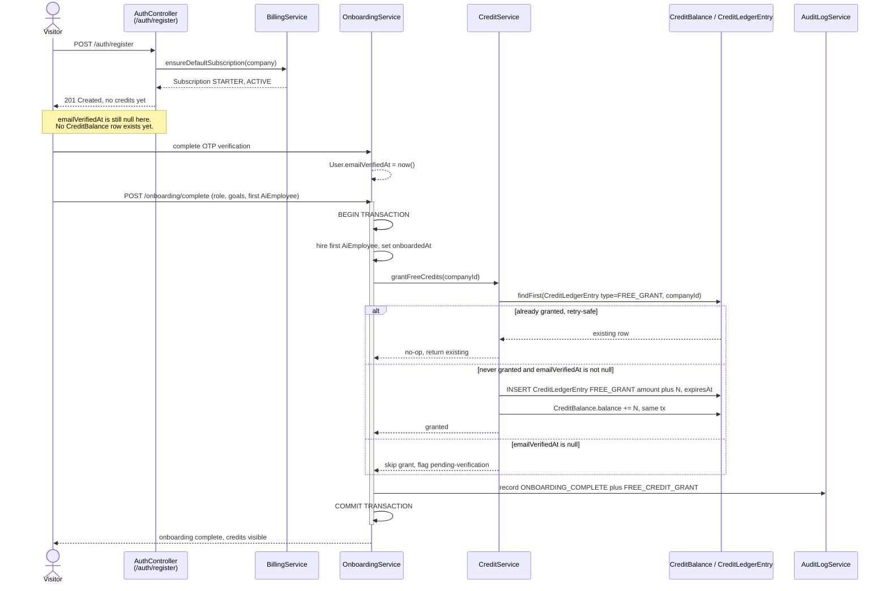

Free credits are granted at `OnboardingService.complete()`, not at `/auth/register`, per §7.2 Option B — an account with zero AI Employees and no confirmed email never becomes spend-capable. The grant sits inside the same idempotent transaction that hires the first `AiEmployee`, using a find-then-create check on `CreditLedgerEntry{type:FREE_GRANT}` so a retried onboarding-complete call never double-grants. It is additionally gated on `emailVerifiedAt !== null` (§7.8's most actionable item), closing the "onboard with a throwaway address" surface the base design flagged but didn't enforce. Both the ledger insert and the balance increment happen in the same transaction as the onboarding write and the existing `AuditLogService.record` call, so a crash mid-grant can never leave one without the other.

### 29.2 Credit pack purchase end-to-end including webhook

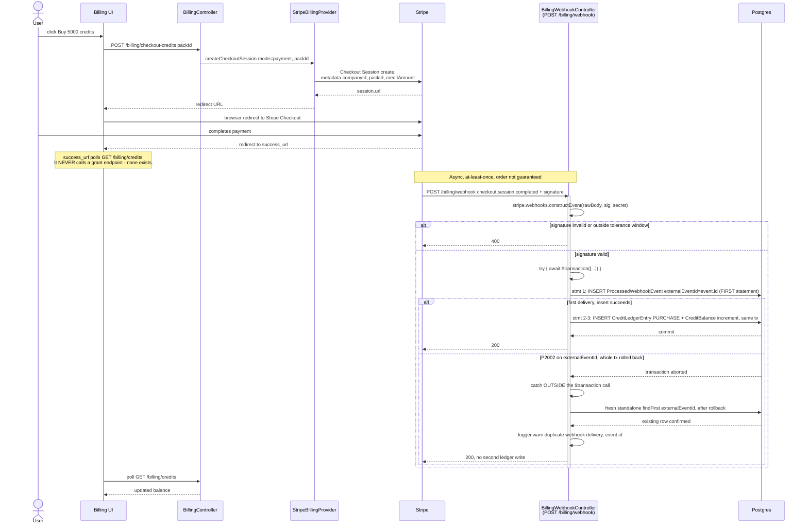

The redirect to `success_url` is purely cosmetic — the UI polls `GET /billing/credits` but no endpoint lets the browser itself grant credits, so a captured or replayed redirect can never mint them (§17.1). The handler follows the corrected §Q5 idiom exactly: the `ProcessedWebhookEvent` insert is the *first* statement inside `$transaction`, the `try/catch` for `P2002` wraps the *entire* `$transaction(...)` call rather than code inside its callback, and the re-query after a caught collision is a fresh, standalone `findFirst` issued only after the failed transaction has fully rolled back — mirroring the one place this idiom is actually implemented correctly today, `workflow-templates.service.ts:223-289`, not the ambiguous "catch it, re-fetch" prose from the original draft. Signature verification uses an explicit, tested tolerance constant rather than an implicit SDK default (§Q6), and every duplicate delivery is logged with `event.id` so replay attempts are observable. Credits post exactly once per real Stripe event regardless of redelivery count.

### 29.3 Subscription credit allocation and renewal

```mermaid
sequenceDiagram
    participant Cron as /admin/cron/:job subscription-credit-grant
    participant Sub as Subscription table
    participant Stripe as Stripe
    participant Hook as BillingWebhookController
    participant Cred as CreditService
    participant DB as CreditLedgerEntry / CreditBalance

    alt Company on StripeBillingProvider, real card on file
        Stripe->>Hook: invoice.payment_succeeded, billing_reason=subscription_cycle
        Hook->>Hook: verify signature + ProcessedWebhookEvent dedupe, per 29.2
        Hook->>Hook: billingPeriodStart = invoice.period_start, Stripe epoch, never Date.now()
        Hook->>Cred: allocateSubscriptionCredits(companyId, plan, billingPeriodStart)
        Cred->>DB: findFirst CreditLedgerEntry SUBSCRIPTION_GRANT,<br/>externalRef alloc companyId subId billingPeriodStart
        alt already granted for this period
            DB-->>Cred: existing row, no-op
        else not yet granted
            Cred->>DB: INSERT SUBSCRIPTION_GRANT, expiresAt=period end
            Cred->>DB: CreditBalance += includedCreditsPerMonth, same tx
        end
        Hook-->>Stripe: 200
    else Company on MockBillingProvider, no card, Stripe events never fire
        Note over Cron,Sub: mock is the DEFAULT provider; invoice.payment_succeeded never fires for it - Q17 fix
        Cron->>Sub: SELECT companies WHERE provider=mock AND status=ACTIVE
        Cron->>Sub: renewal due = Subscription.createdAt (absolute instant) + N times 30 days,<br/>never a server wall-clock month-boundary check
        alt renewal instant has passed, not yet granted for this cycle index
            Cron->>Cred: allocateSubscriptionCredits(companyId, plan, cycleIndex)
            Cred->>DB: same idempotent find-or-create grant,<br/>externalRef alloc companyId subId cycle-index
        end
    end
```

The renewal grant rides on `invoice.payment_succeeded` with `billing_reason: subscription_cycle` for real Stripe subscribers, with `billingPeriodStart`/`expiresAt` always taken from Stripe's own absolute epoch fields rather than a server-clock calendar truncation — closing the exact bug class this codebase already shipped once in `apps/web/src/features/workflows/schedule.ts:19-20`. Because `MockBillingProvider` is the platform's actual default (`ensureDefaultSubscription`, `billing.service.ts:49-83`) and never populates `currentPeriodEnd` or fires any webhook, an `/admin/cron/:job` sweep is a required second grant path for mock subscriptions — the original design's claim that `currentPeriodEnd` "is already populated from Stripe events today" was false for this path (§Q17). The mock-path cron computes due renewals off the stored, absolute `Subscription.createdAt` instant plus a fixed cycle length, never off "is today a new calendar month." Both paths funnel into the same idempotent find-or-create grant, so a webhook and a cron sweep racing for one company can never double-grant.

### 29.4 AI execution — full reserve-execute-settle path including the idempotency check

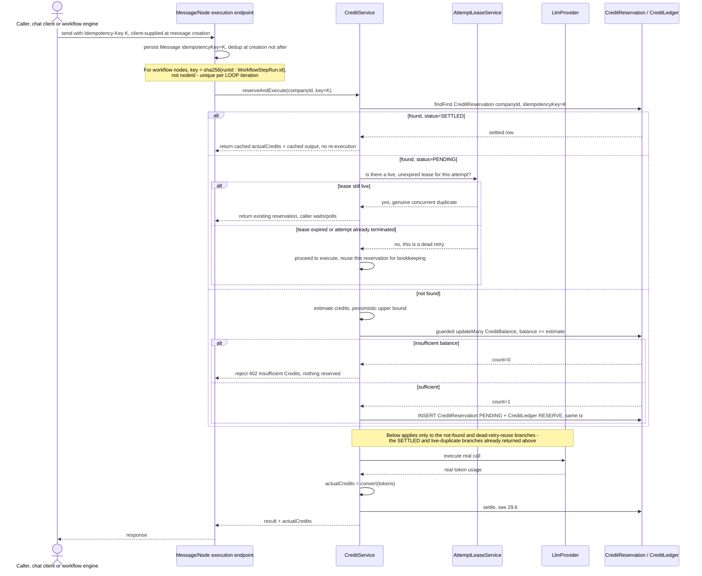

The chat idempotency key is now a real client-supplied key persisted on the `Message` row at creation time — a requirement this design adds, closing §Q3a's finding that `Message.id` alone doesn't dedupe a genuine double-click since two clicks create two different `Message` rows. For workflow nodes the key is `sha256(runId:WorkflowStepRun.id)`, not `sha256(runId:nodeId)` — since `WorkflowStepRun.id` is unique per LOOP iteration (`traversal.service.ts:377-387`) while `nodeId` is not, this closes §Q3c's silent under-execution bug where every loop pass after the first would replay iteration 1's cached output. A reservation found `PENDING` is no longer treated as an automatic "wait" — the design checks whether a live, unexpired lease actually owns it (§Q3b); a dead retry (owning attempt already terminated) proceeds and reuses the reservation instead of polling forever against nothing. A `SETTLED` reservation short-circuits entirely with zero re-execution and zero re-charge.

### 29.5 Credit reservation — the atomic check-and-reserve race

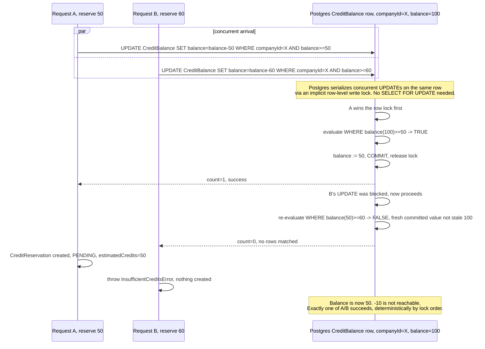

This is the idiom already load-bearing elsewhere — `ApprovalService.decide`'s guarded `updateMany` (`approval.service.ts:381`), the `ApprovalSlaService` guards, and `InterviewSlot`'s atomic claim — and §Q2's review confirms this specific arithmetic is sound as designed. Postgres treats a single `UPDATE` as one atomic read-modify-write against the current committed row value with an implicit write lock, so B's statement, once unblocked, re-evaluates its own `WHERE balance>=60` against the *post-A* value of 50, not a value read before A committed. This makes `count===0` on B a deterministic outcome whenever the combined reservations would overdraw the balance, not a probabilistic race that occasionally gets caught. No `SELECT ... FOR UPDATE`, version column, or advisory lock is needed for this guarantee, matching the architecturally-consistent choice confirmed in §12.4.

### 29.6 Credit settlement

```mermaid
sequenceDiagram
    participant Node as Node handler / AgentRuntimeService
    participant RSW as RunStateWriter transitionStep / transitionRun
    participant Cred as CreditService.settle
    participant DB as CreditReservation / CreditLedger / CreditBalance

    Node->>Node: execution finishes, success or terminal failure
    Node->>RSW: transitionStep attemptId, status COMPLETED/FAILED/CANCELLED/TIMED_OUT
    Note over RSW: Same call site ReaperService already uses at reaper.service.ts:177-187 -<br/>settlement is hooked here, not on a separate timer - Q2 fix
    activate RSW
    RSW->>Cred: settle(reservationId, actualCredits)
    Cred->>DB: guarded updateMany id=reservationId, status=PENDING -> status=SETTLED, actualCredits, settledAt
    alt count=0, already settled or expired by a racing path
        DB-->>Cred: no-op
        Cred-->>RSW: return existing status/actualCredits, idempotent
    else count=1
        DB-->>Cred: updated
        Cred->>DB: same tx: CreditBalance += (estimated-actual);<br/>INSERT CreditLedger SETTLE amount=-actual;<br/>INSERT CreditLedger RELEASE amount=+(estimated-actual)
        DB-->>Cred: committed
        Cred-->>RSW: settled
    end
    RSW->>RSW: commit run/step state transition
    deactivate RSW
```

Settlement is triggered directly by the same `RunStateWriter.transitionStep`/`transitionRun` call every terminal node outcome already passes through — the identical hook point `ReaperService` uses at `reaper.service.ts:177-187` — rather than a second, independently-timed mechanism (§Q2's required fix). This means the workflow's own source of truth and the credit ledger's source of truth can never drift the way the original design allowed: a node marked `FAILED` by the reaper is settled in the same breath, not left `PENDING` under a `runId` nothing will ever revisit. The settle step is the guarded `updateMany` idiom mirroring `ApprovalService.decide`, so a race to settle the same reservation always resolves exactly once — the loser's `count===0` returns the already-settled result rather than erroring. Balance adjustment and both ledger rows write in the same transaction as the status flip, so a crash between them is impossible by construction.

### 29.7 Failed execution — hardest case: provider charged, Orlixa never got the response

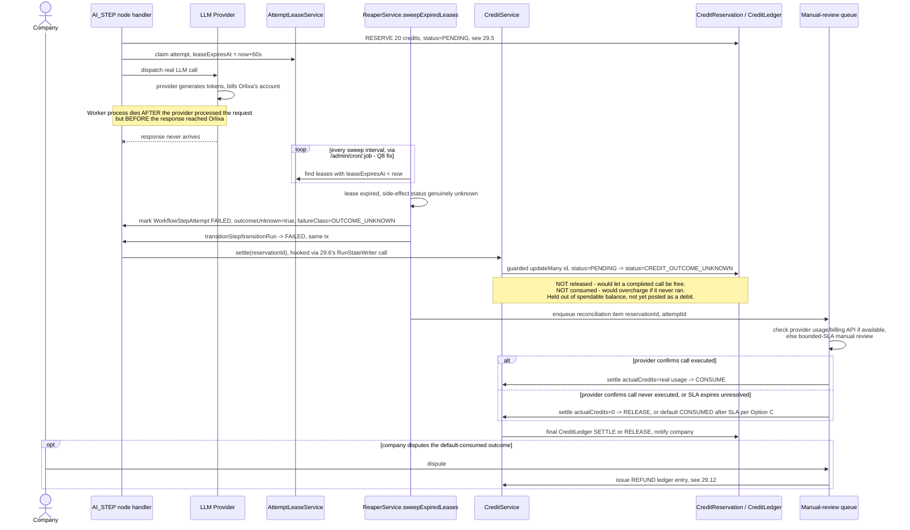

This is Case 4/8 from the failed-execution matrix, and adopts Option C, "hold-and-reconcile," over optimistic release or pessimistic consume. Detection rides on the exact lease-expiry mechanism already proven for workflow recovery (`AttemptLeaseService`/`ReaperService.sweepExpiredLeases`), invoked from `/admin/cron/:job` rather than only a BullMQ-repeatable job — closing §Q8's finding that the base design's sweep would inherit the platform's own un-remediated `QUEUE_WORKERS_ENABLED=false` gap and never run on the Vercel-only `apps/api` deployment. The reservation parks in a new `CREDIT_OUTCOME_UNKNOWN` state — mirroring `WorkflowStepAttempt.outcomeUnknown` — held out of spendable balance without being posted as a final debit, then routed to a bounded-SLA manual-review queue that defaults to consumed if unresolved, with a customer-facing refund as the escape valve. The system never auto-retries this call, matching the codebase's own principle that re-running a possibly-completed payment is a worse failure than surfacing it to a human.

### 29.8 Workflow execution consuming credits across multiple nodes, including an APPROVAL wait that does not consume credits

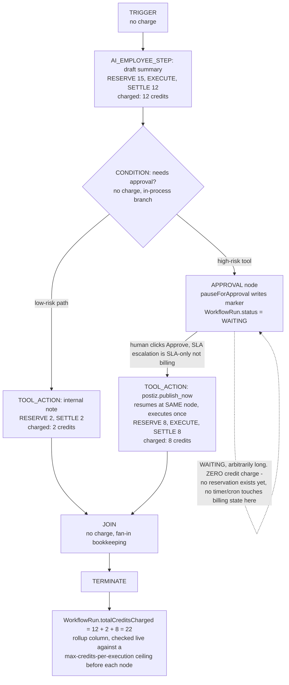

Charging only happens at the moment a node handler actually invokes a provider, so `TRIGGER`, `CONDITION`, `JOIN`, and `TERMINATE` are structurally free — they never call `SkillsService.runTool` or an LLM provider (§14.1, §14.5). `APPROVAL` is the key case: `pauseForApproval()` (`workflow-engine.service.ts:499-579`) flips `WorkflowRun.status=WAITING` before any reservation is created, and no cron/sweep in this codebase (`ApprovalSlaService`, the legacy watchdog, the reaper) ever reads or writes a cost/credit field, so a run can sit `WAITING` for hours or days at zero cost, bounded only by unrelated SLA timers. When approval is granted, execution resumes at the *same* gated node, which reserves and settles exactly once — the wait itself was never a chargeable event, not a charge merely deferred. The per-run rollup is checked live before each cost-bearing node attempt, which is what would hard-stop a `LOOP`/`PARALLEL` construct mid-flight rather than after the damage is billed.

### 29.9 Low-credit warning triggering

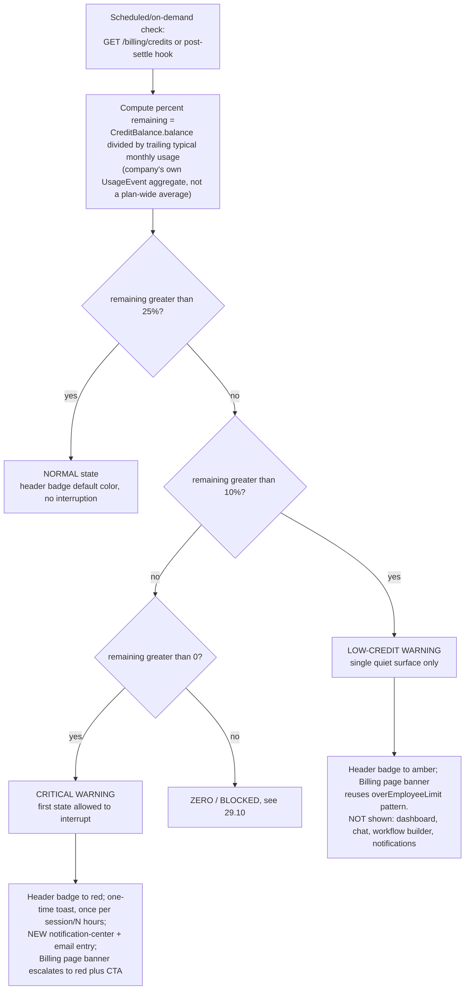

The percentage-remaining computation uses the company's own trailing `UsageEvent` aggregate as the denominator, not a flat plan-wide average, so a light user isn't warned prematurely and a heavy user isn't warned late (§21). The two thresholds (25% Low, 10% Critical — Option B, still `PROPOSED, REQUIRES FOUNDER APPROVAL`) fan out to deliberately different-sized surface sets: Low touches exactly one quiet spot (header badge + the existing amber `UsageSummary.tsx` banner pattern, reused verbatim) and nothing else, while Critical is the first state allowed to interrupt at all, adding a one-time toast and the system's first notification-center/email entry for billing. Nothing fires on the workflow builder canvas or per-chat-message chrome at Normal or Low, by explicit design to avoid the warning-fatigue pattern the task calls out. This reuses an existing soft-limit visual language rather than inventing a new one, consistent with every other cost figure in the product already being labelled an estimate.

### 29.10 Zero-credit block preventing a new paid execution

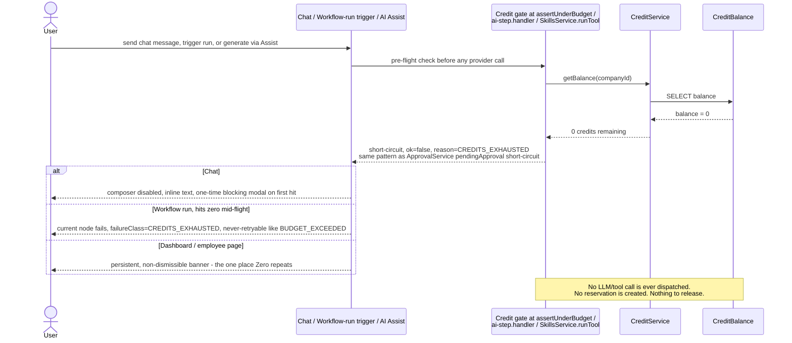

The Zero-credit block reuses the exact choke points already identified for cost metering — `AgentRuntimeService.assertUnderBudget`, `ai-step.handler.ts`, and `SkillsService.runTool` — extending the existing advisory-budget short-circuit rather than inventing a new gate (§21). It mirrors `ApprovalService`'s `pendingApproval:true` short-circuit: the call returns a structured `ok:false, reason:CREDITS_EXHAUSTED` before any provider is dispatched, so — consistent with Case 1 of the failed-execution matrix — nothing is reserved and nothing needs releasing. A workflow reaching zero mid-run fails its current node with a new `CREDITS_EXHAUSTED` failure class, deliberately never-retryable like the existing `BUDGET_EXCEEDED` class, rather than silently stalling. Per §21, Zero is the one state allowed to repeat across multiple surfaces because the goal shifts from "don't annoy" to "make the blocker impossible to miss."

### 29.11 Stripe webhook processing with signature verification plus idempotency

```mermaid
sequenceDiagram
    participant Stripe as Stripe
    participant Hook as BillingWebhookController, public, reads req.rawBody
    participant SBP as StripeBillingProvider.parseWebhookEvent
    participant DB as ProcessedWebhookEvent / CreditLedger / Subscription

    Stripe->>Hook: POST body + Stripe-Signature header t=..., v1=...
    Hook->>SBP: constructEvent(rawBody, signature, secret, tolerance=300s explicit constant)
    alt HMAC invalid OR timestamp outside 300s tolerance
        SBP-->>Hook: throws SignatureVerificationError
        Hook-->>Stripe: 400, forged or stale-replayed payload rejected before dedupe even runs
    else valid
        SBP-->>Hook: event id, type, data
        Hook->>Hook: try { await prisma.$transaction([...]) }
        Hook->>DB: stmt 1, FIRST statement: INSERT ProcessedWebhookEvent externalEventId=event.id
        alt event.id already exists, P2002
            DB-->>Hook: unique violation, whole transaction aborted and rolled back
            Hook->>Hook: catch OUTSIDE the $transaction call, not inside its callback
            Hook->>DB: fresh standalone findFirst externalEventId, after rollback completes
            DB-->>Hook: existing row
            Hook->>Hook: logger.warn duplicate/replayed webhook, event.id, event.type
            Hook-->>Stripe: 200, idempotent no-op, observable via log/metric
        else insert succeeds
            Hook->>DB: stmts 2..N, same tx, dispatch on event.type:<br/>checkout.session.completed payment -> PURCHASE;<br/>invoice.payment_succeeded subscription_cycle -> SUBSCRIPTION_GRANT;<br/>customer.subscription.updated/deleted -> Subscription status,<br/>guarded by event.created vs lastAppliedEventCreatedAt;<br/>charge.refunded -> REFUND
            DB-->>Hook: committed
            Hook-->>Stripe: 200
        end
    end
```

Two protections made explicit rather than implicit per §Q6: the signature-timestamp tolerance is a stated, tested constant (not a silent dependency on the Stripe SDK default), and every detected duplicate `externalEventId` is logged distinctly from first-time processing so a burst of replayed, validly-signed webhooks is observable, not just silently blocked. The transaction shape corrects §Q5's flagged defect: the `ProcessedWebhookEvent` insert is the literal first statement, the `try/catch` wraps the entire `$transaction(...)` call rather than code inside its callback, and the re-query after a caught `P2002` is a fresh standalone call issued only once the aborted transaction has fully rolled back — Postgres refuses any further statement inside an already-aborted transaction block. Subscription-status events additionally compare `event.created` against a stored `lastAppliedEventCreatedAt` before overwriting status fields, closing the existing `applyWebhookEvent` "no timestamp guard" bug (`hiring-and-subscription-linkage.md:90`). Credit ledger writes need no equivalent guard since they're additive and keyed by event id, not last-write-wins.

### 29.12 A refund

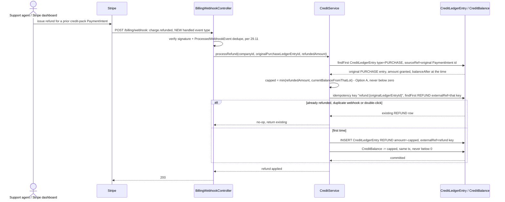

`charge.refunded` is a genuinely new handled event type — confirmed absent from the current `parseWebhookEvent` switch — and must be added (§18). The refund amount is capped at `min(refundedPackAmount, currentBalanceFromThatLot)` — Option A from §18 — so a refund can never push a balance negative even if most of the purchased credits were already spent, avoiding any need for a debt/dunning mechanism, which doesn't exist anywhere in this codebase. The refund is idempotency-keyed on `refund:{originalCreditLedgerEntryId}`, so a redelivered webhook or a manual double-click can never debit twice for the same refund. The ledger is append-only and signed negative — the original `PURCHASE` entry is never edited or deleted — preserving a complete, inspectable audit trail per §23's "never hidden" rule.

### 29.13 Admin reconciliation sweep

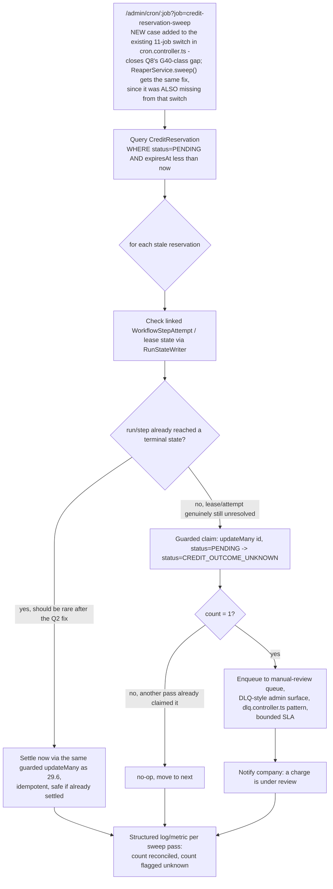

This sweep is registered as a named case in the existing `/admin/cron/:job` switch (`cron.controller.ts`) alongside the platform's other 11 time-based jobs, rather than existing only as a BullMQ-repeatable job — the base design's modeling on `ReaperService.sweepExpiredLeases()` inherited that method's own un-remediated gap of never running when `QUEUE_WORKERS_ENABLED=false` (the platform's own documented Vercel-only deployment mode), which meant "no recovery, ever" rather than "a reconciliation window" (§Q8, the review's most severe finding). Because settlement is now hooked directly into `RunStateWriter.transitionStep`/`transitionRun` (§Q2's fix, 29.6), most reservations should already be resolved by the time this sweep runs — it exists specifically to catch the residual case where run/step state is still genuinely unresolved, and only those get promoted to `CREDIT_OUTCOME_UNKNOWN` via the same guarded-`updateMany` claim idiom used everywhere else. Every pass emits a structured log/metric of reconciled-versus-flagged counts, closing the observability gap flagged for silent duplicate detection elsewhere (§Q6) and matching the WAVE 9 lesson that alerts must actually reach somebody.

### 29.14 Enterprise custom-credit grant by an internal admin

```mermaid
sequenceDiagram
    actor Sales as Sales / Account team
    actor Admin as Internal Admin, Roles ADMIN
    participant EP as POST /admin/companies/:id/credit-grant<br/>NEW, Roles ADMIN gated internal endpoint - Option B
    participant Cred as CreditService
    participant Audit as AuditLogService
    participant DB as CreditLedgerEntry / CreditBalance

    Sales->>Sales: negotiate off-platform contract/PO;<br/>ENTERPRISE stays non-self-serve, matches changePlan's existing contact-sales block
    Sales->>Admin: contract signed, amount and terms agreed
    Admin->>EP: POST companyId, amount, expiresAt optional, contractRef, reason
    EP->>EP: require role=ADMIN, require mandatory reason field
    EP->>Cred: grantAdjustment(companyId, amount, contractRef, reason)
    Cred->>DB: INSERT CreditLedgerEntry type=ADJUSTMENT, amount=+N,<br/>sourceRef=contractRef, expiresAt per-contract or null
    Cred->>DB: CreditBalance.balance += N, same tx
    DB-->>Cred: committed
    Cred->>Audit: record ENTERPRISE_CREDIT_GRANT, companyId, amount, contractRef, reason, adminUserId
    Audit-->>Cred: logged
    Cred-->>EP: success
    EP-->>Admin: 200, grant confirmed
```

This follows Option B from §18's Enterprise-custom-packs comparison — a dedicated `@Roles(ADMIN)`-gated internal endpoint rather than a purely ad-hoc manual DB write — because it reuses `AuditLogService`, which `billing.service.ts` already relies on for other sensitive billing-state transitions, giving Orlixa a real, queryable audit trail for a manually-negotiated number. The grant lands as a `CreditLedgerEntry{type:ADJUSTMENT}`, not a `FREE_GRANT` or `SUBSCRIPTION_GRANT`, and requires a mandatory `reason`/`contractRef` field so a support- or sales-issued top-up is always traceable, per §8.1's stated rationale for keeping `ADJUSTMENT` a distinct, reportable ledger type. This mirrors the existing pattern exactly: `changePlan` already blocks self-serve `ENTERPRISE` plan changes ("contact sales"), so its credit allotment follows the identical manually-provisioned, non-self-serve posture. The expiry is set per-contract at grant time as an explicit field, never inferred or defaulted, consistent with Enterprise terms being governed by the contract rather than this design's generic consumption-order rules.

---

All grounding facts confirmed against current code (`e485884` tree). Here is the final, hardened document.

---

# 32. Security Model — FINAL, HARDENED

*Prerequisite scope note, unchanged from Ground Truth: no credit ledger, balance, reservation, or platform-operator identity exists anywhere in `d:\Vertical AI\platform` today. Every mechanism below is `CREATE NEW` unless marked `REUSE`/`EXTEND`. Every fact cited was re-verified against the current tree in this pass (`apps/api/prisma/schema.prisma`, `apps/api/src/**`), not merely assumed from the original design draft.*

## 32.1 Tenant isolation for new credit tables/endpoints

Unchanged principle, confirmed correct: every existing tenant-scoped table carries a plain `companyId String` column with an index (`UsageEvent`, `schema.prisma:401-415`), and every controller pulls `companyId` from the verified JWT via `@CurrentTenant()` (`current-tenant.decorator.ts`), never from a client-supplied field. New credit tables (`CreditLedgerEntry`, `CreditReservation`, `CreditBalance`) must follow this exact shape.

**Hardened addition (per KC-Q8: reaper/cron wiring — see 32.4a and §33):** tenant isolation is necessary but not sufficient — a reservation row that is correctly scoped to `companyId` but never swept back to a terminal state is still a security-relevant leak (it holds a customer's balance hostage indefinitely). Section 32.4a below makes this a Security Model item, not just an Observability one, because a permanently-stuck `PENDING` reservation is an availability/integrity failure of the security boundary the ledger is supposed to enforce (a company cannot be told, and cannot verify for itself, that its own balance is correctly cordoned).

The one deliberate exception remains: platform-internal cross-tenant admin reads (§24's Finance view) are the first surface in this codebase that must break the "always filter by caller's own `companyId`" rule — covered by a distinct guard (32.3), never the tenant-scoping guard.

## 32.2 Authorization: who can view a company's ledger

Unchanged from the original design and confirmed against code: use the capability pattern (`@RequirePermission()`/`AuthorizationGuard`, `MIN_ROLE` table, `authorization.policy.ts:35-50`, confirmed `'audit:read': 'ADMIN'` at line 50), not a blanket `@Roles`.

| Action | Floor | Reasoning |
|---|---|---|
| View own company's credit balance/usage summary | any authenticated MEMBER | Matches `GET /billing/subscription` today (no `@Roles`). |
| View own company's full ledger (line-item history) | OWNER/ADMIN via new `credits:read` capability, `MIN_ROLE='ADMIN'` | Matches `audit:read`'s exact floor. |
| View **another** company's ledger (Finance/Admin cross-tenant view) | platform-internal admin only (§32.3) — never a company `Role` grant | `Role` (OWNER/ADMIN/MEMBER) is confirmed scoped per-`companyId` (`schema.prisma:19-22`, `User.companyId` FK) — no existing role should ever see another tenant's data. |

## 32.3 Admin credit adjustments — the single most sensitive mutation in the system

**Finding, reconfirmed by fresh grep this pass: no platform-internal admin/operator identity exists anywhere in the codebase** (`PlatformAdmin|SUPER_ADMIN|isPlatformAdmin` — zero matches). The only `Role` enum is `OWNER | ADMIN | MEMBER` (`schema.prisma:19-22`), scoped per-company via `User.companyId`.

**Design, unchanged core, hardened on one point (per KC-Q3: idempotency key correctness — see 32.4b):**

1. **New identity axis, not a `Role` value.** A `PlatformOperator` table, never reachable through `AuthService.register`/company signup — provisioned only by direct DB seeding or a separate internal-only bootstrap script, matching the out-of-band provisioning discipline this codebase already applies to `ENCRYPTION_KEY`.
2. **A dedicated guard**, `PlatformAdminGuard`, checked in addition to `JwtAuthGuard`, using a distinct token type/audience claim — never a reused company JWT with a special role value. This mirrors the structural (not application-logic) guard pattern of `requireRealProviderInProduction` (`apps/api/src/common/config/require-real-provider.ts`, confirmed present, function `requireRealProviderInProduction` at line 9) — a boot-time/type-level guard that cannot be bypassed by a `Role`-handling bug.
3. **Mandatory reason text**, `@MinLength(10)` on the DTO, mutation rejected (400) without it.
4. **The adjustment IS a `CreditLedgerEntry` row** (`entryType='ADJUSTMENT'`) — never a side "override" table that could let balance and ledger disagree — and is additionally written through `AuditLogService.record`, whose tamper-evident hash chain is confirmed real: `pg_advisory_xact_lock(hashtext('audit:'+companyId))` at `audit-log.service.ts:92` serializes per-company appends. An adjustment is both a ledger-balance event **and** a permanently chained audit-log event.
5. **No self-adjustment** — a platform operator cannot adjust their own company's balance (if one exists for internal testing); requires a second operator, mirroring the `USER`-routed-approval-has-no-OWNER-override principle already implemented in `approval-routing.spec.ts`.

**Hardened, per KC-Q3 (retry/idempotency contradiction):** the adjustment endpoint must itself be idempotent against a client-supplied `Idempotency-Key`, using the exact pattern this codebase gets *right* elsewhere: `workflow-templates.service.ts:223-288`'s `install()` — the unique-key insert as the **first statement inside** `$transaction`, an **outer** `try/catch` (never a catch nested inside the transaction callback), and on `P2002` a **fresh, standalone** `findFirst` issued only *after* the failed transaction has fully rolled back, returning the winning row. This exact shape must be the one shared helper referenced everywhere else in this document that needs "exactly-once against a unique key" (§32.4a's reservation-settlement, §32.4c's webhook dedupe) — not three independent, differently-careful implementations. Building the adjustment endpoint's idempotency any other way (e.g. catching `P2002` *inside* the transaction callback, as the original design's prose ambiguously implied) risks the exact Postgres `25P02` aborted-transaction trap identified in KC-Q5.

## 32.4 Concurrency, replay, and lifecycle hardening (kill-critic-driven — this section did not exist in the original design and is now load-bearing)

### 32.4a Reservation lifecycle must be hooked into the existing run/step state machine, not a second independent timeline (per KC-Q2, KC-Q8)

**KC-Q2 finding (reconfirmed):** a worker crash after an LLM call succeeds but before the node handler settles the reservation is already a **proven, instrumented** scenario on the workflow side — `ReaperService.sweepExpiredLeases()` (`apps/api/src/modules/workflow-runtime/reaper.service.ts`, confirmed present) detects the expired `AttemptLeaseService` lease (`LEASE_TTL_SECONDS=60`) within roughly `LEASE_TTL_SECONDS + WF_TIMER_SWEEP_EVERY_MS` and fails the `WorkflowStepRun` **in the same transaction**. If `CreditReservation` release/settle is a separate, independently-timed mechanism (its own `expiresAt`, its own sweep) rather than hooked into that exact transition, the workflow's source of truth says "terminal, failed" while the credit ledger says "PENDING" — an unbounded desync, and a permanently orphaned reservation if the user retries (retry creates a **new** `runId`, `workflows.service.ts:876-890`, so the old reservation is tied to a `runId` that will never advance again).

**Required change, now normative:** `CreditReservation` release/settle **must** be called directly from the same `RunStateWriter.transitionStep`/`transitionRun` call sites the reaper itself already uses on every terminal state (FAILED/CANCELLED/TIMED_OUT/COMPLETED) — not a second, independently-timed lease/sweep system. The **only** case that legitimately needs its own independent `expiresAt`/sweep is the genuinely-unrecoverable `outcomeUnknown` case (worker died mid-effect, side effect status is unknown) — confirmed in schema as `WorkflowStepAttempt.outcomeUnknown` (Ground Truth) — and even then, the credit-specific default differs from the workflow-attempt default (see next paragraph).

**KC-Q8 finding (most severe finding across both critic passes, reconfirmed this pass): the sweep this design explicitly says it copies does not run at all on this platform's own currently-used deployment mode.** Verified directly: `apps/api/src/modules/admin/cron.controller.ts`'s dispatch `switch` (confirmed lines 83-122) covers exactly 11 jobs — `workflow-schedules`, `workflow-watchdog`, `approval-sla`, `hr-retention`, `audit-retention`, `alerts`, `data-retention`, `gmail-poll`, `imap-poll`, `connector-reconcile`, `marketing-sync` — and **`ReaperService`/its sweep is not among them.** `ReaperService` is only ever driven by `WorkflowTimerProcessor.processJob` (`apps/api/src/modules/workflow-runtime/timer.processor.ts`, confirmed present, imports `sweepExpiredLeases`), which is a `@Processor` BullMQ **worker**, gated by `QUEUE_WORKERS_ENABLED` (confirmed at `apps/api/src/common/resilience/queue-workers.ts:11`: `process.env.QUEUE_WORKERS_ENABLED !== 'false'`). Per this repo's own `CLAUDE.md`, `QUEUE_WORKERS_ENABLED=false` (Vercel HTTP-only split) is a real, currently-used deployment mode, and this exact bug class ("nothing stops the producer, so work sits pending forever") is the platform's own documented gap **G40**, which was fixed for eight other sweeps by wiring them to `/admin/cron/:job` — but never for the reaper.

**Required change, now normative and a launch blocker (per KC-Q8):**
1. Add both the durable engine's own `ReaperService.sweepExpiredLeases()` **and** a new `credit-reservation-sweep` as new named cases in `cron.controller.ts`'s switch, alongside the existing 11 — this closes a pre-existing platform gap (the reaper itself) at the same time as the new credit gap, since both are the identical class of bug.
2. State a concrete number for reservation `expiresAt`/sweep cadence explicitly, as a founder decision, not a silent omission — the original design specified this for every dollar figure in §17-19 but never for this operationally load-bearing timing value. **PROPOSED (mirroring `LEASE_TTL_SECONDS=60` + the 5-minute cadence shared by both existing sweeps): `CreditReservation.expiresAt` = lease TTL + a fixed buffer (e.g. 5 minutes from reservation creation for a single AI/tool call, longer for a multi-step workflow node — the exact multiplier is a founder call, not a repo fact), swept every 5 minutes via `upsertJobScheduler`, exposed identically via `/admin/cron/credit-reservation-sweep` for the Vercel deployment mode.**
3. **Default recovery action for a leaked reservation is release/refund, not re-charge and not silent drop** — this is the credit-system mirror of, but *not* identical to, the Reaper's `outcomeUnknown` policy: a stuck workflow *attempt* must never be reissued (could double-charge a real external side effect), but a stuck *reservation* should default to giving the hold back, because the safer failure direction for money already reserved-but-unresolved is returning it, not keeping it locked or auto-settling it. Full detail and metric wiring in §33.

### 32.4b Idempotency-key derivation must not collide across retries, loop iterations, or client resends (per KC-Q3)

**Three confirmed defects in the original design's idempotency-key scheme, all inside the security/anti-double-charge boundary, not merely correctness bugs:**

1. **Chat/client-retry surface.** `sha256(Message.id)` as the reservation key is keyed off the *symptom*, not a fix — `grep -rn "idempotency" apps/api/src/modules/employees` returns zero matches, confirming `POST /employees/:id/conversations/:id/messages` has no client-supplied idempotency key and no content/timestamp dedup today. A genuine double-send (double-click, client retry-on-timeout) creates two distinct `Message` rows, each a "legitimate" but distinct reservation key — two real charges for one user action. **Required change: add a real client-supplied idempotency key at message-creation time first; derive the credit-reservation key from that, never from the persisted row's own generated id.**
2. **BullMQ/runtime-retry surface — self-contradictory as originally specified.** Keying `CreditReservation.idempotencyKey` at `sha256(runId:nodeId)` (attempt-number excluded, so a legitimate sequential retry reuses the dead attempt's reservation) directly contradicts the duplicate-handling rule ("if PENDING is found, the caller should wait/poll rather than start a second concurrent call") — since both a live concurrent duplicate and a dead prior attempt look identical under that key, a legitimate retry either hangs forever polling a reservation nothing will ever settle, or (if resolved the other way) the design can never actually distinguish a real concurrent duplicate from a dead one. **Required change: a reservation found `PENDING` must only cause "wait/poll" when there is a live, unexpired execution lease backing it (check `AttemptLeaseService` state, not just the reservation's own status) — otherwise proceed to execute and reuse the reservation row for bookkeeping.**
3. **LOOP-iteration surface — a distinct, previously-undisclosed defect.** Confirmed directly in `apps/api/src/modules/workflow-runtime/traversal.service.ts`: each LOOP iteration opens a **new** `WorkflowStepRun` (`forceNewStep: true`, line 386) while reusing the **same static `bodyNodeId`** for every iteration (confirmed at lines 22, 296, 310, 342, 361, 385 — `bodyNodeId` is the loop-body node's static id, unchanged across iterations). A key derived from `runId:nodeId` alone is therefore **identical for iteration 1..N of the same loop**. Per the duplicate-handling rule, iteration 2+ would find iteration 1's reservation already `SETTLED` and replay its cached output — silently executing the real call once and replaying item 1's result for every subsequent item in a multi-item loop. This is a severe functional regression (guaranteed under-execution/under-charging) injected purely by the credit layer. **Required change: the idempotency key must include the `WorkflowStepRun.id`** (confirmed unique per iteration at `traversal.service.ts:382-387`, since each loop pass creates a fresh row), never the static `nodeId` alone.

**One shared mechanic, not three bespoke ones:** all three fixes route through the single `P2002`-safe claim helper specified in §32.3 (modeled on `workflow-templates.service.ts:223-288`) — the fix is where the key comes from, not how the claim itself is implemented.

### 32.4c Stripe webhook signature verification + replay protection (per KC-Q5, KC-Q6)

**Signature verification is confirmed correct and unchanged:** `StripeBillingProvider.parseWebhookEvent` calls `stripe.webhooks.constructEvent(rawBody, signature, secret)` (`providers/stripe-billing.provider.ts`), throwing `BadRequestException` on any unverifiable request; the controller reads `req.rawBody` because verification requires the exact unparsed body.

**Replay protection does not exist today** (confirmed: no `WebhookEvent`/processed-events table anywhere in `modules/billing`) and must be added before any credit-purchase webhook mints ledger entries:

- `stripeEventId String @unique` on a new `ProcessedWebhookEvent` table (or on `CreditLedgerEntry` for CREDIT rows sourced from Stripe).
- **Hardened per KC-Q5 (transaction-boundary correctness):** the dedupe insert must be the **first statement inside** `$transaction`, wrapped by an **outer** `try/catch` around the *entire* `$transaction` call — never a catch nested inside the callback. On `P2002`, issue a **fresh, standalone** query after the transaction has fully rolled back, confirm the row exists, and return 200 (Stripe must see success or it will keep retrying) without re-applying any mutation. This must mirror `workflow-templates.service.ts:223-288` exactly, not "the same idiom" in the abstract — read literally, "catch it, re-fetch, return success" as one flowing in-transaction sequence (the original design's own phrasing) is the textbook Postgres `25P02` aborted-transaction trap: once one statement inside a transaction errors, no further statement — including a "re-fetch" — can run in that same transaction.
- **Hardened per KC-Q6 (replay-specific gaps the original design didn't disclose):**
  1. **State the signature-timestamp tolerance explicitly as a tested constant, not an implicit SDK default.** Stripe's `constructEvent` enforces a `tolerance` (SDK default 300s) on the `Stripe-Signature` header's `t=` component; this codebase's provider does not pass a `tolerance` argument, so protection against near-term replay of a captured, validly-signed payload is currently an **unstated dependency on the SDK's current default** — if a future change passes a wider tolerance for an unrelated reason, near-term-replay protection silently degrades with no test catching it. Pin and test the tolerance value explicitly.
  2. **Log/count every detected duplicate `externalEventId`, distinctly from normal first-time processing** — a `P2002` catch that is a silent no-op (as both this design and its own cited precedent `workflow-templates.service.ts` currently do) means a burst of replay attempts within the tolerance window is correctly *blocked* but completely invisible at the observability layer, reintroducing this codebase's own admitted "alerts reached nobody" gap class (WAVE 9). Emit a `logger.warn` matching the pattern already used in `reaper.service.ts`, and a `webhook_duplicate_detected_total{eventType}` metric (see §33).

## 32.5 Fraud-prevention signals worth logging

Unchanged core, all as metadata on `CreditLedgerEntry`/`AuditLogService.record` calls (reusing the hash chain rather than a separate fraud table):

- IP address and normalized email-domain at signup and at every free-grant issuance.
- `stripeEventId` and raw event `type` on every webhook-driven ledger mutation — logged on the happy path too, not just on conflict (feeds §25/§33's reconciliation and KC-Q6's replay-detection metric).
- Every `ADJUSTMENT` entry's operator id, reason, and before/after balance — the highest-value fraud signal in the system.
- Reservation-claim failures due to insufficient balance, and rate-limiter deny-path logs keyed per-company (`RateLimiter`'s existing `Logger` instance, confirmed at `rate-limiter.ts`).
- Repeated `PlatformAdminGuard` failures — probing this endpoint at all is itself a signal.

## 32.6 Multi-account free-credit farming — hardened per KC-Q11 (this subsection is new; the original design's control was confirmed insufficient)

**Verified, three stacked, independently-sufficient bypasses of the originally-proposed domain-keyed free-grant cap:**

1. **`User.email` is unique per-company, not globally.** Confirmed at `apps/api/prisma/schema.prisma:457`: `@@unique([companyId, email])`. `AuthService.register()` never checks whether an email already owns a company before creating a new `Company`+`User`. **The identical literal email — no alias trick required — can register unlimited companies today**, each eligible for its own free-credit grant under a domain-keyed control. This is a bigger hole than the alias-farming scenario the control was designed for, and it is invisible to a domain-scoped counter.
2. **No alias normalization exists.** `normalizeEmail()` only does `.trim().toLowerCase()` (confirmed no `gmail|plusAddress|alias` handling anywhere in `modules/auth`) — Gmail dot/plus tricks and cheap catch-all custom domains both defeat a per-domain cap without even needing normalization to fail; a domain-keyed counter can't distinguish "500 signups from one attacker's catch-all domain" from "500 real employees at `gmail.com`."
3. **The email-verification gate the control leans on is rubber-stamped by default.** Confirmed: `mail.service.ts` — `isEnabled()` returns `this.config.get<string>('MAIL_ENABLED') === 'true'`, and while disabled (the shipped `.env.example` default), OTP verification uses a fixed code, satisfiable by anyone with no message ever sent. **There is no `requireRealProviderInProduction`-style boot guard for `MAIL_ENABLED`** — confirmed by grep, that guard function only covers provider-factory patterns (LLM/billing/skill-executor/embeddings/storage), never mail. A production deploy that simply forgets to flip `MAIL_ENABLED=true` boots with no error and "verified email" becomes free.

**Required changes, now normative (per KC-Q11):**
1. Make `User.email` globally unique (or at minimum, detect and rate-limit "same normalized email, new company" as its own signal, independent from and stricter than domain-volume — a domain-keyed counter cannot substitute for this).
2. Add a `requireRealProviderInProduction`-style boot guard for `MAIL_ENABLED` — a one-line addition to the same guard family, without which the entire "gate the grant on `emailVerifiedAt`" design is void by default in any deployment that forgets the flag.
3. Normalize known free-mail alias schemes (Gmail dot/plus at minimum) before computing the domain-cap key.
4. Do not treat "onboarding complete" as a materially stronger anti-bot signal than "registered" — `OnboardingService.complete()` takes self-reported fields with no human-verification step, so it is a few more scriptable HTTP calls, not a meaningfully higher bar.

## 32.7 Expensive-model and inference-cost abuse — hardened per KC-Q12 (this subsection is new)

**The original design's premise ("no tenant-facing model choice exists yet, so this vector is inert") is not accurate against current code:**

1. **`AiEmployee.model String?` already exists, is client-settable, persisted, and returned in every employee DTO** (confirmed `schema.prisma:552`; accepted in `CreateEmployeeDto`/`UpdateEmployeeDto`, persisted in `employees.service.ts`, returned by `employees.mapper.ts` per the original design's citations). It is currently a **dead field** — `LlmRouterService.forTask()` unconditionally returns the single globally-configured provider regardless of this value — but the API already invites a client to believe per-employee model selection works, with nothing marking it as ignored. The moment `forTask()` is wired to honor it (a natural next step given the field already round-trips end-to-end), the "always pick the priciest model" vector activates with **zero corresponding pricing change required**, since `usage-rates.ts` bills every model at one flat rate.
2. **The bounded tool-calling loop bills inference cost independent of whether an action is ever approved.** Confirmed: `MAX_ACT_ITERATIONS = 3` (`employees.constants.ts:26`), and each iteration of `AgentRuntimeService.completeTurn`'s loop (confirmed loop at `agent-runtime.service.ts:274`) bills a full completion via `recordUsage` **before** any high-risk/`pendingApproval` check gates the *external* side effect. Routing high-risk actions to the Approval Center — the original design's proposed cost-abuse control — stops the Gmail send/Postiz publish, but does nothing to cap the 1-3 billed completions per message that occur regardless of approval outcome. A free-credit account can drive full-price model completions by repeatedly prompting for never-to-be-approved high-risk actions.
3. **The `assist`/`workflow_generator` paths have zero budget check of any kind and a separately-configurable, potentially pricier model** (`ASSIST_LLM_MODEL` distinct from chat's `LLM_MODEL`, per `openai-llm.provider.ts`) — throttled only by request count (20/5min), never by cost, though spend is at least visible via `usage.record`.

**Required changes, now normative (per KC-Q12):**
1. Either wire `AiEmployee.model` into a real, priced allow-list **before** it is ever honored at runtime, or explicitly validate/reject it server-side against a fixed enum until per-model pricing lands — shipping a client-visible field that silently does nothing is an independent defect and the single easiest "sleeper" landmine for this abuse case.
2. Bill by the model actually used, at that model's real per-model rate, as a **precondition** for wiring `employee.model` into `forTask()` — not a fast-follow after.
3. Do not bill (or bill at a reduced rate) completions whose only outcome was a `pendingApproval` tool call nobody ever approves — otherwise "route to approval" is cost-abuse-neutral, not cost-abuse-reducing.
4. Extend budget/credit gating to the `assist`/`workflow_generator` paths as a **launch blocker**, not a fast-follow — this was already flagged as a gap in the original design but under-prioritized given point 2 above.

## 32.8 Concurrent execution — timing gap and platform-wide capacity ceiling — hardened per KC-Q25 (this subsection is new)

**The reservation-based debiting proposed in §26/§32.4b is not merely a new build "cheap because proven elsewhere" — the nearest existing analog admits, in its own code comment, that it doesn't fully close this race:**

`AgentRuntimeService.run`/`completeTurn` (confirmed comment present at `agent-runtime.service.ts:94-105` area) states verbatim that its per-iteration budget re-check *"can't close the very first instant two requests both start at once... it stops a request from compounding MORE cost once a competitor's spend has landed."* `assertUnderBudget` is a plain `SELECT SUM(...)` read; `recordUsage`→`UsageService.record` writes the debit **after** the LLM call returns, and swallows DB failures without ever throwing (logged, not raised). Two concurrent requests against the same employee/company both read the same starting balance, both pass, both spend.

**Exploit path, concretely:** `POST /conversations/:id/messages` → `AgentRuntimeService.run` executes fully synchronously, in-process, per HTTP request — no queue, no per-conversation/per-employee lock (confirmed: only one `pg_advisory`/`Mutex`/`lock(` hit under `modules/employees`, unrelated to spend, at `employees.service.ts:75` for company-slug creation). The only throttle is the global default `ThrottlerModule.forRoot([{ ttl: 60_000, limit: 300 }])` — 5 req/sec, comfortably enough to fire many genuinely concurrent connections within the ceiling.

**A second, distinct vector the original design never surfaced: the workflow-execution concurrency ceiling is platform-wide, not per-tenant.** `DEFAULT_QUEUE_CONCURRENCY = 5` (confirmed `queue-concurrency.constants.ts:10`) is one BullMQ worker-concurrency setting shared across **every** company's workflow queue. A single tenant's burst — even correctly billed, no timing exploit needed — can saturate all 5 global slots and starve every other tenant's runs, a cross-tenant availability incident the credit ledger's correctness cannot prevent (it governs whether one company can afford to keep spending, not how many other tenants get starved meanwhile). Chat has no queue at all, so a chat-driven burst is bounded only by Node process capacity and the platform's own LLM-provider account-level rate limit — a second, provider-side denial-of-service vector.

**Required changes, now normative (per KC-Q25):**
1. Reserve/Execute/Settle must be proven, with a concurrent-request test (mirroring the existing `approval-sla.e2e-spec.ts` race test), to actually close the first-instant race — not assumed safe by analogy to the SLA-sweep/`enqueueRun` idiom, since the nearest existing analog to a live per-token spend gate explicitly documents that it still has an unresolved race.
2. `UsageService.record`'s "never throws" contract must be made explicit for a DEBIT ledger row: a silently-swallowed debit write means Orlixa was billed by the provider but the tenant's balance was never charged. State whether a failed debit write blocks the response, retries, or is an accepted revenue leak — do not inherit "leak by default" uncritically.
3. Add a per-company in-flight/concurrency cap as a **launch blocker**, scoped to chat turns (`AgentRuntimeService.run`) in addition to `WorkflowRun`s and `assist` sessions — all three are unqueued or share a platform-wide, non-tenant-partitioned concurrency ceiling today.
4. Recognize `DEFAULT_QUEUE_CONCURRENCY=5` as a shared, cross-tenant resource requiring its own per-tenant fairness/quota layer (e.g., a per-company BullMQ rate-limiter group, extending `RateLimiter`'s already-generic key shape past its current single use at `connector:<id>`) — independent of and in addition to the credit ledger's correctness.

---

# 33. Observability — FINAL, HARDENED

## 33.1 Metrics

No credit metrics exist today (`UsageService.record()` emits Prometheus counters for token/cost telemetry only). New metrics, all co-located at the reservation/settlement call sites `AgentRuntimeService.assertUnderBudget`/`recordUsage` and `SkillsService.runTool` already occupy:

- `credits_granted_total{companyId, source}`
- `credits_reserved_total{companyId}` / reserved-amount sum
- `credits_settled_total{companyId, outcome}` (`SUCCESS`/`FAILED`/`RELEASED`)
- `credits_refunded_total{companyId, reason}`
- `credit_reservation_leak_detected_total{companyId}` — incremented by the sweep from §32.4a. **Hardened per KC-Q8:** this metric must be wired from day one — the pre-existing `sweepStuckRuns()` (`workflow-engine.service.ts`) already returns a `{ swept: number }` count that was never wired to any Prometheus counter (confirmed: NOT FOUND anywhere in `admin/metrics.controller.ts`). Fix both instances at once, not just the new one.
- `webhook_duplicate_detected_total{eventType}` — new, per KC-Q6, so a burst of blocked replay attempts is observable, not silently absorbed by the `P2002` catch path.
- `provider_cost_usd_total{provider, model}` — a genuine gap even in `UsageEvent` today, since `estimatedCostUsd` uses one flat illustrative rate regardless of provider/model (`usage-rates.ts`).
- `margin_usd{companyId, period}` — derived (rollup-table-backed, §27), never a live per-request Prometheus metric.
- `usage_per_workflow{companyId, workflowId}` — currently impossible; requires the new ledger's DEBIT rows to carry `workflowRunId`/`workflowStepRunId`/`workflowId` FKs directly, since `UsageEvent` has none (gap G11).
- `failed_executions_total{companyId, nodeType, failureClass}` — extend the existing `WorkflowStepAttempt.failureClass` enum with a new never-retryable value `INSUFFICIENT_CREDITS`, alongside the existing `BUDGET_EXCEEDED`.
- **Hardened per KC-Q25:** `concurrent_inflight_gauge{companyId, surface}` (`surface` ∈ `chat`/`workflow_run`/`assist_session`) — the per-company in-flight counter required as a launch blocker in §32.8 must expose its own gauge, since it is the only signal that would show a tenant approaching the platform-wide `DEFAULT_QUEUE_CONCURRENCY=5` ceiling before it starves other tenants.

## 33.2 Logs

Every credit-reservation state transition logs at the point it happens, following `AuditLog`'s existing `workflowId`/`workflowRunId`/`employeeId`/`correlationId` columns (already purpose-built for this cross-reference):

- **Reservation** — `companyId, employeeId?, workflowRunId?, workflowStepRunId?, amount, kind, reservationId, idempotencyKey` at creation. **Hardened per KC-Q3:** the `idempotencyKey` logged here must be the corrected derivation from §32.4b (includes `WorkflowStepRun.id` for loop iterations, a real client-supplied key for chat) — logging the flawed key would just make the collision easier to miss, not catch it.
- **Settlement** — recommend logging every *settlement* (not every reservation) as an `AuditLog` row, action names `credit.reserved`/`credit.settled`/`credit.released`/`credit.refunded`, matching the existing `workflow.create`/`user.role_changed` naming convention. Persist latency on the ledger row itself (do not repeat `SkillExecution`'s gap, where duration only ever feeds an in-memory Prometheus histogram and is never persisted) — settlement latency must be auditable/disputable.
- **Release** (per §32.4a) — log the reason (`RUN_TERMINATED_FAILED`, `RUN_TERMINATED_CANCELLED`, `RESERVATION_EXPIRED_LEAK`) and the run/approval correlation id. A release triggered by the leak-sweep must be distinguishable in the log from a release triggered by the normal run-lifecycle hook.
- **Refund** — always a reason code (`PROVIDER_ERROR`, `RETRY_DEDUPE`, `MANUAL_ADJUSTMENT`, `DISPUTE`) — never a bare amount change, mirroring how `applyWebhookEvent`'s unguarded overwrite (`billing.service.ts:164-229`) is itself flagged as the same class of bug this must not repeat.
- **Adjustment** — acting platform-operator id, reason, before/after balance — the `AuditLog.actorUserId`/`actorType` columns (`USER`/`AI_EMPLOYEE`/`SYSTEM`) were built for exactly this.
- **Webhook receipt** — log the raw provider event id **at receipt, before** `applyWebhookEvent`/the dedupe transaction runs, so a missing/duplicate/out-of-order delivery is diagnosable after the fact. **Hardened per KC-Q6:** a detected duplicate (`P2002` on `stripeEventId`) must log a distinct `logger.warn` (pattern matching `reaper.service.ts`'s existing warn-log style), not a silent no-op — this is required, not optional, per §32.4c.

## 33.3 Alerts

- **Abnormal spending velocity** — extend the existing `AlertDispatchService.evaluate()` (`GET /admin/alerts`, `CRON_SECRET`-gated) with a new alert type rather than a parallel path.
- **Negative-balance attempt** — hard-blocked at the reservation call site (`INSUFFICIENT_CREDITS`, never allow the debit) *and* alerted if repeated for one company in a short window.
- **Reservation leak detected** — alert whenever the sweep's `swept` count is > 0. **Hardened per KC-Q8:** this alert is only meaningful once the sweep is actually reachable in every deployment mode — see the required cron-wiring fix in §32.4a; an alert on a sweep that never runs on the Vercel deployment path is a false sense of safety, not a safety net.
- **Provider cost spike** — `provider_cost_usd_total` jumping sharply period-over-period (pricing change, model swap, token-bloat bug). No equivalent exists today.
- **Stripe reconciliation mismatch** — see §25 (unchanged); this alert is the safety net for `applyWebhookEvent`'s unguarded overwrite, not a replacement for fixing it.
- **Concurrency-ceiling approach** — new, per KC-Q25: alert when any single company's `concurrent_inflight_gauge` crosses a threshold fraction of the platform-wide `DEFAULT_QUEUE_CONCURRENCY`, since that is the earliest signal of an impending cross-tenant starvation incident that the credit ledger itself cannot detect.
- **Webhook replay burst** — new, per KC-Q6: alert on a sustained rate of `webhook_duplicate_detected_total` for one `eventType`, since replay is otherwise silently absorbed at the data layer with no signal that an active replay attempt is occurring.

## 33.4 Reservation-leak detection — concrete operational design (hardened per KC-Q2, KC-Q8)

This is the third instance of the exact sweep pattern already proven twice in this codebase: the workflow-run watchdog (`WorkflowEngine.sweepStuckRuns()`, 5-minute cadence, `WORKFLOW_RUN_STUCK_TIMEOUT_MS=10min`) and the Approval SLA sweep (`ApprovalSlaService.sweep()`, confirmed `APPROVAL_SLA_SWEEP_EVERY_MS = 5 * 60 * 1000` and `APPROVAL_SLA_SWEEP_BATCH = 200` at `approval-sla.constants.ts`).

1. Add `status`/`expiresAt` to the reservation record (`PENDING`/`SETTLED`/`RELEASED`/`EXPIRED`), with a cross-tenant `@@index([status, expiresAt])`.
2. **Primary release path (per KC-Q2, normative — not the sweep):** `CreditReservation` release/settle is called directly from `RunStateWriter.transitionStep`/`transitionRun` on every terminal state — the sweep below is the backstop for cases that transition never fires (a fully-orphaned worker crash), not the main mechanism.
3. **Register the sweep as an `/admin/cron/:job` case (per KC-Q8, normative, launch blocker):** `credit-reservation-sweep`, alongside the existing 11 cases in `cron.controller.ts`, plus fix the same pre-existing gap for `ReaperService.sweepExpiredLeases()` itself — neither is safe to ship as BullMQ-repeatable-only given this platform's confirmed Vercel/`QUEUE_WORKERS_ENABLED=false` deployment mode.
4. Each pass: `findMany({status:'PENDING', expiresAt:{lte:now}}, take:BATCH)`, then a guarded `updateMany({id, status:'PENDING'}, data:{status:'EXPIRED'})` claim per row (race-safe against a normal settlement landing at the same instant) — identical to `approval-sla.service.ts`'s expiry logic.
5. **Default recovery = release/refund** (give the hold back), never re-charge, never silently drop — the asymmetric mirror of the Reaper's `outcomeUnknown` "never auto-retry a possibly-completed side effect" policy: for credits, the safer direction is releasing the hold, not compounding uncertainty by keeping it locked or settling it without proof.
6. Expose and **actually wire** `{ swept: number }` to `credit_reservation_leak_detected_total` from day one (§33.1) — unlike the current watchdog/SLA sweeps, which this pass confirmed are not wired to any Prometheus counter today.

---

# 34. Retention — FINAL, HARDENED

**No retention policy exists today for any credit/ledger data, because no ledger exists.** The only current retention mechanism is `DataRetentionService` (confirmed: `RetentionCounts` interface includes `workflowRuns` and nine other operational classes; `usageEvent`/`auditLog` confirmed **absent** from it by grep this pass), a nightly, per-company, `SecurityPolicy.dataRetentionDays`-driven sweep (confirmed `Int @default(0)` at `schema.prisma:1055`, `0`=disabled).

**Core principle, unchanged and now doubly load-bearing given §32.4a/33.4's leak-sweep design: financial/ledger records must NEVER be deleted on the same schedule as operational logs, and — per KC-Q8's finding that the reservation-leak sweep itself was nearly built unreachable on this platform's own deployment mode — the retention/reconciliation tooling for credits must be verified reachable under `QUEUE_WORKERS_ENABLED=false` from day one, not discovered missing after ship.** `AuditLog` is confirmed never deleted by any code path (its hash chain, `pg_advisory_xact_lock`-serialized appends confirmed at `audit-log.service.ts:92`, is architecturally permanent today by omission from `DataRetentionService`, not by explicit design) — the same reasoning applies with more force to a credit ledger, which is the record a billing dispute is adjudicated against.

### Retention table (concise, final)

| Category | Current state | Proposed period | Reasoning |
|---|---|---|---|
| Raw AI usage records (`UsageEvent`-equivalent) | Confirmed **never deleted** (absent from `DataRetentionService`'s classes) — implicit "forever," not a deliberate policy | **PROPOSED, REQUIRES FOUNDER APPROVAL: 13 months rolling** | High-volume, operationally useful mainly for current billing period + comparison window; once the rollup table (§27) exists, aggregates can be kept far longer cheaply. |
| Credit ledger (reservations, settlements, refunds, adjustments, top-ups) | Does not exist yet | **PROPOSED, REQUIRES FOUNDER APPROVAL: indefinite / never auto-deleted** | This is the category the task's "never same schedule as operational logs" instruction binds hardest to; actual legal horizon is jurisdiction-dependent (outside this audit's authority); over-retention cost is smaller than the risk of deleting a financial record before a legal/tax obligation lapses. A hard-deletion policy (e.g. GDPR erasure conflicts), if ever required, must be a manual, legally-reviewed process — never the automated sweep. |
| Execution records (`WorkflowRun`/`WorkflowStepRun`/`WorkflowStepAttempt`, `SkillExecution`) | Governed today by `SecurityPolicy.dataRetentionDays` (confirmed present, per-company, `@default(0)`) | **Unchanged** — remains operational even once cost/credit columns are added per §27; no new number proposed. Whether the `0` default itself should change is a pre-existing open question, not new. |
| Audit records (`AuditLog`) | Confirmed never deleted by any code path | **PROPOSED, REQUIRES FOUNDER APPROVAL: indefinite in the primary system; cold-archive-not-delete once volume justifies it** | The hash chain (`previousHash`/`eventHash`) is built so any gap is detectable; deleting even old entries breaks verifiability for everything after the gap unless a "chain checkpoint" mechanism is designed first (none exists) — do not build deletion here until that exists as its own piece of work. |
| Stripe events (new `ProcessedWebhookEvent`/dedupe table, required per §32.4c regardless of the credit system) | Does not exist yet (confirmed) | **PROPOSED, REQUIRES FOUNDER APPROVAL: tied to the credit ledger's own retention (indefinite)** | A top-up ledger entry without its originating Stripe event becomes unauditable; the two should share a lifecycle. This is also the record KC-Q6's replay-detection alert (§33.3) depends on being available to investigate after the fact. |
| Aggregated usage rollups (§27's daily/monthly rollup table) | Does not exist yet | **PROPOSED, REQUIRES FOUNDER APPROVAL: indefinite** | Cheapest artifact in the system to retain (low row count relative to raw usage/ledger data); exactly what year-over-year admin/founder reporting needs; no cost-driven reason to ever delete. |

---

## Consolidated map: kill-critic finding → where it is fixed in this document

| Finding | Fixed in |
|---|---|
| KC-Q2 (orphaned reservation desynced from run/step state machine) | §32.4a (normative fix: hook into `RunStateWriter.transitionStep`/`transitionRun`), §33.4 step 2 |
| KC-Q3 (retry/idempotency-key contradiction + LOOP-iteration collision + unaddressed client-retry surface) | §32.3 (adjustment endpoint idempotency), §32.4b (all three key-derivation fixes), §33.2 (log the corrected key) |
| KC-Q5 (P2002/transaction-boundary correctness) | §32.3 (shared helper), §32.4c (webhook dedupe transaction shape) |
| KC-Q6 (replay-protection unstated tolerance + no duplicate-detection observability) | §32.4c (explicit tolerance, warn-log), §33.1 (`webhook_duplicate_detected_total`), §33.3 (replay-burst alert) |
| KC-Q8 (reaper/credit sweep unreachable on Vercel `QUEUE_WORKERS_ENABLED=false`; no concrete expiresAt/cadence) | §32.4a (normative cron-wiring fix + concrete cadence proposal), §33.4 step 3, §34 (retention/reconciliation reachability note) |
| KC-Q11 (free-grant control bypassed by per-company-not-global email uniqueness + no alias normalization + rubber-stamped OTP) | §32.6 (new subsection: global-uniqueness requirement, `MAIL_ENABLED` boot guard, alias normalization) |
| KC-Q12 (live `AiEmployee.model` dead-field landmine + approval-gating doesn't cap inference cost) | §32.7 (new subsection: allow-list-or-reject `employee.model`, don't bill unapproved-action completions, budget-gate assist path) |
| KC-Q25 (documented unresolved TOCTOU race + platform-wide, non-tenant concurrency ceiling) | §32.8 (new subsection: prove the race is closed under test, explicit debit-failure contract, per-company concurrency cap as launch blocker), §33.1 (`concurrent_inflight_gauge`), §33.3 (concurrency-ceiling alert) |

---

**Key files re-verified this pass (all under `d:\Vertical AI\platform`):** `apps/api/prisma/schema.prisma` (lines 19-22 Role, 401-415 UsageEvent, 457 User unique, 552 AiEmployee.model, 1055 dataRetentionDays); `apps/api/src/modules/mail/mail.service.ts`; `apps/api/src/modules/employees/employees.constants.ts:26`; `apps/api/src/modules/employees/runtime/agent-runtime.service.ts`; `apps/api/src/modules/admin/cron.controller.ts` (lines 83-122); `apps/api/src/modules/workflow-runtime/{reaper.service.ts,timer.processor.ts,traversal.service.ts}`; `apps/api/src/common/resilience/{queue-workers.ts,queue-concurrency.constants.ts,rate-limiter.ts}`; `apps/api/src/modules/workflow-templates/workflow-templates.service.ts` (lines 223-288); `apps/api/src/modules/approvals/sla/approval-sla.constants.ts`; `apps/api/src/modules/audit/audit-log.service.ts:92`; `apps/api/src/modules/authorization/authorization.policy.ts:35-50`; `apps/api/src/common/config/require-real-provider.ts:9`; `apps/api/src/modules/retention/data-retention.service.ts`.

---

# Orlixa Credit & Billing System — Sections 35, 36, 37 (Migration, Rollout, Backward Compatibility)

*All file/line citations below were independently re-verified against the current repo at `d:\Vertical AI\platform` in this session (not merely copied from prior audits). Where a claim rests on the supplied Ground Truth synthesis rather than a fresh read in this session, it is marked "(ground truth)". No business numbers are invented; every unfixed number is presented as labeled options with one recommendation marked **PROPOSED, REQUIRES FOUNDER APPROVAL**. This document directly answers the Hostile CTO Review's Q21 finding that migration/cutover was a complete, unacknowledged gap in the prior four design documents.*

Freshly verified in this session for this document:
- `apps/api/src/modules/billing/billing.plans.ts:1-66` — `PLAN_CATALOG` (STARTER $0/2 employees, PRO $49/10, BUSINESS $199/unlimited, ENTERPRISE null/unlimited), explicitly commented "Limits are informational — never enforced."
- `apps/api/prisma/schema.prisma:981-995` — `Subscription` (no credit/quota columns).
- `apps/api/prisma/schema.prisma:565` — `AiEmployee.budgetLimit Int?`.
- `apps/api/prisma/schema.prisma:1443-1470` — `WorkflowStepAttempt`: `idempotencyKey String?` (comment: "sha256(runId:nodeId:attempt)... a retry may legitimately re-issue the call") has **no unique constraint of its own** — only `@@unique([stepId, attempt])` exists. Contrast lines `851` and `1245`, where `WorkflowRun`/`ScheduledPost`-style models carry a real `@@unique([companyId, idempotencyKey])`. This independently confirms the critic's Q21 point 4.
- `apps/api/src/modules/onboarding/onboarding.service.ts:56,82-90,172-252` — `onboardedAt` stamped once in `complete()`, resumable-on-failure design already in place.
- `apps/api/src/modules/billing/billing.service.ts:49-88` — `ensureDefaultSubscription` (idempotent find-or-create on `companyId`).
- Rollout-flag convention already used in this codebase: `apps/api/src/common/resilience/workflow-execution-mode.ts:39` (`WORKFLOW_EXECUTION_MODE`), `apps/api/src/common/resilience/queue-workers.ts:11` (`QUEUE_WORKERS_ENABLED`), `apps/api/src/modules/billing/billing.module.ts:23` (`BILLING_PROVIDER`), `apps/api/src/common/config/require-real-provider.ts` (`requireRealProviderInProduction`, blocks an unsafe default in production) — all **small, orthogonal, single-purpose env vars**, not one combined enum, and all default to the safe/unchanged behavior when unset.
- **NOT FOUND**: any per-company feature-flag, rollout-cohort, or percentage-rollout mechanism anywhere in the repo — grepped `featureFlags|FeatureFlag|rolloutCohort|percentageRollout` across `apps/api/prisma/schema.prisma` and `apps/api/src`: zero matches. Every existing rollout flag in this codebase is **global** (applies to every company simultaneously the instant the env var changes). This is a real gap this rollout design must account for, not paper over (see §36).

---

## 35. Migration Strategy

### 35.1 Do historical executions retroactively receive credit charges?

**RECOMMENDATION: NO.** Do not retroactively charge credits for any execution that occurred before the credit system exists. State this explicitly, not by omission.

**Reasoning:**
1. **You cannot fairly bill for something that was never metered at the granularity a credit charge requires.** Per Ground Truth Part B/§29 of the hostile review: `UsageEvent` carries no `model`/`provider` field, `SkillExecution` has no cost/token field at all, and embeddings/Knowledge-Base ingestion have **zero** cost tracking (`OpenAIEmbeddingProvider` discards the provider's own usage data). A large fraction of a company's historical real spend (all tool calls, all embeddings, all `assist`/`workflow_generator` runs pre-attribution) has no priced record to retroactively convert into credits at all — there is nothing to charge against, only to guess at.
2. **No customer ever consented to or saw a price at the time of consumption.** The existing `/billing` `UsageSummary` shows spend as "illustrative, not an exact bill" (ground truth) — explicitly non-binding. Converting a non-binding illustrative number into a binding retroactive credit debit after the fact is a trust violation, and directly contradicts the hostile review's own Q30 finding that a charge must be explicable, not surprising, to the account it lands on.
3. **The pricing formula itself doesn't exist yet.** Per the hostile review Q30: the credit-per-token / credit-per-tool-call conversion rate is "not yet defined anywhere — a business decision, not a repo fact." You cannot retroactively apply a rate that hadn't been decided at the time the spend occurred.

Historical `UsageEvent`/`SkillExecution` rows remain exactly what they are today — a cost-accounting log, visible only as the existing "illustrative estimate." They are **never** joined into `CreditLedgerEntry` and never produce a `DEBIT` row.

### 35.2 From what date does metering start?

The repo fixes no calendar date, and none should be hardcoded into code. Metering starts at the moment a phase's code is deployed, not a chosen calendar date — this must be recorded, not assumed:

- **Shadow metering** (ledger writes, no debit) starts at the deploy timestamp of **Phase 1** (§36). From that instant, every new LLM/tool call gets a shadow `CreditLedgerEntry`-equivalent computation, purely observational.
- **Real, binding metering** (actual debits against a real balance) starts at the deploy timestamp of **Phase 5** (enforcement), and only for companies inside that phase's cohort (see §36's canary-allowlist gap and recommendation).
- Both instants must be captured as a **stored value** (a `CreditSystemEpoch`-style config row, or simply the `createdAt` of the first `CreditLedgerEntry`/`CreditBalance` row ever written), never as a hardcoded date literal in application code — this is what §35.6's cutover-window logic below reads from, so "which regime does this attempt belong to" is answerable by comparing a row's own timestamp to a stored epoch, not by re-deriving today's date.

### 35.3 Should existing customers receive an initial credit grant?

**Options:**

| Option | Description | Tradeoffs |
|---|---|---|
| **A — No migration grant** | Existing companies start at 0 balance at Phase 5 enforcement; their next real credit is whatever Phase 4's `SUBSCRIPTION_GRANT` renewal produces on their next billing cycle | Zero new grant logic, but creates a real dead zone: an existing, paying, well-behaved customer could see every AI Employee blocked for up to one full billing period through no fault of their own — a customer-relations and possibly contractual problem for accounts that are actively relied upon |
| **B — One-time "welcome to metering" grant = one period's `includedCreditsPerMonth` for the company's current plan** | Granted once, at the moment Phase 4/5 rolls out for that company, using the exact same `SUBSCRIPTION_GRANT` ledger-entry mechanism already designed for ordinary renewals (§17.4) | No new grant type, no new number to invent beyond the one already pending founder approval for §17.4's per-tier `includedCreditsPerMonth` — reuses existing plumbing; guarantees no customer experiences a real gap before their subscription entitlement would have applied anyway |
| **C — Larger one-time goodwill/bonus grant** (`source:'BONUS'`, per §8.1's ledger-attribute pattern), sized beyond one period as a smoothing buffer | Best customer-relations gesture, most forgiving of any shadow-mode surprises in accumulated but previously-invisible spend | Requires deciding a brand-new, separate number the founder hasn't been asked to size anywhere else in this design; more implementation for a one-time event |

**PROPOSED, REQUIRES FOUNDER APPROVAL: Option B.** It reuses the exact `SUBSCRIPTION_GRANT` mechanic already pending approval for §17.4 rather than inventing a second bonus figure, and it structurally guarantees no existing customer is worse off on migration day than they would be on any ordinary renewal day going forward — closing the exact "customer sees $0 balance out of nowhere" risk the hostile review raised.

### 35.4 Mapping existing STARTER/PRO/BUSINESS/ENTERPRISE onto included-credit amounts for the first time

This is the same open item as §17.4's `includedCreditsPerMonth`, restated here in cutover terms with one structural constraint the migration itself imposes:

| Option | Description | Tradeoffs |
|---|---|---|
| **A — Proportional to existing `priceMonthlyUsd`** (STARTER $0 / PRO $49 / BUSINESS $199, `billing.plans.ts:12,23,35`) | Simple, defensible ("you get credits proportional to what you pay") | A $0 STARTER tier getting a proportional (zero, or arbitrarily-chosen-nonzero) recurring allotment either gives nothing or reopens the "recurring free tier" problem §7.9 explicitly rejected |
| **B — Independent per-tier numbers set by margin analysis** | Most accurate to real unit economics | Requires the founder to size four numbers from scratch with no repo anchor |
| **C — STARTER gets no recurring `includedCreditsPerMonth` at all (PAYG-only ongoing entitlement); PRO/BUSINESS/ENTERPRISE get real recurring allotments** | Structurally consistent with §7.5's already-recommended rule ("free credits are a one-time grant, not a recurring monthly trickle") — a $0 plan is definitionally the "free" tier, and giving it a recurring credit grant on top of the one-time signup grant (§7) would create exactly the "permanent free-forever tier" §7.9 rejected outright | STARTER customers must either buy PAYG packs or upgrade once their one-time grants (signup + migration-welcome) are exhausted — this is the intended upgrade pressure, not a defect |

**PROPOSED, REQUIRES FOUNDER APPROVAL: Option C** for the *structure* (STARTER excluded from recurring grants), with the PRO/BUSINESS/ENTERPRISE numbers themselves left as Option B's open founder decision. Reasoning: this is not really three independent choices — it is one structural constraint (§7.9's "no recurring free tier" rule, already argued for elsewhere in this design) applied consistently to the migration, plus one still-open numeric decision for the paid tiers. Whatever numbers are chosen for PRO/BUSINESS/ENTERPRISE must be populated into `PLAN_CATALOG` (`billing.plans.ts`) before Phase 4 ships, and relative ordering (BUSINESS ≥ PRO, ENTERPRISE per-contract via the admin override path already described in §8.1) is a hard structural requirement regardless of the exact figures.

### 35.5 How is existing `AiEmployee.budgetLimit` data handled — backfill needed, or adopt as-is?

**Answer: adopt as-is. No backfill, no value migration, no unit change to the column.** This directly resolves the hostile review's Q21 point 2 ("dual enforcement... unaddressed").

`AiEmployee.budgetLimit: Int?` (`schema.prisma:565`) stays exactly what it is today: a nullable whole-dollar monthly ceiling, enforced at its existing two call sites (`agent-runtime.service.ts:484-500`, `ai-step.handler.ts:56-68`) with its existing message text and existing `ConflictException` type, completely unmodified by this migration.

The layering design in Section 45 already settles *how* this coexists (Layer 1 = company credit balance, structurally checked first; Layer 2 = `budgetLimit`, extended, checked second) — what was missing was the **data/unit** question, answered here:

| Option | Description | Tradeoffs |
|---|---|---|
| **A — Keep `budgetLimit` in dollars permanently; convert only at the comparison boundary** once a $-per-credit rate is founder-approved (i.e., Layer 2's check still reads `budgetLimit` in USD and compares it to a USD figure computed from `UsageService`, exactly as today; Layer 1 separately checks the credit balance) | Zero backfill, zero risk to existing data, ships immediately — directly answers "can it be adopted as-is" with **yes** | Two different units live in the system indefinitely (a minor, purely internal, non-user-facing inconsistency) |
| **B — One-time backfill converting existing `budgetLimit` values into an equivalent credit ceiling** once the $-per-credit rate is fixed (`UPDATE "AiEmployee" SET "budgetLimit" = "budgetLimit" / :usdPerCredit`) | Single unit everywhere, cleaner long-term | This is precisely the "retroactively reinterpret existing financial data under a rate decided later" operation the hostile review flags as needing rehearsal-on-a-copy rigor (Q21 point 5) — unnecessary risk for a cosmetic unification |
| **C — Add a new, separate `budgetLimitCredits` column for new employees only; leave legacy `budgetLimit` rows on the old field forever** | No backfill risk | Two permanently-competing employee-budget fields — a long-term maintenance burden for no real benefit over Option A |

**PROPOSED, REQUIRES FOUNDER APPROVAL: Option A.** No backfill runs against `AiEmployee` at all during this migration. This is the concrete answer to the prompt's question: *the field is adopted as-is; nothing about it needs to change for the layering design to work correctly from day one.* Unifying the unit (Option B) can be revisited later, once the $-per-credit rate has been live and trusted for a while — converting a stable, long-observed rate is materially lower-risk than converting into a same-day newly-approved one.

**User-facing distinctness (closing hostile review Q21 point 2's UX half):** Layer 1 (credit exhaustion) and Layer 2 (`budgetLimit` reached) must never render identical copy or an identical banner. Per Section 45's already-specified message texts, Layer 2 keeps `agent-runtime.service.ts:484-500`'s existing phrasing pattern ("has reached the monthly budget you set for them") untouched; Layer 1 gets new, distinct, billing-routed copy. The existing amber, purely-informational `overEmployeeLimit` banner in the `/billing` `UsageSummary` component stays scoped to Layer 2/plan-seat concerns; Layer 1 gets its own actionable treatment (per §45).

### 35.6 Preventing double-counting during the cutover window (a request spans deploy)

This is the concrete answer to the hostile review's Q21 points 3 and 4.

**The core rule: gate on when the unit-of-work was *created*, not on what the flag says *right now*.**

- **Workflow engine (durable + legacy).** Every `WorkflowStepAttempt` row, at creation time, reads the credit-enforcement flag exactly once and stamps the decision onto itself (e.g., a `creditGated: Boolean` column, or equivalently: compare `WorkflowStepAttempt.createdAt` against the stored cutover epoch from §35.2). A retry of that attempt, or a resumption of a long-running `WorkflowRun` (e.g., one paused on a `WAIT` node) that started before the epoch, is **grandfathered out of credit gating for its entire remaining lifecycle**, even if it finishes days after Phase 5 ships. This is precisely the fix the hostile review's "required change (c)" asked for. It reuses the one existing precedent for a company-level pre-execution gate inside the engine — `WorkflowEngine.blockedBySubscription()` (ground truth) — as the shape to follow: checked once, at the same pre-execution point, not re-derived mid-run.
- **Chat / agent-runtime.** No attempt table exists here; the natural unit is the ACT-loop iteration, already re-checked by `assertUnderBudget` at loop-start *and* on every iteration (`agent-runtime.service.ts:484-500`). Because each iteration is a short, self-contained call (not a multi-day span like a workflow run), it is safe and correct for the credit check to simply re-evaluate fresh on every iteration using whatever regime is active *right now* — there is no meaningful "started under the old regime" case at this granularity, unlike workflows.
- **The idempotency-key prerequisite must be resolved *before* Phase 5, not concurrently with it.** `WorkflowStepAttempt.idempotencyKey` (`schema.prisma:1468`, `sha256(runId:nodeId:attempt)`) is confirmed dead code — never populated, never read, and (independently re-verified in this session) has **no unique constraint of its own**, unlike the `@@unique([companyId, idempotencyKey])` pattern already proven elsewhere (`schema.prisma:851, 1245`). The fix: start actually **populating** this key for every new attempt in **Phase 1** (harmless — nothing reads it yet, so this ships with zero behavior change) so that by the time Phase 5 makes debiting real, every attempt created since Phase 1 already carries a real key a `CreditLedgerEntry` can be keyed against for safe re-issue detection. Because Phase 1 necessarily precedes Phase 5 by a full observation window (§36), any attempt still missing a key by the time enforcement ships is, by construction, also old enough to be covered by the attempt-creation-timestamp grandfathering rule above — so **no separate backfill UPDATE of historical `NULL` rows is required**, only the go-forward code fix landed early in the sequence. This directly satisfies the hostile review's "required change (d)."
- **Stripe-driven grants** (purchase/renewal) have no cutover-window race at all: the idempotency key is Stripe's own durable `event.id` (§17.2), which exists independent of app redeploys — a webhook that started processing before a deploy and gets redelivered after is deduped correctly regardless.

### 35.7 Migration Phase / Backfill / Verification / Rollout / Rollback

| Step | Detail |
|---|---|
| **Migration Phase** | A single, additive schema migration (new `CreditBalance`, `CreditLedgerEntry`, `ProcessedWebhookEvent` tables; new nullable columns on `AiEmployee`/`Workflow` for the Section 20 limits) — **zero existing columns altered, zero existing rows mutated**. Followed by a data-population step: one `CreditBalance` row created per existing `Company` (an INSERT, not an UPDATE), and one `CreditLedgerEntry(source:'MIGRATION_WELCOME')` per company for the §35.3 grant, written in the same transaction as its `CreditBalance` row. |
| **Backfill approach** | Batched by `companyId` (mirroring the 500-row batching convention the codebase's own `docs/implementation/workflow-system/database-migration-plan.md` sets for its one real prior data migration — Migration 05), run via an idempotent admin-triggered script in the same family as the existing `/admin/cron/*` internal-endpoint convention (not a raw one-off `psql` run), guarded by a unique constraint on `(companyId, source='MIGRATION_WELCOME')` so the script is safely re-runnable (catch `P2002`, re-fetch, no-op) — reusing the exact find-then-create-then-catch-P2002 idiom Ground Truth already identifies as proven in this codebase (`workflow-templates.service.ts`, `WorkflowsService.enqueueRun`). |
| **Verification approach** | (a) Row-count invariant: `count(CreditBalance) === count(Subscription)` before Phase 5 is allowed to enable for any company. (b) Ledger-vs-cache reconciliation: `CreditBalance.balance` recomputed by summing that company's `CreditLedgerEntry` rows, spot-checked across a sample — exercising the exact "cache rebuildable from the append-only ledger" property already designed into §17.3. (c) **Rehearse the entire backfill script against a restored production copy first** — a direct, explicit adoption of the hostile review's "required change (e)," matching the bar the codebase's own migration-plan doc already sets. (d) A before/after checksum of `Subscription` and `AiEmployee` confirming this migration touched neither — proving the "adopt as-is" claim in §35.5 is actually true, not just intended. |
| **Rollout** | The backfill (population of `CreditBalance`/welcome grant) runs once, globally, during **Phase 1** — long before the data becomes load-bearing at Phase 5 — deliberately separating "when the data exists" from "when the data is enforced," giving the longest possible soak window to catch reconciliation errors while they are still harmless. |
| **Rollback plan** | Primary lever: flip the Phase 5 enforcement flag back off (§36) — instant, zero data loss, since nothing about this migration is destructive. If ledger data itself is wrong (e.g., the welcome-grant amount was mis-sized), correct it with a compensating `CreditLedgerEntry(type=ADJUSTMENT)` **reversal row** — never delete or edit the original entry, since the ledger is append-only by design (§17.3), mirroring how `AuditLog` is treated elsewhere in this codebase. The new tables/columns are never dropped as part of any rollback; disabling the enforcement flag alone fully reverts all user-visible behavior. |

---

## 36. Rollout Strategy

### 36.1 The flag-infrastructure gap this rollout surfaces

Every existing phased-rollout mechanism in this codebase (`WORKFLOW_EXECUTION_MODE`, `QUEUE_WORKERS_ENABLED`, `BILLING_PROVIDER`) is a **global, platform-wide** env var — flipping it changes behavior for every company simultaneously, with no cohort/canary concept. Confirmed **NOT FOUND**: any per-company feature-flag, rollout-cohort, or percentage-rollout mechanism anywhere in the schema or `apps/api/src`. Following the existing convention exactly (global-only flags) would mean Phase 5 (hard enforcement) is a single all-or-nothing flip for every existing company at once — which cannot satisfy "existing users are never forced into hard billing enforcement without a prior shadow-mode observation period" at the level of an individual company, only at the level of the whole platform's calendar timeline.

**Recommendation (engineering decision, not a business number, so not founder-gated):** add one minimal new piece of infrastructure — a `CREDIT_ENFORCEMENT_ALLOWLIST` (comma-separated `companyId`s) or a single nullable `Company.creditEnforcementEnabledAt: DateTime?` column — used *only* to promote a canary cohort into Phase 5 ahead of the global flag flip. This is the smallest addition consistent with the existing "small orthogonal env var" convention, and it is what actually operationalizes the required rule at the per-company level, not just the platform-timeline level.

### 36.2 Phase table

| Phase | Ships | Flag(s) | User-visible behavior | Enforcement | Exit criteria to promote | Rollback |
|---|---|---|---|---|---|---|
| **0 — Audit-only** | This document + the prior nine audits and four hardened-design sections. No code. | None (pre-code) | None | None | Founder sign-off on this document's open decisions (§35.3, §35.4, §17.4, §18) | N/A |
| **1 — Ledger + internal tracking, shadow mode** | `CreditBalance`/`CreditLedgerEntry`/`ProcessedWebhookEvent` schema (additive); `WorkflowStepAttempt.idempotencyKey` population starts (§35.6); shadow debit computation at the identified insertion points (`AgentRuntimeService`, `ai-step.handler.ts`, `SkillsService.runTool`) — **logged/metriced, never thrown**; §35.7's backfill runs | `CREDIT_LEDGER_ENABLED` (new, default `false`) | None (or an internal-admin-only debug view) | None — Layer 1/2/3 checks execute read-only, mirroring how `assertUnderBudget` already runs read-only against `UsageEvent` today | N days of shadow data collected across all companies; shadow-cost reconciles against `UsageEvent`'s existing cost basis; zero unhandled errors in shadow code paths in production | Flip `CREDIT_LEDGER_ENABLED=false`; zero user impact, nothing was ever gated |
| **2 — Free credits granted** | Onboarding-complete grant (§7.2 Option B); §35.3's migration welcome grant fires for existing companies; `/billing` shows a real (informational) balance for the first time | `CREDIT_GRANTS_ENABLED` (new) | Balance visible on `/billing`; "you have N free credits" messaging | None — spend is still never blocked | Grant transaction verified idempotent (no double-grant on onboarding retry, reusing the existing idempotent-completion pattern at `onboarding.service.ts:172-203`); displayed balance verified accurate against the ledger for a sample of companies | `CREDIT_GRANTS_ENABLED=false`: new signups stop receiving grants; already-granted balances are **not** clawed back (append-only ledger); balance display can be hidden independently |
| **3 — PAYG available** | `/billing/checkout-credits`, Stripe one-time Checkout for credit packs (§17.1, §18), `ProcessedWebhookEvent` dedupe now load-bearing for real money | `CREDIT_PAYG_ENABLED` (new) + existing `BILLING_PROVIDER` (mock/stripe) — under `BILLING_PROVIDER=mock` this is a fully simulated no-op purchase, exactly matching `MockBillingProvider`'s existing "makes NO real charges" behavior | "Buy credits" UI; real purchases become spendable balance | None — purchased credits accumulate, not yet required to spend | A real Stripe **test-mode** purchase verified end-to-end including duplicate-webhook-delivery dedupe (§17.5 case 7) and one refund exercised (§18) | `CREDIT_PAYG_ENABLED=false` hides the purchase UI; already-purchased credits remain spendable (never-expire policy, §18) |
| **4 — Subscription credits** | `includedCreditsPerMonth` populated in `PLAN_CATALOG` (founder number, §17.4/§19); new `invoice.payment_succeeded` webhook handling (confirmed **NOT FOUND** today — `parseWebhookEvent` handles only `checkout.session.completed`/`customer.subscription.updated`/`customer.subscription.deleted`/`invoice.payment_failed`); renewal `SUBSCRIPTION_GRANT` entries begin | `CREDIT_SUBSCRIPTION_GRANTS_ENABLED` (new) | "N credits included in your plan, resets each period" copy; upgrade/downgrade messaging per §17.5 cases 4/5 | Still none globally by default — the point of this phase is to prove the grant mechanic against real Stripe billing cycles before anyone can be blocked for running out | At least one full real (or design-partner) billing-period renewal observed end-to-end with the correct grant amount and no double-grant on a redelivered `invoice.payment_succeeded` | `CREDIT_SUBSCRIPTION_GRANTS_ENABLED=false` stops new renewal grants; already-granted credits remain spendable (no clawback, matching the existing `PAST_DUE`-no-clawback precedent, §17.5 case 1) |
| **5 — Enforcement (hard blocking on zero balance)** | Layer 1/2/3 checks (Section 45) flip from log-only to throwing at the same insertion points; distinct Layer-1/2/3 messages; `COMPANY_CREDIT_EXHAUSTED`/`EMPLOYEE_BUDGET_EXCEEDED`/`WORKFLOW_LIMIT_EXCEEDED` wired into the durable engine's never-retryable failure-class set | `CREDIT_ENFORCEMENT_ENABLED` (new, default `false`, global) **+** `CREDIT_ENFORCEMENT_ALLOWLIST`/`Company.creditEnforcementEnabledAt` (new, §36.1) for canary-before-GA promotion | The Layer 1/2/3 modals (§45); `/billing`'s existing amber banner becomes actionable instead of purely informational | Real, per §45's exact check order (Layer 1 → 2 → 3 → reserve) | Canary cohort runs enforcement-on for a defined observation window with zero blocks traced to a shadow/enforcement discrepancy, before the global flag is flipped for everyone else | `CREDIT_ENFORCEMENT_ENABLED=false` (or remove a company from the allowlist) instantly reverts to advisory-only for that scope, zero data loss — mirrors the existing instantly-revertible single-env-var pattern (`WORKFLOW_EXECUTION_MODE`, `QUEUE_WORKERS_ENABLED`) |
| **6 — Enterprise** | Admin-only manual-grant/adjustment tool (§18 Option B: dedicated internal flow, `AuditLogService.record`-audited); per-contract credit allotment/expiry override for ENTERPRISE tenants | RBAC-gated (`@Roles(ADMIN)`-style, already used elsewhere), no new env var strictly required; optional `CREDIT_ENTERPRISE_ADMIN_ENABLED` kill-switch during the tool's own initial rollout | Manual grant/adjustment UI, internal-admin-only | ENTERPRISE contract terms govern; still passes through Layer 1 with an admin-settable balance/expiry (§8.1) | At least one real ENTERPRISE contract's terms provisioned and verified end-to-end via the tool before the tool is made available to all internal admins | Disable the tool's route/RBAC; ledger entries it already wrote remain (append-only, same principle as every other phase) |

### 36.3 The explicit rule, restated as an enforceable gate

No company may reach `CREDIT_ENFORCEMENT_ENABLED=true` (Phase 5) without having first spent a real, observed window in Phases 1–4 for that same company (shadow-metered, granted, and — if applicable — topped up). This is enforced structurally by phase ordering (each phase is additive on top of the last) and by the Phase-5-specific canary allowlist (§36.1), which is what makes the promotion company-by-company rather than a single global flip — closing the one place a purely-global-flag rollout (the only kind this codebase has built before) would otherwise force an unannounced hard cutover on every existing customer on the same day.

---

## 37. Backward Compatibility

For each existing feature, the specific new risk this credit system introduces (not generic SaaS-billing risk) and its mitigation, all mapped to prior code sites already confirmed in this document or the supplied ground truth.

| Existing feature | Specific compatibility risk introduced by the credit system | Mitigation |
|---|---|---|
| **AI Employee chat** (`AgentRuntimeService`, `agent-runtime.service.ts:484-500`) | A new Layer-1 credit check at the identical call sites as the existing dollar-based `assertUnderBudget` could either double-block a turn or throw a differently-shaped exception the chat UI's existing error-handling doesn't recognize, silently breaking today's working "budget limit reached" UX; a synchronous new balance read added to the hot ACT-loop path also risks adding latency to every message, even for companies with no `budgetLimit` configured at all | Phases 1–4 run the new check in shadow/no-throw mode exclusively (§36) — the existing dollar-based `ConflictException` remains the *only* thing that can block a chat turn until Phase 5; when Phase 5 goes live, Layer 1 reuses the same `ConflictException`-and-message-surfacing code path already wired into the chat UI (only text + a new `failureClass` tag differ, per §45's distinct-messaging rule), never a new exception type/HTTP status the frontend hasn't already handled |
| **Workflows** (durable engine + `legacy_walk`, `WorkflowEngine.blockedBySubscription()`) | A `WorkflowRun`/`WorkflowStepAttempt` created before cutover could be wrongly blocked mid-execution by brand-new gating code on its very next step/retry (a run paused on `WAIT` for hours/days is especially exposed), or a retried attempt could double-debit because its dedupe key was never populated | §35.6's attempt-creation-timestamp grandfathering rule (never re-evaluate a pre-cutover attempt against post-cutover gating) + landing `WorkflowStepAttempt.idempotencyKey` population in Phase 1, long before Phase 5 makes it load-bearing; new credit gates follow the exact shape of the one already-proven company-level pre-execution gate in the engine, `WorkflowEngine.blockedBySubscription()`, rather than inventing a second mechanism. Separately and explicitly noted (not a new regression): legacy `retryRun`'s existing "fresh run from TRIGGER, re-executes every node" behavior (ground truth) already re-incurs real dollar cost on every retried node today — once credits are live it will *also* re-incur credit cost the same way, which is pre-existing behavior extended consistently, not a new defect this migration introduces |
| **Skills / tool calls** (`SkillsService.runTool`, `ApprovalService.requiresApproval`, the 3 existing `highRisk` tools) | Inserting a reservation check at `SkillsService.runTool` between the existing approval gate and `execute()` risks either (a) an `ApprovalRequest` getting approved by a human and only then failing credit-check with no warning at approval time, or (b) a credit reservation being held hostage by a pending approval indefinitely. Separately, §7.6's proposal to route *more* tools (beyond today's 3 `highRisk` ones) through the approval gate for credit-only companies is itself a behavior change for any tool — e.g. Gmail send — that currently runs unattended with no approval gate at all | The credit check must run and be decided (fail-fast or reserve) *before* an `ApprovalRequest` is ever created, not after; until Phase 5 this check stays log-only exactly like every other insertion point, so today's real, working approval routing for the existing 3 `highRisk` tools is completely unaffected before enforcement ships. §7.6's expanded-approval-gating idea must ship scoped *only* to credit-only/uncarded companies, gated by its own policy flag — never applied to an existing paying customer's already-working unattended automation |
| **Connectors / OAuth** | No credit-design code path touches OAuth/connector logic directly today. The only indirect risk: a future per-company concurrency cap (flagged NOT FOUND, needed per §7.7/Section 45) could be implemented carelessly at the connector layer and starve a legitimate shared company-wide connector because of an unrelated credit-exhaustion event, cross-contaminating the existing per-employee-vs-company-wide connection model (ground truth: "Per-employee skill connections") | Any new concurrency cap must be built as an orthogonal, separately-flagged control with its own scoping logic — never bolted onto the existing per-connector Redis rate-limiter keys (`connector:<id>`-scoped, credit-unaware today) — keeping the two systems structurally independent so a bug in one cannot break the other |
| **Existing billing/Stripe subscriptions** (`applyWebhookEvent`, `billing.service.ts:164-229`, `StripeBillingProvider.parseWebhookEvent`) | New credit-related webhook handling (`checkout.session.completed` for one-time packs, new `invoice.payment_succeeded`, prospective `pause_collection`/`charge.refunded`) lands on the *same* controller and parser that today drives real plan/status transitions; an unhandled exception in a new credit branch could, depending on implementation, prevent the same delivery's subscription-status side effect from completing, or cause Stripe to retry a delivery whose subscription-side effect already succeeded | Isolate each event-type handler in its own try/catch inside the webhook controller so a credit-grant failure cannot roll back or block an already-successful subscription-status update (and vice versa); land `ProcessedWebhookEvent` dedupe (§17.2) *before* adding any new event type, so a Stripe retry after a partial failure is safely idempotent; ship the separately-flagged `applyWebhookEvent` timestamp-guard REFACTOR (closing the pre-existing "no timestamp/version guard" bug, `hiring-and-subscription-linkage.md:90`) as its own isolated, independently-tested change — never conflated in the same deploy as new credit-grant logic |
| **Existing employee budgets** (`AiEmployee.budgetLimit`) | Two independent numeric ceilings (dollars vs. credits) checked at the identical call sites risk either double-blocking or, worse, inconsistent UX (one guardrail says fine, the other blocks) if not visually/textually distinguished; and `EmployeesService.get()`'s existing `monthToDateCostUsd` field (only computed when `budgetLimit != null`) is a real, currently-consumed API contract that must not be silently repurposed to mean credits under the same field name | Per §35.5: `budgetLimit`'s column, unit ($), and existing enforcement code path are left completely untouched (no backfill, no unit migration) — new credit-denominated ceilings ship as strictly additive, separately-named fields (`maxCreditsPerExecution`, `maxCreditsPerTask`, a new `monthToDateCreditsUsed` alongside — not instead of — `monthToDateCostUsd`); Layer 1 must be independently testable and correctly blocking even when `budgetLimit` is `null` (today's default, and the configuration most existing employees are actually in), verified with an explicit `budgetLimit=null / balance=0` test case before Phase 5 ships for any company |

---

# Orlixa AI Credit & Usage Billing — Test Strategy

**Scope note (read before the tables):** No credit/billing model (`CreditBalance`, `CreditReservation`, `CreditLedger`/`CreditLedgerEntry`, `ProcessedWebhookEvent`) exists in `apps/api/prisma/schema.prisma` today — confirmed by the hardened-design audits and independently re-confirmed here (`grep -in "model Credit\|model Ledger\|model.*Balance\|model.*Reservation\|WebhookEvent" apps/api/prisma/schema.prisma` → zero matches). This document is therefore a **pre-implementation test specification**: every test below should exist (and, per this codebase's `superpowers:test-driven-development` convention, should be written and RED before the corresponding service code) before any of §10–19 of the hardened design is merged. Where a test proves a currently-live bug in *already-shipped* code that the design depends on (e.g. the dropped abort signal in `ToolActionNodeHandler`, the legacy-engine `retryRun` gap), that is flagged explicitly — those tests are runnable against the codebase **today** and should currently fail or demonstrate the gap.

All file paths are relative to `d:\Vertical AI\platform`. Line numbers were re-verified directly in this session (not merely copied from the audits):
- `apps/api/src/modules/approvals/approval.service.ts:381-390` — guarded `updateMany({ where: { id, companyId, status: 'PENDING' } })`, confirmed includes `companyId`.
- `apps/api/src/modules/workflow-runtime/attempt-lease.service.ts:151-159` — `attemptIdempotencyKey(runId, nodeId, attempt)`, confirmed per-**attempt**, not per-node.
- `apps/api/src/modules/workflow-runtime/traversal.service.ts:381-424` — `forceNewStep: true` for loop iterations, confirmed each iteration gets a fresh `WorkflowStepRun` row while `node.id` (`bodyNodeId`) stays constant.
- `apps/api/src/modules/admin/cron.controller.ts:83-122` — confirmed exactly 11 `case` labels (`workflow-schedules`, `workflow-watchdog`, `approval-sla`, `hr-retention`, `audit-retention`, `alerts`, `data-retention`, `gmail-poll`, `imap-poll`, `connector-reconcile`, `marketing-sync`); no `reaper`/lease-sweep case exists.
- `apps/api/src/modules/employees/llm/openai-llm.provider.ts:258` — confirmed `maxRetries: 2` on the OpenAI SDK client.
- `apps/api/src/modules/workflows/workflows.service.ts:876-890` — confirmed `retryRun` calls `createRun` fresh with no idempotency key; `enqueueRun`'s idempotency (`companyId_idempotencyKey` compound unique + `P2002` catch, lines 916-993) confirmed as the pattern the design claims to reuse.

---

## 38. Test Strategy

### 38.1 Unit Tests

| Test name | Area | What it proves | Kill-critic mapping |
|---|---|---|---|
| `estimate_pessimistic_upper_bound` | Calculation | Estimate step (§10.2 step 1) returns an upper bound ≥ the historical p99 actual cost for that tool/model class, not an average — prevents systematic under-reservation. | Design §10.2 rationale |
| `actual_cost_from_provider_tokens_only` | Calculation | `actualCredits` is derived exclusively from provider-returned token counts / a server-owned rate table, never from any field inside the node's `config`/args JSON. | Q1 required change (1) |
| `rate_snapshot_recorded_non_nullable` | Calculation | Every settling ledger row's `metadata` includes a non-nullable `{ratePerUnit, rateTableVersion}`; a settle call that omits it is rejected at the service layer, not silently allowed. | Q18 |
| `reserve_success_below_balance` | Reservation | Guarded `updateMany({companyId, balance:{gte:amount}})` succeeds (`count===1`) when `balance >= amount`; row is decremented by exactly `amount` in the same statement. | §12.2 baseline |
| `reserve_fails_above_balance_no_side_effects` | Reservation | When `balance < amount`, `count===0`; assert **zero** rows written to `CreditReservation` or `CreditLedger` — no reservation record leaks from a rejected attempt (Case 1 of the Failed-Execution matrix). | §10.4 "Overspending"; Failed-Exec Case 1 |
| `reserve_and_ledger_write_same_transaction` | Reservation | Kill the process (or throw) between the balance decrement and the `CreditLedger(RESERVE)` insert inside the `$transaction`; on restart, assert **either both exist or neither does** — never a decremented balance with no corresponding reservation row. | Design §12.4 closing paragraph |
| `reservation_key_derivation_excludes_attempt_number` vs `attemptIdempotencyKey_includes_attempt_number` | Idempotency (contract test, run as a pair) | Directly asserts the §10.5 recommendation (`sha256(runId:nodeId)`) and the codebase's real, live `attemptIdempotencyKey(runId, nodeId, attempt)` (`attempt-lease.service.ts:151-159`) produce **different** keys for the same node's 2nd attempt — this pair must be run together so the contradiction (Q3/Q4) is caught by CI the moment either side is implemented, not discovered in production. | Q3(b), Q4(2) |
| `settle_flips_pending_to_settled_once` | Settlement | Guarded `updateMany({id, companyId, status:'PENDING'}, {status:'SETTLED',...})` on a `PENDING` row succeeds once; a second call on the now-`SETTLED` row returns `count===0` and does not throw. | §10.3 step 6; §11 "Credit settlement" row |
| `settle_guard_includes_companyId_in_where` | Settlement | Construct a reservation for Company A; call the settle path with Company B's `companyId` and Company A's `reservationId` — assert `count===0` (rejected), not a cross-tenant settle. | **Q26 — CONFIRMED WEAKNESS**: the design's own §10.3/§11 code samples omit `companyId` from the SETTLE `WHERE`, unlike the real precedent at `approval.service.ts:381` (verified above to include `companyId`). This is the single highest-value unit test in this table — it is a literal IDOR regression test against the design-as-written. |
| `settle_computes_actual_from_real_usage_not_failure_class` | Settlement | A node that throws `VALIDATION_ERROR` after a partial stream produced real billable tokens still settles `actualCredits` from the real usage, not `0`, even though the workflow-level outcome is `TERMINAL`/failed. | §10.4 "Partial failures" |
| `release_returns_full_estimate_on_pre_call_rejection` | Release | Case 1/3/5/11 (never-retryable / pre-check failure) release the **entire** `estimatedCredits`, and the `CreditBalance` increment plus the `RELEASE` ledger row are atomic. | Failed-Exec matrix Cases 1,3,5,11 |
| `release_on_retryable_failure_does_not_orphan_new_attempt` | Release | After a `RATE_LIMITED`/`NODE_ERROR` release, assert the retry path's next reservation attempt either (a) legitimately re-reserves under a **new** key, or (b) legitimately reuses the same key via a documented `RELEASED→PENDING` reopen transition — assert the implementation does **not** hit the `@@unique([companyId, idempotencyKey])` constraint and crash, and does not silently double-count. | **Q4(1) — CONFIRMED**: §10.5 (reuse) and Failed-Exec Case 7 durable-engine bullet (new reservation) contradict each other; this test forces a single documented behavior to exist. |
| `refund_rejects_non_debit_target` | Refund | Attempt a `REFUND` against a ledger row whose type is `RESERVE`, `RELEASE`, or a prior `REFUND` — assert the service layer throws before any row is written. | **Q10 — CONFIRMED WEAKNESS**: "nothing... states or enforces that a REFUND's target row must have `transactionType/entryType === DEBIT`." |
| `refund_amount_capped_at_remaining_debit` | Refund | `refundAmount <= originalDebit.amount - SUM(existing refunds against it)`; a refund request exceeding that is rejected, not clamped silently. | Q10 required change |
| `refund_idempotency_key_dedupes_concurrent_double_click` | Refund | Two concurrent refund calls for the same `originalLedgerEntryId` — assert exactly one `CreditRefund`/`REFUND` row is created (via the `P2002`-then-refetch idiom), not two. | Q10; §11 "Credit refund" row |
| `adjustment_and_expiration_floor_guard` | Limits | An `ADJUSTMENT` of `-50` against a balance of `30` is rejected or clamped to `0` — never produces a negative `CreditBalance.balance`. | **Q9 — CONFIRMED WEAKNESS**: `ADJUSTMENT`/`EXPIRATION` have no floor check specified, unlike `RESERVATION`. |
| `expiration_sweep_respects_per_batch_remaining_not_static_grant` | Limits | Given a `CreditBatch{grantedAmount:100}` already partially drawn down by ordinary `DEBIT`s to `remaining:25`, an expiry sweep subtracts only `25` from the pool, never the original `grantedAmount:100`. | Q9 required change (needs `CreditBatch` lot tracking) |
| `insufficient_credits_error_shape` | Limits | The refused-reservation error surfaces a structured `InsufficientCreditsError` (not a generic 500), and — critically — is thrown **before** any LLM/tool call is dispatched (assert the mock provider's `complete()` was never invoked). | §10.4 "Overspending"; Failed-Exec Case 1; `agent-runtime.service.ts:484-500` / `ai-step.handler.ts:56-68` pre-check pattern |

### 38.2 Integration Tests

| Test name | Area | What it proves | Kill-critic mapping |
|---|---|---|---|
| `prisma_tx_rollback_on_reservation_write_failure` | Prisma transactions | If the `CreditLedger(RESERVE)` insert fails after the balance `updateMany` succeeds inside the same `$transaction`, the whole transaction rolls back — post-test query shows the **original** balance, not a partially-decremented one. | §12.4 "same `$transaction`" requirement |
| `prisma_p2002_caught_outside_transaction_callback` | Prisma transactions | Structural test against the actual code shape: assert the `try/catch` for `P2002` wraps the entire `await this.prisma.$transaction(...)` call (mirroring `workflow-templates.service.ts:223-289`'s real, verified pattern), **not** code inside the transaction callback. A unit-level static/code-shape check plus a runtime test that forces a `P2002` mid-transaction and asserts no `25P02 current transaction is aborted` error surfaces. | **Q5 — PLAUSIBLE, confirmed real Postgres trap**: catching `P2002` *inside* an open transaction leaves it aborted; the design's prose ("catch it, re-fetch... return success") reads as exactly this bug if implemented literally. |
| `webhook_event_dedupe_first_statement_in_tx` | Prisma transactions | `ProcessedWebhookEvent.create()` is the literal first statement of the settlement transaction (per Q5 required change 1) — verified via a transaction-order spy/mock. | Q5 required change (1) |
| `stripe_signature_verification_valid` | Stripe webhook | A correctly-signed `checkout.session.completed` payload passes `stripe.webhooks.constructEvent` and proceeds to ledger write. | §17.1/§17.2 baseline |
| `stripe_signature_verification_tampered_payload_rejected` | Stripe webhook | Mutate `metadata.creditAmount` on a captured, validly-signed payload — assert `constructEvent` throws and the request is rejected with 400, **before** any ledger code runs. | §17.1 "cannot have its metadata tampered without invalidating the signature" |
| `stripe_signature_verification_missing_header_rejected` | Stripe webhook | Omit or corrupt the `stripe-signature` header entirely — 400, no processing. | Existing `billing-webhook.controller.ts` contract, extended to credits |
| `stripe_signature_tolerance_is_explicit_not_default` | Stripe webhook | Assert the code passes an explicit `tolerance` value to `constructEvent` (not relying on the SDK's implicit 300s default) and that this value is covered by a test asserting a payload timestamped `tolerance+1`s old is rejected. | **Q6 — CONFIRMED gap**: "an unstated dependency on the Stripe SDK's current default... not a decision this design owns." |
| `stripe_duplicate_event_id_no_second_ledger_write` | Stripe webhook | Same `event.id` delivered twice (sequentially) — assert exactly one `ProcessedWebhookEvent` row, one `CreditLedgerEntry(PURCHASE)` row, and the second call returns 200 without a second balance mutation. | §17.5 Case 7; §11 "Stripe webhook" row |
| `stripe_replay_within_tolerance_window_blocked_by_dedupe` | Stripe webhook | Replay a captured, validly-signed event at `tolerance - 30s` — signature passes, but the `externalEventId` unique constraint blocks the second grant. | Q6 |
| `stripe_replay_outside_tolerance_window_blocked_by_signature` | Stripe webhook | Replay the same payload at `tolerance + 30s` — rejected at signature verification, never reaches dedupe logic. | Q6 |
| `stripe_duplicate_detection_is_observable` | Stripe webhook | Assert a distinct log line / metric increment fires specifically on a detected-duplicate `P2002`, distinguishable from a first-time success — not a silent no-op. | **Q6 required change**: "no log line, no metric, on a detected duplicate" — mirrors the WAVE 9 "alerts reached nobody" gap class already documented for this codebase. |
| `applyWebhookEvent_stale_event_does_not_overwrite_newer_status` | Stripe webhook | A `PAST_DUE`-implying event with an older `event.created` timestamp arrives after a newer `ACTIVE`-implying event already applied — assert `Subscription.status` stays `ACTIVE` (requires the `lastAppliedEventCreatedAt` guard called out in §17.2). | §17.2 "REFACTOR call"; `hiring-and-subscription-linkage.md:90`; Q17 point 2 |
| `webhook_credit_grant_correct_regardless_of_out_of_order_arrival` | Stripe webhook | A `SUBSCRIPTION_GRANT`-triggering event arrives late (after a chronologically-later, unrelated event) — assert the grant still applies exactly once, correctly, because its idempotency key is the event's own id, not arrival order. | §17.5 Case 8 |
| `llm_cost_capture_from_real_token_usage` | LLM cost capture | A successful (non-streaming) completion returns `usage.prompt_tokens`/`completion_tokens`; assert `actualCredits` = the rate-table conversion of exactly those numbers, matching `UsageService.record()`'s existing `usage-rates.ts` conversion. | §10.2 step 4 |
| `llm_streaming_abort_produces_zero_usage_event` | LLM cost capture | Abort `completeStream()` mid-stream via `input.signal` before the terminal `usage` chunk arrives — assert **zero** `UsageEvent` rows are written (this documents current, real behavior of `openai-llm.provider.ts:113-167`). | **Q23(3)/Q24(2) — CONFIRMED**: "there is no code path in this file that captures partial usage on abort" — this is a structural gap in the *existing* provider, not a hypothetical. |
| `llm_streaming_abort_reservation_goes_to_outcome_unknown_not_released_or_settled` | LLM cost capture | Given the previous test's zero-usage outcome, assert the associated `CreditReservation` transitions to `OUTCOME_UNKNOWN` rather than being auto-released (would let a possibly-billed call go free) or auto-settled at a guessed amount. | §10.4 "Worker crashes"; Failed-Exec Case 4; Q24 |
| `llm_hidden_sdk_retry_produces_one_reservation_not_two` | LLM cost capture | Mock the OpenAI client to fail with 429 on the first internal call and succeed on the SDK's own internal retry (`maxRetries:2`, confirmed at `openai-llm.provider.ts:258`) within one `await client.chat.completions.create(...)` — assert exactly one `CreditReservation`/settlement exists for the one logical node attempt, and separately assert (as a documentation/regression test) whether `maxRetries` has been reduced to `0` per the Q23 required change. | **Q23(1) — CONFIRMED**: a 4th, undocumented retry layer exists beneath the 3 layers `retry-policy.service.ts:41-51` explicitly says "must not compound." |
| `tool_action_signal_not_threaded_double_execution` | LLM/tool cost capture | Configure a mock tool call to run longer than `nodeTimeoutMs` (30s default); let the node-level `withTimeout()` wrapper (`node-attempt.processor.ts:43-65`) fire; assert — **as currently coded** — `SkillsService.runTool` is NOT cancelled (no `signal`/`AbortSignal` reaches it via `ToolActionNodeHandler.execute()`, confirmed it destructures `{companyId, workflowId, node, context, dryRun}` with no `signal`), the classifier maps `"timed out"` to retryable `TIMEOUT`, a second real attempt is scheduled, and **two** `SkillExecution` rows are eventually written for one logical node. This test should currently be **RED** (proves the bug) until `tool-action.handler.ts` threads the abort signal through. | **Q4(3) — CONFIRMED, most severe finding in Case-5 analysis**: "a genuine double real-world side effect... Case 5's 'unambiguous release-on-ERROR' framing completely misses" this. |
| `bullmq_job_retry_does_not_recreate_settled_reservation` | BullMQ job retry | A `NodeAttemptProcessor` job that already succeeded and settled gets redelivered by BullMQ (simulate a stalled-job requeue) — assert the idempotency lookup finds the `SETTLED` row and takes the "return cached result" branch, no new LLM call, no new reservation. | §11.1 worked scenario, applied to the BullMQ surface specifically (not just HTTP retry) |
| `bullmq_pending_no_lease_retry_window_invisible_to_reaper` | BullMQ job retry | Create a `WorkflowStepAttempt{status:'PENDING', leaseOwner:null}` awaiting its delayed retry job (per `node-attempt.processor.ts:304-375`); simulate the delayed job being lost (Redis flush); run `ReaperService.sweepExpiredLeases()`; assert the query (`status:'RUNNING', leaseExpiresAt:{lt:now}`) does **not** match this row — proving the associated `CreditReservation` has no recovery path today for this specific window. | **Q7 Sequence B — CONFIRMED gap**: the reaper's query is scoped to `RUNNING`, not `PENDING`-with-no-lease. |
| `bullmq_legacy_engine_no_workflowStepAttempt_rows_at_all` | BullMQ job retry | Run a `legacy_walk` workflow node to a mid-execution crash; assert **zero** `WorkflowStepAttempt` rows exist for it (confirming `reaper.service.ts:232-238`'s own comment: "a legacy graph-walk run never writes `WorkflowStepAttempt` rows") — therefore any credit-reservation sweep modeled on `sweepExpiredLeases()` structurally cannot see it. | **Q7 Sequence A — CONFIRMED**, and `legacy_walk` is the **default** engine per `EngineModeService`. |

### 38.3 E2E Tests

| Test name | Flow | What it proves | Kill-critic mapping |
|---|---|---|---|
| `e2e_signup_grants_starter_free_credits` | Signup → free credits | New company signup creates `CreditBalance{balance: STARTER.includedCreditsPerMonth}` and one `SUBSCRIPTION_GRANT` ledger row, via `ensureDefaultSubscription` (`billing.service.ts:49-83`) extended per §17.4. | §17.4 "Subscription created" bullet |
| `e2e_signup_mock_provider_has_no_renewal_trigger` | Signup → free credits (gap) | For a company on the **default** `mock` `BillingProvider`, assert `Subscription.currentPeriodEnd` is `null` (per `mock-billing.provider.ts:22-28`'s current return shape) and that, absent a fallback mechanism, no `invoice.payment_succeeded`-driven renewal grant ever fires for it — demonstrating renewal credits silently never arrive for the platform's own default path. | **Q17(1) — CONFIRMED, factual overclaim**: §17.4 says `currentPeriodEnd` is "already populated from Stripe events today" — false for `mock`, which is the default. |
| `e2e_ai_task_debits_balance_by_actual_cost` | AI task → debit | Start an AI Employee chat turn, let it complete, assert `CreditBalance.balance` decreased by exactly `actualCredits` (not `estimatedCredits`), and the three-row ledger trail (`RESERVE`, `SETTLE`, `RELEASE`) nets to `-actual`. | §10.3 worked example |
| `e2e_insufficient_credits_blocks_before_llm_call` | Insufficient-credits block | Set balance below the estimate for a chat/workflow call; assert the request is refused with a structured error, the LLM provider mock records zero invocations, and no reservation/ledger row is created. | §10.4 "Overspending"; Failed-Exec Case 1 |
| `e2e_purchase_credits_via_checkout_then_webhook` | Purchase credits | Drive `POST /billing/checkout-credits` (new endpoint) → simulate Stripe redirect to `success_url` → assert balance is **unchanged** at that point (client redirect is not authoritative) → fire the real `checkout.session.completed` webhook → assert balance now reflects the purchase. | §17.1 "purchased credits are never granted from the client-side redirect" |
| `e2e_purchase_credits_poll_does_not_grant` | Purchase credits | While "processing your purchase…" UI polls `GET /billing/credits` before the webhook lands, assert repeated polling never itself triggers a grant (no such endpoint exists by design) — a purely negative/absence test. | §17.1 |
| `e2e_subscription_renewal_grants_once_per_period` | Subscription renewal | Fire `invoice.payment_succeeded` with `billing_reason:subscription_cycle` — assert one `SUBSCRIPTION_GRANT` for `includedCreditsPerMonth`; fire the identical event again (redelivery) — assert no second grant. | §17.4/§17.5 Case 6/7 |
| `e2e_failed_payment_no_clawback_but_blocks_future_grants_and_execution` | Failed payment | Fire `invoice.payment_failed`; assert (a) existing balance is untouched (no `EXPIRY`/`DEBIT`), (b) the next `invoice.payment_succeeded` grant is suppressed while `status !== ACTIVE`, and (c) — closing the audited gap — credit-consuming execution is actually blocked while `PAST_DUE`, not merely flagged. | §17.5 Case 1; `hiring-and-subscription-linkage.md:71-75` cited gap ("PAST_DUE referenced nowhere outside the billing module") |
| `e2e_workflow_execution_billing_full_run` | Workflow execution billing | Run a multi-node workflow (`AI_EMPLOYEE_STEP` → `TOOL_ACTION` → `CONDITION`) to completion on the **durable** engine; assert per-node reservations settle independently and the run-level rollup (new cost column, per Failed-Exec Case 6's identified gap) equals the sum of per-step `actualCredits`. | Failed-Exec Case 6 ("neither `WorkflowRun` nor `WorkflowStepRun` has a cost/credit column today") |
| `e2e_workflow_partial_completion_bills_only_completed_steps` | Workflow execution billing | Force node 2 of 3 to fail terminally; assert node 1's consumption stays consumed, node 2's reservation releases, node 3's reservation is never created. | Failed-Exec Case 6 |
| `e2e_workflow_legacy_retry_rebills_completed_nodes` | Workflow execution billing (regression gate) | On `legacy_walk`, complete a billable workflow, then call `retryRun` (`workflows.service.ts:876-890`) — assert a **new** `runId` is created and the already-completed billable node **re-executes and re-bills**. This test is written to currently PASS (i.e., confirm the bug is reachable) and must be flipped to assert a `409` once the required mitigation ships. | **Q22 — NOT ACCEPTABLE FOR PRODUCTION**, the review's top-line blocking finding |
| `e2e_concurrent_executions_*` | Concurrent executions | See §38.4 — the full race-condition matrix, run at true E2E scope (real Postgres, real BullMQ) as the final gate before sign-off. | Q2, Q3, Q7-Q9, Q26 |

### 38.4 Concurrent-Execution & Race-Condition Test Matrix (kill-critic-derived, maximally explicit)

Every scenario below is stated as **Given / When / Then**, with the exact kill-critic finding it is derived from. These are the tests that gate production sign-off per the hostile review's "Overall Verdict."

**RC-1 — Brief's baseline scenario.**
Given a company with exactly 100 credits. When two concurrent requests fire, one reserving 50 credits and one reserving 60 credits, at effectively the same instant. Then exactly one reservation succeeds and the other fails with an insufficient-credits error (`count===0`), the final `CreditBalance.balance` is either 50 or 40 (never negative, never both-succeeded), and the `CreditLedger` contains exactly one `RESERVE` row.
*Maps to: §12.1/§12.3 baseline claim; this is the review's own confirmed-sound case.*

**RC-2 — Exact-threshold double reservation (the prompt's own worked example).**
Given a company with exactly 100 credits. When two concurrent requests each try to reserve 80 credits. Then exactly one succeeds (balance → 20), the other receives an insufficient-credits error with zero balance change, and `SELECT SUM(amount) FROM CreditLedger WHERE companyId=X` equals `CreditBalance.balance - 100` (i.e., ledger and cached balance agree) immediately after both requests resolve.

**RC-3 — N-way fan-out against a fixed pool.**
Given a company with exactly 100 credits. When 10 concurrent requests each try to reserve 15 credits. Then exactly 6 succeed and 4 fail (⌊100/15⌋ = 6), final balance is 10, and the count of `RESERVE` ledger rows equals exactly the count of successful HTTP/job responses (no ledger row exists for a rejected attempt, no successful attempt is missing its ledger row).

**RC-4 — Symmetric race, opposite winner.**
Given a company with exactly 100 credits. When requests A (reserve 50) and B (reserve 60) fire concurrently, but this run is forced (via a test hook / statement delay) so B's `UPDATE` wins the row lock first. Then B succeeds (balance → 40) and A's `UPDATE` re-evaluates `40 >= 50` → false → A fails — proving the outcome is symmetric regardless of which request happens to win the lock, per §12.3 step 5.

**RC-5 — Sequential retry vs. concurrent duplicate disambiguation (the §10.5/§11 contradiction, made concrete).**
Given a node reservation under key `K = sha256(runId:nodeId)` whose owning attempt terminally failed with a retryable `NODE_ERROR` 90 seconds ago (its lease already expired). When the durable engine's scheduled retry looks up `K` and finds it `PENDING`. Then the system must **execute** the retry (because the owning attempt's lease is dead, not live) — **not** enter the "wait/poll, a concurrent duplicate" branch. A second, separate test: given the same key `K` is looked up while its owning attempt's lease is still live and unexpired (a genuine concurrent duplicate request), then the system **must** wait/poll and must **not** start a second LLM call. Both tests must pass against the same code path with the disambiguating signal being attempt/lease liveness, not `CreditReservation.status` alone.
*Maps to: **Q3(b)/Q4(1) — CONFIRMED contradiction.** As specified, one universal rule for "PENDING found" cannot satisfy both RC-5 halves simultaneously; this test pair is the executable spec for the required fix.*

**RC-6 — Loop-body key collision (silent under-execution).**
Given a workflow with a `LOOP` node whose body contains one `AI_EMPLOYEE_STEP` (static `nodeId = N`) iterating over 3 items. When the loop runs to completion, producing 3 distinct `WorkflowStepRun` rows for `nodeId=N` via `forceNewStep:true` (confirmed at `traversal.service.ts:381-424`). Then assert **3 separate** `CreditReservation` rows exist (keyed by `WorkflowStepRun.id`, not by the shared `nodeId`), **3 separate** real LLM calls were made (mock provider invocation count = 3), and item 2's and item 3's AI output are **not** identical to item 1's cached output.
*Maps to: **Q3(c) — CONFIRMED, silent-success defect class.*** If this test fails by showing 1 real call and 3 identical outputs, the credit layer has regressed a functioning feature — worse than a billing bug, a product-correctness bug caused by the billing layer.

**RC-7 — Client double-send with no server-side dedupe (chat surface).**
Given the current, unmodified `POST /employees/:id/conversations/:id/messages` endpoint (confirmed via `grep -rn "idempotency" apps/api/src/modules/employees` → zero matches in the source audit). When the same logical user message is submitted twice within 200ms (simulating a double-click or an axios timeout-retry) with no client-supplied idempotency key. Then — **as currently specified** — two distinct `Message.id`s are created, and the design's own key derivation (`Message.id`) produces two distinct, both-legitimate-looking `CreditReservation.idempotencyKey`s, resulting in two real charges for one user action. This test is expected to be **RED** until a real client-supplied idempotency key is added at the message-creation endpoint.
*Maps to: **Q3(a) — CONFIRMED WEAKNESS, not merely PLAUSIBLE**; this is the review's most concrete "design claim is false against the actual code" finding.*

**RC-8 — Worker crash between LLM success and settle, durable engine.**
Given a node reserves 20 credits, the LLM call completes successfully, and the worker process is killed before the settle transaction commits (simulate via killing the process mid-await in a test harness or forcing an exception post-response-capture). When `ReaperService.sweepExpiredLeases()` runs after `LEASE_TTL_SECONDS` elapses. Then assert the `WorkflowStepAttempt` is marked `FAILED`/`outcomeUnknown:true` (existing, proven behavior at `reaper.service.ts:131-204`) **and, in the same transaction or an immediately-chained one, the associated `CreditReservation` is also resolved** (to `EXPIRED_UNKNOWN`, not left `PENDING`) — assert it is **not** possible for `WorkflowStepRun.status` to read terminal while `CreditReservation.status` still reads `PENDING` at any point after the sweep completes.
*Maps to: **Q2 — CONFIRMED**, the review's specific "two independently-timed recovery systems for the same event" finding: "the workflow's own source of truth says terminal... the credit ledger's source of truth says PENDING... indefinitely."*

**RC-9 — Legacy engine: sweep blind spot (no recovery exists at all).**
Given a company on `legacy_walk` (the confirmed default engine). When a node reserves credits and the worker crashes mid-call. Then assert **zero** `WorkflowStepAttempt` rows were ever created for this execution (confirming `reaper.service.ts:232-238`'s own "a legacy graph-walk run never writes `WorkflowStepAttempt` rows" comment) — and therefore assert that a Credit Reservation Watchdog modeled literally on `sweepExpiredLeases()` finds **nothing** to sweep, leaving the reservation `PENDING` forever with no test-observable recovery path.
*Maps to: **Q7 Sequence A — CONFIRMED**, and this is compounded by `legacy_walk` being the default engine, not an edge case.*

**RC-10 — Durable engine: PENDING-retry scheduling gap (lost delayed job).**
Given a node fails retryably, a new `WorkflowStepAttempt{status:'PENDING', leaseOwner:null}` is created, and a delayed BullMQ job is enqueued (up to `RETRY_CAP_MS`). When the delayed job is lost (simulate a Redis flush in the test harness) before it fires. Then assert `sweepExpiredLeases()`'s query (`status:'RUNNING', leaseExpiresAt:{lt:now}`) does not match this attempt, and — separately — assert whether `sweepStuckRuns()`'s run-level re-advance logic actually re-discovers and re-dispatches this specific attempt (this is asserted, not traced, in both design documents; this test resolves the ambiguity empirically).
*Maps to: **Q7 Sequence B — CONFIRMED gap**, distinct from RC-9.*

**RC-11 — Reaper/watchdog absent from the Vercel-only deployment path.**
Given `QUEUE_WORKERS_ENABLED=false` (the documented, currently-used Vercel `apps/api`-only deployment mode per this repo's own root `CLAUDE.md`). When a credit reservation is orphaned by a worker crash. Then assert that **no** BullMQ-repeatable-only sweep (including the existing `ReaperService.sweepExpiredLeases()` and any credit-reservation watchdog built the same way) ever executes, by asserting the sweep's job handler is never invoked over a test window, and separately assert whether the sweep has been registered as an `/admin/cron/:job` case (per the confirmed 11-case `switch` at `cron.controller.ts:83-122`, which today has no reaper/lease-sweep case).
*Maps to: **Q8 — CONFIRMED, the review's single highest-severity finding**: "on the Vercel-only `apps/api` deployment, it would never run at all." This test should currently be RED and is the top blocking item for sign-off.*

**RC-12 — Settlement guard tenant-scoping (IDOR).**
Given `CreditReservation` row `R` belongs to Company A. When the settle endpoint/service is called with `reservationId = R.id` but `companyId = Company B`'s id (simulating a support tool, queued job payload, or admin endpoint with unrevalidated tenant scope). Then assert `count === 0` (rejected) — **this is the literal test for the §10.3/§11 code samples' omission of `companyId` from the settle guard's `WHERE` clause**, verified against the real, correct precedent at `approval.service.ts:381` which does include `companyId`.
*Maps to: **Q26 — CONFIRMED WEAKNESS**, explicitly named as "a real regression from the codebase's own established idiom, not a stylistic nitpick."*

**RC-13 — ADJUSTMENT cannot drive balance negative.**
Given a company balance of 30. When an `ADJUSTMENT` of `-50` is applied (e.g., a support tool correcting an over-grant). Then assert the write is rejected or clamped to `LEAST(amount, currentBalance)`, and `CreditBalance.balance` never goes below 0 — run this concurrently with an ordinary in-flight `RESERVE` of 20 against the same balance to prove the floor guard composes correctly with the reservation guard, not just in isolation.
*Maps to: **Q9 — CONFIRMED WEAKNESS.***

**RC-14 — EXPIRATION sweep against an already-partially-consumed pool.**
Given a `CreditBatch{grantedAmount:40}` monthly allotment, of which ordinary `DEBIT`s have already consumed 15 from the single pooled `CreditBalance` (leaving `remaining:25` trackable only via a batch/lot table). When the expiry sweep runs at period end. Then assert it subtracts exactly `25` (the batch's tracked remaining), not `40` (the static original grant) — a naive implementation subtracting the static grant amount from today's pooled balance is asserted to be rejected by this test.
*Maps to: **Q9 required change**, "add an explicit `CreditBatch{...}` row."*

**RC-15 — Refund against a non-DEBIT row is rejected.**
Given a `CreditLedger` row of type `RESERVE` (not yet settled). When a REFUND is attempted against that row's id (simulating a support-tool misuse or a bug passing the wrong ledger-row id). Then assert the service layer rejects it before any `REFUND` row is written — no money is ever credited for a reservation that was never actually consumed.
*Maps to: **Q10 — CONFIRMED WEAKNESS.***

**RC-16 — Concurrent double-refund of the same original charge.**
Given a settled `DEBIT` of 13 credits. When two concurrent refund requests target the same `originalLedgerEntryId` (double-click, or an automated permanent-failure-refund path firing twice per Failed-Exec's own risk note). Then assert exactly one `REFUND` row is created (via `P2002`-then-refetch on a genuine unique constraint — not the prose-only "or" choice the review flags), and the balance is credited back exactly once.
*Maps to: **Q10**, "the safety mechanism for refunds is presented as settled but is actually two undecided, structurally different options."*

**RC-17 — Historical rate immutability under a live rate-table change.**
Given a reservation settles today under `PROMPT_RATE_PER_1M_USD=3` (current value at `usage-rates.ts`). When that constant is later changed (simulating a future pricing update) and a **new**, unrelated call settles under the new rate. Then assert the **original** historical ledger row's recorded `{ratePerUnit, rateTableVersion}` metadata is unchanged and independently reconstructible — a rate-table edit must never retroactively alter what a past dispute investigation would compute for an old row.
*Maps to: **Q18 — CONFIRMED WEAKNESS**, "no mechanism anywhere in the design or the codebase to reconstruct what rate produced any specific historical amount."*

**RC-18 — `retryRun` re-billing on legacy_walk (double-charge proof).**
Given a company on `legacy_walk` completes a workflow containing one billable `TOOL_ACTION` that settles a real reservation. When `WorkflowsService.retryRun` (`workflows.service.ts:876-890`, confirmed: fresh `createRun` call, no idempotency key passed) is invoked. Then assert a **new** `runId` is created and the already-completed, already-paid-for `TOOL_ACTION` **re-executes and creates a second, independent reservation+settlement** — this is a positive-path proof that the vector is reachable today, intended to gate a required fix (409 block, or forced durable-engine migration) rather than to pass silently forever.
*Maps to: **Q22 — NOT ACCEPTABLE FOR PRODUCTION**, the top-line blocking verdict of the hostile review.*

**RC-19 — Stripe webhook concurrent double-delivery under transaction-abort risk.**
Given Stripe delivers the exact same `event.id` twice within milliseconds of each other (genuine at-least-once race, not a sequential redelivery). When both requests reach `POST /billing/webhook` concurrently. Then assert exactly one `ProcessedWebhookEvent` + one `CreditLedgerEntry(PURCHASE)` pair is created, **and** assert neither request's DB connection is left in an aborted-transaction state (`25P02`) — i.e., prove the `P2002` catch is structured as a whole-transaction retry (mirroring the verified real precedent at `workflow-templates.service.ts:223-289`, confirmed: outer `try/catch` around the full `$transaction` call, fresh `findFirst` after rollback), not a catch nested inside the transaction callback.
*Maps to: **Q5 — PLAUSIBLE, real Postgres trap**, made concrete as a runnable test rather than a prose warning.*

**RC-20 — LLM hidden SDK-retry does not silently double-bill upstream.**
Given the OpenAI client is constructed with `maxRetries: 2` (confirmed, `openai-llm.provider.ts:258`). When a single logical node's `await client.chat.completions.create(...)` internally retries once (429 then success) inside one awaited call. Then assert the engine's own attempt/retry accounting shows **1** attempt, and add an explicit assertion (documentation-as-test) that `maxRetries` is intentionally `0` per the required fix — this test should fail loudly (not silently pass) if `maxRetries` is ever left at a nonzero value, since that represents an invisible 4th retry layer the engine's own single-retry-layer principle (`retry-policy.service.ts:41-51`) was written to prevent.
*Maps to: **Q23(1) — CONFIRMED.***

---

## 39. Performance Testing

### 39.1 What is being measured

All load levels below target **the credit-reservation path specifically** — the guarded `updateMany({companyId, balance:{gte:amount}}, {decrement:amount})` plus its co-transactional `CreditReservation`/`CreditLedger(RESERVE)` inserts (§12.2) — isolated from LLM/tool execution latency, so that reservation-path behavior is not confounded with provider latency. A separate, secondary run repeats the same load shape with the full reserve→execute→settle round trip against a mocked LLM provider (fixed, near-zero latency) to observe end-to-end behavior once the reservation path's own signature is established.

### 39.2 Load levels, expected behavior, and what to measure

| Concurrency | Company shape | Expected behavior | What to measure |
|---|---|---|---|
| **10 concurrent** | Single company | Trivial for a single-row guarded `UPDATE`; Postgres serializes 10 statements against one row essentially instantly. Expect p99 latency close to baseline single-statement latency (a few ms above a bare `UPDATE`, dominated by the transaction commit, not queueing). Zero errors other than legitimate insufficient-credit rejections if the pool size is deliberately set below 10 reservable units. | p50/p95/p99 latency of the reservation call; success/failure count vs. expected `⌊balance/amount⌋`; ledger-vs-balance consistency check (`SUM(ledger.amount) === balance`) immediately after. |
| **100 concurrent** | Single company | Row-lock queueing becomes visible: each `UPDATE` still completes correctly and safely (per §12.3), but the 100th request now waits behind ~99 prior lock holds. Expect **p50 to stay roughly flat** (fast statements) while **p99 grows roughly linearly** with the position in the queue — this divergence is the specific signature of lock-contention, not compute load, and should be captured explicitly. | Same as above, plus: `pg_stat_activity` / `pg_locks` snapshot showing multiple backends waiting on the same `CreditBalance` row (`relation`/tuple-level wait, not `transactionid` deadlock); p50-vs-p99 divergence graph. |
| **1,000 concurrent** | Single company | This exceeds what the runtime itself would ever dispatch for one company — `MAX_INFLIGHT_ATTEMPTS_PER_COMPANY = 50` (`workflow-runtime.constants.ts`) already caps concurrent node execution per company well below 1,000. Two things must be measured: (a) as a raw DB benchmark bypassing the cap, does the guarded `updateMany` remain **correct** (never negative, ledger always reconciles) even under severe queueing, just slower — and (b) is the 50-per-company cap actually **enforced upstream** of the reservation call, so that 1,000 concurrent execution attempts for one company never reach the DB layer as 1,000 concurrent reservation calls in the first place. | Correctness invariant check (never negative, ledger reconciles) under severe queueing; whether requests beyond position ~50 are rejected/queued by the runtime's own inflight cap before ever calling the reservation function (a distinct pass/fail from the DB-level test); connection-pool saturation (Prisma/PgBouncer pool exhaustion errors, and whether they leak into unrelated tenants' requests processed on the same pool). |
| **10,000 concurrent, spread across ~500 companies (≈20/company)** | Many companies | Because each company owns its own `CreditBalance` row, contention is now spread across ~500 independent locks rather than one. Expect throughput to scale **near-linearly** with the number of distinct companies (bounded by total DB connections/CPU, not by any single row's serialization), and per-company p99 latency at this shape should look like the "10-20 concurrent, single company" row above, repeated 500 times in parallel — **not** like the "1,000 concurrent, single company" row. Running this test alongside a same-total-count **single-company** 10,000 variant is the explicit comparison that proves whether the bottleneck is row-level lock contention (single-company case degrades badly, many-company case does not) or raw DB/connection-pool throughput (both degrade similarly). | Total DB connections in use vs. pool ceiling; whether per-company p99 stays flat as company count increases at fixed per-company concurrency; aggregate throughput (reservations/sec) as a function of company count, to find the actual DB/connection-pool ceiling once lock contention is no longer the limiter. |

### 39.3 The specific, named bottleneck

**Row-lock contention on the single `CreditBalance` row for one company under sustained high concurrency for that company** — not the CreditBalance table in aggregate, not the CreditLedger table (append-only inserts to different rows don't contend the same way), and not raw CPU/DB throughput at low-to-moderate concurrency.

Why this is the bottleneck, precisely: a guarded `UPDATE ... WHERE companyId=X AND balance>=amount` takes an implicit row-level write lock on that one `CreditBalance` row for the duration of the statement (§12.3's own correctness argument depends on exactly this). Postgres does not allow two concurrent writers to hold that lock at once, **regardless of how much additional hardware, DB CPU, or application-server capacity is added** — this is a structural, single-row serialization ceiling, not a scaling problem addressable by "more resources." Concretely: if one guarded-`updateMany`-plus-commit takes ~5ms end to end, the maximum sustainable reservation throughput for **one company** is a hard ceiling around ~200/sec, no matter how many other companies or how much DB capacity exists — the 201st concurrent request for that same company queues behind the row lock, and its wall-clock latency grows as `(queue position - 1) × single-op latency` until it either completes very late or trips the caller's own timeout (turning a slow-but-correct outcome into a hard error, which is the more damaging failure mode operationally). This is a **per-company** bottleneck, so it manifests specifically for any single company running unusually bursty/parallel billable workflow traffic (e.g., a bulk operation firing many `AI_EMPLOYEE_STEP`/`TOOL_ACTION` nodes for one tenant at once) — it will not show up in aggregate platform-wide load tests that spread traffic across many tenants, which is exactly why RC-11's many-companies-vs-one-company comparison (§39.2, 10,000-concurrent row) must be run as a distinct scenario rather than inferred from an aggregate number.

**Metric that reveals it, specifically:** the **divergence between p50 and p99 (or p99.9) latency on the reservation endpoint, isolated per company**, as concurrency-per-company increases. A compute-bound or connection-pool-bound bottleneck moves p50 and p99 together (everything gets slower); a row-lock-queueing bottleneck keeps p50 essentially flat (each individual statement is still fast once it gets the lock) while p99 grows linearly with concurrency for that one company — that specific shape, cross-checked against a `pg_stat_activity`/`pg_locks` snapshot showing multiple backends blocked in a wait state on the same `CreditBalance` row (not blocked on a connection-pool checkout, and not high CPU), is the definitive signature. A secondary corroborating signal: BullMQ queue depth / processing lag for the node-attempt queue rising specifically for jobs belonging to the one hot company, while jobs for every other company continue processing at normal latency in the same time window — this rules out a global BullMQ/worker-capacity bottleneck and confirms the contention is scoped to that one tenant's one row.

**What this does *not* require as a fix, per §12.4's own correct reasoning:** neither `SELECT ... FOR UPDATE`, an optimistic-concurrency version column, nor a Postgres advisory lock changes this ceiling — all three still serialize on the same row for the same operation, so none of them raise the per-company throughput ceiling; they would only add overhead. If this ceiling is ever actually hit in production for a real high-volume tenant, the only real levers are (a) batching many small reservations into fewer, larger periodic reservations for that tenant to reduce the number of row-touches per unit of real work, or (b) sharding one company's balance across N sub-rows summed on read (real added complexity, and — per the same reasoning the design already applies to advisory locks — not worth building preemptively until a real tenant's measured load actually approaches the ~200/sec-class ceiling for a single row).

### 39.4 Cross-cutting metrics to capture at every load level

- Reservation success/fail counts, cross-checked against the mathematically expected count (`⌊balance / amount⌋` successes for identical-amount concurrent requests) — any deviation is a correctness failure, not a performance one, and should hard-fail the run.
- `CreditBalance.balance` vs. `SUM(CreditLedger.amount)` per company, checked immediately after each load level completes — must reconcile exactly at every concurrency level tested, not just at rest.
- p50/p95/p99/p99.9 latency of the reservation call, reported both in aggregate and per-company (per §39.3's specific bottleneck).
- Postgres `pg_stat_activity` wait-event breakdown (lock waits vs. CPU vs. I/O) sampled during each load window.
- Application-level connection-pool utilization (Prisma pool / PgBouncer if present) — to separate "row-lock queueing" from "ran out of connections" as two structurally different bottlenecks that can look similar from the outside.
- BullMQ queue depth and processing lag for the node-attempt queue, per company, during the load window (for the workflow-execution-billing variant of the test).

---

## 40. Final Architecture Decision

This is the CTO sign-off. It reflects the original nine-audit ground truth, the eight hardened design workstreams built on top of it, and the six adversarial kill-critic passes that followed — several of which found the original design self-contradictory, factually wrong about the current code, or silently reproducing a bug the codebase already has scar tissue for. Where a kill-critic finding forced a change from what the design workstreams originally proposed, that is called out explicitly below; this is not a rubber stamp of the design docs, it is the corrected architecture. Every dollar figure, percentage, or threshold the repository does not already fix remains a founder decision — the master list at the end enumerates every one of them, faithfully extracted, none invented, none dropped.

---

### 40.1 Credit Unit Definition

- **Decision:** A single, provider-agnostic, fungible credit (no typed sub-pools at launch — creditType taxonomy Option A). Pricing is hybrid: token-derived cost for LLM/embedding calls (reusing the already-flowing `LlmUsage` data), direct-$ pass-through for tool/API calls that have no tokens at all, both normalized into one Internal Cost Unit before a versioned Credit Multiplier converts it to `creditsCharged`. Tokens and raw provider cost never cross the ledger-service boundary — only `creditsCharged` is visible to any DTO, screen, or support script.
- **Why this beats the alternatives:** Fixed-per-request and pure token-based pricing were rejected on the ground truth's own evidence — a Slack message and a Postiz publish cost wildly different real dollars for "one action," and tool calls have zero tokens at all, so either alternative either overcharges cheap calls or cannot price a growing share of the catalog. But the original design left the rate/version that produced any given charge as an *optional* `metadata` key. Kill-critic Q18 confirmed this is not academic: `usage-rates.ts`'s two rate constants are unversioned today, so if they are ever edited, no historical row can be independently re-verified — the append-only guarantee protects the *row*, not the *explanation* of the row. Kill-critic Q30 went further and confirmed the credit-per-token conversion formula itself is undefined anywhere in the repo, meaning "why was I charged 12 credits" is currently unanswerable by construction, not just under-documented. Final call: the rate/version used is a **mandatory, non-nullable** snapshot on every settling row, and the fields a support agent needs (tool, model, token counts, latency) are **first-class columns**, not optional JSON — closing both findings at once rather than leaving them as "nice to have."

### 40.2 Free-Credit Approach

- **Decision:** Grant a fixed, one-time credit block at **onboarding-complete**, not at registration (§7.2 Option B, §7.3 Option A). Real external-effect tool calls (Gmail, Slack, Postiz, etc.) funded by free credits are routed through the existing Approval Center exactly like today's `highRisk` catalog tools (§7.6 Option C). Limits on expensive operations while on free credits are enforced solely through a comprehensively-extended credit-balance gate that now also covers `workflow_generator`/`assist`/tool-call spend (§7.7 Option C).
- **Why this beats the alternatives:** Granting at registration (Option A) or splitting the grant (Option C) either funds an account before there is anything to spend credits on, or doubles the audit/dedupe surface for no product benefit — onboarding-complete reuses an already-idempotent completion transaction. But kill-critic Q11 confirmed the entire premise this gate depends on is currently broken: `User.email` is unique **per company, not globally** (the exact same email can register unlimited companies with zero alias tricks), and email verification defaults to a hardcoded OTP (`123456`) with no production boot-guard when `MAIL_ENABLED` is unset. Shipping the free-grant design as originally scoped, on top of that, is a farm-bot giveaway. Final call: a `requireRealProviderInProduction`-style boot guard for `MAIL_ENABLED`, plus a domain-and-normalized-email-level uniqueness/velocity check (not just per-company email uniqueness), are now **mandatory prerequisites** to enabling the free-credit grant at all — not optional §7.8 follow-ons.

### 40.3 PAYG (Credit Pack) Approach

- **Decision:** Fixed, discrete credit packs (§18 Option A) sold via Stripe one-time Checkout (`mode:'payment'`), never metered/postpaid. Credits are granted **exclusively** from a signature-verified, deduplicated `checkout.session.completed` webhook — never from the client-side success redirect.
- **Why this beats the alternatives:** Metered/postpaid billing (Option B) is architecturally blocked today because `usage-rates.ts` is an illustrative, non-invoice-grade rate — Orlixa cannot bill in arrears on a number it doesn't trust; arbitrary custom amounts (Option C) multiply webhook-parsing edge cases for no proven customer demand. But kill-critic Q19 confirmed a live, unguarded gap this design would otherwise inherit unchanged: `stripe-billing.provider.ts` never cross-checks a Stripe Price's actual charged amount against the code's own catalog value, and the credit-pack flow as designed would carry that same blind trust into `packId → creditAmount` metadata with no validation against what was actually charged. Final call: at grant time, `checkout.session.completed`'s `amount_total`/currency is validated against the expected price for that `packId` in the current `credit-packs.ts`; a mismatch is held for manual review, never silently credited off the metadata-declared amount.

### 40.4 Subscription Approach

- **Decision:** Model D — keep `STARTER`/`PRO`/`BUSINESS`/`ENTERPRISE` exactly as today's seat/feature gate, add `includedCreditsPerMonth` to `PLAN_CATALOG`, and grant it on `invoice.payment_succeeded` (`billing_reason:'subscription_cycle'`), deduplicated via a new `ProcessedWebhookEvent` table keyed on Stripe's own `event.id`.
- **Why this beats the alternatives:** Subscription-only (Model A) leaves Orlixa exposed to unbounded, unbilled AI cost since `budgetLimit` is advisory-only and tool spend is invisible to it; credits-only (Model B) is a weak enterprise sales story and abandons the working seat-tier motion; two independent purchases (Model C) is the worst customer mental model on every dimension scored. But kill-critic Q17 confirmed the design's own stated renewal mechanism rests on a false premise: `Subscription.currentPeriodEnd` is claimed "already populated... today," yet `MockBillingProvider` — the platform's actual default for every company — never sets it, so the renewal-grant trigger silently never fires for the majority of current tenants. Final call: an explicit, cron-driven renewal-grant fallback for non-Stripe (`mock`) subscriptions is built as a first-class part of this decision, deriving any period boundary from an absolute stored instant (never `Date.now()` calendar truncation — the same server-timezone mistake this codebase has already documented and left unfixed in its workflow scheduler).

### 40.5 Enterprise Approach

- **Decision:** No self-serve Enterprise credit path, matching the existing `changePlan` block. Enterprise's recurring monthly allotment is issued by a dedicated internal admin flow (§18 Option B) — but as a **recurring cron job re-applying a negotiated `includedCreditsPerMonth` on the account's own `currentPeriodEnd` cadence**, tied to a durable contract-terms record, not a one-off manual `ADJUSTMENT`.
- **Why this beats the alternatives:** A bare manual-Invoice-plus-ledger-`ADJUSTMENT` (§18 Option A) is faster to build but has no dedicated audit workflow and no mechanism to recur monthly. Kill-critic Q20 confirmed the original design's entire recurring-allocation story rides on the Stripe-subscription renewal path (`invoice.payment_succeeded`) that Enterprise is explicitly, deliberately blocked from using at the service layer — meaning "Enterprise gets N credits/month," the exact story Model D's bottom line promises, was structurally undeliverable for Orlixa's highest-value tier as originally scoped. Final call closes that gap by making Enterprise allocation its own recurring, automated mechanism rather than leaving it as an unstaffed manual process someone has to remember to re-run every cycle.

### 40.6 Credit Expiry Policy

- **Decision:** Expiry is tracked **per lot**, not against one undifferentiated pool: Free, Promotional, and Bonus grants expire on a short, calendar-based window (§7.4 Option A structure); Subscription-included credits reset (use-it-or-lose-it) at each period rollover; Purchased/PAYG credits never expire (§18 Option C); Enterprise credits follow contract terms. Every expiring grant is materialized as its own `CreditBatch{grantedAmount, remaining, expiresAt}` row.
- **Why this beats the alternatives:** Never-expire-anything (a pure Option A everywhere) removes the "credits run low → convert" trigger the entire funnel depends on; expiring purchased credits too (as in a uniform fixed-window policy) risks the "we took your money and the credits vanished" trust and legal exposure the design explicitly rejects. But kill-critic Q9 confirmed a real arithmetic hole in the original single-pool design: `EXPIRATION` had no floor guard and no lot-tracking, so a sweep subtracting a batch's *original* granted amount from today's single pooled balance can subtract more than remains, since ordinary `DEBIT`s already drew down that same pool — a company's balance could go negative purely from an expiry sweep. Final call requires per-lot `remaining` tracking and a guarded, floor-checked update for every expiry write, which the original pooled-balance design did not have.

### 40.7 Refund Policy

- **Decision:** Refunds are capped at `min(original debit amount, remaining un-refunded balance of that specific debit)` (§18 Option A), implemented through exactly one dedicated `CreditRefund{companyId, originalLedgerEntryId @unique, amount}` table, with a service-level assertion that the target row is a settled `DEBIT` before any refund can be created.
- **Why this beats the alternatives:** Allowing negative balance/debt (Option B) requires collections/dunning tooling that does not exist anywhere in this codebase; blocking Stripe refunds outright (Option C) needs a manual-review runbook out of engineering's scope. But kill-critic Q10 confirmed the original design never actually settled on *one* dedup mechanism — one document specified a compound unique key, another specified a different field entirely, and a third hedged between "a partial unique index (no precedent anywhere in this schema)" or "a dedicated table," while nothing enforced that a refund's target was even a `DEBIT` rather than a `RESERVATION` or already-`RELEASE`d row (a bug or support-tool misuse could mint money that was never consumed). Final call picks the one mechanism with real precedent in this codebase (a dedicated table with a unique FK, mirroring `ScheduledPost.idempotencyKey`) and adds the missing target-type/amount assertion at the service layer.

### 40.8 Reservation Mechanism

- **Decision:** Reserve → Execute → Settle. For workflow nodes, the reservation's idempotency key is derived from **`WorkflowStepRun.id`** (unique per loop iteration and per durable-engine retry attempt), never a static `runId:nodeId` pair. For chat/assist, a real server-issued idempotency key is added at message-creation time before any reservation is ever attempted. Every reservation carries an `expiresAt`, and the leak-detection sweep is registered as an explicit `/admin/cron/:job` case, not a bare BullMQ repeatable.
- **Why this beats the alternatives:** The original §10.5 recommendation (key at `sha256(runId:nodeId)`, attempt number excluded) was chosen specifically to avoid the "three dangling reservations from three retries" problem — but kill-critic Q3/Q4 confirmed this is unimplementable as written: the exact same key is shared by every LOOP iteration of the same node body (which legitimately get new `WorkflowStepRun` rows), so per §11's own duplicate-handling rule, iteration 2 onward would silently replay iteration 1's cached output forever instead of executing — a severe functional regression, not just a billing nuance — and it directly contradicts the one real precedent in this codebase (`attemptIdempotencyKey`, deliberately per-attempt, with an explicit code comment warning that per-node keying "would make every retry a silent no-op... which looks like success and is not"). Separately, kill-critic Q8 confirmed the proposed leak-sweep, modeled on `ReaperService.sweepExpiredLeases()`, would inherit that service's own undisclosed gap: it is never wired into `/admin/cron/:job` and does not run at all on this platform's actual Vercel/`QUEUE_WORKERS_ENABLED=false` deployment mode, converting "a reconciliation window" into "no recovery, ever." Final call: key at `WorkflowStepRun.id` (fixes the LOOP collision), and register the sweep as a cron job explicitly (fixes the silent-no-recovery gap) — both are corrections the kill-critic process forced, not refinements of the original text.

### 40.9 Settlement Mechanism

- **Decision:** Settlement is a guarded conditional `updateMany({ id: reservationId, companyId, status: 'PENDING' }, { status: 'SETTLED', ... })` — **company-scoped**, matching the real precedent it claims to copy — executed inside the same transitions that already fire on every terminal `WorkflowRun`/`WorkflowStepRun` state (`RunStateWriter.transitionStep`/`transitionRun`), not on an independently-timed lease/sweep.
- **Why this beats the alternatives:** A `SELECT...FOR UPDATE` row lock or an optimistic-concurrency version column were both considered and rejected — the former reintroduces exactly the pattern this codebase has consistently avoided (`attempt-lease.service.ts`'s own on-the-record rejection), the latter adds a retry loop for a condition (`status='PENDING'`) already directly expressible in a guarded `updateMany`'s `WHERE` clause. But kill-critic Q26 confirmed the original design's own worked example and idempotency table both wrote the settlement guard **without `companyId`** in the `WHERE` clause — a direct, cited regression from the one real precedent it claimed to mirror (`approval.service.ts:381`, which does include it), and a genuine IDOR-shaped hole if a reservation id is ever reachable from a less-trusted context. Kill-critic Q2 separately confirmed that settling on an independent lease timeline (rather than the workflow runtime's own existing terminal-state hooks) produces a real desync: the run/step machinery already fails and surfaces a crash to the user within ~2 minutes via the existing reaper, while an un-hooked credit reservation would sit `PENDING` indefinitely with no way for the user-facing run status to reflect it. Final call fixes both: `companyId` is mandatory in every settlement guard, and settlement is driven by the runtime's existing transition hooks, with the independent expiry sweep reserved only for genuinely-unrecoverable `OUTCOME_UNKNOWN` cases.

### 40.10 Ledger Design

- **Decision:** One `CreditLedger` schema (append-only, `id/companyId/employeeId?/workflowRunId?/workflowStepRunId?/executionId?/conversationId?/transactionType/amount(Decimal, signed)/balanceBefore/balanceAfter/reason/source/idempotencyKey(@@unique[companyId,idempotencyKey])/createdAt`), plus **mandatory, non-nullable** columns (not optional `metadata`) for rate/version snapshot, tool/model identity, token counts, and latency on every settling row. Appends are serialized per-company via a Postgres advisory lock, mirroring `AuditLogService.record`. A `CreditBalance` row per company is a maintained cache only, reconciled nightly against the ledger's own sum, never authoritative on its own.
- **Why this beats the alternatives:** Reusing `UsageEvent` directly (rather than building a new table) was rejected because it is a flat, non-monetary telemetry stream with no signed amount, no balance, and no idempotency key — repurposing it would change its meaning, not extend it. But kill-critic Q26 confirmed the two source design documents literally specified **two incompatible schemas** for this same central table (`transactionType`/`idempotencyKey`/`balanceBefore` in one, `entryType`/`externalRef` with no `balanceBefore` in the other) — a design that disagrees with itself about its own core table cannot be migrated against. Kill-critic Q30 separately confirmed that leaving forensic detail in optional `metadata: Json?` means a future code path can legally write a debit with zero traceable tool/model/token detail, defeating the stated "never hidden, always inspectable" trust principle in practice. Final call adopts the richer §9.3 shape as canonical, formally discards the competing §10.1 shape as a superseded draft, and promotes the support-critical fields from optional JSON to required columns.

### 40.11 Limits Hierarchy — Company, Employee, Workflow

- **Decision:** Three layers, checked strictly in order, each enforced by the **same atomic guarded-`updateMany` mechanism**, not a mix of atomic-and-advisory checks: **Layer 1 — Company Credit Balance** (hard financial stop, atomic guarded decrement on `CreditBalance.balance`); **Layer 2 — Employee Budget** (extends `AiEmployee.budgetLimit` in place, adds new `maxCreditsPerExecution`/`maxCreditsPerTask` fields, each enforced via its own atomically-decremented per-employee counter); **Layer 3 — Workflow Limit** (new `Workflow.maxCreditsPerRun`/`maxRunsPerPeriod` fields, enforced via an atomically-decremented per-run counter). A looser or unset policy layer (2 or 3) can never authorize spend Layer 1 does not have; numeric defaults for Layers 2–3 ship as `null` (unlimited, Option A) at launch, matching today's `budgetLimit` precedent, with plan-tier-scaled defaults (Option B) as the planned follow-up.
- **Why this beats the alternatives:** A single company-level check with no employee/workflow-level guardrail would remove a control companies explicitly want (capping one runaway employee/workflow without touching the whole company's balance); a brand-new parallel "employee credit limit" field alongside `budgetLimit` would directly violate the standing mandate not to build a second, competing system. But kill-critic Q13 confirmed the original design fixed the race condition **only at Layer 1** (a real, atomic guarded decrement) while explicitly re-specifying Layers 2 and 3 as "the existing `assertUnderBudget`-shaped check... against credits this month" — i.e., the identical non-atomic SUM-then-compare pattern that already lets two concurrent chat turns or workflow runs both pass the same stale total and jointly exceed the limit, reproducing today's known `budgetLimit` race one layer down rather than closing it. Final call requires Layers 2 and 3 to use the same reservation-style atomic decrement as Layer 1 — closing the exact gap the kill-critic pass surfaced, instead of accepting it as a residual, lower-severity risk the way the original design implicitly did.

---

## Master List — Every "PROPOSED, REQUIRES FOUNDER APPROVAL" Decision Across All Workstreams

None of these numbers/policies are fixed anywhere in the repository. Each is faithfully extracted from its originating design section; none invented, none dropped.

1. **§6 — Desired Gross Margin:** Option B (65%) proposed as the starting markup applied to Internal Cost to derive Customer Price.
2. **§6 — Customer Credit Value ($ per credit):** Option A ($0.01/credit) proposed as the initial credit-to-dollar peg.
3. **§6 — Safety Margin percentage:** flagged as a founder-approval option (illustrated at 10% in the worked example only); no specific figure is fixed.
4. **§16 — Where the model-rate table lives:** Option C (DB-authoritative `ModelRateCard`, with checked-in config defaults as a bootstrap fallback).
5. **§7.2 — Free-credit grant trigger:** Option B (grant at onboarding-complete, not at registration).
6. **§7.3 — Free-credit sizing:** Option A (a fixed one-time credit block for V1), with Option C's email-verification gate recommended as a cheap follow-on rather than folded into sizing.
7. **§7.4 — Free-credit expiry window length:** that free credits expire at all is decided; Option A's structural approach (a short, calendar-based window) is recommended, but the exact number of days is unfixed and requires founder sign-off.
8. **§7.6 — Free-credit real-external-action policy:** Option C (route every real-send tool through the existing Approval Center while a company is credit-only/uncarded).
9. **§7.7 — Limits on expensive operations while on free credits:** Option C for V1 (a comprehensive, all-spend-path credit-balance gate), with Option A's model-tier denylist recommended as the fast-follow once a model-tier concept exists.
10. **§8.3 — Consumption order:** the expiry-first ordering rule (soonest-expiry-first, with the stated type/FIFO tie-breaks) and the default bucket (Subscription-included or Purchased, admin's explicit choice) for manual Adjustments.
11. **§9.7(1) — `creditType` taxonomy:** Option A (a single fungible credit type at initial launch, with the column left in place for future typed pools).
12. **§9.7(2) — Reservation timeout / lease duration:** Option A (reuse `AttemptLeaseService`'s existing lease constant as the platform-wide default).
13. **§9.7(3) — Credit expiration policy (ledger-level, general):** explicitly left open — the repo has insufficient basis to recommend a specific window or even confirm plan-allotment credits will exist at all; flagged for the founder rather than defaulted.
14. **§13 — Case 4/8 mitigation (provider charged but response lost / worker crash):** Option C (hold-and-reconcile), plus a separate, explicit decision on whether shipping credit billing on top of the legacy engine's Case-7 full-graph-restart-on-retry behavior is acceptable at all, versus gating it behind explicit user confirmation until the legacy engine itself is fixed.
15. **§17.4 / §19 — Included-credits-per-plan-tier amounts, PAYG overflow pricing, and the base "1 credit = $X" unit definition:** all specific numbers proposed, requiring founder approval; the layered subscription-plus-credits *architecture* itself is not a founder-approval item.
16. **§17.4 — Upgrade proration handling:** Option (a) recommended (no immediate proration; the new plan's higher allotment applies starting the next renewal invoice only), versus prorated-delta (b) or full-reset (c).
17. **§18 — Credit-pack sizing:** Option A (a small, fixed set of discrete pack sizes/prices) recommended; exact sizes and prices require founder approval.
18. **§18 — Bulk-purchase bonus framework:** Option A (a flat per-tier bonus percentage) recommended; exact thresholds/percentages require founder approval.
19. **§18 — Purchased-credit expiration policy:** Option C (purchased packs never expire; only subscription-included credits reset each period) recommended; whether unused subscription credits roll over at all (assumed no rollover as the simplest default) is a separate open sub-decision.
20. **§18 — Refund policy:** Option A (debit only up to the remaining unspent balance from that specific purchase; never push the ledger negative) recommended over allowing negative balance/debt (B) or blocking the Stripe refund (C).
21. **§18 — Tax handling:** whether to enable Stripe Tax at all, and in which jurisdictions to register, is a legal/finance decision outside engineering scope.
22. **§18 — Maximum credit-pack purchase quantity cap:** no ceiling exists in the repo; the cap value itself requires founder approval (native Stripe Checkout `quantity` recommended as the mechanism).
23. **§18 — Enterprise custom-pack approval workflow:** Option B (a dedicated internal admin flow writing both a ledger `ADJUSTMENT` and an `AuditLogService` entry) recommended over a purely manual DB write (A); the exact approval workflow requires founder approval.
24. **§20 — Employee/workflow numeric limit defaults:** Option A (no defaults; every new limit field ships `null`/opt-in/unlimited) recommended for initial ship, with Option B (plan-tier-scaled defaults, stored in `PLAN_CATALOG`) as the planned founder-approved follow-up once real per-tier numbers are set.
25. **§21 — Low-credit / critical-warning thresholds:** Option B (Low at ≤25% remaining, Critical at ≤10% remaining, expressed as a percentage of the company's own trailing typical usage) recommended over the tighter (A: 20%/5%) or looser (C: 30%/15%) alternatives.
26. **§25.3 — Reconciliation mismatch alert tolerance:** Option B (the greater of a flat-dollar floor or a percentage of period revenue) recommended over zero-tolerance (A) or statistical/trailing-standard-deviation (C).
27. **§26 — Abuse-prevention numeric ceilings** (free-grant issuance cap per email-domain per rolling 24h window; signup rate-limit window/count on `/auth/register`; per-company concurrency ceiling on simultaneous workflow runs/agent loops; per-upload knowledge-base size ceiling): Option A (conservative, fixed, env-overridable constants) recommended for launch, migrating to Option B (plan-tier-scaled ceilings) once the credit system's own plan-tier allotments are finalized.
28. **§34 — Raw AI usage-record (`UsageEvent`-equivalent) retention:** Option A (13 months rolling) recommended over 25 months (B) or indefinite/current de facto behavior (C).
29. **§34 — Credit ledger retention:** Option B (indefinite / never deleted by any automated sweep) recommended over a fixed 7-year (A) or shorter 3-year (C) horizon.
30. **§34 — `AuditLog` retention:** Option A (indefinite in the primary system, with cold-archive-not-delete only once volume justifies it) recommended over a fixed 7-year horizon with archival (B).
31. **§34 — Stripe/webhook processed-event retention:** Option B (tie retention to the credit ledger's own retention — i.e., indefinite / never auto-deleted) recommended over mirroring Stripe's own third-party retention window (A).
32. **§34 — Aggregated usage-rollup (daily/monthly) retention:** Option A (indefinite — the cheapest artifact in the system to retain) recommended over tying it to the credit ledger's own finite horizon (B).

---

# PART 5 - IMPLEMENTATION PLAN

# Orlixa AI Credit & Usage Billing — Implementation Plan and File-Level Change Map

*This document assumes every prior workstream (Ground Truth synthesis, Data Model §28, API Design §31, Migration/Rollout §35-37, Final Architecture Decision §40, and all eight hardened design workstreams) as already-approved input. It does not re-argue those decisions; it sequences them into buildable, independently-reviewable units of work. Every file path below was verified against the actual current tree at `d:\Vertical AI\platform` in this session (module listing, existing sibling files, existing naming conventions) rather than assumed from the prior documents — two small corrections surfaced by that verification are called out inline where relevant (the `FailureClass` type name, and the `knowledge/embeddings/` subfolder path).*

## Conventions used throughout this plan

**Test Strategy tiers** (referenced as T1-T5 per task; all reuse this repo's existing test infrastructure — no new test framework is introduced):
- **T1 — Unit.** Co-located `*.spec.ts`, Jest, no real DB/Redis. Mirrors every existing service spec (e.g. `billing.service.spec.ts`, `retry-policy.service.spec.ts`).
- **T2 — Concurrency.** A dedicated spec that fires N simultaneous calls at a guarded `updateMany`/advisory-lock code path and asserts the invariant holds. Modeled directly on this codebase's own proven precedent: `InterviewSlot`'s atomic-claim loop test ("8/10 succeeded with ZERO duplicate bookings" under 10 concurrent claims) and the durable engine's `workflow-runtime-concurrency.e2e-spec.ts`.
- **T3 — Integration/E2E.** `apps/api/test/*.e2e-spec.ts` (flat directory, real Postgres + Redis via `infra/docker-compose.yml`, real HTTP through `supertest`) — the pattern used by all 78 existing `*.e2e-spec.ts` files, including `billing.e2e-spec.ts` and the 20+ `workflow-*.e2e-spec.ts` files this plan extends.
- **T4 — Migration rehearsal.** Run the exact backfill/verification script against a **restored copy of a production/staging snapshot**, never the live DB — the explicit bar `docs/implementation/workflow-system/database-migration-plan.md`'s Migration-05 already sets, and which §35.7/kill-critic Q21 require verbatim for this migration.
- **T5 — Manual/staging, real provider.** A human-run exercise against Stripe **test mode** (never production Stripe) before a flag promotes past canary. No automated test replaces this tier.

**Locking/idempotency mechanism legend** (per the Final Architecture Decision §40.8-40.11; every task below cites one of these by tag rather than re-describing it):
- **GUM** — Guarded conditional `updateMany`: `updateMany({where:{id/companyId, <state predicate>}, data:{...}})`, then `if (result.count === 0) → reject/no-op`. The one and only concurrency primitive used anywhere credits move; never `SELECT...FOR UPDATE`.
- **ADV** — Postgres advisory transaction lock (`pg_advisory_xact_lock(hashtext('credit:'+companyId))`), used only for ledger-append serialization, mirroring `AuditLogService.record`'s identical pattern.
- **IDEM** — find-then-`create()`-then-catch-`P2002`-then-refetch, keyed on a `@@unique([companyId, idempotencyKey])` (or equivalent) constraint. The proven idiom from `WorkflowsService.enqueueRun`/`workflow-templates.service.ts`.
- **CRON** — registration as an explicit `case` in `apps/api/src/modules/admin/cron.controller.ts`'s switch (currently 11 cases: `workflow-schedules`, `workflow-watchdog`, `approval-sla`, `hr-retention`, `audit-retention`, `alerts`, `data-retention`, `gmail-poll`, `imap-poll`, `connector-reconcile`, `marketing-sync`), **in addition to** a BullMQ `upsertJobScheduler` repeatable — required per §40.8's Q8 finding that a bare repeatable never fires on this platform's `QUEUE_WORKERS_ENABLED=false` deployment path.

**Feature flags introduced by this plan** (all new, all single-purpose, all default to the safe/off value, matching the existing `WORKFLOW_EXECUTION_MODE`/`QUEUE_WORKERS_ENABLED`/`BILLING_PROVIDER` convention — no combined enum): `CREDIT_LEDGER_ENABLED`, `CREDIT_GRANTS_ENABLED`, `CREDIT_PAYG_ENABLED`, `CREDIT_SUBSCRIPTION_GRANTS_ENABLED`, `CREDIT_ENFORCEMENT_ENABLED` + `Company.creditEnforcementEnabledAt` (per-company canary override), `CREDIT_ENTERPRISE_ADMIN_ENABLED`.

**Placeholder-number convention.** Every constant this repo does not already fix (free-grant size, plan-tier `includedCreditsPerMonth`, pack prices, `creditsPerUsd`, safety margin, thresholds) ships in code as an explicit, obviously-fake placeholder tagged with a `// FOUNDER-PENDING: <name> — see <design section>` comment. Phase 13's sign-off task greps for zero remaining instances of this tag before enforcement can go live for any non-canary company. This is how the plan avoids ever inventing a number while still being buildable today.

**Naming corrections surfaced by direct repo verification** (code wins over prior docs, flagged as instructed): the durable engine's failure-class type is named **`FailureClass`**, not `RunFailureClass` as some prior audits called it (`apps/api/src/modules/workflow-runtime/retry-policy.service.ts:8`) — this plan uses `FailureClass` throughout. `cron.controller.ts` currently has **11** cases, confirmed by direct read, matching the Final Architecture Decision's citation exactly.

---

## 41. Implementation Plan

### Phase 1 — Foundation

**Goal.** Land the single additive Prisma migration, the three prerequisite fixes the ledger will depend on (`WorkflowStepAttempt.idempotencyKey` population, `Message.idempotencyKey`, embedding usage capture), and an empty `CreditsModule` scaffold. Nothing in this phase is called by any spend path yet — it is safe to deploy standalone with zero user-visible effect, which is the point: it is the longest-soak, lowest-risk phase, and every later phase depends on it.

**Task 1.1 — Additive Prisma migration for the entire credit data model**
- File: `apps/api/prisma/schema.prisma`; new migration folder `apps/api/prisma/migrations/20260819000000_credits_foundation/`
- Module/Class/Function: N/A — schema only.
- Purpose: create every new table from Data Model §28.2 (`CreditLedger`, `CreditLot`, `CreditLotConsumption`, `CompanyCreditBalance`, `CreditReservation`, `CreditRefund`, `ProcessedWebhookEvent`, `ModelCostRate`, `ToolCostRate`, `CreditPack`, `EnterpriseCreditAgreement`, `EmployeeCreditPeriodCounter`) plus two new enums (`CreditReservationStatus`, `CreditRefundStatus`), and every extension from §28.3 (`Subscription.lastAppliedEventId`/`lastAppliedEventCreatedAt`; `AiEmployee.maxCreditsPerExecution`/`maxCreditsPerTask`; `Workflow.maxCreditsPerRun`/`maxRunsPerPeriod`/`maxRunsPeriodUnit`; `WorkflowRun.creditLimit`/`totalCreditsCharged`; `WorkflowStepRun.creditsCharged`; `UsageEvent.workflowRunId`/`workflowStepRunId`; `SkillExecution.creditsUsed`/`durationMs`; `Message.idempotencyKey` + `@@unique([conversationId, idempotencyKey])`). `WorkflowRun.engineMode` and `Company.creditEnforcementEnabledAt` are deliberately **not** included here — they are Phase 8 additions, since they are enforcement concepts, not foundation ones.
- Dependency: none (first task in the whole plan).
- Implementation detail: every new table uses Convention B (plain `companyId String` column, no `@relation`, per §28.0) except `CompanyCreditBalance` and `EnterpriseCreditAgreement` which use Convention A (`companyId @id` with `@relation(..., onDelete: Cascade)`, matching `Subscription`'s shape). All monetary fields are `Decimal @db.Decimal(18,6)` except rate tables (`12,6`) and `CreditPack.priceUsd` (`12,2`)/`bonusPercent` (`5,2`). `CreditReservation.status` and `CreditRefund.status` are real Prisma enums (small closed state machines, matching `StepRunStatus`'s precedent); everything else taxonomy-shaped (`transactionType`, `source`, `grantKind`) is a plain `String`, matching `WorkflowRun.failureClass`'s existing "must not require a migration to add a value" precedent. Run `prisma migrate dev` (or this repo's documented non-interactive-shell workaround) and manually review the generated SQL before applying to confirm it contains **only** `CREATE TABLE`/`ADD COLUMN` (nullable, no rewriting defaults) statements.
- Tests: T1 — a schema-diff snapshot test (`prisma migrate diff --from-schema-datamodel <prev> --to-schema-datamodel <new>`) asserting the generated SQL contains zero `DROP`/`ALTER COLUMN TYPE`/`ALTER TABLE ... RENAME` statements. T4 — dry-run the migration against a restored copy of the current dev database, timing the apply and confirming it completes cleanly.
- Acceptance criteria: `prisma migrate status` clean; `pnpm --filter api prisma validate` passes; row counts for `Company`, `Subscription`, `AiEmployee`, `Workflow`, `WorkflowRun` are identical before/after (a pure-DDL migration touches zero existing rows).
- Rollback: independently revertible. A down-migration dropping only the new tables/columns has zero effect, because nothing reads or writes them until Phase 2. Must not be coordinated with anything later.

**Task 1.2 — Populate `WorkflowStepAttempt.idempotencyKey` (go-forward only)**
- File: `apps/api/src/modules/workflow-runtime/node-attempt.processor.ts`
- Module/Class/Function: `NodeAttemptProcessor`'s attempt-creation path.
- Purpose: close the confirmed-dead `idempotencyKey` column (documented `sha256(runId:nodeId:attempt)`, never populated) before Phase 3/8 need it for call-level replay-safety. Ships as a pure no-op today — nothing reads the column yet.
- Dependency: 1.1.
- Implementation detail: compute `sha256(\`${runId}:${nodeId}:${attempt}\`)` at the existing `WorkflowStepAttempt.create()` call site and set it. Per §35.6/§40.8, no separate backfill of historical `NULL` rows is required — any attempt still missing a key by the time Phase 8 ships enforcement is, by construction, old enough to be covered by the attempt-creation-timestamp grandfathering rule in Task 8.3.
- Tests: T1 — two attempts on the same node with different attempt numbers get different keys; the same `(runId, nodeId, attempt)` tuple is deterministic across recomputation.
- Acceptance criteria: every `WorkflowStepAttempt` row created after this deploy has a non-null `idempotencyKey`; no existing behavior changes (nothing reads the column).
- Rollback: independently revertible.

**Task 1.3 — Client-supplied `Message.idempotencyKey`**
- File: `apps/api/src/modules/employees/dto/` (extend the existing send-message request DTO); `apps/api/src/modules/employees/conversations.controller.ts`
- Module/Class/Function: `ConversationsController`'s send-message handler.
- Purpose: give chat/assist a real, client-supplied dedup key before any credit reservation depends on it (kill-critic Q3(a): keying reservations off `Message.id` doesn't help, since message creation itself has zero dedup today).
- Dependency: 1.1 (`Message.idempotencyKey` column).
- Implementation detail: accept an optional `Idempotency-Key` header, mirroring the exact convention already used at `workflows.controller.ts:382`. On send, `create()` with the key; on `P2002` against `@@unique([conversationId, idempotencyKey])`, re-fetch and return the existing `Message` (IDEM) instead of creating a second turn. No key supplied → unchanged behavior (Postgres treats multiple `NULL`s as distinct in a unique index, so no constraint violation is possible from omitted keys).
- Tests: T1 — duplicate submit with the same key returns the same `Message.id`; no-key submissions are unaffected. T3 — two concurrent identical requests with the same key produce exactly one `Message` row.
- Acceptance criteria: existing chat e2e suite passes unmodified; a new dedup case passes.
- Rollback: independently revertible — additive/optional field.

**Task 1.4 — Embedding usage capture (prerequisite, not yet metered)**
- File: `apps/api/src/modules/knowledge/embeddings/embedding.provider.ts`; `apps/api/src/modules/knowledge/embeddings/openai-embedding.provider.ts`
- Module/Class/Function: `EmbeddingProvider` interface return shape; `OpenAiEmbeddingProvider.embed()`.
- Purpose: stop discarding OpenAI's own usage/token data so embeddings can eventually be credit-charged on a cost basis (§5/§6's hybrid-pricing prerequisite). This task captures the number only — `RETRIEVE` stays free per §14.1 until a later, explicitly-deferred workstream wires it to billing; it is listed here because it is cheap, additive, and unblocks that future work without touching this plan's critical path.
- Dependency: none beyond the existing module.
- Implementation detail: extend the interface's return type with an optional `usage?: { totalTokens: number }`; read it from the existing OpenAI SDK response object already in scope, alongside the current `res.data.map(d => d.embedding)` line. `HashEmbeddingProvider`/`LocalEmbeddingProvider` return `usage: undefined`.
- Tests: T1 — a mocked OpenAI response with a `usage` block surfaces it on the return value; the hash/local providers don't throw.
- Acceptance criteria: no existing knowledge-ingestion test regresses; the new field is typed and unconsumed (verified by grep).
- Rollback: independently revertible.

**Task 1.5 — `CreditsModule` scaffolding**
- File: `apps/api/src/modules/credits/credits.module.ts`
- Module/Class/Function: `CreditsModule` (new, empty `providers: []` initially).
- Purpose: create the home for every cross-cutting credit service (ledger, reservation, cost calculator, limits) as its own top-level module — mirroring this repo's existing precedent that `workflow-runtime` lives alongside, not nested inside, `workflows`, and `approval-routing` alongside `approvals` — so `EmployeesModule`/`WorkflowsModule`/`WorkflowRuntimeModule`/`SkillsModule` can import it directly without pulling in `BillingModule`'s Stripe/subscription concerns. Per the existing `workflow-runtime.module.ts` house rule ("the edge is one-directional... must NOT import back, or the cycle the codebase carefully avoids reappears"), `CreditsModule` must never import `WorkflowsModule`, `EmployeesModule`, or `SkillsModule` back.
- Dependency: 1.1.
- Implementation detail: register in `apps/api/src/app.module.ts` alongside `BillingModule`; import `PrismaModule` only for now.
- Tests: T1 — Nest module compiles (`Test.createTestingModule` smoke test).
- Acceptance criteria: `nest build` succeeds; app boots with the module present and inert.
- Rollback: independently revertible — remove the import from `app.module.ts`.

**Task 1.6 — Shared DTO scaffolding in `@vaep/types`**
- File: `packages/types/src/credits.ts` (new); `packages/types/src/index.ts` (add `export * from './credits';`)
- Module/Class/Function: stub zod schemas/interfaces — `CreditBalanceDto`, `CreditLedgerEntryDto`, `PurchaseCreditsDto`/`purchaseCreditsSchema`, `AdjustCreditsDto`/`adjustCreditsSchema` (bodies filled in incrementally as later phases need them).
- Purpose: give both `apps/api` and `apps/web` one canonical import surface from day one, matching the existing `PlanDto`/`SubscriptionDto`/`UsageDto` convention.
- Dependency: none.
- Implementation detail: a new file rather than growing the already-2,300+-line `index.ts` further; re-exported so existing `import { X } from '@vaep/types'` call sites need no path change.
- Tests: T1 — package type-checks; existing exports (e.g. `response-schemas.ts`) compile unchanged.
- Acceptance criteria: `pnpm --filter @vaep/types build` succeeds.
- Rollback: independently revertible.

---

### Phase 2 — Ledger

**Goal.** Build the core money-moving primitives — append, balance cache, reserve/settle/release, and the reservation-leak sweep — fully unit- and concurrency-tested, with **zero real call sites wired to them yet** (that is Phase 3). This phase proves the mechanics in isolation before any production spend path depends on them.

**Task 2.1 — `CreditLedgerService.append` (the sole ledger-insert path)**
- File: `apps/api/src/modules/credits/credit-ledger.service.ts`
- Module/Class/Function: `CreditLedgerService.append(entry: CreditLedgerAppendInput): Promise<CreditLedgerEntry>`
- Purpose: the single, only code path permitted to insert a `CreditLedger` row (§9.2/§40.10's "insert-only, one owning layer" invariant; §46's "only this service reads raw tokens/cost").
- Dependency: 1.1, 1.5.
- Implementation detail: wraps one `$transaction` under **ADV** (`pg_advisory_xact_lock(hashtext('credit:' || companyId))`, mirroring `AuditLogService.record` exactly). Lazily creates a zero-balance `CompanyCreditBalance` row if absent (self-healing, like `ensureDefaultSubscription`). Computes `balanceBefore`/`balanceAfter`, inserts the `CreditLedger` row with the caller-supplied `idempotencyKey`, and mutates `CompanyCreditBalance.balance`/`reservedBalance` via **GUM**: unconditional `increment` for `CREDIT`/`RELEASE`/positive `ADJUSTMENT`; floor-guarded `updateMany({companyId, balance:{gte:amount}})` for `DEBIT`/`RESERVATION`/negative `ADJUSTMENT`/`EXPIRATION`. On a duplicate `idempotencyKey` (`@@unique([companyId, idempotencyKey])` `P2002`), applies **IDEM** and returns the existing row. A service-level assertion throws `InternalServerErrorException` if a caller passes a `DEBIT`/`RESERVATION` for an LLM or tool call without a non-null `modelCostRateId`/`toolCostRateId` — enforcing §28.2.1's "mandatory, non-nullable rate snapshot" in code, since the DB column itself is nullable.
- Tests: T1 — correct `balanceBefore`/`balanceAfter` math per `transactionType`; floor-guard rejects insufficient balance with zero rows written; missing rate-id throws. T2 — the §12.3 proof reproduced exactly: concurrent `append(DEBIT,50)`/`append(DEBIT,60)` against balance 100 — exactly one succeeds, balance never negative. T1 — duplicate `idempotencyKey` returns the identical row with zero additional balance mutation.
- Acceptance criteria: the T2 concurrency test's outcome matches §12.3's worked proof verbatim.
- Rollback: independently revertible — no callers yet.

**Task 2.2 — `CreditBalanceService` (read + reconciliation)**
- File: `apps/api/src/modules/credits/credit-balance.service.ts`
- Module/Class/Function: `CreditBalanceService.getBalance(companyId)`; `.reconcile(companyId)`
- Purpose: §9.2's fast-read cache accessor and §9.5's nightly reconciliation primitive.
- Dependency: 2.1.
- Implementation detail: `getBalance` is a plain indexed read on `CompanyCreditBalance.companyId @id`, self-healing to a zero-balance row (never 404s). `reconcile` computes `SUM(amount) WHERE companyId=X` across `CreditLedger` (the O(n) verification method) versus the cached `balance`; on drift, appends a `SYSTEM`-sourced `ADJUSTMENT` via 2.1 and stamps `lastReconciledAt`.
- Tests: T1 — zero-drift reconcile is a no-op; a deliberately-corrupted cache is corrected exactly once and idempotently.
- Acceptance criteria: `getBalance` never throws for a company with no credit history.
- Rollback: independently revertible.

**Task 2.3 — `CreditCostCalculatorService` + rate-table lookups**
- File: `apps/api/src/modules/credits/credit-cost-calculator.service.ts`
- Module/Class/Function: `.priceLlmCall({provider, model, promptTokens, completionTokens})`; `.priceToolCall({skillKey, tool})`
- Purpose: implement the §5/§6/§16 pipeline (Provider Cost → Internal Cost Unit → Credit Multiplier → Credits Charged) as one pure-function service.
- Dependency: 1.1 (`ModelCostRate`/`ToolCostRate`).
- Implementation detail: looks up the currently-open (`effectiveTo IS NULL`) rate row for `(provider, model)`; falls back to a checked-in `apps/api/src/modules/credits/credit-rates.defaults.ts` (new — the Option-C bootstrap fallback from §16, structurally the successor to `usage-rates.ts`'s existing flat-rate constants, which stays in place unmodified as the pre-ledger cost-estimation source for `/billing`'s existing illustrative display). Computes `providerCostUsd`, applies env-configurable (placeholder-tagged) Safety Margin/Infra allocation, converts via `creditsPerUsd` on the resolved rate row, returns `ceil()`'d credits plus the resolved rate-row id. No ledger writes here.
- Tests: T1 — known inputs reproduce the §6 worked example's arithmetic (substituting placeholder rates); missing-rate falls back to defaults without throwing; the same `(rate id, tokens)` pair always reprices identically (§16's immutability requirement).
- Acceptance criteria: pricing is a pure, reproducible function of `(rate row id, usage)`.
- Rollback: independently revertible.

**Task 2.4 — Rate-table admin write path**
- File: `apps/api/src/modules/credits/credit-rate-admin.service.ts`
- Module/Class/Function: `.setModelRate()`, `.setToolRate()`
- Purpose: enforce §16's "at-most-one-current-row-per-(provider,model), closed at the service layer" rule.
- Dependency: 2.3.
- Implementation detail: one `$transaction`: `updateMany({provider, model, effectiveTo:null}, {effectiveTo: now()})` closes the current row, then `create()`s the new one — never a mutation of an existing row's rate fields.
- Tests: T1 — a new rate closes the prior one; historical `CreditLedger` rows still resolve to their original (now-closed) rate row.
- Acceptance criteria: at most one open row per `(provider, model)` at any time.
- Rollback: independently revertible.

**Task 2.5 — `CreditReservationService.reserve`**
- File: `apps/api/src/modules/credits/credit-reservation.service.ts`
- Module/Class/Function: `.reserve({companyId, employeeId?, workflowRunId?, workflowStepRunId?, conversationId?, resourceType, estimatedCredits, ...}): Promise<CreditReservation>`
- Purpose: implement §10.2 step 2 and the §40.8-corrected keying — the only entry point that creates a `CreditReservation`.
- Dependency: 2.1, 2.3.
- Implementation detail: derives `idempotencyKey = sha256(companyId:workflowStepRunId)` when `workflowStepRunId` is present (durable-engine call — unique per loop iteration **and** per retry attempt of the same logical step, since attempts share one `WorkflowStepRun` but each loop iteration is a new one, per `traversal.service.ts:377-387`'s `forceNewStep:true`), else `sha256(companyId:conversationId:messageIdempotencyKey)` (chat/assist, depends on 1.3). One transaction: `create({status:'PENDING', leaseExpiresAt: now()+LEASE_TTL_SECONDS})` (reusing `LEASE_TTL_SECONDS` imported directly from `attempt-lease.service.ts` — Option A of §28.2.5's open parameter, approved to reuse verbatim) alongside a `CreditLedgerService.append({transactionType:'RESERVATION', amount:-estimatedCredits})` (**GUM** floor-guards; **IDEM** on `P2002`). On `P2002`: if the existing row is `SETTLED`, return it as-is (caller replays the cached result); if `PENDING` with an unexpired lease, return `duplicateInFlight:true` (caller waits/polls); if `PENDING` with an expired/absent lease, return `resumable:true` (caller proceeds on the existing hold — no second reservation, no second decrement, per §28.2.5's corrected "PENDING found" rule closing kill-critic Q3(b)).
- Tests: T2 — **the LOOP-collision proof**: two reservations for the same `nodeId` but different `WorkflowStepRun.id` (simulating two loop iterations) must both succeed independently — the direct proof of the §40.8 fix. T2 — a retry of the same `WorkflowStepRun.id` correctly reuses the existing `PENDING` reservation rather than double-reserving. T1 — insufficient balance rejects with zero reservation rows created.
- Acceptance criteria: the LOOP-collision test and retry-reuse test both pass — this is the single most safety-critical test pair in the entire plan, per the kill-critic findings it directly answers.
- Rollback: independently revertible — no callers yet.

**Task 2.6 — `CreditReservationService.settle`**
- File: `apps/api/src/modules/credits/credit-reservation.service.ts` (same file)
- Module/Class/Function: `.settle({reservationId, companyId, actualCredits, modelCostRateId?, toolCostRateId?})`
- Purpose: implement §10.2 step 5 and §40.9's corrected settlement guard.
- Dependency: 2.5.
- Implementation detail: `updateMany({id:reservationId, companyId, status:'PENDING'}, {status:'SETTLED', actualCredits, settledAt:now()})` — **`companyId` mandatory in the WHERE clause**, the explicit §40.9 fix to an earlier draft that omitted it (**GUM**). `count===0` → re-fetch and return the existing terminal row (idempotent no-op). On success, same transaction: `append({transactionType:'DEBIT', amount:-actualCredits})` then `append({transactionType:'RELEASE', amount:+(estimatedCredits-actualCredits)})`, reproducing §10.3's worked example (reserve 20 → settle 13 → release 7 → balance 100→80→87).
- Tests: T1 — §10.3's worked example reproduced exactly. T2 — two concurrent settle calls for the same reservation: exactly one performs the DEBIT/RELEASE pair, the other is a clean no-op.
- Acceptance criteria: worked-example test matches the table in §10.3 field-for-field.
- Rollback: independently revertible.

**Task 2.7 — `CreditReservationService.release`**
- File: `apps/api/src/modules/credits/credit-reservation.service.ts` (same file)
- Module/Class/Function: `.release({reservationId, companyId, reason})`
- Purpose: the "never executed / terminally failed pre-provider-call" path (Failed-Executions Case 1/3/9/11).
- Dependency: 2.5.
- Implementation detail: `updateMany({id, companyId, status:'PENDING'}, {status:'RELEASED', releasedAt:now()})` (**GUM**); on success, `append({transactionType:'RELEASE', amount:+estimatedCredits})` for the full held amount. `count===0` → idempotent no-op.
- Tests: T1 — release returns the full estimate; releasing an already-settled reservation is a safe no-op.
- Acceptance criteria: matches §9.4's `RELEASE` semantics.
- Rollback: independently revertible.

**Task 2.8 — Reservation-leak sweep + cron registration (12th case)**
- File: `apps/api/src/modules/credits/credit-reservation-sweep.service.ts` (new); `apps/api/src/modules/admin/cron.controller.ts` (extended)
- Module/Class/Function: `CreditReservationSweepService.sweep(): Promise<{swept:number, expiredUnknown:number}>`; new `case 'credit-reservation-sweep':`
- Purpose: close §40.8's Q8 "hard prerequisite" — register the sweep so it actually runs on this platform's `QUEUE_WORKERS_ENABLED=false` deployment path. This sweep covers **only** the chat/assist orphan case (no `workflowStepRunId`); workflow-tied reservations are resolved by Task 3.6's terminal-transition hook, not by this sweep.
- Dependency: 2.5, 2.6, 2.7.
- Implementation detail: cross-tenant query `WHERE status='PENDING' AND workflowStepRunId IS NULL AND leaseExpiresAt < now()`, batched (`CREDIT_RESERVATION_SWEEP_BATCH=200`, matching `APPROVAL_SLA_SWEEP_BATCH`'s shape); per row, **GUM**-claim (`updateMany({id, status:'PENDING'}, {status:'EXPIRED_UNKNOWN'})`, `count===0`→skip) then `release()` (default-to-release, per §33's "the safer failure direction is giving credits back"). Register both a `queue.upsertJobScheduler` 5-minute repeatable (matching `APPROVAL_SLA_SWEEP_EVERY_MS`/`WORKFLOW_RUN_WATCHDOG_EVERY_MS`) **and CRON** the 12th `cron.controller.ts` case, calling the same `sweep()`.
- Tests: T1/**T2** — a stale `PENDING` reservation is claimed exactly once even when the sweep runs twice concurrently. T3 — `POST /admin/cron/credit-reservation-sweep` with `X-Cron-Secret` releases a seeded stale reservation.
- Acceptance criteria: `cron.controller.ts` has 12 cases, not 11.
- Rollback: independently revertible — deregistering stops the sweep; any `EXPIRED_UNKNOWN` rows remain a human-reconciliation queue, never auto-reverted.

---

### Phase 3 — Usage Integration

**Goal.** Wire every real spend site (chat, workflow `AI_STEP`/`AI_EMPLOYEE_STEP`, `SkillsService.runTool`) and the durable-engine terminal-transition hook to Phase 2's primitives, gated behind `CREDIT_LEDGER_ENABLED` (default `false`) so this entire phase is **shadow mode**: entries are written and metriced, nothing is ever blocked. This is the phase the ground truth's "single choke point" findings (`SkillsService.runTool`, `AgentRuntimeService.assertUnderBudget`) get consumed.

**Task 3.1 — `UsageEvent` attribution + `source` correction**
- Files: `apps/api/src/modules/employees/runtime/agent-runtime.service.ts`; `apps/api/src/modules/workflows/engine/nodes/ai-step.handler.ts`; `apps/api/src/modules/workflows/engine/workflow-generator.service.ts`; `apps/api/src/modules/assist/agent/assist-agent.service.ts`; `apps/api/src/modules/usage/usage.service.ts`
- Module/Class/Function: `UsageService.record()` (signature extended with optional `workflowRunId?`/`workflowStepRunId?`); each of the four call sites now passes them.
- Purpose: close gap G11 for the token-telemetry stream (distinct from the money ledger) and fix the confirmed `AI_EMPLOYEE_STEP → source:'chat'` mislabel that makes workflow-driven employee spend indistinguishable from ordinary chat.
- Dependency: 1.1.
- Implementation detail: `ai-step.handler.ts` already has `runId`/`stepRunId` in scope — thread unchanged. Introduce a new `source:'workflow_employee_step'` value for the `AI_EMPLOYEE_STEP` delegation path (`apps/api/src/modules/employees/runtime/ai-employee-step.handler.ts`), replacing its hardcoded `'chat'`. **Required regression check in this same task, not a separate one**: `EmployeesService.get()`'s `monthToDateCostUsd` aggregate must be updated to sum both `'chat'` and `'workflow_employee_step'` for an employee's total, or it silently under-reports mid-rollout.
- Tests: T1 — each of the four call sites' existing specs assert the new fields; a new test confirms `AI_EMPLOYEE_STEP` no longer writes `source:'chat'`.
- Acceptance criteria: a workflow run with an `AI_EMPLOYEE_STEP` node produces a `UsageEvent` with `source='workflow_employee_step'` and non-null run/step FKs; `EmployeesService.get()`'s `monthToDateCostUsd` still reflects the full employee spend.
- Rollback: independently revertible (additive fields; the `source` rename is the one behavior change, checked above).

**Task 3.2 — `SkillExecution.creditsUsed`/`durationMs`**
- File: `apps/api/src/modules/skills/skills.service.ts`
- Module/Class/Function: `SkillsService.runTool()` (the confirmed single choke point).
- Purpose: close the "no cost/creditsUsed/duration field ever populated" gap.
- Dependency: 1.1, 2.3.
- Implementation detail: persist the existing in-memory `Date.now()` diff as `durationMs`. For the two real cost-incurring executors (`postiz.schedule_post`, `postiz.publish_now`), call `CreditCostCalculatorService.priceToolCall()` and persist `creditsUsed`; all other tools (mock-only today) persist `creditsUsed:null`, per §14.1's "zero-cost mock tools charge nothing" rule.
- Tests: T1 — a Postiz call has non-null `creditsUsed`/`durationMs`; a mock-only tool (e.g. `stripe.create_payment_link`) has `creditsUsed:null`.
- Acceptance criteria: existing `skills.service.spec.ts` passes with the two new columns asserted.
- Rollback: independently revertible.

**Task 3.3 — Reserve/Settle/Release wiring at chat**
- File: `apps/api/src/modules/employees/runtime/agent-runtime.service.ts`
- Module/Class/Function: the existing `assertUnderBudget`/`recordUsage` call sites.
- Purpose: insert the reservation lifecycle at chat's existing dollar-budget checkpoints, in shadow mode only. **Also introduces `CREDIT_LEDGER_ENABLED`.**
- Dependency: 2.5, 2.6, 2.7, 3.1.
- Implementation detail: with the flag off (default), zero behavior change — today's dollar-only `assertUnderBudget` path is untouched, verified by a spy in the T1 test below. With the flag on: price the pending call via `CreditCostCalculatorService.priceLlmCall()` using the employee's `maxTokens` ceiling as the pessimistic upper bound (not a flat placeholder, per §28.2.5), `reserve()` keyed off `Message.idempotencyKey`; after the call, `settle()` from real `LlmUsage`, or `release()` on a pre-response throw. Every branch is wrapped so a credit-service exception is caught and logged, never breaking the chat turn while in shadow mode (mirrors `UsageService.record()`'s existing "never throws" posture).
- Tests: T1 — flag off: no reservation calls made (spy-verified), byte-identical to pre-Phase-3 behavior. T1 — flag on: a successful turn produces `RESERVATION`+`DEBIT`+`RELEASE`; a mid-call throw produces `RESERVATION`+`RELEASE` only.
- Acceptance criteria: full existing chat e2e suite passes unchanged with the flag off; a new flag-on test shows shadow entries with no user-visible change.
- Rollback: independently revertible via the flag.

**Task 3.4 — Reserve/Settle/Release wiring at `AI_STEP` and `AI_EMPLOYEE_STEP`**
- Files: `apps/api/src/modules/workflows/engine/nodes/ai-step.handler.ts`; `apps/api/src/modules/employees/runtime/ai-employee-step.handler.ts`
- Module/Class/Function: both handlers' existing LLM-invocation points.
- Purpose: same lifecycle as 3.3 for the two workflow-triggered node types — this task is where the LOOP-collision fix built in 2.5 gets exercised against real handler code.
- Dependency: 2.5, 2.6, 2.7, 3.1, 3.3 (flag).
- Implementation detail: identical shadow-mode shape to 3.3, but `idempotencyKey` is derived from `WorkflowStepRun.id` (in scope in both handlers), per §40.8's corrected keying.
- Tests: T3 — a `LOOP` wrapping an `AI_STEP` across 3 iterations produces 3 independent `RESERVATION`/`DEBIT` pairs, extending the existing `workflow-durable-parallel-loop.e2e-spec.ts` fixture — the concrete end-to-end proof of the §40.8 fix. T3 — a durable-engine retry (2 fails, 1 success on the same `WorkflowStepRun`) produces exactly one settled reservation.
- Acceptance criteria: both e2e tests pass.
- Rollback: independently revertible via the shared flag.

**Task 3.5 — Reserve/Settle/Release wiring at `SkillsService.runTool`**
- File: `apps/api/src/modules/skills/skills.service.ts`
- Module/Class/Function: `SkillsService.runTool()`.
- Purpose: insert the tool-call reservation between the existing approval gate and `execute()`, per §37's explicit ordering rule — the credit decision must happen **before** an `ApprovalRequest` is ever created.
- Dependency: 2.5, 2.6, 2.7, 3.2, 3.3.
- Implementation detail: reservation happens (shadow mode) only after `ApprovalService.requiresApproval()` returns false. For `TOOL_ACTION` workflow nodes, key off `WorkflowStepRun.id` (same as 3.4); for direct chat-triggered tool calls, key off the triggering `Message.idempotencyKey`.
- Tests: T1 — a pending-approval call creates zero reservations. T3 — an approved-then-executed call creates and settles exactly one reservation matching `SkillExecution.creditsUsed` from 3.2.
- Acceptance criteria: existing `workflow-tool-approval-gate.e2e-spec.ts` passes unchanged; a new assertion confirms no reservation exists for a still-pending approval.
- Rollback: independently revertible via the shared flag.

**Task 3.6 — Terminal-transition resolution hook (the primary path)**
- File: `apps/api/src/modules/workflow-runtime/run-state-writer.service.ts` (also touches `apps/api/src/modules/workflow-runtime/reaper.service.ts`)
- Module/Class/Function: `RunStateWriter.transitionStep()`/`.transitionRun()`; `ReaperService.sweepExpiredLeases()` (extended, same transaction).
- Purpose: implement §40.9/§28.2.5's "primary resolution path is not an independently-timed sweep" — resolve any `PENDING CreditReservation` for a step/run in the **same** transaction the engine already uses for its terminal state transition.
- Dependency: 2.5, 2.6, 2.7, 3.4, 3.5.
- Implementation detail: inside the existing transaction, find any `CreditReservation{workflowStepRunId, status:'PENDING'}`; `settle()` if the step `COMPLETED` with a known `actualCredits`, else `release()` for `FAILED`/`CANCELLED`/`TIMED_OUT`. In the same PR, extend `ReaperService.sweepExpiredLeases()`'s own transaction to flip any tied reservation to `EXPIRED_UNKNOWN` when it marks a `WorkflowStepAttempt` `outcomeUnknown` — one transaction, not a second sweep, per §40.8's explicit requirement.
- Tests: T3 — a `NODE_ERROR` (retryable) failure releases its reservation and the retry (3.4) opens a fresh one. T3 — a lease-expiring attempt flips its reservation to `EXPIRED_UNKNOWN` atomically with the attempt's `outcomeUnknown` flag (verified by a forced-rollback test showing neither commits alone).
- Acceptance criteria: no `CreditReservation` for a terminal workflow step/run is ever left `PENDING` outside this transaction.
- Rollback: **must be deployed no later than, and in the same release train as, 3.4/3.5** — those tasks create workflow-tied reservations that only this hook (not 2.8's sweep, which explicitly excludes `workflowStepRunId IS NOT NULL` rows) resolves. Not independently revertible from 3.4/3.5.

**Task 3.7 — Metrics + audit logs for the reservation lifecycle**
- Files: `apps/api/src/modules/credits/credit-ledger.service.ts` (metrics emission); `apps/api/src/modules/audit/audit-log.service.ts` (settlement audit rows, new `action` strings)
- Module/Class/Function: new Prometheus counters `credits_reserved_total`, `credits_settled_total{outcome}`, `credits_refunded_total`, `credit_reservation_leak_detected_total`; new `AuditLog.action` values `credit.reserved`/`credit.settled`/`credit.released`/`credit.refunded`.
- Purpose: land §33's observability requirements alongside the mechanics they describe.
- Dependency: 2.1, 2.5-2.8.
- Implementation detail: emit counters at each `CreditLedgerService.append()` commit; write one `AuditLogService.record()` call per **settlement** (not per reservation, per §33's explicit recommendation), reusing the existing `pg_advisory_xact_lock(hashtext('audit:'+companyId))` hash-chain append.
- Tests: T1 — a settled reservation produces both a counter increment and exactly one `AuditLog` row.
- Acceptance criteria: `/admin/metrics` exposes the four new counters; a settled call is auditable via the existing `GET /audit-log`.
- Rollback: independently revertible.

---

### Phase 4 — Free Credits

**Goal.** Implement §7's design: one-time grant at onboarding-complete, gated on the mandatory prerequisites kill-critic Q11 named (email-verification boot guard, disposable-email/domain-velocity checks) before the grant itself ships, plus the expanded approval-gate for credit-only companies' real external actions (§7.6 Option C).

**Task 4.1 — Config + flags**
- File: `apps/api/src/common/config/credit-config.ts` (new)
- Purpose: introduce `CREDIT_GRANTS_ENABLED` (default `false`), `FREE_GRANT_CREDITS` (placeholder-tagged), `FREE_GRANT_EXPIRY_DAYS`, `FREE_GRANT_DOMAIN_CAP`.
- Dependency: 1.5.
- Implementation detail: read via `ConfigService`, matching the single-purpose-env-var convention of `require-real-provider.ts`.
- Tests: T1 — app boots with sane defaults, flag off.
- Acceptance criteria: no grant logic reachable with the flag off.
- Rollback: independently revertible.

**Task 4.2 — Email-verification boot guard + domain-velocity counter (mandatory prerequisite)**
- Files: `apps/api/src/common/config/require-mail-enabled.ts` (new, sibling to `require-real-provider.ts`); `apps/api/src/modules/auth/auth.module.ts` (wires the guard at boot)
- Module/Class/Function: `requireMailEnabledInProduction()`; a Redis-backed domain counter reusing `RateLimiter`'s token-bucket shape, key `freegrant-domain:<domain>`.
- Purpose: close kill-critic Q11 — the free-grant premise is currently exploitable (default OTP `123456`, no production boot-guard, unlimited same-email-different-company signups) and this **must** ship before Task 4.4 goes live.
- Dependency: 4.1.
- Implementation detail: at boot, throw if `NODE_ENV=production` and `MAIL_ENABLED` is unset/false (mirrors `requireRealProviderInProduction` exactly). The domain counter is checked **only at grant time** (Task 4.4), never at registration — per §26's "never break signup" principle — using `RateLimiter.tryAcquire('freegrant-domain:'+domain, window=24h, limit=FREE_GRANT_DOMAIN_CAP)`.
- Tests: T1 — boot throws in a simulated production env with `MAIL_ENABLED` unset. T1 — the (N+1)th signup from one domain within 24h still completes registration/onboarding but receives no grant.
- Acceptance criteria: registration never blocks; only the grant is conditional.
- Rollback: independently revertible, but **must ship no later than, in the same release as, Task 4.4** — 4.4 must never be enabled without 4.2 already live.

**Task 4.3 — Disposable-email blocklist at grant time**
- Files: `apps/api/src/modules/auth/disposable-email.list.ts` (new); `apps/api/src/modules/onboarding/onboarding.service.ts`
- Module/Class/Function: `isDisposableEmailDomain(domain)`, consulted inside `OnboardingService.complete()`'s grant branch only.
- Dependency: 4.2.
- Implementation detail: a small vendored static list checked at the exact grant point.
- Tests: T1 — a disposable domain completes onboarding normally but gets no grant; a normal domain gets both.
- Acceptance criteria: onboarding never fails because of this check.
- Rollback: independently revertible.

**Task 4.4 — Onboarding-complete grant**
- File: `apps/api/src/modules/onboarding/onboarding.service.ts`
- Module/Class/Function: `OnboardingService.complete()`.
- Purpose: implement §7.2 Option B/§40.2 — the grant fires inside the same already-idempotent completion transaction that hires the first employee.
- Dependency: 2.1, 4.1, 4.2, 4.3.
- Implementation detail: inside the existing transaction, if `CREDIT_GRANTS_ENABLED` and no prior `grantKind='FREE_SIGNUP'` row exists for the company: `CreditLedgerService.append({transactionType:'CREDIT', grantKind:'FREE_SIGNUP', amount: FREE_GRANT_CREDITS, idempotencyKey:'free-grant:'+companyId})`, plus the originating `CreditLot{grantedAmount, remaining: FREE_GRANT_CREDITS, expiresAt: now()+FREE_GRANT_EXPIRY_DAYS}` (§28.2.2's 1:1 rule), plus the existing completion flow's `AuditLogService.record()` extended with the grant amount.
- Tests: T1 — `complete()` called twice (the existing idempotent-retry test) grants exactly once (**IDEM**). T3 — a fresh company sees a nonzero `GET /billing/credits` balance immediately after completing onboarding.
- Acceptance criteria: existing onboarding idempotency e2e test still passes; exactly one `CreditLot`/`CreditLedger` CREDIT row per company, ever.
- Rollback: independently revertible via `CREDIT_GRANTS_ENABLED`; already-granted balances are never clawed back on rollback (append-only ledger).

**Task 4.5 — Approval-gate expansion for credit-only companies**
- File: `apps/api/src/modules/skills/tool-approval-policy.ts`
- Module/Class/Function: `toolRequiresApproval()` (existing).
- Purpose: implement §7.6 Option C — route every real-send tool (not just the 3 existing `highRisk` entries) through the Approval Center while a company has no card on file.
- Dependency: 4.4.
- Implementation detail: a new branch forces `requiresApproval=true`, regardless of the `highRisk` flag, when (a) the company's only funding source is a `FREE_SIGNUP`/`PROMOTIONAL` ledger grant (no `PACK_PURCHASE`/`SUBSCRIPTION_GRANT`/`ENTERPRISE_ALLOTMENT` row exists yet) and (b) the tool's executor is real per the existing catalog's real-vs-mock list.
- Tests: T1 — a credit-only company's Gmail-send call (normally unattended) now routes to `ApprovalRequest`; the same call for a card-on-file company does not.
- Acceptance criteria: existing paying-company `highRisk` behavior is unchanged; a new e2e proves the expanded gate.
- Rollback: independently revertible — policy-only change.

---

### Phase 5 — PAYG

**Goal.** Land the `CreditPack` catalog and a purchase endpoint that only ever creates a Stripe Checkout Session — it mints zero credits (Phase 6 completes the loop via the webhook, which is the *only* code path allowed to grant).

**Task 5.1 — `CreditPack` table seeding + code-level catalog mirror**
- Files: `apps/api/prisma/seed-credit-packs.ts` (new); `apps/api/src/modules/billing/credit-packs.ts` (new)
- Module/Class/Function: `CREDIT_PACK_IDS` (validation constant); `CreditPackCatalogService.listActive()`.
- Purpose: implement §28.2.10/§18's DB-authoritative catalog with a checked-in bootstrap list, mirroring `billing.plans.ts`'s `PLAN_CATALOG` shape (§16 Option C's hybrid pattern applied to packs).
- Dependency: 1.1.
- Implementation detail: `credit-packs.ts` exports valid `packKey`s for DTO validation; actual `priceUsd`/`creditAmount`/`bonusPercent`/`stripePriceId` values are seeded into the DB (placeholder-tagged pending §18/§40 founder approval).
- Tests: T1 — `listActive()` returns only `active:true`, currently-effective rows.
- Acceptance criteria: the seed script is idempotent (upsert on `packKey`+`effectiveFrom`).
- Rollback: independently revertible.

**Task 5.2 — Purchase endpoint**
- Files: `apps/api/src/modules/billing/billing.controller.ts` (extended); `apps/api/src/modules/billing/dto/purchase-credits.dto.ts` (new); `apps/api/src/modules/billing/billing.service.ts` (extended)
- Module/Class/Function: `BillingController.purchaseCredits()` → `POST /billing/credits/purchase`; `BillingService.createCreditCheckoutSession()`.
- Purpose: implement §31.2.3 exactly — the client picks a `packId`, the server alone decides the price; zero ledger effect.
- Dependency: 5.1, existing `StripeBillingProvider`.
- Implementation detail: `@Roles('OWNER','ADMIN')` (matching `changePlan`/`portal`'s existing floor). DTO validates `packId` against `CREDIT_PACK_IDS`. The service creates a `mode:'payment'` Checkout Session with `metadata:{companyId, packId, creditPackRateId: pack.id}` — the exact pack-row id, price-snapshotted at creation time, so the Phase 6 webhook validates against the price active *then*, not whenever the webhook is later processed (§40.3's Q19 fix). Returns `{checkoutUrl: string|null}` (null under mock, matching `getPortalUrl`'s existing convention). Optional `Idempotency-Key` header for UX-only double-click protection (never the anti-double-credit mechanism — that is the webhook's job).
- Tests: T1 — under `BILLING_PROVIDER=mock`, returns `{checkoutUrl:null}` without calling Stripe. T3 — a MEMBER gets 403; an ADMIN gets a session URL under a stubbed provider with `creditPackRateId` in its metadata.
- Acceptance criteria: **no `CreditLedger` row is ever created by this endpoint** — asserted explicitly (a negative-effect test).
- Rollback: independently revertible via a new `CREDIT_PAYG_ENABLED` flag (introduced here).

**Task 5.3 — Purchase-endpoint throttle**
- File: `apps/api/src/modules/billing/billing.controller.ts`
- Module/Class/Function: `@Throttle({default:{limit:10, ttl:60_000}})` on `purchaseCredits()` — Option A from §31.2.3, reusing the existing `workflows.controller.ts:166` constant verbatim.
- Dependency: 5.2.
- Tests: T1 — the 11th request within 60s from one company is throttled.
- Acceptance criteria: matches the existing throttle test pattern.
- Rollback: independently revertible (decorator-only).

---

### Phase 6 — Stripe

**Goal.** Land webhook idempotency (`ProcessedWebhookEvent`), fix `applyWebhookEvent`'s ordering bug, complete the PAYG grant loop, and handle refunds — all before Phase 7's subscription-renewal grants need the same dedupe infrastructure.

**Task 6.1 — `ProcessedWebhookEvent` + insertion idiom**
- Files: `apps/api/src/modules/billing/billing-webhook.controller.ts`; `apps/api/src/modules/billing/billing.service.ts`
- Module/Class/Function: `BillingService.handleWebhook()` (refactored).
- Purpose: implement §17.2/§32.4/§40 — close the confirmed zero-dedupe gap before any credit-minting event type exists.
- Dependency: 1.1.
- Implementation detail: after signature verification (`StripeBillingProvider.parseWebhookEvent`, unchanged), open one `$transaction`: `create(ProcessedWebhookEvent, {provider:'stripe', externalEventId: event.id, ...})` **first**. On `P2002`, catch it **outside** the `$transaction` call and re-query with a fresh, standalone call (per §28.2.7's explicit warning about the Postgres-aborted-transaction trap — never catch inside the callback), returning `{received:true}` without processing. On success, every existing `applyWebhookEvent` dispatch step runs inside the **same** transaction as the dedupe insert.
- Tests: T2 — fire the same `event.id` twice concurrently — exactly one `ProcessedWebhookEvent` row and exactly one downstream effect. T1 — a redelivery after full prior processing is a clean 200 no-op.
- Acceptance criteria: existing `billing.e2e-spec.ts` webhook tests pass; a new duplicate-delivery test passes.
- Rollback: independently revertible, but **do not roll back while `CREDIT_PAYG_ENABLED`/`CREDIT_SUBSCRIPTION_GRANTS_ENABLED` are on** — those depend on this dedupe being live.

**Task 6.2 — `applyWebhookEvent` timestamp/version guard (Q16/Q17 refactor)**
- File: `apps/api/src/modules/billing/billing.service.ts`
- Module/Class/Function: `BillingService.applyWebhookEvent()`.
- Purpose: fix kill-critic Q16 (the guard must cover `plan`, not just `status`) and Q17 (the mock provider never populates `currentPeriodEnd`).
- Dependency: 6.1 (new `Subscription.lastAppliedEventId`/`lastAppliedEventCreatedAt` from 1.1).
- Implementation detail: before overwriting `plan`/`status`/`currentPeriodEnd`, compare the incoming event's `created` timestamp against the stored `lastAppliedEventCreatedAt`; skip the overwrite (but still mark the event processed) if the incoming event is older. Separately, extend `MockBillingProvider.changePlan()` and `ensureDefaultSubscription`'s initial `create()` to populate `currentPeriodEnd = now() + 1 period` as a real stored instant — never `Date.now()`-truncated at read time.
- Tests: T1 — a stale out-of-order `PAST_DUE` event arriving after a newer `ACTIVE` event no longer reverts status. T1 — a freshly-created mock subscription has non-null `currentPeriodEnd`.
- Acceptance criteria: existing `billing.service.spec.ts` passes with the guard; a new out-of-order test passes.
- Rollback: independently revertible.

**Task 6.3 — `checkout.session.completed` → credit grant (completes the PAYG loop)**
- Files: `apps/api/src/modules/billing/billing.service.ts`; `apps/api/src/modules/billing/providers/stripe-billing.provider.ts`
- Module/Class/Function: new dispatch branch distinguishing a credits purchase (`session.mode==='payment'`, `metadata.packId` present) from the existing subscription-checkout use of the same event type.
- Purpose: implement §31.2.3/§40.3's Q19 fix.
- Dependency: 6.1, 5.1, 5.2.
- Implementation detail: look up the `CreditPack` row by `metadata.creditPackRateId` (the exact snapshotted row, not "current"); compare `session.amount_total`/`currency` against that row's `priceUsd`. On mismatch: do **not** grant — log + alert (Phase 3.7's metrics extended) and return 200 (never retry a request the platform already understood). On match: same transaction as 6.1's dedupe insert, `append({transactionType:'CREDIT', grantKind:'PACK_PURCHASE', amount: pack.creditAmount*(1+pack.bonusPercent/100), packId, idempotencyKey:'purchase:'+session.id})` + a new `CreditLot{expiresAt:null}` (purchased credits never expire, §40.6).
- Tests: T3 — a matching stubbed event grants once; a mismatched `amount_total` grants nothing and is flagged; a redelivery (via 6.1) grants nothing twice.
- Acceptance criteria: `GET /billing/credits` reflects the new balance only after a valid, matched webhook; the mismatch case leaves the balance unchanged (asserted explicitly).
- Rollback: independently revertible via `CREDIT_PAYG_ENABLED`; hard-depends on 6.1 (not just ordering).

**Task 6.4 — `charge.refunded` handling**
- Files: `apps/api/src/modules/billing/billing.service.ts`; `apps/api/src/modules/credits/credit-refund.service.ts` (new)
- Module/Class/Function: `CreditRefundService.refundFromStripeEvent()`; new `case 'charge.refunded':`.
- Purpose: implement §40.7 — Stripe-initiated refunds through the dedicated `CreditRefund` table, capped correctly.
- Dependency: 6.1, 6.3.
- Implementation detail: resolves the target ledger row (the `PACK_PURCHASE` `CREDIT` row from 6.3, or a settled `DEBIT` for other refund scenarios), asserts its type/state, computes the cap as `min(refundedAmount, remaining balance from that specific CreditLot)`, creates the `CreditRefund` row (dedup key = Stripe's `re_...` id) + a `REFUND`-type `CreditLedger` row in one transaction with the guarded floor-decrement (**GUM**) on `CompanyCreditBalance`/`CreditLot.remaining`.
- Tests: T1 — a refund exceeding the lot's remaining balance is capped, never negative; a duplicate `externalRefundId` is a clean no-op (**IDEM**).
- Acceptance criteria: matches §40.7's cap rule exactly.
- Rollback: independently revertible.

---

### Phase 7 — Subscription Credits

**Goal.** `includedCreditsPerMonth` on `PLAN_CATALOG`, `invoice.payment_succeeded` handling, the mock-subscription renewal fallback (closing Q17), and `EnterpriseCreditAgreement`'s own recurring cron.

**Task 7.1 — `PLAN_CATALOG` extension**
- Files: `apps/api/src/modules/billing/billing.plans.ts`; `packages/types/src/index.ts` (`PlanDto` extended)
- Module/Class/Function: `PLAN_CATALOG` entries gain `includedCreditsPerMonth: number | null`.
- Dependency: none beyond schema readiness.
- Implementation detail: `STARTER` gets `null` (no recurring grant — §35.4/Master List #15's Option C: a $0 tier does not get a recurring trickle on top of its one-time signup grant). `PRO`/`BUSINESS`/`ENTERPRISE` ship with placeholder-tagged values pending founder approval.
- Tests: T1 — `PlanDto` shape includes the field; `STARTER`'s is `null`.
- Acceptance criteria: `GET /billing/plans` includes `includedCreditsPerMonth` for every tier.
- Rollback: independently revertible.

**Task 7.2 — `invoice.payment_succeeded` handling (Stripe renewal path)**
- Files: `apps/api/src/modules/billing/providers/stripe-billing.provider.ts`; `apps/api/src/modules/billing/billing.service.ts`
- Module/Class/Function: `StripeBillingProvider.parseWebhookEvent()` extended to recognize `invoice.payment_succeeded`; new dispatch branch keyed on `billing_reason==='subscription_cycle'`.
- Dependency: 6.1, 7.1.
- Implementation detail: on a matching event, `append({transactionType:'CREDIT', grantKind:'PLAN_ALLOTMENT', amount: PLAN_CATALOG[plan].includedCreditsPerMonth, idempotencyKey:'alloc:'+companyId+':'+currentPeriodEnd})` + a `CreditLot{expiresAt: currentPeriodEnd}` (use-it-or-lose-it). `billing_reason==='subscription_create'` is explicitly excluded (avoids double-granting the first period).
- Tests: T3 — a stubbed `subscription_cycle` event grants once; a `subscription_create` event grants nothing via this path; a redelivered cycle event grants nothing twice.
- Acceptance criteria: the `currentPeriodEnd`-keyed idempotency key guarantees exactly one grant per period regardless of redelivery count.
- Rollback: independently revertible via `CREDIT_SUBSCRIPTION_GRANTS_ENABLED`.

**Task 7.3 — Mock-subscription renewal cron fallback (13th case)**
- Files: `apps/api/src/modules/credits/subscription-credit-renewal.service.ts` (new); `apps/api/src/modules/admin/cron.controller.ts` (extended)
- Module/Class/Function: `SubscriptionCreditRenewalService.grantDuePeriods()`; new `case 'subscription-credit-renewal':`.
- Purpose: implement §40.4's fallback for the majority of tenants with no real Stripe subscription to fire `invoice.payment_succeeded`.
- Dependency: 6.2 (mock `currentPeriodEnd` now real), 7.1, 7.2.
- Implementation detail: cross-tenant sweep `WHERE provider='mock' AND status='ACTIVE' AND currentPeriodEnd <= now()`; grant via the **identical** `alloc:{companyId}:{currentPeriodEnd}` key as 7.2 (so a later mock→Stripe migration never double-grants a period already covered), then advance `currentPeriodEnd` by one period as a stored absolute instant (never recomputed from `Date.now()` at read time — the exact server-timezone mistake already documented and left unfixed in this codebase's workflow scheduler). Daily **CRON** cadence.
- Tests: T3 — a due mock company gets exactly one grant and its `currentPeriodEnd` advances; a same-day re-run does not double-grant.
- Acceptance criteria: `cron.controller.ts` reaches 13 cases.
- Rollback: independently revertible.

**Task 7.4 — `EnterpriseCreditAgreement` recurring grant cron (14th case)**
- Files: `apps/api/src/modules/credits/enterprise-credit-agreement.service.ts` (new); `apps/api/src/modules/billing/platform-admin/enterprise-agreement.controller.ts` (new); `apps/api/src/modules/admin/cron.controller.ts` (extended)
- Module/Class/Function: `EnterpriseCreditAgreementService.grantDuePeriods()`; `PlatformAdminGuard`-protected CRUD for `EnterpriseCreditAgreement`.
- Purpose: implement §40.5 — Enterprise's recurring allotment as its own automated mechanism (Enterprise is blocked from the self-serve Stripe path it would otherwise ride).
- Dependency: 1.1; the controller half hard-depends on Phase 10's `PlatformAdminGuard` (Task 10.1) — **cross-phase dependency, flagged explicitly**.
- Implementation detail: cross-tenant sweep `WHERE active=true AND (lastGrantedPeriodStart IS NULL OR lastGrantedPeriodStart+periodMonths <= now())`; grant via `idempotencyKey:'ent-alloc:'+companyId+':'+periodStart`; advance `lastGrantedPeriodStart`. **CRON**, 14th case.
- Tests: T3 — a new agreement grants on its first due period; a same-period re-run does not double-grant.
- Acceptance criteria: matches §28.2.11's mechanism exactly.
- Rollback: the sweep is independently revertible once a row exists; the admin CRUD controller is coordinated with Task 10.1 (cannot ship first).

---

### Phase 8 — Enforcement

**Goal.** Flip Layer 1/2/3 from log-only to throwing, in the exact order §45 mandates, with atomic (not SUM-then-compare) counters at every layer, plus the legacy-engine retry gate that closes the kill-critic's "not acceptable for production" verdict.

**Task 8.1 — `EmployeeCreditPeriodCounter` (atomic Layer 2)**
- File: `apps/api/src/modules/credits/credit-limits.service.ts` (new)
- Module/Class/Function: `CreditLimitsService.checkAndReserveEmployeeBudget({employeeId, companyId, periodStart, periodEnd, cost})`.
- Purpose: implement §40.11's Q13 fix — Layer 2 uses the same atomic guarded decrement as Layer 1, not the existing SUM-then-compare race that `budgetLimit` has today.
- Dependency: 1.1.
- Implementation detail: find-or-create the period counter (`@@unique([employeeId, periodStart])`, **IDEM**), snapshotting `budgetLimitSnapshot` at first touch of the period; `updateMany({employeeId, periodStart, spent:{lte: budgetLimitSnapshot-cost}}, {spent:{increment:cost}})` (**GUM**); `count===0` → throw `EMPLOYEE_BUDGET_EXCEEDED`.
- Tests: T2 — two concurrent calls that would jointly exceed the snapshot limit: exactly one succeeds (the direct Layer-2 analogue of §12's Layer-1 proof, closing the exact race the kill-critic named).
- Acceptance criteria: a `budgetLimitSnapshot=null` (unlimited) employee is never blocked.
- Rollback: independently revertible.

**Task 8.2 — `WorkflowRun.totalCreditsCharged` (atomic Layer 3)**
- File: `apps/api/src/modules/credits/credit-limits.service.ts` (same file)
- Module/Class/Function: `CreditLimitsService.checkAndReserveWorkflowLimit({workflowRunId, companyId, cost})`.
- Dependency: 1.1 (`WorkflowRun.creditLimit`/`totalCreditsCharged`).
- Implementation detail: `updateMany({id, companyId, totalCreditsCharged:{lte: creditLimit-cost}}, {totalCreditsCharged:{increment:cost}})` (**GUM**); `count===0` → `WORKFLOW_LIMIT_EXCEEDED`; `creditLimit=null` (unlimited, §20 Option A default) skips the check.
- Tests: T2 — a `LOOP` driving many rapid iterations against a tight `creditLimit` is hard-stopped exactly at the cap, never over — the concrete proof of §14.6's cap requirement.
- Acceptance criteria: the running total is checked live, per-node, never only after the fact.
- Rollback: independently revertible.

**Task 8.3 — Three-layer check-order wiring, failure classes, `CREDIT_ENFORCEMENT_ENABLED`**
- Files: `apps/api/src/modules/employees/runtime/agent-runtime.service.ts`; `apps/api/src/modules/workflows/engine/nodes/ai-step.handler.ts`; `apps/api/src/modules/employees/runtime/ai-employee-step.handler.ts`; `apps/api/src/modules/skills/skills.service.ts`; `apps/api/src/modules/workflow-runtime/retry-policy.service.ts` (`FailureClass` extended); `apps/api/prisma/schema.prisma` (`Company.creditEnforcementEnabledAt: DateTime?`, small additive migration co-located with this task)
- Module/Class/Function: each Phase-3 call site's shadow reservation is now preceded by explicit Layer 1 → 2 → 3 checks (§45's mandated order); `FailureClass` gains `'INSUFFICIENT_CREDITS'`, `'EMPLOYEE_BUDGET_EXCEEDED'`, `'WORKFLOW_LIMIT_EXCEEDED'`, all added to the never-retryable set alongside the existing `BUDGET_EXCEEDED`/`SUBSCRIPTION_BLOCKED`.
- Purpose: the central deliverable of the whole plan — this is the task that actually makes credits real.
- Dependency: 3.3-3.6, 8.1, 8.2.
- Implementation detail: at every call site, if `!companyEnforcementActive(company)` (global `CREDIT_ENFORCEMENT_ENABLED=false` AND not on the per-company allowlist via `creditEnforcementEnabledAt`) → unchanged Phase-3 shadow path. Else: Layer 1 (`CreditBalanceService.getBalance`, reject with `failureClass:'INSUFFICIENT_CREDITS'`) → Layer 2 (8.1) → Layer 3 (8.2, workflow contexts only) → reserve/execute/settle exactly as Phase 3. Layer 2's user-facing message reuses `agent-runtime.service.ts:484-500`'s existing phrasing **verbatim** (per §35.5's explicit "must not be replaced" rule); Layer 1/3 get new, distinct copy per §45's "must NOT look identical" requirement.
- Tests: T3 — enforcement-off company behaves exactly as Phase 3 (regression guard proving the flag actually gates enforcement). T3 — an enforcement-on, zero-balance company is blocked at chat, `AI_STEP`, and `TOOL_ACTION`, each with the correct distinct message. T1 — a literal string-inequality assertion across all three layers' messages. T1 — the explicit `budgetLimit=null`/`balance=0` case (today's default configuration) correctly blocks.
- Acceptance criteria: all three layers independently testable and correctly blocking even in the default-configuration case.
- Rollback: independently revertible per-company (`creditEnforcementEnabledAt`) or globally (`CREDIT_ENFORCEMENT_ENABLED=false`) — instant, zero data loss.

**Task 8.4 — Legacy-engine retry gate (Q22 hard prerequisite)**
- File: `apps/api/src/modules/workflows/workflows.service.ts`; `apps/api/prisma/schema.prisma` (`WorkflowRun.engineMode: String`, populated at run creation, same migration as 8.3)
- Module/Class/Function: `WorkflowsService.retryRun()`.
- Purpose: implement §28.3/§40.11's Q22 fix — block legacy-engine retry-with-recharge once enforcement is live for a company.
- Dependency: 1.1's schema readiness, 8.3.
- Implementation detail: at the top of `retryRun()`, if `run.engineMode==='legacy_walk'` AND the workflow contains any billable node (`AI_STEP`/`AI_EMPLOYEE_STEP`/`TOOL_ACTION`) AND the company has `creditEnforcementEnabledAt` set → `ConflictException` (409), explicit message. Companies not yet on enforcement retain today's behavior (including its known, pre-existing re-charge risk) unchanged.
- Tests: T3 — a `legacy_walk` run with a billable node, enforcement on, gets 409 on retry; the same run for a non-enforcement company retries exactly as today.
- Acceptance criteria: matches §28.3's "hard prerequisite for enabling billing at all on `legacy_walk`" verdict.
- Rollback: independently revertible — a guard-only change.

**Task 8.5 — Call-level replay-safety verification (idempotency threading)**
- File: `apps/api/src/modules/workflow-runtime/node-attempt.processor.ts`
- Module/Class/Function: `NodeAttemptProcessor`'s retry path.
- Purpose: implement §14.4's "hard prerequisite, not nice-to-have" — verify the Task-1.2 idempotency key is actually consulted before a retryable node re-issues a real provider call.
- Dependency: 1.2, 3.4, 3.5, 8.3.
- Implementation detail: for real executors flagged as idempotency-capable (a new per-executor capability flag, defaulting `false`), thread `WorkflowStepAttempt.idempotencyKey` into the executor call. Executors without provider-side idempotency support (e.g. Gmail send) stay flagged `false` and rely on Task 3.6's settle-once guarantee rather than a provider-level dedup — this residual risk is documented in code comments, not silently declared solved.
- Tests: T1 — a retryable failure that followed a real successful call, replayed through a capable executor, does not re-issue the side effect.
- Acceptance criteria: the set of executors still exposed to double-execution risk is explicit and visible.
- Rollback: independently revertible.

---

### Phase 9 — Frontend

**Goal.** Build every REUSE/EXTEND and CREATE NEW UI surface from §21-23, gated behind the same backend flags so the frontend can ship ahead of enforcement without misleading users.

**Task 9.1 — Credits API client + hooks**
- Files: `apps/web/src/features/billing/credits-api.ts` (new); `apps/web/src/features/billing/credits-hooks.ts` (new)
- Module/Class/Function: `getCreditBalance()`, `getCreditLedger(filters)`, `purchaseCredits(packId)`; `useCreditBalance()`, `useCreditLedger()`, `usePurchaseCredits()` — TanStack Query, extending the existing `billingKeys` convention in `apps/web/src/features/billing/hooks.ts` with `credits: ['billing','credits']`.
- Dependency: Phases 5/6/8's endpoints live.
- Implementation detail: mirrors `apps/web/src/features/billing/api.ts`'s existing `apiClient.get/post` shape. The post-checkout-redirect screen polls `GET /billing/credits` via a bounded `refetchInterval` while `?checkout=success` is present — never calls a grant endpoint from the client, per §17.1's explicit rule.
- Tests: T1 — hook tests with a mocked `apiClient`.
- Acceptance criteria: `pnpm --filter web typecheck` passes.
- Rollback: independently revertible.

**Task 9.2 — Global header/nav credit badge**
- Files: `apps/web/src/components/app-shell/Sidebar.tsx` (extended); `apps/web/src/components/app-shell/CreditBadge.tsx` (new)
- Purpose: §22's CREATE NEW badge, color-coded to §21's four states.
- Dependency: 9.1.
- Implementation detail: follows the existing pill-next-to-nav-label idiom (`Sidebar.tsx:163,185-190`); derives Normal/Low/Critical/Zero from `useCreditBalance()` and the company's trailing typical-usage aggregate (reuses the existing usage computation, no new backend logic), using §21's approved Option B thresholds (25%/10%).
- Tests: T1 — a component test per color state given mocked inputs.
- Acceptance criteria: renders non-colored (default) at Normal, matching the existing Runs-badge visual restraint.
- Rollback: independently revertible.

**Task 9.3 — Billing page: balance + purchases sections**
- Files: `apps/web/src/features/billing/components/CurrentPlanCard.tsx` (extended); `apps/web/src/features/billing/components/CreditPurchaseSection.tsx` (new); `apps/web/src/app/(app)/billing/page.tsx` (extended)
- Dependency: 9.1, 5.1.
- Implementation detail: `CreditPurchaseSection` lists active packs via a new read-only `GET /billing/credit-packs` endpoint (a straightforward catalog read with no credit effect, added alongside the endpoints already enumerated in the API design) and a "Buy" button invoking `usePurchaseCredits()`.
- Tests: T3 — clicking "Buy" under mock billing shows the existing "isn't available in mock mode" messaging rather than a broken redirect.
- Acceptance criteria: zero console errors under mock and stubbed-Stripe conditions.
- Rollback: independently revertible.

**Task 9.4 — `UsageSummary` extension**
- File: `apps/web/src/features/billing/components/UsageSummary.tsx`
- Purpose: add a credits-consumed-this-period line alongside the existing dollar-estimate line; escalate the existing amber banner to Low/Critical per §21.
- Dependency: 9.1.
- Tests: T1 — the existing "illustrative" labelling convention is preserved verbatim on the new line.
- Acceptance criteria: additive only — the existing dollar-estimate line is never removed.
- Rollback: independently revertible.

**Task 9.5 — Row-level Usage page**
- Files: `apps/web/src/app/(app)/billing/usage/page.tsx` (new route); `apps/web/src/features/billing/components/UsageLedgerTable.tsx` (new)
- Purpose: §22's CREATE NEW filterable ledger table.
- Dependency: 9.1, `GET /billing/credits/usage` (per §31.2.2, an authorization-guard/`credits:read`-gated endpoint).
- Implementation detail: filters map to the endpoint's query params (`employeeId`, `source`, `since`, `until`, `limit`); a MEMBER-role user sees an access-denied state, not a raw error page.
- Tests: T3 — ADMIN sees rows; MEMBER sees access-denied.
- Acceptance criteria: matches §22's column spec (date, employee, workflow, action, credits, actual cost).
- Rollback: independently revertible.

**Task 9.6 — Execution-detail estimated/reserved/used/refunded panel**
- Files: `apps/web/src/features/workflows/components/RunCreditPanel.tsx` (new); the existing run-detail page under `apps/web/src/app/(app)/runs/[id]/page.tsx` (extended)
- Dependency: 9.1, Phase 3/8's `WorkflowStepRun.creditsCharged`/`WorkflowRun.totalCreditsCharged`.
- Tests: T3 — a completed run shows non-zero `creditsCharged` per billable step, zero for control-flow nodes.
- Acceptance criteria: a `WAITING`/approval-paused run shows zero accrued cost for the wait itself (§14.5).
- Rollback: independently revertible.

**Task 9.7 — Chat inline estimate/settle indicator**
- File: `apps/web/src/features/employees/components/` (extend the existing chat composer component)
- Dependency: 9.1, 3.3/8.3.
- Tests: T3 — a sent message shows "Estimated usage: N credits" pre-response, updating in place to the settled figure.
- Acceptance criteria: the estimate-then-settle transition never collapses to showing only one figure.
- Rollback: independently revertible.

**Task 9.8 — Employee page budget/remaining extension**
- Files: `apps/web/src/features/employees/components/EmployeeAbout.tsx`; `apps/web/src/features/employees/components/EmployeeSettings.tsx`
- Purpose: add a credits-denominated "remaining" line and the new `maxCreditsPerExecution`/`maxCreditsPerTask` settings fields (§20), additive alongside the untouched `budgetLimit`.
- Dependency: 9.1, Task 8.3's schema additions.
- Tests: T1 — the two new nullable fields validate the same way `budgetLimit` does today.
- Acceptance criteria: existing `budgetLimit` UI/behavior is completely unchanged.
- Rollback: independently revertible.

**Task 9.9 — Critical/Zero blocking modal + notification-center entries**
- Files: `apps/web/src/components/app-shell/CreditExhaustedModal.tsx` (new); `apps/web/src/features/notifications/` (extended, new notification type)
- Purpose: §21's Zero-state blocking modal at chat send/workflow trigger/AI Assist generation, and the first billing-related notification-center entries (Critical state).
- Dependency: 9.1, 8.3 (`failureClass:'INSUFFICIENT_CREDITS'` response shape).
- Implementation detail: intercepts the specific `failureClass:'INSUFFICIENT_CREDITS'` shape, matching this app's existing `pendingApproval:true` short-circuit UI pattern.
- Tests: T3 — a `balance=0` test fixture triggers the modal on chat send, not a generic error toast.
- Acceptance criteria: no other state produces a modal (§21's "one truly blocking UI" framing).
- Rollback: independently revertible.

---

### Phase 10 — Admin/Finance

**Goal.** The platform-operator identity axis, the manual-adjustment endpoint (the single most protected mutation in the system), reconciliation, cross-tenant finance reporting, and the remaining abuse-prevention controls.

**Task 10.1 — `PlatformOperator` identity + `PlatformAdminGuard`**
- Files: `apps/api/prisma/schema.prisma` (new `PlatformOperator` model, small additive migration); `apps/api/src/modules/billing/platform-admin/platform-admin.guard.ts` (new); `apps/api/src/modules/billing/platform-admin/platform-admin-auth.service.ts` (new); `apps/api/prisma/seed-platform-operator.ts` (new)
- Purpose: implement §31.5/§32.3 — a structurally distinct identity, never a company `Role` value; no company OWNER can ever reach this power.
- Dependency: none beyond base schema.
- Implementation detail: `PlatformOperator` is provisioned only via the direct seed script, never through any public endpoint (mirrors `ENCRYPTION_KEY`'s out-of-band provisioning). A new `PLATFORM_ADMIN_JWT_SECRET` env var means a company JWT can never satisfy this guard, even under a `Role`-logic bug — the guard rejects on token audience/signing key before consulting any claim.
- Tests: T1 — a company `OWNER`'s JWT is rejected 401 by `PlatformAdminGuard`, never reaching role logic; a valid operator token passes.
- Acceptance criteria: a full-repo grep confirms the new secret is used only by the seed script and the guard.
- Rollback: independently revertible — no other callers until 10.2.

**Task 10.2 — Manual credit adjustment endpoint**
- Files: `apps/api/src/modules/billing/platform-admin/platform-admin-credits.controller.ts` (new); `apps/api/src/modules/billing/platform-admin/dto/adjust-credits.dto.ts` (new)
- Module/Class/Function: `PlatformAdminCreditsController.adjust()` → `POST /internal/platform-admin/companies/:companyId/credits/adjustments`.
- Dependency: 10.1, 2.1.
- Implementation detail: per §31.5 exactly — mandatory `Idempotency-Key` header (`adjustment:{companyId}:{key}`, **IDEM**), mandatory `reason` (`@MinLength(10)`), no-self-adjustment check (reject if `:companyId` matches any company the calling operator is associated with), one transaction dual-writing `CreditLedgerService.append({transactionType:'ADJUSTMENT', grantKind:'MANUAL_ADMIN'})` + `AuditLogService.record()`.
- Tests: T1 — self-adjustment is 403 regardless of amount; missing/short `reason` is 400; a duplicate key is a no-op returning the first result. T2 — two concurrent identical-key submissions produce exactly one ledger row.
- Acceptance criteria: response returns both `ledgerEntryId` and `auditLogId` per §31.5's contract.
- Rollback: independently revertible.

**Task 10.3 — Reconciliation job (15th case)**
- Files: `apps/api/src/modules/credits/credit-reconciliation.service.ts` (new); `apps/api/prisma/schema.prisma` (`ReconciliationRun`/`ReconciliationDiscrepancy`, additive migration); `apps/api/src/modules/admin/cron.controller.ts` (extended)
- Module/Class/Function: `CreditReconciliationService.runDaily(dateUtc)`.
- Purpose: implement §25.3's three-leg daily job.
- Dependency: 6.1-6.4, Phase 7.
- Implementation detail: internal-consistency leg (every CREDIT traces to a `ProcessedWebhookEvent`, every DEBIT to a `UsageEvent`/`WorkflowStepAttempt.idempotencyKey`) is fully automated; revenue/cost legs use a manually-recorded `ProviderInvoice`-equivalent row (no automated Stripe-Reporting-API/provider-invoice ingestion — explicitly out of scope per Ground Truth's NOT FOUND). Alerts via `AlertDispatchService.evaluate()` extended with a new alert type, using §25.3's Option B tolerance (placeholder-tagged numbers). **CRON**, 15th case.
- Tests: T1 — a deliberately-orphaned DEBIT is flagged; a clean day produces zero flags.
- Acceptance criteria: `cron.controller.ts` reaches 15 cases; `GET /admin/alerts` surfaces a triggered reconciliation alert.
- Rollback: independently revertible.

**Task 10.4 — Finance/Admin cross-tenant reporting**
- Files: `apps/api/src/modules/billing/platform-admin/finance-reporting.controller.ts` (new); `apps/api/src/modules/credits/credit-rollup.service.ts` (new); `apps/api/prisma/schema.prisma` (`CreditUsageDailyRollup`, additive migration)
- Purpose: implement §24's aggregations, gated exclusively by `PlatformAdminGuard` (never a company role, per §32.2's explicit rule).
- Dependency: 10.1; §27's "build the rollup now" recommendation since founder margin/cost visibility is wanted early.
- Implementation detail: a nightly job populates `CreditUsageDailyRollup(companyId, employeeId?, day, creditsGranted, creditsConsumed, creditsRefunded)`; the controller queries this table only, never the raw ledger, for cross-tenant scans.
- Tests: T1 — rollup sums match a raw ledger sum for a seeded day.
- Acceptance criteria: the dashboard labels every cost/margin figure "estimated" per §24.4's explicit caveat.
- Rollback: independently revertible.

**Task 10.5 — Per-company concurrency limiter**
- File: `apps/api/src/modules/credits/company-concurrency-guard.service.ts` (new, reuses `apps/api/src/common/resilience/rate-limiter.ts`'s class with a `company:<id>` key)
- Purpose: close the confirmed §26/§27 gap — no per-company in-flight cap exists today.
- Dependency: existing `RateLimiter`.
- Implementation detail: a Redis `INCR`/`DECR` in-flight counter incremented on reserve, decremented on settle/release; capped via `COMPANY_MAX_CONCURRENT_EXECUTIONS` (Option A conservative fixed default, placeholder-tagged).
- Tests: T2 — the (N+1)th concurrent execution for one company is rejected while N execute normally; another company is unaffected (cross-tenant isolation proof).
- Acceptance criteria: the cap is per-company, never global.
- Rollback: independently revertible.

**Task 10.6 — Remaining abuse-prevention constants**
- Files: `apps/api/src/modules/knowledge/knowledge.controller.ts` (upload-size validation, extended); `apps/api/src/common/config/credit-abuse.constants.ts` (new)
- Purpose: land the remaining §26 Option-A conservative constants (signup rate-limit window, upload-size ceiling), extending 4.2's domain-velocity counter.
- Dependency: 4.2.
- Tests: T1 — an oversized knowledge-document upload is rejected before ingestion, independent of credit balance.
- Acceptance criteria: matches §26's "conservative, fixed, env-overridable" recommendation.
- Rollback: independently revertible.

---

### Phase 11 — Migration

**Goal.** Execute §35's backfill and verification, rehearsed against a restored snapshot before touching real data.

**Task 11.1 — Backfill: `CompanyCreditBalance` + migration-welcome grant**
- File: `apps/api/src/scripts/backfill-credit-balances.ts` (new; run via the existing `/admin/cron`-adjacent internal-script convention, never raw `psql`)
- Purpose: implement §35.3 Option B / §35.7's exact spec.
- Dependency: 1.1, 2.1, 7.1 (sizing the grant from `includedCreditsPerMonth`).
- Implementation detail: batched by `companyId` (500-row batches, matching Migration-05's convention); idempotent via `idempotencyKey='migration-welcome:'+companyId` (**IDEM**); one `CompanyCreditBalance` INSERT + one `CreditLedger` CREDIT row per existing company, same transaction.
- Tests: T4 — full rehearsal against a restored production/staging snapshot, timing the run, zero errors across all real companies.
- Acceptance criteria: `count(CompanyCreditBalance) === count(Subscription)` post-run; a before/after checksum of `Subscription`/`AiEmployee` is identical (proving §35.5's "adopt as-is" claim is actually true, not just intended).
- Rollback: independently revertible — re-running is a no-op (idempotent); a mis-sized welcome grant is corrected via a compensating `ADJUSTMENT` (Task 10.2), never by editing/deleting the original row.

**Task 11.2 — Migration verification pass**
- File: `apps/api/src/scripts/verify-credit-migration.ts` (new)
- Purpose: implement §35.7's verification steps (a)-(d).
- Dependency: 11.1, 2.2.
- Implementation detail: runs `CreditBalanceService.reconcile()` for every company post-backfill, asserts zero drift; spot-checks a sample against a manual ledger sum.
- Tests: T4 — run against the same restored snapshot as 11.1.
- Acceptance criteria: zero reconciliation drift across all companies before Phase 12 promotes any company.
- Rollback: independently revertible (read-only script).

---

### Phase 12 — Rollout

**Goal.** Operationalize §36's six-phase flag table as an actual, checkable sequence — including the canary-cohort infrastructure §36.1 identifies as a genuine gap in this codebase's existing (global-only) flag conventions.

**Task 12.1 — Enforcement-cohort admin surface**
- File: `apps/api/src/modules/billing/platform-admin/enforcement-cohort.controller.ts` (new)
- Purpose: an operable surface for `Company.creditEnforcementEnabledAt` (schema added in Task 8.3).
- Dependency: 8.3, 10.1.
- Implementation detail: `PATCH /internal/platform-admin/companies/:companyId/credit-enforcement`, `PlatformAdminGuard`-only.
- Tests: T1 — only `PlatformAdminGuard`-authenticated requests can flip this field.
- Acceptance criteria: matches §36.1's canary-promotion mechanism.
- Rollback: independently revertible — unsetting reverts one company to advisory-only instantly.

**Task 12.2 — Staged flag-enablement runbook**
- File: `docs/ops/credit-rollout-runbook.md` (new)
- Purpose: document the exact env-var flip sequence (`CREDIT_LEDGER_ENABLED` → `CREDIT_GRANTS_ENABLED` → `CREDIT_PAYG_ENABLED` → `CREDIT_SUBSCRIPTION_GRANTS_ENABLED` → `CREDIT_ENFORCEMENT_ENABLED`+allowlist → Enterprise-tool RBAC) with each phase's exit criteria from §36.2 as a literal checklist.
- Dependency: every flag from every prior phase existing.
- Tests: T4 — a dry-run of the full sequence against staging.
- Acceptance criteria: a second engineer can execute the rollout from this document alone.
- Rollback: N/A (documentation).

**Task 12.3 — Canary observation + promotion gate**
- File: `apps/api/src/modules/credits/credit-reconciliation.service.ts` (extended — a canary-specific comparison report)
- Purpose: implement §36.3's enforceable gate.
- Dependency: 10.3, 10.4, 12.1.
- Tests: T3 — a canary company with enforcement on produces identical block/no-block decisions to what the same call would have logged in shadow mode.
- Acceptance criteria: zero discrepancies over the observation window before the global `CREDIT_ENFORCEMENT_ENABLED` flip is approved.
- Rollback: remove the company from the allowlist.

---

### Phase 13 — Production Verification

**Goal.** Final end-to-end proof across both engine modes, the one missing chaos scenario this memory explicitly flags, and the founder sign-off gate before any real company is ever enforced.

**Task 13.1 — Full e2e suite, both engine modes**
- Files: `apps/api/test/credits-ledger.e2e-spec.ts`; `apps/api/test/credits-reservation-concurrency.e2e-spec.ts`; `apps/api/test/credits-enforcement.e2e-spec.ts`; `apps/api/test/credits-stripe-webhook.e2e-spec.ts` (all new)
- Purpose: run the entire credit system's e2e coverage in **both** `legacy_walk` and `durable` engine modes — the standing project rule.
- Dependency: every prior phase.
- Tests: T3, run twice (once per `WORKFLOW_ENGINE_STATE_MACHINE_COMPANIES` cutover state).
- Acceptance criteria: identical credit outcomes under both engines, except the explicitly-documented legacy retry re-charge behavior (Task 8.4's gate), asserted present under legacy and absent/blocked under durable.
- Rollback: N/A (test-only).

**Task 13.2 — Chaos test: worker-crash mid-reservation**
- File: `apps/api/test/credits-chaos-outcome-unknown.e2e-spec.ts` (new)
- Purpose: close the "LLM-timeout chaos test still missing" gap, specifically for credits (Failed-Executions Case 4/8).
- Dependency: 2.5-2.8, 3.6.
- Implementation detail: kill the worker mid-LLM-call using this repo's existing process-kill chaos harness; assert the reservation reaches `EXPIRED_UNKNOWN` (never silently released, never silently double-charged) within the sweep's cadence.
- Tests: T3.
- Acceptance criteria: matches §13's Option C (hold-and-reconcile) exactly; `credit_reservation_leak_detected_total` increments.
- Rollback: N/A (test-only).

**Task 13.3 — Load test: guarded `updateMany` under realistic concurrency**
- File: a new perf-test harness location alongside existing perf tooling (e.g. `apps/api/test/perf/credit-balance-concurrency.perf.ts`)
- Purpose: validate §27's NOW-tier scaling claims at today's real company count.
- Tests: T2, at higher fan-out (e.g. 50 concurrent reservation attempts against one balance) than the unit-level 2-way race tests.
- Acceptance criteria: zero negative balances, zero lost updates.
- Rollback: N/A (test-only).

**Task 13.4 — Real Stripe test-mode rehearsal**
- File: none (manual/staging exercise, documented in `docs/ops/credit-rollout-runbook.md`)
- Purpose: §36.2's Phase-3/4 exit criteria — a real Stripe test-mode purchase and refund verified end-to-end, and one full real subscription-cycle renewal observed.
- Dependency: Phases 6, 7 deployed to staging with real test-mode Stripe keys.
- Tests: T5.
- Acceptance criteria: a real Checkout purchase grants exactly once even under a Stripe-CLI-forced redelivery; a real refund produces the correctly-capped `CreditRefund`.
- Rollback: N/A (verification exercise, no schema/code change).

**Task 13.5 — Founder sign-off checklist**
- File: this document, `docs/plans/2026-08-19-credit-billing-implementation-plan.md`
- Purpose: confirm every "PROPOSED, REQUIRES FOUNDER APPROVAL" item from the Final Architecture Decision's master list has been explicitly decided before `CREDIT_ENFORCEMENT_ENABLED` is ever flipped for a real, non-canary company.
- Dependency: all phases.
- Acceptance criteria: a grep for the `// FOUNDER-PENDING:` marker convention returns zero matches in any code path reachable once enforcement is live.
- Rollback: N/A.

---

## 42. File-Level Change Map

| File | Action | Reason | Phase |
|---|---|---|---|
| `apps/api/prisma/schema.prisma` | MODIFY | Add `CreditLedger`, `CreditLot`, `CreditLotConsumption`, `CompanyCreditBalance`, `CreditReservation`, `CreditRefund`, `ProcessedWebhookEvent`, `ModelCostRate`, `ToolCostRate`, `CreditPack`, `EnterpriseCreditAgreement`, `EmployeeCreditPeriodCounter` + 2 new enums; extend `Subscription`, `AiEmployee`, `Workflow`, `WorkflowRun`, `WorkflowStepRun`, `UsageEvent`, `SkillExecution`, `Message` | 1 |
| `apps/api/prisma/migrations/20260819000000_credits_foundation/` | CREATE | Generated migration SQL for Task 1.1 | 1 |
| `apps/api/prisma/schema.prisma` | MODIFY | Add `Company.creditEnforcementEnabledAt`, `WorkflowRun.engineMode` | 8 |
| `apps/api/prisma/schema.prisma` | MODIFY | Add `PlatformOperator` | 10 |
| `apps/api/prisma/schema.prisma` | MODIFY | Add `ReconciliationRun`, `ReconciliationDiscrepancy`, `ProviderInvoice`, `CreditUsageDailyRollup` | 10 |
| `apps/api/prisma/seed-credit-packs.ts` | CREATE | Seed `CreditPack` catalog rows | 5 |
| `apps/api/prisma/seed-platform-operator.ts` | CREATE | Out-of-band `PlatformOperator` provisioning | 10 |
| `apps/api/src/modules/workflow-runtime/node-attempt.processor.ts` | MODIFY | Populate `WorkflowStepAttempt.idempotencyKey`; thread it into idempotency-capable executors | 1, 8 |
| `apps/api/src/modules/employees/dto/` (send-message DTO) | MODIFY | Accept `Idempotency-Key` for `Message` | 1 |
| `apps/api/src/modules/employees/conversations.controller.ts` | MODIFY | Dedupe message creation on `idempotencyKey` | 1 |
| `apps/api/src/modules/knowledge/embeddings/embedding.provider.ts` | MODIFY | Add optional `usage` field to interface | 1 |
| `apps/api/src/modules/knowledge/embeddings/openai-embedding.provider.ts` | MODIFY | Surface OpenAI's own usage data | 1 |
| `apps/api/src/modules/credits/credits.module.ts` | CREATE | New top-level module scaffold | 1 |
| `apps/api/src/app.module.ts` | MODIFY | Register `CreditsModule` | 1 |
| `packages/types/src/credits.ts` | CREATE | Shared credit DTOs/schemas | 1 |
| `packages/types/src/index.ts` | MODIFY | Re-export `credits.ts`; extend `PlanDto` | 1, 7 |
| `apps/api/src/modules/credits/credit-ledger.service.ts` | CREATE | `CreditLedgerService.append` — sole ledger-insert path + reservation metrics | 2, 3 |
| `apps/api/src/modules/credits/credit-balance.service.ts` | CREATE | Balance read/reconcile | 2 |
| `apps/api/src/modules/credits/credit-cost-calculator.service.ts` | CREATE | §5/§6/§16 pricing pipeline | 2 |
| `apps/api/src/modules/credits/credit-rates.defaults.ts` | CREATE | Checked-in bootstrap rate fallback | 2 |
| `apps/api/src/modules/credits/credit-rate-admin.service.ts` | CREATE | Rate-table versioning write path | 2 |
| `apps/api/src/modules/credits/credit-reservation.service.ts` | CREATE | `reserve`/`settle`/`release` | 2 |
| `apps/api/src/modules/credits/credit-reservation-sweep.service.ts` | CREATE | Chat/assist orphan-reservation sweep | 2 |
| `apps/api/src/modules/admin/cron.controller.ts` | MODIFY | Add `credit-reservation-sweep` (12th), `subscription-credit-renewal` (13th), `enterprise-credit-grant` (14th), `credit-reconciliation` (15th) cases | 2, 7, 10 |
| `apps/api/src/modules/employees/runtime/agent-runtime.service.ts` | MODIFY | `UsageEvent` attribution; reserve/settle/release wiring; 3-layer enforcement checks | 3, 8 |
| `apps/api/src/modules/workflows/engine/nodes/ai-step.handler.ts` | MODIFY | `UsageEvent` attribution; reserve/settle/release wiring; enforcement checks | 3, 8 |
| `apps/api/src/modules/employees/runtime/ai-employee-step.handler.ts` | MODIFY | Fix `source:'chat'` mislabel; reserve/settle/release wiring; enforcement checks | 3, 8 |
| `apps/api/src/modules/workflows/engine/workflow-generator.service.ts` | MODIFY | `UsageEvent` attribution | 3 |
| `apps/api/src/modules/assist/agent/assist-agent.service.ts` | MODIFY | `UsageEvent` attribution | 3 |
| `apps/api/src/modules/usage/usage.service.ts` | MODIFY | `record()` gains `workflowRunId`/`workflowStepRunId` | 3 |
| `apps/api/src/modules/usage/usage-rates.ts` | NO CHANGE | Stays the pre-ledger illustrative estimate source for `/billing`'s existing display; `ModelCostRate`/`ToolCostRate` supersede it for real credit pricing, not by editing this file | 2 |
| `apps/api/src/modules/skills/skills.service.ts` | MODIFY | `SkillExecution.creditsUsed`/`durationMs`; reservation wiring at the choke point | 3 |
| `apps/api/src/modules/workflow-runtime/run-state-writer.service.ts` | MODIFY | Terminal-transition reservation resolution hook | 3 |
| `apps/api/src/modules/workflow-runtime/reaper.service.ts` | MODIFY | Extend lease-expiry transaction to flip tied reservations to `EXPIRED_UNKNOWN` | 3 |
| `apps/api/src/modules/audit/audit-log.service.ts` | MODIFY (usage only, no schema change) | New `credit.*` action strings written via existing `record()` | 3 |
| `apps/api/src/common/config/credit-config.ts` | CREATE | Free-grant flags/constants | 4 |
| `apps/api/src/common/config/require-mail-enabled.ts` | CREATE | Production boot guard (Q11 fix) | 4 |
| `apps/api/src/modules/auth/auth.module.ts` | MODIFY | Wire the boot guard | 4 |
| `apps/api/src/modules/auth/disposable-email.list.ts` | CREATE | Grant-time blocklist | 4 |
| `apps/api/src/modules/onboarding/onboarding.service.ts` | MODIFY | Free-signup grant inside `complete()` | 4 |
| `apps/api/prisma/schema.prisma` — `AiEmployee.budgetLimit` semantics | NO CHANGE | Adopted as-is per §35.5; no unit migration, no backfill | 1 |
| `apps/api/src/modules/skills/tool-approval-policy.ts` | MODIFY | Expand approval gate for credit-only companies | 4 |
| `apps/api/src/modules/billing/credit-packs.ts` | CREATE | Pack-id validation catalog | 5 |
| `apps/api/src/modules/billing/dto/purchase-credits.dto.ts` | CREATE | `PurchaseCreditsDto` | 5 |
| `apps/api/src/modules/billing/billing.controller.ts` | MODIFY | Add `purchaseCredits()`, throttle | 5 |
| `apps/api/src/modules/billing/billing.service.ts` | MODIFY | `createCreditCheckoutSession()`; webhook dedupe; `applyWebhookEvent` guard; PAYG/refund/subscription-grant handling | 5, 6, 7 |
| `apps/api/src/modules/billing/billing-webhook.controller.ts` | MODIFY | Route through the new dedupe-first `handleWebhook()` | 6 |
| `apps/api/src/modules/billing/providers/stripe-billing.provider.ts` | MODIFY | Recognize `invoice.payment_succeeded`, `charge.refunded` | 6, 7 |
| `apps/api/src/modules/billing/providers/mock-billing.provider.ts` | MODIFY | Populate `currentPeriodEnd` on plan change | 6 |
| `apps/api/src/modules/credits/credit-refund.service.ts` | CREATE | `CreditRefund` dedup + cap logic | 6 |
| `apps/api/src/modules/billing/billing.plans.ts` | MODIFY | Add `includedCreditsPerMonth` per tier | 7 |
| `apps/api/src/modules/credits/subscription-credit-renewal.service.ts` | CREATE | Mock-subscription renewal fallback | 7 |
| `apps/api/src/modules/credits/enterprise-credit-agreement.service.ts` | CREATE | Enterprise recurring grant sweep | 7 |
| `apps/api/src/modules/billing/platform-admin/enterprise-agreement.controller.ts` | CREATE | Admin CRUD for `EnterpriseCreditAgreement` | 7 |
| `apps/api/src/modules/credits/credit-limits.service.ts` | CREATE | Atomic Layer 2/3 counters | 8 |
| `apps/api/src/modules/workflow-runtime/retry-policy.service.ts` | MODIFY | `FailureClass` gains 3 new never-retryable values | 8 |
| `apps/api/src/modules/workflows/workflows.service.ts` | MODIFY | `retryRun()` legacy-engine credit gate | 8 |
| `apps/web/src/features/billing/credits-api.ts` | CREATE | API client functions | 9 |
| `apps/web/src/features/billing/credits-hooks.ts` | CREATE | TanStack Query hooks | 9 |
| `apps/web/src/components/app-shell/CreditBadge.tsx` | CREATE | Global nav credit badge | 9 |
| `apps/web/src/components/app-shell/Sidebar.tsx` | MODIFY | Mount `CreditBadge` | 9 |
| `apps/web/src/features/billing/components/CurrentPlanCard.tsx` | MODIFY | Balance/allotment/renewal-date section | 9 |
| `apps/web/src/features/billing/components/CreditPurchaseSection.tsx` | CREATE | Pack list + buy button + purchase history | 9 |
| `apps/web/src/app/(app)/billing/page.tsx` | MODIFY | Render the new sections | 9 |
| `apps/web/src/features/billing/components/UsageSummary.tsx` | MODIFY | Credits-consumed line; escalate amber banner | 9 |
| `apps/web/src/app/(app)/billing/usage/page.tsx` | CREATE | Row-level Usage page (new route) | 9 |
| `apps/web/src/features/billing/components/UsageLedgerTable.tsx` | CREATE | Filterable ledger table | 9 |
| `apps/web/src/features/workflows/components/RunCreditPanel.tsx` | CREATE | Per-run/per-step cost panel | 9 |
| `apps/web/src/app/(app)/runs/[id]/page.tsx` | MODIFY | Mount `RunCreditPanel` | 9 |
| `apps/web/src/features/employees/components/` (chat composer) | MODIFY | Inline estimate/settle indicator | 9 |
| `apps/web/src/features/employees/components/EmployeeAbout.tsx` | MODIFY | Credits-remaining line | 9 |
| `apps/web/src/features/employees/components/EmployeeSettings.tsx` | MODIFY | `maxCreditsPerExecution`/`maxCreditsPerTask` fields | 9 |
| `apps/web/src/components/app-shell/CreditExhaustedModal.tsx` | CREATE | Zero-state blocking modal | 9 |
| `apps/web/src/features/notifications/` | MODIFY | New Critical-state notification type | 9 |
| `apps/api/src/modules/billing/platform-admin/platform-admin.guard.ts` | CREATE | Structurally distinct operator-identity guard | 10 |
| `apps/api/src/modules/billing/platform-admin/platform-admin-auth.service.ts` | CREATE | Operator token issuance/validation | 10 |
| `apps/api/src/modules/billing/platform-admin/platform-admin-credits.controller.ts` | CREATE | Manual adjustment endpoint | 10 |
| `apps/api/src/modules/billing/platform-admin/dto/adjust-credits.dto.ts` | CREATE | `AdjustCreditsDto` | 10 |
| `apps/api/src/modules/credits/credit-reconciliation.service.ts` | CREATE | 3-leg daily reconciliation + canary comparison | 10, 12 |
| `apps/api/src/modules/billing/platform-admin/finance-reporting.controller.ts` | CREATE | Cross-tenant finance dashboard | 10 |
| `apps/api/src/modules/credits/credit-rollup.service.ts` | CREATE | Daily rollup population | 10 |
| `apps/api/src/modules/credits/company-concurrency-guard.service.ts` | CREATE | Per-company in-flight execution cap | 10 |
| `apps/api/src/modules/knowledge/knowledge.controller.ts` | MODIFY | Upload-size ceiling | 10 |
| `apps/api/src/common/config/credit-abuse.constants.ts` | CREATE | Remaining Option-A abuse constants | 10 |
| `apps/api/src/modules/authorization/authorization.policy.ts` | MODIFY | `MIN_ROLE['credits:read'] = 'ADMIN'` | 9 |
| `apps/api/src/modules/billing/credits.controller.ts` | CREATE | `GET /billing/credits`, `GET /billing/credits/usage` | 9 |
| `apps/api/src/scripts/backfill-credit-balances.ts` | CREATE | Migration backfill + welcome grant | 11 |
| `apps/api/src/scripts/verify-credit-migration.ts` | CREATE | Post-backfill verification | 11 |
| `apps/api/src/modules/billing/platform-admin/enforcement-cohort.controller.ts` | CREATE | Canary allowlist admin toggle | 12 |
| `docs/ops/credit-rollout-runbook.md` | CREATE | Flag-flip sequence + exit criteria checklist | 12 |
| `apps/api/test/credits-ledger.e2e-spec.ts` | CREATE | Ledger/reservation e2e coverage | 13 |
| `apps/api/test/credits-reservation-concurrency.e2e-spec.ts` | CREATE | LOOP-collision + retry-reuse e2e proof | 13 |
| `apps/api/test/credits-enforcement.e2e-spec.ts` | CREATE | 3-layer enforcement e2e coverage | 13 |
| `apps/api/test/credits-stripe-webhook.e2e-spec.ts` | CREATE | Webhook dedupe/grant/refund e2e coverage | 13 |
| `apps/api/test/credits-chaos-outcome-unknown.e2e-spec.ts` | CREATE | Worker-crash chaos test | 13 |
| `apps/api/test/perf/credit-balance-concurrency.perf.ts` | CREATE | Higher-fan-out concurrency load test | 13 |
| `apps/api/test/workflow-durable-parallel-loop.e2e-spec.ts` | MODIFY | Extended with credit-reservation LOOP assertions | 3 |
| `apps/api/test/workflow-tool-approval-gate.e2e-spec.ts` | MODIFY | Extended with reservation-vs-approval-ordering assertions | 3 |
| `apps/api/test/billing.e2e-spec.ts` | MODIFY | Extended with webhook-dedupe and PAYG/refund assertions | 6 |
| `docs/plans/2026-08-19-credit-billing-implementation-plan.md` | CREATE | This document — the canonical implementation-plan source | 0 (delivered alongside this task, referenced from every phase) |

---

**Sequencing note for the implementer.** Phases 1-3 must ship strictly in order and can be deployed to production immediately behind `CREDIT_LEDGER_ENABLED=false` with zero user-visible risk — this is the intended long soak window. Phases 4-7 (grants/PAYG/Stripe/subscription) can be developed in parallel once Phase 3 lands, but Phase 6 (Stripe dedupe) is a hard technical dependency of both Phase 5's completion (Task 6.3) and all of Phase 7 — do not enable `CREDIT_PAYG_ENABLED` or `CREDIT_SUBSCRIPTION_GRANTS_ENABLED` before Task 6.1 is live. Phase 8 (enforcement) is the point of no return for user-visible behavior and must not be enabled for any company — canary or otherwise — before Phase 11's migration and Phase 13's sign-off checklist both complete for that company's cohort, per §36.3's enforceable gate.

---

# APPENDIX - RAW AUDIT REPORTS (for engineers who need primary-source file citations)

## Audit: Billing and Stripe

Now compiling the final report.

## Billing / Stripe Audit — Vertical AI (Orlixa) platform

### 1. `apps/api/src/modules/billing/*`

**`billing.plans.ts`** — code-defined catalog, `Plan` enum values `STARTER | PRO | BUSINESS | ENTERPRISE`:
```
STARTER:   priceMonthlyUsd 0,   maxEmployees 2
PRO:       priceMonthlyUsd 49,  maxEmployees 10
BUSINESS:  priceMonthlyUsd 199, maxEmployees null (unlimited)
ENTERPRISE: priceMonthlyUsd null (custom), maxEmployees null
```
Comment (lines 6-9): "Prices are illustrative only... Limits are informational — never enforced." `maxEmployeesFor(plan)` is the only helper exported besides the catalog/list.

**`billing.service.ts`** — `BillingService`:
- `ensureDefaultSubscription` (lines 49-83): idempotent create of `STARTER`/`ACTIVE` subscription, self-heals on P2002 race.
- `changePlan` (91-129): blocks self-serve `ENTERPRISE` ("Enterprise is custom-priced — contact sales..."), then delegates to `BillingProvider.changePlan`. Comment: "Stripe returns the CURRENT plan/status (checkout pending) — the switch is applied later by the webhook. Mock returns the target immediately."
- `getPortalUrl` (138-156): returns `{url:null}` when provider has no `createPortalSession` (mock) or `externalCustomerId` is missing/still `cus_mock_*`.
- `handleWebhook`/`applyWebhookEvent` (164-229): calls `provider.parseWebhookEvent(rawBody, signature)`; resolves the local `Subscription` by `event.companyId` → `externalSubscriptionId` → `externalCustomerId` fallback chain; overwrites `plan/status/externalCustomerId/externalSubscriptionId/currentPeriodEnd` unconditionally with whatever the event carries (no timestamp/version guard — see Finding on dedupe below). On a genuine transition into `PAST_DUE` it writes an `AuditLogService.record` entry and calls `notifications.paymentFailed(...)`.
- `usage()` (237-273): on-the-fly snapshot — `employees` = **all** `aiEmployee.count` (includes DISABLED, per the linkage doc gap #3), `installedSkills`, `tasks` = SkillExecution SUCCESS + assistant Messages + WorkflowRun COMPLETED, `tokens`/`estimatedCostUsd` from `UsageService.totalsForCompany`, `voiceMinutes: 0` (hardcoded placeholder, "no voice feature exists"), `overEmployeeLimit` = soft flag only.

**`billing.controller.ts`** — `/billing/plans` (GET, any authed user), `/billing/subscription` (GET any; POST OWNER/ADMIN only via `@Roles`), `/billing/usage` (GET), `/billing/portal` (POST, OWNER/ADMIN). All behind `@UseGuards(JwtAuthGuard, RolesGuard)` at controller level.

**`billing.provider.ts`** — `BillingProvider` interface: `name`, `ensureCustomer`, `changePlan`, optional `parseWebhookEvent`, optional `createPortalSession`. `BILLING_PROVIDER_TOKEN` DI symbol. `BillingWebhookEvent` shape: `type, companyId?, externalCustomerId?, externalSubscriptionId?, plan?, status?, currentPeriodEnd?`.

**`providers/mock-billing.provider.ts`** — `MockBillingProvider`: `name='mock'`, `ensureCustomer` fabricates `cus_mock_<companyId>`, `changePlan` switches immediately (`status:'ACTIVE'`), no `parseWebhookEvent`/`createPortalSession` (so mock webhook calls 400 and portal is `null`).

**`providers/stripe-billing.provider.ts`** — `StripeBillingProvider` (opt-in via `BILLING_PROVIDER=stripe`):
- Imports `stripe` **lazily** via `private async sdk() { return import('stripe'); }` — line 33 comment confirms "NOT a package.json dependency — install it only when this provider is used" (verified: `stripe` is not in `apps/api/package.json` dependencies list per `billing.module.ts`/provider comments — see below).
- `ensureCustomer` → `stripe.customers.create`.
- `changePlan` (46-87) → looks up `STRIPE_PRICE_<PLAN>` env var, creates a Checkout Session (`mode:'subscription'`, `success_url: ${web}/billing?checkout=success`, `cancel_url: .../?checkout=cancel`, metadata carries `companyId`+`plan` on both the session and `subscription_data.metadata`), returns `checkoutUrl` while leaving local plan/status unchanged.
- `parseWebhookEvent` (89-158): **verifies the Stripe signature** via `stripe.webhooks.constructEvent(rawBody, signature, secret)` where `secret = STRIPE_WEBHOOK_SECRET`; throws `BadRequestException` (→ 400) if the secret is unset, the body/signature is missing, or verification throws. Handles `checkout.session.completed`, `customer.subscription.updated`, `customer.subscription.deleted`, `invoice.payment_failed`; everything else returns `null` (ignored). **No event-id storage/dedupe** — see Finding below.
- `createPortalSession` (161-170) → `stripe.billingPortal.sessions.create`, `return_url: ${webOrigin}/billing`.
- `getClient()` (243-252) lazily instantiates `new Stripe(config.getOrThrow('STRIPE_SECRET_KEY'))`.

**`billing-webhook.controller.ts`** — `POST /billing/webhook`, deliberately **not** behind `JwtAuthGuard` (public ingress), reads `req.rawBody` (needs `rawBody:true` in `main.ts`), header `stripe-signature`. Comment: "An unverifiable/unsupported request yields 400 (thrown by BillingService/the provider)."

**`billing.module.ts`** — `billingProviderFactory` picks `mock`(default)/`stripe` off `BILLING_PROVIDER` env var (case-insensitive); on the `mock` branch calls `requireRealProviderInProduction('BILLING_PROVIDER','mock')` (in `apps/api/src/common/config/require-real-provider.ts`) which **throws at boot** if `NODE_ENV=production` and the resolved provider is still mock — i.e., production cannot silently run mock billing.

`plan.guard.ts` / `decorators/plan.decorator.ts` — `@RequirePlan(...)`/`PlanGuard`: the **only real plan-tier enforcement** in the codebase today (used to gate `POST /workflows/generate` to BUSINESS/ENTERPRISE per `platform/CLAUDE.md` line 71); comment explicitly says "every other plan limit today is informational only."

### 2. Prisma schema

`model Subscription` (`apps/api/prisma/schema.prisma:981-995`): `id, companyId @unique, plan Plan @default(STARTER), status SubscriptionStatus @default(ACTIVE), provider String @default("mock"), externalCustomerId String?, externalSubscriptionId String?, currentPeriodEnd DateTime?, createdAt, updatedAt`. **No usage/quota/credit columns on this model** — it is purely plan/status/provider-reference.

`model Company` (244-284+): has `usageEvents UsageEvent[]` relation but no quota/credit/budget fields itself.

`model UsageEvent` (401-415): `id, companyId, employeeId?, source String (e.g. "chat","workflow_ai_step","workflow_generator"), promptTokens Int, completionTokens Int, estimatedCostUsd Float, createdAt`, indexed on `[companyId, createdAt]` and `[companyId, employeeId, createdAt]`. This is real per-call LLM token/cost metering (via `UsageService`, `apps/api/src/modules/usage/usage.service.ts`), separate from the billing/Subscription model — usage is computed on the fly and never fed back into plan enforcement.

`AiEmployee.budgetLimit Int?` (schema.prisma:565) exists as a stored field but per `platform/CLAUDE.md` line 72, "budgetLimit/permissions/approvalRules persisted, enforcement = Approval Center TODO" — no billing-side connection found.

**No `WebhookEvent`/processed-events table exists anywhere in the schema** — confirmed by grep across `apps/api/src/modules/billing/` for `WebhookEvent|eventId|replay|idempoten` (only hits were the `parseWebhookEvent` method name and doc comments, no persisted dedupe record).

### 3. `apps/web/src/features/marketing/plans.ts` and the app billing page

`MARKETING_PLANS` (public sales list) — 4 plans, explicitly a **different list** from `PLAN_CATALOG`:
```
free:       $0/mo,  2 AI Employees, 1,000 workflow runs/mo, 5GB KB
starter:    $36/mo ($29 yearly), 10 AI Employees, 10,000 runs/mo, 50GB KB
business:   $124/mo ($99 yearly), 50 AI Employees, 50,000 runs/mo, 250GB KB (popular)
enterprise: custom, unlimited everything
```
File's own header comment (lines 10-13): "⚠️ This is the SALES list. The product's own `PLAN_CATALOG` ... is a different list, and the per-month run and storage quotas below are **not metered anywhere yet**. Change one and you have to change the other on purpose." — i.e., a self-documented drift/no-enforcement gap between marketing copy and the real `PLAN_CATALOG` (different tier names/prices/limits, e.g. marketing "Starter $36" vs product "Pro $49"/"Starter $0").

`apps/web/src/app/(app)/billing/page.tsx` — renders `CurrentPlanCard` + `UsageSummary` + `PlanCatalog` (under `id="plans"`). Client-side auth guard redirects to `/login` if no `accessToken`.
- `CurrentPlanCard.tsx`: shows current plan name/price/features/status badge, "Billed via {subscription.provider}. Prices are illustrative.", a `#plans` anchor "Change Plan" button, and a "Manage Billing (payment method, invoices, cancel)" button that calls `useOpenBillingPortal()` → `POST /billing/portal`; if `url` is null (mock mode) shows "Billing management isn't available in mock mode." **No dedicated invoices list UI exists** in this app — invoice/payment-method/cancel management is entirely delegated to the Stripe-hosted portal link when present.
- `UsageSummary.tsx`: "Usage This Month" — bars/counts for `AI Employees` (used/max), `Installed Skills`, `Tasks` (helper: "tools + messages + workflows"), `AI Tokens Used` (helper: "~$X.XX estimated — illustrative, not an exact bill"), an amber "over your plan's AI employee limit... Upgrade" banner when `overEmployeeLimit`, and a footer note "Voice-minute metering is coming soon." No enforcement — purely informational, matching the service-layer comment.

### 4. Usage/credit/quota/token/budget concepts

- Real token/cost metering exists via `apps/api/src/modules/usage/usage.service.ts` (`UsageService.record`/`totalsForCompany`/`totalCostForEmployee`) backed by the `UsageEvent` Prisma model, and `usage-rates.ts` (`estimateCostUsd`, flat illustrative rate: $3/1M prompt tokens, $15/1M completion tokens — comment: "roughly mid-tier LLM pricing — NOT each provider's real invoiced price"). This feeds `BillingService.usage()`'s `tokens`/`estimatedCostUsd` fields only for **display**, not gating.
- `Plan.maxEmployees` is a soft cap (`billing.plans.ts` `maxEmployeesFor`), surfaced as `UsageDto.overEmployeeLimit` but never enforced (confirmed both in code comments and in `docs/specs/hiring-and-subscription-linkage.md` Part C: "**They don't [connect].** ... `PAST_DUE` and `CANCELED` ... are referenced nowhere outside the billing module").
- `AiEmployee.budgetLimit Int?` field exists but is unconnected to billing (per CLAUDE.md and no code references found tying it to `UsageService`/billing enforcement beyond storage).
- No "credit" concept (prepaid credits/balance) exists anywhere in `modules/billing` or the schema.

### 5. CLAUDE.md / docs status notes (exact quotes)

- `platform/CLAUDE.md` line 76: "✅ **Billing (Steps 1,13)**: `Subscription` + PLAN_CATALOG + usage; default STARTER on register (self-heal on GET); swappable BillingProvider (mock default / stripe lazy); `/billing`."
- `platform/CLAUDE.md` line 81: "✅ creds encryption (`common/crypto`, AES-GCM) · ✅ real executors+OAuth+Stripe webhooks (`SKILL_EXECUTOR`/`BILLING_PROVIDER`; mock=tested default, real needs live keys) ... Real-integration env: `SKILL_EXECUTOR=real|auto`+`OAUTH_*`; `BILLING_PROVIDER=stripe`+`STRIPE_*` (+`pnpm add stripe`); `ENCRYPTION_KEY` in prod."
- `platform/CLAUDE.md` line 80: "...Remaining are enhancements, NOT modules: real OAuth flows + creds encryption; Stripe hosted-checkout + webhooks; token/voice usage metering; hard plan-limit enforcement; SSO..." — this line is **stale relative to the code**: hosted-checkout, webhooks, and token metering are in fact already implemented (see Findings 1/2/4 above); hard plan-limit enforcement is genuinely still absent, matching the current code.
- `docs/status/2026-07-12-enterprise-readiness-audit.md:82`: "All four unauthenticated webhook/callback routes verify cryptographically before trusting anything: Stripe via `stripe.webhooks.constructEvent`, connector webhooks via per-connector HMAC-SHA256 + `timingSafeEqual`, workflow webhooks via a 192-bit random token, OAuth callback via an HMAC-signed 10-minute-TTL state param."
- `docs/status/2026-07-12-enterprise-readiness-audit.md:46`: "**Idempotency**: Workflow re-runs after a crash/watchdog-fail aren't deduped per `(runId, nodeId)` — a manual retry re-executes every already-completed `TOOL_ACTION` (duplicate email/calendar invite, eventually duplicate Stripe charge)."
- `docs/status/2026-07-12-enterprise-readiness-audit.md:48`: "**Test gaps on critical paths**: Stripe webhook signature verification has no dedicated test; `POST /auth/refresh` has zero test coverage..."
- `docs/specs/hiring-and-subscription-linkage.md:56-57`: "**Stripe** (`BILLING_PROVIDER=stripe`): returns a **hosted checkout URL**; the plan does NOT change yet — it changes only when Stripe's webhook later confirms payment."
- `docs/specs/hiring-and-subscription-linkage.md:71-75`: "**They don't [connect].** Confirmed by grep across the entire backend: `PAST_DUE` and `CANCELED` ... are referenced nowhere outside the billing module ... A company whose card has failed (`PAST_DUE`) or who has cancelled (`CANCELED`) can still hire unlimited employees and run everything, exactly like a paying BUSINESS customer. This is the **#1 functional gap**."
- `docs/specs/hiring-and-subscription-linkage.md:90`: "**Webhook events aren't idempotent/ordered** | `applyWebhookEvent` blindly overwrites plan/status with whatever the event says, with no timestamp/version check. An out-of-order redelivery (Stripe retries are at-least-once, not ordered) can revert a company from `ACTIVE` back to a stale `PAST_DUE`. | Medium"
- `docs/specs/hiring-and-subscription-linkage.md:91`: "**ENTERPRISE is self-serve in mock mode** | ... `MockBillingProvider.changePlan()` switches ANY company to it instantly, for free, with no gate." (Note: current `billing.service.ts` `changePlan` now explicitly blocks self-serve ENTERPRISE at the service layer regardless of provider — this looks like it was fixed after that doc was written; code wins per instructions.)
- `docs/plans/2026-07-19-founder-audit-master-plan.md:172-176`: "**Status: half done.** Stripe's hosted billing portal (cancel/invoices/payment method) is wired up. **Still needs you:** actual EMAIL delivery on a payment failure needs an email-provider account (SendGrid, Postmark, SES, etc.) this repo doesn't have — the failure itself is now durably recorded (an audit-log entry) the moment it happens..."
- `docs/plans/2026-07-19-founder-audit-master-plan.md:178-182`: "**Best fix:** The payment provider already being used (Stripe) has a ready-made page for exactly this — letting a customer see invoices, update their card, and cancel, without building any of those screens yourself... For payment failures: Stripe already sends a signal when a payment fails — just add an email that fires off that signal..."

### NOT FOUND
- **NOT FOUND**: any webhook event-id persistence or replay-dedupe mechanism (no `WebhookEvent`/`ProcessedEvent` table, no idempotency-key check) in `modules/billing` — `applyWebhookEvent` unconditionally overwrites `plan/status/currentPeriodEnd` on every delivery, so Stripe's at-least-once/out-of-order redelivery is not deduped (confirmed by doc quote above and by grep for `WebhookEvent|eventId|replay|idempoten` across the billing module, which found no dedupe code).
- **NOT FOUND**: any `stripe` dependency declared in `apps/api/package.json` beyond CLAUDE.md's note "(+`pnpm add stripe`)" — the SDK is loaded via a runtime `import('stripe')` and is not committed as a normal dependency (did not find a `package.json` entry; CLAUDE.md/comments describe it as opt-in/lazy).
- **NOT FOUND**: any usage/quota/credit/token/budget field on the `Subscription` or `Company` Prisma models themselves (all real metering lives in the separate `UsageEvent` model in `modules/usage`, not `modules/billing`).
- **NOT FOUND**: any invoices-list or payment-method-management screen built in-app (`apps/web`) — billing management is fully delegated to the Stripe-hosted Customer Portal link (`createPortalSession`), matching the "half done ... wired up" doc note.
- **NOT FOUND**: hard plan-limit enforcement anywhere (employee count, workflow runs, KB storage) — every limit (`maxEmployees`, marketing plan run/storage caps) is informational/display-only; `PlanGuard`/`@RequirePlan` is the only real enforcement and it is not employee/usage-based.
- **NOT FOUND**: any code path connecting `SubscriptionStatus` (`PAST_DUE`/`CANCELLED`) to blocking employee hiring, workflow execution, or skill/tool execution — confirmed absent both by my own grep and by the cited `hiring-and-subscription-linkage.md` Part C finding.

Key files referenced (all under `d:\Vertical AI\platform`):
`apps/api/src/modules/billing/billing.service.ts`, `billing.plans.ts`, `billing.controller.ts`, `billing.provider.ts`, `billing.module.ts`, `billing.mapper.ts`, `plan.guard.ts`, `decorators/plan.decorator.ts`, `providers/mock-billing.provider.ts`, `providers/stripe-billing.provider.ts`, `billing-webhook.controller.ts`; `apps/api/src/modules/usage/usage.service.ts`, `usage-rates.ts`; `apps/api/prisma/schema.prisma` (Subscription 981-995, Company 244-284, UsageEvent 401-415, AiEmployee.budgetLimit 565); `apps/web/src/features/marketing/plans.ts`; `apps/web/src/app/(app)/billing/page.tsx`; `apps/web/src/features/billing/components/{CurrentPlanCard,UsageSummary}.tsx`; `platform/CLAUDE.md`; `docs/specs/hiring-and-subscription-linkage.md`; `docs/status/2026-07-12-enterprise-readiness-audit.md`; `docs/plans/2026-07-19-founder-audit-master-plan.md`.

---

## Audit: AI Execution and LLM Cost Tracking

## AI Execution & LLM Cost Tracking — Audit Findings

**Repo root:** `d:\Vertical AI\platform`. NOTE: `platform/CLAUDE.md` explicitly lists "token/voice metering" under "Deferred (not started)" — but the actual code contains a fully-built, real usage/cost tracking system. **This is a stale-doc discrepancy; the code wins per instructions, and it is flagged below as a finding.**

### 1. LlmProvider abstraction

- **Interface**: `apps/api/src/modules/employees/llm/llm.provider.ts`. `LlmProvider` has `name`, `complete(input, tools?)`, optional `completeStream?(input, tools?)`. `LlmCompletionInput` = `{system, messages, temperature?, maxTokens?, signal?, json?}`. Tool-result threading is native (`role:'tool'`, `toolCallId`), not text-marker based.
- **Token counts ARE returned**: `LlmUsage { promptTokens: number; completionTokens: number }` (lines 72‑75), attached as `LlmCompletionResult.usage` (optional — "best-effort, not guaranteed", line 79‑87) and as an `{kind:'usage', usage}` stream chunk (line 97).
- **Implementations**:
  - `openai-llm.provider.ts` — Chat Completions API (deliberately, not Responses API — rationale documented lines 19‑36). Reads `res.usage.prompt_tokens` / `completion_tokens` (lines 87‑95) and streaming `stream_options.include_usage` (lines 128, 148‑156). `DEFAULT_MODEL = 'gpt-5.6-terra'` (line 39), model read via `this.config.get<string>('LLM_MODEL')?.trim() || DEFAULT_MODEL` (line 177) — never hardcoded in callers.
  - `anthropic-llm.provider.ts` — Messages API. Reads `res.usage.input_tokens` / `output_tokens` → mapped to `promptTokens`/`completionTokens` (lines 84‑89, 144‑152). `DEFAULT_MODEL = 'claude-sonnet-5'` (line 28), same `LLM_MODEL` env override (line 162).
  - `mock-llm.provider.ts` — offline/deterministic. Fabricates usage via `estimateTokens()` (~4 chars/token, line 238‑240), explicitly commented "not meant to be an accurate count" (line 252) — exercised for tests only.
- **`LLM_PROVIDER`/`LLM_MODEL` env reading**: `llm.module.ts` `llmFactory()` (lines 10‑22) switches on `config.get<string>('LLM_PROVIDER') ?? 'mock'`; `mock` in production is blocked by `requireRealProviderInProduction` (line 19). Declared as optional strings in `apps/api/src/config/env.validation.ts` lines 102, 107.
- **Cost-per-token calculation near the provider**: NOT in `llm.provider.ts` or any of the 3 provider implementations themselves — cost math lives one layer up, in the `usage` module (see #3). The providers only report raw token counts.

### 2. AgentRuntimeService (`apps/api/src/modules/employees/runtime/agent-runtime.service.ts`)

- **Loop**: `run()` → `completeTurn()` implements PLAN (`planner.plan`, line 218) → RETRIEVE (`retrieval.retrieve`, reuses KnowledgeService, line 224) → load MEMORY (`memory.load`, line 231) → **ACT**: bounded tool-calling loop `for (let i = 0; i < MAX_ACT_ITERATIONS; i += 1)` (line 274), `MAX_ACT_ITERATIONS = 3` (`employees.constants.ts` line 26) → VALIDATE (`validation.validate`, line 364).
- **Model routing**: `LlmRouterService.forTask('plan'|'act')` (`llm-router.service.ts`) is a routing seam that "currently always returns the single configured provider" (comment lines 8‑11) — no actual per-task model split exists yet, despite the seam.
- **Usage recorded per step**: Every `complete()` call's `draft.usage` is passed to `this.recordUsage()` (lines 292, 344) which calls `this.usage.record({companyId, employeeId, source:'chat', promptTokens, completionTokens})` (lines 504‑519) — this is `UsageService` (see #3), not a field on Conversation/Message/EmployeeMemory. Comment at line 502 notes it's "best-effort … `UsageService.record` never throws", awaited so the write lands before the turn finishes.
- **Budget enforcement wired to usage**: `assertUnderBudget()` (lines 485‑500) reads `employee.budgetLimit` against `this.usage.totalCostForEmployee(companyId, employee.id, startOfCurrentMonthUtc())` and throws `ConflictException` if spend ≥ limit. Called once at the top of `run()` (line 105) AND again on every loop iteration after the first (line 279) — comment (lines 94‑104) explains this closes a race where a concurrent request could push spend over budget mid-loop.

### 3. Usage/Cost tracking model and service — EXISTS (contrary to CLAUDE.md's deferred-list claim)

- **Prisma model**: `UsageEvent` (`apps/api/prisma/schema.prisma` lines 401‑416): `id, companyId, employeeId?, source (String, e.g. "chat"/"workflow_ai_step"/"workflow_generator"/assist), promptTokens, completionTokens, estimatedCostUsd (Float), createdAt`, indexed on `[companyId, createdAt]` and `[companyId, employeeId, createdAt]`. Migration: `prisma/migrations/20260719031925_usage_event/migration.sql`. Schema comment (lines 395‑399) literally says: *"One row per completed LLM call (founder-market-readiness-audit.md §7: no usage/cost tracking existed at all -- the billing usage page's 'tasks' was an activity count, not spend). estimatedCostUsd uses a flat illustrative rate table … not each provider's real invoiced price."*
- **Service**: `apps/api/src/modules/usage/usage.service.ts` — `UsageService.record()` computes `estimateCostUsd()` (from `usage-rates.ts`), emits two Prometheus-style counters (`METRIC.llmTokensTotal` by prompt/completion kind, `METRIC.llmCostTotal`) via `MetricsRegistry`, then best-effort writes a `UsageEvent` row (try/catch, logs a warning on failure, never throws). Also exposes `totalsForCompany(companyId, sinceDate?)` and `totalCostForEmployee(companyId, employeeId, sinceDate)`.
- **Cost rate table**: `apps/api/src/modules/usage/usage-rates.ts` — flat illustrative rate: `PROMPT_RATE_PER_1M_USD = 3`, `COMPLETION_RATE_PER_1M_USD = 15` (comment: "roughly mid-tier LLM pricing — NOT each provider's real invoiced price… directionally useful, not an exact bill"). This is the one and only cost-per-token calculation in the codebase.
- **Callers of `usage.record()`** (4 sites, each tagging a distinct `source`):
  - `agent-runtime.service.ts` — `source: 'chat'` (lines 512‑518)
  - `workflows/engine/nodes/ai-step.handler.ts` — `source: 'workflow_ai_step'` (lines 92‑100)
  - `workflows/engine/workflow-generator.service.ts` — line 97 (`source` likely `'workflow_generator'`, per the schema comment)
  - `assist/agent/assist-agent.service.ts` — `source: ASSIST_USAGE_SOURCE` (line 352‑357), comment: "Metered under its own source so assist spend is separable from chat spend."
- **Surfaced to the product**: `billing.service.ts` `usage(companyId)` (lines 235‑259) calls `usageService.totalsForCompany(companyId)` and returns real `tokens`/`estimatedCostUsd` in `UsageDto`; comment at line 234 states `voiceMinutes` is still "a placeholder (no voice feature exists)". This powers the `/billing` usage page per CLAUDE.md's Billing module status line.
- No model or service literally named `AIUsage`, `CostRecord`, or `TokenUsage` exists — the canonical name in this codebase is `UsageEvent`/`UsageService`.

### 4. Embeddings — NO cost/usage tracking

- `EMBEDDINGS_PROVIDER` (`hash` default / `local` / `openai`) — `apps/api/src/modules/knowledge/embeddings/embedding.provider.ts` defines `EmbeddingProvider { dim, embed(texts): Promise<number[][]> }`. **No token-count or usage field anywhere in this interface.**
- `openai-embedding.provider.ts` calls `client.embeddings.create({model:'text-embedding-3-small', input, dimensions:384})` and returns only `res.data.map(d => d.embedding)` (line 33) — the OpenAI response's own usage/token data (which does exist on that endpoint) is discarded, not read.
- Grep for `UsageService`/`usage.record` anywhere under `apps/api/src/modules/knowledge` returned **zero matches** — embedding calls are completely outside the metering system. NOT FOUND: any embeddings cost/usage tracking.

### 5. `platform/CLAUDE.md` — Provider knobs section (quoted exactly)

> ## Provider knobs (swappable, self-hosted defaults)
> - `EMBEDDINGS_PROVIDER`: `hash` (default, offline/deterministic — also used by tests) · `local` (transformers.js, lazy) · `openai` (lazy, needs `OPENAI_API_KEY`). All 384-dim.
> - `STORAGE_PROVIDER`: `local` (default, `STORAGE_DIR`) · `s3` (MinIO/S3, lazy). Auth is behind `AUTH_PROVIDER` (JWT).
> - `LLM_PROVIDER`: `mock` (default, deterministic/offline — used by tests) · `openai` (needs `OPENAI_API_KEY`) · `anthropic` (needs `ANTHROPIC_API_KEY`). Model always from `LLM_MODEL`; defaults are `gpt-5.6-terra` / `claude-sonnet-5`. **Never hardcode a model in calling code** — a deprecation must be a config change. Both providers are at deliberate feature parity (streaming, native tool-result threading, configurable `maxTokens`, abort) so switching really is just this one env var; if one grows a capability the other lacks, it belongs in `LlmProvider` as an optional method, not a caller-visible special case. `@anthropic-ai/sdk` and `openai` are both real dependencies now (the Anthropic one used to be lazily imported but absent, so `LLM_PROVIDER=anthropic` failed at first call, not at boot).

And separately, in the "Module status" list: *"Deferred (not started): token/voice metering, SSO, semantic memory recall, analytics charts, publisher-marketplace+commission, logo upload, email invites, audit log, enforce mfa/session/retention, AiEmployee.departmentId FK, bulkheads, DLQ auto-replay/alerting, watch-subscription renewal."*

### Discrepancy (code wins)

**"token/voice metering" listed as deferred in CLAUDE.md is WRONG for the token half.** The code has a complete, wired-up token-usage and LLM-cost-tracking system (`UsageEvent` model, `UsageService`, `usage-rates.ts` cost table, 4 recording call-sites across chat/workflow-AI-step/workflow-generator/assist, budget enforcement in `AgentRuntimeService`, and surfacing on `/billing`'s usage endpoint). Only the **voice** half of that line is actually true (`billing.service.ts` line 234 comment: "voiceMinutes is a placeholder (no voice feature exists)"). CLAUDE.md's UsageEvent-adding commit apparently didn't update the deferred-list line.

### NOT FOUND

- NOT FOUND: any model/service literally named `AIUsage`, `CostRecord`, or `TokenUsage` (the real equivalent is `UsageEvent`/`UsageService`).
- NOT FOUND: per-task model routing in `LlmRouterService` — the `forTask('plan'|'act')` seam exists but always returns the same provider (comment: "currently task-agnostic").
- NOT FOUND: any cost or usage tracking in the embeddings path (`EmbeddingProvider`/`OpenAIEmbeddingProvider`/`LocalEmbeddingProvider`) — token counts from the OpenAI embeddings API response are discarded, and no `UsageService` call exists anywhere under `modules/knowledge`.
- NOT FOUND: real per-provider invoiced pricing — `usage-rates.ts` uses one flat illustrative rate ($3/$15 per 1M prompt/completion tokens) regardless of whether the active provider is OpenAI or Anthropic, or which model is configured via `LLM_MODEL`.
- NOT FOUND: usage/cost fields on `Conversation`, `Message`, or `EmployeeMemory` Prisma models themselves — usage is recorded in the separate `UsageEvent` table, not embedded in the conversation/message data.

---

## Audit: AI Employees and Budgets

# AI Employees and Employee Budgets — Audit Findings

Repo root: `d:\Vertical AI\platform`. Prisma schema: `apps/api/prisma/schema.prisma`.

## 1. The `AiEmployee` Prisma model (schema.prisma lines 544–575)

```prisma
model AiEmployee {
  id                String          @id @default(cuid())
  companyId         String
  company           Company         @relation(fields: [companyId], references: [id], onDelete: Cascade)
  name              String
  role              EmployeeRole
  status            EmployeeStatus  @default(ACTIVE)
  persona           String?
  model             String?
  department        String?
  managerName       String?
  managerUserId     String?
  managerUser       User?           @relation("AiEmployeeManager", fields: [managerUserId], references: [id], onDelete: SetNull)
  workingHoursStart String?
  workingHoursEnd   String?
  timezone          String?
  language          String?
  knowledgeAccess   KnowledgeAccess @default(ALL)
  budgetLimit       Int?
  permissions       Json?
  approvalRules     Json?
  goals             Json?
  kpiTargets        Json?
  createdAt         DateTime        @default(now())

  conversations   Conversation[]
  memories        EmployeeMemory[]
  employeeSkills  EmployeeSkill[]
  feedback        EmployeeFeedback[]
  installedSkills InstalledSkill[]

  @@index([companyId])
}
```

Field-by-field notes:
- `status: EmployeeStatus` (`ACTIVE|PAUSED|DISABLED`, line 53-57). Enforced at `apps/api/src/modules/employees/runtime/agent-runtime.service.ts:86-89`: `if (employee.status !== 'ACTIVE') throw ConflictException('Employee is ' + employee.status.toLowerCase() + ' and cannot accept messages')`. Also used in seat-limit counting (`employees.service.ts:79`, counts `ACTIVE`+`PAUSED` against the plan's seat cap; `DISABLED` frees a seat).
- `department`/`managerName` are plain free-text strings, **not FKs**. `managerUserId` IS a real FK to `User` (added for P3-05 approval routing, per the inline comment at line 552-553), with `managerName` "kept as display fallback." There is **no `departmentId` FK** on `AiEmployee` — confirmed also by `platform/CLAUDE.md`'s deferred list: "AiEmployee.departmentId FK" is explicitly listed as not-yet-done, even though a real `Department` model exists (schema.prisma:1003) and `User.departmentId` is a real FK.
- `knowledgeAccess: KnowledgeAccess` (`ALL|NONE`, default `ALL`) — enforced (see finding 3-adjacent grep below): `retrieval.service.ts:26-30` skips retrieval entirely when `NONE`; `workflows/engine/nodes/retrieve.handler.ts:135-138` applies the same rule inside workflow RETRIEVE nodes.
- `budgetLimit: Int?` — see Finding 2.
- `permissions: Json?` — **stored and round-tripped only**. Grep confirms it is written in `employees.service.ts:174-177` and read back in `employees.mapper.ts:48`, but no other file reads `.permissions` off an `AiEmployee`. `employees.service.ts:164-165` literally comments: "Rich configuration (Step 5). TODO: budgetLimit / permissions / approvalRules are persisted here but enforced by a future Approval Center." (Note: that comment is stale for `budgetLimit` and `approvalRules`, which ARE now enforced — see findings 2 and below — but is accurate for `permissions`, which has no enforcement site anywhere in `apps/api/src`.)
- `approvalRules: Json?` — IS enforced, unlike `permissions`. Read at: `apps/api/src/modules/approvals/approval.service.ts:333-335` (`select: { approvalRules: true }`, routing config), `apps/api/src/modules/skills/tool-approval-policy.ts:41` (`parseApprovalRules(employee?.approvalRules)` — decides whether a tool call needs approval), `apps/api/src/modules/employees/runtime/tool-executor.service.ts:13/54`, `apps/api/src/modules/workflows/engine/approval-gate.service.ts:164`, `apps/api/src/modules/workflows/engine/workflow-engine.service.ts:618`.
- `goals`/`kpiTargets: Json?` — consumed by `apps/api/src/modules/analytics/analytics.service.ts:177-198` (`attainmentFor`) for illustrative KPI-attainment percentages. Not budget-related.

## 2. `budgetLimit` — IS enforced, in exactly two places, both checking the same aggregate

Grep of `budgetLimit` across `apps/api/src` (excluding types packages) turns up exactly these enforcement call sites (all others are DTO/mapper plumbing):

**a) Chat runtime** — `apps/api/src/modules/employees/runtime/agent-runtime.service.ts:484-500`:
```ts
private async assertUnderBudget(employee: AiEmployee): Promise<void> {
  if (employee.budgetLimit == null) return;
  const spent = await this.usage.totalCostForEmployee(
    employee.companyId, employee.id, startOfCurrentMonthUtc(),
  );
  if (spent >= employee.budgetLimit) {
    throw new ConflictException(
      `${employee.name} has reached its monthly budget limit — raise the limit or wait for next month to send more messages.`,
    );
  }
}
```

**b) Workflow AI_STEP node** — `apps/api/src/modules/workflows/engine/nodes/ai-step.handler.ts:56-68`, doing the identical check inline (comment at line 21-24: "the monthly budget check ... must respect that employee's `budgetLimit` exactly as the chat runtime does, or a workflow becomes a way to spend past a limit").

Both call `UsageService.totalCostForEmployee(companyId, employeeId, startOfCurrentMonthUtc())` (`apps/api/src/modules/usage/usage.service.ts:120-131`), which sums `UsageEvent.estimatedCostUsd` for that employee since the 1st of the current UTC month, and compare `spent >= budgetLimit`.

**Important gap**: `budgetLimit` is an `Int` (dollars, whole numbers per `packages/types/src/index.ts:370` — `z.number().int().min(0).max(100000000)`), enforcement is **advisory-at-call-time only** — it blocks the *next* chat message / AI_STEP once the cumulative spend crosses the limit, it does not cap mid-turn or pre-empt a single expensive call from crossing over the limit. There is also no budget check anywhere else that spends money: `apps/api/src/modules/workflows/engine/workflow-generator.service.ts` (workflow-draft generation, `source: 'workflow_generator'`) and `apps/api/src/modules/assist/agent/assist-agent.service.ts` (AI Assist chat builder, `ASSIST_USAGE_SOURCE`) both call `UsageService.record()` but **never call `assertUnderBudget`/any budget check**, and the assist-agent call doesn't even pass an `employeeId` (line 353-358) — that spend is company-level only, not attributable to (or capped by) any employee's budget. Skill/tool executions (`SkillExecution` model) are **not metered at all** — no cost field exists on that model and nothing calls `UsageService.record` for tool calls, so a budget-limited employee's Slack/Stripe/etc. tool usage is completely invisible to `budgetLimit`.

## 3. `EmployeeSkill` / `InstalledSkill` relationship (schema.prisma:651-705)

- `InstalledSkill` is the **connector row** (company's connection to skillKey, e.g. gmail): `companyId`, `skillKey`, and a nullable `employeeId`. Comment at line 656-658: "`employeeId`: null = company-wide (today's exact behavior, unchanged for every existing row); set = this connection is owned by, and only by, that one AiEmployee." Unique constraint: `@@unique([companyId, skillKey, employeeId])` (line 690) — so the same `skillKey` can have multiple `InstalledSkill` rows per company, one company-wide (`employeeId: null`) and/or one per specific employee.
- `EmployeeSkill` (line 693-704) is the **assignment join table**: `employeeId` + `installedSkillId`, `@@unique([employeeId, installedSkillId])` — records which employees are allowed to use a given installed connector (including a company-wide one).
- Per `platform/CLAUDE.md`'s Skills section: "execution-time resolution prefers the acting employee's own connection over the company-wide one." This means **cost attribution via `InstalledSkill.employeeId`/`EmployeeSkill` is not the mechanism used today** for budget purposes — the actual per-employee cost source is `UsageEvent.employeeId` (LLM token spend only), not skill/connector ownership. Per-employee-owned connectors affect *which credentials* execute a tool call, not any recorded cost (`SkillExecution` has no cost/token fields — schema.prisma:707-727).

## 4. `Conversation` / `Message` models (schema.prisma:585-610)

```prisma
model Conversation {
  id         String     @id @default(cuid())
  companyId  String
  employeeId String
  employee   AiEmployee @relation(fields: [employeeId], references: [id], onDelete: Cascade)
  title      String?
  createdAt  DateTime   @default(now())
  messages Message[]
  @@index([companyId])
}

model Message {
  id             String       @id @default(cuid())
  companyId      String
  conversationId String
  conversation   Conversation @relation(fields: [conversationId], references: [id], onDelete: Cascade)
  role           MessageRole
  content        String
  metadata       Json?
  createdAt      DateTime     @default(now())
  @@index([companyId])
}
```

`Conversation` stores both `companyId` and `employeeId` directly, so conversation-level rollups by employee are trivial. **`Message` does NOT store `employeeId`** (only `companyId` + `conversationId`) — to roll up messages by employee, code must join through `Conversation`. This is exactly what `AnalyticsService.assistantMessagesByEmployee` does (`apps/api/src/modules/analytics/analytics.service.ts:260-285`): it groups `Message` by `conversationId`, then separately loads all of the company's `Conversation` rows to build a `conversationId → employeeId` map, then folds message counts onto employees. This works for per-employee **message-count** rollups but Message carries no token/cost data at all — cost rollups must come from the separate `UsageEvent` table (`employeeId` nullable there too, schema.prisma:401-414), which is populated only at the LLM-call sites listed in Finding 2, not derived from `Message`.

`WorkflowRun`/`WorkflowStepRun` were not asked about directly but are worth noting: neither carries an `AiEmployee` FK at the run level (an AI_STEP node references `employeeId` only inside its JSON `config`, not as a queryable column), so a workflow-level per-employee cost rollup would need to join through `UsageEvent.employeeId` as well (which IS populated per AI_STEP execution, `ai-step.handler.ts:93-99`).

## 5. Existing employee usage/cost/analytics endpoints

`apps/api/src/modules/analytics/` (`analytics.controller.ts`, `analytics.service.ts`) exposes three JWT-guarded, tenant-scoped GETs:
- `GET /analytics/overview?range=` — company-wide counts: tool actions/success/errors, conversations, assistant messages, workflow runs/completed/failed, pending approvals, employee/active-employee counts, plus **illustrative derived** `tasksCompleted`, `hoursSaved` (fixed rate), `costSavings` (= hoursSaved × `HOURLY_RATE_USD` constant), `successRate`, `utilization`. **No dollar LLM-spend figure appears here at all.**
- `GET /analytics/employees?range=` — per-employee KPI rows (`EmployeeKpiDto[]`): `toolActions/toolSuccess/toolErrors` (from `SkillExecution` groupBy), `conversations` (from `Conversation` groupBy), `assistantMessages` (via the Message→Conversation join above), `pendingApprovals`, `tasksCompleted`, `hoursSaved` (illustrative), `kpiTargets`/`attainment`. **This endpoint does NOT read `UsageEvent`, does NOT surface `estimatedCostUsd`, and does NOT surface `budgetLimit` or `monthToDateCostUsd` at all.**
- `GET /analytics/activity?range=` — a per-employee feed of skill/tool-call labels + counts and message counts. No cost figures.

The only place actual per-employee dollar cost is computed and returned is the **single-employee GET**, not analytics: `EmployeesService.get()` (`apps/api/src/modules/employees/employees.service.ts:135-146`) computes `monthToDateCostUsd` via `usage.totalCostForEmployee(...)` **only when `budgetLimit != null`**, and only for `GET /employees/:id` (explicitly NOT on `list()`/`create()`/`update()`, per the mapper comment at `employees.mapper.ts:21-26`, to avoid an N+1 aggregate on list views). So there is no bulk/company-wide "per-employee cost" endpoint — it's a single-employee, budget-gated field.

`UsageService.totalsForCompany()` (`usage.service.ts:97-114`) exists and aggregates company-wide `promptTokens`/`completionTokens`/`estimatedCostUsd`, but grep shows it is **not called from analytics.service.ts or analytics.controller.ts** — its only consumer needs to be checked in the billing module (not requested here, but worth flagging: it exists as an unused-by-analytics building block).

## NOT FOUND

- NOT FOUND: any "employee usage" / "employee cost" / "employee analytics" endpoint separate from `modules/analytics` (no `modules/usage` controller — `UsageService` has no `@Controller`, it's an internal-only service).
- NOT FOUND: any surfacing of `estimatedCostUsd` / `monthToDateCostUsd` / per-employee dollar spend inside `analytics.service.ts` or `analytics.controller.ts` (`GET /analytics/employees` has none of this despite being the natural place for it).
- NOT FOUND: `AiEmployee.departmentId` as a real FK to the `Department` model — `department` is a free-text `String?`, and `platform/CLAUDE.md` explicitly lists "AiEmployee.departmentId FK" under deferred/not-started work.
- NOT FOUND: any enforcement site for `AiEmployee.permissions` (Json) anywhere in `apps/api/src` outside of DTO/mapper persistence — it is write/read-only, never gated against at runtime (confirmed by the `employees.service.ts:164-165` TODO comment, which is accurate for this field specifically).
- NOT FOUND: any cost/token field on `SkillExecution` — tool-call usage is never metered into `UsageEvent`, so `budgetLimit` cannot and does not account for skill/tool spend, only LLM chat + workflow AI_STEP + workflow-generator token spend (and workflow-generator/AI-Assist spend is not employee-attributed or budget-checked at all).
- NOT FOUND: an `employeeId` column on `Message` (must join via `Conversation.employeeId`) or on `WorkflowRun`/`WorkflowStepRun` (employee reference lives only inside a node's JSON `config`).
- NOT FOUND: partial/mid-call budget enforcement — the two enforcement sites (`agent-runtime.service.ts:484-500`, `ai-step.handler.ts:56-68`) both check *before* the call using last-known cumulative spend, so a single call can still push spend over `budgetLimit` before the *next* call is blocked.

---

## Audit: Workflow Engine and Execution

## Findings: Workflow Engine & Execution Audit

**Repo:** `d:\Vertical AI\platform` (apps/api, NestJS/Prisma). Scope: workflow engine + execution only.

---

### 1. Prisma models — `Workflow` / `WorkflowRun` / `WorkflowStepRun` (+ related durable-engine tables)

File: `apps/api/prisma/schema.prisma`

- **`Workflow`** (line 729): `id, companyId, name, description, status(WorkflowStatus), definition(Json), triggerType, triggerConfig, webhookToken, activatedAt, createdAt, updatedAt, activeVersionId/activeVersion, draftVersionId/draftVersion, versions[], category, archivedAt, ownerUserId, sourceTemplateId, sourceTemplateVersion, isAssistScratch, assistSessionId, installIdempotencyKey, runs[], variables[], secretRefs[], permissions[]`. **No cost/credit field.**
- **`WorkflowRun`** (line 800): `id, companyId, workflowId, status(WorkflowRunStatus), source, dryRun, trigger(Json), context(Json), triggerEventId, correlationId, resumeNodeId, error, startedAt, finishedAt, createdAt, workflowVersionId, idempotencyKey, deadlineAt, failureClass(String, deliberately not an enum — line 838-840), actingEmployeeId, startedByUserId, steps[], attempts[], timers[], joins[], outbox[]`. **No cost/credit field.**
- **`WorkflowStepRun`** (line 866): `id, companyId, runId, nodeId, type, status(StepRunStatus), input, output, error, startedAt, finishedAt, createdAt, attempt(Int, default 1), attempts[]→WorkflowStepAttempt, branch`. **No cost/credit field.**
- **`WorkflowStepAttempt`** (line 1444, durable engine only): `id, companyId, runId, stepId, attempt(Int), status, leaseOwner, leaseExpiresAt, outcomeUnknown(Boolean), idempotencyKey(String?), error, failureClass, output, startedAt, finishedAt, createdAt`. Comment (line 1465-1468) says the key is `sha256(runId:nodeId:attempt) … so a retry may legitimately re-issue the call` — **but this field is never populated or read anywhere in the runtime code** (see finding 5).
- **`WorkflowRunTimer`** (1484) and **`WorkflowJoinState`** (1505): pure timer/fan-in bookkeeping, no cost fields.
- **`WorkflowVersion`** (1416): immutable published graph snapshot, no cost fields.
- Enums: `WorkflowStatus{DRAFT,ACTIVE,PAUSED,ARCHIVED}` (102); `WorkflowRunStatus{PENDING,RUNNING,WAITING,COMPLETED,FAILED,CANCELLED,COMPENSATING,TIMED_OUT}` (121); `StepRunStatus{PENDING,RUNNING,COMPLETED,FAILED,SKIPPED,RETRYING,WAITING,COMPENSATED}` (134); `WorkflowVersionStatus{DRAFT,PUBLISHED,DEPRECATED,ARCHIVED}` (148); `TriggerType{MANUAL,SCHEDULE,WEBHOOK,EVENT}` (114).
- **Retry/attempt fields**: `WorkflowStepRun.attempt` (current attempt #, denormalized) + full history in `WorkflowStepAttempt`. `failureClass` exists on both `WorkflowRun` and `WorkflowStepAttempt`, as a plain `String` (not a DB enum) so new classes don't need a migration.

### 2. Two engines: legacy `legacy_walk` and durable `state_machine`

Both live behind one class, `WorkflowEngine` (`apps/api/src/modules/workflows/engine/workflow-engine.service.ts`, 1143 lines) — this **is** the legacy walk engine; it hands off to the durable engine when appropriate.

- Mode selection: `apps/api/src/modules/workflow-runtime/engine-mode.ts` — `WORKFLOW_ENGINE_MODE` env (`state_machine` default, `legacy_walk` opt-out), `WORKFLOW_ENGINE_STATE_MACHINE_COMPANIES` per-tenant override, and `isInlineExecution()` forces `legacy_walk` unconditionally (line 84, "inline has no worker to consume advance/attempt jobs").
- `WorkflowEngine.execute()` (line 159-235): claims a PENDING run atomically (`updateMany` guard, line 225-228), then at line 205 checks `this.engineMode.usesStateMachine(run.companyId)` — if true, hands off by enqueuing to `WF_RUN_ADVANCE_QUEUE` and returns; otherwise walks the graph itself (`this.run(run, {})`).
- **APPROVAL / WAITING (legacy walk)**: `pauseForApproval()` (line 499-579) writes a RUNNING step marker, sets `WorkflowRun.status=WAITING` + `resumeNodeId` = the approval node's outgoing edge target, and creates a PENDING `ApprovalRequest(kind:'WORKFLOW')` directly via Prisma (no import of the Approvals module — kept acyclic). `WorkflowEngine.resume(runId)` (line 243-263) re-loads the run, calls `completePausedApproval()` to flip the paused step COMPLETED, then re-walks from `resumeNodeId` with the persisted `context`.
- **G25 gate** (line 595-683, `pauseIfToolNeedsApproval`): a `TOOL_ACTION` calling a high-risk tool also pauses the run the same way, resuming at the **same node** (not the next one) so the tool executes exactly once post-approval.
- **Durable engine (state_machine)**: `apps/api/src/modules/workflow-runtime/` — `run-advance.processor.ts` (decision worker on `wf-run-advance`), `node-attempt.processor.ts` (effect worker on `wf-node-attempt`), `attempt-lease.service.ts`, `retry-policy.service.ts`, `traversal.service.ts`, `reaper.service.ts`, `run-state-writer.service.ts`, `timer.processor.ts`. Deliberately two separate BullMQ queues (`WF_RUN_ADVANCE_QUEUE` and `WF_NODE_ATTEMPT_QUEUE`) so "a retry of the decision cannot re-run the effect" (`workflow-runtime.constants.ts` header comment).
- **BullMQ enqueue points**: `apps/api/src/modules/workflows/engine/workflow.processor.ts` — `@Processor(WORKFLOW_RUN_QUEUE)` `WorkflowProcessor` consumes `{runId}`, `{runId,resume:true}`, `{workflowId,source}`, and `{watchdog:true}` jobs, delegating to `WorkflowEngine.execute/resume/sweepStuckRuns` or `WorkflowsService.fireSchedule`. It also self-registers a repeatable watchdog job on boot (`onModuleInit`, line 49-68). The durable engine's own queues are separately consumed by `NodeAttemptProcessor` / the advance processor.
- **Retry (legacy walk)**: `WorkflowsService.retryRun()` (`workflows.service.ts` line 876-890) explicitly states: *"Retry a run by starting a FRESH run of the same workflow with the same trigger input — never resurrects the old run."* → calls `createRun` again. This means **every node the failed run already completed (including paid AI_STEP/TOOL_ACTION calls) re-executes from the TRIGGER**, with no cross-run de-dup (no idempotencyKey is passed).
- **Retry (durable engine, per-node)**: `NodeAttemptProcessor.recordFailure()` (`node-attempt.processor.ts` line 304-375) classifies the error via `RetryPolicyService.classify()`, and if retryable, creates a **new `WorkflowStepAttempt` row** (`attempt: next`) and re-enqueues a delayed `wf-node-attempt` job with the same `stepId`/`nodeId` — the **same node handler executes again** (`this.registry.get(node.type).execute(...)`, line 176-188). This resumes within the *same run*, not a fresh run. `RetryPolicyService` (`retry-policy.service.ts`): base delay 1000ms, cap 300000ms, `RETRY_MAX_ATTEMPTS=3`, full-jitter exponential backoff (line 95-98); retryable classes: `NODE_ERROR, CONNECTOR_UNAVAILABLE, RATE_LIMITED, TIMEOUT`; never-retryable: `VALIDATION_ERROR, AUTHORIZATION_DENIED, APPROVAL_REJECTED, BUDGET_EXCEEDED, SUBSCRIPTION_BLOCKED, CANCELLED, INTERNAL, OUTCOME_UNKNOWN`. BullMQ's own `attempts` option is pinned to 1 for `wf-node-attempt` so "the three retry layers cannot compound" (comment, line 44-50).

### 3. Node types — full current catalog (19), from `apps/api/src/modules/workflows/engine/nodes/node-catalog.ts` (authoritative, boot-guarded by `node-catalog.spec.ts` against `@vaep/types` `NODE_TYPES`, `packages/types/src/index.ts` line 1482-1502):

`TRIGGER, RETRIEVE, AI_STEP, AI_EMPLOYEE_STEP, TOOL_ACTION, WAIT, CONDITION, SWITCH, PARALLEL, JOIN, LOOP, TERMINATE, APPROVAL, NOTIFY, SET_VARIABLE, TRANSFORM, MEMORY_READ, MEMORY_WRITE, NOOP`.

- `hasSideEffects:true` / `canPauseForApproval:true`: `AI_EMPLOYEE_STEP`, `TOOL_ACTION`, `APPROVAL`.
- `hasSideEffects:true` only (no approval pause): `NOTIFY`, `MEMORY_WRITE`.
- `AI_STEP` handler lives at `engine/nodes/ai-step.handler.ts`; `AI_EMPLOYEE_STEP` handler lives OUTSIDE the workflows module, in `apps/api/src/modules/employees/runtime/ai-employee-step.handler.ts`, self-registering into `NodeRegistry` at boot specifically to avoid an `Approvals→Workflows→Employees→Approvals` module cycle (comment, node-catalog `nodes/index.ts` line 98-101).

### 4. `WORKFLOW_EXECUTION_MODE` and admin cron sweeps

- `apps/api/src/common/resilience/workflow-execution-mode.ts`: `queue` (default, BullMQ+`WorkflowProcessor`) vs `inline` (awaited in-request execution for serverless deployments with no persistent worker). Documented trade-offs: no retry/durability, wall-clock ceiling per run, no queue-level rate limiting/DLQ.
- `inline` **forces the legacy engine** (`engine-mode.ts` line 84) — the durable engine (attempts/leases/reaper) never runs in that mode, and the constructor logs an explicit error at boot if `WORKFLOW_ENGINE_MODE=state_machine` is combined with `inline` (line 61-71) because that combination silently degrades to zero durability.
- `apps/api/src/modules/admin/cron.controller.ts`, `@Controller('admin/cron')`, `@All(':job')`, auth via shared `X-Cron-Secret`/`Authorization: Bearer` (`CRON_SECRET`; unset ⇒ routes 403 disabled). Jobs: `workflow-schedules` (fires due SCHEDULE workflows), `workflow-watchdog` (`WorkflowEngine.sweepStuckRuns` — legacy-run stuck sweep only, line 276-339, explicitly skips durable-engine runs by checking `attempts:{none:{}}`), `approval-sla`, `hr-retention`, `audit-retention`, `alerts`, `data-retention`, `gmail-poll`, `imap-poll`, `connector-reconcile`, `marketing-sync`.
- **No cost/credit interaction in any cron sweep.** `workflow-schedules` and `workflow-watchdog` only touch `WorkflowRun.status`/timestamps; they neither read nor write `UsageEvent` or any spend figure. The durable engine's own reaper (`workflow-runtime/reaper.service.ts`) similarly only manages leases/timers/stuck-run recovery — no cost logic. One cost-adjacent guard: `WorkflowEngine.blockedBySubscription()` (line 123-129) fails a run immediately, before any node runs, if the company's `Subscription.status !== 'ACTIVE'` — this is a billing-status gate, not a per-run cost ledger.

### 5. Cost/credit fields and double-charge risk on retry

- **No per-run or per-node cost/credit field exists anywhere** in `Workflow`, `WorkflowRun`, `WorkflowStepRun`, `WorkflowStepAttempt`, `WorkflowVersion`, `WorkflowRunTimer`, or `WorkflowJoinState`.
- The only cost tracking in the codebase is **`UsageEvent`** (`schema.prisma` line 401-415): `id, companyId, employeeId?, source, promptTokens, completionTokens, estimatedCostUsd, createdAt`. **It has no `workflowRunId`, no `workflowStepRunId`, and no `workflowId` column** — a `UsageEvent` cannot be traced back to the specific run/step that produced it, only to a company (+optionally an employee) and a free-text `source` string (`"chat" | "workflow_ai_step" | "workflow_generator"`, comment line 406-407).
- **Source-label gap**: `AI_STEP` records usage with `source:'workflow_ai_step'` (`ai-step.handler.ts` line 93-100, correct). But `AI_EMPLOYEE_STEP` delegates to `AgentRuntimeService.run()` → `AgentRuntimeService.recordUsage()` (`employees/runtime/agent-runtime.service.ts` line 502-519), which **hardcodes `source:'chat'`** regardless of caller. So LLM spend from a workflow's `AI_EMPLOYEE_STEP` node is indistinguishable in `UsageEvent` from ordinary chat usage — cost-by-workflow reporting for that node type is not possible from this data.
- The only spend guard is `AiEmployee.budgetLimit` (monthly $, checked via `UsageService.totalCostForEmployee`), enforced identically in `ai-step.handler.ts` (line 56-68) and `agent-runtime.service.ts` for `AI_EMPLOYEE_STEP` — this is a monthly ceiling, not a per-run/per-node cost record.
- **Can the same node's paid action run more than once for one logical attempt?** Yes, mechanically, in the durable engine:
  - `WorkflowStepAttempt.idempotencyKey` is documented in the schema comment as `sha256(runId:nodeId:attempt)` intended to let a retry "legitimately re-issue the call," **but this key is never generated or written**: the retry-attempt `create()` call in `node-attempt.processor.ts` (line 354-362) does not set `idempotencyKey` at all, and no code anywhere reads `WorkflowStepAttempt.idempotencyKey` or threads it into `SkillsService.runTool`/the LLM call. Confirmed by a codebase-wide grep — the only real `idempotencyKey` usages are for workflow-RUN dedup (`WorkflowsService.enqueueRun`) and social-media publish dedup (`real-skill-executor.ts` `publishIdempotencyKey`, a 24h content-hash), not for individual node attempts.
  - On a retryable failure class (`NODE_ERROR`, `CONNECTOR_UNAVAILABLE`, `RATE_LIMITED`, `TIMEOUT`), `NodeAttemptProcessor` creates a new attempt and **re-invokes the exact same node handler** (`tool-action.handler.ts` → `this.skills.runTool(...)`, or `ai-step.handler.ts` → `this.llm.complete(...)`) with no downstream idempotency key. If the underlying provider call actually succeeded but the failure was detected afterward (e.g. a timeout reading the response, or an error thrown while persisting usage), the retry re-issues a real side effect.
  - The one case this is explicitly *guarded against* is a **lease-expiry** during the unsafe window between the side effect and its bookkeeping commit: `ReaperService.sweepExpiredLeases()` marks that attempt `FAILED` with `outcomeUnknown:true`/`failureClass:'OUTCOME_UNKNOWN'` and **never auto-retries** it (`reaper.service.ts` line 122-204, and the classifier explicitly excludes `OUTCOME_UNKNOWN` from `isRetryable`, `retry-policy.service.ts` line 116-124) — "re-running a possibly-completed payment is a worse failure than surfacing it to a human." This protects against the worker-crash case but **not** the "handler threw after the real network call returned" case, which is classified by message text (`RetryPolicyService.classifyError`, line 130-162) and can land on a retryable class.
  - Concretely for the example asked about (a Stripe payment-link tool): `SkillCatalog` marks `stripe.create_payment_link` as `highRisk:true` (`catalog.ts` line 218-222), so it is always routed through the G25 human-approval gate before executing. However, **`apps/api/src/modules/skills/executors/real-skill-executor.ts` has no Stripe branch at all** — line 86 states `// TODO: real executors for stripe/github/hubspot/jira` — so today `create_payment_link` only ever runs through the mock/sandbox executor and cannot actually double-charge in the current codebase. The double-execution risk described above is real for any skill/tool that **does** have a real executor and returns success-then-later-error (e.g. Gmail send via `real-skill-executor.ts`, which has no per-attempt idempotency key either) or for a repeated `AI_STEP`/`AI_EMPLOYEE_STEP` LLM call (double-billed tokens, two `UsageEvent` rows).

---

### NOT FOUND

- **NOT FOUND**: any cost, credit, price, or spend column on `Workflow`, `WorkflowRun`, `WorkflowStepRun`, or `WorkflowStepAttempt`.
- **NOT FOUND**: any foreign key from `UsageEvent` to `WorkflowRun`/`WorkflowStepRun`/`Workflow` — usage cannot be attributed to a specific run/step, only to `companyId`/`employeeId`/`source` string.
- **NOT FOUND**: any actual generation/use of `WorkflowStepAttempt.idempotencyKey` anywhere in the codebase (schema comment describes intent; no code sets or reads it; confirmed by a full-source grep for `idempotencyKey` across `apps/api/src`).
- **NOT FOUND**: a real (non-mock) Stripe skill executor — `real-skill-executor.ts` line 86 explicitly lists `stripe` as still TODO.
- **NOT FOUND**: a separate file/module literally named "legacy walk engine" — it is the same `WorkflowEngine` class in `workflow-engine.service.ts`, gated by `EngineModeService`, not two distinct services.
- **NOT FOUND**: any use of `WORKFLOW_EXECUTION_MODE` or the admin cron routes reading/writing `UsageEvent`, `Subscription`, or any other cost/credit table.
- **NOT FOUND**: a working `LOOP`/`PARALLEL` traversal in the *legacy* engine beyond what's shown — the durable engine's `TraversalService`/`node-catalog.ts` comment ("registered so the registry is complete, but publish validation rejects graphs containing them until the engine implements traversal (V13)") indicates `PARALLEL`/`JOIN`/`LOOP` support is gated at publish time in some configurations; not fully investigated further as it's outside the specific cost/retry scope asked.

---

## Audit: Skills, Connectors and Execution Audit Log

I have all the material needed. Here is the audit.

## Findings

**1. Skill catalog — `apps/api/src/modules/skills/catalog.ts`**

13 skills, defined at lines 17-787 (`CATALOG` array): `slack`, `email` (SMTP), `stripe`, `github`, `http`, `gmail`, `hubspot`, `jira`, `calendar`, `gdrive`, `scheduling` (internal), `postiz`, `chatwoot`, `plane`.

`highRisk: true` tools (route to Approval Center, `ToolExecutorService.call` per finding #3) — exactly 3, all found via `grep -n "highRisk"`:
- `stripe.create_payment_link` (line 222) — "moving money"
- `postiz.schedule_post` (line 655)
- `postiz.publish_now` (line 669)

No other tool in the catalog carries `highRisk`. Note `stripe.list_charges`/`stripe.get_balance` are explicitly commented "read-only... NOT highRisk" (line 243). Of the 3 flagged tools, only the two Postiz ones have a real executor today (see #4); `stripe.create_payment_link` has **no** real executor (Stripe is mock-only), so today it is flagged high-risk but cannot actually cost money via this codebase.

**2. `SkillExecution` Prisma model — `apps/api/prisma/schema.prisma:707-721`**

```prisma
model SkillExecution {
  id             String               @id @default(cuid())
  companyId      String
  employeeId     String?
  conversationId String?
  skillKey       String
  tool           String
  args           Json
  result         Json?
  status         SkillExecutionStatus
  error          String?
  createdAt      DateTime             @default(now())

  @@index([companyId])
}
```
`SkillExecutionStatus` enum (line 84-87): `SUCCESS | ERROR` only — no `PENDING`/`RUNNING` state.

Confirmed fields present: `companyId`, `employeeId` (nullable), `conversationId`, `skillKey`, `tool`, `args`, `result`, `status` (success/failure), `error`, `createdAt`.

**NOT FOUND in `SkillExecution`:** no `cost` / `creditsUsed` / `amount` field, no `duration`/`latencyMs`/`completedAt` field, and only a single `createdAt` timestamp (no start/end pair to derive duration from). Duration is computed transiently in `skills.service.ts:550` (`startedAt = Date.now()`) purely to emit a Prometheus histogram (`METRIC.providerLatencyMs`, line 661-666) — it is **never written to the SkillExecution row**, so no execution-duration audit trail exists in the DB today. There is also no `idempotencyKey` column on this model (contrast with `ScheduledPost.idempotencyKey`, see #3).

**3. Tool-call interception path — `ToolExecutorService.call` (`apps/api/src/modules/employees/runtime/tool-executor.service.ts:44-91`) → `SkillsService.runTool` (`apps/api/src/modules/skills/skills.service.ts:540-711`)**

Flow:
1. `ToolExecutorService.call` (line 66-69) computes `gated = forceApproval || (forceApprovalForExternalActions && isExternalActionTool(...)) || this.approvals.requiresApproval(employee, skillKey, tool)`.
2. `ApprovalService.requiresApproval` (`approval.service.ts:95-103`) delegates to the pure function `toolRequiresApproval` in `apps/api/src/modules/skills/tool-approval-policy.ts:32-46`, which is true if the catalog tool is `highRisk`, OR the employee's `approvalRules.requireApprovalForAllTools`, OR `requireApprovalForTools` names `skillKey`/`skillKey:tool`.
3. If gated → `ApprovalService.createRequest` (line 111+) creates a PENDING `ApprovalRequest` and the tool call returns immediately with `ok:false, pendingApproval:true` — **no execution, no SkillExecution row is written yet.**
4. If not gated → `SkillsService.runTool` executes it directly and always writes a `SkillExecution` row (success or error) at line 675-690.

**Where a credit check/reservation would need to be inserted:** two chokepoints, both before real execution:
- In `ToolExecutorService.call`, immediately after the `gated` check resolves false, before calling `this.skills.runTool(...)` (line 90) — this is the point that covers chat/runtime-driven calls.
- Inside `SkillsService.runTool` itself, right after the "unknown skill/employee-not-assigned" checks (around line 596-597, before `this.executor.execute(...)` at line 601-638) — this is the actual single choke point every caller (chat ACT loop, workflow TOOL_ACTION, and `executeInstalledTool` manual endpoint at line 776+) passes through, so it's the more complete insertion point for a credit reservation (reserve before `execute`, commit/release after the outcome is known, alongside the existing metrics emission at line 661-673).
- For approval-gated calls, a reservation would additionally need to happen at **approval time** (when a human clicks Approve, which re-enters `skills.runTool` via a separate path — not read in this audit but implied by `apps/api/src/modules/approvals/approval.service.ts`), not just at the initial gate.

**Idempotency/dedupe:** `SkillsService.runTool` itself has **no** idempotency or dedupe mechanism — every call unconditionally creates a new `SkillExecution` row (line 675). A retried tool call (e.g. a re-executed workflow step) will double-execute and double-log unless the specific executor implements its own guard. The **only** dedupe mechanism found anywhere in the tool-execution path is local to one executor method: `RealSkillExecutor.postizPublishNow` (`apps/api/src/modules/skills/executors/real-skill-executor.ts:882-953`), which derives a content-hash `idempotencyKey` (`publishIdempotencyKey`, line 42-49) and checks `ScheduledPost.idempotencyKey` within a 24h window (`PUBLISH_DEDUPE_WINDOW_MS`, line 39) before calling Postiz again, returning `{deduped:true}` on a repeat. This is a one-off, per-tool solution living on the `ScheduledPost` model, not a general mechanism in `ToolExecutorService`/`SkillsService`/`SkillExecution`.

**4. Real vs mock executors**

Env gate: `SKILL_EXECUTOR` (`apps/api/src/config/env.validation.ts:122`), resolved in `apps/api/src/modules/skills/skills.module.ts:57` — values `mock` (default) / `real` / `auto`. `auto` (`apps/api/src/modules/skills/executors/auto-skill-executor.ts:29-45`) picks real per-call when the skill needs no connection or is `CONNECTED` with credentials, else falls back to mock.

`RealSkillExecutor` (`apps/api/src/modules/skills/executors/real-skill-executor.ts:120-172`, switch statement) has **real implementations** for:
- `slack.send_message` (webhook or bot token, real HTTPS call, lines 183-250)
- `http.request` (real SSRF-guarded fetch, lines 299-335)
- `email.send_email` (real SMTP via nodemailer, lines 352-414)
- `gmail.send_email` (real Gmail API call, lines 417-468)
- `calendar.create_event` (real Google Calendar API, incl. Meet link, lines 472-546)
- `gdrive.upload_file` / `create_folder` / `move_file` / `list_files` / `read_file` (real Drive API v3, lines 550-772)
- `scheduling.claim_slot` / `reschedule_slot` (internal, delegates to `SchedulingService` → real Calendar, lines 778-806)
- `postiz.list_connected_accounts` / `start_connect_account` / `schedule_post` / `publish_now` / `get_post_status` (real Postiz REST calls, lines 810-979)
- `chatwoot.list_open_conversations` / `get_conversation` / `reply_to_conversation` / `resolve_conversation` (real Chatwoot REST calls where a live API call exists; `resolve_conversation` only updates the local DB mirror — comment at line 1074-1075 states no live Chatwoot resolve endpoint exists yet)
- `plane.list_issues` / `create_issue` / `update_issue_status` (real Plane REST calls, lines 1085-1195)

**Still mock/sandbox-only** (fall through the `default:` case at line 169-171 to `this.fallback.execute(...)`, i.e. `MockSkillExecutor`): every tool on **`stripe`**, **`github`**, and **`hubspot`**, **`jira`**'s tools are likewise absent from the switch. This matches the code's own TODO comment (line 86-88): "TODO: real executors for stripe/github/hubspot/jira." Also `github.remove_collaborator` is explicitly documented (catalog.ts:294-296) as intentionally mock-only forever ("simulated — no live GitHub call is made").

Given finding #1, this means the only `highRisk` tools with a real cost-incurring path today are `postiz.schedule_post`/`publish_now`; `stripe.create_payment_link` is high-risk in policy but currently mock-only (no real Stripe API call exists in this codebase), so it cannot yet move real money.

**5. Self-hosted engines — postiz / chatwoot / plane**

All three are self-hosted, flat-infrastructure integrations with **no usage-based/per-call cost model** in this codebase:
- **Postiz**: `apps/api/src/modules/engines/marketing/postiz-client.service.ts` — comment at line 30-34: "Thin, typed wrapper around the self-hosted Postiz public API... One shared API key for the whole Orlixa deployment — never per-company." Config is just `POSTIZ_BASE_URL`/`POSTIZ_API_KEY` (`marketing.constants.ts:1-5`); no billing/metering fields anywhere in the client or the `ScheduledPost`/`SocialAccount` models referenced.
- **Chatwoot**: `apps/api/src/modules/engines/support/chatwoot-client.service.ts` — per-company `agentBotToken` (encrypted) is an auth credential to the self-hosted instance, not a metered API key; no per-call cost tracking in `chatwootReplyToConversation` or elsewhere.
- **Plane**: `apps/api/src/modules/engines/pm/plane-client.service.ts` — per-company encrypted `apiToken` against a self-hosted workspace/instance; no cost/usage fields.

`infra/docker-compose.yml` does not itself define postiz/chatwoot/plane services (only postgres+pgvector, redis, minio, adminer per `platform/CLAUDE.md`), consistent with these being externally-provisioned self-hosted instances the API talks to via `BASE_URL`+API key env vars rather than metered SaaS APIs baked into the platform's cost model.

## NOT FOUND

- **NOT FOUND**: any `cost`, `creditsUsed`, `amount`, or similar monetary/credit field on `SkillExecution` or any related model touched by the tool-execution path.
- **NOT FOUND**: any duration/latency column persisted on `SkillExecution` (only an in-memory `Date.now()` diff feeding a Prometheus metric, never written to the DB row).
- **NOT FOUND**: a general idempotency/dedupe key or mechanism in `ToolExecutorService` or `SkillsService.runTool` covering all tool calls — the only dedupe found is the one-off `ScheduledPost.idempotencyKey` used solely inside `postizPublishNow`.
- **NOT FOUND**: any credit-check, credit-reservation, or billing-hook code already present anywhere in the tool-execution path (`ToolExecutorService`, `SkillsService.runTool`, or the executors) — this is a pure audit and none exists to report on.
- **NOT FOUND**: real executors for `stripe`, `github` (beyond `create_issue`), `hubspot`, or `jira` — all fall through to the mock executor regardless of `SKILL_EXECUTOR=real|auto`.
- **NOT FOUND**: any per-call usage/cost metering code for the self-hosted Postiz/Chatwoot/Plane engines — they are treated purely as flat self-hosted infrastructure with a single shared or per-company auth credential, no metered pricing logic.

---

## Audit: Prisma Schema and Transaction Patterns

I have sufficient evidence across all five areas. Here is the full audit report.

---

# Prisma Schema & DB Transaction Pattern Audit

Repo: `d:\Vertical AI\platform`. Schema file: `apps/api/prisma/schema.prisma` (1968 lines, single file — **not split**). Read in full (two passes, lines 1-1401 and 1402-1968).

## 1. Every model, one-line purpose, tenancy/money/audit flags

| Model | Purpose | Flag |
|---|---|---|
| `Company` | Tenant root; profile + onboarding state | **TENANCY ROOT** |
| `AuditLog` | Who-did-what trail with tamper-evident hash chain (seq, previousHash, eventHash) | **AUDIT** |
| `LegalHold` (table `AuditLegalHold`) | Freezes retention deletion for a company (scope ALL/AUDIT) | **AUDIT/compliance** |
| `UsageEvent` | One row per LLM call: tokens + `estimatedCostUsd` | **USAGE/COST** |
| `User` | Login identity, RBAC role, org links (dept/team/manager) | tenant-scoped |
| `PasswordResetToken` | Hashed, single-use password reset token | — |
| `RefreshToken` | Hashed, revocable refresh-session store | — |
| `KnowledgeDocument` / `KnowledgeChunk` | RAG source docs / pgvector(384) chunks | tenant-scoped |
| `AiEmployee` | A hired "AI Employee" (role, budgetLimit, approvalRules) | tenant-scoped |
| `Conversation` / `Message` | Chat history per employee | tenant-scoped |
| `EmployeeMemory` | FACT/SUMMARY recall memory | tenant-scoped |
| `EmployeeFeedback` | 👍/👎 manager feedback → memory | tenant-scoped |
| `InstalledSkill` | Company/employee-owned skill connection + encrypted `credentials` | tenant-scoped, holds secrets |
| `EmployeeSkill` | Employee↔InstalledSkill assignment | tenant-scoped |
| `SkillExecution` | Audit log of every tool call (args/result/status) | **AUDIT-ish** (plain `companyId`, no relation) |
| `Workflow` / `WorkflowVersion` | Graph definition + immutable versions | tenant-scoped |
| `WorkflowRun` / `WorkflowStepRun` | Execution + per-node audit trail | **AUDIT-ish**, tenant-scoped |
| `WorkflowStepAttempt` | Per-attempt lease/idempotency row (highest-volume table, design target 10M rows/day) | tenant-scoped |
| `WorkflowRunTimer` | Durable WAIT/DEADLINE/APPROVAL_SLA timer | tenant-scoped |
| `WorkflowJoinState` | PARALLEL/JOIN fan-in counter | tenant-scoped |
| `RunEventOutbox` | Transactional outbox (BigInt autoincrement `seq`) | tenant-scoped |
| `WorkflowVariable` / `WorkflowSecretRef` | Stored variable values / secret references (never the secret) | tenant-scoped |
| `ApprovalRequest` | **Approval Center** — gates high-risk tool calls or paused workflow runs; routing/chain/SLA columns | **MONEY/RISK-ADJACENT + AUDIT-ish** |
| `Subscription` | Plan/status/provider (mock or stripe), one per company | **MONEY/BILLING** |
| `Department` / `Team` / `SecurityPolicy` | Org structure + tenant security settings | tenant-scoped |
| `RawEvent` / `CanonicalEvent` | Inbound webhook ingestion pipeline (append-only) | tenant-scoped, dedupe unique keys |
| `InterviewSlot` | Bulk-hiring bookable interview slot pool, atomic claim | tenant-scoped |
| `SocialAccount`, `Campaign`, `ScheduledPost`, `PublishedPost`, `MediaAsset`, `BrandAsset`, `MarketingAnalyticsSnapshot` | Marketing engine (Postiz-backed) | tenant-scoped |
| `ChatwootAccount`, `SupportConversation`, `SupportMessage` | Support engine (Chatwoot-backed), secrets encrypted | tenant-scoped |
| `PlaneWorkspace`, `PlaneProject`, `TrackedIssue` | Project-management engine (Plane-backed), secrets encrypted | tenant-scoped |
| `StaffMember` + `LeaveRequest`, `StaffDocument`, `PerformanceReview`, `OnboardingTask`, `AttendanceRecord` | HR domain (roster + satellites); several PII fields app-layer encrypted (🔒) | tenant-scoped, special-category PII |
| `WorkflowTemplate` | Installable parameterised workflow blueprint (first-party or tenant-authored) | tenant-scoped (nullable companyId for first-party) |
| `WorkflowPermission` | Per-workflow ACL grant (subject×action) | tenant-scoped |
| `AssistSession` / `AssistMessage` | AI Assist (conversational workflow builder) chat state | tenant-scoped |
| `OAuthAuthorizationRequest` | One-time PKCE OAuth state row | tenant-scoped |
| `MarketingSuppression` | Do-not-contact list (unsubscribe/bounce/complaint) | tenant-scoped |
| `MarketingConsent` | Append-only consent evidence record | tenant-scoped |

No model literally named `Ledger`/`Credit`. `UsageEvent` is the cost-tracking model (schema.prisma:396-415: *"estimatedCostUsd uses a flat illustrative rate table... directionally useful, not an exact bill"*). No `AuditLog`-adjacent double-entry ledger exists for billing; `Subscription` is metadata only, no invoice/line-item model.

## 2. Tenant-scoping pattern

Two conventions, both explicitly documented in the schema's own comments:

- **Convention A (formal relation)** — most models: `companyId String` + `company Company @relation(..., onDelete: Cascade)` + `@@index([companyId])` (or a composite index leading with `companyId`). Examples: `KnowledgeDocument` (schema.prisma:501-520), `AiEmployee` (544-583), `Workflow` (729-798), `ApprovalRequest` (910-972).
- **Convention B (plain column, no relation)** — a deliberate, named exception for append-only/audit-style or high-volume tables, so they stay writable/readable even if the parent is gone or to avoid an extra join. Explicitly documented at schema.prisma:1069 ("mirrors SkillExecution: a plain companyId column + index, no company relation") and again at 1605-1607 for the HR satellites ("only StaffMember carries a formal `company Company @relation`; the five satellites carry a plain `companyId` column + index (§5.7 convention, same as SkillExecution / RawEvent)"). Examples: `SkillExecution` (707-721), `RawEvent`/`CanonicalEvent` (1084-1124), `WorkflowStepAttempt`/`WorkflowRunTimer`/`WorkflowJoinState`/`RunEventOutbox` (all denormalize `companyId` from the run rather than relate), all 5 HR satellites (`LeaveRequest`, `StaffDocument`, `PerformanceReview`, `OnboardingTask`, `AttendanceRecord`).

No row-level-security (RLS), no schema-per-tenant, no separate tenant-id-in-JWT-only isolation — tenancy is enforced entirely at the application/query layer via `companyId` filters, not the database.

**Indexing convention:**
- Every tenant-scoped model has at least `@@index([companyId])` or a composite leading with it (hot-path composites like `@@index([companyId, status])`, `@@index([companyId, createdAt])`, `@@index([companyId, workflowId, createdAt])`).
- A small, explicitly-commented set of indexes are **cross-tenant by design** for background sweeps that scan the whole table by state, not by tenant: `WorkflowRun @@index([status, deadlineAt])` (schema.prisma:859, "Reaper sweep — intentionally NOT tenant-prefixed... still re-reads each row's own companyId"), `ApprovalRequest @@index([status, dueAt])` (971, "the cross-tenant SLA sweep queries WHERE status='PENDING' AND dueAt<=now() WITHOUT a companyId filter"), `WorkflowStepAttempt @@index([leaseExpiresAt])` (1480, "Reaper: expired leases. Cross-tenant by design").
- Idempotency/uniqueness is layered on top of tenancy as `@@unique([companyId, <key>])` partial-by-null-semantics (Postgres treats NULL as distinct so unpopulated rows never collide): `Workflow.installIdempotencyKey` (796), `WorkflowRun.idempotencyKey` (851), `ScheduledPost.idempotencyKey` (1245), `MarketingSuppression` (1941, populated key so it's a true not-null unique).

## 3. `$transaction` call sites (grep across `apps/api/src`, excluding test/spec files)

| File | What it protects |
|---|---|
| `modules/auth/auth.service.ts:95` | Register: create `Company` + `User` atomically |
| `modules/auth/auth.service.ts:316` | Password-reset request: invalidate prior unused `PasswordResetToken`s + create the new one together |
| `modules/auth/auth.service.ts:373` | Password-reset completion: password update + token invalidation, atomic |
| `modules/employees/employees.service.ts:72` | Hire an `AiEmployee`: takes a per-company Postgres advisory lock (`pg_advisory_xact_lock(hashtext(companyId))`) inside the tx, counts active/paused seats, throws if over the plan's `maxEmployees`, then creates — race-safe seat-limit enforcement (see §4) |
| `modules/knowledge/knowledge.service.ts:187` | `updateCategory`: retag a `KnowledgeDocument` + cascade-update all its `KnowledgeChunk`s' `category` together |
| `modules/workflows/workflow-version.service.ts:141` | Create a new `WorkflowVersion` |
| `modules/workflows/workflow-version.service.ts:217` | Publish a version: mark previous active version superseded + set new active version, atomic |
| `modules/workflows/workflow-version.service.ts:335` | Batch backfill loop: one version created per legacy workflow, each in its own tx |
| `modules/workflow-templates/workflow-templates.service.ts:224` | Install a template: create `Workflow` + `WorkflowVersion` (PUBLISHED) + set `activeVersionId`, all atomic; on `P2002` unique violation (idempotency-key race) falls back to returning the existing installed workflow (lines 273-287) |
| `modules/skills/skills.service.ts:135` | Install a skill: create `InstalledSkill` + auto-create the `EmployeeSkill` assignment when it's employee-owned, atomic |
| `modules/approvals/sla/approval-sla.service.ts:80` | SLA-breach escalation: guarded `updateMany WHERE status='PENDING'` to flip the old row to ESCALATED + create the next-tier `ApprovalRequest` row, atomic (loses harmlessly if a human decided first) |
| `modules/audit/audit-log.service.ts:87` | Append one `AuditLog` row: takes a per-company advisory lock (`pg_advisory_xact_lock(hashtext('audit:'+companyId))`), reads the previous row's `seq`/`eventHash`, computes the next link, inserts — serializes concurrent writers so the hash chain can't fork |
| `modules/workflow-runtime/traversal.service.ts:416` and `modules/workflow-runtime/run-advance.processor.ts:432` | Create the next `WorkflowStepRun` + its first `WorkflowStepAttempt` together (same-shaped tx in two call sites) |
| `modules/workflow-runtime/node-attempt.processor.ts:225` | "T2" — record an attempt's outcome (COMPLETED/FAILED/paused) atomically together with its `RunEventOutbox` event row (transactional-outbox pattern) |
| `modules/workflow-runtime/reaper.service.ts:164` | Reaper marking a dead/expired attempt: update `WorkflowStepAttempt` + fail the step, atomic |
| `modules/workflow-runtime/run-lock.service.ts:51` | `withRunLock`: wraps `pg_try_advisory_xact_lock(hashtextextended(runId,0))` + the caller's work in one tx — per-run serialization so at most one worker advances a given run (§4) |
| `modules/retention/data-retention.service.ts:233` | Post-delete count of orphaned/cascaded rows (`workflowStepRun`/`workflowStepAttempt`/outbox counts) as one batch query, for an accurate sweep report |
| `modules/hr/hr-retention.service.ts:45` | HR nightly retention sweep: batch-delete `leaveRequest`/`attendance`/`documents`/`reviews`/`onboarding` satellites for one company in one atomic batch |

Note: several of the above (`auth.service.ts:316/373`, `knowledge.service.ts:187`, `retention/data-retention.service.ts:233`, `hr-retention.service.ts:45`) use the **array form** `$transaction([opA, opB, ...])` (batched, non-interactive); the rest use the **callback form** `$transaction(async (tx) => {...})` (interactive, needed wherever a decision depends on a read inside the tx, or a raw advisory-lock statement is issued first).

## 4. Optimistic-locking / atomic-update / idempotency patterns (verified in current code, not memory)

**A. Guarded conditional `updateMany` (race-safe claim-by-status), found at every one of these sites — always `WHERE {id/other filter}, {statusOrNullField: <expected>}` then check `result.count`:**
- `ApprovalRequest`: `approval.service.ts:381` — `updateMany({ where: { id, companyId, status: 'PENDING' }, data: { status, decidedById, decidedAt, note } })` — decision race-safety (can't approve twice).
- `ApprovalSlaService` (3 sites, `approval-sla.service.ts:82`, `:150`, `:185`) — escalate/expire/auto-decide, each guarded `WHERE status='PENDING'`, exact quote at line 82-86: `const claimed = await tx.approvalRequest.updateMany({ where: { id: req.id, status: 'PENDING' }, data: {...} }); if (claimed.count === 0) return false;`.
- `WorkflowEngine` (`workflow-engine.service.ts:182`, `:225`) — run-claim guards: `updateMany({ where: { id: runId, status: 'PENDING' }, data: { status: 'RUNNING', ... } })`, `if (claimed.count === 0) { logger.warn('already claimed by another worker'); return; }`.
- `Reaper` (`reaper.service.ts:218`) — timer-fire guard: `updateMany({ where: { id: timer.id, firedAt: null }, data: { firedAt: new Date() } }); if (claimed.count === 0) continue;`.
- `WorkflowJoinState` (`traversal.service.ts:279`) — `updateMany({ where: { runId, joinNodeId, resolvedAt: null }, data: { resolvedAt: new Date() } })`.
- `OAuthAuthorizationRequest` (`oauth.service.ts:288`) — one-time state consume: `updateMany({ where: { id: row.id, usedAt: null }, data: { usedAt: new Date() } }); if (claimed.count === 0) throw new Error('state_already_used');`.
- `RefreshToken`/`PasswordResetToken` (`auth.service.ts:321-324, 378-380, 605-607, 624-627`) — logout/reset invalidate-guarded by `revokedAt: null` / `usedAt: null`.
- `LegalHold` release (`audit-legal-hold.service.ts:54`) — `WHERE releasedAt: null`.
- `OnboardingTask` complete (`staff.service.ts:279`) — `WHERE completedAt: null`.
- **`InterviewSlot` atomic claim** (`scheduling.service.ts:245-251`, confirmed live in current code): loop up to `CLAIM_RETRY_ATTEMPTS = 15` (line 27, comment cites a live 10-concurrent-claim test: "8/10 succeeded with ZERO duplicate bookings"); each iteration does `findFirst` for the earliest OPEN slot then `updateMany({ where: { id: candidate.id, status: 'OPEN' }, data: { status: 'BOOKED', bookedFor, workflowRunId } }); if (result.count === 1) return ...; // else lost the race, retry`. A parallel `updateMany` cancels a slot that conflicts with the real Google Calendar (line 238-241, `cancelReason: 'google-calendar-conflict'`).

**B. Postgres advisory locks (session/tx-scoped, via raw SQL) — used instead of row locking:**
- `AttemptLeaseService` header comment (attempt-lease.service.ts:21) explicitly states the *opposite* choice was rejected: *"A **guarded single-statement UPDATE**, not `SELECT … FOR UPDATE SKIP LOCKED`. Row locking would hold a transaction open for the attempt's whole lifetime... The UPDATE takes the lease and commits immediately."*
- `RunLockService.withRunLock` (`run-lock.service.ts:51-60`): `SELECT pg_try_advisory_xact_lock(hashtextextended(${runId}, 0)) AS locked` inside a `$transaction` — per-run serialization of durable-engine advances; losing the race returns `LOCK_NOT_ACQUIRED` (not an error).
- `AuditLogService.record` (`audit-log.service.ts:91-93`): `SELECT pg_advisory_xact_lock(hashtext(${'audit:'+companyId}))` — serializes the hash-chain append per company so two concurrent writers can't both chain off the same predecessor `seq`.
- `EmployeesService.create` (`employees.service.ts:75`): `SELECT pg_advisory_xact_lock(hashtext(${companyId}))` — serializes concurrent hires per company so the plan seat-count check-then-create can't race past the `maxEmployees` limit.

**C. Attempt-lease claim — a raw guarded UPDATE, not a transaction (`attempt-lease.service.ts:65-75`):**
```sql
UPDATE "WorkflowStepAttempt"
   SET "leaseOwner" = $workerId, "leaseExpiresAt" = now() + make_interval(secs => 60),
       "status" = 'RUNNING', "startedAt" = COALESCE("startedAt", now())
 WHERE "id" = $attemptId
   AND "status" IN ('PENDING','RUNNING')
   AND ("leaseOwner" IS NULL OR "leaseExpiresAt" < now())
RETURNING "id"
```
Comment explicitly documents *why* `IN ('PENDING','RUNNING')` rather than `= 'PENDING'`: recovers a dead worker's attempt via lease-expiry without allowing a re-claim of a COMPLETED attempt (COMPLETED clears `leaseOwner` on commit).

**D. Unique constraints/partial indexes used specifically for idempotency (verified in schema, §2 above + the following live usage):**
- `Workflow.installIdempotencyKey` unique-per-company (`schema.prisma:796`) — used in `workflow-templates.service.ts:224-287`: the create is wrapped in try/catch, and on Prisma error code `P2002` it does `findFirst({ where: { companyId, installIdempotencyKey } })` and returns the existing row instead of erroring — a genuine idempotent-retry pattern, not just a DB constraint.
- `WorkflowRun.idempotencyKey` unique-per-company (851).
- `WorkflowStepAttempt @@unique([stepId, attempt])` (1477) — per-attempt idempotency key is `sha256(runId:nodeId:attempt)` (`attemptIdempotencyKey`, attempt-lease.service.ts:151-159).
- `ScheduledPost.idempotencyKey` unique-per-company (1245) — comment: "a retried TOOL_ACTION therefore published the same post... a real, public, irreversible duplicate. This key makes the retry a no-op."
- `RawEvent @@unique([connectorId, externalId])` (1098) — at-least-once webhook delivery dedupe.
- `CanonicalEvent @@unique([companyId, dedupeKey])` (1122) — idempotent normalization.
- `WorkflowJoinState @@unique([runId, joinNodeId])` (1521) plus an atomic increment noted in the schema comment (1513-1515): *"Incremented with an atomic `UPDATE ... SET arrived = arrived + 1`. Never read-then-write: that loses a lane under contention."* (I did not independently re-locate this raw UPDATE call site in `src` during this pass — flagging as unverified beyond the schema comment; the `traversal.service.ts:279` code I did read only shows the `resolvedAt` guard, not the increment statement itself.)
- `MarketingSuppression @@unique([companyId, channel, address])` (1941) — comment: "what makes a duplicate suppression a no-op."

## 5. Postgres version / extensions / row-locking

- `infra/docker-compose.yml:7`: `image: pgvector/pgvector:pg16` — **Postgres 16**, single `postgres` service.
- Only extension found repo-wide: `apps/api/prisma/migrations/20260709150515_knowledge/migration.sql:3`: `CREATE EXTENSION IF NOT EXISTS vector;` — **pgvector is confirmed the only extension** (grepped all migration SQL files for `CREATE EXTENSION`, one hit).
- No other services in `docker-compose.yml` besides postgres/redis/minio/adminer + an opt-in `observability` profile (jaeger/prometheus/grafana) — no separate analytics DB, no read replica.
- **Row-level locking (`SELECT ... FOR UPDATE`)**: NOT FOUND anywhere in `apps/api/src`. The codebase explicitly chose Postgres **advisory locks** (`pg_advisory_xact_lock` / `pg_try_advisory_xact_lock`) and **guarded conditional `updateMany`** instead, with `attempt-lease.service.ts:21-25` stating the rejection of `SELECT ... FOR UPDATE SKIP LOCKED` explicitly (quoted in §4B). So: locking IS used, but never row-level `FOR UPDATE` — always session/transaction advisory locks or optimistic conditional updates.

## NOT FOUND

- NOT FOUND: any model literally named `Credit`, `Ledger`, or `Balance` — no double-entry billing ledger; `UsageEvent` is the closest thing (LLM-cost telemetry only, explicitly labeled illustrative, not real invoiced cost).
- NOT FOUND: a split multi-file Prisma schema — it is one file, `apps/api/prisma/schema.prisma`.
- NOT FOUND: any `SELECT ... FOR UPDATE` / row-level locking anywhere in `apps/api/src` (searched case-insensitively).
- NOT FOUND: row-level security (RLS) policies in any migration SQL (not grepped exhaustively for `ENABLE ROW LEVEL SECURITY` beyond the extension search, but no code-side RLS awareness exists — tenancy is app-layer only per `platform/CLAUDE.md`'s own framing: "the tenant guard scopes all queries").
- NOT FOUND: any Postgres extension besides `vector` (no `pg_stat_statements`, `pgcrypto`, `uuid-ossp`, etc., in migrations).
- NOT FOUND: a raw `UPDATE ... SET arrived = arrived + 1` call site for `WorkflowJoinState.arrived` inside `apps/api/src` during this pass — the schema comment (line 1513-1515) asserts it exists, but I did not locate/verify the exact call site in the service code; treat as PLAUSIBLE-not-CONFIRMED given the scope of files actually opened.
- NOT FOUND: `apps/api/CLAUDE.md` as a distinct file — module-status/gotcha context lives instead in the repo-root `platform/CLAUDE.md` (confirmed via `ls`, no such file at `apps/api/CLAUDE.md`); this report used `platform/CLAUDE.md` as instructed by the parent prompt's phrasing "(platform/CLAUDE.md)".

---

## Audit: Frontend Billing/Usage/Dashboard UI

# Frontend Audit: Billing, Usage, Dashboards, Employee Pages

## 1. Billing page — `apps/web/src/app/(app)/billing/page.tsx`

Renders `<AppShell>` with three sections (lines 28-51):
- `CurrentPlanCard` (`apps/web/src/features/billing/components/CurrentPlanCard.tsx`) — plan name, price (`formatPrice`), status badge (ACTIVE/PAST_DUE/CANCELLED), plan feature checklist, "Billed via {subscription.provider}. Prices are illustrative." (line 58), a "Change Plan" link that jumps to `#plans`, and a "Manage Billing (payment method, invoices, cancel)" button that calls `useOpenBillingPortal()` → `POST /billing/portal`, opening a hosted URL in a new tab. If `url` is null (mock provider) it shows "Billing management isn't available in mock mode." (lines 78-82). **There is no in-app invoice list/history component** — invoices are delegated entirely to the external hosted portal, which is a no-op under the mock billing provider.
- `UsageSummary` (`apps/web/src/features/billing/components/UsageSummary.tsx`) — "Usage This Month": AI Employees used/max progress bar, Installed Skills count, Tasks count (helper: "tools + messages + workflows"), "AI Tokens Used" count with helper `~$X.XX estimated — illustrative, not an exact bill` (lines 62-66), an amber "over your plan's AI employee limit" banner with an Upgrade link when `usage.overEmployeeLimit` (lines 69-85), and a closing note "Voice-minute metering is coming soon." (line 88).
- `PlanCatalog` (`apps/web/src/features/billing/components/PlanCatalog.tsx`) under a `#plans` anchor — grid of plan cards (STARTER/PRO/BUSINESS/ENTERPRISE) each with price, max-employees line, feature list, and an Upgrade/Downgrade/Current button (`useChangePlan` mutation, optimistic with rollback per `apps/web/src/features/billing/hooks.ts` lines 74-118). Stripe path redirects to `checkoutUrl`; mock path switches immediately.

Data source: `apps/web/src/features/billing/api.ts` — `GET /billing/plans`, `GET /billing/subscription`, `GET /billing/usage`, `POST /billing/subscription` (change plan), `POST /billing/portal`.

## 2. Dashboard / analytics

**NOT FOUND: a separate `(app)/analytics` route.** `apps/web/src/app/(app)` only contains: admin, approvals, assist, billing, dashboard, employees, knowledge, marketplace, onboarding, organization, runs, schedules, scheduling, skills, team, workflows. Analytics is surfaced entirely inside `(app)/dashboard/page.tsx`, which consumes the backend's `/analytics/*` endpoints via `apps/web/src/features/analytics/*`.

`apps/web/src/app/(app)/dashboard/page.tsx`:
- A range switcher (Today/7d/30d/All, `RANGE_OPTIONS`) driving `useOverview(range)`.
- KPI tile row (`StatTile`, lines 78-118): Tasks Completed (marked `est.`), Hours Saved ("~10 min/task", `est.`), Cost Savings ("@ $25/hr", `est.`), Success Rate, Pending Approvals (links to `/approvals`), Active Employees ("of N hired").
- `KpiTable` (`apps/web/src/features/analytics/components/KpiTable.tsx`) — per-employee row: name/role/status, Tasks, Tool actions, Success (with error count), Hours saved, Attainment (tasks/rate/approvals % vs. KPI targets, color-scaled), Pending approvals badge.
- `ActivityPanel` (`apps/web/src/features/analytics/components/ActivityPanel.tsx`) — "Today's AI Activity" feed: per employee, avatar-initials, role, and a set of skill/tool-usage count chips.

Data fetching: `apps/web/src/features/analytics/api.ts` calls `GET /analytics/overview`, `GET /analytics/employees`, `GET /analytics/activity` (each takes `range` param), wired through TanStack Query hooks in `apps/web/src/features/analytics/hooks.ts` with query keys keyed by range. All figures other than tasks/tool counts/success rate are explicitly labelled illustrative/estimated in the UI copy.

## 3. Employee detail page — `apps/web/src/app/(app)/employees/[id]/page.tsx`

Yes — it shows budget/cost, but only in a real, labelled-estimate way:
- **Overview tab** → `EmployeeAbout` (`apps/web/src/features/employees/components/EmployeeAbout.tsx`, lines 24-27, 46): an "About" grid row `Budget limit` rendered as `"$X.XX spent of $Y this month (estimated)"` when `employee.budgetLimit != null`, else `"—"`. Component's own doc comment (line 15) states it's "built only from real `AiEmployeeDto` fields (no invented data like cost/model pricing)".
- **Settings tab** → `EmployeeSettings` (`apps/web/src/features/employees/components/EmployeeSettings.tsx`, lines 220-236): a "Monthly budget limit (USD) (optional)" input, and below it, when set, `"$X.XX spent so far this month (estimated — a flat per-token rate, not this employee's real provider bill)."`
- These map to `AiEmployeeDto.budgetLimit` / `AiEmployeeDto.monthToDateCostUsd` (`packages/types/src/index.ts` lines 417-421), computed server-side from `UsageEvent` rows and "enforced against budgetLimit for chat and workflow AI_STEP" per that DTO's doc comment.
- No token-count or per-conversation cost breakdown appears on this page — only the single monthly aggregate.

## 4. Global header/nav numeric badges

`apps/web/src/components/app-shell/Sidebar.tsx` and `Topbar.tsx`:
- **Approvals badge** — `Sidebar.tsx` lines 174-193: a pill next to "Approvals" showing `pendingApprovals` count (from `useApprovals('PENDING')` via `useAppShellProps`, `apps/web/src/components/app-shell/useAppShellProps.ts` line 32), hidden at 0.
- **Topbar bell dot** — `Topbar.tsx` lines 47-56: a red dot (not a number) on the Bell icon when `pendingApprovals > 0`.
- **Runs badge** — `Sidebar.tsx` lines 126-127, 156-165: a pill on the "Runs" nav item showing count of currently-`RUNNING` workflow runs (`useAllRuns({status:'RUNNING', limit:20})`), explicitly "only what's actually executing right now" (comment line 124).
- **"Beta" chip** on "AI Assist" (line 92-95) — a static label, not numeric.
- **NOT FOUND: any credits/quota/token numeric badge anywhere in the nav or topbar.**

## 5. Broad search: credit / usage / cost / token / quota

- `credit`: only Lucide's `CreditCard` icon used for the Billing nav item (`Sidebar.tsx` line 64) and for the Stripe skill icon in `apps/web/src/features/skills/components/SkillCatalog.tsx` / `InstalledSkillList.tsx` — no "credits" balance concept anywhere.
- `usage`/`cost`/`token`: confined to `apps/web/src/features/billing/*` (`UsageSummary.tsx`, `hooks.ts`, `api.ts`) and `apps/web/src/features/employees/*` (`EmployeeAbout.tsx`, `EmployeeSettings.tsx`, `hooks.ts` line 102-103 default `{budgetLimit: null, monthToDateCostUsd: null}`). No standalone "Usage" page/route exists outside the Billing page.
- `quota`: no matches anywhere in `apps/web/src`.
- `invoice`: only marketing-copy/demo mentions (`HeroDemo.tsx`, `demo/scenes.tsx`, `DashboardMock.tsx`, `AiEmployeesGrid.tsx` — all describing the fictional "AI Accountant" persona) plus the "Manage Billing (payment method, invoices, cancel)" button copy in `CurrentPlanCard.tsx`/`hooks.ts`, which defers to the external Stripe portal.

## NOT FOUND
- NOT FOUND: any `(app)/analytics` route directory — analytics lives inside `(app)/dashboard`.
- NOT FOUND: an in-app invoice list/history UI component (invoices are Stripe-hosted-portal only, a no-op in mock mode).
- NOT FOUND: any credits/quota balance concept or UI (no "credits" numeric feature anywhere).
- NOT FOUND: any global header/nav badge for usage, tokens, or cost (the only numeric badges are Pending Approvals count and Running-workflow-runs count; the topbar bell shows a plain dot, not a count).
- NOT FOUND: token-level or per-conversation cost breakdown on the employee detail page — only one monthly aggregate (`monthToDateCostUsd` vs `budgetLimit`), described in-app as an estimate/"flat per-token rate, not this employee's real provider bill."
- NOT FOUND: voice-minute usage data — `UsageDto.voiceMinutes` exists in the type (`packages/types/src/index.ts` line 2301, commented "Not implemented — no voice feature exists yet") but `UsageSummary.tsx` doesn't render it, only a static "Voice-minute metering is coming soon." note.

---

## Audit: Documentation Search

# Audit: Billing / Usage / Cost / Credit Mentions in Orlixa/V-AEP Documentation

## 1. `d:\Vertical AI\CLAUDE.md` (parent proposal folder, full file read)

Only one hit, and it is unrelated to a product billing system — it's an editorial instruction about the proposal document's illustrative figures:

> "Preserve ALL original brief content; market/cost figures are labelled illustrative." (`d:\Vertical AI\CLAUDE.md:22`)

NOT FOUND: no mention of Stripe, credits, subscriptions, rate limiting, or token/usage metering in this file — it's a proposal-authoring doc, not a product spec.

## 2. `d:\Vertical AI\platform\CLAUDE.md` (full file read)

- Module status line: "✅ **Billing (Steps 1,13)**: `Subscription` + PLAN_CATALOG + usage; default STARTER on register (self-heal on GET); swappable BillingProvider (mock default / stripe lazy); `/billing`." (line 76)
- "✅ **ALL canonical Steps 1–15 modules covered (13 e2e suites, 76 tests).** Remaining are enhancements, NOT modules: real OAuth flows + creds encryption; Stripe hosted-checkout + webhooks; **token/voice usage metering; hard plan-limit enforcement**; SSO; semantic memory recall..." (line 80)
- P0/P1 remediation note: "✅ real executors+OAuth+Stripe webhooks (`SKILL_EXECUTOR`/`BILLING_PROVIDER`; mock=tested default, real needs live keys)... Real-integration env: ... `BILLING_PROVIDER=stripe`+`STRIPE_*` (+`pnpm add stripe`)..." (line 81)
- "Deferred (not started): **token/voice metering**, SSO, semantic memory recall, analytics charts, publisher-marketplace+commission, logo upload, email invites, audit log, enforce mfa/session/retention, AiEmployee.departmentId FK, bulkheads, DLQ auto-replay/alerting, watch-subscription renewal." (line 96)
- No mention of "credit(s)" or "budget" as a customer-facing billing concept in this file (only "budgetLimit" as a per-employee runtime cap, elsewhere confirmed real: `agent-runtime.service.ts:332-347`, `workflow-engine.service.ts:684-696` per doc references below).

**This is the key confirmation the task asked me to flag**: `platform/CLAUDE.md` explicitly and repeatedly states **"token/voice usage metering" and "hard plan-limit enforcement" as deferred/not-yet-built work**, twice, verbatim (lines 80 and 96).

## 3. `docs/specs/hiring-and-subscription-linkage.md` (full file read, 141 lines, dated 2026-07-11)

This is the single most detailed billing-gap document found. Key quotes:

> "Investigating both surfaced the platform's single biggest functional gap: **hiring and billing are not connected at all today.**" (lines 9-10)

> "**No validation beyond the DTO shape.** No check against the company's plan, no check against its subscription status, no de-duplication, no count limit — a company can hire 1 or 1,000 employees regardless of what they're paying for." (lines 39-41)

> "**Usage snapshot** — `GET /billing/usage` computes `employees` count, `installedSkills` count, `tasks` (executions+messages+workflow runs), and a flag `overEmployeeLimit` — **all informational**, rendered only on the `/billing` page (`UsageSummary.tsx`) as a warning banner. Nothing reads this flag to block anything." (lines 62-65)

> "They don't [connect]. Confirmed by grep across the entire backend: `PAST_DUE` and `CANCELED` ... are referenced **nowhere outside the billing module**." (lines 71-73)

Gap table (Part D) lists, as Critical/High severity: no hard employee-limit enforcement, race-unsafe limit checks, `usage()` counting disabled employees, subscription status not enforced anywhere, no downgrade policy, non-idempotent webhook events, ENTERPRISE self-serve-able for free in mock mode, no trial/grace period.

Note: some of these gaps (subscription gating, employee-count enforcement) were later reported as fixed elsewhere (see §6 below) — this doc itself is dated 2026-07-11 and predates that work; the code/later docs win per your instructions.

## 4. `docs/architecture/workflow-system/00-overview-and-canonical-contracts.md` (canonical/normative doc)

> "1. **Every run is attributed to an Employee, not just a workflow.** Cost, token spend, budget limits, KPIs, and productivity analytics roll up to the Employee..." (line 53)

> "| Per-employee budget enforcement | engine `execAiStep` | `AiEmployee.budgetLimit` checked against `UsageService.totalCostForEmployee`. |" (line 91) — listed under "what already works," i.e. this specific enforcement is claimed as EXISTING, not deferred.

> "| **G11** | **No cost/token attribution on steps.** `WorkflowStepRun` has no tokens, cost, or attempt columns. Cost exists only in the separate `UsageEvent` stream, not joinable per step. | `model WorkflowStepRun` | Phase 10 |" (line 114) — an explicit deferred gap, targeted at "Phase 10."

> `RunFailureClass` enum includes `'BUDGET_EXCEEDED' | 'SUBSCRIPTION_BLOCKED'` (line 377) — confirms budget/subscription blocking is a modeled, first-class run-failure reason in the canonical type contract.

## 5. `docs/architecture/workflow-system/03-ai-employees.md`

> "| Budget Limits | EXISTING (KEEP) + EXTEND | `AiEmployee.budgetLimit: Int?`, enforced in `agent-runtime.service.ts:332-347` and `workflow-engine.service.ts:684-696` | Richer `BudgetConfig` (per-run cap, alert threshold) — new `budgetConfig: Json?` column |" (line 70) — confirms current enforcement is real but coarse (flat limit only); a richer per-run/alert-threshold `BudgetConfig` is the NEW/planned extension, not yet built as of this doc.

## 6. `docs/implementation/workflow-system/orlixa-cto-architecture-hardening-engine-freeze-plan.md` (audit-correction pass, 2026-08-14)

> "| §42 billing entitlements | [PARTIAL — narrower than first stated] | **Audit correction.** `ai_employee_count` IS enforced, transactionally, under a per-company advisory lock that serialises concurrent hires; per-employee `token_budget` is enforced in the agent loop; subscription status gates hiring. **What is missing is the single `Plan → Entitlements → Usage → Enforcement` layer and the count-based limits that need a usage table** (`workflow_runs`, `seats`, `approvals`, API usage) |" (line 2360)

This is the most current/authoritative statement (2026-08-14, an audit-correction pass) — it says employee-count and per-employee token-budget enforcement DID get built (correcting the older gap doc in §3 above), but a unified Plan→Entitlements→Usage→Enforcement layer with a general usage table (covering workflow runs, seats, approvals, API usage — not just employee count) is still missing.

## 7. `docs/status/orlixa-final-cto-product-audit.md` (2026-08-14, most recent full audit)

> "**Analytics** ... AI usage + cost ✅ (real token accounting via `UsageService`, and **per-employee `budgetLimit` is genuinely enforced** in both chat *and* `AI_STEP` — a workflow cannot be used to route around it)." (line 144) — confirms current-state, not deferred.

> "`P3-1` per-attempt node-permission PDP (doc 09) · `P3-2` third-party publisher marketplace + commission · `P3-3` company logo upload · `P3-4` analytics charts / trend snapshots · `P3-5` Kafka event backbone · **`P3-6` voice/token metering beyond current cost tracking**" (line 384) — explicit P3 (enhancement-tier) deferred-work list item, worded as "beyond current cost tracking," i.e. it acknowledges basic cost tracking exists but metering/enforcement beyond it is deferred.

## 8. `docs/status/2026-07-27-complete-progress-documentation.md`

> "| **usage** | Tracks LLM token usage per company/employee for billing and budget limits. |" (line 131) — describes the existing `usage` model's purpose.

> Section 11, "Known gaps (deferred on purpose, not forgotten)": "**Token/voice usage metering**, SSO (until the Keycloak engine is built), semantic/embedding-based memory recall for AI Employees..., analytics trend charts, a public marketplace with commission for third-party publishers, company logo upload, email invites for team members, enforcement of MFA/session-timeout/data-retention security policy fields, and real per-provider event-ingestion drivers beyond Gmail... **None of these block the product from working today — they're intentionally sequenced for later.**" (lines 336-343)

## 9. `docs/status/2026-07-11-module-status-and-ux-report.md`

> "| 10 | Billing | ⚠️ Mock-only | ~80% | Stripe checkout+webhooks code mein hai par **real Stripe se kabhi test nahi hua**; usage metering deferred |" (line 36) — Billing module status: code exists but never tested against real Stripe; usage metering explicitly called out as deferred.

> "6. **Deferred/scale items** — SSO, audit log, **usage metering**, semantic memory recall, DLQ auto-replay — jab compliance/scale ki zaroorat aaye tab [when compliance/scale need arises]." (line 124)

## 10. `docs/status/2026-07-12-enterprise-readiness-audit.md`

> "**Not production/enterprise-ready as-is.** ... there's a real gap between what's **sold** (Enterprise plan: SSO, Audit Logs) and what **exists** (neither is built)." (line 8) — this is about SSO/Audit Logs, not usage/credit metering specifically, but flags a sold-vs-built billing-tier mismatch.

> "| 3 | Security | No rate limiting anywhere — `/auth/login`/`/auth/register` open to brute-force, credential-stuffing, signup-spam. The only limiter in the repo guards outbound connector egress, not inbound auth." (line 20) — this is API/auth rate limiting, NOT usage/plan-based rate limiting; distinct from the credit-system concern.
> "| 5 | Compliance | Marketing/billing catalog sells **'SSO'** and **'Audit Logs'** as billed `ENTERPRISE`-tier line items. Neither exists in code..." (line 22)

Note: subsequent memory (`per-employee-skill-connections.md`/founder-audit memory) mentions "per-company rate limiting" was later added as a fix (2026-07-19 founder audit, 9-gaps recheck), but I could not find that specific text inside `docs/status/2026-07-19-founder-market-readiness-audit.md` or `2026-07-19-phase-0-3-edge-case-recheck.md` via grep — NOT FOUND in the docs I searched (it may be described differently there or only recorded in MEMORY.md, not in the docs folder itself).

## 11. Other files scanned with no substantive billing/usage-metering content

- `docs/plans/2026-08-18-oauth-provider-adapters-wave2-plan.md` — checked specifically per your instructions. "Stripe" appears only as a **skill icon and no-adapter regression-test case** (e.g., "reports adapterAvailable:false for a skill with no registered adapter (stripe)", line 812; `CreditCard` as the Lucide icon assigned to the stripe skill, line 1667). **NOT FOUND: no billing/credit/usage-metering content in this file** — it is entirely about OAuth connector adapters (hubspot/jira/github/etc.), unrelated to the billing/credit system.
- `docs/architecture/postiz-analysis.md` — "Credits" appears only as Postiz's own internal AI-image-credit ledger model (`Credits[]` in its schema, line 315) — third-party engine internals, not Orlixa's billing.
- `docs/architecture/engines/chatwoot-engine.md:491` — "Captain is Enterprise/premium-gated and metered in credits per the cloud pricing page" — describes Chatwoot's own upstream Captain AI feature's credit metering, not Orlixa's.

---

## Summary: every distinct deferred-work item related to usage/cost/billing found stated as NOT YET DONE

1. **Token/voice usage metering** — stated as deferred in `platform/CLAUDE.md` (lines 80, 96), `docs/status/2026-07-27-complete-progress-documentation.md` (line 339), `docs/status/2026-07-11-module-status-and-ux-report.md` (lines 36, 124), and reframed in the most recent audit (`orlixa-final-cto-product-audit.md:384`) as "P3-6 voice/token metering **beyond current cost tracking**" — i.e., basic per-employee token/cost accounting exists (`UsageService`, `AiEmployee.budgetLimit`), but full metering/billing-grade metering is not.
2. **Hard plan-limit enforcement** — stated as deferred in `platform/CLAUDE.md:80`. Partially superseded: `hiring-and-subscription-linkage.md` (2026-07-11) found NO enforcement at all; the later audit-correction (`orlixa-cto-architecture-hardening-engine-freeze-plan.md:2360`, 2026-08-14) says employee-count limits and per-employee token budget ARE now enforced, but a unified **Plan → Entitlements → Usage → Enforcement layer** and count-based limits for other resources (workflow runs, seats, approvals, API usage) are still missing.
3. **No cost/token attribution on individual workflow steps** — `docs/architecture/workflow-system/00-overview-and-canonical-contracts.md:114` (gap G11): `WorkflowStepRun` has no tokens/cost/attempt columns; cost only exists in a separate, non-joinable `UsageEvent` stream. Targeted at "Phase 10."
4. **Richer per-employee `BudgetConfig`** (per-run cap, alert threshold) beyond the existing flat `budgetLimit` — `docs/architecture/workflow-system/03-ai-employees.md:70`, marked as a NEW/planned column not yet built.
5. **Stripe real-world integration untested** — "Stripe checkout+webhooks code mein hai par real Stripe se kabhi test nahi hua" (`docs/status/2026-07-11-module-status-and-ux-report.md:36`); `platform/CLAUDE.md:80` lists "Stripe hosted-checkout + webhooks" among the "enhancements, NOT modules" remaining.
6. **Webhook idempotency / ordering for billing events** — `hiring-and-subscription-linkage.md` gap #6: Stripe webhook events aren't idempotent/ordered, risking stale plan/status overwrites.
7. **Downgrade policy** for over-limit employees when a plan is downgraded — `hiring-and-subscription-linkage.md` gap #5, an open business decision, not implemented.
8. **ENTERPRISE plan gating** — self-serve/free instant-switch to ENTERPRISE in mock billing provider, no sales-assist gate — `hiring-and-subscription-linkage.md` gap #7.
9. **SSO and Audit Logs sold as ENTERPRISE line items but not built** — `docs/status/2026-07-12-enterprise-readiness-audit.md:8,22` (a billing/contract-risk item, adjacent to the credit-system gap since it's another instance of sold-vs-built plan features).
10. **Analytics "Value" tiles are fabricated, not real cost/ROI data** — `orlixa-final-cto-product-audit.md:144` P1-15: `MINUTES_SAVED_PER_TASK`/`HOURLY_RATE_USD` are hardcoded constants multiplied into a displayed dollar figure, not derived from real usage.
11. **No inbound-auth rate limiting** (distinct from plan/usage rate limiting) — `docs/status/2026-07-12-enterprise-readiness-audit.md:20` — flagged as a security gap, not a usage-metering one, but relevant to "rate limiting" as a searched term.

**Conclusion on your specific ask**: Yes — the documentation set repeatedly and explicitly identifies "token/voice usage metering" and "hard plan-limit enforcement" as already-known, already-named deferred-work items (verbatim in `platform/CLAUDE.md` twice, and in three separate status reports spanning 2026-07-11 through 2026-08-14). A new credit/usage-metering system would be filling a long-standing, explicitly-tracked gap, not inventing a new concern — though the 2026-08-14 audit-correction shows partial progress already happened (employee-count + flat per-employee token-budget enforcement), so the exact remaining scope is: per-step cost/token attribution (G11), a unified Plan→Entitlements→Usage→Enforcement layer with a general usage table, and metering finer-grained than the current flat budget check.

---

## Audit: Resilience, Idempotency and Concurrency Infrastructure

Now I have everything needed for a complete report.

## Findings

**1. `common/resilience` module — circuit breaker, retry classifier, rate limiter, RESILIENT_JOB_OPTIONS, DLQ, admin surface**

- Location: `apps/api/src/common/resilience/` (`circuit-breaker.ts`, `circuit-breaker.registry.ts`, `rate-limiter.ts`, `error-classifier.ts`, `queue-retry.ts`, `dlq.service.ts`, `dlq.constants.ts`, `resilience.module.ts`, `redis.provider.ts`, `redis-connection.ts`, `queue-concurrency.constants.ts`).

- **Circuit breaker — pure state machine + Redis-backed registry, YES Redis-backed.**
  - `apps/api/src/common/resilience/circuit-breaker.ts:59-125` — `CircuitBreaker` class is a pure state machine (no state held): `attempt(snap, now)`, `onSuccess(snap)`, `onFailure(snap, now)`, `observedState(snap, now)`. States `CLOSED/OPEN/HALF_OPEN` (type `CircuitState` from `@vaep/types`). Defaults: `DEFAULT_CIRCUIT_OPTIONS = { failureThreshold: 5, cooldownMs: 30_000 }` (line 31-34). Throws `CircuitOpenError` (line 37-42).
  - `apps/api/src/common/resilience/circuit-breaker.registry.ts:32-161` — `CircuitBreakerRegistry` (Injectable). **Redis-backed**: persists `CircuitSnapshot` JSON at key `vaep:cb:<connectorId>` (line 110-112) via `redis.set(key, json, 'PX', ttlMs)` (line 133-154), with an **in-memory `Map` fallback** when Redis is down or `@Optional() @Inject(RESILIENCE_REDIS)` is null (lines 37-38, 114-131). TTL = `max(cooldownMs*10, 60_000)` (line 52). Public surface: `guard(connectorId)` (throws when OPEN, persists OPEN→HALF_OPEN transition), `recordSuccess(id)`, `recordFailure(id)`, `run(id, fn)` convenience wrapper, `getState(id)`. Config via env `CIRCUIT_FAILURE_THRESHOLD`/`CIRCUIT_COOLDOWN_MS` (lines 45-48).

- **Retry classifier.**
  - `apps/api/src/common/resilience/error-classifier.ts` — pure, dependency-free. `classify(error): 'RETRYABLE'|'TERMINAL'` (line 150-185): HTTP 429/408/5xx → RETRYABLE; 4xx → TERMINAL; known socket codes (`ECONNRESET` etc., line 19-33) and abort/timeout names → RETRYABLE; regex fallback on message text; unknown defaults to RETRYABLE ("fail loud, retry smart, never lose"). Also `isAuthError`, `httpStatusOf`, `countsTowardCircuit(error)` (line 194-199, used by both the breaker and queue retry decisions).

- **Per-connector rate limiter — Redis-backed token bucket.**
  - `apps/api/src/common/resilience/rate-limiter.ts:32-161` — `RateLimiter` class. Redis fixed-window counter: key `vaep:rl:<key>:<windowMs>:<windowIndex>` via `INCR`+`PEXPIRE` (lines 56-85), **in-memory fallback** `Map` when Redis fails (lines 124-154). `tryAcquire(key, limit, windowMs, now?)` non-blocking; `acquire(key, limit, windowMs, {maxWaitMs})` optionally waits (for queue jobs); `acquireForConnector(connectorId)` (line 116-122) uses the configured default budget (`CONNECTOR_RATE_LIMIT`=60 per `CONNECTOR_RATE_WINDOW_MS`=60_000ms, env-overridable, lines 46-47). `RateLimitedError` class exported (line 7-12).
  - Only call site: `apps/api/src/modules/skills/skills.service.ts:744` — `runGuardedEgress()` does circuit-guard → `rateLimiter.acquireForConnector(connectorId)` → execute → record outcome (lines 723-760+). This is the template pipeline to reuse for a credit-reservation guard.
  - No other caller uses the generic `tryAcquire`/`acquire` with an arbitrary key (e.g. a `companyId` or "credits" key) — see NOT FOUND below.

- **RESILIENT_JOB_OPTIONS.**
  - `apps/api/src/common/resilience/queue-retry.ts:16-25` — `attempts: 5`, `backoff: {type:'exponential', delay:1000, jitter:0.5}`, `removeOnComplete: {age:3600, count:1000}`, `removeOnFail: {age: 7*24*3600, count:5000}` (failed set = the DLQ). Also `toQueueError(err)` (line 34-40) wraps a TERMINAL error in BullMQ's `UnrecoverableError` so it skips straight to the DLQ.
  - **Only actually wired at one place**: `apps/api/src/modules/knowledge/knowledge.module.ts:66-74` passes it to `BullModule.forRootAsync({ useFactory: () => ({ connection, defaultJobOptions: RESILIENT_JOB_OPTIONS }) })`. Comments elsewhere (`events.module.ts:35`, `workflows.module.ts:39`) assert this "root" registration is shared/global and other modules only need `BullModule.registerQueue`, i.e. NestJS's `forRootAsync` singleton behavior is being relied on — grep confirms `RESILIENT_JOB_OPTIONS` is imported in exactly these two files (`grep -rn "RESILIENT_JOB_OPTIONS"` → `dlq.service.ts` comment + `knowledge.module.ts`), so it is treated as applying platform-wide via the one `forRootAsync` call, not re-declared per module.

- **DLQ service + `/admin/dlq` endpoints.**
  - `apps/api/src/common/resilience/dlq.service.ts:34-212` — `DlqService`. The DLQ is literally BullMQ's own FAILED set (comment lines 19-24), not a separate queue/table. `list(companyId, queueName?, limit?)` (line 54-87), `summary(companyId)` per-queue failed counts (line 96-118), `replay(companyId, queue, jobId)` → `job.retry()` (line 121-129), `discard(...)` → `job.remove()` (line 132-140). **Strict tenant scoping**: every failed job is filtered by `job.data.companyId === companyId`; jobs without a `companyId` payload are invisible to any tenant (lines 79-84, 186-190) — noted as a TODO gap (no super-admin global view yet, line 30).
  - Known queues list: `apps/api/src/common/resilience/dlq.constants.ts:17-48` — `DLQ_KNOWN_QUEUES` (knowledge-ingest, workflow-run, event-normalize, connector-health, connector-reconcile, gmail-inbound, marketing-sync, plus all 5 `WORKFLOW_RUNTIME_QUEUES`), `DLQ_ALLOWED_QUEUES` adds a test-only queue, `DLQ_DEFAULT_LIMIT=50`, `DLQ_MAX_LIMIT=200`.
  - Endpoints: `apps/api/src/modules/admin/dlq.controller.ts` — `@Controller('admin')`, `@Roles('OWNER','ADMIN')`. `GET /admin/dlq/summary`, `GET /admin/dlq`, `POST /admin/dlq/:queue/:jobId/replay`, `DELETE /admin/dlq/:queue/:jobId`, plus `GET /admin/circuit` (per-connector circuit state for the company, lines 88-104).

- **`/admin/health` — NOT FOUND as such.** There is no `/admin/health` route. What exists is `GET /health` (bare liveness probe, no auth, `apps/api/src/modules/health/health.controller.ts:9-15`, no DB/Redis check) and separately `GET /admin/metrics` (Prometheus text, `apps/api/src/modules/admin/metrics.controller.ts:93-101`) and `GET /admin/alerts` (`AlertDispatchService.evaluate()`, lines 104-122), both gated by the `CRON_SECRET` shared-secret pattern (lines 133-146), not by JWT/roles. `platform/CLAUDE.md`'s "`/admin/dlq` + `/admin/health`" phrasing does not match current code — the actual operator surfaces are `/admin/dlq*`, `/admin/circuit`, `/admin/metrics`, `/admin/alerts`, `/admin/cron/*`, plus the unrelated bare `/health`.

**2. `Idempotency-Key` header handling — three independent implementations, not one shared abstraction**

- **Workflow-template install** (`apps/api/src/modules/workflow-templates/workflow-templates.controller.ts:66,73` reads `@Headers('idempotency-key')`; service `workflow-templates.service.ts:176-289`): fast-path lookup `prisma.workflow.findFirst({ where: { companyId, installIdempotencyKey: idempotencyKey } })` (lines 184-191) before doing any work; on write, stores it on the created `Workflow.installIdempotencyKey` (line 234); on a `P2002` unique-constraint race during the transaction, re-queries and returns the winner instead of erroring (lines 273-287). Schema: `apps/api/prisma/schema.prisma:786,796` — `installIdempotencyKey String?` with `@@unique([companyId, installIdempotencyKey])`.
- **Workflow run creation** (`apps/api/src/modules/workflows/workflows.controller.ts:382,390` → `workflows.service.ts` `createRun`, lines 648-677): header value is namespaced `run:${workflowId}:${idempotencyKey}` (line 675) before being passed into the shared `enqueueRun` idempotency path (see below) — namespacing prevents cross-workflow key collision.
- **Public webhook** (`apps/api/src/modules/workflows/webhooks.controller.ts:28-36` reads header, falls back to a provider delivery id, e.g. GitHub's `X-GitHub-Delivery`) → `workflows.service.ts` `fireWebhook` (lines 623-643) namespaces as `webhook:${token}:${idempotencyKey}`.
- **Shared lookup-before-execute pattern** lives in `WorkflowsService.enqueueRun` (`apps/api/src/modules/workflows/workflows.service.ts:906-993`): the true generic dedup engine backing all three callers above plus EVENT (line 606, `event:${workflowId}:${eventId}`) and SCHEDULE (via `scheduleSlotKey`, see below). Pattern: (a) `prisma.workflowRun.findUnique({ where: { companyId_idempotencyKey: {companyId, idempotencyKey} } })` and return early if found (lines 924-929); (b) otherwise `create()` and on `P2002` (concurrent race) re-query and return the winner rather than erroring (lines 972-985). Schema unique constraint: `WorkflowRun` has a compound unique `companyId_idempotencyKey` (referenced by name at line 926/981; confirms a `@@unique([companyId, idempotencyKey])` in the Prisma model).
- There is **no shared `IdempotencyService`/interceptor class** — each of the 3 controllers duplicates the `@Headers('idempotency-key')` extraction and each service duplicates the find-then-create-then-catch-P2002-then-refetch pattern against its own unique constraint. This exact idiom (lookup unique key → early-return; create → catch P2002 → refetch winner) is what a credit-reservation system should copy verbatim.

**3. Approval SLA sweep — 5-min repeatable + race-safe guarded `updateMany`**

- `apps/api/src/modules/approvals/sla/approval-sla.constants.ts`: `APPROVAL_SLA_QUEUE='approval-sla'`, `APPROVAL_SLA_SWEEP_EVERY_MS = 5*60*1000` (line 13), `APPROVAL_SLA_SWEEP_BATCH = 200` (line 16).
- `apps/api/src/modules/approvals/sla/approval-sla.processor.ts:21-58`: `@Processor(APPROVAL_SLA_QUEUE, { concurrency: DEFAULT_QUEUE_CONCURRENCY })`. Registers the repeatable via `queue.upsertJobScheduler(APPROVAL_SLA_SCHEDULER, { every: APPROVAL_SLA_SWEEP_EVERY_MS }, {...})` in `onModuleInit` (lines 32-49) — same `upsertJobScheduler` idempotent-on-boot pattern as the workflow-run watchdog. `process()` just calls `this.sla.sweep()`.
- `apps/api/src/modules/approvals/sla/approval-sla.service.ts`:
  - `sweep(asOf)` (lines 43-64): **cross-tenant** query `prisma.approvalRequest.findMany({ where: { status:'PENDING', dueAt: {lte: asOf} }, orderBy:{dueAt:'asc'}, take: APPROVAL_SLA_SWEEP_BATCH })`, served by a `[status, dueAt]` index; one bad row is caught and logged without stalling the loop (lines 50-61).
  - **The exact race-safe guarded conditional update pattern**, used three times:
    - Escalation (lines 80-113): inside `prisma.$transaction`, `tx.approvalRequest.updateMany({ where: { id: req.id, status: 'PENDING' }, data: { status: 'ESCALATED', escalatedToId: newId } })`; `if (claimed.count === 0) return false;` — "lose harmlessly if a human just decided this row" (comment line 81).
    - Expiry (lines 150-154): `this.prisma.approvalRequest.updateMany({ where: { id: req.id, status: 'PENDING' }, data: { status: 'EXPIRED' } }); if (claimed.count === 0) return;`
    - Auto-approve/reject (`resolveAsSystem`, lines 185-195): `updateMany({ where: {id: req.id, status:'PENDING'}, data: {status, autoDecided:true, decidedById:null, decidedAt:new Date(), note:...} }); if (claimed.count === 0) return;`
  - Auto-decisions are routed through the exact same effect methods a human decision uses (`workflows.resumeRun`/`cancelRun`, `skills.runTool`) rather than a separate less-audited path (comment lines 20-24, 176-179).
  - `onTimeout` defaults to `'NONE'` never `AUTO_APPROVE` (comment lines 179, referenced from `approval-routing.service.ts`'s `DEFAULT_MAX_ESCALATIONS`).

**4. BullMQ queue configuration — concurrency, jobId dedupe, SCHEDULE double-fire mitigation**

- **Concurrency.** `apps/api/src/common/resilience/queue-concurrency.constants.ts:10` — `DEFAULT_QUEUE_CONCURRENCY = 5` (raised from the implicit BullMQ default of 1 — comment cites `docs/status/2026-07-19-founder-market-readiness-audit.md §3`; this contradicts `platform/CLAUDE.md`'s "Enterprise-readiness audit" note that concurrency=1 is still a P0 — **the code has since fixed it; code wins, note the discrepancy**). Per-`@Processor` overrides: `run-advance.processor.ts:35` uses `{ concurrency: 4 }`; `timer.processor.ts:24` uses `{ concurrency: 1 }` (intentionally serial — a timer sweep); `hr-retention.processor.ts:20` uses no explicit concurrency (BullMQ default 1). All others (`approval-sla`, `marketing-sync`, `gmail-inbound`, `imap-inbound`, `event-normalize`, `connector-reconcile`, `knowledge-ingest`, `connector-health`, `wf-node-attempt`, `workflow-run`) use `DEFAULT_QUEUE_CONCURRENCY` explicitly.
- **jobId derived from stable ids (BullMQ's own dedupe-by-jobId).** `apps/api/src/modules/workflow-runtime/workflow-runtime.constants.ts:36-38` — `wfJobId(...parts)` joins parts with `-` (explicitly strips `:` because "BullMQ 5 REJECTS a custom job id containing `:`" — this was a real bug documented in the comment, lines 24-32, that silently broke every durable-runtime attempt). Call sites derive jobId from the DB attempt/run id: `node-attempt.processor.ts:369` `wfJobId('attempt', created.id)`, `run-advance.processor.ts:497` and `traversal.service.ts:460` `wfJobId('attempt', attemptId)`, `reaper.service.ts:288` `wfJobId('advance', runId, Date.now())` (this one includes a timestamp, so it is NOT deduped by BullMQ — each reaper-triggered advance gets a fresh id). The attempt-side-effect idempotency key used against the *external provider* (separate from BullMQ's jobId) is `attemptIdempotencyKey(runId, nodeId, attempt)` = `sha256(runId:nodeId:attempt)`, `apps/api/src/modules/workflow-runtime/attempt-lease.service.ts:151-159` — deliberately keyed **per attempt** not per node, so a retry can re-issue the call (comment lines 144-149).
- **SCHEDULE double-fire mitigation — verified current in code, two layers:**
  1. Structural: `activate()` refuses to register a BullMQ repeatable when `WORKFLOW_EXECUTION_MODE=inline` (per `platform/CLAUDE.md` and referenced in `workflows.service.ts` comments); the cron sweep (`/admin/cron/workflow-schedules`) drives inline deployments instead.
  2. **Defense in depth (DB-level, current code):** `apps/api/src/modules/workflows/workflows.constants.ts:94-121` — `scheduleSlotKey(workflowId, config, nowMs)` buckets the fire time by the schedule's own interval (`Math.floor(nowMs/width)`, width = `config.everyMs` or default `CRON_SLOT_MS=60_000`) into `schedule:${workflowId}:${slot}`. Used at the canonical SCHEDULE entry point `WorkflowsService.fireSchedule` (`workflows.service.ts:1040-1089`), which calls `enqueueRun(..., { idempotencyKey: scheduleSlotKey(...) })` (lines 1070-1076) — so if both the repeatable driver AND the cron-sweep driver (or a leftover worker) fire in the same interval, the second resolves to the same `(companyId, idempotencyKey)` row via the `enqueueRun` lookup-then-create-then-catch-P2002 pattern described in finding 2, and no duplicate run is created. Comment block (lines 94-108) explicitly documents this was written because the structural guard alone "only holds if the deployment is cleanly one shape" and can be defeated by a leftover worker or mixed rollout.
  - `fireSchedule` also re-checks `workflow.status === 'ACTIVE' && !archivedAt` before enqueuing (lines 1061-1067), guarding against a repeatable that outlived its `removeSchedule` call (e.g. after a Redis restore).

**5. Per-tenant/per-resource rate limiter reusable for a per-company max-concurrent-AI-executions guard**

- The only existing Redis-based limiter is the generic `RateLimiter` class (`apps/api/src/common/resilience/rate-limiter.ts`, described in finding 1) — it is a **rate** limiter (requests-per-window via a fixed-window Redis `INCR`/`PEXPIRE` counter), not a **concurrency** limiter (it does not track "currently in flight," only "count in this time window"). Its `key` parameter is a free-form string, so it *could* be reused with a `company:<id>` key and a suitable window, but that would rate-limit request rate, not cap concurrent executions.
- **NOT FOUND: any per-company or per-resource concurrency guard (semaphore, Redis `SETNX`-based lock, or in-flight counter) anywhere in the codebase.** The only "in-flight" tracking mechanism found is `apps/api/src/modules/workflow-runtime/attempt-lease.service.ts` (`AttemptLeaseService`), but it leases a single node-attempt for exclusivity against duplicate workers (crash/retry safety), not a company-wide concurrency cap — it does not aggregate or limit how many attempts a single company can have running simultaneously.
- **NOT FOUND: usage of `RateLimiter.tryAcquire`/`.acquire` with any key other than `connector:<connectorId>`** (the only call site is `skills.service.ts:744` via `acquireForConnector`). No caller keys it by `companyId` today.

## NOT FOUND list

- `NOT FOUND`: a dedicated `/admin/health` endpoint — only `/health` (bare liveness, unauthenticated) and `/admin/metrics` + `/admin/alerts` (shared-secret gated) exist; `platform/CLAUDE.md`'s "`/admin/dlq` + `/admin/health`" phrasing is stale relative to current code.
- `NOT FOUND`: a shared/generic `IdempotencyService` or interceptor — the Idempotency-Key pattern is implemented three separate times (workflow-template install, workflow run creation, webhook firing), each duplicating its own header-read + find-or-create-with-P2002-fallback logic against its own DB unique constraint.
- `NOT FOUND`: any per-company or per-resource **concurrency** limiter (semaphore/lock/in-flight counter) anywhere in `apps/api/src`. `AttemptLeaseService` leases individual node-attempts (crash safety), not a company-wide cap.
- `NOT FOUND`: any call site of the generic `RateLimiter.tryAcquire`/`.acquire` other than `acquireForConnector` (keyed by `connectorId`) — nothing keys it by `companyId` today, so there is no existing template code that already does "per-company" rate limiting, only "per-connector."
- `NOT FOUND`: `RESILIENT_JOB_OPTIONS` being explicitly re-imported/re-applied in every queue module — it is set once at `BullModule.forRootAsync` in `knowledge.module.ts` and relied upon (via comments) to apply globally to every other module's `BullModule.registerQueue`; there is no per-queue override of `defaultJobOptions` anywhere else (only per-`add()` job options and per-`@Processor` `concurrency` are overridden individually).
- `NOT FOUND`: BullMQ's own rate-limiter groups (`limiter` option on `@Processor`) in use anywhere — the codebase's comment in `rate-limiter.ts:28-30` explicitly notes this as an unused alternative.

## Key files for reuse

- `d:\Vertical AI\platform\apps\api\src\common\resilience\circuit-breaker.ts`
- `d:\Vertical AI\platform\apps\api\src\common\resilience\circuit-breaker.registry.ts`
- `d:\Vertical AI\platform\apps\api\src\common\resilience\rate-limiter.ts`
- `d:\Vertical AI\platform\apps\api\src\common\resilience\error-classifier.ts`
- `d:\Vertical AI\platform\apps\api\src\common\resilience\queue-retry.ts`
- `d:\Vertical AI\platform\apps\api\src\common\resilience\dlq.service.ts` / `dlq.constants.ts`
- `d:\Vertical AI\platform\apps\api\src\common\resilience\resilience.module.ts`
- `d:\Vertical AI\platform\apps\api\src\common\resilience\queue-concurrency.constants.ts`
- `d:\Vertical AI\platform\apps\api\src\modules\admin\dlq.controller.ts` / `metrics.controller.ts`
- `d:\Vertical AI\platform\apps\api\src\modules\workflow-templates\workflow-templates.service.ts` (idempotency-key pattern)
- `d:\Vertical AI\platform\apps\api\src\modules\workflows\workflows.service.ts` (`enqueueRun`, `fireSchedule`, `scheduleSlotKey` usage)
- `d:\Vertical AI\platform\apps\api\src\modules\workflows\workflows.constants.ts` (`scheduleSlotKey`)
- `d:\Vertical AI\platform\apps\api\src\modules\approvals\sla\approval-sla.service.ts` / `approval-sla.processor.ts` / `approval-sla.constants.ts`
- `d:\Vertical AI\platform\apps\api\src\modules\workflow-runtime\attempt-lease.service.ts` / `workflow-runtime.constants.ts` (`wfJobId`)
- `d:\Vertical AI\platform\apps\api\src\modules\skills\skills.service.ts` (`runGuardedEgress`, the full circuit+rate-limit egress pipeline template)
