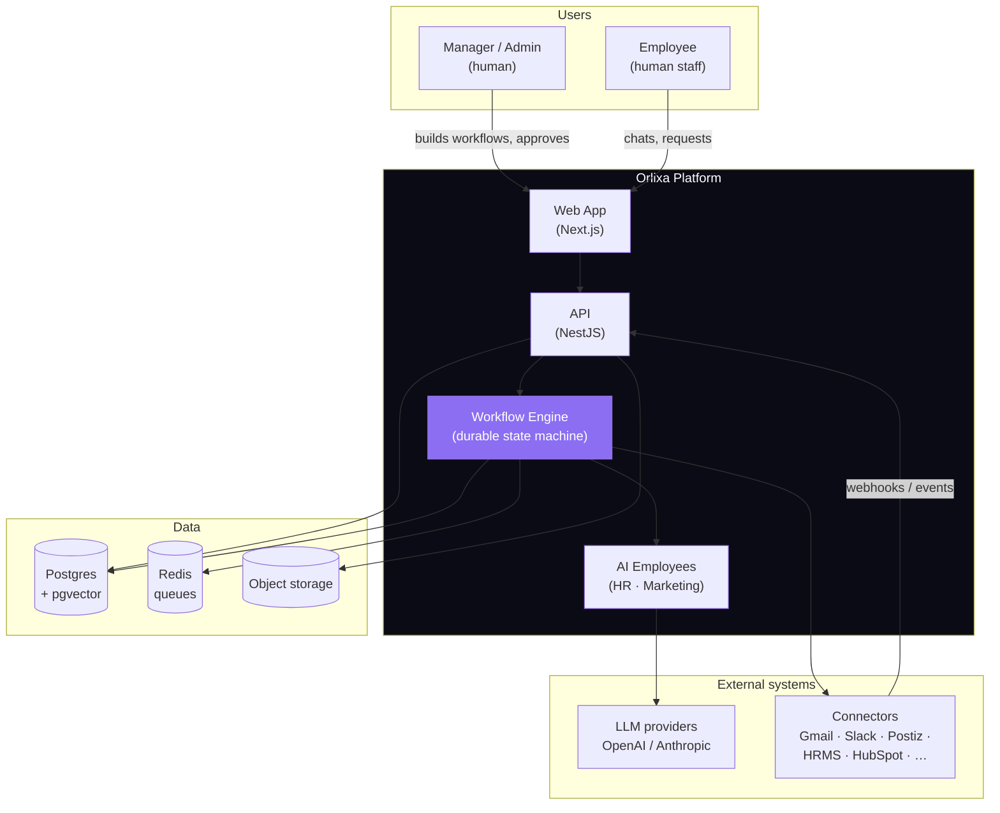
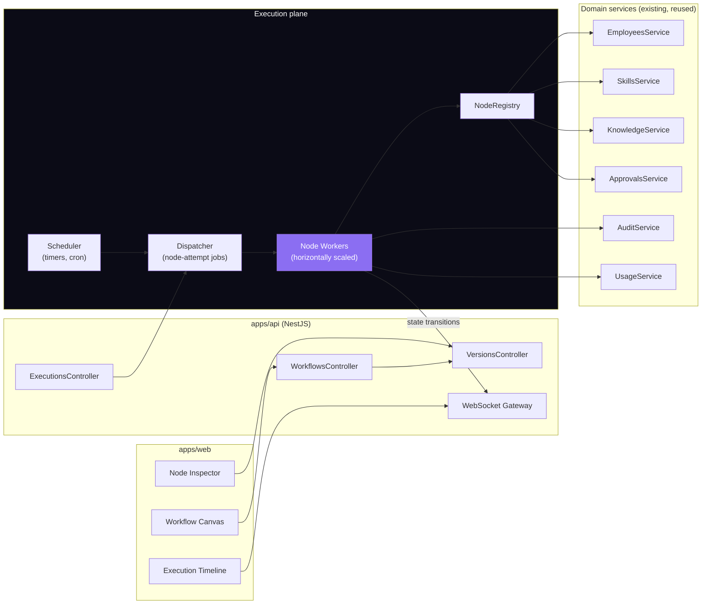
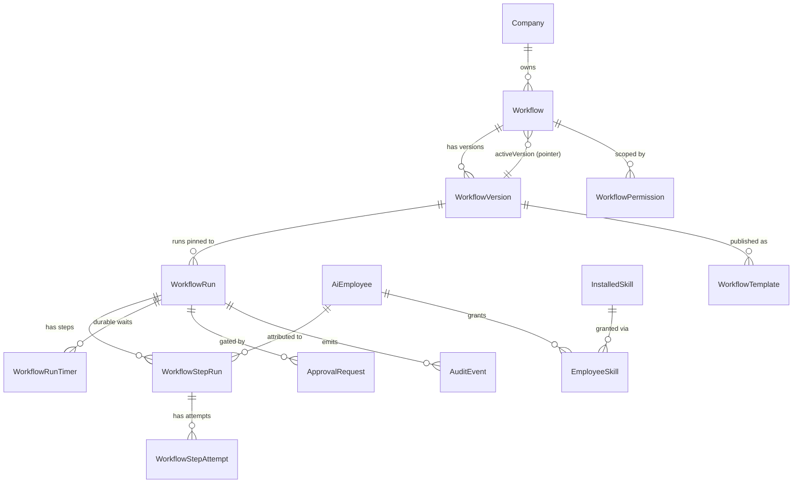

# Orlixa Workflow System — Enterprise Architecture Document

**Document set:** `docs/architecture/workflow-system/` · **Version:** 1.0 · **Date:** 2026-08-01
**Status:** Design approved for implementation · **Audience:** senior/staff engineers implementing this

---

## 0.1 Purpose of this document set

This is the complete architecture for **Orlixa's production workflow system** — the execution
substrate that lets an *AI Employee* (not a generic automation node) carry out multi-step business
work reliably, at Fortune-500 scale, with approvals, audit, retry, versioning and observability.

**This is an extension, not a redesign.** Orlixa already has working `workflows`, `employees`,
`skills`, `knowledge`, `events`, `approvals`, `audit` and `analytics` modules. Section 0.3 is a
line-by-line audit of what those modules actually do today (verified against source, with file
paths), and every phase document is explicit about which parts are **KEEP**, **EXTEND**, or
**NEW**. Nothing already working is thrown away.

### How to read this set

| File | Phase | What it defines |
|---|---|---|
| `00-overview-and-canonical-contracts.md` | — | **Read first.** Current-state audit, architecture decisions (ADRs), and the canonical enums/types/entities every other phase references. |
| `01-workflow-core.md` | 1 | Workflow, versioning, lifecycle, publish/rollback, templates, marketplace |
| `02-node-architecture.md` | 2 | The node contract, taxonomy, registry, per-node retry/timeout/validation |
| `03-ai-employees.md` | 3 | AI Employees as digital staff; HR Employee + Marketing Employee in full |
| `04-skills-connectors.md` | 4 | Connector architecture: auth, OAuth, rate limits, health, versioning |
| `05-execution-engine.md` | 5 | The durable state machine: queue, parallelism, retry, compensation, DLQ |
| `06-variables.md` | 6 | Variable scopes, secrets, expressions |
| `07-knowledge-memory.md` | 7 | Knowledge/memory nodes, retrieval, semantic search |
| `08-approvals.md` | 8 | Approval routing, escalation, SLA, timeout |
| `09-permissions.md` | 9 | The 8-level permission model |
| `10-audit.md` | 10 | Immutable audit trail, cost/token attribution |
| `11-analytics.md` | 11 | Workflow/node/employee/cost analytics |
| `12-database.md` | 12 | Complete production schema: tables, indexes, partitioning, retention |
| `13-api.md` | 13 | REST + WebSocket API surface |
| `14-json-contract.md` | 14 | The canonical workflow JSON schema |
| `15-frontend.md` | 15 | Canvas UI — **deliberately last** |

**Rule for implementers:** if a type, enum, or table appears in two documents, `00` (this file) is
the single source of truth. Phase docs elaborate; they never redefine.

---

## 0.2 What makes this different from n8n / Power Automate

The temptation with a node-based engine is to build a generic automation tool and call the AI part a
node. Orlixa is the inverse: **the AI Employee is the primary abstraction, and the workflow is
something an Employee executes on the company's behalf.** That single inversion drives five concrete
architectural consequences that a generic engine does not have:

1. **Every run is attributed to an Employee, not just a workflow.** Cost, token spend, budget
   limits, KPIs, and productivity analytics roll up to the Employee (`AI_EMPLOYEE_STEP` nodes carry
   `employeeId`; §10, §11). n8n has no concept of "which digital worker did this."
2. **Permissions are Employee-scoped, not just user-scoped.** An HR Employee physically cannot call
   a marketing connector, because its `EmployeeSkill` grants don't include it — enforced at
   execution time, not just hidden in the UI (§9).
3. **Approval is a first-class node with routing/escalation/SLA**, because a digital employee acting
   on a real company needs a human gate on high-stakes actions — not an afterthought integration
   (§8).
4. **Knowledge and Memory are node types**, because an Employee's answers must be grounded in that
   company's documents and its own recall — with role-scoping so an HR document never leaks into a
   Marketing Employee's context (§7).
5. **Reasoning is configurable per Employee** (prompt strategy, reasoning strategy, model, budget) —
   the workflow describes *what* to do; the Employee config describes *how it thinks* (§3).

---

## 0.3 Current-state audit (verified against source, 2026-08-01)

Everything in this section was read directly from the codebase, not recalled. **This is the honest
baseline** — the gaps here are precisely what the rest of this document set closes.

### 0.3.1 What exists and works today

| Capability | Where | Verified behaviour |
|---|---|---|
| Workflow CRUD + graph storage | `modules/workflows/workflows.service.ts`, `Workflow.definition` (Prisma `Json`) | Schema-less JSON graph `{nodes, edges}`. Status `DRAFT`/`ACTIVE`/`PAUSED`. |
| Graph execution | `engine/workflow-engine.service.ts` | Sequential walk: `while (current) { runNode(); current = nextNode(); }`. One `WorkflowStepRun` row per visited node with `input`/`output`/`error`. |
| 8 node types | `packages/types/src/index.ts:965` | `TRIGGER`, `RETRIEVE`, `AI_STEP`, `TOOL_ACTION`, `WAIT`, `CONDITION`, `NOTIFY`, `APPROVAL`. |
| 4 trigger types | `packages/types/src/index.ts:860` | `MANUAL`, `SCHEDULE` (BullMQ repeatable), `WEBHOOK` (public token route), `EVENT` (internal `fireEvent`). |
| EVENT condition DSL | `engine/conditions.ts` | 9 operators (`eq/neq/gt/gte/lt/lte/contains/exists/in`), safe dotted path lookup, no `eval`. Fail-closed on bad operand. |
| Template resolution | `engine/template.ts` | `{{a.b.c}}` context lookup, explicitly no `eval`. |
| Approval pause/resume | engine `pauseForApproval` / `resume`, `ApprovalRequest.kind='WORKFLOW'` | Run → `WAITING` + `resumeNodeId` persisted; manager decision drives `resumeRun`/`cancelRun`. `autoApprove: true` skips the gate. |
| Optimistic concurrency on save | `workflows.service.ts:119` | `expectedUpdatedAt` mismatch → 409. Prevents two editors silently overwriting. |
| Structural validation | `engine/definition-validator.ts` | Duplicate node ids rejected; edges referencing unknown nodes rejected. |
| Stuck-run watchdog | engine `sweepStuckRuns`, `WORKFLOW_RUN_STUCK_TIMEOUT_MS` (10 min) | Sweeps orphaned `PENDING`/`RUNNING` runs → `FAILED`. **Deliberately does not retry** (side effects aren't safe to replay). `WAITING` untouched. |
| Idempotent run claim | engine `execute()` | `updateMany({where:{id, status:'PENDING'}})` — atomic claim so a duplicate-delivered job can't double-execute real side effects. |
| Subscription gating | engine `blockedBySubscription` | A non-`ACTIVE` subscription blocks execution at every entry point (fresh + resume). |
| Per-employee budget enforcement | engine `execAiStep` | `AiEmployee.budgetLimit` checked against `UsageService.totalCostForEmployee`. |
| Connector quarantine | engine `execToolAction` | `DEGRADED`/`DISCONNECTED` connector → step fails fast rather than hammering a dead provider. |
| Dry-run / test mode | `WorkflowRun.dryRun` | `TOOL_ACTION` returns a preview with **zero** egress and no `SkillExecution` row — but still fails loudly on a misconfigured step. |
| Event lineage | `WorkflowRun.triggerEventId` / `correlationId` | Ties `CanonicalEvent` → run → steps through logs. |
| AI-drafted workflows | `engine/workflow-generator.service.ts` | Plan-gated (`BUSINESS`/`ENTERPRISE`); grounds generation in the company's real skills + employees; never persists directly. |
| Visual canvas design | `docs/superpowers/specs/2026-07-27-visual-workflow-builder-design.md` | Approved design adding `position?: {x,y}` to `WorkflowNode`; React Flow + dagre; zero DB migration. **Designed, not yet built.** |

### 0.3.2 Verified gaps — what this document set adds

Ranked by how badly each blocks "production-grade, enterprise, millions of executions."

| # | Gap (verified) | Evidence | Closed in |
|---|---|---|---|
| **G1** | **No versioning at all.** No version column, no draft-vs-published separation, no rollback. Editing an `ACTIVE` workflow mutates the graph that in-flight runs are executing. | `model Workflow` has no `version`; engine reads `run.workflow.definition` live at every step | Phase 1 |
| **G2** | **No durable wait.** `WAIT` is an in-process `setTimeout` capped at `MAX_WAIT_MS = 10_000`. "Wait 3 days for a signed contract" is impossible. | `engine.execWait`, `workflows.constants.ts:83` | Phase 5 |
| **G3** | **No parallel execution.** `nextNode()` returns exactly one node; the walk is a single `while` loop. Fan-out/fan-in cannot be expressed. | `engine.nextNode` returns `WorkflowNode \| undefined` | Phase 2 (`PARALLEL`/`JOIN`), Phase 5 |
| **G4** | **No per-node retry.** Any node throw fails the entire run. A transient 429 from one connector kills a 30-step workflow. | `engine.runNode` catch → rethrow → run `FAILED` | Phase 2, Phase 5 |
| **G5** | **Whole-graph-in-one-job model.** One BullMQ job executes the entire graph in-process. A worker restart mid-run orphans it (mitigated only by a watchdog that fails it). Cannot scale a single long workflow across workers. | engine `run()` walks to completion inside one job | Phase 5 (durable state machine) |
| **G6** | **No compensation/rollback.** No way to undo completed side effects when a later step fails. | no compensation concept in engine | Phase 5 (saga) |
| **G7** | **`NOTIFY` is log-only.** Writes a logger line and a step output; sends nothing. | `engine.execNotify` | Phase 2 (real channel dispatch) |
| **G8** | **Approvals have no routing, SLA, escalation, or timeout.** `ApprovalRequest` has no assignee, no due date, no escalation chain. Anyone with the right company-wide role can approve anything. | `model ApprovalRequest` fields | Phase 8 |
| **G9** | **RBAC is company-wide only.** `Role = OWNER\|ADMIN\|MEMBER`, no department/team scoping, no per-workflow or per-node permission. | `enum Role`; `RolesGuard` ranks 3 roles | Phase 9 |
| **G10** | **No `MARKETING` employee role.** The stated MVP needs an HR **and** a Marketing Employee, but `EmployeeRole` has no `MARKETING` — a Marketing Employee today must be `CUSTOM`, which breaks role-scoped knowledge retrieval and role-based analytics. | `enum EmployeeRole` | Phase 3 |
| **G11** | **No cost/token attribution on steps.** `WorkflowStepRun` has no tokens, cost, or attempt columns. Cost exists only in the separate `UsageEvent` stream, not joinable per step. | `model WorkflowStepRun` | Phase 10 |
| **G12** | **No sub-workflows / reusability.** A workflow cannot call another workflow; no shared building blocks. | no `SUB_WORKFLOW` node type | Phase 2 |
| **G13** | **No typed variable system.** Context is an untyped `Record<string, unknown>`; no declared inputs/outputs, no secrets scope, no global/environment variables. | engine `context` | Phase 6 |
| **G14** | **Validation is structural only.** No cycle detection (only a runtime 50-node cap), no per-node-type config validation at save time, no required-field checks before publish. | `definition-validator.ts` (32 lines) | Phase 1, Phase 2 |
| **G15** | **No memory node.** Employee memory is read implicitly in chat, never explicitly readable/writable from a workflow. | node type list | Phase 7 |
| **G16** | **50-node hard cap.** `MAX_WORKFLOW_NODES = 50` bounds cyclic graphs at runtime — also caps legitimate enterprise workflows. | `workflows.constants.ts:77` | Phase 5 (replaced with step-budget + cycle detection) |
| **G17** | **Run history is unbounded and unpartitioned.** `WorkflowRun`/`WorkflowStepRun` grow forever with only `@@index([companyId])`. At millions of executions this is the first thing to fall over. | `model WorkflowRun` indexes | Phase 12 |
| **G18** | **The role-boundary guardrail hardcodes "CV screening is RECRUITER work" — which will make a broadened HR Employee refuse its own job.** The MVP brief puts Recruitment / Interview / Resume Screening *under* the HR Employee. But two prompts hardcode the opposite. Widening `ROLE_SCOPE.HR` without editing these produces a self-contradictory system prompt ("your job includes CV screening" + "CV screening is RECRUITER work, you MUST refuse it"), and the observed failure mode is the employee politely declining the exact task it was hired for. | `runtime/agent-runtime.service.ts:266`, `runtime/planner.service.ts:28` — **verified directly** | Phase 3 |
| **G19** | **`AiEmployee.permissions` is persisted but never read by any runtime code.** Only written (`employees.service.ts:144`) and echoed in the DTO (`employees.mapper.ts:48`). So per-employee permission flags are currently decorative — a customer configuring them gets no enforcement. | grep for runtime reads returns none — **verified** | Phase 9 |
| **G20** | **`AiEmployee.model` is persisted but never read.** Per-employee model selection silently does nothing; every employee uses the deployment-wide `LLM_PROVIDER`/`LLM_MODEL`. | no runtime read — **verified** | Phase 3 |
| **G25** 🔴 | **SAFETY BYPASS — high-risk tools skip the Approval Center entirely when called from a workflow.** The chat path checks `approvals.requiresApproval()` before executing and returns `pendingApproval` without running the tool. The workflow path calls `skills.runTool()` **directly, with no approval check**. So a tool flagged `highRisk` in the catalog (e.g. `stripe.create_payment_link`) — and any tool matched by `AiEmployee.approvalRules`, **including `requireApprovalForAllTools`** — executes with no human gate from a `TOOL_ACTION` node. A customer who configured "all tool calls need approval" does not have that control once a workflow is involved. Not externally exploitable (authoring a workflow requires an authenticated editor), but it defeats a sold safety feature and will fail an enterprise security review. The engine's refusal to import the Approvals module is a *legitimate* acyclic-dependency constraint — so the fix needs the dependency-light seam, not a direct import. | `runtime/tool-executor.service.ts:50` (gate present) vs `engine/workflow-engine.service.ts:819` (gate absent); `approvals/approval.service.ts:67` (`highRisk` → true) — **all verified directly** | **Phase 8** via `ApprovalRoutingModule`; treat as P0, ahead of new capability |
| **G31** 🔴 | **AGPL-3.0 exposure on two shipped engines — a legal question, not an engineering one, and absent from this doc set until now.** Both wrapped engines are copyleft: **Postiz is AGPL-3.0** (`LICENSE` + `package.json`, verified) and **Plane is AGPL-3.0-only** (SPDX header on every source file, verified). Orlixa runs them as *invisible backend engines* behind a proprietary SaaS that customers pay for and reach over a network — which is precisely the scenario AGPL §13's network-use clause exists to address. The per-engine research docs (`engines/postiz-engine.md`, `engines/plane-engine.md`) each flag this locally, but **no document in this workflow-system set surfaced it**, so an implementation plan built only from this set would miss it entirely. Requires counsel sign-off on the deployment posture (unmodified-instance vs. modified-fork changes the analysis materially) **before** these engines are part of a paid tier — not after. Surfaced by PRD review, not by the architecture authoring. | `engines/postiz-engine.md:12`, `engines/plane-engine.md:9` — **verified** | Legal review; PRD risk register |
| **G29** 🔴 | **`DELETE /workflows/:id` permanently destroys the entire execution history.** It is a hard delete (`workflow.delete()`), and `WorkflowRun.workflow` / `WorkflowStepRun.run` both declare `onDelete: Cascade` — so deleting a workflow silently erases every run and every step of it. The code comments this itself ("Cascades to runs and their step runs"). An `AuditLog` row records *that* a deletion happened, but the run history it destroyed is unrecoverable. Any customer answering "show me every CV screening decision from Q1" loses that ability the moment someone tidies up an old workflow. **Note: `01-workflow-core.md` §1.A.6 described this as already being a soft delete — that was wrong, and this row is the correction.** | `workflows.service.ts:175` + comment at `:174`; `schema.prisma:519,555` — **verified directly** | **Wave 1** — flip to soft-delete (`status=ARCHIVED`) before anything else touches run retention |
| **G30** | **Approval decisions are currently `@Roles('OWNER','ADMIN')`-only.** Phase 8's design loosens this to any member who satisfies a routing rule. That is a genuine, deliberate security *relaxation*, not a formality — it must be an explicit product decision, not a side effect of implementing routing. | `workflows.controller.ts` role guards + `approvals.controller.ts` — **verified** | Phase 8 (requires sign-off) |
| **G26** | **Plane's webhook signature verification is real and unit-tested but wired to zero controllers** — inbound Plane events cannot reach Orlixa at all today. Tested code that nothing calls. | Phase 4 audit — **verified** | Phase 4 (unify on the existing `ConnectorWebhookController`/`RawEvent` pipeline) |
| **G27** | **`SkillExecution` — the tool-call audit log — has no read API anywhere in the codebase.** An audit trail is being written that no operator, endpoint, or UI can read. | Phase 4 audit — **verified** | Phase 10 |
| **G28** | **Catalog-declared `canSend`/`canRead`/`dailyEmailLimit` config fields are collected in the UI and persisted, but never enforced by `RealSkillExecutor`.** Same decorative-config class of problem as G19/G20. | Phase 4 audit — **verified** | Phase 4 |
| **G22** | **`User` has no `departmentId`/`teamId`/`managerUserId`, so department- and manager-based approval routing is unimplementable.** Also blocks Phase 9's department-scoped RBAC. `AiEmployee.managerName` is free text, not an FK. | `model User` (9 columns, none of them org-structural) — **verified** | Phase 8 adds the columns; Phase 9 consumes them |
| **G23** | **Approval SLA timers cannot be keyed on a workflow run for `TOOL`-kind approvals.** `ApprovalRequest.workflowRunId` is only set for `WORKFLOW`-kind rows — a `TOOL`-kind approval (a high-risk tool call from a *chat* turn) has no run at all. So SLA/escalation needs a self-sufficient sweep, not a `WorkflowRunTimer`. Phase 5's timer is a latency optimisation here, not the correctness mechanism. | `model ApprovalRequest` — **verified** | Phase 8 |
| **G24** | **Landmine (not yet a live leak): the dry-run preview persists resolved `args` verbatim into `WorkflowStepRun.output`.** Today that is safe — `resolveArgs` only reads run `context`, and credentials never enter `context` (they are resolved separately into `ExecutorContext` by `SkillsService`). But the moment Phase 6 lets a template resolve a secret into `args`, this line writes it to the database in plaintext. Phase 6 must land its redaction boundary **before** secret-in-template support, not after. | `engine/workflow-engine.service.ts:743` (resolve) + `:806-816` (persist) — **verified as a future risk, not a current breach** | Phase 6 |
| **G21** | **4 of the 7 marketing tables are schema-ahead-of-code.** `Campaign`, `MediaAsset`, `BrandAsset`, `MarketingAnalyticsSnapshot` have zero reads/writes anywhere. (Independently corroborated: the Postiz phase's own final whole-branch review flagged the same set.) The Postiz *publishing* path — `SocialAccount`/`ScheduledPost`/`PublishedPost` — **is** wired and working. So the Marketing Employee's gap is application wiring, not new schema. | zero code references — **verified twice** | Phase 3 |

---

## 0.4 Architecture Decision Records

These are the load-bearing decisions. Each states the alternatives honestly, because a team
implementing this will hit the same forks.

### ADR-001 — Execution model: durable state machine on BullMQ (not Temporal)

**Decision.** Restructure the engine from "one job runs the whole graph in-process" to **"one job
advances one node-attempt; all state lives in Postgres."** Keep BullMQ/Redis as the transport.

**Alternatives considered.**
- **Temporal** (what Postiz uses — see `docs/architecture/engines/postiz-engine.md`). Genuinely the
  most proven durable-execution engine, and it would give durable timers, retries, and sagas for
  free. **Rejected for now** because: (a) it requires operating a second stateful cluster —
  Temporal server **plus its own Postgres plus Elasticsearch** (verified in the Postiz research),
  which is heavy against Orlixa's current Vercel + Neon + Upstash footprint; (b) Temporal's
  programming model requires workflow code to be deterministic and side-effect-free, which means
  rewriting `WorkflowEngine` rather than extending it — directly against this project's
  "extend, don't redesign" constraint; (c) Orlixa's `WorkflowRun`/`WorkflowStepRun` tables *already
  are* a durable state log — the missing piece is advancing the machine one step per job, not a new
  state store.
- **Keep the in-process walk and add retries inside it.** Rejected: it cannot survive a worker
  restart mid-run, cannot express a 3-day wait, and cannot parallelise across workers — G2/G3/G5 are
  all structural consequences of the walk owning the whole run.

**Consequences.**
- Durable waits (G2), per-node retry (G4), fan-out (G3), and mid-run resumability (G5) all fall out
  of the same change rather than needing four separate mechanisms.
- Cost: one Redis round-trip + one job per node instead of per run. At ~20 nodes/run this is 20×
  more jobs — acceptable (BullMQ handles ≫100k jobs/min) and the reason Phase 5 specifies a
  **step-batching fast path** for cheap consecutive nodes.
- **Escape hatch documented:** if Orlixa later needs cross-service distributed sagas, Temporal
  remains the migration target, and the node-attempt boundary designed here maps 1:1 onto Temporal
  activities. Phase 5 §Future Extension spells this out so the door stays open.

### ADR-002 — Versioning: immutable published versions, mutable draft

**Decision.** `Workflow` becomes a container of metadata + pointers. The graph moves to
**`WorkflowVersion`** rows that are **immutable once published**. A run pins
`workflowVersionId` for its entire life.

**Why.** Today an in-flight run reads `run.workflow.definition` live at every step (verified), so
editing an active workflow mutates the definition mid-execution — a correctness bug and an audit
hole (you cannot answer "what graph actually ran?" after an edit). Immutable versions also make
rollback a pointer swap and make templates/marketplace a version copy.

**Consequence.** Every run becomes reproducible and auditable. Rollback is O(1) and non-destructive.

### ADR-003 — Node contract: a registry of typed node definitions, not a switch statement

**Decision.** Replace the engine's `switch (node.type)` with a **`NodeRegistry`** of
`NodeDefinition` objects (schema + validate + execute + retry policy + permissions), one file per
node type.

**Why.** The switch is already 8 branches and every phase here adds more (`PARALLEL`, `JOIN`,
`SUB_WORKFLOW`, `LOOP`, `MEMORY_*`, `SET_VARIABLE`, `HTTP`, `TRANSFORM`, `DB_*`, `AI_EMPLOYEE_STEP`).
A registry gives per-node validation at save time (G14), per-node retry/timeout (G4), per-node
permissions (Phase 9), and a machine-readable node catalogue the UI's node library reads directly
(Phase 15) — one definition, four consumers.

### ADR-004 — Backward compatibility: the existing 8 node types keep working unchanged

**Decision.** All 8 current node types stay, with identical `config` shapes and identical runtime
semantics, and existing `Workflow.definition` JSON keeps validating and running. New capability
arrives as new node types and new *optional* fields.

**Why.** There is live production data (a real tenant with real running recruiting workflows). A
breaking graph-format change would be a data migration on customer automation — unacceptable for the
value it adds. Phase 1 §Migration specifies the backfill (`definition` → `WorkflowVersion` v1) as a
pure copy with no shape change.

### ADR-005 — Multi-tenancy stays application-enforced `companyId`, with a defence-in-depth addition

**Decision.** Keep the established convention (every table carries `companyId`, every query filters
it manually — the pattern used consistently across all 38 existing models). **Add** a Postgres
Row-Level Security policy on the new high-volume execution tables as a second layer.

**Why.** Consistency with the existing codebase matters more than elegance, and a wholesale move to
RLS across 38 tables is a large, risky refactor. But `WorkflowRun`/`WorkflowStepRun` are the tables
most likely to be queried by future analytics/reporting code paths written by someone who forgets the
filter — belt-and-braces there is cheap insurance. Phase 12 specifies the policy.

### ADR-006 — Approval routing reuses `ApprovalRequest`, extended (not a new subsystem)

**Decision.** Extend `ApprovalRequest` with assignee/SLA/escalation columns rather than building a
parallel approvals engine.

**Why.** The existing model already has the two kinds that matter (`TOOL` gating a tool call,
`WORKFLOW` gating a paused run), a working race-safe decision path, and a live UI queue. The gap is
*routing metadata*, not the mechanism.

---

## 0.5 System context (C4 Level 1)



## 0.6 Container view (C4 Level 2)



---

## 0.7 CANONICAL CONTRACTS

> **This section is normative.** Every phase document and every implementer uses these exact names.
> Additions go here first, then get elaborated in a phase doc.

### 0.7.1 Enums

```ts
// ── Workflow lifecycle ────────────────────────────────────────────────────────
/** EXISTING (KEEP) — Prisma enum WorkflowStatus. Extended with ARCHIVED. */
export type WorkflowStatus = 'DRAFT' | 'ACTIVE' | 'PAUSED' | 'ARCHIVED';

/** NEW — lifecycle of one immutable version of a workflow graph. */
export type WorkflowVersionStatus =
  | 'DRAFT'       // mutable; the only status whose graph may be edited
  | 'PUBLISHED'   // immutable; eligible to be the active version
  | 'DEPRECATED'  // immutable; superseded, but in-flight runs still reference it
  | 'ARCHIVED';   // immutable; retained for audit only

/** NEW — coarse grouping for the library/marketplace. */
export type WorkflowCategory =
  | 'HR' | 'RECRUITMENT' | 'MARKETING' | 'SALES' | 'SUPPORT'
  | 'FINANCE' | 'OPERATIONS' | 'IT' | 'COMPLIANCE' | 'CUSTOM';

// ── Runs & steps ──────────────────────────────────────────────────────────────
/** EXISTING (KEEP) + 3 new terminal/interim states. */
export type WorkflowRunStatus =
  | 'PENDING' | 'RUNNING' | 'WAITING' | 'COMPLETED' | 'FAILED'  // existing
  | 'CANCELLED'      // NEW — operator/API cancellation
  | 'COMPENSATING'   // NEW — running compensation (saga rollback)
  | 'TIMED_OUT';     // NEW — exceeded the run-level deadline

/** EXISTING (KEEP) + 3 new. */
export type StepRunStatus =
  | 'PENDING' | 'RUNNING' | 'COMPLETED' | 'FAILED' | 'SKIPPED'  // existing
  | 'RETRYING'       // NEW — failed, attempt < maxAttempts, retry scheduled
  | 'WAITING'        // NEW — durable wait / awaiting approval
  | 'COMPENSATED';   // NEW — its side effect was rolled back

/**
 * NEW — why a run ended, for analytics without string-matching `error`.
 * `AUTHORIZATION_DENIED` was added during Phase 9 authoring (this enum originally
 * had no value for a permission/grant denial, which would have forced Phase 9's
 * enforcement failures to masquerade as `NODE_ERROR`).
 */
export type RunFailureClass =
  | 'NODE_ERROR' | 'CONNECTOR_UNAVAILABLE' | 'RATE_LIMITED' | 'TIMEOUT'
  | 'APPROVAL_REJECTED' | 'BUDGET_EXCEEDED' | 'SUBSCRIPTION_BLOCKED'
  | 'VALIDATION_ERROR' | 'CANCELLED' | 'INTERNAL'
  | 'AUTHORIZATION_DENIED';

// ── Nodes ─────────────────────────────────────────────────────────────────────
/** Node category — drives the UI node library grouping and permission defaults. */
export type NodeCategory =
  | 'TRIGGER' | 'AI_EMPLOYEE' | 'LOGIC' | 'SKILL' | 'APPROVAL'
  | 'MEMORY' | 'KNOWLEDGE' | 'VARIABLE' | 'COMMUNICATION'
  | 'UTILITY' | 'DATABASE' | 'EXTERNAL_API';

/**
 * EXISTING 8 (KEEP, unchanged semantics — ADR-004) + NEW.
 * Ordering below groups by category for readability only.
 */
export type NodeType =
  // TRIGGER
  | 'TRIGGER'                                                    // EXISTING
  // AI_EMPLOYEE
  | 'AI_STEP'                                                    // EXISTING
  | 'AI_EMPLOYEE_STEP' | 'AI_DECISION' | 'AI_EXTRACT' | 'AI_CLASSIFY'  // NEW
  // LOGIC
  | 'CONDITION' | 'WAIT'                                         // EXISTING
  | 'SWITCH' | 'PARALLEL' | 'JOIN' | 'LOOP' | 'SUB_WORKFLOW' | 'TERMINATE'  // NEW
  // SKILL
  | 'TOOL_ACTION'                                                // EXISTING
  // APPROVAL
  | 'APPROVAL'                                                   // EXISTING
  // KNOWLEDGE
  | 'RETRIEVE'                                                   // EXISTING
  | 'KNOWLEDGE_WRITE'                                            // NEW
  // MEMORY
  | 'MEMORY_READ' | 'MEMORY_WRITE'                               // NEW
  // VARIABLE
  | 'SET_VARIABLE' | 'TRANSFORM'                                 // NEW
  // COMMUNICATION
  | 'NOTIFY'                                                     // EXISTING (becomes real — G7)
  // UTILITY
  | 'NOOP'                                                       // NEW
  // EXTERNAL_API
  | 'HTTP_REQUEST'                                               // NEW
  // DATABASE
  | 'DB_QUERY';                                                  // NEW

/** EXISTING (KEEP) — CONDITION node operators. */
export type ConditionOp = 'eq' | 'neq' | 'contains' | 'gt' | 'lt';

/** EXISTING (KEEP) — EVENT-trigger DSL operators (wider set). */
export type EventConditionOp =
  | 'eq' | 'neq' | 'gt' | 'gte' | 'lt' | 'lte' | 'contains' | 'exists' | 'in';

/** EXISTING (KEEP). */
export type TriggerType = 'MANUAL' | 'SCHEDULE' | 'WEBHOOK' | 'EVENT';

// ── Variables & retry ─────────────────────────────────────────────────────────
/** NEW — variable scope (Phase 6). */
export type VariableScope =
  | 'INPUT' | 'RUNTIME' | 'WORKFLOW' | 'GLOBAL' | 'ENVIRONMENT' | 'SECRET' | 'OUTPUT';

/** NEW — declared variable value type, for validation + UI form generation. */
export type VariableType =
  | 'string' | 'number' | 'boolean' | 'json' | 'date' | 'array' | 'secret';

/** NEW — retry backoff strategy (Phase 2/5). */
export type BackoffStrategy = 'NONE' | 'FIXED' | 'LINEAR' | 'EXPONENTIAL';

/** NEW — what to do when a node exhausts its retries. */
export type OnErrorBehaviour =
  | 'FAIL_RUN'        // default — today's behaviour, preserved
  | 'CONTINUE'        // mark step FAILED, follow the normal edge
  | 'ROUTE_TO_ERROR'  // follow the edge tagged branch:'error'
  | 'COMPENSATE';     // trigger saga compensation

// ── Approvals (Phase 8) ───────────────────────────────────────────────────────
/** EXISTING (KEEP). */
export type ApprovalKind = 'TOOL' | 'WORKFLOW';
/** EXISTING (KEEP) + 2 new. */
export type ApprovalStatus =
  | 'PENDING' | 'APPROVED' | 'REJECTED'   // existing
  | 'ESCALATED' | 'EXPIRED';              // NEW
/**
 * NEW — how an approval finds its approver.
 *
 * ⚠️ PREREQUISITE (verified 2026-08-01): `DEPARTMENT`, `TEAM`, and
 * `EMPLOYEE_MANAGER` are NOT implementable against today's schema. `model User`
 * has only { id, companyId, email, passwordHash, name, phone, role, status,
 * createdAt } — no `departmentId`, no `teamId`, no `managerUserId` — and
 * `AiEmployee.managerName` is free text, not a foreign key. Phase 8 adds those
 * columns as an explicit prerequisite. Do not implement routing against these
 * three values until that migration lands; `USER`, `ROLE`, and `ANY_ADMIN` work
 * today. (This was a defect in this contract as originally drafted, caught
 * during Phase 8 authoring — recorded here rather than silently corrected.)
 */
export type ApproverRuleType =
  | 'USER' | 'ROLE' | 'DEPARTMENT' | 'TEAM' | 'EMPLOYEE_MANAGER' | 'ANY_ADMIN';

// ── Employees (Phase 3) ───────────────────────────────────────────────────────
/**
 * EXISTING (KEEP all 7) + MARKETING (closes G10).
 * MARKETING must be added as a real enum value — without it the MVP's Marketing
 * Employee is `CUSTOM`, which silently disables role-scoped knowledge retrieval
 * and role-based analytics.
 */
export type EmployeeRole =
  | 'SUPPORT' | 'SALES' | 'RECRUITER' | 'HR' | 'ACCOUNTANT'
  | 'PROJECT_MANAGER' | 'CUSTOM'   // existing
  | 'MARKETING';                   // NEW

/** NEW — how an Employee reasons (Phase 3). */
export type ReasoningStrategy =
  | 'DIRECT'          // single completion
  | 'PLAN_ACT'        // today's runtime: plan → retrieve → act → validate
  | 'REACT'           // interleaved reason/act loop
  | 'REFLECT';        // act, then self-critique before returning
```

### 0.7.2 Core interfaces

```ts
// ── Graph ─────────────────────────────────────────────────────────────────────
/** EXISTING fields KEPT verbatim; every new field is OPTIONAL (ADR-004). */
export interface WorkflowNode {
  id: string;                              // EXISTING
  type: NodeType;                          // EXISTING
  name?: string;                           // EXISTING
  config: Record<string, unknown>;         // EXISTING — per-type shape
  position?: { x: number; y: number };     // from the approved canvas design
  retry?: RetryPolicy;                     // NEW — Phase 2
  timeoutMs?: number;                      // NEW — per-node timeout
  onError?: OnErrorBehaviour;              // NEW — default 'FAIL_RUN'
  compensation?: CompensationSpec;         // NEW — Phase 5 saga
  notes?: string;                          // NEW — author annotation, UI only
  disabled?: boolean;                       // NEW — skip without deleting
}

/** EXISTING fields KEPT verbatim. */
export interface WorkflowEdge {
  from: string;                            // EXISTING
  to: string;                              // EXISTING
  /**
   * EXISTING: 'true' | 'false' for CONDITION.
   * NEW additions: 'error' (OnErrorBehaviour.ROUTE_TO_ERROR), or a SWITCH case key.
   */
  branch?: string;                         // EXISTING (widened)
  label?: string;                          // NEW — UI only
}

/** EXISTING fields KEPT verbatim. */
export interface WorkflowDefinition {
  nodes: WorkflowNode[];                   // EXISTING
  edges: WorkflowEdge[];                   // EXISTING
  variables?: VariableDeclaration[];       // NEW — Phase 6
  settings?: WorkflowSettings;             // NEW
}

/** NEW — run-level policy declared on the graph. */
export interface WorkflowSettings {
  /** Hard deadline for a whole run. Exceeded → status TIMED_OUT. */
  runTimeoutMs?: number;
  /** Max node-attempts per run — replaces the blunt MAX_WORKFLOW_NODES cap (G16). */
  maxSteps?: number;
  /** Concurrent runs of THIS workflow per company. Excess runs queue. */
  maxConcurrentRuns?: number;
  /** Deduplicate runs by a resolved template within a window. */
  idempotency?: { keyTemplate: string; windowMs: number };
  /** Default retry for every node that declares none. */
  defaultRetry?: RetryPolicy;
  /** Whether a failed run runs its compensation chain automatically. */
  autoCompensate?: boolean;
}

/** NEW — Phase 2/5. */
export interface RetryPolicy {
  maxAttempts: number;          // 1 = no retry
  backoff: BackoffStrategy;
  initialDelayMs: number;
  maxDelayMs?: number;
  jitter?: boolean;             // recommended true — avoids thundering herds
  /** Only retry when the classifier says the error is transient. */
  retryOn?: 'TRANSIENT_ONLY' | 'ALL';
}

/** NEW — Phase 5 saga. */
export interface CompensationSpec {
  /** Node type to run to undo this node's effect (usually TOOL_ACTION/HTTP_REQUEST). */
  type: NodeType;
  config: Record<string, unknown>;
  /** Compensation gets `{{compensating.originalOutput}}` in its context. */
}

/** NEW — Phase 6. */
export interface VariableDeclaration {
  key: string;
  scope: VariableScope;
  type: VariableType;
  required?: boolean;
  default?: unknown;
  description?: string;
  /** SECRET scope only: reference into the secret store, never a literal. */
  secretRef?: string;
}

// ── Node registry (ADR-003) ───────────────────────────────────────────────────
/** NEW — one per NodeType; the single definition four consumers read. */
export interface NodeDefinition<TConfig = Record<string, unknown>> {
  type: NodeType;
  category: NodeCategory;
  label: string;
  description: string;
  /** JSON-Schema-ish descriptor: drives save-time validation AND the Inspector form. */
  configSchema: NodeConfigField[];
  /** Handle topology, so the canvas and the validator agree. */
  handles: { inputs: number; outputs: NodeOutputHandle[] };
  /** Applied when the node declares no retry of its own. */
  defaultRetry: RetryPolicy;
  defaultTimeoutMs: number;
  /** Permission required to place AND to execute this node (Phase 9). */
  requiredPermission: string;
  /** True when execution causes an irreversible external effect (drives dry-run + saga). */
  hasSideEffects: boolean;
  /** Static validation beyond configSchema (cross-field rules). */
  validate?(config: TConfig, ctx: ValidationContext): ValidationIssue[];
  /** The actual work. MUST be pure w.r.t. the run state it doesn't own. */
  execute(input: NodeExecutionInput<TConfig>): Promise<NodeExecutionResult>;
}

export interface NodeExecutionInput<TConfig = Record<string, unknown>> {
  companyId: string;
  runId: string;
  stepId: string;
  attempt: number;
  node: WorkflowNode;
  config: TConfig;                        // already template-resolved
  context: Readonly<Record<string, unknown>>;
  variables: VariableBag;
  dryRun: boolean;
  /** Cooperative cancellation — long nodes must honour it. */
  signal: AbortSignal;
  /** Correlation id shared by run → steps → audit → logs. */
  correlationId: string;
}

export interface NodeExecutionResult {
  /** Persisted verbatim to WorkflowStepRun.output. */
  output: unknown;
  /** Written to context[node.config.outputKey] when both present (EXISTING behaviour). */
  contextValue?: unknown;
  /** CONDITION/SWITCH branch selector. */
  branch?: string;
  /** Variables to merge back (Phase 6). */
  variableWrites?: Record<string, unknown>;
  /** Cost/token attribution for this attempt (Phase 10). */
  usage?: { promptTokens?: number; completionTokens?: number; costUsd?: number };
  /** Set by PARALLEL: fan out to these node ids. */
  fanOut?: string[];
  /** Set by WAIT/APPROVAL: suspend until this instant or signal. */
  suspendUntil?: Date | { signal: string };
}

export interface ValidationIssue {
  severity: 'ERROR' | 'WARNING';
  nodeId?: string;
  field?: string;
  code: string;
  message: string;
}
```

### 0.7.3 Entity map (Phase 12 specifies columns/indexes)



**Legend of new vs existing tables**

| Table | Status |
|---|---|
| `Company`, `AiEmployee`, `InstalledSkill`, `EmployeeSkill`, `ApprovalRequest`, `Workflow`, `WorkflowRun`, `WorkflowStepRun`, `AuditLog` | **EXISTING** — extended, never replaced |
| `WorkflowVersion`, `WorkflowStepAttempt`, `WorkflowRunTimer`, `WorkflowTemplate`, `WorkflowPermission`, `WorkflowVariable`, `WorkflowSecretRef`, `NodeMetricDaily`, `RunEventOutbox` | **NEW** |

### 0.7.4 Folder structure (whole system)

```
apps/api/src/modules/workflows/
├── workflows.module.ts                  EXISTING — extended with new providers
├── workflows.controller.ts              EXISTING
├── workflows.service.ts                 EXISTING — versioning delegated out
├── workflows.mapper.ts                  EXISTING
├── webhooks.controller.ts               EXISTING
├── workflows.constants.ts               EXISTING — MAX_WORKFLOW_NODES deprecated
├── dto/                                 EXISTING + new version/execution DTOs
├── versions/                            NEW — Phase 1
│   ├── workflow-versions.service.ts
│   ├── workflow-versions.controller.ts
│   ├── publish.service.ts               validate → freeze → activate
│   └── rollback.service.ts
├── templates/                           NEW — Phase 1
│   ├── workflow-templates.service.ts
│   └── catalog/                         code-defined starter templates
│       ├── hr/                           recruitment, onboarding, leave, exit…
│       └── marketing/                    campaign, content, lead-nurture…
├── engine/
│   ├── workflow-engine.service.ts       EXISTING — becomes the state-machine driver
│   ├── template.ts                      EXISTING — KEEP (no eval)
│   ├── conditions.ts                    EXISTING — KEEP
│   ├── definition-validator.ts          EXISTING — extended (cycles, per-node)
│   ├── workflow-generator.service.ts    EXISTING — KEEP
│   ├── workflow.processor.ts            EXISTING — extended with new queues
│   ├── state-machine/                   NEW — Phase 5
│   │   ├── run-coordinator.service.ts       claims, advances, completes runs
│   │   ├── step-dispatcher.service.ts       enqueues node-attempt jobs
│   │   ├── node-attempt.processor.ts        executes ONE attempt
│   │   ├── join-resolver.service.ts         PARALLEL/JOIN barrier accounting
│   │   ├── timer.service.ts                 durable waits (G2)
│   │   ├── retry-policy.ts                  backoff + transient classification
│   │   ├── compensation.service.ts          saga rollback (G6)
│   │   └── cancellation.service.ts
│   ├── nodes/                           NEW — Phase 2 (one file per NodeType)
│   │   ├── node-registry.ts
│   │   ├── trigger.node.ts              …ported from the existing switch
│   │   ├── ai-employee-step.node.ts
│   │   ├── parallel.node.ts / join.node.ts / loop.node.ts
│   │   ├── sub-workflow.node.ts
│   │   ├── memory-read.node.ts / memory-write.node.ts
│   │   ├── set-variable.node.ts / transform.node.ts
│   │   ├── http-request.node.ts / db-query.node.ts
│   │   └── notify.node.ts               real dispatch (G7)
│   ├── variables/                       NEW — Phase 6
│   │   ├── variable-resolver.service.ts
│   │   ├── expression.ts                safe evaluator, no eval
│   │   └── secret-resolver.service.ts
│   └── observability/                   NEW — Phase 10/11
│       ├── run-tracer.ts
│       └── step-metrics.recorder.ts
├── analytics/                           NEW — Phase 11
│   ├── workflow-analytics.service.ts
│   └── rollup.processor.ts
└── realtime/                            NEW — Phase 13
    └── executions.gateway.ts            WebSocket run/step events

apps/web/src/features/workflows/          Phase 15 — canvas, inspector, timeline
```

---

## 0.8 Cross-cutting non-functional targets

These are the numbers every phase designs against.

| Dimension | Target | How it's achieved |
|---|---|---|
| Throughput | 10M node-attempts/day sustained | horizontal node workers; per-tenant fair-share queues (Phase 5) |
| Run start latency (p95) | < 2s from trigger to first node RUNNING | dedicated high-priority dispatch queue |
| Node attempt overhead (p95) | < 50ms engine overhead excluding the node's own work | step-batching fast path; single-row state transitions |
| Durable wait accuracy | ± 30s at any duration (minutes → months) | `WorkflowRunTimer` + a scanning sweeper (Phase 5) |
| Run history retention | 90d hot, 400d cold, then purge (tenant-configurable) | monthly partitions + archive job (Phase 12) |
| Tenant isolation | no cross-tenant read possible | `companyId` on every table + RLS on execution tables (ADR-005) |
| Audit completeness | 100% of state transitions + every side effect | append-only `AuditEvent` via transactional outbox (Phase 10) |
| Recovery from worker loss | < 60s to reclaim an orphaned attempt | attempt leases + reaper (Phase 5) |
| Blast radius of one bad tenant | zero impact on others | per-tenant concurrency caps + circuit breakers (existing `common/resilience`) |

---

## 0.9 Explicit non-goals

Stated so nobody designs for them by accident:

1. **Not a general-purpose iPaaS.** No ambition to match n8n's 400+ node catalogue. Nodes exist to
   serve AI Employee work; breadth comes from the Skills/connector layer (Phase 4) and, if ever
   needed, by wrapping n8n itself as an engine (already researched:
   `docs/architecture/engines/n8n-engine.md`).
2. **No user-authored arbitrary code execution** in v1 (no JS/Python node). `TRANSFORM` uses a safe
   declarative expression evaluator only. Rationale: arbitrary code in a multi-tenant runtime is a
   sandboxing problem (and an RCE surface) far larger than its v1 value. Phase 6 §Future Extension
   sketches the isolate-based path if it's ever justified.
3. **No cross-company workflow sharing** beyond the curated template catalogue in v1.
4. **No visual debugger / step-through breakpoints** in v1 — the Execution Timeline (Phase 15) shows
   what happened; it does not pause a live run at a breakpoint.
5. **Temporal is not being adopted** now (ADR-001), and this document does not design a Temporal
   migration beyond keeping the boundary compatible.

---

## 0.10 Implementation sequencing

The phases are a *design* decomposition, not a build order. Recommended build order, chosen so each
step ships something verifiable and nothing depends on unbuilt work:

| Wave | Build | Why first / why here |
|---|---|---|
| **W0** 🔴 | **Close G25** — route high-risk `TOOL_ACTION` calls through the Approval Center, matching the chat path. Plus the two-line G18 guardrail fix if the HR Employee is being broadened. | **Ship before any new capability.** G25 means a customer's "all tool calls need approval" setting is silently bypassed by any workflow — a sold safety control that doesn't hold. It is small, self-contained, and independent of every other wave. Fixing it after building more `TOOL_ACTION` surface area means more paths to audit. |
| **W1** | Phase 1 versioning + Phase 12 schema for versions; backfill `definition` → v1 | Everything else pins a version. Doing this later means migrating live runs. |
| **W2** | Phase 2 NodeRegistry; port the existing 8 node types unchanged, behaviour-for-behaviour | Pure refactor with existing e2e suites as the regression net. No new capability, so failure is obvious. |
| **W3** | Phase 5 durable state machine + timers + per-node retry | Unlocks G2/G3/G4/G5/G6 together. Highest-risk wave — gate it behind a per-tenant feature flag with the old walk as fallback. |
| **W4** | Phase 6 variables; Phase 2 new logic nodes (`SWITCH`/`PARALLEL`/`JOIN`/`SUB_WORKFLOW`/`LOOP`) | Needs W3's state machine to exist. |
| **W5** | Phase 3 `MARKETING` role + HR/Marketing Employee definitions + `AI_EMPLOYEE_STEP`; Phase 7 memory nodes | Product-visible value; depends on W2's registry. |
| **W6** | Phase 8 approval routing/SLA; Phase 9 department-scoped permissions | The two enterprise-sales blockers. Independent of W4/W5. |
| **W7** | Phase 10 audit/cost attribution; Phase 11 analytics rollups | Needs W3's attempt-level data to be worth reporting on. |
| **W8** | Phase 4 connector hardening; Phase 13 realtime API | Incremental. |
| **W9** | **Phase 15 frontend canvas** | Last, per the brief — and genuinely last, because the node library, validation messages, and timeline all read contracts defined in W1–W7. |

**Feature-flag discipline for W3:** the state machine replaces the execution path for live customer
automation. Ship it behind `WORKFLOW_ENGINE_MODE = legacy_walk | state_machine` per company, run both
against the same e2e suite, and migrate tenants deliberately. The existing `hiring-and-subscription-
linkage` and recruiting workflows on the live tenant are the canary.

---

**Next:** `01-workflow-core.md` — Phase 1.
