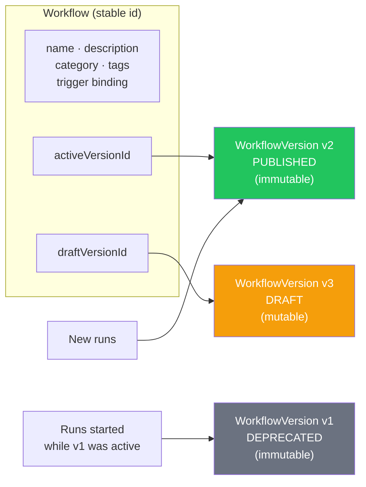
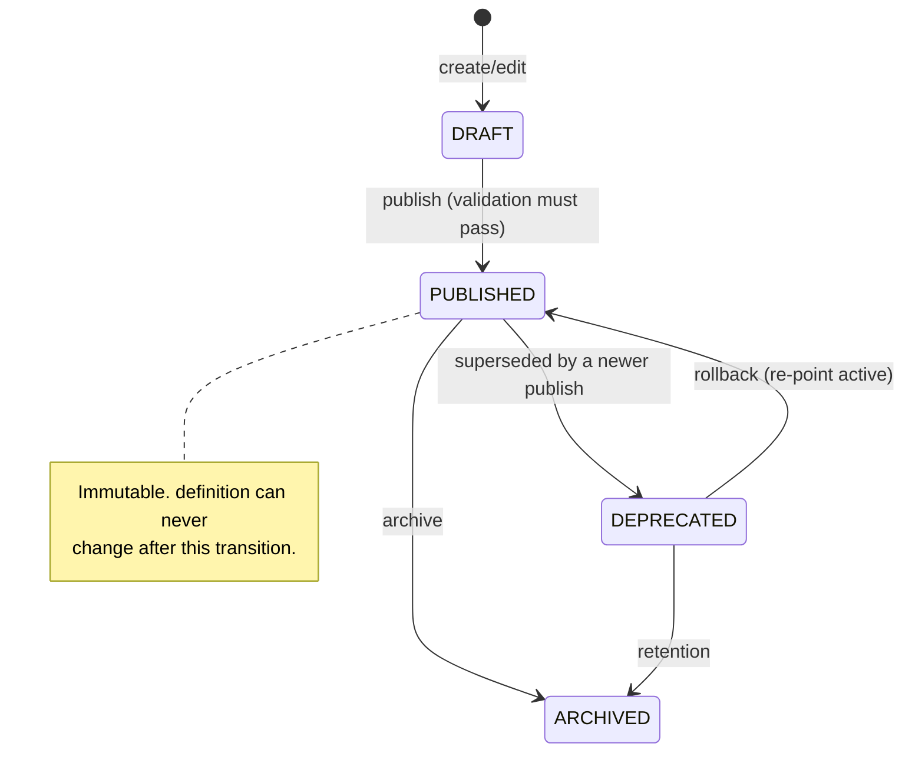
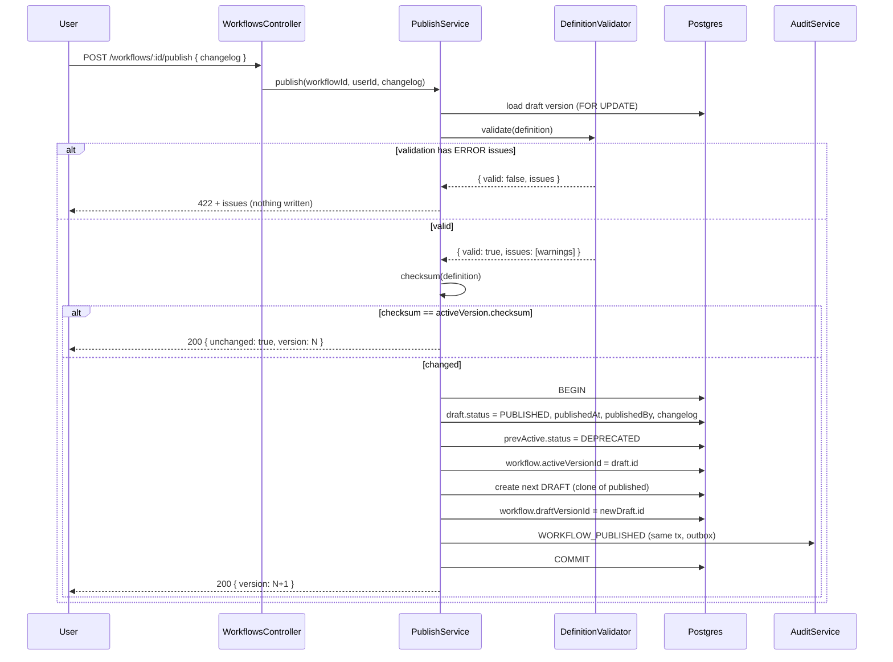
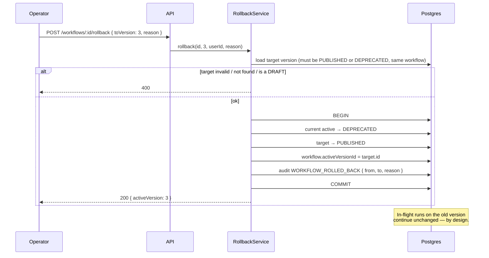
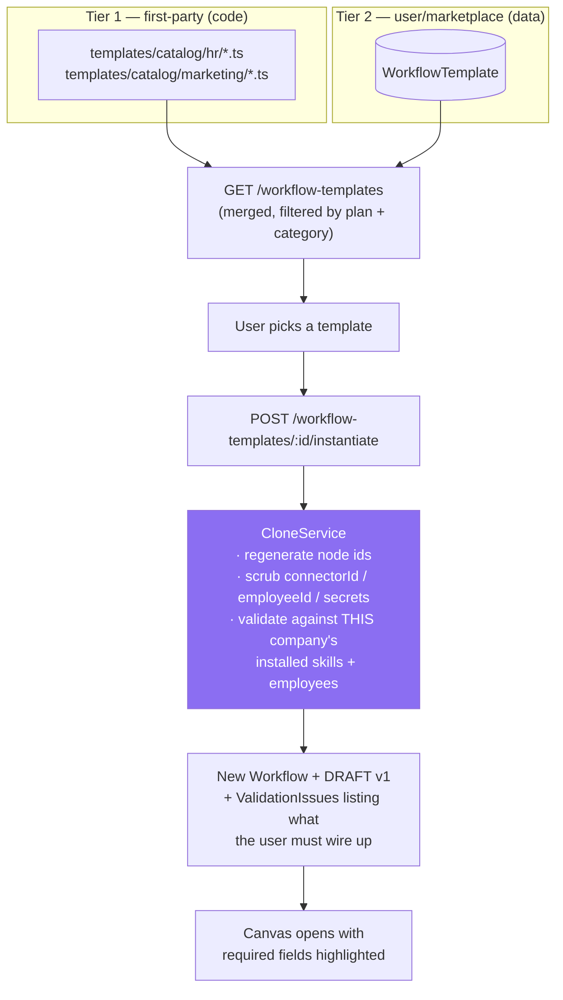
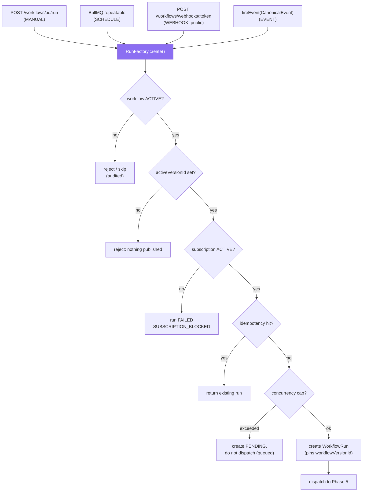

# Phase 1 — Workflow Core

**Prerequisite:** read `00-overview-and-canonical-contracts.md` first. §0.7 is normative; this
document uses those names and does not redefine them.

**Covers:** Workflow · Workflow Version · Status · Categories · Metadata · Lifecycle · Validation ·
Publishing · Draft · Rollback · Cloning · Templates · Marketplace · Execution (entry points) ·
Analytics hooks · Audit hooks.

**Governing decision:** ADR-002 (immutable published versions, mutable draft) and ADR-004
(the existing 8 node types and existing `definition` JSON keep working unchanged).

---

## 1.A The Workflow container

### 1. Purpose

Split today's single `Workflow` row — which conflates *identity*, *metadata*, and *the executable
graph* — into a stable **container** (identity + metadata + pointers) and a set of **immutable
versions** (the graph). This is the foundation the rest of Phase 1 stands on: without it,
publishing, rollback, and reproducible audit are all impossible.

### 2. Responsibilities

| Responsibility | Owner |
|---|---|
| Stable identity across all versions (`workflowId` never changes) | `Workflow` |
| Human metadata: name, description, category, tags, owner | `Workflow` |
| Which version production traffic uses | `Workflow.activeVersionId` |
| Which version the editor is editing | `Workflow.draftVersionId` |
| Trigger binding (how runs start) | `Workflow` (unchanged from today) |
| The executable graph | `WorkflowVersion.definition` |
| Lifecycle state | `Workflow.status` (container) + `WorkflowVersion.status` (per version) |

**Why the trigger stays on the container, not the version:** a webhook URL must survive a version
publish. If `webhookToken` lived on the version, every publish would rotate the customer's
integration URL and silently break their external caller. Verified: `webhookToken` is
`@unique` on `Workflow` today (`schema.prisma`, `model Workflow`) — keeping it there is both
correct and zero-migration.

### 3. Architecture

```
Workflow (container, mutable metadata)
├── id, companyId, name, description
├── category: WorkflowCategory                  NEW
├── tags: String[]                              NEW
├── status: WorkflowStatus                      EXISTING (+ARCHIVED)
├── triggerType, triggerConfig, webhookToken    EXISTING (KEEP on container)
├── activeVersionId  ──────────┐                NEW
├── draftVersionId   ──────────┤                NEW
├── ownerUserId, departmentId  │                NEW (Phase 9 scoping)
└── versions[] ────────────────┴──► WorkflowVersion (immutable once PUBLISHED)
                                    ├── id, workflowId, version: Int
                                    ├── status: WorkflowVersionStatus
                                    ├── definition: Json      ← the graph
                                    ├── checksum: String      integrity + dedupe
                                    ├── publishedAt, publishedByUserId
                                    ├── changelog: String?
                                    └── runs[] ──► WorkflowRun (pins workflowVersionId)
```

Two pointers rather than a single "current version" flag, because a workflow legitimately has two
simultaneous current states: what is *running* (`activeVersionId`) and what is *being edited*
(`draftVersionId`). Collapsing them into one field is what forces the "editing an active workflow
mutates in-flight runs" bug that exists today (gap **G1**).

### 4. Flow Diagram



Old runs keep pointing at v1 forever. That is the point: an auditor asking "what graph actually ran
for this candidate rejection in March?" gets an exact answer.

### 5. Database Design

```prisma
// EXTEND the existing model — every added field is optional or defaulted so the
// migration is non-breaking on live data.
model Workflow {
  id            String         @id @default(cuid())
  companyId     String
  company       Company        @relation(fields: [companyId], references: [id], onDelete: Cascade)
  name          String
  description   String?
  status        WorkflowStatus @default(DRAFT)          // EXISTING (+ARCHIVED value)

  /// EXISTING — retained verbatim for back-compat during migration, then dropped
  /// in a later release once every row has a v1 WorkflowVersion. See §1.A.15.
  definition    Json

  triggerType   TriggerType    @default(MANUAL)          // EXISTING (KEEP on container)
  triggerConfig Json?                                    // EXISTING
  webhookToken  String?        @unique                   // EXISTING — must NOT move to version
  activatedAt   DateTime?                                // EXISTING

  // ── NEW ──────────────────────────────────────────────────────────────────
  category        WorkflowCategory @default(CUSTOM)
  tags            String[]         @default([])
  ownerUserId     String?
  departmentId    String?                                 // Phase 9 scoping
  activeVersionId String?          @unique
  draftVersionId  String?          @unique
  archivedAt      DateTime?

  createdAt     DateTime       @default(now())
  updatedAt     DateTime       @updatedAt

  versions WorkflowVersion[] @relation("WorkflowVersions")
  activeVersion WorkflowVersion? @relation("ActiveVersion", fields: [activeVersionId], references: [id], onDelete: SetNull)
  draftVersion  WorkflowVersion? @relation("DraftVersion",  fields: [draftVersionId],  references: [id], onDelete: SetNull)
  runs     WorkflowRun[]                                  // EXISTING

  @@index([companyId])                                    // EXISTING
  @@index([companyId, status])                            // NEW — list filtering
  @@index([companyId, category])                          // NEW — library grouping
  @@index([companyId, departmentId])                      // NEW — Phase 9 scoping
}

/// NEW — the immutable executable graph.
model WorkflowVersion {
  id         String                @id @default(cuid())
  companyId  String                                        // denormalised: every query filters it
  workflowId String
  workflow   Workflow              @relation("WorkflowVersions", fields: [workflowId], references: [id], onDelete: Cascade)

  /// Monotonic per workflow, starting at 1. Never reused, even after delete.
  version    Int
  status     WorkflowVersionStatus @default(DRAFT)

  /// The graph: { nodes, edges, variables?, settings? } — see 14-json-contract.md
  definition Json

  /// sha256 of the canonicalised definition. Two purposes: (a) detect a
  /// no-op publish (identical graph → reuse the version instead of creating
  /// a duplicate); (b) tamper-evidence for audit.
  checksum   String

  changelog  String?
  publishedAt      DateTime?
  publishedByUserId String?
  deprecatedAt     DateTime?

  /// Cached validation result at publish time, so the UI can show why a
  /// version was publishable without re-running validation.
  validationReport Json?

  createdAt  DateTime @default(now())
  updatedAt  DateTime @updatedAt

  runs WorkflowRun[]

  activeFor Workflow? @relation("ActiveVersion")
  draftFor  Workflow? @relation("DraftVersion")

  @@unique([workflowId, version])
  @@index([companyId])
  @@index([workflowId, status])
  @@index([companyId, checksum])          // no-op-publish detection
}
```

**`WorkflowRun` change (one column):**

```prisma
model WorkflowRun {
  // … all EXISTING fields unchanged …
  /// NEW — the exact immutable version this run executes. Nullable ONLY for
  /// rows created before the migration; new runs always set it.
  workflowVersionId String?
  workflowVersion   WorkflowVersion? @relation(fields: [workflowVersionId], references: [id], onDelete: SetNull)

  @@index([companyId, workflowVersionId])   // NEW — "runs of version X"
}
```

**Index rationale.** `@@unique([workflowId, version])` makes the version counter safe under
concurrency (two simultaneous "save draft" calls cannot both create v4 — the second gets a unique
violation and retries). `@@index([companyId, checksum])` turns no-op-publish detection into an index
seek instead of a JSON comparison.

### 6. API Design

```
# Container
GET    /workflows                       list (filter: status, category, tag, departmentId, q)
POST   /workflows                       create container + empty DRAFT v1
GET    /workflows/:id                   container + activeVersion + draftVersion summaries
PATCH  /workflows/:id                   metadata only (name/description/category/tags/owner)
DELETE /workflows/:id                   soft-delete → status=ARCHIVED, archivedAt set
                                        ⚠️ TARGET STATE, NOT CURRENT. Verified: today this is a
                                        HARD delete that cascades to every WorkflowRun and
                                        WorkflowStepRun (workflows.service.ts:175, schema.prisma:519).
                                        See doc 00 gap G29 — fix in Wave 1.
POST   /workflows/:id/clone             §1.D

# Versions
GET    /workflows/:id/versions                  paginated version history
GET    /workflows/:id/versions/:version         one version (full definition)
PUT    /workflows/:id/draft                     upsert the DRAFT graph (optimistic concurrency)
POST   /workflows/:id/draft/validate            dry validation, no write
POST   /workflows/:id/publish                   §1.C
POST   /workflows/:id/rollback                  §1.D
GET    /workflows/:id/versions/:a/diff/:b        structural diff between two versions
```

`PATCH /workflows/:id` deliberately **cannot** modify the graph. Graph edits go through
`PUT /workflows/:id/draft`. Splitting these prevents the entire class of "metadata rename
accidentally republished a half-finished graph."

**Optimistic concurrency (EXISTING pattern, kept):** `PUT /workflows/:id/draft` accepts
`expectedUpdatedAt` and returns `409` on mismatch — identical semantics to today's
`workflows.service.ts:119` check, now applied to the draft version row.

### 7. TypeScript Interfaces

```ts
/** NEW — container DTO. */
export interface WorkflowDto {
  id: string;
  companyId: string;
  name: string;
  description: string | null;
  status: WorkflowStatus;
  category: WorkflowCategory;
  tags: string[];
  ownerUserId: string | null;
  departmentId: string | null;
  triggerType: TriggerType;                 // EXISTING
  triggerConfig: TriggerConfig | null;       // EXISTING
  webhookUrl: string | null;                 // EXISTING — derived from webhookToken
  activeVersion: WorkflowVersionSummaryDto | null;
  draftVersion: WorkflowVersionSummaryDto | null;
  activatedAt: string | null;
  createdAt: string;
  updatedAt: string;
}

export interface WorkflowVersionSummaryDto {
  id: string;
  version: number;
  status: WorkflowVersionStatus;
  checksum: string;
  changelog: string | null;
  publishedAt: string | null;
  publishedByUserId: string | null;
  nodeCount: number;
  updatedAt: string;
}

/** Full version, including the graph. */
export interface WorkflowVersionDto extends WorkflowVersionSummaryDto {
  workflowId: string;
  definition: WorkflowDefinition;            // canonical, §0.7.2
  validationReport: ValidationReport | null;
}

export interface ValidationReport {
  valid: boolean;
  issues: ValidationIssue[];                 // canonical, §0.7.2
  validatedAt: string;
  /** Definition checksum the report applies to — a stale report is detectable. */
  checksum: string;
}

export interface UpdateDraftRequest {
  definition: WorkflowDefinition;
  /** EXISTING concurrency guard — 409 on mismatch. */
  expectedUpdatedAt?: string;
}
```

### 8. JSON Examples

```json
// GET /workflows/wf_7Kd2
{
  "id": "wf_7Kd2",
  "companyId": "cmp_acme",
  "name": "New Candidate → Screen → Notify",
  "description": "Screens inbound CVs against the hiring policy and emails a decision.",
  "status": "ACTIVE",
  "category": "RECRUITMENT",
  "tags": ["hiring", "cv-screening"],
  "ownerUserId": "usr_hrlead",
  "departmentId": "dep_people",
  "triggerType": "EVENT",
  "triggerConfig": {
    "eventType": "email.received",
    "conditions": [{ "path": "data.looksLikeApplication", "op": "eq", "value": true }],
    "connectorId": "isk_gmail_hr"
  },
  "webhookUrl": null,
  "activeVersion": {
    "id": "wfv_3",
    "version": 3,
    "status": "PUBLISHED",
    "checksum": "sha256:9f2a…",
    "changelog": "Raise the shortlist threshold from 70 to 79.",
    "publishedAt": "2026-07-28T09:12:44.000Z",
    "publishedByUserId": "usr_hrlead",
    "nodeCount": 9,
    "updatedAt": "2026-07-28T09:12:44.000Z"
  },
  "draftVersion": {
    "id": "wfv_4",
    "version": 4,
    "status": "DRAFT",
    "checksum": "sha256:c81b…",
    "changelog": null,
    "publishedAt": null,
    "publishedByUserId": null,
    "nodeCount": 11,
    "updatedAt": "2026-08-01T06:40:02.000Z"
  },
  "activatedAt": "2026-07-11T04:02:10.000Z",
  "createdAt": "2026-07-10T18:22:00.000Z",
  "updatedAt": "2026-08-01T06:40:02.000Z"
}
```

### 9. Folder Structure

```
apps/api/src/modules/workflows/
├── workflows.service.ts          EXTEND — container CRUD only; graph work delegated
├── workflows.controller.ts       EXTEND — new version routes
├── workflows.mapper.ts           EXTEND — WorkflowDto now nests version summaries
└── versions/                     NEW
    ├── workflow-versions.service.ts    draft upsert, history, diff
    ├── workflow-versions.controller.ts
    ├── checksum.ts                     canonicalise + sha256
    └── version-diff.ts                 structural diff (nodes/edges added/removed/changed)
```

### 10. Edge Cases

| Case | Behaviour |
|---|---|
| Two editors save the draft simultaneously | Second gets `409` via `expectedUpdatedAt` (existing pattern). |
| Two requests race to create the next version | `@@unique([workflowId, version])` rejects the loser; service retries with `version+1` (bounded to 3 attempts, then `409`). |
| Publish an identical graph (no changes) | Checksum matches the active version → **no new version created**, returns the existing one with `304`-style semantics (`{ unchanged: true }`). Prevents version-number inflation from repeated save/publish clicking. |
| Delete a workflow with in-flight runs | Container → `ARCHIVED`, not deleted. Runs keep executing against their pinned version. Hard delete is blocked while any run is `PENDING`/`RUNNING`/`WAITING`. |
| Delete a *version* | Never allowed if any run references it. Versions are audit records. |
| A `DEPRECATED` version still has WAITING runs | Fully supported and expected — an approval can sit for days. The version row is immutable and retained; only `status` changed. |
| Workflow with no draft (only published versions) | `PUT /draft` creates a new DRAFT cloned from `activeVersion` — the editor never starts from an empty canvas by accident. |
| Rename a workflow | Metadata-only `PATCH`; does not create a version and does not affect runs. |
| `definition` legacy column vs `WorkflowVersion` during migration | Read path prefers `activeVersion.definition`; falls back to `Workflow.definition` when `activeVersionId` is null. See §15. |

### 11. Security

- **Tenant isolation:** `companyId` on both `Workflow` and `WorkflowVersion` (denormalised onto the
  version deliberately, so no query needs a join to filter correctly — the single most common source
  of accidental cross-tenant reads).
- **Authorisation:** container metadata edits require `workflow:update`; draft edits require
  `workflow:edit_graph`; publishing requires `workflow:publish` — a genuinely separate permission,
  because "can design a workflow" and "can put it into production" are different levels of trust
  (Phase 9 defines the taxonomy).
- **Integrity:** `checksum` is computed server-side over the canonicalised definition. A client
  cannot supply it. Any later mismatch between `checksum` and `definition` indicates tampering or
  corruption and fails validation loudly.
- **Webhook token:** unchanged from today — random, `@unique`, generated on activate, and never
  rotated by a publish (see §1.A.2).

### 12. Performance

- Listing workflows must not deserialise graphs: `WorkflowDto` carries only version *summaries*
  (`nodeCount`, not `definition`). `nodeCount` is computed at write time and stored in
  `validationReport` rather than by parsing JSON on every list request.
- The hot execution path needs exactly one row to start a run: `WorkflowVersion` by
  `activeVersionId`. No join to `Workflow` is needed once `companyId` is denormalised on the version.
- Version history is paginated (default 20) — a workflow edited daily for two years has ~700
  versions and must never be returned unbounded.

### 13. Scalability

- `WorkflowVersion` grows with *edits*, not executions — a low-cardinality table even at scale
  (thousands of rows per tenant at worst). No partitioning needed. Contrast `WorkflowRun` (Phase 12,
  partitioned).
- Definition size must be bounded: reject any definition over **1 MB** and any node count over
  `settings.maxSteps`'s ceiling (default 500). Without a cap, one tenant can store a multi-megabyte
  JSON that every run start must parse.
- Version retention: keep all `PUBLISHED` versions; garbage-collect `DRAFT` versions older than 90
  days that were never published and have no runs.

### 14. Future Extension

- **Git-style branching** (`feature/x` branches of a workflow, merged into the draft). The
  container/version split is the prerequisite; branching is additive (`WorkflowVersion.branch`).
- **Environment promotion** (dev → staging → prod versions per company) — modelled as a third
  pointer (`stagingVersionId`) rather than a new table.
- **Signed versions** — sign `checksum` with the platform key so a customer can prove which graph
  ran, for regulated industries.

### 15. Best Practices & Migration

**Migration (mandatory, one-time, non-breaking — ADR-004):**

1. Add `WorkflowVersion` + the new `Workflow`/`WorkflowRun` columns (all nullable/defaulted).
2. Backfill: for every existing `Workflow`, insert one `WorkflowVersion` with `version = 1`,
   `definition` copied **verbatim** (no shape change), `checksum` computed,
   `status = PUBLISHED` if the workflow is `ACTIVE`/`PAUSED` else `DRAFT`. Set `activeVersionId` for
   `ACTIVE`/`PAUSED`, `draftVersionId` for `DRAFT`.
3. Deploy the read path with the fallback in §1.A.10 (prefer version, fall back to
   `Workflow.definition`).
4. Backfill `WorkflowRun.workflowVersionId` for in-flight runs only (`PENDING`/`RUNNING`/`WAITING`)
   → their workflow's v1. Historical completed runs stay null; that is acceptable and honest — we
   cannot retroactively know a graph that was edited before versioning existed. **Do not
   fabricate this data.**
5. After one full release cycle with no fallback hits (instrument the fallback with a counter),
   drop `Workflow.definition`.

Per the pgvector gotcha in `platform/CLAUDE.md`: author the migration with
`prisma migrate diff --script`, **read the generated SQL and strip any
`DROP INDEX … KnowledgeChunk_embedding_idx`** (this false-positive drift has now occurred on three
consecutive migrations in this repo — expect a fourth), then apply with `prisma migrate deploy`.

**Practices:** never mutate a `PUBLISHED` version (enforce with a service-layer guard *and* a DB
trigger); always write a `changelog` on publish (required field in the publish API); treat
`checksum` as the version's identity in logs and audit rather than the cuid.

---

## 1.B Categories, metadata, and the workflow library

### 1. Purpose

Make a company's workflows findable and governable once there are hundreds of them. At MVP scale
(two employees, a handful of workflows) this is cosmetic; at enterprise scale it is the difference
between a usable system and a junk drawer.

### 2. Responsibilities

Categorisation (`WorkflowCategory`), free-form `tags`, ownership (`ownerUserId`), department
attribution (`departmentId`, which Phase 9 also uses for authorisation), and search.

### 3. Architecture

`WorkflowCategory` is a **closed enum** (canonical §0.7.1) rather than free text, because it drives
three things that need stable keys: the library's grouping, the template catalogue's organisation,
and default permission assignment in Phase 9. `tags` are free-form `String[]` for everything the
enum deliberately doesn't cover.

### 4. Flow Diagram

Not applicable — this is a data-shape concern with no runtime flow. The library's UI behaviour is
Phase 15 §Sidebar.

### 5. Database Design

Covered in §1.A.5 (`category`, `tags`, `ownerUserId`, `departmentId` on `Workflow`, with
`@@index([companyId, category])` and `@@index([companyId, departmentId])`).

For text search at scale, add a generated `tsvector` column rather than `ILIKE '%q%'`:

```sql
ALTER TABLE "Workflow" ADD COLUMN search_vector tsvector
  GENERATED ALWAYS AS (
    to_tsvector('english', coalesce(name,'') || ' ' || coalesce(description,''))
  ) STORED;
CREATE INDEX workflow_search_idx ON "Workflow" USING GIN (search_vector);
```

Prisma cannot express a generated `tsvector` column, so this goes in a hand-written migration —
the same technique already used in this repo for the pgvector HNSW index.

### 6. API Design

`GET /workflows?category=RECRUITMENT&tag=hiring&departmentId=dep_people&q=candidate&status=ACTIVE`
— all filters optional and combinable; `q` hits the GIN index.

### 7. TypeScript Interfaces

```ts
export interface ListWorkflowsQuery {
  status?: WorkflowStatus;
  category?: WorkflowCategory;
  tag?: string;
  departmentId?: string;
  ownerUserId?: string;
  q?: string;
  cursor?: string;
  limit?: number;      // default 20, max 100
}
```

### 8. JSON Examples

```json
{ "items": [ /* WorkflowDto[] */ ], "nextCursor": "eyJpZCI6IndmXzdLZDIifQ==" }
```

Cursor pagination, not offset — offset pagination on a growing table gives duplicated/skipped rows
when a workflow is created mid-scroll.

### 9. Folder Structure

No new files; `workflows.service.ts` gains the filter logic.

### 10. Edge Cases

Deleting a `Department` that workflows reference → `departmentId` set null (`onDelete: SetNull`),
never cascading a workflow delete. Deleting a `User` who owns workflows → `ownerUserId` null; the
workflow survives (ownership is metadata, not a dependency).

### 11. Security

`departmentId` is an authorisation input in Phase 9 — so it must be settable only by someone with
`workflow:update` **and** membership of (or admin over) the target department. Otherwise a user could
move a workflow into a department to gain or escape scoping.

### 12. Performance

GIN-indexed full-text search; category/department filters are covered by composite indexes.

### 13. Scalability

Fine to thousands of workflows per tenant. Beyond that the library needs faceted counts, which
should come from a rollup (Phase 11) rather than `COUNT(*)` per facet.

### 14. Future Extension

Folders/collections (a `WorkflowFolder` tree) if flat categories + tags prove insufficient; saved
views; per-user favourites.

### 15. Best Practices

Keep `WorkflowCategory` small and stable — adding a value is a migration and touches template
organisation. Use `tags` for anything experimental before promoting it to a category.

---

## 1.C Lifecycle, validation, and publishing

### 1. Purpose

Guarantee that **only a valid graph can reach production**, and that the transition is explicit,
audited, and reversible.

### 2. Responsibilities

| Responsibility | Component |
|---|---|
| Static validation of a definition | `DefinitionValidator` (EXTEND existing) |
| Publish transaction (freeze + point + audit) | `PublishService` (NEW) |
| Activate/pause/archive the container | `WorkflowsService` (EXISTING, extended) |
| Trigger registration on activate (BullMQ repeatable / webhook token) | EXISTING, unchanged |

### 3. Architecture — the two-axis lifecycle

Two independent state machines. Conflating them is a common design error: a workflow can be `ACTIVE`
while its draft is mid-edit, and a version can be `PUBLISHED` without being active (e.g. after a
rollback past it).

**Container lifecycle (`WorkflowStatus`)**

```mermaid
stateDiagram-v2
    [*] --> DRAFT: create
    DRAFT --> ACTIVE: activate (requires a PUBLISHED version)
    ACTIVE --> PAUSED: pause (stop new runs; in-flight continue)
    PAUSED --> ACTIVE: resume
    ACTIVE --> ARCHIVED: archive
    PAUSED --> ARCHIVED: archive
    DRAFT --> ARCHIVED: archive
    ARCHIVED --> PAUSED: restore
```

**Version lifecycle (`WorkflowVersionStatus`)**



**Interlock rules (enforced server-side):**
1. `Workflow.status = ACTIVE` requires a non-null `activeVersionId` whose version is `PUBLISHED`.
2. Publishing sets the previous active version → `DEPRECATED` (not `ARCHIVED` — it may be rolled
   back to).
3. `PAUSED` stops *new* run creation at every trigger type; in-flight runs continue to completion.
   Verified today's behaviour: the engine's guard is subscription-based, not status-based — so
   **pausing must be enforced at the trigger/dispatch boundary**, which is new work in Phase 5.
4. `ARCHIVED` blocks new runs *and* hides the workflow from default lists; it does not delete data.

### 4. Flow Diagram — the publish transaction



**Why a new DRAFT is created immediately on publish:** it keeps the invariant "there is always
exactly one editable draft," so the editor never has to special-case "this workflow has no draft."
It costs one cheap row per publish.

**Why the whole thing is one transaction:** publishing touches four rows plus an audit event. A
partial apply (e.g. version marked `PUBLISHED` but `activeVersionId` not repointed) leaves a workflow
that looks published but still runs the old graph — the worst possible failure mode, because it is
silent.

### 5. Database Design

No new tables. Uses `WorkflowVersion.status/publishedAt/publishedByUserId/changelog/validationReport`
and `Workflow.activeVersionId/draftVersionId/status` from §1.A.5.

**Immutability enforcement — belt and braces.** A service-layer guard is not enough (a future
migration script or a careless `prisma.workflowVersion.update` bypasses it):

```sql
CREATE OR REPLACE FUNCTION forbid_published_version_mutation()
RETURNS trigger AS $$
BEGIN
  IF OLD.status IN ('PUBLISHED','DEPRECATED','ARCHIVED')
     AND (NEW.definition::text <> OLD.definition::text OR NEW.checksum <> OLD.checksum) THEN
    RAISE EXCEPTION 'WorkflowVersion % is immutable (status=%)', OLD.id, OLD.status;
  END IF;
  RETURN NEW;
END; $$ LANGUAGE plpgsql;

CREATE TRIGGER workflow_version_immutable
  BEFORE UPDATE ON "WorkflowVersion"
  FOR EACH ROW EXECUTE FUNCTION forbid_published_version_mutation();
```

Status transitions (`PUBLISHED` → `DEPRECATED`) are still allowed — only `definition`/`checksum` are
frozen.

### 6. API Design

```
POST /workflows/:id/draft/validate  → 200 ValidationReport        (no write; used by the canvas)
POST /workflows/:id/publish         → 200 { version, unchanged? } | 422 ValidationReport
POST /workflows/:id/activate        → 200 WorkflowDto | 409 (no PUBLISHED version)
POST /workflows/:id/deactivate      → 200 WorkflowDto   (this IS "pause" — sets status=PAUSED)
POST /workflows/:id/archive         → 200 WorkflowDto | 409 (in-flight runs exist)
```

> **RESOLVED — `13-api.md` §13.0.2 ledger R3.** An earlier draft of this section specified
> `POST /workflows/:id/pause`. No such route exists or will be added: the shipping route
> `POST /workflows/:id/deactivate` (`workflows.controller.ts:172-180`) already performs the
> identical transition to `status=PAUSED`. Do not implement a second `/pause` route.

`publish` returns `422` (not `400`) for validation failure: the request was well-formed, the entity
was semantically unprocessable. The canvas renders `issues` inline against node ids.

### 7. TypeScript Interfaces

```ts
export interface PublishRequest {
  /** Required — an unexplained production change is an audit gap. */
  changelog: string;
  /** Publish without activating (stage a version). Default false. */
  activate?: boolean;
}

export interface PublishResult {
  workflowId: string;
  versionId: string;
  version: number;
  unchanged: boolean;
  report: ValidationReport;
}

/** EXTEND the existing validator (definition-validator.ts, currently 32 lines). */
export interface DefinitionValidator {
  validate(definition: WorkflowDefinition, ctx: ValidationContext): ValidationReport;
}

export interface ValidationContext {
  companyId: string;
  /** Node types this company may use (plan gating + Phase 9 permissions). */
  allowedNodeTypes: NodeType[];
  /** Installed skill keys, so a TOOL_ACTION referencing an uninstalled skill fails at save. */
  installedSkillKeys: string[];
  /** Employee ids, so an AI_EMPLOYEE_STEP referencing a deleted employee fails at save. */
  employeeIds: string[];
  registry: NodeRegistry;              // Phase 2
}
```

### 8. JSON Examples

```json
// 422 response from POST /workflows/wf_7Kd2/publish
{
  "statusCode": 422,
  "message": "Workflow definition is not publishable",
  "report": {
    "valid": false,
    "checksum": "sha256:c81b…",
    "validatedAt": "2026-08-01T06:41:10.000Z",
    "issues": [
      { "severity": "ERROR",   "code": "NO_TRIGGER",            "message": "Definition has no TRIGGER node." },
      { "severity": "ERROR",   "code": "CYCLE_DETECTED",        "nodeId": "n_cond_2",
        "message": "Cycle: n_cond_2 → n_ai_3 → n_cond_2. Use a LOOP node for intentional repetition." },
      { "severity": "ERROR",   "code": "UNKNOWN_SKILL",         "nodeId": "n_tool_5", "field": "config.skillKey",
        "message": "Skill \"mailchimp\" is not installed for this company." },
      { "severity": "ERROR",   "code": "CONDITION_MISSING_BRANCH", "nodeId": "n_cond_7",
        "message": "CONDITION has a 'true' edge but no 'false' edge; runs evaluating false would fail at runtime." },
      { "severity": "WARNING", "code": "UNREACHABLE_NODE",      "nodeId": "n_notify_9",
        "message": "No path from the TRIGGER reaches this node." },
      { "severity": "WARNING", "code": "NO_TERMINAL_NODE",      "message": "Every path loops; no path reaches a terminal node." }
    ]
  }
}
```

### 9. Folder Structure

```
versions/
├── publish.service.ts            NEW — the transaction in §1.C.4
└── ../engine/
    └── definition-validator.ts   EXTEND — currently duplicate-id + dangling-edge only
        (add: trigger presence, cycle detection, per-node config validation via the
         registry, reachability, terminal-path, branch completeness, resource existence)
```

### 10. Edge Cases

| Case | Behaviour |
|---|---|
| Publish with only WARNING issues | Allowed. Warnings are advisory; the report is stored on the version so the decision is auditable. |
| Publish an empty graph (TRIGGER only) | Allowed — a trigger-only workflow is a valid no-op. Emits a WARNING. |
| Cycle that is *intentional* | Rejected for raw edges; must be expressed with a `LOOP` node (Phase 2) which has a bounded iteration count. This is why cycle detection is safe to make an ERROR. |
| Activate while `activeVersionId` is null | `409` with a message telling the user to publish first. |
| Archive with in-flight runs | `409`. Force-archive requires cancelling runs explicitly (`POST /runs/:id/cancel`) — never implicitly kill customer work. |
| Publish concurrently from two sessions | Row-level `FOR UPDATE` on the draft serialises them; the second sees the first's result and returns `unchanged: true` if the graph matched, else creates the next version. |
| `TOOL_ACTION` referencing a skill that gets uninstalled *after* publish | Not a validation problem (the version is frozen and was valid when published). Runtime handles it: the existing connector-quarantine path fails the step with a clear error. Validation is a publish-time gate, not a permanent guarantee. |

### 11. Security

- `workflow:publish` is a distinct permission from `workflow:edit_graph` (§1.A.11).
- Validation runs **server-side only**. The canvas may pre-validate for UX, but the publish endpoint
  re-validates from scratch — never trust a client-supplied `validationReport`.
- `ValidationContext.allowedNodeTypes` is the enforcement point for plan gating (e.g. `SUB_WORKFLOW`
  or `HTTP_REQUEST` restricted to higher plans) and must be derived server-side from the
  subscription, mirroring the existing `PlanGuard`/`@RequirePlan` pattern already used by
  `POST /workflows/generate`.
- Audit every lifecycle transition with actor, before/after version, and changelog (Phase 10).

### 12. Performance

Validation is O(nodes + edges) with a single DFS for cycles/reachability. At the 500-node ceiling
this is sub-millisecond; it is safe to run on every `PUT /draft` for live canvas feedback, and
`POST /draft/validate` exists precisely so the canvas can call it without writing.

### 13. Scalability

Publishing is a low-frequency, human-driven operation (single-digit per workflow per day at worst).
No scaling concern. The one caution: don't call validation inside a loop over all workflows in a
background job without batching.

### 14. Future Extension

Approval-gated publishing (a change to a production workflow itself requires manager approval —
reuses Phase 8's approval machinery on a non-run subject); scheduled publish ("go live Monday 9am");
canary publish (route N% of runs to the new version, comparing failure rates).

### 15. Best Practices

Make `changelog` mandatory. Store the `validationReport` on the version (cheap, and answers "was
this warned about at publish time?"). Keep the DB trigger even after the service guard exists —
defence in depth against future code paths nobody has written yet.

---

## 1.D Draft, rollback, and cloning

### 1. Purpose

Give operators a safe, instant way out of a bad publish, and a fast way to reuse existing work.

### 2. Responsibilities

Draft management (§1.C already creates one per publish), rollback (repoint `activeVersionId` to a
prior `PUBLISHED`/`DEPRECATED` version), and cloning (copy a version into a new container, or into
another company for templates).

### 3. Architecture

**Rollback is a pointer swap, never a data rewrite.** Because versions are immutable, rolling back
from v5 to v3 means: `activeVersionId = v3.id`, `v3.status = PUBLISHED`, `v5.status = DEPRECATED`. v5
is retained in full. Rolling *forward* again is symmetric. This is why ADR-002's immutability is
load-bearing rather than merely tidy.

**Critically: rollback does not touch in-flight runs.** Runs pinned to v5 finish on v5. Attempting to
"migrate" a mid-flight run onto a different graph is unsound in general (its already-executed steps
may not exist in the target graph) and this system will not attempt it. Documented as an explicit
non-behaviour so nobody implements it later by accident.

### 4. Flow Diagram



### 5. Database Design

No new tables. Rollback is three `UPDATE`s + one audit row in one transaction.

Cloning inserts one `Workflow` + one `WorkflowVersion` (status `DRAFT`, `version = 1`), with
`definition` deep-copied and node ids **regenerated** — see §1.D.10 for why.

### 6. API Design

```
POST /workflows/:id/rollback   { toVersion: number, reason: string }   → 200 WorkflowDto
POST /workflows/:id/clone      { name?, targetCompanyId? }             → 201 WorkflowDto
```

`targetCompanyId` is restricted to platform-admin use (template curation); a normal tenant user may
only clone within their own company.

### 7. TypeScript Interfaces

```ts
export interface RollbackRequest {
  toVersion: number;
  /** Required — rollbacks are incidents; the reason belongs in the audit trail. */
  reason: string;
}

export interface CloneRequest {
  name?: string;                 // default: "<original> (copy)"
  /** Platform-admin only. Cross-tenant clone for template curation. */
  targetCompanyId?: string;
  /** Clone from a specific version. Default: the active one, else the draft. */
  fromVersion?: number;
}
```

### 8. JSON Examples

```json
// POST /workflows/wf_7Kd2/rollback
{ "toVersion": 3, "reason": "v5 raised the CV threshold to 95 and rejected every candidate." }
```

### 9. Folder Structure

```
versions/
├── rollback.service.ts   NEW
└── clone.service.ts      NEW — shared by clone + template instantiate (§1.E)
```

### 10. Edge Cases

| Case | Behaviour |
|---|---|
| Rollback to a `DRAFT` version | `400`. Only `PUBLISHED`/`DEPRECATED` versions were ever validated and frozen. |
| Rollback to the currently active version | No-op, `200 { unchanged: true }`. |
| Rollback while the draft has unpublished edits | Draft untouched. Rollback only moves `activeVersionId`. |
| Clone: node id collisions | Node ids are **regenerated** on clone, with edges remapped. Reusing ids across workflows would make cross-workflow log/audit queries ambiguous, and `SUB_WORKFLOW` references would be dangerously confusable. |
| Clone: environment-specific config | `TOOL_ACTION.config.employeeId`, `connectorId`, and any `SECRET`-scope variable reference are **cleared** on cross-company clone and flagged as `ValidationIssue`s of severity ERROR on the new draft — a cloned workflow must not silently point at the source tenant's connector. This is the single most important safety rule in cloning. |
| Clone a workflow whose active version references a `SUB_WORKFLOW` | The reference is preserved only for same-company clones; on cross-company clone it becomes an ERROR issue (the sub-workflow doesn't exist in the target). |
| Rollback of an `ARCHIVED` workflow | `409` — restore it to `PAUSED` first. |

### 11. Security

- Rollback requires `workflow:publish` (it changes what runs in production).
- Cross-company clone requires a platform-admin role — this is the one operation that legitimately
  crosses the tenant boundary, so it is the one that most needs an explicit, audited gate.
- Secret/connector scrubbing on clone (§1.D.10) is a **security control**, not a convenience: without
  it, cloning a workflow into another tenant would leak a connector id that tenant must not use.

### 12. Performance

All operations are O(1) row updates or a single-row copy. Definition deep-copy is bounded by the
1 MB definition cap.

### 13. Scalability

No concerns; human-frequency operations.

### 14. Future Extension

"Compare and promote" UI (diff v3 vs v5 before rolling back — the `versions/:a/diff/:b` endpoint
already exists for this); automatic rollback triggered by a failure-rate SLO breach (needs Phase 11
metrics + a policy engine, and should require explicit opt-in per workflow).

### 15. Best Practices

Require a `reason` on rollback and surface it in the run timeline for runs started after the
rollback, so an engineer debugging later sees *why* the graph changed. Never implement mid-run
version migration.

---

## 1.E Templates and marketplace

### 1. Purpose

Let a company start from a working workflow instead of an empty canvas — and let Orlixa ship the
HR and Marketing employees' core playbooks as first-class, versioned content rather than
documentation.

### 2. Responsibilities

| Responsibility | Component |
|---|---|
| Curated first-party template catalogue | code-defined `templates/catalog/**` (NEW) |
| Instantiate a template into a company | `CloneService` (§1.D, reused) |
| Company-private templates ("save as template") | `WorkflowTemplate` table (NEW) |
| Marketplace listing/discovery | `WorkflowTemplate` + listing metadata (NEW) |

### 3. Architecture — two tiers, deliberately

**Tier 1 — first-party templates are code, not data.** They live in
`templates/catalog/hr/*.ts` and `templates/catalog/marketing/*.ts` as typed
`WorkflowTemplateDefinition` objects. Rationale: they ship with the release, are code-reviewed,
version-controlled, typechecked against `WorkflowDefinition`, and need no seeding migration per
tenant. This mirrors the **existing** decisions for the skills catalogue (`skills/catalog.ts`) and
the existing `marketplace` module — consistency with a proven pattern in this codebase beats
inventing a second one.

**Tier 2 — company/marketplace templates are data** (`WorkflowTemplate` rows), because they are
authored at runtime by users.

Both tiers instantiate through the *same* `CloneService`, so the connector/secret scrubbing rules in
§1.D.10 apply identically — a template cannot smuggle a foreign connector id into a tenant.

### 4. Flow Diagram



The `ValidationIssue` list is the feature, not an error state: it becomes the "finish setting this
up" checklist (connect Gmail, pick which employee runs step 3), which is exactly what a new tenant
needs after instantiating a template.

### 5. Database Design

```prisma
/// NEW — Tier 2 only. First-party templates are code (§1.E.3).
model WorkflowTemplate {
  id          String           @id @default(cuid())
  /// null = platform-owned/marketplace; set = company-private template.
  companyId   String?
  company     Company?         @relation(fields: [companyId], references: [id], onDelete: Cascade)

  name        String
  description String?
  category    WorkflowCategory
  tags        String[]         @default([])

  /// Frozen copy of a WorkflowDefinition, already scrubbed of tenant-specific ids.
  definition  Json
  checksum    String

  /// Which employee role this template is written for — drives the
  /// "recommended for your HR Employee" grouping in the library.
  employeeRole EmployeeRole?

  /// Minimum plan required to instantiate (mirrors the existing PlanGuard pattern).
  minPlan     Plan?

  /// Marketplace listing state. Private company templates stay UNLISTED.
  visibility  String           @default("UNLISTED")   // UNLISTED | COMPANY | PUBLIC
  installCount Int             @default(0)

  sourceWorkflowId String?
  createdByUserId  String?
  createdAt   DateTime         @default(now())
  updatedAt   DateTime         @updatedAt

  @@index([companyId])
  @@index([category, visibility])
  @@index([employeeRole])
}
```

`visibility` is a `String` rather than an enum deliberately: marketplace policy is expected to
change faster than a Prisma enum migration cycle is comfortable with, and this column is never used
in a type-critical branch. (Contrast `WorkflowCategory`, which *is* an enum because it drives typed
grouping.)

### 6. API Design

```
GET  /workflow-templates                       merged Tier1+Tier2, filters: category, employeeRole, q
GET  /workflow-templates/:id                   full definition preview
POST /workflow-templates/:id/instantiate       { name? } → 201 WorkflowDto (DRAFT) + setup issues
POST /workflow-templates                       "save as template" from an existing workflow version
DELETE /workflow-templates/:id                 company-private only
```

### 7. TypeScript Interfaces

```ts
/** Tier 1 — the shape every code-defined template file exports. */
export interface WorkflowTemplateDefinition {
  key: string;                       // stable, e.g. 'hr.cv-screening'
  name: string;
  description: string;
  category: WorkflowCategory;
  employeeRole?: EmployeeRole;
  minPlan?: Plan;
  /** Human-readable setup steps shown before instantiating. */
  setupHints: string[];
  /** Skills that must be installed+connected for this template to work. */
  requiredSkillKeys: string[];
  definition: WorkflowDefinition;
}

export interface TemplateInstantiateResult {
  workflow: WorkflowDto;
  /** What the user must still wire up — the setup checklist. */
  setupIssues: ValidationIssue[];
}
```

### 8. JSON Examples

```jsonc
// A Tier-1 template's definition (abridged) — hr.cv-screening
{
  "key": "hr.cv-screening",
  "name": "Screen inbound CVs against your hiring policy",
  "category": "RECRUITMENT",
  "employeeRole": "HR",
  "requiredSkillKeys": ["gmail"],
  "setupHints": [
    "Connect the Gmail inbox that receives applications.",
    "Upload your hiring policy to Knowledge (category: HR).",
    "Choose which HR Employee runs the screening step."
  ],
  "definition": {
    "nodes": [
      { "id": "n_trigger", "type": "TRIGGER", "config": {}, "position": { "x": 0, "y": 0 } },
      { "id": "n_policy", "type": "RETRIEVE", "name": "Hiring policy",
        "config": { "query": "hiring policy scoring criteria", "k": 5, "outputKey": "policy" },
        "position": { "x": 0, "y": 120 } },
      { "id": "n_score", "type": "AI_EMPLOYEE_STEP", "name": "Score the CV",
        "config": {
          "employeeId": "{{REQUIRED:employeeId}}",
          "prompt": "Score this CV 0-100 against the policy.\nPolicy: {{policy}}\nCV: {{trigger.data.cvText}}\nReply with only the number.",
          "outputKey": "score"
        },
        "retry": { "maxAttempts": 3, "backoff": "EXPONENTIAL", "initialDelayMs": 2000, "jitter": true },
        "position": { "x": 0, "y": 240 } },
      { "id": "n_gate", "type": "CONDITION", "name": "Shortlist?",
        "config": { "left": "{{score}}", "op": "gt", "right": "79" },
        "position": { "x": 0, "y": 360 } },
      { "id": "n_approve", "type": "APPROVAL", "name": "HR sign-off",
        "config": { "message": "Shortlist this candidate? Score {{score}}.", "autoApprove": false },
        "position": { "x": -180, "y": 480 } },
      { "id": "n_yes", "type": "TOOL_ACTION", "name": "Send shortlist email",
        "config": { "skillKey": "gmail", "tool": "send_email",
                    "args": { "to": "{{trigger.data.from}}", "subject": "Next steps",
                              "body": "Thanks — we'd like to speak further." } },
        "position": { "x": -180, "y": 600 } },
      { "id": "n_no", "type": "TOOL_ACTION", "name": "Send rejection",
        "config": { "skillKey": "gmail", "tool": "send_email",
                    "args": { "to": "{{trigger.data.from}}", "subject": "Your application",
                              "body": "Thank you for applying; we won't be moving forward." } },
        "position": { "x": 180, "y": 480 } }
    ],
    "edges": [
      { "from": "n_trigger", "to": "n_policy" },
      { "from": "n_policy",  "to": "n_score" },
      { "from": "n_score",   "to": "n_gate" },
      { "from": "n_gate",    "to": "n_approve", "branch": "true"  },
      { "from": "n_gate",    "to": "n_no",      "branch": "false" },
      { "from": "n_approve", "to": "n_yes" }
    ],
    "settings": { "runTimeoutMs": 86400000, "maxSteps": 50, "autoCompensate": false }
  }
}
```

Note `"{{REQUIRED:employeeId}}"` — a sentinel the instantiator turns into an ERROR-severity
`ValidationIssue` rather than a silently broken reference. This is how a template declares "the user
must choose this."

### 9. Folder Structure

```
templates/
├── workflow-templates.service.ts     NEW — merge Tier1 + Tier2, instantiate
├── workflow-templates.controller.ts  NEW
├── template-registry.ts              NEW — loads catalog/**, validates at boot
└── catalog/
    ├── index.ts
    ├── hr/
    │   ├── cv-screening.template.ts
    │   ├── interview-scheduling.template.ts
    │   ├── onboarding.template.ts
    │   ├── leave-request.template.ts
    │   ├── performance-review.template.ts
    │   └── exit-process.template.ts
    └── marketing/
        ├── campaign-launch.template.ts
        ├── content-calendar.template.ts
        ├── social-scheduling.template.ts
        ├── lead-nurture.template.ts
        └── monthly-report.template.ts
```

Phase 3 specifies which template implements which employee capability; this phase owns only the
mechanism.

### 10. Edge Cases

| Case | Behaviour |
|---|---|
| Template requires a skill the company hasn't installed | Instantiates anyway, as a DRAFT, with an ERROR `setupIssue` per missing skill. Never silently create an unrunnable ACTIVE workflow. |
| Template references `EmployeeRole.MARKETING` before that enum value exists | Registry validation fails **at boot**, not at instantiate time — a template referencing an unknown role is a build error, caught in CI. (This is a real ordering dependency: the Phase 3 enum migration must land before the marketing templates.) |
| A Tier-1 template is edited in a later release | Existing instantiated workflows are unaffected (they were copied). Only new instantiations get the new content. Templates are not a live dependency. |
| Two templates with the same `key` | Boot-time registry validation throws — same protection the skills catalogue has. |
| Marketplace template from an untrusted publisher | Out of scope for v1 (doc 00 §0.9 non-goal #3): `visibility: PUBLIC` is reserved for platform-curated content only. Third-party publishing needs a review pipeline that does not exist yet — do not build the listing UI as if it did. |
| `installCount` under concurrency | Incremented with an atomic `{ increment: 1 }`, never read-modify-write. |

### 11. Security

- Instantiation is the trust boundary: **all** tenant-specific references (`connectorId`,
  `employeeId`, secret refs, webhook tokens) are scrubbed, and the result is validated against the
  *target* company's installed skills and employees. A template must never be able to reference
  another tenant's resources — this is the same class of risk as the cross-company clone in §1.D.11.
- `minPlan` gating is enforced server-side at instantiate, not by hiding the card in the UI.
- Company-private templates are `companyId`-scoped like every other tenant table.

### 12. Performance

Tier-1 catalogue is in-memory (loaded and validated once at boot) — listing costs one DB query for
Tier 2 plus an in-memory filter for Tier 1. Instantiation is one small transaction.

### 13. Scalability

Template count is small (tens, maybe low hundreds). If a public marketplace ever materialises,
listing needs pagination + the same GIN search as §1.B; the data model already supports it.

### 14. Future Extension

Third-party publisher marketplace with revenue share (already on the product's deferred list);
template versioning + "update available" prompts for instantiated copies (needs a
`templateKey`/`templateVersion` provenance pair on `Workflow` — cheap to add later, deliberately not
added now because live-updating customer automation is a product decision, not a technical one);
parameterised templates (declared inputs collected in a wizard before instantiation, which
`VariableDeclaration` with `scope: 'INPUT'` already makes expressible).

### 15. Best Practices

Keep first-party templates in code and covered by a boot-time registry check plus a test that every
template's `definition` passes `DefinitionValidator` — otherwise a shipped template that fails
validation is discovered by a customer, not by CI. Always express "user must fill this in" as a
`REQUIRED:` sentinel that becomes a visible issue, never as a plausible-looking default value.

---

## 1.F Execution entry points, analytics, and audit hooks

### 1. Purpose

Define precisely how Phase 1's objects hand off to the execution engine (Phase 5), and what Phase 1
must record for Phases 10–11 to be able to report.

### 2. Responsibilities

Phase 1 owns *starting* a run correctly (right version, right guards, right idempotency) and
*recording* lifecycle facts. It does **not** own executing the graph — that is Phase 5.

### 3. Architecture — the four trigger paths, all funnelled through one creator

All four existing trigger types (`MANUAL`, `SCHEDULE`, `WEBHOOK`, `EVENT`) converge on a single
`RunFactory.create()` so the guards can never diverge between paths — a real risk today, where the
engine's `trigger()` and `execute()` apply the subscription check in slightly different places.

Guards applied, in order, for every path:
1. Workflow exists, `companyId` matches, `status = ACTIVE` (**new**: pause must block dispatch, see
   §1.C.3 rule 3).
2. `activeVersionId` non-null → the run pins it.
3. Subscription `ACTIVE` (**existing** `blockedBySubscription`).
4. Idempotency: if `settings.idempotency` is set, resolve `keyTemplate` and skip if a run with that
   key exists inside `windowMs`.
5. Per-workflow concurrency: if `settings.maxConcurrentRuns` is exceeded, the run is created
   `PENDING` but not dispatched (queued, not dropped — dropping customer work silently is never
   acceptable).

### 4. Flow Diagram



### 5. Database Design

Uses `WorkflowRun.workflowVersionId` from §1.A.5. Adds one column for idempotency:

```prisma
model WorkflowRun {
  // … existing + workflowVersionId …
  /// NEW — resolved idempotency key; unique per company within the dedupe window.
  idempotencyKey String?
  @@unique([companyId, idempotencyKey])   // partial-unique in practice; see note
}
```

Postgres treats `NULL`s as distinct in a unique index, so runs without a key are unaffected — this
gives partial-unique behaviour without needing a partial index expression Prisma can't model.

### 6. API Design

```
POST /workflows/:id/run          { input?, dryRun?, idempotencyKey? }  → 202 WorkflowRunDto
POST /workflows/webhooks/:token  (public, no JWT — EXISTING, note PLURAL)  → 202
GET  /workflows/:id/runs         list runs (filters: status, since, versionId)
GET  /runs/:id                   run + steps (Phase 13 defines the full shape)
```

> **RESOLVED — `13-api.md` §13.0.2 ledger R2 and R1.**
> • R2: the real route is **plural** `/workflows/webhooks/:token` (`webhooks.controller.ts:12,16`).
>   Earlier drafts of this section wrote it singular; that was a documentation typo, not a route to add.
> • R1: `GET /runs/:id` is **NEW** and ships with Phase 5. The existing, shipping read is
>   `GET /workflows/runs/:runId` (`workflows.controller.ts:85-91`), which is kept permanently as an
>   alias backed by the same service read — never removed (ADR-004).

`202 Accepted`, not `200` — run creation is asynchronous by design; returning `200` implies
completion.

### 7. TypeScript Interfaces

```ts
export interface StartRunRequest {
  /** Declared INPUT-scope variables (Phase 6). */
  input?: Record<string, unknown>;
  /** EXISTING test mode — TOOL_ACTION previews with zero egress. */
  dryRun?: boolean;
  /** Caller-supplied override; otherwise derived from settings.idempotency. */
  idempotencyKey?: string;
}

export interface RunCreationResult {
  run: WorkflowRunDto;
  /** True when an existing run was returned instead of creating a new one. */
  deduplicated: boolean;
  /** True when created PENDING but not dispatched due to the concurrency cap. */
  queued: boolean;
}
```

### 8. JSON Examples

```json
// 202 from POST /workflows/wf_7Kd2/run
{
  "run": {
    "id": "run_9Qm4",
    "workflowId": "wf_7Kd2",
    "workflowVersionId": "wfv_3",
    "version": 3,
    "status": "PENDING",
    "source": "MANUAL",
    "dryRun": false,
    "correlationId": "c8f1e2a0-…",
    "createdAt": "2026-08-01T06:45:00.000Z"
  },
  "deduplicated": false,
  "queued": false
}
```

`version: 3` is echoed alongside the id so a caller's logs record which graph ran without a second
lookup.

### 9. Folder Structure

```
engine/
└── state-machine/
    └── run-factory.service.ts    NEW — the single creation path in §1.F.3
```

### 10. Edge Cases

| Case | Behaviour |
|---|---|
| Workflow `PAUSED` mid-schedule | Repeatable job still fires; `RunFactory` rejects at guard 1 and audits a `RUN_SKIPPED_PAUSED` event. The repeatable is **not** unregistered on pause (so resume needs no re-registration) — but this means the skip must be cheap, hence it is guard 1. |
| Webhook hits a workflow whose active version was rolled back | Uses whatever `activeVersionId` is *now*. Correct: the webhook contract is with the workflow, not a version. |
| `EVENT` fires for a workflow with no published version | Skipped + audited. Never an exception to the caller — event ingestion must not fail because one subscriber is misconfigured. |
| Idempotency key collides across workflows | Key is scoped `[companyId, idempotencyKey]`; include the workflow id in `keyTemplate` if per-workflow scoping is wanted. Documented in the template's help text. |
| `dryRun` + `EVENT`/`SCHEDULE` | Allowed — useful for validating a live trigger safely. `dryRun` propagates to every `TOOL_ACTION` (existing behaviour). |
| Concurrency-capped runs pile up | Bounded: if the `PENDING` backlog for one workflow exceeds 10× `maxConcurrentRuns`, new triggers are rejected with an audited `RUN_REJECTED_BACKLOG` rather than growing unboundedly. |

### 11. Security

The public webhook route stays as it is today (token in the path, no JWT) but must additionally:
rate-limit per token (reuse the existing `TenantAwareThrottlerGuard`), reject bodies over a size cap,
and never echo internal errors to the caller. `POST /workflows/:id/run` requires `workflow:run` —
distinct from `workflow:edit_graph`, because being able to *trigger* production work is its own
privilege level.

### 12. Performance

Run creation must be a single insert plus at most two cheap index lookups (idempotency, concurrency
count). The concurrency count is the risk: `COUNT(*)` over `WorkflowRun` per trigger is not viable at
scale — maintain it as a Redis counter keyed `wf:{workflowId}:inflight`, reconciled by the existing
watchdog sweep. Doc 00 §0.8's "run start p95 < 2s" is dominated by queue latency, not this path.

### 13. Scalability

`WorkflowRun` is the highest-volume table in the system (Phase 12 partitions it monthly). Phase 1's
only obligation is to never require a full scan on the creation path — satisfied by
`@@unique([companyId, idempotencyKey])` and the Redis in-flight counter.

### 14. Future Extension

Priority lanes per run (`priority: 'HIGH' | 'NORMAL' | 'LOW'` mapping to separate BullMQ queues);
scheduled one-off runs (`runAt`, which Phase 5's `WorkflowRunTimer` already makes trivial);
batch/bulk run creation for list-driven work (e.g. "run this onboarding workflow for these 40 new
hires") — expressible today by fanning out N runs, but a first-class batch object would give a
single progress view.

### 15. Best Practices

Route every trigger through `RunFactory` — resist the temptation to add a shortcut for a new trigger
type, because the guards are the whole value. Always pin the version at creation. Always audit a
*skip* as well as a *start*; "why didn't my workflow run?" is the single most common support question
and an unaudited skip makes it unanswerable.

---

**Next:** `02-node-architecture.md` — Phase 2.
