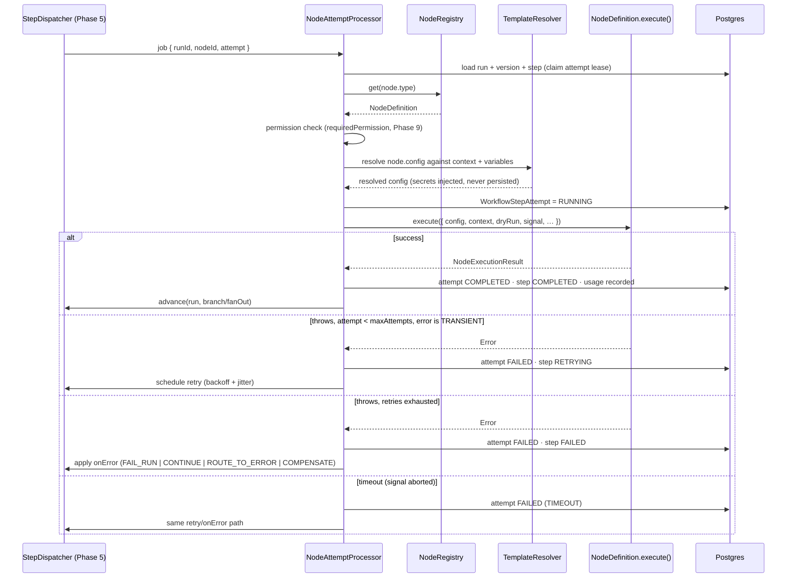
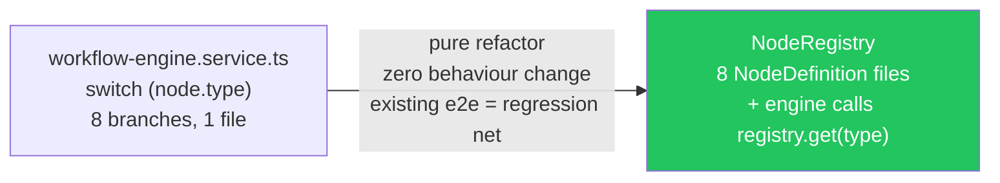
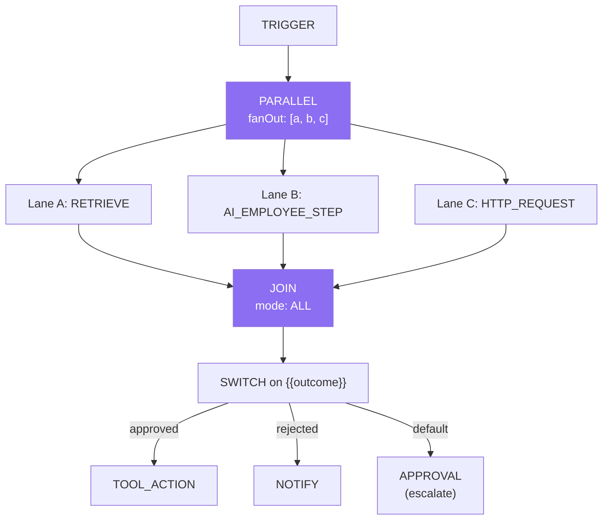

# Phase 2 — Node Architecture

**Prerequisite:** `00-overview-and-canonical-contracts.md` (§0.7 is normative — `NodeType`,
`NodeCategory`, `NodeDefinition`, `NodeExecutionInput/Result`, `RetryPolicy`, `OnErrorBehaviour`,
`CompensationSpec` are all defined there and are not redefined here).

**Governing decisions:** ADR-003 (registry of typed node definitions, not a switch) and ADR-004
(the existing 8 node types keep working, byte-identically).

---

## 2.A The node contract and registry

### 1. Purpose

Replace the engine's `switch (node.type)` — verified at
`engine/workflow-engine.service.ts:621-643`, currently 8 branches — with a **registry of
`NodeDefinition` objects**, so that one declaration serves four consumers:

| Consumer | What it reads from `NodeDefinition` |
|---|---|
| Save-time validator (Phase 1 §1.C) | `configSchema`, `validate()`, `handles` |
| Execution engine (Phase 5) | `execute()`, `defaultRetry`, `defaultTimeoutMs`, `hasSideEffects` |
| Authorization (Phase 9) | `requiredPermission` |
| Canvas node library + Inspector form (Phase 15) | `category`, `label`, `description`, `configSchema`, `handles` |

Today none of those four exist except execution, and each new node type would need four separate
edits in four files. That is the actual problem this phase solves.

### 2. Responsibilities

| Responsibility | Owner |
|---|---|
| Declare a node type once, completely | `NodeDefinition` (one file per type) |
| Register + validate all definitions at boot | `NodeRegistry` |
| Resolve `{{templates}}` in config before `execute()` | engine (Phase 5), not the node |
| Enforce timeout + retry around `execute()` | engine (Phase 5), not the node |
| Do the actual work, once, idempotently where possible | `NodeDefinition.execute()` |
| Persist step state | engine (Phase 5), not the node |

**The division that matters:** a node's `execute()` does *only* its own work. It never writes
`WorkflowStepRun`, never decides retries, never picks the next node, never touches the run row. That
separation is what makes per-node retry, timeouts, dry-run, and compensation implementable once in
the engine rather than eight (soon twenty-five) times in every node.

### 3. Architecture

```
NodeRegistry  (singleton, built at boot, immutable thereafter)
│
├── validateAtBoot()      every NodeType in the union has exactly one definition
│                         → a missing/duplicate definition is a BOOT failure, not a runtime 500
├── get(type)             O(1) lookup
├── list(category?)       drives the UI node library (Phase 15)
└── definitions: Map<NodeType, NodeDefinition>
    ├── trigger.node.ts            EXISTING behaviour, ported verbatim
    ├── retrieve.node.ts           EXISTING
    ├── ai-step.node.ts            EXISTING
    ├── tool-action.node.ts        EXISTING
    ├── wait.node.ts               EXISTING → becomes durable (Phase 5)
    ├── condition.node.ts          EXISTING
    ├── notify.node.ts             EXISTING → gains real dispatch (G7)
    ├── approval.node.ts           EXISTING
    ├── ai-employee-step.node.ts   NEW
    ├── ai-decision.node.ts        NEW
    ├── ai-extract.node.ts         NEW
    ├── ai-classify.node.ts        NEW
    ├── switch.node.ts             NEW
    ├── parallel.node.ts           NEW
    ├── join.node.ts               NEW
    ├── loop.node.ts               NEW
    ├── sub-workflow.node.ts       NEW
    ├── terminate.node.ts          NEW
    ├── memory-read.node.ts        NEW
    ├── memory-write.node.ts       NEW
    ├── knowledge-write.node.ts    NEW
    ├── set-variable.node.ts       NEW
    ├── transform.node.ts          NEW
    ├── http-request.node.ts       NEW
    ├── db-query.node.ts           NEW
    └── noop.node.ts               NEW
```

Boot-time completeness checking is deliberate and mirrors an existing, proven pattern in this
codebase: the skills catalogue and the template registry (Phase 1 §1.E) both fail at boot on a
duplicate key rather than at request time. A node type in the `NodeType` union with no definition is
a programming error and must be impossible to deploy.

### 4. Flow Diagram — one node attempt, end to end



The node itself appears exactly once in that diagram, doing exactly one thing. Everything else is
engine machinery it does not know about.

### 5. Database Design

Phase 2 introduces no tables of its own — it defines *what runs*, Phase 5/12 define *the state of
what ran*. Two columns on the step tables exist specifically to serve this phase:

```prisma
model WorkflowStepRun {
  // … EXISTING fields (nodeId, type, status, input, output, error, timestamps) …

  /// NEW — which attempt is current; attempts themselves are separate rows.
  attemptCount Int @default(0)
  /// NEW — resolved NodeCategory, denormalised for analytics grouping without
  /// re-deriving it from `type` on every query (Phase 11).
  category     String?
}

/// NEW — one row per attempt. See Phase 5/12 for the full definition.
model WorkflowStepAttempt {
  id        String        @id @default(cuid())
  stepId    String
  attempt   Int
  status    StepRunStatus
  error     String?
  errorClass String?      // RunFailureClass
  startedAt  DateTime?
  finishedAt DateTime?
  @@unique([stepId, attempt])
}
```

Storing attempts as rows rather than incrementing a counter is what makes "this node failed twice
with a 429 then succeeded" visible in the timeline and in failure analytics. A counter loses the
error history.

### 6. API Design

The registry is introspectable, because the canvas needs it:

```
GET /workflow-nodes                    → NodeDefinitionDto[]   (the node library)
GET /workflow-nodes/:type              → NodeDefinitionDto     (Inspector form schema)
```

`NodeDefinitionDto` is the serialisable projection of `NodeDefinition` — everything except
`execute()`/`validate()` (functions can't cross the wire). This is the single source of the UI's node
palette, so a newly added node type appears in the UI with **zero** frontend changes.

Filtered server-side by the caller's plan and permissions, so a node the tenant may not use is never
offered (`ValidationContext.allowedNodeTypes`, Phase 1 §1.C.7).

### 7. TypeScript Interfaces

```ts
/** NEW — the serialisable projection sent to the canvas. */
export interface NodeDefinitionDto {
  type: NodeType;
  category: NodeCategory;
  label: string;
  description: string;
  configSchema: NodeConfigField[];
  handles: { inputs: number; outputs: NodeOutputHandle[] };
  defaultRetry: RetryPolicy;
  defaultTimeoutMs: number;
  hasSideEffects: boolean;
  /** False when the caller's plan/permissions disallow it — shown greyed out with a reason. */
  available: boolean;
  unavailableReason?: string;
}

/** NEW — one configurable field. Drives BOTH validation and form rendering. */
export interface NodeConfigField {
  key: string;
  label: string;
  type: 'string' | 'text' | 'number' | 'boolean' | 'select' | 'json'
      | 'employee' | 'skill' | 'tool' | 'workflow' | 'duration' | 'expression';
  required?: boolean;
  default?: unknown;
  /** For 'select'. */
  options?: { value: string; label: string }[];
  /** Show this field only when another field has a given value (e.g. SWITCH cases). */
  visibleWhen?: { field: string; equals: unknown };
  placeholder?: string;
  help?: string;
  /** True when the value may contain {{templates}} — the Inspector offers autocomplete. */
  templatable?: boolean;
  /** Marks a field whose value must come from the secret store, never a literal. */
  secret?: boolean;
}

/** NEW — an output handle (edge source) on the canvas. */
export interface NodeOutputHandle {
  /** Edge `branch` value produced by this handle. Undefined = the default/unlabelled output. */
  branch?: string;
  label: string;
}

/** NEW — the registry. */
export interface NodeRegistry {
  get(type: NodeType): NodeDefinition;
  list(category?: NodeCategory): NodeDefinition[];
  /** Throws at boot on a missing or duplicate definition. */
  validateAtBoot(): void;
}
```

The `type` union on `NodeConfigField` includes semantic types (`employee`, `skill`, `tool`,
`workflow`) rather than only primitives. This is deliberate: it lets the Inspector render a real
employee picker instead of a free-text id field, and lets the validator check that the referenced
entity exists — the same declaration serving both.

### 8. JSON Examples

```json
// GET /workflow-nodes/AI_EMPLOYEE_STEP
{
  "type": "AI_EMPLOYEE_STEP",
  "category": "AI_EMPLOYEE",
  "label": "AI Employee step",
  "description": "Runs one reasoning step as a specific AI Employee, with that employee's persona, knowledge access, memory, and budget.",
  "configSchema": [
    { "key": "employeeId", "label": "Run as", "type": "employee", "required": true,
      "help": "The AI Employee whose persona, permissions and budget apply." },
    { "key": "prompt", "label": "Instruction", "type": "text", "required": true, "templatable": true,
      "placeholder": "Score this CV 0-100 against {{policy}}" },
    { "key": "reasoningStrategy", "label": "Reasoning", "type": "select",
      "default": "PLAN_ACT",
      "options": [
        { "value": "DIRECT",   "label": "Direct (fastest, cheapest)" },
        { "value": "PLAN_ACT", "label": "Plan → act (default)" },
        { "value": "REACT",    "label": "ReAct loop (can use tools)" },
        { "value": "REFLECT",  "label": "Act then self-review (highest quality, slowest)" }
      ]},
    { "key": "allowTools", "label": "May call tools", "type": "boolean", "default": false,
      "help": "When on, the step may invoke the employee's granted skills." },
    { "key": "maxToolIterations", "label": "Max tool iterations", "type": "number", "default": 3,
      "visibleWhen": { "field": "allowTools", "equals": true } },
    { "key": "outputKey", "label": "Save result as", "type": "string", "default": "aiResult",
      "help": "Later nodes read it with ." }
  ],
  "handles": { "inputs": 1, "outputs": [{ "label": "Next" }] },
  "defaultRetry": { "maxAttempts": 3, "backoff": "EXPONENTIAL", "initialDelayMs": 2000,
                    "maxDelayMs": 30000, "jitter": true, "retryOn": "TRANSIENT_ONLY" },
  "defaultTimeoutMs": 120000,
  "hasSideEffects": false,
  "available": true
}
```

```json
// GET /workflow-nodes/TOOL_ACTION — note hasSideEffects drives dry-run + saga
{
  "type": "TOOL_ACTION",
  "category": "SKILL",
  "label": "Use a skill",
  "description": "Calls one tool on a connected skill (Gmail, Slack, Postiz, HRMS…).",
  "handles": { "inputs": 1, "outputs": [{ "label": "Next" }] },
  "defaultRetry": { "maxAttempts": 3, "backoff": "EXPONENTIAL", "initialDelayMs": 1000,
                    "maxDelayMs": 20000, "jitter": true, "retryOn": "TRANSIENT_ONLY" },
  "defaultTimeoutMs": 30000,
  "hasSideEffects": true,
  "available": true
}
```

### 9. Folder Structure

See §2.A.3. One file per node type, colocated with its unit test:

```
engine/nodes/
├── node-registry.ts
├── node-registry.spec.ts          asserts EVERY NodeType has a definition
├── <type>.node.ts
└── <type>.node.spec.ts
```

`node-registry.spec.ts` is the guard that makes ADR-003 safe: it iterates the `NODE_TYPES` array and
fails if any type lacks a definition, so adding a `NodeType` without implementing it breaks CI rather
than production.

### 10. Edge Cases

| Case | Behaviour |
|---|---|
| A `NodeType` exists in the union with no definition | **Boot failure** (`validateAtBoot`), plus a CI test failure. Never a runtime 500. |
| A persisted definition references an unknown node type (e.g. published on a newer release, now rolled back) | Run fails fast with `VALIDATION_ERROR` and a precise message naming the type. Never silently skipped — skipping a node changes business meaning. |
| Node returns `contextValue` but config has no `outputKey` | Value discarded (existing behaviour at `workflow-engine.service.ts:545-551`, preserved verbatim). |
| Node mutates the `context` object it was handed | Prevented by typing `context` as `Readonly<…>` in `NodeExecutionInput` and passing a frozen shallow copy. Writes go through `NodeExecutionResult.variableWrites`/`contextValue`. Without this, a retried attempt would see a half-mutated context. |
| `execute()` throws a non-Error | Coerced to `String(err)`, matching the existing engine's handling. |
| `execute()` never resolves | Engine's `AbortSignal` fires at `timeoutMs`; the attempt is failed as `TIMEOUT`. Nodes doing network I/O **must** pass `signal` through to `fetch` — enforced by code review and noted in every node's doc comment. |
| `dryRun` on a node with `hasSideEffects: true` | Engine short-circuits to a preview before calling `execute()` — the node never runs. This generalises the existing `TOOL_ACTION` dry-run (`workflow-engine.service.ts:806-816`) to every side-effecting node type. |
| `dryRun` on a node with `hasSideEffects: false` | Executes for real (an LLM call in a dry run is intended — you want to see what it would produce). Documented, because it's a legitimate surprise: dry-run is not free. |

### 11. Security

- `requiredPermission` on every definition is checked **at execution time**, not only at save time.
  A workflow published while a permission existed must not keep running after it's revoked.
- `secret: true` config fields never accept a literal value — the validator rejects a non-`secretRef`
  string, so a secret cannot be typed into a graph that is then visible to everyone with read access.
- `hasSideEffects` is a security-relevant flag, not documentation: it gates dry-run behaviour and
  compensation eligibility. Getting it wrong on a new node means a "safe preview" performs a real
  action. Reviewer checklist item for every new node.
- `HTTP_REQUEST` and `DB_QUERY` are the two highest-risk new nodes; both are covered individually in
  §2.C with their specific controls (SSRF, statement allow-listing).

### 12. Performance

- Registry lookup is a `Map.get` — O(1), no reflection, no dynamic import at request time (all
  definitions are statically imported so the bundle is analysable and cold starts are predictable,
  which matters on the Vercel serverless deployment).
- `configSchema` is static data; the `GET /workflow-nodes` response is cacheable per
  (plan, permission-set) with a long TTL and an ETag.
- The per-attempt overhead budget from doc 00 §0.8 is **< 50 ms excluding the node's own work**; the
  registry contributes microseconds. The real cost is the two DB writes (attempt start/finish),
  addressed by Phase 5's batching fast path.

### 13. Scalability

Node count in the registry is a small constant (~26). Adding node types costs nothing at runtime.
The scaling concern belongs to the engine (Phase 5), not the registry.

### 14. Future Extension

- **Third-party/custom nodes.** The `NodeDefinition` interface is deliberately the same shape a
  plugin would need. A future plugin loader would register additional definitions at boot — but note
  the hard prerequisite: running third-party `execute()` code in a multi-tenant process requires
  isolation that does not exist today (doc 00 §0.9 non-goal #2). Do not ship a plugin loader without
  solving that first.
- **Node versioning.** If a node type's `config` shape ever needs a breaking change, add
  `NodeDefinition.configVersion` and keep the old executor registered under the same type, selecting
  by the persisted `config._v`. Because published workflow versions are immutable (ADR-002), old
  graphs keep running on the old executor — which is exactly why versioning nodes is tractable.
- **Declarative node authoring** (a JSON/YAML node spec for simple API-call nodes) so most connector
  nodes need no TypeScript at all.

### 15. Best Practices

Keep `execute()` free of state management — if a node needs to know its attempt number for
idempotency, take it from `NodeExecutionInput.attempt` rather than reading the DB. Set
`hasSideEffects` honestly and pessimistically. Give every node a `defaultTimeoutMs` that is *lower*
than the run timeout, so a stuck node fails its step rather than the whole run. Always pass
`signal` into outbound calls.

---

## 2.B The existing 8 node types — ported unchanged

### 1. Purpose

Guarantee ADR-004: the migration to the registry is a **pure refactor with no behaviour change**, so
the existing e2e suites are the regression net and any failure is unambiguous.

### 2. Responsibilities

Port each of the 8 verified node executors into a `NodeDefinition` with identical semantics, and give
each one the `configSchema`/`handles`/`retry` metadata it never had.

### 3. Architecture — the port table

| Type | Existing executor (verified) | Semantics that must not change | Metadata added |
|---|---|---|---|
| `TRIGGER` | `executeNode` case, returns `{trigger: context.trigger ?? {}}` | Graph root; single output | `handles: {inputs:0, outputs:[{label:'Start'}]}` |
| `RETRIEVE` | `execRetrieve` | Templated `query`; `k` clamped to ≤ 50, default 5; empty query → `[]` (no throw) | `configSchema` for query/k/outputKey |
| `AI_STEP` | `execAiStep` | Optional `employeeId` → persona + **budget check**; records `UsageEvent` with source `workflow_ai_step`; temp 0.2 | retry `EXPONENTIAL`, timeout 120s |
| `TOOL_ACTION` | `execToolAction` | Validate skill/tool exists **before** dry-run short-circuit; connector quarantine on DEGRADED/DISCONNECTED; per-employee connector preference; `ok:false` → throw | `hasSideEffects: true` |
| `WAIT` | `execWait` | Clamped to `MAX_WAIT_MS` (10 s) — **kept as-is in the port**, made durable separately in Phase 5 so the refactor stays behaviour-preserving | `configSchema` duration |
| `CONDITION` | `execCondition` + `compare` | 5 ops; `gt`/`lt` throw on non-numeric (deliberate — silently misrouting a live run is worse); branch edge selection with loud failure on unmatched branch | `outputs: [{branch:'true'},{branch:'false'}]` |
| `NOTIFY` | `execNotify` | **Currently log-only.** Ported log-only, then extended in §2.C.6 | `hasSideEffects` flips to true when real dispatch lands |
| `APPROVAL` | `pauseForApproval` / `execAutoApproval` | Pauses run → `WAITING` + `resumeNodeId`; creates `WORKFLOW`-kind `ApprovalRequest` **directly via Prisma** (never importing the Approvals module, keeping the dependency acyclic); `autoApprove:true` bypasses the gate entirely | routing metadata (Phase 8) |

Two of these behaviours look like bugs but are deliberate and must be preserved — they were
*deliberate fixes* documented in the code:
- `CONDITION`'s `gt`/`lt` **throwing** on a non-numeric operand (`workflow-engine.service.ts:46-55`):
  an LLM replying "around 85" previously read as `NaN > 79 === false` and silently auto-rejected a
  strong candidate. Failing loudly is correct.
- `nextNode`'s **loud failure** when a CONDITION result matches no branch-tagged edge
  (`workflow-engine.service.ts:602-606`): falling back to an arbitrary edge would run the wrong
  downstream steps with no error anywhere.

Preserving these is non-negotiable; a reviewer seeing them in the port should not "clean them up."

### 4. Flow Diagram



### 5. Database Design

None. The port touches no schema — that is what makes it safe to ship on its own (Wave W2 in doc 00
§0.10).

### 6. API Design

`GET /workflow-nodes` starts returning the 8 existing types with real metadata. No behavioural API
change.

### 7. TypeScript Interfaces

```ts
/** Example port — CONDITION, preserving the strict-numeric behaviour verbatim. */
export const conditionNode: NodeDefinition<ConditionConfig> = {
  type: 'CONDITION',
  category: 'LOGIC',
  label: 'Condition',
  description: 'Branches the workflow on a comparison.',
  configSchema: [
    { key: 'left',  label: 'Value',    type: 'string', required: true, templatable: true },
    { key: 'op',    label: 'Operator', type: 'select', required: true, default: 'eq',
      options: CONDITION_OPS.map((o) => ({ value: o, label: o })) },
    { key: 'right', label: 'Compare to', type: 'string', required: true, templatable: true },
  ],
  handles: {
    inputs: 1,
    outputs: [
      { branch: 'true',  label: 'Yes' },
      { branch: 'false', label: 'No'  },
    ],
  },
  defaultRetry: { maxAttempts: 1, backoff: 'NONE', initialDelayMs: 0 },  // pure fn: never retry
  defaultTimeoutMs: 5_000,
  requiredPermission: 'node:logic:use',
  hasSideEffects: false,

  validate(config, _ctx) {
    const issues: ValidationIssue[] = [];
    if ((config.op === 'gt' || config.op === 'lt') && config.right !== undefined) {
      if (Number.isNaN(Number(String(config.right).trim()))) {
        issues.push({
          severity: 'ERROR', field: 'right', code: 'CONDITION_NON_NUMERIC',
          message: `Operator "${config.op}" needs a number; "${String(config.right)}" is not numeric.`,
        });
      }
    }
    return issues;
  },

  async execute({ config }) {
    // compare() is the EXISTING function, moved verbatim — including its
    // deliberate throw on a non-numeric gt/lt operand.
    const result = compare(String(config.left ?? ''), config.op, String(config.right ?? ''));
    return {
      output: { left: config.left, op: config.op, right: config.right, result },
      branch: result ? 'true' : 'false',
    };
  },
};

interface ConditionConfig { left: string; op: ConditionOp; right: string }
```

Note the `validate()` addition: the same non-numeric operand that throws at *runtime* today is now
also caught at *publish* time — strictly better, and it does not change runtime behaviour for graphs
that were already valid.

### 8. JSON Examples

Existing definitions validate and run unchanged. Concretely, this graph — the shape of the live
recruiting workflow — must behave identically before and after the port:

```json
{
  "nodes": [
    { "id": "t",  "type": "TRIGGER",     "config": {} },
    { "id": "r",  "type": "RETRIEVE",    "config": { "query": "hiring policy", "k": 5, "outputKey": "policy" } },
    { "id": "a",  "type": "AI_STEP",     "config": { "employeeId": "emp_hr", "prompt": "Score: {{trigger.data.cvText}} vs {{policy}}", "outputKey": "score" } },
    { "id": "c",  "type": "CONDITION",   "config": { "left": "{{score}}", "op": "gt", "right": "79" } },
    { "id": "ap", "type": "APPROVAL",    "config": { "message": "Shortlist? {{score}}", "autoApprove": false } },
    { "id": "y",  "type": "TOOL_ACTION", "config": { "skillKey": "gmail", "tool": "send_email", "args": { "to": "{{trigger.data.from}}", "subject": "Next steps", "body": "…" } } },
    { "id": "n",  "type": "TOOL_ACTION", "config": { "skillKey": "gmail", "tool": "send_email", "args": { "to": "{{trigger.data.from}}", "subject": "Update", "body": "…" } } }
  ],
  "edges": [
    { "from": "t", "to": "r" }, { "from": "r", "to": "a" }, { "from": "a", "to": "c" },
    { "from": "c", "to": "ap", "branch": "true" }, { "from": "c", "to": "n", "branch": "false" },
    { "from": "ap", "to": "y" }
  ]
}
```

### 9. Folder Structure

The 8 ported files listed in §2.A.3, each with a spec.

### 10. Edge Cases

The port's own risk is **silent behaviour drift**. Mitigations, in order of strength:
1. The existing e2e suites (`workflows.e2e-spec.ts`, `workflow-conditions.e2e-spec.ts`,
   `workflow-approval.e2e-spec.ts`, `workflow-triggers.e2e-spec.ts`) run unmodified — if any assertion
   changes, the port is wrong.
2. A characterisation test per node type that snapshots `{output, contextValue, branch}` for a fixed
   input, captured *before* the refactor from the current engine, asserted *after*.
3. Ship behind the `WORKFLOW_ENGINE_MODE` flag (doc 00 §0.10) so a tenant can be reverted instantly.

Reminder from a real incident in this repo: any e2e test that exercises the employee chat/tool-calling
loop **must** be run with `LLM_PROVIDER=mock` explicitly on the command line — this environment's
`.env` points at a real OpenAI key, which makes tool selection non-deterministic and produces
failures unrelated to the code under test.

### 11. Security

No new surface — same executors, same permissions. The port is the right moment to *add* the missing
`requiredPermission` on each type, which is a security improvement rather than a change.

### 12. Performance

Neutral by construction. Verify with a benchmark: 1,000 sequential `CONDITION` nodes before vs after,
expecting < 5% delta. If the delta is larger, the registry lookup is being done per attempt in a hot
loop and should be hoisted.

### 13. Scalability

Unchanged by the port.

### 14. Future Extension

Once ported, each of the 8 gains per-node retry/timeout for free (Phase 5 reads
`defaultRetry`/`defaultTimeoutMs`), which is the first real capability improvement — with no further
node changes.

### 15. Best Practices

Do the port in one PR per node type where practical, with the characterisation test in the same
commit. Resist "improving" behaviour during the port; improvements go in a follow-up so a bisect can
distinguish "the refactor broke it" from "the improvement broke it."

---

## 2.C New node types

Grouped by `NodeCategory`. Each entry gives the config contract, the semantics, and the specific edge
case that makes it non-trivial. The 15-subsection template is applied to the group (repeating it 18
times per node would be padding, not information — and doc 00 §0.9 warns against exactly that).

### 1. Purpose

Close gaps **G3** (no parallelism), **G7** (NOTIFY is fake), **G12** (no sub-workflows), **G13** (no
variables), **G15** (no memory nodes), and give the AI Employee first-class node representation.

### 2. Responsibilities

#### AI_EMPLOYEE category

| Type | Config | Semantics |
|---|---|---|
| `AI_EMPLOYEE_STEP` | `employeeId`, `prompt`, `reasoningStrategy?`, `allowTools?`, `maxToolIterations?`, `outputKey?` | The headline new node. Unlike `AI_STEP` (which only borrows a persona), this runs the **full** employee runtime — role-scoped knowledge, memory recall, granted-skill tool loop, validation, budget — by delegating to the existing `AgentRuntimeService`. Phase 3 owns the semantics; this phase owns the node wrapper. |
| `AI_DECISION` | `prompt`, `choices: string[]`, `employeeId?` | LLM picks exactly one of N declared choices; output `branch` = the chosen value, so edges are `branch: '<choice>'`. **Constrained** output: a reply outside `choices` is a retryable error, never a silent fallthrough. This is the safe way to let AI route a workflow. |
| `AI_EXTRACT` | `prompt`, `schema: NodeConfigField[]`, `employeeId?` | Structured extraction into a declared shape, validated before returning. Turns "parse this CV/invoice/email" into typed context values instead of a blob of prose. |
| `AI_CLASSIFY` | `input`, `labels: string[]`, `multi?: boolean` | Cheap single/multi-label classification. Separate from `AI_DECISION` because it does not branch — it just labels. |

#### LOGIC category

| Type | Config | Semantics |
|---|---|---|
| `SWITCH` | `on: string` (templatable), `cases: {value, branch}[]`, `default?: branch` | n-way branch. Avoids the CONDITION chains that make graphs unreadable. |
| `PARALLEL` | `branches: string[]` (node ids) | Fan-out: returns `fanOut` so the engine spawns one execution lane per branch. Does **not** wait. |
| `JOIN` | `mode: 'ALL' \| 'ANY' \| 'N_OF_M'`, `n?`, `timeoutMs?` | Barrier that waits for its incoming lanes. Phase 5's `JoinResolver` owns the accounting. |
| `LOOP` | `over: string` (array expression), `bodyStartNodeId`, `maxIterations`, `concurrency?` | Bounded iteration — the **only** legal way to express repetition, because raw graph cycles are rejected at validation (Phase 1 §1.C.10). `maxIterations` is mandatory and capped. |
| `SUB_WORKFLOW` | `workflowId`, `versionPin?: 'ACTIVE' \| number`, `input`, `waitForCompletion?` | Calls another workflow. `versionPin: 'ACTIVE'` follows the callee's active version; a number pins it. Depth-limited to 3, cycle-checked at validation. |
| `TERMINATE` | `status: 'COMPLETED' \| 'FAILED'`, `reason?` | Explicit early exit with an intended status — today the only way to end is running out of edges, which cannot express "stop, successfully, here." |

#### VARIABLE / UTILITY / KNOWLEDGE / MEMORY / COMMUNICATION / EXTERNAL_API / DATABASE

| Type | Config | Semantics |
|---|---|---|
| `SET_VARIABLE` | `assignments: {key, value, scope}[]` | Writes typed variables (Phase 6). |
| `TRANSFORM` | `expression`, `outputKey` | Safe declarative expression only — **no `eval`, no `new Function`** (doc 00 §0.9 non-goal #2). Phase 6 defines the grammar. |
| `NOOP` | `note?` | Placeholder / documentation anchor / join target while building. |
| `MEMORY_READ` | `employeeId`, `kind?`, `query?`, `limit?` | Explicit read of `EmployeeMemory` (Phase 7). |
| `MEMORY_WRITE` | `employeeId`, `kind`, `content` | Persists a durable fact/summary the employee will recall later. |
| `KNOWLEDGE_WRITE` | `title`, `content`, `category?` | Writes a document into the knowledge base (e.g. an approved policy the employee later cites). |
| `NOTIFY` (**extended**) | `channel: 'IN_APP' \| 'EMAIL' \| 'SLACK'`, `to`, `message`, `subject?` | Closes **G7** — real dispatch. In-app writes a notification row; EMAIL/SLACK delegate to the corresponding **existing** skill executor rather than adding a second egress path. `hasSideEffects: true` once real. |
| `HTTP_REQUEST` | `method`, `url`, `headers?`, `body?`, `authSecretRef?` | Generic outbound call for systems with no connector. **Must** reuse the existing `executors/ssrf.ts` guard. |
| `DB_QUERY` | `datasourceId`, `queryId`, `params` | Reads a customer's own connected datasource via a **pre-registered, parameterised** query — never a raw SQL string from the graph. |

### 3. Architecture

The two structurally significant additions are `PARALLEL`/`JOIN` and `SUB_WORKFLOW`, because both
break the "one current node" assumption that the whole existing engine is built on
(`nextNode` returns `WorkflowNode | undefined`). They are the reason Phase 5's state machine is a
prerequisite, and they are deliberately scheduled after it (doc 00 §0.10 Wave W4).



### 4. Flow Diagram

Per-node flows are in the relevant phase docs (`AI_EMPLOYEE_STEP` → Phase 3; `MEMORY_*`/
`KNOWLEDGE_WRITE` → Phase 7; `PARALLEL`/`JOIN`/`LOOP` → Phase 5; `SET_VARIABLE`/`TRANSFORM` →
Phase 6) so the semantics live next to the subsystem that owns them rather than being duplicated.

### 5. Database Design

Only two new nodes need storage beyond the existing step tables:
- `NOTIFY` with `channel: 'IN_APP'` needs a notification table. **Decision:** reuse the platform's
  existing notification surface if one exists; if not, `NOTIFY` in-app writes a row in a new minimal
  `Notification` table (Phase 13 owns the read API). Flagged as a dependency to confirm, not assumed.
- `DB_QUERY` needs `Datasource` + `DatasourceQuery` (pre-registered parameterised queries). Both are
  Phase 4 (connector) concerns; the node only references ids.

### 6. API Design

No new endpoints — all new nodes surface through `GET /workflow-nodes`. That is the payoff of
ADR-003: eighteen new node types, zero new API routes, zero frontend changes to make them appear.

### 7. TypeScript Interfaces

```ts
/** Config contracts for the structurally significant new nodes. */

export interface ParallelConfig {
  /** Node ids to start concurrently. Must all be reachable only from this node. */
  branches: string[];
  /** Optional cap so a 50-way fan-out doesn't monopolise a tenant's workers. */
  maxConcurrency?: number;
}

export interface JoinConfig {
  mode: 'ALL' | 'ANY' | 'N_OF_M';
  /** Required when mode = 'N_OF_M'. */
  n?: number;
  /** Give up waiting after this long; unfinished lanes are cancelled. */
  timeoutMs?: number;
  /** What to do if a lane failed: default 'FAIL' (strictest, safest). */
  onLaneFailure?: 'FAIL' | 'IGNORE';
}

export interface LoopConfig {
  /** Expression resolving to an array, e.g. "{{candidates}}". */
  over: string;
  bodyStartNodeId: string;
  /** MANDATORY and capped (default cap 1000) — unbounded loops are how you DoS yourself. */
  maxIterations: number;
  /** 1 = sequential (default). >1 fans out iterations. */
  concurrency?: number;
  /** Item + index exposed to the body as {{loop.item}} / {{loop.index}}. */
  itemVar?: string;
}

export interface SubWorkflowConfig {
  workflowId: string;
  versionPin?: 'ACTIVE' | number;
  /** Mapped into the child's INPUT-scope variables. */
  input?: Record<string, unknown>;
  /** false = fire-and-forget (parent continues immediately). Default true. */
  waitForCompletion?: boolean;
  /** Child's outputs merged into the parent context under this key. */
  outputKey?: string;
}

export interface AiDecisionConfig {
  prompt: string;
  /** Closed set. The model MUST return one of these; anything else is a retryable error. */
  choices: string[];
  employeeId?: string;
  /** Fallback branch if retries are exhausted. Omit to fail the run instead. */
  fallbackBranch?: string;
}
```

`AiDecisionConfig.fallbackBranch` being *optional* — with "fail the run" as the default — is a
deliberate safety stance: an AI router that silently defaults on failure will make an arbitrary
business decision. Opting into a fallback should be explicit.

### 8. JSON Examples

```json
// LOOP over shortlisted candidates, sending each an interview invite,
// two at a time, with a hard iteration cap.
{
  "id": "n_invite_loop",
  "type": "LOOP",
  "name": "Invite each shortlisted candidate",
  "config": {
    "over": "{{shortlisted}}",
    "bodyStartNodeId": "n_invite_body",
    "maxIterations": 100,
    "concurrency": 2,
    "itemVar": "candidate"
  }
}
```

```json
// AI_DECISION routing a support-style triage with a closed choice set
{
  "id": "n_triage",
  "type": "AI_DECISION",
  "config": {
    "employeeId": "emp_hr",
    "prompt": "Classify this leave request: {{trigger.data.body}}",
    "choices": ["auto_approve", "needs_manager", "reject_policy_violation"]
  }
}
// edges: { from: "n_triage", to: "…", branch: "auto_approve" } etc.
```

```json
// SUB_WORKFLOW: onboarding calls the document-verification workflow and waits
{
  "id": "n_verify",
  "type": "SUB_WORKFLOW",
  "config": {
    "workflowId": "wf_doc_verification",
    "versionPin": "ACTIVE",
    "input": { "employeeEmail": "{{newHire.email}}", "documents": "{{newHire.docs}}" },
    "waitForCompletion": true,
    "outputKey": "verification"
  },
  "timeoutMs": 259200000
}
```

### 9. Folder Structure

One file per type under `engine/nodes/` (§2.A.3), plus:

```
engine/nodes/
├── ai/            ai-employee-step, ai-decision, ai-extract, ai-classify
├── logic/         switch, parallel, join, loop, sub-workflow, terminate
├── data/          set-variable, transform, db-query
├── memory/        memory-read, memory-write, knowledge-write
└── io/            http-request, notify
```

Subfolders once the count passes ~15 files; the registry imports from an `index.ts` per subfolder.

### 10. Edge Cases

| Node | The edge case that matters |
|---|---|
| `PARALLEL` | A branch node reachable from *both* the parallel node and elsewhere → validation ERROR (ambiguous lane ownership). Lanes must be exclusively owned. |
| `JOIN` | Not all lanes arrive (one lane failed with `onError: CONTINUE`). `mode: ALL` + `onLaneFailure: FAIL` → run fails. Without an explicit choice here, a JOIN can hang forever — hence `timeoutMs` and a mandatory default. |
| `JOIN` | Two lanes complete simultaneously → arrival counting must be atomic (`UPDATE … SET arrived = arrived + 1 RETURNING`), never read-modify-write. Phase 5 owns this. |
| `LOOP` | `over` resolves to a non-array (an LLM returned prose) → fail loudly with the resolved value in the error, same philosophy as CONDITION's strict numeric parse. |
| `LOOP` | `over` resolves to 50,000 items → `maxIterations` cap trims and emits a WARNING in the step output, so the truncation is visible rather than silent. |
| `SUB_WORKFLOW` | Recursion (A calls B calls A) → validation-time cycle check across workflows plus a runtime depth counter (max 3). Both, because `versionPin: 'ACTIVE'` means the callee's graph can change after validation. |
| `SUB_WORKFLOW` | Callee has no published version → parent step fails with a precise message; never silently skipped. |
| `SUB_WORKFLOW` | `waitForCompletion: true` and the child waits on an approval for 3 days → parent sits in `WAITING`. Requires the parent's `runTimeoutMs` to accommodate it, or it will be reaped as timed out. Documented prominently, because it is a genuinely surprising interaction. |
| `TERMINATE` | Inside a lane of a `PARALLEL` → terminates the **whole run**, not just the lane. Stated explicitly because both readings are plausible; "terminate the run" is the intuitive user intent. |
| `HTTP_REQUEST` | URL resolves (via template) to an internal address → blocked by the existing SSRF guard. The check must run on the **resolved** URL, not the template. |
| `NOTIFY` | Channel EMAIL but no email skill connected → step fails with a clear "connect a skill" message rather than silently not notifying. Silent non-delivery of a notification is the worst outcome. |
| `AI_EXTRACT` | Model returns invalid JSON → retryable (a formatting failure is transient); after retries, fail. Never return a partially-parsed object. |
| `SET_VARIABLE` | Writing to a `SECRET`-scope variable → validation ERROR. Secrets come from the store, never from a graph. |

### 11. Security

- `HTTP_REQUEST` — highest-risk node in the set. Controls: reuse the existing SSRF allow/deny guard
  on the *resolved* URL; no redirect following (the existing `http` skill already sets
  `redirect: 'manual'` precisely because a 3xx can point at an internal host); response size cap;
  `authSecretRef` only (no inline credentials); per-tenant egress rate limit via the existing
  per-connector limiter.
- `DB_QUERY` — no raw SQL from the graph, ever. Only pre-registered parameterised queries, so the
  graph supplies *values*, not statements. This removes SQL injection as a category rather than
  trying to sanitise it.
- `SUB_WORKFLOW` — the callee must belong to the same `companyId`, checked at execution time even
  though validation also checks it (the graph is immutable but the callee's ownership is not part of
  it).
- `AI_*` nodes — prompt-injection exposure is real: a CV or inbound email can contain
  "ignore previous instructions." Mitigations are Phase 3's responsibility (system-prompt
  separation, closed-choice outputs for anything that routes, human approval before consequential
  actions), and `AI_DECISION`'s closed `choices` set is specifically designed for it.
- `MEMORY_WRITE`/`KNOWLEDGE_WRITE` — attacker-controlled content persisting into an employee's
  long-term memory is a *persistent* injection vector. Both require the content to be attributed
  (which run/node wrote it) so it is auditable and revocable; Phase 7 owns the policy.

### 12. Performance

`PARALLEL` multiplies concurrent work per run — hence `maxConcurrency` per node and a per-tenant
worker cap (Phase 5). `LOOP` with `concurrency > 1` is the easiest way for one tenant to starve
others, which is exactly why the per-tenant fair-share queue in doc 00 §0.8 is not optional.
`AI_*` nodes are latency-dominated by the LLM (hundreds of ms to seconds); their `defaultTimeoutMs`
of 120 s is generous on purpose, but the engine must not hold a DB transaction open across them.

### 13. Scalability

Every new node is either pure (`SWITCH`, `TRANSFORM`, `NOOP`, `TERMINATE` — free), a bounded DB
operation (`MEMORY_*`, `SET_VARIABLE`), or an external call already governed by the existing
circuit-breaker/rate-limiter/retry primitives. The structural ones (`PARALLEL`/`JOIN`/`LOOP`/
`SUB_WORKFLOW`) scale with Phase 5's dispatcher, not with anything in this phase.

### 14. Future Extension

`WAIT_FOR_EVENT` (suspend until a matching `CanonicalEvent` arrives — the event pipeline already
exists, so this is a small addition once durable suspension lands); `HUMAN_TASK` (assign work to a
*human* employee and wait, distinct from an approval); `SANDBOXED_CODE` (only after the isolation
problem in doc 00 §0.9 is solved); `AI_EMPLOYEE_DELEGATE` (one employee hands a task to another,
which the multi-employee model makes natural).

### 15. Best Practices

Add nodes only when an existing one genuinely cannot express the need — every node type is permanent
API surface and a support burden. Prefer a closed choice set (`AI_DECISION`) over free-text output
anywhere the result changes control flow. Make every bound (`maxIterations`, `maxConcurrency`,
`timeoutMs`, response size) mandatory with a sane default, because the unbounded version will
eventually be hit by a real customer with real data.

---

**Next:** `05-execution-engine.md` — Phase 5 (the durable state machine that makes G2/G3/G4/G5/G6
possible).
