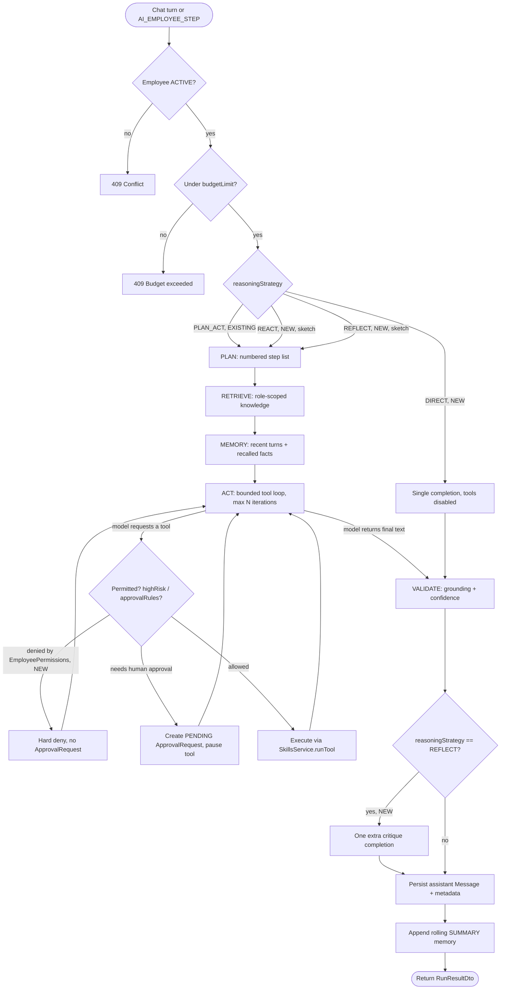
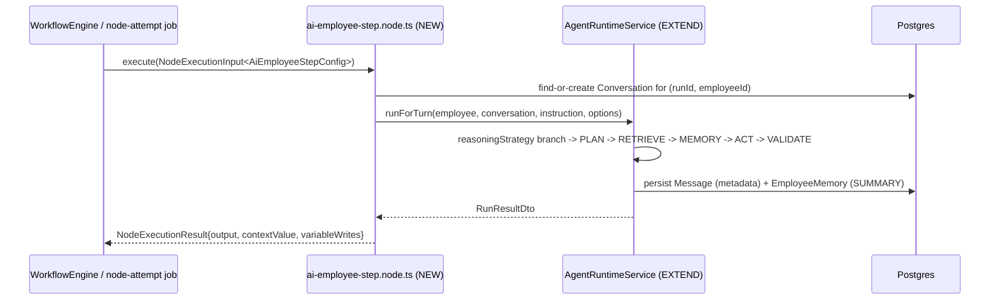
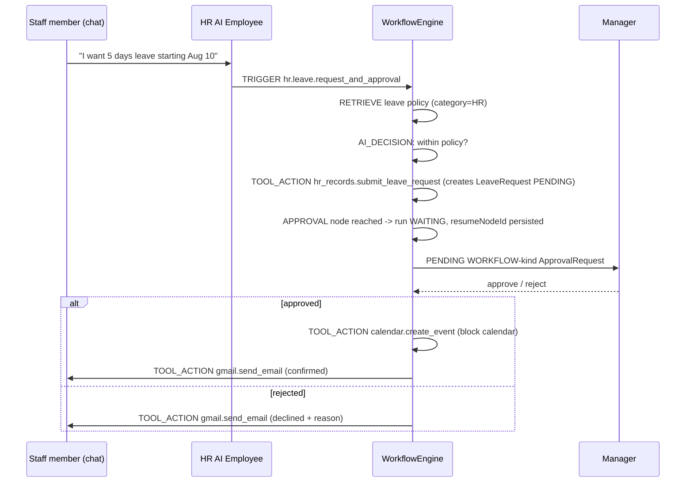
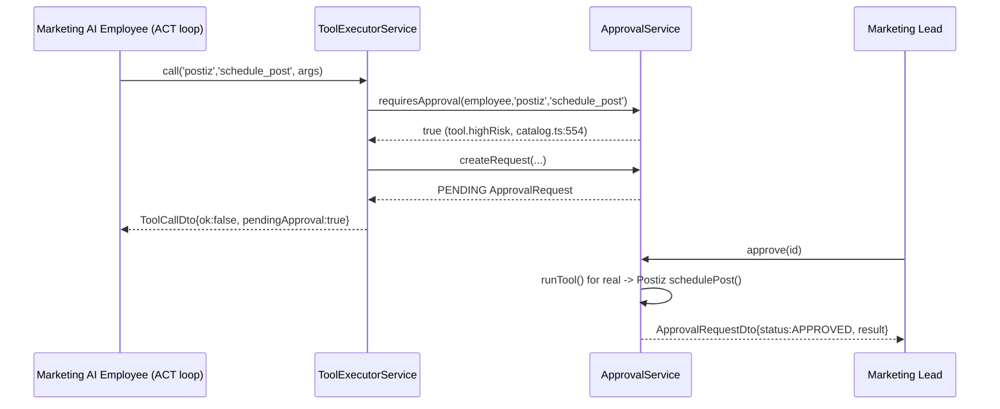

# Orlixa Workflow System — Phase 3: AI Employee Architecture

**Document:** `docs/architecture/workflow-system/03-ai-employees.md` · **Phase:** 3 · **Version:** 1.0 · **Date:** 2026-08-01
**Status:** Design approved for implementation · **Audience:** senior/staff engineers implementing this
**Normative parent:** `00-overview-and-canonical-contracts.md` — read first. This document elaborates §0.7's
canonical enums/interfaces; it never redefines them. Every NEW type introduced here is flagged for promotion into
`00-overview-and-canonical-contracts.md` §0.7 once implemented — the full promotion list is in §3.3 at the end.

This document covers all three "major sections" the brief requires, each carrying the full 15-subsection template:

| § | Section | What it is |
|---|---|---|
| 3.0 | The AI Employee Model | The generic digital-employee contract every role shares (Role, Department, KPIs, Permissions, Memory, Knowledge, Skills, Available Workflows, Working Hours, Manager, Escalation, Approval, Execution Limits, Budget, LLM Config, Prompt Strategy, Reasoning Strategy, Observability) |
| 3.1 | HR Employee | Recruitment, Interview, Resume Screening, Onboarding, Leave, Attendance, Performance Review, Exit, Compliance, Policy Management, Employee Records, Document Verification, Payroll Coordination (13/13) |
| 3.2 | Marketing Employee | Campaign Planning, Content Creation, Social Media, SEO, Email Marketing, Lead Generation, Analytics, Performance Tracking, Brand Management, Paid Ads (10/10) |

---

## Phase 3 current-state findings (new — not in doc 00 §0.3.2)

Doc 00's G1–G17 audit is engine-focused. Reading the Employees, Skills, Analytics, Approvals and Marketing-engine
modules end to end for this phase surfaced six more **verified** gaps that directly block the HR/Marketing designs
below. These are numbered **F1–F6** (Phase-3 namespace, distinct from doc 00's G-numbers) and should be appended to
doc 00 §0.3.2 as G18+ when this phase is promoted (see §3.3).

| # | Finding (verified) | Evidence | Closed in |
|---|---|---|---|
| **F1** | `AiEmployee.model` is stored and returned but **never read** by anything that picks an LLM. `LlmRouterService.forTask()` always returns the single env-configured provider regardless of task or employee. | `llm-router.service.ts:20-22`; only writers/readers are `employees.service.ts:91,132` and `employees.mapper.ts:38` | §3.0.7/§3.0.10 (`LlmConfiguration`) |
| **F2** | `AiEmployee.permissions` is stored, returned, and rendered as UI checkboxes — but **zero** runtime code reads it. It has no enforcement effect today. | Repo-wide grep for `.permissions` in `apps/api/src` returns only `employees.service.ts:144-146` (write) and `employees.mapper.ts:48` (read-back for display); `apps/web/src/features/employees/labels.ts:19-24` is UI-only | §3.0.7/§3.0.11 (`EmployeePermissions`) |
| **F3** | `AiEmployee.workingHoursStart/End` (and the per-skill `businessHoursStart/End` config fields on `email`/`gmail`) are stored but **never read** by any gating/scheduling logic. | Repo-wide grep for `workingHoursStart`/`businessHoursStart` returns only DTO/service/mapper plumbing, no conditional check anywhere | §3.0.10 (documented as an honest limitation, not silently fixed — see rationale there) |
| **F4** | **No human-workforce roster model exists at all.** `User` = platform login accounts (Owners/Admins/Members); `AiEmployee` = digital workers. Neither represents "the 2,000 people who work at the customer company." Leave/Attendance/Performance/Exit/Payroll/Records/Document-Verification have no data subject to operate on. | `schema.prisma` — no `Employee`/`Staff`/`Candidate` model exists | §3.1.5 (`StaffMember` + 4 satellite models, NEW) |
| **F5** | `Campaign`, `MediaAsset`, `BrandAsset`, `MarketingAnalyticsSnapshot` exist in `schema.prisma:811-898` but have **zero application-code references** outside the schema file itself (confirmed by repo-wide grep for `CampaignsService`, `.campaign.`, `.mediaAsset.`, `.brandAsset.`, `.marketingAnalyticsSnapshot.` — none found). They are fully unwired "shadow tables." | `schema.prisma:811-898`; grep of `apps/api/src` | §3.2.3/§3.2.5/§3.2.6 |
| **F6** | The onboarding wizard's business-function `Department` **type** (`'SALES'\|'HR'\|'CUSTOMER_SUPPORT'\|'RECRUITMENT'\|'FINANCE'`, distinct from the Prisma `Department` **model**) also has no `MARKETING` value, and `completeOnboardingSchema.employees[].role` is a strict zod enum that will reject `role:'MARKETING'` even after the Prisma migration, unless also updated. | `packages/types/src/index.ts:248-261` (type), `:547-555` (zod enum) | §3.0.10 |

---

## 3.0 The AI Employee Model

### 3.0.1 Purpose

Doc 00 §0.2 states the platform's central inversion: *the AI Employee is the primary abstraction; the workflow is
something an Employee executes on the company's behalf.* This section specifies what "being a digital employee"
concretely means in Orlixa today, what of that is real vs. cosmetic (per F1–F3 above), and the schema/type changes
needed so every attribute the brief requires — Role, Department, Responsibilities, KPIs, Permissions, Memory,
Knowledge, Skills, Available Workflows, Working Hours, Manager, Escalation Rules, Approval Rules, Execution Limits,
Budget Limits, LLM Configuration, Prompt Strategy, Reasoning Strategy, Observability — is a real, typed, enforceable
field rather than a display-only one. §3.1 and §3.2 then instantiate this model concretely for HR and Marketing.

### 3.0.2 Responsibilities

Every AI Employee, regardless of role, MUST define the following. Status = **EXISTING (KEEP)** it already works,
**EXTEND** the column/mechanism exists but needs widening, **NEW** nothing exists yet.

| Attribute | Status | Where it lives today | What's missing |
|---|---|---|---|
| Role | EXTEND | `AiEmployee.role: EmployeeRole` (`schema.prisma:315`) | Add `MARKETING` (closes G10) |
| Department | EXTEND | `AiEmployee.department: String?` (`schema.prisma:320`), free text | FK to the real `Department` model (`schema.prisma:630-642`) |
| Responsibilities | EXTEND | `ROLE_SCOPE: Record<EmployeeRole,string>` one-liner (`employees.constants.ts:54-62`), injected into the system prompt (`agent-runtime.service.ts:262-264`) | Widen `ROLE_SCOPE.HR`; add `ROLE_SCOPE.MARKETING` (§3.1.3/§3.2.3) |
| KPIs | EXISTING (KEEP) | `AiEmployee.kpiTargets: Json?` typed as `KpiTargets` (`@vaep/types`), attainment computed in `analytics.service.ts:318-345` | Per-capability KPI mapping (§3.1.2/§3.2.2 tables) |
| Permissions | EXTEND | `AiEmployee.permissions: Json?`, untyped, **cosmetic (F2)** | Typed `EmployeePermissions` + a real enforcement hook (§3.0.7/§3.0.11) |
| Memory | EXISTING (KEEP) | `EmployeeMemory` model, recency-only recall (`memory.service.ts:26-48`) | Semantic recall is a known gap (doc 00, out of Phase 3 scope — see §7 `knowledge-memory`) |
| Knowledge | EXISTING (KEEP) | `KnowledgeAccess` (`ALL`\|`NONE`) + role-scoped retrieval via `KnowledgeService.retrieve(...,category)` (`knowledge.service.ts:148-173`) | Requires the role to exist in the `EmployeeRole` Postgres enum — this is exactly why G10 matters (§3.0.10) |
| Skills | EXISTING (KEEP) | `InstalledSkill` + `EmployeeSkill` join, `SkillsService.getToolsForEmployee` (`skills.service.ts:341-364`) | New skills for HR (`hr_records`) and Marketing (`postiz` extensions) — §3.1/§3.2 |
| Available Workflows | NEW | No concept today — `Workflow` is company-wide, not employee-scoped | `WorkflowTemplateDefinition` catalog + `GET /employees/:id/workflows` (§3.0.6/§3.0.7) |
| Working Hours | EXTEND | `AiEmployee.workingHoursStart/End: String?`, **cosmetic (F3)** | Documented as intentionally unenforced for Phase 3 (§3.0.10) — enforcing it is Future Extension |
| Manager | EXTEND | `AiEmployee.managerName: String?`, free text | FK `managerUserId → User` (§3.0.5) |
| Escalation Rules | NEW | Nothing — doc 00 G8: approvals have no routing/escalation at all | Extend `ApprovalRules` with `escalateTo`/`escalateAfterMins` using canonical `ApproverRuleType` (§3.0.7) |
| Approval Rules | EXISTING (KEEP) | `AiEmployee.approvalRules: Json?` typed `ApprovalRules`, enforced by `ApprovalService.requiresApproval` (`approval.service.ts:62-76`) | Extend with escalation (above) |
| Execution Limits | NEW | Only a GLOBAL constant `MAX_ACT_ITERATIONS = 3` (`employees.constants.ts:26`) — no per-employee override | `ExecutionLimits` + new `executionLimits: Json?` column (§3.0.5/§3.0.7) |
| Budget Limits | EXISTING (KEEP) + EXTEND | `AiEmployee.budgetLimit: Int?`, enforced in `agent-runtime.service.ts:332-347` and `workflow-engine.service.ts:684-696` | Richer `BudgetConfig` (per-run cap, alert threshold) — new `budgetConfig: Json?` column |
| LLM Configuration | NEW (fixes F1) | `AiEmployee.model: String?` exists but is dead (F1) | `LlmConfiguration` + new `llmConfig: Json?` column; `LlmRouterService.forTask` EXTEND to read it |
| Prompt Strategy | NEW | Prompt assembly is hardcoded in `buildSystemPrompt` (`agent-runtime.service.ts:253-318`) | `PromptStrategyConfig` + new `promptStrategy: Json?` column; default preserves today's exact prompt |
| Reasoning Strategy | EXTEND | Runtime hardcodes the canonical `PLAN_ACT` pipeple (doc 00 §0.7.1) | New Prisma enum `ReasoningStrategy` + `AiEmployee.reasoningStrategy` column, default `PLAN_ACT` (§3.0.5) |
| Observability | EXTEND | `MessageMetadataDto{plan,sources,validation,toolCalls}` persisted per turn (`agent-runtime.service.ts:218-223`); `SkillExecution`/`UsageEvent`/`AuditLog` exist | `ObservabilityConfig` for per-employee alerting knobs — new `observability: Json?` column |

### 3.0.3 Architecture

**The runtime pipeline (EXISTING, KEEP).** `AgentRuntimeService.run()` (`agent-runtime.service.ts:64-250`) already
implements `PLAN → RETRIEVE → MEMORY → ACT (bounded tool loop, max `MAX_ACT_ITERATIONS`=3) → VALIDATE`, which is
exactly canonical `ReasoningStrategy = 'PLAN_ACT'` (doc 00 §0.7.1). This is the pipeline every AI Employee uses
today, chat-only. Phase 3 does two things to it: (1) makes the strategy pluggable per employee instead of hardcoded,
and (2) makes the SAME pipeline callable from inside a workflow, not just from chat.

**Decision — extract, don't duplicate, the pipeline for workflow use.** A workflow step that wants "run employee E's
full brain on this instruction" must NOT re-implement PLAN/RETRIEVE/MEMORY/ACT/VALIDATE. The existing `AI_STEP` node
(`workflow-engine.service.ts:664-727`) is deliberately thin — a bare LLM completion with an optional persona string,
no retrieval, no memory, no tool loop, no validation — and that is fine for what it is (a raw prompt step). The NEW
`AI_EMPLOYEE_STEP` node type (already declared in doc 00 §0.7.1) is different in kind: it must be the full employee
pipeline, because that is what "an AI Employee executes a workflow step" has to mean under doc 00 §0.2's inversion.

**EXTEND** `AgentRuntimeService` with a second public entry point that the existing `run()` becomes a thin wrapper
around:

```ts
// agent-runtime.service.ts — EXTEND
export interface AgentRunOptions {
  /** Per-call override of employee.reasoningStrategy (AI_EMPLOYEE_STEP config). */
  reasoningStrategyOverride?: ReasoningStrategy;
  /** Skip RETRIEVE for this call. Default true (unchanged behaviour). */
  includeKnowledge?: boolean;
  /** Skip MEMORY load for this call. Default true (unchanged behaviour). */
  includeMemory?: boolean;
  /** Narrow the tool list for just this call. Default: employee's full tool set. */
  toolsAllowlist?: string[];
  /** Attribution for cost/audit rollup when the caller is a workflow (Phase 10/11). */
  workflowRunId?: string;
  stepId?: string;
}

class AgentRuntimeService {
  /** EXISTING signature, now a thin wrapper: run(e,c,t) === runForTurn(e,c,t,{}) */
  async run(employee: AiEmployee, conversation: Conversation, userText: string): Promise<RunResultDto> {
    return this.runForTurn(employee, conversation, userText, {});
  }

  /** NEW — the real pipeline, parameterised. Chat and AI_EMPLOYEE_STEP both call this. */
  async runForTurn(
    employee: AiEmployee,
    conversation: Conversation,
    userText: string,
    options: AgentRunOptions,
  ): Promise<RunResultDto> {
    /* body is today's run() (agent-runtime.service.ts:64-250), with:
       - the reasoning-strategy branch from §3.0.4 diagram 1 inserted before PLAN
       - RETRIEVE/MEMORY skipped when options.includeKnowledge/includeMemory === false
       - tools filtered to options.toolsAllowlist when present
       - usage recorded with source 'workflow_ai_employee_step' + workflowRunId/stepId
         instead of 'chat' when options.workflowRunId is set (UsageService.record
         already accepts an arbitrary `source` string — usage.service.ts — no change needed there) */
  }
}
```

This is a pure refactor of the existing method body (ADR-004 spirit: identical behaviour for `run()` callers), plus
new branches only exercised by the new optional path. No existing chat behaviour changes.

**NEW** node definition `apps/api/src/modules/workflows/engine/nodes/ai-employee-step.node.ts` (path matches doc 00
§0.7.4 exactly), implementing the canonical `NodeDefinition<AiEmployeeStepConfig>` interface (doc 00 §0.7.2):

```ts
// engine/nodes/ai-employee-step.node.ts — NEW
export interface AiEmployeeStepConfig {
  employeeId: string;                 // REQUIRED, unlike AI_STEP's optional cfg.employeeId
  instruction: string;                // templated via resolveTemplate — same {{a.b.c}} resolver as today
  reasoningStrategyOverride?: ReasoningStrategy;
  includeKnowledge?: boolean;         // default true
  includeMemory?: boolean;            // default true
  toolsAllowlist?: string[];
  outputKey?: string;                 // EXISTING WorkflowNode.config convention, preserved
}

export const aiEmployeeStepNode: NodeDefinition<AiEmployeeStepConfig> = {
  type: 'AI_EMPLOYEE_STEP',
  category: 'AI_EMPLOYEE',
  label: 'AI Employee Step',
  description: "Run one of the company's AI Employees (full PLAN/RETRIEVE/MEMORY/ACT/VALIDATE pipeline) as a workflow step.",
  configSchema: [
    { key: 'employeeId', label: 'Employee', type: 'string', required: true },
    { key: 'instruction', label: 'Instruction', type: 'textarea', required: true },
  ],
  handles: { inputs: 1, outputs: [{ id: 'default' }] },
  defaultRetry: { maxAttempts: 1, backoff: 'NONE', initialDelayMs: 0 },
  defaultTimeoutMs: 60_000,
  requiredPermission: 'workflow.node.ai_employee_step.execute',
  hasSideEffects: true, // it may call tools with side effects via the employee's ACT loop
  async execute(input): Promise<NodeExecutionResult> {
    const employee = await loadEmployee(input.companyId, input.config.employeeId);
    const conversation = await findOrCreateWorkflowConversation(input.runId, employee.id, input.context);
    const result = await agentRuntime.runForTurn(employee, conversation, input.config.instruction, {
      reasoningStrategyOverride: input.config.reasoningStrategyOverride,
      includeKnowledge: input.config.includeKnowledge,
      includeMemory: input.config.includeMemory,
      toolsAllowlist: input.config.toolsAllowlist,
      workflowRunId: input.runId,
      stepId: input.stepId,
    });
    return {
      output: result,
      contextValue: result.message.content,
      variableWrites: { [`_conv_${employee.id}`]: conversation.id },
      usage: undefined, // token/cost already recorded via UsageService inside runForTurn; Phase 10 joins it in
    };
  },
};
```

**`findOrCreateWorkflowConversation` (NEW, small helper).** A workflow-originated step has no natural
`Conversation` row (that's a chat concept). Rather than adding a schema column, this reuses the EXISTING
`context`/`variableWrites` mechanism already in the canonical `NodeExecutionResult` (doc 00 §0.7.2): the first
`AI_EMPLOYEE_STEP` for a given `(runId, employeeId)` creates a `Conversation` titled `Workflow run <runId>` and
stores its id at `context['_conv_' + employeeId]`; subsequent steps for the same employee in the same run reuse it.
This means `MemoryService.load` (`memory.service.ts:26-48`) needs **zero changes** — a multi-step workflow
naturally accumulates conversational memory across its own steps, and that conversation is visible in the
employee's normal chat history for transparency. No new migration required for this part.

**Rejected alternative:** giving every `AI_EMPLOYEE_STEP` a fresh, throwaway conversation (no memory carry-over
within a run). Rejected because a multi-step HR/Marketing workflow (e.g. draft → review → revise) reads much worse
without short-term memory of its own earlier steps, and the fix (reuse via context) is nearly free.

### 3.0.4 Flow Diagram

**Diagram 1 — the runtime pipeline, now strategy-aware:**



**Diagram 2 — `AI_EMPLOYEE_STEP` bridging the workflow engine into this pipeline:**



### 3.0.5 Database Design

**EXTEND** the `EmployeeRole` Prisma enum (closes doc 00 G10) and **NEW** `ReasoningStrategy` enum, plus new
`AiEmployee` columns. All additions are nullable/defaulted so every existing row keeps working unchanged (ADR-004).

```prisma
enum EmployeeRole {
  SUPPORT
  SALES
  RECRUITER
  HR
  ACCOUNTANT
  PROJECT_MANAGER
  CUSTOM
  MARKETING          // NEW — closes G10
}

enum ReasoningStrategy {   // NEW
  DIRECT
  PLAN_ACT
  REACT
  REFLECT
}

model AiEmployee {
  // ...EXISTING fields (schema.prisma:310-346) unchanged...

  // --- Department/Manager FK linkage (NEW; department/managerName kept as legacy display fallback) ---
  departmentId      String?
  departmentRecord  Department?        @relation(fields: [departmentId], references: [id], onDelete: SetNull)
  managerUserId     String?
  managerUser       User?              @relation("AiEmployeeManager", fields: [managerUserId], references: [id], onDelete: SetNull)

  // --- Reasoning / prompt / LLM configuration (NEW) ---
  reasoningStrategy ReasoningStrategy  @default(PLAN_ACT)
  llmConfig         Json?              // LlmConfiguration (§3.0.7)
  promptStrategy    Json?              // PromptStrategyConfig (§3.0.7)

  // --- Execution + budget policy beyond the flat budgetLimit (NEW) ---
  executionLimits   Json?              // ExecutionLimits (§3.0.7)
  budgetConfig      Json?              // BudgetConfig (§3.0.7)

  // --- Observability knobs (NEW) ---
  observability     Json?              // ObservabilityConfig (§3.0.7)

  @@index([companyId, departmentId])   // NEW
  @@index([companyId, managerUserId])  // NEW
}

model Department {
  // ...EXISTING fields (schema.prisma:630-642) unchanged...
  aiEmployees AiEmployee[]  // NEW back-relation
}

model User {
  // ...EXISTING fields (schema.prisma:246-259) unchanged...
  managedEmployees AiEmployee[] @relation("AiEmployeeManager")  // NEW back-relation
}
```

**Migration SQL** (what `prisma migrate dev --name phase3_ai_employee_model` generates; shown explicitly per doc 00's
ADR style):

```sql
-- 1) MARKETING must be added standalone (Postgres forbids using a brand-new enum
--    value in the same transaction that adds it, on some PG versions/paths) —
--    Prisma's migration engine already splits this into its own migration file.
ALTER TYPE "EmployeeRole" ADD VALUE 'MARKETING';

-- 2) New ReasoningStrategy enum
CREATE TYPE "ReasoningStrategy" AS ENUM ('DIRECT', 'PLAN_ACT', 'REACT', 'REFLECT');

-- 3) New AiEmployee columns (all nullable or defaulted — zero backfill required)
ALTER TABLE "AiEmployee"
  ADD COLUMN "departmentId"      TEXT,
  ADD COLUMN "managerUserId"     TEXT,
  ADD COLUMN "reasoningStrategy" "ReasoningStrategy" NOT NULL DEFAULT 'PLAN_ACT',
  ADD COLUMN "llmConfig"         JSONB,
  ADD COLUMN "promptStrategy"    JSONB,
  ADD COLUMN "executionLimits"   JSONB,
  ADD COLUMN "budgetConfig"      JSONB,
  ADD COLUMN "observability"     JSONB;

ALTER TABLE "AiEmployee"
  ADD CONSTRAINT "AiEmployee_departmentId_fkey"  FOREIGN KEY ("departmentId")  REFERENCES "Department"("id") ON DELETE SET NULL,
  ADD CONSTRAINT "AiEmployee_managerUserId_fkey" FOREIGN KEY ("managerUserId") REFERENCES "User"("id")       ON DELETE SET NULL;

CREATE INDEX "AiEmployee_companyId_departmentId_idx"  ON "AiEmployee"("companyId", "departmentId");
CREATE INDEX "AiEmployee_companyId_managerUserId_idx" ON "AiEmployee"("companyId", "managerUserId");
```

No backfill of existing free-text `department`/`managerName` values into the new FKs is performed automatically —
see §3.0.10 for why a fuzzy auto-match is unsafe, and the recommended one-time admin-triggered linking flow instead.

### 3.0.6 API Design

All existing `AiEmployee` endpoints (`employees.controller.ts:30-97`) are **unchanged in shape** — the new fields
ride in through the existing `employeeConfigSchema` merge point.

**EXTEND** `packages/types/src/index.ts` zod schemas:

```ts
// employeeConfigSchema — EXTEND (existing fields at index.ts:306-321 unchanged, new ones appended)
export const employeeConfigSchema = z.object({
  // ...EXISTING fields unchanged...
  departmentId: z.string().max(60).nullable().optional(),        // NEW
  managerUserId: z.string().max(60).nullable().optional(),        // NEW
  reasoningStrategy: z.enum(['DIRECT', 'PLAN_ACT', 'REACT', 'REFLECT']).optional(), // NEW
  llmConfig: llmConfigurationSchema.nullable().optional(),         // NEW
  promptStrategy: promptStrategyConfigSchema.nullable().optional(),// NEW
  executionLimits: executionLimitsSchema.nullable().optional(),    // NEW
  budgetConfig: budgetConfigSchema.nullable().optional(),           // NEW
  observability: observabilityConfigSchema.nullable().optional(),  // NEW
});

// createEmployeeSchema.role / completeOnboardingSchema.employees[].role — EXTEND
// both zod enums (index.ts:271-279 and :547-555) gain 'MARKETING'.
```

`EmployeesService.update` (`employees.service.ts:120-166`) gains matching `data:{...}` lines for each new field,
identical pattern to how `goals`/`kpiTargets` were added (undefined → leave unchanged; explicit null → clear).
`departmentId` MUST be validated against the tenant's own `Department` rows before write — reuse
`OrganizationService`'s existing `resolveDepartment` check (`organization.service.ts:207-220`) rather than
duplicating it: **EXTEND** `EmployeesModule` to import `OrganizationModule` (the same cross-module pattern
`ApprovalsModule` already uses to inject `WorkflowsService`, `approval.service.ts:51-55`).

**NEW** endpoints:

| Method | Path | Purpose |
|---|---|---|
| `GET` | `/employees/roles` | Returns `EmployeeRoleTemplate[]` from `ONBOARDING_CATALOG` (now including `MARKETING`) — lets the "Add Employee" form and the onboarding wizard share one source |
| `GET` | `/employees/:id/workflows` | Returns `EmployeeWorkflowSummaryDto[]` — the "Available Workflows" attribute (§3.0.7) |

### 3.0.7 TypeScript Interfaces

All of these are **NEW**, live in `@vaep/types` alongside the existing `KpiTargets`/`ApprovalRules`, and are flagged
for promotion into doc 00 §0.7 (see §3.3).

```ts
/** Replaces the free-form Record<string,boolean> permissions shape (fixes F2). */
export interface EmployeePermissions {
  /** Tools that reach people outside the company: email, social posts, Slack. */
  canSendExternalCommunication: boolean;
  /** Tools that move money: Stripe payment links, invoicing. A hard deny, independent of approval gating. */
  canMakePayments: boolean;
  /** Tools that WRITE business records (CRM/HRMS/project trackers), not just read them. */
  canModifyRecords: boolean;
  /** Allow-list of skillKeys this employee may ever be granted — defense in depth on top of EmployeeSkill rows. Absent/empty = no extra restriction. */
  skillAllowlist?: string[];
}
// NOTE: no `canAccessKnowledgeBase` flag — that already exists, separately enforced,
// as AiEmployee.knowledgeAccess (EXISTING). Duplicating it here would be two toggles
// for one concept; the migration explicitly DROPS the old cosmetic `accessKnowledge`
// permission key rather than carrying it forward (§3.0.10).

/** EXTEND the EXISTING ApprovalRules (index.ts:1341-1344) — new fields only, old ones unchanged. */
export interface ApprovalRules {
  requireApprovalForAllTools?: boolean;   // EXISTING
  requireApprovalForTools?: string[];     // EXISTING
  defaultApprover?: ApproverRuleType;     // NEW — canonical enum, doc 00 §0.7.1 (Phase 8)
  escalateAfterMins?: number;             // NEW — Phase 8 SLA
  escalateTo?: ApproverRuleType;          // NEW
}

/** NEW — per-employee execution caps, independent of budget. */
export interface ExecutionLimits {
  /** Overrides the global MAX_ACT_ITERATIONS (employees.constants.ts:26, default 3) for this employee only. */
  maxActIterationsPerRun?: number;
  /** Hard cap on tool calls per rolling 24h, independent of cost. */
  maxToolCallsPerDay?: number;
  /** Hard cap on conversations this employee actively runs PLAN/ACT for at once. */
  maxConcurrentRuns?: number;
  /** Hard cap on workflow runs per day that reference this employee in any node. */
  maxWorkflowRunsPerDay?: number;
}

/** NEW — richer budget policy layered on the EXISTING flat AiEmployee.budgetLimit (still the sole enforced cap). */
export interface BudgetConfig {
  /** Mirror of AiEmployee.budgetLimit for callers that only see this object — keep in sync, never diverge. */
  monthlyUsdCap?: number;
  /** NEW — not enforced by today's assertUnderBudget; caps a single chat turn or workflow run's cost. */
  perRunUsdCap?: number;
  /** NEW — fraction (0-1) of monthlyUsdCap at which the manager is alerted (ObservabilityConfig). */
  alertThresholdRatio?: number;
}

/** NEW — supersedes the currently-dead AiEmployee.model column (fixes F1). */
export interface LlmConfiguration {
  provider?: 'openai' | 'anthropic' | 'mock';
  model?: string;
  /** Optionally route the PLAN step to a cheaper model than ACT (llm-router.service.ts forTask('plan')). */
  planModel?: string;
  temperature?: number;
  maxOutputTokens?: number;
}

export type PromptStrategyId = 'ROLE_GROUNDED_DEFAULT' | 'CONCISE_OPERATOR' | 'CUSTOM_TEMPLATE';

/** NEW. ROLE_GROUNDED_DEFAULT = today's exact buildSystemPrompt output (agent-runtime.service.ts:253-318), unchanged. */
export interface PromptStrategyConfig {
  id: PromptStrategyId;
  /** CUSTOM_TEMPLATE only. Rendered with the SAME safe {{a.b.c}} resolver as workflow templates (engine/template.ts) — no eval (§0.9 non-goal #2). */
  customTemplate?: string;
}

/** NEW — per-employee observability/alerting knobs. */
export interface ObservabilityConfig {
  logLevel?: 'STANDARD' | 'VERBOSE'; // VERBOSE also persists the full LLM message array, not just plan/sources/validation/toolCalls
  alertOnLowConfidence?: boolean;     // beyond today's per-turn needsApproval flag — a manager notification
  alertOnRepeatedFailure?: { count: number; windowMinutes: number };
}

/** NEW — a code-defined starter workflow (mirrors the SkillDefinition/EmployeeRoleTemplate catalog pattern). */
export interface WorkflowTemplateDefinition {
  id: string;                    // e.g. 'hr.recruitment.resume_screening'
  name: string;
  description: string;
  category: WorkflowCategory;    // canonical, doc 00 §0.7.1
  employeeRoles: EmployeeRole[]; // which roles this template is "available" to
  definition: WorkflowDefinition;// canonical graph shape, doc 00 §0.7.2
  requiredSkills: string[];      // skillKeys the company must have installed
  kpi: string;                   // human-readable KPI this template drives
}

/** NEW — GET /employees/:id/workflows response row. */
export interface EmployeeWorkflowSummaryDto {
  source: 'TEMPLATE' | 'COMPANY_WORKFLOW';
  id: string;               // template id OR real Workflow.id
  name: string;
  category: WorkflowCategory;
  /** Only set when source === 'COMPANY_WORKFLOW'. */
  workflowStatus?: WorkflowStatus;
}
```

**NEW** constant, `employees.constants.ts` EXTEND — the Role→Category mapping "Available Workflows" resolves against:

```ts
export const ROLE_TO_WORKFLOW_CATEGORIES: Record<EmployeeRole, WorkflowCategory[]> = {
  HR: ['HR', 'RECRUITMENT', 'COMPLIANCE'],
  RECRUITER: ['RECRUITMENT', 'HR'],
  MARKETING: ['MARKETING'],
  SALES: ['SALES'],
  SUPPORT: ['SUPPORT'],
  ACCOUNTANT: ['FINANCE'],
  PROJECT_MANAGER: ['OPERATIONS', 'IT'],
  CUSTOM: ['CUSTOM'],
};
```

### 3.0.8 JSON Examples

A fully-configured `AiEmployeeDto` (HR-flavoured; matches every interface in §3.0.7):

```json
{
  "id": "cmemp_9f2a",
  "companyId": "cmco_1a2b",
  "name": "HRAI",
  "role": "HR",
  "status": "ACTIVE",
  "persona": "Warm but firm HR generalist for a 2,000-person MNC.",
  "model": "gpt-4o-mini",
  "department": "People Operations",
  "departmentId": "cmdept_44",
  "managerName": "Sarah Chen",
  "managerUserId": "cmuser_77",
  "workingHoursStart": "09:00",
  "workingHoursEnd": "18:00",
  "timezone": "Asia/Karachi",
  "language": "en",
  "knowledgeAccess": "ALL",
  "budgetLimit": 200,
  "monthToDateCostUsd": 41.32,
  "reasoningStrategy": "PLAN_ACT",
  "llmConfig": { "provider": "openai", "model": "gpt-4o-mini", "planModel": "gpt-4o-mini", "temperature": 0.2 },
  "promptStrategy": { "id": "ROLE_GROUNDED_DEFAULT" },
  "executionLimits": { "maxActIterationsPerRun": 4, "maxToolCallsPerDay": 200, "maxWorkflowRunsPerDay": 50 },
  "budgetConfig": { "monthlyUsdCap": 200, "perRunUsdCap": 5, "alertThresholdRatio": 0.8 },
  "observability": { "logLevel": "STANDARD", "alertOnLowConfidence": true },
  "permissions": {
    "canSendExternalCommunication": true,
    "canMakePayments": false,
    "canModifyRecords": true,
    "skillAllowlist": ["gmail", "gdrive", "calendar", "scheduling", "hr_records"]
  },
  "approvalRules": {
    "requireApprovalForTools": ["hr_records:initiate_exit_process"],
    "defaultApprover": "EMPLOYEE_MANAGER",
    "escalateAfterMins": 1440,
    "escalateTo": "ANY_ADMIN"
  },
  "goals": ["Reduce time-to-hire to under 21 days", "Zero missed compliance deadlines"],
  "kpiTargets": { "tasksPerWeek": 150, "successRatePct": 95, "approvalsMax": 10 },
  "createdAt": "2026-06-01T09:00:00.000Z"
}
```

### 3.0.9 Folder Structure

```
packages/types/src/index.ts                          EXTEND — EmployeePermissions, ExecutionLimits, BudgetConfig,
                                                       LlmConfiguration, PromptStrategyConfig, ObservabilityConfig,
                                                       WorkflowTemplateDefinition, EmployeeWorkflowSummaryDto,
                                                       ApprovalRules (extended), MARKETING added to EmployeeRole/
                                                       EMPLOYEE_ROLES/createEmployeeSchema/completeOnboardingSchema

apps/api/src/modules/employees/
├── employees.constants.ts                            EXTEND — ROLE_SCOPE.HR widened, ROLE_SCOPE.MARKETING added,
│                                                       ROLE_TO_WORKFLOW_CATEGORIES (NEW)
├── employees.service.ts                               EXTEND — new PATCH fields, departmentId ownership check
├── employees.mapper.ts                                EXTEND — map the new columns
├── employee-workflows.service.ts                      NEW — "Available Workflows" resolution (§3.0.6/§3.0.7)
├── permissions/
│   └── employee-permissions.service.ts                NEW — EmployeePermissions.isToolAllowed() (§3.0.11)
└── runtime/
    ├── agent-runtime.service.ts                       EXTEND — runForTurn(), reasoning-strategy branch, REFLECT critique
    └── llm-router.service.ts                          EXTEND — read employee.llmConfig instead of always the env default

apps/api/src/modules/workflows/engine/nodes/
├── node-registry.ts                                   NEW (Phase 2, referenced here)
└── ai-employee-step.node.ts                           NEW (§3.0.3)

apps/api/src/modules/onboarding/onboarding.catalog.ts   EXTEND — MARKETING entry
```

### 3.0.10 Edge Cases

1. **Not adding `MARKETING` (the G10 consequence, precisely).** With `MARKETING` absent, a Marketing employee must
   be created as `role: 'CUSTOM'`. Two concrete breakages follow, both verified against source: (a)
   `RetrievalService.retrieve(...,employee.role)` (`retrieval.service.ts:23-29`) passes `'CUSTOM'` as the retrieval
   category; since MULTIPLE different custom personas (Marketing, Legal, Procurement — explicitly named as the
   motivating example in `agent-runtime.service.ts:274-280`'s own comment) would all collide on the same `'CUSTOM'`
   bucket, a CUSTOM-role Marketing employee only ever retrieves Shared (`category IS NULL`) documents in practice —
   it can never be scoped its own marketing-only knowledge. (b) `AnalyticsService.employees()`
   (`analytics.service.ts:112-200`) returns `EmployeeKpiDto.role` verbatim; a CUSTOM Marketing employee is
   indistinguishable in per-role analytics from a CUSTOM Legal employee, so "how is Marketing performing" cannot be
   isolated. Both are exactly doc 00's stated G10 consequence, now grounded.
2. **`MARKETING` deliberately NOT added to `HIGH_STAKES_ROLES`.** HR/Accountant are blanket high-stakes
   (`employees.constants.ts:44`) because even ADVICE from those roles carries people/money risk. Marketing's risk is
   action-specific — drafting content is harmless, only *publishing* is risky — and that risk is already precisely
   captured at the tool level (`postiz.schedule_post`/`publish_now` are `highRisk:true`, `catalog.ts:554,569`).
   Adding Marketing to `HIGH_STAKES_ROLES` would force manager review on every chat reply, which is unwarranted.
3. **Widening `ROLE_SCOPE.HR` creates a hardcoded-example bug.** The role-boundary guardrail's inline example text —
   *"recruiting/CV screening is RECRUITER work"* — appears verbatim in TWO places:
   `agent-runtime.service.ts:265-267` and `planner.service.ts:27-29`. Once HR's scope explicitly includes
   recruiting (§3.1.3), an HR employee asked to screen a CV would read its OWN system prompt's example and
   self-refuse recruiting work that is now legitimately its job. **EXTEND** both call sites: drop the
   "recruiting/CV screening is RECRUITER work" clause and add "marketing/campaigns/social posts is MARKETING work"
   in its place. `RECRUITER`'s scope stays unchanged and now deliberately overlaps HR's — harmless, because the
   guardrail only checks a request against the ACTING employee's own line, never against a sibling's.
4. **F6 (onboarding `Department` tag) must be fixed in the SAME change as G10,** or hiring a Marketing employee
   through `POST /onboarding/complete` will 400 on the strict zod enum at `completeOnboardingSchema.employees[].role`
   (`packages/types/src/index.ts:547-555`) even though `POST /employees` (using `createEmployeeSchema`) works. Both
   zod enums, the `EmployeeRole`/`EMPLOYEE_ROLES` TS union, `ROLE_SCOPE`, and `ONBOARDING_CATALOG` must land together
   — a partial rollout (Prisma enum only) leaves onboarding-wizard hiring of a Marketing employee broken.
5. **`departmentId`/`managerUserId` backfill is deliberately NOT automatic.** Fuzzy-matching `department: "Eng"`
   against `Department.name` could attach an employee to the wrong row when a company has multiple similarly-named
   departments (or none at all — most companies won't have created `Department` rows before this ships, since that
   module is opt-in org structure). The safe rule: leave both FKs `null` on migration; expose a one-time "Link
   department / Link manager" action in the employee Settings panel that lists the tenant's own `Department`/`User`
   rows for an explicit human pick. The legacy `department`/`managerName` strings keep displaying exactly as before
   until then — nothing regresses.
6. **`EmployeePermissions` migration is additive, defaults to today's behaviour.** An employee with no
   `permissions` set (the common case today, since it was cosmetic) must NOT suddenly be blocked from anything —
   `EmployeePermissionsService.isToolAllowed` (§3.0.11) treats a missing/unset flag as `true`. Only an explicit
   `false` denies. The old ad-hoc key `accessKnowledge` is dropped (redundant with the separately-enforced
   `knowledgeAccess` column) rather than carried forward; `sendEmail`/`contactCustomers` collapse into the single
   `canSendExternalCommunication` flag.
7. **`workingHoursStart/End` stays intentionally unenforced in this phase (F3).** Enforcing it would mean deciding
   what "outside hours" means for an EVENT/WEBHOOK-triggered workflow (should a webhook literally wait until 9am?),
   which is really a Phase 5 durable-wait / Phase 6 scheduling-expression question, not an employee-model one.
   Documenting this honestly here (rather than silently bolting on a partial check) avoids a half-correct gate that
   looks enforced in the UI but misbehaves for non-chat triggers.

### 3.0.11 Security

- **`approvalRules` and `budgetLimit` are the only Employee-level policies genuinely enforced today** —
  `ApprovalService.requiresApproval` (`approval.service.ts:62-76`) and `AgentRuntimeService.assertUnderBudget`
  (`agent-runtime.service.ts:332-347`) / `WorkflowEngine.execAiStep` (`workflow-engine.service.ts:684-696`)
  respectively. Everything else in §3.0.2 marked EXTEND/NEW is currently either cosmetic (permissions, model,
  working hours — F1-F3) or simply absent. Do not describe Orlixa's current permission model as more enforced than
  this to a customer or in other docs.
- **`EmployeePermissions` enforcement hook (NEW).** `ToolExecutorService.call` (`tool-executor.service.ts:43-71`) is
  the single choke point every chat AND workflow tool call already passes through (`WorkflowEngine.execToolAction`
  calls `SkillsService.runTool` directly, not through `ToolExecutorService` — so the SAME check must ALSO be added
  inside `WorkflowEngine.execToolAction`, `workflow-engine.service.ts:730-829`, or better, both paths call a shared
  `EmployeePermissionsService.assertAllowed(employee, skillKey, tool)` that throws). This is a **hard deny**, not an
  approval gate — denial never creates an `ApprovalRequest`, it fails the step/turn outright, because "not allowed"
  and "allowed pending human sign-off" are different concepts that the current single `highRisk` flag conflates.
- **Least privilege is skill-assignment plus permission flags, not role alone.** An `HR` employee that has never
  been assigned the `stripe` skill cannot call it regardless of `permissions.canMakePayments` — `EmployeeSkill`
  membership (existing) and `EmployeePermissions` (new) are independent, both-must-pass gates, matching doc 00
  §0.2 point 2 ("permissions are Employee-scoped... enforced at execution time").
- **`departmentId`/`managerUserId` are tenant-scoped FKs, validated the same way `Team.departmentId` already is** —
  `organization.service.ts:207-220`'s `resolveDepartment` pattern (404/400 if the id isn't owned by the caller's
  company) must be reused, not re-derived, to avoid a second, possibly-inconsistent tenant check.

### 3.0.12 Performance

- Adding one value to a Postgres enum (`ALTER TYPE ... ADD VALUE`) is an O(1) catalog change with no table rewrite —
  negligible cost, no downtime.
- Six new nullable `Json`/scalar columns on `AiEmployee` add no measurable read/write overhead; none are indexed
  except the two new FK columns (`departmentId`, `managerUserId`), each a plain B-tree index sized to the (small)
  number of AI employees per company.
- `GET /employees/:id/workflows` (Available Workflows) must not N+1 — the template half is an in-memory filter over
  a code-defined array (`WorkflowTemplateDefinition[]`, no DB hit); the company-workflow half is one indexed query
  (`Workflow.findMany({where:{companyId}})` filtered client-side by a JSON-graph scan for the employee's id — for
  the volumes in play today, `companyId`-indexed `Workflow` rows per tenant are the existing `@@index([companyId])`,
  `schema.prisma:512`, so this is bounded by tenant workflow count, not global).

### 3.0.13 Scalability

Per-employee `ExecutionLimits` (`maxToolCallsPerDay`, `maxConcurrentRuns`, `maxWorkflowRunsPerDay`) are the
employee-level lever for doc 00 §0.8's "blast radius of one bad tenant: zero impact on others" target — they cap a
single misconfigured or over-eager AI Employee (e.g. a workflow bug that re-triggers it in a loop) independently of
the tenant-wide concurrency caps/circuit breakers that already exist (`common/resilience/*`). This is additive
defense-in-depth, not a replacement for the tenant-level controls.

### 3.0.14 Future Extension

- **`REACT`/`REFLECT` full implementations.** `REFLECT` is sketched concretely in §3.0.4 diagram 1 (one extra
  critique completion after VALIDATE) and is genuinely simple to ship. `REACT` (interleave visible "thought" text
  with each tool call inside the SAME bounded loop that exists today) is a prompt-shape change on top of the
  existing `MAX_ACT_ITERATIONS` loop, not a new loop — left as a sketch here because it needs UX design for how
  "thoughts" surface in the chat UI before the runtime change is worth making.
- **Semantic memory recall.** Doc 00 notes memory is recency-only. `LlmConfiguration`/`ObservabilityConfig` are
  designed so a future embedding-based `MemoryService.recall(query)` slots in without touching this phase's schema.
- **Per-employee model routing actually taking effect.** `LlmConfiguration` is defined now (fixing F1's dead
  column); `LlmRouterService.forTask` (`llm-router.service.ts:13-28`) EXTEND to read `employee.llmConfig.model`/
  `.provider` is scoped as immediate follow-up work, not deferred — see §3.3.
- **Working-hours enforcement**, once Phase 6 (variables/expressions) defines what "wait until business hours"
  means for a durable, resumable wait (Phase 5).

### 3.0.15 Best Practices

- When adding any new `EmployeeRole` value in the future, treat it as a **checklist**, not a one-line enum edit:
  Prisma enum + migration, `EmployeeRole`/`EMPLOYEE_ROLES` in `@vaep/types`, every strict zod enum that lists roles
  literally (`createEmployeeSchema`, `completeOnboardingSchema`), the exhaustive `ROLE_SCOPE` record (TypeScript
  will refuse to compile if a case is missed — treat that compile error as the safety net, not an annoyance),
  `ROLE_TO_WORKFLOW_CATEGORIES`, `ONBOARDING_CATALOG`, `HIGH_STAKES_ROLES` (decide deliberately, don't default),
  and the front-end mirrors (`apps/web/.../schemas.ts`, `labels.ts`). §3.0.10 point 4 is what happens when this
  checklist is done partially.
- Prefer extending an existing enforced mechanism (`ApprovalRules`, `budgetLimit`) over inventing a parallel one —
  `EmployeePermissions` is designed as a hard-deny layer precisely so it does NOT overlap in meaning with the
  existing approval-gate (soft, human-reviewable) semantics.
- Every new Json config column on `AiEmployee` gets a named TypeScript interface before it gets a column — an
  untyped `Json?` is how `permissions` ended up cosmetic (F2) in the first place; nothing enforces a shape nobody
  wrote down.

---

## 3.1 HR Employee

### 3.1.1 Purpose

One digital HR department covering the full employee lifecycle end to end: sourcing through exit. This
deliberately widens today's narrow `ROLE_SCOPE.HR` ("policy questions and onboarding support") into the full
13-capability scope the brief specifies, and resolves the resulting overlap with the existing `RECRUITER` role
explicitly (§3.1.3).

### 3.1.2 Responsibilities

All 13 required capabilities, concretely mapped. **Approval** reflects both the blanket `HIGH_STAKES_ROLES` gate
(HR is already in it, `employees.constants.ts:44` — EVERY HR chat/AI_EMPLOYEE_STEP turn sets `needsApproval:true`
per `validation.service.ts:65-67`, regardless of confidence) and any tool-level `highRisk` gate on top.

| # | Capability | NodeTypes (in order) | Skills / connectors | KPI | Approval | Starter template id | Status |
|---|---|---|---|---|---|---|---|
| 1 | Recruitment (intake) | `TRIGGER`(WEBHOOK/EVENT) → `RETRIEVE` → `AI_EMPLOYEE_STEP` → `TOOL_ACTION` | `gmail`, `hr_records` (NEW) | Time-to-first-contact; candidates sourced/week | No (draft/read only) | `hr.recruitment.candidate_intake` | NEW |
| 2 | Interview scheduling | `TOOL_ACTION`(`scheduling.claim_slot`/`reschedule_slot`) → `TOOL_ACTION`(`gmail.send_email`) | `scheduling`, `gmail`, `calendar` (all EXISTING, REAL executors) | Interview no-show %; avg time-to-schedule | No | `hr.recruitment.interview_scheduling` | EXISTING (KEEP) prior art — see §3.1.3 |
| 3 | Resume screening | `RETRIEVE` → `AI_EXTRACT` → `AI_CLASSIFY` → `CONDITION` | `gdrive`/`gmail` (source), `hr_records` | CVs screened/day; time-to-screen | **Yes** — HR is `HIGH_STAKES_ROLES` | `hr.recruitment.resume_screening` | NEW |
| 4 | Employee onboarding | `TRIGGER`(EVENT hired) → `TOOL_ACTION`(`gdrive`,`calendar`,`gmail`) → `APPROVAL` → `MEMORY_WRITE` | `gdrive`, `calendar`, `gmail`, `hr_records` | Time-to-productive; task completion % | **Yes** (offer/setup) | `hr.onboarding.new_hire_setup` | NEW |
| 5 | Leave management | `RETRIEVE`(policy) → `AI_DECISION` → `TOOL_ACTION`(`hr_records.submit_leave_request`) → `APPROVAL` → `TOOL_ACTION`(`calendar`) | `hr_records`, `calendar`, `gmail` | Avg decision time; policy adherence | **Yes** (`record_leave_decision` highRisk) | `hr.leave.request_and_approval` | NEW |
| 6 | Attendance | `TRIGGER`(SCHEDULE/EVENT) → `TOOL_ACTION`(`hr_records.record_attendance`) → `CONDITION` | `hr_records` | On-time attendance rate | No | `hr.attendance.daily_tracking` | NEW |
| 7 | Performance review | `TRIGGER`(SCHEDULE) → `RETRIEVE` → `AI_EMPLOYEE_STEP`(draft) → `TOOL_ACTION`(`hr_records.create_performance_review`) → `APPROVAL` | `hr_records`, `gmail` | Reviews completed on time % | **Yes** (highRisk) | `hr.performance.review_cycle` | NEW |
| 8 | Exit process | `TRIGGER`(EVENT resignation) → `TOOL_ACTION`(`hr_records.initiate_exit_process`) → `APPROVAL` → `TOOL_ACTION`(`gdrive`,`gmail`) | `hr_records`, `gdrive`, `gmail`, `github`(simulated revocation only) | Offboarding checklist completion %; time-to-full-offboard | **Yes** (highRisk) | `hr.exit.offboarding_checklist` | NEW |
| 9 | Compliance | `TRIGGER`(SCHEDULE) → `RETRIEVE`(policy) → `CONDITION`(deadline) → `TOOL_ACTION`(`gmail` reminder) | knowledge module, `gmail` | Compliance deadlines missed (target 0) | No (reminders only) | `hr.compliance.deadline_monitor` | NEW |
| 10 | Policy management | `RETRIEVE` → `AI_EMPLOYEE_STEP` → `KNOWLEDGE_WRITE` | knowledge module | Policy-question resolution rate; avg response time | **Yes** for publishing a policy change | `hr.policy.qa_and_update` | NEW |
| 11 | Employee records | `TOOL_ACTION`(`hr_records.get/list/update_staff_record`) | `hr_records` | Record accuracy / data freshness | Only for status-changing updates | `hr.records.staff_directory_sync` | NEW |
| 12 | Document verification | `TOOL_ACTION`(`gdrive.read_file`) → `AI_EXTRACT` → `AI_CLASSIFY` → `TOOL_ACTION`(`hr_records.verify_document`) | `gdrive`, `hr_records` | Verification turnaround time; spot-checked accuracy | **Yes** — HR is `HIGH_STAKES_ROLES` | `hr.records.document_verification` | NEW |
| 13 | Payroll coordination | `TRIGGER`(SCHEDULE monthly) → `TOOL_ACTION`(`hr_records` aggregate) → `TOOL_ACTION`(`http`/`gmail` handoff) → `APPROVAL` | `hr_records`, `http` or `gmail` | Payroll data submitted on time %; discrepancies flagged | **Yes** (money-adjacent) | `hr.payroll.monthly_coordination` | NEW |

### 3.1.3 Architecture

**ADR — widen `ROLE_SCOPE.HR` rather than keep HR/RECRUITER strictly partitioned.**

*Decision.* `ROLE_SCOPE.HR` (`employees.constants.ts:58`) changes from *"answering policy questions and supporting
onboarding/day-to-day people ops"* to the full 13-capability scope: *"the full employee lifecycle — recruiting and
screening candidates, scheduling interviews, onboarding new hires, leave/attendance/performance/exit
administration, policy questions, employee records, document verification, and payroll coordination."*
`ROLE_SCOPE.RECRUITER` stays unchanged. The two now deliberately overlap on recruiting/screening/scheduling.

*Alternatives considered.* (a) Keep HR narrow and ship "the HR Employee" as a two-employee bundle (one HR + one
RECRUITER) presented to the customer as a single "department." Rejected: the brief is explicit that ONE HR Employee
covers all 13 capabilities, and a bundle re-introduces exactly the "which one refuses this and redirects to the
other" friction the role-boundary guardrail exists to prevent for genuinely different jobs — recruiting isn't a
different job from HR, it's a core HR function at companies without a dedicated recruiting team. (b) Delete
`RECRUITER` entirely and fold it into `HR`. Rejected: a company that wants a high-volume, recruiting-only
specialist (the existing production Kashif tenant, per project memory) still has a real use case for a narrower
employee, and `RECRUITER` already has live workflows depending on it — removing it is a breaking change for no
benefit once HR's scope is simply widened alongside it.

*Consequence — two files need the matching fix (§3.0.10 point 3).* The hardcoded "recruiting/CV screening is
RECRUITER work" example clause in `agent-runtime.service.ts:265-267` and `planner.service.ts:27-29` must be edited
in the SAME change as the `ROLE_SCOPE.HR` widening, or a freshly-widened HR employee will read its own stale
example and wrongly self-refuse the recruiting work it was just told is now its job.

**The missing data subject (F4) — `StaffMember` as the HR system of record.** Capabilities 4-13 all operate on "the
customer's human workforce," which has no representation today (`User` = platform logins, `AiEmployee` = digital
workers). §3.1.5 introduces `StaffMember` as a single roster spanning the whole lifecycle from `CANDIDATE` through
`EXITED` — one model rather than a separate `Candidate`/`Employee` pair, because a hired candidate becoming staff is
a status transition on the same record, not a hand-off between two systems (this mirrors how modern ATS+HRIS
products increasingly converge, and avoids ID-mapping problems between a candidate record and a staff record).

**One new internal skill, `hr_records`, backs capabilities 4-13.** Mirrors the existing `scheduling` skill exactly
(`catalog.ts:493-525`): `connection:{type:'none'}`, no OAuth, a company-internal capability rather than a
third-party integration, backed by a dedicated Prisma model set and a dedicated service. This keeps the "new HRMS
data" capabilities under ONE coherent skill rather than scattering ad hoc tools across the catalog. **EXTEND**
`SkillCategory` (`@vaep/types`) with a new member `'hr'` (additive — no exhaustive switch reads this union
today, confirmed by inspection of every `category:` usage in `catalog.ts`).

### 3.1.4 Flow Diagram

**Diagram 1 — candidate journey, capabilities 1-4 end to end:**

```mermaid
flowchart LR
    A[TRIGGER: application received] --> B[RETRIEVE: hiring policy, category=HR]
    B --> C[AI_EXTRACT: parse CV fields]
    C --> D[AI_CLASSIFY: score vs rubric]
    D --> E{Score >= threshold?}
    E -->|no| F["TOOL_ACTION: hr_records.update_staff_record (status=EXITED/rejected)"]
    E -->|yes| G[TOOL_ACTION: scheduling.claim_slot]
    G --> H[TOOL_ACTION: gmail.send_email interview invite]
    H --> I[APPROVAL: hiring manager sign-off]
    I -->|approved| J["TOOL_ACTION: hr_records.update_staff_record (status=ACTIVE)"]
    J --> K[TOOL_ACTION: gdrive.create_folder onboarding docs]
    K --> L[TOOL_ACTION: calendar.create_event orientation]
    L --> M[MEMORY_WRITE: onboarding completed]
    I -->|rejected| F
```



**Diagram 2 — leave request/approval (capability 5), showing the EXISTING `WORKFLOW`-kind `ApprovalRequest`
pause/resume mechanism reused, not reinvented:**



### 3.1.5 Database Design

**NEW.** All models follow the existing convention exactly: plain `companyId` + `@relation` + `@@index([companyId])`
(ADR-005 — no new tenancy mechanism).

```prisma
enum StaffStatus {
  CANDIDATE
  ACTIVE
  ON_LEAVE
  OFFBOARDING
  EXITED
}

model StaffMember {
  id             String       @id @default(cuid())
  companyId      String
  company        Company      @relation(fields: [companyId], references: [id], onDelete: Cascade)
  name           String
  email          String
  jobTitle       String?
  departmentId   String?
  department     Department?  @relation(fields: [departmentId], references: [id], onDelete: SetNull)
  managerId      String?
  manager        StaffMember? @relation("StaffManager", fields: [managerId], references: [id], onDelete: SetNull)
  reports        StaffMember[] @relation("StaffManager")
  status         StaffStatus  @default(CANDIDATE)
  startDate      DateTime?
  lastWorkingDay DateTime?
  /** Set only when this staff member ALSO has an Orlixa login (e.g. a manager). */
  userId         String?      @unique
  user           User?        @relation(fields: [userId], references: [id], onDelete: SetNull)
  createdAt      DateTime     @default(now())
  updatedAt      DateTime     @updatedAt

  leaveRequests         LeaveRequest[]
  attendanceRecords     AttendanceRecord[]
  performanceReviews    PerformanceReview[]
  documentVerifications DocumentVerificationRecord[]

  @@unique([companyId, email])
  @@index([companyId])
  @@index([companyId, status])
}

enum LeaveRequestStatus {
  PENDING
  APPROVED
  REJECTED
  CANCELLED
}

model LeaveRequest {
  id                String             @id @default(cuid())
  companyId         String
  company           Company            @relation(fields: [companyId], references: [id], onDelete: Cascade)
  staffId           String
  staff             StaffMember        @relation(fields: [staffId], references: [id], onDelete: Cascade)
  type              String             // "ANNUAL" | "SICK" | "UNPAID" | ...
  startDate         DateTime
  endDate           DateTime
  status            LeaveRequestStatus @default(PENDING)
  reason            String?
  /** Links to the gating ApprovalRequest (TOOL-kind, hr_records.record_leave_decision). */
  approvalRequestId String?
  decidedAt         DateTime?
  createdAt         DateTime           @default(now())

  @@index([companyId])
  @@index([companyId, staffId, status])
}

model AttendanceRecord {
  id        String      @id @default(cuid())
  companyId String
  company   Company     @relation(fields: [companyId], references: [id], onDelete: Cascade)
  staffId   String
  staff     StaffMember @relation(fields: [staffId], references: [id], onDelete: Cascade)
  date      DateTime
  status    String      // "PRESENT" | "ABSENT" | "LATE" | "HALF_DAY" | "ON_LEAVE"
  note      String?
  createdAt DateTime    @default(now())

  @@unique([staffId, date])
  @@index([companyId])
}

model PerformanceReview {
  id                String      @id @default(cuid())
  companyId         String
  company           Company     @relation(fields: [companyId], references: [id], onDelete: Cascade)
  staffId           String
  staff             StaffMember @relation(fields: [staffId], references: [id], onDelete: Cascade)
  period            String      // e.g. "2026-H1"
  ratings           Json        // structured competency scores
  summary           String?
  status            String      @default("DRAFT") // DRAFT | PENDING_APPROVAL | FINAL
  approvalRequestId String?
  createdAt         DateTime    @default(now())

  @@index([companyId])
  @@index([companyId, staffId])
}

model DocumentVerificationRecord {
  id           String      @id @default(cuid())
  companyId    String
  company      Company     @relation(fields: [companyId], references: [id], onDelete: Cascade)
  staffId      String
  staff        StaffMember @relation(fields: [staffId], references: [id], onDelete: Cascade)
  documentType String      // "ID" | "DEGREE_CERT" | "WORK_PERMIT" | ...
  storageKey   String?
  verified     Boolean     @default(false)
  confidence   Float?      // from the AI_EXTRACT/AI_CLASSIFY step that produced this
  notes        String?
  createdAt    DateTime    @default(now())

  @@index([companyId])
  @@index([companyId, staffId])
}
```

`Company` (schema.prisma:159-201) **EXTEND** with the five new back-relation arrays
(`staffMembers`, `leaveRequests`, `attendanceRecords`, `performanceReviews`, `documentVerifications`); `User`
**EXTEND** with `staffProfile StaffMember?`; `Department` **EXTEND** with `staffMembers StaffMember[]`.

### 3.1.6 API Design

**NEW** `hr_records` skill (`catalog.ts` EXTEND), tools:

| Tool | highRisk | Backs capability |
|---|---|---|
| `create_staff_record` | no | 1, 4 |
| `get_staff_record` / `list_staff_records` | no | 11 |
| `update_staff_record` (name/title/department/manager fields) | no | 11 |
| `update_staff_status` (status transitions incl. `EXITED`) | **yes** | 4, 8 |
| `submit_leave_request` | no | 5 |
| `record_leave_decision` | **yes** | 5 |
| `record_attendance` | no | 6 |
| `create_performance_review` | **yes** | 7 |
| `initiate_exit_process` | **yes** | 8 |
| `verify_document` | no (gated upstream by HR being high-stakes) | 12 |

**NEW** human-facing REST surface, `apps/api/src/modules/hr/staff.controller.ts` (routes under `/hr/staff`,
deliberately NOT `/employees/...` — `StaffMember` is the customer's human workforce, `AiEmployee` is the digital
worker; conflating the two routes would be a real API-design mistake):

| Method | Path | Purpose |
|---|---|---|
| `POST` | `/hr/staff` | Create a `StaffMember` (candidate or direct hire) |
| `GET` | `/hr/staff` | List, filterable by `status`/`departmentId` |
| `GET` | `/hr/staff/:id` | Get one, with recent leave/attendance/reviews |
| `PATCH` | `/hr/staff/:id` | Update fields (not status — see below) |
| `POST` | `/hr/staff/:id/leave-requests` | Human-initiated leave request (same path the AI's `submit_leave_request` tool uses internally) |

Per **ADR-006** (doc 00 — reuse `ApprovalRequest`, don't build a parallel approvals engine): leave/exit/performance
**decisions** are NOT a bespoke HR endpoint. They go through the EXISTING `POST /approvals/:id/approve|reject`
(`approvals.controller.ts`), because `record_leave_decision`/`initiate_exit_process`/`create_performance_review`
are `highRisk:true` tools — calling them already creates a `PENDING` `ApprovalRequest` via the EXISTING
`ToolExecutorService.call` → `ApprovalService.createRequest` path (`tool-executor.service.ts:50-59`). Building a
second decision endpoint would fork the audit trail doc 00 §10 depends on.

### 3.1.7 TypeScript Interfaces

```ts
export type StaffStatus = 'CANDIDATE' | 'ACTIVE' | 'ON_LEAVE' | 'OFFBOARDING' | 'EXITED';

export interface StaffMemberDto {
  id: string;
  companyId: string;
  name: string;
  email: string;
  jobTitle: string | null;
  departmentId: string | null;
  managerId: string | null;
  status: StaffStatus;
  startDate: string | null;
  lastWorkingDay: string | null;
  userId: string | null;
  createdAt: string;
  updatedAt: string;
}

export type LeaveRequestStatus = 'PENDING' | 'APPROVED' | 'REJECTED' | 'CANCELLED';

export interface LeaveRequestDto {
  id: string;
  companyId: string;
  staffId: string;
  type: string;
  startDate: string;
  endDate: string;
  status: LeaveRequestStatus;
  reason: string | null;
  approvalRequestId: string | null;
  decidedAt: string | null;
  createdAt: string;
}

export interface AttendanceRecordDto {
  id: string;
  staffId: string;
  date: string;
  status: 'PRESENT' | 'ABSENT' | 'LATE' | 'HALF_DAY' | 'ON_LEAVE';
  note: string | null;
}

export interface PerformanceReviewDto {
  id: string;
  staffId: string;
  period: string;
  ratings: Record<string, number>;
  summary: string | null;
  status: 'DRAFT' | 'PENDING_APPROVAL' | 'FINAL';
}

export interface DocumentVerificationRecordDto {
  id: string;
  staffId: string;
  documentType: string;
  verified: boolean;
  confidence: number | null;
  notes: string | null;
}
```

### 3.1.8 JSON Examples

A `StaffMember` mid-leave-request (capability 5), and the `hr.leave.request_and_approval` starter template's
`WorkflowDefinition` (capability 5's template, validating against the canonical `WorkflowDefinition` shape from
doc 00 §0.7.2):

```json
{
  "staff": {
    "id": "cmstaff_501",
    "companyId": "cmco_1a2b",
    "name": "Amara Okafor",
    "email": "amara.okafor@customer.com",
    "jobTitle": "Senior Analyst",
    "departmentId": "cmdept_12",
    "managerId": "cmstaff_090",
    "status": "ACTIVE",
    "startDate": "2024-03-01T00:00:00.000Z",
    "lastWorkingDay": null,
    "userId": null,
    "createdAt": "2024-03-01T00:00:00.000Z",
    "updatedAt": "2026-07-30T10:00:00.000Z"
  },
  "leaveRequest": {
    "id": "cmleave_88",
    "companyId": "cmco_1a2b",
    "staffId": "cmstaff_501",
    "type": "ANNUAL",
    "startDate": "2026-08-10T00:00:00.000Z",
    "endDate": "2026-08-14T00:00:00.000Z",
    "status": "PENDING",
    "reason": "Family trip",
    "approvalRequestId": null,
    "decidedAt": null,
    "createdAt": "2026-07-30T10:00:00.000Z"
  }
}
```

```json
{
  "id": "hr.leave.request_and_approval",
  "name": "Leave request and approval",
  "description": "Evaluate a staff leave request against policy, route it for manager approval, and block the calendar once approved.",
  "category": "HR",
  "employeeRoles": ["HR"],
  "requiredSkills": ["hr_records", "calendar", "gmail"],
  "kpi": "Average leave-decision turnaround time",
  "definition": {
    "nodes": [
      { "id": "trigger", "type": "TRIGGER", "config": {} },
      { "id": "policy", "type": "RETRIEVE", "config": { "query": "annual leave policy", "k": 3, "outputKey": "policy" } },
      { "id": "decide", "type": "AI_DECISION", "config": { "instruction": "Given {{policy}} and the request {{trigger.leaveRequest}}, is this within policy?", "outputKey": "withinPolicy" } },
      { "id": "submit", "type": "TOOL_ACTION", "config": { "skillKey": "hr_records", "tool": "submit_leave_request", "args": { "staffId": "{{trigger.staffId}}", "startDate": "{{trigger.startDate}}", "endDate": "{{trigger.endDate}}", "type": "{{trigger.type}}" } } },
      { "id": "gate", "type": "APPROVAL", "config": { "message": "Leave request for {{trigger.staffId}}: {{trigger.startDate}} to {{trigger.endDate}}" } },
      { "id": "block_calendar", "type": "TOOL_ACTION", "config": { "skillKey": "calendar", "tool": "create_event", "args": { "title": "Leave", "start": "{{trigger.startDate}}", "end": "{{trigger.endDate}}" } } },
      { "id": "notify", "type": "TOOL_ACTION", "config": { "skillKey": "gmail", "tool": "send_email", "args": { "to": "{{trigger.staffEmail}}", "subject": "Leave request decided", "body": "Your leave request has been decided." } } }
    ],
    "edges": [
      { "from": "trigger", "to": "policy" },
      { "from": "policy", "to": "decide" },
      { "from": "decide", "to": "submit" },
      { "from": "submit", "to": "gate" },
      { "from": "gate", "to": "block_calendar" },
      { "from": "block_calendar", "to": "notify" }
    ]
  }
}
```

### 3.1.9 Folder Structure

```
apps/api/src/modules/hr/                              NEW module
├── hr.module.ts                                      exports StaffService for the skill executor
├── staff.service.ts                                   CRUD + status-transition logic for StaffMember
├── staff.controller.ts                                /hr/staff REST surface (§3.1.6)
├── staff.mapper.ts
├── leave.service.ts                                   LeaveRequest CRUD, called by both the skill tool and staff.controller
├── attendance.service.ts
├── performance.service.ts
└── dto/
    ├── create-staff.dto.ts
    ├── update-staff.dto.ts
    └── create-leave-request.dto.ts

apps/api/src/modules/skills/
├── catalog.ts                                          EXTEND — hr_records skill entry
└── executors/real-skill-executor.ts                    EXTEND — new `hr_records.*` cases (same switch pattern
                                                          already used for postiz./chatwoot./plane., real-skill-
                                                          executor.ts:116-133)

apps/api/src/modules/workflows/templates/catalog/hr/    NEW — one file per starter template
├── candidate-intake.ts
├── interview-scheduling.ts
├── resume-screening.ts
├── new-hire-setup.ts
├── leave-request-and-approval.ts
├── daily-attendance-tracking.ts
├── performance-review-cycle.ts
├── offboarding-checklist.ts
├── compliance-deadline-monitor.ts
├── policy-qa-and-update.ts
├── staff-directory-sync.ts
├── document-verification.ts
└── payroll-monthly-coordination.ts
```

### 3.1.10 Edge Cases

- **Candidate double-hire race.** Two concurrent `create_staff_record` calls for the same email must not create two
  `StaffMember` rows — `@@unique([companyId, email])` makes the second call a constraint violation; `StaffService`
  catches `P2002` and returns the existing record (same `rethrowUnique`-style pattern already used in
  `organization.service.ts:222-231`).
- **Leave balance is intentionally NOT modeled in this phase.** `LeaveRequest` records the decision and its
  approval trail, but there is no `LeaveBalance` accrual/carry-over engine — a real HRIS concern (accrual rates,
  proration, country-specific rules) that is out of this phase's scope. The `AI_DECISION` step in the leave template
  reasons from policy TEXT retrieved via `RETRIEVE`, not from a computed remaining-balance number. Flagged
  explicitly rather than silently implying balance tracking exists.
- **Resume screening has no real document-parsing pipeline.** `AI_EXTRACT` operates on whatever text is already
  available (an email body, or `gdrive.read_file`'s plain-text read) — there is no PDF/DOCX layout-aware extraction.
  A CV that is a scanned image or a complex two-column PDF will screen poorly. This is an honest limitation, not
  silently worked around (see Future Extension).
- **Exit-process access revocation is only simulated.** The one tool that resembles "revoke a departing employee's
  system access," `github.remove_collaborator`, is explicitly documented in the catalog as simulated —
  *"revoking a real person's org access is a destructive, hard-to-reverse action on a live external system"*
  (`catalog.ts:193-196`). No real IT/HRMS de-provisioning connector exists. The `hr.exit.offboarding_checklist`
  template produces a checklist and records completion; it does not actually lock anyone out of anything today.
- **Payroll Coordination is coordination, not processing.** The template aggregates attendance/leave data and hands
  it to a human/external payroll system (`http`/`gmail`); it never computes net pay, tax, or statutory deductions.
  This scope boundary should be stated to customers explicitly — computing payroll is a licensed, jurisdiction-
  specific liability this phase deliberately does not take on.

### 3.1.11 Security

- HR is already in `HIGH_STAKES_ROLES` (`employees.constants.ts:44`), so every HR chat turn AND every
  `AI_EMPLOYEE_STEP` using an HR employee already sets `needsApproval:true` (`validation.service.ts:65-67`) —
  resume screening and document verification inherit this for free; no new role-level gate is needed for them.
- `StaffMember`/`LeaveRequest`/etc. carry PII (names, emails, leave reasons). They follow the SAME tenant-isolation
  convention as every other table (plain `companyId` + `@@index`, ADR-005) — no new isolation mechanism, but also no
  weaker one. If a future field ever stores a national ID / bank account number for payroll, it MUST go through the
  SAME encrypted-at-rest pattern `InstalledSkill.credentials` already uses (`credentials.util.ts`,
  `CryptoService`) — never a plain `String` column.
- `update_staff_status` and `initiate_exit_process` are `highRisk:true` specifically because an employment-status
  change is consequential and hard to undo cleanly — deliberately split from the non-risky `update_staff_record`
  (name/title edits) rather than gating ALL record writes, mirroring the catalog's existing
  `stripe.list_charges` (safe) vs. `stripe.create_payment_link` (highRisk) split.

### 3.1.12 Performance

- `AttendanceRecord.@@unique([staffId, date])` both prevents duplicate daily records AND is the natural index for
  "did X attend on day Y" lookups — no separate index needed.
- Daily attendance at MNC scale (2,000+ staff, per the existing `hr-ai-mnc-scenario` project memory) means the
  `hr.attendance.daily_tracking` template should batch-write via `createMany`, not one `WorkflowRun` per staff
  member per day — this is a template/service-level batching concern, not a schema one; `AttendanceRecord` itself
  scales linearly and predictably (≤ staff count rows/day).
- `StaffMember` list/filter queries (`GET /hr/staff?status=...&departmentId=...`) are served by
  `@@index([companyId, status])`; add a composite `(companyId, departmentId)` index only if that filter combination
  proves to be a common query pattern in practice — not pre-added speculatively.

### 3.1.13 Scalability

The `scheduling` skill's `InterviewSlot` pool (capability 2) already proves the bulk-hiring pattern this design
leans on works at real scale — atomic slot claiming under concurrent candidate workflow runs is EXISTING, battle-
tested behaviour (`catalog.ts:493-525`, project memory "Interview scheduling"). `StaffMember` and its satellites
are additive, same-shaped tables; nothing about this design introduces a new scaling bottleneck beyond what
`WorkflowRun`/`WorkflowStepRun` already need to handle at doc 00 §0.8's stated throughput targets.

### 3.1.14 Future Extension

- A real document-AI connector (layout-aware PDF/DOCX extraction) to fix the resume-screening/document-verification
  limitation above — out of scope here because it is a new external dependency choice (e.g. a hosted OCR/parsing
  API), not a workflow-system design question.
- A real payroll-provider connector (e.g. Gusto/ADP-style API) to replace the `http`/`gmail` hand-off in Payroll
  Coordination with an actual API integration, once a specific provider is chosen.
- HRIS/ATS import — bulk-loading an existing customer's workforce into `StaffMember` on day one, rather than the AI
  building the roster one hire at a time.

### 3.1.15 Best Practices

- Keep `StaffMember` the single source of truth for "is this person currently staff" — do not let any capability
  (attendance, performance, payroll) maintain its own shadow status field; they all reference `StaffMember.status`.
- Every status-changing `hr_records` tool stays `highRisk:true` by default; when adding a new one, default to
  gating it and only relax after a specific, reviewed reason — the cost of an unwanted approval prompt is much
  lower than the cost of an unreviewed employment-status change.
- Route every decision through the existing Approval Center (ADR-006) — never build a second, HR-specific decision
  endpoint, even when it would look more convenient for the `/hr/staff` UI.

---

## 3.2 Marketing Employee

### 3.2.1 Purpose

One digital Marketing employee covering the full content-to-analytics loop, backed primarily by the EXISTING
self-hosted Postiz engine (real, working publishing — not a mock). Unlike HR (§3.1), Marketing needs **no new
roster model** — its domain rows (`Campaign` at `schema.prisma:811-823`, `MediaAsset` at `:863-874`, `BrandAsset` at
`:876-887`, `MarketingAnalyticsSnapshot` at `:889-898`) already exist. The gap is not data modeling; it is that F5
(§ front matter) found these four tables have **zero application-code wiring** today. This section's job is closing
that wiring gap, not inventing schema.

### 3.2.2 Responsibilities

| # | Capability | NodeTypes (in order) | Skills / connectors | KPI | Approval | Starter template id | Status |
|---|---|---|---|---|---|---|---|
| 1 | Campaign Planning | `TRIGGER` → `RETRIEVE`(brand/history) → `AI_EMPLOYEE_STEP`(brief) → `TOOL_ACTION`(`postiz.create_campaign`, NEW tool) | `postiz` | Campaigns launched on schedule %; brief approval turnaround | No (creating a draft campaign isn't itself risky) | `marketing.campaign.brief_and_launch` | Wiring NEW, table EXISTING |
| 2 | Content Creation | `RETRIEVE`(brand voice) → `AI_EMPLOYEE_STEP`(draft copy) | `postiz`, knowledge module | Content pieces produced/week; on-brand consistency (spot-check) | No (drafting only — publish is gated downstream) | `marketing.content.on_brand_draft` | NEW |
| 3 | Social Media (scheduling/publishing) | `TOOL_ACTION`(`postiz.schedule_post`/`publish_now`) → `APPROVAL`(via existing highRisk gate) | `postiz` (EXISTING, REAL) | Posts published on schedule %; engagement rate | **Yes** — `highRisk:true` already, `catalog.ts:554,569` | `marketing.social.scheduled_publishing` | EXISTING (KEEP) — most mature capability |
| 4 | SEO | `RETRIEVE` → `AI_EMPLOYEE_STEP`(recommendations) | none (advisory only — no rank-tracking connector exists) | Recommendations delivered/adopted (weak proxy; no real traffic data available) | No | `marketing.seo.content_optimization_review` | NEW, advisory-only — honest N/A on live data |
| 5 | Email Marketing | `TOOL_ACTION`(`gmail`/`email`, looped per recipient) | `gmail`/`email` (EXISTING, transactional, NOT a bulk ESP) | Emails sent (open-rate not trackable without a real ESP) | **Yes** — recommend gating any >1-recipient loop | `marketing.email.newsletter_send` | NEW, limited — see §3.2.10 |
| 6 | Lead Generation | `TRIGGER`(WEBHOOK, landing form) → `TOOL_ACTION`(`hubspot.create_contact`, EXISTING) → `TOOL_ACTION`(`gmail` handoff to Sales) | `hubspot`, `gmail` | Leads captured/week; lead→MQL conversion | No | `marketing.leadgen.landing_form_capture` | NEW (composition of EXISTING skills) |
| 7 | Analytics | `TRIGGER`(SCHEDULE) → `TOOL_ACTION`(`postiz.get_account_insights`, NEW tool) → write `MarketingAnalyticsSnapshot` | `postiz` | Snapshot freshness; reach/impressions trend | No | `marketing.analytics.weekly_snapshot` | Wiring NEW, table EXISTING |
| 8 | Performance Tracking | `RETRIEVE`(past snapshots) → `AI_EMPLOYEE_STEP`(digest vs `Campaign.goal`) → `TOOL_ACTION`(`gmail` notify) | `postiz`, `gmail` | Campaign goal attainment % | No | `marketing.analytics.campaign_performance_digest` | NEW |
| 9 | Brand Management | `RETRIEVE`(`BrandAsset.knowledgeDocumentId`) → `TOOL_ACTION`(`postiz.update_brand_asset`, NEW tool) → `APPROVAL` | `postiz` | Brand-guideline adherence (spot-check); asset library completeness | **Yes** — brand changes are org-wide | `marketing.brand.guideline_management` | Wiring NEW, table EXISTING |
| 10 | Paid Ads | `AI_EMPLOYEE_STEP`(brief only) | none (no Google/Meta Ads connector exists in Orlixa's own catalog today) | N/A — no execution path yet | N/A | `marketing.ads.brief_only` | Advisory-only — honest N/A, see §3.2.10 |

### 3.2.3 Architecture

**The Postiz engine is already real for capability 3** — `real-skill-executor.ts:719-780` calls
`PostizClientService.schedulePost` (`postiz-client.service.ts:79-106`), which performs a genuine HTTP call to the
self-hosted Postiz instance's public API and persists a real `ScheduledPost`/`PublishedPost` row; `postiz.schedule_post`
and `postiz.publish_now` are `highRisk:true` in the catalog (`catalog.ts:554,569`), so every publish already routes
through the EXISTING Approval Center with zero new work. This is the one Marketing capability that needed nothing
beyond documenting it.

**Everything else is wiring EXISTING-but-orphaned tables (F5), not new schema.** `Campaign`, `MediaAsset`,
`BrandAsset`, and `MarketingAnalyticsSnapshot` (`schema.prisma:811-898`) have full column definitions and Company
back-relations already — they were evidently modeled ahead of the application code that was meant to use them. This
phase's Marketing work is therefore concentrated in three places: (1) **EXTEND** `PostizClientService`
(`postiz-client.service.ts`) with a `getInsights()` method against Postiz's analytics endpoint (NOT VERIFIED against
Postiz's actual API surface — cross-check `docs/architecture/engines/postiz-engine.md` before implementing; if no
such endpoint exists, Analytics/Performance Tracking degrade to reading `ScheduledPost`/`PublishedPost` counts only,
which IS wired today); (2) **EXTEND** `catalog.ts`'s `postiz` skill with the six new tools listed in §3.2.2; (3)
**EXTEND** `real-skill-executor.ts` with matching `postiz.*` cases, following the exact pattern already used for
`postiz.schedule_post` etc. (`real-skill-executor.ts:719-780`).

**Why `MARKETING` deliberately stays OUT of `HIGH_STAKES_ROLES`, restated concretely here:** capability 3's
`highRisk` flag is already the correct, narrower gate — it fires exactly when content is about to become public,
not on every chat reply about a campaign idea. Adding blanket high-stakes status would mean a Marketing employee
answering "what's our brand voice?" needs manager sign-off, which is not the risk anyone actually cares about.

**No `AiEmployee`-role-based conflict exists for Marketing** — there is no pre-existing role whose scope overlaps
Marketing's (unlike HR/RECRUITER in §3.1.3), so `ROLE_SCOPE.MARKETING` is a clean addition: *"planning and
executing marketing campaigns: content, social media, SEO, email, lead generation, analytics, brand management, and
paid ad briefs."*

### 3.2.4 Flow Diagram

**Diagram 1 — campaign lifecycle, capabilities 1, 2, 3, 7, 8:**

```mermaid
flowchart LR
    A[TRIGGER: manual/chat campaign goal] --> B[RETRIEVE: brand voice + past performance]
    B --> C[AI_EMPLOYEE_STEP: draft campaign brief]
    C --> D["TOOL_ACTION: postiz.create_campaign (NEW)"]
    D --> E[AI_EMPLOYEE_STEP: draft on-brand content]
    E --> F["TOOL_ACTION: postiz.schedule_post (highRisk, EXISTING)"]
    F --> G[APPROVAL: marketing lead]
    G -->|approved| H[Postiz publishes at publishAt]
    H --> I[marketing-sync sweep marks PUBLISHED, EXISTING]
    I --> J["SCHEDULE: weekly TOOL_ACTION postiz.get_account_insights (NEW)"]
    J --> K[Write MarketingAnalyticsSnapshot]
    K --> L["AI_EMPLOYEE_STEP: performance digest vs Campaign.goal"]
    G -->|rejected| M[Step FAILED, content revised]
```



**Diagram 2 — publish approval, capability 3, showing the mechanism is 100% EXISTING:**



### 3.2.5 Database Design

**EXTEND** — two small, additive changes; no brand-new roster model (contrast with §3.1.5):

```prisma
model Campaign {
  // ...EXISTING fields (schema.prisma:811-823) unchanged...
  startDate DateTime?   // NEW — needed for Campaign Planning's timeline
  endDate   DateTime?   // NEW
}
```

**Optional cleanup (not required for Phase 3, noted for consistency):** `Campaign.status` is currently a plain
`String @default("ACTIVE")` (`schema.prisma:818`) rather than an enum, unlike every other status column in the
schema. Promoting it to `enum CampaignStatus { DRAFT ACTIVE PAUSED COMPLETED ARCHIVED }` would match house style
but is not load-bearing for any capability above — left as a nice-to-have, not bundled into this migration.

### 3.2.6 API Design

**EXTEND** the `postiz` skill (`catalog.ts:526-590`) with six new tools:

| Tool | highRisk | Backs capability |
|---|---|---|
| `create_campaign` | no | 1 |
| `list_campaigns` | no | 1, 8 |
| `register_media_asset` | no | 2 (records a pre-uploaded asset's storageKey/mimeType/kind — not a multipart upload from the LLM itself) |
| `get_brand_profile` | no | 9 |
| `update_brand_asset` | **yes** | 9 |
| `get_account_insights` | no | 7, 8 |

**NEW** human-facing REST surface, mirroring HR's dual-use pattern (§3.1.6) — the SAME services back both the
skill-executor tool calls and a human marketer's direct UI:

| Method | Path | Purpose |
|---|---|---|
| `POST` | `/marketing/campaigns` | Create a `Campaign` |
| `GET` | `/marketing/campaigns` | List |
| `PATCH` | `/marketing/campaigns/:id` | Update goal/status/dates |
| `GET` | `/marketing/brand-assets` | List `BrandAsset` rows |
| `PATCH` | `/marketing/brand-assets/:id` | Update (gated the same as the `update_brand_asset` tool when called by a human, for consistency — an APPROVAL is still recommended in the UI flow even though the REST layer itself doesn't enforce the AI's tool-level gate) |
| `GET` | `/marketing/analytics/snapshots` | Read `MarketingAnalyticsSnapshot` history for a `SocialAccount` |

### 3.2.7 TypeScript Interfaces

```ts
export interface CampaignDto {
  id: string;
  companyId: string;
  aiEmployeeId: string | null;
  name: string;
  goal: string | null;
  status: string; // 'ACTIVE' | ... — see §3.2.5 optional enum promotion
  startDate: string | null; // NEW
  endDate: string | null;   // NEW
  createdAt: string;
}

export interface BrandAssetDto {
  id: string;
  companyId: string;
  kind: 'LOGO' | 'COLOR_PALETTE' | 'FONT' | 'VOICE_DOC';
  mediaAssetId: string | null;
  structuredValue: Record<string, unknown> | null;
  /** Links a VOICE_DOC-kind asset into the Knowledge module (schema.prisma:883) — RETRIEVE reads through this. */
  knowledgeDocumentId: string | null;
  createdAt: string;
}

export interface MediaAssetDto {
  id: string;
  companyId: string;
  storageKey: string;
  mimeType: string;
  kind: 'IMAGE' | 'VIDEO' | 'BRAND_LOGO' | 'BRAND_FONT';
  uploadedBy: string | null;
  createdAt: string;
}

export interface MarketingAnalyticsSnapshotDto {
  id: string;
  companyId: string;
  socialAccountId: string;
  capturedAt: string;
  metrics: { reach?: number; impressions?: number; engagementRate?: number; followers?: number };
}
```

### 3.2.8 JSON Examples

```json
{
  "campaign": {
    "id": "cmcamp_21",
    "companyId": "cmco_1a2b",
    "aiEmployeeId": "cmemp_marketing_1",
    "name": "Q3 Product Launch",
    "goal": "1,000 sign-ups from organic social",
    "status": "ACTIVE",
    "startDate": "2026-08-01T00:00:00.000Z",
    "endDate": "2026-09-30T00:00:00.000Z",
    "createdAt": "2026-07-28T12:00:00.000Z"
  },
  "scheduledPost": {
    "id": "cmpost_77",
    "companyId": "cmco_1a2b",
    "socialAccountId": "cmsoc_4",
    "campaignId": "cmcamp_21",
    "content": "Meet the new Orlixa AI Employees. Live now.",
    "mediaRefs": [],
    "publishAt": "2026-08-05T14:00:00.000Z",
    "status": "SCHEDULED",
    "postizPostId": "pz_9a1"
  },
  "snapshot": {
    "id": "cmsnap_310",
    "companyId": "cmco_1a2b",
    "socialAccountId": "cmsoc_4",
    "capturedAt": "2026-08-08T00:00:00.000Z",
    "metrics": { "reach": 18420, "impressions": 26110, "engagementRate": 0.042, "followers": 5310 }
  }
}
```

### 3.2.9 Folder Structure

```
apps/api/src/modules/engines/marketing/
├── postiz-client.service.ts                            EXTEND — getInsights() (NEW method)
├── campaigns.service.ts                                 NEW — wires the EXISTING Campaign table
├── campaigns.controller.ts                              NEW — /marketing/campaigns (§3.2.6)
├── campaigns.mapper.ts                                  NEW
├── brand-assets.service.ts                               NEW — wires the EXISTING BrandAsset/MediaAsset tables
├── brand-assets.controller.ts                            NEW — /marketing/brand-assets
├── marketing-analytics.service.ts                        NEW — wires the EXISTING MarketingAnalyticsSnapshot table
├── marketing-sync.processor.ts                           EXTEND — optionally also sweep insights on the same schedule
└── dto/
    ├── create-campaign.dto.ts
    └── update-brand-asset.dto.ts

apps/api/src/modules/skills/
├── catalog.ts                                            EXTEND — 6 new postiz tools (§3.2.6)
└── executors/real-skill-executor.ts                      EXTEND — matching postiz.* cases

apps/api/src/modules/workflows/templates/catalog/marketing/  NEW
├── brief-and-launch.ts
├── on-brand-draft.ts
├── scheduled-publishing.ts
├── content-optimization-review.ts
├── newsletter-send.ts
├── landing-form-capture.ts
├── weekly-snapshot.ts
├── campaign-performance-digest.ts
├── guideline-management.ts
└── ads-brief-only.ts
```

### 3.2.10 Edge Cases

- **Postiz's own rate limit is instance-wide, not per-tenant.** `marketing-sync.processor.ts:55-60`'s comment cites
  *"postiz-engine.md §14: 90/hour instance-wide"* — every new bulk-scheduling capability (e.g. a campaign template
  that schedules 20 posts at once) MUST batch/throttle against this SHARED budget across ALL tenants, not just
  check its own company's usage. This is a genuine multi-tenant fairness risk: one company's bulk campaign import
  could exhaust the shared Postiz rate limit for every other tenant. Recommend routing all `schedule_post`/
  `create_campaign`-triggered bulk calls through the SAME per-connector rate limiter `SkillsService` already uses
  for other real executors (`rate-limiter.ts`, referenced at `skills.service.ts:482-488`), keyed by the shared
  Postiz connector rather than per-company.
- **The webhook is unsigned and unreliable by design (EXISTING) — new tools must not bypass the reconciliation
  sweep.** `marketing-sync.processor.ts:14-19`'s own comment states the sweep, not the webhook, is the source of
  truth for `ScheduledPost` status. Any NEW tool that reads publish status (`get_post_status`, EXISTING;
  `get_account_insights`, NEW) must read from Orlixa's own DB (post-sweep), never assume the webhook already fired.
- **SEO and Paid Ads have no real execution connector — honest N/A, not simulated capability.** Unlike HR's
  simulated `github.remove_collaborator` (which at least LOOKS like it does something), SEO/Paid Ads templates are
  explicitly advisory-only: they produce a brief/recommendation and stop. No fabricated "campaign launched" output.
  (Note: the Google Ads / Meta Ads MCP tools visible in this coding session's own tool list are Claude-Code-session
  tooling, unrelated to Orlixa's product-level Skills catalog — they are not a currently available connector for
  the Marketing AI Employee and must not be conflated with one.)
- **Email Marketing has no suppression/unsubscribe list.** Looping `gmail.send_email`/`email.send_email` per
  recipient works functionally for small lists but has no bounce, complaint, or unsubscribe tracking — a real
  CAN-SPAM/GDPR compliance gap at any real volume. Documented here rather than presented as production-ready bulk
  email (see Future Extension).

### 3.2.11 Security

- **Postiz uses ONE shared API key for the whole Orlixa deployment, not per-tenant credentials** —
  `postiz-client.service.ts:33-34`'s own comment: *"One shared API key for the whole Orlixa deployment — never
  per-company."* Tenant isolation for social accounts is therefore enforced entirely at the Orlixa DB layer
  (`SocialAccount.companyId`) plus Postiz's own `postizCustomerId` tagging (`schema.prisma:789`) — NOT VERIFIED
  whether Postiz itself enforces `postizCustomerId` scoping on every one of its endpoints; any NEW tool added
  against the Postiz API (`get_account_insights`, `create_campaign`, etc.) MUST pass/verify the customer tag the
  same way `postizIntegrationId`-scoped calls already do, or a bug could leak one tenant's Postiz-side data to
  another through the shared key.
- `update_brand_asset` is `highRisk:true` because a brand-asset change (logo, palette, voice doc) affects every
  future piece of content Marketing produces, not just one post — a much wider blast radius than a single
  `schedule_post` call, which only affects that one post.
- No new PII classes are introduced by this section (contrast with §3.1.11's StaffMember concerns) —
  `Campaign`/`BrandAsset`/`MediaAsset`/`MarketingAnalyticsSnapshot` are business/brand data, not personal data.

### 3.2.12 Performance

- `marketing-sync.processor.ts:61` already makes ONE `listPosts()` call per sweep rather than one per pending post,
  specifically to respect Postiz's rate limit — any NEW analytics-sync job (capability 7) must follow the identical
  batching discipline: one `getInsights()` call per sweep (per connected account, if the API is per-account), not
  one per campaign or per post.
- `MarketingAnalyticsSnapshot` writes are append-only, one row per `(socialAccountId, capturedAt)` — a weekly
  cadence (per the `weekly_snapshot` template) keeps volume trivial; a future higher-frequency cadence should
  reconsider the current unindexed `capturedAt` (only `@@index([companyId, socialAccountId])` exists,
  `schema.prisma:897`) before increasing frequency.

### 3.2.13 Scalability

The rate-limit finding in §3.2.10/§3.2.12 is this section's concrete instance of doc 00 §0.8's "blast radius of one
bad tenant: zero impact on others" target — because Postiz's limit is instance-wide, per-tenant fairness for
Marketing MUST be enforced by Orlixa's OWN rate limiter/circuit breaker in front of the shared connector
(`SkillsService.runGuardedEgress`, `skills.service.ts:461-512`, already exists and already wraps real executor
calls against a `connectorId` — the Postiz connector's `installedSkillId` is that `connectorId`). No new mechanism
needed, just consistent use of the existing one for every new Postiz tool.

### 3.2.14 Future Extension

- **Listmonk-backed bulk email**, replacing the one-at-a-time `gmail`/`email` loop for capability 5 — already
  identified as a candidate engine in the broader Orlixa foundation-engines research (project memory,
  "Orlixa foundation engines research," 10-engine OSS batch program) specifically because it is a real
  newsletter/mailing-list engine with proper suppression-list handling, unlike the generic transactional `email`/
  `gmail` skill.
- **Real SEO connector** (Google Search Console / a rank-tracking API) to replace advisory-only recommendations
  with real organic-traffic data.
- **Real Paid Ads connector** (Google Ads / Meta Ads APIs) to move capability 10 from brief-only to actual
  execution — a genuinely new connector build, comparable in scope to the original Postiz integration.
- A/B testing across `ScheduledPost` variants once `MarketingAnalyticsSnapshot` is actually populated (capability 7
  is a prerequisite for this).

### 3.2.15 Best Practices

- Never let the AI publish without the `highRisk` gate that already exists — when adding new publish-adjacent
  tools (e.g. a future `boost_post`), default `highRisk:true` and require a specific, reviewed reason to relax it,
  exactly as recommended for HR in §3.1.15.
- Treat `Campaign`/`MediaAsset`/`BrandAsset`/`MarketingAnalyticsSnapshot` as EXISTING contracts to wire, not
  designs to redo — F5 exists because these tables were modeled correctly ahead of time; resist the temptation to
  redesign them while wiring the first service that touches them.
- Any new call against the shared Postiz connector goes through `SkillsService.runTool`'s guarded-egress path
  (§3.2.13) — never call `PostizClientService` directly from a new tool executor branch without it.

---

## 3.3 Cross-cutting: migration checklist and promotion to doc 00

**Migration order** (independent of the Wave sequencing in doc 00 §0.10 — this phase is scoped to Wave W5):

1. `MARKETING` Prisma enum value + `ReasoningStrategy` enum + `AiEmployee` new columns (§3.0.5) — standalone
   migration, zero backfill.
2. `@vaep/types` updates: `EmployeeRole`/`EMPLOYEE_ROLES`, both strict zod role enums, `ROLE_SCOPE` (widen HR, add
   MARKETING), `ROLE_TO_WORKFLOW_CATEGORIES`, `ONBOARDING_CATALOG` entry, onboarding `Department` tag + `DEPARTMENTS`
   const (F6) — land together, not piecemeal (§3.0.10 point 4).
3. Fix the two hardcoded role-example strings (`agent-runtime.service.ts:265-267`, `planner.service.ts:27-29`)
   in the SAME change as step 2 (§3.0.10 point 3).
4. `hr` module + `StaffMember`/`LeaveRequest`/`AttendanceRecord`/`PerformanceReview`/`DocumentVerificationRecord`
   migration (§3.1.5).
5. `hr_records` skill + `SkillCategory` `'hr'` addition (§3.1.3/§3.1.6).
6. `Campaign.startDate/endDate` migration + Marketing wiring services/controllers (§3.2.5/§3.2.6/§3.2.9).
7. `ai-employee-step.node.ts` + `AgentRuntimeService.runForTurn` extraction (§3.0.3) — depends on Phase 2's
   `NodeRegistry` existing (doc 00 Wave W2); until then, wire it as one more `case` in the existing
   `WorkflowEngine.executeNode` switch (`workflow-engine.service.ts:615-643`) as an interim step, then move it into
   the registry when Phase 2 lands.

**Promote into `00-overview-and-canonical-contracts.md` §0.7 once implemented:**

- `WorkflowTemplateDefinition`, `EmployeeWorkflowSummaryDto` (§3.0.7) — genuinely cross-phase (Phase 1's template
  catalog, Phase 15's UI all read these).
- `EmployeePermissions`, `ExecutionLimits`, `BudgetConfig`, `LlmConfiguration`, `PromptStrategyConfig`,
  `ObservabilityConfig` (§3.0.7) — canonical per-employee config shapes.
- The extended `ApprovalRules` (§3.0.7) — once Phase 8 formalizes `ApproverRuleType` routing, reconcile this
  employee-level policy shape with the `ApprovalRequest`-level routing fields Phase 8 adds.
- `AiEmployeeStepConfig`, `AgentRunOptions` (§3.0.3/§3.0.7) — the `AI_EMPLOYEE_STEP` node's config contract.
- F1–F6 (front matter) — append to doc 00 §0.3.2 as G18–G23 so the whole-system gap list stays the single source of
  truth doc 00 §0.1 claims to be.

**Capability coverage check** — 13/13 HR (§3.1.2), 10/10 Marketing (§3.2.2), all 18 generic attributes from the
brief (§3.0.2). Nothing in the brief's scope list is unaddressed.
