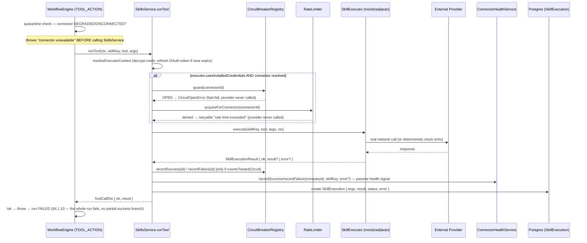
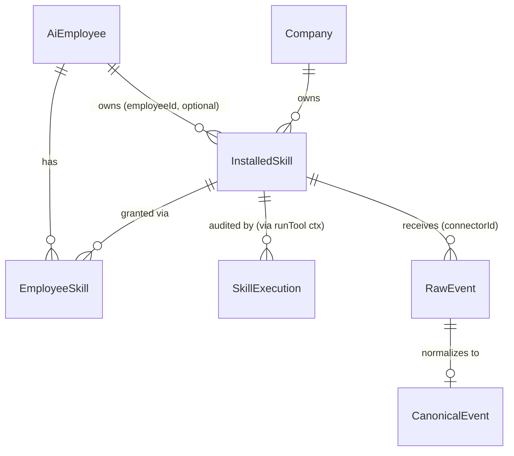
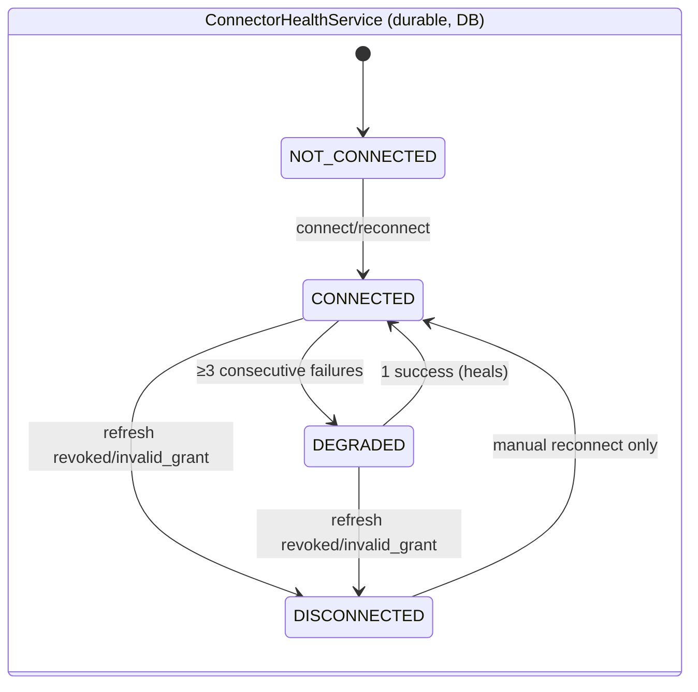
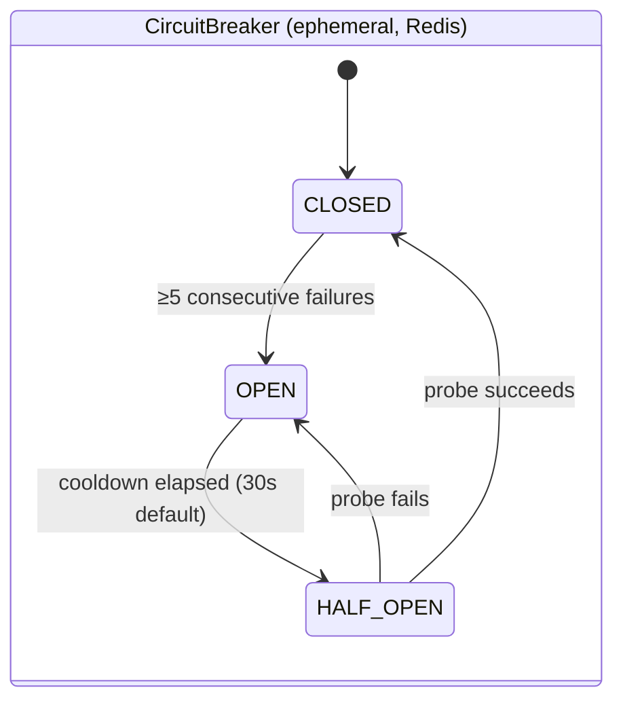
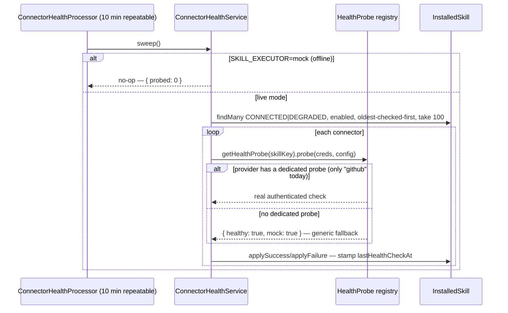
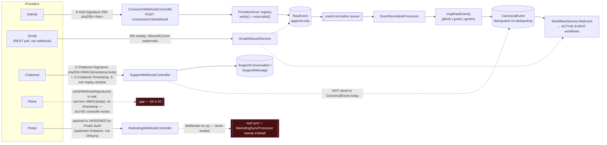
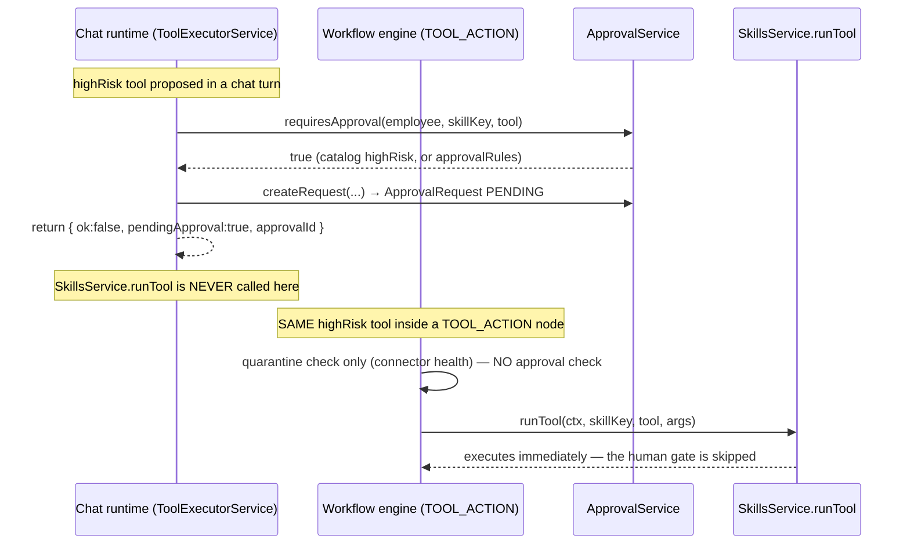
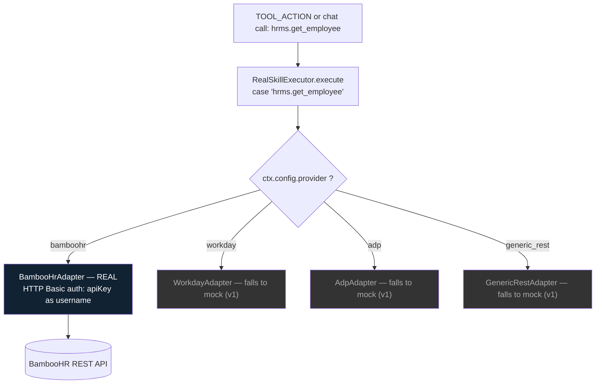

# Orlixa Workflow System — Phase 4: Skill / Connector Architecture

**Document set:** `docs/architecture/workflow-system/` · **Phase:** 4 of 15 · **Version:** 1.0 · **Date:** 2026-08-01
**Status:** Design approved for implementation · **Audience:** senior/staff engineers implementing this
**Normative parent:** `00-overview-and-canonical-contracts.md`. This document elaborates canonical
contracts; it never redefines them. Any name introduced here that doesn't already exist in `00` §0.7 is
marked **NEW** and, once merged, belongs in `00`'s canonical contracts section.

**Glossary (fixed for this whole document):** a **connector** is an `InstalledSkill` row — i.e. one
tenant's (optionally one employee's) live connection to a catalog **Skill**. This is the codebase's own
definition, not an invention of this doc (`apps/api/src/modules/skills/connectors/connectors.controller.ts:17-18`:
*"A 'connector' is an InstalledSkill"*). A **Skill** is a code-defined capability in `catalog.ts` (a set of
**tools**). Nothing in this document introduces a separate `Connector` entity — connector and installed
skill are the same row, discussed from two angles (the catalog author's angle vs. the tenant's angle).

---

## 4.0 Scope, current-state audit, and ADRs

### 4.0.1 Scope

Covers, for every Skill in the catalog: **Authentication** (OAuth + API key), **Rate Limits**, **Retry**,
**Webhook** (inbound provider events), **Permissions** (least-privilege grants), **Execution Logs**,
**Health Check**, and **Version**. Explicitly designs the connectors named in the brief:

- **HR side:** HRMS (generic), Google Workspace, Slack, Gmail, Calendar, Drive.
- **Marketing side:** Postiz, Mailchimp, HubSpot, LinkedIn, Facebook, Instagram, Analytics.

Out of scope (owned by other phase docs): the node/engine mechanics that *call* a skill (`TOOL_ACTION`,
Phase 2/5), approval routing for `highRisk` tools (Phase 8), department-scoped RBAC (Phase 9). This
document only goes as deep into those as needed to describe the connector-facing seam.

### 4.0.2 Two existing architectures this phase must reconcile

Research for this phase turned up **two separate, non-unified pieces of connector infrastructure**,
not one. Both are real and working; neither is fully aware of the other. This is the single most
important structural fact this document has to work with:

1. **The outbound/runtime-call path** (`apps/api/src/modules/skills/**`): an AI Employee (via a
   `TOOL_ACTION` node or a chat tool-call) invokes a skill's tool. `SkillsService.runTool` resolves
   credentials, runs the call through the circuit breaker + rate limiter, dispatches to a
   `SkillExecutor`, and writes a `SkillExecution` audit row. This is the "connector" most engineers
   mean when they say the word.
2. **The inbound/event path** (`apps/api/src/modules/events/**`): a provider POSTs a webhook (or, for
   Gmail, is polled) *into* Orlixa, producing an append-only `RawEvent`, normalized async into a
   provider-agnostic `CanonicalEvent`, which can fire an `EVENT`-triggered workflow via
   `WorkflowsService.fireEvent`. This is a fully-built, separate pipeline
   (`ConnectorWebhookController`, `ProviderDriver` registry, `EventNormalizeProcessor`,
   `ConnectorReconcileService`, `GmailInboundService`) that most of the newer "engine" connectors
   (Postiz, Chatwoot, Plane) **do not use** — each of those instead grew its own bespoke webhook
   controller under `modules/engines/*`, disconnected from `RawEvent`/`CanonicalEvent`/`fireEvent`
   entirely. §4.4 covers this in full, including the fragmentation it has caused.

Every subsection below that discusses "Webhook" or "Health Check" or "Retry" has to speak to *both*
paths, because they are architecturally distinct today.

### 4.0.3 Connector status matrix (verified against `catalog.ts` + `real-skill-executor.ts`)

This is a line-by-line audit, not a guess. "Real executor" means a `case` exists in the
`switch (`${skillKey}.${tool}`)` in `real-skill-executor.ts:93-143`; anything not listed there falls
through to `this.fallback.execute(...)` (the mock) at line 140-142. "OAuth real" means
`oauth.providers.ts` has a `SKILL_OAUTH` entry (so the authorize/token-exchange dance genuinely talks to
the provider); it is independent of whether *tool execution* is real.

| Skill (catalog key) | Category | Connection | OAuth wired? | Tool execution | Status | Evidence |
|---|---|---|---|---|---|---|
| `slack` | communication | oauth | yes (`oauth.providers.ts:76`) | **REAL** — `send_message` (webhook URL or `chat.postMessage`, incl. channel-name→id resolution) | **EXISTS (real)** | `real-skill-executor.ts:94-95,152-267` |
| `email` (generic) | communication | api_key | n/a | none — falls to mock | **EXISTS (catalog+config), MOCK execution** | no `email.*` case in the switch |
| `gmail` | communication | oauth | yes (google, `oauth.providers.ts:45-51`) | **REAL** for `send_email`; `read_inbox` has **no case** → mock | **EXISTS (real, partial)** | `real-skill-executor.ts:98-99,306-357` |
| `calendar` | productivity | oauth | yes (google, `:52-61`) | **REAL** — `create_event`, incl. real Meet link | **EXISTS (real)** | `real-skill-executor.ts:100-101,361-435` |
| `gdrive` | productivity | oauth | yes (google, `:62-65`) | **REAL** — all 5 tools (`upload_file`,`create_folder`,`move_file`,`list_files`,`read_file`) | **EXISTS (real)** — most complete connector | `real-skill-executor.ts:102-111,437-661` |
| `scheduling` | productivity | none (internal) | n/a | **REAL** — `claim_slot`/`reschedule_slot` via `SchedulingService` (real Calendar) | **EXISTS (real)** | `real-skill-executor.ts:112-115,663-695` |
| `http` | utility | none | n/a | **REAL** — SSRF-guarded fetch | **EXISTS (real)** | `real-skill-executor.ts:96-97,270-303` |
| `stripe` | payments | api_key | n/a | none — falls to mock | **EXISTS (catalog+config), MOCK execution** | no `stripe.*` case |
| `github` | development | api_key | n/a | none — falls to mock; `remove_collaborator` deliberately **never** real | **EXISTS (catalog+config), MOCK execution** | no `github.*` case; comment `catalog.ts:193-195` |
| `hubspot` | crm | oauth | yes (`oauth.providers.ts:32-35,66-69`) — **connect flow is real** | none — `create_contact`/`update_deal` fall to mock | **EXISTS: OAuth real, execution MOCK** | no `hubspot.*` case in the switch |
| `jira` | development | oauth | yes (atlassian, `:36-40,70-73`) — **connect flow is real** | none — all 4 tools fall to mock | **EXISTS: OAuth real, execution MOCK** | no `jira.*` case in the switch |
| `postiz` | marketing | none (shared deployment key) | n/a (own per-platform OAuth inside Postiz) | **REAL** — all 5 tools, via `PostizClientService` + `SocialAccount`/`ScheduledPost` | **EXISTS (real)** | `real-skill-executor.ts:116-125,699-805` |
| `chatwoot` | support | none (provisioned at onboarding) | n/a | **REAL** — list/get/reply real; `resolve_conversation` only updates Orlixa's own mirror (no live Chatwoot resolve call) | **EXISTS (real, one partial tool)** | `real-skill-executor.ts:126-133,807-907`, comment `:900-901` |
| `plane` | project_management | none | n/a | **REAL** — all 3 tools via `PlaneClientService` | **EXISTS (real)** | `real-skill-executor.ts:134-139,911-1021` |
| **`google_workspace`** (admin/directory) | — | — | — | — | **NEW** — no trace anywhere (grepped `catalog.ts`, `oauth.providers.ts`, `real-skill-executor.ts`) | — |
| **`hrms`** (generic) | — | — | — | — | **NEW** — no trace anywhere | — |
| **`mailchimp`** | — | — | — | — | **NEW** — no trace anywhere | — |
| **`analytics`** | — | — | — | — | **NEW** — no trace anywhere (but see `MarketingAnalyticsSnapshot`, §4.7.6) | — |
| LinkedIn / Facebook / Instagram | — | — | — | — | **Not separate connectors — see below** | — |

**LinkedIn/Facebook/Instagram correction to the brief's framing:** these are **not**, and structurally
should not become, first-class `InstalledSkill` catalog rows. They are reached exclusively *through*
`postiz.start_connect_account({ platform })` (`catalog.ts:540-550`), and the resulting per-platform
account is a `SocialAccount` row (`provider` field, `schema.prisma:788`) underneath the single `postiz`
`InstalledSkill`. Orlixa never holds LinkedIn/Facebook/Instagram OAuth client credentials itself —
Postiz does, on Orlixa's behalf. §4.7 makes this explicit and flags the one real gap it causes
(per-platform health/circuit isolation).

### 4.0.4 Additional verified gaps found during this research (not in the prompt's hint)

These were found by tracing code, not assumed. Each is cited so it can be checked in one step.

1. **`canSend`/`canRead`/`dailyEmailLimit`/business-hours config fields are collected but never
   enforced.** `catalog.ts:247-253` (gmail) and `:65-74` (email) declare these `configSchema` fields;
   `RealSkillExecutor.gmailSendEmail` (`real-skill-executor.ts:306-357`) never reads `ctx.config` at
   all. An employee configured with `canSend:false` can still send mail today.
2. **`SkillExecution` (the execution log) has no read API.** `toSkillExecutionDto` is defined
   (`skills.mapper.ts:48`) and `SkillExecutionDto` is exported from `@vaep/types`, but grepping the
   whole `apps/api/src` tree finds **zero** callers of that mapper outside its own definition — no
   controller lists `SkillExecution` rows back out. The audit trail is write-only today.
3. **Plane's webhook signature verification exists but is wired to no controller.**
   `PlaneClientService.verifyWebhookSignature` (`plane-client.service.ts:109-121`) is real, grounded in
   Plane's own source, and unit-tested — but no `@Controller` anywhere calls it. Inbound Plane events
   cannot reach Orlixa at all yet.
4. **A Postiz-level circuit trip cannot isolate one bad social platform.** `runGuardedEgress`
   (`skills.service.ts:461-512`) keys the breaker/rate-limiter by `InstalledSkill.id`,
   i.e. one company-wide `postiz` row. A single expired Instagram token inside Postiz has no way to
   trip a *narrower* breaker than "all of this company's Postiz calls," even though a healthy LinkedIn
   integration sits right next to it. See §4.7.10.
5. **No PKCE on the OAuth authorization-code flow.** `oauth.service.ts` builds a plain RFC 6749
   authorization-code exchange (`buildAuthorizeUrl:46-73`, `exchangeCode:116-163`) — no
   `code_verifier`/`code_challenge` anywhere. Confirmed by reading the whole file. See §4.2.9.
6. **The generic webhook `ProviderDriver` registry effectively only supports GitHub.**
   `signature-verifier.ts:80-88` has drivers for `github` and a `generic` fallback keyed on
   `X-Signature`/`X-Event-Id` headers — headers real providers (Slack, HubSpot, Stripe) do not send.
   So `POST /connectors/:connectorId/webhook` is provider-agnostic in *shape* but not yet in *practice*.

### 4.0.5 ADRs for this phase

**ADR-004-1 — Skill catalog stays code-defined; no `Skill` DB table.**
Decision, rationale, and the versioning mechanics that follow from it are the whole subject of §4.6; a
one-line rule up front: additive catalog changes ship as a normal deploy, breaking changes go through a
deprecate-then-remove window enforced by a lint check over `Workflow.definition`, never a migration.

**ADR-004-2 — Unify webhook ingestion under the existing `ConnectorWebhookController` /
`ProviderDriver` registry; do not grow more bespoke per-engine controllers.**
The events module's generic pipeline (`RawEvent → CanonicalEvent → fireEvent`, §4.0.2 item 2) is the
right shape and already has audit, dedupe, and workflow-trigger integration for free. The Support/
Marketing engines built their own controllers under time pressure with good reason (different signing
schemes, needed to ship independently) but at the cost of fragmentation (§4.0.4 items 3-4, full detail
§4.4). This ADR says: extend the `ProviderDriver` registry with `chatwoot`/`plane` drivers and point
their webhook URLs at the generic edge, rather than adding a fourth bespoke controller for the next
engine. Existing bespoke controllers are not ripped out in one pass — §4.4.14 gives the incremental
path.

**ADR-004-3 — Add PKCE to the existing OAuth flow as defense-in-depth, inside the same stateless
design.** Orlixa's OAuth dance is server-to-server (confidential client — the API holds
`client_secret`), so PKCE is not closing a "public client can't keep a secret" hole the way it does for
a mobile/SPA app. It is still worth adding cheaply: it binds the token exchange to the exact request
that started the flow (closing an authorization-code-interception window between the provider redirect
and our callback) and several providers now expect it regardless of client type. Implemented by folding
`code_verifier` into the *same* signed HMAC `state` envelope already in use — no new server-side
storage. Full design in §4.2.9.

**ADR-004-4 — Every new connector reuses `common/resilience` by name; none gets its own breaker,
limiter, or retry policy.** `CircuitBreakerRegistry`, `RateLimiter`, `error-classifier.ts`'s
`classify`/`countsTowardCircuit`, and `queue-retry.ts`'s `RESILIENT_JOB_OPTIONS`/`toQueueError` are
already tenant-safe, Redis-shared, and unit-tested. HRMS, Google Workspace, Mailchimp, and Analytics
all plug into `runGuardedEgress`'s existing pattern; §4.3 shows exactly how.

**ADR-004-5 — HRMS is one pluggable-provider skill, not one skill per HR vendor.** "HRMS" names a
category of product (BambooHR, Workday, ADP, …), not one API. Cataloging `hrms_bamboohr`,
`hrms_workday`, … separately would multiply OAuth-provider config, health probes, and UI surface for no
real benefit to an AI Employee, whose tool contract (`list_employees`, `get_employee`, …) is identical
regardless of backend. §4.7.10 designs the single `hrms` skill with a `config.provider` discriminator.

---

## 4.1 Connector Framework

### 4.1.1 Purpose

Give every AI Employee a single, uniform way to call out to a third-party or internal system —
regardless of whether that system authenticates via OAuth, an API key, or nothing at all — so that
adding connector #20 is a matter of writing a catalog entry + an executor case, not touching the
workflow engine, the audit pipeline, or the resilience layer. This is the seam ADR-003 (doc `00`) calls
out at the node level (`NodeRegistry`); at the connector level the equivalent existing seam is
`SkillCatalog` (definition) + `SkillExecutor` (behavior) + `InstalledSkill` (tenant state).

### 4.1.2 Responsibilities

| Responsibility | Owner (existing) | Status |
|---|---|---|
| Declare what a skill can do (tools, params, connection type, config schema) | `SkillCatalog` / `catalog.ts` | EXISTING (KEEP) |
| Install a skill for a tenant, optionally scoped to one employee | `SkillsService.install` | EXISTING (KEEP) |
| Grant an installed skill to specific employees | `EmployeeSkill` + `SkillsService.assign/unassign` | EXISTING (KEEP) |
| Resolve which tools an employee may call right now | `SkillsService.getToolsForEmployee` | EXISTING (KEEP) |
| Store credentials encrypted; never return them raw | `CryptoService` + `credentials.util.ts` | EXISTING (KEEP) |
| Decide real vs. mock execution per deployment/per call | `SKILL_EXECUTOR` env + `AutoSkillExecutor` | EXISTING (KEEP) |
| Gate every real egress call with breaker + rate limit | `SkillsService.runGuardedEgress` | EXISTING (KEEP) |
| Track connector health from passive + active signals | `ConnectorHealthService` | EXISTING (KEEP) |
| Quarantine a workflow step whose connector is unhealthy | `workflow-engine.service.ts execToolAction` | EXISTING (KEEP) |
| Log every tool call (args, result, ok/error) | `SkillExecution` + `SkillsService.runTool` | EXISTING (KEEP), gap: no read API (§4.0.4-2, fixed §4.5) |
| Accept inbound provider events and turn them into workflow triggers | `modules/events/**` | EXISTING (KEEP), fragmented (§4.4) |
| Version the catalog's contract without breaking saved workflows | — | **NEW** design, §4.6 |

### 4.1.3 Architecture

The framework is best understood as one pipe with two ends and a resilience layer in the middle:

```
SkillCatalog (code)                 tenant/company data (Postgres)             runtime
──────────────────                  ───────────────────────────────            ───────
SkillDefinition                     InstalledSkill  ← EmployeeSkill ←  AiEmployee
  key, tools[], connection,           (companyId, skillKey,                (via getToolsForEmployee)
  configSchema, category               employeeId?, config,
                                       credentials(enc), connectionStatus)
        │                                      │
        │ SkillCatalog.get(skillKey)           │ SkillsService.resolveExecutorContext
        ▼                                      ▼
                    SkillsService.runTool(ctx, skillKey, tool, args)
                              │
              ┌───────────────┴────────────────┐
              │ connector resolved?             │ no connector (e.g. http, scheduling)
              ▼                                  ▼
   CircuitBreakerRegistry.guard(id)      (unwrapped — straight to executor)
   RateLimiter.acquireForConnector(id)
              │
              ▼
   SkillExecutor.execute(skillKey, tool, args, ctx)   [mock | real | auto]
              │
              ▼
   ConnectorHealthService.recordSuccess/Failure   +   SkillExecution row (audit)
```

The three concrete `SkillExecutor` implementations (`MockSkillExecutor`, `RealSkillExecutor`,
`AutoSkillExecutor`) all satisfy one interface (`skill-executor.ts:35-52`), selected once at boot by
`skillExecutorFactory` (`skills.module.ts:47-70`) from the `SKILL_EXECUTOR` env var
(`mock` default | `real` | `auto`). This is the actual "pluggable backend" pattern — mirrored, per the
file's own comment, from the knowledge module's `EmbeddingProvider` and the employees module's
`LlmProvider`. Nothing about this needs to change for new connectors; they add a `case` to
`RealSkillExecutor.execute`'s switch (`real-skill-executor.ts:93-143`), same as every existing one.

**Resolution priority (per-employee vs. company-wide), EXISTING (KEEP):**
`SkillsService.resolveInstalledForExecution` (`skills.service.ts:608-626`) and
`workflow-engine.service.ts`'s own copy of the same priority (`execToolAction:772-789`) both prefer an
employee-owned `InstalledSkill` row (`employeeId` set) over the company-wide one (`employeeId: null`)
for the *same* `skillKey`. This is the mechanism the per-employee-skill-connections feature (see project
memory) added; this document does not change it, only relies on it.

### 4.1.4 Flow Diagram



### 4.1.5 Database Design

No new tables in this section (versioning's optional new columns are §4.6; permission-adjacent columns
are §4.5). The framework's existing tables, exactly as verified against `schema.prisma`:

| Table | Key columns this phase relies on | Status |
|---|---|---|
| `InstalledSkill` | `companyId`, `skillKey`, `employeeId?`, `config Json?`, `credentials Json?`, `connectionType`, `connectionStatus`, health columns (§4.3) | EXISTING (KEEP) |
| `EmployeeSkill` | `(employeeId, installedSkillId)` unique — the grant | EXISTING (KEEP) |
| `SkillExecution` | `companyId`, `employeeId?`, `skillKey`, `tool`, `args Json`, `result Json?`, `status`, `error?` | EXISTING (KEEP) |

Doc `00`'s entity map (§0.7.3) already shows `InstalledSkill ||--o{ EmployeeSkill : "granted via"`; this
phase adds nothing to that diagram except the observation that `InstalledSkill` also fans out to
`RawEvent`/`CanonicalEvent` on the inbound side (§4.4.5) — worth stating once here since doc `00`'s ER
diagram predates the events module:



### 4.1.6 API Design

Consolidated existing REST surface for the whole framework (endpoints specific to one topic are not
repeated in later sections — they're cross-referenced):

| Method & Path | Guard | Purpose | File |
|---|---|---|---|
| `GET /skills/catalog` | JWT | Built-in catalog + tools | `skills.controller.ts:42-45` |
| `POST /skills/install` | OWNER/ADMIN | Install a skill (company-wide or per-employee) | `:47-55` |
| `GET /skills/installed` | JWT | List installed skills | `:57-63` |
| `PATCH /skills/installed/:id` | OWNER/ADMIN | Enable/disable, rename, reconfigure | `:65-73` |
| `DELETE /skills/installed/:id` | OWNER/ADMIN | Uninstall (cascades `EmployeeSkill`) | `:75-83` |
| `PATCH /skills/installed/:id/config` | OWNER/ADMIN | Set non-secret + secret config (§4.2) | `:86-94` |
| `POST /skills/installed/:id/connect` | OWNER/ADMIN | Store API-key credentials, mark CONNECTED | `:97-105` |
| `POST /skills/installed/:id/disconnect` | OWNER/ADMIN | Clear credentials, back to NOT_CONNECTED | `:108-115` |
| `POST /skills/installed/:id/tools/:tool/execute` | JWT | Manual one-off tool run (logs `SkillExecution`) | `:118-126` |
| `GET /employees/:id/skills` | JWT | List one employee's grants | `employee-skills.controller.ts:31-38` |
| `POST /employees/:id/skills` | OWNER/ADMIN | Grant an installed skill to an employee | `:40-48` |
| `DELETE /employees/:id/skills/:installedSkillId` | OWNER/ADMIN | Revoke a grant | `:50-59` |

### 4.1.7 TypeScript Interfaces

The extension points an implementer actually touches (quoted verbatim, not redefined — EXISTING KEEP):

```ts
// apps/api/src/modules/skills/executors/skill-executor.ts
export interface ExecutorContext {
  companyId: string;
  employeeId?: string | null;
  conversationId?: string | null;
  installedSkillId?: string | null;
  connectionStatus?: SkillConnectionStatus | null;
  config?: Record<string, unknown> | null;
  credentials?: Record<string, unknown> | null;   // DECRYPTED, never logged
}

export interface SkillExecutionResult {
  ok: boolean;
  result?: unknown;
  error?: string;
}

export interface SkillExecutor {
  readonly name: string;
  readonly usesInstalledCredentials?: boolean;   // true → SkillsService resolves creds first
  execute(
    skillKey: string,
    tool: string,
    args: Record<string, unknown>,
    ctx: ExecutorContext,
  ): Promise<SkillExecutionResult>;
}
```

Shared (`@vaep/types`, EXISTING KEEP) — `SkillDefinitionDto`, `ToolDefinitionDto`, `ConfigFieldDto`,
`InstalledSkillDto`, `EmployeeSkillDto`, `ToolCallDto`, `SkillConnectionType`, `SkillCategory` — see
`packages/types/src/index.ts:577-763` for the exact shapes; not reproduced here per the "cite, don't
redefine" rule.

### 4.1.8 JSON Examples

`InstalledSkillDto` (company-wide Slack, connected) — response shape from `GET /skills/installed`:

```json
{
  "id": "cljk3f8x40000qk3g8p2h1z9a",
  "companyId": "clcompany000000000000001",
  "skillKey": "slack",
  "employeeId": null,
  "displayName": "Slack",
  "config": { "defaultChannel": "#hiring" },
  "enabled": true,
  "connectionType": "oauth",
  "connectionStatus": "CONNECTED",
  "credentialsSet": true,
  "createdAt": "2026-07-01T09:12:00.000Z"
}
```

`ToolCallDto` returned by `runTool` on success:

```json
{
  "skillKey": "slack",
  "tool": "send_message",
  "args": { "channel": "#hiring", "text": "New candidate: Priya Shah" },
  "result": { "delivered": true, "via": "chat.postMessage", "ts": "1735599123.000200", "channel": "C0912AB34" },
  "ok": true
}
```

### 4.1.9 Folder Structure

```
apps/api/src/modules/skills/
├── catalog.ts                         EXISTING (KEEP) — code-defined catalog, §4.6
├── skills.service.ts                  EXISTING (KEEP) — runTool, install, assign, resolveExecutorContext
├── skills.controller.ts               EXISTING (KEEP)
├── skills.module.ts                   EXISTING (KEEP) — SKILL_EXECUTOR factory
├── skills.mapper.ts                   EXISTING (KEEP)
├── employee-skills.controller.ts      EXISTING (KEEP)
├── dto/                               EXISTING (KEEP) — install/configure/connect/execute/assign DTOs
├── connectors/                        EXISTING (KEEP) — §4.3
│   ├── connector-health.service.ts
│   ├── connector-token.service.ts
│   ├── connector.constants.ts
│   ├── credentials.util.ts
│   ├── health-probe.ts
│   ├── connectors.controller.ts
│   └── connector-health.processor.ts
├── oauth/                             EXISTING (KEEP) — §4.2
│   ├── oauth.service.ts
│   ├── oauth.providers.ts
│   └── oauth.controller.ts
└── executors/                         EXISTING (KEEP)
    ├── skill-executor.ts
    ├── mock-skill-executor.ts
    ├── real-skill-executor.ts
    ├── auto-skill-executor.ts
    ├── ssrf.ts
    └── google-calendar.util.ts

apps/api/src/modules/events/           EXISTING (KEEP) — §4.4, the inbound path
apps/api/src/common/resilience/        EXISTING (KEEP) — §4.3, reused by name (ADR-004-4)
```

### 4.1.10 Edge Cases

- **`TOOL_ACTION` has no partial-success branch.** `execToolAction` throws when `!call.ok`
  (`workflow-engine.service.ts:825-827`), which fails the *entire* run — there is no way for a workflow
  to `CONDITION`-branch on a tool's own failure today. This is why `scheduling.claim_slot` is
  deliberately designed to always return `ok:true` and put the real outcome in
  `result.claimed` (comment at `real-skill-executor.ts:678-681`) — a documented workaround, not a
  general solution. Any new connector's tools should follow the same convention for "expected, branchable"
  outcomes (no slot / no match / already resolved) vs. genuine tool failure.
- **The `employeeId: null` compound-key quirk.** Prisma's generated
  `companyId_skillKey_employeeId` compound-unique type requires a non-null `employeeId`, even though the
  column is nullable — Postgres itself doesn't enforce uniqueness across NULLs in a compound index.
  Every company-wide lookup in this codebase therefore uses `findFirst` on the flat 3-field filter, not
  `findUnique` on the compound key (see the long comment at `skills.service.ts:591-607`). A new
  connector's code must follow the same pattern, not "fix" it with `findUnique`.
- **Dry-run must still validate.** A `dryRun` workflow run does zero egress, but `execToolAction`
  validates the skill/tool exists and the connector isn't quarantined *before* the dry-run
  short-circuit (`workflow-engine.service.ts:756-763`) — a preview that says "ok" for a call that would
  actually fail defeats the point of previewing.
- **Tool names collide across skills.** Both `email` and `gmail` expose `send_email`.
  `getToolsForEmployee` tags every returned tool with its owning `skillKey`
  (`skills.service.ts:354-361`); `SkillCatalog.resolveSkillKey` prefers that tag and only falls back to
  an ambiguous global search (`catalog.ts:722-734`). Any caller that drops the `tools` array before
  resolving a tool call re-introduces this ambiguity.

### 4.1.11 Security

Framework-level principles (topic-specific detail lives in §4.2/§4.4/§4.5):
- Every query is scoped by `companyId` from the JWT — no exceptions found in this module.
- Credentials are never returned by any DTO — only a `credentialsSet: boolean` (`skills.mapper.ts:19-21`).
- Management endpoints (install/config/connect/disconnect/assign) are `@Roles('OWNER','ADMIN')`;
  reading the catalog and an employee's own tool list is open to any authenticated member.
- The mock executor path never touches the network, never reads real credentials, and is what the
  entire e2e suite runs against — a new connector's mock behavior (via the catalog `configSchema`) must
  stay side-effect-free.

### 4.1.12 Performance

`runTool` executes synchronously inside the request/step path (a `TOOL_ACTION` node's `await`, or a
chat completion's tool-call loop) — it is **not** queued. A slow provider call directly extends step
latency. The breaker/rate-limiter add one or two Redis round-trips (`CircuitBreakerRegistry.guard` +
`RateLimiter.acquireForConnector`) before the network call; both fall back to an in-memory map if Redis
is unreachable (§4.3.3), so a Redis outage degrades to per-process-only guarding rather than failing
calls outright.

### 4.1.13 Scalability

`CircuitBreakerRegistry` and `RateLimiter` persist to Redis (`vaep:cb:<connectorId>`,
`vaep:rl:<key>:<window>:<index>`), so horizontally-scaled API instances agree on one connector's state —
a breaker tripped by worker A is honored by worker B immediately. `ConnectorHealthProcessor`,
`ConnectorReconcileProcessor`, and `GmailInboundProcessor` all run at `DEFAULT_QUEUE_CONCURRENCY = 5`
(`queue-concurrency.constants.ts:10`) and are excluded from the Vercel HTTP-only deployment via
`QUEUE_WORKERS_ENABLED=false` (`queue-workers.ts`) — consistent with the existing Vercel web/api split
(see project memory). None of this needs to change for new connectors; they inherit it by using the
same `runGuardedEgress` path.

### 4.1.14 Future Extension

`catalog.ts`'s own header comment already states the direction: *"Executors are mock/sandbox by
default... Real API executors and a 3rd-party marketplace are later work."* Two concrete extensions
this phase recommends, without designing in full (out of scope for a connector-architecture doc):
(1) a `ConnectorDefinition` registry mirroring `NodeDefinition` (doc `00` ADR-003) — turning "add a
connector" into a pure data+strategy object the same way "add a node type" will become; (2) a
third-party marketplace, which would need per-vendor sandboxing (the `SkillExecutor` interface already
supports this — a marketplace entry is just another `SkillExecutor` implementation resolved at runtime
instead of at boot).

### 4.1.15 Best Practices — checklist for adding a new connector

1. Add one `SkillDefinition` to `catalog.ts` (tools, `connection.type`, `configSchema`). Mark any
   money-moving or hard-to-reverse tool `highRisk: true`.
2. If `connection.type === 'oauth'`, add a `SKILL_OAUTH` entry in `oauth.providers.ts` (§4.2.6) with the
   minimum scopes the tools actually need (§4.2.10).
3. Add real `case` branches to `RealSkillExecutor.execute`'s switch — one per tool — falling back to
   `this.fallback.execute(...)` for anything not yet implemented (never throw for "not implemented").
4. Do not build a bespoke rate limiter, breaker, or retry loop — the call reaches
   `runGuardedEgress` automatically once `usesInstalledCredentials` resolves a connector id (ADR-004-4).
5. If the provider pushes webhooks, add a `ProviderDriver` to `signature-verifier.ts` and a mapper case
   to `mapRawEvent` — do not add a fifth bespoke webhook controller (ADR-004-2, §4.4).
6. Write a `HealthProbe` in `health-probe.ts` if a cheap authenticated "am I alive" call exists;
   otherwise the generic mock-healthy fallback applies (§4.3.6).

---

## 4.2 Authentication, OAuth, API Keys & Secret Lifecycle

### 4.2.1 Purpose

Let a tenant grant an AI Employee (or the whole company) access to a real external account —
via OAuth authorization-code or a raw API key — store that grant so it survives restarts, keep it valid
across token expiry without hammering the provider, and guarantee the secret material is never visible
to anyone who didn't put it there (including, on read paths, this codebase's own DTOs).

### 4.2.2 Responsibilities

| Responsibility | Owner (existing) | Status |
|---|---|---|
| Build a provider authorize URL with a verifiable, stateless `state` | `OAuthService.buildAuthorizeUrl` | EXISTING (KEEP) |
| Handle the provider redirect, exchange code → tokens | `OAuthService.handleCallback` / `exchangeCode` | EXISTING (KEEP) |
| Store API-key credentials directly (no provider round-trip) | `SkillsService.connectSkill` | EXISTING (KEEP) |
| Partition a config submission into non-secret vs. secret fields | `SkillsService.partitionConfig` | EXISTING (KEEP) |
| Encrypt every secret at rest; decrypt only in-memory, per-call | `CryptoService` (AES-256-GCM) | EXISTING (KEEP) |
| Refresh a near-expiry OAuth token, single-flight per connector | `ConnectorTokenService` | EXISTING (KEEP) |
| Bind the token exchange to the request that started it | — (plain code flow only) | **NEW — PKCE, ADR-004-3** |
| Minimize requested OAuth scope to what the tenant's config actually allows | — | **NEW — gap, not designed away, documented §4.2.10** |

### 4.2.3 Architecture

Two independent credential-acquisition paths converge on the same storage:

```
OAuth path:                                    API-key path:
  authorize() → provider consent → callback()    connectSkill(id, {credentials})
        │                                              │
        ▼                                              ▼
  exchangeCode() → {accessToken, refreshToken?,  partitionConfig() splits secret vs
                     expiresAt?}                 non-secret fields by configSchema
        │                                              │
        └───────────────────┬──────────────────────────┘
                             ▼
              sealCredentials() → CryptoService.encryptJson()
                             │
                             ▼
         InstalledSkill.credentials = { enc: "v1:<iv>:<tag>:<ct>" }
         InstalledSkill.connectionStatus = CONNECTED
         InstalledSkill.tokenExpiresAt = parsed expiresAt (OAuth only)
                             │
                             ▼  (every real/auto egress call)
         resolveExecutorContext() → readCredentials() (decrypt)
              → if oauth + refreshToken + near-expiry:
                    ConnectorTokenService.getAccessToken() [single-flight refresh]
```

`OAuthService` is **stateless by design** — the `state` query parameter is a self-verifying HMAC
envelope (`installedSkillId`, `companyId`, `skillKey`, `nonce`, `iat`), not a server-side session
(`oauth.service.ts:14-24,165-203`). This means the callback endpoint (`GET /skills/oauth/callback`) can
run on any instance, with no sticky session or shared cache required for the state itself — only
`CryptoService`'s key (an env var, already shared across instances) is needed to verify it.

### 4.2.4 Flow Diagram

```mermaid
sequenceDiagram
    participant U as Browser (OWNER/ADMIN)
    participant API as Orlixa API
    participant P as Provider (Google/Slack/HubSpot/Atlassian)
    participant DB as InstalledSkill

    U->>API: GET /skills/installed/:id/oauth/authorize
    API->>API: buildAuthorizeUrl — sign state{installedSkillId,companyId,skillKey,nonce,iat}
    Note over API: NEW (PKCE, ADR-004-3): also generate code_verifier,<br/>fold it into the SAME signed state; compute code_challenge=S256(verifier)
    API-->>U: { url: providerAuthorizeUrl + state (+ code_challenge, NEW) }
    U->>P: browser redirect, user consents
    P-->>U: redirect to /skills/oauth/callback?code=...&state=...
    U->>API: GET /skills/oauth/callback
    API->>API: parseState — verify HMAC, check STATE_TTL_MS (10 min)
    Note over API: NEW (PKCE): extract code_verifier from state
    API->>P: POST tokenUrl {grant_type=authorization_code, code, client_id, client_secret,<br/>redirect_uri (+ code_verifier, NEW)}
    P-->>API: {access_token, refresh_token?, expires_in?}
    API->>DB: connectOAuth — sealCredentials(encrypt) → CONNECTED, tokenExpiresAt
    API-->>U: 302 redirect to /skills?connected=<skillKey>

    Note over API,DB: Later, on egress (any real/auto tool call):
    API->>DB: readCredentials (decrypt) — has refreshToken AND near tokenExpiresAt?
    API->>API: ConnectorTokenService.refreshSingleFlight(connectorId)
    API->>P: POST tokenUrl {grant_type=refresh_token, refresh_token, client_id, client_secret}
    alt refresh succeeds
        P-->>API: new access_token (+ new refresh_token?)
        API->>DB: persist re-encrypted tokens, CONNECTED, consecutiveErrors=0
    else invalid_grant / 400 / 401
        API->>DB: ConnectorHealthService.markDisconnected — DISCONNECTED + alert log
    end
```

### 4.2.5 Database Design

No new tables. `InstalledSkill` columns this section owns (`schema.prisma:414-453`, EXISTING KEEP):
`connectionType`, `connectionStatus`, `credentials Json?` (the `{ enc }` envelope), `tokenExpiresAt`,
`disabledReason`. **NEW, optional, non-breaking column proposed:** none required — PKCE's
`code_verifier` is transient (lives only inside the short-lived signed `state`, never persisted), so no
schema change is needed to add PKCE.

### 4.2.6 API Design

| Method & Path | Guard | Purpose | File |
|---|---|---|---|
| `GET /skills/installed/:id/oauth/authorize` | OWNER/ADMIN | Build provider authorize URL | `oauth.controller.ts:23-32` |
| `GET /skills/oauth/callback` | **public** (by design — provider redirect) | Exchange code, store tokens, redirect to web | `oauth.controller.ts:35-43` |
| `POST /skills/installed/:id/connect` | OWNER/ADMIN | Store API-key credentials directly | `skills.controller.ts:97-105` |
| `POST /skills/installed/:id/disconnect` | OWNER/ADMIN | Clear credentials → NOT_CONNECTED | `skills.controller.ts:108-115` |
| `PATCH /skills/installed/:id/config` | OWNER/ADMIN | Set config; `secret:true` fields route to `credentials` | `skills.controller.ts:86-94` |

`resolveOAuthProvider(skillKey, config)` (`oauth.providers.ts:101-130`) is a pure lookup, not an
endpoint — it returns `null` (→ a clear 400 from `authorize`) when `OAUTH_<PROVIDER>_CLIENT_ID/SECRET`
or `OAUTH_REDIRECT_BASE` is unset, so a misconfigured provider fails loudly at authorize-time, not
silently at callback-time.

### 4.2.7 TypeScript Interfaces

```ts
// apps/api/src/modules/skills/oauth/oauth.service.ts — EXISTING, extended (NEW field marked)
interface OAuthState {
  installedSkillId: string;
  companyId: string;
  skillKey: string;
  nonce: string;
  iat: number;
  codeVerifier?: string;   // NEW (ADR-004-3) — PKCE code_verifier, folded into the signed envelope
}

// apps/api/src/modules/skills/oauth/oauth.providers.ts — EXISTING (KEEP)
interface ResolvedOAuthProvider {
  provider: string;
  authorizeUrl: string;
  tokenUrl: string;
  scopes: string[];
  clientId: string;
  clientSecret: string;
  redirectUri: string;
  extraAuthParams: Record<string, string>;
}
```

Adding PKCE requires no new top-level interface — `codeVerifier` rides inside the existing signed
`OAuthState`, and `code_challenge`/`code_challenge_method` become two more entries in
`extraAuthParams`-style query params at authorize time (computed, not stored).

### 4.2.8 JSON Examples

`GET /skills/installed/:id/oauth/authorize` response (`OAuthAuthorizeDto`, EXISTING):

```json
{ "url": "https://accounts.google.com/o/oauth2/v2/auth?client_id=...&redirect_uri=https%3A%2F%2Fapi.orlixa.com%2Fskills%2Foauth%2Fcallback&response_type=code&scope=https%3A%2F%2Fwww.googleapis.com%2Fauth%2Fgmail.send+https%3A%2F%2Fwww.googleapis.com%2Fauth%2Fgmail.readonly&state=eyJpbnN0YWxsZWRTa2lsbElkIjoi...jd.f3a9c1e2b6..." }
```

Decoded `state` payload (base64url body before the `.` + hex HMAC signature):

```json
{
  "installedSkillId": "cljk3f8x40000qk3g8p2h1z9a",
  "companyId": "clcompany000000000000001",
  "skillKey": "gmail",
  "nonce": "8f2a91c4d0b1e6a2",
  "iat": 1735600000000
}
```

`POST /skills/installed/:id/connect` request (API-key skill, e.g. Stripe):

```json
{ "credentials": { "apiKey": "sk_live_51N...redacted" } }
```

### 4.2.9 Edge Cases

- **No PKCE today (verified gap).** Reading the entire `oauth.service.ts` confirms a plain RFC 6749
  authorization-code exchange — no `code_verifier`/`code_challenge` anywhere. Because Orlixa's OAuth
  client is confidential (server holds `client_secret`), this is lower-severity than the same gap in a
  public client, but it's cheap to close (ADR-004-3, diagram above) and several providers (Google
  included) now recommend it unconditionally.
- **Provider "200 OK but failed" quirks are already handled, twice, slightly differently.** Slack
  returns HTTP 200 with `{ok:false, error}` on a failed token exchange; `exchangeCode`
  (`oauth.service.ts:139`) and `exchangeRefreshToken` (`connector-token.service.ts:188`) both check for
  it, but as two separate inline checks rather than one shared helper — worth unifying if a third OAuth
  code path is ever added.
- **A provider that omits a new `refresh_token` on refresh** (most do) — `persistRefreshed`
  (`connector-token.service.ts:139-143`) explicitly keeps the prior refresh token rather than
  overwriting it with `undefined`.
- **State TTL is 10 minutes** (`STATE_TTL_MS`, `oauth.service.ts:24`) — an authorize link left open in a
  browser tab past that window fails at callback with `state_expired`, a deliberate, narrow replay
  window, not a bug.

### 4.2.10 Security

- **Encryption at rest:** AES-256-GCM via `CryptoService`, self-describing versioned envelope
  `v1:<ivB64>:<tagB64>:<ctB64>` (`crypto.service.ts:12-15,48-59`). A fresh random 12-byte IV per encrypt
  means identical plaintext never produces identical ciphertext — acceptable since credentials are never
  queried by ciphertext value. Key resolution refuses to boot in production without a real
  `ENCRYPTION_KEY` (`:117-124`) and rejects an obviously-placeholder key (`isWeakKey`, `:160-178`); in
  non-production it derives a fixed, clearly-logged insecure dev key so local work needs no setup.
- **Stateless signed `state`:** HMAC-SHA256 under the same service key (`crypto.service.ts:94-96,99-111`,
  constant-time compare) — nothing server-side to leak or expire out of sync; a forged state fails
  `verify()` before any JSON is even parsed.
- **Scope minimization gap (real, not designed away here):** `SKILL_OAUTH` (`oauth.providers.ts:44-77`)
  requests a **fixed** scope list per skill regardless of the tenant's `configSchema` flags — e.g. gmail
  always requests both `gmail.send` and `gmail.readonly` even when an employee's config sets
  `canSend:false`/`canRead:false` (catalog fields that, per §4.0.4 item 1, aren't enforced by the
  executor either). Closing this properly means conditioning the requested `scopes` array on the
  installed skill's config *before* `buildAuthorizeUrl` runs, which in turn means a config change after
  first connect requires a **reconnect** (OAuth scopes cannot be widened by silently re-consenting).
  Documented here as a real gap rather than fixed, since fixing it changes the reconnect UX and belongs
  with the §4.0.4 item 1 enforcement fix as one piece of work.
- **Secret rotation:** today is entirely manual — `disconnectSkill` + reconnect
  (`skills.service.ts:268-285`). There is no proactive expiry/rotation reminder, and API-key credentials
  (Stripe, GitHub) have no expiry concept at all in this codebase, so a leaked-but-not-yet-abused key
  keeps working until someone manually disconnects.
- **Credentials never leave the process boundary un-encrypted:** every DTO (`InstalledSkillDto`) exposes
  only `credentialsSet: boolean`; the one internal accessor that returns raw decrypted creds
  (`SkillsService.getDecryptedCredentials`) is documented "NEVER wired to an HTTP response"
  (`skills.service.ts:670-675`) and is used only by `EventsService.ingestWebhook` to read a webhook
  secret server-side (§4.4).

### 4.2.11 Performance

Token refresh is lazy (only triggered within `TOKEN_REFRESH_SKEW_MS = 60_000` of expiry,
`connector.constants.ts:15`, checked by `needsRefresh`) — a connector with no near-term expiry never
pays a refresh round-trip. Single-flight (`refreshSingleFlight`, `connector-token.service.ts:80-92`)
collapses N concurrent callers on the same connector into one provider call.

### 4.2.12 Scalability

**Verified gap:** the single-flight lock (`inflight = new Map<string, Promise<string>>()`,
`connector-token.service.ts:47`) is a **plain in-process Map** — unlike `CircuitBreakerRegistry`/
`RateLimiter`, it is not Redis-backed. Under horizontal scaling, two API instances handling concurrent
requests for the same connector at the moment of expiry can each independently start a refresh. For most
providers this just wastes one call; for a provider that **rotates** the refresh token on every use and
invalidates the previous one (some do), the loser of that race gets `invalid_grant` on its *next*
refresh attempt and the connector is wrongly driven `DISCONNECTED`. Noted here as a scalability edge
case rather than fixed — see Future Extension.

### 4.2.13 Future Extension

1. Move the single-flight lock to Redis (`SET NX PX <ttl>` per connector id), mirroring
   `CircuitBreakerRegistry`'s Redis-with-in-memory-fallback pattern, closing §4.2.12.
2. Implement PKCE per ADR-004-3.
3. Condition requested OAuth scopes on the installed skill's config at connect-time, and enforce
   `canSend`/`canRead`/business-hours/`dailyEmailLimit` inside the relevant `RealSkillExecutor` methods
   (closes §4.0.4 item 1 and the scope-minimization gap together, since they're the same underlying
   fix applied at two layers).
4. A proactive secret-rotation reminder (e.g. surfaced on the connector health panel) for API-key
   connectors older than N days.

### 4.2.14 Best Practices

1. Never add a scope beyond what the catalog's current tools need — `oauth.providers.ts`'s comment
   already does this correctly (e.g. `channels:read` on Slack solely to resolve a channel name to id).
2. A new OAuth provider's token-exchange handler must check for a 200-with-`{ok:false}` body, not just
   `res.ok` (Slack's failure mode; assume others may share it).
3. Never persist a decrypted credential outside a request's lifetime — every existing service re-reads
   and re-decrypts per call rather than caching plaintext in memory.

---

## 4.3 Resilience: Health Checks, Circuit Breakers, Rate Limits & Retry

### 4.3.1 Purpose

Stop one unhealthy connector — a revoked token, a rate-limited or down provider — from (a) burning
retries against a dead endpoint, (b) taking down unrelated workflow steps that happen to share the
connector, or (c) going unnoticed until a human stumbles on the failure. Reuse the existing,
already-tenant-safe primitives in `common/resilience` (ADR-004-4) rather than building per-connector
logic.

### 4.3.2 Responsibilities

| Responsibility | Owner (existing) | Status |
|---|---|---|
| Track a connector's health across calls; persist DEGRADED/DISCONNECTED | `ConnectorHealthService` | EXISTING (KEEP) |
| Run a cheap authenticated "alive?" probe per provider | `health-probe.ts` (`HealthProbe` registry) | EXISTING (KEEP) — only `github` implemented; generic mock-healthy fallback |
| Sweep all live connectors on a schedule | `ConnectorHealthProcessor` (~10 min) | EXISTING (KEEP) |
| Fast-fail calls to a repeatedly-failing connector, without hitting the provider | `CircuitBreakerRegistry` | EXISTING (KEEP) |
| Cap egress volume per connector | `RateLimiter` | EXISTING (KEEP) |
| Classify an error as transient vs. permanent | `error-classifier.ts` | EXISTING (KEEP) |
| Bound retries + route exhausted jobs to a dead-letter queue | `queue-retry.ts` (`RESILIENT_JOB_OPTIONS`) + `DlqService` | EXISTING (KEEP) |
| Quarantine a workflow step whose connector is unhealthy, before calling it | `workflow-engine.service.ts execToolAction` | EXISTING (KEEP) |

### 4.3.3 Architecture

**Two independent state machines are fed by the same call outcome, at different grains, for different
purposes.** This is the one thing to internalize before touching this code:

| | `ConnectorHealthService` | `CircuitBreakerRegistry` |
|---|---|---|
| States | `NOT_CONNECTED · CONNECTED · DEGRADED · DISCONNECTED` (4, DB enum) | `CLOSED · HALF_OPEN · OPEN` (3, `CircuitState`) |
| Threshold | `CONNECTOR_FAILURE_THRESHOLD = 3` consecutive (`connector.constants.ts:9`) | `failureThreshold = 5` consecutive (`DEFAULT_CIRCUIT_OPTIONS`, `circuit-breaker.ts:31-34`, env-overridable) |
| Storage | Postgres (`InstalledSkill` columns) — durable, user-visible | Redis key `vaep:cb:<connectorId>`, in-memory fallback — ephemeral |
| Recovery | A single success heals DEGRADED→CONNECTED; DISCONNECTED needs re-auth (never self-heals) | Cooldown (30s default) → one HALF_OPEN probe → CLOSED or back to OPEN |
| What it gates | Whether the **workflow engine** quarantines a `TOOL_ACTION` step *before* calling `SkillsService.runTool` at all (`execToolAction:765-799`) | Whether **this one call**, already past the quarantine check, is allowed to reach the provider (`runGuardedEgress:461-479`) |
| Purpose | Slow, durable, user-facing signal — "this connector needs attention" | Fast, ephemeral, load-shedding — "stop hammering this endpoint for 30 seconds" |

Both are fed from the exact same place — `SkillsService.runTool`'s outcome — but independently: the
breaker is updated inside `runGuardedEgress` (`:505-511`); health is updated afterward, unconditionally,
by `recordEgressHealth` (`:634-656`). They can therefore diverge in principle (e.g. health persisted as
DEGRADED while a subsequent success has already re-closed the ephemeral breaker) — this is a documented
consequence of two independently-thresholded machines sharing an event stream, not a synchronization bug
to fix.

**Retry, precisely scoped:** `RESILIENT_JOB_OPTIONS` (`queue-retry.ts:16-25`) — 5 attempts, exponential
backoff with jitter, bounded failed-job retention (the DLQ) — is a **BullMQ queue** default, applied once
at the root and inherited by every queue. It governs the *async* sweeps (`connector-health`,
`connector-reconcile`, `gmail-inbound`, `event-normalize`, `workflow-run`, `knowledge-ingest`). It does
**not** govern a live `TOOL_ACTION` tool call: `SkillsService.runTool` is called synchronously in the
request/step path, is never enqueued, and is attempted exactly once — a failure comes back as
`{ok:false}` immediately (§4.1.10), full stop. "Retry" for a live tool call, if ever wanted, is a Phase 5
concern (`RetryPolicy` on the node, doc `00` §0.7.2) layered *above* this call, not inside it.

### 4.3.4 Flow Diagram







### 4.3.5 Database Design

No new tables. `InstalledSkill` health columns (`schema.prisma:433-445`, all EXISTING KEEP):
`lastHealthCheckAt`, `lastHealthError`, `consecutiveErrors`, `tokenExpiresAt`, `disabledReason`,
`inboundCursor` (the last column belongs to §4.4's inbound polling, not health, but lives on the same
row).

### 4.3.6 API Design

| Method & Path | Guard | Purpose | File |
|---|---|---|---|
| `GET /connectors/:id/health` | JWT (any member) | Current health snapshot | `connectors.controller.ts:29-35` |
| `POST /connectors/:id/health-check` | OWNER/ADMIN | Force an active probe now | `connectors.controller.ts:38-46` |

No endpoint surfaces circuit-breaker state directly today even though `ConnectorCircuitDto` is already
defined in `@vaep/types` (`index.ts:1869-1873`) for exactly this purpose — **NEW, low-effort**: add
`GET /connectors/:id/circuit` backed by `CircuitBreakerRegistry.getState(connectorId)`, since the DTO
contract already exists and only the route is missing.

### 4.3.7 TypeScript Interfaces

```ts
// apps/api/src/common/resilience/circuit-breaker.ts — EXISTING (KEEP), the pure state machine
export interface CircuitSnapshot {
  state: CircuitState;        // 'CLOSED' | 'OPEN' | 'HALF_OPEN'
  failures: number;
  openedAt: number | null;
}
export interface CircuitOptions { failureThreshold: number; cooldownMs: number; }

// apps/api/src/modules/skills/connectors/health-probe.ts — EXISTING (KEEP)
export interface HealthProbeResult { healthy: boolean; error?: string; mock?: boolean; }
export interface HealthProbe {
  probe(creds: Record<string, unknown>, config: Record<string, unknown>): Promise<HealthProbeResult>;
}
```

### 4.3.8 JSON Examples

`GET /connectors/:id/health` response (`ConnectorHealthDto`, EXISTING):

```json
{
  "connectorId": "cljk3f8x40000qk3g8p2h1z9a",
  "status": "DEGRADED",
  "lastHealthCheckAt": "2026-08-01T08:40:00.000Z",
  "consecutiveErrors": 4,
  "lastHealthError": "Gmail API error (401): Invalid Credentials",
  "tokenExpiresAt": "2026-08-01T09:10:00.000Z",
  "disabledReason": null
}
```

Proposed `GET /connectors/:id/circuit` response (**NEW**, `ConnectorCircuitDto` already exists unused):

```json
{ "connectorId": "cljk3f8x40000qk3g8p2h1z9a", "skillKey": "gmail", "state": "HALF_OPEN" }
```

### 4.3.9 Folder Structure

No new folders — `connectors/` and `common/resilience/` are already shown in §4.1.9. The one **NEW**
file this section's API-Design proposal would add: `apps/api/src/modules/skills/connectors/
connector-circuit.controller.ts` (or a method on the existing `ConnectorsController`).

### 4.3.10 Edge Cases

- **Only `github` has a real active probe.** `health-probe.ts:84-91` — every other provider (including
  every connector this document is asked to design, gmail/slack/calendar/gdrive/postiz/etc.) resolves to
  `genericProbe`, which always reports `{ healthy: true, mock: true }`. In live mode
  (`SKILL_EXECUTOR=real|auto`), the scheduled sweep therefore cannot *detect* a silently-broken Slack or
  HubSpot connection on its own — health for those providers is driven entirely by the **passive**
  signal (an actual tool call failing), not the active sweep. New connectors should add a real probe
  where a cheap one exists (e.g. Slack's `auth.test`, Postiz's own account-info call).
- **`gmail-inbound` is not a known DLQ queue.** `DLQ_KNOWN_QUEUES` (`dlq.constants.ts:14-20`) lists
  `knowledge-ingest`, `workflow-run`, `event-normalize`, `connector-health`, `connector-reconcile` —
  **not** `gmail-inbound`. Its jobs still get `RESILIENT_JOB_OPTIONS` (bounded retry + kept-failed-set)
  because that's a global BullMQ default, but `GET /admin/dlq?queue=gmail-inbound` is rejected with 400
  `Unknown queue` (`DlqService.assertKnown`) — the failed jobs exist but the admin surface can't see
  them by name. A one-line fix (add the constant to the array); flagged rather than silently fixed here
  since it's this document's job to report, not patch, Phase-unrelated code.
- **A tripped breaker's "temporarily unavailable" error does not, by itself, trigger a health
  transition** — only `runTool`'s separate `recordEgressHealth` call does, and it runs *after*
  `runGuardedEgress` returns, using the same `outcome.error` string. A circuit-open response
  (`"${skillKey} is temporarily unavailable (circuit open); please retry shortly"`) does still count as
  a failure for health purposes, since it's a plain `outcome.ok === false`.

### 4.3.11 Security

Rate limiting protects the *provider* (avoids Orlixa getting an API key revoked for abuse) as much as it
protects Orlixa's own infrastructure. The breaker's Redis key is per-`connectorId`, never per-tenant in
aggregate — one company's misbehaving connector cannot exhaust another company's budget, because
`RateLimiter.acquireForConnector` keys on `connector:<connectorId>` (`rate-limiter.ts:116-122`), and
`connectorId` is already tenant-scoped by construction (an `InstalledSkill.id` belongs to exactly one
`companyId`).

### 4.3.12 Performance

Both the breaker and the rate limiter add at most one Redis round-trip each per guarded call
(`guard` + `acquireForConnector`), and both degrade to an in-memory, per-process fallback rather than
failing the call if Redis is unreachable (`circuit-breaker.registry.ts:114-131`,
`rate-limiter.ts:68-85`) — a Redis outage narrows resilience to per-process only, it does not take down
egress.

### 4.3.13 Scalability

Redis-backed state means the breaker and rate limiter are correct under horizontal scaling — a trip on
worker A is immediately visible to worker B (§4.1.13 already covers the queue-processor concurrency
side). The health *sweep* is explicitly batched (`CONNECTOR_HEALTH_BATCH = 100`,
`connector.constants.ts:35`) and orders by `lastHealthCheckAt ascending nulls first`
(`connector-health.service.ts:119`) so a growing connector count degrades to "some connectors wait
longer between probes," never to an unbounded single sweep.

### 4.3.14 Future Extension

1. Real `HealthProbe`s for the providers actually in scope here (Slack `auth.test`, Google
   `userinfo`/`getProfile`, Postiz account-info, HubSpot/Jira token-introspection) — currently only
   GitHub has one.
2. Surface `CircuitBreakerRegistry` state via the already-defined `ConnectorCircuitDto` (§4.3.6).
3. Add `gmail-inbound` (and any new connector's own poll queue) to `DLQ_KNOWN_QUEUES`.
4. A per-connector-type default `CircuitOptions`/rate-limit budget (today both are global env defaults,
   `CIRCUIT_FAILURE_THRESHOLD`/`CIRCUIT_COOLDOWN_MS`/`CONNECTOR_RATE_LIMIT`/`CONNECTOR_RATE_WINDOW_MS`)
   — a provider with a documented, tighter rate limit (e.g. a strict per-minute cap) should not share the
   same 60-per-60s default as one with a generous limit.

### 4.3.15 Best Practices

1. Never call a provider directly from a new `RealSkillExecutor` case that bypasses
   `runGuardedEgress` — that path only exists because `usesInstalledCredentials` + a resolved
   `connectorId` route through it automatically; don't special-case around it.
2. Treat `CircuitOpenError`/a rate-limit denial as retryable-by-the-caller, not as a reason to mark a
   connector `DISCONNECTED` — only an auth failure (`isAuthError`, `error-classifier.ts:135-144`) or an
   explicit refresh revocation should ever drive `DISCONNECTED`.
3. When adding a queue for a new connector's polling/sweep needs (mirroring `gmail-inbound`), remember
   to add its name to `DLQ_KNOWN_QUEUES` in the same change.

---

## 4.4 Webhooks & Inbound Events

### 4.4.1 Purpose

Let an external system tell Orlixa something happened — a new email, a support message, an issue moved
— safely (signature-verified), exactly-once (deduped), and in a form (`CanonicalEvent`) an `EVENT`
workflow trigger can subscribe to, without every provider integration inventing its own ingestion,
verification, and persistence code from scratch.

### 4.4.2 Responsibilities

| Responsibility | Owner (existing) | Status |
|---|---|---|
| Public, provider-agnostic webhook edge | `ConnectorWebhookController` (`POST /connectors/:connectorId/webhook`) | EXISTING (KEEP) |
| Per-provider signature verification + delivery-id extraction | `ProviderDriver` registry (`signature-verifier.ts`) | EXISTING (KEEP) — only `github` + a rarely-matched `generic` fallback |
| Append-only raw audit log of every accepted delivery | `RawEvent` | EXISTING (KEEP) |
| Async normalization to a provider-agnostic envelope | `EventNormalizeProcessor` + `mapRawEvent` | EXISTING (KEEP) |
| Idempotent canonical event, drives workflow triggers | `CanonicalEvent` + `WorkflowsService.fireEvent` | EXISTING (KEEP) |
| Belt-and-suspenders catch-up for missed webhooks | `ConnectorReconcileService` | EXISTING (KEEP) — **skeleton, always a no-op** (`hasPoller` hardcoded `false`) |
| Real-time-ish inbound for a provider with no usable webhook | `GmailInboundService` (60s poll) | EXISTING (KEEP) — the one fully-real inbound driver |
| Chatwoot inbound ingress | `SupportWebhookController` | EXISTING (KEEP) — real signature check, **bypasses** `RawEvent`/`CanonicalEvent` |
| Plane inbound ingress | `PlaneClientService.verifyWebhookSignature` | EXISTING but **unwired** — no controller calls it |
| Postiz inbound ingress | `MarketingWebhookController` | EXISTING (KEEP) — deliberate no-op; Postiz's own webhook is unsigned/unreliable by upstream design |
| One ingestion edge for every connector, including the engines | — | **NEW recommendation, ADR-004-2** |

### 4.4.3 Architecture

Restating §4.0.2 with the detail now available. **Path A — the generic pipeline**
(`modules/events/**`):

```
Provider ──HMAC-signed POST──▶ ConnectorWebhookController (public, /connectors/:connectorId/webhook)
                                         │
                                         ▼
                     EventsService.ingestWebhook:
                       1. resolve InstalledSkill by id (never trust the body for tenant)
                       2. provider = connector.skillKey → getProviderDriver(provider)
                       3. driver.verify(webhookSecret, RAW body, headers)  — 401 if it fails
                       4. dedupe on driver.externalId(headers) against RawEvent unique index
                       5. persist RawEvent (status RECEIVED) + enqueue `event-normalize`
                                         │
                                         ▼ (async, BullMQ)
                     EventNormalizeProcessor: mapRawEvent() → upsert CanonicalEvent
                       (idempotent on companyId+dedupeKey) → WorkflowsService.fireEvent
                       (ONLY when freshly created — a re-delivery never double-fires)
```

**Path B — Gmail's real-time-ish poller** (no usable push webhook without Cloud Pub/Sub, so a poll):
`GmailInboundService.sweep()` every 60s → per CONNECTED gmail connector, walk the History API from
`InstalledSkill.inboundCursor`, and feed the *same* `RawEvent`/`CanonicalEvent`/`fireEvent` pipeline
inline (not via the queue — it computes `firedRuns` synchronously so the manual poll endpoint can report
it). This is genuinely sophisticated: baseline-then-delta cursoring, reply vs. fresh-application
detection, attachment extraction (reusing the knowledge module's PDF/DOCX parser), repeat-sender
signal — all real, all verified in `gmail-inbound.service.ts`.

**Path C — the bespoke engine controllers**, each independent of A and B:

| Engine | Controller | Signature check | Writes to | Reaches `CanonicalEvent`? |
|---|---|---|---|---|
| Support (Chatwoot) | `SupportWebhookController` | **Real**, own scheme (§4.4.11) | `SupportConversation`/`SupportMessage` directly | **No** |
| PM (Plane) | *(none exists)* | Real scheme implemented, **zero controllers use it** | n/a — nothing is wired | **No** — nothing arrives at all |
| Marketing (Postiz) | `MarketingWebhookController` | **None — by design**, see below | Nothing (debug log only) | **No** |

**Reconciliation** (`ConnectorReconcileService`, hourly): the intended "safety net for a missed
webhook," fully scaffolded (batching, per-connector isolation, live/mock gating) but
`hasPoller()` returns `false` unconditionally (`connector-reconcile.service.ts:93-95`) — so today it is
a no-op for every provider, always, even in live mode. This is explicitly labeled `[TARGET]` in the
source; not a design flaw of this document's making, just an honest status to carry forward.

### 4.4.4 Flow Diagram



### 4.4.5 Database Design

| Table | Purpose | Status |
|---|---|---|
| `RawEvent` | Append-only, verbatim provider payload; `@@unique([connectorId, externalId])` for dedupe | EXISTING (KEEP) |
| `CanonicalEvent` | Provider-agnostic envelope; `@@unique([companyId, dedupeKey])`, `type` is a `CanonicalEventType` stored as text (schema-evolvable without migration) | EXISTING (KEEP) |
| `SupportConversation`, `SupportMessage` | Chatwoot's own domain mirror — written directly by `SupportWebhookController`, bypassing the two tables above | EXISTING (KEEP) |
| `ChatwootAccount` | Per-company `chatwootAccountId`, encrypted `agentBotToken` + `webhookSecret` | EXISTING (KEEP) |
| `PlaneWorkspace` | Per-company encrypted `apiToken` + `webhookSecret` (the secret is already modeled — only the controller is missing) | EXISTING (KEEP) |

`RawEvent.headers`/`payload` and `CanonicalEvent.subject`/`data` are all `Json` — deliberately
schema-less so a new provider's mapper output needs no migration.

### 4.4.6 API Design

| Method & Path | Guard | Purpose | File |
|---|---|---|---|
| `POST /connectors/:connectorId/webhook` | **public** (HMAC-verified) | Generic ingestion edge (Path A) | `connector-webhook.controller.ts` |
| `GET /connectors/:connectorId/events?kind=raw\|canonical` | JWT | Observability over one connector's events | `connector-events.controller.ts` |
| `GET /events/canonical?type=` | JWT | Company-wide canonical event feed | `events.controller.ts:17-24` |
| `GET /events/canonical/:id/lineage` | JWT | Event → the `WorkflowRun`(s) it fired | `events.controller.ts:30-36` |
| `POST /connectors/:id/poll` | OWNER/ADMIN | Manually trigger a Gmail inbound poll now | `connector-poll.controller.ts` |
| `POST /engines/support/webhook` | **public** (Chatwoot HMAC) | Chatwoot ingress (Path C) | `support-webhook.controller.ts` |
| `POST /engines/marketing/webhook` | **public**, unauthenticated no-op | Postiz ingress (Path C, inert) | `marketing-webhook.controller.ts` |
| *(none)* | — | Plane ingress | **NEW — does not exist yet** |

### 4.4.7 TypeScript Interfaces

```ts
// apps/api/src/modules/events/normalization/signature-verifier.ts — EXISTING (KEEP)
export type NormalizedHeaders = Record<string, string>;
export interface ProviderDriver {
  verify(secret: string, rawBody: Buffer, headers: NormalizedHeaders): boolean;
  externalId(headers: NormalizedHeaders): string | null;
}

// apps/api/src/modules/events/normalization/event-mapper.ts — EXISTING (KEEP)
export interface RawEventInput {
  provider: string;
  externalId: string | null;
  headers: Record<string, unknown> | null;
  payload: Record<string, unknown> | null;
}
export interface CanonicalMapping {
  type: CanonicalEventType;
  dedupeKey: string;
  occurredAt: Date | null;
  subject: Record<string, unknown> | null;
  data: Record<string, unknown> | null;
}
```

**NEW, proposed** (ADR-004-2) — two more `ProviderDriver` entries following the identical shape, so
`ingestWebhook` needs zero changes to accept them:

```ts
// NEW — would live in signature-verifier.ts's DRIVERS registry
const chatwootDriver: ProviderDriver = {
  verify(secret, rawBody, headers) {
    // same HMAC('sha256', secret).update(`${timestamp}.${rawBody}`) as
    // ChatwootClientService.verifyWebhookSignature — moved here so Chatwoot
    // uses the SAME edge as every other provider instead of its own controller.
    ...
  },
  externalId(headers) { return headers['x-chatwoot-conversation-id'] ?? null; }, // illustrative — Chatwoot has no dedicated delivery-id header; a payload-derived key is more likely (see §4.4.14)
};
```

### 4.4.8 JSON Examples

`RawEventDto` (GitHub `pull_request.opened`, EXISTING shape):

```json
{
  "id": "clre8f8x40000qk3g8p2h1z9a",
  "companyId": "clcompany000000000000001",
  "connectorId": "clgithubconn000000000001",
  "provider": "github",
  "externalId": "72cf1b3e-...-x9f2",
  "signatureVerified": true,
  "status": "NORMALIZED",
  "error": null,
  "receivedAt": "2026-08-01T10:02:11.000Z"
}
```

`CanonicalEventDto` produced from it:

```json
{
  "id": "clce9f8x40000qk3g8p2h1z9b",
  "companyId": "clcompany000000000000001",
  "connectorId": "clgithubconn000000000001",
  "rawEventId": "clre8f8x40000qk3g8p2h1z9a",
  "provider": "github",
  "type": "NEW_GITHUB_PR",
  "dedupeKey": "github:PR_kwDOAbc123",
  "occurredAt": "2026-08-01T10:02:05.000Z",
  "receivedAt": "2026-08-01T10:02:11.000Z",
  "subject": { "type": "pull_request", "repo": "acme/orlixa", "number": 482 },
  "data": { "number": 482, "title": "Fix retry jitter", "url": "https://github.com/acme/orlixa/pull/482", "author": "kbarmera", "repo": "acme/orlixa" },
  "schemaVersion": "1.0"
}
```

Chatwoot's **real** inbound signature headers (verbatim scheme, `chatwoot-client.service.ts:114-124`):

```
X-Chatwoot-Signature: sha256=8f5b6c...e21a
X-Chatwoot-Timestamp: 1735689600
```
signed string = `` `${timestamp}.${rawBody}` ``, HMAC-SHA256 hex, 5-minute replay window
(`SIGNATURE_MAX_AGE_MS`, `support.constants.ts:16`).

Plane's **real** HMAC computation (`plane-client.service.ts:109-121`) — raw hex digest, **no** prefix,
**no** timestamp component:

```
<header-name> NOT VERIFIED — no controller in this codebase consumes it yet, so the actual inbound
                              header Plane sends the signature under has not been observed here.
<value>       <hex> = HMAC_SHA256(webhookSecret, rawRequestBodyBytes)
```

### 4.4.9 Folder Structure

```
apps/api/src/modules/events/
├── events.module.ts                     EXISTING (KEEP)
├── events.service.ts                    EXISTING (KEEP) — ingestWebhook, observability reads
├── events.controller.ts                 EXISTING (KEEP) — canonical feed + lineage
├── events.constants.ts                  EXISTING (KEEP)
├── events.mapper.ts                      EXISTING (KEEP)
├── connector-webhook.controller.ts       EXISTING (KEEP) — the generic public edge
├── connector-events.controller.ts        EXISTING (KEEP) — observability
├── normalization/
│   ├── signature-verifier.ts             EXISTING (KEEP) — ProviderDriver registry; EXTEND with chatwoot/plane
│   └── event-mapper.ts                   EXISTING (KEEP) — mapRawEvent; EXTEND with chatwoot/plane cases
├── ingestion/event-normalize.processor.ts EXISTING (KEEP)
├── reconciliation/
│   ├── connector-reconcile.service.ts     EXISTING (KEEP) — skeleton, hasPoller() always false
│   └── connector-reconcile.processor.ts   EXISTING (KEEP)
└── inbound/
    ├── connector-poll.controller.ts       EXISTING (KEEP)
    ├── gmail-inbound.service.ts            EXISTING (KEEP) — the one real poller
    └── gmail-inbound.processor.ts          EXISTING (KEEP)

apps/api/src/modules/engines/
├── support/support-webhook.controller.ts     EXISTING (KEEP) — Path C, real but siloed
├── marketing/marketing-webhook.controller.ts EXISTING (KEEP) — Path C, deliberately inert
└── pm/ (Plane)                                NEW — webhook controller does not exist
```

### 4.4.10 Edge Cases

- **Chatwoot inbound messages cannot fire an `EVENT` workflow trigger today.**
  `SupportWebhookController` writes `SupportMessage` rows directly and never creates a `CanonicalEvent`
  or calls `fireEvent`. A "new support ticket → notify on Slack" workflow, despite looking identical in
  shape to the existing "`NEW_EMAIL` → screen candidate" workflow, cannot be built today for Chatwoot.
- **Plane inbound is entirely unwired** — not degraded, not partial, simply absent. `PlaneWorkspace`
  already stores an encrypted `webhookSecret` (schema is ready) and
  `PlaneClientService.verifyWebhookSignature` is implemented and unit-tested, but nothing calls it.
- **The generic `ProviderDriver` fallback is not actually provider-agnostic in practice.** It expects
  `X-Signature`/`X-Event-Id` headers (`signature-verifier.ts:67-78`) that essentially no real SaaS
  webhook sends (Slack uses `X-Slack-Signature`/`v0=`; HubSpot uses its own v3 scheme; Stripe uses
  `Stripe-Signature`). Until dedicated drivers exist for them, pointing e.g. Slack's Events API at
  `/connectors/:id/webhook` would reject every delivery with 401.
- **Postiz's webhook is correctly never trusted — this is not a gap to close, it's a documented
  provider limitation.** The controller's own comment is explicit: *"Postiz's own webhook payload is
  unsigned and has no delivery guarantee."* `MarketingSyncProcessor`'s scheduled sweep (a
  poll-and-reconcile pattern, similar spirit to `ConnectorReconcileService` but scoped to Postiz post
  status) is the real source of truth. **This corrects one part of this document's brief**: the
  instruction to "note that the three engine webhooks each use a different real signing scheme" is only
  two-thirds accurate — Chatwoot and Plane each have a real, different scheme; Postiz has **no** scheme
  at all, by the provider's own design, and Orlixa's choice not to sign-check it is the *correct*
  engineering response to that, not a third variant of the same problem.
- **The reconciliation sweep cannot catch anything yet.** Even in live mode, `ConnectorReconcileService`
  is a guaranteed no-op (`hasPoller` hardcoded `false`) — if `ConnectorWebhookController` ever misses a
  GitHub delivery (endpoint down, provider incident), there is currently no automatic catch-up for it.

### 4.4.11 Security

- **Ordering discipline is the load-bearing security property of every webhook controller here**, and
  it is honored consistently: `EventsService.ingestWebhook` resolves the connector (a read, not a write)
  purely to know which secret to check, then verifies *before* any `RawEvent` is persisted
  (`events.service.ts:75-95`). `SupportWebhookController`'s own comment states the same discipline
  explicitly and even cites *why* it matters: *"The Marketing/Postiz engine shipped an unauthenticated
  webhook write and had to fix it at final review... this exists so that mistake is not repeated for
  Support"* (`support-webhook.controller.ts:40-45`) — i.e. this exact ordering bug already happened once
  in this codebase's history and the fix pattern is now written down as a guard-rail comment for future
  authors.
- **Every real signature check is HMAC over the RAW body**, never a re-serialized/parsed version — both
  `signature-verifier.ts` and `chatwoot-client.service.ts`/`plane-client.service.ts` say this explicitly
  and depend on `rawBody: true` being configured in `main.ts` so `req.rawBody` is the exact byte stream.
  Re-stringifying `JSON.parse`'d body before hashing is the single most common way to silently break
  HMAC verification, and this codebase is careful to avoid it everywhere it currently does verification.
- **Constant-time comparison everywhere a signature is checked** — `timingSafeEqual`, buffer-length
  guarded first so an unequal-length compare can't throw (`signature-verifier.ts:37-41`,
  `chatwoot-client.service.ts:150-159`, `plane-client.service.ts:111-120`).
- **Chatwoot adds a replay window Chatwoot's own protocol doesn't require** (`SIGNATURE_MAX_AGE_MS`,
  5 minutes) — a deliberate, cheap hardening beyond what was strictly necessary to match the provider.
- **SSRF is out of scope for this section** — it protects *outbound* calls (the `http` skill, §4.7),
  not inbound webhook receipt. No inbound path in this section makes an outbound call to an
  attacker-influenced URL.

### 4.4.12 Performance

The ingestion edge is intentionally "dumb and fast" (the module's own header comment,
`events.module.ts:22-33`): verify, dedupe-check, persist, enqueue, return — no parsing, no LLM call, no
external call happens synchronously in the request. All real work (mapping, `fireEvent`) happens on the
`event-normalize` BullMQ queue, at `DEFAULT_QUEUE_CONCURRENCY = 5`.

### 4.4.13 Scalability

`RawEvent`/`CanonicalEvent` dedupe on DB unique indexes (`(connectorId, externalId)` and
`(companyId, dedupeKey)`), not an in-memory set, so correctness holds under concurrent deliveries across
multiple API instances — both `EventsService.ingestWebhook` and `EventNormalizeProcessor` explicitly
handle the `P2002` unique-violation race (a concurrent duplicate) by re-reading the winner rather than
erroring. `GmailInboundService.sweep()` batches at `GMAIL_INBOUND_BATCH = 100` connectors per tick,
bounding one poll cycle's cost.

### 4.4.14 Future Extension — incremental unification path (ADR-004-2)

Not a rip-and-replace. In order of increasing effort:

1. **Wire Plane to the generic edge first** (it has nothing today, so there's no working behavior to
   risk breaking): add a `plane` `ProviderDriver` (wrapping the already-correct
   `PlaneClientService.verifyWebhookSignature` logic) and a `plane` case to `mapRawEvent`; point Plane's
   webhook config at `/connectors/:connectorId/webhook`. This alone closes §4.4.10's biggest gap.
2. **Add a `CanonicalEvent` side-write to `SupportWebhookController`** without removing its existing
   direct `SupportConversation`/`SupportMessage` writes — lowest-risk way to make Chatwoot messages
   visible to `EVENT` workflow triggers while leaving the proven, tested domain-table path untouched.
3. **Only once both of the above are stable**, consider retiring the bespoke controllers in favor of
   fully generic mapper-driven writes (i.e. `mapRawEvent`'s `chatwoot`/`plane` cases become responsible
   for the domain-table side effects too, the way `gmail`'s mapper output already flows into
   `WorkflowsService.fireEvent`'s payload). This is the "ideal end state" but is deliberately last —
   ADR-004 in doc `00` favors not destabilizing working, tested code for architectural purity alone.
4. Real per-provider `ProviderDriver`s for Slack/HubSpot/Stripe (closing the "generic fallback isn't
   really generic" gap, §4.4.10) as those providers' inbound events become worth subscribing to.

### 4.4.15 Best Practices

1. A new inbound integration is a `ProviderDriver` + a `mapRawEvent` case, not a new controller —
   default to Path A; only build a Path-C-style bespoke controller when the provider's delivery is
   fundamentally incompatible with the generic shape (as Gmail's poll-only reality genuinely is).
2. Never persist any part of an unverified webhook body — verify first, always, even the one read
   needed to find the right secret must be a lookup keyed by an untrusted-but-harmless identifier
   (an account id), never a write.
3. Hash the raw bytes, not a re-encoded body — a framework "helpfully" re-serializing JSON before your
   verification code sees it is the most common way this silently breaks.

---

## 4.5 Permissions & Execution Logs

### 4.5.1 Purpose

Make sure an AI Employee can only reach the connectors it was actually granted, that a genuinely
dangerous action gets a human in the loop before it happens, and that every tool call — whether it
happened or was blocked — leaves a record someone can inspect afterward.

### 4.5.2 Responsibilities

| Responsibility | Owner (existing) | Status |
|---|---|---|
| Resolve which tools an employee may call | `SkillsService.getToolsForEmployee` (assigned + enabled only) | EXISTING (KEEP) |
| Grant/revoke a specific employee's access to an installed skill | `EmployeeSkill` + `assign`/`unassign` | EXISTING (KEEP) |
| Decide whether a proposed tool call must pause for a human | `ApprovalService.requiresApproval` | EXISTING (KEEP) — **chat path only**, see Edge Cases |
| Gate connector *management* (install/config/connect) to OWNER/ADMIN | `@Roles('OWNER','ADMIN')` on `SkillsController`/`ConnectorsController` | EXISTING (KEEP) |
| Record every tool call attempt (args, result, ok/error) | `SkillExecution` via `SkillsService.runTool` | EXISTING (KEEP), write-only (§4.0.4-2) |
| Record control-plane actions (install/connect/configure) | `AuditLogService` → `AuditLog` | EXISTING (KEEP) — distinct table, distinct purpose (§4.5.3) |
| Read execution logs back out | — | **NEW — no endpoint exists today** |
| Apply the approval gate uniformly regardless of call origin | — | **NEW — currently asymmetric, see Edge Cases** |

### 4.5.3 Architecture

**Least privilege has three independent layers today, each real, each enforced in a different place:**

1. **Grant layer** — an employee only sees tools from `InstalledSkill` rows it's been assigned via
   `EmployeeSkill` (`getToolsForEmployee`, `skills.service.ts:341-364`). An ungranted skill is invisible
   to that employee's tool list, full stop.
2. **Ownership layer** — *whose* credentials a call actually runs under is decided by
   `resolveInstalledForExecution`'s priority (own connection first, company-wide fallback, §4.1.3) —
   this is a scoping decision, not a permission check, but it determines blast radius: an
   employee-owned Gmail connection can only ever send as that one mailbox.
3. **Risk layer** — a `highRisk` tool (or one an employee's `approvalRules` flags) does not execute
   directly; it is intercepted and turned into a `PENDING` `ApprovalRequest`.

**Two distinct audit tables, easy to conflate, serving different questions:**

| | `SkillExecution` | `AuditLog` |
|---|---|---|
| Question it answers | "What did an AI Employee actually call, and what came back?" | "Who (which human) installed/connected/configured this skill?" |
| Written by | `SkillsService.runTool`, every call, `ok` or not | `AuditLogService.record`, from `SkillsService.install` etc. (`action: 'skill.install'`, …) |
| Grain | Data plane — one row per tool call | Control plane — one row per management action |
| Failure handling | Never throws — the write itself is best-effort within `runTool` | Never throws — explicitly documented "best-effort... must not break the real action" (`audit-log.service.ts:30-34`) |
| Read API | **None** (§4.0.4-2) | `GET /audit` exists (general, not skill-specific) |

**The risk layer is only wired into one of the two ways a tool gets called.** `ToolExecutorService.call`
(the interactive chat runtime's ACT step, `tool-executor.service.ts:43-71`) checks
`ApprovalService.requiresApproval` *before* calling `SkillsService.runTool` and, if required, creates
the `ApprovalRequest` and returns `{ ok:false, pendingApproval:true, approvalId }` **without executing**.
`workflow-engine.service.ts`'s `execToolAction` (the `TOOL_ACTION` node path, `:730-829`) calls
`this.skills.runTool(...)` **directly** — there is no `ApprovalService.requiresApproval` check anywhere
in that method. A `highRisk: true` tool (e.g. `stripe.create_payment_link`, `postiz.publish_now`)
placed in a `TOOL_ACTION` node inside a workflow executes immediately, with no human gate, even though
the exact same tool called from chat would correctly pause for approval. This is a genuine, verified gap
— not a hypothetical.

### 4.5.4 Flow Diagram



### 4.5.5 Database Design

No new tables. Relies on `EmployeeSkill` (grant), `ApprovalRequest` (doc `00`'s canonical entity — this
document does not redefine it, only notes that `ApprovalService.requiresApproval` decides *whether* one
gets created for a tool call), `SkillExecution`, `AuditLog`. **NEW, proposed (non-breaking):** no schema
change is required to read `SkillExecution` back out — the table and DTO already exist; only the
controller is missing (§4.5.6).

### 4.5.6 API Design

Existing (EXISTING KEEP, already listed in §4.1.6): `GET/POST/DELETE /employees/:id/skills`.

**NEW, proposed** — closes §4.0.4-2 with the smallest possible change (mapper and DTO already exist):

| Method & Path | Guard | Purpose |
|---|---|---|
| `GET /skills/executions?skillKey=&employeeId=&limit=` | JWT (any member) | Paginated `SkillExecution` history for the company, mirroring the existing `clampLimit` pattern used by `AuditLogService.list` |
| `GET /employees/:id/executions` | JWT | One employee's tool-call history |

### 4.5.7 TypeScript Interfaces

```ts
// apps/api/src/modules/approvals/approval.service.ts — EXISTING (KEEP)
export interface ApprovalPolicyEmployee { approvalRules?: Prisma.JsonValue | null; }
export interface CreateApprovalInput {
  companyId: string;
  employeeId?: string | null;
  conversationId?: string | null;
  skillKey: string;
  tool: string;
  args: Record<string, unknown>;
  description?: string;
}

// apps/api/src/modules/audit/audit-log.service.ts — EXISTING (KEEP)
export interface RecordAuditParams {
  companyId: string;
  actorUserId?: string | null;
  action: string;       // e.g. "skill.install"
  entityType: string;   // e.g. "InstalledSkill"
  entityId?: string | null;
  metadata?: Record<string, unknown> | null;
}
```

### 4.5.8 JSON Examples

A chat tool-call blocked for approval (`ToolCallDto`, EXISTING shape):

```json
{
  "skillKey": "stripe",
  "tool": "create_payment_link",
  "args": { "amount": 250000, "currency": "usd", "description": "Enterprise plan — Acme Corp" },
  "result": null,
  "ok": false,
  "pendingApproval": true,
  "approvalId": "clapr9f8x40000qk3g8p2h1z9c"
}
```

`SkillExecutionDto` row for a completed call (EXISTING shape, currently unreachable via any endpoint):

```json
{
  "id": "clse9f8x40000qk3g8p2h1z9d",
  "companyId": "clcompany000000000000001",
  "employeeId": "clemp00000000000000000001",
  "conversationId": "clconv0000000000000000001",
  "skillKey": "gmail",
  "tool": "send_email",
  "args": { "to": "candidate@example.com", "subject": "Interview confirmed", "body": "..." },
  "result": { "id": "18c2f...", "threadId": "18c2f...", "to": "candidate@example.com" },
  "status": "SUCCESS",
  "error": null,
  "createdAt": "2026-08-01T11:15:02.000Z"
}
```

### 4.5.9 Folder Structure

No new folders. **NEW** files the API-Design proposal implies:
`apps/api/src/modules/skills/skill-executions.controller.ts` (thin — delegates to a new
`SkillsService.listExecutions` using the existing `toSkillExecutionDto` mapper and `clampLimit` helper).

### 4.5.10 Edge Cases

- **The highRisk-bypass-via-workflow gap (§4.5.3) is the most important finding in this section.**
  A workflow author (or the AI workflow generator — see project memory) could place `postiz.publish_now`
  or `stripe.create_payment_link` in a `TOOL_ACTION` node and it would fire with no approval, in
  contrast to the identical tool called from chat. This is squarely a Phase-4/Phase-8 seam (the fix is a
  few lines in `execToolAction`, calling the same `ApprovalService.requiresApproval` +
  short-circuit-to-pending pattern `ToolExecutorService` already has) — flagged here since it's a
  connector-permissions finding, with the actual approval-routing mechanics owned by Phase 8.
- **`canSend`/`canRead` inertness (§4.0.4-1) is a least-privilege gap, not just a config-UX one.** An
  employee whose config declares `canSend:false` is not actually prevented from sending — the grant
  layer (is Gmail assigned at all) works; the *within-skill* restriction does not.
- **Ownership-layer fallback can silently widen scope.** If an employee has no own `InstalledSkill` row
  for a skill, `resolveInstalledForExecution` falls back to the company-wide connection — correct,
  documented behavior, but worth remembering when reasoning about "what can this employee actually
  reach": the answer depends on what's installed company-wide, not just what's assigned to them.

### 4.5.11 Security

RBAC on every management endpoint (`@Roles('OWNER','ADMIN')`) means a `MEMBER`-role user cannot install,
reconfigure, or reconnect a skill — but *can* trigger a manual tool execution
(`POST /skills/installed/:id/tools/:tool/execute`, `skills.controller.ts:118-126`, no `@Roles` guard
beyond the class-level `JwtAuthGuard`/`RolesGuard`) on any already-installed, already-enabled skill. This
is consistent with "any member can use tools the company has already turned on," not a bug, but worth
stating precisely since it means the manual-execute endpoint is not itself an OWNER/ADMIN-only action —
only *provisioning* is.

### 4.5.12 Performance

Both audit writes (`SkillExecution`, `AuditLog`) are synchronous inserts inside the request path but are
explicitly best-effort — a write failure is caught and logged, never rethrown
(`audit-log.service.ts:35-56`), so a transient DB hiccup on the audit insert cannot fail the underlying
tool call or management action.

### 4.5.13 Scalability

Both tables are unbounded and indexed only by `companyId` (`SkillExecution`) or
`(companyId, createdAt)`/`(companyId, entityType, entityId)` (`AuditLog`) — no partitioning or retention
policy exists yet for either. This mirrors gap G17 in doc `00` §0.3.2 (`WorkflowRun`/`WorkflowStepRun`
unbounded growth) exactly, and should be solved the same way, at the same time (Phase 12), rather than
inventing a separate retention story just for `SkillExecution`.

### 4.5.14 Future Extension

1. Close the highRisk-bypass gap: add the same `requiresApproval` check to `execToolAction`, pausing the
   *workflow run* (not just the step) via the existing `WAITING` + `ApprovalRequest(kind='WORKFLOW')`
   machinery doc `00` already describes for `APPROVAL` nodes — `TOOL_ACTION` would need to become
   pausable the same way, which is properly a Phase 5/8 joint change; flagged here as the trigger for it.
2. Ship the `GET /skills/executions` read API (§4.5.6) — almost zero new code, since mapper and DTO
   exist.
3. Enforce `canSend`/`canRead`/business-hours/`dailyEmailLimit` inside the relevant executor methods
   (tracked jointly with §4.2.13 item 3, since it's the same fix serving two sections).
4. Retention/partitioning for `SkillExecution` and `AuditLog`, bundled with Phase 12's `WorkflowRun`
   retention work rather than solved twice.

### 4.5.15 Best Practices

1. Any new `highRisk` tool must be treated as un-gated on the `TOOL_ACTION` path until §4.5.14 item 1
   ships — document this clearly to workflow authors in the interim (e.g. a UI warning on the node
   inspector when a placed tool is `highRisk`).
2. Never write directly to `SkillExecution`/`AuditLog` from a new connector's code — go through
   `SkillsService.runTool`/`AuditLogService.record` so every write gets the same best-effort,
   never-throws contract.
3. A new connector's `configSchema` fields that imply a *restriction* (like `canSend`) are only
   real once the corresponding executor branch actually reads and enforces them — don't ship a
   config field that looks like a control but isn't wired to one.

---

## 4.6 Skill & Catalog Versioning

### 4.6.1 Purpose

Let the catalog's contract (tool names, parameters, config fields) evolve over years of production use
— including breaking changes — without a database migration, and without silently breaking a company's
already-saved `Workflow.definition` JSON that references a tool by name.

### 4.6.2 Responsibilities

| Responsibility | Owner | Status |
|---|---|---|
| Define what tools/params exist right now | `SkillCatalog` (`catalog.ts`) | EXISTING (KEEP) |
| Keep the previous version's shape working during a deprecation window | — | **NEW — process convention, not code today** |
| Warn when a saved workflow references a deprecated tool | `engine/definition-validator.ts` | **NEW — extension point exists, check does not** |
| Prevent an accidental breaking shape change to `SkillDefinition`/`ToolDefinition` themselves | — | **NEW — golden-snapshot test** |

### 4.6.3 Architecture — the decision

**Decision: the catalog stays code-defined. No `Skill` (or `SkillVersion`) database table.**

**Why this is the right call, not just the path of least resistance:**

1. **There is exactly one deployed version of the catalog at any instant**, platform-wide. Nothing in
   the product needs "company A pinned to catalog v3 while company B is on v4" — every tenant reads the
   same `SkillCatalog.list()` from the same running process. A DB-versioned catalog would have to invent
   a per-tenant pinning concept that doesn't correspond to any real requirement, and would need its own
   migration/rollback tooling that duplicates what the deploy pipeline (git + CI/CD) already gives for
   free for the code that *implements* the catalog.
2. **What genuinely needs to be durable is not the schema, but the call.** `SkillExecution.args`
   (`schema.prisma:469-483`) already stores the exact arguments a specific execution sent, verbatim, as
   `Json`. Replaying or auditing history never needs to know "which catalog schema version produced
   this" — it needs the args that were sent, which are already captured, independent of whatever the
   catalog looks like today.
3. **The one thing that actually breaks across time is a saved `Workflow.definition`'s `TOOL_ACTION`
   node** (`config.skillKey`/`config.tool`/`config.args`, `workflow-engine.service.ts:737-738`)
   continuing to reference a tool that changed shape or was removed. That is a *reference-integrity*
   problem, solvable by lint/validation against the live catalog, not a *versioning-storage* problem —
   doc `00`'s own gap G14 ("no per-node-type config validation at save time") is the general form of
   this, and Phase 1/2's `definition-validator.ts` is where the specific check belongs (§4.6.4).
4. **A DB table would also have to answer questions it has no good answer to**: what does "install
   skill `gmail` at version 2" even mean when `RealSkillExecutor`'s behavior for `gmail.send_email` is a
   property of the *deployed process*, not a row in a table? Versioning the data shape without also
   versioning the executor's behavior is half a solution; versioning both means shipping old executor
   code paths forever, which is a much larger, unrequested commitment.

**How migration/versioning works without a table:**

| Change type | Example | Mechanism |
|---|---|---|
| Additive | new tool, new optional config field, new optional `ToolParametersDto` property | Ships as a normal deploy. `configSchema`-driven forms and `ExecuteToolDto.args` are validated per-call against the *current* catalog, not a per-installed-row snapshot — nothing references the old shape because there wasn't one. |
| Breaking (rename/remove a tool or a required param) | `chatwoot.resolve_conversation` gains a required `reason` param | **Deprecate-then-remove window**: ship the NEW shape under a NEW name (or as a widened, backward-compatible optional param) while the OLD tool stays callable and is marked `deprecated: true` (NEW field, §4.6.7) for at least one release. `RealSkillExecutor` supports both cases during the window. Remove the old one only after the lint check (below) shows zero references across every tenant's `Workflow.definition`. |
| Executor-behavior change with no shape change | `gmailSendEmail` starts enforcing `canSend` (§4.2.13 item 3) | No versioning concern at all — this is a bug fix / capability change, not a contract change; callers see the same shape, a possibly-different `ok:false` outcome. |

**NEW — a lint check, not a migration:** a CI script (or a `NodeRegistry`-adjacent validator, once Phase
2 exists) that loads every `Workflow.definition` across all companies, extracts every
`{skillKey, tool}` pair from `TOOL_ACTION` nodes, and fails the build if any pair is absent from
`SkillCatalog` **or** points at a tool marked `deprecated: true` past its `sunsetAt`. This is the entire
migration story: a breaking change is safe to ship exactly when this check is green, and never before.

### 4.6.4 Flow Diagram

```mermaid
stateDiagram-v2
    [*] --> ACTIVE: shipped in catalog.ts
    ACTIVE --> DEPRECATED: breaking replacement ships alongside it;<br/>deprecated:true, sunsetAt set
    DEPRECATED --> ACTIVE: reverted (rare — undo before sunsetAt)
    DEPRECATED --> REMOVED: catalog-lint shows ZERO references<br/>in any tenant's Workflow.definition
    REMOVED --> [*]
    note right of DEPRECATED
        Both old and new tool/param
        shape are live simultaneously.
        RealSkillExecutor supports both.
    end note
    note right of REMOVED
        Deleting the case from
        catalog.ts + the executor switch
        is a normal code change —
        no DB migration, ever.
    end note
```



### 4.6.5 Database Design

**Deliberately none.** No `Skill`, `SkillVersion`, or `ToolVersion` table. The only column touched by
this section is optional and additive to an existing `Json` column:
`InstalledSkill.config`/`credentials` shapes are already validated per-call against the live
`configSchema` (`SkillsService.partitionConfig`, `assertFieldValue`), so a tenant's stored config never
"points at" a schema version either — it is re-validated fresh every time it's written.

### 4.6.6 API Design

No new endpoint. `GET /skills/catalog` (EXISTING, `skills.controller.ts:42-45`) already returns the full
`SkillDefinitionDto[]` including the **NEW** optional versioning fields proposed below the moment they're
added to `catalog.ts` — no route changes required, since the DTO is the catalog.

### 4.6.7 TypeScript Interfaces

```ts
// packages/types/src/index.ts — EXISTING SkillDefinitionDto/ToolDefinitionDto, EXTENDED (NEW fields only, all optional)
export interface ToolDefinitionDto {
  name: string;
  description: string;
  parameters: ToolParametersDto;
  highRisk?: boolean;
  skillKey?: string;
  deprecated?: boolean;     // NEW — still callable, but flagged to authors/UI
  sunsetAt?: string;        // NEW — ISO date; catalog-lint fails past this if still referenced
  replacedBy?: string;      // NEW — the tool name to migrate to, for the UI/lint message
}

export interface SkillDefinitionDto {
  key: string;
  name: string;
  description: string;
  category: SkillCategory;
  tools: ToolDefinitionDto[];
  connection: SkillConnectionDto;
  configSchema: ConfigFieldDto[];
  version?: string;          // NEW — semver, default '1.0.0' when absent
}

// NEW — a single integer bumped ONLY on a breaking change to the SHAPE of
// SkillDefinition/ToolDefinition themselves (not per-skill). Asserted against
// a golden snapshot in a unit test so an accidental breaking shape change to
// the CONTRACT (not a skill) is caught in review, not in production.
export const CATALOG_SCHEMA_VERSION = 1;
```

### 4.6.8 JSON Examples

A tool mid-deprecation-window (**NEW** fields shown; all optional so every existing catalog entry keeps
validating unchanged):

```json
{
  "name": "resolve_conversation",
  "description": "Mark a conversation as resolved.",
  "parameters": { "type": "object", "properties": { "conversationId": { "type": "string" } }, "required": ["conversationId"] },
  "deprecated": true,
  "sunsetAt": "2026-11-01T00:00:00.000Z",
  "replacedBy": "close_conversation"
}
```

### 4.6.9 Folder Structure

```
apps/api/
├── src/modules/skills/catalog.ts        EXISTING (KEEP) — EXTEND with optional version/deprecated fields
└── scripts/catalog-lint.ts              NEW — CI check: every Workflow.definition's
                                          {skillKey,tool} pairs exist and aren't past sunsetAt
```

### 4.6.10 Edge Cases

- **A deprecated tool with zero current references still can't be removed blindly** if the AI workflow
  generator (project memory: "AI workflow generator... SHIPPED") could still *propose* it from an old
  cached prompt/example — the lint check only sees *saved* workflows, not in-flight chat suggestions. Not
  a blocker, just a reason to keep the deprecation window generous (the design above already defaults to
  "at least one release," not a hard day count).
- **`category` is a closed union today** (`SkillCategory`, `packages/types/src/index.ts:578-587`) with no
  `hr`/`analytics`/`identity` values — every NEW connector in §4.7 needs an **EXTEND** to this union,
  which is itself an additive, non-breaking catalog change under the rules above.

### 4.6.11 Security

None specific to versioning beyond what's already covered — a deprecated tool is exactly as
credential-scoped and audit-logged as a current one; deprecation is a lifecycle label, not a security
boundary.

### 4.6.12 Performance

Zero runtime cost — `version`/`deprecated`/`sunsetAt` are static fields on a code-defined array already
held in memory; the lint check is a CI-time, not request-time, cost.

### 4.6.13 Scalability

N/A in the infrastructure sense — the catalog is small (currently 14 entries), held entirely in-process,
and this section adds no query, no table, no index. Scaling the *number* of tenants or executions has no
bearing on catalog versioning cost.

### 4.6.14 Future Extension

If a genuine multi-version requirement ever appears (e.g. a regulated customer contractually frozen on
an old tool shape past its sunset), the escape hatch is a **per-company catalog override map** (a small
`Json` column on `Company`, not a new normalized table) rather than reopening the "versioned catalog
table" question — but nothing in the current product justifies building this preemptively.

### 4.6.15 Best Practices

1. Never remove a tool/param in the same release that replaces it — always go through
   `deprecated → sunsetAt → catalog-lint-clean → removed`.
2. Bump `CATALOG_SCHEMA_VERSION` only for a shape change to `SkillDefinition`/`ToolDefinition`
   themselves, never for adding a new skill (that's just a new array entry, not a contract change).
3. Every new optional field added to these two interfaces must have a safe default when absent — the
   entire backward-compatibility story rests on old catalog entries needing zero changes to keep working.

---

## 4.7 Connector Catalog: HR & Marketing Connectors

### 4.7.1 Purpose

Give a concrete, buildable design for every connector named in this phase's brief, stated honestly
against §4.0.3's verified matrix — not a re-derivation of it, a continuation into the four that don't
exist yet plus the architectural corrections the existing four warrant.

### 4.7.2 Responsibilities

Same framework responsibilities as §4.1.2, applied to twelve concrete connectors. This section's own
job is narrower: (1) recap status honestly, (2) design the **NEW** ones so they plug into
§4.1-§4.6 without inventing a parallel pattern, (3) flag the architectural corrections
(LinkedIn/Facebook/Instagram, Postiz isolation) the brief's framing needed.

### 4.7.3 Architecture — status recap + corrections

| Named connector | Status (from §4.0.3) | Correction / design note |
|---|---|---|
| Slack, Gmail, Calendar, Drive | **EXISTS (real)** | None needed — already the most complete connectors in the catalog. |
| HubSpot | **EXISTS: OAuth real, execution MOCK** | Not "exists," not "mock" cleanly — a genuine third bucket; see §4.7.9. |
| Postiz | **EXISTS (real)** | Correct as a connector, but see §4.7.10 for the per-platform (LinkedIn/Facebook/Instagram) isolation gap. |
| LinkedIn / Facebook / Instagram | Framed by the brief as connectors | **Correction:** these are `SocialAccount.provider` values under the single `postiz` connector, not separate `InstalledSkill` rows — and should stay that way (§4.7.10). |
| Analytics | **NEW**, but not from zero | `MarketingAnalyticsSnapshot` already exists and is populated by `MarketingSyncProcessor` — the pragmatic v1 is an internal read-only skill over data Orlixa already has, not a new external OAuth surface (§4.7.8). |
| Google Workspace | **NEW** | Architecturally distinct from gmail/calendar/gdrive — an admin/directory operation acts on *other* users, which per-user OAuth consent cannot grant (§4.7.7). |
| HRMS (generic) | **NEW** | One pluggable-provider skill (ADR-004-5), not one skill per vendor (§4.7.6). |
| Mailchimp | **NEW** | Standard OAuth2, with one real wrinkle: the API base URL is per-account and must be discovered post-token-exchange (§4.7.8). |

### 4.7.4 Flow Diagram



Same "one real path, rest fall to mock" convention this codebase already uses everywhere (stripe,
github, hubspot, jira today) — HRMS just adds a second dispatch dimension (`config.provider`) inside the
single `hrms.*` case block, rather than inventing a different fallback mechanism.

### 4.7.5 Database Design

No new tables for any of the four NEW skills — all fit inside `InstalledSkill.config`/`.credentials`
exactly like every existing skill. Two provider-specific storage nuances worth calling out precisely:

- **Google Workspace admin** needs a fundamentally different credential shape than a per-user OAuth
  token: a real deployment typically needs either (a) a Google Cloud **service account with domain-wide
  delegation** (a JSON key + the impersonated super-admin's email), or (b) a super-admin's own 3-legged
  OAuth grant with `admin.directory.*` scopes. Both fit in the existing `credentials Json` envelope
  (encrypted the same way), but (a) is *not* the same shape `readCredentials`/`sealCredentials`
  currently assume for every other OAuth skill (`accessToken`/`refreshToken`/`expiresAt`) — it would
  need its own credential keys (`serviceAccountJson`, `impersonatedUser`) and its own branch in
  `ConnectorTokenService` (service-account JWT-bearer flow, not `refresh_token` grant). This is a real
  design fork, not a copy-paste of the gmail pattern.
- **Mailchimp's API endpoint is per-account, discovered after token exchange** (Mailchimp's real OAuth2
  metadata call, `GET https://login.mailchimp.com/oauth2/metadata`, returns `api_endpoint`/`dc`). This
  value must be cached alongside the token — an **EXTEND** to `persistRefreshed`-style logic
  (`ConnectorTokenService`), storing it as `credentials.apiEndpoint`, read by `RealSkillExecutor`'s
  Mailchimp case on every call the same way `accessToken` is read today.

### 4.7.6 API Design

No new generic endpoints — every NEW skill uses the existing install/configure/connect/execute surface
(§4.1.6). The one addition worth calling out: **Analytics v1** (§4.7.3) needs no `connect` step at all
(`connection.type: 'none'`, same as `scheduling`/`http`) since its read-only tools query
`MarketingAnalyticsSnapshot`/`Campaign` rows Orlixa already has — it is installed, not connected.

### 4.7.7 TypeScript Interfaces

Concrete **NEW** catalog entries (the actual `SkillDefinition` literals an implementer would add to
`CATALOG` in `catalog.ts`):

```ts
// NEW — Google Workspace admin/directory (distinct from gmail/calendar/gdrive)
{
  key: 'google_workspace',
  name: 'Google Workspace Admin',
  description:
    'Directory operations across the company Google Workspace domain: list/create/suspend users, ' +
    'manage groups. Distinct from gmail/calendar/gdrive (per-user apps, already integrated) — this ' +
    'acts on OTHER users and requires a Workspace super-admin grant or a domain-wide-delegated service account.',
  category: 'identity',           // EXTEND SkillCategory
  connection: { type: 'oauth', label: 'Connect Google Workspace (super-admin)' },
  configSchema: [
    { key: 'customerId', label: 'Workspace customer ID', type: 'string', placeholder: 'C0xxxxxxx' },
    { key: 'primaryDomain', label: 'Primary domain', type: 'string', placeholder: 'acme.com' },
  ],
  tools: [
    { name: 'list_users', description: 'List directory users.', parameters: { type: 'object', properties: {}, required: [] } },
    { name: 'create_user', description: 'Provision a new Workspace user.', highRisk: true,
      parameters: { type: 'object', properties: {
        primaryEmail: { type: 'string' }, givenName: { type: 'string' }, familyName: { type: 'string' } },
        required: ['primaryEmail', 'givenName', 'familyName'] } },
    { name: 'suspend_user', description: "Suspend a user's account.", highRisk: true,
      parameters: { type: 'object', properties: { primaryEmail: { type: 'string' } }, required: ['primaryEmail'] } },
    { name: 'list_groups', description: 'List directory groups.', parameters: { type: 'object', properties: {}, required: [] } },
    { name: 'add_group_member', description: 'Add a user to a group.', highRisk: true,
      parameters: { type: 'object', properties: {
        groupEmail: { type: 'string' }, memberEmail: { type: 'string' } },
        required: ['groupEmail', 'memberEmail'] } },
  ],
}

// NEW — generic HRMS (ADR-004-5: one skill, pluggable provider)
{
  key: 'hrms',
  name: 'HRMS',
  description:
    'Read and update employee records, time off, and org data in a connected HR system. ' +
    'BambooHR has a real executor in v1; Workday/ADP/generic REST fall to the sandbox until adapted.',
  category: 'hr',                 // EXTEND SkillCategory
  connection: { type: 'api_key', label: 'Connect HRMS' },
  configSchema: [
    { key: 'provider', label: 'HRMS provider', type: 'select',
      options: ['bamboohr', 'workday', 'adp', 'generic_rest'], required: true },
    { key: 'subdomain', label: 'Company subdomain', type: 'string', placeholder: 'acme' },
    { key: 'apiKey', label: 'API key', type: 'string', secret: true },
  ],
  tools: [
    { name: 'list_employees', description: 'List employee directory records.',
      parameters: { type: 'object', properties: {}, required: [] } },
    { name: 'get_employee', description: 'Get one employee record.',
      parameters: { type: 'object', properties: { employeeId: { type: 'string' } }, required: ['employeeId'] } },
    { name: 'list_time_off_requests', description: 'List pending/approved time-off requests.',
      parameters: { type: 'object', properties: { status: { type: 'string' } }, required: [] } },
    { name: 'create_time_off_request', description: 'Submit a time-off request on an employee\'s behalf.', highRisk: true,
      parameters: { type: 'object', properties: {
        employeeId: { type: 'string' }, start: { type: 'string' }, end: { type: 'string' } },
        required: ['employeeId', 'start', 'end'] } },
    { name: 'update_employee_field', description: 'Update one field on an employee record.', highRisk: true,
      parameters: { type: 'object', properties: {
        employeeId: { type: 'string' }, field: { type: 'string' }, value: { type: 'string' } },
        required: ['employeeId', 'field', 'value'] } },
  ],
}
```

### 4.7.8 JSON Examples

**NEW** — Mailchimp and Analytics catalog entries (JSON form, as `GET /skills/catalog` would return
them once added):

```json
{
  "key": "mailchimp",
  "name": "Mailchimp",
  "description": "Manage audiences and campaigns in Mailchimp.",
  "category": "marketing",
  "connection": { "type": "oauth", "label": "Connect Mailchimp" },
  "configSchema": [
    { "key": "defaultAudienceId", "label": "Default audience", "type": "string" }
  ],
  "tools": [
    { "name": "list_audiences", "description": "List Mailchimp audiences.", "parameters": { "type": "object", "properties": {}, "required": [] } },
    { "name": "add_subscriber", "description": "Add a subscriber to an audience.", "parameters": { "type": "object", "properties": { "audienceId": { "type": "string" }, "email": { "type": "string" } }, "required": ["audienceId", "email"] } },
    { "name": "create_campaign", "description": "Create a draft campaign.", "parameters": { "type": "object", "properties": { "audienceId": { "type": "string" }, "subject": { "type": "string" } }, "required": ["audienceId", "subject"] } },
    { "name": "send_campaign", "description": "Send a campaign to its audience.", "highRisk": true, "parameters": { "type": "object", "properties": { "campaignId": { "type": "string" } }, "required": ["campaignId"] } }
  ]
}
```

```json
{
  "key": "analytics",
  "name": "Marketing Analytics",
  "description": "Read-only marketing performance data already captured from connected social accounts.",
  "category": "analytics",
  "connection": { "type": "none" },
  "configSchema": [],
  "tools": [
    { "name": "get_account_performance", "description": "Aggregate performance across all connected social accounts.", "parameters": { "type": "object", "properties": { "sinceDays": { "type": "number" } }, "required": [] } },
    { "name": "get_campaign_performance", "description": "Performance for one Campaign.", "parameters": { "type": "object", "properties": { "campaignId": { "type": "string" } }, "required": ["campaignId"] } }
  ]
}
```

Example `InstalledSkill` (`hrms`, BambooHR, redacted) — `GET /skills/installed` response:

```json
{
  "id": "clhrms00000000000000000a",
  "companyId": "clcompany000000000000001",
  "skillKey": "hrms",
  "employeeId": null,
  "displayName": "HRMS",
  "config": { "provider": "bamboohr", "subdomain": "acme" },
  "enabled": true,
  "connectionType": "api_key",
  "connectionStatus": "CONNECTED",
  "credentialsSet": true,
  "createdAt": "2026-08-01T09:00:00.000Z"
}
```

### 4.7.9 Folder Structure

```
apps/api/src/modules/skills/executors/
├── real-skill-executor.ts       EXTEND — add hrms.*, google_workspace.*, mailchimp.*, analytics.* cases
└── hrms/                        NEW
    ├── hrms-adapter.ts           dispatch by config.provider → adapter
    └── bamboohr-adapter.ts       the one real adapter in v1
```

### 4.7.10 Edge Cases

- **Postiz cannot isolate one bad social platform (§4.0.4-4, restated with the fix now in scope).**
  `runGuardedEgress` keys the breaker/rate-limiter by `InstalledSkill.id` — one row per company for
  `postiz`. A single expired Instagram token cannot trip a narrower breaker than "all of this company's
  Postiz calls." **Recommendation**, not built here: key the breaker/rate-limiter for `postiz.*` calls
  by `` `${connectorId}:${socialAccountId}` `` when `args.socialAccountId` is present, falling back to
  the connector-only key for account-agnostic tools (`list_connected_accounts`,
  `start_connect_account`). This is a small, additive change to `runGuardedEgress`'s key derivation, not
  a new mechanism.
- **LinkedIn/Facebook/Instagram must NOT become separate `InstalledSkill` rows** — restating §4.0.3's
  correction because it's the single most likely wrong turn an implementer following the brief literally
  could take. Orlixa never holds these providers' own OAuth client credentials; Postiz does. Cataloging
  them separately would mean either (a) Orlixa also becoming an OAuth client of three more providers
  redundantly, or (b) a fake "connector" with no credentials of its own — neither is better than the
  current `SocialAccount.provider` discriminator.
- **HubSpot/Jira's OAuth-real-but-execution-mock split (§4.0.3) is a trap for anyone reading only
  `connectionStatus`.** A company can see `CONNECTED` for HubSpot (the OAuth dance genuinely succeeded)
  and reasonably assume `create_contact` works — it doesn't (falls to mock, §4.0.3). Recommended fix
  (Future Extension, §4.7.14): either add the real executor cases, or add a `executionSupport:
  'real'|'mock'` field surfaced in the catalog DTO so the UI can say so honestly instead of implying
  parity with `connectionStatus`.
- **Google Workspace's super-admin requirement is a runtime precondition code cannot enforce.** If the
  connecting user's Google account is not a Workspace super-admin, `create_user`/`suspend_user` calls
  will fail with a 403 from Google — this executor cannot pre-validate that from Orlixa's side; it can
  only surface Google's own error clearly (same pattern as every other real executor's error passthrough).

### 4.7.11 Security

- Every `highRisk: true` tool proposed above (`create_user`, `suspend_user`, `add_group_member`,
  `create_time_off_request`, `update_employee_field`, `send_campaign`) follows the existing convention
  (§4.5) of routing through the Approval Center on the chat path — and inherits the **same
  highRisk-bypass-on-`TOOL_ACTION`** gap already flagged in §4.5.10 until that's fixed. HR and
  Workspace-admin tools are exactly the class of action (irreversible-ish, sensitive personal data)
  where that gap matters most — worth prioritizing the §4.5.14 fix before shipping HRMS/Workspace to
  production, not after.
- HRMS and Workspace connectors touch personal data (compensation, leave, org membership) — scope
  minimization (§4.2.10's documented gap) matters more here than for, say, `http`. BambooHR's API key is
  typically account-wide (not independently scopable per-field), so `update_employee_field` being
  `highRisk` is the main mitigating control available, not OAuth scope narrowing.
- Analytics v1 (`connection.type: 'none'`, reading Orlixa's own tables) has no external credential
  surface at all — the lowest-risk connector in this whole document, by construction.

### 4.7.12 Performance

BambooHR and Mailchimp are both plain REST-over-HTTPS, same latency profile as the existing real
connectors (gmail/calendar/gdrive) — no different guidance than §4.1.12/§4.3.12. Analytics v1 is a
Postgres read, not a network call — the fastest tool in the catalog by construction.

### 4.7.13 Scalability

Nothing provider-specific beyond §4.3.13's existing per-connector Redis-backed breaker/rate-limit
guidance — HRMS/Workspace/Mailchimp all reuse it unchanged (ADR-004-4). The one connector-specific
scalability note is Postiz's isolation gap (§4.7.10), already covered.

### 4.7.14 Future Extension

1. Real executors for Workday/ADP (HRMS) — genuinely different auth (OAuth2 client-credentials or
   SAML-adjacent for Workday) — deliberately not designed in full here; v1 ships BambooHR only.
2. A real GA4 (`analytics_ga4`) connector — OAuth (google, `analytics.readonly` scope), read-only
   `get_traffic_report`/`get_conversion_report` tools — as the genuinely-external complement to the v1
   internal `analytics` skill.
3. Close the HubSpot/Jira execution-mock gap (§4.7.10) — add real `RealSkillExecutor` cases, following
   the exact pattern already proven for gmail/calendar/gdrive.
4. The Postiz per-platform isolation key change (§4.7.10).

### 4.7.15 Best Practices

1. Before cataloging a "connector" the brief names, check whether it's actually a **platform under an
   existing umbrella connector** (LinkedIn/Facebook/Instagram under Postiz) rather than assuming
   1 name = 1 `InstalledSkill`.
2. For any HR/Workspace-admin tool, default to `highRisk: true` unless the tool is unambiguously
   read-only — the cost of an unnecessary approval pause is much lower than the cost of an
   unreviewed `suspend_user` or `update_employee_field` call.
3. Prefer extending an existing umbrella connector's real executor (Postiz, Chatwoot, Plane) over adding
   a new provider-specific `InstalledSkill` when the new capability is really "one more platform" under
   a system Orlixa already brokers.

---

## 4.8 Closing material

### 4.8.1 Summary inventory (EXISTING (KEEP) / EXTEND / NEW)

| Element | Status |
|---|---|
| `SkillCatalog`, `InstalledSkill`, `EmployeeSkill`, `SkillExecution`, `SkillConnectionStatus` | EXISTING (KEEP) |
| `MockSkillExecutor`, `RealSkillExecutor`, `AutoSkillExecutor`, `SKILL_EXECUTOR` env switch | EXISTING (KEEP) |
| `ConnectorHealthService`, `ConnectorTokenService`, `health-probe.ts`, connector health endpoints | EXISTING (KEEP) |
| `CircuitBreakerRegistry`, `RateLimiter`, `error-classifier.ts`, `queue-retry.ts`, `DlqService` | EXISTING (KEEP), reused by name (ADR-004-4) |
| `OAuthService`, `oauth.providers.ts`, stateless signed `state` | EXISTING (KEEP) |
| `ConnectorWebhookController`, `ProviderDriver` registry, `RawEvent`/`CanonicalEvent`, `EventNormalizeProcessor`, `GmailInboundService` | EXISTING (KEEP) |
| `ConnectorReconcileService` | EXISTING (KEEP) — confirmed always-no-op skeleton |
| `SupportWebhookController` (Chatwoot), `MarketingWebhookController` (Postiz) | EXISTING (KEEP) — real / deliberately-inert respectively |
| `ApprovalService.requiresApproval`, `ToolExecutorService` | EXISTING (KEEP) |
| PKCE on the OAuth flow | **NEW** (ADR-004-3) |
| Redis-backed cross-instance single-flight token refresh | **NEW** (§4.2.12) |
| `chatwoot`/`plane` `ProviderDriver` entries + mapper cases | **NEW** (ADR-004-2, §4.4.14) |
| Plane inbound webhook controller | **NEW** — none exists today |
| `GET /skills/executions`, `GET /employees/:id/executions` | **NEW** (§4.5.6) |
| `GET /connectors/:id/circuit` | **NEW** (§4.3.6) |
| Approval gate on `TOOL_ACTION` (`execToolAction`) | **NEW** (§4.5.14, joint with Phase 8) |
| `canSend`/`canRead`/business-hours/`dailyEmailLimit` enforcement | **NEW** (§4.2.13, §4.5.14) |
| `version`/`deprecated`/`sunsetAt`/`replacedBy` catalog fields + `catalog-lint.ts` | **NEW** (§4.6) |
| `google_workspace`, `hrms`, `mailchimp`, `analytics` skills | **NEW** (§4.7) |
| `identity`, `hr`, `analytics` values on `SkillCategory` | **EXTEND** (§4.6.10, §4.7.7) |
| Postiz per-`SocialAccount` breaker/rate-limit key | **EXTEND** to `runGuardedEgress` (§4.7.10) |
| Real `RealSkillExecutor` cases for HubSpot/Jira | **EXTEND** (§4.7.10, §4.7.14) |
| A `Skill`/`SkillVersion` database table | **explicitly rejected** — ADR-004-1 |

### 4.8.2 Non-goals (stated so nobody designs for them by accident)

1. **Not a third-party connector marketplace** in this phase — the `SkillExecutor` interface already
   supports one as a future runtime-resolved implementation (§4.1.14), but building the vendor
   sandboxing, review, and billing story around it is out of scope here.
2. **Not a general credential vault product** — `CryptoService`'s envelope is sufficient for this
   platform's own encrypted-at-rest need; this document does not design a HashiCorp-Vault-style external
   secrets manager integration.
3. **Not a rewrite of the events module's ingestion edge** — ADR-004-2 is explicitly incremental
   (§4.4.14); this document does not propose retiring `RawEvent`/`CanonicalEvent` or replacing BullMQ.
4. **Not department-scoped connector permissions** — that's Phase 9's RBAC work; this document's
   "Permissions" section (§4.5) is scoped to grant/ownership/risk-gating at the connector level only.

### 4.8.3 Corrections to this phase's brief, for the record

Two things stated or implied in this document's brief turned out not to match the verified codebase,
reported here once, plainly, rather than silently worked around:

1. **"The three engine webhooks each use a different real signing scheme"** — verified as **two**
   real, different schemes (Chatwoot, Plane) plus Postiz, which has **no** signing scheme because its
   own webhook delivery is unsigned by upstream design (§4.4.10). Orlixa's choice not to trust it is
   correct engineering, not a gap to match the other two.
2. **LinkedIn/Facebook/Instagram, framed as connectors to design** — verified as platforms reached
   exclusively through the existing `postiz` connector's own per-platform OAuth
   (`SocialAccount.provider`), not separate `InstalledSkill` rows, and this document recommends they
   stay that way (§4.7.10).

Beyond the brief's own hint (stripe/github/hubspot/jira falling through to mock — confirmed exactly as
stated), this research also surfaced six further verified gaps not mentioned in the brief at all
(§4.0.4): inert `canSend`/`canRead` config, a write-only execution log, an unwired Plane webhook
verifier, Postiz's per-platform isolation limit, no PKCE, and a `ProviderDriver` "generic" fallback that
in practice only matches GitHub — plus one asymmetry found while writing §4.5 (highRisk gating applies
to the chat tool-call path but not the `TOOL_ACTION` workflow path).

---

## 4.9 Connector authoring SDK (L2)

> **Added 2026-08-01.** A separate `18-connector-sdk-spec.md` was evaluated and **rejected as
> duplication** — §4.1–§4.7 already specify the framework, auth, resilience, webhooks, permissions and
> versioning. The one genuine gap was the *authoring* surface: what an engineer actually writes to add
> a connector. That is this section. See `99-l2-readiness-report.md` §1.

### 4.9.1 The authoring contract

Adding a connector means adding **one catalog entry plus one executor**, and nothing else. No new
module, no new queue, no schema change. If a connector needs any of those, the framework is missing
something — fix the framework rather than special-casing the connector.

```ts
export interface ConnectorDefinition {
  key: string;                        // stable id, e.g. 'gmail'
  name: string;
  connection: ConnectionSpec;         // §4.2 — 'none' | 'apiKey' | 'oauth2'
  configSchema: ConfigField[];        // §4.1 — drives the settings form, no bespoke UI
  tools: ToolDefinition[];
  health?: (ctx: ConnectorContext) => Promise<HealthResult>;   // §4.3
  webhook?: WebhookSpec;              // §4.4 — signature scheme + mapper
}

export interface ToolDefinition {
  name: string;
  description: string;                // the LLM reads this — it is a prompt, write it as one
  parameters: JSONSchema;
  highRisk?: boolean;                 // → toolRequiresApproval (G25). Default false.
  idempotent?: boolean;               // safe to retry without a provider idempotency key
  execute(ctx: ToolContext, args: unknown): Promise<ToolResult>;
}
```

### 4.9.2 Rules an author must follow

| # | Rule | Why |
|---|---|---|
| 1 | `highRisk: true` for anything that spends money, sends externally, or deletes | It is the **only** input to the G25 approval gate. Getting this wrong is a safety bug, not a config typo |
| 2 | Accept and forward `ctx.idempotencyKey` for every non-idempotent tool | Doc 16 §6.4; without it a retry duplicates the effect |
| 3 | Never read credentials directly — take them from `ctx.credentials` | Decryption, rotation and per-employee resolution all live in the framework |
| 4 | Throw typed errors from the shared classifier | Doc 16 §11 decides retry from the class; an untyped throw is treated as `INTERNAL` and not retried |
| 5 | All egress through the framework HTTP client | Gets the circuit breaker, rate limiter and SSRF guard for free |
| 6 | Declare secret fields in `configSchema` | Drives masking in API responses **and** log redaction |
| 7 | `description` is LLM-facing | A vague description is the usual cause of a tool never being selected |

### 4.9.3 Checklist for a new connector

- [ ] Catalog entry with `configSchema` and every tool's `parameters`
- [ ] `highRisk` set deliberately on every tool (not left default by accident)
- [ ] Mock executor for tests (`SKILL_EXECUTOR=mock` must work offline — doc 24 §10)
- [ ] Real executor behind the framework HTTP client
- [ ] `health()` implemented, or documented why not
- [ ] Webhook signature verified against the provider's real scheme, with timestamp/replay protection
- [ ] Tenant isolation: every call scoped by `companyId`
- [ ] Registered in the catalog test that asserts every tool has a description and schema

The mock executor is not optional. Without it the connector cannot appear in any test, and untested
connectors are how a `highRisk` flag goes missing.

---

**Next:** `05-execution-engine.md` — Phase 5.

