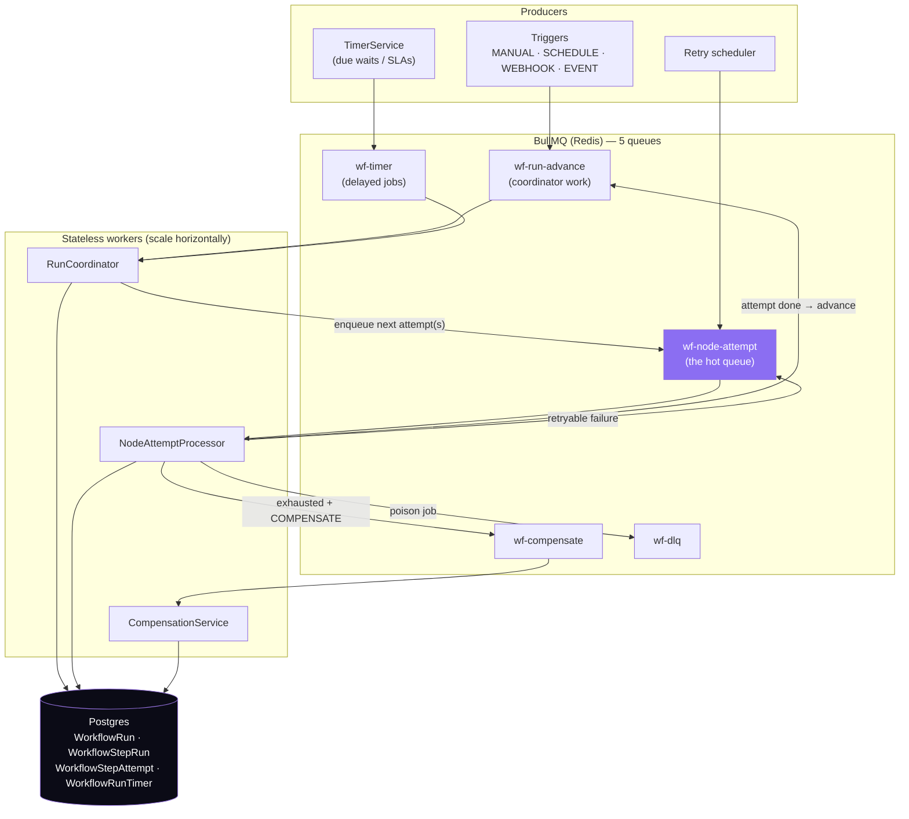
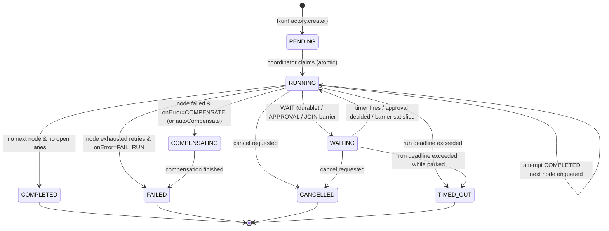
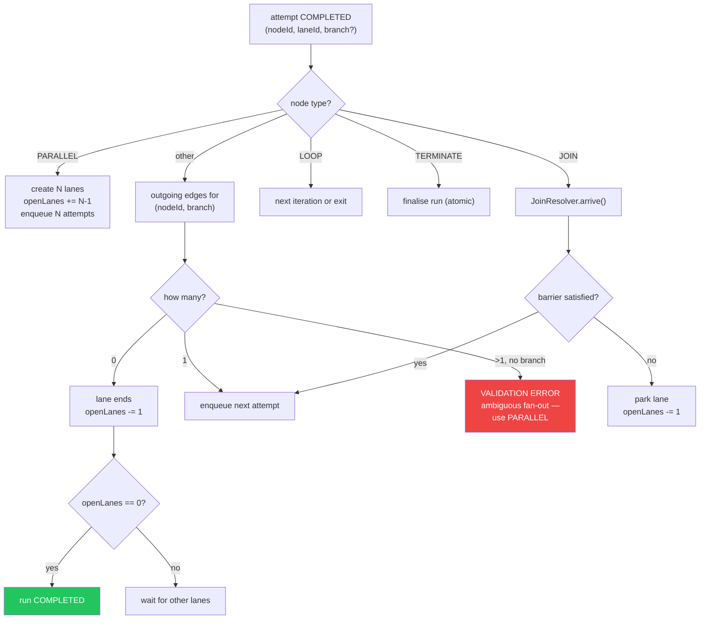
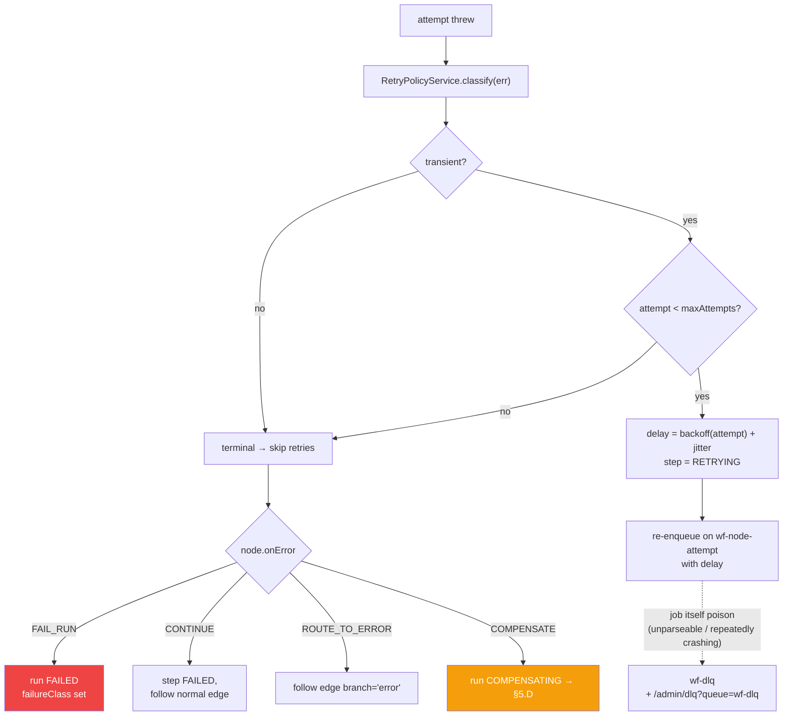
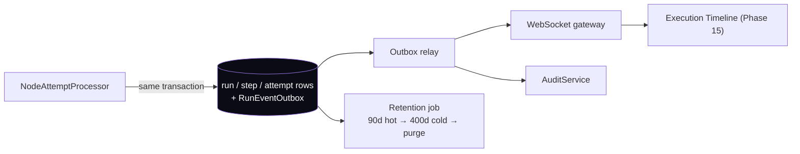

# Phase 5 — Workflow Execution Engine

**Prerequisite:** `00-overview-and-canonical-contracts.md` (§0.7 normative) and
`02-node-architecture.md` (the `NodeDefinition` contract this engine drives).

**Covers:** Execution Queue · Execution Runtime · Parallel Execution · Sequential Execution ·
Conditional Execution · Retry · Rollback · Compensation · Pause · Resume · Cancellation ·
Failure Recovery · Dead Letter Queue · Execution History.

**Governing decision:** ADR-001 — a durable state machine on BullMQ, **not** Temporal, with the
node-attempt boundary kept Temporal-compatible as a documented escape hatch.

**This is the highest-risk phase in the set.** It replaces the execution path for live customer
automation. Everything here is designed to be shipped behind the per-tenant
`WORKFLOW_ENGINE_MODE = legacy_walk | state_machine` flag (doc 00 §0.10, Wave W3), with the existing
walk as an instant fallback.

---

## 5.A The core model change: from a walk to a state machine

### 1. Purpose

Today one BullMQ job executes an entire graph inside a single `while` loop
(`engine/workflow-engine.service.ts:360-392`, verified). That single design choice is the direct
cause of five separate gaps — G2 (no durable wait), G3 (no parallelism), G4 (no per-node retry),
G5 (worker restart orphans a run), G6 (no compensation). Fixing them individually is impossible;
they are all consequences of the walk owning the whole run in memory.

**The change:** one job advances **one node attempt**, then persists and enqueues what comes next.
All state lives in Postgres. The engine becomes stateless between attempts.

### 2. Responsibilities

| Component (all NEW) | Responsibility |
|---|---|
| `RunFactory` | Create a run with all guards (Phase 1 §1.F owns this) |
| `RunCoordinator` | Advance a run: decide the next node(s), detect terminal state, finalise |
| `StepDispatcher` | Enqueue node-attempt jobs; enforce per-tenant concurrency |
| `NodeAttemptProcessor` | Execute exactly one attempt of one node, with lease + timeout |
| `JoinResolver` | Atomic barrier accounting for `PARALLEL`/`JOIN` |
| `TimerService` | Durable waits and SLA timers (`WorkflowRunTimer`) |
| `RetryPolicyService` | Backoff computation + transient-vs-terminal classification |
| `CompensationService` | Saga rollback of completed side effects |
| `CancellationService` | Cooperative cancellation of a run and its in-flight attempts |
| `RunReaper` | Reclaim attempts whose lease expired (replaces the blunt watchdog) |

### 3. Architecture



**Why five queues rather than one.** Each has a different failure and latency profile, and mixing
them means one starves another: `wf-node-attempt` is high-volume and latency-sensitive;
`wf-run-advance` is cheap and must never queue behind slow node work; `wf-timer` holds delayed jobs
that may sit for months; `wf-compensate` must drain even when the main queue is saturated (rollback
is more urgent than new work); `wf-dlq` is inspection-only. This mirrors the existing
`common/resilience` DLQ pattern already in the codebase rather than inventing a new one.

**Postgres as the source of truth, Redis as transport only.** If Redis is lost entirely, no run state
is lost — the reaper reconstructs pending work from `WorkflowRun`/`WorkflowStepRun`. This is a
deliberate inversion of the common "queue is the state" pattern and is what makes the system
recoverable. It also matters concretely here: the production Redis is Upstash (managed, remote), so
treating it as durable state would be a mistake.

### 4. Flow Diagram — the advance loop



Note `WAITING` now has three distinct causes (durable wait, approval, join barrier) where today it
has one (approval only). They share the state because they share the semantics — the run is parked,
not stalled, and the reaper must never touch it. This is why the existing watchdog explicitly
excludes `WAITING` (verified at `workflow-engine.service.ts:284-286`) and why that exclusion must be
preserved.

### 5. Database Design

```prisma
/// EXTEND — existing fields all kept.
model WorkflowRun {
  // … EXISTING: id, companyId, workflowId, status, source, dryRun, trigger,
  //    context, triggerEventId, correlationId, resumeNodeId, error,
  //    startedAt, finishedAt, createdAt …
  workflowVersionId String?          // NEW (Phase 1)
  idempotencyKey    String?          // NEW (Phase 1)

  // ── NEW in this phase ────────────────────────────────────────────────────
  /// Machine-readable failure reason — stop string-matching `error`.
  failureClass   String?             // RunFailureClass
  /// Hard deadline (createdAt + settings.runTimeoutMs). Reaper enforces it.
  deadlineAt     DateTime?
  /// Attempts consumed, against settings.maxSteps. Replaces MAX_WORKFLOW_NODES.
  stepBudgetUsed Int      @default(0)
  /// Open execution lanes. >1 only with PARALLEL. Run completes at 0.
  openLanes      Int      @default(0)
  /// Set when cancellation was requested; attempts observe it cooperatively.
  cancelRequestedAt DateTime?
  cancelledByUserId String?
  /// Parent run, for SUB_WORKFLOW.
  parentRunId    String?
  parentStepId   String?
  /// Nesting depth; hard-capped at 3.
  depth          Int      @default(0)

  attempts WorkflowStepAttempt[]
  timers   WorkflowRunTimer[]

  @@index([companyId, status])                 // NEW — operator queries
  @@index([status, deadlineAt])                // NEW — reaper scan
  @@index([companyId, workflowVersionId])      // NEW — "runs of version X"
  @@index([parentRunId])                       // NEW — sub-workflow tree
}

/// EXTEND
model WorkflowStepRun {
  // … EXISTING: id, companyId, runId, nodeId, type, status, input, output,
  //    error, startedAt, finishedAt, createdAt …
  attemptCount Int     @default(0)   // NEW
  category     String?               // NEW (Phase 2)
  /// Lane id — groups steps belonging to one PARALLEL branch. Null = main lane.
  laneId       String?               // NEW
  /// LOOP iteration index, so 100 iterations of one node are distinguishable.
  iteration    Int?                  // NEW
  /// Node ids to run to undo this step, when it completed a side effect.
  compensationState String?          // NEW: PENDING | DONE | FAILED | NOT_REQUIRED

  attempts WorkflowStepAttempt[]

  @@index([runId, status])                     // NEW — timeline + join accounting
  @@unique([runId, nodeId, iteration, laneId]) // NEW — idempotency per logical step
}

/// NEW — one row per attempt. The retry history that a counter would lose.
model WorkflowStepAttempt {
  id        String        @id @default(cuid())
  companyId String
  runId     String
  run       WorkflowRun   @relation(fields: [runId], references: [id], onDelete: Cascade)
  stepId    String
  step      WorkflowStepRun @relation(fields: [stepId], references: [id], onDelete: Cascade)
  attempt   Int
  status    StepRunStatus
  /// Worker lease — reaper reclaims when now() > leaseExpiresAt and status=RUNNING.
  workerId       String?
  leaseExpiresAt DateTime?
  error          String?
  errorClass     String?     // RunFailureClass
  /// Cost/token attribution per attempt (Phase 10 reads these).
  promptTokens     Int?
  completionTokens Int?
  costUsd          Decimal?  @db.Decimal(12, 6)
  durationMs       Int?
  startedAt  DateTime?
  finishedAt DateTime?
  createdAt  DateTime @default(now())

  @@unique([stepId, attempt])
  @@index([companyId, createdAt])
  @@index([status, leaseExpiresAt])   // reaper scan
}

/// NEW — durable waits and SLA timers. Closes G2.
model WorkflowRunTimer {
  id        String   @id @default(cuid())
  companyId String
  runId     String
  run       WorkflowRun @relation(fields: [runId], references: [id], onDelete: Cascade)
  /// Node that will be resumed (or the approval whose SLA this is).
  nodeId    String?
  kind      String   // WAIT | APPROVAL_SLA | JOIN_TIMEOUT | RUN_DEADLINE
  fireAt    DateTime
  firedAt   DateTime?
  cancelledAt DateTime?
  payload   Json?
  createdAt DateTime @default(now())

  /// The scan index: due, unfired, uncancelled.
  @@index([fireAt, firedAt])
  @@index([runId])
}
```

**Two index decisions worth explaining:**

`@@unique([runId, nodeId, iteration, laneId])` on `WorkflowStepRun` is the **idempotency key of the
whole engine**. A duplicate-delivered job cannot create a second step row for the same logical step;
the insert conflicts and the worker knows it lost the race. This replaces "hope the queue doesn't
double-deliver" with a database guarantee — the same technique the existing code already uses at the
run level via `updateMany({where:{status:'PENDING'}})` (verified at `workflow-engine.service.ts:231`),
applied one level down.

`@@index([fireAt, firedAt])` on `WorkflowRunTimer` supports the only query the timer sweeper runs:
`WHERE firedAt IS NULL AND cancelledAt IS NULL AND fireAt <= now() LIMIT n`. Without it, durable
waits degrade into a full scan of every future timer — including ones months out.

### 6. API Design

```
POST   /runs/:id/cancel      { reason }        → 202  (cooperative; see §5.E)
POST   /runs/:id/retry       { fromNodeId? }   → 202  (new run, copying context; never mutates history)
POST   /runs/:id/resume      (approval path)   → 202  EXISTING semantics preserved
GET    /runs/:id             run + steps + attempts (Phase 13 defines shape)
GET    /runs/:id/timeline    ordered step/attempt events for the UI
GET    /workflows/:id/runs   list with filters (status, failureClass, since, versionId)

# Operator/admin — reuse the EXISTING generic DLQ surface (see ledger note below)
GET    /admin/dlq?queue=wf-node-attempt poison jobs awaiting inspection
POST   /admin/dlq/:queue/:jobId/replay  replay ONE job after a fix
GET    /admin/workflow-runs/stuck       runs past deadline (should always be empty)
```

> **RESOLVED — `13-api.md` §13.0.2 ledger R7.** Do **not** add workflow-specific
> `/admin/workflow-dlq*` routes. A generic admin DLQ surface already ships
> (`dlq.controller.ts`). Register this phase's five queue names (`wf-run-advance`,
> `wf-node-attempt`, `wf-timer`, `wf-compensate`, `wf-dlq`) into `DLQ_KNOWN_QUEUES`
> (`dlq.constants.ts`) and filter the existing surface by `?queue=`. One admin DLQ
> surface for the whole platform, not two.

`POST /runs/:id/retry` deliberately creates a **new run** rather than resurrecting the old one. A
completed-then-retried run would have two conflicting histories in the same row, destroying the audit
guarantee. The new run records `parentRunId` so the relationship is visible.

### 7. TypeScript Interfaces

```ts
/** NEW — job payloads, one per queue. Discriminated so a mis-routed job fails loudly. */
export type AdvanceJob =
  | { kind: 'START';            runId: string }
  | { kind: 'AFTER_ATTEMPT';    runId: string; stepId: string; laneId?: string }
  | { kind: 'TIMER_FIRED';      runId: string; timerId: string }
  | { kind: 'APPROVAL_DECIDED'; runId: string; approvalId: string; approved: boolean }
  | { kind: 'JOIN_SATISFIED';   runId: string; nodeId: string; laneId?: string }
  | { kind: 'CANCEL';           runId: string };

export interface NodeAttemptJob {
  runId: string;
  nodeId: string;
  stepId: string;
  attempt: number;
  laneId?: string;
  iteration?: number;
  /** For fair-share scheduling and per-tenant caps. */
  companyId: string;
}

/** NEW — the coordinator's decision after one attempt. */
export interface AdvanceDecision {
  /** Attempts to enqueue next (>1 only for PARALLEL fan-out). */
  next: { nodeId: string; laneId?: string; iteration?: number }[];
  /** Park the run: a timer or an external signal will wake it. */
  suspend?: { reason: 'WAIT' | 'APPROVAL' | 'JOIN'; timerId?: string };
  /** Terminal transition. */
  terminal?: { status: WorkflowRunStatus; failureClass?: RunFailureClass; error?: string };
  /** Lanes closed by this decision (join/terminate accounting). */
  lanesClosed?: number;
}

/** NEW — retry classification. */
export interface RetryDecision {
  shouldRetry: boolean;
  delayMs: number;
  attempt: number;
  reason: string;
}

export interface RetryPolicyService {
  classify(error: unknown): { transient: boolean; failureClass: RunFailureClass };
  decide(policy: RetryPolicy, attempt: number, error: unknown): RetryDecision;
}

/** NEW — leases. */
export interface AttemptLease {
  attemptId: string;
  workerId: string;
  expiresAt: Date;
}
```

### 8. JSON Examples

```json
// A node-attempt job on wf-node-attempt
{
  "runId": "run_9Qm4",
  "nodeId": "n_score",
  "stepId": "stp_71",
  "attempt": 2,
  "companyId": "cmp_acme"
}
```

```json
// GET /runs/run_9Qm4/timeline — showing a real retry, which today is invisible
{
  "runId": "run_9Qm4",
  "status": "COMPLETED",
  "version": 3,
  "openLanes": 0,
  "stepBudgetUsed": 6,
  "steps": [
    { "nodeId": "n_trigger", "type": "TRIGGER", "status": "COMPLETED", "attemptCount": 1, "durationMs": 4 },
    { "nodeId": "n_policy",  "type": "RETRIEVE", "status": "COMPLETED", "attemptCount": 1, "durationMs": 61 },
    { "nodeId": "n_score",   "type": "AI_EMPLOYEE_STEP", "status": "COMPLETED", "attemptCount": 2,
      "attempts": [
        { "attempt": 1, "status": "FAILED", "errorClass": "RATE_LIMITED",
          "error": "429 from provider", "durationMs": 812 },
        { "attempt": 2, "status": "COMPLETED", "durationMs": 1934,
          "promptTokens": 1420, "completionTokens": 6, "costUsd": "0.002130" }
      ]},
    { "nodeId": "n_gate",    "type": "CONDITION", "status": "COMPLETED", "attemptCount": 1,
      "output": { "left": "84", "op": "gt", "right": "79", "result": true } },
    { "nodeId": "n_approve", "type": "APPROVAL", "status": "COMPLETED", "attemptCount": 1,
      "waitedMs": 5421000 },
    { "nodeId": "n_yes",     "type": "TOOL_ACTION", "status": "COMPLETED", "attemptCount": 1,
      "compensationState": "NOT_REQUIRED" }
  ]
}
```

That `n_score` entry — a 429, a backoff, then success — is precisely what the current engine cannot
represent: today the whole run would simply have failed.

### 9. Folder Structure

```
engine/state-machine/
├── run-factory.service.ts        Phase 1 §1.F — the single creation path
├── run-coordinator.service.ts    advance(); the AdvanceDecision logic
├── step-dispatcher.service.ts    enqueue + per-tenant concurrency + fair share
├── node-attempt.processor.ts     @Processor('wf-node-attempt') — one attempt
├── advance.processor.ts          @Processor('wf-run-advance')
├── timer.service.ts              create/cancel timers
├── timer-sweeper.processor.ts    due-timer scan → wf-run-advance
├── join-resolver.service.ts      atomic barrier accounting
├── retry-policy.ts               backoff + transient classification
├── compensation.service.ts       saga rollback
├── compensation.processor.ts     @Processor('wf-compensate')
├── cancellation.service.ts       cooperative cancel
├── run-reaper.processor.ts       lease reclaim + deadline enforcement
└── lane.ts                       lane id generation + accounting helpers
```

### 10. Edge Cases

| Case | Behaviour |
|---|---|
| Duplicate-delivered attempt job | `@@unique([runId, nodeId, iteration, laneId])` conflict → loser exits without executing. **Database-guaranteed**, not best-effort. |
| Worker dies mid-attempt | Lease expires → `RunReaper` marks the attempt `FAILED` (`errorClass: INTERNAL`) and applies the retry policy. **This is the key improvement over today**, where the watchdog can only fail the whole run. |
| Worker dies after the side effect but before persisting success | The retried attempt re-executes the side effect. Unavoidable without provider idempotency — so: `TOOL_ACTION`/`HTTP_REQUEST` pass an idempotency key derived from `stepId` when the provider supports one, and `hasSideEffects` nodes default to `maxAttempts: 1` unless the author opts in. **Documented honestly as at-least-once, not exactly-once.** |
| Redis flushed / queue lost | No state lost. `RunReaper` finds `RUNNING` runs with no in-flight attempt and re-enqueues from the persisted step state. |
| A `WAITING` run whose timer row was deleted | Reaper detects `WAITING` with no live timer and no open approval → fails it with `INTERNAL` and a precise message, rather than leaving it parked forever. |
| Run exceeds `deadlineAt` while parked in `WAITING` | → `TIMED_OUT`. In-flight attempts get `signal` aborted; open timers cancelled. |
| `stepBudgetUsed` exceeds `settings.maxSteps` | Run → `FAILED` with `VALIDATION_ERROR`-class and a message naming the loop/branch that consumed it. Replaces today's blunt `MAX_WORKFLOW_NODES` abort (G16) with an accounting that distinguishes a legitimately large workflow from a runaway loop. |
| Two lanes both reach `TERMINATE` | First writes the terminal status atomically (`updateMany` guarded on non-terminal status); second observes it lost and exits. No double-finalise. |
| Cancellation arrives mid-attempt | Attempt is not killed. `cancelRequestedAt` is set; the running attempt's `signal` aborts; the coordinator refuses to enqueue anything further. A node already mid-`fetch` may still complete its side effect — **cooperative, not forceful**, and stated as such. |
| Approval decided twice (double-click) | Existing race-safe atomic claim in `ApprovalService` already handles this (verified); the coordinator additionally ignores an `APPROVAL_DECIDED` advance for a run not in `WAITING`. |
| `dryRun` run reaches a `hasSideEffects` node | Preview returned, no execution (Phase 2 §2.A.10), and `compensationState = NOT_REQUIRED`. |
| Sub-workflow parent cancelled while child runs | Cancellation cascades to children (`parentRunId` index exists for exactly this). Child cancellation does **not** cascade upward — the parent decides how to handle a failed child via `onError`. |
| Clock skew across workers | All deadlines/leases use `now()` from Postgres (`NOW()` in the guarded update), never a worker's local clock, so skew cannot cause premature reclaim. |

### 11. Security

- **Tenant isolation on the hot path:** every attempt job carries `companyId`, and every query in the
  processor filters by it. Combined with the RLS policy on execution tables (ADR-005), a bug in one
  query cannot leak another tenant's run.
- **No cross-tenant queue leakage:** fair-share scheduling partitions by `companyId`; a job is only
  ever processed with the `companyId` it carries, which is validated against the loaded run row (a
  mismatch is a hard error, not a warning — it would indicate a forged or corrupted job).
- **Subscription and pause enforcement at dispatch:** the existing `blockedBySubscription` check
  (verified) moves to `StepDispatcher` so it is re-checked on *every* attempt, not only at run start.
  A subscription cancelled mid-run stops further paid work — today a long run started while active
  keeps consuming LLM calls indefinitely.
- **Cancellation authorisation:** `POST /runs/:id/cancel` requires `workflow:run` on the workflow (or
  admin), and the actor is recorded in `cancelledByUserId` for audit.
- **DLQ contents are sensitive** — job payloads can contain resolved (non-secret) context. The DLQ
  admin endpoints require platform-admin, and payloads are redacted through the same Phase 6
  redaction boundary before display.

### 12. Performance

The per-attempt budget from doc 00 §0.8 is **< 50 ms engine overhead**. Where it goes and how it is
kept:

| Cost | Mitigation |
|---|---|
| 2 DB writes per attempt (start/finish) | Combined into 1 where possible: the finish write also carries the next step's insert in the same transaction. |
| 1 Redis enqueue per attempt | Unavoidable in the general case — but see batching below. |
| Run + version load per attempt | Version definitions are **immutable** (ADR-002), so they are cacheable in-process by `workflowVersionId` with no invalidation problem. This is a direct dividend of Phase 1's design. |
| JSON parse of the definition | Cached alongside, parsed once per version per worker. |

**Step-batching fast path (important).** For a chain of consecutive nodes that are all
`hasSideEffects: false`, cheap (`CONDITION`, `SWITCH`, `SET_VARIABLE`, `TRANSFORM`, `NOOP`), and have
`maxAttempts: 1`, the processor may execute up to `BATCH_MAX = 10` of them within a single job rather
than enqueueing each. This keeps a graph of mostly-logic nodes close to today's performance while
preserving durability at every side-effecting boundary. Batching stops immediately at the first node
that is side-effecting, retryable, suspending, or fan-out.

### 13. Scalability

- **Node workers are stateless** → scale by adding replicas. The bound is Postgres write throughput
  on `WorkflowStepAttempt`, which is why it is partitioned monthly (Phase 12).
- **Fair-share scheduling** prevents one tenant's 10,000-item `LOOP` from starving everyone: the
  dispatcher round-robins across `companyId` and enforces `maxConcurrentAttemptsPerCompany`.
- **Timer scan** is O(due), not O(all): the `[fireAt, firedAt]` index means a million timers a year
  out cost nothing. Sweeper runs every 10 s with a `LIMIT` and a skip-locked pattern
  (`FOR UPDATE SKIP LOCKED`) so multiple sweepers never contend.
- **10M attempts/day** ≈ 116/s average, with peaks maybe 10× that. Comfortably within BullMQ and a
  single well-indexed Postgres; the first thing to split at 10× beyond that is `WorkflowStepAttempt`
  onto its own database, which the denormalised `companyId` on every row already permits.
- **Deliberate constraint:** BullMQ workers cannot run on Vercel serverless (verified — this is
  already why `QUEUE_WORKERS_ENABLED=false` exists on the Vercel API deployment). The execution plane
  requires a persistent host. This is a real deployment prerequisite for Phase 5, not an
  afterthought.

### 14. Future Extension

- **Temporal migration path (kept open per ADR-001).** The `NodeAttemptProcessor` boundary maps 1:1
  onto a Temporal *activity*, and `RunCoordinator.advance()` onto *workflow* code. Migrating would
  mean replacing the two processors and the timer service while keeping every `NodeDefinition`
  untouched. Preserving that mapping is a design constraint on this phase, not an accident.
- **Speculative/parallel-branch execution** for A/B testing a graph change against live traffic.
- **Cross-run signals** (`WAIT_FOR_EVENT`, run-to-run messaging) — the timer/suspend machinery
  generalises to signal-based suspension with no schema change beyond a `signalKey` on the timer row.
- **Priority lanes** — a third queue tier for interactive runs (a user waiting in the UI) vs
  background batch runs.

### 15. Best Practices

Never let a node hold a DB transaction open across an external call. Always use the guarded
`updateMany` pattern for state transitions rather than read-then-write. Treat every terminal
transition as "at most once" and make it idempotent. Keep the legacy walk deletable but present for
one full release after the state machine is default — and delete it deliberately, because leaving two
engines alive indefinitely guarantees they will drift.

---

## 5.B Sequential, conditional, and parallel execution

### 1. Purpose

Define exactly how the coordinator picks what runs next, including the three-way distinction between
one next node (sequential), one *of several* (conditional), and several at once (parallel).

### 2. Responsibilities

`RunCoordinator.advance()` owns the decision; `JoinResolver` owns barrier accounting; `StepDispatcher`
owns enqueueing and concurrency limits.

### 3. Architecture — lanes

A **lane** is an independent execution path. The main lane has `laneId = null` (so existing runs need
no backfill). A `PARALLEL` node creates one child lane per branch with
`laneId = <parentLane>:<nodeId>:<index>`. `WorkflowRun.openLanes` counts them; the run completes when
`openLanes` hits 0.

Lane ids are hierarchical strings rather than a separate table because the nesting depth is bounded
(a `PARALLEL` inside a `PARALLEL` inside a `LOOP` is already pathological) and a string keeps the
`WorkflowStepRun` unique constraint simple.

**Conditional execution keeps today's exact semantics**, ported verbatim from `nextNode()`
(`workflow-engine.service.ts:583-611`): a `CONDITION` follows the edge whose `branch` matches; a
CONDITION with *no* branch-tagged edges falls through to the first edge (pass-through, preserved);
and a CONDITION whose result matches *no* branch when some edges *are* tagged **fails loudly**. That
last behaviour is a deliberate prior fix and must survive the rewrite.

### 4. Flow Diagram



The `>1 outgoing edge with no branch` case being an **error** rather than an implicit fan-out is
important: today `nextNode` silently takes `outgoing[0]`, so a user who wires two edges from one node
gets one of them executed at random with no warning. Making it a validation error (Phase 1) plus a
runtime error is strictly safer, and `PARALLEL` gives the explicit way to express the intent.

### 5. Database Design

Uses `WorkflowRun.openLanes`, `WorkflowStepRun.laneId/iteration`, and for joins:

```prisma
/// NEW — barrier accounting. A row per JOIN node per run.
model WorkflowJoinState {
  id        String   @id @default(cuid())
  companyId String
  runId     String
  nodeId    String
  /// Lanes expected (computed from incoming edges at first arrival).
  expected  Int
  /// Lanes that have arrived. Incremented atomically.
  arrived   Int      @default(0)
  /// Arrived lane ids, to make double-arrival detectable and debuggable.
  arrivedLanes String[] @default([])
  satisfiedAt DateTime?
  createdAt DateTime @default(now())

  @@unique([runId, nodeId])
}
```

`@@unique([runId, nodeId])` plus an atomic increment is the entire correctness argument for joins:

```sql
UPDATE "WorkflowJoinState"
   SET arrived = arrived + 1,
       "arrivedLanes" = array_append("arrivedLanes", $laneId)
 WHERE "runId" = $runId AND "nodeId" = $nodeId
   AND NOT ($laneId = ANY("arrivedLanes"))     -- idempotent on redelivery
RETURNING arrived, expected;
```

One statement, no read-modify-write, idempotent against duplicate delivery. Two lanes finishing in
the same millisecond cannot both see `arrived = 1`.

### 6. API Design

No dedicated endpoints; lanes and join state surface inside `GET /runs/:id/timeline` so the UI can
render parallel branches (Phase 15).

### 7. TypeScript Interfaces

```ts
export interface JoinResolver {
  /**
   * Records a lane arrival. Atomic and idempotent per (runId, nodeId, laneId).
   * Returns whether the barrier is now satisfied.
   */
  arrive(input: {
    companyId: string; runId: string; nodeId: string; laneId: string;
    config: JoinConfig; incomingLaneCount: number;
  }): Promise<{ satisfied: boolean; arrived: number; expected: number }>;
}

export interface LaneId {
  /** null = the main lane. */
  value: string | null;
  depth: number;
}

export function childLaneId(parent: string | null, nodeId: string, index: number): string {
  return `${parent ?? 'main'}:${nodeId}:${index}`;
}
```

### 8. JSON Examples

```json
// A PARALLEL/JOIN section rendered in a timeline
{
  "openLanes": 0,
  "lanes": [
    { "laneId": "main",                    "steps": ["n_trigger", "n_parallel", "n_join", "n_final"] },
    { "laneId": "main:n_parallel:0",       "steps": ["n_check_docs"] },
    { "laneId": "main:n_parallel:1",       "steps": ["n_check_refs"] },
    { "laneId": "main:n_parallel:2",       "steps": ["n_check_bgv"] }
  ],
  "joins": [
    { "nodeId": "n_join", "mode": "ALL", "expected": 3, "arrived": 3,
      "arrivedLanes": ["main:n_parallel:0", "main:n_parallel:1", "main:n_parallel:2"],
      "satisfiedAt": "2026-08-01T07:12:03.000Z" }
  ]
}
```

### 9. Folder Structure

`join-resolver.service.ts`, `lane.ts` (§5.A.9).

### 10. Edge Cases

| Case | Behaviour |
|---|---|
| `JOIN` reached by only 2 of 3 lanes because one lane failed with `onError: CONTINUE` | `mode: ALL` + `onLaneFailure: FAIL` (default) → run fails with a message naming the missing lane. With `IGNORE`, `expected` is decremented when a lane dies, so the barrier can still satisfy. The default is the strict one on purpose. |
| `JOIN` with `mode: ANY` — the other lanes are still running | First arrival satisfies; remaining lanes are **cancelled** (their attempts get `signal` aborted) and their steps marked `SKIPPED`. Leaving them running would produce side effects the user believes were abandoned. |
| Same lane arrives twice (redelivery) | `NOT (laneId = ANY(arrivedLanes))` makes it a no-op. |
| `JOIN` never satisfied and no `timeoutMs` | A `JOIN_TIMEOUT` timer is created from `settings.runTimeoutMs` if the node omits one — a join can never wait forever. |
| `PARALLEL` branch list references a node also reachable from the main lane | Validation ERROR (Phase 2 §2.C.10) — lane ownership must be exclusive. |
| Nested `PARALLEL` | Supported; lane ids nest. Depth capped at 3 to keep timelines comprehensible and prevent combinatorial fan-out. |
| `LOOP` with `concurrency > 1` | Implemented as repeated fan-out into lanes with `iteration` set, joined implicitly at the loop's exit node. |

### 11. Security

Fan-out is a resource-amplification vector: one trigger can become thousands of attempts.
`PARALLEL.maxConcurrency`, `LOOP.maxIterations` (mandatory), per-tenant attempt caps, and the step
budget together bound it. All four are required — any one alone is insufficient.

### 12. Performance

`JoinResolver.arrive()` is one indexed UPDATE. Lane accounting is one counter on the run row updated
in the same transaction as the step transition, so a parallel section costs no extra round trips
beyond the attempts themselves.

### 13. Scalability

Parallelism is where throughput is won: a 10-lane workflow uses 10 workers instead of 1. The
constraint becomes per-tenant fairness, addressed in §5.A.13.

### 14. Future Extension

Dynamic fan-out (branch count from runtime data rather than a static list) — expressible today via
`LOOP` with `concurrency`, and worth promoting to a first-class `FAN_OUT` node if the pattern proves
common. Map-reduce style aggregation nodes.

### 15. Best Practices

Prefer `LOOP` with `concurrency` over hand-rolled `PARALLEL` fan-out for homogeneous work — it is
bounded by construction. Always set `JOIN.timeoutMs` explicitly rather than relying on the run
deadline. Keep parallel branches side-effect-independent; if two lanes write the same external
resource, you have a race the engine cannot protect you from.

---

## 5.C Retry, failure recovery, and the dead letter queue

### 1. Purpose

Close **G4**: today any node throw fails the entire run
(`workflow-engine.service.ts:562-569` → rethrow → run `FAILED`). A transient 429 from one connector
must not destroy a 30-step workflow.

### 2. Responsibilities

Classify errors as transient vs terminal; compute backoff; decide the `OnErrorBehaviour`; quarantine
poison jobs into a DLQ; reclaim orphaned attempts.

### 3. Architecture

**Reuse, don't reinvent.** The codebase already has `common/resilience` with a Redis circuit breaker,
a retry classifier, a per-connector rate limiter, `RESILIENT_JOB_OPTIONS`, and a DLQ with an
`/admin/dlq` view (all verified present). Phase 5 wires node retries into those existing primitives
rather than adding a parallel mechanism. Concretely: `RetryPolicyService.classify()` delegates to the
existing error classifier, and the existing per-connector circuit breaker still fronts every
`TOOL_ACTION`/`HTTP_REQUEST` egress.

**Three distinct failure layers, deliberately separated:**

| Layer | Handles | Mechanism |
|---|---|---|
| Provider | one HTTP call failing | existing circuit breaker + rate limiter |
| Node attempt | one node's execution failing | `RetryPolicy` (this phase) |
| Run | a node exhausting retries | `OnErrorBehaviour` (this phase) |

Conflating them is the classic mistake — retrying at three layers multiplicatively turns a 3× retry
into 27 provider calls. The rule: **only the node-attempt layer retries the node**; the provider layer
retries a single HTTP call at most once and surfaces the rest as a classified error.

### 4. Flow Diagram



The distinction between a **failed attempt** (retried) and a **poison job** (DLQ) matters: an attempt
that throws a business error is domain data and belongs in `WorkflowStepAttempt.error`; a job whose
payload cannot even be processed is an engineering fault and belongs in the DLQ where a human sees it.

### 5. Database Design

`WorkflowStepAttempt` (§5.A.5) is the retry history. `errorClass` uses `RunFailureClass` so failure
analytics (Phase 11) never string-matches error text — a lesson worth encoding, because error strings
change and break dashboards silently.

The existing DLQ infrastructure is reused; no new table.

### 6. API Design

```
GET    /admin/dlq?queue=wf-node-attempt   list poison jobs (paginated, redacted)
POST   /admin/dlq/:queue/:jobId/replay    replay one job after the underlying fix
DELETE /admin/dlq/:queue/:jobId           { reason? } — audited discard
GET    /runs/:id/attempts                 full attempt history for debugging
```

> **RESOLVED — `13-api.md` §13.0.2 ledger R7.** These are the EXISTING generic DLQ routes,
> not new workflow-specific ones. Discard is the existing `DELETE /admin/dlq/:queue/:jobId`
> (`dlq.controller.ts:74-82`) **extended** with an optional `{ reason? }` body — not a new
> parallel `POST .../discard`.

**No bulk auto-replay.** Replaying a batch of side-effecting jobs blindly is how you send 400
duplicate emails. Replay is one-at-a-time and audited, matching the existing deliberate decision that
the run watchdog **fails** stuck runs rather than retrying them (verified comment at
`workflow-engine.service.ts:276-280`: "side effects aren't safe to replay"). That reasoning applies
here identically and is not being reversed.

### 7. TypeScript Interfaces

```ts
export const DEFAULT_RETRY: Record<NodeCategory, RetryPolicy> = {
  // Pure/logic nodes: retrying a deterministic function is pointless.
  LOGIC:        { maxAttempts: 1, backoff: 'NONE', initialDelayMs: 0 },
  VARIABLE:     { maxAttempts: 1, backoff: 'NONE', initialDelayMs: 0 },
  UTILITY:      { maxAttempts: 1, backoff: 'NONE', initialDelayMs: 0 },
  TRIGGER:      { maxAttempts: 1, backoff: 'NONE', initialDelayMs: 0 },
  // Network/LLM: worth retrying with backoff + jitter.
  AI_EMPLOYEE:  { maxAttempts: 3, backoff: 'EXPONENTIAL', initialDelayMs: 2000, maxDelayMs: 30000, jitter: true, retryOn: 'TRANSIENT_ONLY' },
  KNOWLEDGE:    { maxAttempts: 3, backoff: 'EXPONENTIAL', initialDelayMs: 500,  maxDelayMs: 5000,  jitter: true, retryOn: 'TRANSIENT_ONLY' },
  MEMORY:       { maxAttempts: 3, backoff: 'EXPONENTIAL', initialDelayMs: 500,  maxDelayMs: 5000,  jitter: true, retryOn: 'TRANSIENT_ONLY' },
  DATABASE:     { maxAttempts: 3, backoff: 'EXPONENTIAL', initialDelayMs: 500,  maxDelayMs: 5000,  jitter: true, retryOn: 'TRANSIENT_ONLY' },
  EXTERNAL_API: { maxAttempts: 3, backoff: 'EXPONENTIAL', initialDelayMs: 1000, maxDelayMs: 20000, jitter: true, retryOn: 'TRANSIENT_ONLY' },
  COMMUNICATION:{ maxAttempts: 3, backoff: 'EXPONENTIAL', initialDelayMs: 1000, maxDelayMs: 20000, jitter: true, retryOn: 'TRANSIENT_ONLY' },
  // Side-effecting by definition: conservative default, author must opt in to more.
  SKILL:        { maxAttempts: 2, backoff: 'EXPONENTIAL', initialDelayMs: 1000, maxDelayMs: 10000, jitter: true, retryOn: 'TRANSIENT_ONLY' },
  // Human-gated: never retried by machine.
  APPROVAL:     { maxAttempts: 1, backoff: 'NONE', initialDelayMs: 0 },
};

/** Transient classes — everything else is terminal. */
export const TRANSIENT_CLASSES: RunFailureClass[] = [
  'RATE_LIMITED', 'TIMEOUT', 'CONNECTOR_UNAVAILABLE', 'INTERNAL',
];
```

`SKILL` defaulting to `maxAttempts: 2` rather than 3 is a considered trade-off: these are the nodes
that send real emails and move real money, and at-least-once delivery (§5.A.10) means each retry
risks a duplicate. Two attempts catches the common transient blip without tripling duplicate risk.

### 8. JSON Examples

```json
// A node opting into aggressive retry with an error route
{
  "id": "n_post",
  "type": "TOOL_ACTION",
  "config": { "skillKey": "postiz", "tool": "schedule_post", "args": { "…": "…" } },
  "retry": { "maxAttempts": 5, "backoff": "EXPONENTIAL", "initialDelayMs": 2000,
             "maxDelayMs": 60000, "jitter": true, "retryOn": "TRANSIENT_ONLY" },
  "timeoutMs": 20000,
  "onError": "ROUTE_TO_ERROR"
}
// with: { "from": "n_post", "to": "n_alert_marketing_lead", "branch": "error" }
```

### 9. Folder Structure

`retry-policy.ts`, `run-reaper.processor.ts` (§5.A.9), plus reuse of `common/resilience/*`.

### 10. Edge Cases

| Case | Behaviour |
|---|---|
| A node fails transiently forever (provider down for hours) | Retries exhaust in minutes; `onError` applies. The provider circuit breaker (existing) opens and fails subsequent attempts fast rather than queueing them. |
| `onError: CONTINUE` and the node was the run's only value | Allowed but emits a publish-time WARNING — silently continuing past the step that mattered is a footgun. |
| `onError: ROUTE_TO_ERROR` with no `branch: 'error'` edge | Validation ERROR at publish (Phase 1). At runtime (graph published before the rule existed) → treated as `FAIL_RUN` with a clear message. |
| Retry scheduled, then the run is cancelled | Delayed job checks `cancelRequestedAt` on pickup and exits. Cancelled runs never resume. |
| Retry delay exceeds the run deadline | Not scheduled; the run is failed immediately as `TIMED_OUT` — never park a retry that can only ever expire. |
| Reaper reclaims an attempt that was actually still alive (long GC pause) | Lease renewal: a long-running attempt heartbeats its lease every `LEASE_RENEW_MS`. Only a genuinely dead worker loses it. The `@@unique([stepId, attempt])` constraint prevents a double-execution from producing two attempt rows. |
| Poison job (unparseable payload) | Straight to DLQ after 1 attempt — never retried, since it cannot succeed. |

### 11. Security

Retry storms are a self-inflicted DoS and a cost risk (each LLM retry is billable). Bounds: per-node
`maxAttempts`, per-tenant attempt rate limit, the existing circuit breaker, and jitter (mandatory in
every default above) to prevent synchronised thundering herds after a provider recovers.
`AiEmployee.budgetLimit` is re-checked **per attempt**, not per step, so a retry loop cannot exceed a
budget.

### 12. Performance

Backoff with jitter spreads load. The reaper scan uses `@@index([status, leaseExpiresAt])` with
`SKIP LOCKED`, so it costs a bounded indexed range scan regardless of table size.

### 13. Scalability

Delayed jobs live in Redis; a large retry backlog costs Redis memory. Bound it with a per-tenant cap
on simultaneously-delayed attempts, spilling to `TIMED_OUT` rather than growing unboundedly.

### 14. Future Extension

Adaptive retry (learn per-connector success-by-delay from Phase 11 metrics); a per-connector shared
budget so one flaky connector cannot consume a tenant's whole retry allowance; automatic DLQ
triage that groups poison jobs by root cause.

### 15. Best Practices

Never retry a non-idempotent side effect without a provider idempotency key. Always classify before
retrying — retrying a 400 is waste, retrying a 429 is correct. Keep jitter on. Treat the DLQ as an
alerting signal (a non-empty DLQ is a bug, not a backlog), not a queue to be drained on a schedule.

---

## 5.D Durable waits, pause, resume, cancellation, and compensation

### 1. Purpose

Close **G2** (waits capped at 10 seconds), **G6** (no rollback), and make pause/resume/cancel
first-class rather than approval-specific.

### 2. Responsibilities

`TimerService` + `timer-sweeper` own durable time. `CancellationService` owns cooperative stop.
`CompensationService` owns saga rollback.

### 3. Architecture — durable waits

Today `WAIT` is `await sleep(min(durationMs, 10_000))` inside the job
(`workflow-engine.service.ts:832-848`, verified). Replacement:

1. `WAIT` returns `suspendUntil: Date` instead of sleeping.
2. Coordinator writes a `WorkflowRunTimer` row (`kind: 'WAIT'`, `fireAt`), sets the run `WAITING`,
   closes the lane, and returns — **the worker is freed immediately**.
3. `timer-sweeper` (every 10 s) selects due timers `FOR UPDATE SKIP LOCKED`, marks them `firedAt`, and
   enqueues `{kind:'TIMER_FIRED'}` on `wf-run-advance`.
4. Coordinator resumes from the node after the wait.

A three-month wait therefore costs one row and zero worker time — versus impossible today. The
accuracy target from doc 00 §0.8 (±30 s) follows directly from the 10 s sweep interval.

**Why a DB timer table and not BullMQ delayed jobs for long waits.** BullMQ *can* delay a job for
months, but that stores the payload in Redis for months — on a managed Redis with a memory limit,
and with no queryability ("show me every run waiting on an approval"). The DB row is queryable,
survives a Redis flush, and is cheap. Short waits (< 60 s) may still use a delayed job as an
optimisation; the sweeper handles everything longer.

### 4. Flow Diagram — compensation (saga)

```mermaid
sequenceDiagram
    participant R as Run (steps 1-4 done)
    participant N5 as Step 5 (fails)
    participant CS as CompensationService
    participant DB as Postgres

    N5->>CS: exhausted retries, onError=COMPENSATE
    CS->>DB: run.status = COMPENSATING
    CS->>DB: list COMPLETED steps with compensation, reverse order
    loop steps 4 → 1
        CS->>CS: run step.compensation (a node execution)
        alt compensation succeeded
            CS->>DB: step.compensationState = DONE
        else compensation failed
            CS->>DB: step.compensationState = FAILED
            Note over CS: continue to the next step —<br/>never abort the rollback halfway
        end
    end
    CS->>DB: run.status = FAILED, failureClass preserved
    Note over DB: A FAILED compensation is an<br/>operator alert; the run is not<br/>silently marked clean.
```

Compensation runs in **reverse completion order** and continues past its own failures, because
stopping halfway leaves the system in a worse state than either completing or not starting the
rollback. Each compensation is itself a node execution, so it gets retries and audit for free.

### 5. Database Design

`WorkflowRunTimer` (§5.A.5), `WorkflowStepRun.compensationState` (§5.A.5),
`WorkflowRun.cancelRequestedAt/cancelledByUserId`, and `WorkflowNode.compensation`
(`CompensationSpec`, canonical §0.7.2).

### 6. API Design

```
POST /runs/:id/cancel     { reason }         → 202
GET  /runs/waiting        ops view: everything parked, why, and since when
POST /runs/:id/compensate { fromStepId? }    → 202  (manual rollback trigger, admin)
```

`GET /runs/waiting` exists because "why is nothing happening?" is the hardest question to answer in
a durable workflow system, and an ops view of every parked run with its reason answers it directly.

### 7. TypeScript Interfaces

```ts
export interface TimerService {
  create(input: {
    companyId: string; runId: string; nodeId?: string;
    kind: 'WAIT' | 'APPROVAL_SLA' | 'JOIN_TIMEOUT' | 'RUN_DEADLINE';
    fireAt: Date; payload?: unknown;
  }): Promise<{ timerId: string }>;
  cancel(timerId: string): Promise<void>;
  cancelForRun(runId: string): Promise<number>;
}

export interface CancellationService {
  /** Cooperative: sets the flag, aborts in-flight signals, cancels timers. */
  request(input: { runId: string; userId: string; reason: string; cascade?: boolean }): Promise<void>;
  isCancelled(runId: string): Promise<boolean>;
}

export interface CompensationService {
  /** Runs the reverse-order rollback described in §5.D.4. */
  compensate(input: { runId: string; fromStepId?: string }): Promise<{
    compensated: number; failed: number;
  }>;
}
```

### 8. JSON Examples

```json
// A TOOL_ACTION that knows how to undo itself
{
  "id": "n_create_hrms_record",
  "type": "TOOL_ACTION",
  "name": "Create employee record",
  "config": { "skillKey": "hrms", "tool": "create_employee",
              "args": { "email": "{{newHire.email}}", "name": "{{newHire.name}}" },
              "outputKey": "hrmsRecord" },
  "onError": "COMPENSATE",
  "compensation": {
    "type": "TOOL_ACTION",
    "config": { "skillKey": "hrms", "tool": "delete_employee",
                "args": { "employeeId": "{{compensating.originalOutput.result.id}}" } }
  }
}
```

```json
// A durable wait of three business days
{
  "id": "n_wait_for_docs",
  "type": "WAIT",
  "config": { "durationMs": 259200000 },
  "name": "Give the candidate 3 days to upload documents"
}
```

### 9. Folder Structure

`timer.service.ts`, `timer-sweeper.processor.ts`, `cancellation.service.ts`,
`compensation.service.ts`, `compensation.processor.ts` (§5.A.9).

### 10. Edge Cases

| Case | Behaviour |
|---|---|
| `WAIT` longer than `settings.runTimeoutMs` | Validation ERROR at publish — a wait that can only ever be reaped is a bug the author should see immediately. |
| Timer fires for a run already `COMPLETED`/`FAILED`/`CANCELLED` | Coordinator no-ops and marks the timer fired. Idempotent. |
| Two sweepers pick the same timer | `FOR UPDATE SKIP LOCKED` + `firedAt IS NULL` guard makes it impossible for both to enqueue. |
| Cancel a run parked in `WAITING` | Timers cancelled, run → `CANCELLED` immediately (no worker involvement needed). |
| Cancel a run mid-attempt | Cooperative only (§5.A.10) — the in-flight side effect may still land. Surfaced honestly in the API response: `{ cancelled: true, inFlightAttempts: 1 }`. |
| Compensation for a step whose output is missing | Compensation config templates resolve to empty; the compensation node fails; `compensationState: FAILED`; rollback continues. Never crash the rollback. |
| Compensating a node with `hasSideEffects: false` | Skipped (`NOT_REQUIRED`) — nothing to undo. |
| Compensation itself needs approval | Supported (compensation is a node execution), but strongly discouraged and warned at publish: a rollback blocked on a human can leave the system inconsistent for days. |
| `dryRun` run failing with `COMPENSATE` | No compensation runs — nothing happened to undo. |

### 11. Security

Cancellation and manual compensation are privileged, audited operations (`workflow:run` /
platform-admin respectively) — manual compensation in particular can delete real customer records via
a `delete_*` tool, so it requires an explicit reason and is fully audited.

### 12. Performance

Parked runs consume **zero** worker capacity — the point of the change. The sweeper's cost is
proportional to *due* timers only.

### 13. Scalability

Millions of open timers are fine (one indexed row each). The sweeper is horizontally scalable via
`SKIP LOCKED`. Timer rows for finished runs are cleaned up by the same retention job as run history
(Phase 12).

### 14. Future Extension

Business-calendar-aware waits ("3 *business* days in the employee's timezone" — `AiEmployee` already
stores `timezone` and working hours, so the data exists); signal-based suspension (`WAIT_FOR_EVENT`);
compensation *groups* (undo a set of steps atomically rather than one at a time).

### 15. Best Practices

Give every side-effecting node a `compensation` when a sensible inverse exists — and be explicit when
one does not (sending an email cannot be unsent; the compensation is a follow-up correction email,
which is a business decision, not a technical one). Always set `runTimeoutMs` on workflows containing
long waits. Treat a non-zero `compensationState: FAILED` count as a page-worthy alert.

---

## 5.E Execution history

### 1. Purpose

Make every run reconstructable after the fact — for debugging, for audit (Phase 10), and for the
timeline UI (Phase 15).

### 2. Responsibilities

Persist run, step, and attempt state as the authoritative history; emit realtime events for live
observation; retain and eventually archive.

### 3. Architecture

Three levels, deliberately: **run** (what was asked), **step** (what logical work happened), and
**attempt** (each try, with its own error, timing, and cost). Today only the first two exist and the
second has no attempt dimension — which is why a retry is invisible.

Realtime updates go out via a transactional outbox (`RunEventOutbox`, Phase 10) rather than emitting
from the worker directly, so a WebSocket push can never claim something the database didn't commit.

### 4. Flow Diagram



### 5. Database Design

`WorkflowRun` / `WorkflowStepRun` / `WorkflowStepAttempt` (§5.A.5), partitioned monthly (Phase 12).
`RunEventOutbox` is defined in Phase 10.

### 6. API Design

`GET /runs/:id`, `GET /runs/:id/timeline`, `GET /runs/:id/attempts`,
`GET /workflows/:id/runs` (see §5.A.6); realtime channel in Phase 13.

### 7. TypeScript Interfaces

```ts
export interface RunTimelineDto {
  runId: string;
  workflowId: string;
  version: number;
  status: WorkflowRunStatus;
  failureClass: RunFailureClass | null;
  correlationId: string;
  dryRun: boolean;
  startedAt: string | null;
  finishedAt: string | null;
  stepBudgetUsed: number;
  openLanes: number;
  lanes: { laneId: string; stepIds: string[] }[];
  steps: StepTimelineDto[];
  totals: { durationMs: number; costUsd: string; promptTokens: number; completionTokens: number };
}

export interface StepTimelineDto {
  stepId: string;
  nodeId: string;
  type: NodeType;
  category: NodeCategory | null;
  name: string | null;
  status: StepRunStatus;
  laneId: string | null;
  iteration: number | null;
  attemptCount: number;
  compensationState: string | null;
  /** Redacted through the Phase 6 boundary before it ever leaves the server. */
  input: unknown;
  output: unknown;
  attempts: AttemptDto[];
  startedAt: string | null;
  finishedAt: string | null;
  durationMs: number | null;
}
```

### 8. JSON Examples

See §5.A.8 (`GET /runs/:id/timeline`).

### 9. Folder Structure

`engine/observability/run-tracer.ts`, `step-metrics.recorder.ts` (doc 00 §0.7.4).

### 10. Edge Cases

| Case | Behaviour |
|---|---|
| A run with 10,000 steps (big `LOOP`) | Timeline endpoint paginates steps and aggregates loop iterations into a collapsed group by default — never return 10,000 rows to a browser. |
| Step `input`/`output` containing a 5 MB payload | Truncated at a cap (e.g. 64 KB) with `truncated: true` and the full value available via a separate authorised endpoint. Storing megabytes per step is the fastest way to bloat the hottest table. |
| Secrets in step input | Redacted at write time (Phase 6), never merely at read time — so the database itself never holds them. |
| History for a purged run | `GET` returns `410 Gone` with the retention policy, not `404` — the distinction matters for auditors. |

### 11. Security

Run history contains business data (CV text, salary figures, customer emails). Access requires
`workflow:read_runs` on the workflow, scoped by Phase 9's department rules; `input`/`output` are
redacted; access to run history is itself audited for regulated tenants.

### 12. Performance

Timeline reads must never scan: `@@index([runId, status])` on steps, `@@unique([stepId, attempt])` on
attempts. The `totals` block is computed from attempt rows in one aggregate query, not in JS.

### 13. Scalability

`WorkflowStepAttempt` is the largest table in the system (≈ 1.2 rows per step at healthy retry rates,
more under failure). Monthly partitions plus the 90-day hot window keep the working set bounded — this
is exactly gap **G17** and Phase 12 owns the mechanics.

### 14. Future Extension

OpenTelemetry span export per attempt (the `correlationId` plumbing already exists in the current
engine's logs, so this is mostly wiring); run comparison ("diff this failed run against yesterday's
successful one"), which the immutable-version design makes meaningful.

### 15. Best Practices

Write history in the same transaction as the state transition — never fire-and-forget. Cap payload
sizes at write time. Keep `correlationId` on every log line (the current engine already does this;
preserve it).

---

**Next:** `12-database.md`, `13-api.md`, `14-json-contract.md`, then `15-frontend.md` last.
