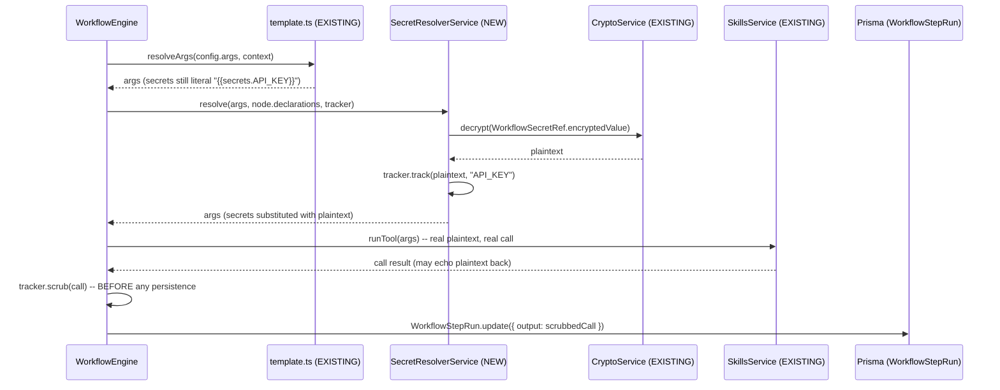
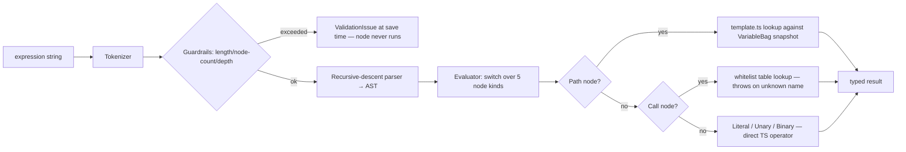

# Orlixa Workflow System — Phase 6: Variables, Secrets & Expressions

**Document set:** `docs/architecture/workflow-system/` · **Phase:** 6 of 15 · **Version:** 1.0 · **Date:** 2026-08-01
**Read first:** `00-overview-and-canonical-contracts.md` (normative — §0.7 fixes every name used here)
**Status:** Design approved for implementation · **Audience:** senior/staff engineers implementing this

---

## 6.0 Scope, status & design decisions

### 6.0.1 Purpose of this phase

Today a workflow run threads exactly one thing between nodes: `WorkflowRun.context`, an untyped
`Record<string, unknown>` (`apps/api/src/modules/workflows/engine/workflow-engine.service.ts:321-324`).
A node writes to it via `node.config.outputKey` (`workflow-engine.service.ts:545-551`) and reads from
it via `{{a.b.c}}` templates (`engine/template.ts`). That is sufficient for a handful of node types
chained in a line; it breaks down the moment a company wants a workflow-level default, a
company-wide constant reused by twenty workflows, a value that must never appear in a log line, or a
node that needs to compute something (`total * taxRate`) rather than just move a string around.

This phase adds a **typed variable system** (scopes, declarations, secrets, expressions) that layers
on top of `context` without changing its shape, without changing the `{{a.b.c}}` template resolver,
and without changing the `outputKey` convention any existing node relies on. Every canonical name used
below (`VariableScope`, `VariableType`, `VariableDeclaration`) is fixed by doc 00 §0.7.1/§0.7.2 and is
used here verbatim, not redefined.

### 6.0.2 EXISTING / EXTEND / NEW at a glance

| Element | Status | Where |
|---|---|---|
| `WorkflowRun.context: Json` | **EXISTING (KEEP)** | `schema.prisma:528` — unchanged shape, unchanged column |
| `{{a.b.c}}` template resolver (`lookup`, `resolveTemplate`, `resolveArgs`) | **EXISTING (KEEP)** | `engine/template.ts` — zero changes |
| `node.config.outputKey` → `context[outputKey]` convention | **EXISTING (KEEP)**, layered under §6.4 | `workflow-engine.service.ts:545-551` |
| `NodeExecutionResult.contextValue` / `.variableWrites` | **EXISTING contract (doc 00 §0.7.2)** | already canonical; `.variableWrites` is what this phase implements |
| `VariableScope`, `VariableType`, `VariableDeclaration`, `WorkflowDefinition.variables?` | **EXISTING contract (doc 00 §0.7.1/§0.7.2)** | canonical; not redefined here |
| `CryptoService` (AES-256-GCM envelope, HMAC sign/verify) | **EXISTING (KEEP)** | `common/crypto/crypto.service.ts` — reused verbatim for secrets |
| `VariableBag` | **NEW** (name reserved by doc 00 §0.7.2 as a field type, body not yet specified) | this doc, §6.1.7 — flagged for promotion |
| `WorkflowVariable` table | **NEW** (table name already reserved in doc 00 §0.7.3 legend) | this doc, §6.1.5 |
| `WorkflowSecretRef` table | **NEW** (table name already reserved in doc 00 §0.7.3 legend) | this doc, §6.2.5 |
| `engine/variables/variable-resolver.service.ts`, `expression.ts`, `secret-resolver.service.ts` | **NEW** (paths already reserved in doc 00 §0.7.4) | this doc |
| `SET_VARIABLE`, `TRANSFORM` node types | **NEW** (already reserved in doc 00 §0.7.1 `NodeType`) | this doc, §6.4 |

### 6.0.3 Mapping the brief's terms onto the design

The brief lists eight terms. They are not eight independent mechanisms — they are eight *scopes and
roles* of one variable system, plus one cross-cutting evaluator:

| Brief term | `VariableScope` value | Major section |
|---|---|---|
| Workflow Variables | `WORKFLOW` | §6.1 |
| Global Variables | `GLOBAL` | §6.1 |
| Temporary Variables | `RUNTIME` | §6.1 |
| Environment Variables | `ENVIRONMENT` | §6.1 |
| Runtime Variables | `RUNTIME` (same as Temporary — one scope, one name, see §6.1.10) | §6.1 |
| Secrets | `SECRET` | §6.2 |
| Outputs | `OUTPUT` | §6.4 |
| Expressions | *(not a scope — the evaluator that reads/writes them)* | §6.3 |

### 6.0.4 The three design problems, answered up front

**(a) Layering a typed system over an untyped `context` without breaking `{{a.b.c}}` or `outputKey`.**
Every scope except `SECRET` is materialised as an ordinary nested object under one reserved top-level
key, `context.vars`. Because `lookup()` (`template.ts:12-29`) is a generic dotted-path walker with no
knowledge of what a "scope" is, `{{vars.workflow.retryLimit}}` and `{{trigger.candidateName}}` are
*the same kind of lookup* to the resolver — zero changes to `template.ts`. `SECRET` is the one scope
deliberately kept **out** of `context` entirely (§6.2). `outputKey` keeps writing to a top-level
`context[key]` exactly as it does today (§6.4) — it does not move into `context.vars` and nothing
requires it to.

**(b) Secrets must never reach `WorkflowRun.context`, `WorkflowStepRun.input/output`, or logs.**
Solved with taint tracking, not key-name heuristics: every plaintext secret value resolved during a
node attempt is registered in a per-attempt tracker; every object about to be persisted or logged is
scrubbed by substring match against that tracker before it leaves memory. Key-based redaction (hiding
anything under a field literally named `apiKey`) is not enough because a secret can flow into any
field (an `Authorization` header, a URL query string, an email body) — see §6.2.10 for the concrete
exploit this closes in `execToolAction`'s existing dry-run path.

**(c) A safe expression evaluator — no `eval`, no `new Function`.** A fixed-grammar, hand-written
recursive-descent parser producing a bounded AST of five node kinds (literal, path, unary, binary,
call), evaluated by a `switch` over those five kinds. There is no way to define a function, no loop
construct, no assignment inside an expression, and no way to reach outside the whitelisted function
table — see §6.3.3 for the full grammar.

---

## 6.1 Typed variable scopes & the context-layering model

### 6.1.1 Purpose

Give every value flowing through a run a **declared scope, type, and lifetime**, so a node author
knows exactly where a value comes from and how long it lives, while the actual runtime carrier stays
the existing `context: Record<string, unknown>`.

### 6.1.2 Responsibilities

- Define the five non-secret scopes' storage location, lifetime, and write permissions.
- Populate `context.vars.*` at run start (fresh run) and on resume, before the first node executes.
- Validate a run's declared `INPUT` variables against the trigger payload (type + `required`).
- Expose a `VariableBag` per node attempt that is the *only* sanctioned way a `NodeDefinition.execute`
  reads or writes a scoped variable (§0.7.2's `NodeExecutionInput.variables` field).
- Own the two new company-wide tables (`WorkflowVariable`, `WorkflowSecretRef`) and their admin API.

### 6.1.3 Architecture

```
WorkflowRun.context  (Json, EXISTING column, EXISTING shape)
{
  trigger: {...},        ← EXISTING, unchanged (Steps still template {{trigger.x}})
  <outputKey>: ...,      ← EXISTING, unchanged (§6.4 back-compat)
  vars: {                ← NEW reserved key, owned by this phase
    input:       { [declaredKey]: value },   // VariableScope INPUT
    workflow:    { [declaredKey]: value },   // VariableScope WORKFLOW
    global:      { [key]: value },           // VariableScope GLOBAL   (snapshot at run start)
    environment: { [key]: value },           // VariableScope ENVIRONMENT (snapshot at run start)
    runtime:     { [key]: value },           // VariableScope RUNTIME  (mutable all run long)
    output:      { [key]: value }            // VariableScope OUTPUT   (the run's declared result)
  }
  // NOTE: no `vars.secret` — SECRET values are never written into context. See §6.2.
}
```

`VariableResolverService.seed(run, definition)` builds `context.vars` once, at the same two call sites
that already build/restore `context` today — `WorkflowEngine.run()`'s fresh-start branch
(`workflow-engine.service.ts:321-324`) and its resume branch (`:265-268`, which restores a persisted
`context` verbatim, so `vars.*` restores for free with no extra code). Precedence when seeding:

1. `GLOBAL`/`ENVIRONMENT` — read from `WorkflowVariable` (company-wide row, `workflowId IS NULL`),
   overridden by a workflow-scoped row (`workflowId = this workflow`) if one exists for the same key.
2. `WORKFLOW` — each `VariableDeclaration` (`scope:'WORKFLOW'`) on `WorkflowDefinition.variables`
   contributes its `default`.
3. `INPUT` — each `VariableDeclaration` (`scope:'INPUT'`) is read from the run's trigger payload
   (`run.trigger[key]`); missing + `required:true` → the run fails validation before node 1 (§6.1.10);
   missing + optional → falls back to `default`.
4. `RUNTIME`, `OUTPUT` — start empty; populated only by `SET_VARIABLE`/`TRANSFORM`/`variableWrites`
   during the run (§6.4).

`GLOBAL`/`ENVIRONMENT` are **snapshotted** at run start, not live-read per node: a run's variable
values are fixed for its own lifetime, so replaying/inspecting a completed run later shows exactly what
it saw, and one node's `{{vars.global.x}}` can't observe a value another concurrent run just changed —
this mirrors ADR-002's "immutable, pinned per run" philosophy applied to variables instead of the graph.

### 6.1.4 Flow diagram

```mermaid
flowchart TD
    A[Run starts / resumes] --> B{Fresh or resume?}
    B -- fresh --> C[VariableResolverService.seed]
    B -- resume --> D[context restored verbatim from WorkflowRun.context incl. vars.*]
    C --> E[Load WorkflowVariable rows: GLOBAL + ENVIRONMENT, company-wide + workflow override]
    E --> F[Apply WORKFLOW defaults from WorkflowDefinition.variables]
    F --> G[Validate + apply INPUT from run.trigger]
    G --> H[context.vars.runtime = {}, context.vars.output = {}]
    H --> I[Node attempt N executes with a VariableBag view over context]
    I --> J{Node writes a variable?}
    J -- yes, RUNTIME/OUTPUT --> K[VariableBag.set → context.vars.runtime|output mutated]
    J -- no --> L[continue]
    K --> M[WorkflowStepRun persisted; context persisted on pause/complete/fail]
    D --> I
```

### 6.1.5 Database design

```prisma
/// NEW. Company-wide (workflowId null) or workflow-scoped GLOBAL/ENVIRONMENT values. WORKFLOW-scope
/// values are NOT stored here — they live as `default` on WorkflowDefinition.variables (versioned,
/// immutable per ADR-002). RUNTIME/INPUT/OUTPUT are NEVER stored here — they are per-run and live only
/// in WorkflowRun.context.vars.*.
model WorkflowVariable {
  id              String       @id @default(cuid())
  companyId       String
  company         Company      @relation(fields: [companyId], references: [id], onDelete: Cascade)
  /// null = company-wide default; set = overrides the company-wide value for this one workflow.
  workflowId      String?
  workflow        Workflow?    @relation(fields: [workflowId], references: [id], onDelete: Cascade)
  /// App-enforced: only GLOBAL | ENVIRONMENT are valid here (reuses the canonical VariableScope enum
  /// rather than minting a narrower one — doc 00 §0.7.1 is the one source of truth for this enum).
  scope           VariableScope
  key             String
  type            VariableType
  value           Json
  description     String?
  updatedByUserId String?
  createdAt       DateTime     @default(now())
  updatedAt       DateTime     @updatedAt

  @@unique([companyId, workflowId, scope, key])
  @@index([companyId])
}
```

Both `VariableScope` and `VariableType` become **real Prisma enums** in this migration (today they
exist only as the TS types doc 00 §0.7.1 defines — `schema.prisma` has neither, verified by a full
read of the file). `WorkflowDefinition.variables` needs no schema change: it is `Json` inside
`Workflow.definition` already (doc 00 §0.7.2's `WorkflowDefinition.variables?: VariableDeclaration[]`
is a TS-level addition to an already-`Json` column).

No migration touches `WorkflowRun` or `WorkflowStepRun` — `vars.*` lives inside their existing `Json`
columns. This is deliberate: the two highest-write-volume tables in the system (10M node-attempts/day,
doc 00 §0.8) get zero new columns, zero new indexes, and zero write-path changes from this phase.

### 6.1.6 API design

All routes tenant-scoped by `companyId` (JWT), `@UseGuards(JwtAuthGuard, RolesGuard)` — the exact
pattern `WorkflowsController`/`ApprovalsController` already use.

| Method | Path | Roles | Notes |
|---|---|---|---|
| `GET` | `/workflow-variables?workflowId=&scope=` | any member | list GLOBAL/ENVIRONMENT rows (company-wide + optionally one workflow's overrides) |
| `POST` | `/workflow-variables` | `OWNER`,`ADMIN` | `{ scope: 'GLOBAL'\|'ENVIRONMENT', key, type, value, workflowId?, description? }` |
| `PATCH` | `/workflow-variables/:id` | `OWNER`,`ADMIN` | update `value`/`description`/`type` |
| `DELETE` | `/workflow-variables/:id` | `OWNER`,`ADMIN` | |
| `GET` | `/workflows/:id/variables` | any member | resolved view: declared `WorkflowDefinition.variables` + effective `GLOBAL`/`ENVIRONMENT` values, for the builder's variable-inspector panel |

### 6.1.7 TypeScript interfaces

```ts
/**
 * NEW — the per-node-attempt view over context.vars a NodeDefinition.execute
 * receives as NodeExecutionInput.variables (doc 00 §0.7.2 already names this
 * field's TYPE; this is its first full definition — flagged for promotion into
 * doc 00 §0.7.2 verbatim).
 */
export interface VariableBag {
  /** Typed read. Returns undefined if unset; does NOT throw on a missing key. */
  get<T = unknown>(scope: VariableScope, key: string): T | undefined;
  has(scope: VariableScope, key: string): boolean;
  /**
   * Only RUNTIME and OUTPUT are writable from inside a running node — WORKFLOW/
   * GLOBAL/ENVIRONMENT/INPUT are read-only at execution time (mutating them is
   * an admin-API action, §6.1.6, deliberately outside the run's blast radius —
   * see §6.1.11). Writing SECRET here is a programming error (throws) — see §6.2.
   */
  set(scope: 'RUNTIME' | 'OUTPUT', key: string, value: unknown): void;
  /** Read-only snapshot of everything currently resolvable, keyed by scope then key. */
  snapshot(): Readonly<Record<VariableScope, Record<string, unknown>>>;
}

/** NEW — builds/restores context.vars and constructs the VariableBag for a node attempt. */
export interface VariableResolverService {
  /** Called once per run (fresh start) — see §6.1.3 precedence order. */
  seed(
    run: { companyId: string; workflowId: string; trigger: Record<string, unknown> },
    definition: WorkflowDefinition,
  ): Promise<Record<string, unknown>>; // returns the vars object to merge into context
  /** Constructs the per-attempt VariableBag from the run's live context. */
  bagFor(context: Record<string, unknown>): VariableBag;
  /** Validates declared INPUT variables against a trigger payload; throws with all failures listed. */
  validateInputs(
    declarations: VariableDeclaration[],
    trigger: Record<string, unknown>,
  ): void;
}
```

### 6.1.8 JSON examples

`WorkflowDefinition.variables` (declared on the graph, immutable once the version publishes):

```json
{
  "variables": [
    { "key": "candidateName", "scope": "INPUT", "type": "string", "required": true },
    { "key": "minScore", "scope": "WORKFLOW", "type": "number", "default": 70 },
    { "key": "region", "scope": "ENVIRONMENT", "type": "string", "default": "us-east-1" },
    { "key": "finalDecision", "scope": "OUTPUT", "type": "string", "description": "APPROVE|REJECT" }
  ]
}
```

Resulting `WorkflowRun.context` (excerpt, mid-run, after one `SET_VARIABLE` node):

```json
{
  "trigger": { "candidateName": "Aisha Khan" },
  "vars": {
    "input": { "candidateName": "Aisha Khan" },
    "workflow": { "minScore": 70 },
    "global": { "companyName": "Kashif Recruiting" },
    "environment": { "region": "us-east-1" },
    "runtime": { "score": 82 },
    "output": {}
  }
}
```

`POST /workflow-variables` request:

```json
{ "scope": "GLOBAL", "key": "companyName", "type": "string", "value": "Kashif Recruiting" }
```

### 6.1.9 Folder structure

```
apps/api/src/modules/workflows/engine/variables/     NEW — Phase 6 (paths reserved by doc 00 §0.7.4)
├── variable-resolver.service.ts    seed() / bagFor() / validateInputs()
├── variable-bag.ts                 VariableBag implementation (plain object + scope guard)
├── workflow-variables.service.ts   CRUD for WorkflowVariable (admin API, §6.1.6)
├── workflow-variables.controller.ts
└── dto/
    └── upsert-variable.dto.ts
```

### 6.1.10 Edge cases

- **"Runtime" vs "Temporary"** (brief lists both): one scope, one name — `RUNTIME`. Calling it both in
  product copy is fine; the canonical enum has one value, per doc 00 §0.7.1. Do not introduce a second
  `TEMPORARY` scope value.
- **`INPUT` validation failure.** A `required` INPUT variable missing from the trigger payload fails
  the run *before node 1 executes*, with a `VALIDATION_ERROR` `RunFailureClass` (doc 00 §0.7.1) and a
  message listing every missing/mistyped key at once (not just the first) — mirrors
  `definition-validator.ts`'s existing "collect all issues" ethos, not `execCondition`'s throw-on-first.
- **A key collides across scopes** (e.g. `minScore` declared both WORKFLOW and set via `SET_VARIABLE`
  into RUNTIME). No conflict: they live at different paths (`vars.workflow.minScore` vs
  `vars.runtime.minScore`) and a template must say which one it means. This is intentional —
  unqualified single-namespace lookup (like shell variable shadowing) is exactly the ambiguity this
  design avoids.
- **A workflow with no declared variables at all** (every workflow today). `seed()` still runs, but
  every `vars.*` object is `{}` except possibly `global`/`environment` (company-wide values exist
  independent of any one workflow declaring them). Zero behavioural change for existing workflows that
  never reference `{{vars....}}` anywhere.
- **Resume path.** Because `vars` is just more content inside the already-persisted `context` Json, a
  `WAITING` run resumed days later (Phase 5/8) restores its exact variable snapshot with no extra code
  — verified against the existing resume branch, `workflow-engine.service.ts:265-268`, which restores
  `context` verbatim.
- **`GLOBAL`/`ENVIRONMENT` changed mid-run.** Since these are snapshotted at seed time (§6.1.3), an
  admin editing a `WorkflowVariable` row never affects an in-flight run — only runs started after the
  edit. Document this explicitly in the admin UI ("takes effect on the next run").

### 6.1.11 Security

- Mutating `GLOBAL`/`ENVIRONMENT`/`WORKFLOW`-declaration values is an **admin-API-only** action
  (`OWNER`/`ADMIN`, §6.1.6) — a running node can never rewrite a company-wide constant for every other
  workflow. This closes off a real blast-radius concern: without this boundary, a compromised or buggy
  workflow could silently corrupt shared configuration read by unrelated workflows.
- `WorkflowVariable.value` is `Json`, **plaintext at rest** — this table is explicitly for *non-secret*
  config (a base URL, a feature flag, a default threshold). Anything credential-shaped belongs in
  `WorkflowSecretRef` (§6.2), never here. The API layer should reject values that look like credentials
  (a lightweight heuristic warning, not a hard block, mirrors `CryptoService.isWeakKey`'s
  pattern-detection style at `crypto.service.ts:160-178`) — advisory, not enforced, since false
  positives on a legitimate non-secret value would be worse than the risk.
- RLS (ADR-005): `WorkflowVariable` is not on the high-volume execution path Phase 12 targets for RLS,
  but nothing prevents adding the same policy — flagged as a cheap follow-on, not required for Phase 6.

### 6.1.12 Performance

- `seed()` runs once per run (not per node) — one query for `WorkflowVariable` rows (indexed on
  `companyId`, filtered further by `workflowId IN (null, thisWorkflow)` client-side or via `OR`), not
  once per node-attempt. At the 10M node-attempts/day target (doc 00 §0.8) this is the difference
  between ~1 extra query per run (cheap) and ~1 extra query per node (not cheap).
  `bagFor()` is a pure in-memory wrapper — zero I/O per node.
- Recommended: an in-process, short-TTL (30s) cache of `WorkflowVariable` rows keyed by `companyId`,
  invalidated on write — company-wide values are read far more often than written.

### 6.1.13 Scalability

Because `vars.*` rides inside the existing `WorkflowRun.context`/`WorkflowStepRun.input/output` Json
columns, this phase adds **zero new columns to the two tables Phase 12 will partition for scale**. The
only new tables (`WorkflowVariable`, `WorkflowSecretRef`) are company-config tables — row counts in the
tens to low thousands per company, not per-run — so they need none of Phase 12's partitioning story.

### 6.1.14 Future extension

- A workflow-builder "variable inspector" panel that shows, per node, exactly which `vars.*` paths are
  in scope and their current declared type — a pure UI feature reading `WorkflowDefinition.variables` +
  `GET /workflows/:id/variables` (§6.1.6), no engine change.
- Per-key access control on `GLOBAL` variables (e.g. "only Finance workflows may read `budgetCeiling`")
  — deferred until Phase 9's department/team permission model exists to hang it on.

### 6.1.15 Best practices

- Prefer `WORKFLOW`-scope defaults over hardcoding a literal in five different node configs — one
  declaration, one place to change it, and the builder can render it as a form field.
  See CLAUDE.md style: prefer the simplest form that is still typed, not the cleverest one.
- Never introduce a second, ad-hoc "globals" mechanism (e.g. a magic `context.config` key some node
  writes by convention) — `WorkflowVariable` is the one company-wide store; a second one is exactly the
  kind of undocumented convention this phase exists to replace.

---

## 6.2 Secrets & the redaction boundary

### 6.2.1 Purpose

Let a workflow reference a credential-shaped value (an API key, a bearer token, a webhook signing
secret) **without that value ever being written to `WorkflowRun.context`, `WorkflowStepRun.input`,
`WorkflowStepRun.output`, `WorkflowRun.error`/`WorkflowStepRun.error`, or any log line** — even though
the tool call that uses it necessarily needs the real plaintext value at the moment it executes.

### 6.2.2 Responsibilities

- Store secret material encrypted at rest, reusing `CryptoService` exactly as `InstalledSkill`
  (`schema.prisma:432`, `credentials Json?`) and `ChatwootAccount`/`PlaneWorkspace` already do.
- Resolve `{{secrets.KEY}}` references to plaintext **only** in the narrow window between "about to
  call the tool" and "the tool call returned," never persisting the plaintext anywhere.
- Track every resolved plaintext value for the duration of one node attempt, and scrub it out of
  anything about to be persisted or logged — by value, not by field name.
- Let a secret be sourced either from a value the user typed into the builder (encrypted immediately)
  or from an already-connected skill's existing credentials (no duplicate copy).

### 6.2.3 Architecture

Two deliberate departures from §6.1's design:

1. **Secrets are never placed in `context`.** There is no `vars.secret.*`. A node config field that
   needs a secret writes the literal placeholder `{{secrets.API_KEY}}` (same `{{}}` delimiter as every
   other template, different namespace — `secrets` is reserved), and resolution happens in a
   **separate, later pass** than the generic `resolveTemplate`/`resolveArgs` call.
2. **Resolution is taint-tracked, not just decrypt-and-substitute.** `SecretResolverService.resolve()`
   returns both the substituted string *and* registers the plaintext in a `TaintTracker` scoped to that
   one node attempt. Every place that persists or logs step data runs its payload through
   `tracker.scrub(value)` first. This is what makes the guarantee "never in `WorkflowStepRun.output`"
   hold even when the *tool's own response* happens to echo the secret back (a real behaviour of some
   HTTP-mirroring APIs) — key-based redaction would miss that; value-based scrubbing does not.

Pipeline for a `TOOL_ACTION`/`HTTP_REQUEST` node (extends `execToolAction`,
`workflow-engine.service.ts:730-829`):

```
node.config.args (may contain {{secrets.X}})
        │  resolveArgs(args, context)          ← EXISTING, unchanged (template.ts)
        ▼
args with {{a.b.c}} resolved, {{secrets.X}} still literal
        │  secretResolver.resolve(args, declarations, tracker)   ← NEW pass
        ▼
args with {{secrets.X}} → real plaintext, tracker now holds that plaintext
        │  skills.runTool(..., args)            ← EXISTING, unchanged — gets the REAL value
        ▼
call result (may itself contain the plaintext, e.g. an echoing API)
        │  tracker.scrub(call) before ANY persistence or logging   ← NEW, mandatory
        ▼
WorkflowStepRun.input / .output / context[outputKey]   ← guaranteed secret-free
```

### 6.2.4 Flow diagram



### 6.2.5 Database design

```prisma
enum SecretSourceKind {
  INLINE                 // value typed into the builder, encrypted immediately
  CONNECTOR_CREDENTIAL   // points at an existing InstalledSkill's credentials — no duplicate secret
}

/// NEW. Never returns encryptedValue in any DTO (mirrors InstalledSkill.credentials' existing
/// "NEVER returned raw" convention, schema.prisma:429-432).
model WorkflowSecretRef {
  id                String            @id @default(cuid())
  companyId         String
  company           Company           @relation(fields: [companyId], references: [id], onDelete: Cascade)
  /// null = company-wide secret usable by any workflow; set = scoped to one workflow.
  workflowId        String?
  workflow          Workflow?         @relation(fields: [workflowId], references: [id], onDelete: Cascade)
  key               String            // referenced as {{secrets.<key>}}
  sourceKind        SecretSourceKind  @default(INLINE)
  /// INLINE only: CryptoService AES-256-GCM envelope, format "v1:iv:tag:ct" (crypto.service.ts:53-58).
  encryptedValue    String?
  /// CONNECTOR_CREDENTIAL only: reuse a field already inside InstalledSkill.credentials instead of
  /// storing a second copy of the same secret.
  installedSkillId  String?
  installedSkill    InstalledSkill?   @relation(fields: [installedSkillId], references: [id], onDelete: Cascade)
  credentialField   String?
  description       String?
  lastAccessedAt    DateTime?
  rotatedAt         DateTime?
  updatedByUserId   String?
  createdAt         DateTime          @default(now())
  updatedAt         DateTime          @updatedAt

  @@unique([companyId, workflowId, key])
  @@index([companyId])
}
```

`InstalledSkill` gains the mechanical inverse relation `workflowSecretRefs WorkflowSecretRef[]`
(EXTEND — additive, no column change on the existing table).

### 6.2.6 API design

| Method | Path | Roles | Notes |
|---|---|---|---|
| `GET` | `/workflow-secrets?workflowId=` | any member | **keys + metadata only** — `encryptedValue` never serialised |
| `POST` | `/workflow-secrets` | `OWNER`,`ADMIN` | `{ key, sourceKind, value? , installedSkillId?, credentialField?, workflowId? }` — `value` (plaintext) is accepted on the wire over TLS, encrypted immediately server-side, and never echoed back |
| `PATCH` | `/workflow-secrets/:id` | `OWNER`,`ADMIN` | rotate `value`; updates `rotatedAt` |
| `DELETE` | `/workflow-secrets/:id` | `OWNER`,`ADMIN` | fails with 409 if any `PUBLISHED` `WorkflowVersion` still references this key (mirrors the spirit of "don't silently break a live workflow") |

### 6.2.7 TypeScript interfaces

```ts
/** NEW — tracks plaintext secret values resolved during ONE node attempt. */
export interface TaintTracker {
  track(plaintext: string, declaredKey: string): void;
  /** Deep-scrubs every tracked plaintext occurrence (including as a substring) with [REDACTED:<key>]. */
  scrub<T>(value: T): T;
  /** True if `value` contains any tracked plaintext — used to gate a preview/log before scrub. */
  isTainted(value: unknown): boolean;
}

/** NEW — resolves {{secrets.X}} placeholders; the ONLY code path allowed to call CryptoService.decrypt
 *  for a WorkflowSecretRef. */
export interface SecretResolverService {
  resolve(
    args: Record<string, unknown>,
    context: { companyId: string; workflowId: string },
    tracker: TaintTracker,
  ): Promise<Record<string, unknown>>;
}
```

### 6.2.8 JSON examples

Node config referencing a secret (never resolved server-side response, only ever in the builder):

```json
{
  "type": "TOOL_ACTION",
  "config": {
    "skillKey": "http",
    "tool": "request",
    "args": {
      "url": "https://api.example.com/v1/candidates",
      "headers": { "Authorization": "Bearer {{secrets.EXAMPLE_API_KEY}}" }
    },
    "outputKey": "apiResponse"
  }
}
```

Persisted `WorkflowStepRun.input` for that same step (guaranteed scrubbed):

```json
{
  "skillKey": "http",
  "tool": "request",
  "args": {
    "url": "https://api.example.com/v1/candidates",
    "headers": { "Authorization": "Bearer [REDACTED:EXAMPLE_API_KEY]" }
  }
}
```

`POST /workflow-secrets` request/response (value never echoed):

```json
// request
{ "key": "EXAMPLE_API_KEY", "sourceKind": "INLINE", "value": "sk_live_...", "workflowId": null }
// response
{ "id": "wsr_9f2c", "key": "EXAMPLE_API_KEY", "sourceKind": "INLINE", "workflowId": null,
  "createdAt": "2026-08-01T09:00:00.000Z", "rotatedAt": null }
```

### 6.2.9 Folder structure

```
apps/api/src/modules/workflows/engine/variables/     NEW — Phase 6 (shared with §6.1)
├── secret-resolver.service.ts     {{secrets.X}} resolution — the only CryptoService.decrypt call site
├── taint-tracker.ts               TaintTracker implementation
├── workflow-secrets.service.ts    CRUD for WorkflowSecretRef (never returns encryptedValue)
├── workflow-secrets.controller.ts
└── dto/
    └── upsert-secret.dto.ts
```

### 6.2.10 Edge cases

- **VERIFIED, concrete leak in the current dry-run path.** `execToolAction`'s dry-run branch
  (`workflow-engine.service.ts:806-816`) builds `preview = { ok:true, dryRun:true, skillKey, tool,
  args, preview: ... }` from the **already-template-resolved** `args` and returns it as both `output`
  and `contextValue` — i.e. straight into `WorkflowStepRun.output` and `context[outputKey]`. If `args`
  had been resolved from a `SECRET`-scope value under today's (pre-Phase-6) code, the decrypted secret
  would land in persisted, queryable storage. This phase's fix: the secret-resolution pass (§6.2.3)
  runs *after* `resolveArgs` but the **dry-run preview must build from the pre-secret-resolution args**
  (or, if it needs the real call shape, from the post-resolution args passed through
  `tracker.scrub()`) — never from raw resolved args. Same fix applies to the real (non-dry-run) path at
  `:819-828`, where `call.result` could echo a secret back from a mirroring API.
- **Error messages.** `runNode`'s catch block persists `error: message` verbatim
  (`workflow-engine.service.ts:563-567`), and `WorkflowEngine.run`'s outer catch does the same for
  `WorkflowRun.error` (`:411-419`) — both **must** pass `message` through `tracker.scrub()` before
  persisting, and the `this.logger.error(...)` calls at the same sites need the scrubbed string too.
  A connector that includes request headers in its thrown error text is the realistic trigger.
- **Deleted `WorkflowSecretRef` still referenced by a `PUBLISHED` version.** Resolution fails the node
  with a clear `Secret "X" not found or was removed` error (`FAIL_RUN` by default) rather than
  silently substituting an empty string — an empty-string secret in an `Authorization` header is a
  worse failure mode (a call that "succeeds" against a different, wrong auth context) than a loud one.
- **A short/common secret value** (e.g. a 4-character test key) risks over-redaction of unrelated
  content that happens to contain the same substring. Mitigation: warn (not block) at secret-creation
  time when a value is under a minimum length (e.g. 8 chars).
- **`CONNECTOR_CREDENTIAL` secrets and connector rotation.** `InstalledSkill.credentials` can change
  (OAuth refresh, `docs §1.6-1.8` health lifecycle) independent of `WorkflowSecretRef` — resolution for
  `CONNECTOR_CREDENTIAL` always reads the *current* `InstalledSkill.credentials[credentialField]` at
  resolve time, never a cached copy, so a token refresh is picked up automatically.

### 6.2.11 Security

- `WorkflowSecretRef.encryptedValue` uses the exact existing envelope (`crypto.service.ts:47-59`,
  `v1:iv:tag:ct`, AES-256-GCM, fresh IV per encrypt) — no new crypto primitive introduced.
- `GET /workflow-secrets` (and every other secret-list surface, including the workflow builder's
  autocomplete for `{{secrets....}}`) returns **keys and metadata only**. This is the same discipline
  `InstalledSkill.credentials` already follows (schema.prisma:432 comment: "NEVER returned raw").
- Redaction is **value-based** (§6.2.3), not key-based, specifically because key-based redaction is
  known to miss secrets that flow through unnamed fields (URL query strings, request bodies, free-text
  error messages) — this is the single most important security property of this design and is called
  out three times in this document deliberately (here, §6.0.4(b), §6.2.10) because it is the one an
  implementer is likely to under-build (a `Set<string>` substring scan feels like "too much" until the
  first leaked secret in a support ticket proves otherwise).
- A `TaintTracker` is **per node-attempt**, created fresh and discarded after that attempt's
  persistence completes — it never accumulates secrets across steps or runs, bounding both memory and
  the blast radius of a bug in the tracker itself.
- Secrets are decrypted **lazily**, only for the specific `{{secrets.X}}` references present in the one
  node's config being executed right now — never "decrypt everything the workflow might use" up front.

### 6.2.12 Performance

Decryption is a single AES-GCM operation (microseconds) per referenced secret per node attempt — not
measurable against the cost of the tool call it enables. No caching of decrypted plaintext across
attempts (§6.2.11's "lazy, narrow-window" property takes priority over the performance gain of caching).

### 6.2.13 Scalability

`WorkflowSecretRef` row counts scale with distinct credentials, not with run volume — company-config
cardinality (tens per company), completely decoupled from the 10M-node-attempts/day execution path.

### 6.2.14 Future extension

- Per-key access control (only nodes owned by a specific AI Employee role may reference a given
  secret) — natural extension once Phase 9's permission model exists.
- Secret rotation reminders (`rotatedAt` older than N days) surfaced in the Approval/Audit UI —
  the column is already in the schema (§6.2.5) to support this without a further migration.
- Automatic secret-scanning of `WorkflowStepRun` rows written *before* this phase shipped, as a
  one-time backfill remediation job — out of scope for this phase, noted for the security team.

### 6.2.15 Best practices

- Never add a node config field literally named e.g. `apiKeyPlaintext` as a shortcut — always
  `{{secrets.KEY}}` through `WorkflowSecretRef`, even for a "just this once" internal test workflow.
- Prefer `CONNECTOR_CREDENTIAL` over `INLINE` whenever the secret is already an `InstalledSkill`'s
  credential — avoids a second copy of the same secret with its own independent rotation lifecycle.

---

## 6.3 The safe expression evaluator

### 6.3.1 Purpose

Give `SET_VARIABLE`/`TRANSFORM` (and, later, `CONDITION`'s successor) a way to **compute** a typed
value — arithmetic, string manipulation, boolean logic — from `context`, without arbitrary code
execution. Doc 00 §0.9 non-goal #2 is explicit: no `eval`, no `new Function`, no user-defined
functions, no loops.

### 6.3.2 Responsibilities

- Parse a fixed, bounded expression grammar (§6.3.3) with a hand-written tokenizer + recursive-descent
  parser — no dependency that itself wraps `eval`/`Function` (rules out most "template engine" npm
  packages without inspecting their internals).
- Evaluate the resulting AST against a `VariableBag` + the safe `lookup()` path resolver
  (`template.ts:12-29`, reused, not duplicated) plus a fixed whitelist of pure functions.
- Reject, at parse time, any expression exceeding bounded size/depth — before evaluation ever starts.
- Never accept the `{{ }}` delimiter as valid expression syntax (keeps the two languages visually and
  mechanically distinct — see §6.3.10).

### 6.3.3 Architecture — the grammar

```
expression      := ternary
ternary         := logicalOr ( '?' expression ':' expression )?
logicalOr       := logicalAnd ( ('||' | 'or') logicalAnd )*
logicalAnd      := equality ( ('&&' | 'and') equality )*
equality        := comparison ( ('==' | '!=') comparison )*
comparison      := additive ( ('>' | '>=' | '<' | '<=') additive )*
additive        := multiplicative ( ('+' | '-') multiplicative )*
multiplicative  := unary ( ('*' | '/' | '%') unary )*
unary           := ('!' | 'not' | '-')? primary
primary         := literal | path | call | '(' expression ')'
call            := IDENT '(' ( expression (',' expression)* )? ')'
path            := IDENT ('.' IDENT)*
literal         := STRING | NUMBER | 'true' | 'false' | 'null'
```

Five AST node kinds only: `Literal`, `Path`, `Unary`, `Binary`, `Call`. No `Assignment`, no `Block`, no
`Loop`, no `FunctionDef` node kind exists in the type system — so even a parser bug cannot accidentally
support one; the unsupported construct has no AST representation to parse *into*.

**Whitelisted call table** (fixed, implemented as a `Record<string, (...args) => value>` in TS — never
a dynamic `globalThis[name]` lookup):

| Category | Functions |
|---|---|
| String | `upper`, `lower`, `trim`, `len`, `concat`, `slice`, `join`, `split` |
| Value | `coalesce`, `default`, `toNumber`, `toString`, `toBoolean` |
| Number | `round` |
| Date | `now`, `formatDate` |
| JSON | `jsonParse`, `jsonStringify` |
| Comparison (reused from `EventConditionOp`, `conditions.ts`) | `eq`, `neq`, `gt`, `gte`, `lt`, `lte`, `contains`, `exists`, `in` |
| Boolean | `and`, `or`, `not` |

`path` resolution reuses `lookup()` (`template.ts:12-29`) verbatim — same prototype-pollution guard
(`__proto__`/`constructor`/`prototype` blocked), same behaviour, one implementation for both languages.

**Guardrails enforced at parse time, before any evaluation:** max source length (2,000 chars), max AST
node count (200), max nesting depth (20). Because there is no loop or recursion primitive reachable
from expression syntax, a parsed expression is guaranteed to evaluate in bounded time proportional to
its (already-bounded) node count — no evaluation timeout is needed, unlike a general-purpose sandbox.

### 6.3.4 Flow diagram



### 6.3.5 Database design

None. Expressions are strings inside `WorkflowNode.config` (already `Json` on the existing,
schema-less `Workflow.definition`) — no new column, no new table. This is a pure engine addition.

### 6.3.6 API design

No dedicated REST surface. Expressions are validated as part of the existing workflow save path
(`PATCH /workflows/:id`, `POST /workflows`) — `NodeDefinition.validate()` (doc 00 §0.7.2, Phase 2's
registry) calls into `expression.ts`'s `parse()` for any `SET_VARIABLE`/`TRANSFORM` node and surfaces a
parse error as a `ValidationIssue` (`severity:'ERROR'`), the same mechanism `definition-validator.ts`
already uses for duplicate-id/dangling-edge errors.

### 6.3.7 TypeScript interfaces

```ts
/** NEW — the five-kind AST. Deliberately closed (no index signature) so no sixth kind can be added
 *  without touching this type and every switch over it. */
export type ExpressionNode =
  | { kind: 'Literal'; value: string | number | boolean | null }
  | { kind: 'Path'; path: string }
  | { kind: 'Unary'; op: '!' | '-'; operand: ExpressionNode }
  | { kind: 'Binary'; op: BinaryOp; left: ExpressionNode; right: ExpressionNode }
  | { kind: 'Call'; name: WhitelistedFn; args: ExpressionNode[] };

export type BinaryOp =
  | '+' | '-' | '*' | '/' | '%'
  | '==' | '!=' | '>' | '>=' | '<' | '<='
  | '&&' | '||';

export type WhitelistedFn =
  | 'upper' | 'lower' | 'trim' | 'len' | 'concat' | 'slice' | 'join' | 'split'
  | 'coalesce' | 'default' | 'toNumber' | 'toString' | 'toBoolean' | 'round'
  | 'now' | 'formatDate' | 'jsonParse' | 'jsonStringify'
  | 'eq' | 'neq' | 'gt' | 'gte' | 'lt' | 'lte' | 'contains' | 'exists' | 'in'
  | 'and' | 'or' | 'not';

/** NEW — apps/api/.../engine/variables/expression.ts */
export interface ExpressionEngine {
  /** Throws a descriptive ParseError (no partial ASTs returned) on any grammar/guardrail violation. */
  parse(source: string): ExpressionNode;
  evaluate(ast: ExpressionNode, bag: VariableBag): unknown;
}
```

### 6.3.8 JSON examples

`TRANSFORM` node using expressions to reshape data (see §6.4 for the node config shape in full):

```json
{
  "type": "TRANSFORM",
  "config": {
    "scope": "RUNTIME",
    "outputKey": "summary",
    "mappings": {
      "fullName": "concat(vars.input.firstName, ' ', vars.input.lastName)",
      "isSenior": "vars.runtime.yearsExperience >= 5",
      "band": "vars.runtime.score >= vars.workflow.minScore ? 'PASS' : 'REVIEW'"
    }
  }
}
```

Evaluated result written to `context.vars.runtime.summary`:

```json
{ "fullName": "Aisha Khan", "isSenior": true, "band": "PASS" }
```

### 6.3.9 Folder structure

```
apps/api/src/modules/workflows/engine/variables/    NEW — shared with §6.1/§6.2
├── expression.ts             tokenizer + parser + evaluator + whitelist table (path reserved by doc 00 §0.7.4)
└── expression.spec.ts        grammar/guardrail unit tests
```

### 6.3.10 Edge cases

- **Never confuse `{{ }}` templates with bare expressions.** A `TransformNodeConfig.mappings` value is
  a bare expression string (`vars.runtime.score >= 70`), *not* wrapped in `{{}}`. If a user pastes
  `{{vars.runtime.score}}` into an expression field, `{` is not valid grammar at that position → a
  clear parse error at save time, not a silent misinterpretation. The two languages are kept visually
  distinguishable on purpose (§6.3.1) so this mistake surfaces immediately rather than at run time.
- **Division by zero / `NaN` propagation.** `/`/`%` by zero and any operation producing `NaN` returns
  `NaN` (JS semantics for the underlying operator) rather than throwing — but the AFTER-evaluation type
  check against the declared `VariableType` (§6.1) rejects a `NaN` written into a `number`-typed
  variable, surfacing the problem at the write, not silently downstream.
- **Unknown function name.** Rejected at *parse* time (the whitelist is checked while building the
  `Call` node, not deferred to evaluation) — an unrecognised `IDENT(...)` is a save-time `ValidationIssue`,
  never a runtime surprise.
- **A `SECRET`-scope path inside an expression** (`vars.secret.x` — which never exists, §6.2.3) simply
  resolves to `undefined` like any other missing path; there is no special-cased error, because there
  is genuinely nothing there to leak. Expressions have no access to secrets by construction.

### 6.3.11 Security

This is the direct implementation of doc 00 §0.9 non-goal #2. The security property to verify in
review is structural, not behavioural: **grep the implementation for `eval(`, `new Function(`,
`vm.` and `Function(` and confirm zero matches** — the grammar closedness (§6.3.3) is what makes that
grep meaningful rather than incidental.

### 6.3.12 Performance

Parsing a ≤2,000-character, ≤200-node expression is sub-millisecond. Recommended: cache the parsed
`ExpressionNode` AST per `(workflowVersionId, nodeId)` — the source string never changes within an
immutable published version (ADR-002), so re-parsing on every node attempt is pure waste.

### 6.3.13 Scalability

Stateless, pure-function evaluation — scales identically to however many node workers Phase 5 runs;
nothing here is a shared resource or contention point.

### 6.3.14 Future extension

Doc 00 §0.9 non-goal #2 explicitly reserves an **isolate-based** (e.g. `isolated-vm`) arbitrary-code
node as a possible *future*, separately-sandboxed capability, not a widening of this evaluator. If that
ever ships, it must be a distinct node type (e.g. a hypothetical `SCRIPT` node) gated by its own
permission and resource limits — this evaluator should stay exactly as closed as specified here even
after that exists, because most TRANSFORM use cases don't need it and shouldn't inherit its risk.

### 6.3.15 Best practices

- Keep `mappings`/expressions short and single-purpose; if an expression grows past a few functions
  deep, that is a signal the logic belongs in an `AI_STEP`/`AI_EMPLOYEE_STEP` node or a genuine code
  connector (Phase 4), not a bigger expression.
- Always give `coalesce`/`default` a fallback for any path that might be `undefined` — an expression
  referencing a variable that hasn't been set yet is a common authoring mistake; failing loudly with a
  clear "undefined value in expression" beats propagating `undefined` silently into a typed variable.

---

## 6.4 Outputs & node integration

### 6.4.1 Purpose

Specify exactly how a node's result becomes a variable — preserving the existing `outputKey` +
`contextValue` convention verbatim for the 8 existing node types, while giving new node types
(`SET_VARIABLE`, `TRANSFORM`, `MEMORY_READ`, etc. — Phase 7) a typed, scope-aware equivalent via
`NodeExecutionResult.variableWrites` (already canonical, doc 00 §0.7.2).

### 6.4.2 Responsibilities

- Keep `runNode`'s existing `outputKey` write path (`workflow-engine.service.ts:545-551`) working
  unchanged for `RETRIEVE`, `AI_STEP`, `TOOL_ACTION` (the three existing node types that use it).
- Define how `NodeExecutionResult.variableWrites` gets merged into `context.vars.*` for new node types.
- Define the `OUTPUT` scope's role as "the run's declared result," surfaced back through the API.
- Ship `SET_VARIABLE` and `TRANSFORM` (doc 00 §0.7.1 `NodeType`, both already reserved).

### 6.4.3 Architecture

Two write paths, both landing in the same `context`, coexisting permanently — this is not a
migration-then-deprecate story, because ADR-004 forbids changing the 8 existing node types' semantics:

```
Path 1 (EXISTING, unchanged) — RETRIEVE / AI_STEP / TOOL_ACTION
  NodeResult.contextValue  --[if node.config.outputKey set]-->  context[outputKey] = contextValue
  (workflow-engine.service.ts:545-551 — top-level key, NOT under vars.*)

Path 2 (NEW) — SET_VARIABLE / TRANSFORM / MEMORY_* / KNOWLEDGE_WRITE (Phase 7)
  NodeExecutionResult.variableWrites: { [scope]: { [key]: value } }
  --> for each (scope, key, value): VariableBag.set(scope, key, value)
  --> context.vars[scope][key] = value
```

A NEW node MAY also declare a plain `outputKey` field as **sugar** for
`variableWrites: { RUNTIME: { [outputKey]: value } }` — this keeps the builder's familiar "output key"
text field usable for new node types too, while the underlying mechanism is uniformly the typed
variable system. This sugar is implemented once, in the shared node-result handler Phase 2's
`NodeRegistry` calls after every `execute()`, not duplicated per node.

### 6.4.4 Flow diagram

```mermaid
flowchart TD
    A[Node execute returns NodeExecutionResult] --> B{contextValue present AND config.outputKey set?}
    B -- yes --> C["context[outputKey] = contextValue  (EXISTING path, unchanged)"]
    B -- no --> D{variableWrites present?}
    D -- yes --> E[For each scope/key: VariableBag.set]
    E --> F[context.vars[scope][key] = value]
    D -- no --> G{outputKey present, no contextValue, but a computed value exists? (new-node sugar)}
    G -- yes --> H["variableWrites = { RUNTIME: { [outputKey]: value } } then apply as above"]
    G -- no --> I[No variable written — output still recorded on WorkflowStepRun.output regardless]
    C --> Z[WorkflowStepRun.output persisted either way]
    F --> Z
    H --> Z
    I --> Z
```

### 6.4.5 Database design

None beyond §6.1/§6.2 — `OUTPUT` scope values live in `context.vars.output`, inside the existing
`WorkflowRun.context` column. The one addition: `WorkflowRunDto` (API-facing) gains a **derived** field
(`output`, see §6.4.6) computed by the mapper, not stored separately — no schema change.

### 6.4.6 API design

`WorkflowRunDto` (EXTEND, additive field — existing consumers unaffected):

```ts
export interface WorkflowRunDto {
  // ...all existing fields, unchanged...
  /** NEW — derived from context.vars.output at read time. {} if the run declares no OUTPUT variables. */
  output: Record<string, unknown>;
}
```

No new endpoint required — `GET /workflows/runs/:runId` (existing route,
`workflows.controller.ts:85-91`) already returns `WorkflowRunDto`; the mapper starts populating the new
field.

### 6.4.7 TypeScript interfaces

```ts
/** NEW — doc 00 §0.7.1 already reserves the NodeType value; this is its config shape. */
export interface SetVariableNodeConfig {
  scope: 'RUNTIME' | 'OUTPUT';
  key: string;
  /** Evaluated by the §6.3 expression engine — NOT a {{}} template. */
  expression: string;
}

/** NEW — doc 00 §0.7.1 already reserves the NodeType value; this is its config shape. */
export interface TransformNodeConfig {
  scope: 'RUNTIME' | 'OUTPUT';
  outputKey: string;
  /** Each value is a §6.3 expression; the result is an object built from these keys. */
  mappings: Record<string, string>;
}
```

### 6.4.8 JSON examples

`SET_VARIABLE` node declaring the run's final output:

```json
{
  "id": "n7",
  "type": "SET_VARIABLE",
  "config": { "scope": "OUTPUT", "key": "finalDecision", "expression": "vars.runtime.band" }
}
```

`GET /workflows/runs/:runId` response (excerpt), showing the new `output` field alongside every
existing field unchanged:

```json
{
  "id": "run_1",
  "status": "COMPLETED",
  "context": { "trigger": {}, "vars": { "output": { "finalDecision": "PASS" } } },
  "output": { "finalDecision": "PASS" }
}
```

### 6.4.9 Folder structure

```
apps/api/src/modules/workflows/engine/nodes/        Phase 2's registry (referenced, not owned here)
├── set-variable.node.ts     NEW — uses VariableBag + ExpressionEngine from engine/variables/
└── transform.node.ts        NEW — same

apps/api/src/modules/workflows/engine/variables/    NEW — Phase 6, shared across §6.1-§6.4
└── apply-variable-writes.ts  the one shared "apply NodeExecutionResult → context" function
```

### 6.4.10 Edge cases

- **A `TOOL_ACTION` node ALSO wants to write a `WORKFLOW`-typed variable, not just `outputKey`.**
  Not supported in v1 — `contextValue`/`outputKey` remains a plain untyped write for the 8 existing
  node types (ADR-004: identical runtime semantics). If a workflow needs a typed variable from a tool
  result, chain a `SET_VARIABLE` node immediately after, reading `{{apiResponse.field}}` via the
  existing template resolver into an expression. This is slightly more verbose but adds zero risk to
  the 8 existing types' stability.
- **`OUTPUT` written more than once in one run** (e.g. two different branches each set
  `finalDecision`). Last-write-wins, same as any `context` mutation today — no special merge logic.
  If a workflow author needs both branches' outputs, they should use different `OUTPUT` keys.
- **A run has no `SET_VARIABLE`/`TRANSFORM` node at all** (every existing workflow). `output` on
  `WorkflowRunDto` is simply `{}` — no behavioural change, no error, existing UI code reading other
  fields is unaffected by the new field's presence.

### 6.4.11 Security

`variableWrites` for `RUNTIME`/`OUTPUT` never touches `SECRET` — `VariableBag.set()`'s type signature
(§6.1.7) statically excludes `SECRET` as a settable scope, so a node cannot "launder" a secret into a
persisted, non-redacted variable by routing it through `variableWrites` instead of a tool call
argument. (A node *could* still try to pass a resolved secret string through
`expression`/`mappings` — the `TaintTracker` scrub (§6.2.3) applies to `WorkflowStepRun.output`
regardless of which write path produced it, so this is covered structurally, not by trusting the node
author's intent.)

### 6.4.12 Performance

Identical cost profile to today's `outputKey` write (`workflow-engine.service.ts:549-551`) — an
in-memory object assignment. `variableWrites` adds, at most, a small fixed number of extra assignments
per node attempt; not measurable against node execution cost (LLM calls, tool calls, DB queries).

### 6.4.13 Scalability

No new tables, no new indexes — scales exactly as the existing `context` write path already does.

### 6.4.14 Future extension

`SUB_WORKFLOW` (doc 00 §0.7.1, reserved `NodeType`, owned by Phase 2) will need a way to pass a
sub-workflow's `OUTPUT` variables back to the caller's `RUNTIME` scope — this phase's `OUTPUT` scope is
designed to be that hand-off point (a sub-workflow's `context.vars.output` becomes the caller's
`SUB_WORKFLOW` node result) without further schema change; Phase 2 should wire this, not redesign it.

### 6.4.15 Best practices

- New node types should default to `variableWrites` over the `outputKey` sugar once the builder UI
  supports scope selection — the sugar exists for authoring-experience continuity, not because it's the
  preferred long-term mechanism.
- Declare an `OUTPUT` variable for any workflow whose result another system (or a human reading the
  run list) needs to consume — an undeclared implicit "look at the last node's output" convention is
  exactly the ambiguity `OUTPUT` scope exists to remove.

---

## 6.5 Promotions into doc 00 §0.7

Per the hard rule ("anything new must be marked NEW and flagged for promotion into doc 00"), the
following symbols are introduced in this document and should be folded into doc 00 §0.7.2 verbatim on
next revision:

- `VariableBag` interface (§6.1.7) — doc 00 already references the *name* as a field type
  (`NodeExecutionInput.variables: VariableBag`) but does not yet define its body.
- `ExpressionNode`, `BinaryOp`, `WhitelistedFn`, `ExpressionEngine` (§6.3.7).
- `TaintTracker`, `SecretResolverService` interfaces (§6.2.7).
- `SetVariableNodeConfig`, `TransformNodeConfig` (§6.4.7) — the config shapes for the two `NodeType`
  values doc 00 §0.7.1 already reserves.
- `WorkflowVariable`, `WorkflowSecretRef` Prisma models (§6.1.5, §6.2.5) — table names already reserved
  in doc 00 §0.7.3's legend; this is their first full column-level specification.
- `VariableScope`/`VariableType` as **real Prisma enums** (not just TS types) — a schema-level addition
  doc 00 §0.7.1 implies but does not itself state needs a migration.

**Next:** `07-knowledge-memory.md` — Phase 7.
