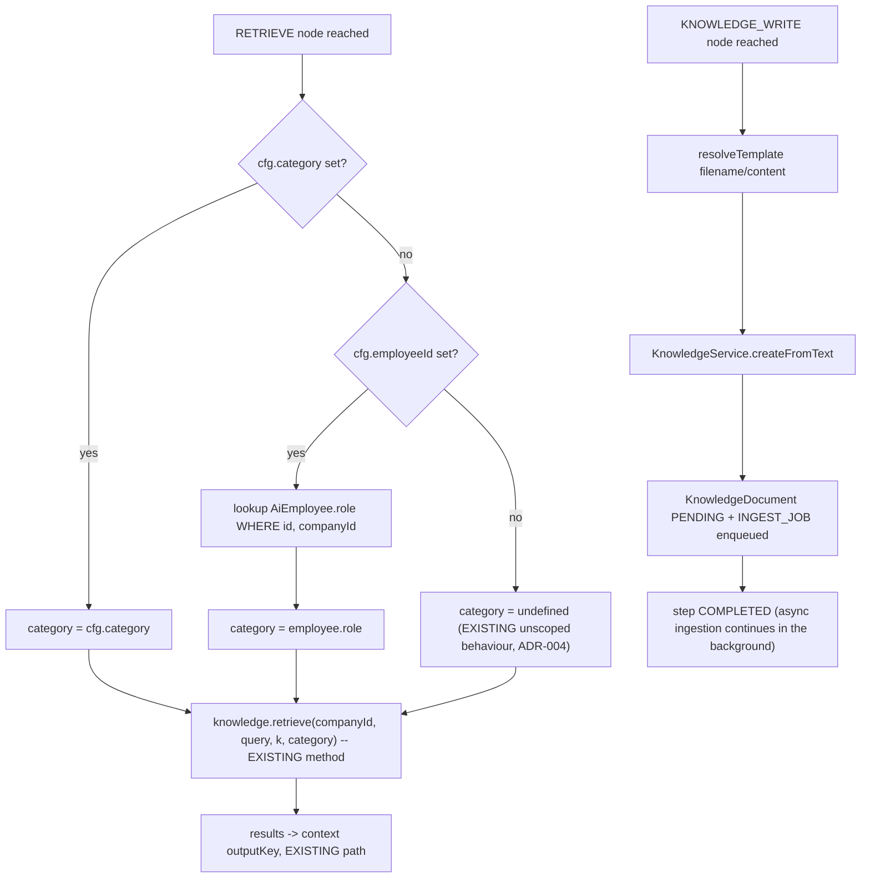
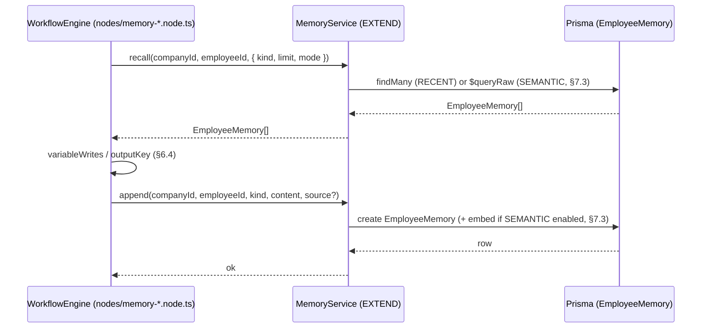
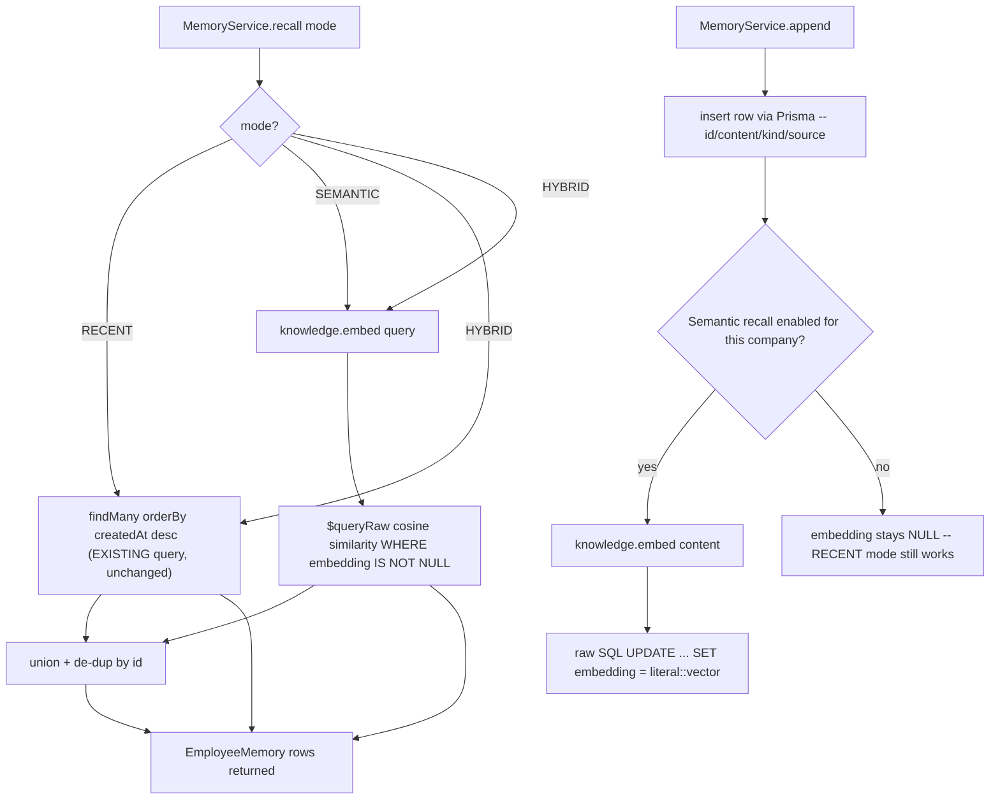

# Orlixa Workflow System — Phase 7: Knowledge & Memory

**Document set:** `docs/architecture/workflow-system/` · **Phase:** 7 of 15 · **Version:** 1.0 · **Date:** 2026-08-01
**Read first:** `00-overview-and-canonical-contracts.md` (normative) and `06-variables.md` (this phase's
node types write through the `VariableBag`/`variableWrites` mechanism §6.4 defines)
**Status:** Design approved for implementation · **Audience:** senior/staff engineers implementing this

---

## 7.0 Scope, status & the role-scoping decision

### 7.0.1 Purpose of this phase

Knowledge (company documents, pgvector search) and Memory (per-Employee recall) exist today as
services consumed by the **chat/agent runtime**. This phase makes them **first-class workflow node
types** — `RETRIEVE` already is one; `MEMORY_READ`, `MEMORY_WRITE`, `KNOWLEDGE_WRITE` are new (gap
G15, doc 00 §0.3.2) — and closes a real, verified inconsistency in how retrieval is scoped between the
chat path and the workflow path (§7.0.4).

### 7.0.2 EXISTING / EXTEND / NEW at a glance

| Element | Status | Where |
|---|---|---|
| `KnowledgeService.retrieve/search` (pgvector cosine search, optional `category` filter) | **EXISTING (KEEP)** | `modules/knowledge/knowledge.service.ts:148-183` |
| `RetrievalService.retrieve` (chat path — DOES pass the calling employee's role as `category`) | **EXISTING (KEEP)** | `modules/employees/runtime/retrieval.service.ts:23-38` |
| `WorkflowEngine.execRetrieve` (workflow path — does NOT pass `category`) | **EXISTING, behaviour changes additively** | `engine/workflow-engine.service.ts:645-662` |
| `RETRIEVE` node type | **EXISTING (KEEP)** — config gains optional fields only (ADR-004) | doc 00 §0.7.1 |
| `MemoryService.load` (recency-only, `Message` + `EmployeeMemory`, chat path) | **EXISTING (KEEP)**, unchanged signature | `modules/employees/runtime/memory.service.ts:26-48` |
| `MemoryService.appendSummary` (hardcoded `kind:'SUMMARY'`) | **EXISTING (KEEP)**, becomes a thin wrapper | `memory.service.ts:50-59` |
| `EmployeeMemory` table (no vector column today) | **EXTEND** — add nullable `embedding` | `schema.prisma:374-387` |
| `KnowledgeDocument.category` / `KnowledgeChunk.category` role-scoping | **EXISTING (KEEP)**, reused as-is | `schema.prisma:266-304` |
| `MEMORY_READ`, `MEMORY_WRITE`, `KNOWLEDGE_WRITE` node types | **NEW** (names already reserved, doc 00 §0.7.1) | this doc |
| `KnowledgeService.embed()`, `.createFromText()` | **NEW** methods on an EXISTING service | this doc, §7.1 / §7.3 |
| `MemoryService.recall()`, `.append()` | **NEW** methods on an EXISTING service | this doc, §7.2 / §7.3 |

### 7.0.3 Mapping the brief's terms onto the design

| Brief term | Major section |
|---|---|
| Knowledge Nodes | §7.1 (`RETRIEVE`, `KNOWLEDGE_WRITE`) |
| Company Documents | §7.1 (`KnowledgeDocument`/`KnowledgeChunk`, unchanged) |
| Context Retrieval | §7.1 |
| Semantic Search (existing) | §7.1 (reused, not rebuilt) |
| Memory Nodes | §7.2 (`MEMORY_READ`, `MEMORY_WRITE`) |
| Employee Memory | §7.2 / §7.3 |
| Conversation Memory | §7.2 (read-only from a workflow; the chat path's `Message` history is out of scope — a workflow run is not a conversation, see §7.2.10) |
| Semantic Search (new, for memory) | §7.3 |

### 7.0.4 Design decision (a): should workflow `RETRIEVE` become role-scoped?

**Verified inconsistency.** The chat runtime's `RetrievalService.retrieve()` passes the calling
employee's `role` as `category` on every call (`retrieval.service.ts:37`,
`this.knowledge.retrieve(companyId, text, k, category)`), so `KnowledgeService.search()`'s SQL filters
to `category = role OR category IS NULL` (`knowledge.service.ts:162-163`) — an HR employee's chat never
sees a Marketing-tagged document. The workflow engine's `execRetrieve` calls
`this.knowledge.retrieve(companyId, query, k)` **with no fourth argument**
(`workflow-engine.service.ts:656`) — `category` is `undefined`, so `search()`'s `categoryFilter`
becomes `Prisma.empty` (`knowledge.service.ts:162`) and the query returns matches from **every**
category, including role-scoped documents that chat would never surface to that role. This directly
contradicts the architecture principle doc 00 §0.2 states as a defining property of this platform
("knowledge and memory... with role-scoping so an HR document never leaks into a Marketing Employee's
context"). A workflow's `RETRIEVE` step today is a wider hole than the chat path it was modelled on.

**Decision: make it role-scoped, but strictly opt-in, not a default-behaviour change.**
`RetrieveNodeConfig` gains two optional fields (§7.1.7): an explicit `category` and an `employeeId`
(the same per-node `employeeId` convention `AI_STEP`/`TOOL_ACTION` already use,
`workflow-engine.service.ts:672-673,751-754`) from which `category` is derived
(`AiEmployee.role`) when `category` is omitted. **Omitting both fields preserves today's exact
unscoped behaviour** — this is required by ADR-004 ("existing 8 node types keep working unchanged...
identical runtime semantics"): every `RETRIEVE` node saved before this phase ships has neither field
set, and must keep behaving exactly as it does today.

**Back-compat risk, stated honestly, both ways:**
- *Risk of opt-in (chosen path):* the leak is **not** closed for any workflow that doesn't get edited
  to add `employeeId`/`category`. Mitigation: a save-time, `WARNING`-severity (non-blocking)
  `ValidationIssue` (doc 00 §0.7.2 `ValidationIssue`) on any `RETRIEVE` node with neither field set,
  surfaced in the builder so the gap is visible instead of silent, without breaking anything on save
  or publish. An audit report (`SELECT` over `WorkflowVersion.definition` for unscoped `RETRIEVE`
  nodes) is a cheap one-off way to find every workflow that should be reviewed.
- *Risk of the alternative (default-scoped):* would violate ADR-004 outright and, on the live Kashif
  Recruiting tenant (real production workflows, per doc 00 §0.10's canary note), could silently change
  a recruiting workflow's retrieved context with no error — a correctness regression that produces
  *quietly different answers*, the worst kind of regression because nothing fails loudly.

The **recommended authoring practice** going forward (not an engine requirement) is that every new
`RETRIEVE` node attached to a specific AI Employee's workflow sets `employeeId`. This is a
documentation/template convention, not a code-enforced default — see §7.1.15.

---

## 7.1 Knowledge retrieval & role-scoping in workflows

### 7.1.1 Purpose

Close the scoping gap in §7.0.4 additively, and add `KNOWLEDGE_WRITE` so a workflow can *produce*
company knowledge (e.g., an AI-drafted policy summary, a call-transcript digest) as easily as it can
already *consume* it via `RETRIEVE`.

### 7.1.2 Responsibilities

- Extend `RetrieveNodeConfig` with optional `category`/`employeeId`; extend `execRetrieve` to resolve
  and pass `category` through to the existing, unchanged `KnowledgeService.retrieve()`.
- Add a non-blocking save-time nudge for unscoped `RETRIEVE` nodes.
- Add `KnowledgeService.createFromText()`, reusing the existing upload→ingest pipeline verbatim.
- Add the `KNOWLEDGE_WRITE` node executor.

### 7.1.3 Architecture

```
RETRIEVE (EXTEND)
  cfg.category set?          → category = cfg.category
  else cfg.employeeId set?   → category = (AiEmployee.role WHERE id=cfg.employeeId, companyId)
  else                        → category = undefined   (EXISTING behaviour — fully unscoped)
  → this.knowledge.retrieve(companyId, query, k, category)   ← EXISTING method, unchanged

KNOWLEDGE_WRITE (NEW)
  cfg.filename, cfg.content resolved via resolveTemplate (EXISTING, template.ts)
  → KnowledgeService.createFromText(companyId, { filename, content, category })
    → storage.put(text/plain bytes)          ← EXISTING StorageProvider, unchanged
    → prisma.knowledgeDocument.create(status:'PENDING')   ← EXISTING shape
    → queue.add(INGEST_JOB)                  ← EXISTING queue, EXISTING IngestionProcessor, unchanged
  → step completes with { documentId, status:'PENDING' } — ingestion finishes asynchronously (§7.1.10)
```

`createFromText` is a near-verbatim copy of `upload()` (`knowledge.service.ts:49-79`) with a
`Buffer.from(content, 'utf8')` in place of the Multer file buffer. It needs **zero changes** to
`extractText`/`chunkText`/embedding — `extractText` already falls through to
`bytes.toString('utf8')` for any non-PDF/DOCX input (`knowledge.util.ts:69`), so plain text ingested
this way is handled by existing, unmodified code.

### 7.1.4 Flow diagram



### 7.1.5 Database design

None. `KnowledgeDocument.category`/`KnowledgeChunk.category` (`schema.prisma:280,300`) already exist
and already support exactly the filter this phase needs — this section is a pure engine + config
change, reusing existing columns.

### 7.1.6 API design

No new REST endpoints. `KNOWLEDGE_WRITE`/`RETRIEVE` are internal engine node executors, not
directly exposed — a company inspects the resulting documents through the existing
`GET /knowledge/documents` route, unchanged.

### 7.1.7 TypeScript interfaces

```ts
/** EXTEND — existing interface, two new OPTIONAL fields (ADR-004: omitting both is a no-op). */
export interface RetrieveNodeConfig {
  query: string;
  k?: number;
  outputKey: string;
  /** NEW — explicit role scope. Wins over `employeeId` when both are set. */
  category?: EmployeeRole;
  /** NEW — derive `category` from this employee's role when `category` is omitted. */
  employeeId?: string;
}

/** NEW — doc 00 §0.7.1 already reserves the NodeType value. */
export interface KnowledgeWriteNodeConfig {
  /** Template — becomes KnowledgeDocument.filename. */
  filename: string;
  /** Template — plain text content; NOT a file upload. */
  content: string;
  /** Omitted/null = Shared (company-wide), matching KnowledgeDocument.category semantics exactly. */
  category?: EmployeeRole;
  outputKey?: string;
}
```

`KnowledgeService` (EXTEND, one new method):

```ts
async createFromText(
  companyId: string,
  input: { filename: string; content: string; category?: EmployeeRole },
): Promise<KnowledgeDocumentDto> {
  const buffer = Buffer.from(input.content, 'utf8');
  const storageKey = `${companyId}/${randomUUID()}`;
  await this.storage.put(storageKey, buffer, 'text/plain');
  const doc = await this.prisma.knowledgeDocument.create({
    data: {
      companyId,
      filename: input.filename,
      mimeType: 'text/plain',
      sizeBytes: buffer.byteLength,
      storageKey,
      status: 'PENDING',
      category: input.category ?? null,
    },
  });
  await this.queue.add(INGEST_JOB, { documentId: doc.id, companyId },
    { removeOnComplete: true, removeOnFail: 100 });
  return toDocumentDto(doc);
}
```

### 7.1.8 JSON examples

Role-scoped `RETRIEVE` (NEW fields in use):

```json
{
  "id": "n3", "type": "RETRIEVE",
  "config": {
    "query": "{{trigger.question}}", "k": 5, "outputKey": "policyDocs",
    "employeeId": "emp_hr_01"
  }
}
```

`KNOWLEDGE_WRITE` producing a call-summary document, Shared by default:

```json
{
  "id": "n9", "type": "KNOWLEDGE_WRITE",
  "config": {
    "filename": "call-summary-{{trigger.callId}}.txt",
    "content": "{{vars.runtime.summary}}",
    "outputKey": "savedDoc"
  }
}
```

### 7.1.9 Folder structure

```
apps/api/src/modules/knowledge/
└── knowledge.service.ts          EXTEND — add createFromText(), embed() (§7.3)

apps/api/src/modules/workflows/engine/nodes/     Phase 2's registry (referenced, not owned here)
├── retrieve.node.ts              EXTEND — ports execRetrieve + category resolution
└── knowledge-write.node.ts       NEW
```

### 7.1.10 Edge cases

- **`KNOWLEDGE_WRITE` immediately followed by `RETRIEVE` for the same content, in the same run.**
  Ingestion is asynchronous (BullMQ, same as today's upload UX) — the new document is typically
  searchable within seconds but **not** synchronously guaranteed at the moment the next node runs.
  Documented limitation, not a bug. An opt-in `waitForReady?: boolean` config (poll `status` up to a
  bounded timeout) is a reasonable future addition (§7.1.14) but is explicitly deferred to Phase 5's
  durable-wait machinery rather than hand-rolled here.
- **`employeeId` set but that employee has `knowledgeAccess:'NONE'`.** `execRetrieve`'s new resolution
  step should short-circuit to an empty result (mirrors `RetrievalService.retrieve`'s existing
  `knowledgeAccess==='NONE' → []` behaviour, `retrieval.service.ts:30-32`) rather than silently
  ignoring the setting and searching anyway.
- **`employeeId` references an employee that doesn't exist / wrong company.** Same defensive lookup
  pattern `execAiStep` already uses (`workflow-engine.service.ts:677-681`, `findFirst` scoped by
  `companyId`) — not found → fall back to unscoped (today's behaviour), not a hard failure; a
  misconfigured `employeeId` shouldn't take down an otherwise-working retrieval step.
- **`KNOWLEDGE_WRITE` with empty/whitespace-only `content`.** `chunkText()` already returns `[]` for
  empty input after whitespace-collapse (`knowledge.util.ts:16-20`) — the document is created with
  `chunkCount: 0`, `status:'READY'`, effectively a no-op document. Acceptable; not worth a special
  validation error for a workflow-generated edge case.

### 7.1.11 Security

Role-scoping is the security control here — see §7.0.4's full justification. `KNOWLEDGE_WRITE`'s
`category` defaults to `null` (Shared/company-wide) when omitted, **not** to the acting employee's own
role — a document a workflow writes is visible company-wide unless the author explicitly scopes it,
matching `KnowledgeDocument.category`'s existing documented default semantics (`schema.prisma:277-280`,
"null = Shared/company-wide"). Authors who want a written document to stay role-scoped must set
`category` explicitly.

### 7.1.12 Performance

Zero additional query cost for `RETRIEVE`: passing `category` changes the SQL predicate
(`knowledge.service.ts:162-163`) but not the query count. `KNOWLEDGE_WRITE` costs one
`storage.put` + one insert + one queue `add()` — identical cost profile to the existing manual-upload
path, just triggered from a workflow instead of an HTTP multipart request.

### 7.1.13 Scalability

No new tables, no new indexes. Document/chunk volume grows exactly as it does today; `KNOWLEDGE_WRITE`
is simply a new *producer* of rows into the same, already-indexed (`@@index([companyId])`) tables.

### 7.1.14 Future extension

- `waitForReady` polling option on `KNOWLEDGE_WRITE` (§7.1.10), once Phase 5's durable-wait primitive
  exists to implement it without a hand-rolled sleep loop.
- Extending the AI Workflow Generator (`workflow-generator.service.ts`, EXISTING — internals not
  reviewed for this phase, so no behavioural claim is made about it here) to auto-populate
  `employeeId` on a generated `RETRIEVE` node when the same draft also generates an
  `AI_STEP`/`AI_EMPLOYEE_STEP` for the same logical employee — a natural follow-up, flagged for
  whoever next touches that file.

### 7.1.15 Best practices

- New workflows: always set `employeeId` on a `RETRIEVE` node that supports a specific AI Employee's
  work. Treat the save-time `WARNING` (§7.0.4) as a checklist item during workflow review, not noise
  to dismiss.
- Prefer `KNOWLEDGE_WRITE` with an explicit `category` over leaving it Shared "just to be safe" when
  the content is genuinely role-specific (e.g., an HR call summary) — Shared-by-default exists for
  convenience, not because it's the recommended posture for sensitive content.

---

## 7.2 Memory nodes

### 7.2.1 Purpose

Let a workflow explicitly read and write an AI Employee's durable memory (`EmployeeMemory` —
`FACT`/`SUMMARY` rows) — today this only happens implicitly inside the chat runtime
(`MemoryService.load`/`appendSummary`, consumed by `AgentRuntimeService`, not reachable from a
workflow at all — gap G15).

### 7.2.2 Responsibilities

- Add `MEMORY_READ`: recall an employee's memories into `context` (§6.4's `variableWrites`/`outputKey`
  sugar).
- Add `MEMORY_WRITE`: append a new `FACT` or `SUMMARY` memory from within a run.
- Generalise `MemoryService` with `recall()`/`append()` while keeping `load()`/`appendSummary()`
  **byte-for-byte unchanged** for the chat runtime that already depends on them.

### 7.2.3 Architecture

`MemoryService` gains two new methods; the two existing ones become thin, behaviourally-identical
wrappers so `AgentRuntimeService` (the chat runtime's only caller, unread in depth here but its
call sites in `memory.service.ts`'s existing public surface are unaffected either way) needs zero
changes:

```ts
// EXISTING, callers unchanged:
load(companyId, conversationId, employeeId) → { messages, memories }   // recency-only, unchanged
appendSummary(companyId, employeeId, content) → void                  // kind:'SUMMARY', source left null, unchanged

// NEW, backing implementation for the two above AND for the workflow nodes:
recall(companyId, employeeId, opts?: { kind?, limit?, mode?, query? }) → EmployeeMemory[]
append(companyId, employeeId, kind, content, source?) → void
```

`load()`'s memory half becomes `recall(companyId, employeeId, { limit: RECENT_MEMORY_LIMIT })` (mode
defaults to `RECENT`, §7.3) — identical query, identical result, verified against the existing
`findMany({ where:{companyId, employeeId}, orderBy:{createdAt:'desc'}, take: RECENT_MEMORY_LIMIT })`
at `memory.service.ts:40-44`. `appendSummary()` becomes `append(companyId, employeeId, 'SUMMARY',
content)` with `source` omitted, preserving the exact "left null" behaviour the schema comment
documents (`schema.prisma:381-383`: "Nullable so the existing rolling SUMMARY writes (RUN) are
unaffected (they leave it null)").

`MEMORY_READ`/`MEMORY_WRITE` call `recall()`/`append()` directly — a workflow run has no
`conversationId`, so it never touches the `Message`-half of `load()` (Conversation Memory, in the
brief's terms, stays a chat-only concept — see §7.2.10).

### 7.2.4 Flow diagram



### 7.2.5 Database design

None beyond §7.3's `embedding` column (that column serves both the semantic-recall extension and is
simply unused when `MEMORY_READ` runs in `RECENT` mode). No change to `EmployeeMemory.kind`/`content`/
`source` — the existing columns are sufficient for both new node types.

### 7.2.6 API design

No new REST endpoints — `MEMORY_READ`/`MEMORY_WRITE` are internal node executors. An operator
inspects an employee's memory through whatever existing surface reads `EmployeeMemory` today
(the Learning/feedback UI, not modified by this phase).

### 7.2.7 TypeScript interfaces

```ts
/** NEW — doc 00 §0.7.1 already reserves the NodeType value. */
export interface MemoryReadNodeConfig {
  /** Required — memory always belongs to exactly one AI Employee (no "unscoped" reading, unlike RETRIEVE). */
  employeeId: string;
  /** Omitted = both FACT and SUMMARY. */
  kind?: MemoryKind;
  /** Default 'RECENT' — identical to today's chat-path recall. See §7.3 for SEMANTIC/HYBRID. */
  mode?: 'RECENT' | 'SEMANTIC' | 'HYBRID';
  /** Template — required when mode is SEMANTIC or HYBRID. */
  query?: string;
  /** Default RECENT_MEMORY_LIMIT (5) — same constant the chat path already uses (employees.constants.ts:32). */
  limit?: number;
  outputKey: string;
}

/** NEW — doc 00 §0.7.1 already reserves the NodeType value. */
export interface MemoryWriteNodeConfig {
  employeeId: string;
  kind: MemoryKind;
  /** Template. */
  content: string;
  /** Omitted = left null, matching today's rolling-SUMMARY convention (schema.prisma:381-383). */
  source?: MemorySource;
  outputKey?: string;
}
```

`MemoryService` new method signatures:

```ts
export interface MemoryRecallOptions {
  kind?: MemoryKind;
  limit?: number;
  mode?: 'RECENT' | 'SEMANTIC' | 'HYBRID';   // default 'RECENT'
  query?: string;                             // required for SEMANTIC/HYBRID
}

// EXTEND MemoryService with:
recall(companyId: string, employeeId: string, opts?: MemoryRecallOptions): Promise<EmployeeMemory[]>;
append(companyId: string, employeeId: string, kind: MemoryKind, content: string, source?: MemorySource): Promise<void>;
```

### 7.2.8 JSON examples

`MEMORY_READ` pulling an HR employee's recent facts before drafting a reply:

```json
{
  "id": "n5", "type": "MEMORY_READ",
  "config": { "employeeId": "emp_hr_01", "kind": "FACT", "limit": 5, "outputKey": "knownFacts" }
}
```

`MEMORY_WRITE` recording a run outcome as a new FACT:

```json
{
  "id": "n11", "type": "MEMORY_WRITE",
  "config": {
    "employeeId": "emp_hr_01",
    "kind": "FACT",
    "content": "Candidate {{trigger.candidateName}} was scored {{vars.runtime.score}} on {{trigger.date}}.",
    "source": "RUN"
  }
}
```

### 7.2.9 Folder structure

```
apps/api/src/modules/employees/runtime/
└── memory.service.ts              EXTEND — add recall()/append(); load()/appendSummary() become wrappers

apps/api/src/modules/workflows/engine/nodes/    Phase 2's registry (referenced, not owned here)
├── memory-read.node.ts           NEW (path already reserved, doc 00 §0.7.4)
└── memory-write.node.ts          NEW (path already reserved, doc 00 §0.7.4)
```

Cross-module call: `nodes/memory-*.node.ts` (in `WorkflowsModule`) needs `MemoryService` (declared in
`EmployeesModule`, `employees.module.ts:41`). `WorkflowsModule` does not import `EmployeesModule` today
(verified indirectly: `ApprovalsModule` imports `WorkflowsModule`, not the reverse,
`approvals.module.ts:15-18`, and `EmployeesModule` imports `ApprovalsModule` — a
`WorkflowsModule → EmployeesModule` import would create the exact cycle that comment warns against:
Employees → Approvals → Workflows → Employees). Phase 2's `NodeRegistry` must therefore receive
`MemoryService` via a narrow, exported interface (e.g. `EmployeesModule` exports a
`MemoryService`-only surface the same way it exports `EmployeesService` today,
`employees.module.ts:45`) rather than the engine importing `EmployeesModule` wholesale — flagged here
as a concrete constraint for whoever wires `memory-read.node.ts`/`memory-write.node.ts` into the
registry, since getting the import direction wrong reintroduces a real dependency cycle.

### 7.2.10 Edge cases

- **"Conversation Memory" (brief's term) is not reachable from a workflow.** A workflow run has no
  `conversationId` — `Message` rows are conversation-scoped, not run-scoped, and there is no
  intention to bolt a `conversationId` onto `WorkflowRun`. If a workflow needs recent chat context, the
  trigger payload should carry it explicitly (e.g. `trigger.recentMessages`), not a new implicit node.
  This is a deliberate scope boundary, not an oversight.
- **`MEMORY_READ` for an employee with zero memories.** Returns `[]`, not an error — mirrors
  `load()`'s existing behaviour for a fresh employee.
- **`MEMORY_WRITE` for a nonexistent `employeeId`.** The Prisma FK (`EmployeeMemory.employeeId` →
  `AiEmployee.id`, `onDelete: Cascade`, `schema.prisma:378`) rejects the insert with a foreign-key
  violation — surfaced as a clear step failure (`FAIL_RUN` default), not a silent no-op.
- **High-frequency `MEMORY_WRITE` in a loop** (once `LOOP`, doc 00 §0.7.1, ships in Phase 2) could
  flood an employee's memory table with near-duplicate FACTs. Out of scope for this phase to solve
  (no de-duplication/summarisation policy specified here) — flagged for Phase 2/11 as an analytics or
  cost concern, not a Phase 7 blocker.

### 7.2.11 Security

`MEMORY_READ`/`MEMORY_WRITE` are scoped by `(companyId, employeeId)` on every query, identical
tenant-isolation discipline to every other query in this codebase (`@@index([companyId])` on
`EmployeeMemory`, `schema.prisma:386`). There is no cross-employee read path — a workflow cannot
request "employee A's memory" while impersonating a different employee's identity, because
`employeeId` is a plain node-config field validated against `AiEmployee` at execution time
(same `findFirst({ id, companyId })` pattern as `execAiStep`).

### 7.2.12 Performance

`RECENT`-mode `recall()` is the exact existing indexed query (`schema.prisma:386`'s
`@@index([companyId])`, ordered by `createdAt` — no new index needed since the existing one already
supports this access pattern the same way it does today). `append()` costs one insert (`RECENT`-only
usage) or one insert + one embed call (when semantic recall, §7.3, is enabled for this company).

### 7.2.13 Scalability

`EmployeeMemory` row growth is bounded by run/write frequency per employee — no different in kind from
today's rolling-SUMMARY growth, which the codebase already accepts unbounded (no retention policy
exists today for this table; out of scope to add one here, noted for Phase 12).

### 7.2.14 Future extension

A de-duplication pass on `MEMORY_WRITE` (skip or merge a FACT that's near-identical to a recent one)
is a natural extension once semantic recall (§7.3) exists, since "near-identical" becomes a cosine-
similarity threshold check rather than a fuzzy string comparison.

### 7.2.15 Best practices

- Use `kind:'FACT'` for durable, individually-true statements (a candidate's score, a decision made)
  and `kind:'SUMMARY'` for a rolled-up narrative — the same distinction the chat runtime's rolling
  summaries already establish; `MEMORY_WRITE` should not blur this line just because it's easy to.
- Keep `MEMORY_WRITE.content` short and factual — it is recalled verbatim into a future prompt's
  context window (via `recall()` → `variableWrites`/`outputKey` → an `AI_STEP` prompt), so a bloated
  memory entry is a recurring prompt-cost tax on every future run that recalls it.

---

## 7.3 Semantic memory recall

### 7.3.1 Purpose

Extend `EmployeeMemory` recall from **recency-only** (today's exact behaviour — verified: no vector
column exists on this model at all, `schema.prisma:374-387`, and `MemoryService.load` is a plain
`orderBy:{createdAt:'desc'}` query, `memory.service.ts:40-44`) to **semantic** similarity search,
reusing the exact pgvector mechanism `KnowledgeChunk` already uses, so an employee can recall "the
relevant memory" rather than only "the most recent five."

### 7.3.2 Responsibilities

- Add a nullable `embedding vector(384)` column to `EmployeeMemory`, with an HNSW index, added
  **online** (no write-blocking) since — unlike `KnowledgeChunk` at its creation — this table already
  holds live production rows.
- Embed `content` at write time (`append()`), reusing the same `EmbeddingProvider` Knowledge already
  selects, via one new one-line passthrough method rather than duplicating provider selection.
- Implement `SEMANTIC`/`HYBRID` recall modes with a documented, honest fallback for rows written
  before the backfill completes.
- Specify the backfill job and its cost, explicitly, per the brief's requirement.

### 7.3.3 Architecture

```ts
// EXTEND — one new passthrough method, KnowledgeService already injects EmbeddingProvider.
class KnowledgeService {
  embed(texts: string[]): Promise<number[][]> {
    return this.embeddings.embed(texts);
  }
}
```

`MemoryService` (in `EmployeesModule`) calls `KnowledgeService.embed()` directly —
**zero module-wiring changes required**: `EmployeesModule` already imports `KnowledgeModule`
(`employees.module.ts:32`) specifically so `RetrievalService` can call `KnowledgeService`
(`retrieval.service.ts:21`); `MemoryService` is provided in the same module
(`employees.module.ts:41`) and simply gains the same constructor dependency.

`recall()` mode dispatch:

```
RECENT (default, unchanged query)
  findMany({ where:{companyId, employeeId, kind?}, orderBy:{createdAt:'desc'}, take: limit })

SEMANTIC
  [vector] = knowledge.embed([query])
  $queryRaw`
    SELECT *, 1 - (embedding <=> ${literal}::vector) AS score
    FROM "EmployeeMemory"
    WHERE "companyId" = ${companyId} AND "employeeId" = ${employeeId}
      AND embedding IS NOT NULL ${kind ? sql`AND "kind" = ${kind}` : sql``}
    ORDER BY embedding <=> ${literal}::vector
    LIMIT ${limit}
  `
  -- mirrors KnowledgeService.search()'s exact SQL shape (knowledge.service.ts:166-175)

HYBRID
  recentIds  = RECENT query (limit)
  semanticIds = SEMANTIC query (limit)
  union, de-duplicated by id, ordered by createdAt desc  -- a SIMPLE hybrid, not a scored re-ranker (§7.3.14)
```

### 7.3.4 Flow diagram



### 7.3.5 Database design

```prisma
model EmployeeMemory {
  id         String     @id @default(cuid())
  companyId  String
  employeeId String
  employee   AiEmployee @relation(fields: [employeeId], references: [id], onDelete: Cascade)
  kind       MemoryKind
  content    String
  source     String?
  createdAt  DateTime   @default(now())
  /// NEW — nullable so every existing row is valid pre-backfill (§7.3.10). Mirrors
  /// KnowledgeChunk.embedding exactly (schema.prisma:295) — same 384-dim, same provider.
  embedding  Unsupported("vector(384)")?

  @@index([companyId])
}
```

Migration SQL (hand-written, like every other `Unsupported`-vector migration in this codebase, since
Prisma cannot generate DDL for a column it cannot model):

```sql
-- Additive, nullable column: instant in Postgres, no table rewrite, no lock beyond a brief
-- ACCESS EXCLUSIVE for the catalog change itself.
ALTER TABLE "EmployeeMemory" ADD COLUMN "embedding" vector(384);

-- UNLIKE the KnowledgeChunk precedent (apps/api/prisma/migrations/20260709150515_knowledge/
-- migration.sql:43-46), EmployeeMemory already holds live rows on the production tenant (doc 00
-- §0.10's canary). A plain CREATE INDEX takes a SHARE lock for its whole duration, blocking writes
-- to this table for that window. Use CONCURRENTLY instead, which cannot run inside a transaction —
-- Prisma wraps each migration.sql in one, so this statement must be applied as a separate,
-- non-transactional manual migration step (documented in the migration's README, same convention
-- as any other Prisma "expand" step that needs CONCURRENTLY).
CREATE INDEX CONCURRENTLY "EmployeeMemory_embedding_idx"
  ON "EmployeeMemory" USING hnsw (embedding vector_cosine_ops);
```

**Known Prisma-generated-migration gotcha, verified twice already in this codebase**: every migration
touching *any* table after `KnowledgeChunk`'s HNSW index was created has needed a manual edit, because
Prisma's schema diffing cannot see an index on an `Unsupported` column and proposes dropping it. Both
existing occurrences carry the identical hand-added comment:
`apps/api/prisma/migrations/20260709154914_ai_employees/migration.sql:13-16` and
`apps/api/prisma/migrations/20260709190748_approvals/migration.sql:4-7` ("Prisma emits a false-drift
`DROP INDEX "KnowledgeChunk_embedding_idx"`... removed by hand"). This phase's migration will trigger
the same false-drift for **both** vector indexes now in the schema and must strip both lines by hand —
called out explicitly here so it isn't rediscovered by surprise a third time.

### 7.3.6 API design

No new REST endpoints. `mode` is a `MEMORY_READ` node config field (§7.2.7), not an API parameter —
semantic recall is an engine-internal capability, not directly exposed.

### 7.3.7 TypeScript interfaces

Already specified in §7.2.7 (`MemoryRecallOptions.mode`/`.query`) — this section adds no further
public type, only the internal SQL/embedding implementation described in §7.3.3.

### 7.3.8 JSON examples

`MEMORY_READ` using semantic recall to find a specific past decision rather than "the last five":

```json
{
  "id": "n6", "type": "MEMORY_READ",
  "config": {
    "employeeId": "emp_hr_01", "kind": "FACT", "mode": "SEMANTIC",
    "query": "prior decisions about candidates from the Berlin office",
    "limit": 3, "outputKey": "relevantFacts"
  }
}
```

### 7.3.9 Folder structure

```
apps/api/src/modules/employees/runtime/
└── memory.service.ts        EXTEND — recall() mode dispatch, append() embed-on-write

apps/api/prisma/migrations/<timestamp>_employee_memory_embedding/
└── migration.sql            NEW — ALTER TABLE + CREATE INDEX CONCURRENTLY (applied manually, §7.3.5)

scripts/                      (or wherever one-off backfills live in this repo — not otherwise specified)
└── backfill-employee-memory-embeddings.ts   NEW — one-off, batched, idempotent
```

### 7.3.10 Edge cases

- **Rows written before the backfill runs.** `embedding IS NULL` — the `SEMANTIC`/`HYBRID` SQL's
  `WHERE embedding IS NOT NULL` clause simply excludes them, so semantic recall silently returns fewer
  (or zero) results for older memories until the backfill completes. This is an accepted, temporary,
  self-healing gap (every new `append()` embeds going forward), not an error state — `RECENT` mode is
  unaffected and remains the default, so nothing regresses during the transition.
- **A company with semantic recall enabled but the backfill job hasn't run yet.** Same as above;
  recommend gating `mode: 'SEMANTIC'/'HYBRID'` in the builder's node-config UI behind a simple
  per-company readiness flag (flipped once the backfill's last batch completes) so authors aren't
  surprised by empty results — a UI nicety, not an engine requirement.
- **Embedding provider mismatch.** If `EMBEDDINGS_PROVIDER` changes (`hash` → `openai`, both already
  produce 384-dim vectors per `EMBEDDING_DIM`, `embedding.provider.ts:17`) after some rows were
  embedded with the old provider, cosine similarity between old and new vectors is meaningless (the
  hash provider's bag-of-words buckets and OpenAI's semantic embedding space are not comparable even
  at the same dimensionality). Re-running the backfill after a provider change is **required**, not
  optional — flag this prominently in ops runbooks; this is the exact same constraint
  `KnowledgeChunk` already has today (verified: nothing in `ingestion.processor.ts` re-embeds on
  provider change either), so Phase 7 inherits, rather than introduces, this operational rule.

### 7.3.11 Security

No new security surface — `recall()`'s `SEMANTIC` query is scoped by `companyId AND employeeId` in the
`WHERE` clause exactly like the `RECENT` query, and reuses the same parameterised `Prisma.sql`
tagged-template style `KnowledgeService.search()` already uses (`knowledge.service.ts:168-175`),
avoiding string-concatenation SQL injection risk by construction.

### 7.3.12 Performance

Embedding one short memory string at write time costs the same single embed call ingestion already
pays per chunk (`ingestion.processor.ts:72`, batched at `EMBED_BATCH=16` for bulk cases). At
per-message-write volume (not bulk-document volume), batching is unnecessary — one `embed([content])`
call per `append()` is acceptable. The HNSW index makes `SEMANTIC` recall's cost effectively
independent of table size, same as `KnowledgeChunk`'s existing search.

### 7.3.13 Scalability & migration cost — stated explicitly, per the brief

- **Schema migration cost:** adding a nullable column is metadata-only in Postgres (no table rewrite,
  sub-second). Building the HNSW index is the only potentially slow step, proportional to existing row
  count — using `CONCURRENTLY` (§7.3.5) trades "slightly slower to build, needs a separate
  non-transactional step" for "zero write-blocking," the right trade for a table with live traffic.
- **Backfill cost (estimate, not measured — no row-count data available for this exercise):**
  `EmployeeMemory` rows are short strings (a FACT/SUMMARY sentence, not a document chunk), and this
  table's total row count is expected to be small relative to `KnowledgeChunk` (one row per memory
  event, not per 1000-character chunk of every uploaded document). A batched (16-at-a-time, mirroring
  `EMBED_BATCH`) one-off job embedding every existing row is expected to be cheap in both time and
  provider cost; re-run in full after any embedding-provider change (§7.3.10).
  **This is an estimate; measure actual row counts before scheduling the backfill in production.**
- **Ongoing marginal cost:** exactly one extra embed call per `append()` — the same cost model
  document ingestion already has, not a new cost category.
- **Reversibility:** the column is nullable and additive; disabling semantic recall is a config flip
  back to `mode:'RECENT'` with no data loss, and dropping the column later (if ever) is a normal
  reversible migration.

### 7.3.14 Future extension

- Replace the "simple hybrid" (union + recency tie-break, §7.3.3) with a proper reciprocal-rank-fusion
  re-ranker once there's evidence the simple version under-performs — deliberately not built now to
  avoid over-engineering a v1 with no usage data yet.
- Cross-employee semantic recall (a manager searching "what do any of my AI Employees know about X")
  — deferred until there's a concrete product need, and would need its own permission model (Phase 9).

### 7.3.15 Best practices

- Always re-run the full backfill after any `EMBEDDINGS_PROVIDER` change — never assume old vectors
  are comparable to new ones (§7.3.10).
- Default new companies to `RECENT` mode; treat `SEMANTIC`/`HYBRID` as an explicit opt-in per employee
  or per node, not a platform-wide default, until the backfill/readiness story (§7.3.10) is mature.

---

## 7.4 Promotions into doc 00 §0.7

- `MemoryReadNodeConfig`, `MemoryWriteNodeConfig`, `KnowledgeWriteNodeConfig` (§7.2.7, §7.1.7) — the
  config shapes for the three `NodeType` values doc 00 §0.7.1 already reserves.
- `RetrieveNodeConfig`'s two new optional fields (`category`, `employeeId`, §7.1.7) — an EXTEND to an
  existing doc 00-adjacent type (today defined in `packages/types`, not yet mirrored into doc 00
  itself).
- `MemoryRecallOptions` (§7.2.7).
- The `EmployeeMemory.embedding` column (§7.3.5) — doc 00 §0.7.3's entity map does not currently list
  this column; worth a one-line addition once Phase 7 ships, so future phases don't have to re-derive
  it from this document.

**Next:** `08-approvals.md` — Phase 8.
