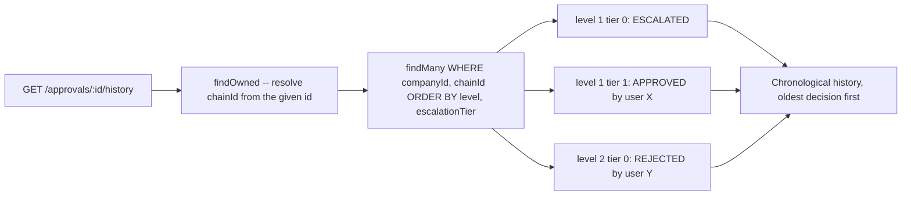

# Orlixa Workflow System — Phase 8: Approvals

**Document set:** `docs/architecture/workflow-system/` · **Phase:** 8 of 15 · **Version:** 1.0 · **Date:** 2026-08-01
**Read first:** `00-overview-and-canonical-contracts.md` (normative — ADR-006 governs this whole phase)
and `06-variables.md` (routing `target` templates reuse the existing `{{a.b.c}}` resolver, §6.0.1)
**Status:** Design approved for implementation · **Audience:** senior/staff engineers implementing this

---

## 8.0 Scope, status & prerequisite findings

### 8.0.1 Purpose of this phase

Close gap G8 (doc 00 §0.3.2): `ApprovalRequest` has no assignee, no due date, no escalation chain, no
SLA — today anyone holding `OWNER`/`ADMIN` can decide any request in the company, full stop
(`approvals.controller.ts:50,63,75`, `@Roles('OWNER','ADMIN')` with no further scoping). This phase
adds routing (who must decide), multi-level chains (who decides next), SLA/escalation/timeout (what
happens if nobody decides in time), and full history — **by extending `ApprovalRequest`**, per
ADR-006, not by building a second approvals subsystem.

### 8.0.2 EXISTING / EXTEND / NEW at a glance

| Element | Status | Where |
|---|---|---|
| `ApprovalRequest` model | **EXTEND** — new columns only, no existing column changes | `schema.prisma:575-599` |
| `ApprovalKind`, existing `ApprovalStatus` values | **EXISTING (KEEP)** | `schema.prisma:129-142` |
| `ApprovalStatus` — `ESCALATED`, `EXPIRED` | **EXTEND** (already canonical, doc 00 §0.7.1) | this doc |
| `ApproverRuleType` | **NEW enum** (already canonical, doc 00 §0.7.1) | this doc, §8.1.5 |
| `ApprovalService.approve/reject/modify/createRequest` | **EXTEND** | `modules/approvals/approval.service.ts` |
| Atomic `claim()` (race-safe PENDING→decided) | **EXISTING (KEEP)**, reused verbatim by every new path | `approval.service.ts:190-213` |
| `WorkflowEngine.pauseForApproval` / `isAutoApprove` | **EXTEND** / **EXISTING (KEEP), unchanged** | `engine/workflow-engine.service.ts:437-487` / `:424-426` |
| `@Roles('OWNER','ADMIN')` on approve/reject/modify | **EXTEND — removed**, replaced by a service-level `canDecide` check | `approvals.controller.ts:50,63,75` |
| `User` — org-structure links (`departmentId`, `teamId`, `managerUserId`) | **NEW columns** — required prerequisite, see §8.0.4 | `schema.prisma:246-259` |
| `AiEmployee.managerUserId` | **NEW column** (`managerName` free-text KEEPS existing) | `schema.prisma:310-346` |
| `SecurityPolicy.defaultApprovalSlaMinutes` | **NEW column** | `schema.prisma:657-668` |
| `ApprovalRoutingService`, `ApprovalRoutingModule` | **NEW** | this doc, §8.1 |
| `ApprovalSlaService`, `ApprovalSlaProcessor`, `approval-sla` queue | **NEW** | this doc, §8.2 |
| `WorkflowRunTimer` (Phase 5) | **REFERENCED, not redesigned** — see §8.0.5 for the honest limits of that reference | doc 00 §0.7.3/§0.7.4 |

### 8.0.3 Mapping the brief's terms onto the design

| Brief term | Major section |
|---|---|
| Approval Nodes | §8.1 (extends the existing `APPROVAL` node's config) |
| Human Approval | §8.1 (`USER`, `ANY_ADMIN` rules) |
| Department Approval | §8.1 (`DEPARTMENT`/`TEAM` rules — blocked on §8.0.4 until this phase adds the missing links) |
| Conditional Approval | §8.1 (routing `target` as a `{{}}` template; composition with the existing `CONDITION` node) |
| Escalation | §8.2 |
| SLA | §8.2 |
| Timeout | §8.2 |
| Approval History | §8.3 |

### 8.0.4 Prerequisite finding: routing rules have nothing to route against today

**Verified, and this contradicts an assumption implicit in the brief.** The brief's reading list asks
this phase to read `Department`, `Team`, `User` "to understand them" as if they were already linked
well enough to route approvals by department/team/manager. They are not:

- `User` (`schema.prisma:246-259`) has `id, companyId, email, passwordHash, name, phone, role, status,
  createdAt` — **no `departmentId`, no `teamId`, no `managerUserId`**.
- `Department` (`schema.prisma:630-642`) has `id, companyId, name, description` and a `teams Team[]`
  relation — **no relation to `User` at all**.
- `Team` (`schema.prisma:644-655`) has an FK to `Department` but, again, **no relation to `User`**.
- `AiEmployee.managerName` (`schema.prisma:321`) is a **free-text `String?`**, not a foreign key to
  `User` — so even "route to this AI Employee's manager" (`EMPLOYEE_MANAGER`) cannot resolve to an
  actual decider today.

`DEPARTMENT`, `TEAM`, and `EMPLOYEE_MANAGER` routing (all three named explicitly in doc 00 §0.7.1's
`ApproverRuleType`) are **unimplementable without a schema change this phase must make**, and doc 00's
G8 entry does not call this out as a distinct blocker — it is surfaced here for the first time. §8.1.5
adds the three missing links (`User.departmentId`/`.teamId`/`.managerUserId`,
`AiEmployee.managerUserId`) as a prerequisite, not an optional nice-to-have.

**Also verified, a pre-existing naming collision (not introduced by this phase, but easy to trip over
while implementing it):** `packages/types` already exports a type literally named `Department` — a
five-value string union of onboarding business verticals (`'SALES'|'HR'|'CUSTOMER_SUPPORT'|
'RECRUITMENT'|'FINANCE'`, `packages/types/src/index.ts:248-253`) — **distinct from** the Prisma
`Department` **model** this phase routes against (an org-structure table with an `id`,
`schema.prisma:630-642`). When implementing `ApproverRuleType.DEPARTMENT`, import the Prisma model
type explicitly (e.g. `import type { Department as OrgDepartment } from '@prisma/client'`) to avoid
confusing the two.

### 8.0.5 Relationship to Phase 5's `WorkflowRunTimer` — stated honestly

Phase 5 (`05-execution-engine.md`) is not yet written. Doc 00 only commits to `WorkflowRunTimer`
existing, scoped to a `WorkflowRun` (§0.7.3 ER diagram: `WorkflowRun ||--o{ WorkflowRunTimer`), fired
by a scanning sweeper — it does not specify columns, and this document does not invent them (per the
brief: "reference it, don't redesign it").

That reference has a real limit worth stating up front: **`WorkflowRunTimer` is scoped to a
`WorkflowRun`**, but a `TOOL`-kind `ApprovalRequest` (gating a chat tool call) **has no run at all** —
`workflowRunId` is null for every `TOOL`-kind row by design (`approval.service.ts:41-44`'s own
docstring). A timer mechanism keyed to a run cannot, by construction, cover half of this phase's own
scope. §8.2 therefore does not make Phase 8 depend on Phase 5 shipping first: it specifies a
self-sufficient sweep (modelled directly on the existing `sweepStuckRuns` watchdog,
`workflow-engine.service.ts:282-307`) that is correct and complete for **both** approval kinds on its
own, and treats an optional `WorkflowRunTimer` registration for `WORKFLOW`-kind rows as a pure latency
optimisation on top of that backstop, not a correctness dependency.

### 8.0.6 The existing `autoApprove: true` behaviour is fully preserved

`isAutoApprove(node)` (`workflow-engine.service.ts:424-426`) is checked in the run loop **before**
`pauseForApproval` is ever called (`:372`: `if (current.type === 'APPROVAL' && !this.isAutoApprove
(current))`). Every routing/SLA mechanism this phase adds lives entirely inside `pauseForApproval` —
an `autoApprove: true` node never reaches any of it, by the existing control flow, not by a new check
this phase adds. This is stated once, prominently, because it is the single easiest regression to
introduce by accident while extending `pauseForApproval`'s body.

---

## 8.1 Approval routing & multi-level chains

### 8.1.1 Purpose

Let an `APPROVAL` node (or a `TOOL`-kind employee policy) declare **who** must decide — a specific
user, anyone with a company role, a department, a team, an AI Employee's manager, or (today's exact
default) any admin — and, optionally, a sequence of such decisions (multi-level sign-off).

### 8.1.2 Responsibilities

- Add the three missing org-structure links (§8.0.4) as a schema prerequisite.
- Add `ApproverRuleType`-based resolution (`ApprovalRoutingService`), living in a new,
  dependency-light module both `WorkflowsModule` and `ApprovalsModule` can import without creating a
  cycle (§8.1.3).
- Replace the blanket `@Roles('OWNER','ADMIN')` decide-time guard with a per-request `canDecide` check
  that reproduces today's exact rule for every unrouted (legacy) request.
- Chain multiple sequential levels as multiple `ApprovalRequest` rows sharing one `chainId`.

### 8.1.3 Architecture

**Module placement, resolved deliberately to avoid a cycle.** `WorkflowsModule`'s engine must compute
routing at `pauseForApproval` time (`WORKFLOW`-kind), and `ApprovalsModule` must compute it at
`createRequest`/decide time (`TOOL`-kind and every kind's `canDecide`). `WorkflowsModule` does not
import `ApprovalsModule` today, by design (`workflow-engine.service.ts:110-111`: "the engine never
imports the Approvals module — that keeps Approvals→Workflows one-directional/acyclic"), and
`ApprovalsModule` imports `WorkflowsModule` (`approvals.module.ts:20-21`) — so `WorkflowsModule`
importing `ApprovalsModule` would create Approvals→Workflows→Approvals, exactly the cycle that
comment protects against.

This codebase already has a precedent for this exact fork: `LlmModule` was pulled out of
`EmployeesModule` specifically "so WorkflowsModule can inject the same provider without importing
EmployeesModule" (`employees.module.ts:21-26`). Phase 8 follows the identical pattern: a **new**,
dependency-light `ApprovalRoutingModule` (depends only on `PrismaService`, common/global) is imported
by **both** `WorkflowsModule` and `ApprovalsModule`. Verified acyclic: `ApprovalRoutingModule` imports
nothing that imports either of them back. The original constraint — the engine still never imports
`ApprovalsModule`, still creates `ApprovalRequest` rows via raw Prisma — is unchanged.

```
ApprovalRoutingModule  (NEW, depends only on PrismaService)
        ▲                              ▲
        │ imports                      │ imports
WorkflowsModule                 ApprovalsModule  ──imports──▶ WorkflowsModule (EXISTING edge, unchanged)
   (engine: pauseForApproval)      (createRequest, canDecide, sweep)
```

**Multi-level chains as multiple rows.** A chain is `N` sequential `ApprovalRequest` rows sharing one
`chainId`, at most one of which is ever `PENDING` at a time. Level 2 does not exist until level 1
approves — created lazily by `ApprovalService.approve()`. This keeps every row's shape exactly what it
is today (one row = one pending decision gating one thing) rather than inventing a parallel
multi-decision entity, per ADR-006.

**Config snapshotting.** The full `ApprovalRoutingConfig` (every level, its escalation chain, its
timeout policy) is captured once, at chain creation, into a new `routingSnapshot Json?` column and
copied verbatim onto every row in the chain — the same "snapshot the config that produced this row"
convention `WorkflowStepRun.input` already follows for node config
(`workflow-engine.service.ts:533`). This means resolving level 2's rule, or an escalation hop, never
requires re-reading the (possibly since-edited) workflow graph — the chain is self-contained.

### 8.1.4 Flow diagram

```mermaid
flowchart TD
    A[APPROVAL node reached, autoApprove is false] --> B[pauseForApproval — EXTEND]
    B --> C{node.config.routing present?}
    C -- no --> D["Unrouted: chainId=id, level=1, tier=0, approverRuleType=null (EXACT today's behaviour)"]
    C -- yes --> E[Resolve levels[0] via ApprovalRoutingService.resolveStep]
    E --> F[Snapshot full routing config into routingSnapshot]
    F --> G[Create ApprovalRequest PENDING, dueAt = now + levels[0].slaMinutes]
    D --> H[Run WAITING]
    G --> H

    I[A decider calls approve] --> J["ApprovalService.canDecide(user, request)"]
    J -- false --> K[403 Forbidden]
    J -- true --> L[claim -- atomic, EXISTING, unchanged]
    L --> M{routingSnapshot.levels has a NEXT level?}
    M -- yes --> N[Resolve next level; create row level+1, tier 0, PENDING]
    N --> O[Run stays WAITING -- next decider must act]
    M -- no --> P["Final level: EXISTING effect (resumeRun / runTool) — unchanged"]
```

### 8.1.5 Database design

```prisma
enum ApproverRuleType {
  USER
  ROLE
  DEPARTMENT
  TEAM
  EMPLOYEE_MANAGER
  ANY_ADMIN
}

model ApprovalRequest {
  id             String         @id @default(cuid())
  companyId      String
  company        Company        @relation(fields: [companyId], references: [id], onDelete: Cascade)
  kind           ApprovalKind   @default(TOOL)
  employeeId     String?
  conversationId String?
  workflowRunId  String?
  skillKey       String?
  tool           String?
  args           Json
  result         Json?
  description    String?
  status         ApprovalStatus @default(PENDING)   // EXTENDED: + ESCALATED, EXPIRED (§8.2)
  decidedById    String?
  decidedAt      DateTime?
  note           String?
  createdAt      DateTime       @default(now())

  /// NEW (§8.1) — groups every row of one logical decision. Equals this row's own id for the
  /// first row of a fresh chain (see §8.1.10's id-generation note); inherited unchanged by every
  /// later level/escalation row in the same chain.
  chainId           String
  /// NEW — 1-based sequential business-required sign-off step.
  level             Int               @default(1)
  /// NEW — 0-based escalation fallback within `level` (0 = the level's own configured rule).
  escalationTier    Int               @default(0)
  /// NEW — resolved to one user for USER/EMPLOYEE_MANAGER rules; null for a pool rule or an
  /// unrouted (legacy) row.
  assigneeUserId    String?
  /// NEW — null = unrouted: canDecide() falls back to EXACTLY today's "any OWNER/ADMIN" rule.
  approverRuleType  ApproverRuleType?
  /// NEW — the raw configured target (userId | Role value | Department.id | Team.id); null for
  /// EMPLOYEE_MANAGER/ANY_ADMIN (computed) and for unrouted rows.
  approverRuleValue String?
  /// NEW (§8.2) — SLA deadline for THIS row. Null = no SLA configured for this level.
  dueAt             DateTime?
  slaMinutes        Int?
  /// NEW (§8.2) — snapshot of the ApprovalRoutingLevel.onTimeout that applied to this row.
  timeoutPolicy     String?
  /// NEW (§8.2) — true when status became APPROVED/REJECTED via the timeout policy, not a human.
  autoDecided       Boolean           @default(false)
  /// NEW (§8.2) — points at the row created when THIS row breached SLA and escalated. A plain
  /// pointer, NOT a Prisma relation/FK — same convention as CanonicalEvent.rawEventId
  /// (schema.prisma:716-718): the target is created after this row and the two may be pruned
  /// independently.
  escalatedToId     String?
  /// NEW (§8.1.3) — the FULL ApprovalRoutingConfig captured once at chain creation; identical
  /// across every row of the same chainId. Never serialised to any DTO (§8.1.6) — internal only.
  routingSnapshot   Json?

  @@index([companyId])
  @@index([companyId, status])
  @@index([companyId, chainId])
  @@index([companyId, assigneeUserId, status])
  /// NEW — supports the cross-tenant SLA sweep (§8.2), which (like the existing sweepStuckRuns,
  /// workflow-engine.service.ts:284-285) queries WITHOUT a companyId filter. A leading-companyId
  /// index cannot serve that query efficiently, so this is a deliberately separate index — done
  /// right here, unlike WorkflowRun's equivalent sweep query, which has no such supporting index
  /// today (a pre-existing gap, out of this phase's scope, noted for Phase 12).
  @@index([status, dueAt])
}

/// NEW (§8.0.4 prerequisite) — required for DEPARTMENT/TEAM/EMPLOYEE_MANAGER routing to resolve to
/// anything. All nullable/additive: zero effect on any existing row or query.
model User {
  // ...all existing fields unchanged...
  departmentId  String?
  department    Department? @relation(fields: [departmentId], references: [id], onDelete: SetNull)
  teamId        String?
  team          Team?       @relation(fields: [teamId], references: [id], onDelete: SetNull)
  managerUserId String?
  manager       User?       @relation("UserManager", fields: [managerUserId], references: [id], onDelete: SetNull)
  directReports User[]      @relation("UserManager")
}

model AiEmployee {
  // ...all existing fields unchanged, including managerName (kept as a display fallback)...
  managerUserId String?
  managerUser   User?   @relation(fields: [managerUserId], references: [id], onDelete: SetNull)
}

model SecurityPolicy {
  // ...all existing fields unchanged...
  /// NEW — default SLA (minutes) for a routing level that doesn't specify its own slaMinutes.
  defaultApprovalSlaMinutes Int?
}
```

`Department`/`Team` gain the mechanical inverse relation `users User[]` (additive).

**Migration ordering note, Postgres-specific:** `ALTER TYPE "ApprovalStatus" ADD VALUE 'ESCALATED'`
(and `'EXPIRED'`) cannot be used in the same transaction as a statement that references the new value
— standard Postgres restriction on enum additions. Split into two migrations (add the enum values
first, use them second), or apply the `ADD VALUE` statements outside Prisma's transaction wrapper the
same way §7.3.5's `CREATE INDEX CONCURRENTLY` is applied manually — either works; do not combine both
in one `migration.sql` and expect it to run in a single transaction.

### 8.1.6 API design

| Method | Path | Roles | Notes |
|---|---|---|---|
| `GET` | `/approvals?status=&assignedToMe=true` | any member | **EXTEND** — `assignedToMe` filters to `assigneeUserId = req.user.id` OR (a pool rule the user qualifies for, resolved server-side via `canDecide`) — the "my approval inbox" view routing makes possible for the first time |
| `POST` | `/approvals/:id/approve` | **any authenticated member** (guard loosened — see §8.1.3/§8.1.11) | **EXTEND** — `canDecide()` runs inside the service before `claim()`; 403 if ineligible |
| `POST` | `/approvals/:id/reject` | any authenticated member | same |
| `POST` | `/approvals/:id/modify` | any authenticated member | same |
| `GET` | `/approvals/:id/history` | any member | **NEW** — see §8.3 |

`ApprovalRequestDto` (EXTEND, additive fields; `routingSnapshot` deliberately **excluded** — internal
implementation detail, could leak template-resolved routing targets that aren't meant as public API):

```ts
export interface ApprovalRequestDto {
  // ...all existing fields, unchanged...
  chainId: string;
  level: number;
  escalationTier: number;
  assigneeUserId: string | null;
  approverRuleType: ApproverRuleType | null;
  approverRuleValue: string | null;
  dueAt: string | null;
  slaMinutes: number | null;
  timeoutPolicy: string | null;
  autoDecided: boolean;
  escalatedToId: string | null;
}
```

### 8.1.7 TypeScript interfaces

```ts
/** NEW — one fallback hop within a level's escalation chain. */
export interface ApprovalEscalationStep {
  rule: ApproverRuleType;
  /**
   * userId | Role value | Department.id | Team.id. Omitted for EMPLOYEE_MANAGER/ANY_ADMIN (computed).
   * For a WORKFLOW-kind APPROVAL node only, may be a {{a.b.c}} template (EXISTING template.ts,
   * reused, resolved against the run's context at pause time) — e.g. "{{trigger.requestedBy.managerId}}".
   */
  target?: string;
  /** Minutes allowed at this step before moving to the next escalation hop (or the level's onTimeout). */
  slaMinutes?: number;
}

/** NEW — one business-required sequential sign-off step. */
export interface ApprovalRoutingLevel extends ApprovalEscalationStep {
  /** Ordered fallback chain if the level's own assignee doesn't decide within slaMinutes. */
  escalationChain?: ApprovalEscalationStep[];
  /** What happens once the chain (if any) is exhausted with no decision. Default 'NONE'. */
  onTimeout?: 'ESCALATE' | 'AUTO_APPROVE' | 'AUTO_REJECT' | 'NONE';
}

/** NEW — the full routing declaration on an APPROVAL node or an employee's approvalRules. */
export interface ApprovalRoutingConfig {
  /** Sequential; empty/absent = legacy unrouted behaviour (today's exact "any admin" rule). */
  levels: ApprovalRoutingLevel[];
  /** Caps runaway escalation chains. Default 3. */
  maxEscalations?: number;
  /** Chain-wide fallback when a level doesn't specify its own onTimeout. Default 'NONE'. */
  defaultOnTimeout?: 'ESCALATE' | 'AUTO_APPROVE' | 'AUTO_REJECT' | 'NONE';
}

/** EXTEND — existing interface (doc 00-adjacent, packages/types), one new optional field. */
export interface ApprovalNodeConfig {
  message?: string;
  autoApprove?: boolean;         // EXISTING — unchanged, still checked first (§8.0.6)
  routing?: ApprovalRoutingConfig; // NEW
}

/** EXTEND — existing interface (packages/types:1341-1344), one new optional field. */
export interface ApprovalRules {
  requireApprovalForAllTools?: boolean;
  requireApprovalForTools?: string[];
  routing?: ApprovalRoutingConfig;  // NEW
}

/** NEW — lives in ApprovalRoutingModule; the only code that resolves a rule to a decider. */
export interface ResolvedAssignee {
  assigneeUserId?: string;
  approverRuleType: ApproverRuleType;
  approverRuleValue?: string;
}

export interface ApprovalRoutingService {
  resolveStep(
    companyId: string,
    step: ApprovalEscalationStep,
    ctx: { runContext?: Record<string, unknown>; employeeId?: string },
  ): Promise<ResolvedAssignee>;

  /** Reuses the EXISTING roleSatisfies() (roles.guard.ts:21-26) for the ROLE/ANY_ADMIN branches. */
  canDecide(
    user: { id: string; role: Role; departmentId: string | null; teamId: string | null },
    req: Pick<ApprovalRequestDto, 'approverRuleType' | 'approverRuleValue' | 'assigneeUserId'>,
  ): boolean;
}
```

`ApprovalRoutingService.canDecide` (real implementation, reusing the verified, exported
`roleSatisfies` helper rather than reimplementing the OWNER⊇ADMIN⊇MEMBER hierarchy):

```ts
import { roleSatisfies } from '../auth/roles.guard'; // EXISTING, exported (roles.guard.ts:21-26)

canDecide(user, req): boolean {
  if (!req.approverRuleType) {
    return roleSatisfies(user.role, ['ADMIN']);  // unrouted legacy path — EXACT today's rule
  }
  switch (req.approverRuleType) {
    case 'ANY_ADMIN':        return roleSatisfies(user.role, ['ADMIN']);
    case 'ROLE':              return roleSatisfies(user.role, [req.approverRuleValue as Role]);
    case 'USER':              return user.id === req.approverRuleValue;
    case 'DEPARTMENT':        return user.departmentId === req.approverRuleValue;
    case 'TEAM':              return user.teamId === req.approverRuleValue;
    case 'EMPLOYEE_MANAGER':  return user.id === req.assigneeUserId; // resolved at creation/escalation time
  }
}
```

`ANY_ADMIN` is deliberately kept as its own named rule rather than requiring authors to know that
`ROLE:'ADMIN'` reproduces it — it exists specifically so a routed request can be self-documenting as
"same as an unrouted request, just explicit," since `roleSatisfies(role, ['ADMIN'])` already admits
`OWNER` too under the hierarchy (`roles.guard.ts:14,21-26`).

### 8.1.8 JSON examples

Two-level routed `APPROVAL` node: department head first, then any admin as a final check, with a
template-resolved conditional target:

```json
{
  "id": "n8", "type": "APPROVAL",
  "config": {
    "message": "Approve budget increase for {{trigger.department}}?",
    "routing": {
      "levels": [
        {
          "rule": "DEPARTMENT",
          "target": "{{trigger.departmentId}}",
          "slaMinutes": 1440,
          "escalationChain": [ { "rule": "ANY_ADMIN", "slaMinutes": 1440 } ],
          "onTimeout": "ESCALATE"
        },
        { "rule": "ANY_ADMIN", "slaMinutes": 2880, "onTimeout": "AUTO_REJECT" }
      ],
      "maxEscalations": 2,
      "defaultOnTimeout": "NONE"
    }
  }
}
```

Resulting first `ApprovalRequest` row (excerpt):

```json
{
  "id": "apr_1", "chainId": "apr_1", "level": 1, "escalationTier": 0,
  "approverRuleType": "DEPARTMENT", "approverRuleValue": "dept_finance",
  "assigneeUserId": null, "dueAt": "2026-08-02T09:00:00.000Z",
  "slaMinutes": 1440, "timeoutPolicy": "ESCALATE", "status": "PENDING"
}
```

### 8.1.9 Folder structure

```
apps/api/src/modules/approval-routing/         NEW — dependency-light, imports only PrismaService
├── approval-routing.module.ts
├── approval-routing.service.ts    resolveStep() / canDecide()
└── approval-routing.spec.ts

apps/api/src/modules/approvals/
├── approvals.module.ts            EXTEND — import ApprovalRoutingModule
├── approvals.controller.ts        EXTEND — @Roles removed on approve/reject/modify (§8.1.6)
└── approval.service.ts            EXTEND — canDecide gate, multi-level chain creation on approve()

apps/api/src/modules/workflows/
├── workflows.module.ts            EXTEND — import ApprovalRoutingModule
└── engine/workflow-engine.service.ts   EXTEND — pauseForApproval computes routing + snapshot
```

### 8.1.10 Edge cases

- **Pre-generating a chain's own id.** `chainId` must equal a fresh chain's first row's own `id`, but
  Prisma's `@default(cuid())` id isn't known to application code before insert. Fix: for the FIRST row
  of a chain only, generate the id explicitly with `randomUUID()` (already used pervasively in this
  codebase for other id-like purposes — `knowledge.service.ts:57`, `ingestion.processor.ts:3`) and pass
  it as both `id` and `chainId` in the same `create()` call, bypassing the `cuid()` default for that one
  insert. Every *other* row (level 2+, escalation hops) uses Prisma's normal `cuid()` default for its
  own `id` and simply inherits the parent's `chainId` — only the chain-starting row needs this trick.
  Minor, harmless cosmetic wrinkle: chain-starting rows have a UUID-format id, later rows in the same
  chain have a cuid-format id; the column is a plain `String`, so nothing depends on format uniformity.
- **A `TOOL`-kind request with routing, decided via `modify()`.** `modify()`'s existing semantics
  (execute with edited args, `approval.service.ts:154-174`) are orthogonal to routing — `canDecide`
  gates whether the caller may decide at all; what happens once they do is unchanged.
  Multi-level + `modify`: only the FINAL level's `modify` edits args (earlier levels are pure
  sign-off, matching how a real multi-level sign-off process works — a mid-chain approver approves
  or rejects the request as proposed, only the last approver before execution can tweak it). An
  earlier-level `modify` call is treated as `approve` (mirrors the existing WORKFLOW-kind
  "modify is meaningless, treat as approve" precedent, `approval.service.ts:169-171`).
- **`maxEscalations` reached with `onTimeout: 'ESCALATE'` and no further chain step.** Falls through to
  `EXPIRED` (§8.2), never loops the same escalation step forever — the sweep (§8.2) must check
  `escalationTier` against `maxEscalations`, not just "does an escalation step exist."
  **Naming collision, restated for implementers (§8.0.4):** do not import the wrong `Department`.
- **A `DEPARTMENT`/`TEAM` rule where the resolved `target` id belongs to a different company.**
  `resolveStep`/`canDecide` must scope every lookup by `companyId` (the standard tenant-isolation
  discipline this codebase applies everywhere) — a cross-tenant id should simply never match, not
  throw; treat it as "nobody in this company qualifies yet" rather than a hard error, since the target
  is often a template-resolved run-time value the author doesn't fully control.

### 8.1.11 Security

- **The most important regression risk in this phase**, stated plainly: removing
  `@Roles('OWNER','ADMIN')` from `approve`/`reject`/`modify` (verified safe to do —
  `roles.decorator.ts:11`: "A handler with NO @Roles metadata is open to any authenticated user")
  moves the authorization boundary from a declarative guard to `canDecide()` inside the service. A
  missing or buggy `canDecide()` call on any code path means **any authenticated member of the company
  can decide any approval** — a company-wide privilege escalation, not a narrow bug. Mandatory test:
  an unrouted (`approverRuleType: null`) request must be decidable ONLY by `OWNER`/`ADMIN`, byte-for-
  byte the same as today — this is the single regression test this phase must not ship without.
- `canDecide` is called **before** `claim()` in every one of `approve`/`reject`/`modify` — never rely
  on `claim()`'s atomic `WHERE status='PENDING'` as an authorization control; it is a concurrency
  control only (prevents a double-decision race, `approval.service.ts:178-189`'s own docstring), not
  an eligibility check.
- `DEPARTMENT`/`TEAM`/`EMPLOYEE_MANAGER` routing is only as trustworthy as `User.departmentId`/
  `.teamId`/`.managerUserId` data quality — these are plain nullable columns an `OWNER`/`ADMIN` sets
  (via a to-be-built org-management UI, out of this phase's scope), with no validation that org
  structure is complete or correct. A `DEPARTMENT` rule targeting a department with zero linked users
  simply has zero eligible deciders — surfaced as a stuck-forever `PENDING` request unless a
  `dueAt`/escalation is also configured (§8.2), which is exactly why §8.2 recommends every routed
  level always carry an SLA.

### 8.1.12 Performance

`resolveStep`/`canDecide` are simple indexed lookups (`User` by id/department/team, all newly indexed
via the FK columns themselves) — not a measurable cost against the tool call or run-pause they gate.
Chain creation on `approve()` is one extra `resolveStep` call plus one extra insert per level
transition — bounded by the number of configured levels (typically 1-3), not by run volume.

### 8.1.13 Scalability

`ApprovalRequest` row count grows with `(runs × approval nodes × levels × escalation hops)` instead of
`(runs × approval nodes)` — a small, bounded multiplier (levels/escalations are authored, single-digit
counts), not a new scaling dimension. The new `[status, dueAt]` index keeps the SLA sweep
(§8.2) efficient regardless of total historical row count, since `PENDING` rows are always a small
fraction of all-time rows.

### 8.1.14 Future extension

Once Phase 9's department/team permission model exists, `canDecide` can be extended to also check
*workflow-level* permission (e.g., "this workflow's approvals are restricted to Finance department
members") layered on top of the routing rule, rather than routing being the only gate.

### 8.1.15 Best practices

- Always pair a routed level with an `slaMinutes` (§8.1.11's stuck-forever risk) — a routing rule with
  no SLA is a request that can wait forever if its one eligible decider is unavailable.
- Prefer `ANY_ADMIN` explicitly over leaving `routing` entirely absent when the intent really is "any
  admin, but I want that documented in the config" — an absent `routing` and an explicit
  `ANY_ADMIN`-only level behave identically today, but the explicit form self-documents intent and is
  easier to extend later (e.g. adding an escalation chain) without first having to add routing from
  scratch.

---

## 8.2 SLA, escalation & timeout

### 8.2.1 Purpose

Guarantee that a routed approval does not wait forever: every level carries an optional deadline, a
breach escalates through a configured fallback chain, and once that chain is exhausted a configurable
policy (`ESCALATE` further/`AUTO_APPROVE`/`AUTO_REJECT`/`NONE`) resolves it.

### 8.2.2 Responsibilities

- Maintain `dueAt` on the currently-`PENDING` row of a chain.
- Sweep for breached deadlines (both `TOOL`- and `WORKFLOW`-kind, per §8.0.5's honest scoping) and
  apply escalation or the timeout policy.
- Apply `AUTO_APPROVE`/`AUTO_REJECT` through the **exact same effect paths** `approve()`/`reject()`
  already use (`resumeRun`/`cancelRun`/`runTool`) — no parallel execution mechanism.
- Mark auto-decided rows distinctly (`autoDecided: true`) for audit/analytics.

### 8.2.3 Architecture

New queue, new processor, registered in `ApprovalsModule` (which has no queue infrastructure today —
verified: `approvals.module.ts` has no `BullModule.registerQueue` call). Modelled directly on the
existing `WorkflowProcessor`'s watchdog registration (`workflow.processor.ts:41-60`,
`upsertJobScheduler` + a repeatable job, same shape `ConnectorHealthProcessor` and
`WorkflowProcessor` both already use):

```ts
// apps/api/src/modules/approvals/sla/approval-sla.processor.ts (NEW)
@Processor(APPROVAL_SLA_QUEUE, { concurrency: DEFAULT_QUEUE_CONCURRENCY })
export class ApprovalSlaProcessor extends WorkerHost implements OnModuleInit {
  async onModuleInit(): Promise<void> {
    await this.queue.upsertJobScheduler(
      APPROVAL_SLA_SCHEDULER,
      { every: APPROVAL_SLA_SWEEP_EVERY_MS },   // 5 min, same cadence as WORKFLOW_RUN_WATCHDOG_EVERY_MS
      { name: APPROVAL_SLA_SWEEP_JOB, data: { sweep: true },
        opts: { removeOnComplete: true, removeOnFail: 100 } },
    );
  }
  async process(): Promise<void> {
    const { processed } = await this.sla.sweep();
    if (processed > 0) this.logger.warn(`approval-sla sweep processed ${processed} breach(es)`);
  }
}
```

**Sweep query is deliberately cross-tenant** (no `companyId` filter), mirroring `sweepStuckRuns`
exactly (`workflow-engine.service.ts:284-285`): `WHERE status='PENDING' AND dueAt <= now()`, served
by the new `[status, dueAt]` index (§8.1.5).

**Per-row breach handling** (`ApprovalSlaService.applyBreach`, condensed — the full atomic-claim
pattern mirrors `ApprovalService.claim`, `approval.service.ts:190-213`, so a human deciding the SAME
row in the same instant the sweep fires cannot race it):

```ts
private async applyBreach(req: ApprovalRequest): Promise<void> {
  // Atomic claim: WHERE status='PENDING' — loses the race harmlessly if a human just decided it.
  const claimed = await this.prisma.approvalRequest.updateMany({
    where: { id: req.id, status: 'PENDING' }, data: { status: 'PENDING' /* re-affirm, see note */ },
  });
  if (claimed.count === 0) return;

  const snap = req.routingSnapshot as RoutingSnapshot | null;
  const level = snap?.levels[req.level - 1];
  const nextTier = req.escalationTier + 1;
  const nextStep = level?.escalationChain?.[nextTier - 1];
  const maxEscalations = snap?.maxEscalations ?? DEFAULT_MAX_ESCALATIONS;

  if (nextStep && nextTier <= maxEscalations) {
    const resolved = await this.routing.resolveStep(req.companyId, nextStep, { employeeId: req.employeeId });
    const newId = randomUUID();
    await this.prisma.$transaction([
      this.prisma.approvalRequest.update({ where: { id: req.id },
        data: { status: 'ESCALATED', escalatedToId: newId } }),
      this.prisma.approvalRequest.create({ data: {
        id: newId, ...carryForwardFields(req), level: req.level, escalationTier: nextTier,
        assigneeUserId: resolved.assigneeUserId, approverRuleType: resolved.approverRuleType,
        approverRuleValue: resolved.approverRuleValue,
        dueAt: nextStep.slaMinutes ? addMinutes(new Date(), nextStep.slaMinutes) : null,
        slaMinutes: nextStep.slaMinutes ?? null, timeoutPolicy: level?.onTimeout ?? null,
        routingSnapshot: req.routingSnapshot, status: 'PENDING',
      } }),
    ]);
    return;
  }

  const policy = level?.onTimeout ?? snap?.defaultOnTimeout ?? 'NONE';
  if (policy === 'AUTO_APPROVE' || policy === 'AUTO_REJECT') {
    await this.resolveAsSystem(req, policy === 'AUTO_APPROVE' ? 'APPROVED' : 'REJECTED');
  } else {
    // ESCALATE with nothing left to escalate to, or NONE: terminal, not silently stuck.
    await this.prisma.approvalRequest.update({ where: { id: req.id }, data: { status: 'EXPIRED' } });
    if (req.kind === 'WORKFLOW' && req.workflowRunId) {
      await this.workflows.cancelRun(req.workflowRunId, 'Approval EXPIRED — SLA breached, no further escalation configured');
    }
  }
}
```

`resolveAsSystem` reuses `WorkflowsService.resumeRun`/`.cancelRun` and `SkillsService.runTool` —
the **exact** effect paths `ApprovalService.approve`/`.reject` already call
(`approval.service.ts:116-147`) — so an auto-decided approval is indistinguishable, downstream, from a
human decision except for `autoDecided: true` and a null `decidedById`.

### 8.2.4 Flow diagram

```mermaid
stateDiagram-v2
    [*] --> PENDING: level created
    PENDING --> APPROVED: human decides (canDecide passes)
    PENDING --> REJECTED: human decides
    PENDING --> ESCALATED: dueAt breached AND escalationChain has a next tier
    ESCALATED --> PENDING: new row created at tier+1 (via escalatedToId)
    PENDING --> APPROVED: dueAt breached, chain exhausted, onTimeout=AUTO_APPROVE (autoDecided=true)
    PENDING --> REJECTED: dueAt breached, chain exhausted, onTimeout=AUTO_REJECT (autoDecided=true)
    PENDING --> EXPIRED: dueAt breached, chain exhausted, onTimeout=NONE or ESCALATE-with-nothing-left
    APPROVED --> [*]: final level -> resumeRun/runTool; non-final level -> next level created PENDING
    REJECTED --> [*]: cancelRun / no tool execution
    EXPIRED --> [*]: cancelRun (WORKFLOW) / no tool execution (TOOL)
```

### 8.2.5 Database design

No columns beyond §8.1.5 (`dueAt`, `slaMinutes`, `timeoutPolicy`, `autoDecided`, `escalatedToId`,
`routingSnapshot`, the `[status, dueAt]` index) — §8.2 is entirely a service/processor addition on top
of §8.1's schema.

### 8.2.6 API design

No new user-facing endpoints — the sweep is an internal background job, consistent with
`sweepStuckRuns` having no exposed manual-trigger route either. `dueAt`/`autoDecided` are already
surfaced via `ApprovalRequestDto` (§8.1.6), so a client can display "due in 2 hours" / "auto-approved
on timeout" without a dedicated endpoint.

### 8.2.7 TypeScript interfaces

```ts
/** NEW — the internal shape of ApprovalRequest.routingSnapshot. */
export interface RoutingSnapshot {
  levels: ApprovalRoutingLevel[];
  maxEscalations: number;
  defaultOnTimeout: 'ESCALATE' | 'AUTO_APPROVE' | 'AUTO_REJECT' | 'NONE';
}

/** NEW — apps/api/.../approvals/sla/approval-sla.service.ts */
export interface ApprovalSlaService {
  /** Cross-tenant sweep — mirrors WorkflowEngine.sweepStuckRuns' shape and return type. */
  sweep(): Promise<{ processed: number }>;
}
```

### 8.2.8 JSON examples

An escalated row's terminal state, and the row it produced (both queryable via `GET
/approvals/:id/history`, §8.3):

```json
[
  {
    "id": "apr_1", "chainId": "apr_1", "level": 1, "escalationTier": 0,
    "status": "ESCALATED", "escalatedToId": "apr_2",
    "approverRuleType": "DEPARTMENT", "approverRuleValue": "dept_finance",
    "dueAt": "2026-08-02T09:00:00.000Z"
  },
  {
    "id": "apr_2", "chainId": "apr_1", "level": 1, "escalationTier": 1,
    "status": "PENDING",
    "approverRuleType": "ANY_ADMIN", "approverRuleValue": null,
    "dueAt": "2026-08-03T09:00:00.000Z"
  }
]
```

### 8.2.9 Folder structure

```
apps/api/src/modules/approvals/sla/          NEW
├── approval-sla.constants.ts     APPROVAL_SLA_QUEUE, *_JOB, *_SCHEDULER, *_SWEEP_EVERY_MS
├── approval-sla.service.ts       sweep() / applyBreach() / resolveAsSystem()
└── approval-sla.processor.ts     BullMQ WorkerHost + upsertJobScheduler (mirrors workflow.processor.ts)
```

### 8.2.10 Edge cases

- **A human decides a request in the exact instant the sweep fires.** The atomic claim
  (`WHERE status='PENDING'`) means whichever writer commits first wins; the loser's `updateMany`
  affects zero rows and returns without effect — same race-safety property `ApprovalService.claim`
  already documents (`approval.service.ts:178-189`).
- **`WORKFLOW`-kind run already left `WAITING` for an unrelated reason** (e.g. a future durable
  `WAIT` node also pauses the same run — not possible today, since a run can only be paused at one
  point at a time, but worth stating as an invariant this phase relies on: `resumeRun`/`cancelRun`
  assume exactly one reason a run is `WAITING`).
- **SLA sweep latency (±5 min) vs. a tight `slaMinutes` (e.g. 10).** The sweep-only path is accurate to
  its own tick interval, not to the second — a 10-minute SLA might actually breach 0-5 minutes late.
  Acceptable for v1 (escalation/timeout is a safety net, not a real-time guarantee); the optional
  `WorkflowRunTimer` registration (§8.0.5) is the documented path to tighter accuracy for
  `WORKFLOW`-kind rows specifically, once Phase 5 ships.
- **`routingSnapshot` is null but `dueAt` somehow got set** (should never happen given §8.1.3's
  design, but defensively): `applyBreach` treats a null/malformed snapshot as "no escalation chain,
  `onTimeout: 'NONE'`" — degrades to `EXPIRED`, never throws and never leaves the sweep loop stuck on
  one bad row.

### 8.2.11 Security

Auto-decided approvals (`autoDecided: true`) still go through the identical effect path a human
decision would (`resumeRun`/`cancelRun`/`runTool`) — there is no separate, less-audited "timeout
execution" code path that could diverge in behaviour from a real approval. `AUTO_APPROVE` on a
`TOOL`-kind request executes a real tool call with no human in the loop at all — this is the sharpest
edge in the whole phase and should be a deliberate, reviewed opt-in per employee/workflow, not a
default `onTimeout` value (the design defaults `onTimeout`/`defaultOnTimeout` to `'NONE'`, never
`'AUTO_APPROVE'`, specifically so this behaviour must be explicitly chosen — §8.2.15).

### 8.2.12 Performance

The sweep runs one indexed query every 5 minutes regardless of company count (global, not per-tenant)
— cost scales with the number of currently-breached `PENDING` rows, typically small. Escalation/
auto-decision work (one `resolveStep` + one or two writes) is bounded per breached row, not per sweep
tick.

### 8.2.13 Scalability

Identical shape to `sweepStuckRuns`' already-proven pattern at whatever scale that watchdog already
operates at — no new scaling concern introduced. The `[status, dueAt]` index (§8.1.5) keeps the sweep
query's cost proportional to breached-row count, not total historical row count.

### 8.2.14 Future extension

Wire the optional `WorkflowRunTimer` registration for `WORKFLOW`-kind rows once Phase 5 ships
(§8.0.5) — purely additive, the sweep keeps working unchanged as the correctness backstop either way.

### 8.2.15 Best practices

- Default `onTimeout`/`defaultOnTimeout` to `'NONE'` in the builder UI, never pre-select
  `'AUTO_APPROVE'` — auto-approving a gate that exists specifically because the action is high-stakes
  should always be a deliberate, explicit choice (§8.2.11).
- Set `SecurityPolicy.defaultApprovalSlaMinutes` for every company as an operational safety net, so a
  routing level that forgets to set its own `slaMinutes` still eventually surfaces as breached in
  reporting rather than sitting `PENDING` forever with literally no deadline at all.

---

## 8.3 Approval history & audit

### 8.3.1 Purpose

Give a manager, auditor, or support engineer the complete decision trail for one logical approval —
every level, every escalation hop, who (or what policy) decided each one, and when — without a
separate audit table, per ADR-006.

### 8.3.2 Responsibilities

- Expose `GET /approvals/:id/history` returning every row sharing that request's `chainId`, ordered so
  the sequence reads naturally.
- Ensure every state transition this phase introduces (escalate, auto-decide, expire) leaves a
  terminal, queryable row — never an in-place overwrite that destroys what happened.

### 8.3.3 Architecture

No new table. `chainId` + `level` + `escalationTier`, already specified in §8.1.5, **are** the audit
history: every transition this phase makes is "close the current row with a terminal status, optionally
open a new one" — never a mutation that loses the prior state. `GET /approvals/:id/history` accepts
*any* id belonging to the chain (not just the first) — it resolves `chainId` from whichever row is
named, then returns the whole set:

```ts
async history(companyId: string, id: string): Promise<ApprovalRequestDto[]> {
  const anchor = await this.findOwned(companyId, id);
  const rows = await this.prisma.approvalRequest.findMany({
    where: { companyId, chainId: anchor.chainId },
    orderBy: [{ level: 'asc' }, { escalationTier: 'asc' }],
  });
  return rows.map(toApprovalRequestDto);
}
```

### 8.3.4 Flow diagram



### 8.3.5 Database design

None beyond §8.1.5's `[companyId, chainId]` index, which exists specifically to serve this query
efficiently.

### 8.3.6 API design

| Method | Path | Roles | Notes |
|---|---|---|---|
| `GET` | `/approvals/:id/history` | any member | returns `ApprovalRequestDto[]`, ordered `(level, escalationTier)` ascending — oldest decision first |

### 8.3.7 TypeScript interfaces

No new interface — reuses `ApprovalRequestDto[]` (§8.1.6). The endpoint's only new contract is its
ordering guarantee, documented in §8.3.3.

### 8.3.8 JSON examples

`GET /approvals/apr_2/history` (called on a mid-chain id, still returns the whole chain):

```json
[
  { "id": "apr_1", "chainId": "apr_1", "level": 1, "escalationTier": 0, "status": "REJECTED",
    "decidedById": "usr_finance_lead", "decidedAt": "2026-08-01T14:02:00.000Z",
    "note": "Budget not justified this quarter" }
]
```

Multi-level example — level 1 approved, then level 2 auto-approved on timeout:

```json
[
  { "id": "apr_10", "chainId": "apr_10", "level": 1, "escalationTier": 0, "status": "APPROVED",
    "decidedById": "usr_dept_head", "autoDecided": false },
  { "id": "apr_11", "chainId": "apr_10", "level": 2, "escalationTier": 0, "status": "APPROVED",
    "decidedById": null, "autoDecided": true, "note": "Auto-approved on SLA timeout" }
]
```

### 8.3.9 Folder structure

```
apps/api/src/modules/approvals/
├── approval.service.ts        EXTEND — add history()
└── approvals.controller.ts    EXTEND — add GET :id/history
```

### 8.3.10 Edge cases

- **An unrouted (legacy) request's "history."** A single-row chain (`chainId === id`) — the endpoint
  still works, just returns an array of one, so callers don't need an `if (routed)` branch to use it.
- **A chain that is still fully `PENDING` (nothing decided yet).** Returns the current row(s) with
  `status:'PENDING'`, `decidedAt: null` — a valid, useful response ("here's where it currently stands"),
  not an error.
- **Cross-tenant id guessing.** `findOwned` (existing pattern, `approval.service.ts:288-299`) scopes
  the anchor lookup by `companyId` — an id from another company 404s before `chainId` is ever read, so
  history can't be used to enumerate another tenant's approval chain by id-guessing.

### 8.3.11 Security

History is read-only and exposed to any authenticated member (not gated by `canDecide`) —
deliberately: seeing *that* a decision happened, and by whom, is materially less sensitive than being
able to *make* one, and broad visibility is exactly what "audit trail" implies. If a future compliance
requirement needs narrower read access (e.g., only the requester and deciders may view history), that
is a Phase 9 permission-model concern, not a Phase 8 one.

### 8.3.12 Performance

One indexed query (`[companyId, chainId]`) returning, at most, `levels × (1 + maxEscalations)` rows —
single digits in practice. No pagination needed at this cardinality.

### 8.3.13 Scalability

Unaffected by total historical `ApprovalRequest` volume — the query is always scoped to one chain.

### 8.3.14 Future extension

If Phase 10's audit/cost attribution wants a unified cross-entity audit view (workflow run + approval
chain + skill executions, one timeline), `GET /approvals/:id/history`'s shape is already the right
building block to fold in rather than redesign.

### 8.3.15 Best practices

- Treat `chainId` as the durable "case id" for a logical approval in any external reporting/BI
  integration — not `id`, which only identifies one row/level within it.
- When building the frontend approval-history view, always call the endpoint with whatever id is at
  hand (don't special-case "is this the first row") — §8.3.3's resolve-then-query design makes that
  unnecessary by construction.

---

## 8.4 Promotions into doc 00 §0.7

- `ApproverRuleType` (§8.1.5) — already reserved as a canonical enum name in doc 00 §0.7.1; this is
  its first full specification (it was declared but not detailed there).
- `ApprovalStatus` gaining `ESCALATED`/`EXPIRED` — already canonical (doc 00 §0.7.1); this document
  specifies the Postgres `ALTER TYPE` sequencing constraint (§8.1.5) doc 00 does not itself call out.
- `ApprovalRoutingLevel`, `ApprovalEscalationStep`, `ApprovalRoutingConfig`, `ResolvedAssignee`,
  `RoutingSnapshot` (§8.1.7, §8.2.7) — new interfaces, not previously named anywhere.
- `ApprovalNodeConfig.routing`, `ApprovalRules.routing` (§8.1.7) — additive fields on two existing
  (packages/types-defined) interfaces.
- The `ApprovalRoutingModule` placement decision (§8.1.3) — worth a line in doc 00 §0.6's container
  view once this phase ships, since it is a new node in that dependency graph.
- `User.departmentId`/`.teamId`/`.managerUserId`, `AiEmployee.managerUserId` (§8.1.5) — schema
  additions doc 00's G8 entry does not itself anticipate; flagged in §8.0.4 as a finding this phase
  surfaced, not an assumption doc 00 made correctly.

**Next:** `09-permissions.md` — Phase 9.
