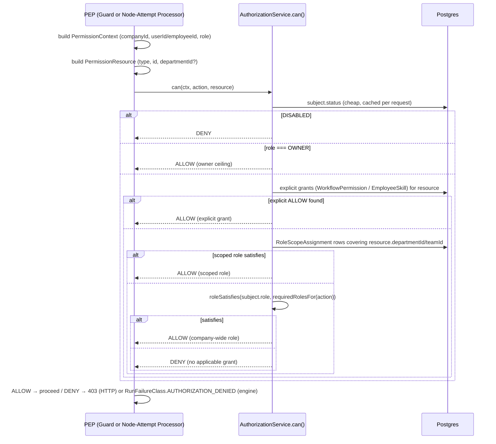
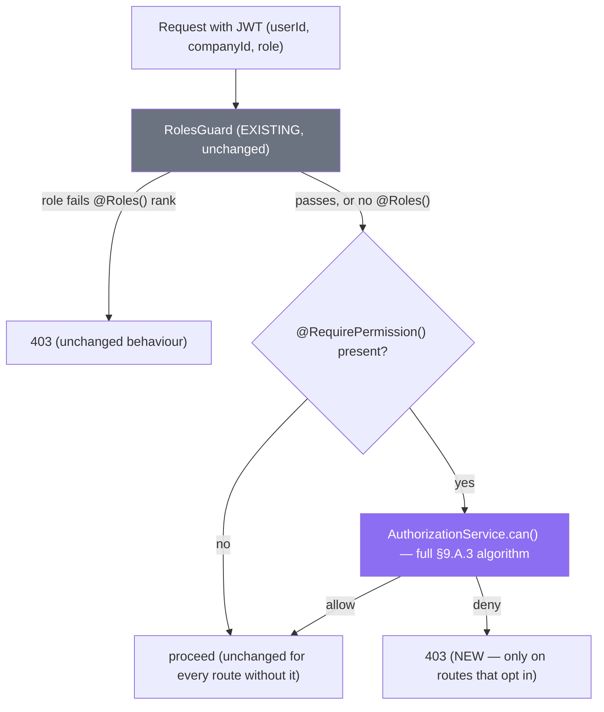
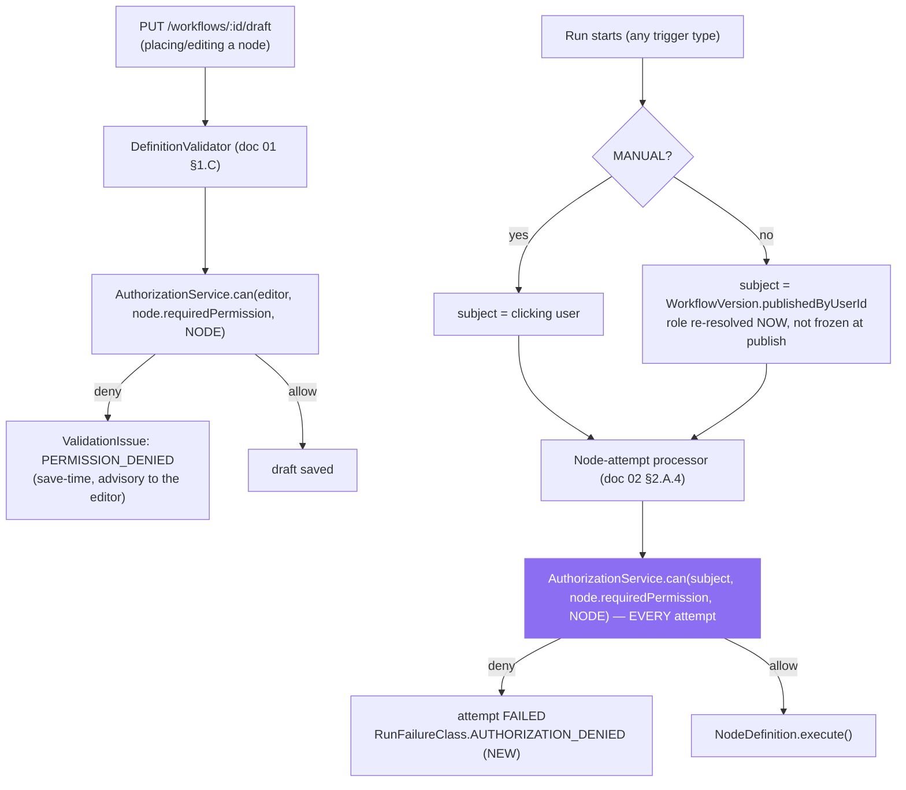
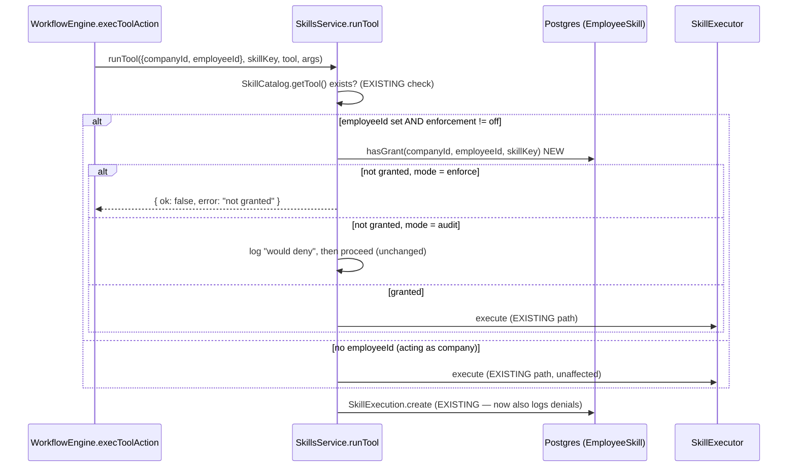
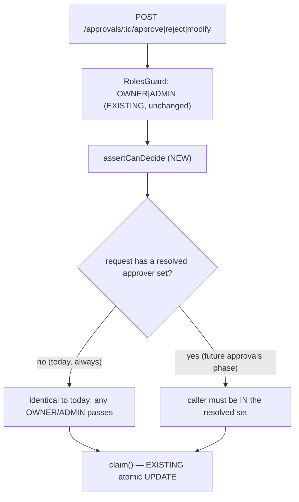

# Phase 9 — Permissions

**Prerequisite:** read `00-overview-and-canonical-contracts.md` first. §0.7 is normative; this
document uses those names and does not redefine them. This document also fulfils several forward
references already made by `01-workflow-core.md` (§1.A.11: "`workflow:publish` … Phase 9 defines the
taxonomy"; §1.A.5: `Workflow.departmentId`/`ownerUserId`, "Phase 9 scoping"; §1.B.11; §1.F.11) and by
`02-node-architecture.md` (§2.A.7: `NodeConfigField`, `requiredPermission: 'node:logic:use'`;
§2.A.11: "`requiredPermission` … checked at execution time, not only at save time"). Where those
documents already named a concrete string or column, this document uses it verbatim rather than
inventing an alternative.

**Covers:** the 8-level permission model — Company · Department · Role · Employee · Workflow · Skill
· Node · Approval — the evaluation order and precedence between them, the permission-string
taxonomy, and execution-time (not just UI-time) enforcement.

**Governing decision:** back-compat with the existing 3-role `RolesGuard` is mandatory — there is
live production data (a real tenant with real running recruiting workflows), matching ADR-004's
"extend, don't redesign" constraint. New authorization is **additive**: a company with zero rows in
any new table behaves byte-for-byte like today.

**Closes gap:** G9 (`00-overview-and-canonical-contracts.md` §0.3.2 — "RBAC is company-wide only").

---

## 9.A Authorization model overview

### 1. Purpose

Today's authorization is one check: does `User.role` (`OWNER|ADMIN|MEMBER`, **EXISTING (KEEP)** —
`schema.prisma:19-23`) satisfy a route's `@Roles(...)` list, ranked `OWNER(2) ⊇ ADMIN(1) ⊇ MEMBER(0)`
(`roles.guard.ts:13-14,21-26,36-57`). It is company-wide, all-or-nothing, and HTTP-only — nothing
downstream of a controller re-checks anything. This section defines the **single decision point**
(a Policy Decision Point, PDP) that every one of the 8 levels flows through, so "who can do X" has
exactly one answer instead of eight ad hoc answers scattered across guards, services, and the engine.

### 2. Responsibilities

**Owns:** the evaluation algorithm and precedence across all 8 levels; the `AuthorizationService`
contract; the decision matrix (below); what "back-compat" means precisely.
**Does not own:** the mechanics of approval routing/SLA/escalation (a future Phase 8 concern — this
document only defines *who is authorized to decide*, §9.E); the node registry itself (`02-node-
architecture.md`); the skills catalogue (a future Phase 4 concern).

### 3. Architecture

**PDP/PEP split.** One `AuthorizationService.can(ctx, action, resource)` (the PDP) is called from
many Policy Enforcement Points (PEPs): NestJS guards at the HTTP boundary, and the node-attempt
processor inside the execution engine. No PEP re-implements the decision logic — each just gathers
its local `PermissionContext`/`PermissionResource` and asks the PDP. This is the direct fix for
today's shape, where `RolesGuard` *is* both the PDP and the only PEP, so nothing downstream of HTTP
(chat tool-calling, workflow node execution) is ever asked at all — this is precisely why gap (c),
closed in §9.D, was possible.

**The 8 levels, what defines each, and where it is enforced today vs after this document:**

| # | Level | Defined by | Enforced today | Enforced after §9 |
|---|---|---|---|---|
| 1 | Company | `User.role` | HTTP guard (`RolesGuard`) | unchanged (step 5 of §9.A.3's algorithm) |
| 2 | Department/Team | — (no mechanism exists) | **not enforced** | `RoleScopeAssignment` (NEW, §9.B) |
| 3 | Role | `ROLE_RANK` ceiling | HTTP guard | unchanged, plus a capability map (§9.B.3) |
| 4 | Employee | `EmployeeSkill` | **UI-list only** (`getToolsForEmployee`) | execution-time (NEW, §9.D) |
| 5 | Workflow | — (no mechanism exists) | **not enforced** | `WorkflowPermission` (NEW, §9.C) |
| 6 | Skill | `EmployeeSkill` (same table as Employee level) | **UI-list only** | execution-time (NEW, §9.D) |
| 7 | Node | — (`requiredPermission` field named in doc 02, not wired) | **not enforced** | save-time + execution-time (NEW, §9.C) |
| 8 | Approval | `@Roles('OWNER','ADMIN')` blanket (`approvals.controller.ts:49-82`) | any OWNER/ADMIN decides **any** request | scoped to the resolved approver, with a byte-identical fallback (NEW, §9.E) |

**Evaluation order and precedence (the exact algorithm).** For a given `(subject, action, resource)`:

```
1. Company kill-switch:     subject.status === 'DISABLED' → DENY (existing UserStatus check)
2. OWNER ceiling:           subject.role === 'OWNER'       → ALLOW  (hard-coded; see §9.A.11)
3. Explicit resource grant, most-specific subject first:
     USER grant  >  EMPLOYEE grant  >  TEAM grant  >  DEPARTMENT grant  >  ROLE grant
   (WorkflowPermission rows, §9.C; EmployeeSkill grants, §9.D)
   → first match ALLOWs; no match falls through
4. Scoped role ceiling:     does subject hold a DEPARTMENT/TEAM-scoped role (RoleScopeAssignment,
                            §9.B) whose scope contains `resource`, ranked ≥ action's required role?
   → ALLOW; else fall through
5. Company-wide role ceiling: roleSatisfies(subject.role, requiredRolesFor(action))  (EXISTING,
                              unchanged)
   → ALLOW; else fall through
6. Default:                 DENY
```

There is **no explicit-deny primitive** in v1 — only the presence or absence of a grant (§9.A.14
covers why, and when to add one). Steps are tried in order and the **first ALLOW wins**; nothing
after step 2 can override an OWNER, and nothing after step 3 can override an explicit grant. This
order is what makes the model back-compatible by construction: a company with zero `RoleScopeAssignment`
/`WorkflowPermission`/`EmployeeSkill`-enforcement rows always falls through to step 5, which is
*exactly* today's `roleSatisfies` check — unchanged inputs, unchanged output.

### 4. Flow Diagram



### 5. Database Design

This section defines the **shared context**, not the level-specific grant tables — those live where
they are most concrete: `RoleScopeAssignment` in §9.B.5, `WorkflowPermission` in §9.C.5. No table is
duplicated across sections.

**NEW enum, used by §9.B:**

```prisma
enum ScopeType {
  DEPARTMENT
  TEAM
}
```

### 6. API Design

**NEW — introspection endpoint** (support/admin tooling; answers "why can/can't this user do X",
the single most common access-control support question):

```
GET /authz/effective?userId=&action=&resourceType=&resourceId=
  → 200 PermissionDecision
```

Restricted to `@Roles('OWNER','ADMIN')` — it reveals another user's effective grants.

### 7. TypeScript Interfaces

```ts
/** NEW — Phase 9. Built fresh per request/attempt; never cached across requests
 * (a JWT claim would go stale the moment a grant is revoked — see §9.A.11). */
export interface PermissionContext {
  companyId: string;
  /** Absent for a pure system/automation identity — see §9.C.10 (run-as identity). */
  userId?: string;
  role: Role;                                    // EXISTING enum, company-wide ceiling
  /** Resolved once per check from RoleScopeAssignment (§9.B.5). */
  scopedRoles: Array<{ scopeType: ScopeType; scopeId: string; role: Role }>;
  /** Set when the acting identity is an AiEmployee context (workflow/automation runs). */
  employeeId?: string;
}

/** The closed catalogue of permission strings — see §9.C.3 for the taxonomy. */
export type PermissionAction = string;

export interface PermissionResource {
  type: 'WORKFLOW' | 'NODE' | 'SKILL' | 'EMPLOYEE' | 'APPROVAL' | 'ANALYTICS' | 'COMPANY';
  id?: string;
  /** Denormalised onto the resource for scope matching (e.g. Workflow.departmentId, doc 01 §1.A.5). */
  departmentId?: string | null;
}

export interface PermissionDecision {
  allowed: boolean;
  /** Which rule matched (or why none did) — surfaced by GET /authz/effective and fed to Phase 10's audit row. */
  reason: string;
  deniedAction?: PermissionAction;
}

/** NEW — the single PDP. */
export interface AuthorizationService {
  can(
    ctx: PermissionContext,
    action: PermissionAction,
    resource: PermissionResource,
  ): Promise<PermissionDecision>;
  /** Bulk form for the save-time validator / node-library filter (doc 01 §1.C.7's
   * `ValidationContext.allowedNodeTypes`, doc 02 §2.A.6) — avoids N round-trips. */
  allowedNodeTypes(ctx: PermissionContext): Promise<NodeType[]>;
}
```

### 8. JSON Examples

```json
// GET /authz/effective?userId=usr_alex&action=workflow:publish&resourceType=WORKFLOW&resourceId=wf_7Kd2
{
  "allowed": false,
  "reason": "no applicable grant: role=MEMBER (rank 0) < required ADMIN (rank 1); no WorkflowPermission PUBLISH grant; no scoped ADMIN role over departmentId=dep_people",
  "deniedAction": "workflow:publish"
}
```

### 9. Folder Structure

```
apps/api/src/modules/authz/                       NEW module (mirrors AuditModule's @Global() pattern)
├── authz.module.ts
├── authorization.service.ts                      the can()/allowedNodeTypes() PDP (§9.A)
├── permission-taxonomy.ts                        closed catalogue of strings + NodeCategory defaults (§9.C)
├── role-capabilities.ts                           ROLE_CAPABILITIES default map (§9.B)
├── scoped-roles.service.ts                        RoleScopeAssignment CRUD (§9.B)
├── scoped-roles.controller.ts                     /users/:id/role-scopes (§9.B)
├── workflow-permissions.service.ts                 WorkflowPermission CRUD (§9.C)
├── workflow-permissions.controller.ts              /workflows/:id/permissions (§9.C)
├── authz-introspection.controller.ts               GET /authz/effective (§9.A.6)
├── guards/
│   ├── scoped-roles.guard.ts                       companion to the EXISTING RolesGuard (§9.B)
│   └── workflow-permission.guard.ts                (§9.C)
└── decorators/
    └── require-permission.decorator.ts             @RequirePermission('workflow:publish')
```

Every other section in this document references this tree rather than repeating it.

### 10. Edge Cases

| Case | Behaviour |
|---|---|
| Company with zero `RoleScopeAssignment`/`WorkflowPermission` rows (every company today) | Steps 3-4 of §9.A.3 never match anything → falls straight to step 5, today's exact `roleSatisfies` result. Verified by construction, not by inspection: the new tables are additive inputs the algorithm consults, not a replacement for step 5. |
| Two scoped roles apply (e.g. TEAM ADMIN and DEPARTMENT MEMBER, same resource) | Step 4 takes the **highest rank** among all matching scoped roles, not the first found — a user who is ADMIN of a team inside a department they are only a MEMBER of should not be down-ranked to MEMBER. |
| `PermissionContext.role` is stale (user was demoted mid-request) | Re-read fresh from `req.user` (JWT-derived, short-lived access token — existing session model) on every check; never cached beyond one request. A demotion takes effect on the demoted user's *next* request, matching today's existing behaviour (the JWT already carries `role`, unchanged). |
| A resource (`Workflow`) has `departmentId: null` | Treated as company-wide/unscoped — no DEPARTMENT-scoped role can match it (there is nothing to match), so only company-wide roles apply. This is deliberately the *safe* default: an unscoped resource is not accidentally exposed to every department, it simply isn't reachable via department scoping at all. |

### 11. Security

- **The OWNER hard-coded bypass (step 2) is deliberate and must not be removed.** Every other rule in
  this document can, in principle, be revoked by an admin action; if OWNER access depended on a row
  in a revocable table, a bug or a bad migration could lock every OWNER out of their own company. This
  mirrors `users.service.ts`'s existing "only an OWNER may grant OWNER" and "cannot demote the last
  OWNER" guardrails — both already exist for exactly this reason and are preserved unchanged.
- **Enforcement is server-side only, everywhere in this document.** The canvas/UI may hide actions a
  user cannot perform (better UX), but every PEP (guard or node-attempt processor) calls the PDP
  itself — a hidden button is not a security control, per the hard requirement to be explicit about
  what is UI-only vs enforced.
- **No JWT-embedded scope claims.** `scopedRoles` is read fresh from `RoleScopeAssignment` on every
  check rather than embedded in the access token, trading a small amount of latency (addressed in
  §9.A.12) for the property that revoking a scoped role takes effect on the *very next* check, not
  only after the token expires.

### 12. Performance

- One `can()` call needs at most 2 indexed reads (explicit grant lookup, scoped-role lookup) beyond
  the already-loaded `req.user`. At the HTTP boundary this is negligible next to network latency.
- On the execution engine's hot path (per node-attempt), doc 00 §0.8 budgets **< 50 ms** engine
  overhead excluding the node's own work. A permission check must fit comfortably inside that:
  request-scope memoisation (§9.C.12) means a run with 20 nodes performs the workflow-level and
  scoped-role lookups **once**, not 20 times.

### 13. Scalability

`RoleScopeAssignment`/`WorkflowPermission` row counts scale with (users × scopes) and (workflows ×
grants) respectively — both small relative to execution volume (contrast `WorkflowRun`, which scales
with executions). Neither needs partitioning; both need the indexes specified in §9.B.5/§9.C.5.

### 14. Future Extension

- **Explicit deny grants.** Not built in v1 because it adds a second precedence question ("does a
  DENY at a more specific level ever lose to an ALLOW at a less specific one?") that has no forcing
  use case yet. If ever needed, it must slot in *before* step 3 (explicit grants), as its own step,
  with its own precedence rule stated as explicitly as §9.A.3's.
- **ABAC-style conditions** (e.g. "may run this workflow only during business hours") — expressible
  as an extra predicate on `WorkflowPermission` without changing the evaluation order.
- **Custom roles** beyond `OWNER|ADMIN|MEMBER` — a bigger change (the rank ceiling assumes a small
  total order); out of scope here, noted for completeness.

### 15. Best Practices

Every new authorization check in this codebase should call `AuthorizationService.can()` — never
re-implement rank comparison or grant lookup inline in a controller or service. When adding a new
guarded route, prefer composing the existing `@Roles()` (unchanged) with the new `@RequirePermission()`
decorator rather than replacing one with the other — both are checked (steps 3-5 do not skip step 5).

---

## 9.B Department & team-scoped RBAC (extends, never replaces, the 3-role guard)

### 1. Purpose

Give a Department/Team head authority over their own people and workflows without granting them
company-wide ADMIN — closing the specific half of G9 that reads "no department/team scoping" —
while leaving `RolesGuard`/`roleSatisfies`/`@Roles()` (`roles.guard.ts`, `roles.decorator.ts`)
completely unchanged in code and behaviour for every existing route and every existing company.

### 2. Responsibilities

Own `RoleScopeAssignment` (grant a `Role` scoped to one `Department` or `Team`, rather than the whole
company); own the migration of `AiEmployee.department` (today a plain `String?` at `schema.prisma:320`
— confirmed no FK) towards `AiEmployee.departmentId`; own the guardrails on *who may create a scoped
grant* (must not let a DEPARTMENT-scoped ADMIN grant themselves company-wide OWNER).

### 3. Architecture

**Why reuse the existing `Role` enum rather than invent a `ScopedRole` enum.** A department head
needs the *same shape* of authority (OWNER/ADMIN/MEMBER-style ranking) over a smaller resource set,
not a conceptually different kind of authority. Reusing `Role` means `roleSatisfies` (the existing,
tested rank comparison) is reused unchanged for scoped checks too — one comparison function, two
different scopes it is applied to. It also means a `RoleScopeAssignment` grant is never confused with
the company-wide `User.role` column: they are two independent columns, checked at two independent
steps of §9.A.3's algorithm (step 4 vs step 5), and neither can accidentally widen the other. A
DEPARTMENT-scoped `OWNER` grant makes no special sense (there is no "owner of a department"), so
`ScopedRoleAssignment.role` is validated to be `ADMIN | MEMBER` only, never `OWNER` — enforced at the
grant-creation service, not the DB (a targeted `CHECK`-style validation, since Prisma enums do not
support subset constraints).

**Role capability map — what each company-wide role gets by default**, feeding §9.A.3 step 5. This is
new (today's "capability" is implicit in scattered `@Roles()` calls); making it an explicit table is
what lets §9.C derive per-action requirements consistently:

```ts
/** NEW — the default (company-wide, no scoping) capability set per Role.
 * A scoped grant (§9.B) can ADD capability within its scope; it never removes
 * company-wide capability. */
export const ROLE_CAPABILITIES: Record<Role, PermissionAction[]> = {
  OWNER:  ['*'],  // step 2 of §9.A.3 already short-circuits OWNER; listed for completeness
  ADMIN:  [
    'workflow:update', 'workflow:edit_graph', 'workflow:publish', 'workflow:run',
    'workflow:delete', 'workflow:manage_permissions',
    'employee:manage', 'approval:decide', 'analytics:cost:view',
    'node:*:use',
  ],
  MEMBER: ['workflow:run', 'node:*:use'],   // today's exact status quo (§9.C.11)
};
```

**Back-compat proof.** A company with zero `RoleScopeAssignment` rows: §9.A.3 step 4 always finds no
match (there is nothing to match) and falls through to step 5, which evaluates `roleSatisfies` exactly
as `RolesGuard` does today. The new guard (§9.B.6) is composed *alongside* `RolesGuard`, not instead
of it — a route keeps its existing `@Roles()` decorator unchanged and gains an *optional* `@RequirePermission()`.

### 4. Flow Diagram



### 5. Database Design

```prisma
/// NEW — Phase 9. A Role granted over ONE department or team, additive to the
/// company-wide User.role. Absence of any row for a user is the status quo.
model RoleScopeAssignment {
  id              String    @id @default(cuid())
  companyId       String
  company         Company   @relation(fields: [companyId], references: [id], onDelete: Cascade)
  userId          String
  user            User      @relation(fields: [userId], references: [id], onDelete: Cascade)
  /// Validated ADMIN|MEMBER only at the service layer — see §9.B.3.
  role            Role
  scopeType       ScopeType
  /// Department.id or Team.id depending on scopeType. A PLAIN column, not an
  /// FK — mirrors this codebase's existing convention for a column that can
  /// point at one of two different tables (e.g. SkillExecution.employeeId has
  /// no relation() either); application code validates it belongs to
  /// `companyId` at write time (§9.B.6).
  scopeId         String
  grantedByUserId String
  createdAt       DateTime  @default(now())

  @@unique([userId, scopeType, scopeId])
  @@index([companyId, scopeType, scopeId])   // "who has a role over this dept/team" (hot path, §9.A.4)
  @@index([companyId, userId])                // "this user's scoped roles" (§9.A.4)
}
```

**Why a single `scopeId` column, not nullable `departmentId`/`teamId` columns.** A two-nullable-FK
design (`departmentId String?`, `teamId String?`) makes `@@unique([userId, scopeType, departmentId,
teamId])` silently useless for the DEPARTMENT case: Postgres treats `NULL` as distinct from `NULL`, so
two DEPARTMENT-scope rows (both with `teamId = NULL`) would never collide on the unique index — the
exact footgun already documented in this codebase for `InstalledSkill`'s compound key
(`skills.service.ts:592-607`, "Prisma's generated compound-unique-index type requires `employeeId:
string`... a nullable column inside a compound unique index isn't actually enforced as unique by
Postgres for NULL"). A single non-nullable `scopeId` avoids the problem entirely.

**`AiEmployee.department` migration (EXTEND, non-breaking):**

```prisma
model AiEmployee {
  // … all EXISTING fields unchanged …
  department    String?       // EXISTING — retained verbatim during migration (see below)
  departmentId  String?       // NEW
  departmentRef Department?   @relation(fields: [departmentId], references: [id], onDelete: SetNull)

  @@index([companyId, departmentId])   // NEW
}
```

Migration: a best-effort backfill matches existing `department` (free text) against `Department.name`
(exact, case-insensitive) per company, setting `departmentId` where it matches; unmatched rows are left
`departmentId: null` (an honest "we could not confidently map this" — never fabricate a match). Both
columns coexist; `department` is not dropped in this phase (a later cleanup phase, once every UI path
reads `departmentId`, may deprecate it — not attempted here, per ADR-004's "extend, don't redesign").

### 6. API Design

```
GET    /users/:id/role-scopes                 list a user's scoped grants
POST   /users/:id/role-scopes                 { role: 'ADMIN'|'MEMBER', scopeType, scopeId }
DELETE /users/:id/role-scopes/:scopeId
```

All three: `@Roles('OWNER','ADMIN')` (existing decorator, unchanged) **plus** a service-layer check —
granting a scoped role over department D requires the caller to already hold company-wide ADMIN **or**
their own scoped ADMIN over that same D (so a department head can delegate within their own
department without needing a company OWNER for every grant, but cannot grant scope over a *different*
department they have no authority over).

```ts
/** EXTEND — RolesGuard is unchanged; this is a SEPARATE, composable guard. */
@Injectable()
export class ScopedPermissionGuard implements CanActivate {
  constructor(private readonly authz: AuthorizationService, private readonly reflector: Reflector) {}
  async canActivate(context: ExecutionContext): Promise<boolean> {
    const required = this.reflector.getAllAndOverride<PermissionAction | undefined>(
      REQUIRE_PERMISSION_KEY, [context.getHandler(), context.getClass()],
    );
    if (!required) return true;   // no @RequirePermission() → this guard is a no-op (back-compat)
    const req = context.switchToHttp().getRequest();
    const decision = await this.authz.can(buildContext(req), required, buildResource(req));
    if (!decision.allowed) throw new ForbiddenException(decision.reason);
    return true;
  }
}
```

### 7. TypeScript Interfaces

```ts
/** NEW — decorator, composable alongside the EXISTING @Roles(). */
export const REQUIRE_PERMISSION_KEY = 'requirePermission';
export const RequirePermission = (action: PermissionAction) =>
  SetMetadata(REQUIRE_PERMISSION_KEY, action);

export interface CreateRoleScopeRequest {
  role: Extract<Role, 'ADMIN' | 'MEMBER'>;   // OWNER is never scoped — §9.B.3
  scopeType: ScopeType;
  scopeId: string;
}
```

### 8. JSON Examples

```json
// POST /users/usr_deptlead/role-scopes
{ "role": "ADMIN", "scopeType": "DEPARTMENT", "scopeId": "dep_people" }

// GET /users/usr_deptlead/role-scopes
[
  { "id": "rsa_1", "userId": "usr_deptlead", "role": "ADMIN",
    "scopeType": "DEPARTMENT", "scopeId": "dep_people",
    "grantedByUserId": "usr_owner", "createdAt": "2026-08-01T09:00:00.000Z" }
]
```

### 9. Folder Structure

See §9.A.9 — `scoped-roles.service.ts`, `scoped-roles.controller.ts`, `guards/scoped-roles.guard.ts`.

### 10. Edge Cases

| Case | Behaviour |
|---|---|
| A `Department` is deleted while `RoleScopeAssignment` rows reference it | No DB cascade (not an FK, §9.B.5) — `OrganizationService.removeDepartment` (`organization.service.ts:86-90`) is **EXTENDed** to also `deleteMany` matching `RoleScopeAssignment` rows in the same call, mirroring how it already handles `Team.departmentId` (`SetNull`) for the FK case. |
| Cross-department manager (heads two departments) | Two `RoleScopeAssignment` rows, one per department — the unique constraint is per `(userId, scopeType, scopeId)`, so this is simply two rows, not a special case. |
| An `AiEmployee` with only the legacy `department` string set (pre-migration, unmatched) | Not scoped by department at all until `departmentId` is set — falls through to company-wide role only (§9.A.3 step 5), i.e. today's exact behaviour. Never inferred loosely from the string at check time — a fuzzy match used for *authorization* would be a real security bug, unlike the one-time best-effort backfill (§9.B.5) which only ever narrows, never grants, access. |
| Self-escalation via scoped grant | `RoleScopeAssignment.role` is restricted to `ADMIN|MEMBER` at the service layer — there is no scoped path to OWNER, so the existing `users.service.ts` self-escalation guard (verified: "you cannot change your own role") is structurally un-bypassable through this table. |

### 11. Security

Preserves every existing guardrail in `users.service.ts` (self-escalation prevention, last-OWNER
protection, "only an OWNER may grant OWNER") because none of them are touched — `RoleScopeAssignment`
is a strictly additive table that cannot express OWNER at all.

### 12. Performance

Covered by §9.A.12 — one indexed lookup, memoised per request.

### 13. Scalability

Covered by §9.A.13.

### 14. Future Extension

Org-chart inheritance (a department head's scope automatically covering child teams, once
`Team.departmentId` is populated consistently) — deliberately not built now because `Team`→`User`
membership does not exist at all yet (verified: `Team` has no relation to `User` in the current
schema) and inheritance without membership would be meaningless.

### 15. Best Practices

Grant the narrowest scope that solves the actual need (a TEAM grant over a DEPARTMENT grant where
possible). Never grant `OWNER` through this table — it is rejected by validation, but a reviewer
should treat a PR that tries to loosen that validation as a serious flag.

---

## 9.C Workflow, skill & node permission taxonomy

### 1. Purpose

Define the **permission-string taxonomy** that `NodeDefinition.requiredPermission` (doc 00 §0.7.2)
and doc 01/02's own forward references already assume exists, and the `WorkflowPermission` grant
table (named as NEW in doc 00 §0.7.3's entity-map legend) that backs Level 5 (Workflow) and
contributes to Level 7 (Node).

### 2. Responsibilities

Own the closed catalogue of permission strings; own `WorkflowPermission`; own the **run-as identity**
problem (who is "the subject" for a node's `requiredPermission` check when a run has no clicking
human — SCHEDULE/EVENT/WEBHOOK triggers). Does not own the node registry itself, nor the specific
`configSchema` of any node type (`02-node-architecture.md`).

### 3. Architecture — the taxonomy

**Format:** `<domain>:<resource>:<action>`. Confirmed, not invented: doc 01 §1.A.11/§1.C.11/§1.F.11
already name `workflow:update`, `workflow:edit_graph`, `workflow:publish`, `workflow:run` verbatim;
doc 02 §2.A.7 already names `node:logic:use` verbatim as a `NodeDefinition.requiredPermission` value.
This section is the formal, closed catalogue those strings belong to:

| String | Domain | Meaning | Default grant | Enforced at |
|---|---|---|---|---|
| `workflow:update` | workflow | edit container metadata | ADMIN; workflow owner (`Workflow.ownerUserId`, doc 01 §1.A.5) | `WorkflowsController` guard |
| `workflow:edit_graph` | workflow | edit the DRAFT graph | ADMIN; owner; explicit `EDIT_GRAPH` grant | guard + `WorkflowPermission` |
| `workflow:publish` | workflow | publish / rollback | ADMIN only (**not** owner-bypassed — see §9.C.11) | guard + `WorkflowPermission` |
| `workflow:run` | workflow | trigger a run | ADMIN, MEMBER (today's status quo) unless scoped down | guard + `WorkflowPermission` + `RunFactory` (doc 01 §1.F) |
| `workflow:delete` | workflow | archive / hard-delete | ADMIN | guard |
| `workflow:manage_permissions` | workflow | grant/revoke `WorkflowPermission` rows | ADMIN; owner (their own workflow only) | guard |
| `node:<category>:use` | node | place **and** execute a node of this `NodeCategory` | see the default table below | save-time validator (doc 01 §1.C) + every node-attempt (doc 02 §2.A.11) |
| `node:<category>:<specific>` | node | override for one high-risk `NodeType` within a category | opt-in per `NodeDefinition` | same as above |
| `skill:<skillKey>:<tool>` | skill | call one tool of one skill | via `EmployeeSkill` grant (§9.D) | `SkillsService.runTool` (single chokepoint) |
| `employee:manage` | employee | create/edit/pause an `AiEmployee` | ADMIN | guard |
| `approval:decide` | approval | decide a `PENDING` approval | ADMIN (today's blanket grant, refined per-request in §9.E) | `ApprovalService` |
| `analytics:cost:view` | analytics | see $ figures (`11-analytics.md` consumes this) | ADMIN | guard |

**`node:<category>:use` defaults, one per `NodeCategory` (doc 00 §0.7.1):**

| `NodeCategory` | Default `requiredPermission` | Note |
|---|---|---|
| `TRIGGER` | `node:trigger:use` | |
| `AI_EMPLOYEE` | `node:ai_employee:use` | budget is a separate, existing control (`AiEmployee.budgetLimit`) |
| `LOGIC` | `node:logic:use` | matches doc 02 §2.A.7's own example verbatim |
| `SKILL` | `node:skill:use` | the sharp edge is the *specific* tool — see `skill:<skillKey>:<tool>` and §9.D |
| `APPROVAL` | `node:approval:use` | placing a gate only ever adds a check |
| `MEMORY` | `node:memory:use` | writes persist into an employee's long-term memory |
| `KNOWLEDGE` | `node:knowledge:use` | `KNOWLEDGE_WRITE` mutates the shared company corpus |
| `VARIABLE` | `node:variable:use` | |
| `COMMUNICATION` | `node:communication:use` | `NOTIFY` becoming real dispatch (G7) sends real messages |
| `UTILITY` | `node:utility:use` | |
| `DATABASE` | `node:database:use`, but **`DB_QUERY` should override with `node:database:db_query`** | doc 02 §2.C.11 independently flags `DB_QUERY` as one of the two highest-risk new nodes |
| `EXTERNAL_API` | `node:external_api:use`, but **`HTTP_REQUEST` should override with `node:external_api:http_request`** | doc 02 §2.C.11 flags `HTTP_REQUEST` alongside `DB_QUERY` |

The override mechanism exists precisely so a company can allow `LOGIC`/`VARIABLE` nodes broadly to
every workflow editor while gating the two nodes doc 02 itself already called "highest-risk" more
tightly, without inventing a ninth `NodeCategory` just to separate them.

**Run-as identity — the hard problem.** `requiredPermission` is checked against a *subject*
(§9.A.3). A `MANUAL` run has one (the clicking user). `SCHEDULE`/`EVENT`/`WEBHOOK` runs do not.
**Decision:** the subject for those runs is the user who published the run's pinned
`WorkflowVersion` — `WorkflowVersion.publishedByUserId` (doc 01 §1.A.5, already added for audit
reasons; reused here for a second purpose) — with their **role re-resolved fresh at run time**, not
frozen at publish time. This is deliberate: `publishedByUserId` is a *pointer to who to check*, not a
snapshot of *what they could do* when they published. If the publisher is later demoted or disabled,
subsequent automated runs correctly lose whatever that would have granted — a stale frozen grant would
be the more dangerous failure mode (a departed employee's permissions silently "living on" inside an
automation forever).

### 4. Flow Diagram



The save-time check (top) is **advisory** — it improves the authoring experience by surfacing a
problem before publish. The execution-time check (bottom) is the **actual security boundary**,
per doc 02 §2.A.11's explicit requirement that a revoked permission must stop a *running* workflow,
not just future edits.

### 5. Database Design

```prisma
enum WorkflowPermissionSubjectType {
  USER
  ROLE
  DEPARTMENT
  TEAM
  EMPLOYEE
}

enum WorkflowPermissionAction {
  VIEW
  EDIT_GRAPH
  UPDATE
  PUBLISH
  RUN
  DELETE
  MANAGE_PERMISSIONS
}

/// NEW — doc 00 §0.7.3 entity map already names this table
/// (`Workflow ||--o{ WorkflowPermission : "scoped by"`); this is its definition.
model WorkflowPermission {
  id              String                          @id @default(cuid())
  companyId       String
  company         Company                         @relation(fields: [companyId], references: [id], onDelete: Cascade)
  workflowId      String
  workflow        Workflow                        @relation(fields: [workflowId], references: [id], onDelete: Cascade)
  subjectType     WorkflowPermissionSubjectType
  /// User.id / Role value (as string) / Department.id / Team.id / AiEmployee.id
  /// depending on subjectType — same plain-column rationale as §9.B.5.
  subjectId       String
  action          WorkflowPermissionAction
  grantedByUserId String
  createdAt       DateTime                        @default(now())

  @@unique([workflowId, subjectType, subjectId, action])
  @@index([companyId, workflowId])                  // "grants on this workflow" (hot path)
  @@index([companyId, subjectType, subjectId])       // "this subject's grants" (§9.A.6 introspection)
}
```

`Workflow` (doc 01 §1.A.5, EXTENDed further here): add `permissions WorkflowPermission[]` — additive
to doc 01's already-extended shape, no conflict.

### 6. API Design

```
GET    /workflows/:id/permissions                   list grants on a workflow
POST   /workflows/:id/permissions      { subjectType, subjectId, action }
DELETE /workflows/:id/permissions/:permissionId
```

Gated `workflow:manage_permissions` (§9.C.3) — not a blanket `@Roles()`, because a workflow *owner*
who is only a company-wide MEMBER must still be able to share their own workflow with a teammate.

### 7. TypeScript Interfaces

```ts
/** NEW — the closed catalogue, generated once at boot from NodeCategory + the
 * static table above, so a typo in a NodeDefinition's requiredPermission is a
 * boot-time failure (same pattern as doc 02's node-registry.spec.ts). */
export const PERMISSION_TAXONOMY = {
  workflow: ['update', 'edit_graph', 'publish', 'run', 'delete', 'manage_permissions'],
  node: ['use'],           // per-category, generated: node:<category-lowercase>:use
  skill: [],                // generated per installed skill: skill:<skillKey>:<tool>
  employee: ['manage'],
  approval: ['decide'],
  analytics: ['cost:view'],
} as const;

export function buildPermission(domain: string, resource: string, action: string): PermissionAction {
  return `${domain}:${resource}:${action}`;
}

/** Wildcard match — `node:*:use` (a role capability, §9.B.3) matches
 * `node:logic:use`, `node:database:db_query`, etc. */
export function matchesPermission(granted: PermissionAction, required: PermissionAction): boolean {
  const g = granted.split(':'), r = required.split(':');
  if (g.length !== r.length) return false;
  return g.every((seg, i) => seg === '*' || seg === r[i]);
}
```

### 8. JSON Examples

```json
// POST /workflows/wf_7Kd2/permissions
{ "subjectType": "TEAM", "subjectId": "team_screening", "action": "RUN" }
```

```json
// A denied node-attempt's step output (doc 02's NodeExecutionResult.output shape)
{
  "denied": true,
  "requiredPermission": "node:external_api:http_request",
  "reason": "no applicable grant: role=MEMBER; no WorkflowPermission RUN grant; publisher (usr_hrlead) is ACTIVE ADMIN — wait, this run IS MANUAL, subject is the clicking user"
}
```

### 9. Folder Structure

See §9.A.9.

### 10. Edge Cases

| Case | Behaviour |
|---|---|
| Publisher's account is later `DISABLED` (`UserStatus`, `schema.prisma:27-30`) | Automated (`SCHEDULE`/`EVENT`/`WEBHOOK`) runs of that published version start failing `AUTHORIZATION_DENIED` at the very next node whose `requiredPermission` the disabled user no longer satisfies — a real, surprising operational consequence. **Recommended mitigation** (flagged for the user-offboarding flow, not built here): before/when flipping a user to `DISABLED`, list `WorkflowVersion` rows where `publishedByUserId` = that user and `Workflow.activeVersionId` = that version, and prompt an admin to re-publish (re-stamping `publishedByUserId`) as part of offboarding. |
| A `Workflow.departmentId` is changed to move a workflow into a scope the mover doesn't control | Rejected — doc 01 §1.B.11 already states this requirement ("`departmentId` … must be settable only by someone with `workflow:update` **and** membership of \[or admin over\] the target department"); enforced here as an extra `AuthorizationService.can()` check inside `WorkflowsService`'s metadata-update path, specifically on the *target* department. |
| A node's `requiredPermission` is revoked while a run is `WAITING` at an `APPROVAL` gate mid-graph | Re-checked on *resume*, not only at the point it originally ran — resume re-enters the node-attempt path (doc 02 §2.A.4) like any other attempt. |
| A `SUB_WORKFLOW` call crosses into a workflow the parent's subject cannot run | Denied — `workflow:run` on the *callee* is checked using the **same subject** as the parent run, not the callee's own publisher. A workflow cannot be used to launder permission into another workflow the caller couldn't invoke directly. |

### 11. Security

- **`workflow:publish` is deliberately NOT owner-bypassed** the way `workflow:edit_graph`/`workflow:update`
  are — authorship of a draft and authority to put it into production are different trust levels (doc
  01 §1.A.11 already states this distinction; this section is where it becomes an enforced rule rather
  than a comment).
- **Execution-time enforcement is the actual boundary**, per doc 02 §2.A.11's explicit requirement.
  Save-time checks are advisory UX only — stated here again because it is the single most
  security-relevant sentence in this document: a permission hidden in the canvas but not re-checked by
  the engine is not a permission, it is a suggestion.
- **`HTTP_REQUEST`/`DB_QUERY` overrides exist specifically so a company can grant broad workflow-editing
  capability without also granting SSRF/arbitrary-query capability** — the taxonomy's granularity is a
  direct response to doc 02 §2.C.11's own risk assessment of those two node types.

### 12. Performance

A workflow's full set of distinct `requiredPermission` values is small and static per published
version (bounded by node count, ≤ the `maxSteps` ceiling). The engine resolves the run's subject once
per run (not per node) and memoises the `can()` result per distinct permission string for that run —
so a 20-node run using 4 distinct node categories performs 4 checks, not 20.

### 13. Scalability

Covered by §9.A.13; `WorkflowPermission` additionally scales with (workflows × grants), bounded and
small.

### 14. Future Extension

Marketplace template permission inheritance (a template's recommended grants pre-populate
`WorkflowPermission` on instantiate, per doc 01 §1.E); time-boxed grants (a `WorkflowPermission` with
an `expiresAt`).

### 15. Best Practices

Every new `NodeType` (Phase 2) must declare a `requiredPermission` — there is no "no permission
required" state; a node that declares none is a boot-time validation failure, not an open door. New
high-risk node types should default to a category-specific override (`node:<category>:<specific>`)
rather than sharing their category's blanket string, following the `HTTP_REQUEST`/`DB_QUERY` example.

---

## 9.D Employee-skill execution-time enforcement (closes gap (c))

### 1. Purpose

**Verified today:** `EmployeeSkill` grants are read in exactly one place —
`SkillsService.getToolsForEmployee` (`skills.service.ts:341-364`) — which builds the **chat LLM's
tool list** (its only caller: `tool-executor.service.ts:35`). The actual executor,
`SkillsService.runTool` (`skills.service.ts:371-449`), never re-checks the grant. `WorkflowEngine.
execToolAction` (`workflow-engine.service.ts:730-829`) calls `runTool` directly using the *workflow
node's own config* `skillKey`/`tool`/`employeeId` — with **zero** grant check anywhere in that path.
**Concretely, today: a workflow `TOOL_ACTION` node can call any company-installed skill/tool for any
employee in the company, regardless of that employee's assigned skills** — `EmployeeSkill` is a
UI-scoping table for the chat surface, not a security boundary. This closes that gap.

### 2. Responsibilities

Own the single execution-time grant check; own the safe, staged rollout (this is a **behaviour
change** for live workflows, not a pure addition — see §9.D.10); do not own the skill catalogue or
connector health (existing, `skills/catalog.ts`, `connectors/`).

### 3. Architecture

**The fix is one function, called from one place, because `runTool` is already the single chokepoint**
every caller converges on: chat (`tool-executor.service.ts`), workflows (`execToolAction`),
approval-execute (`approval.service.ts`'s `execute()`), and manual test-calls
(`SkillsService.executeInstalledTool`). Fixing `runTool` once closes the gap for all four
simultaneously — no caller needs its own change.

```ts
// EXTEND — apps/api/src/modules/skills/skills.service.ts, inside runTool()
// (existing signature/contract unchanged: still never throws for tool-level
// failures, still returns a ToolCallDto with ok:false — matching the EXISTING
// documented contract at skills.service.ts:366-370).
async runTool(
  ctx: ExecutorContext,
  skillKey: string,
  tool: string,
  args: Record<string, unknown>,
): Promise<ToolCallDto> {
  const safeArgs = (args ?? {}) as Record<string, unknown>;
  let outcome: SkillExecutionResult;

  if (!SkillCatalog.getTool(skillKey, tool)) {
    outcome = { ok: false, error: `Unknown skill/tool: ${skillKey}/${tool}` };
  } else if (
    ctx.employeeId &&
    (await this.enforcementMode(ctx.companyId)) !== 'off' &&
    !(await this.hasGrant(ctx.companyId, ctx.employeeId, skillKey))
  ) {
    // NEW (Phase 9 §9.D) — the single execution-time gate.
    const denied = `Employee is not granted the "${skillKey}" skill`;
    if ((await this.enforcementMode(ctx.companyId)) === 'audit') {
      this.logger.warn(`[audit-only] would deny: ${denied} (employeeId=${ctx.employeeId})`);
      outcome = await this.executeUnchecked(skillKey, tool, safeArgs, ctx);   // existing path, unblocked
    } else {
      outcome = { ok: false, error: denied };
    }
  } else {
    /* … EXISTING body unchanged (connector resolution, circuit breaker, executor call) … */
  }

  await this.prisma.skillExecution.create({ /* … EXISTING, unchanged — now also captures denials … */ });
  return { skillKey, tool, args: safeArgs, result: outcome.result ?? null, ok: outcome.ok };
}

/** NEW — the EXACT predicate getToolsForEmployee (skills.service.ts:345-346)
 * already uses to build the chat tool list. Same rule, now ALSO enforced at
 * the call site instead of only at the list site — so chat, workflows, and
 * manual calls all get the identical, already-battle-tested definition of
 * "granted", not a second, possibly-inconsistent one. */
private async hasGrant(companyId: string, employeeId: string, skillKey: string): Promise<boolean> {
  const row = await this.prisma.employeeSkill.findFirst({
    where: { companyId, employeeId, installedSkill: { skillKey, enabled: true } },
    select: { id: true },
  });
  return row !== null;
}
```

**No `employeeId` in context (`ctx.employeeId` absent/undefined) is an explicit, narrow bypass, not an
oversight:** it means "acting as the company" (a manual OWNER/ADMIN test-call via
`executeInstalledTool`, which passes `{companyId}` with no employee at all — verified,
`skills.service.ts:528`). There is no employee to check a grant against, and the caller is already
gated `@Roles('OWNER','ADMIN')` at the controller. **Recommendation for `02-node-architecture.md`'s
`TOOL_ACTION` validator:** warn (not yet error, to avoid a second breaking change bundled with this
one) when a graph calls an employee-scoped-only skill with no `employeeId` in the node config.

### 4. Flow Diagram



### 5. Database Design

No new table — `EmployeeSkill` (**EXISTING (KEEP)**, `schema.prisma:455-467`) is the grant mechanism
already; its `@@unique([employeeId, installedSkillId])` index already covers `hasGrant`'s lookup
pattern via the `installedSkill: {skillKey, enabled}` relation filter. **Optional performance
denormalisation** (recommended once volume warrants it, not required for correctness): add
`EmployeeSkill.skillKey String` (populated at `assign()` time, kept in sync — never re-derived at read
time) to avoid the join to `InstalledSkill` on the hot execution path:

```prisma
model EmployeeSkill {
  // … EXISTING fields unchanged …
  skillKey String?   // NEW, denormalised — nullable so existing rows don't need a blocking backfill
  @@index([companyId, employeeId, skillKey])   // NEW — join-free hasGrant() lookup
}
```

**Rollout flag — EXTEND `SecurityPolicy`** (`schema.prisma:657-668`, already the per-company settings
table, already has the precedent of a "stored, enforcement is a TODO" column in `dataRetentionDays`):

```prisma
model SecurityPolicy {
  // … EXISTING fields unchanged …
  skillGrantEnforcement String @default("enforce")   // NEW — "off" | "audit" | "enforce"
}
```

New companies default to `"enforce"`. **The one-time migration backfills every EXISTING company's row
to `"audit"`**, not the column's own default — an explicit, deliberate divergence (mirrors doc 00
§0.10's `WORKFLOW_ENGINE_MODE` per-company migration flag) so no live workflow starts failing the day
this ships.

### 6. API Design

No new endpoints (`assign`/`unassign`/`listEmployeeSkills` already exist,
`employee-skills.controller.ts`). New response shape only: a denied `TOOL_ACTION` step's `output`
carries `{ ok: false, error: "Employee is not granted the \"<skillKey>\" skill" }`, which
`execToolAction`'s existing `if (!call.ok) throw new Error(...)` (`workflow-engine.service.ts:825-827`)
converts into a step failure exactly like any other tool failure today (e.g. a quarantined connector)
— no new error-handling path needed in the engine.

### 7. TypeScript Interfaces

```ts
/** EXTEND — SecurityPolicyDto gains the new field (additive, non-breaking). */
export interface SecurityPolicyDto {
  // … EXISTING fields unchanged …
  skillGrantEnforcement: 'off' | 'audit' | 'enforce';   // NEW
}
```

### 8. JSON Examples

```json
// Denied ToolCallDto (mode: enforce)
{ "skillKey": "hubspot", "tool": "create_deal", "args": { "...": "..." }, "result": null, "ok": false }
```

```json
// The SkillExecution row this ALSO writes (EXISTING table, now capturing denials too)
{
  "companyId": "cmp_acme", "employeeId": "emp_marketing_1", "skillKey": "hubspot", "tool": "create_deal",
  "status": "ERROR", "error": "Employee is not granted the \"hubspot\" skill",
  "createdAt": "2026-08-01T10:00:00.000Z"
}
```

### 9. Folder Structure

No new files — edits confined to `apps/api/src/modules/skills/skills.service.ts` (`hasGrant`,
`enforcementMode`, the new branch in `runTool`) and `organization/` (the `SecurityPolicy` field).

### 10. Edge Cases

| Case | Behaviour |
|---|---|
| **The real back-compat risk, verified:** a company-wide `InstalledSkill` install (`employeeId: null`) does **not** auto-create any `EmployeeSkill` row (verified: `install()`, `skills.service.ts:129-133`, only creates one `if (employeeId)` at install time) — an explicit `assign()` call is always required, even for a company-wide connection. **Today**, `execToolAction` never checks this, so a live workflow referencing `employeeId` + a company-wide skill the employee was **never explicitly `assign()`'d** currently *succeeds*. Turning on `enforce` would make it start *failing*. | This is precisely why the rollout is staged (§9.D.5): `audit` mode first, logging every would-be denial without blocking, for at least one full billing cycle; a one-time backfill script `EmployeeSkill`-assigns every `(employeeId, skillKey)` pair observed in the last 90 days of successful `SkillExecution`/`WorkflowStepRun` rows, so existing running automation is grandfathered in before `enforce` is ever the default. |
| A skill is assigned to an employee, then unassigned mid-run (a run already past that `TOOL_ACTION` node) | No effect on already-completed steps (immutable history); the *next* attempt of that node (e.g. a retry) re-checks and is denied — same "re-checked every attempt" principle as §9.C.3. |
| `enforcementMode` read on every `runTool` call | One additional indexed read (`SecurityPolicy` by `companyId`, already a hot lookup elsewhere in the codebase) — folded into the same `Promise.all` as the grant check to avoid serial round-trips (implementation detail, not a new query pattern). |

### 11. Security

**Before this section:** enforced only for the chat surface's tool *listing* (cosmetic/advisory —
nothing stopped a direct call). **After:** enforced at the single execution chokepoint (`runTool`),
server-side, for every caller — chat, workflows, approval-execute, and manual test-calls alike. This
is the concrete answer to the hard requirement to state explicitly what is enforced server-side vs
merely hidden in the UI: today it was the latter; this section makes it the former.

### 12. Performance

One additional indexed lookup per tool call (or zero additional round-trips once folded into the
existing connector-resolution query, `resolveExecutorContext`, `skills.service.ts:539-584`, which
already loads the `InstalledSkill` row on the real/auto-executor path). Negligible next to the LLM/
provider call latency it gates.

### 13. Scalability

The rollout flag is per-company (`SecurityPolicy`, tenant-scoped), consistent with ADR-005's
per-tenant philosophy — one company's staged rollout never affects another's.

### 14. Future Extension

Time-boxed grants (temporary skill access, an `EmployeeSkill.expiresAt`); self-service skill requests
gated by an `APPROVAL` node.

### 15. Best Practices

Never call `SkillExecutor.execute()` or a provider API directly from a new node type or service —
always go through `SkillsService.runTool`, which is now the one place both connector health *and*
employee-grant enforcement live. A new call site that bypasses `runTool` silently reopens this gap.

---

## 9.E Approval authorization (Level 8)

### 1. Purpose

**Verified today:** deciding *any* `ApprovalRequest` — approve, reject, or modify — requires only
`@Roles('OWNER','ADMIN')` at the controller (`approvals.controller.ts:49-82`). Any OWNER/ADMIN in the
company can decide any request; there is no per-request targeting at all (matches the memory note
"approval routing has no per-person targeting"). This section defines the *authorization* half of
fixing that — **not** the routing/SLA/escalation mechanics (`ApproverRuleType`, assignee, due dates —
doc 00 §0.7.1 already reserves these names for a future approvals phase).

### 2. Responsibilities

Own `assertCanDecide(user, request)` — is *this* caller allowed to decide *this specific* request —
and its safe, additive fallback when no routing data exists yet. Do not own how an approver is
*chosen*/notified/escalated.

### 3. Architecture

`ApprovalService.approve/reject/modify` (`approval.service.ts:116-174`) gains a server-side
`assertCanDecide` call before its existing atomic `claim()` (`approval.service.ts:190-213`, an
already-race-safe conditional `UPDATE ... WHERE status='PENDING'` — unchanged, reused as-is).
**Contract this document specifies, for a future approvals phase to fulfil:** once `ApprovalRequest`
carries a resolved assignee/approver set (an `ApproverRuleType`-driven resolution — doc 00 §0.7.1),
`assertCanDecide` checks the caller against *that specific* set. **Until that data exists**,
`assertCanDecide` falls back to *exactly* today's rule (`roleSatisfies(caller.role, ['OWNER','ADMIN'])`)
— so this section is safe to ship **before** a routing engine exists, and its behaviour is provably
unchanged until routing data is actually present on a request.

```ts
/** NEW — inserted before claim() in approve/reject/modify. */
async function assertCanDecide(
  authz: AuthorizationService,
  caller: PermissionContext,
  request: ApprovalRequestDto,
): Promise<void> {
  // Fallback path — byte-identical to today's @Roles('OWNER','ADMIN') until a
  // future approvals phase populates a resolved approver set on the request.
  if (!request.resolvedApproverUserIds || request.resolvedApproverUserIds.length === 0) {
    if (!roleSatisfies(caller.role, ['OWNER', 'ADMIN'])) {
      throw new ForbiddenException('Insufficient role to decide this approval');
    }
    return;
  }
  if (!request.resolvedApproverUserIds.includes(caller.userId!)) {
    throw new ForbiddenException('You are not an approver for this request');
  }
}
```

### 4. Flow Diagram



### 5. Database Design

None new here — `resolvedApproverUserIds` (or equivalent) is a future approvals phase's column on
`ApprovalRequest`; this document only specifies the shape `assertCanDecide` expects from it. **One
addition genuinely belongs here**, reusing an **EXISTING** table: `SecurityPolicy` (§9.D.5's
precedent) gains

```prisma
model SecurityPolicy {
  // … EXISTING + skillGrantEnforcement (§9.D.5) …
  preventSelfApproval Boolean @default(false)   // NEW
}
```

`false` by default (back-compat — today nothing prevents it).

### 6. API Design

No route shape change. New `403` case with a distinct message ("You are not an approver for this
request") so the frontend can distinguish "you're not privileged at all" from "you're privileged but
not the right person" — a materially different support conversation.

### 7. TypeScript Interfaces

See §9.E.3. `PermissionContext` (§9.A.7) is reused unchanged as `assertCanDecide`'s caller parameter.

### 8. JSON Examples

```json
// 403 from POST /approvals/apr_9/approve when preventSelfApproval is true and
// the caller is also the request's employeeId's manager who triggered the run
{ "statusCode": 403, "message": "You cannot approve a request you triggered yourself" }
```

### 9. Folder Structure

No new files — `assertCanDecide` lives in `apps/api/src/modules/approvals/approval.service.ts`.

### 10. Edge Cases

| Case | Behaviour |
|---|---|
| Self-approval (the approver is also the requester, e.g. an ADMIN whose own manually-triggered run hit the gate) | Blocked when `SecurityPolicy.preventSelfApproval = true` (opt-in, standard segregation-of-duties practice); allowed by default, preserving today's behaviour. |
| `resolvedApproverUserIds` exists but is empty (a routing rule resolved to nobody, e.g. a department with no ADMIN) | Falls back to the `roleSatisfies` path (§9.E.3's `if` condition already treats an empty array the same as absent) — an approval must never become undecidable because routing found no one. |

### 11. Security

Segregation of duties (§9.E.10) is the concrete new control; everything else in this section is
scaffolding for a future phase, deliberately built so it cannot *loosen* today's access (the fallback
is exact, not approximate).

### 12. Performance

One field check, no new query (the approver set, once it exists, is loaded with the request that was
already fetched).

### 13. Scalability

Not applicable — approval decisions are human-frequency, not execution-frequency.

### 14. Future Extension

Delegation ("approve on my behalf while I'm on leave" — a temporary addition to
`resolvedApproverUserIds`); the full `ApproverRuleType` resolution engine itself (a future approvals
phase, using the department/team scoping this document already built in §9.B as one of its resolution
strategies — `ApproverRuleType.DEPARTMENT`/`TEAM` resolve naturally against `RoleScopeAssignment`).

### 15. Best Practices

Do not build routing logic here — this section's only job is "given a resolved approver set (or none),
who may act on it." Keep that boundary sharp so a future approvals phase can own resolution without
touching authorization.

---

## 9.F Summary — additions flagged for promotion into doc 00 §0.7

| Name | Kind | Where defined here | Promote to |
|---|---|---|---|
| `RoleScopeAssignment` | table | §9.B.5 | §0.7.3 entity map + legend (currently missing) |
| `ScopeType` | enum | §9.A.5 | §0.7.1 |
| `WorkflowPermission` | table | §9.C.5 | §0.7.3 legend already names it; this is its first full definition |
| `WorkflowPermissionSubjectType`, `WorkflowPermissionAction` | enums | §9.C.5 | §0.7.1 |
| `PermissionContext`, `PermissionResource`, `PermissionDecision`, `AuthorizationService` | interfaces | §9.A.7 | §0.7.2 |
| Permission-string taxonomy (`PERMISSION_TAXONOMY`) | convention | §9.C.3/§9.C.7 | §0.7 (new §0.7.5 "Permission taxonomy" subsection recommended) |
| `RunFailureClass.AUTHORIZATION_DENIED` | enum value | §9.C.3 | §0.7.1 — **doc 00's current `RunFailureClass` has no value for an authorization/grant denial; this is a genuine gap in the canonical enum, not just an addition** |
| `AiEmployee.departmentId` | column | §9.B.5 | schema (Phase 12 consolidates) |
| `SecurityPolicy.skillGrantEnforcement`, `SecurityPolicy.preventSelfApproval` | columns | §9.D.5, §9.E.5 | schema (Phase 12) |
| `EmployeeSkill.skillKey` (optional denormalisation) | column | §9.D.5 | schema (Phase 12), only if/when volume warrants it |

---

**Next:** `10-audit.md` — Phase 10.
