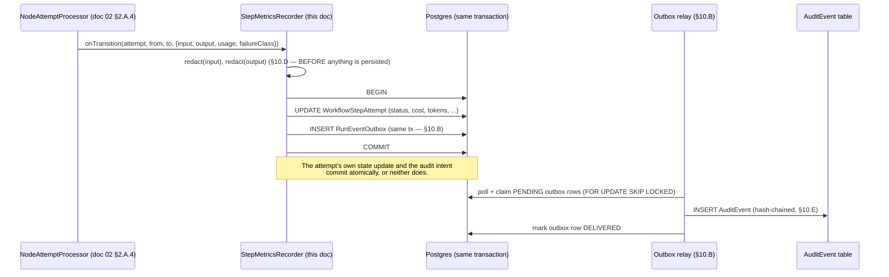
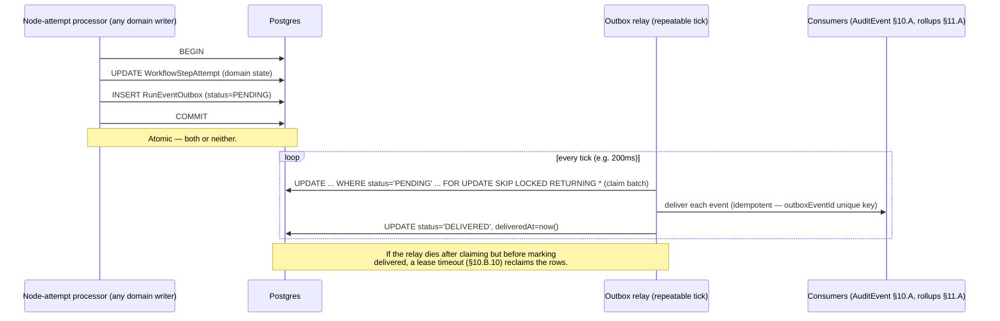
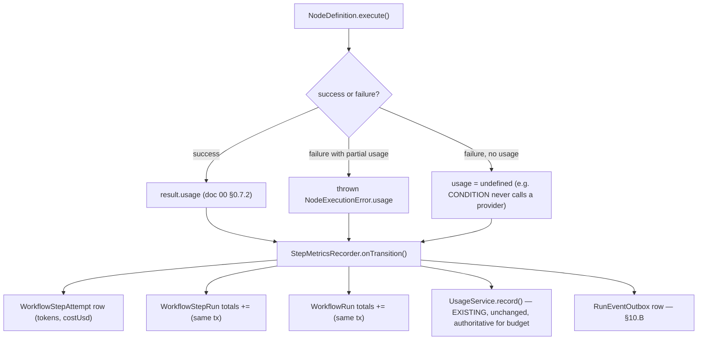
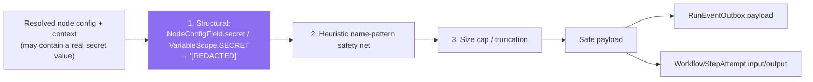
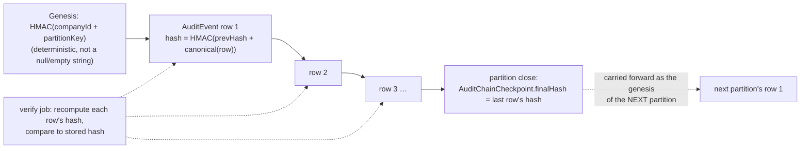
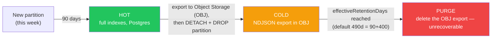

# Phase 10 — Audit

**Prerequisite:** read `00-overview-and-canonical-contracts.md` first. §0.7 is normative; this
document uses those names and does not redefine them. §0.7.3's entity-relationship diagram already
draws `WorkflowRun ||--o{ AuditEvent : "emits"` — **but its legend table (the EXISTING/NEW split
directly below the diagram) never lists `AuditEvent` at all.** That is an inconsistency in doc 00,
not a deliberate omission this document should preserve: §10.A resolves it by giving `AuditEvent` its
first full definition, flagged in §10.G for promotion into doc 00's legend. This document also reads
against `02-node-architecture.md` §2.A.5, which introduces a **minimal** `WorkflowStepAttempt`
(id/stepId/attempt/status/error/errorClass/timestamps) for retry bookkeeping and explicitly defers
"the full definition" onward — this document is where the cost/token/audit columns land, because they
are an economics/compliance concern, not a retry-mechanics one; Phase 12 is expected to consolidate
every phase's column additions into one physical table.

**Covers:** a unified, append-only audit event model logging Input · Output · Execution Time ·
Tokens · Cost · User · Company · Workflow · Node · Skill · Result for every action; the
transactional-outbox pattern that makes 100% completeness achievable; per-attempt cost/token
attribution; secret redaction; tamper-evidence; retention and partitioning.

**Governing decision:** audit writes must survive a crash between "the action happened" and "the
audit row landed" — today's `AuditLogService.record`/`UsageService.record` (`audit-log.service.ts:35-56`,
`usage.service.ts:46-68`) are explicitly best-effort (`try/catch` + `logger.warn`, swallow) and are
**kept exactly as they are** for their existing narrow purposes; this document does not touch them.
It adds a **separate, additive** high-volume stream for workflow execution specifically, because that
stream is the one doc 00 §0.8 requires 100% completeness for.

**Closes gap:** G11 (`00-overview-and-canonical-contracts.md` §0.3.2 — no cost/token attribution on
steps). Design target: doc 00 §0.8 — "Audit completeness: 100% of state transitions and every side
effect," "Run history retention: 90d hot, 400d cold, then purge (tenant-configurable)."

---

## 10.A Unified audit event model

### 1. Purpose

One append-only row per meaningful execution event — a run transition, a step-attempt transition, an
approval decision, a permission denial — carrying every field the brief requires (Input, Output,
Execution Time, Tokens, Cost, User, Company, Workflow, Node, Skill, Result) in one place, so "what
happened, and what did it cost" never requires joining three different tables with three different
retention policies and three different levels of trust.

### 2. Responsibilities

**Owns:** the `AuditEvent` shape and the boundary of what it covers (workflow execution) versus what
it deliberately does not replace: `AuditLog` (**EXISTING (KEEP)**, `schema.prisma:208-223`) stays the
low-volume human admin-action trail (role changes, skill installs — unchanged call sites); `SkillExecution`
(**EXISTING (KEEP)**, `schema.prisma:469-483`) stays the one-row-per-tool-call log for both chat and
workflows (unchanged — `SkillsService.runTool`, §9.D, still writes it); `UsageEvent` (**EXISTING
(KEEP)**, `schema.prisma:230-244`) stays the coarse company/employee cost stream `UsageService`
(`usage.service.ts`) uses for **live budget enforcement** (`execAiStep`'s check,
`workflow-engine.service.ts:685-696`) — a rollup is never safe to gate live spending against (§10.C.3
elaborates why). `AuditEvent` is additive on top of all three, not a replacement for any of them.

### 3. Architecture

**Decision: `AuditEvent` is written from exactly one place** — the node-attempt processor's
observability hook (doc 00 §0.7.4 already names `engine/observability/step-metrics.recorder.ts` as
NEW/Phase 10 in its folder structure; this document is that file's specification). This mirrors the
single-chokepoint principle already used for skill-grant enforcement (§9.D.3): one call site, every
caller inherits it.

**What triggers a row.** Doc 00 §0.8 says "100% of state transitions AND every side effect" — read
literally, that means a row per `WorkflowStepAttempt` transition (`PENDING→RUNNING`,
`RUNNING→COMPLETED|FAILED|RETRYING`) and per `WorkflowRun` transition
(`PENDING→RUNNING→COMPLETED|FAILED|CANCELLED|TIMED_OUT|WAITING`), not only per terminal outcome. At
10M attempts/day that is real write volume (§10.A.12 does the arithmetic) — mitigated, not avoided,
by three deliberate choices: (a) the outbox decouples the write from the hot path entirely (§10.B);
(b) only the **terminal** transition of an attempt carries the full input/output/cost/tokens payload —
an intermediate `RUNNING` marker is a slim row (ids + timestamp, no payload); (c) under sustained
overload, intermediate markers are an explicitly documented, tenant-visible **best-effort** degrade
valve — **terminal outcomes are never dropped, only the "started" marker may be**. This is a
deliberate, honest relaxation of "100%" for the one category of event that carries no unique
information a terminal event doesn't already imply (if a `COMPLETED` row exists, an attempt obviously
started).

**Why not fold this into `AuditLog`.** `AuditLog.actorUserId` is deliberately not a foreign key so it
outlives the acting user (`schema.prisma:203-207`'s own comment) — the same property `AuditEvent`
needs, and reuses. But `AuditLog`'s shape (`action`/`entityType`/`entityId`/`metadata`, one flat JSON
blob) has no dedicated tokens/cost/duration columns, and its reader
(`AuditLogService.list`, `audit-log.service.ts:58-88`) resolves actor names via a follow-up `User`
query on every read — fine at admin-action volume, wrong at 10M-attempts/day volume. Reusing it would
mean widening a table two other, unrelated features already depend on; a new table is the smaller,
safer change (ADR-004's spirit: extend, don't overload).

### 4. Flow Diagram



### 5. Database Design

```prisma
/// NEW — see §10.A.1's note on doc 00 §0.7.3's ER diagram already assuming this
/// table exists. This is its first full definition.
enum AuditEventCategory {
  RUN_LIFECYCLE       // WorkflowRun status transitions
  STEP_ATTEMPT        // WorkflowStepAttempt lifecycle (the high-volume category)
  APPROVAL_DECISION
  PERMISSION_DENIED   // AuthorizationService denials (Phase 9)
  SKILL_CALL          // mirrors a SkillExecution row for workflow-sourced calls (§10.A.2)
  SYSTEM              // watchdog sweeps, outbox reaper actions, etc.
}

/// NEW — append-only. Never UPDATEd or DELETEd by application code (§10.E);
/// rows leave only via the partition-drop purge (§10.F).
model AuditEvent {
  id                    String              @id @default(cuid())
  companyId             String
  category              AuditEventCategory
  /// e.g. "step_attempt.completed", "run.failed", "approval.rejected".
  action                String
  workflowId            String?
  workflowRunId         String?
  workflowStepRunId     String?
  workflowStepAttemptId String?
  employeeId            String?
  actorUserId           String?
  nodeId                String?
  nodeType              String?
  skillKey              String?
  tool                  String?
  /// REDACTED (§10.D) before this row is ever constructed — never raw.
  input                 Json?
  output                Json?
  result                String?             // 'SUCCESS' | 'FAILURE' | 'IN_PROGRESS'
  /// RunFailureClass (doc 00 §0.7.1, EXTENDed — see §10.G) when result = FAILURE.
  failureClass          String?
  errorMessage          String?
  promptTokens          Int?
  completionTokens      Int?
  costUsd               Float?
  durationMs            Int?
  attempt               Int?
  dryRun                Boolean             @default(false)
  /// Idempotency key back to the outbox row that produced this (§10.B.10).
  outboxEventId         String?             @unique
  /// Tamper-evidence chain (§10.E) — both null only for a partition's genesis row.
  prevHash              String?
  hash                  String?
  createdAt             DateTime            @default(now())

  @@index([companyId, createdAt])
  @@index([companyId, workflowRunId])
  @@index([companyId, employeeId, createdAt])
  @@index([companyId, nodeType, createdAt])
}
```

Partitioning (`PARTITION BY RANGE (createdAt)`, weekly) is specified in §10.F — the shape above is the
logical row; §10.F gives the physical `CREATE TABLE` with partitioning.

### 6. API Design

```
GET /audit-events?workflowRunId=&employeeId=&nodeType=&from=&to=&cursor=
  → 200 { items: AuditEventDto[], nextCursor }
```

Cursor pagination (never offset — the same reasoning as doc 01 §1.B.8's workflow list). Gated
`@Roles('OWNER','ADMIN')` (same convention as the existing `AuditLogController`,
`audit-log.controller.ts:11-14`). `POST /audit-events/verify?from=&to=` is specified in §10.E.6 (it
enqueues a job rather than scanning synchronously).

### 7. TypeScript Interfaces

```ts
/** NEW — public DTO. */
export interface AuditEventDto {
  id: string;
  companyId: string;
  category: AuditEventCategory;
  action: string;
  workflowId: string | null;
  workflowRunId: string | null;
  workflowStepRunId: string | null;
  employeeId: string | null;
  actorUserId: string | null;
  nodeId: string | null;
  nodeType: string | null;
  skillKey: string | null;
  tool: string | null;
  input: unknown;             // already redacted server-side — safe to return as-is
  output: unknown;
  result: 'SUCCESS' | 'FAILURE' | 'IN_PROGRESS' | null;
  failureClass: RunFailureClass | null;
  promptTokens: number | null;
  completionTokens: number | null;
  costUsd: number | null;
  durationMs: number | null;
  attempt: number | null;
  dryRun: boolean;
  createdAt: string;
}

/** NEW — the single write path every node-attempt transition goes through. */
export interface StepMetricsRecorder {
  onTransition(event: {
    companyId: string;
    workflowRunId: string;
    workflowStepRunId: string;
    workflowStepAttemptId: string;
    from: StepRunStatus;
    to: StepRunStatus;
    node: WorkflowNode;
    employeeId?: string;
    actorUserId?: string;
    input?: unknown;
    output?: unknown;
    usage?: { promptTokens?: number; completionTokens?: number; costUsd?: number };  // doc 00 §0.7.2
    failureClass?: RunFailureClass;
    errorMessage?: string;
    durationMs?: number;
    attempt: number;
    dryRun: boolean;
  }): Promise<void>;
}
```

### 8. JSON Examples

```json
// GET /audit-events?workflowRunId=run_9Qm4 — one terminal STEP_ATTEMPT event
{
  "id": "ae_8x1",
  "companyId": "cmp_acme",
  "category": "STEP_ATTEMPT",
  "action": "step_attempt.completed",
  "workflowId": "wf_7Kd2",
  "workflowRunId": "run_9Qm4",
  "workflowStepRunId": "wsr_4",
  "employeeId": "emp_hr",
  "actorUserId": null,
  "nodeId": "n_score",
  "nodeType": "AI_EMPLOYEE_STEP",
  "skillKey": null,
  "tool": null,
  "input": { "prompt": "Score this CV 0-100 against [REDACTED:policy_excerpt_too_large]" },
  "output": { "text": "87" },
  "result": "SUCCESS",
  "failureClass": null,
  "promptTokens": 812,
  "completionTokens": 4,
  "costUsd": 0.0025,
  "durationMs": 1340,
  "attempt": 1,
  "dryRun": false,
  "createdAt": "2026-08-01T09:12:03.412Z"
}
```

### 9. Folder Structure

```
apps/api/src/modules/audit/
├── audit-log.service.ts             EXISTING (KEEP) — unchanged, human admin-action trail
├── audit-log.controller.ts          EXISTING (KEEP)
├── audit-log.mapper.ts              EXISTING (KEEP)
└── events/                          NEW — Phase 10
    ├── audit-event.service.ts       read path (GET /audit-events)
    ├── audit-event.controller.ts
    ├── audit-event.mapper.ts
    ├── outbox.service.ts            enqueue(tx, event) — §10.B
    ├── outbox-relay.processor.ts    the BullMQ relay tick — §10.B
    ├── hash-chain.ts                computeRowHash / verifyChain — §10.E
    └── redaction.ts                 redact() — §10.D

apps/api/src/modules/workflows/engine/observability/    (doc 00 §0.7.4 already names this NEW dir)
├── run-tracer.ts                    EXISTING NAME (doc 00), not detailed further here
└── step-metrics.recorder.ts         THIS document's StepMetricsRecorder — the single call site
```

### 10. Edge Cases

| Case | Behaviour |
|---|---|
| An attempt never reaches a terminal state (worker dies mid-execution) | The existing stuck-run watchdog (`sweepStuckRuns`, `workflow-engine.service.ts:282-307`) is **EXTENDed** to also emit a terminal `AuditEvent` (`result: FAILURE`, `failureClass: INTERNAL`) for every step it sweeps — today it only writes `WorkflowStepRun.error`; without this extension, a swept run would have no audit record of its final, forced outcome. |
| A `dryRun` run's `TOOL_ACTION` attempt | Audited with `dryRun: true`, `costUsd: 0`, `promptTokens/completionTokens: null` — a preview is audited as "we previewed this," never conflated with "we actually spent money doing this." |
| A node type that has no cost (e.g. `CONDITION`, `SET_VARIABLE`) | `promptTokens`/`completionTokens`/`costUsd` are simply `null`, not `0` — `null` means "not applicable," `0` would mean "cost something, and it was free," a different and less honest claim. |

### 11. Security

PII/secret handling is the whole of §10.D; tamper-evidence is the whole of §10.E. Restated once here
because it is the load-bearing property of this table: **redaction happens before construction, not
before response** — `AuditEvent.input`/`output` never hold a raw secret even transiently, so a bug in
the `GET /audit-events` reader cannot leak one (there is nothing left to leak).

### 12. Performance

**The write-amplification arithmetic the brief asks for.** At 10M node-attempts/day
(doc 00 §0.8): ≈ 115.7 attempts/sec sustained average. With one slim `RUNNING`-marker row and one full
terminal row per attempt (§10.A.3), that is ≈ 231 `AuditEvent` rows/sec average from step attempts
alone, plus a small `RUN_LIFECYCLE` contribution (≈ 500K runs/day × ~5 transitions ≈ 29/sec) — **≈ 260
rows/sec sustained, plausibly 1,500–2,500/sec at burst** (peak-to-average ratios of 5-10x are typical
for business-hours-concentrated automation). None of this touches the hot request path directly
(§10.B's outbox decouples it); the number matters for **sizing the relay**, covered in §10.B.12.

### 13. Scalability

Weekly partitions (§10.F) bound any single partition's size regardless of total historical growth. Read
queries for a single `workflowRunId` (the common "show me this run's timeline" query) hit at most one
or two adjacent partitions, never a full-table scan, because `createdAt` is always known to be near
the run's own lifetime.

### 14. Future Extension

Migrate chat/manual `SkillExecution` call sites onto the same `AuditEvent` backbone once it has proven
itself on workflow execution (would unify "what happened" reporting across the whole product, not just
workflows); stream `AuditEvent` rows to an external SIEM (Datadog/Splunk) via an additional outbox
subscriber, with zero change to the table shape.

### 15. Best Practices

Never insert an `AuditEvent` row from anywhere except the outbox relay. If a new subsystem needs to be
audited, it enqueues an outbox event (§10.B) — it does not gain a second writer to this table.

---

## 10.B Transactional outbox

### 1. Purpose

Guarantee doc 00 §0.8's "100% of state transitions" despite this codebase's own established
best-effort convention (`AuditLogService.record`, `UsageService.record` — both explicitly "never
throws," fire-and-forget) being **provably insufficient** for that guarantee.

### 2. Responsibilities

Own `RunEventOutbox` (doc 00 §0.7.3's legend already names this table NEW); own the relay's claim/
delivery/retry semantics; do not own what the relay does with a claimed event once delivered (§10.A
for `AuditEvent`, `11-analytics.md` for rollup increments — both are downstream consumers of the same
outbox row).

### 3. Architecture

**Why fire-and-forget is provably insufficient.** Today's pattern
(`skills.service.ts`'s `install()` calling `auditLog.record()` **after** its own `$transaction`
commits, `skills.service.ts:111-143`) has a real gap: a crash or timeout between the domain
transaction's commit and the following `record()` call loses the audit row **silently** — the real
action already happened, and nothing says so. That gap is fine for `AuditLog` (an occasional missed
admin-action log line is a shrug, not an incident) and was an explicit, documented trade-off for it
(`audit-log.service.ts:30-34`: "Never throws — an audit-log write failing must not break the real
action"). It is **not** fine for a table whose entire purpose is a completeness guarantee.

**The fix: write the audit intent in the SAME transaction as the domain mutation.** The transaction
that flips a `WorkflowStepAttempt` to a terminal status also inserts one `RunEventOutbox` row — either
both commit, or neither does. A separate, asynchronous **relay** then delivers the outbox row to
`AuditEvent` (and any other consumer). The relay can crash and retry indefinitely without ever losing
the fact an event happened, because it was durably committed before the relay ever ran.

**Alternatives considered** (mirroring ADR-001's own honesty about trade-offs):
- **Two-phase commit across services.** Rejected — there is no second datastore involved (single
  Postgres); 2PC would solve a problem that doesn't exist here.
- **CDC / logical replication (Debezium reading the WAL).** The architecturally "proper" long-term
  answer, and genuinely superior once volume justifies it — but requires operating Debezium/Kafka, a
  second stateful system, which is the exact reasoning ADR-001 already used to reject Temporal for the
  execution engine. Rejected for v1 on the same grounds; kept as the explicit Future Extension (§10.B.14).
- **Synchronous audit write inside the domain transaction, no relay at all.** Rejected: it couples
  audit-table write latency/locking into the hot node-attempt transaction, and Phase 11's rollups still
  need an async fan-out mechanism regardless — building the outbox once and using it for both is
  cheaper than building the synchronous path and a separate relay later.

**Why the relay polls Postgres rather than enqueuing a BullMQ/Redis job inside the transaction.**
Enqueuing a Redis job "transactionally" alongside a Postgres commit is the classic **dual-write
problem** — exactly what the outbox pattern exists to avoid. So the relay discovers new rows by
**polling** `RunEventOutbox` (a lightweight repeatable BullMQ "tick" job, same
`upsertJobScheduler` pattern the existing workflow-run watchdog already uses,
`workflow.processor.ts:41-60`), claiming a batch with the **exact same atomic-claim idiom** this
codebase already relies on for run-claiming (`workflow-engine.service.ts:223-238`,
`updateMany({where:{status:'PENDING'}, ...})`):

```sql
UPDATE "RunEventOutbox"
SET status = 'CLAIMED', "claimedAt" = now()
WHERE id IN (
  SELECT id FROM "RunEventOutbox"
  WHERE status = 'PENDING'
  ORDER BY "createdAt"
  LIMIT 500
  FOR UPDATE SKIP LOCKED
)
RETURNING *;
```

`FOR UPDATE SKIP LOCKED` is what lets multiple relay workers run concurrently without claiming the
same row twice — a stronger, DB-native version of the same "only one caller wins" property
`updateMany` gives the run-claim path.

### 4. Flow Diagram



### 5. Database Design

```prisma
/// NEW — doc 00 §0.7.3 already names this table.
enum OutboxStatus {
  PENDING
  CLAIMED
  DELIVERED
  FAILED
}

model RunEventOutbox {
  id            String       @id @default(cuid())
  companyId     String
  aggregateType String       // 'WorkflowStepAttempt' | 'WorkflowRun' | 'ApprovalRequest'
  aggregateId   String
  eventType     String       // e.g. 'step_attempt.completed'
  /// Already redacted (§10.D) at construction time — safe to persist as-is.
  payload       Json
  status        OutboxStatus @default(PENDING)
  attempts      Int          @default(0)
  claimedAt     DateTime?
  deliveredAt   DateTime?
  createdAt     DateTime     @default(now())

  @@index([status, createdAt])     // the relay's claim query — a small hot index despite table size
  @@index([companyId, createdAt])
}
```

`@@index([status, createdAt])` stays cheap even as the table grows into the tens of millions of rows,
because `status='PENDING'` (or `'CLAIMED'`) is always a tiny fraction of the table — Postgres's planner
favours this composite index for exactly that skew; a partial index (`WHERE status IN ('PENDING',
'CLAIMED')`, hand-written migration SQL, Prisma cannot express partial indexes) is the recommended
refinement once volume is measured.

### 6. API Design

No public endpoint. **NEW operator route** `GET /admin/workflow-outbox/health` → `{ pendingCount, oldestPendingAgeMs }`
(**RESOLVED — `13-api.md` §13.0.2 ledger R8:** an earlier draft used an `/internal/*` prefix. The one
operator-surface convention in this codebase is `@Controller('admin')` + `@Roles('OWNER','ADMIN')`, so
this folds under `/admin`. Do not introduce an `/internal` prefix.)
for ops alerting, directly against doc 00 §0.8's "recovery from worker loss < 60s" target: alert if
`oldestPendingAgeMs > 60_000`.

### 7. TypeScript Interfaces

```ts
/** NEW — composable inside ANY existing Prisma $transaction call. */
export interface OutboxService {
  enqueue(
    tx: Prisma.TransactionClient,
    event: {
      companyId: string;
      aggregateType: 'WorkflowStepAttempt' | 'WorkflowRun' | 'ApprovalRequest';
      aggregateId: string;
      eventType: string;
      payload: Record<string, unknown>;   // caller MUST have already redacted (§10.D)
    },
  ): Promise<void>;
}
```

### 8. JSON Examples

```json
// A RunEventOutbox row awaiting relay
{
  "id": "obx_1", "companyId": "cmp_acme",
  "aggregateType": "WorkflowStepAttempt", "aggregateId": "wsa_88",
  "eventType": "step_attempt.completed",
  "payload": { "nodeId": "n_score", "nodeType": "AI_EMPLOYEE_STEP", "result": "SUCCESS", "costUsd": 0.0025 },
  "status": "PENDING", "attempts": 0, "createdAt": "2026-08-01T09:12:03.400Z"
}
```

### 9. Folder Structure

See §10.A.9 — `events/outbox.service.ts`, `events/outbox-relay.processor.ts`.

### 10. Edge Cases

| Case | Behaviour |
|---|---|
| Relay claims a batch, then the worker process dies before marking `DELIVERED` | Rows are stuck `CLAIMED` unless leased: a `claimedAt` older than a 2-minute lease timeout is swept back to `PENDING` by the **same repeatable tick** (mirrors `sweepStuckRuns`'s exact watchdog pattern, `workflow-engine.service.ts:282-307`) — reused idiom, not a new mechanism. |
| Duplicate delivery (a row is reprocessed after a crash-before-mark-delivered) | Downstream writes must be idempotent: `AuditEvent.outboxEventId` is `@unique` and the insert uses `ON CONFLICT DO NOTHING`; rollup increments (Phase 11) are recomputed from source over a bounded window rather than blindly incremented, so a replay cannot double-count. |
| A tenant's event volume spikes and the relay falls behind | `oldestPendingAgeMs` alerting (§10.B.6) fires before the backlog becomes user-visible; horizontal scale-out (more relay workers) is safe by construction (`FOR UPDATE SKIP LOCKED`). |

### 11. Security

Outbox payloads are already redacted at construction (§10.D) — the outbox itself never holds a raw
secret, even transiently, even though it is a durable Postgres row (unlike an in-memory queue, it
would otherwise be a second place a secret could be found at rest).

### 12. Performance

Against §10.A.12's arithmetic (≈ 260 rows/sec average, ≈ 1,500–2,500/sec peak): a 200ms tick claiming
up to 500 rows gives ≈ 2,500 rows/sec ceiling per relay worker — at the edge for peak on a single
worker. **Recommend 2-3 parallel relay workers** (safe via `FOR UPDATE SKIP LOCKED`) for 5,000–7,500/sec
combined capacity, comfortable headroom above the projected peak.

### 13. Scalability

Multiple relay workers scale horizontally with no coordination needed beyond the claim query itself.
The outbox table needs its **own**, much shorter retention than `AuditEvent` — once `DELIVERED`, a row
has no further purpose; recommend a 48-hour retention (a simple scheduled `DELETE ... WHERE status =
'DELIVERED' AND deliveredAt < now() - interval '48 hours'`, cheap at this table's transient population
size, unlike `AuditEvent`'s partition-drop requirement in §10.F).

### 14. Future Extension

Swap the polling relay for a Debezium/WAL-based CDC reader without changing `RunEventOutbox`'s shape —
the table is deliberately CDC-friendly (one row per event, a `payload` column, a status lifecycle) so
this is a relay-implementation change, not a schema migration, exactly mirroring how ADR-001 keeps the
door open to Temporal without redesigning the state machine.

### 15. Best Practices

Always call `OutboxService.enqueue()` **inside** the same `$transaction` as the domain write it
describes — never after it, and never outside a transaction at all. A new domain writer that "forgets"
the outbox insert reopens exactly the gap this section exists to close.

---

## 10.C Per-attempt cost & token attribution (closes G11)

### 1. Purpose

**Verified gap:** `WorkflowStepRun` has no tokens/cost/attempt columns at all (`schema.prisma:551-567`).
`UsageEvent` (`schema.prisma:230-244`) is a separate stream keyed only by `companyId`/`employeeId`/
`source` (a free-text string like `"workflow_ai_step"`, `workflow-engine.service.ts:717-723`) — **not**
joinable back to the specific step/run that spent the money. This section closes that.

### 2. Responsibilities

Own the EXTEND of `WorkflowStepAttempt` (introduced minimally by doc 02 §2.A.5) with the columns G11
needs; own the denormalised roll-up onto `WorkflowStepRun`/`WorkflowRun` so reads never need a `SUM()`
join; explicitly reconcile with the **existing** `UsageEvent`/`UsageService` stream rather than
replacing it.

### 3. Architecture

**`WorkflowStepAttempt` EXTEND** (doc 02 §2.A.5's minimal columns —
`id/stepId/attempt/status/error/errorClass/startedAt/finishedAt` — are kept verbatim; this document
adds the rest):

```ts
// doc 00 §0.7.2's EXISTING NodeExecutionResult.usage shape is the source of every
// number below — this document just specifies where it is persisted.
export interface NodeExecutionResult {
  // …
  usage?: { promptTokens?: number; completionTokens?: number; costUsd?: number };
}
```

At the end of every node-attempt (doc 02 §2.A.4's `NodeAttemptProcessor`), `StepMetricsRecorder`
(§10.A.7) persists `result.usage` onto the `WorkflowStepAttempt` row **and**, in the same transaction,
increments `WorkflowStepRun`'s denormalised totals — avoiding an aggregation query on every read of a
step's cost:

```prisma
model WorkflowStepRun {
  // … EXISTING fields unchanged …
  attemptCount            Int   @default(0)   // doc 02 §2.A.5 — already specified there
  category                String?             // doc 02 §2.A.5 — already specified there
  totalCostUsd            Float @default(0)    // NEW — sum across this step's attempts
  totalPromptTokens       Int   @default(0)    // NEW
  totalCompletionTokens   Int   @default(0)    // NEW
}
```

**A subtlety that matters for correctness: a FAILED attempt can still have spent money.** An LLM call
that fails partway through streaming, or fails validation *after* the provider already billed tokens,
still consumed real tokens. `NodeDefinition.execute()` implementations (doc 02) must report `usage`
even on failure — the recorder extracts it from a thrown error carrying a `usage` property when
present, not only from a successful `NodeExecutionResult`:

```ts
/** NEW — node executors that call a metered provider should throw this (or
 * attach `.usage`) instead of a plain Error when a failure still consumed
 * tokens, so cost accounting doesn't silently undercount failed attempts. */
export class NodeExecutionError extends Error {
  usage?: { promptTokens?: number; completionTokens?: number; costUsd?: number };
}
```

**Reconciling with `UsageEvent`/`UsageService` — deliberately NOT replaced.** `execAiStep`'s existing
call to `this.usage.record(...)` (`workflow-engine.service.ts:716-724`, writing a `UsageEvent` with
`source: 'workflow_ai_step'`) is **kept, unchanged** — `UsageService.totalCostForEmployee`
(`usage.service.ts:90-101`) is what the **same function's own live budget check**
(`workflow-engine.service.ts:685-696`) reads, synchronously, before the call is even made. A
Phase-11 rollup, refreshed every few minutes, is **not safe to gate real-time spending against** — a
company could overspend during the staleness window. So: `UsageEvent` stays the **authoritative,
synchronous** stream for enforcement; `WorkflowStepAttempt`'s new columns are the **precise, per-attempt**
stream for audit/reporting. The same `usage.record()` call and the same `StepMetricsRecorder` write
both happen from the same node-attempt outcome — no new round-trip, two consumers of one number.

**`WorkflowRun` EXTEND** — roll the same totals up one more level, plus the failure classification:

```prisma
model WorkflowRun {
  // … EXISTING fields unchanged …
  totalCostUsd          Float             @default(0)   // NEW
  totalPromptTokens     Int               @default(0)   // NEW
  totalCompletionTokens Int               @default(0)   // NEW
  /// NEW — doc 00 §0.7.1's RunFailureClass, EXTENDed (§10.G) with AUTHORIZATION_DENIED
  /// (Phase 9 §9.C/§9.D). NULL on historical FAILED runs predating this column —
  /// Phase 11's failure analytics must treat NULL as an explicit UNCLASSIFIED
  /// bucket (§10.C.10), never silently drop them from totals.
  failureClass          String?
}
```

### 4. Flow Diagram



### 5. Database Design

Covered inline in §10.C.3 (the `WorkflowStepAttempt`/`WorkflowStepRun`/`WorkflowRun` EXTEND blocks).
Index addition: `@@unique([stepId, attempt])` already exists per doc 02 §2.A.5; add
`@@index([companyId, createdAt])` on `WorkflowStepAttempt` (this document's `createdAt` addition) for
the retention sweep in §10.F.

### 6. API Design

Extend (additive, non-breaking) `WorkflowStepRunDto`/`WorkflowRunDto` (`packages/types/src/index.ts:1249-1275`)
with the new optional totals. No new endpoint required — the existing
`GET /workflows/runs/:runId` (`workflows.controller.ts:85`) and `GET /workflows/:id/runs`
(`workflows.controller.ts:151`) routes simply start returning populated fields where previously they
had none to return.

### 7. TypeScript Interfaces

```ts
/** EXTEND — additive optional fields, existing consumers unaffected. */
export interface WorkflowStepRunDto {
  // … EXISTING fields unchanged …
  attemptCount?: number;
  totalCostUsd?: number;
  totalPromptTokens?: number;
  totalCompletionTokens?: number;
}

export interface WorkflowRunDto {
  // … EXISTING fields unchanged …
  totalCostUsd?: number;
  totalPromptTokens?: number;
  totalCompletionTokens?: number;
  failureClass?: RunFailureClass | null;
}
```

### 8. JSON Examples

```json
// GET /workflows/runs/run_9Qm4 (abridged — new fields only)
{
  "id": "run_9Qm4",
  "status": "COMPLETED",
  "totalCostUsd": 0.0187,
  "totalPromptTokens": 5820,
  "totalCompletionTokens": 340,
  "failureClass": null
}
```

### 9. Folder Structure

No new files beyond §10.A.9's `step-metrics.recorder.ts` — it is the single writer for all three
EXTENDed tables in this section, in one transaction.

### 10. Edge Cases

| Case | Behaviour |
|---|---|
| A node retried 4 times before succeeding on the 5th | `attemptCount = 5`, `totalCostUsd` = the sum of **all 5** attempts, including the 4 failed ones that still consumed tokens (§10.C.3's `NodeExecutionError.usage`) — cost is never zero-filled for a failed attempt that actually spent money. |
| Historical `FAILED` `WorkflowRun` rows from before this migration | `failureClass = NULL`. Phase 11 (`11-analytics.md`) must present these as an explicit `UNCLASSIFIED` bucket in failure breakdowns, never silently excluded (which would understate historical failure counts) and never guessed at retroactively (fabricating a classification for old data is worse than admitting it is missing). |
| A node type that never calls a metered provider (`CONDITION`, `SET_VARIABLE`, `NOOP`) | `usage` is simply absent — columns stay `null`, `WorkflowStepRun.totalCostUsd` is unaffected (adding "nothing" to a running total). |

### 11. Security

Cost data is not personal data but is commercially sensitive (a competitor inferring per-employee
spend could infer margins) — gated the same way billing data already is, `@Roles('OWNER','ADMIN')`.

### 12. Performance

Denormalised running totals mean every read (`GET /workflows/runs/:runId`, a dashboard tile) is a
plain column select — never an aggregation over potentially thousands of attempt rows.

### 13. Scalability

`WorkflowStepAttempt` is the single highest-volume new table in this document set (one row per
attempt, 10M/day) — it is partitioned identically to `AuditEvent` (§10.F); the denormalised totals on
`WorkflowStepRun`/`WorkflowRun` deliberately do **not** need the same partitioning (their row count
scales with steps/runs, not attempts).

### 14. Future Extension

Reconcile `estimateCostUsd`'s flat illustrative rate (`usage-rates.ts:9-10`, $3/$15 per 1M tokens) with
real per-provider invoiced pricing once that data is available — the column names (`costUsd`) are
already provider-agnostic and would not need to change, only the value computed into them.

### 15. Best Practices

Every new AI-calling `NodeDefinition` must populate `NodeExecutionResult.usage` (or throw
`NodeExecutionError` with `.usage` set on a metered partial failure) — this is a code-review checklist
item, the same way doc 02 §2.A.15 already calls out `hasSideEffects` honesty as one.

---

## 10.D Redaction & secret handling

### 1. Purpose

Guarantee that a secret — a customer's API key, an OAuth token, a password an employee was asked to
reset — never lands in an `AuditEvent`/`RunEventOutbox` row, in a log line, or in a `WorkflowStepAttempt.
input`/`output` column, even though those columns must otherwise hold a faithful record of what a node
did.

### 2. Responsibilities

Coordinate with doc 00 §0.7.2's variable model (`VariableScope.SECRET`, `VariableDeclaration.secretRef`
— "a secret is always a reference, never a literal") and with doc 02's own save-time control
(§2.A.7's `NodeConfigField.secret`, §2.A.11: "`secret: true` config fields never accept a literal
value — the validator rejects a non-`secretRef` string"). Doc 02 already closes the **authoring-time**
half of this problem (a secret cannot be *typed into* a graph). This section closes the **runtime**
half: a valid `secretRef` still resolves to a real credential value during execution, and that
resolved value must not leak into anything durable.

### 3. Architecture

**Layered redaction, applied once, in `StepMetricsRecorder` (§10.A.3), before anything is
constructed:**

1. **Structural** — any field the node's `configSchema` marks `secret: true` (doc 02
   `NodeConfigField.secret`), and any variable of `scope: 'SECRET'` (doc 00 §0.7.2), is replaced with
   the fixed sentinel `"[REDACTED]"` before the resolved config/context ever reaches `input`/`output`.
   This is the primary, declarative control — it is complete for anything a node author declared.
2. **Heuristic safety net** — a field-name pattern list (`password|token|secret|api[_-]?key|
   credential|authorization|ssn`, case-insensitive) scrubs any field matching by *name*, even if not
   declared `secret` — catching an author's mistake, never relied on alone.
3. **Size cap** — any single `input`/`output` value over 32KB is truncated with a marker
   (`"[TRUNCATED: 128KB, see object storage export]"`) rather than persisted whole — protects both
   row size and, incidentally, the odds of an oversized blob containing something sensitive verbatim.

```ts
/** NEW — the ONLY place redaction happens; called once, inside StepMetricsRecorder. */
export function redact(value: unknown, schema?: NodeConfigField[]): unknown {
  const secretKeys = new Set((schema ?? []).filter((f) => f.secret).map((f) => f.key));
  return redactDeep(value, secretKeys);
}
```

### 4. Flow Diagram



### 5. Database Design

None new. The guarantee is structural: `AuditEvent.input`/`output` (§10.A.5) and
`WorkflowStepAttempt.input`/`output` (§10.C.3) are **post-redaction only, by construction** — there is
no raw-secret column anywhere to accidentally query.

### 6. API Design

`GET /audit-events` needs **no** redact-on-read logic — data is already safe at write time, which is
strictly cheaper and safer than redacting on every read path (fewer places to get it wrong).

### 7. TypeScript Interfaces

```ts
export interface Redactable {
  redact(schema?: NodeConfigField[]): unknown;
}
```

### 8. JSON Examples

```json
// Before (resolved config, never persisted)
{ "skillKey": "hubspot", "tool": "create_contact",
  "args": { "email": "jane@acme.com", "apiKey": "pat-na1-8f2c…" } }

// After (what actually reaches AuditEvent/RunEventOutbox)
{ "skillKey": "hubspot", "tool": "create_contact",
  "args": { "email": "jane@acme.com", "apiKey": "[REDACTED]" } }
```

### 9. Folder Structure

`events/redaction.ts` — see §10.A.9.

### 10. Edge Cases

| Case | Behaviour |
|---|---|
| A secret embedded **inside** free-text AI-generated output (the model echoes back a token it was given in-context) | Structural redaction cannot catch this — it does not know the *value* is a secret, only which *fields* are declared secret. The heuristic name-pattern net does not apply either (it is prose, not a keyed field). **Documented as a known, residual risk**, not silently claimed as fully covered — the honest mitigation is upstream: employee system prompts should instruct the model never to echo credentials, and `AI_EMPLOYEE_STEP`/`AI_STEP` outputs used as inputs to a later `TOOL_ACTION` should prefer structured (`AI_EXTRACT`) outputs over free text specifically to reduce this surface. |
| A node type omits `configSchema` entirely (should not happen post doc 02 §2.A.10's boot-time completeness check, but redaction must not assume it) | Structural redaction degrades to "no declared secret fields" for that node — the heuristic safety net (step 2) is the only remaining line of defence, which is exactly why it exists as a *net*, not an afterthought. |

### 11. Security

This entire section is a security control. The one sentence worth repeating: redaction happens
**before** a row is ever constructed, not before a row is returned — there is no code path where a raw
secret is durable, even momentarily.

### 12. Performance

O(size of the resolved config/context) per attempt — negligible next to the LLM/provider call latency
it sits beside.

### 13. Scalability

Not a scaling concern — cost is proportional to payload size, which is already capped (step 3).

### 14. Future Extension

Entropy-based secret scanning (detecting a high-entropy string that *looks* like a credential even
though no field declared it) as a second, independent safety net layered on top of the name-pattern
heuristic.

### 15. Best Practices

Node authors declare `secret: true` on every config field that can hold a credential — this is the
primary control; everything else in this section is a backstop for when that declaration is
missing or wrong. Never log a raw `context`/`config` object anywhere in the engine; log through
`redact()` or not at all.

---

## 10.E Tamper-evidence & immutability

### 1. Purpose

Answer, honestly, whether cryptographic tamper-evidence is worth building for this audit trail — and
if so, at what scope — rather than either skipping it or over-building a distributed-ledger solution
neither the threat model nor the infrastructure footprint justifies.

### 2. Responsibilities

Own the hash-chain design and its explicit, stated limitations. Does not claim to prevent tampering by
someone with both database write access and the signing key — that would require key custody outside
the reach of whoever can write to the database, which is out of scope for v1 (§10.E.14).

### 3. Architecture

**The justification.** Orlixa's realistic threat model here is a compromised application credential or
a rogue insider with database access editing or deleting past `AuditEvent` rows to hide an action —
not an adversarial multi-party ledger scenario. Full blockchain-style tamper-evidence (distributed
consensus, external anchoring) is disproportionate to that threat model and to a single-tenant-per-row,
single-Postgres-instance system. A **lightweight hash chain** — each row's `hash` derived from the
previous row's `hash` plus this row's own (already-redacted) content — gives real tamper-**evidence**
(any row edited or deleted after the fact breaks the chain from that point forward, detectable by a
verify job) at near-zero cost: one HMAC computation per row, computed with the platform's **already-
existing** `CryptoService.sign()` (`crypto.service.ts:94-96`, HMAC-SHA256 keyed by the same
`ENCRYPTION_KEY` already used to encrypt `InstalledSkill.credentials`) — no new cryptographic primitive,
no external service. **Decision: yes, worth it, scoped per-company-per-partition, not one global
forever-chain.**

**Why per-partition, not global.** A single chain spanning a company's entire history would make the
retention/purge job (§10.F) enormously expensive: deleting an old partition would invalidate the chain
for every row after it, unless a **checkpoint** carries the chain's state across the boundary. That is
exactly what is specified here: each partition closes with a **checkpoint hash** (`AuditChainCheckpoint`,
below), and the *next* partition's first row chains from that checkpoint, not from a null. Verification
can still walk across partition boundaries via the checkpoints; purge only ever removes a partition
whose checkpoint has already been sealed and carried forward — dropping old rows never breaks the
chain for rows that remain.

**What this does NOT give you — stated plainly, not oversold.** A hash chain **detects** tampering; it
does not **prevent** it. Someone with both database write access and the `ENCRYPTION_KEY` could, in
principle, edit a row and recompute every subsequent hash to match. True prevention needs the signing
key to live **outside** the reach of whoever can write to the audit table — an external KMS/HSM signing
service, or WORM storage — which is a real, larger investment, correctly deferred to Future Extension
(§10.E.14) rather than implied by this section's name.

**Concurrency constraint this design accepts.** Hash-chain integrity requires a **single serialized
writer per company-partition** — two concurrent inserts racing for "the previous row" would corrupt the
chain. This is not a new constraint invented for cryptographic reasons: the outbox relay (§10.B) already
processes one company's events in `createdAt` order (a natural consequence of claiming rows in creation
order); this section simply relies on that ordering rather than adding new locking. The relay may still
parallelize **across** companies freely.

### 4. Flow Diagram



### 5. Database Design

```prisma
/// NEW — one row per (company, partition), the carry-forward anchor across
/// the partition boundary that makes purge (§10.F) safe without breaking the chain.
model AuditChainCheckpoint {
  id           String   @id @default(cuid())
  companyId    String
  /// e.g. "2026-W31" — the ISO week the sealed partition covers (§10.F uses weekly partitions).
  partitionKey String
  finalHash    String
  sealedAt     DateTime @default(now())

  @@unique([companyId, partitionKey])
}
```

`AuditEvent.prevHash`/`hash` (§10.A.5) are populated by the relay (the single writer, §10.E.3) as each
row is inserted.

### 6. API Design

```
POST /audit-events/verify?from=&to=   → 202 { jobId }
GET  /audit-events/verify/:jobId      → 200 { status, brokenAt?: string }
```

An async job, not a synchronous scan — verifying a large range is a full sequential hash recomputation,
deliberately not exposed as a blocking request (consistent with this codebase's existing preference for
`202 Accepted` + poll over long synchronous calls, e.g. doc 01 §1.F.6's run creation).

### 7. TypeScript Interfaces

```ts
export function computeRowHash(prevHash: string, row: RedactedAuditRow): string {
  return crypto.sign(prevHash + canonicalize(row));   // reuses CryptoService.sign(), crypto.service.ts:94-96
}

export interface ChainVerificationResult {
  valid: boolean;
  /** First row id where hash != recomputed hash, if any. */
  brokenAt?: string;
}
```

### 8. JSON Examples

```json
{ "id": "ae_8x1", "prevHash": "3f9a1c…", "hash": "7b02e4…" }
```

### 9. Folder Structure

`events/hash-chain.ts` — see §10.A.9.

### 10. Edge Cases

| Case | Behaviour |
|---|---|
| The very first row of a fresh company/partition | Seeded with a **deterministic** genesis value — `HMAC(companyId + partitionKey)` — never a null or empty string, which would otherwise make an "empty chain" trivially fakeable (anyone could start a fresh, valid-looking chain from nothing). |
| Two AuditEvents for the same company technically ready at "the same instant" | Never actually concurrent at the point of hashing — the relay's single-writer-per-company ordering (§10.E.3) means one is always assigned before the other, by construction of the claim query's `ORDER BY createdAt`. |

### 11. Security

Detects, does not prevent, tampering absent an external key-custody boundary — restated from §10.E.3
because it is the one claim in this document most at risk of being oversold.

### 12. Performance

One HMAC computation per row (microseconds) — fully absorbed into the async relay; zero impact on the
node-attempt hot path.

### 13. Scalability

Per-partition chains verify independently and can be checked in parallel across partitions; a
verification job over a year of history is `O(rows in range)`, bounded by however many partitions the
range spans.

### 14. Future Extension

Anchor each partition's `AuditChainCheckpoint.finalHash` to an external, independent medium (a
third-party timestamping service, or publishing the hash into a wholly separate system's log) for
genuine non-repudiation — the actual fix for the "prevention, not just detection" gap noted in §10.E.3.

### 15. Best Practices

Never let application code outside the outbox relay write `AuditEvent.hash`/`prevHash` — a second
writer breaks the single-serialized-writer assumption the whole chain depends on.

---

## 10.F Retention, partitioning & purge

### 1. Purpose

Satisfy doc 00 §0.8's "90d hot, 400d cold, then purge (tenant-configurable)" concretely, and finally
implement the enforcement `SecurityPolicy.dataRetentionDays` (**EXISTING**, `schema.prisma:665`) has
been storing but never enforcing since it was added (`schema.prisma:628`'s own comment: "the rest are
STORED only (enforcement = TODO)").

### 2. Responsibilities

Own partitioning of `AuditEvent`/`WorkflowStepAttempt` (the two high-volume new tables); own the
hot→cold→purge lifecycle; own the interpretation of `dataRetentionDays` (including its current,
previously-undefined `0` default).

### 3. Architecture

**Partitioning cadence: weekly, not monthly.** At ≈ 260 rows/sec average (§10.A.12) `AuditEvent` alone
accumulates ≈ 20-30M rows/day, ≈ 140-210M/week. Monthly partitions would each hold 600-900M rows —
too large to `DROP` cheaply or to keep well-indexed; weekly partitions keep each one in the tens-to-
low-hundreds-of-millions range. Native Postgres declarative partitioning
(`PARTITION BY RANGE (created_at)`); a scheduled job pre-creates the next 4 weeks of partitions so an
insert never fails because tomorrow's partition doesn't exist yet.

**Hot → cold is an export, not a storage-tier flag.** Doc 00 §0.5's C4 diagram already draws an
**Object storage** container (`OBJ`) alongside Postgres — reused here rather than inventing a second
"cold tier" concept: at 90 days, a partition is exported (NDJSON, one file per partition) to object
storage, then **detached and dropped** from Postgres. This actually reduces Postgres storage as data
ages (the point of "cold"), and the export preserves full-fidelity data for the rare compliance
retrieval, without keeping 400 days of hot-indexed rows the platform never queries by then.

**Purge is a second, later deletion** — of the object-storage export itself, at
`min(effectiveRetentionDays, PLATFORM_MAX_RETENTION_DAYS)` (see §10.C.10 for `PLATFORM_MAX`'s role) —
a true, unrecoverable delete, because a retention *policy* that never actually deletes anything is not
a retention policy.

**Interpreting `SecurityPolicy.dataRetentionDays = 0`.** The column's own migration set `@default(0)`
with no enforcement ever built (`schema.prisma:665`), so `0`'s meaning was never actually defined
anywhere in the codebase — this document is the first place it is. **Decision: `0` means "use the
platform default (90d hot / 400d cold)," not "retain zero days."** The alternative reading (immediate
deletion) would be a silent data-loss trap for every existing company, since `0` is every company's
current value today. This is stated here explicitly, not left implicit, because it is exactly the
kind of default that is easy to get catastrophically wrong.

```ts
/** NEW — the one place "how long do we keep this company's audit data" is decided. */
export function effectiveRetentionDays(policy: SecurityPolicyDto): number {
  const requested = policy.dataRetentionDays > 0 ? policy.dataRetentionDays : PLATFORM_DEFAULT_RETENTION_DAYS;
  return Math.min(requested, PLATFORM_MAX_RETENTION_DAYS);   // a tenant may shorten, never lengthen past the ceiling
}
export const PLATFORM_DEFAULT_RETENTION_DAYS = 490;   // 90 hot + 400 cold
export const PLATFORM_MAX_RETENTION_DAYS = 490;        // v1: no tenant may exceed the platform ceiling
```

### 4. Flow Diagram



### 5. Database Design

```sql
-- Physical shape (Prisma cannot express native partitioning — hand-written
-- migration SQL, the same technique doc 01 §1.B.5 already uses for the
-- pgvector HNSW index and the generated tsvector column).
CREATE TABLE "AuditEvent" (
  -- … all columns from §10.A.5 …
) PARTITION BY RANGE ("createdAt");

CREATE TABLE "AuditEvent_2026w31" PARTITION OF "AuditEvent"
  FOR VALUES FROM ('2026-07-27') TO ('2026-08-03');
-- … one per week, pre-created 4 weeks ahead by a scheduled job …
```

```prisma
/// NEW — tracks partition lifecycle so the retention job doesn't need to
/// re-derive state from pg_catalog on every run (pg_class inspection remains
/// the fallback if this table and reality ever disagree).
model PartitionMaintenanceLog {
  id            String    @id @default(cuid())
  tableName     String    // 'AuditEvent' | 'WorkflowStepAttempt' | 'RunEventOutbox'
  partitionName String
  rangeStart    DateTime
  rangeEnd      DateTime
  archivedAt    DateTime?
  droppedAt     DateTime?
  createdAt     DateTime  @default(now())

  @@unique([tableName, partitionName])
}
```

### 6. API Design

No new endpoint — `GET/PATCH /organization/security-policy` (**EXISTING**,
`security-policy.controller.ts`) already exposes `dataRetentionDays`; this document only adds
enforcement behind that existing field. **NEW operator route** `POST /admin/workflow-retention/run-now`
(ops escape hatch — manual sweep for testing/incident response).
(**RESOLVED — `13-api.md` §13.0.2 ledger R8:** folded under `/admin` for one operator surface; an
earlier draft used `/internal/retention/run-now`. Do not introduce an `/internal` prefix.)

### 7. TypeScript Interfaces

See §10.F.3's `effectiveRetentionDays`. Plus:

```ts
export interface PartitionManager {
  ensureUpcomingPartitions(weeksAhead: number): Promise<void>;
  archiveEligiblePartitions(): Promise<{ archived: number }>;   // export to OBJ, detach+drop
  purgeEligibleArchives(): Promise<{ purged: number }>;          // delete from OBJ
}
```

### 8. JSON Examples

```json
// PartitionMaintenanceLog row after a full lifecycle
{
  "tableName": "AuditEvent", "partitionName": "AuditEvent_2026w05",
  "rangeStart": "2026-01-26T00:00:00.000Z", "rangeEnd": "2026-02-02T00:00:00.000Z",
  "archivedAt": "2026-05-03T02:00:00.000Z",
  "droppedAt": "2026-05-03T02:00:05.000Z"
}
```

### 9. Folder Structure

```
apps/api/src/modules/audit/retention/           NEW
├── partition-manager.service.ts    ensureUpcomingPartitions / archive / purge
├── archive.processor.ts            repeatable job — export + detach + drop
└── purge.processor.ts              repeatable job — delete OBJ exports past retention
```

### 10. Edge Cases

| Case | Behaviour |
|---|---|
| A tenant **lowers** `dataRetentionDays` after already accumulating more history than the new limit | The next sweep must catch up on the backlog, not just apply going forward — done as a **bounded, chunked** batch (partition-at-a-time, using the existing partition boundaries) rather than one giant `DELETE`, avoiding the lock/IO spike an unbounded delete would cause. |
| A partition still has `RunEventOutbox`-in-flight events referencing it when the 90-day mark is reached | Cannot happen in practice (the outbox's own 48-hour retention, §10.B.13, is far shorter than 90 days) — noted as a defensive ordering fact, not a case requiring special handling. |
| A compliance request needs data from a COLD (exported, partition-dropped) range | Served from the object-storage export (NDJSON), not from Postgres — a slower, explicitly-cold-storage retrieval path, which is the entire point of the tier. |

### 11. Security

Purge must be a true, unrecoverable delete (both the Postgres partition drop and the later object-
storage export deletion) — a retention policy that only ever "hides" data without deleting it does not
satisfy the compliance promise implied by having one at all.

### 12. Performance

Partition-drop is an `O(1)` metadata operation in Postgres, versus a row-by-row `DELETE` of hundreds of
millions of rows — **this is the reason partitioning is mandatory at this volume, not an optimisation**.

### 13. Scalability

Weekly partitions bound any single partition's size regardless of how large total historical volume
grows — the same property doc 01 §1.A.13 already relies on for `WorkflowVersion`, applied here to a
much higher-volume table.

### 14. Future Extension

Per-category retention overrides (e.g. keep `APPROVAL_DECISION` audit rows longer than routine
`STEP_ATTEMPT` rows, if a future compliance requirement asks for asymmetric retention by category).

### 15. Best Practices

Never run an unbounded `DELETE` against `AuditEvent`/`WorkflowStepAttempt` — always operate at
partition granularity (detach + drop), even for a one-off manual cleanup.

---

## 10.G Summary — additions flagged for promotion into doc 00 §0.7

| Name | Kind | Where defined here | Promote to |
|---|---|---|---|
| `AuditEvent` | table | §10.A.5 | §0.7.3 legend — **doc 00's ER diagram already assumes this table exists but its legend never lists it; this is the first full definition and the fix for that inconsistency** |
| `AuditEventCategory` | enum | §10.A.5 | §0.7.1 |
| `RunEventOutbox`, `OutboxStatus` | table + enum | §10.B.5 | §0.7.3 legend already names `RunEventOutbox`; `OutboxStatus` is new |
| `AuditChainCheckpoint` | table | §10.E.5 | §0.7.3 |
| `PartitionMaintenanceLog` | table | §10.F.5 | §0.7.3 |
| `RunFailureClass.AUTHORIZATION_DENIED` | enum value | referenced from `09-permissions.md` §9.C.3, consumed by `WorkflowRun.failureClass` here | §0.7.1 — flagged once already in `09-permissions.md` §9.F; repeated here because this document is the other consumer |
| `WorkflowStepAttempt` cost/token/redaction/hash columns | columns | §10.C.3, §10.D, §10.E.5 | schema (Phase 12 consolidates with doc 02 §2.A.5's retry columns into one physical table) |
| `WorkflowStepRun.totalCostUsd/totalPromptTokens/totalCompletionTokens` | columns | §10.C.3 | schema (Phase 12) |
| `WorkflowRun.totalCostUsd/totalPromptTokens/totalCompletionTokens/failureClass` | columns | §10.C.3 | schema (Phase 12) |
| `effectiveRetentionDays()`'s interpretation of `SecurityPolicy.dataRetentionDays = 0` | semantic decision | §10.F.3 | §0.7 (worth a normative note — this value's meaning was previously undefined anywhere in the codebase) |

---

**Next:** `11-analytics.md` — Phase 11.
