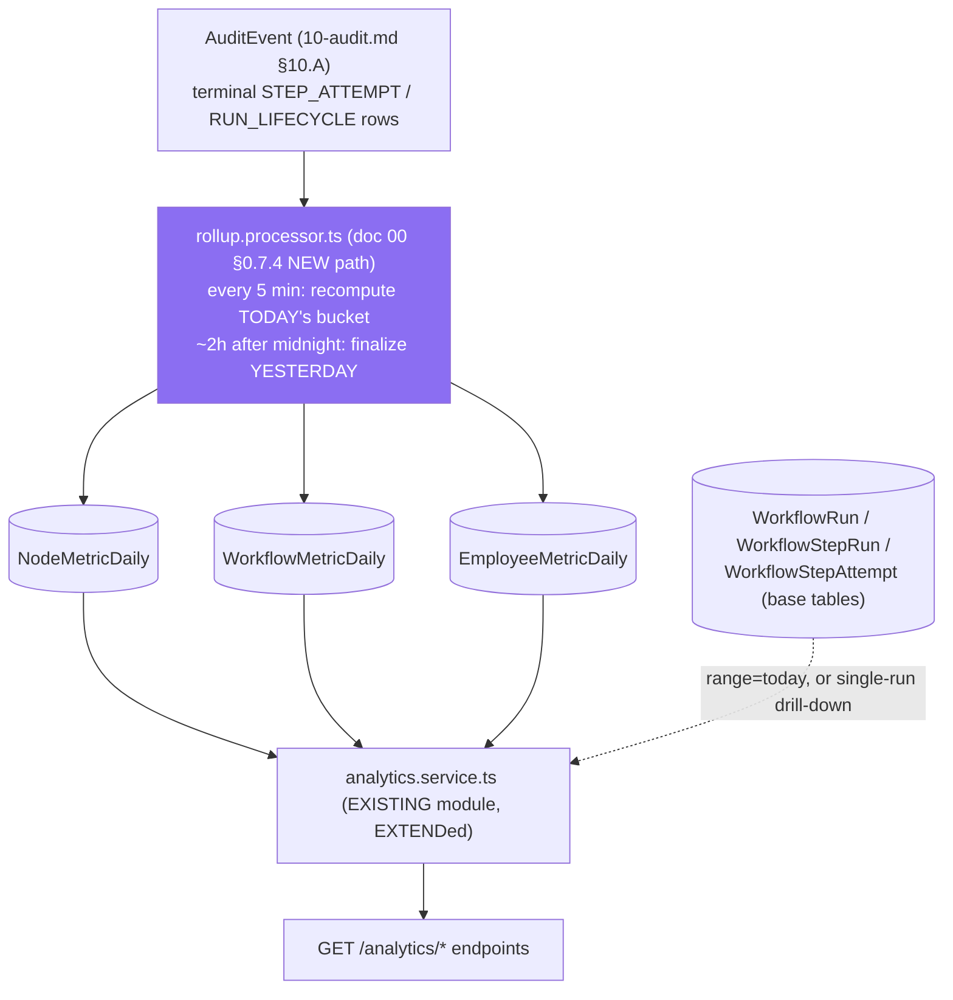
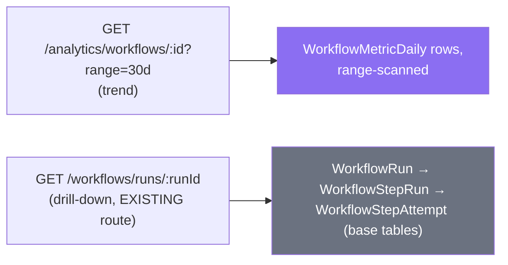
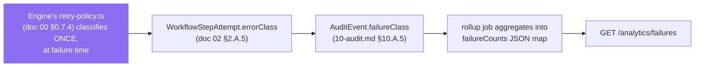
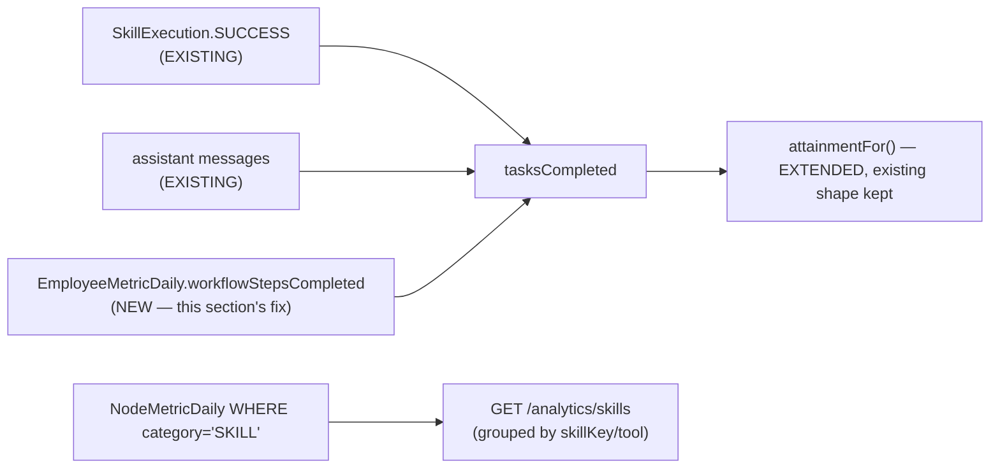

# Phase 11 — Analytics

**Prerequisite:** read `00-overview-and-canonical-contracts.md` first. §0.7 is normative; this
document uses those names and does not redefine them, including `NodeMetricDaily` (already named as
NEW in §0.7.3's entity-map legend — this document is its first full definition) and `RunFailureClass`
(§0.7.1, EXTENDed by `09-permissions.md` §9.C with `AUTHORIZATION_DENIED`, reused here verbatim for
failure analytics rather than string-matching error text). This document's primary data source is
`10-audit.md`'s `AuditEvent` stream (§10.A) — the rollup job described here is the second, batch
consumer of the same outbox-delivered events Phase 10 writes for compliance; Phase 10 exists first in
build order for exactly this reason (doc 00 §0.10 Wave W7 groups them together: "Needs W3's attempt-
level data to be worth reporting on").

**Covers:** Workflow Analytics · Node Analytics · Execution Analytics · Failure Analytics · AI Cost
Analytics · Employee Productivity · Skill Usage — pre-aggregated rollup tables, the rollup job, and
precise metric definitions (p50/p95/p99, success rate, cost per run/employee, KPI attainment).

**Governing decision:** the **existing** `AnalyticsService` (`analytics.service.ts`) aggregates live
from base tables on every request — its own module docstring says so explicitly
(`analytics.module.ts:6-9`: "Read-only aggregation over existing data... no new Prisma models, no
writes"). That is correct at today's volume and **will not survive** millions of executions (related
to gap G17). This document adds pre-aggregated rollups underneath the **same three existing
endpoints** (back-compat, unchanged response shapes) and new endpoints for the metric families the
existing service does not yet cover.

---

## 11.A Metric definitions & rollup architecture

### 1. Purpose

Define, precisely, what every number on an analytics dashboard means — because "success rate," "p95
latency," and "cost per run" are all ambiguous until a denominator, a computation method, and a
freshness bound are stated — and specify the rollup-table architecture that makes reporting on
millions of executions cheap regardless of how large the underlying execution history grows.

### 2. Responsibilities

**Owns:** the rollup table family (`NodeMetricDaily`, `WorkflowMetricDaily`, `EmployeeMetricDaily`),
the rollup job, and every metric's precise definition. **Does not own:** retention/partitioning of the
*raw* execution tables (`10-audit.md` §10.F) — rollups deliberately **outlive** raw-table purge, which
is the entire point of computing them (§11.A.10). **Architecture split, stated explicitly:** the
**write** side (the rollup job that computes these tables) lives in
`apps/api/src/modules/workflows/analytics/` — doc 00 §0.7.4 already names
`workflow-analytics.service.ts` and `rollup.processor.ts` there as NEW/Phase 11, so this document uses
those exact paths. The **read** side (serving dashboards) lives in the **existing**
`apps/api/src/modules/analytics/` module (`analytics.service.ts`, `analytics.controller.ts`,
`analytics.module.ts`) — **EXTENDed**, not replaced, because that module already owns the DTOs
(`OverviewDto`, `EmployeeKpiDto`, `ActivityFeedDto`) and the controller real frontend code depends on.
The engine that produces the source data owns computing the rollup; the analytics-facing module that
owns the response contracts owns reading it.

### 3. Architecture — metric definitions

**Success rate.** `COMPLETED ÷ (COMPLETED + FAILED + CANCELLED + TIMED_OUT)` over a window —
explicitly **excluding** `PENDING`/`RUNNING`/`WAITING` (unresolved) from the denominator. **Verified
existing ambiguity, left alone for back-compat:** today's `AnalyticsService.overview()`
(`analytics.service.ts:82-86`) computes `successDenominator = tool.actions + workflowRuns`, where
`workflowRuns` is `sumCount(workflowByStatus)` over **every** status in range (`analytics.service.ts:60-64,
74`) — i.e. in-flight runs are silently in the denominator today. This document does **not** silently
change `OverviewDto.successRate`'s existing meaning (a real frontend reads it); it defines the
**precise** figure above for the **new** rollup-backed endpoints instead, so the two coexist rather
than one silently redefining the other underneath existing callers.

**p50/p95/p99 latency.** Percentiles of `finishedAt − startedAt` (run-level) or a
`WorkflowStepAttempt`'s `durationMs` (node-level, `10-audit.md` §10.C). **Never computed with
`PERCENTILE_CONT` over raw rows at read time** — at 10M attempts/day that is an expensive full-scan
aggregate on every dashboard load. Instead, the **rollup job** computes `PERCENTILE_CONT` **once per
bucket per day**, off the hot path, and stores the result as plain columns; a read is then a column
`SELECT`, `O(1)` regardless of how many attempts underlie it.

**Cost per run / cost per employee.** "Cost per run" is a **distribution** across a workflow's runs
(`avgCostUsd`, `p95CostUsd` on `WorkflowMetricDaily`), not a single scalar — a single run's own total
cost is just `WorkflowRun.totalCostUsd` (`10-audit.md` §10.C.3), already denormalised there. "Cost per
employee" sums `WorkflowStepAttempt.costUsd` (`10-audit.md` §10.C) where the step's `employeeId`
matches, over a window — **explicitly reconciled, not silently duplicated**, against the **existing**
`UsageService.totalCostForEmployee` (`usage.service.ts:90-101`), which sums the coarser `UsageEvent`
stream instead: `UsageEvent` also captures **non-workflow** usage (ad-hoc chat), so its total is the
correct **company-wide/employee-wide total**; the rollup's workflow-attributed figure is a **precise
subset** of that total, not a competing, contradictory one. **Sharper, and load-bearing:** live
**budget enforcement** (`execAiStep`'s check, `workflow-engine.service.ts:685-696`) reads `UsageEvent`
**synchronously** and must keep doing so — a rollup refreshed every few minutes is never safe to gate
real-time spending against (a company could overspend during the staleness window). Rollups are for
**reporting**; `UsageEvent` remains authoritative for **enforcement**. This distinction is repeated
verbatim from `10-audit.md` §10.C.3 because getting it backwards would be a real production money bug.

**KPI attainment vs `AiEmployee.kpiTargets`.** **EXTENDs**, not replaces, the existing
`attainmentFor()` (`analytics.service.ts:318-345`) and its `KpiTargets{tasksPerWeek?, successRatePct?,
approvalsMax?}` shape (`packages/types/src/index.ts:289-293`). Elaborated fully in §11.F, because the
existing function has a concrete, verified gap: `tasksCompleted` today counts only
`SkillExecution.SUCCESS` + assistant messages (`analytics.service.ts:175`) — **workflow-run task
completion is not counted at all**. §11.F closes that.

**The rollup table family** (all NEW; `NodeMetricDaily` is the one doc 00 §0.7.3 names explicitly):

| Table | Grain | Powers |
|---|---|---|
| `NodeMetricDaily` | (company, day, workflow?, node?, nodeType, skillKey?, tool?) | Node Analytics (§11.C), Skill Usage (§11.F), Failure Analytics's per-node breakdown (§11.D) |
| `WorkflowMetricDaily` | (company, day, workflow) | Workflow Analytics (§11.B), Failure Analytics's per-workflow breakdown |
| `EmployeeMetricDaily` | (company, day, employee) | Employee Productivity (§11.F), AI Cost Analytics's per-employee breakdown (§11.E) |

**Source of truth for the rollup job: `AuditEvent`** (`10-audit.md` §10.A), specifically its terminal
`STEP_ATTEMPT` and `RUN_LIFECYCLE` rows — not raw `WorkflowStepAttempt` directly. `AuditEvent` already
carries every dimension a rollup needs in one row (`nodeType`, `skillKey`/`tool`, `costUsd`, tokens,
`durationMs`, `result`, `failureClass`) and is already redacted (`10-audit.md` §10.D) — the rollup job
never touches a raw, unredacted value.

**Idempotent recompute, not incremental counters.** The rollup job **recomputes** each day's bucket
from source rows within that bounded day-window on every run (a `GROUP BY` over one day, cheap — never
the whole history), then `UPSERT`s (`INSERT ... ON CONFLICT ... DO UPDATE`). This is deliberately
**not** "increment a counter per event" — the outbox's at-least-once delivery (`10-audit.md` §10.B)
means a redelivered event could double-count under a pure-increment design; recompute-from-source over
a bounded window is naturally idempotent (recomputing the same day from the same underlying rows always
yields the same total) with no separate dedupe bookkeeping needed.

**Rollup cadence and the freshness trade-off** (asked for explicitly): the **current UTC day's**
bucket is recomputed every 5 minutes (cheap — bounded to today's rows only) — a dashboard showing
"today" is at most **5 minutes stale**. A day is **finalized** ~2 hours after UTC midnight (giving
slow outbox deliveries time to land) and is not recomputed again afterward — a dashboard showing
"yesterday or earlier" is **exact**, not an estimate. Doc 00 §0.8 sets no analytics-specific latency
target; this document proposes one: **dashboard query p95 < 500ms**, achievable because every rollup
read is a column scan over a handful of rows (bounded by date range × bucket count), never a function
of underlying execution volume.

**Which queries hit rollups vs base tables — the explicit rule:**

| Query shape | Hits |
|---|---|
| Trend/aggregate over a date range spanning ≥1 finalized day (dashboards, "last 30 days") | Rollup tables |
| `range=today` on the 3 existing endpoints (`overview`/`employees`/`activity`) | **Unchanged** — live aggregation over base tables, exactly as today, preserving existing freshness/behaviour |
| Single-run drill-down / execution timeline ("show me what happened in run X") | **Always** base tables (`WorkflowRun`/`WorkflowStepRun`/`WorkflowStepAttempt`) — there is no meaningful rollup of one instance; this is Execution Analytics (§11.B.3) |
| A range that spans both finalized and the current partial day | Rollup for the finalized portion + live aggregation for today's partial portion, merged — never a full live scan of the whole range |

### 4. Flow Diagram



### 5. Database Design

```prisma
/// NEW — doc 00 §0.7.3 already names this table. First full definition.
/// Sentinel empty-string defaults (not NULL) for the optional grain columns —
/// same Postgres NULL-uniqueness reasoning already documented in
/// 09-permissions.md §9.B.5 (a nullable column in a unique index never
/// collides with another NULL, silently defeating the constraint).
model NodeMetricDaily {
  id         String   @id @default(cuid())
  companyId  String
  date       DateTime                          // truncated to day, UTC
  /// '' = a cross-workflow, per-type aggregate ("subtotal") row.
  workflowId String   @default("")
  /// '' = a per-type aggregate row (paired with workflowId = '').
  nodeId     String   @default("")
  nodeType   String                            // NodeType (doc 00 §0.7.1)
  category   String                            // NodeCategory (doc 00 §0.7.1), denormalised
  /// Set only for category = SKILL rows — powers Skill Usage (§11.F).
  skillKey   String   @default("")
  tool       String   @default("")

  attemptCount          Int      @default(0)
  successCount          Int      @default(0)
  failureCount          Int      @default(0)
  /// RunFailureClass -> count, e.g. {"RATE_LIMITED": 3, "UNCLASSIFIED": 1}.
  /// "UNCLASSIFIED" is an explicit bucket for pre-migration NULL errorClass
  /// rows (10-audit.md §10.C.10) — never silently dropped from totals.
  failureCounts         Json     @default("{}")
  p50DurationMs         Int?
  p95DurationMs         Int?
  p99DurationMs         Int?
  totalCostUsd          Float    @default(0)
  totalPromptTokens     Int      @default(0)
  totalCompletionTokens Int      @default(0)
  /// = attemptCount, named separately so the API can surface a low-confidence
  /// caveat when small (§11.B.10) without the reader needing to know it is
  /// the same number as attemptCount.
  sampleSize            Int      @default(0)
  computedAt            DateTime @default(now())

  @@unique([companyId, date, workflowId, nodeId, nodeType, skillKey, tool])
  @@index([companyId, date, nodeType])
  @@index([companyId, date, category])
  @@index([companyId, date, skillKey, tool])
}

/// NEW.
model WorkflowMetricDaily {
  id             String   @id @default(cuid())
  companyId      String
  date           DateTime
  workflowId     String
  runCount       Int      @default(0)
  completedCount Int      @default(0)
  failedCount    Int      @default(0)
  cancelledCount Int      @default(0)
  timedOutCount  Int      @default(0)
  /// Precise definition, §11.A.3 — resolved-only denominator.
  successRatePct Float?
  p50DurationMs  Int?
  p95DurationMs  Int?
  p99DurationMs  Int?
  avgCostUsd     Float?
  p95CostUsd     Float?
  failureCounts  Json     @default("{}")
  sampleSize     Int      @default(0)
  computedAt     DateTime @default(now())

  @@unique([companyId, date, workflowId])
  @@index([companyId, workflowId, date])
}

/// NEW.
model EmployeeMetricDaily {
  id                     String   @id @default(cuid())
  companyId              String
  date                   DateTime
  employeeId             String
  tasksCompleted         Int      @default(0)   // EXTENDed definition, §11.F
  toolActions            Int      @default(0)
  toolSuccess            Int      @default(0)
  toolErrors             Int      @default(0)
  conversations          Int      @default(0)
  assistantMessages      Int      @default(0)
  /// NEW dimension this phase adds (§11.F's verified gap).
  workflowStepsCompleted Int      @default(0)
  /// Point-in-time snapshot at computation time — see §11.F.10, never summed
  /// across days.
  pendingApprovalsSnapshot Int    @default(0)
  totalCostUsd           Float    @default(0)
  totalPromptTokens      Int      @default(0)
  totalCompletionTokens  Int      @default(0)
  computedAt             DateTime @default(now())

  @@unique([companyId, date, employeeId])
  @@index([companyId, employeeId, date])
}
```

### 6. API Design

The **existing** three endpoints keep their exact routes and response shapes:

```
GET /analytics/overview     EXTEND — implementation reads rollups for finalized days, live for `today`
GET /analytics/employees    EXTEND — same
GET /analytics/activity     EXTEND — same (activity is inherently "recent," stays live)
```

**NEW:**

```
GET /analytics/workflows/:id?range=          Workflow Analytics trend (§11.B)
GET /analytics/nodes?workflowId=&range=      Node Analytics (§11.C)
GET /analytics/failures?range=&groupBy=      Failure Analytics (§11.D) — groupBy: failureClass|nodeType|workflow
GET /analytics/cost?range=&groupBy=          AI Cost Analytics (§11.E) — groupBy: employee|workflow|day
GET /analytics/skills?range=                 Skill Usage (§11.F)
```

### 7. TypeScript Interfaces

```ts
/** NEW — shared shape across every rollup-backed response. */
export interface LatencyPercentiles {
  p50Ms: number | null;
  p95Ms: number | null;
  p99Ms: number | null;
}

/** NEW — reuses doc 00's canonical RunFailureClass (EXTENDed, 09-permissions.md §9.F) + 'UNCLASSIFIED'. */
export type FailureBreakdown = Partial<Record<RunFailureClass | 'UNCLASSIFIED', number>>;

/** NEW — the rollup job's per-run result, for its own health monitoring. */
export interface RollupJobResult {
  date: string;
  tablesUpdated: Array<'NodeMetricDaily' | 'WorkflowMetricDaily' | 'EmployeeMetricDaily'>;
  rowsUpserted: number;
  finalized: boolean;   // false for the current partial day, true once sealed
}
```

### 8. JSON Examples

```json
// A NodeMetricDaily per-type aggregate row (workflowId/nodeId = '')
{
  "companyId": "cmp_acme", "date": "2026-07-30", "workflowId": "", "nodeId": "",
  "nodeType": "AI_EMPLOYEE_STEP", "category": "AI_EMPLOYEE", "skillKey": "", "tool": "",
  "attemptCount": 4820, "successCount": 4790, "failureCount": 30,
  "failureCounts": { "RATE_LIMITED": 22, "TIMEOUT": 8 },
  "p50DurationMs": 1180, "p95DurationMs": 3400, "p99DurationMs": 6100,
  "totalCostUsd": 12.44, "totalPromptTokens": 3920400, "totalCompletionTokens": 19280,
  "sampleSize": 4820
}
```

### 9. Folder Structure

```
apps/api/src/modules/workflows/analytics/        NEW — doc 00 §0.7.4 already names this path (WRITE side)
├── workflow-analytics.service.ts                (doc 00's name) — rollup query builders per table
└── rollup.processor.ts                          (doc 00's name) — repeatable job, 5-min tick + daily finalize

apps/api/src/modules/analytics/                  EXISTING module (READ side, EXTENDed)
├── analytics.service.ts                         EXTEND — reads rollups + falls back to live for `today`
├── analytics.controller.ts                      EXTEND — 5 new routes alongside the 3 existing
├── analytics.constants.ts                       EXISTING (KEEP) — rangeStart/normalizeRange reused as-is
└── analytics.module.ts                          EXTEND — imports the write-side module for DI
```

### 10. Edge Cases

| Case | Behaviour |
|---|---|
| A range query spans a raw-data purge boundary (`10-audit.md` §10.F) | Rollups are **retained far longer** than raw `AuditEvent`/`WorkflowStepAttempt` partitions (rollup rows are tiny relative to raw rows — this is precisely why they exist) — a 2-year trend chart keeps working long after the raw attempts behind week 3 have been purged. Recommend rollup retention of at least 2 years, revisited if storage cost ever argues otherwise. |
| A `Workflow` is deleted (`workflows.controller.ts:130`, hard `@Delete`) | `WorkflowRun` cascades on `Workflow` delete today (**verified**, `schema.prisma:519`, `onDelete: Cascade`) — so deleting a workflow currently deletes its entire run history immediately. `WorkflowMetricDaily`/`NodeMetricDaily` rows keyed by `workflowId` **deliberately do not cascade** (the column is a plain string, no relation — same rationale as `10-audit.md`'s `AuditEvent` avoiding an FK to `Workflow`) — a rollup is a historical fact ("this workflow, since deleted, ran N times") that must survive the deletion of the thing it describes, exactly like an audit trail must. |
| A workflow with only 1-2 runs ever | Percentiles are statistically meaningless at `n < ~20`. `sampleSize` is returned alongside every percentile figure specifically so the UI can grey out or caveat low-confidence stats rather than presenting a p99 computed from two data points as if it were reliable. |
| A node renamed, or a node id reused across `WorkflowVersion`s of the same workflow | `NodeMetricDaily` keys by `workflowId` (stable) + `nodeId` (stable within one workflow's versions in the common case), **not** by `workflowVersionId` — so a node's trend line survives republishing. Per-version drill-down remains possible via the base tables (`WorkflowRun.workflowVersionId`, doc 01 §1.A.5), it is simply not what the *daily rollup* buckets by, to avoid fragmenting a trend across every publish. |

### 11. Security

The **existing** `AnalyticsController` has **no** `@Roles()` at all — every one of its 3 routes is
open to any authenticated user (`analytics.controller.ts:17-19`, `@UseGuards(JwtAuthGuard)` only,
verified). This document does **not** change that (back-compat). The **new** cost/failure endpoints,
which expose more granular $ figures, **should** be gated behind `analytics:cost:view`
(`09-permissions.md` §9.C.3's taxonomy), defaulting to `OWNER`/`ADMIN` — a concrete consumer of Phase
9's permission strings, applied only to the new surface, never retroactively to the existing one.

### 12. Performance

Every rollup read is bounded by `(date range × bucket count)`, never by underlying row count — the
entire justification for this document existing. §11.A.3 already states the proposed p95 < 500ms
target and the 5-minute freshness bound.

### 13. Scalability

Rollup row counts scale with `(companies × distinct node-types-or-workflows-or-employees × days)` —
**bounded and small forever**, regardless of how large execution volume grows. This is the property
that makes analytics survive "millions of executions": the input to a dashboard query never grows with
the thing the dashboard is reporting on.

### 14. Future Extension

Hourly (not just daily) buckets for near-real-time ops dashboards, if a future need for sub-day
granularity arises; Postgres incremental materialized views as an alternative to an explicit rollup
table, noted and **not adopted** (mirroring doc 00's own ADR style of stating alternatives) because
explicit tables give simpler idempotent-recompute semantics and an obvious place to hang indexes,
whereas materialized-view refresh semantics under concurrent reads are a less well-trodden path in
this codebase's current Postgres setup.

### 15. Best Practices

Never add a new dashboard query that joins raw `WorkflowStepAttempt`/`AuditEvent` across an unbounded
date range — extend an existing rollup bucket's columns, or add a new bucket table following this
family's exact conventions (sentinel-not-null grain columns, `computedAt`, idempotent recompute).

---

## 11.B Workflow & execution analytics

### 1. Purpose

Give two genuinely different views their precise, separate definitions: **Workflow Analytics** (how
is this *automation* trending over time — a workflow-definition-level view across all its runs) versus
**Execution Analytics** (what exactly happened in *this one run* — a single-instance drill-down). They
are frequently conflated; conflating them is why "which queries hit rollups vs base tables" needs a
crisp per-case answer (§11.A.3 already gives the general rule — this section is the concrete instance
of it that matters most).

### 2. Responsibilities

Own the `WorkflowMetricDaily`-backed trend endpoint and the (unchanged, base-table) single-run
timeline. Does not own run creation/versioning (doc 01) or step execution itself (doc 02/Phase 5).

### 3. Architecture

**Workflow Analytics = trend, always rollup-backed.** "Is this workflow's success rate improving after
last week's edit?" is answered entirely from `WorkflowMetricDaily` rows across the requested date
range — never a join against raw `WorkflowRun` rows for a multi-week window.

**Execution Analytics = single-run drill-down, always base-table-backed, with no exception.** "What
happened in run `run_9Qm4`, node by node?" cannot be served by any rollup by definition — a rollup has
already discarded per-run detail in exchange for cheap aggregation. This query always reads
`WorkflowRun` → `WorkflowStepRun` → `WorkflowStepAttempt` directly, via the **existing**
`GET /workflows/runs/:runId` route (`workflows.controller.ts:85`) — unchanged by this document, simply
restated here as the other half of the "rollup vs base table" answer.

### 4. Flow Diagram



### 5. Database Design

Covered fully in §11.A.5 (`WorkflowMetricDaily`). No table is defined twice.

### 6. API Design

```
GET /analytics/workflows/:id?range=today|7d|30d|all
  → 200 { workflowId, range, points: WorkflowMetricDailyPoint[], summary: WorkflowAnalyticsSummary }
```

vs the **existing, unchanged** `GET /workflows/runs/:runId` for drill-down.

### 7. TypeScript Interfaces

```ts
export interface WorkflowMetricDailyPoint {
  date: string;
  runCount: number;
  successRatePct: number | null;
  latency: LatencyPercentiles;
  avgCostUsd: number | null;
  sampleSize: number;
}

export interface WorkflowAnalyticsSummary {
  totalRuns: number;
  successRatePct: number | null;
  avgCostUsd: number | null;
  /** True when any day in range has sampleSize < 20 — the UI's low-confidence caveat (§11.A.10). */
  lowConfidence: boolean;
}
```

### 8. JSON Examples

```json
// GET /analytics/workflows/wf_7Kd2?range=7d (abridged)
{
  "workflowId": "wf_7Kd2", "range": "7d",
  "points": [
    { "date": "2026-07-26", "runCount": 41, "successRatePct": 92.7,
      "latency": { "p50Ms": 4200, "p95Ms": 11800, "p99Ms": 15200 },
      "avgCostUsd": 0.021, "sampleSize": 41 }
  ],
  "summary": { "totalRuns": 287, "successRatePct": 94.1, "avgCostUsd": 0.019, "lowConfidence": false }
}
```

### 9. Folder Structure

See §11.A.9 — no additional files.

### 10. Edge Cases

Covered by §11.A.10 (low-`sampleSize` caveat, deleted-workflow rollup survival).

### 11. Security

See §11.A.11.

### 12. Performance

See §11.A.12.

### 13. Scalability

See §11.A.13.

### 14. Future Extension

Anomaly detection on the trend line (a sudden success-rate drop after a publish) — a natural extension
once `WorkflowVersion.publishedAt` (doc 01 §1.A.5) is cross-referenced against the rollup's daily
points, flagged here rather than built, since it needs a policy decision about alerting thresholds.

### 15. Best Practices

Never build a "workflow trend" query against base tables — if `WorkflowMetricDaily` is missing a
dimension a trend view needs, extend the table (§11.A.15), do not bypass it.

---

## 11.C Node analytics

### 1. Purpose

Answer "which node types/instances are slow, expensive, or failure-prone" — at both a **per-workflow**
grain (this specific node in this specific workflow) and a **cross-workflow** grain (every
`AI_EMPLOYEE_STEP` node across the whole company, regardless of which workflow it's in), because both
questions are real and distinct ("is node 7 of *this* workflow slow" vs "is `HTTP_REQUEST` in general
expensive across the company").

### 2. Responsibilities

Own `NodeMetricDaily`'s two-grain design (§11.A.5) and the query patterns over it. Does not own the
node registry/contract itself (doc 02).

### 3. Architecture

Two grains, one table (§11.A.5's sentinel design): a **detail** row (`workflowId`/`nodeId` both set)
for "this node in this workflow," and an **aggregate** row (`workflowId = nodeId = ''`) for "this node
type across every workflow." The rollup job writes both from the same source pass over
`AuditEvent` — one `GROUP BY` with `ROLLUP`/two separate `GROUP BY`s computed together, not two
separate scans of the source data.

### 4. Flow Diagram

Not applicable beyond §11.A.4 — Node Analytics is a read shape over the same rollup table and rollup
job already diagrammed there; repeating the diagram here would be padding, not information (per doc
02 §2.C's own precedent for grouped node entries).

### 5. Database Design

Covered in §11.A.5. The composite index `@@index([companyId, date, nodeType])` serves the
cross-workflow aggregate query (`workflowId=''` filter is implicit in reading only aggregate rows);
`@@index([companyId, workflowId, date])`-style access for the per-workflow detail grain is served by
extending the existing `@@unique` prefix, which already begins `(companyId, date, workflowId, ...)`.

### 6. API Design

```
GET /analytics/nodes?workflowId=&nodeType=&range=
  → 200 NodeMetricDto[]
```

Omitting `workflowId` returns the cross-workflow aggregate grain; providing it returns per-node detail
rows for that workflow.

### 7. TypeScript Interfaces

```ts
export interface NodeMetricDto {
  nodeType: NodeType;
  category: NodeCategory;
  workflowId: string | null;   // null = cross-workflow aggregate
  nodeId: string | null;
  attemptCount: number;
  successCount: number;
  failureCount: number;
  failureBreakdown: FailureBreakdown;
  latency: LatencyPercentiles;
  totalCostUsd: number;
  sampleSize: number;
}
```

### 8. JSON Examples

```json
// GET /analytics/nodes?range=30d (cross-workflow aggregate grain)
[
  { "nodeType": "TOOL_ACTION", "category": "SKILL", "workflowId": null, "nodeId": null,
    "attemptCount": 18420, "successCount": 18100, "failureCount": 320,
    "failureBreakdown": { "CONNECTOR_UNAVAILABLE": 210, "RATE_LIMITED": 90, "AUTHORIZATION_DENIED": 20 },
    "latency": { "p50Ms": 640, "p95Ms": 2100, "p99Ms": 4800 },
    "totalCostUsd": 0, "sampleSize": 18420 }
]
```

Note `AUTHORIZATION_DENIED` (`09-permissions.md` §9.F's addition to `RunFailureClass`) appearing
directly in a real failure breakdown — the concrete payoff of Phase 9 closing gap (c): denials are now
a *visible, countable* category, not invisible successes-that-shouldn't-have-happened.

### 9. Folder Structure

See §11.A.9.

### 10. Edge Cases

A node type with `totalCostUsd: 0` (e.g. `CONDITION`) is not an error — most node types never call a
metered provider (`10-audit.md` §10.C.10's same point, restated for the reporting side).

### 11. Security

See §11.A.11.

### 12. Performance

See §11.A.12.

### 13. Scalability

See §11.A.13.

### 14. Future Extension

Per-node-instance cost/latency alerts ("this specific node has gotten 3x slower this week") — a
natural rollup consumer, not built here.

### 15. Best Practices

When adding a new `NodeType` (doc 02), no analytics change is required — `NodeMetricDaily` keys on
`nodeType` generically; a new type simply starts appearing in results once it executes.

---

## 11.D Failure analytics

### 1. Purpose

Answer "why do things fail" using doc 00's canonical `RunFailureClass` classification — **not** by
matching patterns in free-text error strings, which is both fragile and explicitly what the brief asks
this document to avoid.

### 2. Responsibilities

Own the failure-breakdown read queries. Does not own **classifying** an error into a `RunFailureClass`
in the first place — that happens once, at failure time, inside the engine's retry/transient-
classification logic (doc 00 §0.7.4 names `state-machine/retry-policy.ts` — "backoff + transient
classification" — as the natural place, since retry-eligibility and failure-class are the same
underlying judgement, computed once and reused for both purposes rather than by two separate,
possibly-inconsistent classifiers).

### 3. Architecture

**The concrete before/after the brief asks for:**

```sql
-- BEFORE (what you would be tempted to write against WorkflowRun.error, a free String? column):
SELECT count(*) FROM "WorkflowRun" WHERE error ILIKE '%rate limit%';
-- Fragile: misses provider-specific phrasing ("429 Too Many Requests", "quota exceeded"),
-- breaks under i18n, and cannot distinguish a genuine rate limit from a message that merely
-- mentions one.

-- AFTER (this document's approach — reading a rollup, which is itself sourced from a
-- classification made ONCE at failure time, never re-derived from text):
SELECT (failure_counts->>'RATE_LIMITED')::int FROM "WorkflowMetricDaily"
WHERE company_id = $1 AND workflow_id = $2 AND date BETWEEN $3 AND $4;
```

`WorkflowMetricDaily.failureCounts` and `NodeMetricDaily.failureCounts` (both §11.A.5) **are** the
Failure Analytics rollup — no separate `FailureMetricDaily` table is introduced; Failure Analytics is
a **read shape** (`groupBy=failureClass`) over tables that already exist for Workflow/Node Analytics,
consistent with this document's general preference to reuse a rollup's dimensions rather than
proliferate tables.

### 4. Flow Diagram



### 5. Database Design

No new table — reuses `failureCounts Json` on `NodeMetricDaily`/`WorkflowMetricDaily` (§11.A.5).

### 6. API Design

```
GET /analytics/failures?range=&groupBy=failureClass|nodeType|workflow
  → 200 { groupBy, buckets: Array<{ key: string, count: number, breakdown?: FailureBreakdown }> }
```

### 7. TypeScript Interfaces

See §11.A.7's `FailureBreakdown`. No additional interfaces needed.

### 8. JSON Examples

```json
// GET /analytics/failures?range=30d&groupBy=failureClass
{
  "groupBy": "failureClass",
  "buckets": [
    { "key": "RATE_LIMITED", "count": 412 },
    { "key": "CONNECTOR_UNAVAILABLE", "count": 210 },
    { "key": "AUTHORIZATION_DENIED", "count": 34 },
    { "key": "UNCLASSIFIED", "count": 91 }
  ]
}
```

### 9. Folder Structure

See §11.A.9.

### 10. Edge Cases

| Case | Behaviour |
|---|---|
| Historical `FAILED` runs predating `WorkflowRun.failureClass` (`10-audit.md` §10.C.3, `NULL` on old rows) | Bucketed as the explicit `"UNCLASSIFIED"` key — **never** silently excluded (which would understate historical failure totals) and never retroactively guessed at. |
| A failure that is genuinely ambiguous between two classes at classification time | Not this document's problem to solve — `retry-policy.ts`'s classifier (doc 00 §0.7.4) must pick exactly one `RunFailureClass`; Failure Analytics only ever reads whatever it decided. |

### 11. Security

See §11.A.11 — failure breakdowns can reveal operational details (e.g. "this connector fails a lot");
gated the same as cost data once the new endpoints ship.

### 12. Performance

See §11.A.12 — a `groupBy` query is a JSON-key extraction over a handful of rollup rows, not a scan of
raw failed runs.

### 13. Scalability

See §11.A.13.

### 14. Future Extension

Per-connector failure-rate SLO alerting (doc 01 §1.D.14 already floats "automatic rollback triggered
by a failure-rate SLO breach" as a future workflow-lifecycle feature — this document's `failureCounts`
rollup is exactly the data source such a policy engine would read).

### 15. Best Practices

Never add a new failure category by pattern-matching `error` text in a query — add a new
`RunFailureClass` value (a doc 00 §0.7.1 change, flagged for promotion like `AUTHORIZATION_DENIED` was)
and classify it once, at the source, in the engine's retry-policy classifier.

---

## 11.E AI cost analytics

### 1. Purpose

Report cost — per run, per employee, per company, per skill — as the analytics mirror of the
**existing** live budget enforcement (`AiEmployee.budgetLimit`, `execAiStep`'s check,
`workflow-engine.service.ts:685-696`), reconciled precisely against the **existing** `UsageEvent`
stream rather than presenting a second, silently-different "total cost" number.

### 2. Responsibilities

Own the cost-breakdown read queries and the reconciliation note between `WorkflowStepAttempt`-sourced
figures (precise, workflow-execution-scoped) and `UsageEvent`-sourced figures (coarser, whole-product,
authoritative for enforcement) — both defined once in §11.A.3, applied here.

### 3. Architecture

**Budget attainment reuses the existing `attainmentFor()` percent-of-target pattern**
(`analytics.service.ts:328-331`'s `pct()` helper), applied to cost instead of task count, for
consistency of "attainment" semantics across the product:

```ts
// EXTEND — same shape as the existing pct() helper, applied to a new dimension.
function costAttainmentPct(spentUsd: number, budgetLimitUsd: number | null): number | null {
  return budgetLimitUsd != null && budgetLimitUsd > 0
    ? Math.round((spentUsd / budgetLimitUsd) * 100)
    : null;
}
```

**Two cost figures, both correct, scoped differently:** `UsageService.totalCostForEmployee` (existing)
= total AI cost for that employee, **including chat**. `EmployeeMetricDaily.totalCostUsd` (this
document) = cost **attributable to workflow execution specifically**, a subset. The AI Cost Analytics
endpoint returns both, labelled, rather than picking one and hiding the distinction.

### 4. Flow Diagram

Not applicable beyond §11.A.4 — Cost Analytics is a read shape over `EmployeeMetricDaily`/
`WorkflowMetricDaily`, already diagrammed there.

### 5. Database Design

No new table — reuses `totalCostUsd`/`totalPromptTokens`/`totalCompletionTokens` on all three rollup
tables (§11.A.5).

### 6. API Design

```
GET /analytics/cost?range=&groupBy=employee|workflow|day
  → 200 { groupBy, buckets: CostBucketDto[] }
```

### 7. TypeScript Interfaces

```ts
export interface CostBucketDto {
  key: string;                 // employeeId | workflowId | ISO date, per groupBy
  workflowCostUsd: number;     // from WorkflowMetricDaily/EmployeeMetricDaily (this document)
  /** Only present when groupBy=employee — the WIDER, existing figure for comparison. */
  totalCompanyCostUsd?: number;   // from UsageService (existing), includes chat
  budgetLimitUsd?: number | null; // AiEmployee.budgetLimit, existing
  attainmentPct?: number | null;
}
```

### 8. JSON Examples

```json
// GET /analytics/cost?range=30d&groupBy=employee
{
  "groupBy": "employee",
  "buckets": [
    { "key": "emp_hr", "workflowCostUsd": 4.82, "totalCompanyCostUsd": 6.10,
      "budgetLimitUsd": 50, "attainmentPct": 12 }
  ]
}
```

### 9. Folder Structure

See §11.A.9.

### 10. Edge Cases

An employee with `budgetLimit: null` (unset, the default) — `attainmentPct: null`, never `0` or `100`;
absence of a limit is not the same as "0% used" or "fully used."

### 11. Security

Gated `analytics:cost:view` (§11.A.11) — this is precisely the endpoint family that permission string
was designed for.

### 12. Performance

See §11.A.12.

### 13. Scalability

See §11.A.13.

### 14. Future Extension

Reconcile the illustrative flat-rate `estimateCostUsd` (`usage-rates.ts:9-10`) with real per-provider
invoiced pricing once available — already noted identically in `10-audit.md` §10.C.14, since it is the
same underlying number, just read here instead of written.

### 15. Best Practices

Always label which of the two cost figures (workflow-attributed vs whole-product) a UI is showing —
presenting one without the label invites a support ticket asking why "total AI cost" doesn't match
"workflow cost."

---

## 11.F Employee productivity & skill usage

### 1. Purpose

Close the **verified gap** in the existing `AnalyticsService.employees()`
(`analytics.service.ts:112-200`): `tasksCompleted` today counts only `SkillExecution.SUCCESS` +
assistant messages (`analytics.service.ts:175`, `t.success + assistant`) — **workflow-run task
completion attributed to an employee is not counted anywhere today.** An HR Employee that completes
200 CV-screening steps a week via a workflow currently shows the same `tasksCompleted` as one that does
nothing but sit idle in chat.

### 2. Responsibilities

Own the extension of `tasksCompleted` to include workflow-attributed completions; own Skill Usage
Analytics as a read shape over `NodeMetricDaily`'s `skillKey`/`tool` columns (§11.A.5) — **not** a new
table, per this document's general preference to extend an existing rollup's dimensions before adding
a new one.

### 3. Architecture

**EXTEND, not replace, `attainmentFor()`/`employees()`.** The existing function's shape
(`analytics.service.ts:318-345`) is kept; `tasksCompleted` gains a third addend:

```ts
// EXTEND — analytics.service.ts's employees() method.
// BEFORE: const tasksCompleted = t.success + assistant;
// AFTER:
const tasksCompleted = t.success + assistant + workflowStepsCompleted;
// workflowStepsCompleted (NEW) comes from EmployeeMetricDaily.workflowStepsCompleted for
// finalized days, or a live count of this employee's COMPLETED AI_EMPLOYEE_STEP/AI_STEP
// WorkflowStepRun rows for range=today — same rollup-vs-live split as §11.A.3.
```

`KpiAttainmentDto` (`packages/types/src/index.ts:1433-1442`) is **EXTENDed** additively (a new optional
`costPct` field, computed via §11.E.3's `costAttainmentPct`) — existing consumers reading only the
current four fields are unaffected.

**Skill Usage is a query shape over `NodeMetricDaily`**, filtered `category = 'SKILL'`, grouped by
`skillKey`/`tool` — reusing the same rollup Node Analytics already populates, rather than a fourth
table, because the rollup job already writes exactly these dimensions for every `TOOL_ACTION`-family
attempt.

### 4. Flow Diagram



### 5. Database Design

`EmployeeMetricDaily.workflowStepsCompleted` — already specified in §11.A.5. No table for Skill Usage
— reuses `NodeMetricDaily` (§11.A.5, §11.C).

### 6. API Design

```
GET /analytics/employees   EXTEND (existing route) — EmployeeKpiDto.tasksCompleted now includes
                           workflow-attributed completions; attainment gains costPct
GET /analytics/skills?range=
  → 200 SkillUsageDto[]
```

### 7. TypeScript Interfaces

```ts
/** EXTEND — additive optional field. */
export interface KpiAttainmentDto {
  // … EXISTING fields unchanged …
  costPct?: number | null;   // NEW
}

/** NEW. */
export interface SkillUsageDto {
  skillKey: string;
  tool: string;
  attemptCount: number;
  successCount: number;
  failureCount: number;
  totalCostUsd: number;
  /** Distinct employees that used this skill/tool in range — a company-adoption signal. */
  distinctEmployees: number;
}
```

### 8. JSON Examples

```json
// GET /analytics/employees (abridged, one employee) — tasksCompleted now includes workflow steps
{
  "employeeId": "emp_hr", "name": "Emma", "role": "HR", "status": "ACTIVE",
  "toolActions": 40, "toolSuccess": 38, "toolErrors": 2,
  "conversations": 12, "assistantMessages": 55,
  "pendingApprovals": 3,
  "tasksCompleted": 293,
  "hoursSaved": 48.8,
  "kpiTargets": { "tasksPerWeek": 250, "successRatePct": 90, "approvalsMax": 10 },
  "attainment": { "tasksPct": 117, "successRatePct": 106, "approvalsPct": 30, "successRateActual": 95, "costPct": 12 }
}
```

```json
// GET /analytics/skills?range=30d (abridged)
[
  { "skillKey": "gmail", "tool": "send_email", "attemptCount": 640, "successCount": 631,
    "failureCount": 9, "totalCostUsd": 0, "distinctEmployees": 4 }
]
```

### 9. Folder Structure

See §11.A.9.

### 10. Edge Cases

| Case | Behaviour |
|---|---|
| `EmployeeMetricDaily.pendingApprovalsSnapshot` summed across a date range | **Never done** — it is an explicit point-in-time snapshot (taken at rollup-computation time each day), not an activity count; summing "3 pending on Monday" + "3 pending on Tuesday" (possibly the *same* 3 requests, still unresolved) would double-count outstanding work that never actually happened twice. The API returns the **latest** day's snapshot for a range query, never a sum, and is documented as such. |
| An employee with zero workflow activity (chat-only) | `workflowStepsCompleted: 0` — `tasksCompleted` is unaffected versus today's figure, so an existing chat-only employee's KPI dashboard does not change at all. |
| A skill used by multiple employees | `SkillUsageDto.distinctEmployees` counts unique `employeeId`s from the underlying `WorkflowStepAttempt`/`AuditEvent` rows in range — not `EmployeeSkill` grant rows (a grant existing is not the same as the skill actually being used). |

### 11. Security

See §11.A.11; Skill Usage additionally reveals which connectors are in active use, a mild operational
signal — gated at the same level as the other new endpoints, not left open like the 3 existing ones.

### 12. Performance

See §11.A.12.

### 13. Scalability

See §11.A.13.

### 14. Future Extension

Per-employee skill-adoption funnels ("granted but never used" — joining `EmployeeSkill` (Phase 9 §9.D)
against zero `NodeMetricDaily`/`SkillExecution` activity in range) — a natural extension flagged here,
not built, since it needs a product decision about what "unused" should prompt (a nudge? an
unassignment suggestion?).

### 15. Best Practices

When extending `tasksCompleted`'s definition further in future (e.g. counting `MEMORY_WRITE`/
`KNOWLEDGE_WRITE` completions), add the new addend the same way this section did — a named, documented
component of the sum, never an opaque single-number change that silently shifts what every existing KPI
target was calibrated against.

---

## 11.G Summary — additions flagged for promotion into doc 00 §0.7

| Name | Kind | Where defined here | Promote to |
|---|---|---|---|
| `NodeMetricDaily` | table | §11.A.5 | §0.7.3 legend already names it; this is its first full definition |
| `WorkflowMetricDaily`, `EmployeeMetricDaily` | tables | §11.A.5 | §0.7.3 legend (currently missing both) |
| `LatencyPercentiles`, `FailureBreakdown`, `RollupJobResult` | interfaces | §11.A.7 | §0.7.2 |
| Precise metric definitions (success rate denominator, p50/p95/p99 computation method, cost-per-run vs cost-per-employee, the rollup-vs-live freshness rule) | conventions | §11.A.3 | §0.7 (worth a normative subsection — these definitions should not be re-derived differently by a future contributor) |
| `EmployeeKpiDto.tasksCompleted`'s corrected definition (now includes workflow-attributed completions) | semantic fix | §11.F.3 | note against the existing DTO in §0.7.2 if/when it is promoted there |

---

**Next:** `12-database.md` — Phase 12 (the complete production schema consolidating every phase's
table/column additions — including this document's `NodeMetricDaily`/`WorkflowMetricDaily`/
`EmployeeMetricDaily`, `10-audit.md`'s `AuditEvent`/`RunEventOutbox`/hash-chain columns, and
`09-permissions.md`'s `RoleScopeAssignment`/`WorkflowPermission` — into one physical, indexed,
partitioned schema).
