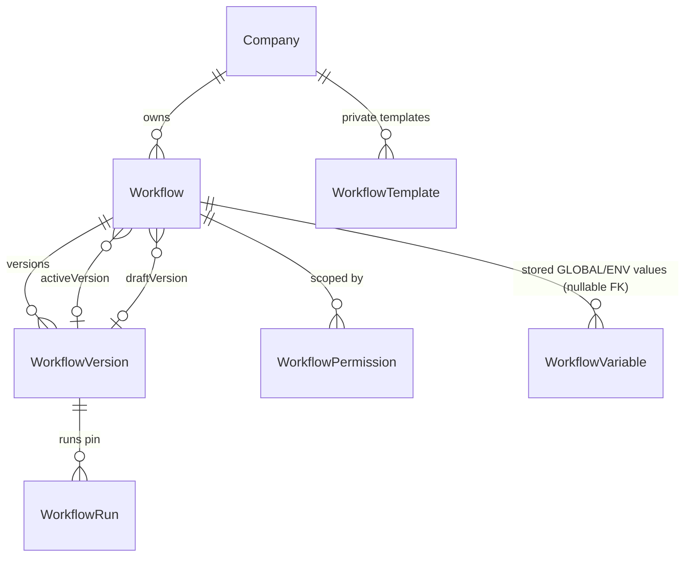
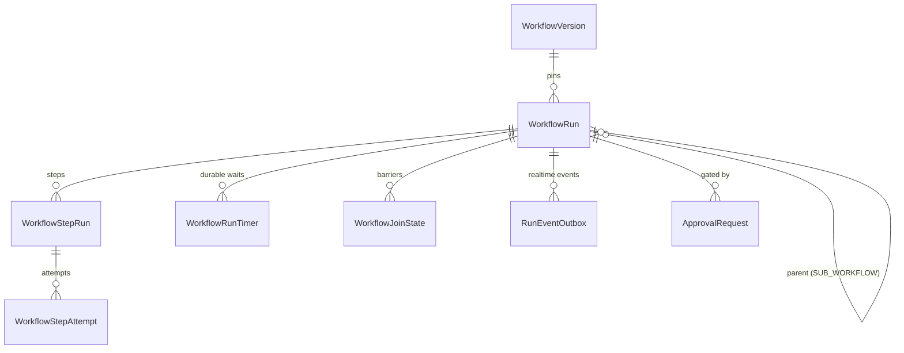
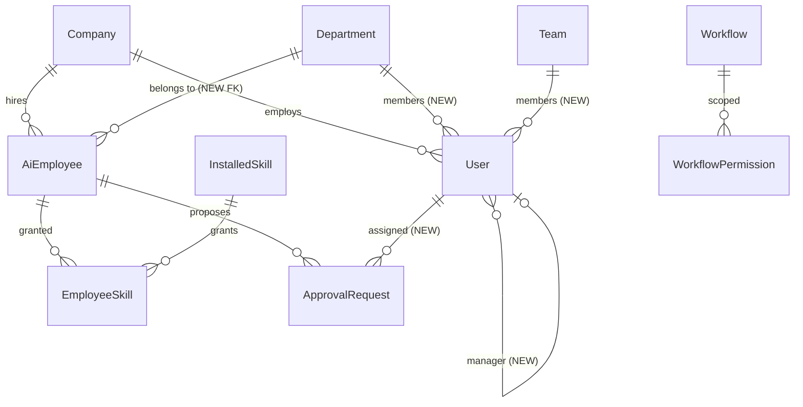
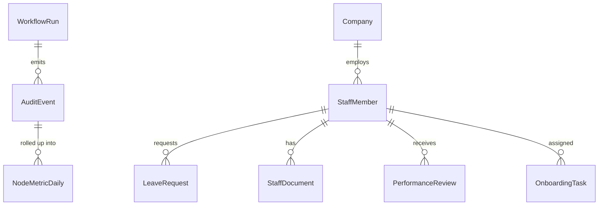
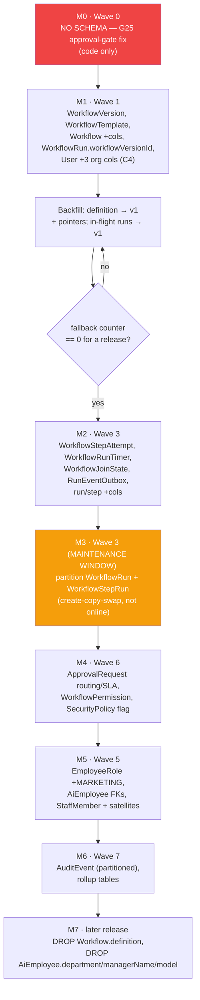

# Phase 12 — Database Design

**Prerequisite:** `00-overview-and-canonical-contracts.md` (§0.7 normative). This document is the
**consolidation point**: Phases 1–11 each specified the tables they need; this phase reconciles them
into one coherent schema, resolves conflicts, and owns indexes, partitioning, retention, isolation,
and the migration order.

**Governing decisions:** ADR-002 (immutable versions), ADR-004 (no breaking change to existing data),
ADR-005 (application-enforced `companyId` + RLS on execution tables).

**Rule of precedence:** where a phase doc and this document disagree on a *cross-phase* concern
(a shared column, a conflicting name, two phases defining the same thing), **this document wins** — it
is the one place that sees all eleven phases at once. **But where a table is defined and owned
entirely by one phase, that phase's DDL wins**, because it holds the semantic context this document
does not. Conflict C6 in §12.0.2 is a worked example of getting this wrong. Conflicts found during
consolidation are listed explicitly in §12.0.2 rather than silently resolved.

---

## 12.0 Consolidation report

### 12.0.1 Complete table inventory

| Table | Status | Owning phase | Volume class |
|---|---|---|---|
| `Company` | EXISTING (untouched) | — | tiny |
| `User` | **EXTEND** (+3 org columns, G22) | 8, 9 | small |
| `Department`, `Team` | EXISTING (untouched) | 9 | tiny |
| `SecurityPolicy` | **EXTEND** (+`skillGrantEnforcement`) | 9 | tiny |
| `AiEmployee` | **EXTEND** (+FKs, +typed config) | 3 | small |
| `EmployeeMemory` | EXISTING (+semantic recall later) | 7 | medium |
| `KnowledgeDocument`, `KnowledgeChunk` | EXISTING (untouched) | 7 | medium |
| `InstalledSkill`, `EmployeeSkill` | EXISTING (untouched) | 4, 9 | small |
| `SkillExecution` | EXISTING (+read API, G27) | 4, 10 | **high** |
| `ApprovalRequest` | **EXTEND** (+routing/SLA/chain) | 8 | medium |
| `Workflow` | **EXTEND** (+version pointers, category) | 1 | small |
| `WorkflowVersion` | **NEW** | 1 | small |
| `WorkflowTemplate` | **NEW** | 1 | tiny |
| `WorkflowRun` | **EXTEND** (+9 columns) | 1, 5 | **very high** |
| `WorkflowStepRun` | **EXTEND** (+5 columns) | 2, 5 | **very high** |
| `WorkflowStepAttempt` | **NEW** | 2, 5 | **highest** |
| `WorkflowRunTimer` | **NEW** | 5, 8 | medium |
| `WorkflowJoinState` | **NEW** | 5 | low |
| `WorkflowPermission` | **NEW** | 9 | small |
| `WorkflowVariable` | **NEW** | 6 | small |
| `WorkflowSecretRef` | **NEW** | 6 | small |
| `AuditEvent` | **NEW** | 10 | **highest** |
| `RunEventOutbox` | **NEW** | 10, 13 | high (transient) |
| `NodeMetricDaily`, `WorkflowMetricDaily`, `EmployeeMetricDaily` | **NEW** | 11 | low |
| `StaffMember` + satellites | **NEW** | 3 | small |
| `AuditLog` | EXISTING — see §12.0.2 conflict C1 | 10 | medium |

**Volume classes drive every other decision in this document.** Four tables are in the top class and
they are the only ones that need partitioning: `WorkflowStepAttempt`, `AuditEvent`, `WorkflowRun`,
`WorkflowStepRun`. Everything else is small enough that a good index is sufficient.

### 12.0.2 Conflicts found during consolidation (resolved here)

**C1 — `AuditLog` vs `AuditEvent`.** Phase 10 specifies a new `AuditEvent` stream; an `AuditLog`
table already exists (who-did-what for admin actions). Two audit tables is a genuine smell.
**Resolution: keep both, with a hard boundary.** `AuditLog` stays for *human* administrative actions
(user created, role changed, workflow published) — it is low-volume, queried by admins, and already
has a UI. `AuditEvent` is for *execution* events (run/step/attempt/tool-call) — very high volume,
partitioned, machine-queried. Merging them would force the low-volume admin trail into a partitioned
high-volume table for no benefit, and would break the existing audit UI. The boundary is documented
in both directions so a future engineer doesn't "helpfully" merge them.

**C2 — `WorkflowStepAttempt` defined twice.** Phase 2 §2.A.5 sketched a minimal version (5 columns);
Phase 5 §5.A.5 defined the full one (with leases, cost, tokens). **Resolution: Phase 5's definition is
canonical**; Phase 2's sketch is a subset and is superseded. §12.2 below carries the authoritative DDL.

**C3 — Cost/token attribution appears in three places.** `UsageEvent` (existing, authoritative for
real-time budget gating), `WorkflowStepAttempt.costUsd` (Phase 5, per-attempt attribution), and
`AuditEvent` (Phase 10, immutable record). **Resolution: all three, deliberately, with distinct
roles** — `UsageEvent` stays the single source of truth for budget enforcement (Phase 11 explicitly
requires this); `WorkflowStepAttempt` carries a denormalised copy so a timeline query needs no join;
`AuditEvent` carries an immutable copy for compliance. The denormalisation is intentional and must be
written in the same transaction to stay consistent.

**C4 — `User.departmentId` needed by two phases.** Phase 8 (approval routing) and Phase 9
(department-scoped RBAC) both require it, and neither can ship without it (gap G22). **Resolution:
the column set lands once, in the Wave-1 migration, before either phase** — listed in §12.6's
migration order so it isn't discovered as a blocker mid-implementation.

**C6 — `WorkflowVariable` was wrongly attached to `WorkflowVersion` (corrected 2026-08-01).** An
earlier draft of §12.A.5 declared `variables WorkflowVariable[]` on `WorkflowVersion` and drew
`WorkflowVersion ||--o{ WorkflowVariable : declares` in the ER diagram. **Both were wrong**, and the
relation would have failed `prisma validate` (no matching back-reference). Phase 6 §6.1.5 — the owning
phase — keys `WorkflowVariable` to `Workflow` via a **nullable** `workflowId` (null = company-wide
default, set = per-workflow override), and scopes it to `GLOBAL`/`ENVIRONMENT` values only.
**Resolution: Phase 6's DDL is correct and authoritative.** The precedence rule in this document's
preamble ("where a phase doc and this document disagree, this document wins") is about *consolidation
authority across phases* — it does not override an owning phase's DDL for a table only that phase
defines. Rule clarified accordingly. Note the deeper distinction this exposed: **declared** variables
live in `WorkflowDefinition.variables` (JSON, versioned, immutable with the graph); **stored** variable
*values* live in `WorkflowVariable` (rows, mutable, deliberately not versioned). Conflating the two is
what produced the error.

**C5 — WebSocket event payload defined in two places.** Phase 15 proposed a minimal `RunEventEnvelope`
because Phase 13 didn't exist yet when it was written; Phase 13 defines the authoritative one.
**Resolution: Phase 13 wins**; `RunEventOutbox.payload` conforms to Phase 13's envelope. Flagged for
a reconciliation pass over Phase 15 once Phase 13 is read.

---

## 12.A Schema — workflow definition and versioning

### 1. Purpose

Persist the workflow container, its immutable versions, and templates (Phase 1).

### 2. Responsibilities

Identity, metadata, the executable graph, publish provenance, and template content.

### 3. Architecture

See Phase 1 §1.A.3 for the container/version split rationale. The schema below is the authoritative
DDL for it.

### 4. Flow Diagram



### 5. Database Design

```prisma
model Workflow {
  id            String         @id @default(cuid())
  companyId     String
  company       Company        @relation(fields: [companyId], references: [id], onDelete: Cascade)
  name          String
  description   String?
  status        WorkflowStatus @default(DRAFT)      // EXISTING (+ARCHIVED)
  definition    Json                                // EXISTING — dropped after backfill (§12.6)
  triggerType   TriggerType    @default(MANUAL)      // EXISTING
  triggerConfig Json?                                // EXISTING
  webhookToken  String?        @unique               // EXISTING — stays on the container
  activatedAt   DateTime?                            // EXISTING

  category        WorkflowCategory @default(CUSTOM)   // NEW
  tags            String[]         @default([])      // NEW
  ownerUserId     String?                            // NEW
  departmentId    String?                            // NEW
  activeVersionId String?          @unique            // NEW
  draftVersionId  String?          @unique            // NEW
  archivedAt      DateTime?                          // NEW

  createdAt DateTime @default(now())
  updatedAt DateTime @updatedAt

  versions      WorkflowVersion[] @relation("WorkflowVersions")
  activeVersion WorkflowVersion?  @relation("ActiveVersion", fields: [activeVersionId], references: [id], onDelete: SetNull)
  draftVersion  WorkflowVersion?  @relation("DraftVersion",  fields: [draftVersionId],  references: [id], onDelete: SetNull)
  runs          WorkflowRun[]
  permissions   WorkflowPermission[]

  @@index([companyId])                    // EXISTING
  @@index([companyId, status])            // NEW
  @@index([companyId, category])          // NEW
  @@index([companyId, departmentId])      // NEW
}

model WorkflowVersion {
  id         String                @id @default(cuid())
  companyId  String                                    // denormalised — never join to filter
  workflowId String
  workflow   Workflow              @relation("WorkflowVersions", fields: [workflowId], references: [id], onDelete: Cascade)
  version    Int
  status     WorkflowVersionStatus @default(DRAFT)
  definition Json
  checksum   String
  changelog  String?
  publishedAt       DateTime?
  publishedByUserId String?
  deprecatedAt      DateTime?
  validationReport  Json?
  createdAt  DateTime @default(now())
  updatedAt  DateTime @updatedAt

  runs      WorkflowRun[]
  activeFor Workflow? @relation("ActiveVersion")
  draftFor  Workflow? @relation("DraftVersion")
  // NOTE (corrected 2026-08-01): there is deliberately NO `variables
  // WorkflowVariable[]` relation here. An earlier draft of this document had
  // one, which would have failed `prisma validate` — `WorkflowVariable` keys to
  // `Workflow` (nullable `workflowId`), never to a version. See §12.0.2 C6.

  @@unique([workflowId, version])
  @@index([companyId])
  @@index([workflowId, status])
  @@index([companyId, checksum])
}

model WorkflowTemplate {
  id           String           @id @default(cuid())
  companyId    String?
  company      Company?         @relation(fields: [companyId], references: [id], onDelete: Cascade)
  name         String
  description  String?
  category     WorkflowCategory
  tags         String[]         @default([])
  definition   Json
  checksum     String
  employeeRole EmployeeRole?
  minPlan      Plan?
  visibility   String           @default("UNLISTED")
  installCount Int              @default(0)
  sourceWorkflowId String?
  createdByUserId  String?
  createdAt    DateTime @default(now())
  updatedAt    DateTime @updatedAt

  @@index([companyId])
  @@index([category, visibility])
  @@index([employeeRole])
}
```

Plus the hand-written pieces Prisma cannot express:

```sql
-- Full-text search over the workflow library (Phase 1 §1.B.5).
ALTER TABLE "Workflow" ADD COLUMN search_vector tsvector
  GENERATED ALWAYS AS (
    to_tsvector('english', coalesce(name,'') || ' ' || coalesce(description,''))
  ) STORED;
CREATE INDEX workflow_search_idx ON "Workflow" USING GIN (search_vector);

-- Immutability of published versions (Phase 1 §1.C.5) — defence in depth
-- behind the service-layer guard.
CREATE OR REPLACE FUNCTION forbid_published_version_mutation()
RETURNS trigger AS $$
BEGIN
  IF OLD.status IN ('PUBLISHED','DEPRECATED','ARCHIVED')
     AND (NEW.definition::text <> OLD.definition::text OR NEW.checksum <> OLD.checksum) THEN
    RAISE EXCEPTION 'WorkflowVersion % is immutable (status=%)', OLD.id, OLD.status;
  END IF;
  RETURN NEW;
END; $$ LANGUAGE plpgsql;

CREATE TRIGGER workflow_version_immutable
  BEFORE UPDATE ON "WorkflowVersion"
  FOR EACH ROW EXECUTE FUNCTION forbid_published_version_mutation();
```

### 6. API Design

Phase 1 §1.A.6 / §1.C.6 / §1.E.6. No additions here.

### 7. TypeScript Interfaces

Phase 1 §1.A.7. No additions.

### 8. JSON Examples

Phase 1 §1.A.8.

### 9. Folder Structure

`apps/api/prisma/schema.prisma` (single file, existing convention) + `prisma/migrations/**`.
Hand-written SQL lives inside the generated migration file, appended after the Prisma-generated
statements — the same technique already used in this repo for the pgvector HNSW index.

### 10. Edge Cases

Covered in Phase 1 §1.A.10. Schema-specific additions:
- `activeVersionId`/`draftVersionId` are `@unique`, so one version can never be simultaneously the
  active version of two workflows (a corruption that would be invisible without the constraint).
- `onDelete: SetNull` on both pointers, so deleting a version (only possible when unreferenced by
  runs) can never cascade-delete the workflow.

### 11. Security

`companyId` denormalised onto `WorkflowVersion` so no query needs a join to filter by tenant — the
most common source of accidental cross-tenant reads is a query that forgot the join.

### 12. Performance

Listing never deserialises `definition` (Phase 1 §1.A.12). The `[companyId, checksum]` index makes
no-op-publish detection an index seek.

### 13. Scalability

Version count grows with edits, not executions — low cardinality. `definition` capped at 1 MB
(Phase 1 §1.A.13), enforced at the API layer *and* worth a DB check constraint:
`CHECK (pg_column_size(definition) < 1048576)`.

### 14. Future Extension

`WorkflowVersion.branch` for git-style branching; `Workflow.stagingVersionId` for environment
promotion.

### 15. Best Practices

Never `UPDATE` a published version's `definition` — the trigger will stop you, which is the point.

---

## 12.B Schema — execution (the high-volume core)

### 1. Purpose

Persist run state durably enough that Postgres — not Redis — is the source of truth (ADR-001), at a
volume of 10M node-attempts/day (doc 00 §0.8).

### 2. Responsibilities

Run state, step state, attempt history, durable timers, join barriers, and the realtime outbox.

### 3. Architecture — why these four tables are partitioned and the rest aren't

At 10M attempts/day: `WorkflowStepAttempt` grows ~3.6B rows/year, `AuditEvent` similar,
`WorkflowStepRun` ~3B, `WorkflowRun` ~150M. Non-partitioned, index maintenance and vacuum on those
tables becomes the system's bottleneck long before query performance does — and deleting old rows
with `DELETE` would be catastrophic (bloat + lock contention). **Monthly range partitions on
`createdAt`** make retention a `DROP TABLE` (instant, no bloat) instead of a mass delete. This is
gap G17 and it is the single most important scalability decision in this document.

### 4. Flow Diagram



### 5. Database Design

```prisma
model WorkflowRun {
  id             String            @id @default(cuid())
  companyId      String
  workflowId     String
  workflow       Workflow          @relation(fields: [workflowId], references: [id], onDelete: Cascade)
  status         WorkflowRunStatus @default(PENDING)   // EXISTING (+3 values)
  source         String            @default("MANUAL")  // EXISTING
  dryRun         Boolean           @default(false)     // EXISTING
  trigger        Json?                                 // EXISTING
  context        Json?                                 // EXISTING
  triggerEventId String?                               // EXISTING
  correlationId  String?                               // EXISTING
  resumeNodeId   String?                               // EXISTING
  error          String?                               // EXISTING
  startedAt      DateTime?                             // EXISTING
  finishedAt     DateTime?                             // EXISTING
  createdAt      DateTime          @default(now())     // EXISTING — partition key

  // NEW — Phase 1
  workflowVersionId String?
  workflowVersion   WorkflowVersion? @relation(fields: [workflowVersionId], references: [id], onDelete: SetNull)
  idempotencyKey    String?

  // NEW — Phase 5
  failureClass      String?
  deadlineAt        DateTime?
  stepBudgetUsed    Int      @default(0)
  openLanes         Int      @default(0)
  cancelRequestedAt DateTime?
  cancelledByUserId String?
  parentRunId       String?
  parentStepId      String?
  depth             Int      @default(0)

  // NEW — Phase 9: which employee's authority this run executed under
  actingEmployeeId  String?
  startedByUserId   String?

  steps    WorkflowStepRun[]
  attempts WorkflowStepAttempt[]
  timers   WorkflowRunTimer[]
  joins    WorkflowJoinState[]
  outbox   RunEventOutbox[]   // REQUIRED back-relation for RunEventOutbox.run

  @@unique([companyId, idempotencyKey])
  @@index([companyId])                          // EXISTING
  @@index([companyId, triggerEventId])          // EXISTING
  @@index([companyId, status])                  // NEW
  @@index([status, deadlineAt])                 // NEW — reaper
  @@index([companyId, workflowVersionId])       // NEW
  @@index([parentRunId])                        // NEW
  @@index([companyId, workflowId, createdAt])   // NEW — "recent runs of workflow X"
}

model WorkflowStepRun {
  id         String        @id @default(cuid())
  companyId  String
  runId      String
  run        WorkflowRun   @relation(fields: [runId], references: [id], onDelete: Cascade)
  nodeId     String
  type       String
  status     StepRunStatus @default(PENDING)   // EXISTING (+3 values)
  input      Json?
  output     Json?
  error      String?
  startedAt  DateTime?
  finishedAt DateTime?
  createdAt  DateTime      @default(now())     // partition key

  // NEW
  attemptCount      Int     @default(0)
  category          String?
  laneId            String?
  iteration         Int?
  compensationState String?
  employeeId        String?   // attribution for AI_EMPLOYEE_STEP (Phase 10/11)
  durationMs        Int?      // denormalised for analytics

  attempts WorkflowStepAttempt[]

  @@index([companyId])                                  // EXISTING
  @@index([runId, status])                              // NEW
  @@unique([runId, nodeId, iteration, laneId])          // NEW — engine idempotency key
}

model WorkflowStepAttempt {
  id        String        @id @default(cuid())
  companyId String
  runId     String
  run       WorkflowRun   @relation(fields: [runId], references: [id], onDelete: Cascade)
  stepId    String
  step      WorkflowStepRun @relation(fields: [stepId], references: [id], onDelete: Cascade)
  attempt   Int
  status    StepRunStatus
  workerId       String?
  leaseExpiresAt DateTime?
  error          String?
  errorClass     String?
  promptTokens     Int?
  completionTokens Int?
  costUsd          Decimal? @db.Decimal(12, 6)
  durationMs       Int?
  startedAt  DateTime?
  finishedAt DateTime?
  createdAt  DateTime @default(now())          // partition key

  @@unique([stepId, attempt])
  @@index([companyId, createdAt])
  @@index([status, leaseExpiresAt])            // reaper
}

model WorkflowRunTimer {
  id        String   @id @default(cuid())
  companyId String
  runId     String
  run       WorkflowRun @relation(fields: [runId], references: [id], onDelete: Cascade)
  nodeId    String?
  kind      String   // WAIT | APPROVAL_SLA | JOIN_TIMEOUT | RUN_DEADLINE
  fireAt    DateTime
  firedAt   DateTime?
  cancelledAt DateTime?
  payload   Json?
  createdAt DateTime @default(now())

  @@index([fireAt, firedAt])
  @@index([runId])
}

model WorkflowJoinState {
  id           String   @id @default(cuid())
  companyId    String
  runId        String
  run          WorkflowRun @relation(fields: [runId], references: [id], onDelete: Cascade)
  nodeId       String
  expected     Int
  arrived      Int      @default(0)
  arrivedLanes String[] @default([])
  satisfiedAt  DateTime?
  createdAt    DateTime @default(now())

  @@unique([runId, nodeId])
}

model RunEventOutbox {
  id        BigInt   @id @default(autoincrement())
  companyId String
  runId     String
  run       WorkflowRun @relation(fields: [runId], references: [id], onDelete: Cascade)
  /// Conforms to Phase 13's event envelope (conflict C5 — Phase 13 is authoritative).
  eventType String
  payload   Json
  publishedAt DateTime?
  createdAt DateTime @default(now())

  /// The relay's only query: unpublished, in order.
  @@index([publishedAt, id])
  @@index([runId])
}
```

**Partitioning DDL** (hand-written; Prisma has no partitioning support — this is the main reason these
statements are appended to the migration rather than generated):

```sql
-- Convert the four highest-volume tables to monthly range partitions on createdAt.
-- Done at creation time for the NEW tables; for the two EXISTING ones it is a
-- create-new + copy + swap, which MUST be scheduled as a maintenance operation
-- (see §12.6 step 7) — it is not an online change.

CREATE TABLE "WorkflowStepAttempt" (
  -- … columns as above …
) PARTITION BY RANGE ("createdAt");

CREATE TABLE "WorkflowStepAttempt_2026_08" PARTITION OF "WorkflowStepAttempt"
  FOR VALUES FROM ('2026-08-01') TO ('2026-09-01');
-- … one per month, created ahead of time by a scheduled job (§12.5) …

-- A DEFAULT partition is a deliberate safety net: without it, an insert with a
-- createdAt outside every defined range FAILS, which would take down execution.
CREATE TABLE "WorkflowStepAttempt_default" PARTITION OF "WorkflowStepAttempt" DEFAULT;
```

**Row-Level Security on execution tables (ADR-005):**

```sql
ALTER TABLE "WorkflowRun"          ENABLE ROW LEVEL SECURITY;
ALTER TABLE "WorkflowStepRun"      ENABLE ROW LEVEL SECURITY;
ALTER TABLE "WorkflowStepAttempt"  ENABLE ROW LEVEL SECURITY;
ALTER TABLE "AuditEvent"           ENABLE ROW LEVEL SECURITY;

CREATE POLICY tenant_isolation ON "WorkflowRun"
  USING ("companyId" = current_setting('app.company_id', true));
-- … identical policy per table …
```

The application sets `app.company_id` per request/job. **Important honesty about scope:** this is
defence in depth, *not* the primary control — Prisma connects as the table owner, and a table owner
bypasses RLS unless `FORCE ROW LEVEL SECURITY` is set. Enabling `FORCE` requires the app to run as a
non-owner role, which is a deployment change (a second DB role) that must be done deliberately. Until
then, RLS catches only queries made through a non-owner connection. Documented plainly so nobody
believes tenant isolation is solved by this alone — application-level `companyId` filtering remains
the real control.

### 6. API Design

Phase 5 §5.A.6, Phase 13. No schema-specific endpoints.

### 7. TypeScript Interfaces

Phase 5 §5.A.7 / §5.E.7.

### 8. JSON Examples

Phase 5 §5.A.8.

### 9. Folder Structure

```
apps/api/prisma/
├── schema.prisma
└── migrations/
    ├── <ts>_workflow_versioning/            Wave 1
    ├── <ts>_execution_state_machine/        Wave 3
    ├── <ts>_partition_execution_tables/     Wave 3 (maintenance window)
    └── …
apps/api/src/modules/workflows/maintenance/
├── partition-manager.service.ts   NEW — pre-create next month's partitions
└── retention.processor.ts         NEW — detach + archive + drop
```

### 10. Edge Cases

| Case | Behaviour |
|---|---|
| Insert with `createdAt` outside all partition ranges | Lands in the `DEFAULT` partition rather than failing the insert. Monitored — rows in `_default` mean the partition-manager job is behind and must alert. |
| Partition-manager job fails for a month | `DEFAULT` absorbs the writes; no outage. Alert on `_default` row count > 0. |
| `@@unique([runId, nodeId, iteration, laneId])` with NULL `iteration`/`laneId` | Postgres treats NULLs as distinct, so two rows with the same `(runId, nodeId)` and both NULLs **would both be allowed** — which defeats the idempotency guarantee for the common (non-loop, non-parallel) case. **Fix: store sentinels, not NULLs** — `iteration` defaults to `0` and `laneId` defaults to `'main'`. This is a real subtlety that would otherwise silently break the engine's core idempotency claim. |
| Unique constraint on a partitioned table | Postgres requires the partition key in every unique constraint on a partitioned table. `@@unique([stepId, attempt])` on a `createdAt`-partitioned table is therefore **not directly possible**. **Resolution:** partition `WorkflowStepAttempt` and enforce uniqueness per-partition, accepting that the guarantee is per-month — collisions across a month boundary for the same `(stepId, attempt)` are impossible in practice (an attempt belongs to one step created at one instant). Documented because it is a genuine constraint relaxation, not an oversight. |
| Retention drops a partition still referenced by an FK | `WorkflowStepAttempt.stepId` → `WorkflowStepRun.id` FK across partitioned tables is not enforceable by Postgres for partitioned parents. **Resolution: drop FK enforcement on the two highest-volume child relationships** and rely on application-level integrity + `ON DELETE CASCADE` at the run level. Called out explicitly because losing an FK is a real trade-off made for partitioning. |
| `BigInt` id on `RunEventOutbox` | Deliberate: at high volume an autoincrement `BigInt` gives the relay a cheap monotonic cursor, which a cuid cannot. |

### 11. Security

RLS as above (with its honest limitation). `WorkflowStepRun.input/output` and `WorkflowStepAttempt`
must never contain secrets — enforced by Phase 6's write-time redaction, since redaction at read time
would still leave plaintext in backups and WAL.

### 12. Performance

| Query | Index used |
|---|---|
| Timeline for a run | `[runId, status]` on steps; `[stepId, attempt]` on attempts |
| Reaper: expired leases | `[status, leaseExpiresAt]` |
| Reaper: past deadline | `[status, deadlineAt]` |
| Timer sweep | `[fireAt, firedAt]` |
| Outbox relay | `[publishedAt, id]` |
| Recent runs of a workflow | `[companyId, workflowId, createdAt]` |
| Idempotency check | `[companyId, idempotencyKey]` unique |

Every hot query has a covering index and none requires a scan. Partition pruning on `createdAt`
means "last 7 days of runs" touches one or two partitions rather than the whole table.

### 13. Scalability

- Retention: 90d hot (attached), 400d cold (detached + archived to object storage), then dropped —
  doc 00 §0.8's target, achieved by partition lifecycle rather than DELETE.
- The next scaling step beyond one Postgres is moving `WorkflowStepAttempt` + `AuditEvent` to their
  own database; the denormalised `companyId` on every row and the absence of cross-table FKs
  (§12.B.10) make that a mechanical move rather than a redesign. That is why the FK trade-off is
  worth it.
- **Serverless caveat (verified deployment reality):** the API also runs as a Vercel function, and
  many short-lived functions hitting Postgres directly exhausts connections. Prisma connection
  pooling (PgBouncer or Prisma Accelerate) is a **prerequisite**, already flagged as deferred in the
  existing deployment notes. Partitioning does not help here — it is a separate, real constraint.

### 14. Future Extension

Per-tenant partitioning for the largest customers (`PARTITION BY LIST (companyId)` sub-partitions);
columnar/OLAP export of cold partitions for analytics; `pg_partman` to replace the hand-rolled
partition manager.

### 15. Best Practices

Never `DELETE` from the four partitioned tables — detach and drop. Always pre-create partitions at
least two months ahead. Alert on any row landing in a `_default` partition. Keep the sentinel-not-NULL
rule for the idempotency key.

---

## 12.C Schema — employees, skills, approvals, permissions

### 1. Purpose

Consolidate the extensions Phases 3, 4, 8, and 9 need, including the org-structure columns that two
phases both depend on (conflict C4).

### 2. Responsibilities

Employee configuration and attribution; skill grants; approval routing/SLA; permission scoping.

### 3. Architecture

The load-bearing addition is **three columns on `User`** (gap G22). Without them, department-based
approval routing and department-scoped RBAC are both unimplementable — and both were specified as if
they existed.

### 4. Flow Diagram



### 5. Database Design

```prisma
model User {
  // … EXISTING: id, companyId, email, passwordHash, name, phone, role, status, createdAt …

  // NEW — closes G22. Required by Phase 8 (routing) AND Phase 9 (scoped RBAC).
  departmentId  String?
  department    Department? @relation(fields: [departmentId], references: [id], onDelete: SetNull)
  teamId        String?
  team          Team?       @relation(fields: [teamId], references: [id], onDelete: SetNull)
  managerUserId String?
  manager       User?       @relation("UserManager", fields: [managerUserId], references: [id], onDelete: SetNull)
  reports       User[]      @relation("UserManager")
  // REQUIRED back-relation for AiEmployee.managerUser (named to match the
  // consolidated schema in architecture/database/2026-08-01-complete-database-design.md).
  managedEmployees AiEmployee[] @relation("AiEmployeeManager")

  @@unique([companyId, email])            // EXISTING
  @@index([companyId, departmentId])      // NEW
  @@index([companyId, managerUserId])     // NEW
}

model AiEmployee {
  // … EXISTING fields unchanged …

  // NEW — Phase 3: real FKs replacing the free-text columns.
  // The String columns are KEPT during migration and dropped after backfill.
  departmentId    String?
  departmentRef   Department? @relation(fields: [departmentId], references: [id], onDelete: SetNull)
  managerUserId   String?
  managerUser     User?       @relation("AiEmployeeManager", fields: [managerUserId], references: [id], onDelete: SetNull)

  // NEW — Phase 3: reasoning configuration (G20 — `model` was never read; these are).
  reasoningStrategy String?   // ReasoningStrategy
  llmModel          String?   // replaces the unread `model` column
  llmTemperature    Float?

  @@index([companyId, departmentId])      // NEW
}

model ApprovalRequest {
  // … EXISTING: id, companyId, kind, employeeId, conversationId, workflowRunId,
  //    skillKey, tool, args, result, description, status, decidedById,
  //    decidedAt, note, createdAt …

  // NEW — Phase 8 routing
  assignedToUserId       String?
  assignedToRole         Role?
  assignedToDepartmentId String?
  assignedToTeamId       String?
  approverRuleType       String?   // ApproverRuleType

  // NEW — Phase 8 chains: one row per level, not a parallel table.
  chainId        String?
  level          Int     @default(1)
  escalationTier Int     @default(0)

  // NEW — Phase 8 SLA
  dueAt          DateTime?
  escalatedAt    DateTime?
  expiredAt      DateTime?
  onTimeout      String?   // APPROVE | REJECT | ESCALATE

  // NEW — Phase 5 link for the run-side gate (G25 fix)
  gatedStepId    String?

  @@index([companyId])                                // EXISTING
  @@index([companyId, status])                        // EXISTING
  @@index([companyId, assignedToUserId, status])      // NEW — "my queue"
  @@index([companyId, status, dueAt])                 // NEW — SLA sweep
  @@index([chainId, level])                           // NEW — chain walk
}

model WorkflowPermission {
  id           String   @id @default(cuid())
  companyId    String
  workflowId   String
  workflow     Workflow @relation(fields: [workflowId], references: [id], onDelete: Cascade)
  /// Exactly one of these is set — the subject the grant applies to.
  userId       String?
  role         Role?
  departmentId String?
  teamId       String?
  /// Permission strings from Phase 9's taxonomy, e.g. 'workflow:publish'.
  permissions  String[]
  createdAt    DateTime @default(now())

  @@index([companyId, workflowId])
  @@index([companyId, userId])
}

model SecurityPolicy {
  // … EXISTING fields …
  /// NEW — Phase 9: staged rollout of execution-time grant enforcement.
  /// 'off' (today's behaviour) | 'audit' (log denials, allow) | 'enforce' (deny).
  skillGrantEnforcement String @default("off")
}
```

### 6. API Design

Phases 3, 4, 8, 9 own their endpoints.

### 7. TypeScript Interfaces

Phases 3, 8, 9. The one addition this consolidation makes explicit:

```ts
/** The typed shape of AiEmployee.permissions — previously untyped Json and never read (G19). */
export interface EmployeePermissions {
  canUseSkills: boolean;
  canRunWorkflows: boolean;
  canWriteMemory: boolean;
  canWriteKnowledge: boolean;
  maxToolCallsPerRun?: number;
  allowedSkillKeys?: string[];   // null/absent = all granted skills
}
```

### 8. JSON Examples

```json
// A 2-level approval chain with SLA and escalation (Phase 8)
{
  "chainId": "chn_5f2",
  "level": 1,
  "approverRuleType": "EMPLOYEE_MANAGER",
  "assignedToUserId": "usr_hrlead",
  "dueAt": "2026-08-02T09:00:00.000Z",
  "onTimeout": "ESCALATE",
  "escalationTier": 0,
  "status": "PENDING"
}
```

### 9. Folder Structure

Schema only; services live in their owning modules.

### 10. Edge Cases

| Case | Behaviour |
|---|---|
| `managerUserId` cycle (A manages B manages A) | Application-level check on write; a DB-level guard would need a recursive trigger, which is not worth the cost. Routing walks the chain with a depth cap of 10 regardless, so a cycle degrades to `ANY_ADMIN` rather than looping. |
| Deleting a `Department` with users and workflows | `SetNull` everywhere — never cascade-delete people or automation because an org unit was reorganised. |
| `AiEmployee.department` (String) vs `departmentId` (FK) during migration | Both present; reads prefer the FK and fall back to the string. Drop the string only after a release with zero fallback hits (same pattern as `Workflow.definition`). |
| `skillGrantEnforcement: 'enforce'` turned on cold | Would break live workflows that currently succeed only because no grant check exists. Hence the three-state flag and the `audit` middle step — this is a deliberate staged rollout, not indecision. |

### 11. Security

`SecurityPolicy.skillGrantEnforcement` is the control that closes Phase 9's execution-time gap; it
defaults to `off` so the migration changes no behaviour, and moving a tenant to `enforce` is an
explicit, audited decision.

### 12. Performance

`[companyId, assignedToUserId, status]` makes "my approval queue" a single index seek — the query the
approvals UI runs on every page load.

### 13. Scalability

All tables in this section are small (users, employees, approvals). `ApprovalRequest` is the largest
and is bounded by human decision volume, not machine volume.

### 14. Future Extension

Nested departments (a `parentDepartmentId` tree) for large orgs; delegation ("approve on my behalf
while I'm on leave"), which `assignedToUserId` + a delegation table makes straightforward.

### 15. Best Practices

Add the `User` org columns in Wave 1 even though Phases 8/9 ship later — they are cheap, nullable, and
being blocked on a migration mid-phase is worse.

---

## 12.D Schema — audit, analytics, and HR staff records

### 1. Purpose

Consolidate Phase 10's audit stream, Phase 11's rollups, and Phase 3's `StaffMember` roster.

### 2. Responsibilities

Immutable execution audit; pre-aggregated metrics; the customer's human workforce records that the HR
Employee operates on.

### 3. Architecture

`AuditEvent` is append-only, partitioned, and hash-chained per partition (Phase 10). Rollups are
small daily aggregates. `StaffMember` is genuinely new domain data — Phase 3 found that **no model
anywhere represents the customer's human employees**, which the HR Employee's 13 capabilities all
depend on.

### 4. Flow Diagram



### 5. Database Design

```prisma
model AuditEvent {
  id        BigInt   @id @default(autoincrement())
  companyId String
  /// Actor: exactly one of userId / employeeId / 'system'.
  userId     String?
  employeeId String?
  actorType  String   // USER | EMPLOYEE | SYSTEM
  /// Subject
  workflowId        String?
  workflowVersionId String?
  runId             String?
  stepId            String?
  attemptId         String?
  skillKey          String?
  tool              String?
  eventType String
  result    String?   // SUCCESS | FAILURE | DENIED
  errorClass String?  // RunFailureClass
  /// Redacted payloads (Phase 6 boundary applied at WRITE time).
  input     Json?
  output    Json?
  durationMs       Int?
  promptTokens     Int?
  completionTokens Int?
  costUsd          Decimal? @db.Decimal(12, 6)
  /// Tamper-evidence: sha256(prevHash || canonical(this row)), per partition.
  prevHash  String?
  hash      String?
  correlationId String?
  createdAt DateTime @default(now())    // partition key

  @@index([companyId, createdAt])
  @@index([companyId, runId])
  @@index([companyId, eventType, createdAt])
  @@index([companyId, employeeId, createdAt])
}

model NodeMetricDaily {
  id        String   @id @default(cuid())
  companyId String
  day       DateTime @db.Date
  workflowId String
  nodeId     String
  nodeType   String
  runs       Int      @default(0)
  successes  Int      @default(0)
  failures   Int      @default(0)
  retries    Int      @default(0)
  p50DurationMs Int?
  p95DurationMs Int?
  p99DurationMs Int?
  totalCostUsd  Decimal? @db.Decimal(14, 6)
  totalTokens   Int      @default(0)

  @@unique([companyId, day, workflowId, nodeId])
  @@index([companyId, day])
}

model WorkflowMetricDaily {
  id        String   @id @default(cuid())
  companyId String
  day       DateTime @db.Date
  workflowId        String
  workflowVersionId String?
  runsStarted   Int @default(0)
  runsCompleted Int @default(0)
  runsFailed    Int @default(0)
  runsCancelled Int @default(0)
  runsTimedOut  Int @default(0)
  p50DurationMs Int?
  p95DurationMs Int?
  totalCostUsd  Decimal? @db.Decimal(14, 6)
  approvalsRequested Int @default(0)
  approvalsRejected  Int @default(0)

  @@unique([companyId, day, workflowId, workflowVersionId])
  @@index([companyId, day])
}

model EmployeeMetricDaily {
  id        String   @id @default(cuid())
  companyId String
  day       DateTime @db.Date
  employeeId String
  tasksCompleted Int @default(0)
  tasksFailed    Int @default(0)
  toolCalls      Int @default(0)
  approvalsRequired Int @default(0)
  totalCostUsd   Decimal? @db.Decimal(14, 6)
  totalTokens    Int @default(0)
  /// Attainment vs AiEmployee.kpiTargets, computed at rollup time.
  kpiAttainment  Json?

  @@unique([companyId, day, employeeId])
  @@index([companyId, day])
}

/// NEW — Phase 3. The customer's HUMAN workforce. No model represented this before.
model StaffMember {
  id           String   @id @default(cuid())
  companyId    String
  company      Company  @relation(fields: [companyId], references: [id], onDelete: Cascade)
  /// Optional link to a platform login — most staff never log into Orlixa.
  userId       String?  @unique
  employeeCode String?
  fullName     String
  workEmail    String?
  personalEmail String?
  phone        String?
  departmentId String?
  managerStaffId String?
  jobTitle     String?
  employmentType String?  // FULL_TIME | PART_TIME | CONTRACT | INTERN
  status       String     @default("ACTIVE") // CANDIDATE|ONBOARDING|ACTIVE|ON_LEAVE|EXITING|EXITED
  hiredAt      DateTime?
  exitedAt     DateTime?
  createdAt    DateTime @default(now())
  updatedAt    DateTime @updatedAt

  leaveRequests LeaveRequest[]
  documents     StaffDocument[]
  reviews       PerformanceReview[]
  onboarding    OnboardingTask[]

  @@unique([companyId, employeeCode])
  @@index([companyId, status])
  @@index([companyId, departmentId])
}

model LeaveRequest {
  id        String   @id @default(cuid())
  companyId String
  staffId   String
  staff     StaffMember @relation(fields: [staffId], references: [id], onDelete: Cascade)
  leaveType String   // ANNUAL | SICK | UNPAID | PARENTAL | OTHER
  startDate DateTime @db.Date
  endDate   DateTime @db.Date
  days      Float
  reason    String?
  status    String   @default("PENDING") // PENDING|APPROVED|REJECTED|CANCELLED
  /// The approval that gated it, when routed through the Approval Center.
  approvalRequestId String?
  decidedAt DateTime?
  createdAt DateTime @default(now())

  @@index([companyId, staffId, status])
  @@index([companyId, startDate])
}

model StaffDocument {
  id        String   @id @default(cuid())
  companyId String
  staffId   String
  staff     StaffMember @relation(fields: [staffId], references: [id], onDelete: Cascade)
  docType   String   // ID | VISA | CONTRACT | CERTIFICATE | OTHER
  /// Object-storage key — the file itself never lands in Postgres.
  storageKey String
  fileName   String
  mimeType   String
  verifiedAt DateTime?
  verifiedByUserId String?
  expiresAt  DateTime?
  createdAt  DateTime @default(now())

  @@index([companyId, staffId])
  @@index([companyId, expiresAt])   // "documents expiring soon" — a real HR workflow trigger
}

model PerformanceReview {
  id        String   @id @default(cuid())
  companyId String
  staffId   String
  staff     StaffMember @relation(fields: [staffId], references: [id], onDelete: Cascade)
  periodStart DateTime @db.Date
  periodEnd   DateTime @db.Date
  reviewerUserId String?
  /// AI-drafted summary + the human's final version, kept separate on purpose.
  aiDraft     String?
  finalReview String?
  rating      Int?
  status      String  @default("DRAFT") // DRAFT|IN_REVIEW|SHARED|ACKNOWLEDGED
  createdAt   DateTime @default(now())

  @@index([companyId, staffId])
}

model OnboardingTask {
  id        String   @id @default(cuid())
  companyId String
  staffId   String
  staff     StaffMember @relation(fields: [staffId], references: [id], onDelete: Cascade)
  title     String
  ownerType String   // AI_EMPLOYEE | HUMAN
  ownerId   String?
  dueAt     DateTime?
  completedAt DateTime?
  /// The workflow run that created/owns this task, for traceability.
  runId     String?
  createdAt DateTime @default(now())

  @@index([companyId, staffId])
  @@index([companyId, completedAt])
}
```

`AuditEvent` gets the same monthly partitioning + `DEFAULT` partition as §12.B.

### 6. API Design

Phase 10 (audit reads), Phase 11 (analytics), Phase 3 (staff CRUD).

### 7. TypeScript Interfaces

Phases 3, 10, 11.

### 8. JSON Examples

Phase 10 §Audit examples; Phase 11 §rollup examples.

### 9. Folder Structure

```
apps/api/src/modules/
├── staff/                    NEW — Phase 3 (the human workforce module)
│   ├── staff.service.ts
│   ├── staff.controller.ts
│   ├── leave.service.ts
│   └── documents.service.ts
└── workflows/analytics/
    └── rollup.processor.ts   NEW — Phase 11
```

### 10. Edge Cases

| Case | Behaviour |
|---|---|
| Hash chain across a partition boundary | Chain is **per partition**, seeded from the previous partition's last hash. A cross-partition chain would make dropping an old partition break verification of every later row — a self-inflicted retention deadlock. Per-partition chaining is the deliberate trade-off. |
| Rollup runs twice for the same day | `@@unique([companyId, day, …])` + upsert makes it idempotent. |
| Rollup for a day whose partition was already dropped | Rollups are computed within the hot window; if a day is missing, the rollup row simply stays as computed — never recomputed from absent data, and never silently zeroed (which would look like "no activity" rather than "no data"). Marked with a `computedFrom` timestamp so the distinction is legible. |
| `StaffMember` with no `userId` | Normal and expected — most staff never log into Orlixa. `userId` is optional and `@unique` when present. |
| `StaffMember.employeeCode` unique per company | Enforced; import flows must handle collisions rather than silently overwriting a person's record. |
| GDPR erasure request for a staff member | `StaffMember` and `StaffDocument` hold real PII. Erasure needs a documented procedure: anonymise `StaffMember`, delete `StaffDocument` storage objects, and **leave audit rows intact but redacted** (an audit trail that can be deleted isn't an audit trail). Flagged as a Phase 10 policy item requiring legal input — not decided here. |

### 11. Security

`StaffMember`/`StaffDocument` are the most sensitive data in the platform (IDs, visas, salary-adjacent
review data). Controls: `companyId` scoping, Phase 9 permissions (`staff:read` distinct from
`staff:read_documents`), object-storage keys never guessable, document access audited, and
`AuditEvent.input/output` redacted at write time so a CV or ID number never lands in the audit stream.

### 12. Performance

Rollups turn analytics from "aggregate millions of rows per dashboard load" into single-row lookups —
which is the whole point of Phase 11. `[companyId, day]` covers every dashboard query.

### 13. Scalability

`AuditEvent` partitioned like the execution tables. Rollup tables stay tiny (rows =
companies × days × workflows).

### 14. Future Extension

Payroll integration on `StaffMember`; org-chart derivation from `managerStaffId`; OLAP export of
rollups.

### 15. Best Practices

Redact at write time, never read time. Keep the hash chain per partition. Never let a rollup silently
produce zeros for missing data.

---

## 12.E Migration order and operational runbook

### 1. Purpose

Give an implementer the exact, safe order — because several phases depend on columns other phases add
(conflict C4), and two migrations require maintenance windows.

### 2. Responsibilities

Migration sequencing, backfills, verification gates, and rollback plans.

### 3. Architecture

Additive-first: every migration adds nullable/defaulted columns and new tables. Nothing is dropped
until a full release has run with instrumentation showing zero fallback usage.

### 4. Flow Diagram



### 5. Database Design

Covered in §12.A–§12.D. This section adds only the partition-manager schedule:

```
partition-manager.service.ts — daily at 02:00 UTC
  for each partitioned table:
    ensure partitions exist for [today, today + 2 months]
    alert if any row exists in <table>_default
retention.processor.ts — weekly
  detach partitions older than 90d  → archive to object storage → mark archived
  drop partitions older than 400d   (tenant-configurable; never below a legal minimum)
```

### 6. API Design

`GET /admin/db/partitions` — operator visibility into partition coverage and `_default` row counts.
Small, but the absence of this is how a silently-behind partition job becomes an incident.

### 7. TypeScript Interfaces

```ts
export interface PartitionStatusDto {
  table: string;
  partitions: { name: string; from: string; to: string; rowEstimate: number; archived: boolean }[];
  defaultPartitionRows: number;   // MUST be 0 — non-zero is an alert
  coveredThrough: string;
}
```

### 8. JSON Examples

```json
{
  "table": "WorkflowStepAttempt",
  "coveredThrough": "2026-10-01",
  "defaultPartitionRows": 0,
  "partitions": [
    { "name": "WorkflowStepAttempt_2026_08", "from": "2026-08-01", "to": "2026-09-01",
      "rowEstimate": 41200311, "archived": false }
  ]
}
```

### 9. Folder Structure

`apps/api/prisma/migrations/**` + `modules/workflows/maintenance/**` (§12.B.9).

### 10. Edge Cases

| Case | Behaviour |
|---|---|
| **The recurring pgvector false-drift** | `prisma migrate diff` has now generated a spurious `DROP INDEX "KnowledgeChunk_embedding_idx"` on **three consecutive migrations** in this repo. Every migration in this plan **must** be reviewed and that line stripped before applying. Expect it a fourth, fifth, and sixth time. This is not a hypothetical — it is the single most likely way this migration set breaks Knowledge search. |
| `prisma migrate dev` used to apply | Forbidden (documented in the repo's own CLAUDE.md): it treats the HNSW index as drift and offers to drop it. Author with `migrate diff --script`, apply with `migrate deploy`. |
| Interrupted `migrate dev` orphans an advisory lock | Known symptom: `P1002` on the next run. Terminate the idle backend holding `pg_advisory_lock`, retry. |
| M3 (partitioning existing tables) | **Not an online operation.** Requires a maintenance window: create partitioned twin, copy, swap names, recreate indexes. For a table with 150M+ rows plan hours, and rehearse on a restored snapshot first. |
| Backfill of `WorkflowRun.workflowVersionId` for historical completed runs | **Deliberately left NULL.** We cannot know which graph ran before versioning existed; fabricating v1 for a run whose graph was later edited would create false audit data. NULL is the honest answer. |
| Rollback of M1 | Additive-only, so rollback = drop the new tables/columns. Safe. |
| Rollback of M3 | Hard. Keep the pre-swap table until a full release has passed. |

### 11. Security

Migrations run with elevated DB privileges — they are the highest-privilege code in the system. Review
every generated migration by hand (the pgvector case proves generated SQL is not trustworthy here),
and never let a migration file be applied unreviewed by CI.

### 12. Performance

M3 is the only migration with a real performance cost. Everything else is metadata-only (adding a
nullable column in modern Postgres does not rewrite the table) — with one caveat: adding a column
**with a volatile default** does rewrite. All defaults specified here are constants, deliberately.

### 13. Scalability

Partition-manager + retention are what keep the system's largest tables bounded indefinitely. Without
them this schema works for about a year and then degrades.

### 14. Future Extension

`pg_partman`; logical replication of cold partitions to a warehouse; per-tenant retention policy
surfaced as a customer-facing setting.

### 15. Best Practices

One migration per wave, never one giant migration. Instrument every back-compat fallback with a
counter so "is it safe to drop the old column?" is answerable with data rather than opinion. Rehearse
M3 on a restored production snapshot before touching production.

---

**Next:** `14-json-contract.md` — the canonical workflow JSON schema.
