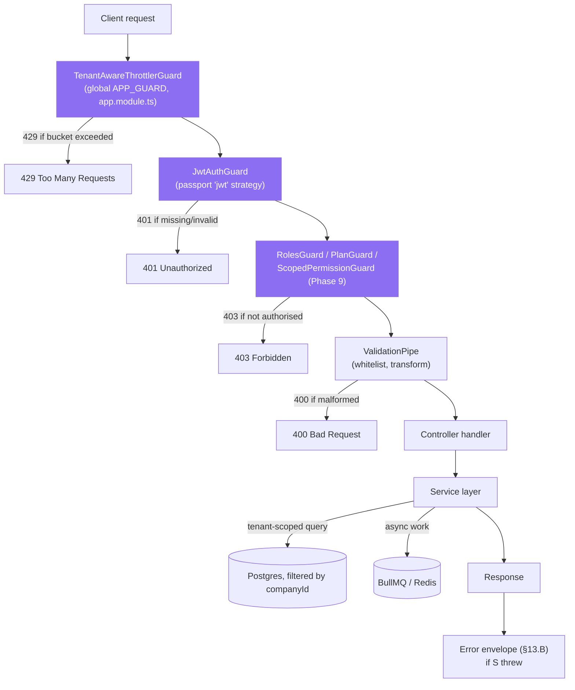
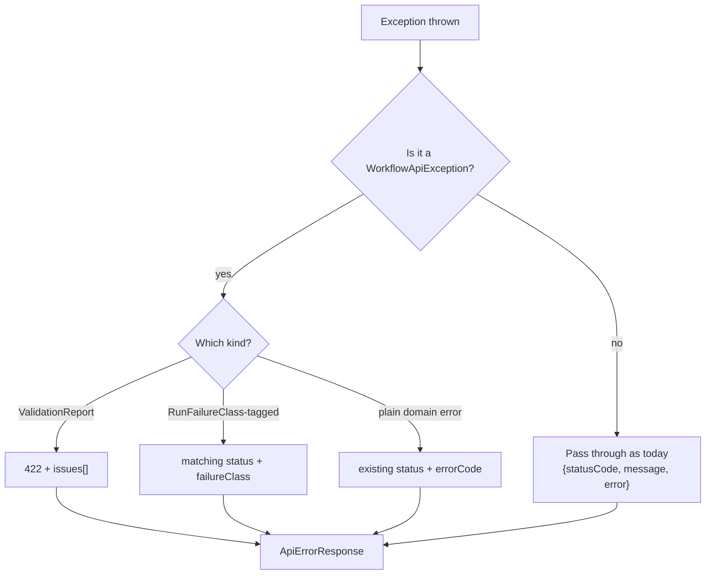
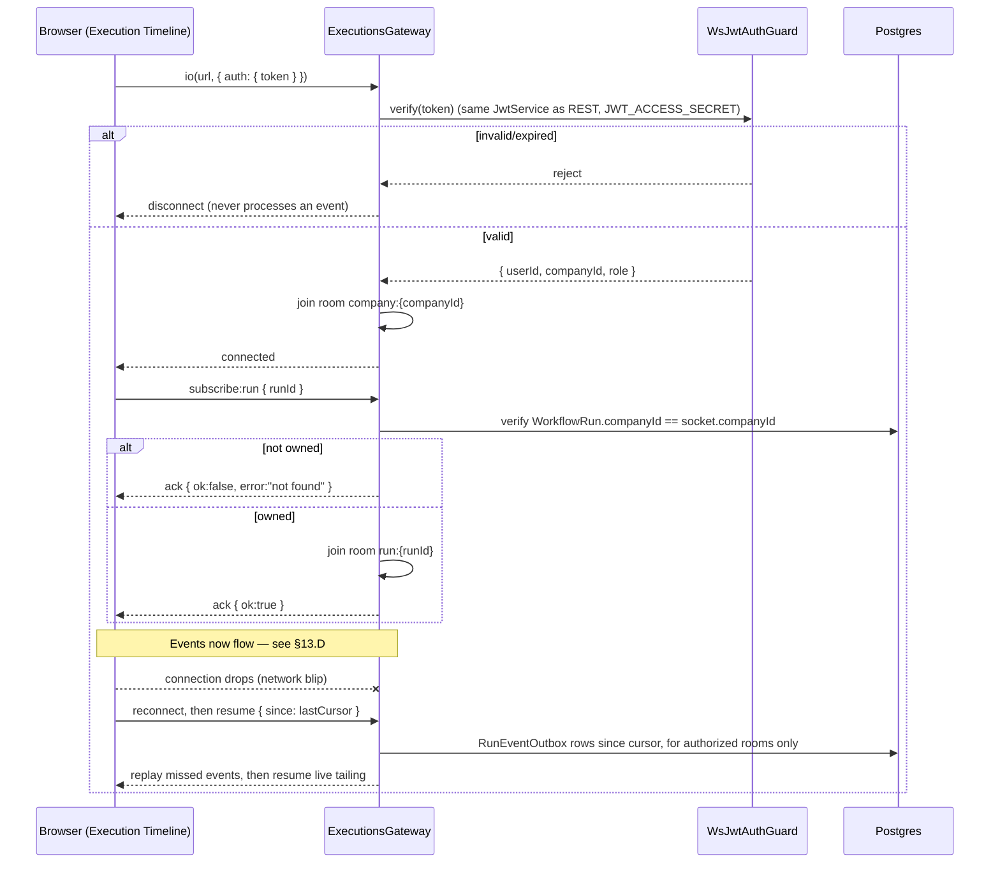
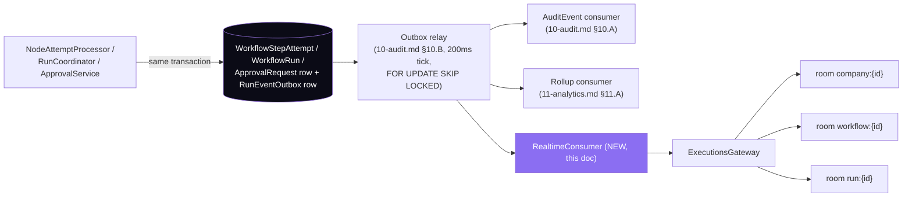
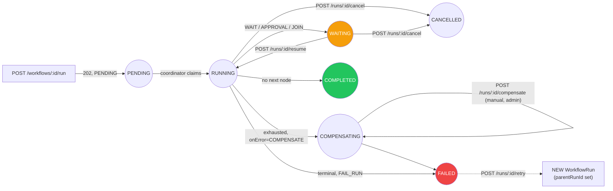
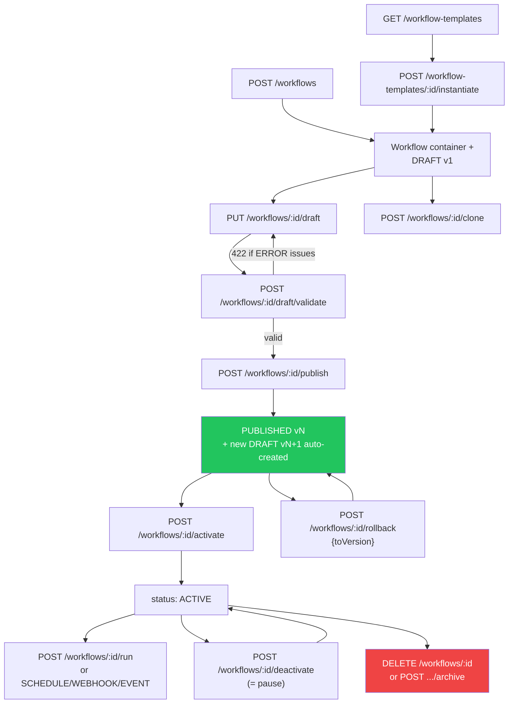
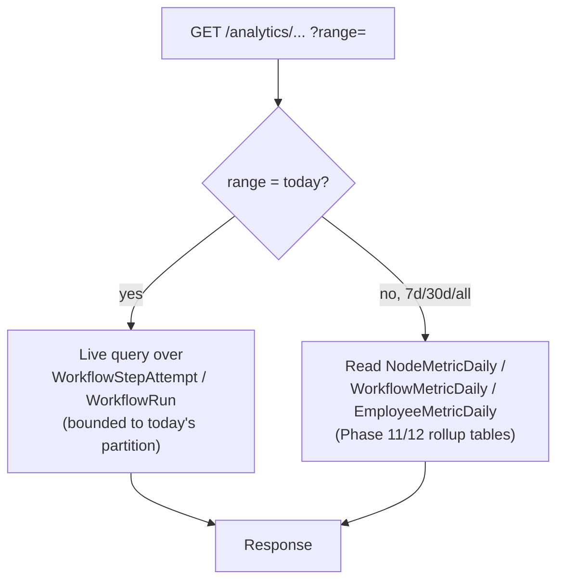
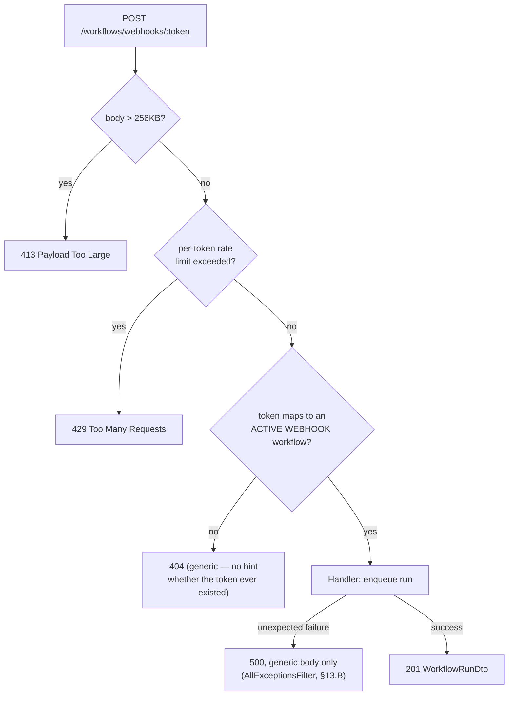

# Phase 13 — API Design

**Prerequisite:** `00-overview-and-canonical-contracts.md` (§0.7 normative — this document redefines
nothing; it consumes `WorkflowStatus`, `WorkflowVersionStatus`, `WorkflowRunStatus`, `StepRunStatus`,
`RunFailureClass`, `NodeType`, `ValidationIssue`, and every interface in §0.7.2 by exact name).
`01-workflow-core.md` §1.A.6/§1.C.6/§1.D.6/§1.E.6/§1.F.6, `02-node-architecture.md` §2.A.6, and
`05-execution-engine.md` §5.A.6/§5.C.6/§5.D.6/§5.E.6 already specify most of this surface — this
document's job is to consolidate those into one inventory, reconcile every overlap explicitly, and
design the one area none of them fully specified: realtime/WebSocket.

**Covers:** REST APIs · Realtime APIs · WebSocket Events · Execution APIs · Publishing APIs ·
Analytics APIs.

**Governing decisions:** ADR-004 (existing routes keep working — applied here to the API surface,
not just the graph JSON), ADR-005 (tenant isolation via `companyId`), and the Phase 10 transactional
outbox (`RunEventOutbox`), which this document depends on rather than re-specifies.

**This is a consolidation document.** Where a route already has a home in an earlier phase doc, this
document cites it and does not repeat its rationale. Where two phase docs proposed overlapping or
conflicting routes, §13.0 below reconciles each one explicitly and states which wins. Where a route
already exists in running code, this document verified it directly (file:line) rather than trusting
the phase doc's proposal — in four cases the real code disagrees with what an earlier phase doc
assumed, and §13.0 says so plainly instead of silently picking a winner.

---

## 13.0 Scope, status & the reconciliation ledger

### 13.0.1 What was verified directly against source (2026-08-01)

| Fact | Evidence |
|---|---|
| No API versioning exists anywhere (no `/api/v1`, no `setGlobalPrefix`, no `enableVersioning`) | Read `apps/api/src/main.ts` (22 lines, no prefix call), `apps/api/src/bootstrap.ts` (27 lines, no prefix/versioning call), and grepped `setGlobalPrefix\|enableVersioning\|VersioningType` across `apps/api/src` — zero matches. Every controller (`workflows.controller.ts`, `approvals.controller.ts`, `audit-log.controller.ts`, `analytics.controller.ts`, `dlq.controller.ts`, …) uses a bare `@Controller('...')` path. |
| No WebSocket/Socket.IO infrastructure exists anywhere | Grepped `WebSocketGateway\|@nestjs/websockets\|socket.io` across `apps/api/src`, `package.json`, `apps/api/package.json` — zero matches. §13.C is entirely **NEW**. |
| No cursor-based pagination exists for any workflow/approval/audit/analytics list endpoint | `apps/api/src/common/pagination.ts` (24 lines) exports only `clampLimit()` — a `take` cap, no cursor. Every list query verified (`workflows.service.ts:93-100,337-349`) uses `orderBy: { createdAt: 'desc' }, take: clampLimit(...)` with no cursor. |
| No global `ExceptionFilter` exists | Grepped `ExceptionFilter\|APP_FILTER` across `apps/api/src` — zero matches. Every error response today is NestJS's un-customised default shape (`{statusCode, message, error}`). |
| Global rate limiting already exists and is tenant-aware | `apps/api/src/app.module.ts`: `ThrottlerModule.forRoot([{ name: 'default', ttl: 60_000, limit: 300 }])` plus `providers: [{ provide: APP_GUARD, useClass: TenantAwareThrottlerGuard }]` — this guard is **already global**, on every route, today. `TenantAwareThrottlerGuard` (`apps/api/src/common/resilience/tenant-throttler.guard.ts:48-57`) keys the bucket on the JWT's `companyId` claim (decoded, not verified — the rate-limit key doesn't need cryptographic trust) or falls back to per-IP pre-auth. |
| A generic, working DLQ admin surface already exists | `apps/api/src/modules/admin/dlq.controller.ts` (105 lines): `GET /admin/dlq/summary`, `GET /admin/dlq`, `POST /admin/dlq/:queue/:jobId/replay`, `DELETE /admin/dlq/:queue/:jobId`, `GET /admin/circuit`. Queue allow-list lives in `apps/api/src/common/resilience/dlq.constants.ts:14-33` (`DLQ_KNOWN_QUEUES`, `DLQ_ALLOWED_QUEUES`, `DLQ_DEFAULT_LIMIT=50`, `DLQ_MAX_LIMIT=200`). |
| No Swagger/OpenAPI generation exists; Zod is used in `@vaep/types` but only for a subset of schemas (e.g. `registerSchema`), not for the NestJS API's runtime validation | Grepped `swagger\|SwaggerModule\|OpenAPI` — zero matches. `packages/types/src/index.ts` has 144 `z.*` occurrences, but every controller DTO verified (`create-workflow.dto.ts`, `update-workflow.dto.ts`, `run-workflow.dto.ts`, …) validates with **class-validator** decorators, not Zod. The comment on `registerSchema` says "web uses these directly" — Zod in this package is the **web form-validation** contract, a parallel mechanism to the API's own DTOs, not a shared runtime-validation layer between them. |
| No `Idempotency-Key` HTTP header convention exists | Grepped `Idempotency-Key` — zero matches. §13.A.6 proposes this as new, platform-wide. |
| `resumeRun()`/`cancelRun()` exist but have no direct HTTP route | `workflows.service.ts:370-409` — both are called only from `apps/api/src/modules/approvals/approval.service.ts:227,229`, never from a controller. `POST /runs/:id/resume`/`:cancel` (§13.E) are genuinely new HTTP surface over partially-existing logic. |

### 13.0.2 The reconciliation ledger

Every place an earlier phase doc's proposed route conflicts with (a) another phase doc, or (b) the
real, running controller. Each is resolved once, here, and the resolution is what the master table
in §13.A.6 reflects — the table does not re-argue these.

| # | Conflict | Phase doc(s) said | Reality / resolution |
|---|---|---|---|
| R1 | Run read route | `01-workflow-core.md` §1.F.6 and `05-execution-engine.md` §5.A.6 both specify a new top-level `GET /runs/:id` | The real, shipping route is `GET /workflows/runs/:runId` (`workflows.controller.ts:85-91`, also the exact route `10-audit.md` §10.C.6 cites). **Resolution:** keep the existing route verbatim (**EXISTING (KEEP)**); add the new `GET /runs/:id` (**NEW**) as the canonical route once Phase 5's state machine ships, backed by the *same* service read. The old route becomes a thin, permanent alias — never removed (ADR-004). |
| R2 | Webhook path spelling | `01-workflow-core.md` §1.F.4's diagram writes `POST /workflows/webhook/:token` (singular) | The real route is `POST /workflows/webhooks/:token` (plural — `webhooks.controller.ts:12,16`). **Resolution:** the plural form is authoritative; §1.F.4's singular is a documentation typo, not a route to add. |
| R3 | "Pause" naming | `01-workflow-core.md` §1.C.6 specifies `POST /workflows/:id/pause` | The real, shipping route is `POST /workflows/:id/deactivate` (`workflows.controller.ts:172-180`), which sets `status: PAUSED` — the identical transition. **Resolution:** `deactivate` **is** pause. Keep the existing name (**EXISTING (KEEP)**); do not add a duplicate `/pause` route. |
| R4 | Container delete vs. explicit archive | `01-workflow-core.md` §1.A.6/§1.A.10 makes `DELETE /workflows/:id` a soft-delete (`status=ARCHIVED`); §1.C.6, in the *same document*, separately specifies `POST /workflows/:id/archive → 200 WorkflowDto \| 409`. Both transition the container to `ARCHIVED` — an overlap **within** doc 01 itself, not just against code. | **Resolution:** one operation, two routes. `DELETE /workflows/:id` is primary (204, REST-idiomatic); `POST /workflows/:id/archive` is kept as an explicit-verb alias for integrations/firewalls that don't forward `DELETE` — both call one service method. |
| R5 | `DELETE /workflows/:id` real behaviour | Doc 01 assumes soft-delete | **Verified reality is a hard delete that cascades:** `workflows.service.ts:164-184` calls `this.prisma.workflow.delete({ where: { id } })`, and the service's own comment says *"Cascades to runs and their step runs (onDelete: Cascade)."* Today, deleting a workflow destroys its entire run/audit history. This directly contradicts doc 00 §0.8's "audit completeness: 100%" target and Phase 12's retention policy. **Resolution (flagged as a priority fix, not a cosmetic one):** change `DELETE /workflows/:id` to soft-delete per doc 01 §1.A.10 (blocked with `409` while any run is `PENDING`/`RUNNING`/`WAITING`, exactly as specified). Add a **NEW**, platform-admin-only `DELETE /workflows/:id?hard=true` escape hatch for genuine erasure needs (e.g. data-subject deletion requests), itself blocked on non-terminal runs and fully audited — so the capability to truly delete isn't lost, but it stops being the default, silent behaviour of an ordinary delete click. |
| R6 | `PATCH /workflows/:id` and the graph field | Doc 01 §1.A.6: *"`PATCH /workflows/:id` deliberately **cannot** modify the graph. Graph edits go through `PUT /workflows/:id/draft`."* | **Verified reality:** today `PATCH /workflows/:id` **is** the only way to edit the graph — `update-workflow.dto.ts` accepts `definition`, and `workflows.service.ts:106-162` passes it straight through to `prisma.workflow.update`. This is a genuine, deliberate breaking change (it is exactly gap **G1** doc 00 exists to close: editing `definition` through `PATCH` on an `ACTIVE` workflow mutates the graph in-flight runs are executing). **Resolution:** keep `PATCH /workflows/:id` accepting `definition` for one deprecation window **only** as a compatibility shim that transparently forwards the payload to `PUT /workflows/:id/draft` (so an old integration gets a working save, not a silent `400`), and adds a `Deprecation: true` + `Link: </workflows/{id}/draft>; rel="successor-version"` response header (RFC 8594) so a well-behaved client can detect and migrate. Removed in a subsequent major release, not this one. |
| R7 | Workflow-scoped DLQ admin surface | `05-execution-engine.md` §5.A.6/§5.C.6 specify **new** `GET/POST /admin/workflow-dlq*` routes | A generic, already-shipping admin DLQ surface exists (§13.0.1, `dlq.controller.ts`). **Resolution:** do **not** add workflow-specific DLQ routes. Register Phase 5's five new queue names (`wf-run-advance`, `wf-node-attempt`, `wf-timer`, `wf-compensate`, `wf-dlq`) into `DLQ_KNOWN_QUEUES` (`dlq.constants.ts:14-20`) and reuse the existing generic surface: `GET /admin/dlq?queue=wf-node-attempt`. One admin DLQ surface for the whole platform, not two. The existing `DELETE /admin/dlq/:queue/:jobId` (`dlq.controller.ts:74-82`) currently takes **no body** — Phase 5 §5.C.6 wants an audited `{ reason }` on discard; **extend** the existing route with an optional `{ reason? }` body rather than inventing a parallel `POST .../discard`. |
| R8 | `/internal/*` vs. `/admin/*` prefix | `10-audit.md` §10.B.6 and §10.F.6 specify `GET /internal/outbox/health` and `POST /internal/retention/run-now` | The one existing operator-surface convention in this codebase is `@Controller('admin')` + `@Roles('OWNER','ADMIN')` (`dlq.controller.ts:30-33`). **Resolution:** fold under `/admin` for one operator surface: `GET /admin/workflow-outbox/health`, `POST /admin/workflow-retention/run-now`. |
| R9 | Run-creation status code | Doc 01 §1.F.6: *"`202 Accepted`, not `200`... returning `200` implies completion."* This document's brief is explicit: **keep** 422-for-validation and 202-for-async-run-creation. | **Verified reality:** `POST /workflows/:id/run` (`workflows.controller.ts:142-149`) has no `@HttpCode()` decorator, so Nest's default for `@Post()` — **201** — applies today. **Resolution (flagged as the one deliberate, brief-mandated exception to strict status-code back-compat):** add `@HttpCode(202)`. Any integration asserting `=== 201` literally must update; one asserting `2xx` is unaffected. |
| R10 | Run-creation response shape | Doc 01 §1.F.7's `RunCreationResult` wraps the run: `{ run: WorkflowRunDto, deduplicated: boolean, queued: boolean }` | **Verified reality:** `POST /workflows/:id/run` returns a bare `WorkflowRunDto` at the response root (`workflows.controller.ts:147`, `WorkflowsService.createRun` → `toWorkflowRunDto`). Wrapping it would break every existing caller that reads `response.data.id`. **Resolution:** do **not** adopt the `RunCreationResult` wrapper for this route. Instead add `deduplicated?: boolean` and `queued?: boolean` as new, additive, optional fields directly on `WorkflowRunDto` — the same additive-DTO pattern used everywhere else in this document set (`version`, `workflowVersionId`, `failureClass`, …). The root shape never changes. |
| R11 | Run-creation request body | Doc 01 §1.F.7's `StartRunRequest`: `{ input?, dryRun?, idempotencyKey? }` | **Verified reality:** `RunWorkflowDto` (`run-workflow.dto.ts`): `{ trigger?, dryRun? }`. `trigger` and `input` are **not** the same field renamed — `trigger` populates `context.trigger` (today's raw payload, read via `{{trigger.data.x}}` templates, verified live in the shipped `hr.cv-screening`-style graphs); `input` (Phase 6) populates the run's **declared, typed** `INPUT`-scope variable bag. **Resolution:** keep both fields, additively: `trigger` unchanged, `input?` added alongside. `idempotencyKey?` added additively too. |
| R12 | Approval decision guard | `08-approvals.md` §8.1.6 loosens `POST /approvals/:id/{approve,reject,modify}` from `@Roles('OWNER','ADMIN')` to **any authenticated member**, gated instead by a service-level `canDecide()` | **Verified reality:** `approvals.controller.ts:50,63,75` all currently carry `@Roles('OWNER', 'ADMIN')`. This is a real, security-relevant loosening, not a typo. **Resolution:** adopted as specified in doc 08 — flagged prominently in §13.E.11 because loosening a guard is exactly the kind of change that must never happen silently. |
| R13 | Analytics run drill-down | `11-analytics.md` §11.B.6 explicitly defers to *"the existing, unchanged `GET /workflows/runs/:runId`"* | No conflict — doc 11 already reconciled itself against the real route. Noted here only so the ledger is complete. |

### 13.0.3 What this document does not re-specify

Endpoint *semantics* (request validation rules, service-layer behaviour, edge cases specific to one
domain) stay owned by the phase doc that defined them. This document's job is the **shape of the API
as a whole** — conventions, the deduplicated inventory, and the two genuinely new areas (the error
envelope as a unified cross-cutting concern, and realtime). Where a subsection below would just
repeat a phase doc verbatim, it cites instead.

---

## 13.A REST API conventions & the consolidated endpoint inventory

### 1. Purpose

Give the entire workflow system exactly one set of REST conventions, and exactly one table that
answers "what HTTP surface does this system have," so an implementer never has to cross-reference
eleven documents to find out whether a route already exists, what reconciles it, or who owns its
behaviour.

### 2. Responsibilities

Versioning strategy; status-code discipline; pagination; filtering/sorting; idempotency keys; ETags;
the master endpoint inventory (every route, tagged **EXISTING (KEEP)** / **EXTEND** / **NEW**, with an
owning phase doc citation and a pointer into §13.0.2 where one applies).

### 3. Architecture — versioning strategy

**Decision: stay unversioned in the URL, as today, and do not introduce `/api/v1`.**

Verified (§13.0.1): nothing in this codebase is versioned today — every route is a bare path off the
controller root. Introducing `/api/v1/*` now would mean either (a) moving every existing route,
breaking every current caller, or (b) running two parallel path trees indefinitely, which is a worse
outcome than the problem it solves. Given ADR-004's standing rule — *"every existing route must keep
working"* — and that nothing here forces a breaking change to the request/response **shape** of any
existing route (every DTO change in this document set is additive; see §13.0.2's R6/R9/R10/R11 for the
three narrow, explicitly-flagged exceptions), there is no version boundary to draw yet.

**What "versioning" means in practice for this system instead:** additive fields (new optional DTO
properties), additive routes (new paths), and additive enum values (all three already the dominant
pattern across doc 00 §0.7.1's enums — e.g. `WorkflowRunStatus` gains `CANCELLED`/`COMPENSATING`/
`TIMED_OUT` without removing any existing value). A client that ignores fields it doesn't recognise
never breaks. This is why the reconciliation ledger works so hard (§13.0.2) to convert every apparent
breaking change into either an additive change or an explicitly-flagged, narrow exception — that
effort **is** this system's versioning strategy.

**When a real `/api/v2` would become necessary:** only if a future change cannot be made additive —
e.g. removing a field a client depends on, or changing a status code in a way that isn't safely
absorbed by "treat 2xx as success." None of Phase 1–11's proposals require that. If it ever happens,
the recommended mechanism is a `NestJS` `URI` versioning (`app.enableVersioning({ type:
VersioningType.URI, defaultVersion: '1' })` in `bootstrap.ts`) with the *current*, unversioned routes
kept mounted at their bare paths permanently (treat "unversioned" as a perpetual alias for "v1"), not
retrofitted away.

### 3.1 Status-code discipline

| Code | When | Precedent |
|---|---|---|
| `200` | Successful read; successful update returning the updated resource | default Nest behaviour, unchanged |
| `201` | A `POST` that creates a new persisted resource and returns its representation (e.g. `POST /workflows`, `POST /workflows/:id/clone`, `POST /workflow-templates`) | default Nest behaviour for `@Post()` with no `@HttpCode()`, unchanged |
| `202` | A `POST` that starts asynchronous work and returns a resource that is not yet in its final state — **kept exactly per doc 01 §1.F.6's instruction**: run creation, cancel, retry, resume, compensate, audit-chain verification | `POST /workflows/:id/run` (R9), `POST /runs/:id/{cancel,retry,resume,compensate}`, `POST /audit-events/verify` |
| `204` | Successful delete / action with no response body | `DELETE /workflows/:id`, `DELETE /workflow-templates/:id` |
| `304` | `If-None-Match` matched the current `ETag` | `GET /workflow-nodes`, `GET /workflows/:id/versions/:version` (§13.A.6) |
| `400` | Malformed request — Nest's `ValidationPipe` rejected it before the handler ran | unchanged (`bootstrap.ts:14-20`: `whitelist: true, transform: true`) |
| `401` | Missing/invalid JWT | unchanged (`JwtAuthGuard`) |
| `403` | Authenticated, but not authorised for this action on this resource | `RolesGuard`, `PlanGuard`, and Phase 9's new `ScopedPermissionGuard`/`canDecide()` |
| `404` | Resource does not exist **or** exists in another tenant | deliberate: `findOwned()` (`workflows.service.ts:539-547`) returns 404, never 403, for a cross-tenant id — confirming existence to a non-owner is its own leak |
| `409` | A precondition/concurrency conflict, not a validation failure | optimistic-concurrency mismatch, activate-without-published-version, archive-with-in-flight-runs, duplicate-version race |
| `422` | The request was well-formed but the **entity** is semantically unpublishable — **kept exactly per doc 01 §1.C.6's instruction**, and nowhere else | `POST /workflows/:id/publish` only |
| `429` | Rate limited | `TenantAwareThrottlerGuard`, global today |
| `500` | Unhandled | unchanged |

`422` is deliberately reserved for exactly one situation (publish validation) rather than generalised
to "any semantic problem," because overloading it invites exactly the confusion doc 01 avoided by
choosing it precisely: a `422` must always mean "here is a `ValidationReport`," full stop.

**A gap this document had to close, not inherited from any phase doc:** doc 01 §1.F.3's guard
ordering does not say whether guards 1–2 (workflow `ACTIVE`, `activeVersionId` published) reject
*synchronously* with no `WorkflowRun` row created, or *asynchronously* (create a row, then fail it) —
the flow diagram in §1.F.4 draws both "reject" and "run FAILED" as terminal boxes without
disambiguating which guards behave which way. This document resolves it, since an implementer cannot
build against an ambiguous diagram: **guards 1–2 (workflow not `ACTIVE`; no published version) reject
synchronously with `409` and create no row** — they are deterministic, cheap, and knowable before any
row would need to exist. **Guard 3 (subscription blocked) creates a `WorkflowRun` row and fails it
asynchronously** as `SUBSCRIPTION_BLOCKED` — a customer must be able to *see*, in their run history,
that a run attempt happened and was blocked for a business reason, not just receive an opaque `409`
with no audit trail. This asymmetry — "is this workflow runnable at all" (`409`, no audit noise) vs.
"this specific attempt failed for a business reason" (`202` + a `FAILED` row) — is the honest
reconciliation of an underspecified area, not a guess.

### 4. Flow Diagram — one request's journey



Every box except `ScopedPermissionGuard` (Phase 9, **NEW**) and the error-envelope step (§13.B, **NEW**)
is verified, running code today.

### 5. Database Design

Not applicable — this section defines conventions, not storage. The tables backing every route below
are owned by the phase doc cited in the "Owner" column of §13.A.6's table (Phase 1/5/12 for
workflows/runs, Phase 8 for approvals, Phase 10 for audit, Phase 11 for analytics).

### 6. API Design — the consolidated endpoint inventory

Every route in the system. **Status** uses the three labels required by this document's brief.
**Owner** cites the phase doc whose section defines the behaviour; where §13.0.2 reconciled a
conflict, the ledger item is cited instead of re-arguing it.

#### Workflows (container)

| Method | Path | Status | Owner | Notes |
|---|---|---|---|---|
| `GET` | `/workflows` | EXTEND | 01 §1.A.6, §1.B.6 | existing: `limit` only (`workflows.controller.ts:59-65`). Adds `category`, `tag`, `departmentId`, `q`, `status`, `cursor`, `sort` — all additive query params |
| `POST` | `/workflows` | EXTEND | 01 §1.A.6 | existing (`:49-57`); internally also creates a `WorkflowVersion` v1 once Phase 1 ships |
| `GET` | `/workflows/:id` | EXTEND | 01 §1.A.6 | existing (`:111-117`); response gains `activeVersion`/`draftVersion` |
| `PATCH` | `/workflows/:id` | EXTEND (deprecation shim) | 01 §1.A.6 — ledger R6 | existing (`:119-128`) currently accepts `definition`; forwards to `PUT .../draft` with a `Deprecation` header during the shim window |
| `DELETE` | `/workflows/:id` | EXTEND (behaviour change) | 01 §1.A.6/§1.A.10 — ledger R5 | existing (`:130-139`) hard-deletes+cascades today; becomes soft-delete (`ARCHIVED`), `409` while non-terminal runs exist |
| `DELETE` | `/workflows/:id?hard=true` | NEW | ledger R5 | platform-admin only; genuine erasure; same non-terminal-run guard |
| `POST` | `/workflows/:id/clone` | NEW | 01 §1.D.6 | |
| `POST` | `/workflows/:id/activate` | EXTEND (precondition change) | 01 §1.C.6 | existing (`:161-169`) requires ≥1 non-TRIGGER node; becomes "requires a `PUBLISHED` version" |
| `POST` | `/workflows/:id/deactivate` | EXISTING (KEEP) | 01 §1.C.6 — ledger R3 | this **is** "pause"; no separate `/pause` route added |
| `POST` | `/workflows/:id/archive` | NEW (alias of DELETE) | 01 §1.C.6 — ledger R4 | same service method as `DELETE /workflows/:id` |
| `POST` | `/workflows/:id/run` | EXTEND (status + additive body/response) | 01 §1.F.6 — ledger R9, R10, R11 | existing (`:142-149`); `202` not `201`; `input`/`idempotencyKey` added to the request, `deduplicated`/`queued` added to the response |
| `GET` | `/workflows/:id/runs` | EXTEND | 01 §1.F.6, 05 §5.A.6, 11 §11.B.6 | existing (`:151-158`, `limit` only); adds `status`, `failureClass`, `since`, `versionId`, `cursor` |
| `POST` | `/workflows/events` | EXISTING (KEEP) | 01 §1.F.3 | existing (`:72-79`) — internal EVENT fan-out, unchanged |
| `GET` | `/workflows/runs/:runId` | EXISTING (KEEP), aliased | 01 §1.F.6, 05 §5.A.6, 10 §10.C.6 — ledger R1 | existing (`:85-91`); superseded-but-permanent alias of new `GET /runs/:id` |
| `POST` | `/workflows/generate` | EXISTING (KEEP) | doc 00 §0.3.1 | existing (`:100-109`), plan-gated, unchanged |
| `POST` | `/workflows/webhooks/:token` | EXISTING (KEEP) | 01 §1.F.6 — ledger R2 | existing (`webhooks.controller.ts:12-24`); public, no JWT |

#### Versions (NEW — Phase 1 §1.A/§1.C/§1.D)

| Method | Path | Status | Owner |
|---|---|---|---|
| `GET` | `/workflows/:id/versions` | NEW | 01 §1.A.6 |
| `GET` | `/workflows/:id/versions/:version` | NEW | 01 §1.A.6 |
| `GET` | `/workflows/:id/versions/:a/diff/:b` | NEW | 01 §1.A.6 |
| `PUT` | `/workflows/:id/draft` | NEW | 01 §1.A.6 |
| `POST` | `/workflows/:id/draft/validate` | NEW | 01 §1.A.6/§1.C.6 |
| `POST` | `/workflows/:id/publish` | NEW | 01 §1.C.6 |
| `POST` | `/workflows/:id/rollback` | NEW | 01 §1.D.6 |

#### Templates (NEW — Phase 1 §1.E)

| Method | Path | Status | Owner |
|---|---|---|---|
| `GET` | `/workflow-templates` | NEW | 01 §1.E.6 |
| `GET` | `/workflow-templates/:id` | NEW | 01 §1.E.6 |
| `POST` | `/workflow-templates/:id/instantiate` | NEW | 01 §1.E.6 |
| `POST` | `/workflow-templates` | NEW | 01 §1.E.6 |
| `DELETE` | `/workflow-templates/:id` | NEW | 01 §1.E.6 |

#### Node registry (NEW — Phase 2 §2.A)

| Method | Path | Status | Owner |
|---|---|---|---|
| `GET` | `/workflow-nodes` | NEW | 02 §2.A.6 |
| `GET` | `/workflow-nodes/:type` | NEW | 02 §2.A.6 |

#### Runs (NEW top-level resource — Phase 5)

| Method | Path | Status | Owner |
|---|---|---|---|
| `GET` | `/runs/:id` | NEW (canonical) | 05 §5.A.6 — ledger R1 |
| `GET` | `/runs/:id/timeline` | NEW | 05 §5.A.6/§5.E.6 |
| `GET` | `/runs/:id/attempts` | NEW | 05 §5.C.6 |
| `POST` | `/runs/:id/cancel` | NEW route, existing logic partly present | 05 §5.A.6/§5.D.6 |
| `POST` | `/runs/:id/retry` | NEW | 05 §5.A.6 |
| `POST` | `/runs/:id/resume` | NEW route over existing service logic | 05 §5.A.6 — `resumeRun()` (`workflows.service.ts:370-386`) exists but has no route today (§13.0.1) |
| `POST` | `/runs/:id/compensate` | NEW | 05 §5.D.6 |
| `GET` | `/runs/waiting` | NEW | 05 §5.D.6 |

#### Admin / operations

| Method | Path | Status | Owner |
|---|---|---|---|
| `GET` | `/admin/dlq/summary` | EXISTING (KEEP) | `dlq.controller.ts:44-49` |
| `GET` | `/admin/dlq?queue=` | EXTEND (new queue names) | `dlq.controller.ts:52-60` — ledger R7 |
| `POST` | `/admin/dlq/:queue/:jobId/replay` | EXISTING (KEEP) | `dlq.controller.ts:63-71` |
| `DELETE` | `/admin/dlq/:queue/:jobId` | EXTEND (`{reason?}` body) | `dlq.controller.ts:74-82` — ledger R7 |
| `GET` | `/admin/circuit` | EXISTING (KEEP) | `dlq.controller.ts:88-104` |
| `GET` | `/admin/workflow-runs/stuck` | NEW | 05 §5.A.6 |
| `GET` | `/admin/workflow-outbox/health` | NEW | 10 §10.B.6 — ledger R8 |
| `POST` | `/admin/workflow-retention/run-now` | NEW | 10 §10.F.6 — ledger R8 |

#### Audit

| Method | Path | Status | Owner |
|---|---|---|---|
| `GET` | `/audit-events` | NEW | 10 §10.A.6 |
| `POST` | `/audit-events/verify` | NEW | 10 §10.E.6 |
| `GET` | `/audit-events/verify/:jobId` | NEW | 10 §10.E.6 |
| `GET` | `/audit-log` | EXISTING (KEEP) | `audit-log.controller.ts:11-24` — distinct from `/audit-events`; see §13.0.3 note below |

`/audit-log` (existing) is the low-volume **human admin-action** trail (role changes, skill installs).
`/audit-events` (new, Phase 10) is the high-volume **workflow execution** trail (every run/step/approval
transition). They are deliberately separate reads over separate tables (`AuditLog` vs. `AuditEvent`,
doc 10 §10.A.2) — do not conflate them in a client or a support conversation.

#### Approvals

| Method | Path | Status | Owner |
|---|---|---|---|
| `GET` | `/approvals` | EXTEND | `approvals.controller.ts:32-38`; 08 §8.1.6 adds `assignedToMe` |
| `GET` | `/approvals/:id` | EXISTING (KEEP) | `:40-46` |
| `POST` | `/approvals/:id/approve` | EXTEND (guard loosened) | `:49-58` — 08 §8.1.6, ledger R12 |
| `POST` | `/approvals/:id/reject` | EXTEND (guard loosened) | `:61-70` — ledger R12 |
| `POST` | `/approvals/:id/modify` | EXTEND (guard loosened) | `:73-82` — ledger R12 |
| `GET` | `/approvals/:id/history` | NEW | 08 §8.3.6 |

#### Permissions (Phase 9)

| Method | Path | Status | Owner |
|---|---|---|---|
| `GET` | `/authz/effective` | NEW | 09 §9.A.6 |
| `GET` | `/users/:id/role-scopes` | NEW | 09 §9.B.6 |
| `POST` | `/users/:id/role-scopes` | NEW | 09 §9.B.6 |
| `DELETE` | `/users/:id/role-scopes/:scopeId` | NEW | 09 §9.B.6 |
| `GET` | `/workflows/:id/permissions` | NEW | 09 §9.C.6 |
| `POST` | `/workflows/:id/permissions` | NEW | 09 §9.C.6 |
| `DELETE` | `/workflows/:id/permissions/:permissionId` | NEW | 09 §9.C.6 |

#### Variables & secrets (Phase 6)

| Method | Path | Status | Owner |
|---|---|---|---|
| `GET` | `/workflow-variables` | NEW | 06 §6.1.6 |
| `POST` | `/workflow-variables` | NEW | 06 §6.1.6 |
| `PATCH` | `/workflow-variables/:id` | NEW | 06 §6.1.6 |
| `DELETE` | `/workflow-variables/:id` | NEW | 06 §6.1.6 |
| `GET` | `/workflows/:id/variables` | NEW | 06 §6.1.6 |
| `GET` | `/workflow-secrets` | NEW | 06 §6.2.6 |
| `POST` | `/workflow-secrets` | NEW | 06 §6.2.6 |
| `PATCH` | `/workflow-secrets/:id` | NEW | 06 §6.2.6 |
| `DELETE` | `/workflow-secrets/:id` | NEW | 06 §6.2.6 |

Knowledge (Phase 7) adds **no** routes — `RETRIEVE`/`KNOWLEDGE_WRITE`/`MEMORY_READ`/`MEMORY_WRITE` are
internal node executors (07 §7.1.6/§7.2.6/§7.3.6); the existing `GET /knowledge/documents` is
unaffected. Employee-skill enforcement (09 §9.D.6) adds **no** routes either — only a new denied-tool
response shape on the existing `TOOL_ACTION` failure path.

#### Analytics

| Method | Path | Status | Owner |
|---|---|---|---|
| `GET` | `/analytics/overview` | EXISTING (KEEP), impl extended | `analytics.controller.ts:23-29` |
| `GET` | `/analytics/employees` | EXISTING (KEEP), impl extended | `:32-38` |
| `GET` | `/analytics/activity` | EXISTING (KEEP) | `:41-47` |
| `GET` | `/analytics/workflows/:id` | NEW | 11 §11.B.6 |
| `GET` | `/analytics/nodes` | NEW | 11 §11.C.6 |
| `GET` | `/analytics/failures` | NEW | 11 §11.D.6 |
| `GET` | `/analytics/cost` | NEW | 11 §11.E.6 |
| `GET` | `/analytics/skills` | NEW | 11 §11.F.6 |

#### Realtime (NEW — this document, §13.C/§13.D)

| Surface | Status | Owner |
|---|---|---|
| `WS /realtime` handshake | NEW | 13.C |
| Client→server: `subscribe:run`, `unsubscribe:run`, `subscribe:workflow`, `unsubscribe:workflow`, `resume` | NEW | 13.C |
| Server→client: event catalogue (`run.*`, `step.*`, `approval.*`) | NEW | 13.D |

### 3.2 Pagination

**Decision: cursor pagination for every new list endpoint; existing list endpoints keep their exact
current body shape and gain pagination via a response header.**

Doc 01 §1.B.8 already gives the reasoning this document adopts wholesale: offset pagination on a
table that gains rows during a scroll silently duplicates or skips rows; cursor pagination does not.
Verified today: `GET /workflows` and `GET /workflows/:id/runs` return a **bare array**, ordered
`createdAt desc`, capped by `clampLimit()` (`common/pagination.ts`, default 50/max 200) — no cursor,
no envelope. Wrapping these in a new `{items, nextCursor}` envelope would break every existing
consumer reading a bare array.

**Resolution:** existing endpoints keep returning a bare array (unchanged body shape) but accept a new
optional `?cursor=` query param and echo the next page's cursor in a new response header,
`X-Next-Cursor` (absent/empty when there is no next page). A client that ignores the header is
byte-for-byte where it is today. New endpoints with no back-compat burden (`/audit-events`,
`/analytics/*`, `/workflow-templates`, `/approvals/:id/history`) use the richer body envelope:

```json
{ "items": [ "...">], "nextCursor": "eyJjcmVhdGVkQXQiOiIyMDI2LTA4LTAxVDA2OjQwOjAyLjAwMFoiLCJpZCI6IndmXzdLZDIifQ==" }
```

The cursor is opaque base64 JSON of `{ createdAt, id }` (the sort key plus a tiebreaker), decoded
server-side into `WHERE (createdAt, id) < (:createdAt, :id) ORDER BY createdAt DESC, id DESC LIMIT n` —
identical in shape to the example already given in doc 01 §1.B.8.

### 3.3 Filtering & sorting

Filters are per-resource and already enumerated in the master table above (each row's owning phase doc
defines its own filter set). One cross-cutting addition: every **existing** list endpoint hardcodes
`orderBy: { createdAt: 'desc' }` with no client control (verified `workflows.service.ts:96,345`). This
document adds an optional `?sort=` param (`-createdAt` default, or `name`/`updatedAt`/etc. per
resource) to every list endpoint that gains new filters — defaulting to today's exact order so no
existing caller observes a change unless it opts in.

### 3.4 Idempotency keys

Two distinct idempotency mechanisms exist in this system, deliberately not merged:

1. **Business idempotency** (Phase 1 §1.F, existing in this table as `WorkflowRun.idempotencyKey`) —
   answers "did this *business event* already start a run" (e.g. "don't create a second onboarding
   run for the same new-hire email within an hour"). Scoped `[companyId, idempotencyKey]`.
2. **HTTP idempotency-key header** (**NEW**, this document) — answers "did this *exact HTTP request*
   already happen," protecting against a client's own retry-after-timeout, independent of business
   semantics. A caller may send `Idempotency-Key: <opaque client-generated string>` on any mutating
   `POST`. The server stores `{ companyId, key, requestHash, responseStatus, responseBody }` in Redis
   (Upstash — already the platform's cache, doc 00 §5.A.3) under `idem:{companyId}:{key}` with a 24h
   TTL; a duplicate key **with an identical request body hash** replays the stored response verbatim
   without re-executing the handler; a duplicate key with a **different** body hash is a `409`
   (`"Idempotency-Key reused with a different request body"`) — silently accepting it would let a
   client key-collision from a bug produce an ambiguous result.

Rollout is scoped to the highest-value mutating routes first — `POST /workflows/:id/run`,
`POST /workflows/:id/publish`, `POST /approvals/:id/{approve,reject}`,
`POST /runs/:id/{cancel,retry}` — not claimed platform-wide on day one.

### 3.5 ETags

Recommended for exactly the resources where it is free or near-free, not applied uniformly:

- `GET /workflows/:id/versions/:version` — a **perfect** fit: a `PUBLISHED`/`DEPRECATED`/`ARCHIVED`
  version is immutable (ADR-002) and already carries a `checksum` (doc 01 §1.A.5). `ETag:
  "sha256:<checksum>"` costs nothing to compute — it already exists on the row.
- `GET /workflow-nodes` and `GET /workflow-nodes/:type` — doc 02 §2.A.12 already calls these
  "cacheable... with a long TTL and an ETag"; this document adopts that directly.
- `GET /workflow-templates` — low-churn, code-defined Tier-1 content (doc 01 §1.E.12).
- **Not** applied to `GET /workflows/:id` or any run/step read — these mutate too often for an ETag
  to save meaningful bandwidth, and `GET /workflows/:id` already has an optimistic-concurrency token
  (`updatedAt`, via the `expectedUpdatedAt` body field) doing a related job on the write path. A
  future alignment (not built now) would let `PUT /workflows/:id/draft` accept `If-Match` as an
  alternative to `expectedUpdatedAt` — noted in §13.A.14, not built here, since it is a pure
  convenience addition, not a gap.

### 7. TypeScript Interfaces

```ts
/** NEW — shared cursor-envelope shape for every list endpoint with no back-compat burden. */
export interface CursorPageDto<T> {
  items: T[];
  /** Opaque; decode only server-side. Absent/null = no further pages. */
  nextCursor: string | null;
}

/** NEW — the decoded form of a cursor, never serialised directly to the client. */
export interface DecodedCursor {
  createdAt: string;
  id: string;
}

/** NEW — common query shape every EXISTING list endpoint gains, additively. */
export interface LegacyListQuery {
  limit?: number;      // EXISTING behaviour, unchanged (clampLimit)
  cursor?: string;     // NEW — response arrives via X-Next-Cursor, not the body
  sort?: string;       // NEW — defaults to today's implicit '-createdAt'
}

/** NEW — the Redis-cached record behind the Idempotency-Key convention (§13.A.3.4). */
export interface IdempotencyRecord {
  companyId: string;
  key: string;
  requestHash: string;
  responseStatus: number;
  responseBody: unknown;
  createdAt: string;
}
```

### 8. JSON Examples

```http
GET /workflows?limit=20 HTTP/1.1

HTTP/1.1 200 OK
X-Next-Cursor: eyJjcmVhdGVkQXQiOiIyMDI2LTA3LTMxVDAwOjAwOjAwLjAwMFoiLCJpZCI6IndmXzExIn0=
Content-Type: application/json

[ { "id": "wf_7Kd2", "...": "..." } ]
```

```http
GET /audit-events?workflowRunId=run_9Qm4&limit=50 HTTP/1.1

HTTP/1.1 200 OK
Content-Type: application/json

{ "items": [ { "id": "ae_1", "...": "..." } ], "nextCursor": null }
```

```http
POST /workflows/wf_7Kd2/run HTTP/1.1
Idempotency-Key: 6b9f0e2a-web-retry-1

HTTP/1.1 202 Accepted
Content-Type: application/json

{ "id": "run_9Qm4", "workflowId": "wf_7Kd2", "status": "PENDING", "deduplicated": false, "queued": false, "...": "..." }
```

### 9. Folder Structure

```
apps/api/src/common/http/                  NEW
├── cursor.ts                              encode/decode DecodedCursor
├── idempotency.interceptor.ts             Redis-backed Idempotency-Key handling (§13.A.3.4)
├── idempotency.constants.ts               24h TTL, header name
└── etag.interceptor.ts                    computes/validates ETag for opted-in routes
```

### 10. Edge Cases

| Case | Behaviour |
|---|---|
| Old client calling `GET /workflows` never reads `X-Next-Cursor` | Sees identical behaviour to today, forever — this is the entire point of the header-not-body pagination split. |
| A row is inserted between two pages of a cursor scan | Never duplicated/skipped — the cursor is a strict `(createdAt, id)` boundary, not a row offset. |
| `Idempotency-Key` sent on a route not yet in the rollout scope (§13.A.3.4) | Header is accepted and ignored (no error) — forward-compatible with a future rollout expansion. |
| Two requests with the same `Idempotency-Key` race concurrently | Redis `SET ... NX` claims the key atomically; the loser blocks briefly (bounded) for the winner's result rather than double-executing, mirroring the run-claim idiom already used elsewhere in this codebase (`workflow-engine.service.ts:231`, `updateMany({where:{status:'PENDING'}})`). |
| `ETag` computed for a `DEPRECATED` version after a rollback re-`PUBLISHED` it | Unaffected — the ETag is the version's `checksum`, and `checksum` is immutable regardless of `status` transitions (doc 01 §1.C.5's DB trigger only freezes `definition`/`checksum`, not `status`). |

### 11. Security

- `companyId` scoping is the tenant boundary for every route in the master table without exception —
  restated here because it is the single fact every other security subsection in this document assumes.
- The Idempotency-Key store is scoped `idem:{companyId}:{key}` — a key collision across tenants is
  structurally impossible, not merely unlikely.
- `X-Next-Cursor` and opaque cursors never encode anything beyond `{createdAt, id}` — no `companyId`,
  no filter state that could leak cross-tenant existence information if forged and replayed against a
  different session (the query still re-applies the caller's own `companyId` filter regardless of what
  the cursor decodes to).

### 12. Performance

Cursor pagination is an indexed range scan (`@@index([companyId, createdAt])`, present on every
high-volume table already, per Phase 1/10/12); offset pagination on the same tables would degrade
linearly with scroll depth. The Idempotency-Key check is one Redis `GET` (sub-millisecond) before the
handler runs — negligible next to the handler's own DB work.

### 13. Scalability

Bounded by construction: `MAX_LIST_LIMIT = 200` (`common/pagination.ts`) caps every page regardless of
table size; the Idempotency-Key store's 24h TTL caps its own growth without a purge job.

### 14. Future Extension

Real `/api/v1` URI versioning if a genuinely breaking change is ever unavoidable (§13.A.3, spelled out
above); `If-Match`/`If-None-Match` as an alternative to `expectedUpdatedAt` for optimistic concurrency
on `PUT /workflows/:id/draft`; GraphQL is explicitly **not planned** — this system's access patterns
are resource-shaped and already well-served by REST plus the realtime channel for push, and a second
query language would duplicate the authorization/tenant-scoping logic that must otherwise live in
exactly one place (mirrors doc 00 §0.9's non-goal framing).

### 15. Best Practices

Never add a field by renaming or repurposing an existing one — add a new optional field. Never
introduce a route whose only purpose is to duplicate an existing one under a different name (§13.0.2's
ledger exists precisely to catch this before it ships twice). Treat the master table in this section
as the one place a new phase doc's routes get registered before they're built.

---

## 13.B Error envelope & status-code discipline

### 1. Purpose

Give every error response — across every controller in this table — one additive, consistent shape
that maps the canonical `RunFailureClass` and `ValidationIssue[]` (doc 00 §0.7.1/§0.7.2) onto HTTP
without breaking any client parsing today's plain Nest default.

### 2. Responsibilities

Define `ApiErrorResponse`; define exactly which error conditions populate `issues` vs. `failureClass`
vs. neither; keep it a pure superset of Nest's default `HttpException` body so no existing consumer
observes a change.

### 3. Architecture

Verified (§13.0.1): no global `ExceptionFilter` exists, so every error today is Nest's un-customised
default: `{ statusCode: number, message: string | string[], error: string }` (e.g. `ValidationPipe`
emits `message: string[]`). This document does **not** replace that shape — it adds a **NEW** global
`AllExceptionsFilter` that wraps it, appending fields only when the thrown exception actually carries
them (a plain `NotFoundException('Workflow not found')` today still becomes exactly the same three
fields it produces today; the additive fields are simply absent).

```ts
/** NEW — every field beyond the first three is additive; absent when not applicable. */
export interface ApiErrorResponse {
  statusCode: number;              // EXISTING shape (Nest default), unchanged
  message: string | string[];      // EXISTING shape, unchanged
  error: string;                   // EXISTING shape, unchanged
  errorCode?: string;              // NEW — stable machine-readable code, e.g. 'WORKFLOW_NOT_PUBLISHABLE'
  issues?: ValidationIssue[];      // NEW — populated 1:1 from a ValidationReport on 422s (doc 00 §0.7.2)
  failureClass?: RunFailureClass;  // NEW — populated only when the error corresponds to a run failure
  traceId?: string;                // NEW — correlationId, when the request is tied to one
}
```

A thrown domain exception carries these as constructor metadata (a small `WorkflowApiException`
subclass hierarchy, **NEW**), and the filter reads them off the exception rather than the filter
containing per-route logic — one chokepoint, matching the "single call site" principle doc 10 §10.A.3
already uses for audit writes.

**Why `failureClass` almost never appears on a synchronous HTTP error.** Most `RunFailureClass` values
(`NODE_ERROR`, `CONNECTOR_UNAVAILABLE`, `RATE_LIMITED`, `TIMEOUT`, `APPROVAL_REJECTED`,
`BUDGET_EXCEEDED`, `COMPENSATION_FAILED`-adjacent outcomes) describe why an **asynchronous run**
failed — discoverable via `GET /runs/:id`, never via an HTTP error status, because the `POST` that
started the run already returned `202` successfully. The two exceptions that *can* surface
synchronously are `VALIDATION_ERROR` (mapped from a `422`'s `ValidationReport`) and
`AUTHORIZATION_DENIED`/`SUBSCRIPTION_BLOCKED` in the narrow, explicitly-resolved cases from §13.A.3.1's
guard-ordering decision.

### 4. Flow Diagram



### 5. Database Design

Not applicable to this section directly — the values it surfaces are already persisted by their owning
phase: `WorkflowStepAttempt.errorClass`, `WorkflowRun.failureClass` (Phase 5 §5.A.5), `AuditEvent.
failureClass` (Phase 10 §10.A.5). This section only formats them for an HTTP response.

### 6. API Design

No new routes. Applies to every route in §13.A.6's table uniformly via the global filter.

### 7. TypeScript Interfaces

```ts
/** NEW — base class every domain-specific API exception extends. */
export abstract class WorkflowApiException extends Error {
  abstract readonly statusCode: number;
  errorCode?: string;
  issues?: ValidationIssue[];
  failureClass?: RunFailureClass;
  traceId?: string;
}

/** NEW — the 422 case, exactly matching doc 01 §1.C.8's example shape. */
export class UnpublishableWorkflowException extends WorkflowApiException {
  readonly statusCode = 422;
  constructor(readonly report: ValidationReport) {
    super('Workflow definition is not publishable');
    this.issues = report.issues;
  }
}
```

### 8. JSON Examples

```json
// 422 — reusing doc 01 §1.C.8's exact example, now with errorCode added additively
{
  "statusCode": 422,
  "message": "Workflow definition is not publishable",
  "error": "Unprocessable Entity",
  "errorCode": "WORKFLOW_NOT_PUBLISHABLE",
  "issues": [
    { "severity": "ERROR", "code": "NO_TRIGGER", "message": "Definition has no TRIGGER node." }
  ]
}
```

```json
// 409 — optimistic concurrency (existing behaviour, envelope now additive)
{
  "statusCode": 409,
  "message": "This workflow was changed by someone else since you loaded it. Reload and re-apply your edit.",
  "error": "Conflict",
  "errorCode": "DRAFT_CONCURRENCY_CONFLICT"
}
```

```json
// 403 — reusing doc 09 §9.E.8's exact example
{
  "statusCode": 403,
  "message": "You cannot approve a request you triggered yourself",
  "error": "Forbidden",
  "errorCode": "APPROVAL_SELF_APPROVAL_BLOCKED"
}
```

```json
// 429 — TenantAwareThrottlerGuard
{
  "statusCode": 429,
  "message": "ThrottlerException: Too Many Requests",
  "error": "Too Many Requests"
}
```

### 9. Folder Structure

```
apps/api/src/common/http/
├── all-exceptions.filter.ts        NEW — the single global APP_FILTER
├── workflow-api.exception.ts       NEW — the base class + concrete subclasses
```

### 10. Edge Cases

| Case | Behaviour |
|---|---|
| An unhandled, non-`WorkflowApiException` error reaches the filter | Falls through to Nest's default `500` shape, **never** including `error.message`/`error.stack` in the response body — see §13.H.11's "never echo internal errors" rule, which this filter is the enforcement point for. |
| A `ValidationPipe` 400 (malformed request, before the handler runs) | Filter passes it through unchanged — it never reaches `WorkflowApiException` handling, and today's exact `{statusCode:400, message: string[], error:'Bad Request'}` shape is preserved byte-for-byte. |
| Two additive fields both apply (e.g. a validation issue that is also budget-related) | `issues` and `failureClass` may co-occur; clients should treat them independently, not as mutually exclusive. |

### 11. Security

The filter is the single enforcement point for **never returning a raw internal error message or
stack trace** to a caller — directly relevant to §13.H's webhook-ingress requirement ("must never echo
internal errors") and to every other public-facing route. A caught, unclassified error is logged
server-side with full detail (existing logging, unchanged) and returned to the client as a generic
`"Internal server error"` `500`, never the original `Error.message`.

### 12. Performance

Negligible — one additional object construction per error response, on an already-exceptional path.

### 13. Scalability

Not a scaling concern.

### 14. Future Extension

Align with RFC 7807 (`application/problem+json`) if/when a public partner API makes that worth the
migration cost; not justified for internal/first-party consumption today.

### 15. Best Practices

Every new `WorkflowApiException` subclass must set `statusCode` from the table in §13.A.3.1 — never
invent a new status code ad hoc in a service method. Populate `errorCode` for every domain exception;
it is the stable string a frontend or integration should match on, never `message` (which is
human-readable prose and may be reworded).

---

## 13.C Realtime gateway — connection, authentication, channels, subscriptions

### 1. Purpose

This is the least-specified area in the document set so far (doc 00 §0.6's container diagram names a
"WebSocket Gateway" and doc 00 §0.7.4 names its file, but no phase doc designs it). Design a gateway
that a tenant can trust never to leak another tenant's run events, that survives a reconnect without
losing events, and that is honest about not running everywhere.

### 2. Responsibilities

Authenticate a WebSocket handshake; isolate every event to the company (and narrower: workflow/run)
that owns it; provide a subscribe/unsubscribe protocol; consume `RunEventOutbox` rows (never emit from
a worker directly — §13.D.3 explains why in full); manage backpressure and horizontal fan-out;
reconnect with missed-event catch-up.

### 3. Architecture

**Transport: Socket.IO** (`@nestjs/websockets` + `@nestjs/platform-socket.io`), **both NEW
dependencies** — verified absent from `package.json`/`apps/api/package.json` (§13.0.1). Chosen over a
bare `ws` server for four concrete reasons specific to this product: (a) room-based fan-out is exactly
the primitive channel isolation needs, built-in rather than hand-rolled; (b) the client SDK
auto-reconnects with backoff, which the missed-event catch-up protocol (§13.C.10) builds directly on
top of; (c) transport fallback to HTTP long-polling matters for an enterprise-sales product, where a
customer's locked-down corporate network may block a raw WS upgrade but rarely blocks HTTPS polling;
(d) first-class NestJS integration (`@WebSocketGateway`) shares the same DI container as the REST API,
so the gateway reuses `PrismaService`, `ConfigService`, and the exact JWT verification `JwtStrategy`
already uses — not a second, drifting auth implementation.

**Mount point:** a dedicated Socket.IO path, `/realtime` (`@WebSocketGateway({ path: '/realtime' })`),
distinct from any REST route and from Socket.IO's own default `/socket.io/` — so a reverse
proxy/load balancer can route WS-upgrade traffic to instances that actually run the gateway.

**Module placement:** `apps/api/src/modules/workflows/realtime/executions.gateway.ts` — the exact
file doc 00 §0.7.4 already names under Phase 13's folder structure.

**Authentication — reusing the existing JWT, not inventing a second one.** The browser `WebSocket` API
cannot reliably attach custom headers to the upgrade request, so Socket.IO's documented mechanism is
used instead: the client connects with `io(url, { auth: { token: accessToken } })`, delivering the
token through the engine.io handshake payload regardless of transport. A **NEW** `WsJwtAuthGuard`
verifies it with the exact same call `JwtStrategy` makes today —
`jwtService.verifyAsync(token, { secret: config.getOrThrow('JWT_ACCESS_SECRET') })` (mirrors
`jwt.strategy.ts:12-17`) — so there is exactly one JWT verification code path in the system, reused,
not duplicated. On success the socket is immediately joined to `company:{companyId}` (from the
**verified** payload — a client-supplied `companyId` is never trusted). On failure, the socket is
disconnected inside `handleConnection` before any event is processed — a half-authenticated socket
never sits around able to attempt anything.

**Channel isolation — three room granularities, all ownership-checked server-side:**

1. `company:{companyId}` — auto-joined at connect. The company-wide feed; every event is *also*
   published here in addition to its narrower room, so a dashboard-level observer sees everything
   without subscribing per-run.
2. `workflow:{workflowId}` — joined via a `subscribe:workflow` client event; the gateway verifies
   `prisma.workflow.findFirst({ where: { id, companyId } })` (the identical ownership idiom as
   `findOwned()`, `workflows.service.ts:539-547`) before allowing the join.
3. `run:{runId}` — joined via `subscribe:run`; verified against `WorkflowRun.companyId` the same way.

**The isolation guarantee, stated formally:** every room name is namespaced by a `companyId` that was
either taken from the verified JWT (room 1) or re-checked against the verified JWT's `companyId` at
subscribe time (rooms 2–3). A socket authenticated for company A can never join a room belonging to
company B, because the server never trusts a client-supplied id without an ownership check — the same
defence-in-depth posture ADR-005 already applies to every Postgres query, applied here to room
membership.

**Deployment reality, stated honestly.** The gateway can run **only** on the long-running deployment
(`main.ts`, `app.listen()`). It **cannot** run on the Vercel serverless entry
(`apps/api/api/index.ts`) — a serverless function is stateless and short-lived per invocation; there is
no persistent process to hold a WS connection open for its lifetime. This is not a code gap, it is a
deployment-topology fact, and it is not a *new* constraint this phase introduces: BullMQ workers are
already disabled on Vercel (`QUEUE_WORKERS_ENABLED=false`, doc 00 §5.A.13) for the identical reason, so
the persistent host this gateway needs must already exist for the execution engine to run at all.
Colocating the gateway there adds a responsibility to infrastructure that is already mandatory, not a
new infrastructure requirement. Concretely: `apps/web` needs a **separate** realtime endpoint
configuration (`NEXT_PUBLIC_REALTIME_URL`, **NEW**) pointing at the persistent host, distinct from
whatever URL serves REST traffic (which may legitimately be the Vercel deployment). **If a customer's
topology has no persistent host provisioned, realtime is unavailable, full stop** — the UI's fallback
is polling the existing `GET /runs/:id`/`GET /runs/:id/timeline` routes, exactly as it must today,
since no realtime channel exists at all yet.

### 4. Flow Diagram



### 5. Database Design

No new table is introduced by this section — it **consumes** `RunEventOutbox`, which doc 00 §0.7.3
already names **NEW** and `10-audit.md` §10.B fully specifies (schema, claim query, indexes,
48-hour `DELIVERED` retention). This document adds a **third consumer** to that table's fan-out (see
§13.D.3) — an extension of Phase 10's outbox relay, not a new table.

### 6. API Design

**Handshake:** `io('wss://<persistent-host>/realtime', { auth: { token: accessToken } })`.

**Client → server (control) events:**

| Event | Payload | Ack |
|---|---|---|
| `subscribe:run` | `{ runId: string }` | `{ ok: true } \| { ok: false, error: string }` |
| `unsubscribe:run` | `{ runId: string }` | `{ ok: true }` |
| `subscribe:workflow` | `{ workflowId: string }` | `{ ok: true } \| { ok: false, error: string }` |
| `unsubscribe:workflow` | `{ workflowId: string }` | `{ ok: true }` |
| `resume` | `{ since: string }` (opaque cursor, §13.C.10) | replays missed events, then `{ ok: true, resumedFrom: string }` |

The company-wide feed (`company:{companyId}`) needs no subscribe call — it is joined automatically at
connect and requires no further client action.

### 7. TypeScript Interfaces

```ts
/** NEW — the verified identity attached to a socket after WsJwtAuthGuard runs. */
export interface WsAuthenticatedUser {
  userId: string;
  companyId: string;
  role: Role;   // canonical, @vaep/types
}

/** NEW — client subscribe/unsubscribe payloads. */
export interface SubscribeRunRequest { runId: string }
export interface SubscribeWorkflowRequest { workflowId: string }
export interface ResumeRequest { since: string }

/** NEW — the uniform ack shape for every control event. */
export interface RealtimeAck {
  ok: boolean;
  error?: string;
}

/** NEW — gateway skeleton (illustrative; full event handling in §13.D.7). */
@WebSocketGateway({ path: '/realtime', cors: { origin: process.env.WEB_ORIGIN, credentials: true } })
export class ExecutionsGateway implements OnGatewayConnection, OnGatewayDisconnect {
  @WebSocketServer() server: Server;

  async handleConnection(socket: AuthenticatedSocket): Promise<void> {
    const user = await this.wsAuth.verify(socket.handshake.auth?.token);
    if (!user) { socket.disconnect(true); return; }
    socket.data.user = user;
    await socket.join(`company:${user.companyId}`);
  }

  handleDisconnect(_socket: AuthenticatedSocket): void { /* Socket.IO cleans up room membership */ }

  @SubscribeMessage('subscribe:run')
  async onSubscribeRun(
    @ConnectedSocket() socket: AuthenticatedSocket,
    @MessageBody() body: SubscribeRunRequest,
  ): Promise<RealtimeAck> {
    const owned = await this.prisma.workflowRun.findFirst({
      where: { id: body.runId, companyId: socket.data.user.companyId },
      select: { id: true },
    });
    if (!owned) return { ok: false, error: 'Run not found' };
    await socket.join(`run:${body.runId}`);
    return { ok: true };
  }
}
```

### 8. JSON Examples

```json
// Client handshake (socket.io-client)
{ "auth": { "token": "eyJhbGciOi..." } }
```

```json
// subscribe:run ack (success)
{ "ok": true }
```

```json
// subscribe:run ack (cross-tenant / non-existent runId — identical response, no existence leak)
{ "ok": false, "error": "Run not found" }
```

```json
// resume ack
{ "ok": true, "resumedFrom": "eyJjcmVhdGVkQXQiOiIyMDI2LTA4LTAxVDA5OjEyOjAzLjQwMFoiLCJpZCI6Im9ieF8xIn0=" }
```

### 9. Folder Structure

```
apps/api/src/modules/workflows/realtime/     NEW — Phase 13 (doc 00 §0.7.4 already names this folder)
├── executions.gateway.ts                    the @WebSocketGateway
├── ws-jwt-auth.guard.ts                      handshake verification (reuses JwtService/JWT_ACCESS_SECRET)
├── room.ts                                   room-name helpers (company:/workflow:/run:)
├── realtime-outbox.consumer.ts               3rd fan-out target of the Phase 10 outbox relay (§13.D)
└── realtime.module.ts
```

### 10. Edge Cases

| Case | Behaviour |
|---|---|
| Access token expires mid-connection (short-lived, `ACCESS_TTL` default `900s` per `jwt-auth.provider.ts:30`) | The socket is **not** proactively disconnected at expiry (Socket.IO has no built-in mid-session re-auth) — instead, every `subscribe:*` call re-verifies via a fresh, short check against the stored claims' `exp`; an expired socket's next subscribe attempt is rejected with `{ok:false, error:'Session expired'}`, forcing the client to reconnect with a refreshed token. Existing room memberships are **not** silently trusted forever. |
| Same user open in two browser tabs | Two independent sockets, each with its own room memberships — no special handling needed; Socket.IO treats them as unrelated connections. |
| A company with thousands of concurrent sockets, one tenant | Bounded by the per-tenant fan-out design in §13.D.13, not by anything in this section. |
| Redis adapter (§13.C.13) unreachable | New connections still succeed against the local instance; cross-instance fan-out silently degrades to same-instance-only until Redis recovers — documented as a degraded, not a failed, state, and paired with an ops alert (future extension, §13.C.14). |
| Client calls `subscribe:run` for a run belonging to another company | `{ ok: false, error: 'Run not found' }` — identical message to "doesn't exist," matching the REST 404-not-403 convention (§13.A.3.1) so no existence leak. |

### 11. Security

- Restated because it is the load-bearing guarantee of this whole section: **no room join ever trusts
  a client-supplied id without a server-side ownership check against the verified JWT's `companyId`.**
- Handshake auth uses the exact same secret/verification path as REST (`JWT_ACCESS_SECRET`,
  `JwtStrategy`) — no second trust root to keep in sync or accidentally diverge.
- A `subscribe:*` flood from one socket is rate-limited (a small in-memory or Redis counter per socket,
  disconnecting a socket that exceeds e.g. 50 subscribe calls/minute) — a WS control channel is
  otherwise an unthrottled side door around `TenantAwareThrottlerGuard`, which only guards HTTP.
- CORS on the gateway mirrors the existing REST CORS policy exactly (`bootstrap.ts:22-25`,
  `WEB_ORIGIN` + `credentials: true`) — not a separately configured, potentially looser policy.

### 12. Performance

Per-event cost is one Socket.IO room emit (in-process pub/sub, sub-millisecond) plus, when the Redis
adapter is active, one Redis publish for cross-instance fan-out. The dominant cost is not this
section's — it is the outbox relay's polling tick (§13.D.12), which this gateway is downstream of.

### 13. Scalability

**Horizontal scaling requires the Socket.IO Redis adapter** (`@socket.io/redis-adapter`, **NEW**
dependency), backed by the **same** Upstash Redis instance already used for BullMQ (doc 00 §5.A.3
confirms production Redis is Upstash, managed/remote) — without it, `server.to(room).emit()` only
reaches sockets connected to the *same* gateway instance, silently breaking multi-replica deployments.
**Operational caveat, not verified here:** Upstash's specific connection-count/pub-sub limits under the
adapter's connection model should be validated against the account's plan before rollout — this
document did not have grounds to verify Upstash plan limits from the codebase, so it is flagged as a
pre-rollout check rather than asserted as safe.

Per-tenant fan-out containment is a direct, free consequence of the room design: because every event
also targets `company:{companyId}`, one tenant's event volume physically cannot reach another tenant's
sockets — the same isolation property that gives tenant security here also gives blast-radius
containment, directly serving doc 00 §0.8's "blast radius of one bad tenant: zero impact on others"
target.

### 14. Future Extension

Presence indicators (who else is viewing this run) — cheap to add once rooms exist, deliberately not
built now (no product requirement yet); multi-region gateway deployment (would need the Redis adapter
to span regions, a materially harder operational problem, out of scope); an ops alert on Redis-adapter
disconnection (§13.C.10's degraded state) wired into the same alerting surface as
`/admin/workflow-outbox/health`.

### 15. Best Practices

Never emit from inside `handleConnection`/`handleDisconnect` based on anything other than the verified
JWT payload. Never let a subscribe handler skip the ownership check "because the client already knows
the id" — the client knowing an id is not authorization. Keep the gateway a thin consumer of the
outbox (§13.D) — it must never become a second place business state is decided.

---

## 13.D WebSocket event catalogue & delivery guarantees

### 1. Purpose

Define the exact vocabulary of events a subscribed client receives, where each one comes from, and the
one rule that makes the whole channel trustworthy: **a push can never claim something the database
didn't commit.**

### 2. Responsibilities

Map internal state transitions (`WorkflowRun`/`WorkflowStepAttempt`/`ApprovalRequest`) onto a curated,
public event catalogue; define the envelope every event shares; define ordering/delivery guarantees a
client can actually rely on.

### 3. Architecture — why this reads from the outbox, never from a worker

**The rule, restated from the brief:** the WS gateway reads exclusively from `RunEventOutbox`
(doc 00 §0.7.3, fully specified in `10-audit.md` §10.B) via the **same** relay that delivers to
`AuditEvent` and to Phase 11's rollups. It never receives an `emit()` call from inside
`NodeAttemptProcessor`, `RunCoordinator`, or any other worker code.

**Why, argued from the failure modes, not asserted:**

1. **If a worker emitted directly, inside the same code path that updates `WorkflowStepAttempt`,** two
   failure modes become possible. First: the DB write commits, then the process crashes before the
   `emit()` call runs — the UI silently never learns about a fact that is true. Annoying, but no worse
   than having no realtime channel at all.
2. **Far worse:** the `emit()` call happens, and the *enclosing* transaction then rolls back (a later
   statement in the same unit of work fails, or the transaction is part of a larger operation that
   aborts). Now a client has been told "step X completed" for a fact the database does **not** contain.
   A human approving a request because a WebSocket toast said "run is waiting," or an integration
   reacting to a `run.completed` push, is acting on a lie the source of truth never told.
3. **The outbox closes this by construction, not by discipline.** The `RunEventOutbox` row is inserted
   in the *same* transaction as the domain mutation (`10-audit.md` §10.B.3: *"either both commit, or
   neither does"*) — so the relay, and therefore this gateway, can only ever deliver events for facts
   Postgres actually holds. The gateway inherits that guarantee for free instead of having to
   re-implement transactional-outbox correctness itself, which is exactly why it is a **consumer**, not
   a second writer.

**The cost of this, stated honestly:** the relay's polling tick (`10-audit.md` §10.B.3: "e.g. 200ms")
adds up to ~200ms p95 latency between a commit and a client seeing it. Doc 00 §0.8 has no realtime
delivery-latency target — its latency targets (`run start p95 < 2s`, `node-attempt overhead p95 <
50ms`) are about the *engine*, not about how fast a browser learns of an event — so this is an
explicit, accepted trade-off, not an oversight.

**The event-name mapping.** The outbox's internal `eventType` strings are aggregate-oriented
(`step_attempt.completed`, per `10-audit.md` §10.B.8's own example) because they serve `AuditEvent`,
which records against `WorkflowStepAttempt` specifically. The **public** WS catalogue is a curated,
coarser vocabulary a UI actually wants to render against. This document adds the third consumer
(**NEW**, extending Phase 10's relay fan-out) and the mapping between the two:

| Outbox `aggregateType` + `eventType` | Public WS `eventType` |
|---|---|
| `WorkflowRun` / `run.created` | `run.created` |
| `WorkflowRun` / `run.started` (`PENDING`→`RUNNING`) | `run.started` |
| `WorkflowStepAttempt` / `step_attempt.started` | `step.started` |
| `WorkflowStepAttempt` / `step_attempt.retrying` | `step.retrying` |
| `WorkflowStepAttempt` / `step_attempt.completed` | `step.completed` |
| `WorkflowStepAttempt` / `step_attempt.failed` (terminal for the step) | `step.failed` |
| `WorkflowRun` / `run.waiting` (any of WAIT/APPROVAL/JOIN) | `run.waiting` |
| `ApprovalRequest` / `approval.created` | `approval.created` |
| `ApprovalRequest` / `approval.decided` | `approval.decided` |
| `WorkflowRun` / `run.compensating` | `run.compensating` |
| `WorkflowRun` / `run.completed` | `run.completed` |
| `WorkflowRun` / `run.failed` | `run.failed` |
| `WorkflowRun` / `run.cancelled` | `run.cancelled` |
| `WorkflowRun` / `run.timed_out` | `run.timed_out` |

### 4. Flow Diagram



No arrow exists from `NAP` directly to `GW` — that absence is the whole point of this design.

### 5. Database Design

None new. Reads `RunEventOutbox` (doc 10 §10.B.5) and, for room-membership ownership checks only,
`WorkflowRun.companyId`/`Workflow.companyId` (Phase 1/5, unchanged).

### 6. API Design

The full server→client event catalogue. `room(s)` lists every room an event is published to — always
`company:{companyId}` **plus** the narrower room(s) that apply.

| Event | Emitted when | Room(s) |
|---|---|---|
| `run.created` | A `WorkflowRun` row is created (`PENDING`), including one created-but-queued by the concurrency cap (doc 01 §1.F.4) | `company`, `workflow` |
| `run.started` | First attempt claimed; `PENDING`→`RUNNING` | `company`, `workflow`, `run` |
| `step.started` | A `WorkflowStepAttempt` begins (`status`→`RUNNING`) | `company`, `workflow`, `run` |
| `step.retrying` | An attempt failed transiently; backoff scheduled (`StepRunStatus.RETRYING`) | `company`, `workflow`, `run` |
| `step.completed` | An attempt reaches `COMPLETED` | `company`, `workflow`, `run` |
| `step.failed` | A step exhausts retries and its `OnErrorBehaviour` resolves (terminal for that step, not necessarily the run) | `company`, `workflow`, `run` |
| `run.waiting` | `WorkflowRunStatus.WAITING` — durable `WAIT`, `APPROVAL`, or `JOIN` barrier; payload carries `reason` | `company`, `workflow`, `run` |
| `approval.created` | An `ApprovalRequest` row is created (`TOOL` or `WORKFLOW` kind) | `company` (+ the assignee's personal room, future extension §13.D.14) |
| `approval.decided` | `ApprovalStatus` → `APPROVED`\|`REJECTED`\|`ESCALATED`\|`EXPIRED` | `company`, and `run` when `workflowRunId` is set |
| `run.compensating` | `WorkflowRunStatus.COMPENSATING` begins | `company`, `workflow`, `run` |
| `run.completed` | `WorkflowRunStatus.COMPLETED` | `company`, `workflow`, `run` |
| `run.failed` | `WorkflowRunStatus.FAILED`; payload carries `failureClass` | `company`, `workflow`, `run` |
| `run.cancelled` | `WorkflowRunStatus.CANCELLED` | `company`, `workflow`, `run` |
| `run.timed_out` | `WorkflowRunStatus.TIMED_OUT` | `company`, `workflow`, `run` |

### 7. TypeScript Interfaces

```ts
/** NEW — the envelope every event shares. eventId is the resume/catch-up cursor (§13.C.6). */
export interface RealtimeEvent<T = unknown> {
  eventId: string;              // = RunEventOutbox.id
  eventType: string;            // e.g. 'run.completed' — the PUBLIC name, per §13.D.3's mapping
  companyId: string;
  workflowId: string | null;
  runId: string | null;
  occurredAt: string;           // ISO — when the DB transaction committed, NOT when delivered
  data: T;
}

export interface RunStartedPayload { runId: string; workflowVersionId: string; version: number }
export interface StepStartedPayload { runId: string; stepId: string; nodeId: string; type: NodeType; attempt: number }
export interface StepRetryingPayload extends StepStartedPayload { errorClass: RunFailureClass; delayMs: number }
export interface StepCompletedPayload extends StepStartedPayload { durationMs: number }
export interface StepFailedPayload extends StepStartedPayload { errorClass: RunFailureClass; error: string }
export interface RunWaitingPayload { runId: string; reason: 'WAIT' | 'APPROVAL' | 'JOIN'; nodeId: string | null }
export interface ApprovalCreatedPayload { approvalId: string; kind: ApprovalKind; workflowRunId: string | null }
export interface ApprovalDecidedPayload { approvalId: string; status: ApprovalStatus; decidedById: string | null }
export interface RunCompletedPayload { runId: string; durationMs: number; totalCostUsd: number }
export interface RunFailedPayload { runId: string; failureClass: RunFailureClass; error: string }
```

### 8. JSON Examples

```json
{
  "eventId": "obx_1",
  "eventType": "step.retrying",
  "companyId": "cmp_acme",
  "workflowId": "wf_7Kd2",
  "runId": "run_9Qm4",
  "occurredAt": "2026-08-01T09:12:03.400Z",
  "data": { "runId": "run_9Qm4", "stepId": "stp_71", "nodeId": "n_score", "type": "AI_EMPLOYEE_STEP",
            "attempt": 1, "errorClass": "RATE_LIMITED", "delayMs": 2000 }
}
```

```json
{
  "eventId": "obx_2",
  "eventType": "run.waiting",
  "companyId": "cmp_acme",
  "workflowId": "wf_7Kd2",
  "runId": "run_9Qm4",
  "occurredAt": "2026-08-01T09:12:10.100Z",
  "data": { "runId": "run_9Qm4", "reason": "APPROVAL", "nodeId": "n_approve" }
}
```

```json
{
  "eventId": "obx_3",
  "eventType": "run.failed",
  "companyId": "cmp_acme",
  "workflowId": "wf_7Kd2",
  "runId": "run_9Qm4",
  "occurredAt": "2026-08-01T09:20:00.000Z",
  "data": { "runId": "run_9Qm4", "failureClass": "BUDGET_EXCEEDED", "error": "AiEmployee budgetLimit exceeded" }
}
```

### 9. Folder Structure

See §13.C.9 — `realtime-outbox.consumer.ts` is where this section's mapping table lives in code.

### 10. Edge Cases

| Case | Behaviour |
|---|---|
| The same event delivered twice (relay reclaimed a `CLAIMED`-but-not-`DELIVERED` row after a 2-minute lease timeout, mirroring `10-audit.md` §10.B.10) | The client **must** treat delivery as at-least-once and dedupe by `eventId` — rendering `step.completed` for the same `(stepId, attempt)` twice is expected to be a harmless no-op, not an error. |
| Events for the same run arriving out of order across two different rooms (e.g. a `company`-room subscriber and a `run`-room subscriber on different sockets) | Ordering is guaranteed **per room, per outbox claim batch** (the relay processes in `createdAt` order), not globally across a client's multiple subscriptions — a client must key state by `(runId, nodeId, iteration, laneId, attempt)`, never assume arrival order alone establishes causality. |
| A `LOOP` with 500 iterations emits 500 `step.started`/`step.completed` pairs in a burst | Coalesced (§13.D.12) rather than delivered as 1,000 discrete socket emits — see Performance. |
| Client resumes after being offline longer than the outbox's 48-hour `DELIVERED` retention (`10-audit.md` §10.B.13) | Catch-up is bounded — events older than the retention window are gone from the outbox. The client falls back to the existing REST reads (`GET /runs/:id/timeline`) to resync full state, then resumes live tailing from "now." Never silently returns a partial, misleadingly-labelled-complete history. |

### 11. Security

Every payload is subject to the exact same redaction boundary as `AuditEvent` (Phase 6/10's `redact()`,
`10-audit.md` §10.D) — the outbox `payload` column is redacted **before** it is ever persisted (not
merely before it's sent over the wire), so the WS gateway cannot leak a secret even if it wanted to;
there is no code path where a raw credential reaches a `RunEventOutbox` row in the first place.

### 12. Performance

**Coalescing.** For high-frequency, same-type events on the same run (the `LOOP`-of-500 case above),
the `RealtimeConsumer` batches consecutive `step.started`/`step.completed` events for the same `runId`
into one `step.batch` event at a maximum rate of 1 per 250ms per run — **never** applied to
run-terminal events (`run.completed`, `run.failed`, `run.cancelled`, `run.timed_out`) or to
`approval.*` events, since those are exactly the events a human or integration is actively waiting on
and must never be delayed for batching's sake.

### 13. Scalability

Arithmetic, against doc 00 §0.8's 10M node-attempts/day target: ≈116/s average, ≈1,000+/s at peak —
the **same** volume `10-audit.md` §10.A.12/§10.B.12 already sized the outbox relay for (2–3 relay
workers, 5,000–7,500 rows/sec combined capacity). This gateway adds no new bottleneck beyond what the
relay already accounts for; it is one more (cheap, in-memory) consumer per claimed batch.

### 14. Future Extension

A fine-grained `join.arrived` event (progress within a `PARALLEL`/`JOIN` barrier) — explicitly **not**
in the v1 catalogue above; add only if a concrete UI need for "3 of 5 branches done" materialises.
Per-user personal rooms (`user:{userId}`) so `approval.created` can target the specific assignee
directly once Phase 8's routing exists, rather than relying on every approver polling the company
feed. OpenTelemetry span emission alongside the same outbox consumer (doc 05 §5.E.14 already notes the
`correlationId` plumbing exists for this).

### 15. Best Practices

Clients must dedupe by `eventId` and key state by `(runId, nodeId, iteration, laneId, attempt)` — never
by array-append order. Never add a new public event name without adding its row to §13.D.6's table and
its mapping row in §13.D.3 in the same change — an event with no catalogue entry is undocumented API
surface.

---

## 13.E Execution APIs

### 1. Purpose

The consolidated, reconciled surface for controlling and observing a run's lifecycle once Phase 5's
state machine exists: create (already in §13.A), cancel, retry, resume, compensate, and inspect.

### 2. Responsibilities

Own the `RunsController` (**NEW**) at `/runs`, and its relationship to the two **existing** routes
(`GET /workflows/runs/:runId`, `GET /workflows/:id/runs`) that must keep working unchanged (ledger R1).

### 3. Architecture

A run outlives being "one workflow's run" the moment it has its own rich sub-resource surface —
`cancel`/`retry`/`resume`/`compensate`/`timeline`/`attempts` all operate on a run by its own id, with
no need for the parent workflow id in the path. This document therefore introduces a top-level
`RunsController`, while the two existing workflow-scoped read routes remain, delegating to the *same*
read model so there is exactly one implementation behind two route shapes (ledger R1).

### 4. Flow Diagram



This is the one diagram in the document set that ties every HTTP verb to the exact `WorkflowRunStatus`
transition it drives — doc 05 §5.A.4 draws the state machine; this draws which route causes which edge.

### 5. Database Design

None new — every route reads/writes tables already fully specified in Phase 5 (`WorkflowRun`,
`WorkflowStepRun`, `WorkflowStepAttempt`, `WorkflowRunTimer`) and Phase 12 (partitioning).

### 6. API Design

```
GET    /runs/:id                    canonical run read (supersedes GET /workflows/runs/:runId)
GET    /runs/:id/timeline           ordered step/attempt events (doc 05 §5.E)
GET    /runs/:id/attempts           full attempt history (doc 05 §5.C)
POST   /runs/:id/cancel   { reason }              → 202
POST   /runs/:id/retry    { fromNodeId? }         → 202 (creates a NEW run, parentRunId set)
POST   /runs/:id/resume                           → 202 (approval-path semantics preserved)
POST   /runs/:id/compensate { fromStepId? }       → 202 (manual trigger, admin-only)
GET    /runs/waiting                              ops view: every parked run, why, since when
```

Kept exactly as doc 05 §5.A.6/§5.D.6 specified — no reconciliation needed here beyond what §13.0.2
already resolved for the read routes.

### 7. TypeScript Interfaces

```ts
/** NEW — request bodies for the four action routes; response is always the updated run. */
export interface CancelRunRequestDto { reason: string }
export interface RetryRunRequestDto { fromNodeId?: string }
export interface CompensateRunRequestDto { fromStepId?: string }

/** NEW — GET /runs/waiting row shape. */
export interface WaitingRunSummaryDto {
  runId: string;
  workflowId: string;
  workflowName: string;
  reason: 'WAIT' | 'APPROVAL' | 'JOIN';
  waitingSince: string;
  fireAt: string | null;      // for WAIT/JOIN_TIMEOUT — null for an open-ended APPROVAL
}
```

### 8. JSON Examples

```json
// POST /runs/run_9Qm4/cancel
{ "reason": "Duplicate CV submission, cancelling the second run." }

// 202
{ "id": "run_9Qm4", "status": "CANCELLED", "cancelledByUserId": "usr_hrlead", "...": "..." }
```

```json
// GET /runs/waiting
[
  { "runId": "run_9Qm4", "workflowId": "wf_7Kd2", "workflowName": "New Candidate → Screen → Notify",
    "reason": "APPROVAL", "waitingSince": "2026-08-01T09:12:10.100Z", "fireAt": null }
]
```

### 9. Folder Structure

```
apps/api/src/modules/workflows/runs/     NEW
├── runs.controller.ts                   @Controller('runs')
├── runs.service.ts                      thin — delegates to the same read model as
│                                         WorkflowsService.getRun/listRuns (ledger R1)
└── dto/
    ├── cancel-run.dto.ts
    ├── retry-run.dto.ts
    └── compensate-run.dto.ts
```

### 10. Edge Cases

| Case | Behaviour |
|---|---|
| `POST /runs/:id/cancel` on an already-terminal run | `409` — cancellation is only meaningful for `PENDING`/`RUNNING`/`WAITING`. |
| `POST /runs/:id/resume` on a run not in `WAITING` | `409` — mirrors the existing idempotent no-op inside `resumeRun()` (`workflows.service.ts:374`), now surfaced as an explicit HTTP conflict rather than a silent no-op, since a direct caller (vs. the internal `ApprovalService` caller) deserves to know its call had no effect. |
| `POST /runs/:id/retry` on a run with zero completed steps | Allowed — equivalent to re-running from the start; `fromNodeId` omitted defaults to the trigger. |
| `POST /runs/:id/compensate` called manually while the run is still `RUNNING` (not `FAILED`) | `409` — compensation is a rollback of a *terminal* failure, never invoked against a live run. |
| `GET /workflows/runs/:runId` and `GET /runs/:id` called for the same run | Byte-identical response body — enforced by both routes calling the same service method (§13.E.3), not merely "expected to match." |

### 11. Security

`POST /runs/:id/{cancel,resume,compensate}` require `workflow:run` on the run's workflow (doc 01
§1.F.11's permission, extended here to the new action routes); `POST /runs/:id/compensate` additionally
requires platform-admin, per doc 05 §5.D.11's note that manual compensation can invoke a `delete_*`
tool against real customer records. `POST /approvals/:id/{approve,reject,modify}`'s guard loosening
(ledger R12) does **not** extend to these routes — resume via the approval path stays internal
(`ApprovalService` → `resumeRun()`); the new *direct* `POST /runs/:id/resume` route is for
non-approval `WAITING` causes only (durable `WAIT`/`JOIN`) and keeps the stricter `workflow:run` gate.

### 12. Performance

Cancel/retry/resume/compensate are all low-frequency, human- or operator-driven calls — no volume
concern. `GET /runs/waiting` is bounded by the number of currently-parked runs per company, not by
total run history.

### 13. Scalability

Not a concern for this section directly — inherits Phase 5's scaling story (§5.A.13) for the
underlying state machine.

### 14. Future Extension

Priority lanes and batch run creation (doc 01 §1.F.14, unchanged, cited rather than repeated here).

### 15. Best Practices

Never let `RunsController` reimplement a read `WorkflowsController` already owns — every duplicated
read route in this document (R1) delegates to one service method. A new action route on a run belongs
here, not bolted onto `WorkflowsController`, once a run is being treated as its own resource.

---

## 13.F Publishing APIs

### 1. Purpose

The consolidated surface for a workflow's lifecycle: draft → validate → publish → activate/pause/
archive, plus rollback, cloning, templates, and the node registry — reconciling this document's
biggest cluster of existing-vs-proposed conflicts (§13.0.2's R3–R6).

### 2. Responsibilities

Container CRUD (§13.A already tables it); versions; lifecycle transitions; rollback/clone; templates;
node-registry introspection.

### 3. Architecture

Governed entirely by ADR-002 (immutable published versions, mutable draft) and ADR-004 (existing node
types/graph shape keep working). The one architectural addition this document makes is the
reconciliation of `activate`/`deactivate`/`archive`/`delete` into a single, non-contradictory set of
transitions (R3–R5): `deactivate` **is** pause; `archive` and `DELETE` are the **same** transition via
two routes; `DELETE`'s destructive-by-default behaviour is replaced with soft-delete, with a narrow,
audited, platform-admin `?hard=true` escape hatch for genuine erasure.

### 4. Flow Diagram — the whole lifecycle, tied to every endpoint at once

No existing phase doc draws every publishing-related endpoint in one picture — 01 §1.C.4 draws the
publish transaction alone. This is the consolidated view:



### 5. Database Design

None new — `Workflow`/`WorkflowVersion` (Phase 1 §1.A.5), `WorkflowTemplate` (Phase 1 §1.E.5),
partitioning (Phase 12).

### 6. API Design

Consolidated from §13.A.6's master table, with the reconciled behaviour spelled out per route:

```
POST   /workflows                       creates container + DRAFT v1 (EXTEND — R-none, additive effect)
PATCH  /workflows/:id                   metadata only; definition forwarded to PUT .../draft
                                         with Deprecation header during the shim window (ledger R6)
DELETE /workflows/:id                   soft-delete → ARCHIVED; 409 if non-terminal runs exist (ledger R5)
DELETE /workflows/:id?hard=true         platform-admin only; genuine erasure (NEW, ledger R5)
POST   /workflows/:id/archive           alias of DELETE (NEW, ledger R4)
POST   /workflows/:id/activate          requires a PUBLISHED version (EXTEND — precondition change)
POST   /workflows/:id/deactivate        = pause (EXISTING (KEEP), ledger R3)
POST   /workflows/:id/clone             { name?, targetCompanyId?, fromVersion? } (NEW)
PUT    /workflows/:id/draft             upsert DRAFT graph, optimistic concurrency (NEW)
POST   /workflows/:id/draft/validate    dry validation, no write (NEW)
POST   /workflows/:id/publish           { changelog, activate? } → 200 | 422 (NEW)
POST   /workflows/:id/rollback          { toVersion, reason } (NEW)
GET    /workflows/:id/versions[/:version][/:a/diff/:b]   (NEW)
GET    /workflow-templates[/:id]        (NEW)
POST   /workflow-templates/:id/instantiate               (NEW)
POST   /workflow-templates              save-as-template  (NEW)
DELETE /workflow-templates/:id          company-private only (NEW)
GET    /workflow-nodes[/:type]          node registry introspection (NEW)
```

### 7. TypeScript Interfaces

No new interfaces beyond doc 01/02's — `WorkflowDto`, `WorkflowVersionDto`, `PublishRequest`/
`PublishResult`, `RollbackRequest`, `CloneRequest`, `WorkflowTemplateDefinition`,
`TemplateInstantiateResult`, `NodeDefinitionDto` all reused verbatim by reference (doc 01 §1.A.7/
§1.C.7/§1.D.7/§1.E.7, doc 02 §2.A.7). This section only adds the reconciliation-driven response
header:

```ts
/** NEW — attached to PATCH /workflows/:id responses during the deprecation-shim window (ledger R6). */
export interface DeprecationHeaders {
  Deprecation: 'true';
  Link: '</workflows/{id}/draft>; rel="successor-version"';
}
```

### 8. JSON Examples

Reused verbatim from doc 01 (§1.A.8, §1.C.8, §1.D.8, §1.E.8) — not repeated here to avoid drift between
two copies of the same example. The one **new** example this document adds is the shim response:

```http
PATCH /workflows/wf_7Kd2 HTTP/1.1
Content-Type: application/json

{ "definition": { "nodes": [ "..." ], "edges": [ "..." ] } }

HTTP/1.1 200 OK
Deprecation: true
Link: </workflows/wf_7Kd2/draft>; rel="successor-version"

{ "id": "wf_7Kd2", "...": "..." }
```

### 9. Folder Structure

See doc 01 §1.A.9/§1.C.9/§1.D.9/§1.E.9 and doc 02 §2.A.9 — this document introduces no new folders
for publishing itself, only the reconciliation logic (the `PATCH` shim, the `DELETE`/`archive` shared
handler) inside the existing `versions/`/`workflows.controller.ts` files those docs already place.

### 10. Edge Cases

| Case | Behaviour |
|---|---|
| Old integration still sending `definition` on every `PATCH` | Keeps working throughout the shim window — forwarded to `PUT .../draft` with identical validation, `Deprecation` header attached so a well-behaved client can detect and migrate on its own schedule. |
| `DELETE /workflows/:id` called on a workflow with a `RUNNING` run | `409` (was previously a silent cascade-delete — this is the behaviour this document is fixing, per R5). |
| `DELETE /workflows/:id?hard=true` requested by a non-platform-admin | `403` — the query param does not itself grant the capability. |
| `POST /workflows/:id/archive` and `DELETE /workflows/:id` called back-to-back by two different integrations | Second call is a no-op / `200 {unchanged:true}` (the workflow is already `ARCHIVED`) — not an error, since both routes converge on the same state. |

### 11. Security

`workflow:update` (metadata), `workflow:edit_graph` (draft), `workflow:publish` (publish/activate/
rollback/archive/hard-delete) remain distinct permissions per doc 01 §1.A.11/§1.C.11/§1.D.11 — this
document adds nothing here beyond noting that the new `?hard=true` escape hatch (R5) requires
platform-admin specifically, a level above ordinary `workflow:publish`, because it is the one operation
in this whole surface that can make a run's audit history genuinely unrecoverable.

### 12. Performance

Unchanged from doc 01's analysis (§1.A.12, §1.C.12) — publishing/lifecycle transitions are
human-frequency operations, not a throughput concern.

### 13. Scalability

Unchanged from doc 01 (§1.A.13, §1.D.13, §1.E.13).

### 14. Future Extension

Git-style branching, environment promotion, signed versions (doc 01 §1.A.14); approval-gated publish,
canary publish (doc 01 §1.C.14) — cited, not repeated.

### 15. Best Practices

Never let the `PATCH` deprecation shim silently outlive its announced window — track its usage (a
counter on how often the shim path is hit, the same instrumentation discipline doc 01 §1.A.15 already
prescribes for the `definition`-fallback read path) and remove it once usage reaches zero for one full
release cycle.

---

## 13.G Analytics APIs

### 1. Purpose

The consolidated read surface over Phase 11's rollups, reconciled against the three analytics routes
that already exist and already work.

### 2. Responsibilities

Extend `GET /analytics/{overview,employees,activity}` in place; add the five new rollup-backed reads;
keep the live-vs-rollup read-path split honest.

### 3. Architecture

Doc 11 §11.A already establishes the core split this document adopts without change: `range=today`
reads live (the current, still-accumulating day has no finalized rollup row yet); `range=7d\|30d\|all`
reads `NodeMetricDaily`/`WorkflowMetricDaily`/`EmployeeMetricDaily` (Phase 11/12). This document's only
job is presenting that as one coherent read surface alongside every other analytics-adjacent read
(`/audit-events` for forensic per-event detail, distinct from these aggregate rollups — restated from
§13.A.6's audit table so a reader lands on the right endpoint for "what exactly happened" vs. "what's
the trend").

### 4. Flow Diagram



### 5. Database Design

None new — `NodeMetricDaily`/`WorkflowMetricDaily`/`EmployeeMetricDaily` are fully Phase 11's (§11.A.5)
and Phase 12's (partitioning/retention).

### 6. API Design

```
GET /analytics/overview                  EXTEND (existing route/shape) — reads rollups for finalized
                                          days, live for 'today'
GET /analytics/employees                 EXTEND (existing route/shape) — same split
GET /analytics/activity                  EXISTING (KEEP) — inherently "recent," stays live
GET /analytics/workflows/:id?range=      NEW — doc 11 §11.B
GET /analytics/nodes?workflowId=&range=  NEW — doc 11 §11.C
GET /analytics/failures?range=&groupBy=  NEW — doc 11 §11.D
GET /analytics/cost?range=&groupBy=      NEW — doc 11 §11.E
GET /analytics/skills?range=             NEW — doc 11 §11.F
```

### 7. TypeScript Interfaces

Reused verbatim by reference — `LatencyPercentiles`, `FailureBreakdown`, `WorkflowMetricDailyPoint`,
`WorkflowAnalyticsSummary`, `NodeMetricDto`, `CostBucketDto`, `SkillUsageDto`, `KpiAttainmentDto`
(extended with `costPct`) — all doc 11 §11.A.7/§11.B.7/§11.C.7/§11.E.7/§11.F.7. No new interfaces
needed at the API-design layer.

### 8. JSON Examples

Reused verbatim from doc 11 (§11.B.8, §11.C.8, §11.D.8, §11.E.8, §11.F.8) — not duplicated here.

### 9. Folder Structure

`apps/api/src/modules/analytics/` — extended, not restructured. See doc 11 §11.A.9.

### 10. Edge Cases

Reused verbatim from doc 11 — the `UNCLASSIFIED` failure bucket (§11.D.10), `lowConfidence`
(sampleSize < 20, §11.A.10), `attainmentPct: null` for an unset `budgetLimit` (§11.E.10). Restated
here only where this document's consolidation adds something: **`range=today` for a brand-new
company with zero runs yet** returns an empty/zeroed body, never a `404` — an analytics endpoint
describing "nothing has happened yet" is a valid, common state, not an error.

### 11. Security

`GET /analytics/cost` is the one route in this group carrying company-wide financial data down to the
per-employee level — gated `analytics:cost:view` (doc 09 §9.C.7's permission taxonomy), a narrower
grant than plain read access to the other analytics routes, since cost visibility is often
intentionally restricted to finance/ownership roles even when operational metrics are broadly visible.

### 12. Performance

The entire point of the rollup tables (Phase 11) is that these reads never scan `WorkflowStepAttempt`
directly for a finalized day — restated here because it's the reason this consolidated surface can
answer "give me 30 days of cost-by-employee" in one indexed read instead of an aggregate over millions
of rows.

### 13. Scalability

Unchanged from doc 11 (§11.A.13) and doc 12's partitioning.

### 14. Future Extension

Unchanged from doc 11 — cited, not repeated.

### 15. Best Practices

Never add a new analytics endpoint that reads `WorkflowStepAttempt`/`WorkflowRun` directly for a
`range` beyond `today` — every such read belongs behind a rollup table, full stop, or the "10M
attempts/day" target in doc 00 §0.8 turns every dashboard load into a table scan.

---

## 13.H Cross-cutting: rate limiting, webhook ingress, OpenAPI/SDK generation

### 1. Purpose

The three remaining explicit asks from this document's brief that don't belong inside any single
resource area: reuse the existing throttler by name, harden the existing public webhook ingress, and
define how this whole surface gets documented/typed for external consumption.

### 2. Responsibilities

Confirm and extend `TenantAwareThrottlerGuard` usage; specify webhook size caps/rate limits/error
hygiene; define the OpenAPI generation pipeline and its SDK story.

### 3. Architecture

**Rate limiting — reusing `TenantAwareThrottlerGuard` by name, not replacing it.** Verified
(§13.0.1): it is already registered as the global `APP_GUARD` in `app.module.ts`, already keys on the
JWT's `companyId` claim (`tenant-throttler.guard.ts:48-56`), already defaults to 300 req/60s
(`ThrottlerModule.forRoot`), and already supports a per-route tighter override via `@Throttle()`
(demonstrated today on `POST /workflows/generate`, `workflows.controller.ts:103`:
`@Throttle({ default: { limit: 10, ttl: 60_000 } })`). Every new route in this document inherits the
global default automatically; routes identified as cost-sensitive or abuse-prone get the same
`@Throttle()` treatment:

| Route | Override | Why |
|---|---|---|
| `POST /workflows/:id/run` | `{ limit: 60, ttl: 60_000 }` | a scripted retry loop must not be able to flood run creation |
| `POST /audit-events/verify` | `{ limit: 5, ttl: 60_000 }` | triggers a full sequential hash recomputation (doc 10 §10.E.6) |
| `POST /workflows/webhooks/:token` | `{ limit: 120, ttl: 60_000 }`, keyed per-token not per-company (see below) | public, unauthenticated ingress |
| WS `subscribe:*` | custom per-socket counter (§13.C.11), not this guard (HTTP-only) | the WS control channel is otherwise an unthrottled side door around this guard |

**Webhook ingress hardening — the public token route.** `POST /workflows/webhooks/:token`
(`webhooks.controller.ts`, verified EXISTING, ledger R2) is deliberately unauthenticated by design (an
external system has only the token). Verified today: **no explicit body-size cap** exists on this or
any route — Nest's Express adapter applies Express's own default `json()`/`urlencoded()` limits (100kb)
implicitly, since no `bodyParser` option overrides it in `bootstrap.ts`/`main.ts`/`api/index.ts`. This
document makes the cap **explicit** rather than relying on an implicit framework default an
implementer could accidentally change:

- **Size cap:** `256 KB` per webhook request body, enforced explicitly (`express.json({ limit:
  '256kb' })` scoped to this route, not a global change) — oversized requests get `413 Payload Too
  Large` before the handler runs.
- **Rate limit:** keyed **per-token**, not per-company (the token *is* the tenant identity for this
  unauthenticated route — `TenantAwareThrottlerGuard`'s JWT-based keying doesn't apply here since there
  is no JWT; a **NEW**, narrower guard keys on the path token instead), `120 req/min` default, tunable
  per workflow in a future iteration if a legitimate high-volume integration needs more.
- **Never echo internal errors:** enforced by §13.B's global `AllExceptionsFilter` — an unknown token
  returns a plain `404` (matching the existing service behaviour, `workflows.service.ts:307-322`,
  `NotFoundException('Webhook not found')`), and any unexpected downstream failure (a database error, a
  malformed connector response) returns a generic `500` body with **no** stack trace, driver error
  text, or internal path ever included — a webhook caller is, by definition, a system this document has
  no trust relationship with beyond the token.

**OpenAPI/SDK generation — derive the spec from what actually validates, not a parallel description of
it.** Verified (§13.0.1): every controller DTO uses **class-validator** decorators
(`@IsString()`, `@MaxLength()`, …), and the `zod` schemas already present in `@vaep/types` (144
occurrences) serve `apps/web`'s own form validation, not the NestJS API's runtime enforcement — a
different consumer, a parallel mechanism, not a shared one. Adopting `@asteasolutions/zod-to-openapi`
against those Zod schemas would generate a spec that describes web-form validation, which can drift
from what the API actually enforces — a strictly worse guarantee than deriving the spec from the
decorators that **are** the enforcement. **Decision:** adopt `@nestjs/swagger` with its compiler plugin
(`nest-cli.json`: add `"compilerOptions": { "plugins": ["@nestjs/swagger"] }`, verified absent today —
`nest-cli.json` currently has no `plugins` entry) — the plugin introspects existing `class-validator`
decorators and TS types at build time and synthesizes most of the OpenAPI schema with **near-zero**
manual annotation for request DTOs. Response DTOs that are plain TS `interface`s re-exported from
`@vaep/types` (e.g. `WorkflowDto`, `WorkflowRunDto`) have no class for the plugin to introspect;
those need either a thin response-DTO class wrapper or `@ApiExtraModels` + manual schema refs — staged,
not attempted for every DTO on day one.

**Why this doesn't matter much internally, and does matter externally.** `apps/web` already imports
`@vaep/types` directly (verified throughout every controller read for this document) — inside the
monorepo, type safety between API and web is already perfect, for free, with no code generation step.
OpenAPI's real audience here is **external**: a customer's own engineers integrating against Orlixa's
API without repo access. The rollout is staged accordingly:

1. Enable the compiler plugin; request-DTO coverage is near-complete immediately.
2. Add response-DTO wrapper classes for the highest-value read endpoints first (`GET /workflows/:id`,
   `GET /runs/:id`, `GET /analytics/*`).
3. Serve the generated document at a **NEW** `GET /docs/openapi.json`, and Swagger UI at `/docs` —
   gated **off** in production by default (`SwaggerModule.setup` called conditionally on
   `NODE_ENV !== 'production'` **or** an explicit `ENABLE_API_DOCS` flag) — whether to expose it to
   production enterprise customers building integrations is a product decision, not decided here.
4. Generate a typed external TS client via `openapi-typescript` + `openapi-fetch` (lightweight, no
   heavy runtime — consistent with this repo's existing preference for hand-written, minimal-dependency
   packages over generated SDK frameworks) from the published `openapi.json`, for third-party
   integrators only — `apps/web` continues using `@vaep/types` directly and has no reason to consume
   its own generated client.

### 4. Flow Diagram



### 5. Database Design

Not applicable — this section is pure API/infrastructure convention. No new tables.

### 6. API Design

No new business routes. Two new operational surfaces:

```
GET  /docs/openapi.json    NEW — generated spec, gated by NODE_ENV/ENABLE_API_DOCS
GET  /docs                 NEW — Swagger UI, same gate
```

Response headers added to every rate-limited response (existing `ThrottlerGuard` behaviour, unchanged):
`X-RateLimit-Limit`, `X-RateLimit-Remaining`, `Retry-After` on `429`.

### 7. TypeScript Interfaces

```ts
/** NEW — the narrower, token-keyed throttle guard for public webhook ingress. */
@Injectable()
export class WebhookTokenThrottlerGuard extends ThrottlerGuard {
  protected async getTracker(req: Record<string, unknown>): Promise<string> {
    const params = req.params as Record<string, string> | undefined;
    return `webhook-token:${params?.token ?? 'unknown'}`;
  }
}
```

### 8. JSON Examples

```http
POST /workflows/webhooks/9f2a...  (body = 400KB)

HTTP/1.1 413 Payload Too Large
Content-Type: application/json

{ "statusCode": 413, "message": "Request body exceeds the 256KB limit for webhook ingress", "error": "Payload Too Large" }
```

```http
POST /workflows/webhooks/9f2a...  (121st request this minute for this token)

HTTP/1.1 429 Too Many Requests
Retry-After: 42

{ "statusCode": 429, "message": "ThrottlerException: Too Many Requests", "error": "Too Many Requests" }
```

### 9. Folder Structure

```
apps/api/src/common/http/
├── webhook-token-throttler.guard.ts   NEW
└── webhook-body-limit.middleware.ts   NEW — express.json({limit:'256kb'}) scoped to the webhook route
apps/api/nest-cli.json                 EXTEND — add compilerOptions.plugins: ["@nestjs/swagger"]
```

### 10. Edge Cases

| Case | Behaviour |
|---|---|
| A legitimate integration needs > 256KB payloads (e.g. a bulk CV-batch webhook) | Not solved by raising the global cap — a **future**, per-workflow-configurable limit is the right lever (§13.H.14), not built now. |
| `/docs` accidentally left enabled in a customer's production deployment | Gated by `ENABLE_API_DOCS`, defaulting to off outside `NODE_ENV=development` — an operator must opt in explicitly, not opt out. |
| Swagger's compiler-plugin-derived schema for a DTO with a hand-written, non-obvious `class-validator` rule (e.g. the `EVENT` trigger's conditional `eventType` requirement, `update-workflow.dto.ts`) | The plugin captures the shape but not custom cross-field logic (`validateTrigger()`, `workflows.service.ts:486-508`) — documented as a known gap, not silently claimed as fully covered; cross-field rules need a manual `@ApiSchema`/description addition. |

### 11. Security

This section is where "never echo internal errors" is made concrete rather than asserted: the webhook
route's `404`/`500` paths are verified to already avoid leaking whether a token *ever* existed
(`workflows.service.ts:307-322` throws the same `NotFoundException` for "no such token" and "token
exists but workflow isn't `ACTIVE`/`WEBHOOK`" — a deliberate, already-correct non-distinction this
document preserves rather than accidentally narrows). The per-token throttle key prevents one
compromised/leaked token from being used to rate-limit-exhaust the *company's* JWT-keyed bucket (they
are different buckets entirely, by design).

### 12. Performance

The body-size middleware runs before JSON parsing, so an oversized payload is rejected before the cost
of parsing it is paid. The compiler-plugin-based OpenAPI generation happens at build time, not request
time — zero runtime cost.

### 13. Scalability

Not a concern — these are fixed-cost, per-request checks (size, rate-limit lookup) independent of
overall system volume.

### 14. Future Extension

Per-workflow-configurable webhook size/rate limits (mentioned above); publishing the generated SDK to
a package registry for customer consumption; a signed-webhook-secret upgrade path (HMAC over the raw
body, mirroring the existing connector-webhook pattern at
`apps/api/src/modules/events/connector-webhook.controller.ts`) as an alternative to a bare path token,
for customers who want cryptographic verification rather than a shared-secret-in-the-URL model — noted
as a real gap in the *existing* webhook design, not one this document was scoped to close.

### 15. Best Practices

Never raise the webhook body-size cap globally to accommodate one integration — make it configurable
per workflow instead. Never let `/docs` ship enabled-by-default. Keep the OpenAPI spec generated from
the same decorators that enforce validation, never from a hand-maintained parallel description that
can silently drift.

---

**Next:** `14-json-contract.md` — Phase 14 (the canonical workflow JSON schema every route in this
document reads and writes).
