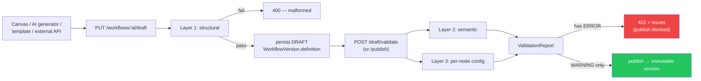
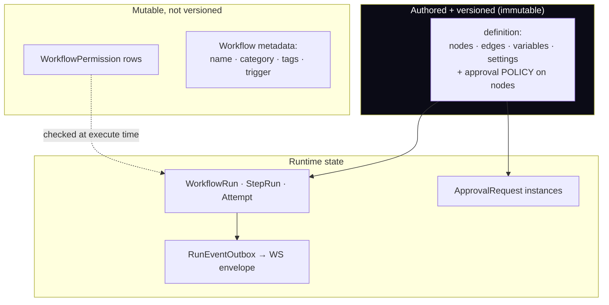

# Phase 14 — JSON Contract

**Prerequisite:** `00-overview-and-canonical-contracts.md` (§0.7 normative).

**Purpose of this document:** the workflow graph is stored as a schema-less Prisma `Json` column.
That is a deliberate strength (ADR-002/ADR-004 — no migration to add a node type) and a real risk:
nothing in the database prevents a malformed graph. This phase is the **contract that replaces the
schema** — one canonical JSON shape, one validator, one version marker, applied at every boundary.

**Covers:** Workflow · Nodes · Edges · Variables · Permissions · Execution · Approvals.

---

## 14.A The graph contract

### 1. Purpose

Define exactly what may appear in `WorkflowVersion.definition`, so that (a) the validator has a
specification to enforce, (b) the canvas has a specification to produce, (c) the engine has a
guarantee it can rely on, and (d) an external integrator can author a workflow via the API without
reverse-engineering the UI.

### 2. Responsibilities

| Responsibility | Owner |
|---|---|
| Normative shape of a stored graph | this document |
| Enforcing it at save/publish | `DefinitionValidator` (Phase 1 §1.C) |
| Enforcing per-node `config` shape | `NodeDefinition.configSchema` + `validate()` (Phase 2) |
| Producing conformant graphs | canvas (Phase 15), AI generator, templates (Phase 1 §1.E) |
| Migrating older shapes forward | `contractVersion` + upgraders (§14.A.15) |

### 3. Architecture — three layers of validation, deliberately separated

```
Layer 1 — Structural (this document, §14.A.5)
  Is it well-formed JSON of the right shape? Unknown top-level keys, wrong types,
  duplicate node ids, dangling edges, size limits.
  → EXISTS TODAY in part: definition-validator.ts checks duplicate ids + dangling edges only.

Layer 2 — Semantic (Phase 1 §1.C)
  Does the graph make sense? Trigger present, no cycles, reachability, branch
  completeness, terminal path, referenced skills/employees exist.
  → ALL NEW.

Layer 3 — Per-node config (Phase 2)
  Is THIS node's config valid for its type? Driven by NodeDefinition.configSchema
  + validate(), so it lives with the node rather than in a central switch.
  → ALL NEW.
```

Keeping them separate matters practically: Layer 1 is cheap and runs on every keystroke-triggered
autosave; Layer 3 needs a `ValidationContext` (installed skills, employee ids) and therefore a DB
round trip, so it runs on explicit validate/publish. Collapsing them would make the canvas either slow
or wrong.

### 4. Flow Diagram



A draft may be saved while invalid — that is intentional. Forcing validity on every autosave would
make the canvas unusable (you cannot build a graph without passing through incomplete states). The
gate is **publish**, not save.

### 5. Database Design

One column: `WorkflowVersion.definition Json` (Phase 12 §12.A.5), with a size check:

```sql
ALTER TABLE "WorkflowVersion"
  ADD CONSTRAINT workflow_definition_size
  CHECK (pg_column_size(definition) < 1048576);   -- 1 MB, Phase 1 §1.A.13
```

A DB-level check as well as an API-level one, because the API is not the only writer (migrations,
backfills, and future admin tooling all bypass it).

### 6. API Design

The contract is the request/response body of:
`PUT /workflows/:id/draft`, `POST /workflows/:id/draft/validate`, `POST /workflows/:id/publish`,
`GET /workflows/:id/versions/:version`, and `POST /workflow-templates/:id/instantiate`.
Endpoint semantics belong to Phases 1 and 13; this document owns only the payload shape.

### 7. TypeScript Interfaces

The canonical TypeScript already lives in doc 00 §0.7.2 (`WorkflowDefinition`, `WorkflowNode`,
`WorkflowEdge`, `WorkflowSettings`, `RetryPolicy`, `CompensationSpec`, `VariableDeclaration`). This
document adds only the envelope field that makes the contract evolvable:

```ts
/** EXTEND doc 00's WorkflowDefinition with a contract-version marker. */
export interface WorkflowDefinition {
  /**
   * NEW — contract version of this document. ABSENT means "1" (every graph
   * written before this field existed). Never bump without an upgrader (§14.A.15).
   */
  contractVersion?: number;

  nodes: WorkflowNode[];                   // EXISTING
  edges: WorkflowEdge[];                   // EXISTING
  variables?: VariableDeclaration[];       // NEW — Phase 6
  settings?: WorkflowSettings;             // NEW
}
```

An **optional** marker rather than a required one, so every existing stored graph remains valid
without a data migration (ADR-004). `undefined` is a legal, meaningful value here — it is the only
honest way to represent "written before we versioned this."

### 8. JSON Examples

**8a. The minimal legal graph.** Useful as a validator fixture and as what `POST /workflows` creates:

```json
{
  "nodes": [{ "id": "n_trigger", "type": "TRIGGER", "config": {} }],
  "edges": []
}
```

No `contractVersion`, no `variables`, no `settings`, no `position` — all optional. This must validate.

**8b. A complete, realistic graph exercising every contract feature.** This is the reference fixture
the validator's test suite should assert against:

```json
{
  "contractVersion": 1,
  "settings": {
    "runTimeoutMs": 604800000,
    "maxSteps": 200,
    "maxConcurrentRuns": 5,
    "idempotency": { "keyTemplate": "onboard:{{trigger.data.staffId}}", "windowMs": 86400000 },
    "defaultRetry": {
      "maxAttempts": 3, "backoff": "EXPONENTIAL",
      "initialDelayMs": 1000, "maxDelayMs": 30000, "jitter": true, "retryOn": "TRANSIENT_ONLY"
    },
    "autoCompensate": true
  },
  "variables": [
    { "key": "staffId",   "scope": "INPUT",       "type": "string", "required": true,
      "description": "StaffMember the onboarding runs for" },
    { "key": "startDate", "scope": "INPUT",       "type": "date",   "required": true },
    { "key": "hrmsToken", "scope": "SECRET",      "type": "secret", "secretRef": "sec_hrms_api" },
    { "key": "region",    "scope": "ENVIRONMENT", "type": "string", "default": "eu-west-1" },
    { "key": "checklist", "scope": "RUNTIME",     "type": "array" }
  ],
  "nodes": [
    { "id": "n_trigger", "type": "TRIGGER", "name": "New hire confirmed",
      "config": {}, "position": { "x": 0, "y": 0 } },

    { "id": "n_policy", "type": "RETRIEVE", "name": "Onboarding policy",
      "config": { "query": "onboarding checklist for {{vars.region}}", "k": 5, "outputKey": "policy" },
      "position": { "x": 0, "y": 120 } },

    { "id": "n_plan", "type": "AI_EMPLOYEE_STEP", "name": "Draft the checklist",
      "config": {
        "employeeId": "emp_hr_01",
        "prompt": "Using {{policy}}, produce an onboarding checklist for a hire starting {{vars.startDate}}.",
        "reasoningStrategy": "PLAN_ACT",
        "allowTools": false,
        "outputKey": "checklist"
      },
      "retry": { "maxAttempts": 3, "backoff": "EXPONENTIAL", "initialDelayMs": 2000, "jitter": true },
      "timeoutMs": 120000,
      "position": { "x": 0, "y": 240 } },

    { "id": "n_fan", "type": "PARALLEL", "name": "Run checks concurrently",
      "config": { "branches": ["n_docs", "n_hrms", "n_accounts"], "maxConcurrency": 3 },
      "position": { "x": 0, "y": 360 } },

    { "id": "n_docs", "type": "SUB_WORKFLOW", "name": "Verify documents",
      "config": { "workflowId": "wf_doc_verification", "versionPin": "ACTIVE",
                  "input": { "staffId": "{{vars.staffId}}" },
                  "waitForCompletion": true, "outputKey": "verification" },
      "timeoutMs": 259200000,
      "position": { "x": -220, "y": 480 } },

    { "id": "n_hrms", "type": "TOOL_ACTION", "name": "Create HRMS record",
      "config": { "skillKey": "hrms", "tool": "create_employee",
                  "args": { "staffId": "{{vars.staffId}}", "startDate": "{{vars.startDate}}" },
                  "outputKey": "hrmsRecord" },
      "onError": "COMPENSATE",
      "compensation": {
        "type": "TOOL_ACTION",
        "config": { "skillKey": "hrms", "tool": "delete_employee",
                    "args": { "employeeId": "{{compensating.originalOutput.result.id}}" } }
      },
      "position": { "x": 0, "y": 480 } },

    { "id": "n_accounts", "type": "HTTP_REQUEST", "name": "Provision accounts",
      "config": { "method": "POST", "url": "https://idp.internal.example.com/provision",
                  "authSecretRef": "sec_idp_key",
                  "body": { "email": "{{trigger.data.workEmail}}" } },
      "retry": { "maxAttempts": 2, "backoff": "LINEAR", "initialDelayMs": 3000 },
      "onError": "ROUTE_TO_ERROR",
      "position": { "x": 220, "y": 480 } },

    { "id": "n_join", "type": "JOIN", "name": "All checks done",
      "config": { "mode": "ALL", "timeoutMs": 345600000, "onLaneFailure": "FAIL" },
      "position": { "x": 0, "y": 600 } },

    { "id": "n_approve", "type": "APPROVAL", "name": "HR sign-off",
      "config": {
        "message": "Approve onboarding for {{trigger.data.fullName}}? Checks: {{verification.summary}}",
        "autoApprove": false,
        "approverRuleType": "EMPLOYEE_MANAGER",
        "slaMs": 172800000,
        "onTimeout": "ESCALATE"
      },
      "position": { "x": 0, "y": 720 } },

    { "id": "n_notify", "type": "NOTIFY", "name": "Tell the team",
      "config": { "channel": "SLACK", "to": "#people-ops",
                  "message": "{{trigger.data.fullName}} is onboarded and starts {{vars.startDate}}." },
      "position": { "x": 0, "y": 840 } },

    { "id": "n_alert", "type": "NOTIFY", "name": "Provisioning failed",
      "config": { "channel": "EMAIL", "to": "it-ops@example.com",
                  "subject": "Account provisioning failed",
                  "message": "Run {{run.id}} could not provision accounts." },
      "position": { "x": 440, "y": 600 } },

    { "id": "n_done", "type": "TERMINATE", "name": "Complete",
      "config": { "status": "COMPLETED", "reason": "Onboarding finished" },
      "position": { "x": 0, "y": 960 } }
  ],
  "edges": [
    { "from": "n_trigger",  "to": "n_policy" },
    { "from": "n_policy",   "to": "n_plan" },
    { "from": "n_plan",     "to": "n_fan" },
    { "from": "n_docs",     "to": "n_join" },
    { "from": "n_hrms",     "to": "n_join" },
    { "from": "n_accounts", "to": "n_join" },
    { "from": "n_accounts", "to": "n_alert",  "branch": "error", "label": "provisioning failed" },
    { "from": "n_join",     "to": "n_approve" },
    { "from": "n_approve",  "to": "n_notify" },
    { "from": "n_notify",   "to": "n_done" }
  ]
}
```

Note what this fixture deliberately demonstrates: a `SECRET`-scope variable referenced **only** by
`secretRef` (never a literal); a compensation that reads `{{compensating.originalOutput}}`; an `error`
branch edge; a `PARALLEL` whose `branches` are exactly the three nodes with no other inbound edge; a
`JOIN` with an explicit timeout rather than relying on the run deadline; and a `SUB_WORKFLOW` whose
`timeoutMs` (3 days) is *shorter* than the parent's `runTimeoutMs` (7 days), which is the correct
relationship.

**8c. A graph that must be REJECTED, with the exact expected report.** Equally important as a fixture:

```json
{
  "nodes": [
    { "id": "n_a", "type": "CONDITION", "config": { "left": "{{x}}", "op": "gt", "right": "abc" } },
    { "id": "n_a", "type": "NOTIFY",    "config": { "message": "dup id" } },
    { "id": "n_b", "type": "TOOL_ACTION", "config": { "skillKey": "mailchimp", "tool": "send" } }
  ],
  "edges": [
    { "from": "n_a", "to": "n_b", "branch": "true" },
    { "from": "n_b", "to": "n_a" },
    { "from": "n_b", "to": "n_ghost" }
  ]
}
```

```json
{
  "valid": false,
  "issues": [
    { "severity": "ERROR", "code": "DUPLICATE_NODE_ID",        "nodeId": "n_a",
      "message": "Duplicate node id \"n_a\"." },
    { "severity": "ERROR", "code": "EDGE_UNKNOWN_TARGET",      "field": "edges[2].to",
      "message": "Edge references unknown node id \"n_ghost\"." },
    { "severity": "ERROR", "code": "NO_TRIGGER",
      "message": "Definition has no TRIGGER node." },
    { "severity": "ERROR", "code": "CYCLE_DETECTED",           "nodeId": "n_a",
      "message": "Cycle: n_a → n_b → n_a. Use a LOOP node for intentional repetition." },
    { "severity": "ERROR", "code": "CONDITION_NON_NUMERIC",    "nodeId": "n_a", "field": "config.right",
      "message": "Operator \"gt\" needs a number; \"abc\" is not numeric." },
    { "severity": "ERROR", "code": "CONDITION_MISSING_BRANCH", "nodeId": "n_a",
      "message": "CONDITION has a 'true' edge but no 'false' edge; runs evaluating false would fail at runtime." },
    { "severity": "ERROR", "code": "UNKNOWN_SKILL",            "nodeId": "n_b", "field": "config.skillKey",
      "message": "Skill \"mailchimp\" is not installed for this company." }
  ]
}
```

The first two codes are the **only** ones today's validator produces (verified:
`definition-validator.ts` is 32 lines and checks exactly duplicate ids + dangling edges). The other
five are the new work Phase 1 §1.C.9 specifies. Listing them side by side makes the delta concrete.

### 9. Folder Structure

```
packages/types/src/
├── index.ts                      EXTEND — WorkflowDefinition.contractVersion
└── workflow-contract/            NEW — shared so web + api + tests use ONE definition
    ├── schema.json               JSON Schema (draft 2020-12) for Layer 1
    ├── fixtures/
    │   ├── minimal.json          §14.A.8a
    │   ├── complete.json         §14.A.8b
    │   └── invalid-*.json        §14.A.8c and one file per error code
    └── upgraders/
        └── v1-to-v2.ts           empty today; the pattern exists before it's needed

apps/api/src/modules/workflows/engine/
└── definition-validator.ts       EXTEND — Layers 1+2 (Layer 3 delegates to NodeRegistry)
```

Putting the JSON Schema and fixtures in `packages/types` (which both apps already depend on) is the
point: the canvas validates against the same file the API enforces, so the two cannot drift. A
frontend copy of the rules would drift within a release.

### 10. Edge Cases

| Case | Behaviour |
|---|---|
| Unknown top-level key in `definition` (e.g. `"metadata": {...}`) | **Rejected** by Layer 1 (`additionalProperties: false`). Strict, deliberately: silently accepting unknown keys means a typo'd `"setting"` is discarded with no warning, and a future real `settings` key collides with customer data. |
| Unknown key inside `node.config` | **Allowed.** `config` is per-type and open by design — this is what lets a node type add an optional field without a contract bump. Layer 3 warns on keys the node's `configSchema` doesn't declare, so typos surface without breaking. |
| Unknown `node.type` | Rejected at Layer 1 (enum) and again at Layer 3 (registry lookup). Both, because a graph published on a newer release then rolled back would otherwise reach the engine. |
| `contractVersion` absent | Treated as `1`. Valid forever. |
| `contractVersion` higher than the server supports | **Rejected** with a clear "this workflow was authored on a newer version" message — never best-effort parsed. Silently ignoring unknown structure is how you execute a graph the author didn't write. |
| `position` present on some nodes, absent on others | Legal. Missing positions get `dagre` auto-layout on open (per the approved canvas design) and are persisted on next save. |
| Node with `disabled: true` | Structurally valid; the engine skips it and follows its outgoing edge. Validation still checks its config (so re-enabling can't produce a surprise) but downgrades ERRORs to WARNINGs for disabled nodes. |
| Empty `nodes` array | Rejected — `NO_TRIGGER`. A graph with no nodes is never intentional. |
| Self-loop edge (`from === to`) | Rejected as `CYCLE_DETECTED`. |
| Duplicate identical edges | WARNING, deduplicated on save. Harmless but always a UI bug. |
| `variables` declaring a `SECRET` with a literal `default` | **Rejected** — ERROR. A secret literal in a graph is readable by anyone with workflow read access. This is a security rule, not a style rule. |
| Definition over 1 MB | Rejected at API and DB. |
| Node id format | Must match `^[A-Za-z0-9_-]{1,64}$`. Constrained because ids appear in log lines, lane ids (`main:<nodeId>:0`), and the step unique key — an id containing `:` would corrupt lane parsing. A real bug prevented by a boring rule. |

### 11. Security

- **`SECRET` scope is reference-only** (§14.A.10): `secretRef` may appear in a graph; a secret value
  may not. Enforced at Layer 1 (schema) and Layer 3 (validator), and reinforced by gap **G24** —
  Phase 6's redaction boundary must land before secret-in-template support, or the dry-run preview
  path will persist resolved secrets into `WorkflowStepRun.output`.
- **Templates as an injection vector:** `{{...}}` is resolved by the existing no-`eval` resolver
  (verified `template.ts`). The contract must not permit any construct that would need evaluation —
  which is precisely why `TRANSFORM` uses a declarative expression grammar (Phase 6) rather than
  arbitrary code (doc 00 §0.9 non-goal #2).
- **`HTTP_REQUEST.url` must be a template-resolvable string, validated post-resolution** at runtime by
  the existing SSRF guard — the contract cannot validate it statically, and pretending otherwise would
  give false assurance. Stated explicitly so nobody assumes Layer 1 covers SSRF.
- **Strict `additionalProperties` at the top level** limits the blast radius of a malicious or
  malformed payload to the `config` objects, where the per-node validator applies.

### 12. Performance

Layer 1 is a JSON Schema validation — sub-millisecond for a 1 MB document with a compiled validator
(`ajv` with `compile()` cached at module load, not per request). Layer 2 is a single DFS,
O(nodes + edges). Layer 3 is O(nodes) with one batched DB read for the `ValidationContext`
(installed skills + employee ids fetched once, not per node — the obvious N+1 to avoid here).

### 13. Scalability

Bounded by the 1 MB / 500-node caps. Validation is per-save/publish (human frequency), never on the
execution hot path — the engine trusts a published version because it was validated at publish time
and is immutable thereafter. That trust is only sound *because* of ADR-002's immutability; if versions
were mutable, the engine would have to re-validate on every run.

### 14. Future Extension

- **`contractVersion: 2`** when a genuinely breaking shape change is needed. The upgrader pattern is in
  place from day one (`upgraders/v1-to-v2.ts`) specifically so the first breaking change doesn't have
  to invent the mechanism under pressure. Upgraders run on read for `DRAFT` versions and **never** on
  `PUBLISHED` ones (they are immutable) — a published v1 graph keeps executing on the v1 interpreter.
- **Published JSON Schema for customers**, so integrators can validate client-side before POSTing.
- **Graph diffing on the contract** (Phase 1's `versions/:a/diff/:b`) becomes richer once the contract
  is formalised — semantic diffs ("retry policy changed on n_hrms") rather than textual ones.

### 15. Best Practices & migration

**Practices.** Keep the JSON Schema in `packages/types` as the single source. Add a fixture file for
every new error code the validator can emit — a validator without a negative fixture per code is a
validator whose error paths are untested. Never loosen top-level `additionalProperties`. Never add a
required field to the contract without an upgrader.

**Migration.** There is no data migration for this phase — that is its main design achievement. Every
graph currently stored in `Workflow.definition` is already conformant to `contractVersion: 1`
(`{nodes, edges}` with per-node `config`), because the contract was written to describe what exists
rather than to replace it. The Phase 1 backfill copies `definition` verbatim into
`WorkflowVersion.definition` with **no shape change**, and validation of those backfilled v1 rows is
expected to produce WARNINGs (missing `position`, missing `settings`) and must not produce ERRORs. If a
backfilled row *does* produce an ERROR, that is a real pre-existing broken workflow and should be
reported to the tenant rather than auto-repaired — silently rewriting a customer's automation is worse
than telling them it's broken.

---

## 14.B Non-graph contracts

### 1. Purpose

The brief's contract list includes Permissions, Execution, and Approvals — which are **not** part of
the stored graph. This section states where each actually lives, so nobody looks for them in
`definition`.

### 2. Responsibilities

Point at the owning phase, and define the two contracts that genuinely need a canonical JSON shape
here because they cross a process boundary: the execution event envelope and the run export format.

### 3. Architecture — what belongs in the graph and what does not

| Contract | In `definition`? | Where it lives | Why |
|---|---|---|---|
| Nodes, edges, variables, settings | ✅ yes | `WorkflowVersion.definition` | Authored content, versioned with the graph |
| **Permissions** | ❌ no | `WorkflowPermission` rows (Phase 9/12) | Must be changeable without republishing, and must not be frozen into an immutable version. Putting an ACL inside an immutable artefact means you cannot revoke access without a new version — a serious security anti-pattern. |
| **Execution state** | ❌ no | `WorkflowRun`/`StepRun`/`Attempt` (Phase 5/12) | Per-run state, not authored content |
| **Approvals** | ⚠️ partly | Node *config* is in the graph (`approverRuleType`, `slaMs`, `onTimeout`); the *request* is an `ApprovalRequest` row | The policy is authored; the instance is runtime state |

The permissions case is the one worth internalising: it is tempting to put an ACL in the JSON because
it is convenient, and it would be a real mistake.

### 4. Flow Diagram



### 5. Database Design

All in Phase 12. No tables owned here.

### 6. API Design

Phase 13 owns endpoints. This section owns two payload shapes that cross a boundary and therefore need
pinning: the WebSocket event envelope and the run export.

### 7. TypeScript Interfaces

```ts
/**
 * NEW — the realtime event envelope. Phase 13 is authoritative on transport and
 * the event catalogue (see Phase 12 §12.0.2 conflict C5 — Phase 15 proposed a
 * competing shape before Phase 13 existed; Phase 13 wins). Pinned here because
 * it is persisted in RunEventOutbox.payload and therefore IS a stored contract,
 * not merely a wire format.
 */
export interface RunEventEnvelope {
  /** Monotonic per run — lets a reconnecting client detect gaps. */
  seq: number;
  eventType:
    | 'run.started' | 'run.completed' | 'run.failed' | 'run.cancelled'
    | 'run.waiting' | 'run.timed_out' | 'run.compensating'
    | 'step.started' | 'step.completed' | 'step.failed' | 'step.retrying' | 'step.skipped'
    | 'approval.created' | 'approval.decided';
  companyId: string;
  runId: string;
  workflowId: string;
  /** Present for step.* events. */
  stepId?: string;
  nodeId?: string;
  attempt?: number;
  laneId?: string;
  status?: WorkflowRunStatus | StepRunStatus;
  failureClass?: RunFailureClass;
  /** ISO timestamp of the state change, from Postgres NOW() — never a worker clock. */
  at: string;
  correlationId: string;
  /** Redacted through Phase 6's boundary. Never contains a secret. */
  data?: Record<string, unknown>;
}

/** NEW — portable run export for support/audit hand-off. */
export interface RunExport {
  exportedAt: string;
  exportVersion: 1;
  /** The exact immutable graph that ran — the reason ADR-002 matters. */
  workflowVersion: { id: string; version: number; checksum: string; definition: WorkflowDefinition };
  run: RunTimelineDto;                       // Phase 5 §5.E.7
  approvals: { id: string; status: ApprovalStatus; decidedByUserId: string | null; decidedAt: string | null }[];
  /** Present only when the requester holds an audit-read permission. */
  auditEvents?: unknown[];
}
```

`seq` on the envelope is the detail that makes reconnection correct: without a monotonic per-run
sequence, a client that misses events while disconnected cannot tell, and will silently render a stale
timeline. With it, a gap is detectable and the client refetches.

### 8. JSON Examples

```json
// A step.retrying event — the state today's system cannot even represent
{
  "seq": 14,
  "eventType": "step.retrying",
  "companyId": "cmp_acme",
  "runId": "run_9Qm4",
  "workflowId": "wf_7Kd2",
  "stepId": "stp_71",
  "nodeId": "n_score",
  "attempt": 1,
  "status": "RETRYING",
  "failureClass": "RATE_LIMITED",
  "at": "2026-08-01T07:04:11.221Z",
  "correlationId": "c8f1e2a0-3b5d-4a77-9e21-0f2b6d1c4e88",
  "data": { "nextAttemptAt": "2026-08-01T07:04:13.221Z", "error": "429 from provider" }
}
```

### 9. Folder Structure

```
packages/types/src/workflow-contract/
├── run-event.schema.json     NEW — validates RunEventEnvelope (the WS gateway asserts on it)
└── run-export.schema.json    NEW
```

Validating outbound events against a schema in development catches envelope drift at the source rather
than in a client bug report.

### 10. Edge Cases

| Case | Behaviour |
|---|---|
| Client reconnects and `seq` has a gap | Client refetches `GET /runs/:id/timeline` and resumes from the latest `seq`. The gap is detectable **because** `seq` exists. |
| Two workers emit events for the same run concurrently (parallel lanes) | `seq` is allocated by the outbox's `BigInt` autoincrement per run at insert time, inside the same transaction as the state change — so ordering is the database's, not the workers'. |
| An event's `data` would contain a secret | Impossible by construction if Phase 6's redaction is applied at write time (which is why it must be write-time, not read-time). Schema validation additionally rejects any key matching the secret-ref pattern. |
| `RunExport` requested for a run whose version was later archived | Still complete — the version row is retained (Phase 1 §1.A.10). This is exactly the case immutable versions exist for. |
| `RunExport` for a run whose partitions were purged | Returns what remains plus an explicit `partiallyPurged: true` and the retention policy — never a silently truncated export presented as complete. |

### 11. Security

`RunExport` can contain business data (CV text, salary figures) and is a plausible exfiltration path —
it must require an explicit permission (not merely run-read), be rate-limited, and itself be audited.
`auditEvents` is omitted unless separately authorised. The WS envelope is scoped per company by the
gateway (Phase 13); a client must never be able to subscribe to a `companyId` it doesn't belong to.

### 12. Performance

The envelope is small and flat by design (no nested step arrays) so a busy run's event stream stays
cheap. `RunExport` is a heavyweight, on-demand operation — generated asynchronously and delivered as a
download for large runs rather than serialised inline in a request.

### 13. Scalability

`RunEventOutbox` is transient: rows are deleted after publication + a short grace window, so it stays
small even at high event volume. It is not a durable event log — `AuditEvent` is.

### 14. Future Extension

Signed `RunExport` (sign the version `checksum` + run hash) so a customer can prove to a regulator what
ran; CloudEvents-compatible envelope if outbound integration ever needs a standard format.

### 15. Best Practices

Keep the graph contract free of anything mutable (permissions above all). Version the event envelope
separately from the graph contract — they change for entirely different reasons and coupling them
would force needless bumps.

---

## 14.C Contract conformance checklist

A single place for an implementer to confirm the contract is actually enforced. Every line is a test
that should exist:

- [ ] `minimal.json` validates (Layer 1, 2, 3) with zero ERRORs.
- [ ] `complete.json` validates with zero ERRORs.
- [ ] One `invalid-*.json` fixture exists per error code the validator can emit, each asserting the
      exact expected `code`, `severity`, and `nodeId`/`field`.
- [ ] Every real `Workflow.definition` in the production database validates with zero ERRORs
      (run as a one-off audit script **before** the Phase 1 backfill — if any tenant's live workflow
      fails, that is a finding to report, not to auto-fix).
- [ ] A graph with `contractVersion: 999` is rejected, not best-effort parsed.
- [ ] A `SECRET` variable with a literal `default` is rejected.
- [ ] A node id containing `:` is rejected (lane-id corruption).
- [ ] Unknown top-level key is rejected; unknown `config` key produces a WARNING only.
- [ ] The canvas and the API validate against the *same* schema file (assert by importing it in both
      test suites).
- [ ] Every emitted `RunEventEnvelope` validates against `run-event.schema.json` in development.
- [ ] The 1 MB DB check constraint exists and is exercised by a test.

---

**This completes the 16-document set.** Return to
`00-overview-and-canonical-contracts.md` §0.10 for the implementation sequencing, starting with
**Wave 0** (the G25 approval-gate bypass and the G29 hard-delete data loss — both P0, both small,
both independent of everything else).
