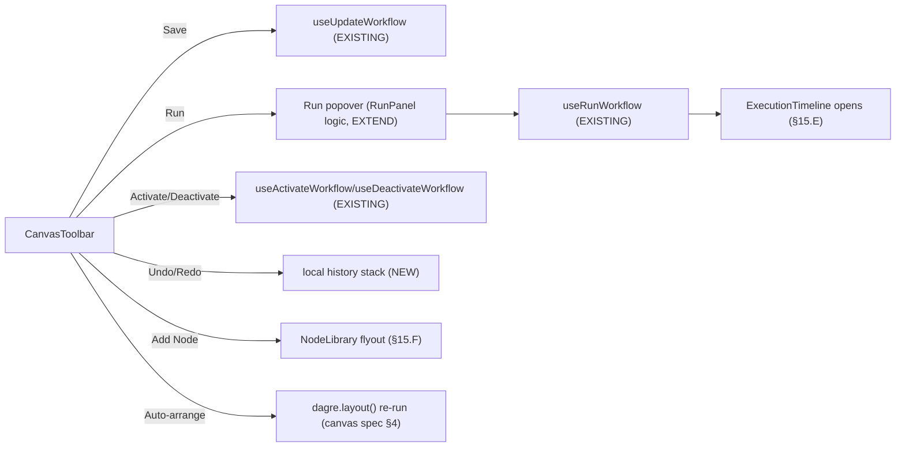
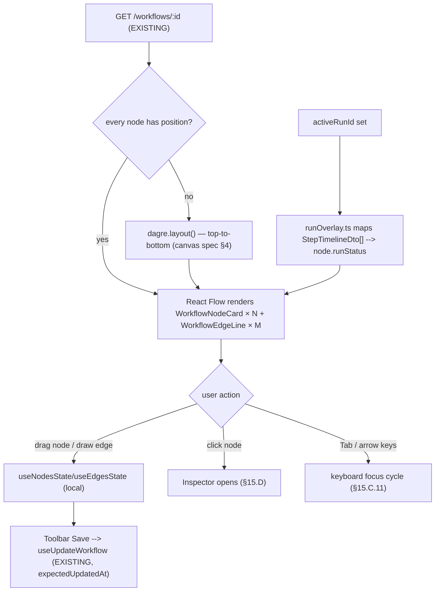
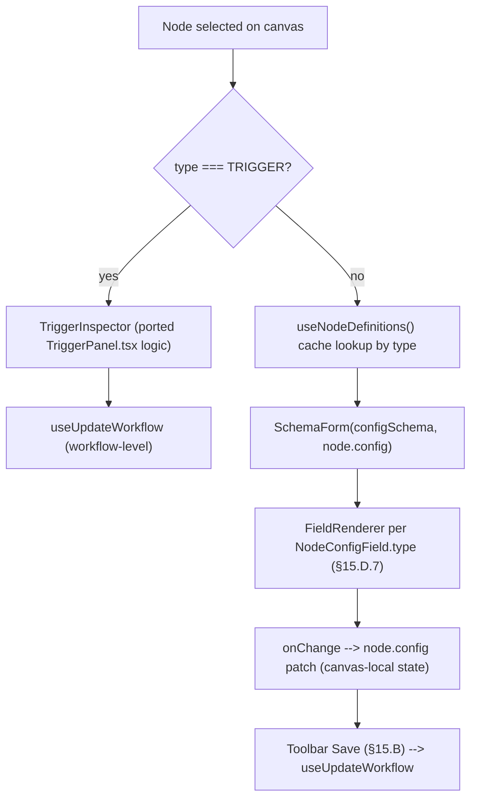
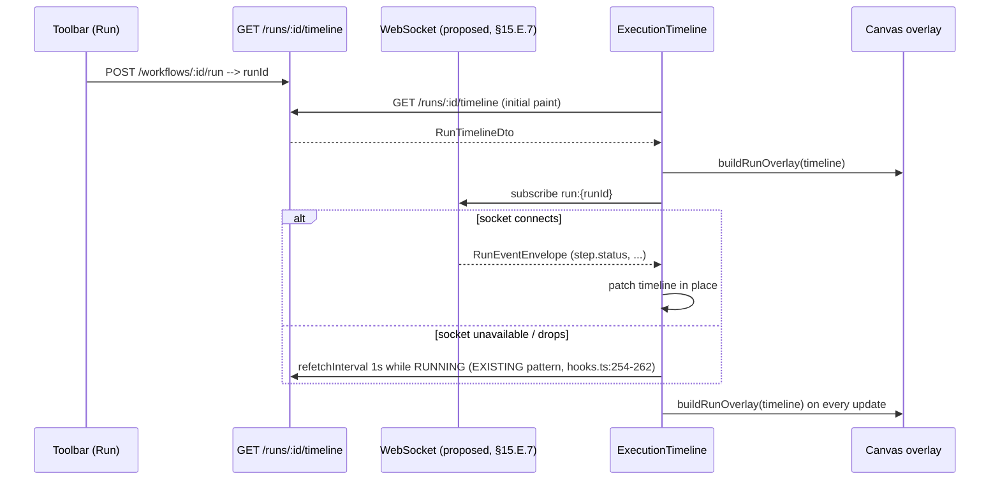
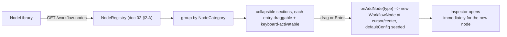
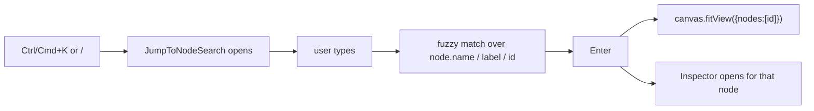
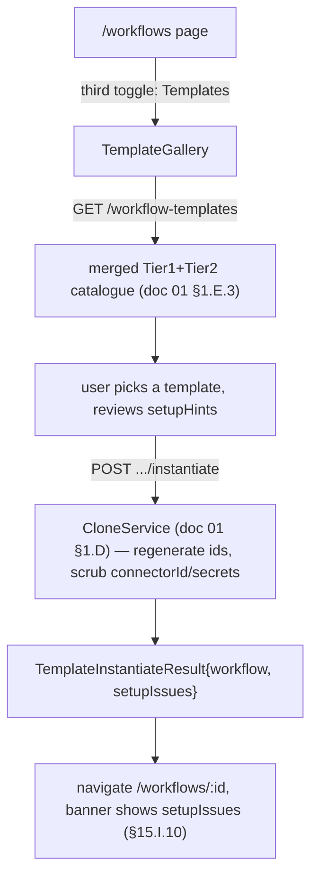
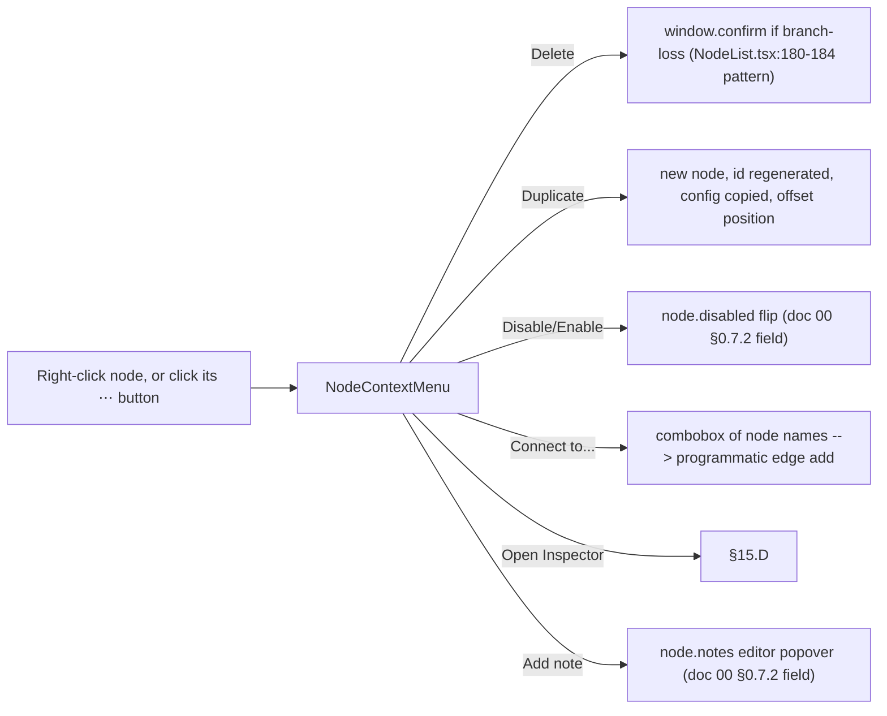
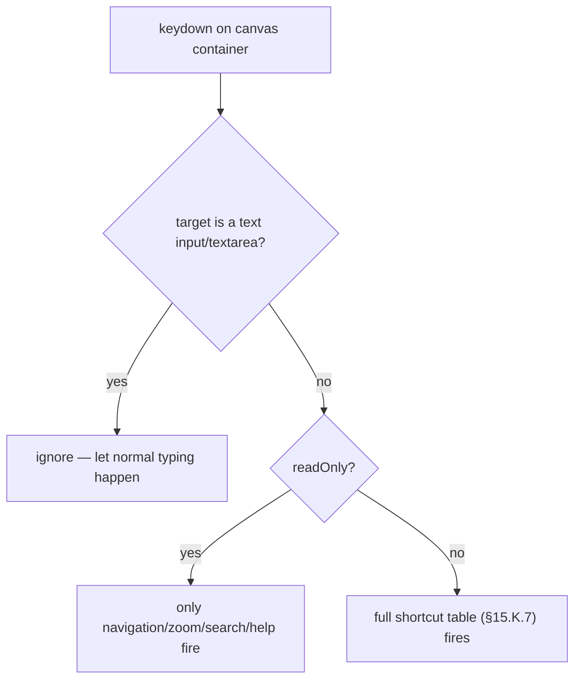

# Phase 15 — Frontend Architecture

**Prerequisite:** `00-overview-and-canonical-contracts.md` §0.7 (normative — every enum/interface named
below is used verbatim), plus the DTOs elaborated in `01-workflow-core.md`, `02-node-architecture.md`,
`05-execution-engine.md`, `06-variables.md`, `08-approvals.md`, `09-permissions.md`.

**Governing design:** `docs/superpowers/specs/2026-07-27-visual-workflow-builder-design.md` — an
**approved** design for the visual canvas (React Flow `@xyflow/react` + `dagre` auto-layout,
`WorkflowCanvas.tsx` as a drop-in replacement for `NodeList.tsx`). Referred to throughout as **"the
canvas spec."** This document **builds on** the canvas spec; every place it extends or departs from
that spec is called out explicitly, by name, with a reason — never silently.

**Status:** Design approved for implementation · **Date:** 2026-08-01 · **Audience:** frontend
engineers implementing `apps/web/src/features/workflows/`

---

## 15.0 Scope, status & prerequisite findings

### 15.0.1 Purpose of this phase

Design the UI that lets a human build, inspect, run, and audit an Orlixa workflow graph — consuming
contracts that Phases 1–11 already define, and generalizing to whatever Phases 2's `NodeRegistry` adds
in future with **zero frontend code change** (ADR-003's whole point, doc 02 §2.A.1). This document does
not invent backend behaviour; where a UI need has no backend contract yet, it is flagged as a **NEW —
pending promotion** requirement rather than quietly assumed.

### 15.0.2 Verified current state (read directly from source, 2026-08-01)

| File | Lines | Role today |
|---|---|---|
| `apps/web/src/features/workflows/components/NodeList.tsx` | 352 | Linear step builder: pinned TRIGGER, add/reorder/delete steps, branch-loss `window.confirm` (:180-184), `expectedUpdatedAt` save (:220) |
| `apps/web/src/features/workflows/components/NodeEditor.tsx` | 292 | Hand-written config form, one `if` block per `NodeType` (:99-289); `ArgsEditor` JSON textarea+validate (:36-72) |
| `apps/web/src/features/workflows/components/RunSteps.tsx` | 59 | Shared step-trace list, output preview truncated at 800 chars (:5-11) |
| `apps/web/src/features/workflows/components/PastRunsPanel.tsx` | 97 | Past-runs list; expands a row to poll `useWorkflowRun` (:27) |
| `apps/web/src/features/workflows/components/RunPanel.tsx` | 136 | Trigger-JSON + dry-run checkbox + Run button + live log |
| `apps/web/src/features/workflows/components/TriggerPanel.tsx` | 415 | Trigger-type select, SCHEDULE/EVENT/WEBHOOK config, EVENT condition rows, Activate/Deactivate |
| `apps/web/src/features/workflows/components/WorkflowForm.tsx` | 86 | Blank-create form (rhf + zod) |
| `apps/web/src/features/workflows/components/WorkflowList.tsx` | 164 | Status filter, `StatusToggle` switch (:25-63) |
| `apps/web/src/features/workflows/components/GenerateWorkflowChat.tsx` | 120 | AI-drafted workflow chat; routes to `?unresolved=` query param (:44-49) |
| `apps/web/src/features/workflows/hooks.ts` | 269 | All TanStack Query hooks; optimistic `onMutate`/`onError`/`onSettled` triad throughout |
| `apps/web/src/features/workflows/api.ts` | 98 | Thin `apiClient` wrappers |
| `apps/web/src/features/workflows/labels.ts` | 133 | `NODE_LABELS`/`NODE_ICONS`/`NODE_TONES`/`NODE_HINTS` keyed by today's 8 `NodeType`s (:21-67) |
| `apps/web/src/features/workflows/schemas.ts` | 31 | Re-exports of `@vaep/types` zod schemas |
| `apps/web/src/components/ui/Button.tsx` | 48 | **The only file in `components/ui/`** — variants `primary\|cta\|hire\|ghost\|link\|violet` (:14) |
| `apps/web/src/components/app-shell/Sidebar.tsx` | 122 | Global nav; `/workflows` entry already present (:33) |
| `apps/web/src/components/app-shell/AppShell.tsx` | 37 | Sidebar+Topbar+`<main className="flex-1 px-6 pb-12 sm:px-10">` (:33) — **no max-width cap**, but has padding a full-bleed canvas must route around |
| `apps/web/src/components/app-shell/Topbar.tsx` | 89 | `px-6 py-5 sm:px-10` (:28) ≈ 80px tall (20px×2 padding + ~40px content) |
| `apps/web/src/components/marketing-dark/WorkflowDiagram.tsx` | 79 | **Marketing mockup already establishes the node-canvas visual language**: `bg-void-card`, `border-white/[0.08]`, `shadow-dark-card`, tone badges, diamond CONDITION node |
| `apps/web/src/lib/apiClient.ts` | 100 | The one axios singleton (:36-40) |
| `apps/web/src/lib/queryClient.ts` | 16 | The one `QueryClient` singleton |
| `apps/web/src/stores/session.store.ts` | 65 | The one Zustand store — `session` + `ui` slices |
| `packages/config/tailwind-preset.cjs` | 144 | Design tokens: `void`/`violet` dark palette (:43-45), `borderRadius.node:'14px'` (:69), `boxShadow['dark-card']` (:76), keyframes `flow`/`breathe`/`pulseDot` (:86-110, directly reusable for execution-state animation) |
| `apps/web/package.json` | — | **Verified: no `@xyflow/react`, no `dagre`, no WebSocket client library present yet.** |
| `packages/types/src/index.ts` | ~1400 | **Verified: still pre-Phase-1.** `NodeType` has 8 values (:965-973), `WorkflowDto` is flat with no versioning (:1186-1206), `WorkflowRunDto`/`WorkflowStepRunDto` have no attempts/lanes/cost (:1249-1291) |

No `Modal`/`Dialog`/`Toast` primitive exists anywhere in `apps/web/src` (verified by search). Destructive
confirmation today is `window.confirm` (`NodeList.tsx:180`) — a real, working pattern this document
keeps rather than replaces.

### 15.0.3 Authoring-order note — RESOLVED 2026-08-01

> **STATUS: this section's original contradiction no longer applies. Retained for provenance.**
>
> When this document was authored, only `00` and Phases 1–11 existed on disk, so it correctly
> reported that `12-database.md`, `13-api.md`, and `14-json-contract.md` were missing and that no
> document defined the realtime wire payload. **All three now exist**, written after this document.
> The observation was accurate at the time and is preserved here because it explains why §15.E.7
> proposes a contract rather than citing one.
>
> **Two consequences an implementer must act on:**
> 1. **Phase 13 is now authoritative for the realtime contract.** `14-json-contract.md` §14.B.7 pins
>    `RunEventEnvelope` (with a per-run monotonic `seq` for gap detection on reconnect), and
>    `12-database.md` §12.0.2 conflict **C5** records the resolution explicitly: **where §15.E.7's
>    proposed shape differs from Phase 13's, Phase 13 wins.** Reconcile §15.E.7 against it rather
>    than treating this document's proposal as settled.
> 2. **Phases 12 and 14 do now constrain this document** — specifically the 1 MB definition cap and
>    500-node ceiling (Phase 12 §12.A.13 / Phase 14 §14.A.10), which are the real inputs to the
>    canvas performance budget in §15.C.12, and Phase 14's node-id format rule
>    (`^[A-Za-z0-9_-]{1,64}$`) which the canvas must enforce on node creation.
>
> **Generalisable lesson, worth keeping:** a phase document's "verified" section describes the file
> tree *at authoring time*. In a doc set written incrementally, always re-check the live tree rather
> than trusting a sibling document's freshness claim.

This document proceeds anyway, per the brief's own instruction to build against doc 00 §0.7's canonical
names — those are stable regardless of which phase document elaborates them next.

### 15.0.4 Sequencing dependency (not a contradiction, but must be stated)

Every "future" DTO this document designs against — `WorkflowDto.activeVersion`/`.draftVersion` (doc 01),
26-value `NodeType`/`NodeCategory` (doc 00 §0.7.1), `NodeDefinitionDto` (doc 02), `RunTimelineDto`/
`StepTimelineDto` (doc 05), `VariableBag`/secret refs (doc 06), `ApprovalRoutingConfig` (doc 08) — **does
not exist yet in `packages/types/src/index.ts`** (verified §15.0.2). This document's component
signatures below type against those future DTOs. They will not compile until the corresponding backend
phase regenerates `@vaep/types`. Every element below is marked **EXISTING (KEEP)** / **EXTEND** / **NEW**
against *today's* shipped code, not against some hypothetical future baseline.

### 15.0.5 Key design decisions

| # | Decision | Where | Relationship to the canvas spec |
|---|---|---|---|
| A | Inspector becomes a **generic form renderer** driven by `NodeConfigField[]`, not per-type hand-written blocks | §15.D | **Extends** — the canvas spec said "existing `NodeEditor.tsx` form unchanged, no form-logic rewrite" (canvas spec:64-65), written before doc 02's registry existed. ADR-003's entire point (doc 02 §2.A.1) — a new node type needs zero frontend change — is unreachable with hand-written per-type blocks. See §15.D.3 for the reconciliation. |
| B | Execution Timeline: a run-history drawer **plus** a live status overlay on canvas nodes | §15.E | **Extends** — the canvas spec explicitly scoped this **out** ("Visualizing a workflow *run* on the canvas… wasn't asked for here", canvas spec:116-118, calling it "a natural follow-up"). This document is that follow-up, required by this phase's brief. |
| C | Read-only mode is a first-class `readOnly` canvas prop | §15.C | **Extends** — canvas spec's props were `{ workflow: WorkflowDto }` only (canvas spec:54-55); Phase 9 permissions (doc 09) didn't exist when it was written. |
| D | Every drag-only interaction (move, connect, delete) gets a non-drag equivalent | §15.C, §15.J, §15.K | **Extends** — accessibility requirement from this phase's brief, not covered by the canvas spec. |
| E | Node Library + Inspector read one shared `NodeDefinitionDto[]` query | §15.D, §15.F | **New surface** — doc 02 §2.A.6 defines `GET /workflow-nodes`; the canvas spec pre-dates it and used only `labels.ts`. |
| F | Output handles are generated from `NodeDefinitionDto.handles.outputs`, not hardcoded per type | §15.C.3 | **Generalizes** the canvas spec's hardcoded "CONDITION has two labeled handles" (canvas spec:60-62) into the registry-driven mechanism doc 02 already specifies for `SWITCH` and error-routing. |
| G | WebSocket contract for the timeline is **proposed**, not yet backend-defined | §15.E.7 | **New — pending promotion** into Phase 13 (§15.0.3). |
| H | Toolbar consolidates Save/Run/Activate/Undo/Publish; `TriggerPanel`/`RunPanel` relocate rather than disappear | §15.B | Necessary once the canvas needs full vertical space; not addressed by the canvas spec, which kept the page's other panels unchanged. |
| I | Canvas UI state (selection, panel-open, read-only) is local component state, not a new Zustand slice | §15.C.3 | Honors `CLAUDE.md`'s "one Zustand store" convention — that store is for session/app-global state, not page-local canvas state. |
| J | A minimal `Modal`/`Dialog` primitive is added to `components/ui/` | §15.I, §15.K | **New** — required for Templates and the shortcuts-help overlay; none exists today (§15.0.2). |

### 15.0.6 Cross-cutting policies (stated once, referenced by number from every section below)

1. **Read-only mode.** A user without edit permission (Phase 9, doc 09 §9.C) sees the canvas panned/
   zoomable but nodes non-draggable, no connection handles, Inspector fields disabled with no Save,
   Toolbar's mutating actions hidden (not merely disabled — see each section for which), Node Library
   absent (nothing to drag), context menu shows only non-mutating items. **The canvas enforces
   nothing.** Every mutation still goes through the same guarded endpoint the server would reject
   anyway (doc 09 §9.A.11: "Enforcement is server-side only… a hidden button is not a security
   control"). Read-only mode is a UX quality improvement, never the security boundary.
2. **SECRET values are never rendered.** Per doc 06 §6.2.11, redaction is value-based; the frontend's
   independent obligation is simpler and absolute: no input in this feature ever accepts or displays a
   secret's plaintext. A `NodeConfigField.secret === true` field renders only a picker over `GET
   /workflow-secrets` (keys + metadata only, doc 06 §6.2.6) and writes the literal string
   `{{secrets.KEY}}` — never a value from that endpoint's response, because that response never
   contains one.
3. **Realtime degrades to polling, never blocks.** The Execution Timeline's WebSocket subscription
   (§15.E.7, proposed) is a latency optimization over the same `GET /runs/:id/timeline` /
   `useWorkflowRun`-style polling that already works today (`hooks.ts:254-262`). A dropped socket falls
   back to the existing 1-second poll; nothing about correctness depends on the socket.
4. **Step `input`/`output` is pre-redacted by the server** (doc 05 §5.E.10, doc 06 §6.2) before it ever
   reaches this frontend. The frontend does no client-side redaction of its own and must not attempt
   to — it would imply a false sense of security if the server-side boundary ever had a gap.
5. **Accessibility baseline.** Every mutating drag gesture has a non-drag equivalent (§15.0.5-D);
   `Tab`/arrow-key node focus and a visible per-node "⋯" menu are the accessible substrate every other
   surface builds on. Where full parity is genuinely not achievable (minimap, edge lines as decorative
   paths), this is stated plainly per-surface rather than glossed over, with the concrete fallback
   named.
6. **No new global store.** Canvas-local UI state (selected node, open panel, read-only flag, undo
   stack) lives in `WorkflowCanvas`'s own component state / a co-located reducer — never in
   `useSessionStore` (`stores/session.store.ts`) — matching `CLAUDE.md`'s "one Zustand store" for
   session/app-global concerns only.

### 15.0.7 Folder structure (whole feature, after this phase)

```
apps/web/src/features/workflows/
├── api.ts                          EXTEND — + getWorkflowNodes, getRunTimeline, listWorkflowTemplates,
│                                     instantiateTemplate, listWorkflowSecrets, listWorkflowVariables
├── hooks.ts                         EXTEND — + useNodeDefinitions, useRunTimeline, useRunEvents,
│                                     useWorkflowTemplates, useInstantiateTemplate, useUndoRedo
├── labels.ts                        EXTEND — + CATEGORY_ICONS/CATEGORY_TONES fallback (§15.F.7)
├── schemas.ts                       EXTEND — re-export new zod schemas as @vaep/types adds them
├── components/
│   ├── WorkflowCanvas.tsx           EXTEND (canvas spec's own file) — + readOnly, run overlay, a11y
│   ├── NodeEditor.tsx               DELETE once SchemaForm (below) ships — logic ports into field
│   │                                 renderers (§15.D.3), not thrown away
│   ├── NodeList.tsx                 DELETE per canvas spec ("full replace… list goes away entirely")
│   ├── RunSteps.tsx                 EXTEND — becomes TimelineStepRow's non-lane-aware ancestor
│   ├── PastRunsPanel.tsx            EXTEND — folded into ExecutionTimeline's "History" tab (§15.E.3)
│   ├── RunPanel.tsx                 EXTEND — trigger-JSON+dryRun form relocates into Toolbar's Run
│   │                                 popover (§15.B.3); run hook (`useRunWorkflow`) unchanged
│   ├── TriggerPanel.tsx             EXTEND — relocates into the Inspector's TRIGGER-node special case
│   │                                 (§15.D.3); hooks (`useActivateWorkflow` etc.) unchanged
│   ├── WorkflowForm.tsx             EXISTING (KEEP) — unchanged, one of three ways to start a workflow
│   ├── WorkflowList.tsx             EXISTING (KEEP) — unchanged
│   ├── GenerateWorkflowChat.tsx     EXTEND — its `?unresolved=` banner generalizes to accept
│   │                                 `ValidationIssue[]` (§15.I.10), shared with Templates
│   ├── nodes/
│   │   ├── WorkflowNodeCard.tsx     NEW — the one custom React Flow node renderer (§15.C.3)
│   │   └── nodeHandles.ts           NEW — `NodeOutputHandle[]` → React Flow `Handle` list (§15.C.3)
│   ├── edges/
│   │   └── WorkflowEdgeLine.tsx     NEW — custom edge: label, animated `flow` dash while RUNNING
│   ├── Inspector/
│   │   ├── Inspector.tsx            NEW shell — replaces NodeEditor's mounting point
│   │   ├── SchemaForm.tsx           NEW — the `NodeConfigField[]` generic renderer (§15.D.3)
│   │   ├── TriggerInspector.tsx     NEW — the one hand-built exception (ported from TriggerPanel.tsx)
│   │   └── fields/                  NEW — one renderer per `NodeConfigField.type` (§15.D.7)
│   ├── Toolbar/
│   │   └── CanvasToolbar.tsx        NEW (§15.B)
│   ├── ExecutionTimeline/
│   │   ├── ExecutionTimeline.tsx    NEW — Live + History tabs (§15.E)
│   │   ├── TimelineStepRow.tsx      NEW
│   │   └── runOverlay.ts            NEW — maps StepTimelineDto[] → per-node status for the canvas
│   ├── NodeLibrary/
│   │   └── NodeLibrary.tsx          NEW (§15.F)
│   ├── Templates/
│   │   └── TemplateGallery.tsx      NEW (§15.I)
│   ├── ContextMenu/
│   │   └── NodeContextMenu.tsx      NEW (§15.J)
│   ├── Outline/
│   │   └── OutlineView.tsx          NEW — read-only textual fallback, accessibility (§15.C.11)
│   └── shortcuts/
│       └── useCanvasKeyboardShortcuts.ts   NEW (§15.K)
apps/web/src/components/ui/
└── Modal.tsx                        NEW — focus-trapped dialog primitive (§15.0.5-J), first consumer:
                                      Templates gallery + the shortcuts-help overlay
```

---

## 15.A Sidebar

### 1. Purpose

Give the user a persistent route into the workflow builder from anywhere in the authenticated app —
already solved. This section exists to confirm no change is needed and to say why.

### 2. Responsibilities

Global navigation only. It does not know about canvases, nodes, or runs.

### 3. Architecture

**EXISTING (KEEP), verified sufficient.** `apps/web/src/components/app-shell/Sidebar.tsx:33` already
lists `{ href: '/workflows', label: 'Workflows', icon: Workflow }` in `NAV_PRIMARY`. This document adds
no new top-level nav entry — a "Templates" entry point lives *inside* the `/workflows` page as a third
create-option alongside `WorkflowForm`/`GenerateWorkflowChat` (§15.I.3), not a new Sidebar row, to avoid
nav sprawl for what is really a mode of "create a workflow."

### 4. Flow Diagram

```
Sidebar (EXISTING) --/workflows--> WorkflowsPage (EXISTING) --row click--> WorkflowEditorPage (EXTEND)
                                         │
                                         ├─ WorkflowForm (KEEP)
                                         ├─ GenerateWorkflowChat (EXTEND)
                                         └─ TemplateGallery (NEW, §15.I) ── same tri-toggle pattern
                                                                            as page.tsx:21-22,42-64
```

### 5. Database Design

N/A — the Sidebar owns no schema; it renders a static route list plus `pendingApprovals: number`
already passed in as a prop (`Sidebar.tsx:69`, unrelated to workflows).

### 6. API Design

None new. `Sidebar` takes `companyName`/`pendingApprovals`/`canManageOrg` as props (`Sidebar.tsx:63-71`),
supplied by `useAppShellProps()` (referenced, not read in full — out of scope for this phase).

### 7. TypeScript Interfaces

None new — `Sidebar`'s existing prop interface (`Sidebar.tsx:63-71`) is untouched.

### 8. JSON Examples

N/A.

### 9. Folder Structure

No change to `apps/web/src/components/app-shell/`.

### 10. Edge Cases

| Case | Behaviour |
|---|---|
| A `MEMBER` with no workflow permissions at all (future Phase 9 `WorkflowPermission` grants) | The nav entry itself is **not** gated — Phase 9's model has no "hide the whole feature" concept, only per-workflow read/edit (doc 09 §9.C). The empty/read-only states happen one level in, at `WorkflowList`/`WorkflowCanvas`, not at the Sidebar. |

### 11. Security

Nav visibility is cosmetic; every route it points to re-checks permission server-side (§15.0.6-1). No
change to `Sidebar.tsx`'s existing `gated` mechanism (admin-only items, `Sidebar.tsx:41-42`), which is
unrelated to workflows.

### 12. Performance

N/A — static list, no query.

### 13. Scalability

N/A — human-frequency navigation.

### 14. Future Extension

If a company-wide "Templates" marketplace browsing experience (doc 01 §1.E's `visibility: PUBLIC`
tier) grows beyond a tab on `/workflows`, promote it to its own Sidebar entry then — not speculatively
now.

### 15. Best Practices

Do not add a second nav entry for a mode of an existing feature (Templates, Generate-with-AI) — that is
exactly the nav sprawl a tri-toggle inside the existing page avoids.

---

## 15.B Toolbar

### 1. Purpose

One persistent, always-visible action bar docked above the canvas, replacing today's pattern of Save
(inside `NodeList`), Run (its own stacked card), and Activate/Deactivate (inside `TriggerPanel`) as three
separate page sections. Consolidation is necessary once the canvas needs the page's full vertical space
(§15.C.3) and matches the n8n/Zapier reference the canvas spec itself invokes (canvas spec:7).

### 2. Responsibilities

Save draft, run, publish/activate, undo/redo, add a node, auto-arrange, zoom, and show the workflow's
current version/status at a glance. It owns no business logic — every action delegates to an existing
or lightly-extended hook.

### 3. Architecture

```tsx
// components/Toolbar/CanvasToolbar.tsx — NEW
export function CanvasToolbar({
  workflow,          // WorkflowDto (future shape, doc 01 §1.C.7)
  readOnly,
  dirty,             // true if canvas state differs from last saved definition
  canUndo, canRedo,
  onSave, onUndo, onRedo, onAddNode, onAutoArrange,
  onZoomIn, onZoomOut, onFitView,
}: ToolbarProps): JSX.Element
```

Layout (left to right): workflow name + status pill (`WORKFLOW_STATUS_STYLES`, `labels.ts:78-82`,
EXTEND for `ARCHIVED`) → Undo/Redo → Add Node → Auto-arrange → zoom cluster → **spacer** → Run (opens a
popover reusing `RunPanel.tsx`'s trigger-JSON + dry-run form and `useRunWorkflow` unchanged) →
Activate/Deactivate (reuses `useActivateWorkflow`/`useDeactivateWorkflow`, `hooks.ts:211-218`
unchanged) → Save → version/publish menu (NEW, surfaces `WorkflowVersionSummaryDto`, doc 01 §1.C.7,
rollback entry point).

**Undo/redo is genuinely new** — React Flow gives none of this for free. A bounded (50-entry) history
stack of `{nodes, edges}` snapshots, pushed on *meaningful* mutations (add/delete/reconnect/config
change, position-drag-end) and explicitly **not** on every intermediate drag frame — coalesced the same
way the existing `move()` reorder in `NodeList.tsx:204-213` is a single, discrete state transition rather
than N intermediate ones.

**Save** still calls `useUpdateWorkflow` with `expectedUpdatedAt` (`hooks.ts:112-139`, unchanged
contract) — the only change is the payload now also carries each node's `position` (canvas spec:72-75,
already specified there).

### 4. Flow Diagram



### 5. Database Design

N/A — the Toolbar owns no schema; every action reads/writes `WorkflowDto`/`WorkflowRunDto` via existing
or lightly-extended endpoints (§15.B.6).

### 6. API Design

| Action | Endpoint | Status |
|---|---|---|
| Save | `PATCH /workflows/:id` | EXISTING (`api.ts:30-39`) |
| Run | `POST /workflows/:id/run` | EXISTING (`api.ts:61-71`) |
| Activate/Deactivate | `POST /workflows/:id/activate\|deactivate` | EXISTING (`api.ts:45-57`) |
| Publish / rollback | `POST /workflows/:id/publish`, `POST /workflows/:id/rollback` | per doc 01 §1.B/§1.D — NEW to this frontend, EXISTING contract |
| Undo/Redo | none — client-only history | N/A |

### 7. TypeScript Interfaces

```ts
/** NEW — one entry in the bounded undo/redo stack. Snapshots, not diffs: simpler to reason
 *  about at 50-entry scale and avoids a divergent-patch bug class entirely. */
interface CanvasHistoryEntry {
  nodes: WorkflowNode[];   // canonical, doc 00 §0.7.2
  edges: WorkflowEdge[];
  label: string;           // e.g. "Add AI Employee step" — shown nowhere yet, reserved for a future
                            // hover tooltip on the undo button
}
```

### 8. JSON Examples

```json
// PATCH /workflows/wf_7Kd2 body — unchanged shape, position now populated (canvas spec §1)
{
  "definition": {
    "nodes": [{ "id": "n1", "type": "TRIGGER", "config": {}, "position": { "x": 0, "y": 0 } }],
    "edges": []
  },
  "expectedUpdatedAt": "2026-07-28T09:12:44.000Z"
}
```

### 9. Folder Structure

See §15.0.7.

### 10. Edge Cases

| Case | Behaviour |
|---|---|
| Save while `dirty === false` | Button disabled — nothing to save, avoids a no-op request and a false "Saved." flash. |
| Undo past the last saved state | Allowed — undo operates on the in-memory canvas, independent of what's persisted; the Toolbar's `dirty` flag (canvas state ≠ last-saved definition) is recomputed after every undo/redo, so Save re-enables correctly. |
| Run clicked with unsaved changes | Warn inline ("Run executes the last **saved** version — save first to run your latest edit") rather than silently running stale steps; matches `RunPanel`'s existing framing that a run executes what's persisted. |
| Activate clicked with `canActivate === false` (only a TRIGGER, no steps) | Disabled with the exact existing copy pattern (`TriggerPanel.tsx:398-402`: "Add at least one step and Save it before activating"). |
| 409 from Save (`expectedUpdatedAt` mismatch — someone else saved first) | Toast-free today's codebase has no toast primitive (§15.0.2) — render inline exactly as `NodeList.tsx:255-258` does, plus a "Reload their version" action that re-fetches and replaces canvas state, discarding local edits (explicit, not automatic — never silently overwrite a concurrent editor's work either direction). |

### 11. Security

Every button's *availability* may reflect `readOnly`/permission state (§15.0.6-1), but every one of its
actions still hits a guarded endpoint that re-checks server-side — the Toolbar is not where "can this
user activate this workflow" is decided.

### 12. Performance

History-stack snapshots are shallow arrays of small objects (a workflow's node/edge count is bounded —
even a 500-node graph, doc 00 §0.8's stated ceiling, is a few hundred KB of JSON) — 50 of them is not a
memory concern. Snapshot on mutation-commit, not on every render.

### 13. Scalability

N/A — one toolbar per open canvas, human-interaction frequency.

### 14. Future Extension

A "compare versions" entry in the publish menu once doc 01 §1.D's `versions/:a/diff/:b` endpoint exists
(doc 01 §1.D.14, already named there).

### 15. Best Practices

Keep the Toolbar free of business logic — every handler it calls is a hook already defined in `hooks.ts`
(existing or newly added), never an inline `fetch`/`apiClient` call.

---

## 15.C Canvas

### 1. Purpose

The primary editing surface: a visual, pannable/zoomable graph of `WorkflowNode`/`WorkflowEdge`,
replacing `NodeList.tsx` per the canvas spec's hard "full replace" constraint (canvas spec:11-13).

### 2. Responsibilities

Render the graph; support add/move/connect/delete/configure of nodes and edges; auto-layout
position-less legacy graphs; overlay live run status when a run is selected (§15.0.5-B); present a
read-only mode when the caller lacks edit permission; stay keyboard-operable end to end (§15.0.6-5).

### 3. Architecture

```tsx
// components/WorkflowCanvas.tsx — EXTEND (canvas spec's own file)
export function WorkflowCanvas({
  workflow,                 // WorkflowDto — canvas spec's original prop, unchanged
  readOnly = false,         // NEW — Decision C (§15.0.5)
  activeRunId,              // NEW — when set, nodes render the run-status overlay (§15.E)
}: {
  workflow: WorkflowDto;
  readOnly?: boolean;
  activeRunId?: string | null;
}): JSX.Element
```

**Layout escape from `AppShell` padding.** `AppShell`'s `<main>` has `px-6 pb-12 sm:px-10`
(`AppShell.tsx:33`) and no `max-w` cap. A canvas wants edge-to-edge space. Rather than change
`AppShell` (used by every authenticated page — Dashboard, Employees, Skills, Scheduling, Marketplace,
Billing, Team, Organization, per `Sidebar.tsx:29-43` — for the sake of one page), the workflow-detail
page cancels the padding locally:

```tsx
// app/(app)/workflows/[id]/page.tsx — EXTEND (materially different internal layout,
// same route/props/AppShell wrapper)
<div className="-mx-6 sm:-mx-10 -mb-12 h-[calc(100vh-80px)]">
  {/* 80px ≈ Topbar height, Topbar.tsx:28's py-5 (40px) + ~40px content */}
  <CanvasToolbar {...} />
  <WorkflowCanvas workflow={workflow} readOnly={!canEdit} activeRunId={activeRunId} />
</div>
```

**Custom node renders from the registry, not a hardcoded switch:**

```tsx
// components/nodes/WorkflowNodeCard.tsx — NEW (the canvas spec named this "WorkflowNodeCard" but
// specified only that it "renders every NodeType"; this is its first full design)
interface WorkflowNodeCardData {
  node: WorkflowNode;                    // canonical, doc 00 §0.7.2
  definition?: NodeDefinitionDto;        // from the registry, doc 02 §2.A.7 — undefined while loading
  runStatus?: StepRunStatus;             // overlay only, present when activeRunId is set (§15.E)
  attemptCount?: number;
  readOnly: boolean;
}
type WorkflowNodeCardType = Node<WorkflowNodeCardData, 'workflowNode'>;  // @xyflow/react generic

export const WorkflowNodeCard = memo(function WorkflowNodeCard(
  { data, selected }: NodeProps<WorkflowNodeCardType>,
) {
  const Icon = nodeIcon(data.node.type, data.definition?.category);   // labels.ts, EXTEND (§15.F.7)
  const tone = nodeTone(data.node.type, data.definition?.category);
  // ...renders bg-void-card / border-white/[0.08] / shadow-dark-card, matching
  // components/marketing-dark/WorkflowDiagram.tsx:26 exactly — same visual language, not a new one
});
```

**Handles are generated from the registry, generalizing the canvas spec's hardcoded rule.** The canvas
spec hardcoded "CONDITION has two labeled output handles… every other node type has one input + one
output" (canvas spec:60-62). That does not generalize to `SWITCH` (N case handles) or to
`onError:'ROUTE_TO_ERROR'` (an extra `'error'`-branch handle on *any* node, doc 00 §0.7.2). This document
replaces the hardcoded rule with a direct read of `NodeDefinitionDto.handles` (doc 02 §2.A.7):

```ts
// components/nodes/nodeHandles.ts — NEW
export function outputHandles(definition: NodeDefinitionDto | undefined): NodeOutputHandle[] {
  return definition?.handles.outputs ?? [{ label: 'Next' }];   // safe default while loading
}
```

CONDITION's Yes/No and a future SWITCH's per-case handles now fall out of this one function as data —
no per-type special case in the canvas layer at all, which is exactly ADR-003's promise (doc 02 §2.A.1)
applied to handle topology, not just to config forms.

**`WorkflowEdge.label` and `WorkflowNode.notes` are UI-only fields that exist *specifically* for this
phase to render** (doc 00 §0.7.2 marks both "NEW — UI only"). `WorkflowEdgeLine.tsx` (NEW) renders
`edge.label` as a small pill on the connector; `WorkflowNodeCard` renders a small note-glyph badge when
`node.notes` is non-empty, opening a lightweight popover — the only place in the whole document set
either field is consumed, so it would be a real gap to leave them unused.

**Canvas UI state is local, not global** (§15.0.5-I): selected node id, Inspector-open, context-menu
position, and the undo/redo stack (§15.B.3) live in `WorkflowCanvas`'s own state (backed by React
Flow's `useNodesState`/`useEdgesState`, exactly as the canvas spec specifies, canvas spec:69-71) — never
in `useSessionStore`.

### 4. Flow Diagram



### 5. Database Design

N/A — the canvas owns no schema. It reads `WorkflowDto`/`WorkflowVersionDto` (doc 01 §1.C.7) and writes
back through the same `UpdateDraftRequest`-shaped `PATCH` (doc 01 §1.C.7) the codebase already uses
today (`hooks.ts:112-139`).

### 6. API Design

| Action | Endpoint | Status |
|---|---|---|
| Load | `GET /workflows/:id` | EXISTING |
| Save | `PATCH /workflows/:id` (`{ definition, expectedUpdatedAt }`) | EXISTING, payload gains `position` per node |
| Node palette metadata | `GET /workflow-nodes` | NEW (doc 02 §2.A.6), consumed here for handle topology + icon/label; see §15.F for the palette itself |

### 7. TypeScript Interfaces

Node/edge/definition types are all canonical (doc 00 §0.7.2, doc 02 §2.A.7) — no new backend-shaped
type is invented here. The one new *frontend-only* type:

```ts
/** NEW — frontend-only view-model merging a persisted WorkflowNode with its registry definition
 *  and (optionally) its live run status. Never sent to the server. */
interface CanvasNodeViewModel {
  node: WorkflowNode;
  definition: NodeDefinitionDto | undefined;
  runStatus: StepRunStatus | undefined;
  attemptCount: number | undefined;
}
```

### 8. JSON Examples

See §15.B.8 for the save payload; see §15.E.8 for the run-overlay's input shape.

### 9. Folder Structure

See §15.0.7.

### 10. Edge Cases

| Case | Behaviour |
|---|---|
| Workflow with 500 nodes (doc 00 §0.8's implied ceiling via `maxSteps`) | `onlyRenderVisibleElements` (React Flow, §15.C.12) + memoized `WorkflowNodeCard`; dagre layout computed once on load/explicit Auto-arrange, never per-render. |
| A persisted node's `type` has no registry definition (rolled-back release, doc 02 §2.A.10) | Render a distinct "unknown node type" card (dashed red border, the type string verbatim) rather than crashing the whole canvas — one bad node must not blank the page. |
| Two tabs editing the same workflow | Existing `expectedUpdatedAt` 409 path (§15.B.10) — unchanged, now also guards `position`. |
| Legacy workflow, zero `position` fields | dagre auto-layout on load, persisted on next save (canvas spec §4) — unchanged from the canvas spec. |
| Delete a CONDITION/SWITCH node with more than one branch wired | Same `window.confirm` warning as today (`NodeList.tsx:180-184`), reused verbatim — canvas spec:89-94 already specifies this parity requirement. |
| `readOnly = true` | No drag handles rendered on nodes (React Flow `nodesDraggable={false}`), no connection handles (`nodesConnectable={false}`), Node Library not mounted at all, Toolbar's mutating buttons hidden, context menu read-only variant (§15.J.10). |
| WebSocket disconnects mid-run while overlay is active | Overlay keeps its last-known per-node status and a small "reconnecting" pill appears (shared with §15.E); it does not blank back to "no status." |

### 11. Security

- Nothing here is an authorization boundary (§15.0.6-1); `readOnly` is computed from a permission
  check the *page* makes (via doc 09's `AuthorizationService.can()`-backed endpoint, not re-implemented
  here) and passed down as a prop.
- **Accessibility, stated honestly.** A node-graph canvas is genuinely hard to make fully
  screen-reader-equivalent to a document. This design's position:
  - The canvas wrapper uses `role="application"` (React Flow's own recommendation for this class of
    widget) so the app's own keyboard handling takes over from the browser's default browse-mode
    navigation *within that region*. This is a known, deliberate trade-off — NVDA/JAWS users lose
    default document-style navigation inside the canvas — accepted because the alternative (default
    browse mode over a `<div>` soup of absolutely-positioned cards) is worse, not because it is free of
    cost.
  - Every node is keyboard-**focusable** (`Tab`/`Shift+Tab` cycles in a stable DOM order — React Flow's
    `nodesFocusable`), carries `role="group"`, `aria-roledescription="workflow node"`, and
    `aria-label="{label}, {status}, step {n} of {total}"`.
  - Every drag-only mutation has a non-drag equivalent (§15.0.5-D): arrow keys nudge a focused node by
    a grid step (disabled in `readOnly`); the per-node "⋯" menu (always visible, not hover-only, §15.J)
    exposes Delete/Duplicate/Disable/"Connect to…" (a combobox of other node names — the accessible
    alternative to dragging a connection between handles).
  - Edges (the connector lines) are **not** independently screen-reader-navigable — they render as
    `aria-hidden` decorative SVG paths. The connectivity information they carry is available two other
    ways: each node's "Connect to…" list (§15.J) and the read-only **Outline** view (§15.C.11) — this is
    the honest fallback, not a claim that the lines themselves are accessible.
  - A visually-hidden `aria-live="polite"` region announces selection changes, save success/error, and
    (when a run is active) step-status transitions — reusing the same strings already rendered visually
    (e.g. `NodeList.tsx:255-261`'s pattern) rather than inventing separate copy.

### 11.1 Outline view — the accessibility fallback the canvas spec didn't anticipate

**This is a new element, flagged explicitly.** The canvas spec's hard constraint was "full replace — no
switch between list/canvas view… the linear list goes away entirely" (canvas spec:11-13), written to
avoid maintaining two parallel *editing* UIs. Full graph *comprehension* by a screen-reader user (seeing
the shape of a branching flow) is a separate problem drag-and-drop cannot solve at all, with or without
ARIA. The resolution proposed here: a read-only **Outline** tab (next to the Node Library / Execution
Timeline docks) that lists nodes in topological order with branch indentation — visually and
structurally reminiscent of the old `NodeList.tsx`, but **strictly non-editing** (no add/reorder/delete;
selecting a row focuses that node on the canvas and opens the Inspector, which remains the single
editing surface). This does not reintroduce the rejected list/canvas toggle — there is exactly one
editing surface (the canvas + Inspector) — it adds one *navigation* surface for orientation and
non-visual comprehension. Recommended as a required accessibility addition, not an optional nicety.

### 12. Performance

- React Flow's `onlyRenderVisibleElements` prop enabled — required at doc 00 §0.8's implied node-count
  ceiling; without it, 500 DOM nodes off-screen still cost layout/paint.
- `WorkflowNodeCard` wrapped in `React.memo`; node `data` objects built with stable references
  (callbacks passed via a stable context, not fresh closures per render) so memoization actually holds.
- `dagre` layout runs once per load (or on an explicit Auto-arrange), never inside the render loop —
  stated explicitly because it is the easy mistake that silently reintroduces O(n) layout cost per
  keystroke.
- Reduced motion: the `flow`/`breathe`/`pulseDot` keyframes (`tailwind-preset.cjs:86-110`) used for the
  run overlay already respect `globals.css:90-95`'s blanket `prefers-reduced-motion` override — no
  additional work needed, but worth stating since a *new* consumer of those keyframes could easily
  reintroduce a bespoke animation that forgets it.

### 13. Scalability

Bounded by doc 00 §0.8's `maxSteps`/graph-size targets, which are a backend concern (Phase 1/5); the
canvas's job is to not be the thing that makes a large-but-valid graph unusable, addressed in §15.C.12.

### 14. Future Extension

Multi-select + bulk operations (move/delete/disable N nodes at once) once a concrete workflow author
asks for it; not built speculatively now.

### 15. Best Practices

Never special-case a `NodeType` inside `WorkflowNodeCard`/`nodeHandles.ts` — if a visual distinction is
needed (e.g. TRIGGER's pinned, no-delete treatment), key it off `NodeCategory === 'TRIGGER'` or an
explicit registry flag, never a string switch on the 26+ individual type names. That switch is precisely
what ADR-003 (doc 02) moved out of the engine; reintroducing it in the frontend defeats the point.

---

## 15.D Inspector

### 1. Purpose

Edit one selected node's `name`/`config`/`retry`/`notes`/`disabled` (doc 00 §0.7.2) in a right-side
panel — the canvas spec's chosen location (canvas spec:63-65) — without the frontend needing to know
what a new node type's fields look like.

### 2. Responsibilities

Render the right form for the selected node's type; validate inline (client-side, mirroring
`configSchema`/`validate()`, doc 02 §2.A.7); never accept or display a SECRET value (§15.0.6-2); manage
focus sanely on open/close; degrade to a disabled, read-only view under §15.0.6-1.

### 3. Architecture — reconciling with the canvas spec (Decision A, §15.0.5)

The canvas spec says the Inspector mounts "the existing `NodeEditor.tsx` form unchanged" (canvas
spec:64-65). `NodeEditor.tsx` is a **hand-written `if` block per `NodeType`** (`NodeEditor.tsx:99-289`).
Doc 02 §2.A.6's entire reason for `NodeDefinitionDto.configSchema` to exist is "a newly added node type
appears in the UI with **zero** frontend changes" (doc 02 §2.A.6:176). Those two statements are
incompatible once doc 02 lands: 18 new node types (doc 00 §0.7.1) would each need a new hand-written
block, exactly the four-separate-edits problem ADR-003 (doc 02 §2.A.1) exists to kill.

**Resolution: the Inspector becomes a generic renderer over `NodeConfigField[]`,** with `NodeEditor.tsx`
retired (§15.0.7) and its per-widget *logic* (not its per-type structure) ported into field renderers:

```tsx
// components/Inspector/Inspector.tsx — NEW shell
export function Inspector({
  node, definition, readOnly, onChange, onClose,
}: {
  node: WorkflowNode | null;
  definition: NodeDefinitionDto | undefined;   // undefined while GET /workflow-nodes/:type loads
  readOnly: boolean;
  onChange: (next: WorkflowNode) => void;
  onClose: () => void;
}): JSX.Element | null {
  const lastFocusedNodeId = useRef<string | null>(null);   // minimal useRef, focus-only, per CLAUDE.md
  // On open: focus the panel heading (readOnly) or first field (editable).
  // On close (Esc or delete): focus returns to lastFocusedNodeId's canvas card, never to <body>.
  if (node?.type === 'TRIGGER') return <TriggerInspector {...} />;   // the one hand-built exception, §15.D.3.1
  return (
    <SchemaForm
      schema={definition?.configSchema ?? []}
      config={node?.config ?? {}}
      readOnly={readOnly}
      onChange={(patch) => node && onChange({ ...node, config: { ...node.config, ...patch } })}
    />
  );
}
```

```tsx
// components/Inspector/SchemaForm.tsx — NEW, the generic renderer
export function SchemaForm({
  schema, config, readOnly, onChange,
}: {
  schema: NodeConfigField[];    // doc 02 §2.A.7
  config: Record<string, unknown>;
  readOnly: boolean;
  onChange: (patch: Record<string, unknown>) => void;
}): JSX.Element {
  return (
    <div className="space-y-3">
      {schema
        .filter((f) => !f.visibleWhen || config[f.visibleWhen.field] === f.visibleWhen.equals)
        .map((field) => <FieldRenderer key={field.key} field={field} value={config[field.key]}
                            readOnly={readOnly} onChange={(v) => onChange({ [field.key]: v })} />)}
    </div>
  );
}
```

### 3.1 The one deliberate exception: TRIGGER

`TRIGGER`'s registered `NodeDefinition` has no meaningful `configSchema` — its behaviour is
`{ trigger: context.trigger ?? {} }` (doc 02 §2.B.3, port table). What today's `TriggerPanel.tsx` edits
(`triggerType`/`triggerConfig`, `TriggerPanel.tsx:111-159`) is a **workflow-level** property (`WorkflowDto.
triggerType`/`.triggerConfig`, `packages/types/src/index.ts:1193-1194`), not the TRIGGER node's own
`config`. Selecting the TRIGGER node therefore opens `TriggerInspector` — `TriggerPanel.tsx`'s existing
form logic relocated verbatim, writing through `useUpdateWorkflow` at the workflow level, not through
`SchemaForm`. This is the single node type NOT rendered generically, and it is a deliberate, named
exception rather than an inconsistency.

### 4. Flow Diagram



### 5. Database Design

N/A — reads `NodeDefinitionDto` (doc 02 §2.A.7) and writes `WorkflowNode.config`/`WorkflowDto.
triggerConfig` through existing endpoints.

### 6. API Design

| Purpose | Endpoint | Status |
|---|---|---|
| Field schema for the selected type | `GET /workflow-nodes/:type` | NEW (doc 02 §2.A.6); in practice served from the same cached `GET /workflow-nodes` list `NodeLibrary` already fetched (§15.F.3) — one query, two consumers |
| `employee` field options | `GET /employees` | EXISTING (Employees module, out of this phase's scope) |
| `skill`/`tool` field options | installed-skills list | EXISTING — `useInstalledSkills`, already imported by `TriggerPanel.tsx:13` |
| `workflow` field options (e.g. `SUB_WORKFLOW`) | `GET /workflows` | EXISTING (`useWorkflows`, `hooks.ts:38-45`) |
| `secret` field picker | `GET /workflow-secrets?workflowId=` | NEW (doc 06 §6.2.6) — **keys + metadata only**, per §15.0.6-2 |
| Trigger config save | `PATCH /workflows/:id` | EXISTING |

### 7. TypeScript Interfaces

```ts
/** NEW — one renderer per NodeConfigField.type; the exhaustive switch lives in ONE file
 *  (fields/index.tsx), so adding a new semantic type is a one-file change, not a new
 *  per-node-type block. */
export function FieldRenderer({
  field, value, readOnly, onChange,
}: {
  field: NodeConfigField;   // doc 02 §2.A.7
  value: unknown;
  readOnly: boolean;
  onChange: (value: unknown) => void;
}): JSX.Element {
  switch (field.type) {
    case 'string':     return <TextField {...} />;
    case 'text':        return <TextAreaField {...} />;
    case 'number':      return <NumberField {...} />;
    case 'boolean':     return <CheckboxField {...} />;               // ports APPROVAL's autoApprove checkbox (NodeEditor.tsx:272-280)
    case 'select':      return <SelectField options={field.options} {...} />;  // ports CONDITION's op select (NodeEditor.tsx:219-233)
    case 'json':        return <JsonField {...} />;                   // ports ArgsEditor verbatim (NodeEditor.tsx:36-72)
    case 'employee':    return <EntityComboboxField kind="employee" {...} />;  // NEW
    case 'skill':       return <EntityComboboxField kind="skill" {...} />;     // NEW
    case 'tool':        return <ToolField {...} />;                    // NEW, dependent on the sibling `skill` field's value
    case 'workflow':    return <EntityComboboxField kind="workflow" {...} />;  // NEW
    case 'duration':    return <DurationField {...} />;                // NEW — number + unit select composing to one *Ms field
    case 'expression':  return <ExpressionField {...} />;              // NEW — doc 06 §6.3 grammar, visually distinct from a template string
  }
  if (field.secret) return <SecretRefField {...} />;                  // NEW — never renders a value, §15.0.6-2
}
```

### 8. JSON Examples

```json
// GET /workflow-nodes/AI_EMPLOYEE_STEP response drives the Inspector for that node
// (verbatim from doc 02 §2.A.8 — reused here, not re-invented)
{
  "type": "AI_EMPLOYEE_STEP", "category": "AI_EMPLOYEE", "label": "AI Employee step",
  "configSchema": [
    { "key": "employeeId", "label": "Run as", "type": "employee", "required": true },
    { "key": "prompt", "label": "Instruction", "type": "text", "required": true, "templatable": true },
    { "key": "allowTools", "label": "May call tools", "type": "boolean", "default": false },
    { "key": "maxToolIterations", "label": "Max tool iterations", "type": "number", "default": 3,
      "visibleWhen": { "field": "allowTools", "equals": true } }
  ]
}
```

### 9. Folder Structure

See §15.0.7.

### 10. Edge Cases

| Case | Behaviour |
|---|---|
| `GET /workflow-nodes/:type` still loading | `SchemaForm` renders a skeleton (a handful of grey field-shaped bars), not a blank panel — the Inspector opens instantly on click, the schema populates a beat later. |
| A field is `templatable: true` | A small "insert variable" affordance reads `GET /workflows/:id/variables` (doc 06 §6.1.6, "for the builder's variable-inspector panel" — this is that exact panel) and inserts `{{vars.scope.key}}` at the cursor. |
| A field is `secret: true` | Renders `SecretRefField` — a picker over key+description only (§15.0.6-2); if no secret exists yet, an inline "create one" shortcut opens the (out-of-scope-here) secrets admin flow rather than accepting a plaintext value inline under any circumstance. |
| `visibleWhen` references a field not yet set | Treated as `undefined !== equals` → hidden, matching the semantics implied by doc 02 §2.A.7's example (`maxToolIterations` hidden until `allowTools` is checked). |
| Node deleted while its Inspector is open | Inspector closes, focus returns to the canvas (not to `<body>` — §15.D.3's `lastFocusedNodeId`). |
| `readOnly = true` | Every `FieldRenderer` renders its display-only variant (plain text, no input chrome) — not a disabled `<input>`, which still visually implies "there was a control here" more than a plain read-only render does. |

### 11. Security

- **Never renders a SECRET value** — the hard rule (§15.0.6-2), enforced structurally: `SecretRefField`'s
  data source (`GET /workflow-secrets`) cannot return a plaintext value even if the component had a bug
  that tried to display one (doc 06 §6.2.11).
- Field-level availability (e.g., an `employee` picker only listing employees the current user's role
  can see) is a query-side filter, not an Inspector concern — the Inspector renders whatever the
  `GET /employees`-equivalent query returns and does not itself decide who may see whom.
- Focus management prevents a specific, real accessibility bug class: closing a panel and leaving focus
  on a now-detached DOM node (or silently on `<body>`, disorienting a screen-reader user) — addressed by
  the `lastFocusedNodeId` ref (§15.D.3).

### 12. Performance

`GET /workflow-nodes` (all types) is fetched **once** per session with a long `staleTime` (doc 02
§2.A.12 says the endpoint is cacheable per plan+permission with an ETag) and shared between the
Inspector and the Node Library (§15.F) — not re-fetched per node click.

### 13. Scalability

Bounded by the registry's size (~26 types today, doc 02 §2.A.13) — a `Map` lookup, not a concern.

### 14. Future Extension

`ExpressionField` growing real autocomplete/lint against doc 06 §6.3's grammar once that phase's parser
is implemented — this document only reserves the visual distinction, not the grammar itself (doc 06's
job).

### 15. Best Practices

Add a new semantic `NodeConfigField.type` in exactly one place (`FieldRenderer`'s switch) — never add a
node-type-specific `if` anywhere in the Inspector. If a node genuinely needs bespoke UI beyond what
`configSchema` can express, that is a signal the *schema* needs a new field type (promote it into doc 02
§2.A.7), not that the Inspector should special-case that one node.

---

## 15.E Execution Timeline

### 1. Purpose

Show what a run actually did — the `RunTimelineDto`/`StepTimelineDto` doc 05 §5.E.7 defines — as both a
standalone drawer (list view, replacing today's `RunSteps.tsx`/`PastRunsPanel.tsx` stacked cards) and a
live overlay on the canvas itself (Decision B, §15.0.5). **This is an explicit extension of the canvas
spec**, which scoped run-visualization out entirely (canvas spec:116-118) — this phase's brief requires
it, and doc 05 now defines the DTOs that make it possible, which did not exist when the canvas spec was
written.

### 2. Responsibilities

Render run/step/attempt history (three levels, doc 05 §5.E.3); show `PARALLEL` lanes and retry attempts
without pretending a retry is invisible (today's actual gap, doc 00 G4); subscribe to realtime updates
where available and degrade to polling where not (§15.0.6-3); never block on the socket.

### 3. Architecture

Two tabs in one panel (a right-side drawer, or a bottom drawer on narrow viewports):

- **Live** — the currently selected run (defaults to the most recent one after clicking Run in the
  Toolbar, §15.B.3). Folds in what `RunPanel.tsx`'s inline log did.
- **History** — past runs for this workflow, folding in `PastRunsPanel.tsx`'s list-and-expand pattern
  (`PastRunsPanel.tsx:68-97`) — selecting a past run switches the Live tab's content to that run's
  (now-static) timeline.

```tsx
// components/ExecutionTimeline/ExecutionTimeline.tsx — NEW
export function ExecutionTimeline({
  workflowId, runId, onSelectStep,
}: {
  workflowId: string;
  runId: string | null;
  onSelectStep?: (stepId: string, nodeId: string) => void;   // drives canvas overlay highlight
}): JSX.Element {
  const { data: timeline } = useRunTimeline(runId);              // GET /runs/:id/timeline
  const { status: realtime } = useRunEvents(runId);               // WS subscription, §15.E.7
  const { data: pastRuns } = useWorkflowRuns(workflowId);          // EXISTING, hooks.ts:236-243
  // realtime === 'polling-fallback' → useRunTimeline's own refetchInterval takes over
  // (same 1s-while-active pattern as today's useWorkflowRun, hooks.ts:254-262)
}
```

**Lanes and attempts render structurally, not just as flat text:**

```
┌─ Execution Timeline · Live ───────────────────────────── [● Live] ─┐
│ wf_run_88a1 · COMPLETED · 12.4s · $0.0031 · corr:c_91               │
│                                                                      │
│ ● TRIGGER                COMPLETED    140ms                         │
│ ● RETRIEVE "policy"      COMPLETED    310ms                         │
│ ● AI_EMPLOYEE_STEP       COMPLETED    2.1s   (2/3 attempts)         │
│     └ attempt 1  FAILED      RATE_LIMITED   410ms                   │
│     └ attempt 2  COMPLETED                  1.7s                    │
│ ┌─ PARALLEL ── lane A / lane B ─────────────────────────────┐       │
│ │ A: ● TOOL_ACTION (gmail)   COMPLETED   890ms                │      │
│ │ B: ● TOOL_ACTION (slack)   FAILED  →  COMPENSATED           │      │
│ └──────────────────────────────────────────────────────────┘       │
│ ● JOIN                    COMPLETED    4ms                          │
└──────────────────────────────────────────────────────────────────┘
```

`StepTimelineDto.laneId` groups rows under a lane header when non-null (doc 05 §5.E.7); `attemptCount >
1` renders the attempts sub-list (doc 05 §5.E.7's `attempts: AttemptDto[]`); `compensationState`
non-null renders the "→ COMPENSATED" suffix. A 10,000-iteration `LOOP` collapses into one expandable
group by default (doc 05 §5.E.10's explicit edge case — never render 10,000 rows).

**Canvas overlay** (Decision B): a pure mapping function, no extra fetch:

```ts
// components/ExecutionTimeline/runOverlay.ts — NEW
export function buildRunOverlay(timeline: RunTimelineDto): Map<string /* nodeId */, {
  status: StepRunStatus; attemptCount: number;
}> {
  return new Map(timeline.steps.map((s) => [s.nodeId, { status: s.status, attemptCount: s.attemptCount }]));
}
```
`WorkflowCanvas` (§15.C.3) consumes this map keyed by `node.id`, driving each `WorkflowNodeCard`'s status
ring: RUNNING pulses via the existing `breathe`/`pulseDot` keyframes (`tailwind-preset.cjs:87-90,107-110`
— reused, not reinvented), COMPLETED green check, FAILED red, WAITING amber, RETRYING amber with the
existing `flow` keyframe animating the incoming edge's dash-offset (`tailwind-preset.cjs:86`) to show
"work is moving through here."

### 4. Flow Diagram



### 5. Database Design

N/A — the frontend owns no schema. Reads `WorkflowRun`/`WorkflowStepRun`/`WorkflowStepAttempt` exclusively
through `RunTimelineDto`/`StepTimelineDto` (doc 05 §5.A.5/§5.E.5), never directly.

### 6. API Design

| Purpose | Endpoint | Status |
|---|---|---|
| Full run timeline | `GET /runs/:id/timeline` | NEW (doc 05 §5.E.6) |
| Run summary | `GET /runs/:id` | NEW (doc 05 §5.E.6) |
| Attempts detail | `GET /runs/:id/attempts` | NEW (doc 05 §5.E.6) |
| Past runs for a workflow | `GET /workflows/:id/runs` | EXISTING (`api.ts:73-78`), shape extends per doc 05 |
| Realtime | WebSocket, channel `run:{runId}` | **PROPOSED — NEW, §15.E.7, pending Phase 13** |

### 7. TypeScript Interfaces

`RunTimelineDto`/`StepTimelineDto` are used **verbatim** from doc 05 §5.E.7 — reproduced here only for
reference, not redefined:

```ts
// doc 05 §5.E.7 — canonical, not redefined here
export interface RunTimelineDto {
  runId: string; workflowId: string; version: number; status: WorkflowRunStatus;
  failureClass: RunFailureClass | null; correlationId: string; dryRun: boolean;
  startedAt: string | null; finishedAt: string | null; stepBudgetUsed: number;
  openLanes: number; lanes: { laneId: string; stepIds: string[] }[];
  steps: StepTimelineDto[];
  totals: { durationMs: number; costUsd: string; promptTokens: number; completionTokens: number };
}
export interface StepTimelineDto {
  stepId: string; nodeId: string; type: NodeType; category: NodeCategory | null;
  name: string | null; status: StepRunStatus; laneId: string | null; iteration: number | null;
  attemptCount: number; compensationState: string | null;
  input: unknown; output: unknown;   // already redacted server-side, §15.0.6-4
  attempts: AttemptDto[]; startedAt: string | null; finishedAt: string | null; durationMs: number | null;
}
```

### 15.E.7 Realtime contract — PROPOSED, pending promotion into Phase 13

**No Phase 13 document exists yet (§15.0.3).** This is the minimal transport envelope needed to make
§15.E's "Live" tab genuinely live, grounded entirely in already-canonical business types so that only
the *envelope*, not any business shape, is new:

```ts
// PROPOSED — NEW. Flag for promotion into 13-api.md when authored. Grounded in doc 05 §5.E.3's
// RunEventOutbox --> Outbox relay --> WebSocket gateway pipeline (already diagrammed there,
// doc 05 §5.E.4) and doc 05 §5.E.7's RunTimelineDto/StepTimelineDto (unchanged, reused).
export type RunEventType = 'run.status' | 'step.status' | 'step.attempt';

export interface RunEventEnvelope {
  type: RunEventType;
  runId: string;
  companyId: string;
  emittedAt: string;     // ISO — the outbox row's committed time (doc 05 §5.E.3), not client receive time
  // NAME IS `seq`, NOT `sequence` — `14-json-contract.md` §14.B.7 is authoritative for the
  // envelope (it was written after this section; see §15.0.3). Do not wire against `sequence`.
  seq: number;           // monotonic per runId — a gap triggers a full GET /runs/:id/timeline re-fetch
                          // rather than a client-side event-sourcing reducer trying to reconcile a hole
  data: Partial<RunTimelineDto> | Partial<StepTimelineDto>;
}
```

Channel model: join room `run:{runId}` only while that run's timeline is open (subscribe on mount, leave
on unmount) — bounded fan-out per viewer, not a company-wide firehose. Client state machine:

```ts
type RealtimeStatus = 'connecting' | 'live' | 'reconnecting' | 'polling-fallback';
```
shown as a small pill next to the "Execution Timeline" heading. `polling-fallback` hands control back to
`useRunTimeline`'s own `refetchInterval` (mirroring `hooks.ts:254-262`'s proven `isActive`-gated 1-second
poll) — realtime is additive, the system already degrades to exactly what exists today (§15.0.6-3).

### 8. JSON Examples

```json
// GET /runs/wf_run_88a1/timeline (abridged) — drives both the Live tab and the canvas overlay
{
  "runId": "wf_run_88a1", "workflowId": "wf_7Kd2", "version": 3, "status": "RUNNING",
  "failureClass": null, "correlationId": "c_91", "dryRun": false,
  "startedAt": "2026-08-01T09:00:00.000Z", "finishedAt": null, "stepBudgetUsed": 4, "openLanes": 1,
  "lanes": [{ "laneId": "lane_a", "stepIds": ["s3"] }, { "laneId": "lane_b", "stepIds": ["s4"] }],
  "steps": [
    { "stepId": "s1", "nodeId": "n_trigger", "type": "TRIGGER", "category": "TRIGGER", "name": null,
      "status": "COMPLETED", "laneId": null, "iteration": null, "attemptCount": 1,
      "compensationState": null, "input": {}, "output": { "trigger": {} },
      "attempts": [], "startedAt": "...", "finishedAt": "...", "durationMs": 140 }
  ],
  "totals": { "durationMs": 2400, "costUsd": "0.0031", "promptTokens": 812, "completionTokens": 96 }
}
```

```json
// PROPOSED RunEventEnvelope over the WebSocket (§15.E.7)
{ "type": "step.status", "runId": "wf_run_88a1", "companyId": "cmp_acme",
  "emittedAt": "2026-08-01T09:00:02.310Z", "seq": 4,
  "data": { "stepId": "s2", "nodeId": "n_policy", "status": "COMPLETED", "durationMs": 310 } }
```

### 9. Folder Structure

See §15.0.7.

### 10. Edge Cases

All doc 05 §5.E.10 edge cases apply unchanged and are rendered, not re-decided, by this frontend:

| Case | Frontend behaviour |
|---|---|
| A run with 10,000 steps (big `LOOP`) | Server paginates/collapses (doc 05 §5.E.10); the timeline renders the collapsed group with an "expand" affordance, never fetches or renders 10,000 rows client-side. |
| Step payload truncated (`truncated: true`, 64 KB cap) | Show the truncated value with a "view full (authorised)" link to the separate endpoint doc 05 §5.E.10 names — never silently hide the truncation. |
| History for a purged run | Server returns `410 Gone` with retention policy (doc 05 §5.E.10) — render "this run's history has been purged (retained 90 days hot / 400 days cold)" rather than a generic error. |
| WebSocket never connects (proxy/firewall) | `RealtimeStatus` goes straight to `polling-fallback`; the "Live" pill never appears, "Polling" does — honest about the degraded mode rather than pretending. |
| `seq` gap detected | Full re-fetch of `GET /runs/:id/timeline`, discarding the incremental patch path for that one refresh — self-healing over a hand-rolled reconciliation. |

### 11. Security

`GET /runs/:id/timeline` requires `workflow:read_runs` scoped by Phase 9's department rules (doc 05
§5.E.11); `input`/`output` arrive already redacted (§15.0.6-4) — this frontend performs no redaction of
its own and must never attempt to, which would imply a false secondary safety net. Access to run history
is itself audited server-side (doc 05 §5.E.11) — not a frontend concern beyond not working around it.

### 12. Performance

`useRunTimeline` shares TanStack Query's cache/staleTime machinery already established in `hooks.ts`; the
canvas overlay recomputation (`buildRunOverlay`) is a single `Map` build over `steps`, O(n) in step count,
trivial next to doc 00 §0.8's 10M-node-attempts/day *backend* target (this is one run's steps, not the
whole system). Long step lists (large `LOOP`) render via a windowed list (only mount visible rows) rather
than the whole DOM at once — necessary given doc 05's own 10,000-step edge case.

### 13. Scalability

N/A on the frontend — one timeline per open run, human-viewing frequency; the scaling concern
(`WorkflowStepAttempt` being the largest table in the system) is Phase 12's, not this document's (doc 05
§5.E.13).

### 14. Future Extension

Run comparison ("diff this failed run against yesterday's successful one") once doc 05 §5.E.14's
future extension and doc 01's version-diff endpoint both exist — a natural third tab, not built now.

### 15. Best Practices

Treat the timeline as strictly read-only and server-authoritative (§15.0.6-3) — the only "optimism" is
showing RUNNING immediately after a successful `POST /run`, before the first confirmed event/poll
arrives, exactly mirroring `RunPanel.tsx`'s existing `onSuccess: (created) => setRunId(created.id)`
pattern (`RunPanel.tsx:48-51`). Never invent a client-side write to run state.

---

## 15.F Node Library

### 1. Purpose

Let a user add any registered node type to the canvas by browsing/searching a palette generated from
the live registry (doc 02 §2.A.6) — the concrete mechanism that makes "a new node type appears in the
UI with zero frontend changes" (doc 02 §2.A.6:176) true.

### 2. Responsibilities

Fetch and cache `NodeDefinitionDto[]`; group by `NodeCategory`; filter/search (§15.H.3 covers the search
behaviour itself); grey out and explain `available: false` entries; hand off to the canvas's
add-node flow (drag, or click-to-place via Toolbar's "Add Node," §15.B.3).

### 3. Architecture

```tsx
// components/NodeLibrary/NodeLibrary.tsx — NEW
export function NodeLibrary({
  onAddNode,
}: {
  onAddNode: (type: NodeType, position?: { x: number; y: number }) => void;
}): JSX.Element {
  const { data: definitions } = useNodeDefinitions();     // GET /workflow-nodes, shared with Inspector (§15.D.12)
  const grouped = useMemo(() => groupBy(definitions ?? [], (d) => d.category), [definitions]);
  // renders one collapsible section per NodeCategory, each entry draggable onto the canvas
  // AND activatable via Enter/Space for keyboard users (§15.0.6-5) — drag is never the only path
}
```

Not mounted at all when `readOnly` (§15.0.6-1) — there is nothing to add.

### 4. Flow Diagram



### 5. Database Design

N/A — reads `NodeDefinitionDto[]` only (doc 02 §2.A.5 notes Phase 2 introduces no tables of its own
either).

### 6. API Design

`GET /workflow-nodes` (doc 02 §2.A.6) — the same query the Inspector uses (§15.D.12), fetched once,
long `staleTime`, cacheable per (plan, permission-set) with an ETag per doc 02 §2.A.12.

### 7. TypeScript Interfaces

```ts
/** NEW — thin wrapper hook, shared by NodeLibrary and Inspector. */
export function useNodeDefinitions(): UseQueryResult<NodeDefinitionDto[], NormalizedApiError> {
  return useQuery({
    queryKey: ['workflow-nodes'],
    queryFn: getWorkflowNodes,          // api.ts, NEW
    staleTime: 5 * 60_000,              // long — doc 02 §2.A.12 says this is cacheable with an ETag
  });
}
```

### 8. JSON Examples

`GET /workflow-nodes` response — array of the shape shown in doc 02 §2.A.8's two JSON examples
(`AI_EMPLOYEE_STEP`, `TOOL_ACTION`), reused verbatim, not reproduced a third time in this document.

### 9. Folder Structure

See §15.0.7.

### 10. Edge Cases

| Case | Behaviour |
|---|---|
| `available: false` (plan/permission gate, doc 02 §2.A.7) | Entry renders greyed, not draggable, `unavailableReason` shown as a tooltip/on-focus caption — never simply hidden, so a user understands *why* a capability they've heard of isn't offered (matches the existing "greyed out with a reason" language in doc 02 §2.A.6). |
| Registry temporarily unavailable (`GET /workflow-nodes` fails) | Node Library shows an inline retry state; the canvas itself remains fully usable for everything except adding a *new* node type — existing nodes still edit/run/save. |
| A node type exists in `NodeType` but `GET /workflow-nodes` omits it (boot-time registry gap, doc 02 §2.A.10) | Cannot happen by construction (`validateAtBoot`, doc 02 §2.A.3) — noted here only so the frontend is not tempted to add defensive handling for a state the backend already guarantees impossible. |
| >50 entries (future third-party nodes, doc 02 §2.A.14) | List virtualizes (windowed rendering) past a threshold — not needed at today's ~26 types, designed for now per doc 00 §0.8-style forward-planning. |

### 11. Security

`available`/`unavailableReason` are server-computed (doc 02 §2.A.6: "Filtered server-side by the
caller's plan and permissions") — the frontend renders the flag, it does not compute it, and a
determined user dragging a greyed-out entry anyway still hits the same permission check the endpoint
enforces on save (§15.0.6-1).

### 12. Performance

One shared query with the Inspector (§15.D.12) — zero duplicate network cost for having two consumers.

### 13. Scalability

Bounded by registry size (~26 today, doc 02 §2.A.13).

### 14. Future Extension

Doc 02 §2.A.14's third-party/plugin nodes would appear here automatically once registered — explicitly
gated on the isolation prerequisite doc 02 states (running third-party `execute()` code needs sandboxing
that doesn't exist, doc 00 §0.9 non-goal #2) — this document does not build ahead of that.

### 15. Best Practices

Never hardcode the category list or the type list in this component — both come from the live registry
response, so a new `NodeCategory` value (doc 00 §0.7.1) needs zero changes here either.

---

## 15.G Minimap

### 1. Purpose

Orientation in a large graph — "where am I looking, relative to the whole flow."

### 2. Responsibilities

Render a small proportional overview; click-to-jump the main viewport; reflect node tone coloring.

### 3. Architecture

React Flow ships `<MiniMap>` — this is largely "enable a library feature and theme it," stated honestly
rather than padded into a bigger design than it is:

```tsx
<MiniMap
  nodeColor={(n: WorkflowNodeCardType) => toneToHex(nodeTone(n.data.node.type, n.data.definition?.category))}
  pannable zoomable
  className="!bg-void-card !border !border-white/[0.08]"   // matches the established dark surface language
/>
```

Hidden below a small viewport width (mobile) and, as a judgment call, when the graph has fewer than
~8 nodes (not useful at that size and one less thing competing for attention).

### 4. Flow Diagram

N/A — a passive, always-in-sync view of the same node/edge state the canvas already holds; no separate
data flow.

### 5. Database Design

N/A.

### 6. API Design

None — derives entirely from already-loaded canvas state.

### 7. TypeScript Interfaces

None new — consumes `WorkflowNodeCardType` (§15.C.3).

### 8. JSON Examples

N/A.

### 9. Folder Structure

Inline within `WorkflowCanvas.tsx` — not its own file; too small to warrant one.

### 10. Edge Cases

| Case | Behaviour |
|---|---|
| `readOnly = true` | Still shown — it's navigation, not editing (§15.0.6-1's distinction: hide only mutation affordances). |
| Graph has 500 nodes | Minimap rendering is React Flow's own concern and scales fine (simplified node representations, not full `WorkflowNodeCard` renders). |

### 11. Security

N/A — no data beyond what's already on-screen.

### 12. Performance

Negligible — React Flow's minimap renders simplified shapes, not full custom nodes.

### 13. Scalability

N/A.

### 14. Future Extension

None anticipated.

### 15. Best Practices

Do not let the minimap become a second place bugs in node-coloring logic can diverge from the main
canvas — it reuses `nodeTone()` (§15.F.7/§15.C.3), never a parallel color mapping.

### Accessibility, stated honestly

The minimap is **not** made screen-reader accessible — it is a redundant, purely visual navigation
shortcut. The real accessible equivalent for "where am I in a large graph" is the keyboard-driven
jump-to-node search (§15.H) and the Outline view (§15.C.11), both of which work without vision. This is
named explicitly rather than silently skipped.

---

## 15.H Search

### 1. Purpose

Two distinct needs, both new: finding a node **type** to add (Node Library search) and finding a node
**instance** already on a large canvas (jump-to-node) — the latter is also the primary non-visual,
non-drag way to reach a specific node, making it an accessibility requirement, not just a convenience.

### 2. Responsibilities

Client-side filter over the already-fetched `NodeDefinitionDto[]` (library search); a command-palette
style jump-to-node over the current graph's `WorkflowNode[]` (instance search), keyboard-first.

### 3. Architecture

```tsx
// Library search — inline in NodeLibrary.tsx, no new endpoint
const filtered = definitions.filter((d) =>
  d.label.toLowerCase().includes(q) || d.description.toLowerCase().includes(q) || d.category === q);

// Jump-to-node — a command palette, opened by Ctrl/Cmd+K or "/" (§15.K)
export function JumpToNodeSearch({
  nodes, onSelect,
}: { nodes: WorkflowNode[]; onSelect: (nodeId: string) => void }): JSX.Element {
  // fuzzy-matches node.name / NODE_LABELS[node.type] / node.id; Enter selects, which both
  // centers the canvas on that node (React Flow fitView({nodes:[id]})) and opens the Inspector
}
```

Both are pure client-side filters over data already in memory — neither needs a new query.

### 4. Flow Diagram



### 5. Database Design

N/A.

### 6. API Design

None new — both searches are client-side over already-fetched data (§15.F.6 for the library list, the
canvas's own loaded `WorkflowNode[]` for jump-to-node).

### 7. TypeScript Interfaces

```ts
/** NEW */
interface JumpTarget { nodeId: string; label: string; type: NodeType; matchedOn: 'name' | 'type' | 'id'; }
```

### 8. JSON Examples

N/A — purely client-side, no wire format.

### 9. Folder Structure

`components/NodeLibrary/NodeLibrary.tsx` (library search, inline); a small `Search/JumpToNodeSearch.tsx`
(NEW) for the palette.

### 10. Edge Cases

| Case | Behaviour |
|---|---|
| No matches | Library search shows "No node types match" with a clear-filter button; jump-to-node shows "No steps match — try a different name." |
| 500-node graph, jump-to-node | Client-side filter over an array of a few hundred plain objects is sub-millisecond — no debounce needed beyond standard input debouncing for render smoothness. |
| Opened while `readOnly` | Jump-to-node still works fully (navigation, not mutation, §15.0.6-1); library search is moot since the Node Library isn't mounted. |

### 11. Security

N/A — no data beyond what the user already has loaded and is already authorized to see.

### 12. Performance

Both are in-memory array filters — no debounce-driven network chatter, unlike a typical server-side
search.

### 13. Scalability

N/A at these data sizes (tens of node types, up to ~500 node instances per doc 00 §0.8).

### 14. Future Extension

If the Node Library ever exceeds a size where server-side search becomes worthwhile (doc 02 §2.A.14's
third-party nodes), add a `q` query param to `GET /workflow-nodes` rather than inventing a second
endpoint — doc 01 §1.E.6's `GET /workflow-templates` already has exactly this `q` param precedent.

### 15. Best Practices

Keep jump-to-node's keyboard shortcut discoverable (§15.K's help overlay) — an invisible power-user
feature helps nobody who doesn't already know it exists.

---

## 15.I Templates

### 1. Purpose

Let a user start from a working workflow (doc 01 §1.E) instead of an empty canvas, surfacing the
`setupHints`/`setupIssues` checklist that doc 01 explicitly frames as "the feature, not an error state"
(doc 01 §1.E.4:1018-1020).

### 2. Responsibilities

Browse/filter the merged Tier-1 (code) + Tier-2 (company/marketplace) catalogue (doc 01 §1.E.3);
instantiate one into a new `DRAFT` workflow; hand the resulting `setupIssues`/`ValidationIssue[]`
forward as the "finish setting this up" checklist on the new workflow's canvas.

### 3. Architecture

A third toggle-panel on `/workflows`, alongside today's `WorkflowForm` and `GenerateWorkflowChat`
(`app/(app)/workflows/page.tsx:21-22,42-64` — exact existing tri-state-toggle pattern, extended to a
third option rather than inventing a new page or Sidebar entry, per §15.A.3):

```tsx
// components/Templates/TemplateGallery.tsx — NEW
export function TemplateGallery({
  onInstantiated,
}: { onInstantiated: (workflow: WorkflowDto) => void }): JSX.Element {
  const [filters, setFilters] = useState<{ category?: WorkflowCategory; employeeRole?: EmployeeRole; q?: string }>({});
  const { data: templates } = useWorkflowTemplates(filters);      // GET /workflow-templates
  const instantiate = useInstantiateTemplate();                    // POST /workflow-templates/:id/instantiate
  // Card grid grouped by category; each card previews name/description/setupHints BEFORE
  // instantiating, so expectations are set up front, not discovered after the fact.
}
```

On success, `TemplateInstantiateResult{ workflow, setupIssues }` (doc 01 §1.E.7) navigates to
`/workflows/:id` carrying `setupIssues` forward — reusing, not duplicating, the existing "finish setting
this up" banner (§15.I.10).

### 4. Flow Diagram



### 5. Database Design

N/A — the frontend owns no schema. `WorkflowTemplate` (doc 01 §1.E.5) is entirely backend-owned.

### 6. API Design

Verbatim from doc 01 §1.E.6:

```
GET    /workflow-templates                   filters: category, employeeRole, q
GET    /workflow-templates/:id                full definition preview
POST   /workflow-templates/:id/instantiate    { name? } --> 201 WorkflowDto (DRAFT) + setup issues
POST   /workflow-templates                    "save as template" from an existing workflow version
DELETE /workflow-templates/:id                company-private only
```

### 7. TypeScript Interfaces

`WorkflowTemplateDefinition`/`TemplateInstantiateResult` used verbatim from doc 01 §1.E.7 — not
redefined here.

### 8. JSON Examples

Doc 01 §1.E.8's `hr.cv-screening` example is the canonical reference — reused, not reproduced a second
time.

### 9. Folder Structure

See §15.0.7.

### 10. Edge Cases

| Case | Behaviour |
|---|---|
| Template requires a skill the company hasn't installed (`requiredSkillKeys`, doc 01 §1.E.7) | Shown as a pre-instantiate warning on the card ("Requires Gmail — not yet connected") **and** surfaces again as a `ValidationIssue` after instantiate if still unresolved — belt and suspenders, since the user may instantiate anyway and connect later. |
| `{{REQUIRED:employeeId}}` sentinel (doc 01 §1.E.8:1162-1164) | Renders as an ERROR-severity row in the setup-issues banner, pointing at the exact node — "Choose which employee runs 'Score the CV'," not a generic validation message. |
| Cross-company clone scrubbing (doc 01 §1.D.10) | Not directly user-facing here (Tier-2 company-private templates instantiate within the same company) — noted only so this document doesn't silently assume it's irrelevant. |
| **`ValidationIssue[]` (`setupIssues`) and `UnresolvedWorkflowNodeDto[]` (AI-draft's `unresolvedNodes`) are two different shapes for the same concept** | **Unify, don't duplicate.** `GenerateWorkflowChat.tsx:44-49` today builds an `?unresolved=` query string from `{nodeId, reason}[]`; the detail page's banner (`[id]/page.tsx:57-74`) renders it. `ValidationIssue` (doc 00 §0.7.2: `severity, nodeId?, field?, code, message`) is a strict superset. **Recommendation:** generalize the existing banner to accept `ValidationIssue[]` and have the AI-generator path map its `unresolvedNodes` into that shape (`{ severity: 'ERROR', nodeId, code: 'UNRESOLVED', message: reason }`) — one checklist banner, two producers, matching the "don't build a second ad-hoc mechanism" principle doc 06 §6.1.15 states for exactly this kind of near-duplication. |

### 11. Security

Template instantiation's actual security control (connector/secret scrubbing on cross-company templates)
is entirely backend-owned (doc 01 §1.D.10/§1.D.11); this frontend's obligation is narrower: never let a
template preview leak a secret reference's value (same rule as §15.0.6-2 — a template's `definition` can
reference `{{secrets.X}}` literally, which is safe to display as text; it never carries a resolved
value).

### 12. Performance

`GET /workflow-templates` supports `q`/`category`/`employeeRole` filters server-side (doc 01 §1.E.6) —
the gallery does not fetch the full catalogue and filter client-side once it grows beyond a page's worth.

### 13. Scalability

N/A on the frontend — catalogue size and marketplace growth are backend/content concerns (doc 01 §1.E).

### 14. Future Extension

A public marketplace browsing experience (`visibility: PUBLIC`, doc 01 §1.E.5) reusing this exact
gallery component with a different filter default — not a new component.

### 15. Best Practices

Always show `setupHints` before instantiate, not just `setupIssues` after — doc 01 §1.E.3's design
intent is that a user knows what they're signing up to configure *before* clicking, not just after.

---

## 15.J Context Menu

### 1. Purpose

Fast, discoverable per-element actions (node/edge/canvas background) without requiring the Toolbar or
Inspector to be the only route to common operations — and, paired with an always-visible affordance, the
concrete accessible alternative to drag gestures (§15.0.6-5).

### 2. Responsibilities

Right-click (and an always-visible per-node "⋯" button — **not** hover-only, so touch and keyboard users
have the identical action set) surfacing: node actions (Duplicate, Delete, Disable/Enable, Add note,
Connect to…, Open Inspector), edge actions (Delete, Edit label), canvas-background actions (Add node
here, Auto-arrange, Fit view).

### 3. Architecture

```tsx
// components/ContextMenu/NodeContextMenu.tsx — NEW
export function NodeContextMenu({
  nodeId, position, readOnly, onClose,
  onDelete, onDuplicate, onToggleDisabled, onConnectTo, onOpenInspector, onEditNote,
}: NodeContextMenuProps): JSX.Element {
  // Delete reuses the exact branch-loss window.confirm from NodeList.tsx:180-184
  // "Connect to..." is the keyboard/non-drag alternative to dragging a handle-to-handle
  // connection (§15.0.5-D) — opens a combobox of other node names, wires the edge programmatically
}
```

Always paired with a visible per-node "⋯" button on `WorkflowNodeCard` (§15.C.3) that opens the *same*
menu at the card's position — right-click is a shortcut to it, never the only way in.

### 4. Flow Diagram



### 5. Database Design

N/A — every action patches in-memory `WorkflowNode[]`/`WorkflowEdge[]`, persisted only on the Toolbar's
Save (§15.B).

### 6. API Design

None new — all actions are canvas-local state changes until Save (§15.B.6).

### 7. TypeScript Interfaces

```ts
interface NodeContextMenuProps {
  nodeId: string;
  position: { x: number; y: number };
  readOnly: boolean;
  onClose: () => void;
  onDelete: (nodeId: string) => void;
  onDuplicate: (nodeId: string) => void;
  onToggleDisabled: (nodeId: string) => void;    // WorkflowNode.disabled, doc 00 §0.7.2
  onConnectTo: (fromId: string, toId: string) => void;
  onOpenInspector: (nodeId: string) => void;
  onEditNote: (nodeId: string, notes: string) => void;   // WorkflowNode.notes, doc 00 §0.7.2
}
```

### 8. JSON Examples

N/A — no wire format; all local state mutation until Save (§15.B.8 shows the eventual save payload).

### 9. Folder Structure

See §15.0.7.

### 10. Edge Cases

| Case | Behaviour |
|---|---|
| Delete on a node with >1 branch wired | Same `window.confirm` copy as `NodeList.tsx:181-184`, reused verbatim (canvas spec parity requirement, canvas spec:89-94). |
| Duplicate the TRIGGER node | Not offered — TRIGGER is pinned/singular (canvas spec:95-97); the menu simply omits Duplicate/Delete for it, matching `NodeList.tsx:319`'s existing `!isTrigger` guard. |
| "Connect to…" target already connected | The combobox excludes already-connected targets for that output handle, preventing a silent duplicate edge. |
| Right-click on empty canvas | Background menu (Add node here / Auto-arrange / Fit view) — distinct from the per-node menu, not a degraded version of it. |
| `readOnly = true` | Menu shows only Open Inspector (read-only) / Copy id / Center view — mutating items are absent, not disabled-with-tooltip, since this is a secondary surface where extra disabled clutter costs more than it explains (contrast the Toolbar, §15.B.10, where disabled-with-reason is worth the space). |

### 11. Security

Every mutating action still requires Save → the same guarded `PATCH /workflows/:id` (§15.0.6-1) — the
context menu decides nothing about authorization.

### 12. Performance

Menu content is static per element type — no query, negligible render cost.

### 13. Scalability

N/A — one menu instance at a time.

### 14. Future Extension

Multi-select context actions (§15.C.14) once bulk operations are built.

### 15. Best Practices

Every context-menu action must have a keyboard/non-right-click equivalent (the per-node "⋯" button) —
never ship a context-menu-only action, which would silently exclude touch and keyboard-only users.

---

## 15.K Keyboard Shortcuts

### 1. Purpose

Make the canvas fully operable without a mouse — not a nice-to-have, the load-bearing half of this
phase's accessibility requirement (§15.0.6-5), plus the expected power-user affordance for a canvas of
this kind.

### 2. Responsibilities

Bind a fixed set of shortcuts scoped to when the canvas has focus; never hijack browser/page shortcuts
when it doesn't; degrade correctly under `readOnly`; stay discoverable via a help overlay.

### 3. Architecture

No new dependency — the codebase already hand-rolls simple key handling rather than reaching for a
library (`GenerateWorkflowChat.tsx:99-101`'s `onKeyDown` Enter-to-send is the existing precedent; no
`useHotkeys`-style package exists in `apps/web/package.json`, verified). This document follows the same
style:

```ts
// components/shortcuts/useCanvasKeyboardShortcuts.ts — NEW
export function useCanvasKeyboardShortcuts(handlers: {
  onSave: () => void; onDelete: () => void; onDuplicate: () => void;
  onZoomIn: () => void; onZoomOut: () => void; onFitView: () => void;
  onOpenSearch: () => void; onShowHelp: () => void;
  readOnly: boolean;
}, containerRef: RefObject<HTMLElement>): void {
  useEffect(() => {
    const el = containerRef.current;
    if (!el) return;
    const onKeyDown = (e: KeyboardEvent) => {
      // Guard: ignore when focus is inside a text input/textarea within the Inspector —
      // typing "s" in a prompt field must not trigger Save-as-shortcut.
      if (isTypingTarget(e.target)) return;
      if ((e.metaKey || e.ctrlKey) && e.key === 's') { e.preventDefault(); if (!handlers.readOnly) handlers.onSave(); }
      else if ((e.key === 'Delete' || e.key === 'Backspace') && !handlers.readOnly) handlers.onDelete();
      // ...remaining bindings, table below
    };
    el.addEventListener('keydown', onKeyDown);
    return () => el.removeEventListener('keydown', onKeyDown);
  }, [containerRef, handlers]);
}
```

Bound to the canvas **container element**, not `document` — so these bindings only ever fire while the
canvas page is mounted and focused, never hijacking a shortcut elsewhere in the app.

### 4. Flow Diagram



### 5. Database Design

N/A.

### 6. API Design

None new — shortcuts invoke the same handlers as their Toolbar/Inspector/Context-menu equivalents
(§15.B/§15.D/§15.J), never a separate code path.

### 7. TypeScript Interfaces / shortcut table

| Key | Action | Disabled when `readOnly` |
|---|---|---|
| `Ctrl/Cmd+S` | Save draft | yes |
| `Delete` / `Backspace` | Delete selected node/edge (branch-warning reused) | yes |
| `Ctrl/Cmd+D` | Duplicate selected node | yes |
| `Ctrl/Cmd+K` or `/` | Open jump-to-node search (§15.H) | no |
| `Ctrl/Cmd+Enter` | Run workflow | yes (running requires... actually run is permitted read differently — see Edge Cases) |
| `Tab` / `Shift+Tab` | Cycle focus between nodes (React Flow native `nodesFocusable`) | no |
| Arrow keys | Nudge focused node by grid step | yes |
| `Enter` / `Space` on a focused node | Open Inspector (read-only view if `readOnly`) | no (opens read-only variant) |
| `Esc` | Close Inspector / context menu / search palette | no |
| `+` / `-` | Zoom in/out | no |
| `Shift+1` | Fit view | no |
| `?` | Open shortcuts help modal | no |

### 8. JSON Examples

N/A — no wire format, pure client-side key handling.

### 9. Folder Structure

See §15.0.7 (`components/shortcuts/useCanvasKeyboardShortcuts.ts`); the help overlay reuses the NEW
`components/ui/Modal.tsx` primitive (§15.0.5-J).

### 10. Edge Cases

| Case | Behaviour |
|---|---|
| Focus inside an Inspector text field | Every shortcut except `Esc` is suppressed (`isTypingTarget` guard, §15.K.3) — typing must never be interrupted by a global binding. |
| `Ctrl/Cmd+S` while canvas is focused | `preventDefault()`'d so the browser's native "Save Page" dialog never appears — intentional override, scoped only to while this page/container is mounted. |
| Run (`Ctrl/Cmd+Enter`) under `readOnly` | **Permitted** — running a workflow is an execution action, not an edit; Phase 9's permission model (doc 09 §9.C) treats `workflow:run` and `workflow:edit` as distinct grants, so a viewer with run-but-not-edit rights can still trigger this. The table above simplifies to "yes" for illustration; the actual gate is `!canRun`, independently of `readOnly` (`= !canEdit`). |
| No `Modal` primitive existed before this phase (verified §15.0.2) | `components/ui/Modal.tsx` is added as a small, focus-trapped, `Escape`-closes, `role="dialog" aria-modal="true"` primitive — the shortcuts-help overlay and the Templates gallery (§15.I) are its first two consumers, not a one-off. |

### 11. Security

N/A — shortcuts invoke existing guarded handlers; no new authorization surface (§15.0.6-1 applies
transitively, since every shortcut's target action is already covered there).

### 12. Performance

A single `keydown` listener per mounted canvas — negligible; explicitly not one listener per node.

### 13. Scalability

N/A — one listener regardless of graph size.

### 14. Future Extension

Customizable/remappable shortcuts if power users ask for it — not built speculatively; the fixed table
above is the v1 scope.

### 15. Best Practices

Every shortcut must have a visible, non-keyboard equivalent somewhere else in the UI (Toolbar button,
context-menu item, or the per-node "⋯" menu) — this document does not introduce a single keyboard-only
capability, so the shortcuts are strictly an accelerator, never a hidden requirement to know the app.

---

## Closing — promotions flagged for other phase documents

Consistent with how docs 06/08/09 each end with a "flagged for promotion" table, this section lists what
this document needed that doesn't yet formally exist elsewhere:

| Name | Kind | Where proposed here | Promote to |
|---|---|---|---|
| `RunEventEnvelope`, `RunEventType` | interface/type | §15.E.7 | ✅ **RESOLVED** — `13-api.md` now exists and is authoritative; `14-json-contract.md` §14.B.7 pins the persisted shape (incl. the per-run monotonic `seq`). Per `12-database.md` §12.0.2 **C5**, Phase 13 wins where the two differ. Reconcile §15.E.7 against it. |
| WebSocket channel model (`run:{runId}` room, per-run subscribe/unsubscribe) | convention | §15.E.7 | ✅ **RESOLVED** — see `13-api.md`'s realtime section (gateway is a pure consumer of `RunEventOutbox`, never emitting from a worker). |
| `components/ui/Modal.tsx` | frontend primitive | §15.0.5-J, §15.I, §15.K | nowhere backend — noted here so it isn't silently reinvented per-feature later |
| Unifying `ValidationIssue[]` and `UnresolvedWorkflowNodeDto[]` into one setup-checklist banner | frontend recommendation | §15.I.10 | worth a one-line note in `01-workflow-core.md §1.E` if that document is revised, so the AI-generator path and the template-instantiate path are described as sharing one contract from the start |

**Next:** the 16-document set is complete — `12-database.md`, `13-api.md`, and `14-json-contract.md`
were authored after this document (see §15.0.3). The one outstanding action from this file is to
reconcile §15.E.7's proposed realtime contract against Phase 13's authoritative one, which now exists;
Phase 13 wins per `12-database.md` §12.0.2 conflict C5. Return to
`00-overview-and-canonical-contracts.md` §0.10 for the build order — **Wave 0 first** (gaps G25 and
G29, both P0).
