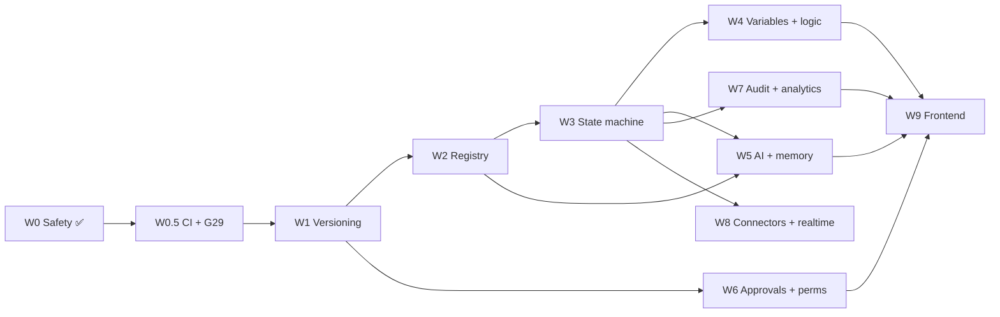

# 23 — Implementation Roadmap (L2)

> **Level:** L2.
> **Extends:** `00-overview-and-canonical-contracts.md` §0.10, which fixes the wave order **W0–W9** and
> its rationale. **This document does not re-argue that order.** It decomposes each wave into
> ticket-level tasks with dependencies, exit criteria and risk.
> Where a task closes a gap, the gap id (`G1`–`G31`, §0.3) is cited.

---

## 1–5. Purpose, scope, dependencies

Turn ten waves into a backlog an engineer can pick from without re-reading 20,000 lines. Every task
names its spec section, so "what does done mean" is never a conversation.

**Status legend:** ✅ done · 🔨 in progress · ⬜ not started · 🔴 P0

---

## 6. Current position

| | |
|---|---|
| **W0** | ✅ **Complete.** G25 closed (shared `toolRequiresApproval` + engine gate), verified by `workflow-tool-approval-gate.e2e-spec.ts` (3 tests) with 51 regression tests green. G18 ⬜ still open — deliberately deferred, it needs a product decision on HR scope. |
| **Everything else** | ⬜ Not started. |

Two defects sit outside the wave structure and block W1:

| | Task | Why blocking |
|---|---|---|
| 🔴 | **G29 — soft delete.** `DELETE /workflows/:id` hard-deletes and cascades every run. Needs `ARCHIVED` on `WorkflowStatus` (migration; mind the pgvector index trap in CLAUDE.md). | W1 introduces versions and W7 retention. Both are pointless while a delete can erase history. |
| 🔴 | **CI pipeline.** None exists. | Doc 24's gates are unenforceable without it; W2/W3 are refactors whose only safety net is the suite. |

---

## 7. Wave decomposition

### W0 — Safety (✅ / ⬜ G18)
| # | Task | Spec | Status |
|---|---|---|---|
| 0.1 | Shared `toolRequiresApproval`; gate the engine | G25 | ✅ |
| 0.2 | Regression suite, both engine modes | 24 §22 | ✅ (legacy mode) |
| 0.3 | G18 guardrail strings + `ROLE_SCOPE.HR` | G18 | ⬜ **needs product decision** |

### W0.5 — Foundations (NEW — not in §0.10, and required by it)
| # | Task | Exit criterion |
|---|---|---|
| 0.5.1 | CI: lint, typecheck, unit, integration, e2e | Merge blocked on red |
| 0.5.2 | Fix the 5 flaky suites (doc 24 §11) | Exception list in CLAUDE.md deleted |
| 0.5.3 | Tenant-isolation table-driven suite | Every id-route covered |
| 0.5.4 | Contract suite vs `@vaep/types` | Every response DTO parsed |
| 0.5.5 | G29 soft delete + migration | Delete preserves run history |

§0.10 assumes a working regression net. It does not exist yet, so it is built here. Skipping this makes
W2 and W3 unverifiable refactors.

### W1 — Versioning
| # | Task | Spec |
|---|---|---|
| 1.1 | `WorkflowVersion` schema + migration | 12 |
| 1.2 | Backfill `definition` → v1 `PUBLISHED` | 01 |
| 1.3 | Draft/publish/activate lifecycle | 01 |
| 1.4 | Pin `workflowVersionId` on every run | 01, 12 |
| 1.5 | `PATCH …/:id` deprecation shim + headers | 13 ledger **R6** |
| 1.6 | Remove `/pause`; `deactivate` is pause | 13 ledger **R3** |

**Exit:** every run records the exact graph it executed; editing an active workflow cannot alter an
in-flight run (**G1**).

### W2 — Node registry
| # | Task | Spec |
|---|---|---|
| 2.1 | `NodeRegistry` + `NodeDefinition` | 02, 17 §6 |
| 2.2 | Port the 8 existing types unchanged | 02 §2.B |
| 2.3 | Generate `GET /workflow-nodes` from the registry | 17 §15 |

**Exit:** existing e2e suites pass with zero behaviour change. This wave is a pure refactor; any test
change is a red flag.

### W3 — Durable state machine 🔴 highest risk
| # | Task | Spec |
|---|---|---|
| 3.1 | Transition matrix + exhaustive unit test | 16 §7 |
| 3.2 | Attempt/lease schema + claim SQL | 16 §6.3 |
| 3.3 | `wf-run-advance` worker + advisory lock | 16 §6.2 |
| 3.4 | `wf-node-attempt` worker + heartbeat | 16 §6.6 |
| 3.5 | Outbox write in T2 + relay | 16 §6.5, §17 |
| 3.6 | Timers (`wf-timer`) | 05 §5.D |
| 3.7 | Reaper, 3 sweeps; delete the old watchdog | 16 §6.7 |
| 3.8 | Retry + DLQ; register 5 queues | 16 §12, ledger **R7** |
| 3.9 | Compensation | 05 §5.D |
| 3.10 | `WORKFLOW_ENGINE_MODE` flag; port the G25 gate | 16 §29 |
| 3.11 | Chaos suite | 24 §25 |

**Exit:** all five chaos experiments pass; e2e green in **both** modes; G25 gate active in the new
engine. Unlocks **G2–G6**.

### W4 — Variables + logic nodes
6.x tasks from doc 06; nodes `SWITCH`, `PARALLEL`, `JOIN`, `LOOP`, `SUB_WORKFLOW`, `TERMINATE`,
`SET_VARIABLE`, `TRANSFORM`, `NOOP` per doc 17 §7 (build order in 17 §29).
**Exit:** `TRANSFORM` has no dynamic evaluation; `SUB_WORKFLOW` depth + cycle capped.

### W5 — AI employees + memory
`MARKETING` role; HR/Marketing employee definitions; `AI_EMPLOYEE_STEP`, `AI_DECISION`, `AI_EXTRACT`,
`AI_CLASSIFY`, `MEMORY_READ/WRITE`, `KNOWLEDGE_WRITE`.
**Exit:** every AI tool call passes the G25 gate; `maxToolCalls` bounded (17 §7.7).

### W6 — Approvals + permissions
Doc 08 routing/SLA/escalation; doc 09 department scoping. **Includes ledger R12** — loosening the
approval guard from `@Roles('OWNER','ADMIN')` to member + `canDecide()`. That is a security-relevant
loosening and needs explicit sign-off, not a silent merge.

### W7 — Audit + analytics
Doc 10 hash-chained audit, cost attribution, retention (route under `/admin`, ledger **R8**);
doc 11 rollups.

### W8 — Connectors + realtime
Doc 04 hardening; doc 13 realtime with the `seq` envelope (**not** `sequence` — doc 14 §14.B.7);
`18` connector-authoring SDK as `04 §4.9`.

### W9 — Frontend
Doc 15 canvas; install `@xyflow/react` v12 and shadcn/ui (neither present today); doc 22 equivalent
lives in the existing design-system doc.

---

## 8. Dependency graph

W6 needs only W1, so it can run in parallel with W3–W5 — useful, since it holds the two
enterprise-sales blockers.

## 9. Risk register

| Risk | Wave | Mitigation |
|---|---|---|
| State machine breaks live automation | W3 | Per-tenant flag; legacy fallback; live tenant migrated last |
| pgvector index dropped by `migrate dev` | any migration | Strip `DROP INDEX …_embedding_idx` before applying (CLAUDE.md) |
| Refactor regression invisible | W2 | Requires W0.5 CI first |
| Approval-guard loosening ships silently | W6 | Explicit sign-off gate (R12) |
| AGPL exposure from wrapped engines | W8 | **G31** — unresolved, see §10 |
| Scope creep into UI early | all | §0.10 puts frontend last, deliberately |

## 10. Unresolved decisions blocking specific waves

| # | Decision | Blocks | Owner |
|---|---|---|---|
| D1 | Does the HR employee own recruitment/CV screening? | W0 (G18) | Product |
| D2 | Approve the R12 guard loosening? | W6 | Security |
| D3 | AGPL posture for wrapped engines (G31) | W8 | Legal |
| D4 | `CANCELLED` vs `CANCELED` spelling — schema already has both | W3 | Eng lead |
| D5 | Is `WAITING` split into timer-wait vs approval-wait? | W3, W9 | Eng lead |

D4 and D5 are cheap now and expensive after W3 ships — both change enum values that runs persist.

## 11. Definition of Done (roadmap level)

- [ ] Every task above has an issue with its spec section linked
- [ ] W0.5 complete before W1 starts
- [ ] D1–D5 resolved before the wave they block
- [ ] Each wave's exit criterion verified by a named test suite

---

**Next:** `25-production-readiness.md`.
