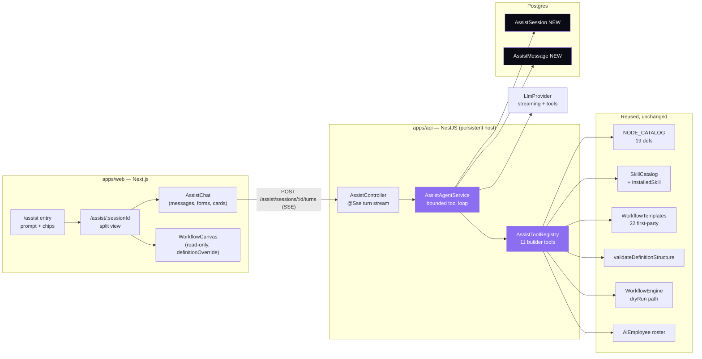

# 30 — Orlixa AI Assist · Conversational Workflow Builder (L2)

> **Level:** L2 — implementation-ready design specification (no code; spec only).
> **Normative parent:** `00-overview-and-canonical-contracts.md` — read first. §0.7 is normative; this document elaborates those names and never redefines them. Anything genuinely new is tagged **NEW** and listed in Appendix E for promotion into `00 §0.7`.
> **Extends:** `29-workflow-builder-frontend-spec` (the manual builder — kept, untouched, and reused as a rendering surface).
> **Depends on:** `02-node-architecture` · `05-execution-engine` · `13-api` · `14-json-contract` · `16-workflow-runtime-spec` · `26-mvp-node-contract-freeze` (frozen 17) · `27-hr-employee-workflows` · `28-marketing-employee-workflows` · plus the shipped `POST /workflows/generate`, Skills catalog, Approval Center and dry-run path.
> **Redefines:** none. Supersedes nothing — the existing generator endpoint stays (§3.1, AD-30-09).
> **Status:** Design proposed, not implemented. **Date:** 2026-08-02.
> **Stack:** NestJS + Prisma + BullMQ + SSE (backend) · Next.js App Router · Tailwind · TanStack Query · Zustand · `@xyflow/react` (frontend). Reuses the shipped dark/violet Orlixa theme.

---

## Revision 2026-08-02a — two corrections, superseding in place

Per the house rule (doc 29's "Backend delta" pattern): later findings supersede earlier text *in place* and say so, rather than being silently rewritten.

**Correction 1 — SSE on Vercel.** §9 and AD-30-04 originally asserted the streaming endpoint "cannot run on the Vercel serverless entry." **That was too absolute and is wrong.** Vercel's Node.js functions do stream responses (it is the exact use case the Vercel AI SDK exists for); the constraint is `maxDuration`, not streaming. **The real Vercel blocker is the execution plane, not the chat** — see the new §31. Risk R-4 is restated there.

**Correction 2 — the assist preview is NOT read-only.** AD-30-05 and §20.2 originally specified `AssistPreview` as `WorkflowCanvas` with `editable={false}`. **Superseded by AD-30-10 (§4) and the parity contract in §32:** the AI-built canvas must be the *same fully-editable canvas* as the manual builder — same nodes, same movement, same CRUD, pixel-identical. A read-only preview would create exactly the two-tier experience this product must not have.

---

## 1. Purpose and scope

**In one line:** a chat-first way to build a workflow — you describe the job in plain words, Orlixa asks a few sharp questions, builds the graph in front of you, test-runs it safely, and tells you exactly what still needs a human.

This document specifies **Orlixa AI Assist**: a new top-level product surface (`/assist`, new sidebar entry) that sits *beside* the existing manual Workflow Builder. It is the Orlixa answer to n8n's "AI Assistant" — same interaction shape, different substance, because Orlixa's unit of work is an **AI Employee with skills and approvals**, not a node that calls an API.

**In scope**
- The conversational agent: its loop, its tool set, its budget, its grounding.
- Server-side session persistence for assist conversations.
- A streaming transport and its wire protocol.
- Structured clarifying questions (forms, not free-text ping-pong).
- Inline skill/credential connection from inside the chat.
- Build → **safe test** → read the result → **fix** loop.
- Editing an *existing* workflow by conversation, and "Fix this failed run with AI".
- Everything the frontend needs, down to the component tree and state.
- Every package and resource required (§25).

**Out of scope** (and why)
- Replacing the manual builder. Doc 29's builder is the destination the assist hands off to; both remain.
- Executing real side effects during a build. The assist tests in dry-run only (§13, AD-30-06).
- New node types. The agent authors only the **frozen 17** (`26-mvp-node-contract-freeze`, §15).
- General chat. This is a workflow-building agent, not the AI Employee chat runtime (that is doc 03).
- Voice input. n8n shows a mic; we defer (§28).

---

## 2. What we copy from n8n, and what we deliberately do differently

The reference behaviour (observed 2026-08-02 on `app.n8n.cloud/assistant`) and our position on each:

| n8n behaviour | Orlixa position | Why |
|---|---|---|
| Big "What do you want to automate?" prompt + suggestion chips | **Copy.** Chips seeded from our own 22 first-party templates (doc 19) and the tenant's hired employees. | Blank-page problem is real. Our chips can be *grounded* in what the tenant actually owns, which n8n cannot do. |
| Clarifying questions rendered as **structured forms** (single-select, multi-select, "Something else", Skip, `1 of 2`) | **Copy, and make it the primary channel.** §11. | Free-text ping-pong is where the current `/workflows/generate` chat fails. A form is faster to answer and gives the model clean, typed input. |
| Collapsible "Finished thinking" / "Waiting for your input" reasoning blocks | **Copy** (collapsed by default). | Trust. Users need to see the agent reasoned, without being drowned in it. |
| Split view: chat left, live canvas right, graph builds as it goes | **Copy** — and reuse the *real* builder canvas read-only (`WorkflowCanvas` with `definitionOverride`, doc 29 §3.B). | Zero duplicate canvas code, and what you preview is exactly what you'll edit. |
| Inline credential setup card ("Set up Slack" → modal → Apply / Skip for now) | **Copy**, wired to our shipped `POST /skills/:key/connect` + data-driven `configSchema`. §12. | The connection gap is the #1 reason a generated workflow is dead on arrival. |
| Agent runs the workflow itself and reports node-by-node, flagging *simulated* sends | **Copy — this is the single highest-value behaviour.** We already have a real dry-run path (§13). | An untested draft is a guess. n8n had to bolt "pinning" on; our engine already short-circuits `TOOL_ACTION` and memory writes under `dryRun`. |
| "Execution failed in X node" → **Fix with AI** | **Copy.** §13.4. | Closes the loop. Also the natural entry point from the existing Runs UI. |
| Publishes to a live public Form URL | **Adapt.** Our trigger vocabulary is `MANUAL / SCHEDULE / WEBHOOK / EVENT` (doc 01). A public form is a *webhook* plus a hosted form — see §28 (deferred). | We should not invent a trigger type to match a competitor. |
| The assistant can add credentials with real secrets typed into chat | **Reject.** Secrets are entered only in the existing credential modal, never in the transcript; the transcript is persisted and the model sees it. §17.4. | Persisted transcript + LLM context = the worst possible place for an API token. |
| Agent silently invents nodes/tools when unsure | **Reject.** Everything the agent references must resolve against the tenant's real catalog, or it becomes an explicit unresolved item. §16.3. | Doc 29's house rule: *degrade honestly*. A fake `slack` node the tenant never connected is a lie the user discovers in production. |

**The differentiator to protect:** n8n assembles *integrations*. Orlixa assembles a **team** — the signature `AI_EMPLOYEE_STEP` card renders as a person, and the assist should talk that way ("Emma will screen the CV, then Priya approves"), not like a pipeline compiler. Doc 29's thesis applies verbatim to this surface.

---

## 3. Current state — verified

### 3.1 What exists today (read from source 2026-08-02)

| Thing | Where | Status |
|---|---|---|
| `POST /workflows/generate` — chat → `{type:'question'}` \| `{type:'draft'}` | `workflows.controller.ts:129`, `engine/workflow-generator.service.ts` | **EXISTING (KEEP)** — stays for back-compat, superseded in the UI by assist. |
| 3-user-turn hard cap, then a forced 2-node skeleton | `workflow-generator.service.ts:120-131`, `workflows.constants.ts` `GENERATION_MAX_QUESTION_ROUNDS = 3` | EXISTING. Derived from payload length — a client can defeat it by trimming history. |
| 1 attempt + 1 self-correction | `GENERATION_MAX_ATTEMPTS = 2` | EXISTING. |
| Grounding = installed skill keys + tool *names* + employee `{id,name,role}` | `workflow-generator.service.ts` | EXISTING. No tool parameter schemas, no node catalog, no templates. |
| `GenerateWorkflowChat` inline panel on `/workflows` | `features/workflows/components/GenerateWorkflowChat.tsx` | EXISTING. Local `useState` only; thread lost on close. Auto-creates the workflow with no review step. |
| `LlmProvider.complete(input, tools?)` — one method | `modules/employees/llm/llm.provider.ts` | **EXTEND** (§19). No streaming, no JSON mode, no `maxTokens`, no abort. |
| Tool results fed back as a plain assistant message prefixed `[[VAEP:TOOL_RESULT]]` | `agent-runtime.service.ts`, both real providers | EXISTING limitation, documented in both provider headers. |
| `AgentRuntimeService` — plan→retrieve→memory→act(≤3 tools)→validate | `employees/runtime/agent-runtime.service.ts` | EXISTING. The precedent for a bounded tool loop; **not** reused directly (§4 AD-30-02). |
| `NODE_CATALOG` + `GET /workflows/node-definitions` — 19 types with `configSchema` | `workflows/engine/nodes/node-catalog.ts` | EXISTING. **The generator never reads it** — the assist must. |
| `validateDefinitionStructure()` — every write path's gate | `workflows/engine/definition-validator.ts` | EXISTING (KEEP). Reused unchanged (§16.1). |
| Dry-run: `TOOL_ACTION` and `MEMORY_WRITE` short-circuit when `run.dryRun` | `tool-action.handler.ts:108`, `memory.handlers.ts:125`, `workflow-engine.service.ts:804` | EXISTING (KEEP). **This is what makes the agent's self-test safe.** |
| Skill connection: `configSchema`, `POST /skills/:key/connect`, `credentialsSet` masking | `modules/skills/*` | EXISTING (KEEP). Reused for the inline card (§12). |
| Plan gate `@RequirePlan('BUSINESS','ENTERPRISE')` | `billing/plan.guard.ts` — the codebase's only usage | EXISTING (KEEP). Assist inherits it (§18). |
| Per-run/step audit, `UsageService.record` metering | `modules/usage`, `modules/audit` | EXISTING (KEEP). Assist records under a new source (§23). |

### 3.2 New verified gaps — proposed for `00 §0.3.2`

These are real defects found while writing this spec. Each needs a row added to the gap ledger in doc 00; **do not cite these ids until they are registered there.**

| Proposed id | Gap (verified) | Evidence | Closed in |
|---|---|---|---|
| **G32** 🔴 | The AI generator authors **banned node types**. Its system prompt lists only `TRIGGER, RETRIEVE, AI_STEP, TOOL_ACTION, WAIT, CONDITION, NOTIFY, APPROVAL` — of which `AI_STEP` and `NOTIFY` are outside the frozen 17 (`26`, and `27 §0.4`: "`NOTIFY` is not a real message. It is a logger."). Its own fallback skeleton emits a `NOTIFY` node. So the one feature that writes graphs *for* users writes them in the deprecated dialect, while templates and the builder use the new one. | `workflow-generator.service.ts` `buildSystemPrompt()`; `fallbackDraftResult()`; contrast `26 §3` | This doc §15 |
| **G33** | Generator ignores the shipped node catalog. `NODE_CATALOG` carries `label`, `description`, `configSchema` (with `required`, `templatable`, semantic types) and handle topology for all 19 types, served at `GET /workflows/node-definitions` — the generator reads none of it, so it cannot know a node's required config fields. | `node-catalog.ts` vs `workflow-generator.service.ts` grounding block | §6.4 |
| **G34** | Generator is given tool **names only**, never `ToolParametersDto`. It therefore guesses `TOOL_ACTION.args` shapes; nothing validates them at save time either. | `GroundingSkill { skillKey, tools: string[] }`; no `args` check in `checkDraft` | §6.4, §16.3 |
| **G35** | `parseResponse` does a strict `JSON.parse` on the whole completion — no markdown-fence tolerance. A real model replying with a ```` ```json ```` block fails and burns the single retry. | `workflow-generator.service.ts` `parseResponse` | §19.3 |
| **G36** | Authorization mismatch: `POST /workflows/generate` has **no** `@Roles`, but `POST /workflows` (create) is `@Roles('OWNER','ADMIN')`. A MEMBER can generate a draft and then fail to save it. | `workflows.controller.ts` class + method decorators | §18.2 |
| **G37** | Grounding includes **paused/disabled** AI Employees — `aiEmployee.findMany` is not filtered by `status:'ACTIVE'`, so the model can wire a workflow to an employee that cannot run. | `workflow-generator.service.ts` grounding query | §6.4 |
| **G38** | `GenerateWorkflowResultDto` has no zod schema in `response-schemas.ts`, so it is the one workflow contract with no runtime response validation on either side. | `packages/types/src/response-schemas.ts` | §16.4 |
| **G39** | `@anthropic-ai/sdk` is `await import(...)`-ed by `AnthropicLlmProvider` but is **not a dependency in `apps/api/package.json`**. Setting `LLM_PROVIDER=anthropic` fails at first call, not at boot. | `anthropic-llm.provider.ts` vs `apps/api/package.json` | §25.1 |

---

## 4. Architecture decisions

Format per doc 00 §0.4. These are decisions for *this* document; genuine system-wide ADRs belong in doc 00.

### AD-30-01 — A tool-calling agent, not a bigger single-shot prompt

**Decision.** The assist is an agent loop: the model is given a set of **builder tools** (§6.2) and calls them one at a time against a server-held draft graph, until it either asks the user something or finishes.

**Alternatives considered.**
- *Extend the existing single-shot JSON generator with a longer prompt.* **Rejected because** it structurally cannot do the four things that make this feature worth building: read the catalog on demand, mutate an existing graph, run a test, and react to the result. It would also keep the 3-turn cliff.
- *Reuse `AgentRuntimeService` wholesale.* **Rejected because** it is welded to `AiEmployee` + `Conversation` + knowledge retrieval + role-scope guardrails + validation/citations. A builder has no employee, no role scope, and needs graph tools rather than skill tools. See AD-30-02.

**Consequences.** We need native multi-turn tool threading in the LLM layer (§19) — the current text-marker hack (`[[VAEP:TOOL_RESULT]]`) is workable but lossy and should be upgraded. We inherit an iteration budget problem, solved in §6.3.

### AD-30-02 — A separate `AssistAgentService`, not an extension of `AgentRuntimeService`

**Decision.** New service in a new module `modules/assist`, depending only on Prisma, the LLM provider, `SkillCatalog`/`SkillsService`, `NODE_CATALOG`, `WorkflowsService` and `WorkflowTemplatesService`.

**Alternatives considered.** *Add a `'build'` task to `LlmRouterService.forTask()` and branch inside the employees runtime.* **Rejected because** it would import `WorkflowsService` into `EmployeesModule`, and `Approvals → Workflows → Employees → Approvals` is exactly the cycle the codebase already dodges by having `WorkflowsModule` import `LlmModule` directly. Keeping assist a leaf module preserves that.

**Consequence.** `LlmRouterService.forTask` gains `'build'` for symmetry (cheap, optional), but assist injects `LLM_PROVIDER_TOKEN` directly like the generator does.

### AD-30-03 — Server-side sessions in two new tables

**Decision.** **NEW** `AssistSession` + `AssistMessage` (§7).

**Alternatives considered.**
- *Stay stateless like `/workflows/generate`.* **Rejected because** streaming, a multi-step build, a test run and a resumable "come back tomorrow" thread all need server state. Also, resending an ever-growing transcript is how the current 3-turn cap becomes both defeatable and unbounded.
- *Reuse `Conversation`/`Message`.* **Rejected because** both require a real `employeeId` FK; repurposing them needs a migration that makes the column nullable, which would weaken a constraint the employee runtime relies on.

### AD-30-04 — SSE over `fetch` + `ReadableStream`, not WebSockets and not `EventSource`

**Decision.** One streaming endpoint, `POST /assist/sessions/:id/turns` responding `text/event-stream`, consumed on the client with `fetch()` + a `ReadableStream` reader.

**Alternatives considered.**
- *WebSocket gateway.* **Rejected for now because** doc 29 already records P5-01 (realtime WS) as deferred and coupled to the state-machine cutover; the blocker there is "exposing the worker host publicly (TLS+CORS)". Assist needs one-way server→client tokens, which SSE covers, so it must not be held hostage to that decision.
- *Native `EventSource`.* **Rejected because** it cannot set an `Authorization` header, which would force the access token into a query string — and putting credentials in URLs is prohibited (they land in logs and history). `fetch` + reader keeps the Bearer header and additionally allows a `POST` body.
- *1s polling like the run watcher.* **Rejected because** a build turn is 10–60s of visible reasoning; polling would make it feel dead.

**Consequences.** ⚠️ **This endpoint must run on the persistent Nest host, not the Vercel serverless entry.** The web/api split (`QUEUE_WORKERS_ENABLED` pattern) already distinguishes them; assist streaming needs the same treatment — see §26 and Risk R-4.

### AD-30-05 — The draft graph lives server-side and is never auto-saved as a `Workflow`

**Decision.** The in-progress graph is a column on `AssistSession` (`draftDefinition Json`). A real `Workflow` row is created **only** when the user presses *Create workflow* (or when the session is editing an existing workflow, in which case nothing is written until *Apply changes*).

**Alternative considered.** *Auto-create like today's `GenerateWorkflowChat` does.* **Rejected because** it litters `/workflows` with abandoned "AI-drafted workflow" rows, and it denies the user a review step. It also makes "Start over" destructive.

### AD-30-06 — The agent may only test in dry-run

**Decision.** `dry_run_test` (§6.2) always calls the run path with `dryRun: true`. The agent has no tool that can start a real run.

**Why.** Under `dryRun` the engine short-circuits `TOOL_ACTION` and `MEMORY_WRITE` — verified at `tool-action.handler.ts:108` and `memory.handlers.ts:125` — so building a workflow can never send a real email, post to a real channel, move money, or write memory. n8n reaches the same outcome by "pinning" send operations; we get it from the engine.

**Consequence.** The UI must state plainly which steps were simulated. Copy: *"Tested end to end. The Slack post was simulated — nothing was actually sent."*

### AD-30-07 — Structured questions are the default, prose questions the exception

**Decision.** The agent asks via an `ask_user` tool returning a typed form spec (§11). Free-text is one field type inside that spec, not a separate mode.

**Why.** It removes the parsing problem entirely (answers come back typed and validated), it lets us show `1 of 2` progress and a *Skip*, and it caps the conversation length far more reliably than a turn counter.

### AD-30-08 — Node vocabulary is the frozen 17, enforced in three places

**Decision.** Prompt (the catalog we hand the model), tool-arg validation (`add_node` rejects a non-frozen type), and the existing `validateDefinitionStructure` at save. Closes **G32**.

### AD-30-10 — One canvas, one node system, one set of CRUD operations 🔒

**Decision.** There is exactly **one** canvas implementation, **one** node card, **one** interaction model and **one** set of node CRUD operations in the product. A workflow built by the AI and a workflow built by hand are the *same object rendered by the same component*, and are indistinguishable to the user once created. **Supersedes AD-30-05's read-only preview.**

Concretely, inside `AssistPreview` the user can — with no "open in builder" step:
- **Drag a node** the AI placed and drop it somewhere else (positions persist, as they already do).
- **Add, rename, duplicate, disable and delete** nodes.
- **Draw, re-route and delete edges**, under the same `connectionRules` validation.
- **Open the Inspector** and edit any node's config.
- Use the same right-click menu, the same hover toolbar, the same keyboard shortcuts.

**Alternatives considered.**
- *Read-only preview, then "Open in builder" to edit* (the original AD-30-05). **Rejected because** it makes AI-built workflows second-class: the user watches something get built and then has to leave to touch it. It also doubles the surface (a preview card set and a real card set) that must be kept visually in sync forever — which is precisely how pixel drift starts.
- *A separate simplified "AI canvas".* **Rejected for the same reason, more strongly.** Two canvases = two bug surfaces, two a11y implementations, two sets of context menus.

**Consequences.**
1. `WorkflowCanvas`'s current line — `const editable = editableProp && !definitionOverride && !watchMode` ([WorkflowCanvas.tsx:103](../../../apps/web/src/features/workflows/components/builder/canvas/WorkflowCanvas.tsx)) — **must change**: `definitionOverride` can no longer force read-only. Version-preview and run-watch stay read-only (they genuinely are), but "rendering a definition I was handed" must become an editable mode. See §32.3 for the concurrency rule that makes this safe.
2. Every canvas/node gap in §32.2 is now **required for the assist to ship**, not deferred polish. Several were listed as deferred in doc 29 (`⌘K` palette, marquee multi-select, tidy-up, undo/redo) — this decision **promotes them to required** and doc 29's deferral list should be annotated accordingly.
3. Any future canvas feature lands once, in the shared component, and appears in both places automatically. That is the point.

### AD-30-09 — The existing generator endpoint and the manual builder both stay

**Decision.** `POST /workflows/generate` is **not** deleted. It keeps its contract and tests. The `/workflows` page keeps its "Generate with AI" panel until assist is GA, then that button links to `/assist` and the inline panel is removed in a separate change.

**Why.** The user's explicit requirement is that the current flow keeps working. Also, an endpoint with 4 passing e2e tests and a stable contract is cheap to keep and useful as a fallback if assist is unavailable.

---

## 5. Container view



**Reading it:** everything in "Reused" already ships. The genuinely new code is one module (`modules/assist`), one frontend feature (`features/assist`), two tables, and a streaming extension to the LLM layer.

---

## 6. The Assist Agent

### 6.1 The loop

One **turn** = one user input (a message, a form submission, or a system-generated event like "the test finished") → zero or more tool calls → one final assistant message.

```
turn(sessionId, userInput):
  1. load session + last N messages + draftDefinition
  2. assertUnderBudget(session)                  # §6.3
  3. build system prompt (§6.4) + tool schemas (§6.2)
  4. loop i = 1 .. MAX_ASSIST_ITERATIONS (default 12):
       a. emit  event: thinking
       b. result = llm.completeStream({system, messages, tools})
       c. stream text deltas -> event: token
       d. if result.toolCall:
            - validate args against the tool's zod schema      -> on fail: feed error back, continue
            - execute tool (tenant-scoped)                     -> may mutate session.draftDefinition
            - emit event: tool  {name, summary, ok}
            - if tool is terminal (ask_user | request_connection | finish):
                 break                                          # control returns to the user
            - append native tool_result to messages; continue
          else:
            - answer = result.content; break
  5. persist assistant AssistMessage (+ tool trace metadata)
  6. persist draftDefinition if changed; bump draftVersion
  7. emit event: graph (if changed), then event: done
```

**Why a per-turn iteration cap and not a per-session one:** the session is meant to be long (build, test, fix, refine). The thing that must be bounded is a single runaway turn.

### 6.2 The builder tool set

Eleven tools. Each has a zod schema (server-side) projected into `ToolDefinitionDto` (`00 §0.7`, shallow one-level JSON-schema — no nesting, so complex args are passed as a `json`-typed string field and parsed server-side).

**Read tools** — cheap, no side effects, callable freely:

| Tool | Args | Returns | Notes |
|---|---|---|---|
| `list_node_types` | `{ category? }` | The frozen-17 subset of `NODE_CATALOG`: `type, label, description, inputs, outputs, configSchema` | Closes **G33**. Filtered to the frozen 17 (**G32**). |
| `list_skills` | `{ query? }` | Installed skills for this company: `skillKey, name, connectionStatus`, and per tool `{name, description, parameters}` | **Full `ToolParametersDto`**, not just names — closes **G34**. |
| `list_employees` | `{ role? }` | `id, name, role, status` for **ACTIVE** employees only | Closes **G37**. |
| `list_templates` | `{ query? }` | First-party + tenant templates: `key, name, category, description, requires` | Lets the agent say "we already have a template for this" instead of rebuilding it. |
| `inspect_graph` | `{}` | Current `draftDefinition` + validation issues + unresolved list | The agent's "look at what I've built". |

**Write tools** — mutate `session.draftDefinition`; every mutation is re-validated (§16.1):

| Tool | Args | Behaviour |
|---|---|---|
| `propose_graph` | `{ definition: json, rationale }` | Replace the whole draft. Used for the first build. Rejected if > `MAX_WORKFLOW_NODES` (50). |
| `patch_graph` | `{ ops: json }` | Ordered ops: `addNode`, `removeNode`, `updateNodeConfig`, `renameNode`, `addEdge`, `removeEdge`. Used for edits and fixes. Applied atomically — any op failing rolls the whole patch back. |

**Interaction tools** — terminal; they end the turn and hand control to the user:

| Tool | Args | Behaviour |
|---|---|---|
| `ask_user` | `{ form: json }` | Emits a structured question form (§11). |
| `request_connection` | `{ skillKey, reason }` | Emits a connection card (§12). |
| `dry_run_test` | `{ sampleTrigger?: json }` | Saves a **temporary** workflow, runs it with `dryRun:true`, polls to a terminal state, returns per-step status/output/error, then deletes the temp workflow. §13. |
| `finish` | `{ summary, unresolved: json }` | Ends the build; the UI reveals *Create workflow*. |

**Why `propose_graph` *and* `patch_graph`:** models are reliably good at emitting a small complete graph and reliably bad at long mutation sequences — so creation uses whole-graph. But editing an existing 20-node workflow by re-emitting it invites silent drops, so edits use patches. This split is the single most important robustness choice in the tool set.

**Tools the agent deliberately does NOT get:** create/update/delete a real `Workflow`; activate or publish; start a non-dry run; read another tenant's anything; read secret values; approve an `ApprovalRequest`; call a skill tool directly. Rationale in §17.

### 6.3 Budgets and caps

| Constant | Default | Enforced where |
|---|---|---|
| `MAX_ASSIST_ITERATIONS` | 12 tool calls per turn | Loop counter; on exhaustion the agent is forced to produce a text answer with tools disabled (mirrors the safety net in `agent-runtime.service.ts`). |
| `MAX_ASSIST_TURNS` | 60 per session | Rejected with a clear "start a new session" message. |
| `ASSIST_SESSION_TOKEN_BUDGET` | 400k tokens per session | Checked before each completion via `UsageService`; over budget → graceful stop, session marked `EXHAUSTED`. |
| `ASSIST_CONTEXT_MESSAGES` | last 30 messages + a rolling summary | Prevents unbounded prompt growth (the current generator's flaw). |
| Rate limit | 20 turns / 5 min / company | `@Throttle`, tighter than app default because each turn is many completions. |
| `MAX_WORKFLOW_NODES` | 50 (existing) | `definition-validator.ts`, unchanged. |

**No 3-turn cliff.** The current generator's forced-skeleton behaviour is dropped: with structured questions the agent converges in 1–2 questions, and if it doesn't, the honest answer is to keep asking, not to emit a useless 2-node stub.

### 6.4 Grounding — what goes in the system prompt

Static, every turn (kept small; the big catalogs come through *tools*, on demand):

1. **Role + house style.** "You build workflows for Orlixa, a platform where AI Employees do jobs. Talk about people and jobs, not nodes and integrations."
2. **The frozen-17 vocabulary**, with the two bans stated explicitly: *never* `AI_STEP` (use `AI_EMPLOYEE_STEP`), *never* `NOTIFY` (use `TOOL_ACTION` with a real skill — `NOTIFY` only writes a log line). Closes **G32**.
3. **Company shape:** industry, size, departments, count of employees/skills/workflows. Small, orienting.
4. **Hard rules:** only reference skills/tools/employees returned by a tool call; every `TOOL_ACTION` needs a real `skillKey`+`tool` pair; exactly one `TRIGGER`, it is the root; `CONDITION` needs both `branch:'true'` and `branch:'false'` edges; an `APPROVAL` may never sit inside a `LOOP`; never put a secret in node config.
5. **Approval doctrine** (from doc 27's T0–T3 tiering): anything that spends money, contacts a candidate/customer externally, or publishes publicly gets an `APPROVAL` before it. State this as a default the user can override.
6. **Rolling summary** of the conversation so far, once past `ASSIST_CONTEXT_MESSAGES`.

Deliberately **not** in the static prompt: the node catalog, the skill catalog, templates. Those arrive via `list_*` tools so the prompt stays small and the model's choices are traceable to a tool call we can log.

---

## 7. Session and persistence model

Two **NEW** Prisma models. Naming and conventions follow `12-database.md`; satellites carry a plain indexed `companyId` per `12 §5.7`.

```prisma
/// NEW — one Orlixa AI Assist conversation.
model AssistSession {
  id            String   @id @default(cuid())
  companyId     String
  userId        String            // who started it; assist sessions are private to their author
  title         String            // first user message, trimmed — shown in the session list
  status        AssistSessionStatus @default(ACTIVE)

  /// The in-progress graph. NOT a Workflow until the user accepts (AD-30-05).
  draftDefinition Json?
  draftVersion    Int      @default(0)   // bumped on every mutation; powers optimistic UI + conflict detection

  /// Set when this session EDITS an existing workflow rather than creating one.
  targetWorkflowId String?
  /// Set once the user accepts and a Workflow is created from the draft.
  createdWorkflowId String?

  /// Seeded when entered via "Fix with AI" from a failed run.
  originRunId   String?

  promptTokens     Int @default(0)
  completionTokens Int @default(0)

  messages   AssistMessage[]
  createdAt  DateTime @default(now())
  updatedAt  DateTime @updatedAt

  @@index([companyId, userId, updatedAt])
  @@index([companyId, status])
}

enum AssistSessionStatus { ACTIVE  COMPLETED  EXHAUSTED  ARCHIVED }

/// NEW — one turn in an assist session.
model AssistMessage {
  id         String   @id @default(cuid())
  sessionId  String
  session    AssistSession @relation(fields: [sessionId], references: [id], onDelete: Cascade)
  companyId  String

  role       AssistMessageRole
  content    String   @db.Text

  /// Role-specific payload:
  ///  ASSISTANT -> { toolTrace: [{name, argsSummary, ok, ms}], graphVersion, unresolved[] }
  ///  QUESTION  -> the AssistQuestionForm (§11)
  ///  ANSWER    -> the submitted answers keyed by field id
  ///  CONNECTION-> { skillKey, reason, resolved }
  ///  TEST      -> the AssistTestResult (§13.2)
  metadata   Json?

  createdAt  DateTime @default(now())

  @@index([sessionId, createdAt])
  @@index([companyId])
}

enum AssistMessageRole { USER  ASSISTANT  QUESTION  ANSWER  CONNECTION  TEST  SYSTEM }
```

**Notes.**
- `onDelete: Cascade` on messages only. Deleting a session must never touch `createdWorkflowId` — the workflow outlives the conversation that produced it.
- Sessions are **per-user private**, not per-company shared. Rationale: a half-built draft is working material, and the transcript may contain business context the author would not broadcast. A "share session" feature is deferred (§28).
- No secret ever lands in `AssistMessage.content` — enforced in §17.4.
- Retention: sessions older than 90 days with `status != ACTIVE` are pruned by a daily sweep, reusing the `HrRetentionService` pattern (repeatable BullMQ job, worker-gated).

---

## 8. API surface

All routes `@UseGuards(JwtAuthGuard, RolesGuard, PlanGuard)` + `@RequirePlan('BUSINESS','ENTERPRISE')`. All are **NEW**. None conflicts with an existing route, so **no `R14` ledger row is required** in `13-api.md` — but if any of these paths is later changed, that change does need one.

| Method + path | Body / query | Returns | Notes |
|---|---|---|---|
| `POST /assist/sessions` | `{ prompt?, targetWorkflowId?, originRunId? }` | `AssistSessionDto` | Creates a session. If `prompt` is given, the first turn is queued but **not** run — the client immediately opens the stream. |
| `GET /assist/sessions` | `?status=&limit=&cursor=` | `AssistSessionSummaryDto[]` | The author's own sessions, newest first. |
| `GET /assist/sessions/:id` | — | `AssistSessionDto` + messages | Full replay for a resumed thread. |
| `POST /assist/sessions/:id/turns` | `{ kind:'message', text }` \| `{ kind:'answer', questionMessageId, answers }` \| `{ kind:'connection-resolved', skillKey }` \| `{ kind:'retry' }` | **`text/event-stream`** | The one streaming endpoint. §9–10. |
| `POST /assist/sessions/:id/cancel` | — | `204` | Aborts the in-flight turn (§9.3). |
| `POST /assist/sessions/:id/accept` | `{ name, description? }` | `WorkflowDto` | Creates the real workflow from `draftDefinition` (or applies the patch to `targetWorkflowId`). **`@Roles('OWNER','ADMIN')`** — matches `POST /workflows`, and avoids repeating **G36**. |
| `DELETE /assist/sessions/:id` | — | `204` | Author or admin. Never deletes `createdWorkflowId`. |
| `GET /assist/suggestions` | — | `AssistSuggestionDto[]` | Entry-screen chips, grounded in the tenant's templates + employees (§20.4). |

**Deliberately absent:** any route that lets a client write `draftDefinition` directly. The draft is the agent's, mutated only through tools; the human edits it after accepting, in the real builder.

---

## 9. Streaming transport

### 9.1 Server

NestJS supports SSE natively via `@Sse()` returning an `Observable<MessageEvent>` — `rxjs ^7.8.1` is already a dependency, so **no new package**. Because we need a request body (the turn payload), the handler is a `@Post()` that writes to the raw `Response` with `Content-Type: text/event-stream`, rather than `@Sse()` (which is GET-shaped). Both are first-class Nest; the manual form is required here.

Required headers: `Content-Type: text/event-stream`, `Cache-Control: no-cache, no-transform`, `Connection: keep-alive`, and `X-Accel-Buffering: no` (defeats nginx buffering, which otherwise holds the whole stream to the end).

**Heartbeat:** a `: ping` comment every 15s keeps intermediaries from closing an idle stream while the model thinks.

### 9.2 Client

`fetch(url, {method:'POST', headers:{Authorization}, body, signal})` → `res.body.getReader()` → `TextDecoderStream` → split on `\n\n` → parse each `event:`/`data:` frame. **Not `EventSource`** (AD-30-04): it is GET-only and cannot carry the Bearer header.

Reconnect: on a dropped stream mid-turn the client calls `GET /assist/sessions/:id` and replays from persisted messages. **We do not attempt to resume a partial stream** — turns are short and the assistant message is only persisted once complete, so a drop means "re-ask", not "corrupt state".

### 9.3 Cancellation

`AbortController` on the client aborts the fetch; the server detects `req.on('close')` and sets an abort flag the agent loop checks between iterations. Any in-flight LLM call is abandoned (see §19.2 — the provider needs to accept an `AbortSignal`, which it currently does not). A cancelled turn persists nothing except a `SYSTEM` message recording the cancel.

---

## 10. Event protocol

Every frame is `event: <name>` + `data: <json>`. **NEW** contract; belongs in `packages/types`.

| Event | Payload | UI effect |
|---|---|---|
| `thinking` | `{ label }` e.g. `"Looking at your connected skills"` | The collapsible "thinking" row. |
| `token` | `{ text }` | Appended to the streaming assistant bubble. |
| `tool` | `{ name, summary, ok, ms }` | A one-line trace row inside the thinking block. `summary` is human copy from the server (`"Read 11 installed skills"`), never raw args. |
| `graph` | `{ definition, version, unresolved[] }` | The canvas re-renders. Sent after any mutation. |
| `question` | `{ messageId, form }` (§11) | Renders the question form; input box disabled until answered or skipped. |
| `connection` | `{ messageId, skillKey, skillName, reason }` (§12) | Renders the connection card. |
| `test` | `{ result }` (§13.2) | Renders the test-result panel. |
| `error` | `{ code, message, retryable }` | Inline error with a Retry when retryable. |
| `done` | `{ messageId, status }` | Stream closes; re-enable input. |

**Ordering guarantee:** `graph` always precedes the `done` of the turn that changed it, so the canvas is never behind the text describing it.

---

## 11. Structured questions

The `ask_user` tool returns an `AssistQuestionForm` (**NEW**):

```ts
/** NEW — one clarifying question step the assist renders as a form. */
export interface AssistQuestionField {
  id: string;
  label: string;
  type: 'single-select' | 'multi-select' | 'text' | 'employee' | 'skill';
  options?: { value: string; label: string; hint?: string }[];
  /** Adds the n8n-style free-text escape hatch to a select. */
  allowOther?: boolean;
  required?: boolean;
  placeholder?: string;
}

/** NEW — a paged form; n8n shows "1 of 2" and a Skip. */
export interface AssistQuestionForm {
  fields: AssistQuestionField[];   // one field per page
  skippable: boolean;              // default true
}
```

**Rules.**
- Max **4** fields per form, max **2** forms per session before the agent must build something. If it still doesn't know, it builds its best guess and lists the assumptions as unresolved — never a dead end.
- `employee` and `skill` field types render the **real pickers** already built for the Inspector (doc 29 §3.E.7), so the answer is a real id, not a name the agent has to re-resolve.
- **Skip** submits `{}` and the agent must proceed on assumptions, stating them.
- The answer is persisted as an `ANSWER` message and fed back to the model as a `tool_result` for the `ask_user` call — so the model sees typed values, not prose.

---

## 12. Inline connection setup

When the agent needs a skill the tenant has not connected, it calls `request_connection`, which renders a card:

```
🔌  Connect Slack
    Emma needs this to post the announcement.
    [ Slack API  ▾  No credentials yet ]   [ Set up credential ]
                              [ Skip for now ]  [ Apply ]
```

**Wiring — all existing endpoints, nothing new:**
- The dropdown lists this company's `InstalledSkill` rows for that `skillKey` (per-employee and company-wide, per the shipped per-employee-connections feature).
- *Set up credential* opens the **existing** data-driven config modal (`configSchema` from `SkillCatalog`, `POST /skills/:key/connect`). Secrets go straight to that endpoint and are encrypted at rest by `CryptoService`; the modal is outside the chat transcript.
- *Apply* posts `{kind:'connection-resolved', skillKey}` as the next turn; the agent re-reads `list_skills` and continues.
- *Skip for now* also continues, but the affected node is marked **unresolved** and the final summary says so — exactly the n8n behaviour, and consistent with doc 29's "degrade honestly".

**Hard rule (§17.4):** the assist never asks for a token *in the chat box*, and the server rejects a turn whose text matches the existing `looksLikeSecretKey` heuristics, replying with a card instead.

---

## 13. Build → Test → Fix

This is the loop that makes the feature credible.

### 13.1 How the test runs

`dry_run_test` does, server-side and atomically:
1. Validate the draft (`validateDefinitionStructure`). Invalid → return the issues, no run.
2. Create a **temporary** `Workflow` — `status: DRAFT`, `name: "[assist test] <session title>"`, flagged so it is excluded from `GET /workflows` (a `isAssistScratch Boolean @default(false)` column, **EXTEND** on `Workflow`).
3. `createRun(..., dryRun: true)`. Sample trigger payload from the agent, or synthesised from the trigger config.
4. Poll to a terminal state, cap **60s**.
5. Read `WorkflowRun.steps`.
6. Delete the temp workflow (and cascade its run) in a `finally`.

**Why a temp workflow and not a virtual run:** the engine executes from a persisted `Workflow`+`WorkflowRun`; inventing an in-memory execution path would fork engine behaviour and the test would stop being a real test. The cost is one create+delete per test — acceptable, and the scratch flag keeps it invisible.

⚠️ **Open decision (D-30-1, §Appendix C):** an `APPROVAL` node makes the run go `WAITING`, not `COMPLETED`. Proposal: the test reports `WAITING` as a **success with a note** — "the run correctly paused for Priya's approval" — and does not auto-approve. Auto-approving inside a test would train users to ignore the gate.

### 13.2 What comes back

```ts
/** NEW — outcome of an assist dry-run test. */
export interface AssistTestResult {
  runId: string;
  status: 'COMPLETED' | 'WAITING' | 'FAILED' | 'TIMED_OUT';
  steps: {
    nodeId: string;
    name: string;
    status: 'COMPLETED' | 'FAILED' | 'SKIPPED' | 'RUNNING';
    ms: number;
    /** True when the engine short-circuited a real side effect (TOOL_ACTION / MEMORY_WRITE). */
    simulated: boolean;
    outputPreview?: string;   // truncated, redacted
    error?: string;
  }[];
  /** Plain-language, written by the server not the model. */
  headline: string;
}
```

The UI renders this as a compact step list with a green/red dot per node, plus an explicit **"Simulated — nothing was really sent"** chip on every `simulated` step. That chip is not optional; it is the honesty contract.

### 13.3 Automatic self-repair

If the test fails, the agent gets the failure as a `tool_result` and may attempt **at most 2** repair rounds (`patch_graph` → `dry_run_test`) before it must stop and report. Unlimited self-repair is how an agent burns 200k tokens rediscovering that a credential is missing.

### 13.4 "Fix with AI" from a real failed run

Entry point on the existing run view (doc 29 §3.F). It calls `POST /assist/sessions` with `{ targetWorkflowId, originRunId }`; the server seeds the session with a `SYSTEM` message containing the failing node, its config, the error and the failure class. The agent opens with a diagnosis, proposes a `patch_graph`, tests it, and the user presses *Apply changes* — which publishes a new version through the normal path, so the audit trail is unchanged.

---

## 14. Graph mutation contract

`patch_graph` ops (**NEW**, validated with zod before application):

| Op | Fields | Rules |
|---|---|---|
| `addNode` | `id?, type, name?, config, position?` | `type` ∈ frozen 17. `id` auto-generated if omitted (`<type-lowercase>-<8 hex>`, matching the builder's existing convention). Position auto-laid-out by dagre if omitted. |
| `removeNode` | `id` | Also removes every edge touching it. Removing the only `TRIGGER` is rejected. |
| `updateNodeConfig` | `id, config, merge?` | `merge:true` (default) shallow-merges; `false` replaces. |
| `renameNode` | `id, name` | Display only. |
| `addEdge` | `from, to, branch?` | Rejected on: unknown endpoints, duplicate, self-loop, into `TRIGGER`, out of `TERMINATE`, or a cycle whose target is not a `LOOP` — i.e. the **same rules as the canvas** (`connectionRules.ts`), so the agent cannot draw a graph a human couldn't. |
| `removeEdge` | `from, to, branch?` | — |

**Atomicity.** Ops apply to a clone; the clone is validated as a whole; only then does it replace `draftDefinition` and bump `draftVersion`. A partially applied patch is never observable.

**Positions.** The agent never sets coordinates. New nodes get dagre LR layout (the builder's shipped `layout.ts`, `rankdir:'LR'`, ranksep 90 / nodesep 40) so the preview matches the builder exactly.

---

## 15. Node vocabulary rules (closes G32)

The agent authors **only the frozen 17** from `26-mvp-node-contract-freeze` §3:

`TRIGGER` · `AI_EMPLOYEE_STEP` · `CONDITION` · `SWITCH` · `LOOP` · `PARALLEL` · `JOIN` · `WAIT` · `TERMINATE` · `SET_VARIABLE` · `TRANSFORM` · `RETRIEVE` · `MEMORY_READ` · `MEMORY_WRITE` · `APPROVAL` · `TOOL_ACTION` · `NOOP`

**Banned for the agent** (in the canonical 26 of `00 §0.7.1`, outside the frozen 17): `AI_STEP`, `NOTIFY`, `AI_DECISION`, `AI_EXTRACT`, `AI_CLASSIFY`, `SUB_WORKFLOW`, `KNOWLEDGE_WRITE`, `HTTP_REQUEST`, `DB_QUERY`.

**Three counts, stated explicitly** (per doc 99's warning that these are confused): **26** canonical `NodeType` values in `00 §0.7.1`; **17** frozen for MVP authoring in doc 26; **19** currently present in the shipped `NODE_CATALOG` / `GET /workflows/node-definitions`. **This document means the 17.** `list_node_types` filters the 19-entry catalog down to the 17 before the agent ever sees it.

The two substitutions the prompt must state in words, because they are the ones a model gets wrong:
- Want an AI to do a job? → `AI_EMPLOYEE_STEP` bound to a real employee. **Not** `AI_STEP`.
- Want to tell somebody something? → `TOOL_ACTION` with `gmail`/`slack`. **Not** `NOTIFY` — per `27 §0.4`, `NOTIFY` only writes a log line, so a workflow built on it looks like it messages people and silently doesn't.

---

## 16. Validation and safety rails

Four layers, outermost last:

1. **Tool-arg validation** (zod, per tool) — malformed args are fed back to the model as a `tool_result` error, not thrown. The model self-corrects; this is the cheapest correction loop.
2. **Graph validation** — `validateDefinitionStructure()`, the *same* function every human write path uses (`definition-validator.ts`). Reused unchanged. Covers duplicate ids, unknown edge endpoints, unknown node types, exactly-one-root-TRIGGER, `MAX_WORKFLOW_NODES`, inline-secret rejection, SWITCH case coverage, variable-scope rules, PARALLEL/JOIN pairing, LOOP fields, **APPROVAL-not-inside-LOOP**, and cycle detection.
3. **Reference resolution** — every `TOOL_ACTION.skillKey`+`tool` must exist in this company's installed skills; every `AI_EMPLOYEE_STEP.employeeId` must be an **ACTIVE** employee of this company. Failures become `unresolved` entries (nodeId + plain-language reason), surfaced in the UI and carried into the accept step. **Additionally** (closing **G34**) `TOOL_ACTION.args` is checked against the tool's `ToolParametersDto` `required` list — missing required args become unresolved rather than a runtime surprise.
4. **Save-time** — `POST /assist/sessions/:id/accept` goes through the ordinary `WorkflowsService.create` / draft-publish path. No bypass. If the draft is invalid at accept, accept fails with the same 400 a human would get.

**Runtime response validation (closes G38):** `packages/types/src/response-schemas.ts` gains zod schemas for every new assist DTO, including a schema for the existing `GenerateWorkflowResultDto` that was missing.

---

## 17. Security, tenancy, and prompt injection

### 17.1 Tenancy
Every tool derives `companyId` from the authenticated request context, never from model-supplied arguments. There is no tool argument named `companyId`. Cross-tenant reads are structurally impossible rather than checked.

### 17.2 Authorization
Reading/building: any member on a BUSINESS/ENTERPRISE plan. Accepting (creating/updating a real workflow): `@Roles('OWNER','ADMIN')`, matching `POST /workflows` and deliberately **not** repeating **G36**. Sessions are visible only to their author (admins may delete but not read — a session can contain the author's unfiltered business context).

### 17.3 Prompt injection
The agent reads tenant-controlled text: workflow names, node names, skill config labels, template descriptions, and (via `dry_run_test`) step outputs. All of it is **data, not instructions**.

Mitigations:
- Tool results are wrapped in a delimited, clearly-labelled envelope, and the system prompt states that content inside envelopes is data and may never be treated as an instruction.
- The agent has no destructive tool. The worst a successful injection achieves is a bad *draft*, which a human reviews before it becomes a workflow. **This is the real defence** — capability limitation, not prompt wording.
- `dry_run_test` output previews are truncated (2KB/step) and redacted before entering context.
- Accept is a separate, human, role-gated action. Nothing the agent does reaches production by itself.

### 17.4 Secrets
- The agent cannot read credential values. `list_skills` returns `connectionStatus` and `credentialsSet: boolean`, never values — the shipped masking behaviour.
- Inline secret literals in node config are already rejected by `looksLikeSecretKey` in the validator; that rejection is surfaced to the agent as a correctable tool error.
- A user turn whose text looks like a credential (`sk-`, `xoxb-`, long base64, matching the existing heuristics) is **not persisted verbatim** — it is replaced with `[credential redacted]`, and the agent responds with a `request_connection` card. This is the one place we edit user input, and it is worth it: the alternative is a token sitting in `AssistMessage.content` forever and in every subsequent prompt.

### 17.5 Audit
Every accepted workflow records provenance: `AuditEvent` with the session id and the final draft version, so "who built this and how" is answerable. Session lifecycle events (created, accepted, deleted) are audited; individual chat turns are not (they are already persisted rows).

---

## 18. Plan gating, quotas, cost

### 18.1 Plan
`@RequirePlan('BUSINESS','ENTERPRISE')` — same as the existing generator, the codebase's only `@RequirePlan` usage. STARTER/PRO get a clear upsell state on `/assist`, not a hidden menu item (doc 29's `DisabledControl` pattern: never a dead control).

### 18.2 Role
See §17.2 — build is member-level, accept is admin-level, and the UI disables *Create workflow* for members with the reason shown, rather than failing at the end.

### 18.3 Cost
Each completion records `UsageService.record({ source: 'assist' })`. Session token totals are denormalised onto `AssistSession` for cheap quota checks. Over `ASSIST_SESSION_TOKEN_BUDGET` the session goes `EXHAUSTED` with an honest message and a "start a fresh session" action — the draft is preserved and still acceptable.

**Model choice.** Assist is the most token-hungry feature in the product. Recommendation: run it on the same `LLM_PROVIDER` as the rest of the platform (one knob, one bill), but allow `ASSIST_LLM_MODEL` to override the model — a builder benefits from a stronger model than a chat reply, and this lets that be tuned without forking the provider.

---

## 19. Required `LlmProvider` extensions

The current interface is one method with no streaming, no abort, no JSON mode, and lossy tool threading. Three **EXTEND**s, all backward-compatible:

### 19.1 Streaming
```ts
/** EXTEND — optional; providers without it fall back to complete(). */
completeStream?(
  input: LlmCompletionInput,
  tools?: ToolDefinitionDto[],
  signal?: AbortSignal,
): AsyncIterable<LlmStreamChunk>;

/** NEW */
export type LlmStreamChunk =
  | { kind: 'text'; text: string }
  | { kind: 'toolCall'; call: LlmToolCall }
  | { kind: 'usage'; usage: LlmUsage }
  | { kind: 'done' };
```
`MockLlmProvider` implements it by chunking its deterministic output — so tests stay offline and the assist is testable without network. Anthropic uses `messages.stream()`; OpenAI uses `stream: true`. **If a provider omits `completeStream`, the agent calls `complete()` and emits the whole answer as one `token` event** — degraded but working.

### 19.2 Abort + limits
`LlmCompletionInput` gains optional `maxTokens` and the call gains an `AbortSignal` (§9.3). Today neither exists; `max_tokens: 1024` is hardcoded in the Anthropic provider, which is too small for a graph proposal — this must become configurable or the assist will silently truncate JSON.

### 19.3 Native tool-result threading + fence tolerance
- Replace the `[[VAEP:TOOL_RESULT]]` text hack with native `tool_result` / `role:'tool'` messages for multi-step loops (the TODO already documented in both provider headers). Assist makes many sequential tool calls, so the lossy form will visibly degrade quality.
- Add fence-tolerant JSON extraction (strip ```` ```json ````, take the outermost balanced object) in a **shared** helper, and use it in the generator too — closing **G35** for both features.

---

## 20. Frontend architecture

### 20.1 Route and navigation
- New sidebar entry **"AI Assist"** with a sparkle icon, placed directly **above "Workflows"** in `apps/web/src/components/app-shell/Sidebar.tsx` (this is where users look for "make something new"). Carries a small `Beta` chip.
- Routes: `app/(app)/assist/page.tsx` (entry) and `app/(app)/assist/[sessionId]/page.tsx` (split view).
- New feature folder `features/assist/` mirroring the backend module, per the repo convention that `features/*` mirror `modules/*` one-to-one.

### 20.2 Component tree
```
app/(app)/assist/page.tsx
└── AssistEntry                    – hero prompt, suggestion chips, recent sessions

app/(app)/assist/[sessionId]/page.tsx
└── AssistWorkspace                – 2-pane split (resizable, 55/45 default)
    ├── AssistChat                 – left
    │   ├── AssistMessageList
    │   │   ├── UserBubble
    │   │   ├── AssistantBubble    – streamed markdown
    │   │   ├── ThinkingBlock      – collapsible; tool trace rows
    │   │   ├── QuestionForm       – §11; reuses EmployeePicker / SkillPicker
    │   │   ├── ConnectionCard     – §12; opens the existing credential modal
    │   │   └── TestResultPanel    – §13.2; per-step dots + "Simulated" chips
    │   └── AssistComposer         – textarea, send, stop, "Start over"
    └── AssistPreview              – right
        ├── WorkflowCanvas         – REUSED, FULLY EDITABLE (AD-30-10): same
        │                            component, node cards, Inspector, menus,
        │                            shortcuts and CRUD as /workflows/:id
        ├── UnresolvedList         – "needs your input" items
        └── AcceptBar              – name + [Create workflow] / [Apply changes]
```

**The single most important reuse:** `AssistPreview` renders the *same* `WorkflowCanvas` the manual builder renders, in the *same editable mode* — not a preview variant. Per **AD-30-10** this is a hard rule, not an optimisation: there is one canvas in this product. See §32 for the parity contract and the work it requires.

### 20.3 State
- **Server state:** TanStack Query. New key factory `assistKeys = { sessions, session(id), suggestions }`, extending the existing pattern; no new Zustand slice.
- **Stream state:** a dedicated `useAssistStream(sessionId)` hook owning the `fetch`+reader, exposing `{ status, streamingText, thinking, onEvent }`. It does **not** write to the query cache on every token (that would re-render the tree ~50×/s); it holds token text in local state and only writes the finished message + graph into the cache on `done`.
- **Graph state:** the canvas is fed straight from the `graph` event payload; it is not derived from the message list.

### 20.4 Entry surface
Hero prompt "What do you want to automate?" plus chips. Chips are **grounded, not hardcoded** — `GET /assist/suggestions` returns 4 built from the tenant's reality: their hired employees' roles and the first-party templates matching their departments (e.g. for an HR+Marketing tenant: *"Screen incoming CVs"*, *"Handle leave requests"*, *"Plan a campaign"*, *"Schedule social posts"*). Falls back to a static four for a brand-new tenant. Below: recent sessions.

### 20.5 Chat rendering
Assistant text is markdown (bold, lists, inline code, links) — n8n's is, and workflow explanations need it. `react-markdown` + `remark-gfm`, **without** `rehype-raw` so raw HTML can never render (§25.2). Auto-scroll sticks to the bottom unless the user has scrolled up (hand-rolled; ~20 lines, no package).

### 20.6 Responsive
Below `lg`, the split becomes tabs (`Chat` | `Preview`) with a badge on `Preview` when the graph changes while hidden. The canvas is not usable on a phone; the chat is, and the accept bar stays reachable.

---

## 21. Reused, unchanged

Listed explicitly so nobody rebuilds them: `WorkflowCanvas` + `definitionToFlow` + `layout.ts` (doc 29 §3.B), `EmployeePicker`/`SkillPicker` (§3.E.7), the credential config modal (skills feature), `Modal` primitive (§3.G), `LifecycleBadge`, `formatRelativeTime`, the run-status vocabulary, `validateDefinitionStructure`, `SkillCatalog`, `NODE_CATALOG`, `WorkflowTemplatesService`, the dry-run engine path, `UsageService`, `CryptoService`, `PlanGuard`.

---

## 22. Error handling and honest degrades

| Situation | Behaviour |
|---|---|
| LLM provider down / 5xx | `error` event, `retryable: true`, Retry button. Draft preserved. |
| Stream drops mid-turn | Client refetches the session and replays; no partial assistant message is persisted. |
| Model produces unparseable JSON | Fence-tolerant parse (§19.3); still bad → fed back as a tool error; twice → the agent explains in words and asks the user to rephrase. Never a forced junk skeleton (contrast the current generator). |
| Tool args invalid | Fed back as a `tool_result` error; the model retries within the iteration budget. |
| Iteration budget exhausted | Forced final text answer with tools off; the partial draft stays and is acceptable. |
| Token budget exhausted | Session → `EXHAUSTED`, honest message, draft preserved and acceptable. |
| Test times out (60s) | Reported as `TIMED_OUT` with the steps that did complete. Not treated as a graph failure. |
| Skill not connected | `request_connection` card; if skipped, the node is `unresolved` and the summary says so. |
| No skills installed at all | The agent says so up front and offers to build the shape anyway, marking every action node unresolved. |
| Plan too low | `/assist` renders an upsell page, not a 403 dead-end. |
| Member tries to accept | *Create workflow* is disabled with the reason "Only owners and admins can create workflows" (never a silent failure at the end). |

---

## 23. Observability

- **Metering:** `UsageService.record({ source: 'assist' })` per completion; totals denormalised on the session.
- **Audit:** session created / accepted / deleted, plus workflow provenance (`assistSessionId`) on the created workflow.
- **Logs:** one structured line per turn — `sessionId, companyId, iterations, toolCalls[], promptTokens, completionTokens, ms, outcome`. Tool *names* only; never args (they can contain business content).
- **Metrics worth having from day one:** turns per session, tool calls per turn, % of sessions reaching `accept`, % of tests passing first try, average repair rounds, token cost per accepted workflow. That last one is the number that decides whether this feature is viable.

---

## 24. Testing strategy

Per `24-testing-strategy.md`.

**Unit (no DB, no network — `MockLlmProvider`):**
- Each tool's zod schema: accept/reject cases.
- `patch_graph` op application incl. atomic rollback.
- Frozen-17 enforcement: `add_node` with `AI_STEP` or `NOTIFY` → rejected (**the G32 regression test**).
- Fence-tolerant JSON extraction (**G35**).
- Secret redaction of user turns (§17.4).
- Event-frame encoder/decoder round-trip.

**Integration (live PG, mock LLM):**
- Full session: create → question → answer → propose → test → accept → a real `Workflow` exists with the right graph.
- Edit mode: session with `targetWorkflowId` → patch → apply → new published version, original preserved.
- Tenant isolation: session of company A cannot be read/continued by company B (403/404).
- Author isolation: another user in the same company cannot read the session.
- Plan gate: STARTER → 403 on every assist route.
- Accept as MEMBER → 403; as ADMIN → 201.
- `dry_run_test` creates **and deletes** the scratch workflow, and the scratch never appears in `GET /workflows`.
- Dry-run really is dry: after a test containing a `TOOL_ACTION`, zero `SkillExecution` rows exist.
- Budget exhaustion → `EXHAUSTED`, draft still acceptable.

**Streaming:** an e2e that reads the SSE body and asserts frame order (`thinking` → `token`* → `graph` → `done`), plus a mid-stream abort leaving no partial assistant message.

**Frontend (vitest):** event-reducer purity, `QuestionForm` submit shape, `TestResultPanel` renders a "Simulated" chip for every simulated step, markdown renderer strips raw HTML.

**Explicitly required by [[live-testing-discipline]]:** a real browser pass driving one full build→test→accept before this is called done — the same discipline that caught the two stale-cache bugs in the manual builder.

---

## 25. Dependencies — packages and resources

### 25.1 Backend (`apps/api`)

**Already present, sufficient — add nothing:**

| Package | Version | Used for |
|---|---|---|
| `rxjs` | ^7.8.1 | SSE observables / Nest streaming primitives. **No SSE package needed** — Nest is native. |
| `@nestjs/throttler` | ^6.5.0 | Per-company turn rate limit. |
| `class-validator` / `class-transformer` | ^0.14 / ^0.5 | Request DTO validation. |
| `@prisma/client` | ^5.20 | The two new tables. |
| `bullmq` | ^5.13 | Retention sweep for old sessions (repeatable job, worker-gated). |
| `openai` | ^6.46.0 | Already a real dependency; `stream: true` and native tool messages are supported by this major. |

**Must be added:**

| Package | Why | Note |
|---|---|---|
| `@anthropic-ai/sdk` | ^0.30+ | **This is a live bug, not a new need (G39):** `AnthropicLlmProvider` already `await import`s it, but it is absent from `apps/api/package.json`, so `LLM_PROVIDER=anthropic` fails at first call. Must be added regardless of this feature; assist makes it unavoidable because streaming needs `messages.stream()`. |
| `zod` | ^3.23 | Tool-argument schemas. Already used in `packages/types`; add it as a direct `apps/api` dependency rather than relying on hoisting. |

**Considered and rejected:**
- `ai` (Vercel AI SDK) — would duplicate and partly replace our `LlmProvider` abstraction, and pull its own provider adapters. Our abstraction is small, already used by three features, and provider-swappable via env. **Rejected: architectural conflict, not size.**
- `langchain` / `langgraph` — heavy, opinionated, and our agent loop is ~150 lines with a tool registry we control. **Rejected.**
- `eventsource-parser` — needed on the *client*, not the server. See §25.2.
- `jsonrepair` — tempting for malformed model JSON, but fence-stripping + balanced-brace extraction handles the real failure mode (**G35**) in ~30 lines. **Rejected for now**; revisit if telemetry shows genuine mid-JSON corruption.

### 25.2 Frontend (`apps/web`)

**Already present, sufficient:** `@xyflow/react` ^12.11 (preview canvas), `dagre` ^0.8 (layout), `framer-motion` ^12.42 (thinking-block expand, message enter), `lucide-react` ^1.24 (icons), `@tanstack/react-query` ^5.56, `zustand` ^4.5, `react-hook-form` ^7.53 + `@hookform/resolvers` + `zod` (question forms), `tailwind-merge`/`clsx`/`class-variance-authority`, `axios` (non-streaming calls).

**Must be added:**

| Package | Version | Why |
|---|---|---|
| `react-markdown` | ^9 | Assistant messages contain bold, lists, inline code, links. v9 renders **no raw HTML by default**. |
| `remark-gfm` | ^4 | Tables and strikethrough in agent explanations. |

**Explicitly NOT added, with reasons:**
- `rehype-raw` — would re-enable raw HTML in model output. **Never add this to a surface that renders LLM text.**
- `eventsource-parser` — our frames are simple (`event:`/`data:`/blank line); a ~30-line splitter avoids a dependency and keeps abort handling in our control. Add it only if the protocol grows.
- `@microsoft/fetch-event-source` — solves reconnect/retry for `EventSource`-style flows; we deliberately don't auto-resume mid-turn (§9.2).
- `shiki` / `highlight.js` — syntax highlighting for JSON previews. Heavy; a styled `<pre>` is enough. **Deferred.**
- `use-stick-to-bottom` — auto-scroll is ~20 lines. **Rejected.**
- `axios` for the stream — cannot stream in the browser; use native `fetch`. (`axios` stays for everything else.)

### 25.3 Shared (`packages/types`)
No new packages. New DTOs + zod schemas only. **Remember:** `@vaep/types` is a built CommonJS package — run `pnpm --filter @vaep/types build` after adding types, or `nest start` resolves the stale `dist`.

### 25.4 Infrastructure and non-package resources

| Resource | Requirement | Status |
|---|---|---|
| **Postgres** | 2 new tables + 1 new column on `Workflow` (`isAssistScratch`) + 1 provenance column. One migration. | Existing DB. |
| **Redis / BullMQ** | Only for the retention sweep. The agent loop is synchronous within the request. | Existing. |
| **A persistent API host** | ⚠️ **Hard requirement.** SSE cannot run on the Vercel serverless entry (execution-time limits, response buffering). Assist routes must be served by the long-running Nest host, the same split already used for BullMQ workers. | **Decision needed** — see Risk R-4 and §26. |
| **Reverse-proxy config** | `proxy_buffering off` / `X-Accel-Buffering: no` for `/assist/**`, or the stream arrives all-at-once at the end. | New config. |
| **LLM API budget** | The most expensive feature in the product: a build turn is 3–12 completions with a growing context. Needs its own budget line and the per-session cap of §6.3. | Existing keys; **new cost profile**. |
| **A capable model** | Multi-step tool calling with strict JSON. Weak/small models fail this badly. Recommend Claude Sonnet 5 or GPT-4.1-class as the floor, tunable via `ASSIST_LLM_MODEL`. | Existing provider config. |
| **`MockLlmProvider` scripting** | Must gain deterministic assist scripts (a canned question→propose→test→finish sequence) so CI runs offline. | New work, no package. |

---

## 26. Configuration

| Env var | Default | Meaning |
|---|---|---|
| `ASSIST_ENABLED` | `true` | Kill switch. Off → routes 404 and the nav item hides. |
| `ASSIST_LLM_MODEL` | unset (falls back to `LLM_MODEL`) | Lets assist run a stronger model than chat. |
| `ASSIST_MAX_ITERATIONS` | `12` | Tool calls per turn. |
| `ASSIST_MAX_TURNS` | `60` | Turns per session. |
| `ASSIST_SESSION_TOKEN_BUDGET` | `400000` | Tokens per session. |
| `ASSIST_TEST_TIMEOUT_MS` | `60000` | Dry-run test cap. |
| `ASSIST_SESSION_RETENTION_DAYS` | `90` | Retention sweep. |
| `ASSIST_STREAMING` | `true` | Off → single-shot responses (the honest degrade of §19.1). |

Follows the existing `requireRealProviderInProduction` pattern: if `ASSIST_ENABLED=true` and `LLM_PROVIDER=mock` in production, **fail at boot** — a mock assist in production would confidently produce nonsense.

---

## 27. Implementation plan

Sequenced so each wave is independently shippable and testable.

**A0 — Foundations (unblocks everything).** Prisma migration (2 tables, 2 columns). `packages/types` DTOs + zod response schemas (also closes **G38**). `modules/assist` skeleton with session CRUD (no agent). Sidebar entry behind `ASSIST_ENABLED`. *Exit: a session can be created, listed, deleted; e2e for tenancy + plan gate.*

**A1 — LLM layer.** `completeStream` + `AbortSignal` + `maxTokens` on the interface; implement for mock/openai/anthropic; add `@anthropic-ai/sdk` (**G39**); shared fence-tolerant JSON extraction wired into **both** assist and the existing generator (**G35**); native tool-result threading. *Exit: unit tests for all three providers, offline.*

**A2 — Agent core, non-streaming.** Tool registry, the five read tools, `propose_graph`, `finish`. Bounded loop, budgets. Frozen-17 enforcement (**G32**), catalog grounding (**G33**), tool-parameter grounding (**G34**), ACTIVE-only employees (**G37**). *Exit: integration test — prompt in, valid frozen-17 graph out, zero `Workflow` rows.*

**A3 — Streaming + chat UI.** SSE endpoint, event protocol, `useAssistStream`, `AssistChat`, `AssistEntry` with grounded chips, session list. *Exit: a real browser build of a 3-node workflow.*

**A4 — Canvas parity + preview + accept.** ⚠️ **The biggest wave, and it lands in the shared builder, not in assist code.** Replace `editable`'s `definitionOverride` coupling with an explicit `mode` prop (§32.2); build the full node hover toolbar and the right-click context menu with keyboard shortcuts; add marquee multi-select, undo/redo, tidy-up and `⌘K` (promoted from doc 29's deferred list by AD-30-10); add `WorkflowNode.disabled`; add the on-card warning badge; add the "Build with AI" twin to the canvas empty state; upgrade the trigger picker to a searchable panel. Then `AssistPreview` (which is now just the same canvas), the unresolved list, the soft-lock rule (§32.3), and accept with role gating (**G36** not repeated). *Exit: a side-by-side screenshot diff of a manual workflow and an AI-built workflow shows no difference; every context-menu action works identically in both; accept creates a real workflow and a member is blocked with a visible reason.*

**A5 — Questions + connections.** `ask_user` + `QuestionForm` with real pickers; `request_connection` + `ConnectionCard` + credential modal reuse; secret redaction. *Exit: a build that needs Slack walks the user through connecting it.*

**A6 — Test + fix.** `dry_run_test`, scratch-workflow lifecycle, `TestResultPanel` with Simulated chips, bounded self-repair, `patch_graph`. *Exit: a deliberately broken graph is diagnosed, patched and re-tested; zero `SkillExecution` rows.*

**A7 — Edit + Fix-with-AI.** `targetWorkflowId` sessions, apply-as-new-version, the entry point from a failed run. *Exit: a failed real run is fixed end-to-end.*

**A8 — Hardening.** Retention sweep, metrics, upsell state, responsive tabs, full browser pass, docs/memory update.

---

## 28. Deferred (each degrades honestly)

| Deferred | Fallback today | Revisit when |
|---|---|---|
| Public hosted **form trigger** (n8n's `/form/...`) | `WEBHOOK` trigger + the user builds their own form | There is demand for no-code intake |
| **Voice input** | Text | Never, unless asked |
| **Realtime multi-user** on one session | Sessions are single-author | Alongside P5-01 WS |
| **Sharing / handing off** a session | Copy the created workflow instead | Post-GA |
| **Mid-stream resume** after a drop | Refetch + replay | If drops prove common |
| **Attachments** (n8n shows a paperclip) | Describe it in words; the Knowledge Base is the real path for documents | Post-GA |
| Agent-authored **templates** (publish a build as a reusable template) | Build, accept, then use the existing template authoring | Post-GA |
| **Auto-approving** an `APPROVAL` during a test | Reported as a successful pause | See D-30-1 |
| Nodes outside the frozen 17 | Not authorable by the agent at all | When doc 26's freeze is revised |
| Syntax highlighting in output previews | Plain `<pre>` | Cosmetic |

---

## 29. Risks

| # | Risk | Likelihood / impact | Mitigation |
|---|---|---|---|
| R-1 | **Token cost per accepted workflow is unviable.** Many completions with growing context. | Medium / High | Per-session budget, small static prompt with catalogs behind tools, `ASSIST_LLM_MODEL` tuning, and a day-one metric (§23). Kill switch exists. |
| R-2 | **Model quality:** multi-step tool calling with strict JSON is genuinely hard; a weak model will loop or emit garbage. | Medium / High | Iteration cap + forced text fallback; tool-arg errors fed back rather than thrown; frozen-17 enforced in code, not just prompt. Set a model floor (§25.4). |
| R-3 | **Native tool threading is a real refactor** of two providers, and the current text-marker hack is load-bearing for the employee runtime. | Medium / Medium | Add the native path *behind the existing interface*; the employees runtime keeps working on `complete()` untouched. Do not migrate it in this project. |
| R-4 | ⚠️ **SSE vs the Vercel serverless split.** If assist lands on the serverless entry, streaming silently breaks or truncates. | Medium / High | Decide the hosting split in A0, not A3. Assist routes must be excluded from the serverless entry the same way BullMQ workers are. |
| R-5 | **Scratch workflows leak** if a test crashes between create and delete. | Low / Medium | `finally` delete + `isAssistScratch` flag + a sweep in the retention job that deletes scratch workflows older than 1h. |
| R-6 | **Prompt injection** via tenant content or step output. | Medium / Low | Capability limitation (§17.3) — the agent has no destructive tool and cannot reach production without a human accept. |
| R-7 | **Scope creep into "chat with your workflows"** (analytics questions, run debugging by chat). | High / Medium | §1 scope is explicit. Those are separate features with different tools. |
| R-8 | **Two builders confuse users** ("which do I use?"). | Medium / Medium | Clear split in copy: assist = *make me one*, builder = *let me adjust it*. Assist always hands off to the builder; the builder never needs assist. |

---

## 30. Definition of Done

1. All eight waves (A0–A8) shipped with their exit criteria met.
2. `pnpm typecheck` + `pnpm -w run lint` clean across api/web/types.
3. Full api e2e suite green, including the new assist suites; **zero** regressions in the existing 324.
4. Web vitest green including the new assist tests.
5. **G32, G33, G34, G35, G36, G37, G38, G39 registered in `00 §0.3.2` and closed**, each with a regression test.
6. A real browser pass: create → question → connect a skill → build → test → fix → accept → the workflow opens in the manual builder and runs. Per [[live-testing-discipline]].
7. Dry-run safety proven by test: an assist test containing a `TOOL_ACTION` produces zero `SkillExecution` rows and zero real side effects.
8. Tenancy + author isolation + plan gate + accept-role all covered by e2e.
9. Cost telemetry live; a real "tokens per accepted workflow" figure recorded before GA.
10. The existing `/workflows` manual builder and `POST /workflows/generate` still work exactly as before (AD-30-09).
11. **Canvas parity proven (AD-30-10, §32).** Build the same workflow twice — once by hand, once via assist — and verify: (a) a screenshot diff of the two canvases shows no difference; (b) every node hover-toolbar control and every context-menu item behaves identically in both; (c) nodes are draggable and positions persist in both; (d) the same keyboard shortcuts fire in both. **A capability that exists in one and not the other is a release blocker.**
12. **G40 closed** — a run started on the Vercel deployment actually executes end to end (§31), with an e2e proving inline mode completes a run without any worker process.
13. This document updated with a `## Backend delta (<date>)` section for anything that changed during implementation — superseding in place, not rewritten.

---

## 31. Running on Vercel only (supersedes AD-30-04's hosting note)

The deployment constraint is **Vercel only, for both apps**. This section replaces the "must run on a persistent host" language in AD-30-04/§26 with what is actually true.

### 31.1 Streaming is fine; the execution plane is not

**SSE works on Vercel.** Node.js functions stream responses; `maxDuration` is the real limit, not buffering. Set `maxDuration` on the assist route (Fluid Compute makes long LLM waits cheap, because billing follows active CPU rather than wall-clock). **Verify the exact ceiling for the current plan** — Vercel's limits change, and this document deliberately does not pin a number.

**The blocker is elsewhere, and it predates this feature** — proposed as **G40** for `00 §0.3.2`:

> **G40 🔴 — On a Vercel-only deployment, no workflow run ever executes.** The Vercel entry requires `QUEUE_WORKERS_ENABLED=false` (`apps/api/api/index.ts` header); that flag removes `WorkflowProcessor` from the module's providers (`workflows.module.ts:79`); and `createRun()` only enqueues to BullMQ (`workflows.service.ts:513`). With no worker process anywhere, every run is created and then sits `PENDING` forever. `queue-workers.ts`'s own comment — *"the persistent worker keeps running on its current host"* — records the assumption that a second host exists. On Vercel-only it does not. Doc `backend-implementation` §2 shape C ("dedicated worker process") is explicitly **"NOT VERIFIED as separately deployed today."** This affects SCHEDULE/WEBHOOK/EVENT/MANUAL runs, approval resume, the stuck-run watchdog, the approval-SLA sweep and HR retention — i.e. the product's core, not just AI Assist.

### 31.2 The fix: an inline execution mode

`WorkflowEngine.execute(runId)` / `.resume(runId)` / `.trigger(workflowId, source)` are plain public methods; `WorkflowProcessor` is a thin wrapper that only calls them (verified in `workflow.processor.ts`). So the engine can be driven directly from an HTTP request with **no engine change at all** — only the dispatch layer moves.

**NEW** knob `WORKFLOW_EXECUTION_MODE = queue | inline` (default `queue`, so nothing existing changes):

| Path | `queue` (today) | `inline` (Vercel) |
|---|---|---|
| Manual / Webhook / Event run | `queue.add({runId})` | `await engine.execute(runId)` in the request |
| Approval approved → resume | `queue.add({runId, resume:true})` | `await engine.resume(runId)` |
| Assist `dry_run_test` | enqueue + poll | inline — **here it is strictly better**, not a compromise: the turn needs a synchronous answer, and a worker round-trip only adds latency |
| SCHEDULE triggers · stuck-run watchdog · approval-SLA sweep · HR retention · connector health | BullMQ repeatable | **Vercel Cron** → protected `POST /admin/cron/:job`, doing the same work inline |

Cron granularity is one minute; the four sweeps run at 5-minute or daily intervals, so nothing here needs sub-minute precision.

### 31.3 What you give up (state this to stakeholders, do not bury it)

- **No retry or durability.** If a function dies mid-run, that run is orphaned. The watchdog cron will mark it `FAILED`; BullMQ would have retried it. Per [[workflow-run-watchdog]], failing is the correct behaviour anyway — workflow side effects are not safe to replay — but the *automatic* recovery goes away.
- **A `maxDuration` ceiling per run.** Long chains of AI steps, and especially `WAIT` nodes (still an in-process sleep), can exceed it. Inline mode must **cap `WAIT` duration** and reject a longer one at publish, rather than discovering it at runtime.
- **One invocation held per running workflow**, which is a concurrency and cost profile, not a bug.
- **The resilience layer's queue-level rate limiting and DLQ semantics do not apply** to inline runs.
- **Redis is still required** — the circuit breaker and per-connector rate limiter use it. Use a serverless-friendly Redis (Upstash) alongside Vercel.

### 31.4 The exit

Inline mode is a stage, not a dead end. The day scheduled workflows at volume or long-running runs matter, deploy `main.ts` as one small always-on worker (Railway/Render/Fly, roughly $5–10/month) with `QUEUE_WORKERS_ENABLED` unset, and flip `WORKFLOW_EXECUTION_MODE` back to `queue`. Web and API stay on Vercel. **No refactor** — this is deployment shape A/C from `backend-implementation` §2, which the codebase already supports.

**Risk R-4 restated:** the risk is not "SSE breaks on Vercel"; it is "the platform silently does nothing when a workflow runs." It must be closed in wave A0.

---

## 32. Canvas parity contract 🔒

> **This section is normative for both this document and `29-workflow-builder-frontend-spec`.** It exists because of a hard product requirement: **a manually-built workflow and an AI-built workflow must be pixel-identical and behave identically** — same canvas, same node cards, same actions, same CRUD. Any change to one lands in the shared component and therefore in both.

### 32.1 The rule

1. **One component.** `WorkflowCanvas` + `WorkflowNodeCard` + `Inspector` render every workflow in the product, whoever authored it.
2. **One interaction model.** Nodes are draggable, selectable, multi-selectable, connectable and deletable in the assist exactly as in the builder.
3. **One CRUD surface.** The node hover toolbar, the right-click context menu, and the keyboard shortcuts are identical in both places.
4. **No "AI mode" styling.** An AI-placed node looks exactly like a hand-placed node. Provenance belongs in the workflow's metadata and the audit trail — never in the node's appearance.
5. **No capability gap.** If an action exists in the builder it exists in the assist canvas, and vice versa.

### 32.2 Gap analysis — reference behaviour vs shipped

Verified against the current source. Legend: ✅ shipped · ⚠️ partial · ❌ missing.

**Node hover toolbar** — reference shows four controls on hover; shipped has one.

| Control | Shipped | Work |
|---|---|---|
| `⋯` more menu | ✅ | — |
| ▶ Execute this step alone | ❌ | Needs a single-node execution path (dry-run only in assist) |
| ⏻ Enable / disable node | ❌ | Needs `WorkflowNode.disabled?: boolean` — **NEW field**, must be added to `14-json-contract` and skipped by the engine |
| 🗑 Delete | ⚠️ in the menu only | Promote to the toolbar |

**Right-click context menu** — reference shows 14 items with shortcuts; shipped has 2, and only via the `⋯` button (right-click does nothing).

| Item | Shortcut | Shipped |
|---|---|---|
| Open… | `↵` | ❌ (Inspector opens on click, but no menu item) |
| Execute step | — | ❌ |
| Rename | `Space` | ❌ (rename exists in the Inspector only) |
| Replace | `R` | ❌ |
| Deactivate | `D` | ❌ |
| Pin | `P` | ❌ — see §32.4 |
| Copy | `Ctrl C` | ❌ |
| Duplicate | `Ctrl D` | ⚠️ menu item exists, no shortcut |
| Tidy up workflow | `Shift Alt T` | ❌ (dagre layout exists, not exposed as a command) |
| Convert to sub-workflow | `Alt X` | ❌ — `SUB_WORKFLOW` is outside the frozen 17; **out of scope**, hide the item |
| Group node | `Ctrl G` | ❌ — no grouping concept; **out of scope**, hide |
| Select all | `Ctrl A` | ❌ |
| Clear selection | — | ❌ |
| Delete | `Del` | ⚠️ menu item exists, no shortcut |
| **Right-click opens the menu at all** | — | ❌ |

**Canvas-level** — from the reference screenshots.

| Behaviour | Shipped | Note |
|---|---|---|
| Drag nodes, positions persist | ✅ | `onNodeDragStop` → autosave |
| Draw / delete edges with validation | ✅ | `connectionRules.ts` |
| Zoom in / out / fit / minimap | ✅ | — |
| Empty state offering **both** "Add first step" **and** "Build with AI" | ⚠️ | Trigger-only empty state ships; the AI twin is new and is the assist's in-context entry point |
| Trigger picker as a searchable side panel ("What triggers this workflow?") | ⚠️ | Shipped `TriggerInspector` is a plain select; the reference is a searchable list with descriptions |
| Node error/warning badge (⚠ on an unconfigured node) | ⚠️ | `unresolved` exists as data; needs the on-card badge |
| Bottom "Execute workflow" button on the canvas | ⚠️ | Run lives in the toolbar, not on the canvas |
| Bottom Logs / execution panel | ✅ | `DebugPanel` + run overlay |
| Marquee multi-select | ❌ | Deferred in doc 29 — **now required** |
| Undo / redo | ❌ | Deferred in doc 29 — **now required** |
| Command palette (`⌘K`) | ❌ | Deferred in doc 29 — **now required** |
| Insert node on an edge (`+` on the connector) | ❌ | Reference shows it; new |
| Copy / paste nodes across workflows | ❌ | New |

**The one line of code that blocks all of this for the assist:**
`WorkflowCanvas.tsx:103` — `const editable = editableProp && !definitionOverride && !watchMode`. Because the assist feeds the graph via `definitionOverride`, the canvas force-disables editing. **Change:** keep read-only for version-preview and run-watch (both genuinely read-only), and introduce an explicit `mode: 'edit' | 'preview' | 'watch'` prop so "a definition was handed to me" no longer implies "read only."

### 32.3 Concurrency — the one genuinely new problem

If the user can edit while the agent is also editing, they will collide. Rule:

- **While a turn is streaming:** the canvas is *soft-locked* — panning, zooming, selecting and inspecting stay live; mutations are disabled with a visible "Orlixa is editing…" strip. This matches the reference product and is honest about why.
- **Between turns:** fully editable. Every user mutation writes straight into `session.draftDefinition` and bumps `draftVersion`.
- **The agent always re-reads before it writes.** `patch_graph` is applied against the current stored draft, not a remembered one, and `inspect_graph` is cheap — the system prompt instructs the agent to call it after any turn in which the user may have edited.
- **Conflict:** a patch whose `expectedVersion` is stale is rejected and fed back as a tool error; the agent re-inspects and retries. Same shape as the existing `expectedUpdatedAt` 409 guard in the builder.

### 32.4 Deliberate deviations from the reference

Stated plainly so nobody "fixes" them later:
- **Pin data** — n8n pins a node's output so downstream steps can be tested without re-running upstream. Orlixa's equivalent is dry-run, which is engine-level and already safer. **Not adopted**; hide the menu item.
- **Convert to sub-workflow / Group node** — `SUB_WORKFLOW` sits outside the frozen 17, and grouping has no representation in `14-json-contract`. **Not adopted.**
- **AI Employee cards stay visually distinct.** The signature person card (avatar + role pill + violet border) is the product's differentiator and was explicitly confirmed. Parity means *manual vs AI* parity — **not** flattening Orlixa's node language into n8n's.

### 32.5 Explicitly outside this document

The reference screenshots also show a unified Overview with **Credentials**, **Executions**, **Variables** and **Data tables** tabs. Status in Orlixa:

| Screen | Orlixa today | Verdict |
|---|---|---|
| Workflows list | ✅ shipped (`/workflows`) | Parity is a styling task |
| Credentials list | ⚠️ exists as `/skills` with a different model (skills + connections, not free-standing credentials) | Separate piece of work |
| Executions list | ⚠️ per-workflow run history only; no cross-workflow list | Separate piece of work |
| Variables UI | ❌ scopes exist in the engine (doc 06); **no UI at all** | **A new feature, not AI Assist** |
| Data tables | ❌ does not exist in any form | **A new product area, not AI Assist** |

**These are not in scope for doc 30** and must not be smuggled in. They deserve their own spec; building them inside the assist project is how a 8-wave plan becomes a 20-wave one.

---

## APPENDIX A — API dependency matrix

*Conventions: `METHOD /path` exact. ⚠ = does not exist yet and is specified by this document.*

| Component | Endpoints |
|---|---|
| `AssistEntry` | ⚠`GET /assist/suggestions` · ⚠`GET /assist/sessions` · ⚠`POST /assist/sessions` |
| `AssistWorkspace` | ⚠`GET /assist/sessions/:id` |
| `AssistChat` / `useAssistStream` | ⚠`POST /assist/sessions/:id/turns` (SSE) · ⚠`POST /assist/sessions/:id/cancel` |
| `QuestionForm` | ⚠`POST /assist/sessions/:id/turns` (`kind:'answer'`) · `GET /employees` · `GET /skills/installed` |
| `ConnectionCard` | `GET /skills` · `GET /skills/installed` · `POST /skills/install` · `PATCH /skills/:key/config` · `POST /skills/:key/connect` · ⚠`POST /assist/sessions/:id/turns` (`kind:'connection-resolved'`) |
| `AssistPreview` | *(none — fed by the `graph` SSE event)* · `GET /workflows/node-definitions` (node metadata for cards) |
| `AcceptBar` | ⚠`POST /assist/sessions/:id/accept` → `WorkflowDto` |
| `TestResultPanel` | *(none — fed by the `test` SSE event)* |
| Sidebar entry | `GET /billing/subscription` (plan gate visibility) |

**Query-key factory (extend, no new store slice):** `assistKeys = { all:['assist'], sessions:()=>[...all,'sessions'], session:(id)=>[...all,'session',id], suggestions:()=>[...all,'suggestions'] }`.

---

## APPENDIX B — Event catalogue

See §10 for payloads. Frame order within one turn:

```
thinking → (tool | token)* → [graph] → [question | connection | test] → done
```

Invariants: exactly one `done` per turn (even on error, after the `error` frame); `graph` is emitted at most once per turn, after the last mutation; a terminal tool (`ask_user`, `request_connection`, `finish`) is always followed by `done` with no further `token`.

---

## APPENDIX C — Open questions and decisions needed

**D-30-1 — `APPROVAL` in a dry-run test.** Proposal: report `WAITING` as success-with-a-note; do not auto-approve. *Needs product sign-off.*

**D-30-2 — Hosting split for SSE.** Which host serves `/assist/**` given the Vercel web/api split? Blocks A0. *Needs an infra decision.* (Risk R-4.)

**D-30-3 — Session privacy.** Specified as author-private. Confirm admins should not be able to read another user's session transcript (they can delete).

**D-30-4 — Retire the inline `GenerateWorkflowChat`?** AD-30-09 keeps it until GA. Confirm it is removed at GA rather than kept as a "lite" path.

**D-30-5 — Model floor.** Do we hard-fail assist on a known-weak model, or let it degrade? Recommendation: warn in logs, don't block; measure first.

**Unconfirmed dependencies (⚠ — nothing invented):**
- ⚠ `Workflow.isAssistScratch` — **does not exist**; specified here as an EXTEND. Without it, scratch test workflows appear in `GET /workflows`. Degrade if rejected: name-prefix filtering, which is fragile.
- ⚠ Provenance column linking a workflow to its assist session — **does not exist**. Degrade: audit event only.
- ⚠ `LlmProvider.completeStream` — **does not exist** (§19.1). Degrade: whole answer as one `token` frame.
- ⚠ `AbortSignal` on LLM calls — **does not exist** (§19.2). Degrade: cancel stops the stream to the client but the completion keeps burning tokens server-side.

---

## APPENDIX D — Key files (absolute)

**New — backend**
- `D:/Vertical AI/platform/apps/api/src/modules/assist/assist.module.ts`
- `.../assist/assist.controller.ts` — routes + SSE
- `.../assist/assist.service.ts` — session CRUD, accept
- `.../assist/agent/assist-agent.service.ts` — the loop (§6.1)
- `.../assist/agent/tools/*.tool.ts` — one file per builder tool (§6.2)
- `.../assist/agent/assist-tool-registry.ts` — zod schemas → `ToolDefinitionDto[]`
- `.../assist/agent/graph-patch.ts` — pure `patch_graph` applier (unit-tested)
- `.../assist/agent/assist-prompt.ts` — system prompt construction (§6.4)
- `.../assist/assist.constants.ts` — budgets and markers
- `.../assist/sse/assist-event.ts` — event encoder (§10)

**New — frontend**
- `D:/Vertical AI/platform/apps/web/src/app/(app)/assist/page.tsx`
- `.../app/(app)/assist/[sessionId]/page.tsx`
- `.../features/assist/{api.ts,hooks.ts,useAssistStream.ts}`
- `.../features/assist/components/{AssistEntry,AssistWorkspace,AssistChat,AssistComposer,ThinkingBlock,QuestionForm,ConnectionCard,TestResultPanel,AssistPreview,AcceptBar}.tsx`

**Modified**
- `apps/api/prisma/schema.prisma` — 2 models, 2 enums, 2 columns
- `apps/api/src/modules/employees/llm/llm.provider.ts` + all three providers — §19
- `apps/api/src/app.module.ts` — register `AssistModule`
- `apps/api/package.json` — `@anthropic-ai/sdk`, `zod`
- `apps/web/package.json` — `react-markdown`, `remark-gfm`
- `apps/web/src/components/app-shell/Sidebar.tsx` — the nav entry
- `packages/types/src/index.ts` + `response-schemas.ts` — new DTOs (Appendix E)
- `docs/architecture/workflow-system/00-overview-and-canonical-contracts.md` — register **G32–G39** in §0.3.2

**Do not edit:** `apps/api/src/modules/workflows/engine/workflow-generator.service.ts` beyond the shared JSON-extraction fix (**G35**) — AD-30-09 keeps its contract and its four e2e tests intact.

---

## APPENDIX E — NEW types for promotion into `00 §0.7`

Per doc 00's rule that additions land in §0.7 first. All **NEW**:

```ts
// ── Orlixa AI Assist (doc 30) ────────────────────────────────────────────────
export type AssistSessionStatus = 'ACTIVE' | 'COMPLETED' | 'EXHAUSTED' | 'ARCHIVED';
export type AssistMessageRole =
  | 'USER' | 'ASSISTANT' | 'QUESTION' | 'ANSWER' | 'CONNECTION' | 'TEST' | 'SYSTEM';

export interface AssistSessionDto { /* §7 */ }
export interface AssistSessionSummaryDto { /* list projection */ }
export interface AssistMessageDto { /* §7 */ }
export interface AssistQuestionField { /* §11 */ }
export interface AssistQuestionForm { /* §11 */ }
export interface AssistTestResult { /* §13.2 */ }
export interface AssistSuggestionDto { id: string; label: string; prompt: string }
export type AssistStreamEvent = /* §10 discriminated union */;
export type LlmStreamChunk = /* §19.1 */;
```

Every one also needs a zod schema in `packages/types/src/response-schemas.ts` — plus the missing one for the pre-existing `GenerateWorkflowResultDto` (**G38**).

---

*End of specification.*
