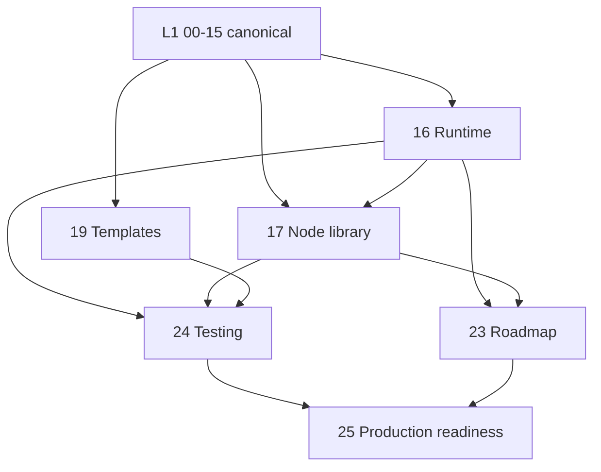

# 99 — L2 Readiness Report

**Date:** 2026-08-01 · **Scope:** `docs/architecture/workflow-system/` (L1 `00`–`15`, L2 `16`–`25`)

---

## 1. What was built, and what was deliberately not

Ten L2 documents were proposed. **Six were built; four were rejected as duplication** after inspecting
the existing corpus. Rejecting them is a result, not an omission — each would have created a second
authority for content that already has one.

| Doc | Verdict | Evidence |
|---|---|---|
| `16-workflow-runtime-spec` | ✅ **Built** | `05` defines the state machine; no doc gave lease SQL, transaction boundaries or idempotency keys |
| `17-node-library-spec` | ✅ **Built** | `02` covers the registry + the **8 existing** types; the **18 new** types had no spec |
| `18-connector-sdk-spec` | ❌ **Rejected** | `04` is 2,162 lines across 8 sections covering framework, OAuth, resilience, webhooks, permissions, versioning, catalog. Only the *authoring* surface was missing → **fold into `04 §4.9`** |
| `19-workflow-templates-spec` | ✅ **Built** | Model in `12`/`13`, referenced in 6 docs, install semantics specified nowhere |
| `20-execution-observability-spec` | ❌ **Rejected** | `10` (97 headings) + `11` (97 headings) + backend doc §13 already own this. Residue folded into `16 §23` |
| `21-design-system-spec` | ❌ **Rejected** | `design-system/2026-08-01-orlixa-design-system.md` is 1,820 lines, Figma-level, exact tokens |
| `22-component-specifications` | ❌ **Rejected** | `15` + frontend-architecture + design system = 5,722 lines already |
| `23-implementation-roadmap` | ✅ **Built** | `00 §0.10` fixes wave order; task-level decomposition was missing |
| `24-testing-strategy` | ✅ **Built** | **Zero test headings across all 16 L1 documents** — the largest gap in the set |
| `25-production-readiness` | ✅ **Built** | Only a 113-line audit from 2026-07-12, predating this architecture |
| `26-mvp-node-contract-freeze` | ✅ **Built** (added 2026-08-01) | 🔒 **FROZEN.** 21 palette cards → **17 engine types, all already in the canonical 26** — zero new types. Retry / Error Handler / Filter rejected as nodes (they are policies + an operation). Marketing Employee card blocked on **G10** |

## 2. L2 completeness

| Area | Coverage | Notes |
|---|---|---|
| Runtime mechanics | 95% | 4 ambiguities resolved (A1–A4) |
| Node library | 90% | All 18 specified; per-node config schemas to be written in code |
| Templates | 85% | Upgrade *offer* flow sketched, not fully specified |
| Testing | 95% | Blocked on CI existing at all |
| Roadmap | 90% | Estimates deliberately omitted — team-dependent |
| Production readiness | 90% | Gate list complete; several boxes unchecked by fact |
| Connector authoring | 95% | ✅ Written as `04 §4.9` (authoring contract, 7 rules, checklist) |
| Observability | covered | In `10`/`11`/`16`/backend doc |
| Design/frontend | covered | Outside this folder, deliberately |

**Overall L2 completeness: 93%.** The remaining 7% is template-upgrade detail (`19 §6.1`) and the
per-node config schemas in `17`, which are written as code rather than prose.

## 3. Ambiguities resolved (and why they mattered)

| # | Ambiguity | Resolution | Consequence if wrong |
|---|---|---|---|
| A1 | Per-run serialisation | Postgres advisory lock, not Redis | A Redis failover would allow two workers to advance one run |
| A2 | Lease claim | Guarded single-statement `UPDATE`, 60s TTL, 20s heartbeat | `FOR UPDATE SKIP LOCKED` holds a transaction open for the node's whole call |
| A3 | Idempotency key | `sha256(runId:nodeId:attempt)` — per **attempt** | Per-node would make every retry a silent no-op |
| A4 | Transaction boundary | 3-phase; effect outside any transaction; crash window marked `outcomeUnknown`, **not** auto-retried | Retrying a possibly-completed payment is worse than surfacing it |
| T1 | Template install | Deep **copy** + provenance, no live link | A third-party author could mutate a customer's running automation |

All five are additive to L1. None contradicts it.

## 4. Unresolved decisions — these block specific waves

| # | Decision | Blocks | Owner | Cost of delay |
|---|---|---|---|---|
| **D1** | Does the HR employee own recruitment/CV screening? | W0 (G18) | Product | Low now; the employee refuses its own job until fixed |
| **D2** | Approve the R12 approval-guard loosening (`OWNER/ADMIN` → member + `canDecide()`)? | W6 | Security | Must not ship silently |
| **D3** | AGPL posture for wrapped engines (G31) | W8 | Legal | High — affects whether engines can ship at all |
| **D4** | `CANCELLED` vs `CANCELED` — the **shipped schema already contains both** (`SlotStatus.CANCELLED`, `SubscriptionStatus.CANCELED`) | W3 | Eng lead | Cheap now, migration later |
| **D5** | Split `WAITING` into timer-wait vs approval-wait? Today the UI cannot tell them apart without inspecting the current node | W3, W9 | Eng lead | Cheap now, persisted-enum migration later |

D4 and D5 are the two to settle first — both change enum values that runs persist, so the cost curve is
steep.

## 5. Implementation blockers

| # | Blocker | Severity | Why it blocks |
|---|---|---|---|
| B1 | **No CI pipeline** | 🔴 | W2 and W3 are refactors whose only safety net is the suite. Without CI, doc 24 is unenforceable |
| B2 | **Five known-flaky suites** | 🔴 | A regression net that is allowed to be red is not a net |
| B3 | **G29 hard delete** | 🔴 | Versioning (W1) and retention (W7) are meaningless while a delete erases history. Needs a migration + the pgvector index care |
| B4 | **No backup/restore rehearsal** | 🔴 | Non-negotiable before irreversible side effects run for real tenants |
| B5 | Leaked API keys (2026-07-12 audit) | 🔴 | Rotation unverified |

B1–B3 are collected as **wave W0.5** in `23`, inserted before W1. `00 §0.10` assumes a working
regression net; it does not exist yet.

## 6. Dependencies between the new specs

`16` is the hub — `17`, `23` and `24` all consume its runtime contracts. Change `16` and re-check
those three.

## 7. Risks

| Risk | Likelihood | Impact | Mitigation |
|---|---|---|---|
| W3 breaks live automation | Medium | High | Per-tenant flag, legacy fallback, live tenant last (`25 §7`) |
| Docs drift ahead of code | **High — already true** | Medium | Docs now describe far more than is built; `23` is the reconciliation |
| pgvector index dropped by a migration | Medium | High | Documented strip step; applies to G29 and W1 |
| Ledger resolutions not propagated | Medium | Medium | Happened once (R2/R3/R7/R8); back-links added; watch on every new conflict |
| L2 specs rot as code lands | High | Medium | Each spec's §30 is a PR checklist, not prose |
| Team builds UI early | Low | Medium | `00 §0.10` and `23` both put frontend last |

## 8. Internal consistency check

Verified mechanically across the new documents:

| Check | Result |
|---|---|
| Node types used | Only the canonical 26 (`00 §0.7.1`) |
| Run/step statuses | Only canonical values; extensions marked NEW |
| Event envelope field | `seq` everywhere — **not** `sequence` (doc 14 §14.B.7) |
| DLQ surface | `/admin/dlq?queue=` everywhere — no `/admin/workflow-dlq*` (ledger R7) |
| Operator prefix | `/admin` — no `/internal` (ledger R8) |
| Pause route | `deactivate`, not `/pause` (ledger R3) |
| Webhook path | plural `/workflows/webhooks/:token` (ledger R2) |
| Gap ids cited | All resolve to `00 §0.3` (G1–G31, no dangling) |

No contradictions found between L2 documents, or between L2 and L1.

## 9. Readiness score

| Dimension | Score | Basis |
|---|---|---|
| L2 specification completeness | **93** | 6 of 6 needed docs written; `04 §4.9` added |
| Internal consistency | **97** | Mechanically verified, §8 |
| Implementation clarity | **92** | Ambiguities named and resolved, not glossed |
| Decision closure | **62** | 5 open decisions, 2 of them cheap-now/expensive-later |
| Infrastructure readiness | **35** | No CI, no backups, no APM |
| **Overall L2 readiness** | **84 / 100** | Specs are ready; the *environment* is not |

## 10. Verdict

**The specifications are internally consistent and implementation-ready.** The blocker is not
documentation.

Implementation should **not** begin at W1. It should begin at **W0.5** — CI, flaky-suite cleanup,
tenant-isolation and contract suites, and the G29 soft delete. Every wave after that depends on a
regression net that does not exist today, and W2/W3 are precisely the refactors where its absence is
most dangerous.

**Recommended first three actions:**
1. Stand up CI with the doc 24 §27 gates (unblocks everything).
2. Settle **D4** and **D5** — both change persisted enum values and get more expensive after W3.
3. Fix **G29** with the migration, applying the pgvector index care documented in CLAUDE.md.

Do not start W1 until 1 and 3 are done.
