# Orlixa — CTO Architecture Hardening & Engine Freeze Plan

**Document type:** CTO / Architecture Execution Plan  
**Date:** 2026-08-10  
**Purpose:** Define the exact platform-hardening sequence before Orlixa expands from the current three working engines to the remaining seven.

---

## 1. Executive Decision

### Decision

> **Temporarily freeze development of NEW engines and finish the shared production spine first: Durable Execution + Authorization + Approval Routing + Audit + Observability + E2E/Chaos/DR.**

This is **not** a permanent cancellation of the engine roadmap.

It is a sequencing decision:

```text
CURRENT
  │
  ├── Postiz       ──┐
  ├── Chatwoot     ──┤
  ├── Plane        ──┤
  └── Core Orlixa  ──┘
          │
          ▼
  HARDEN SHARED PLATFORM
          │
          ├── Durable execution
          ├── Authorization
          ├── Approval routing
          ├── Canonical events
          ├── Audit
          ├── Observability
          ├── E2E
          ├── Chaos / recovery
          └── DR / retention
          │
          ▼
  PRODUCTION SPINE VERIFIED
          │
          ▼
  UNFREEZE ENGINE ROADMAP
          │
          ├── Chatwoot/Plane/Postiz hardening complete
          ├── n8n
          ├── Metabase
          ├── Meilisearch
          ├── Novu
          ├── Listmonk
          ├── Storage replacement
          └── Keycloak
```

The reason is architectural, not cosmetic: the current audit identifies the durable state-machine as built but dormant, while the legacy graph-walk remains the real execution path. It also identifies operational gaps around canonical events, audit coverage, observability, browser E2E, retention, and enterprise authorization.  

Sources: `implementation-gap-audit.md`, `backend-implementation-plan.md`, `2026-07-20-engine-integration-master-plan.md`, `e2e-readiness-report.md`.

---

# 2. Current Engine Position

The project documentation says three engines are currently built:

| Engine | AI Employee | Current decision |
|---|---|---|
| **Postiz** | AI Marketing Manager | 🟡 **KEEP + REFACTOR/HARDEN** |
| **Chatwoot** | AI Customer Support Employee | 🟡 **KEEP + REFACTOR/HARDEN** |
| **Plane** | AI Project Manager | 🟡 **KEEP + REFACTOR/HARDEN** |
| **n8n** | AI Workflow Employee | ⏸️ **PAUSE** |
| **Metabase** | AI Analytics Employee | ⏸️ **PAUSE** |
| **Meilisearch** | AI Search / shared search | ⏸️ **PAUSE** |
| **Novu** | AI Notification Employee | ⏸️ **PAUSE FULL ENGINE; FIX NOTIFY CORE** |
| **Listmonk** | AI Email Marketing Employee | ⏸️ **PAUSE** |
| **MinIO / replacement** | Storage | ⏸️ **PAUSE IMPLEMENTATION; RUN TECHNOLOGY BAKE-OFF ONLY** |
| **Keycloak** | Enterprise SSO | ⏸️ **PAUSE unless customer/deal requires SSO** |

The source progress report confirms Postiz, Chatwoot and Plane are built, while the remaining seven are researched/documented but not built. MinIO should not be introduced as a new production dependency because the project research found its repository archived/unmaintained.  

Source: `2026-07-27-complete-progress-documentation.md`.

---

# 3. What "Freeze" Actually Means

## Freeze does NOT mean

- Do not fix bugs.
- Do not maintain current engines.
- Do not improve security.
- Do not improve the existing AI Employees.
- Do not fix customer-facing issues.
- Do not patch production.
- Do not finish the workflow runtime.
- Do not improve integrations.

## Freeze means

Do not start the **next large engine integration** whose primary purpose is adding another product capability.

Examples:

```text
Do NOT start:
n8n engine
Metabase engine
Meilisearch engine
full Novu engine
Listmonk provisioning
Keycloak implementation
new storage engine implementation
```

until the shared production spine reaches the Definition of Done in this document.

---

# 4. The Architecture We Want

The target architecture is:

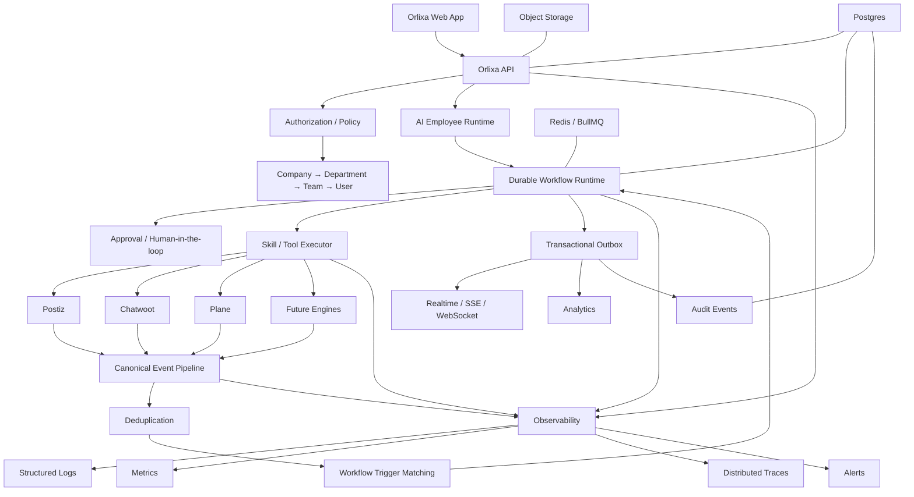

---

# 5. The Most Important Rule

## One workflow engine

There must eventually be:

```text
ONE production workflow execution architecture
```

not:

```text
legacy workflow engine
+
durable workflow engine
```

The current implementation has both.

The legacy graph-walk is the real path.

The durable state machine has its queues, leases, attempts, timers, joins, outbox and reaper infrastructure, but it is not currently the universal live execution path.

The implementation audit calls this architectural drift and identifies the two implementations as the biggest cross-cutting risk.

---

# 6. Current → Target Workflow Flow

## Current production flow

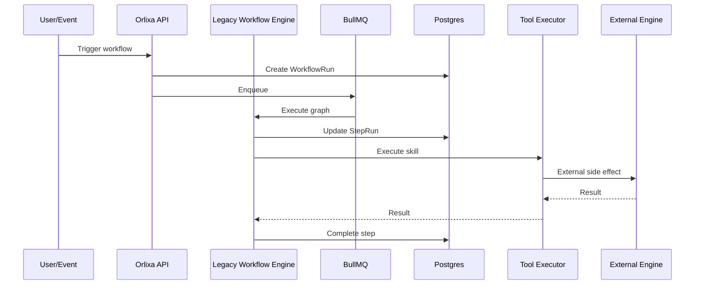

This works, but it is not the final durable execution architecture.

---

# 7. Target Durable Workflow Flow

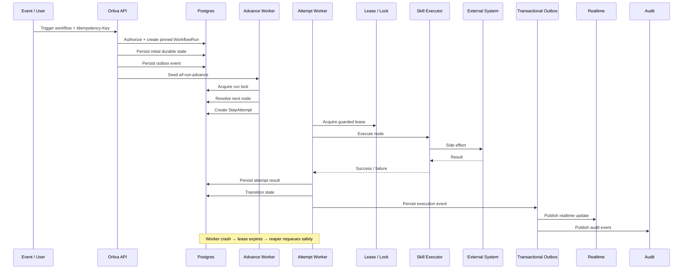

---

# 8. Execution Spine — What Must Be Refactored

## 8.1 Workflow versioning

Every run must execute an immutable version:

```text
Workflow
   │
   ├── Draft
   ├── Published Version 1
   ├── Published Version 2
   └── Active Version
             │
             ▼
        WorkflowRun
             │
             └── workflowVersionId
```

A workflow edited after a run begins must never change that run's behavior.

The backend plan already defines `WorkflowVersion`, publish/activate/deprecate lifecycle and version pinning.

---

## 8.2 Node Registry

Remove engine-level branching such as:

```text
switch(node.type)
```

and use:

```text
NodeRegistry
    │
    ├── TRIGGER
    ├── AI_EMPLOYEE_STEP
    ├── TOOL_ACTION
    ├── RETRIEVE
    ├── WAIT
    ├── CONDITION
    ├── NOTIFY
    └── future nodes
```

Each node implements a common contract.

This makes the durable runtime and future visual builder compatible without duplicating node logic.

---

## 8.3 Durable attempt model

Every side-effecting step needs:

```text
WorkflowStepAttempt
 ├── runId
 ├── stepRunId
 ├── attempt
 ├── status
 ├── leaseExpiresAt
 ├── startedAt
 ├── completedAt
 ├── error
 └── idempotency metadata
```

The purpose is recovery, not merely logging.

---

# 9. Idempotency Spine

Every entry point capable of causing a run must have an idempotency contract.

Required:

```text
POST /workflows/:id/run
POST /workflows/webhooks/:token
fireEvent(...)
scheduled triggers
external event triggers
```

Flow:

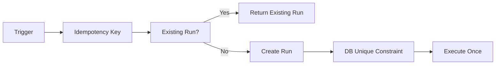

The implementation audit reports that the major public idempotency gaps were addressed, including webhook and manual run deduplication. Keep this as a hard regression contract.

---

# 10. Authorization Spine

Current foundation:

```text
Company
 ├── OWNER
 ├── ADMIN
 └── MEMBER
```

Target:

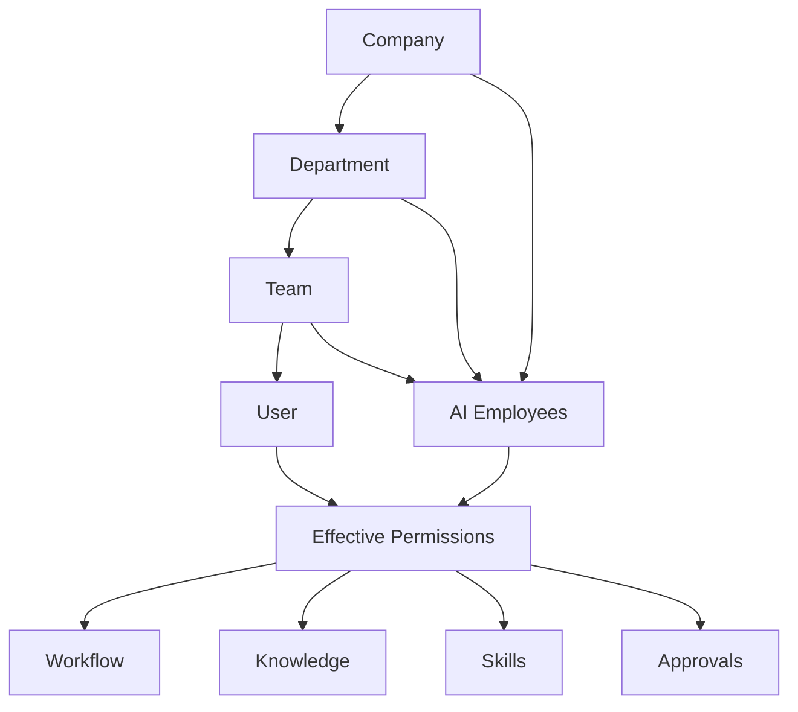

The enterprise gap is not tenant isolation. Tenant isolation is already strongly enforced.

The missing layer is **fine-grained organizational scope**.

---

# 11. Authorization Refactor — Required Model

Use:

```text
CompanyRole
DepartmentRole
TeamRole
WorkflowPermission
EmployeePermission
KnowledgeScope
ApprovalPermission
```

Example:

```text
Marketing Admin
    ↓
Marketing AI Employees
Marketing Workflows
Marketing Knowledge
Marketing Approvals

NOT:

HR Knowledge
Finance Workflows
Payroll Employee
```

Authorization must be centralized.

Do not scatter:

```typescript
if (user.role === 'ADMIN')
```

across controllers and services.

Use a common policy decision layer.

---

# 12. Execution-Time Skill Authorization

This is especially important.

A workflow should NOT be able to say:

```text
employee = HR Employee
skill = Gmail
```

and automatically use any Gmail credential owned by the company.

Target:

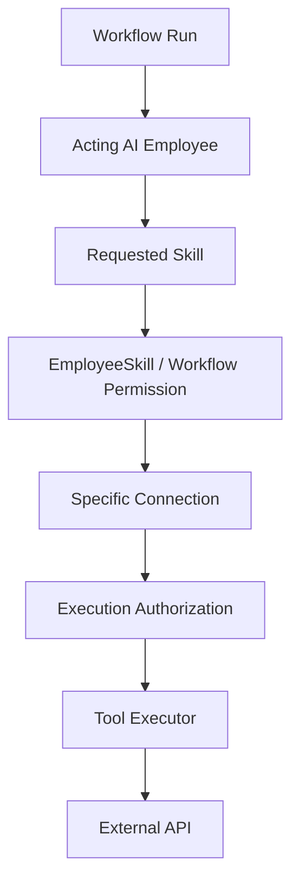

The audit reports that employee skill grants have been fixed at execution for the current path, but the deeper per-attempt node-level PDP remains a future layer. Do not weaken the current enforcement while refactoring the runtime.

---

# 13. Approval Spine

Approval should be part of the durable runtime.

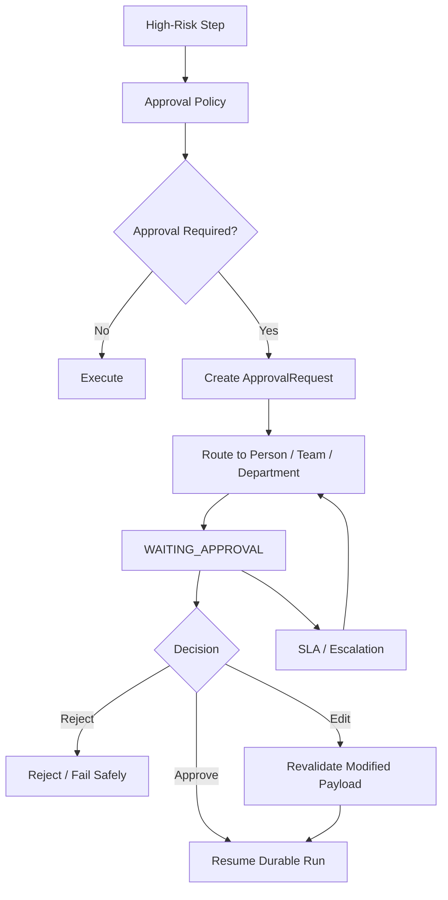

Required routing:

```text
assignedToUserId?
assignedToTeamId?
assignedToDepartmentId?
fallbackRole
escalationChain
SLA
```

Never implement:

```text
"No approver available → bypass approval"
```

The project's approval architecture explicitly prefers SLA escalation rather than an admin bypass.

---

# 14. Audit Spine

Current basic audit:

```text
AuditLog
```

Target:

```text
AuditEvent
   ↓
append-only
   ↓
hash chain
   ↓
archive
   ↓
audit API
```

Diagram:

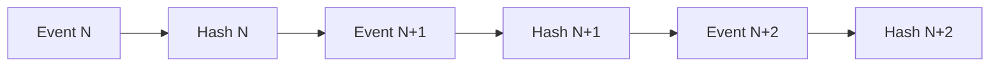

Audit every critical mutation:

```text
AUTH
AI_EMPLOYEE
SKILL
OAUTH
WORKFLOW
WORKFLOW_PERMISSION
APPROVAL
EXECUTION
KNOWLEDGE
MEMORY
HR
MARKETING
SUPPORT
RETENTION
BILLING
ADMIN
```

Audit events must contain enough context to reconstruct:

```text
WHO
WHAT
WHEN
WHERE
WHY
RESOURCE
BEFORE
AFTER
CORRELATION
```

---

# 15. Event Architecture Spine

All external integrations must use one canonical event pipeline.

## Target

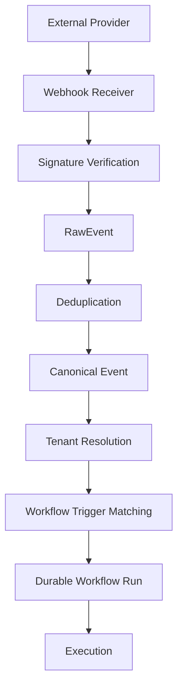

Examples:

```text
Gmail
Chatwoot
Plane
Postiz
GitHub
Future providers
```

must converge here.

No engine-specific trigger architecture.

---

# 16. Chatwoot Refactor

## KEEP

Chatwoot functionality is already built and should remain active.

## REFACTOR

Required:

```text
Chatwoot webhook
 ↓
HMAC verify
 ↓
dedup
 ↓
local support record
 ↓
canonical event
 ↓
workflow trigger
 ↓
audit
```

Required events:

```text
conversation.created
conversation.updated
message.created
message.updated
assignment.changed
status.changed
```

The current engine plan requires HMAC verification, deduplication, local record updates, canonical events, workflow triggering, tenant isolation and audit.

---

# 17. Plane Refactor

## KEEP

Plane issue operations can remain available.

## REFACTOR

Required:

```text
Plane webhook
 ↓
raw-body HMAC
 ↓
dedup
 ↓
canonical event
 ↓
workflow trigger
```

Required events:

```text
issue.created
issue.updated
status.changed
assignment.changed
```

Plane's HMAC scheme must not be copied from Chatwoot.

The project plan explicitly notes that Plane uses a different signature contract.

---

# 18. Postiz Refactor

## KEEP

Postiz is the current Marketing engine and should remain active.

## REFACTOR BEFORE SCALE

### 1. `publish_now`

Every immediate publication should create a local tracking record before/within the durable execution transaction.

Avoid:

```text
publish externally
   ↓
no local row
   ↓
Orlixa cannot reconcile
```

Target:

```text
WorkflowRun
 ↓
PublishedPost / execution record
 ↓
external publish
 ↓
provider ID
 ↓
reconciliation
```

### 2. Idempotent publish

Use:

```text
companyId
+
campaign/post identity
+
idempotency key
```

to prevent duplicate publication.

### 3. Reconciliation

Continue using the real Postiz status as source of truth where appropriate.

---

# 19. Observability Spine

Every execution should carry:

```text
requestId
companyId
employeeId
workflowId
workflowVersionId
workflowRunId
stepRunId
attemptId
skillExecutionId
externalRequestId
```

Example:

```text
traceId: abc123

request
  ↓
workflowRun: run_123
  ↓
stepRun: step_4
  ↓
attempt: attempt_2
  ↓
skillExecution: skill_88
  ↓
Postiz request: postiz_req_99
```

---

# 20. Observability Components

## Logs

Structured JSON:

```json
{
  "level": "error",
  "companyId": "...",
  "workflowRunId": "...",
  "stepRunId": "...",
  "skill": "postiz.publish",
  "errorCode": "PROVIDER_TIMEOUT"
}
```

## Metrics

Track:

```text
workflow_runs_total
workflow_success_total
workflow_failure_total
workflow_retry_total
workflow_duration_ms
step_duration_ms
queue_depth
queue_lag
approval_wait_duration
skill_failure_total
oauth_refresh_failure_total
provider_latency_ms
llm_tokens_total
llm_cost_total
```

## Alerts

At minimum:

```text
queue backlog high
workflow failure spike
worker unavailable
database connection failure
Redis failure
OAuth failure spike
external provider failure spike
LLM failure spike
audit relay lag
outbox backlog
```

---

# 21. Realtime Spine

Current polling should not become the permanent architecture.

Target:

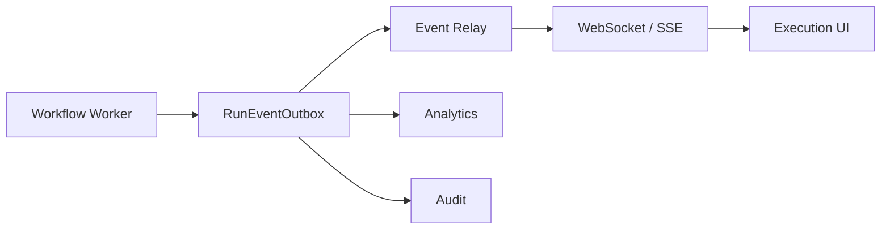

This gives the UI:

```text
RUNNING
Step 1 ✓
Step 2 ✓
Step 3 ⏳
Approval required
Step 4
COMPLETED
```

without aggressive polling.

---

# 22. E2E Spine

Backend E2E is already strong.

The remaining major proof gap is browser E2E.

The project E2E report states that the Playwright harness is authored but has not been executed.

Therefore:

> **Do not claim browser E2E production readiness until Playwright has actually passed against the real stack.**

---

# 23. Golden Enterprise Journey

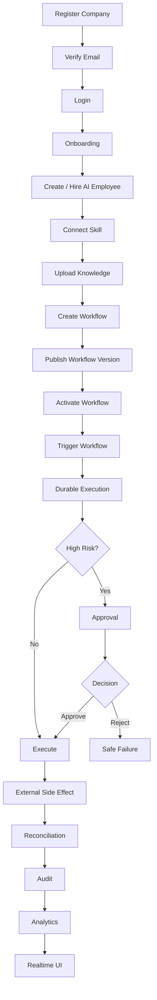

---

# 24. E2E Security Journey

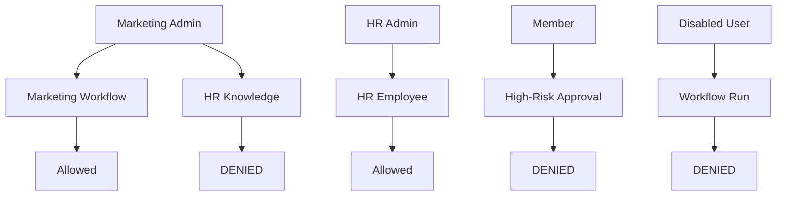

---

# 25. Chaos / Recovery Tests

Before declaring the durable engine ready:

```text
1. Worker crash during step
2. Worker crash after external API success
3. Duplicate queue delivery
4. Duplicate webhook delivery
5. Redis restart
6. Database connection loss
7. API restart during workflow
8. Deployment during approval
9. OAuth token expiry during execution
10. Provider 500
11. Provider timeout
12. LLM timeout
13. Approval timeout
14. Lease expiry
15. Reaper recovery
```

Expected invariant:

```text
NO DUPLICATE SIDE EFFECT
NO LOST RUN
NO TENANT LEAK
NO APPROVAL BYPASS
NO SECRET LEAK
NO PHANTOM SUCCESS
```

---

# 26. Data Retention / DR Spine

Required:

```text
RPO
RTO
Backup
Restore rehearsal
Retention
Legal hold
Audit archive
Object storage recovery
```

Example target to define with production requirements:

```text
RPO: X minutes
RTO: Y minutes
```

Do not claim these values until actually selected and tested.

The database plan already defines separate retention treatment for outbox, workflow attempts/runs and long-lived audit events, including legal-hold requirements.

---

# 27. Which Engines Should Be PAUSED

## 27.1 n8n — PAUSE

### Why

Orlixa already has a workflow engine.

Building n8n now would create:

```text
Orlixa Workflow Engine
+
n8n Workflow Engine
```

which creates architectural duplication.

### Decision

```text
n8n engine = PAUSED
```

Do not integrate it until Orlixa has a concrete reason to delegate specialized automation to n8n.

Potential future use:

```text
Orlixa Workflow
    ↓
n8n adapter
    ↓
specialized external automation
```

But not as a second competing core workflow engine.

---

# 28. Metabase — PAUSE

### Why

Analytics foundation is still being hardened.

First establish:

```text
WorkflowRun
StepAttempt
LLM usage
Skill execution
Cost
Latency
Success/failure
```

as canonical telemetry.

Then decide whether Metabase adds enough value.

### Decision

```text
Metabase = PAUSED
```

### Before unfreeze

Define whether it is:

```text
customer-facing analytics
OR
internal BI
OR
AI analytics employee
```

Do not build all three at once.

---

# 29. Meilisearch — PAUSE

### Why

The platform already has:

```text
Postgres
pgvector
knowledge retrieval
semantic search
```

Search infrastructure should be driven by actual scale and workload, not by engine availability.

### Decision

```text
Meilisearch = PAUSED
```

### Future trigger

Unfreeze when:

```text
search volume
+
latency
+
filtering requirements
+
cross-entity search
```

prove Postgres/pgvector is insufficient.

---

# 30. Novu — PAUSE FULL ENGINE, FIX NOTIFY CONTRACT

This is the one exception.

The full:

```text
AI Notification Employee
```

should be paused.

But the existing:

```text
NOTIFY workflow node
```

cannot remain log-only if it is part of the promised workflow model.

The master plan explicitly identifies this as a P0 gap.

### Therefore

Do:

```text
Notification abstraction
       ↓
Provider interface
       ↓
email / SMS / in-app
```

First.

Later:

```text
Novu adapter
```

can become one implementation.

### Decision

```text
Novu full engine = PAUSED
NOTIFY capability = FIX NOW
```

---

# 31. Listmonk — PAUSE

Listmonk introduces operational complexity because the project research identifies it as genuinely single-tenant.

That means:

```text
Company A
  ↓
Listmonk instance A

Company B
  ↓
Listmonk instance B
```

not simply:

```text
shared Listmonk
```

### Decision

```text
Listmonk = PAUSED
```

Unfreeze only after:

```text
tenant provisioning
backup
upgrade
isolation
cost model
failure recovery
```

are proven.

---

# 32. Storage / MinIO — PAUSE IMPLEMENTATION

Do not build new production dependencies on MinIO.

The project research identifies the MinIO repository as archived/unmaintained.

### Do now

Only a technology evaluation:

```text
SeaweedFS
Garage
other approved S3-compatible option
```

Compare:

```text
maintenance
S3 compatibility
durability
backup
lifecycle
performance
cost
operational complexity
```

### Decision

```text
Storage engine implementation = PAUSED
MinIO new dependency = FORBIDDEN
Storage bake-off = ALLOWED
```

---

# 33. Keycloak — PAUSE

SSO is valuable, but it is not the first thing that makes workflow execution trustworthy.

### Decision

```text
Keycloak = PAUSED
```

Exception:

> If a real enterprise sales opportunity requires SAML/OIDC/SSO, move Keycloak into P1 immediately.

Otherwise:

```text
Authorization spine first
SSO second
```

Keycloak should reuse the organizational scoping model rather than inventing another organization/tenant model.

---

# 34. Existing Engines — Do NOT Pause

## Postiz

```text
KEEP
HARDEN
```

Focus:

```text
publish idempotency
publish tracking
reconciliation
consent/suppression
audit
observability
E2E
```

## Chatwoot

```text
KEEP
REFACTOR
```

Focus:

```text
canonical events
dedup
workflow triggers
audit
E2E
```

## Plane

```text
KEEP
REFACTOR
```

Focus:

```text
canonical events
inbound webhook
dedup
audit
workflow triggers
E2E
```

---

# 35. Engine Priority Matrix

| Engine | Status | Action now | Unfreeze condition |
|---|---|---|---|
| Postiz | Built | **Refactor/Harden** | Production SLO + idempotency + reconciliation |
| Chatwoot | Built | **Refactor/Harden** | Canonical event integration + E2E |
| Plane | Built | **Refactor/Harden** | Canonical event integration + E2E |
| n8n | Not built | **PAUSE** | Proven need for external automation delegation |
| Metabase | Not built | **PAUSE** | Analytics requirements exceed native stack |
| Meilisearch | Not built | **PAUSE** | Search scale/latency requires it |
| Novu | Not built | **PAUSE engine / FIX NOTIFY** | Notification abstraction stable |
| Listmonk | Not built | **PAUSE** | Per-company provisioning/ops proven |
| MinIO | Not built | **DO NOT USE** | Replace with approved storage engine |
| Storage replacement | Not built | **BAKE-OFF ONLY** | Technology decision + DR test |
| Keycloak | Not built | **PAUSE** | Enterprise SSO customer requirement |

---

# 36. What Should Be Refactored Now

## Refactor Group A — Workflow

```text
legacy engine
   ↓
NodeRegistry
   ↓
WorkflowVersion
   ↓
Durable State Machine
   ↓
EngineModeService
   ↓
legacy fallback only during migration
```

Do not maintain two permanent execution architectures.

---

# 37. Refactor Group B — Events

Create one:

```text
CanonicalEventService
```

All providers use:

```text
Webhook
 ↓
Signature
 ↓
RawEvent
 ↓
Dedup
 ↓
CanonicalEvent
 ↓
Trigger
```

No engine-specific workflow triggering.

---

# 38. Refactor Group C — Tool Execution

One contract:

```text
ToolExecutor
   ↓
Authorization
   ↓
Approval
   ↓
Idempotency
   ↓
Credential resolution
   ↓
Provider call
   ↓
Audit
   ↓
Metrics
```

Every engine must use this.

---

# 39. Refactor Group D — Connector Contract

Every integration should expose:

```text
connect()
disconnect()
healthCheck()
refresh()
execute()
reconcile()
handleWebhook()
```

with:

```text
encrypted credentials
tenant scope
employee scope
audit
health
retry
rate limit
```

---

# 40. Refactor Group E — Audit

Move toward:

```text
AuditService
```

as the single write abstraction.

Do not let every module directly manipulate audit tables.

---

# 41. Refactor Group F — Observability

Create a shared:

```text
ExecutionContext
```

containing:

```text
companyId
userId
employeeId
workflowId
workflowVersionId
workflowRunId
stepRunId
attemptId
skillExecutionId
traceId
```

Every service receives it where relevant.

---

# 42. Refactor Group G — Billing / Entitlements

Centralize:

```text
Plan
 ↓
Entitlements
 ↓
Usage
 ↓
Enforcement
```

Potential entitlements:

```text
ai_employee_count
workflow_count
workflow_runs
token_budget
knowledge_storage
memory_storage
integrations
seats
approvals
automation_frequency
API usage
```

Do not scatter plan checks across modules.

---

# 43. Refactor Group H — Security Policy

Stored configuration must become executable policy.

Current fields include:

```text
passwordMinLength
mfaRequired
allowedEmailDomains
dataRetentionDays
```

Target:

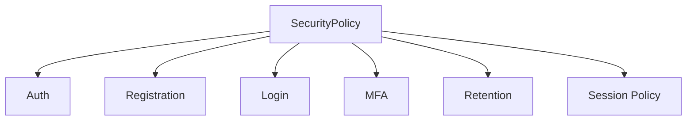

---

# 44. Refactor Group I — Knowledge

Current retrieval behavior is not fully uniform across chat and workflow execution.

Target:

```text
Knowledge Policy
   ↓
scope
   ↓
department
   ↓
team
   ↓
employee
   ↓
workflow
```

A workflow RETRIEVE node must not silently see knowledge the acting AI Employee cannot access.

---

# 45. Refactor Group J — Memory

Current memory recall is recency-oriented.

Do not prioritize this before execution reliability.

After the spine:

```text
Memory
 ├── semantic similarity
 ├── recency
 ├── importance
 ├── entity
 ├── department
 └── permission scope
```

---

# 46. The New Development Roadmap

## WAVE 0 — Freeze

```text
STOP NEW ENGINE DEVELOPMENT
```

Duration should be measured by Definition of Done, not an arbitrary number of weeks.

---

## WAVE 1 — Execution

```text
1. WorkflowVersion
2. NodeRegistry
3. Durable state machine
4. Attempts
5. Leases
6. Timers
7. Retry
8. Idempotency
9. Approval state
10. Reaper
11. Outbox
12. Engine cutover
```

Acceptance:

```text
100% new production runs
→ durable engine
```

with controlled per-company rollout.

---

# 47. WAVE 2 — Authorization

```text
Company
 ↓
Department
 ↓
Team
 ↓
User
```

Implement:

```text
department roles
team roles
workflow permissions
employee scope
knowledge scope
approval scope
execution-time skill authorization
```

---

# 48. WAVE 3 — Event Spine

Implement:

```text
RawEvent
 ↓
Signature
 ↓
Dedup
 ↓
CanonicalEvent
 ↓
Trigger
 ↓
Durable Run
```

Migrate:

```text
Gmail
Postiz
Chatwoot
Plane
```

to the same contract.

---

# 49. WAVE 4 — Audit

Implement:

```text
AuditEvent
 ↓
hash chain
 ↓
append-only
 ↓
archive
 ↓
query API
 ↓
export
```

Then audit all high-value mutations.

---

# 50. WAVE 5 — Observability

Implement:

```text
logs
metrics
traces
alerts
realtime
```

with common correlation IDs.

---

# 51. WAVE 6 — Browser E2E

Run:

```text
Playwright
```

against:

```text
Web
API
Postgres
Redis
BullMQ
Workers
```

Do not accept:

```text
"ready to run"
```

as equivalent to:

```text
"passed"
```

---

# 52. WAVE 7 — Chaos + DR

Execute:

```text
worker crash
duplicate job
duplicate webhook
Redis restart
DB failure
API restart
provider timeout
OAuth expiry
deployment during run
backup restore
```

Record evidence.

---

# 53. WAVE 8 — Production Gate

Only when all critical gates are green:

```text
                    ┌───────────────┐
                    │ PRODUCTION    │
                    │ SPINE READY   │
                    └───────┬───────┘
                            │
          ┌─────────────────┼─────────────────┐
          ↓                 ↓                 ↓
      Execution         Security          Evidence
          │                 │                 │
      Durable          Authorization       Audit
      Retry            Approval            E2E
      Recovery         Tenant Scope        DR
          │                 │                 │
          └─────────────────┼─────────────────┘
                            ↓
                     ENGINE UNFREEZE
```

---

# 54. Engine Unfreeze Order

After the spine:

## Stage 1

```text
Postiz
Chatwoot
Plane
```

finish production hardening.

## Stage 2

```text
Novu notification abstraction
```

if the notification requirement is real.

## Stage 3

```text
Meilisearch
```

only if search requirements justify it.

## Stage 4

```text
Metabase
```

if analytics requirements justify it.

## Stage 5

```text
n8n
```

only if external automation delegation is needed.

## Stage 6

```text
Listmonk
```

only after per-company provisioning/ops is solved.

## Stage 7

```text
Storage replacement
```

after the bake-off and DR validation.

## Stage 8

```text
Keycloak
```

when enterprise SSO is commercially required.

---

# 55. What NOT to Do

Never:

```text
❌ permanently maintain two workflow engines
❌ create a second event architecture
❌ create a second secret system
❌ create a second tenant model
❌ bypass approval because an approver is unavailable
❌ trust LLM output as security authority
❌ let a workflow use arbitrary company credentials
❌ report mocked external integrations as production verified
❌ claim Playwright passed without executing it
❌ claim DR passed without restoring a backup
❌ add MinIO as a new production dependency
❌ add another engine before its shared platform contracts are stable
```

---

# 56. Definition of Done — Enterprise Production Spine

The platform should eventually prove:

### Execution

- [ ] Every production run uses durable execution.
- [ ] Every run pins an immutable workflow version.
- [ ] Attempts are durable.
- [ ] Leases are durable.
- [ ] Retries are deterministic.
- [ ] Timeouts are durable.
- [ ] Worker restart does not lose runs.
- [ ] Duplicate delivery does not duplicate side effects.
- [ ] Compensation semantics are explicit.

### Authorization

- [ ] Tenant isolation.
- [ ] Department scope.
- [ ] Team scope.
- [ ] Employee scope.
- [ ] Workflow permissions.
- [ ] Execution-time skill authorization.
- [ ] Approval authorization.

### Approval

- [ ] Named approver.
- [ ] Team approver.
- [ ] Department approver.
- [ ] Escalation.
- [ ] SLA.
- [ ] Durable WAITING state.
- [ ] No bypass.

### Events

- [ ] Signature verification before DB mutation.
- [ ] Raw event capture.
- [ ] Deduplication.
- [ ] Canonical event.
- [ ] Trigger matching.
- [ ] Durable workflow creation.

### Audit

- [ ] Critical mutations audited.
- [ ] Approval decisions audited.
- [ ] Permission changes audited.
- [ ] User disable audited.
- [ ] Workflow lifecycle audited.
- [ ] Connector lifecycle audited.
- [ ] Tamper-evident chain.
- [ ] Retention/archive policy.

### Observability

- [ ] Structured logs.
- [ ] Metrics.
- [ ] Distributed traces.
- [ ] Queue monitoring.
- [ ] Workflow failure alerts.
- [ ] Provider failure alerts.
- [ ] OAuth failure alerts.
- [ ] Outbox lag alerts.
- [ ] Realtime execution events.

### E2E

- [ ] Browser signup/login.
- [ ] AI Employee creation.
- [ ] Skill connection.
- [ ] Knowledge upload.
- [ ] Workflow creation.
- [ ] Workflow publish.
- [ ] Workflow execution.
- [ ] Approval.
- [ ] External action.
- [ ] Audit.
- [ ] Analytics.
- [ ] Security isolation.
- [ ] Failure path.
- [ ] Browser Playwright execution actually passed.

### Operations

- [ ] Backup.
- [ ] Restore rehearsal.
- [ ] RPO defined.
- [ ] RTO defined.
- [ ] Retention implemented.
- [ ] Legal hold respected.
- [ ] Production secrets managed correctly.
- [ ] Connection pooling strategy defined.
- [ ] Worker deployment strategy defined.

---

# 57. Final CTO Architecture

The final platform should look like:

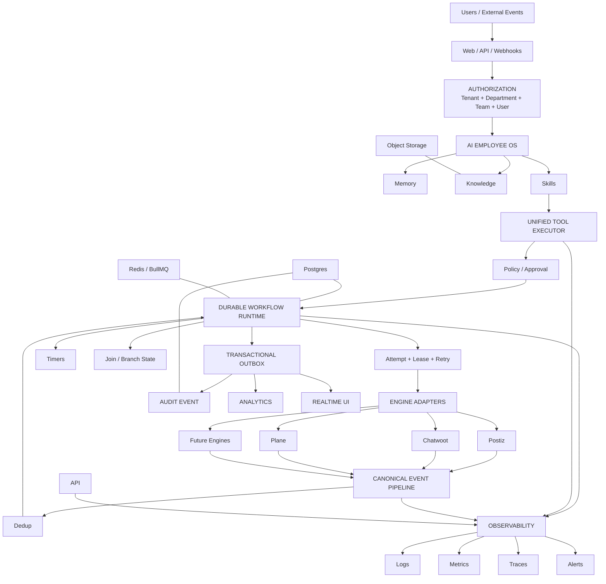

---

# 58. The Strategic Outcome

Before this hardening cycle:

```text
Orlixa
 ├── AI Employees
 ├── Workflows
 ├── Postiz
 ├── Chatwoot
 ├── Plane
 └── many planned engines
```

After this hardening cycle:

```text
Orlixa
 │
 ├── Durable AI Employee Runtime
 │
 ├── Policy / Authorization Runtime
 │
 ├── Approval Runtime
 │
 ├── Canonical Event Runtime
 │
 ├── Audit Runtime
 │
 ├── Observability Runtime
 │
 └── Engine Adapter Layer
       ├── Postiz
       ├── Chatwoot
       ├── Plane
       ├── future n8n
       ├── future Metabase
       ├── future Search
       └── future engines
```

That is a fundamentally stronger architecture.

---

# 59. Final CTO Decision

## DO NOW

```text
1. Durable execution cutover
2. Execution-time authorization
3. Department/team authorization
4. Approval routing
5. Canonical event pipeline
6. Audit Event backbone
7. Observability
8. Realtime execution
9. Browser E2E
10. Chaos testing
11. Backup/restore rehearsal
12. Retention/legal hold
13. Billing entitlement layer
14. SecurityPolicy enforcement
15. Harden Postiz / Chatwoot / Plane
```

## PAUSE

```text
n8n
Metabase
Meilisearch
Novu full engine
Listmonk
Keycloak
Storage implementation
```

## DO NOT USE

```text
MinIO as a new production dependency
```

## ALLOW IN PARALLEL

```text
Storage technology bake-off
Customer-specific SSO work if an actual deal requires it
Critical production bug fixes
Security patches
Current engine maintenance
```

---

# 60. CTO Success Statement

Orlixa should eventually be able to honestly support this statement:

> **A company can create AI Employees, connect their tools, build and publish workflows, execute those workflows through a durable engine, pause for human approval, survive worker/API restarts, retry safely, prevent duplicate side effects, enforce tenant/department/team permissions, retain a tamper-evident audit trail, observe every important execution, recover from infrastructure failure, and prove the complete journey through automated browser and backend tests.**

Only after those conditions are verified should Orlixa be described internally as **enterprise production ready**.

---

## Source Basis

This plan consolidates the project's supplied implementation and architecture documents, especially:

- `2026-07-27-complete-progress-documentation.md`
- `implementation-gap-audit.md`
- `backend-implementation-plan.md`
- `database-migration-plan.md`
- `2026-07-20-engine-integration-master-plan.md`
- `e2e-readiness-report.md`
- `orlixa-cto-master-gap-closure-plan.md`

Important source-derived facts used here include: three engines currently built (Postiz, Chatwoot, Plane); seven researched but not yet built; durable workflow runtime built but not the current live execution path; enterprise RBAC/approval/security-policy gaps; canonical event requirements; browser E2E not yet executed; and the explicit engine integration rule that future engines must reuse the shared execution, skill, event, security, audit and E2E contracts.

---

# 61. Execution Status — verified against the repository (2026-08-13)

Status appended, architecture untouched. `[VERIFIED]` means evidence was
produced by running something, not by reading code. Where a claim could not be
evidenced it is `[PARTIAL]` or `[BLOCKED]` — never upgraded to VERIFIED.

**Evidence commands** (all run for this record):

```
pnpm -w run typecheck                        → PASS 5/5
pnpm --filter @vaep/api run lint             → 0 errors
apps/api: pnpm run test:unit                 → 534 passed, 62 suites
apps/api: pnpm test                          → 465 passed, 73 suites   (durable, default)
apps/api: WORKFLOW_ENGINE_MODE=legacy_walk … → 465 passed, 73 suites   (legacy)
pnpm --filter @vaep/e2e run test             → 8 passed  (real browser)
```

## §56 Execution

| Item | Status | Evidence |
|---|---|---|
| Every production run uses durable execution | **[BLOCKED]** | Durable is the DEFAULT in code; the deployed shape is `WORKFLOW_EXECUTION_MODE=inline`, which forces `legacy_walk` because there is no worker. Needs an always-on host — see §62. |
| Immutable workflow version per run | [VERIFIED] | `workflowVersionId` pinned at enqueue; publish freezes the version |
| Durable attempts / leases | [VERIFIED] | `WorkflowStepAttempt` + `attempt-lease.service.ts`; exercised by the whole e2e suite now that durable is the default |
| Deterministic retries · durable timeouts | [VERIFIED] | `retry-policy.service.ts`; node timeout now also **cancels** the work via `AbortSignal` (it previously abandoned a hung LLM call, which kept spending) |
| Worker restart does not lose runs | [VERIFIED] | `chaos.e2e-spec.ts` + a recorded real process-kill drill |
| Duplicate delivery ≠ duplicate side effect | [VERIFIED] | Idempotency key + webhook dedup, chaos-tested |
| Compensation semantics explicit | [VERIFIED] | **Explicitly NOT IMPLEMENTED.** States are modelled, nothing drives them; `docs/ops/runtime-topology.md` §1 states the contract and the constant now says so in place |

## §56 Authorization / Approval

| Item | Status | Evidence |
|---|---|---|
| Tenant · department · employee · workflow · knowledge · skill · approval scope | [VERIFIED] | e2e suites + department isolation proven in a real browser |
| Team scope | **[BLOCKED — decision]** | No team dimension in `authorization.policy.ts`. Recorded as NOT SUPPORTED by an explicit decision; per-workflow TEAM grants do work |
| Execution-time skill authorization | [VERIFIED] | Proven live by the Golden Journey: the run FAILED with *"Skill \"stripe\" is not assigned to this AI employee"* until the grant existed — after approval had been given, which is the right order |
| Named / team / department approver, escalation, SLA, durable WAITING, no bypass | [VERIFIED] | `approval-routing` + `approval-sla` suites; browser approval in the Golden Journey |

## §56 Events / Audit / Observability

| Item | Status | Evidence |
|---|---|---|
| Signature → RawEvent → dedup → canonical → trigger → durable run | [VERIFIED] | `event-ingestion.e2e-spec.ts`; Chatwoot, Plane (own HMAC scheme, 7 tests) and Gmail all converge on the shared pipeline |
| Critical mutations, approvals, permissions, connector lifecycle audited; tamper-evident; retention | [VERIFIED] | 7/7 audit items; `GET /audit-log/verify` asserted inside the Golden Journey |
| Structured logs · metrics · alerts | [VERIFIED] | 13 metrics scraped by Prometheus (target UP, real series); alerts delivered with per-rule cooldown |
| Distributed traces | [VERIFIED] | OTel SDK + OTLP → Jaeger; a `traceId` taken from a log line resolved to an 11-span trace |
| Realtime execution events | [PARTIAL] | SSE + Redis fan-out shipped; the WebSocket gateway is deferred and the UI still polls at 1s |

## §56 E2E

| Item | Status | Evidence |
|---|---|---|
| Browser signup/login · security isolation | [VERIFIED] | `01-auth-journey`, `02-security-journey` — executed by the Playwright runner, not by hand |
| Golden Enterprise Journey (employee → skill → knowledge → workflow → publish → execution → approval → external action → audit → analytics) | [VERIFIED] | `03-golden-journey.spec.ts`, passing. A high-risk tool PAUSES, is approved **through the UI**, then executes **exactly once** |
| Failure path | [VERIFIED] | Chaos suite (10 automated scenarios) |
| CI actually runs it | [VERIFIED] | `.github/workflows/browser-e2e.yml`; `api-ci.yml` now runs e2e in BOTH engine modes |

## §56 Operations

| Item | Status | Evidence |
|---|---|---|
| Backup · restore rehearsal · RPO · RTO · retention · legal hold | [VERIFIED] | WAVE 8: restore proven (14 tables, 664 objects) |
| Worker deployment strategy | [VERIFIED] | `docs/ops/runtime-topology.md` §2 — three supported shapes, and which one is NOT durable |
| Connection pooling strategy | [VERIFIED] | `docs/ops/runtime-topology.md` §3 — per-process pool, serverless cap, pooler threshold, the `pgbouncer=true` trap |
| Production secrets | **[BLOCKED]** | No secret manager, no rotation runbook. Losing `ENCRYPTION_KEY` is total data loss |
| PITR · off-site backup copy | [PARTIAL] | 24h RPO is real; the 5-minute target needs PITR enabled on a managed database |

## §30 NOTIFY — the plan's one in-freeze exception

**[VERIFIED — fixed.]** The node returned `{ notified: true }` having sent
nothing: not merely inert, it *asserted* delivery. It now resolves recipients
inside the company (by user id, role or department) and delivers through
`NotificationsService`. Three properties are tested: a node with no recipient
sends nothing **and says so**; a dry run sends nothing; the reported count is
what actually sent. It cannot address an arbitrary email — that would be an
unapproved outbound channel, which is what the high-risk TOOL_ACTION gate exists
to prevent.

## Engine freeze

**[VERIFIED — honoured.]** No new engine was started. Postiz, Chatwoot and Plane
were hardened only. n8n, Metabase, Meilisearch, the full Novu engine, Listmonk,
Keycloak and any new storage engine remain untouched, and MinIO was not added as
a production dependency.

---

## §36–§45 Refactor Groups — audited 2026-08-14

The §61 matrix above covers §56's Definition of Done. It did NOT cover the
Refactor Groups, so they are audited here rather than left to look covered by
omission.

| Group | Status | Finding |
|---|---|---|
| **A — Workflow (§36)** | **[NOT DONE]** | The plan's §5 headline rule: *one* production execution architecture. **Both still exist.** The durable engine is now the default and legacy is the opt-out, which is the intended migration shape — but §36 says legacy is "fallback only during migration", and removing it is a separate task that has not started. Blocked behind the worker host (§62.1); NOT automatically done by it |
| B — Events (§37) | [VERIFIED] | One `CanonicalIngestService`; github/gmail/chatwoot/plane/generic all map through `event-mapper.ts`. No engine-specific trigger path |
| C — Tool execution (§38) | [VERIFIED] | Everything funnels through `SkillsService.runTool` → authorization → approval gate → provider → `SkillExecution` → metrics |
| D — Connector contract (§39) | [PARTIAL — contract done, 1 of 3 adapters] | `engines/engine-adapter.ts` defines the contract + declared `capabilities()`, and `engine-adapter.spec.ts` ENFORCES it (shape, honest capability declarations, `skillKey.tool` naming) so a new engine cannot skip it. `PlaneEngineAdapter` is the reference implementation, with REAL signature verification rather than a header-presence check. **Chatwoot and Postiz adapters remain.** <br><br>**Documented deviation:** §39 lists `execute()`, §38 requires ONE tool path. Giving each adapter its own `execute()` would create a second route to a provider that skips the approval gate — the G25 bypass shape, twice closed. Resolved in favour of §38/§55: an adapter DECLARES the tools it owns (`tools()`), execution stays in `SkillsService.runTool` |
| E — Audit (§40) | [VERIFIED] | Every write goes through `AuditLogService`. The only direct table access is `audit-retention.service.ts`, which is the retention sweep itself |
| F — Observability (§41) | [VERIFIED] | `ExecutionContext` via AsyncLocalStorage carries all ten identifiers; re-established across the queue hop in all 10 processors |
| **G — Billing / entitlements (§42)** | **[PARTIAL]** | `PlanGuard` + `@RequirePlan` exist but are applied on two controllers only. There is no central `Plan → Entitlements → Usage → Enforcement` layer, and none of the plan's listed entitlements (`workflow_runs`, `token_budget`, `seats`, `approvals`…) is enforced |
| H — Security policy (§43) | [VERIFIED] | **Correction to this table's first draft.** It read `security-policy.service.ts`'s historical "before" table as the current state and reported a 1-character-password hole. There is none: `assertPasswordMeetsPolicy` runs on password RESET (`auth.service.ts`) as well as on invite, `sessionTimeoutMinutes` is enforced as an inactivity timeout, `allowedEmailDomains` gates invites, `dataRetentionDays` drives the retention sweep, and `mfaRequired: true` is rejected because no MFA exists. Only MFA itself remains, and its absence is honest rather than hidden |
| I — Knowledge (§44) | [VERIFIED — closed] | The RETRIEVE node was company-wide while chat for the same employee was role-scoped, so a Marketing workflow could read HR documents by adding one node. Now scoped, most specific first: the node's `employeeId` (role + `knowledgeAccess: NONE` returns nothing), else the WORKFLOW's category, else company-wide with `scope: null` recorded in the output. An `employeeId` that resolves to nobody DENIES rather than widening — otherwise a typo becomes the widest possible scope. `WorkflowCategory` is MAPPED to `EmployeeRole`, never cast: they are different enums, and `IT`/`COMPLIANCE` would fail a `::"EmployeeRole"` cast in Postgres; those four scope to SHARED-ONLY, because no document can carry them and company-wide would re-open the hole. 7 tests |
| J — Memory (§45) | [DEFERRED by the plan] | §45 says explicitly: do not prioritise before execution reliability |

## §16–§18 Engine event coverage — audited 2026-08-14

| Engine | Status | Finding |
|---|---|---|
| Chatwoot (§16) | [VERIFIED — closed] | `ASSIGNMENT_CHANGED` and `STATUS_CHANGED` added to `CanonicalEventType` and mapped. Chatwoot delivers both as `conversation_updated`, so the CHANGED FIELD separates them — read from `changed_attributes`, which is an array of OBJECTS, the shape that makes a naive `includes('status')` silently never match. The dedupe key had to change too: keying a lifecycle event by message id collapses every update of one conversation into one event and drops all but the first |
| Plane (§17) | [VERIFIED — closed] | Same two events, from `activity.field` / `changed_fields` (Plane has shipped both shapes). An update whose changed field is unknown stays a generic `PROJECT_ISSUE_UPDATED` rather than being guessed into a status change — a wrong event type fires the wrong workflow |
| **Postiz (§18)** | **[PARTIAL]** | Reconciliation exists (`MarketingSyncService`) and consent/suppression is enforced at `runTool`. **`publish_now` local tracking and publish idempotency could not be evidenced** — there is no idempotency key in the marketing module, so a retried publish is not provably single |

## Second closure pass — 2026-08-14

| Item | Status | Evidence |
|---|---|---|
| §39 connector contract | [VERIFIED] | All three adapters now exist (Plane, Chatwoot, Postiz) and `engine-adapter.spec.ts` enforces the contract across all of them — 13 tests. Postiz is the only one with a real `reconcile()`; the other two say so instead of returning a hollow `{0,0}` |
| §18 Postiz publish idempotency | [VERIFIED — was already done] | **Audit correction.** The first draft said this could not be evidenced; it was grepped for in `modules/engines/marketing` when the implementation lives in `real-skill-executor.ts`: `publishIdempotencyKey(socialAccountId, content)` writes a `ScheduledPost` BEFORE the external publish, and `@@unique([companyId, idempotencyKey])` makes a retried publish a no-op |
| §42 billing entitlements | [PARTIAL — narrower than first stated] | **Audit correction.** `ai_employee_count` IS enforced, transactionally, under a per-company advisory lock that serialises concurrent hires; per-employee `token_budget` is enforced in the agent loop; subscription status gates hiring. What is missing is the single `Plan → Entitlements → Usage → Enforcement` layer and the count-based limits that need a usage table (`workflow_runs`, `seats`, `approvals`, API usage) |

## §25 Chaos — 13 of 15 executed

Automated and passing: worker crash, live-lease left alone, no phantom success,
no tenant leak, duplicate queue delivery, approval timeout (no self-approve),
API restart, **LLM timeout** (added this cycle), no secret leak, plus duplicate
webhook delivery in `event-ingestion.e2e-spec.ts`.

**Now executed** (added 2026-08-14): **provider 500** — fails RETRYABLE, never
reports success; **provider timeout** — classed `TIMEOUT`, which is what makes it
retryable; **OAuth expiry** — a DISCONNECTED connector is quarantined and the
provider is NOT called at all, because retrying a revoked grant cannot succeed
and doing it every run is how an integration gets blocked outright.

Writing them found a real defect: `tool-action.handler.ts` threw
`Tool x/y did not succeed` and discarded the provider's error, so a timeout, a
500 and a rate limit were indistinguishable and `RetryPolicyService` — which
classifies by reading the message — filed all of them as generic `NODE_ERROR`.
Backoff, the retry decision, the metrics and the DLQ all key off that class.
`ToolCallDto` gained an `error` field (the `SkillExecution` row always had it;
the DTO dropped it) and the class is now correct.

**Still not executed:** Redis restart, DB connection loss and deployment during
approval — documented drills that need the infrastructure genuinely taken away.

---

# 62. Blockers to the Production Gate

Only two are genuinely open; both need a human decision, not code.

1. **An always-on worker host.** Until one exists, the deployed platform runs
   `inline` → `legacy_walk`, and durable execution is a capability that is
   proven in tests and not in force in production.
2. **A production secret manager** (Vault / AWS Secrets Manager / Doppler) plus
   a rotation runbook.

Non-blocking and still open: the WebSocket realtime gateway, MFA, OAuth
browser-session binding, an external audit anchor, PITR, an off-site backup
copy, and Plane/Chatwoot outbound provisioning (each needs a live instance to
verify against).

**Verdict: NOT PRODUCTION READY** — for those two reasons and no others.

---

# 63. Engine decision — DURABLE ONLY (2026-08-14)

**Decision taken:** the durable state machine is the engine Orlixa maintains.
`legacy_walk` is deprecated. This resolves §5 / §36 in the direction the plan
already wanted — *"do not maintain two permanent execution architectures"* — and
it is a decision, not a discovery: from here, durable is the product.

## What that means in practice

| | |
|---|---|
| **Durable** | Required green. CI blocks on it. Any failure is a release blocker |
| **legacy_walk** | Deprecated escape hatch. CI still RUNS it so its state stays visible, but `continue-on-error` — it does not block |

## Why legacy cannot simply be deleted today

`WORKFLOW_EXECUTION_MODE=inline` — the current serverless deployment — **forces
`legacy_walk` by construction**, because the durable runtime is queue-driven and
inline has no worker to consume advance/attempt jobs. Deleting the legacy walker
now would leave the deployed application unable to execute any workflow at all.

**Removal is therefore sequenced behind the always-on worker host (§62.1), and
only behind it.** Order:

```
always-on worker host
        ↓
WORKFLOW_EXECUTION_MODE=queue on every environment
        ↓
durable proven in production for a bake-in period
        ↓
delete the legacy walker, the engine-mode flag and this CI leg
```

## Known state of the deprecated path

`legacy_walk` is **red on approval RESUME**, deterministically (3/3 runs). After
an approval is granted the run stays `WAITING`, and the step rows show the cause:

```
TRIGGER    COMPLETED
AI_STEP    COMPLETED
APPROVAL   WAITING     ← the paused row
APPROVAL   RUNNING     ← the re-entry row
```

Two APPROVAL step rows — the two engines' step-state conventions colliding on
re-entry (`WAITING` is the durable runtime's vocabulary; the legacy walker's
`completePausedApproval` looks for a `RUNNING` row).

**This is knowingly accepted, not ignored.** The consequence is stated plainly so
nobody discovers it at the worst moment: **rolling back to `legacy_walk` today
would stop approvals from resuming.** If a rollback is ever needed before the
walker is deleted, this must be fixed first — and it is cheaper to fix then, with
a live reason, than to maintain an engine we have decided to remove.

## Durable stability evidence (2026-08-14)

Not one green run — a green run repeated, because "it must never break" is a
claim about stability, not about a single result.

```
full e2e (durable), run 1 → 468 passed, 73 suites
full e2e (durable), run 2 → 468 passed, 73 suites
full e2e (durable), run 3 → 468 passed, 73 suites
```

Two failures were resolved to get there:

- **`knowledge.e2e`** — the assertion was wrong, not the product. `score > 0`
  tested a property of the EMBEDDING PROVIDER: under the default `hash` provider
  (deterministic random projections) the cosine sits around zero with either
  sign, and this query scored `-0.0212` every single run. It only ever passed
  when a real semantic provider was in play — i.e. when the suite was quietly
  making live API calls. Now asserts RANKING (best match first, scores
  descending), which is what search actually promises and holds for every
  provider.
- **`journey-hr`** — failed twice under full-suite load, then 0 failures in 10
  subsequent runs (7 isolated + 3 full). No root cause established. Recorded
  rather than declared fixed; if it returns, the first thing to check is
  contention, because both failures followed another full run.
