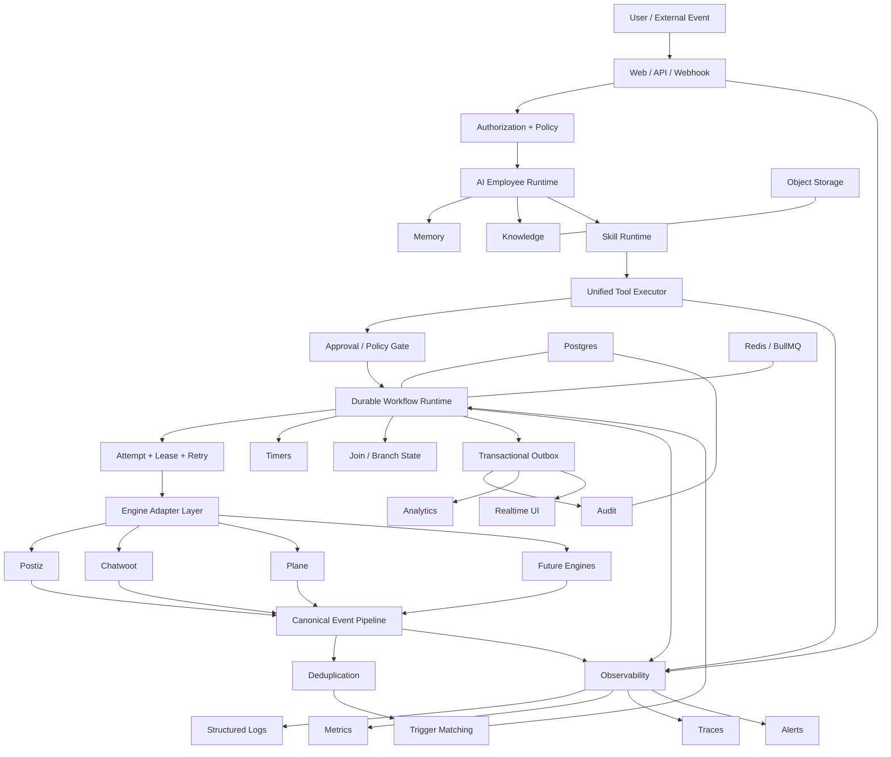
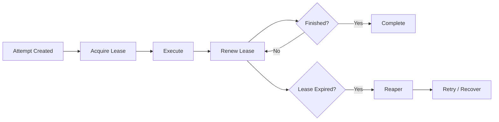
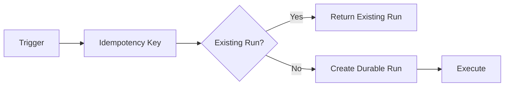
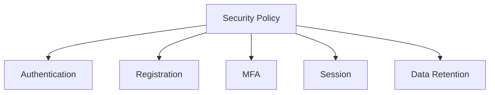
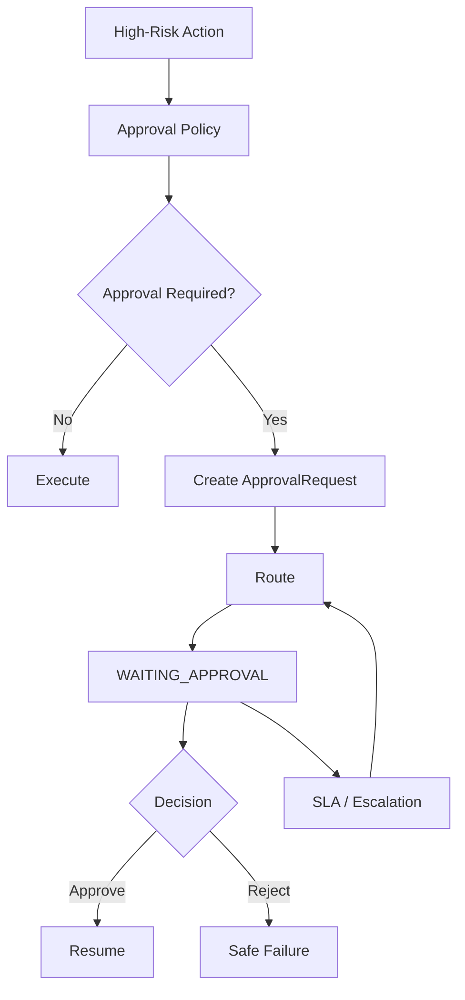
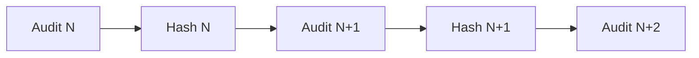
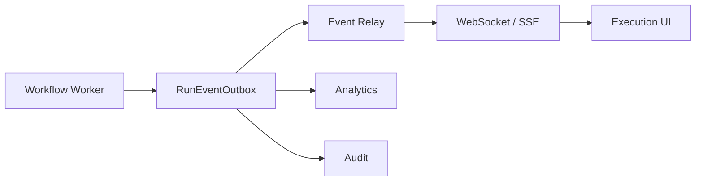
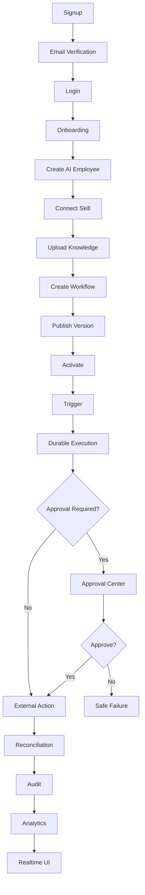
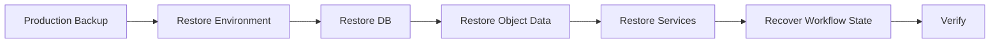

# Orlixa CTO Master Gap Closure Plan

**Document:** `orlixa-cto-master-gap-closure-plan.md`  
**Role:** CTO / Principal Architect / Production Engineering  
**Execution target:** Orlixa AI Employee Platform  
**Date:** 2026-08-11

---

## 0. Executive Directive

### This document is the implementation authority.

Use this plan to take Orlixa from its current implementation state to a production-ready platform spine.

### Architecture authority

Use `orlixa-cto-architecture-hardening-engine-freeze-plan.md` as the target architecture and engine sequencing authority.

### Implementation authority

Use this document as the actual execution plan.

If the two documents conflict:

1. Do not silently choose one.
2. Inspect the repository and current implementation.
3. Identify the conflict.
4. Explain the technical impact.
5. Choose the safer path only when repository evidence clearly resolves it.
6. Otherwise mark the item `BLOCKED / NEEDS DECISION`.

---

# 1. Core Strategic Decision

## Freeze NEW engine expansion.

Do not start new engine implementations until the Orlixa production spine is stable.

### Pause

```text
n8n
Metabase
Meilisearch
Novu full engine
Listmonk
Keycloak
new storage implementation
```

### Keep + Refactor/Harden

```text
Postiz
Chatwoot
Plane
Core AI Employee runtime
Core Workflow
```

### Special rules

- `Novu`: pause the full engine, but fix the core `NOTIFY` capability if required by existing workflows.
- `Storage`: perform technology evaluation only; do not introduce MinIO as a new production dependency.
- `Keycloak`: may move earlier only for a real enterprise customer requirement for SAML/OIDC/SSO.
- Existing production bugs and security issues are never frozen.

---

# 2. Why We Are Freezing Engines

Every new engine creates another implementation surface for:

```text
Authentication
Credentials
Secrets
Authorization
Tenant isolation
Skill execution
Retries
Rate limits
Webhooks
Event normalization
Deduplication
Audit
Observability
E2E
Deployment
Health checks
Reconciliation
Billing / usage
```

The target is:

```text
Shared Orlixa Platform Spine
          |
          +-- Postiz adapter
          +-- Chatwoot adapter
          +-- Plane adapter
          +-- n8n adapter
          +-- future adapters
```

Build the shared spine once.

---

# 3. Current Architecture Reality

The current implementation has a legacy graph-walk workflow path and a newer durable state-machine runtime.

The critical objective is:

```text
TWO IMPLEMENTATIONS
       |
       v
ONE PRODUCTION EXECUTION PATH
```

Target:

```text
Workflow Definition
      |
Immutable Workflow Version
      |
Durable Workflow Run
      |
Durable Step Run
      |
Durable Attempt
      |
Skill / Tool Executor
      |
External Side Effect
      |
Durable Result
```

The durable runtime must become the actual production path rather than remain a parallel scaffold.

---

# 4. Target Platform Spine



---

# 5. Execution Order

Execute in this order unless repository evidence requires a controlled deviation:

```text
WAVE 0  -> Freeze + Baseline
WAVE 1  -> Durable Execution
WAVE 2  -> Authorization + Security Policy
WAVE 3  -> Approval + Canonical Events
WAVE 4  -> Audit
WAVE 5  -> Observability + Realtime
WAVE 6  -> Existing Engine Refactor
WAVE 7  -> Browser E2E
WAVE 8  -> Chaos + DR + Retention
WAVE 9  -> Production Readiness Gate
WAVE 10 -> Engine Roadmap Unfreeze
```

---

# WAVE 0 — Freeze + Baseline

## Objective

Create a verified baseline before architectural migration.

### Tasks

- [ ] Inspect repository structure.
- [ ] Identify all workflow execution entry points.
- [ ] Identify all queue producers/consumers.
- [ ] Identify all webhook entry points.
- [ ] Identify all external side-effecting tools.
- [ ] Identify all authorization checks.
- [ ] Identify all audit writes.
- [ ] Identify all realtime execution updates.
- [ ] Identify current browser E2E coverage.
- [ ] Identify production deployment topology.
- [ ] Record current test results.
- [ ] Record current build results.
- [ ] Record current database migration state.

### Deliverable

Create:

```text
docs/status/cto-gap-closure-baseline.md
```

Record:

```text
Current architecture
Current execution paths
Current engines
Known gaps
Known regressions
Test baseline
Deployment baseline
```

### Gate

Do not begin architectural migration until the baseline is recorded.

---

# WAVE 1 — Durable Execution

## Priority: P0

This is the first major coding phase.

## Objective

Move production workflow execution from the legacy graph-walk path to the durable state-machine architecture.

## 1.1 Workflow Versioning

Required model:

```text
Workflow
   |
   +-- Draft
   +-- Published Version 1
   +-- Published Version 2
   +-- Active Version
             |
             v
        WorkflowRun
             |
             +-- workflowVersionId
```

Requirements:

- [ ] Published versions are immutable.
- [ ] Every run pins one version.
- [ ] Editing a workflow cannot modify an existing run.
- [ ] Replay uses the pinned version.
- [ ] Version lifecycle is deterministic.
- [ ] Deprecated versions remain readable for historical runs.

## 1.2 Node Registry

Use a registry instead of distributed node branching:

```text
NodeRegistry
 +-- TRIGGER
 +-- AI_EMPLOYEE_STEP
 +-- TOOL_ACTION
 +-- RETRIEVE
 +-- WAIT
 +-- CONDITION
 +-- NOTIFY
 +-- future nodes
```

Every node must expose a consistent execution contract.

## 1.3 Durable Workflow Run

Required:

```text
WorkflowRun
 +-- workflowId
 +-- workflowVersionId
 +-- status
 +-- current state
 +-- startedAt
 +-- completedAt
 +-- deadline
 +-- idempotencyKey
 +-- failure metadata
```

## 1.4 Durable Step Run

Required:

```text
WorkflowStepRun
 +-- workflowRunId
 +-- nodeId
 +-- status
 +-- input
 +-- output
 +-- attempt count
 +-- startedAt
 +-- completedAt
```

## 1.5 Durable Attempts

Every side-effecting step must support:

```text
WorkflowStepAttempt
 +-- stepRunId
 +-- attempt number
 +-- status
 +-- lease
 +-- startedAt
 +-- completedAt
 +-- error
 +-- external request metadata
```

## 1.6 Leases



## 1.7 Retry

Implement:

```text
retry policy
max attempts
backoff
jitter
retryable errors
non-retryable errors
dead-letter state
```

Never blindly retry external side effects.

## 1.8 Idempotency

Protect:

```text
manual workflow runs
webhook triggers
scheduled triggers
external event triggers
side-effecting tool actions
```

Target:



## 1.9 Crash Recovery

Test:

```text
Worker dies before execution
Worker dies during execution
Worker dies after external success
API restarts
Redis restarts
Deployment occurs
```

Expected:

```text
No lost workflow
No phantom success
No duplicate side effect
```

## 1.10 Approval State

Approval must be a durable workflow state:

```text
RUNNING
   |
WAITING_APPROVAL
   |
APPROVED
   |
RUNNING
```

or:

```text
WAITING_APPROVAL
   |
REJECTED
   |
FAILED / CANCELLED
```

## WAVE 1 Gate

Do not proceed until:

- [ ] Production execution path uses durable runtime.
- [ ] Existing workflow behavior remains compatible.
- [ ] Approval survives restart.
- [ ] Retry survives restart.
- [ ] Worker crash recovery passes.
- [ ] Duplicate triggers are idempotent.
- [ ] Side effects are protected against duplicate execution.
- [ ] Legacy engine is disabled or isolated behind a temporary migration flag.

---

# WAVE 2 — Authorization + Security Policy

## Priority: P0

## 2.1 Organizational Scope

Target:

```text
Company
  |
  +-- Department
  |       |
  |       +-- Team
  |              |
  |              +-- User
  |
  +-- AI Employees
```

Permissions must support:

```text
company
department
team
user
AI employee
workflow
knowledge
skill
approval
```

## 2.2 Central Authorization

Create a common authorization/policy layer.

Concept:

```text
authorize(
    actor,
    action,
    resource,
    context
)
```

Examples:

```text
canReadWorkflow()
canRunWorkflow()
canManageEmployee()
canReadKnowledge()
canConnectSkill()
canApprove()
canReadAudit()
```

Do not scatter role checks across controllers.

## 2.3 Execution-Time Authorization

Before a tool executes:

```text
Workflow
 |
Acting AI Employee
 |
Requested Skill
 |
Permission / Grant
 |
Connection Resolution
 |
Authorization
 |
Tool Execution
```

The employee's own connection must be preferred where required by the product contract.

## 2.4 Security Policy Enforcement

Stored policy must become executable.

Examples:

```text
mfaRequired
passwordMinLength
allowedEmailDomains
dataRetentionDays
```



A configuration value must not imply protection unless enforcement exists.

## 2.5 OAuth Hardening

Verify:

```text
state
session binding
nonce
one-time use
PKCE
redirect URI validation
scope validation
```

## 2.6 Security Fixes

- [ ] OAuth state binding.
- [ ] OAuth nonce.
- [ ] PKCE.
- [ ] HTTP DNS rebinding defense.
- [ ] HTTP response-size limits.
- [ ] Verified tenant identity before rate-limit bucket selection.
- [ ] High-risk auto-approve restrictions.
- [ ] Secret redaction.
- [ ] Production secret storage.
- [ ] Encryption-key validation.

## WAVE 2 Gate

- [ ] Department/team permissions pass.
- [ ] Cross-scope access is denied.
- [ ] Execution-time skill authorization passes.
- [ ] Security policy is enforced.
- [ ] OAuth security tests pass.
- [ ] No known critical/high security issue remains open.

---

# WAVE 3 — Approval + Canonical Events

## Priority: P0/P1

## 3.1 Approval Routing

Target:

```text
ApprovalRequest
 +-- assignedToUserId?
 +-- assignedToTeamId?
 +-- assignedToDepartmentId?
 +-- fallbackRole
 +-- SLA
 +-- escalation chain
```



Never silently bypass approval because an approver is unavailable.

## 3.2 Canonical Event Pipeline

Every external event:

```text
Webhook
 |
Signature Verification
 |
RawEvent
 |
Deduplication
 |
CanonicalEvent
 |
Tenant Resolution
 |
Trigger Matching
 |
Durable Workflow Run
```

## 3.3 Event Contract

Canonical events must provide enough information for:

```text
tenant
provider
event type
resource
resource ID
event ID
timestamp
payload reference
deduplication key
```

## 3.4 Chatwoot

KEEP + REFACTOR:

```text
HMAC
 |
Raw Event
 |
Dedup
 |
Local State
 |
Canonical Event
 |
Workflow Trigger
 |
Audit
```

## 3.5 Plane

KEEP + REFACTOR:

```text
Webhook
 |
Plane signature verification
 |
Dedup
 |
Canonical Event
 |
Workflow Trigger
 |
Audit
```

Do not assume Plane uses the same signing scheme as Chatwoot.

## 3.6 Postiz

KEEP + REFACTOR:

```text
Publish Intent
 |
Durable Run
 |
Local Publish Tracking
 |
External Publish
 |
Provider ID
 |
Reconciliation
 |
Audit
```

Fix:

- [ ] `publish_now` tracking.
- [ ] publish idempotency.
- [ ] reconciliation.
- [ ] provider failure recovery.
- [ ] suppression/consent enforcement.
- [ ] audit correlation.

## WAVE 3 Gate

- [ ] Chatwoot inbound events use canonical event pipeline.
- [ ] Plane inbound events are implemented and verified.
- [ ] Postiz publish actions are tracked.
- [ ] Duplicate external events are safe.
- [ ] Approval routing works for person/team/department.
- [ ] Event-to-workflow transitions are durable.

---

# WAVE 4 — Audit

## Priority: P0/P1

## 4.1 Audit Architecture

Target:

```text
AuditEvent
   |
append-only
   |
hash chained
   |
retained
   |
queryable
   |
exportable
```

## 4.2 Audit Event Shape

At minimum:

```text
eventId
timestamp
companyId
actorId
actorType
action
resourceType
resourceId
employeeId?
workflowId?
workflowRunId?
ip?
userAgent?
correlationId
previousHash
eventHash
metadata
```

Sensitive old/new values must be safely redacted or protected.

## 4.3 Critical Coverage

Audit:

```text
Authentication
User changes
Role changes
Department changes
Employee lifecycle
Skill connection/disconnection
OAuth lifecycle
Workflow lifecycle
Workflow execution
Approval
Permission changes
Knowledge changes
HR sensitive changes
Marketing publish
Support actions
Billing
Retention deletion
Admin actions
```

## 4.4 Tamper Evidence



Any unexpected chain break must be detectable.

## 4.5 Audit Retention

Define:

```text
normal retention
audit retention
legal hold
archive
deletion
export
```

Never delete an event under legal hold.

## WAVE 4 Gate

- [ ] Critical actions audited.
- [ ] Audit chain validated.
- [ ] Audit query API works.
- [ ] Export works.
- [ ] Retention policy works.
- [ ] Legal hold is respected.
- [ ] Sensitive values are protected.

---

# WAVE 5 — Observability + Realtime

## Priority: P1

## 5.1 Execution Context

Carry:

```text
requestId
traceId
companyId
userId
employeeId
workflowId
workflowVersionId
workflowRunId
stepRunId
attemptId
skillExecutionId
externalRequestId
```

## 5.2 Structured Logs

Example:

```json
{
  "level": "error",
  "companyId": "company_123",
  "workflowRunId": "run_123",
  "stepRunId": "step_4",
  "attemptId": "attempt_2",
  "skill": "postiz.publish",
  "errorCode": "PROVIDER_TIMEOUT"
}
```

## 5.3 Metrics

Minimum:

```text
workflow_runs_total
workflow_success_total
workflow_failure_total
workflow_retry_total
workflow_duration_ms
step_duration_ms
queue_depth
queue_lag
approval_wait_duration
skill_failure_total
provider_latency_ms
oauth_refresh_failure_total
llm_tokens_total
llm_cost_total
outbox_backlog
audit_relay_lag
```

## 5.4 Alerts

```text
worker unavailable
queue backlog
workflow failure spike
external provider failure spike
OAuth failure spike
database errors
Redis errors
outbox lag
audit relay lag
LLM failure spike
```

## 5.5 Realtime



## WAVE 5 Gate

- [ ] Correlation chain works end-to-end.
- [ ] Logs searchable by workflowRunId.
- [ ] Workflow/queue/provider metrics exist.
- [ ] Critical alerts exist.
- [ ] Realtime execution updates work.
- [ ] Outbox lag is observable.

---

# WAVE 6 — Existing Engine Refactor

## Priority: P1

## Postiz

KEEP.

Refactor:

```text
Postiz Adapter
 |
ToolExecutor
 |
Authorization
 |
Approval
 |
Durable Execution
 |
Postiz
 |
Reconciliation
 |
Audit
```

Tasks:

- [ ] publish tracking.
- [ ] idempotent publishing.
- [ ] reconciliation.
- [ ] consent/suppression enforcement.
- [ ] provider failure handling.
- [ ] tracing.
- [ ] E2E.

## Chatwoot

KEEP.

Refactor:

```text
Chatwoot Adapter
 |
Canonical Event
 |
Durable Workflow
 |
ToolExecutor
 |
Chatwoot
```

Tasks:

- [ ] canonical inbound events.
- [ ] dedup.
- [ ] workflow trigger.
- [ ] tenant scope.
- [ ] audit.
- [ ] observability.
- [ ] E2E.

## Plane

KEEP.

Refactor:

```text
Plane Adapter
 |
Webhook verification
 |
Canonical Event
 |
Durable Workflow
 |
ToolExecutor
 |
Plane
```

Tasks:

- [ ] inbound webhook.
- [ ] signature verification.
- [ ] dedup.
- [ ] canonical events.
- [ ] workflow triggers.
- [ ] audit.
- [ ] observability.
- [ ] E2E.

---

# WAVE 7 — Browser E2E

## Priority: P0/P1

Backend E2E does not replace browser E2E.

## 7.1 Golden Enterprise Journey



## 7.2 Security Journey

```text
Marketing Admin -> Marketing = ALLOW
Marketing Admin -> HR = DENY

HR Admin -> HR = ALLOW
HR Admin -> Marketing = DENY

Member -> high-risk approval = DENY
Disabled user -> workflow execution = DENY
```

## 7.3 Failure Journey

```text
Workflow
 |
Worker crash
 |
Recovery
 |
Resume
 |
Exactly one external side effect
 |
Audit
```

## 7.4 Required Browser Tests

- [ ] Signup.
- [ ] Login.
- [ ] Onboarding.
- [ ] AI Employee creation.
- [ ] Skill connection.
- [ ] Knowledge upload.
- [ ] Workflow creation.
- [ ] Publish.
- [ ] Activate.
- [ ] Trigger.
- [ ] Approval.
- [ ] Reject.
- [ ] Resume.
- [ ] External action.
- [ ] Audit.
- [Analytics.
- [ ] Permission denial.
- [ ] Disabled-user denial.
- [ ] Engine-specific golden paths.

## WAVE 7 Gate

Require:

```text
Playwright executed
+
real environment
+
critical flows passed
```

Record evidence. Do not equate "harness exists" with "E2E passed."

---

# WAVE 8 — Chaos + DR + Retention

## Priority: P0/P1

## 8.1 Chaos Tests

Test:

```text
worker crash
API restart
Redis restart
DB connection loss
duplicate queue job
duplicate webhook
external API timeout
external API 500
OAuth expiry
LLM timeout
approval timeout
deployment during workflow
lease expiry
reaper recovery
```

Expected invariants:

```text
No lost run
No duplicate side effect
No tenant leak
No approval bypass
No phantom success
No secret leak
```

## 8.2 Backup / Restore

Define:

```text
RPO
RTO
```

Then:



A backup is not operationally proven until restoration is tested.

## 8.3 Data Retention

Retention must cover:

```text
workflow runs
step attempts
outbox
audit
knowledge
memory
HR data
attachments
provider snapshots
```

Support:

```text
normal deletion
legal hold
archive
manual deletion
scheduled deletion
audit evidence
```

## WAVE 8 Gate

- [ ] Backup restore tested.
- [ ] RPO defined.
- [ ] RTO defined.
- [ ] Workflow recovery tested.
- [ ] Retention tested.
- [ ] Legal hold tested.
- [ ] Object storage recovery tested.

---

# WAVE 9 — Production Readiness Gate

## Execution

- [ ] All production workflow runs use durable runtime.
- [ ] Immutable workflow version pinning.
- [ ] Durable attempts.
- [ ] Durable leases.
- [ ] Retry.
- [ ] Timeout.
- [ ] Recovery.
- [ ] Idempotency.
- [ ] No duplicate side effects.
- [ ] Approval survives restart.

## Authorization

- [ ] Tenant isolation.
- [ ] Department isolation.
- [ ] Team isolation.
- [ ] Employee scope.
- [ ] Workflow scope.
- [ ] Knowledge scope.
- [ ] Skill scope.
- [ ] Approval scope.

## Events

- [ ] Signature verification.
- [ ] Raw event.
- [ ] Dedup.
- [ ] Canonical event.
- [ ] Tenant resolution.
- [ ] Workflow trigger.
- [ ] Durable run.

## Audit

- [ ] Critical actions audited.
- [ ] Approval audited.
- [ ] Permission changes audited.
- [ ] Connector lifecycle audited.
- [ ] Execution audited.
- [ ] Audit chain validated.
- [ ] Retention enforced.

## Observability

- [ ] Structured logs.
- [ ] Metrics.
- [ ] Traces.
- [ ] Alerts.
- [ ] Queue monitoring.
- [ ] Provider monitoring.
- [ ] OAuth monitoring.
- [ ] Outbox monitoring.
- [ ] Realtime execution updates.

## E2E

- [ ] Browser golden journey.
- [ ] API golden journey.
- [ ] Approval journey.
- [ ] Failure journey.
- [ ] Permission journey.
- [ ] Engine journeys.
- [ ] Regression suite.

## Operations

- [ ] Backup.
- [ ] Restore.
- [ ] RPO.
- [ ] RTO.
- [ ] Retention.
- [ ] Legal hold.
- [ ] Production secrets.
- [ ] Worker deployment.
- [ ] Monitoring.
- [ ] Alerting.

---

# WAVE 10 — Engine Roadmap Unfreeze

Only after Wave 9 passes.

## Stage 1

```text
Postiz
Chatwoot
Plane
```

Finish production hardening.

## Stage 2

```text
NOTIFY core
```

Then optionally:

```text
Novu adapter
```

## Stage 3

Only if requirements prove native search insufficient:

```text
Meilisearch
```

## Stage 4

Only if analytics requirements justify it:

```text
Metabase
```

## Stage 5

Only if customers require external automation delegation:

```text
n8n
```

## Stage 6

Only after multi-tenant provisioning and operations are proven:

```text
Listmonk
```

## Stage 7

Only after technology bake-off and DR validation:

```text
approved storage engine
```

## Stage 8

Only when commercially required:

```text
Keycloak / approved OIDC-SAML solution
```

---

# 11. Engine Adapter Contract

Every future engine must implement a shared contract:

```text
EngineAdapter
 +-- connect()
 +-- disconnect()
 +-- healthCheck()
 +-- refresh()
 +-- execute()
 +-- reconcile()
 +-- handleWebhook()
 +-- normalizeEvent()
 +-- getCapabilities()
```

The engine must not independently implement:

```text
tenant authorization
audit system
workflow engine
approval engine
secret system
event bus
observability system
```

unless a documented exception is approved.

---

# 12. Unified Tool Execution Contract

All external actions should converge on:

```text
ToolExecutor
    |
Validate Input
    |
Authorize
    |
Resolve Connection
    |
Approval Check
    |
Idempotency Check
    |
Provider Call
    |
Persist Result
    |
Audit
    |
Metrics / Trace
```

---

# 13. Unified Connection Contract

```text
Connection
 +-- companyId
 +-- employeeId?
 +-- provider
 +-- encrypted credentials
 +-- scopes
 +-- status
 +-- lastHealthCheck
 +-- lastRefresh
 +-- metadata
```

Health states:

```text
CONNECTED
DEGRADED
EXPIRED
REVOKED
ERROR
DISCONNECTED
```

---

# 14. Unified Event Contract

All providers:

```text
Provider Event
      |
   RawEvent
      |
CanonicalEvent
```

Canonical fields:

```text
eventId
provider
eventType
tenantId
resourceType
resourceId
occurredAt
deduplicationKey
payload
```

---

# 15. Unified Audit Contract

All important actions should go through:

```text
AuditService.record(...)
```

Do not let feature modules manipulate audit tables directly.

---

# 16. Unified Authorization Contract

All sensitive actions should go through:

```text
AuthorizationService.authorize(...)
```

Do not scatter role checks.

---

# 17. Unified Billing / Entitlement Contract

Target:

```text
Plan
 |
Entitlements
 |
Usage
 |
Enforcement
```

Potential entitlements:

```text
ai_employee_count
workflow_count
workflow_runs
token_budget
knowledge_storage
memory_storage
integration_count
seats
approval_count
API usage
```

---

# 18. Known Security Hardening Checklist

- [ ] OAuth state/session binding.
- [ ] OAuth nonce.
- [ ] OAuth PKCE.
- [ ] Redirect allowlisting.
- [ ] Scope validation.
- [ ] HTTP DNS-rebinding protection.
- [ ] HTTP response-size cap.
- [ ] Verified tenant identity before rate limiting.
- [ ] High-risk auto-approve restrictions.
- [ ] Secret redaction.
- [ ] Secret encryption.
- [ ] Production secret manager.
- [ ] Encryption-key validation.
- [ ] Audit completeness.
- [ ] Data retention enforcement.

---

# 19. What Must Never Happen

```text
No two permanent workflow engines.
No two tenant models.
No two authorization systems.
No two secret stores.
No two canonical event systems.
No engine-specific approval bypass.
No LLM output used as security authority.
No arbitrary company credentials used by an AI Employee.
No mock provider behavior represented as production verification.
No browser E2E claimed without execution.
No DR claimed without restore rehearsal.
No new engine before platform gates.
No MinIO introduced as an unverified production dependency.
```

---

# 20. Claude Code Execution Protocol

For every work item:

```text
DISCOVER
   |
PLAN
   |
IMPLEMENT
   |
TEST
   |
VERIFY
   |
DOCUMENT
```

## Discover

Inspect:

```text
routes
services
workers
queues
database schema
migrations
frontend
tests
deployment
```

## Plan

State:

```text
current behavior
target behavior
files/modules affected
migration strategy
rollback strategy
tests
```

## Implement

Make the smallest safe change satisfying the architecture contract.

## Test

Run applicable:

```text
unit tests
integration tests
API E2E
browser E2E
typecheck
lint
build
migration verification
```

## Verify

Prove:

```text
expected behavior
failure behavior
security behavior
recovery behavior
```

## Document

Record:

```text
what changed
why
tests
known limitations
remaining blockers
```

---

# 21. Migration Safety Rules

For risky migrations, do not replace working infrastructure in one unverified jump.

Use:

```text
feature flag
shadow mode
controlled rollout
per-company rollout
metrics
rollback
```

Example:

```text
WORKFLOW_ENGINE_MODE

legacy
durable
```

Migration:

```text
legacy
  |
internal test tenant
  |
staging
  |
one production tenant
  |
small percentage
  |
all tenants
  |
remove legacy
```

Do not leave the dual-engine architecture permanent.

---

# 22. Definition of Production Ready

Orlixa is not production-ready merely because:

```text
build passes
tests pass
UI looks complete
```

Production readiness requires:

```text
Correctness
+
Security
+
Durability
+
Authorization
+
Auditability
+
Observability
+
Recoverability
+
E2E proof
```

---

# 23. Definition of Enterprise Ready

Enterprise readiness additionally requires:

```text
Department/team authorization
Approval routing
Tamper-evident audit
Retention/legal hold
SSO when commercially required
Operational monitoring
DR/RPO/RTO
Formal security controls
Reliable external side effects
Evidence-backed E2E
```

Do not market a capability as fully implemented until its runtime path is actually proven.

---

# 24. Final Architecture Outcome

Before:

```text
Orlixa
 +-- AI Employees
 +-- Workflows
 +-- Postiz
 +-- Chatwoot
 +-- Plane
 +-- many planned engines
```

After:

```text
Orlixa
 |
 +-- Durable AI Employee Runtime
 |
 +-- Authorization Runtime
 |
 +-- Approval Runtime
 |
 +-- Canonical Event Runtime
 |
 +-- Audit Runtime
 |
 +-- Observability Runtime
 |
 +-- E2E / Recovery Verification
 |
 +-- Engine Adapter Layer
       +-- Postiz
       +-- Chatwoot
       +-- Plane
       +-- future n8n
       +-- future analytics
       +-- future search
       +-- future engines
```

---

# 25. CTO Final Decision

## Execute first

```text
1. Baseline
2. Durable execution
3. Authorization
4. Security policy
5. Approval
6. Canonical events
7. Audit
8. Observability
9. Existing engine refactor
10. Browser E2E
11. Chaos / DR
12. Production gate
```

## Keep

```text
Postiz
Chatwoot
Plane
```

## Pause

```text
n8n
Metabase
Meilisearch
Novu full engine
Listmonk
Keycloak
new storage implementation
```

## Do not introduce

```text
MinIO as a new production dependency
```

## Then

```text
PRODUCTION SPINE VERIFIED
        |
ENGINE ROADMAP UNFROZEN
        |
CUSTOMER-DRIVEN ENGINE PRIORITIZATION
```

---

# 26. Final Success Statement

The implementation is complete only when Orlixa can reliably support:

```text
Company
  |
AI Employee
  |
Connected Skill
  |
Knowledge / Memory
  |
Workflow Version
  |
Durable Workflow Run
  |
Authorization
  |
Approval if required
  |
Tool Execution
  |
Safe retry / duplicate-side-effect protection
  |
External Provider
  |
Canonical Event / Reconciliation
  |
Audit
  |
Analytics
  |
Realtime UI
  |
Recovery after infrastructure failure
  |
Browser + API E2E evidence
```

That is the production spine.

**Do not optimize for the number of engines. Optimize for the reliability of every AI Employee that runs on Orlixa.**
