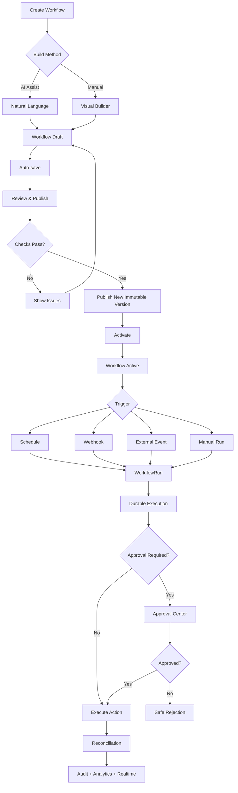
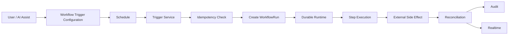
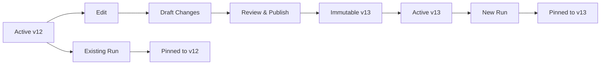
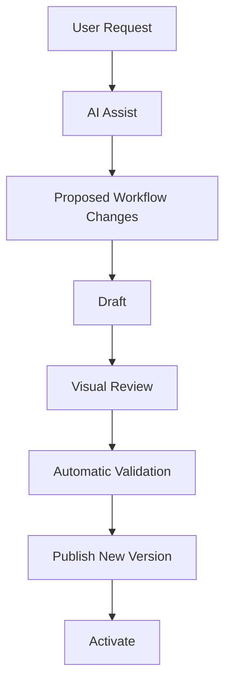

# Orlixa — Simplified AI-First Workflow UX & Frontend CTO Implementation Plan

**File:** `orlixa-workflow-ux-simplification-cto-plan.md`  
**Product:** Orlixa AI Employee Platform  
**Role:** CTO / Principal Architect / Enterprise SaaS Product Architect  
**Status:** Frontend implementation authority for Workflow UX simplification  
**Scope:** Workflow creation, AI Assist, manual builder, scheduling, publishing, execution visibility and lifecycle UX  
**Architecture dependencies:**
- `orlixa-cto-architecture-hardening-engine-freeze-plan.md`
- `orlixa-cto-master-gap-closure-plan.md`
- `orlixa-frontend-cto-implementation-plan.md`

---

# 0. Executive CTO Decision

Orlixa should **not** make customers operate the internal workflow machinery.

The backend must remain enterprise-grade and retain:

```text
Draft
Validation
Authorization
Approval
Immutable Versions
Durable Execution
Retries
Idempotency
Timers
Audit
Observability
Realtime
Recovery
```

But the **customer-facing workflow process must be dramatically simpler**.

Target experience:

```text
DESCRIBE
   ↓
REVIEW
   ↓
PUBLISH
   ↓
RUN
```

For manual users:

```text
CREATE
   ↓
EDIT
   ↓
REVIEW & PUBLISH
   ↓
RUN
```

Do not force users through:

```text
Create → Generate → Accept → Save Draft → Validate → Publish → Activate → Configure Schedule → Run
```

as separate mandatory screens.

---

# 1. Why This Simplification Is Required

Orlixa is an **AI Employee Platform**, not a traditional node-first automation builder.

Primary customer intent:

> "Tell my AI Employee what I want done."

Therefore **AI Assist** should be the easiest workflow creation method.

The visual builder remains important for:

```text
Review
Editing
Fine-grained control
Debugging
Complex workflows
Enterprise governance
```

The customer should not need to understand:

```text
WorkflowVersion
WorkflowRun
StepRun
Attempt
Lease
Outbox
Canonical Event
Idempotency
Authorization policy
```

Those are platform capabilities, not workflow-creation steps.

---

# 2. Architecture Principle

## UX simplicity must NOT reduce backend safety.

```text
                    SIMPLE UX
                       │
                       ▼
              Orlixa Workflow API
                       │
        ┌──────────────┼──────────────┐
        │              │              │
   Authorization   Validation     Versioning
        │              │              │
        └──────────────┼──────────────┘
                       ▼
               Durable Workflow
                       │
        ┌──────────────┼──────────────┐
        │              │              │
     Approval       Idempotency     Retry
        │              │              │
        └──────────────┼──────────────┘
                       ▼
                External Action
                       │
              Reconciliation
                       │
             Audit + Observability
                       │
                   Realtime UI
```

The backend architecture remains authoritative.

---

# 3. Current vs Target Workflow Experience

## Overly procedural model

```text
Create Workflow
      ↓
AI Generate
      ↓
Accept AI Draft
      ↓
Save Draft
      ↓
Validate
      ↓
Open Builder
      ↓
Review
      ↓
Publish
      ↓
Activate
      ↓
Create Schedule
      ↓
Run
```

## Target Orlixa model

```text
                 CREATE WORKFLOW
                       │
             ┌─────────┴─────────┐
             │                   │
          ✨ AI Assist       🛠 Manual
             │                   │
             └─────────┬─────────┘
                       ↓
                WORKFLOW EDITOR
                       ↓
                 Auto-save Draft
                       ↓
               REVIEW & PUBLISH
                       ↓
                ● ACTIVE / READY
                       ↓
              Schedule / Event /
              Webhook / Manual
                       ↓
                     RUN
```

---

# 4. Core UX Rule

## Internal state ≠ user-facing step

Backend may execute:

```text
Draft
→ Validate
→ Authorize
→ Publish Version
→ Activate
→ Schedule
→ Create WorkflowRun
→ Durable Execution
```

Frontend can present this as:

```text
Review & Publish
```

The system performs the required internal checks automatically.

---

# 5. Final Workflow Creation Experience

Entry point:

```text
Workflows
    |
    +-- [Create Workflow]
```

Create screen:

```text
Create Workflow

How do you want to build it?

┌─────────────────────────────────────┐
│ ✨ Build with AI                    │
│                                     │
│ Describe what you want to automate.│
│                                     │
│ "Every Monday check new leads..."   │
│                                     │
│ [Generate Workflow]                 │
└─────────────────────────────────────┘

┌─────────────────────────────────────┐
│ 🛠 Start from Scratch               │
│                                     │
│ Build a workflow visually.          │
│                                     │
│ [Open Builder]                      │
└─────────────────────────────────────┘
```

---

# 6. AI Assist — Primary Workflow Creation Method

AI Assist generates a **workflow draft**, not an active production workflow.

Example:

```text
Every Monday at 9 AM, check new leads,
qualify them, send qualified leads to SalesAI,
and ask the Sales Manager for approval before
sending the final outreach email.
```

Generated draft:

```text
Workflow:
Weekly Lead Qualification

Trigger:
Every Monday · 9:00 AM · Asia/Kolkata

AI Employee:
SalesAI

Steps:
1. Retrieve new leads
2. Qualify leads
3. Condition: qualified?
4. Send qualified leads to SalesAI
5. Request Sales Manager approval
6. Send outreach email
```

Then open the editor immediately.

Do **not** require a separate `Accept AI Workflow` screen.

---

# 7. AI Assist → Editor Flow

Correct:

```text
User Prompt
    ↓
AI Assist
    ↓
Generated Workflow Draft
    ↓
Workflow Editor
    ↓
Human Review
```

Incorrect:

```text
User Prompt
    ↓
AI Assist
    ↓
Accept
    ↓
Separate Workflow Page
    ↓
Open Editor
```

The generated draft should already be editable.

---

# 8. AI Assist Safety Boundary

AI Assist must never directly modify an active production workflow.

Correct:

```text
User prompt
   ↓
AI Assist
   ↓
Draft / Proposed Changes
   ↓
Validation
   ↓
Human Review
   ↓
Publish New Version
   ↓
Activate
```

Existing workflow example:

```text
v12 ACTIVE
    ↓
User asks AI Assist:
"Add manager approval."
    ↓
AI proposes changes
    ↓
Diff
    ↓
Draft v13
    ↓
Review
    ↓
Publish
```

---

# 9. AI Assist Change Review

When modifying an existing workflow:

```text
Proposed Changes

Workflow:
Product Launch

Current:
v12

Proposed:
v13

Changes:

+ Add Approval node
+ Approver: Marketing Manager
+ Risk level: HIGH

No other changes detected.

[Discard]
[Review Workflow]
```

Do not force users to understand internal database identifiers.

---

# 10. Workflow Editor

The Workflow Editor remains a core product surface, but it is a **control surface**, not a mandatory engineering ceremony.

Recommended structure:

```text
┌──────────────────────────────────────────────────────────────┐
│ Weekly Lead Qualification          DRAFT                     │
│                                                              │
│ Saved just now                       [Review & Publish]       │
├──────────────┬──────────────────────────────┬────────────────┤
│ Add Step     │            CANVAS            │ Inspector      │
│              │                              │                │
│ Trigger      │        ┌────────────┐        │ Configuration  │
│ AI Employee  │        │  Schedule  │        │                │
│ Action       │        └─────┬──────┘        │                │
│ Condition    │              │               │                │
│ Approval     │        ┌─────▼──────┐        │                │
│ Wait         │        │ SalesAI    │        │                │
│ Notify       │        └─────┬──────┘        │                │
│              │              │               │                │
│ Advanced     │        ┌─────▼──────┐        │                │
│              │        │ Condition  │        │                │
│              │        └────────────┘        │                │
└──────────────┴──────────────────────────────┴────────────────┘
```

---

# 11. Auto-save

Do not make repeated `Save Draft` actions mandatory.

Use:

```text
Auto-save
```

Status:

```text
Saving...
Saved just now
Offline changes pending
Save failed — Retry
```

A manual Save option may exist, but normal editing should not depend on it.

---

# 12. Remove Standalone Validate Step

Do **not** make users perform a separate mandatory:

```text
[Validate]
```

Validation should be part of the Review & Publish operation.

When the user clicks:

```text
[Review & Publish]
```

the platform checks automatically:

```text
✓ Trigger
✓ Graph
✓ Required fields
✓ AI Employee
✓ Skill
✓ Connection
✓ Permissions
✓ Approval policy
✓ Schedule
✓ Node configuration
```

If errors exist:

```text
Cannot publish

3 issues found

✕ Gmail connection missing
✕ Approval has no approver
⚠ Timezone needs confirmation

[Fix Issues]
```

---

# 13. Publish Review

Show one review surface:

```text
Review Workflow

Workflow:
Weekly Lead Qualification

Trigger:
Every Monday · 9 AM · IST

AI Employee:
SalesAI

Skills:
Gmail
CRM

Approval:
Sales Manager

Steps:
6

Checks:
✓ Workflow structure
✓ Permissions
✓ Connections
✓ Approval configuration
✓ Schedule
✓ Required inputs

Version:
New version will be published

[Cancel]
[Publish & Activate]
```

---

# 14. Combine Publish + Activate for Normal Users

Backend should retain separate lifecycle states, but normal frontend UX should use:

```text
[Publish & Activate]
```

Internally:

```text
Validate
    ↓
Create Immutable Version
    ↓
Publish
    ↓
Activate
```

Advanced users may be allowed to publish inactive, but that should not be the default flow.

---

# 15. Workflow Status Simplification

Backend can retain detailed states:

```text
DRAFT
VALIDATING
PUBLISHED
ACTIVE
PAUSED
ARCHIVED
```

Customer-facing list should primarily show:

```text
Draft
Active
Paused
Archived
```

Transient states such as `VALIDATING` can appear as progress indicators.

---

# 16. Versioning Must Stay

Versioning should **not** be removed.

Every run must remain pinned to the immutable workflow version that created it.

User sees:

```text
Candidate Screening
v12 · Active
```

User clicks:

```text
[Edit]
```

System creates draft changes.

After editing:

```text
[Publish Changes]
```

Backend automatically creates the next immutable version.

The user should not manually manage version IDs.

---

# 17. Version History

Keep an accessible history panel:

```text
Version History

v13   Draft
v12   Active
v11   Archived
v10   Archived
```

Actions:

```text
View
Compare
Restore as Draft
```

Advanced/admin actions may include activation/archive where permitted.

Historical runs must remain linked to their original version.

---

# 18. Scheduling Simplification

Scheduling belongs **inside workflow trigger configuration**.

Do not require:

```text
Create Workflow
 ↓
Go to Schedules
 ↓
Create Schedule
 ↓
Select Workflow
 ↓
Save
```

Instead:

```text
Workflow Trigger

○ Manual
○ Schedule
○ Webhook
○ External Event
```

For Schedule:

```text
Frequency:
Every Week

Day:
Monday

Time:
09:00 AM

Timezone:
Asia/Kolkata

Next Run:
Monday · 09:00 AM
```

---

# 19. AI Assist Scheduling

AI Assist should understand scheduling naturally.

User:

```text
Every weekday at 10 AM,
check new leads and send qualified
leads to SalesAI.
```

Generated trigger:

```text
Schedule

Every weekday
10:00 AM
Asia/Kolkata
```

The user can edit it inside the Workflow Editor.

---

# 20. Scheduling Architecture

Scheduling creates a **new WorkflowRun**. It does not execute workflow logic itself.

```text
Schedule
   ↓
Trigger Service
   ↓
Idempotency Check
   ↓
Create WorkflowRun
   ↓
Durable Runtime
   ↓
Execute
```

Important invariant:

```text
Scheduler ≠ Workflow Engine
```

The scheduler only creates the run. The durable runtime executes it.

---

# 21. Schedule vs Durable Timer

These are different concepts.

## Workflow Schedule

Creates a new run:

```text
Every Monday at 9 AM
        ↓
New WorkflowRun
```

## Durable Timer

Resumes an existing run:

```text
Send email
   ↓
WAIT 2 DAYS
   ↓
Durable Timer
   ↓
Resume same WorkflowRun
```

Do not implement durable WAIT using recurring schedule jobs.

---

# 22. Schedule Management

A separate Schedules view is useful for **operations**, not workflow creation.

Recommended:

```text
Automation
├── Workflows
├── Runs
└── Schedules
```

Schedules page:

```text
Workflow
Schedule
Timezone
Next Run
Last Run
Status
```

Actions:

```text
Pause
Resume
Edit
View Workflow
View Runs
```

This is an operational view, not an additional creation ceremony.

---

# 23. Pause Schedule vs Cancel Run

These must remain separate.

Example:

```text
Schedule
    ↓
WorkflowRun #821
    ↓
RUNNING
```

User clicks `Pause Schedule`:

```text
Schedule → PAUSED
WorkflowRun #821 → continues
```

If the user wants to stop the current execution:

```text
Cancel Run
```

That should affect the current WorkflowRun, not future schedule configuration unless explicitly requested.

---

# 24. Run Now

Every active workflow should expose:

```text
[Run Now]
```

The action must:

```text
authorize
 ↓
create idempotent WorkflowRun
 ↓
execute through durable runtime
```

It must not bypass:

```text
authorization
approval
audit
idempotency
```

---

# 25. Workflow Run UI

Create a first-class `Runs` surface.

List:

```text
Workflow
Version
AI Employee
Trigger
Status
Started
Duration
Approval
```

Example:

```text
Candidate Screening
v12
RecruitAI
Schedule
● Running
09:21
01:24
—
```

---

# 26. Run Detail

```text
Candidate Screening
v12
Run #8219

● RUNNING

Trigger
 ✓ Received

AI Employee
 ✓ RecruitAI

Knowledge Retrieval
 ✓ 14 documents

Condition
 ✓ Score > 70

Approval
 ⏳ Waiting for Sarah

Send Email
 ○ Pending
```

The user should see execution truth in realtime.

---

# 27. Realtime Execution

Target:

```text
Worker
  ↓
Transactional Outbox
  ↓
Event Relay
  ↓
WebSocket / SSE
  ↓
Workflow Run UI
```

Example:

```text
Step 1 ✓
Step 2 ✓
Step 3 ⏳
Approval Required
```

After approval:

```text
Approval Granted ✓
Step 3 ✓
Step 4 ⏳
```

No aggressive polling should be required as the final architecture.

---

# 28. Failure UX

Never show only:

```text
Workflow Failed
```

Show:

```text
Workflow Failed

Step:
Send Customer Email

Reason:
Gmail OAuth token expired

Impact:
Email was NOT sent

Recommended action:
Reconnect Gmail

[Reconnect Gmail]
[Retry Step]
[View Run]
```

Retry must explain:

```text
What will retry?
What already succeeded?
Could a side effect occur?
Why is retry safe?
```

---

# 29. Approval UX

Approval remains a first-class control because it is part of the backend safety spine.

Workflow view:

```text
Approval Required

Action:
Publish LinkedIn Campaign

Approver:
Marketing Manager

Risk:
HIGH

[View Details]
```

Approval Center:

```text
My Approvals
Team Approvals
Department Approvals
Escalated
Expiring Soon
Completed
Rejected
```

The frontend must never bypass a backend-required approval.

---

# 30. Permission-Aware Workflow Builder

The builder must consume backend effective permissions.

Example:

```text
Marketing Admin

Can:
✓ Edit Marketing workflows
✓ Use Marketing skills
✓ Use Marketing knowledge
✓ Request Marketing approvals

Cannot:
✕ Use Finance skill
✕ Read HR knowledge
✕ Publish Finance workflow
```

Disabled actions should explain why.

Frontend permission checks are UX only. Backend remains authoritative.

---

# 31. Skill / Connection Selection

When configuring an action:

```text
Send Email

Skill:
Gmail

Connection:
marketing@company.com

Scope:
Send

Health:
● Healthy
```

If unhealthy:

```text
Connection expired

[Reconnect]
```

Backend must still re-authorize at execution time.

---

# 32. Workflow Node Library Simplification

Default node library:

```text
Trigger
AI Employee
Action
Condition
Approval
Wait
Notify
End
```

Advanced:

```text
Loop
Parallel
Transform
Retrieve
Webhook
Advanced
```

The default experience should be understandable to a non-technical business operator.

---

# 33. AI Assist + Manual Builder Relationship

They are not competing workflow systems.

They are two creation methods for the same canonical workflow definition.

```text
                    WORKFLOW
                       │
             ┌─────────┴─────────┐
             │                   │
          AI Assist           Manual
             │                   │
             └─────────┬─────────┘
                       ↓
                Same Workflow Draft
                       ↓
                 Same Validation
                       ↓
              Same Publish Pipeline
                       ↓
             Same WorkflowVersion
                       ↓
               Same Durable Runtime
```

This is a critical architecture invariant.

---

# 34. Manual Builder Is Still Necessary

Do NOT remove the visual builder.

It is required for:

```text
Complex workflows
Precise editing
Enterprise review
Debugging
Workflow understanding
Fine-grained configuration
AI-generated workflow correction
```

But it should not be the primary barrier to workflow creation.

---

# 35. Advanced Workflow Example

```text
Webhook
   ↓
Retrieve Customer
   ↓
AI Employee
   ↓
Condition
   ├── Enterprise
   │      ↓
   │   Approval
   │      ↓
   │   CRM Update
   │
   └── Standard
          ↓
       Auto Reply
          ↓
       Ticket Update
   ↓
Wait 24 Hours
   ↓
Check Response
   ↓
Escalate if Required
```

AI Assist can generate it. Manual Builder allows inspection and correction. Durable Runtime executes it.

---

# 36. Workflow Details Page

After activation, keep the primary view simple:

```text
Candidate Screening

● Active

Trigger:
Every weekday · 9 AM

AI Employee:
RecruitAI

Steps:
7

Last Run:
Today · Completed

Next Run:
Tomorrow · 9 AM

Success Rate:
96%

[Run Now]
[Pause]
[Edit]
[View Runs]
```

Do not expose infrastructure-level state by default.

---

# 37. Advanced / Debug View

For Admin/Developer users, allow:

```text
Advanced Execution Details
```

Show when authorized:

```text
requestId
traceId
workflowRunId
stepRunId
attemptId
skillExecutionId
externalRequestId
```

Default users should not need these identifiers.

---

# 38. Audit Integration

Important workflow actions should link to audit evidence:

```text
Workflow Created
Workflow Edited
Workflow Published
Workflow Activated
Workflow Paused
Workflow Run
Approval Requested
Approval Granted
Approval Rejected
External Action
Workflow Failed
Workflow Retried
```

Example:

```text
Workflow v13 published by Sarah
[View Audit]
```

---

# 39. Notifications

Workflow-related notifications:

```text
Workflow Failed
Workflow Completed
Approval Required
Approval Expiring
Connection Expired
AI Employee Needs Attention
Knowledge Processing Failed
```

Notifications should deep-link to the relevant workflow, run or approval.

---

# 40. Analytics

Workflow detail should provide business-level metrics:

```text
Runs
Success Rate
Failure Rate
Average Duration
Retries
Approval Wait Time
Provider Failures
Estimated Cost
```

Do not make users inspect raw logs to understand performance.

---

# 41. Automation Overview

Recommended summary:

```text
Automation Overview

Active Workflows       18
Scheduled Workflows    14
Running                 3
Waiting Approval        2
Failed Today            1

Next Runs

09:00  Candidate Screening
10:00  Lead Follow-up
12:00  Social Campaign
17:00  Weekly Report
```

This is operational visibility without adding creation complexity.

---

# 42. Remove These User-Facing Steps

The following should NOT be mandatory standalone workflow steps:

```text
❌ Accept AI Draft
❌ Save Draft repeatedly
❌ Validate manually
❌ Publish separately then Activate separately
❌ Create Schedule in a separate wizard
❌ Manually create workflow versions
❌ Navigate through multiple configuration pages for one workflow
❌ Understand durable execution concepts
❌ Configure retries manually for normal workflows
❌ Configure idempotency manually
❌ Manage audit events manually
❌ Manage outbox/realtime infrastructure
```

These capabilities remain internal platform behavior.

---

# 43. Keep These User-Facing Decisions

Users should still decide:

```text
✓ What should happen?
✓ Which AI Employee?
✓ Which knowledge?
✓ Which skills/connections?
✓ When should it run?
✓ What conditions matter?
✓ Does it require human approval?
✓ Who should approve?
✓ What external action should happen?
✓ Should the workflow be active?
```

Everything else should be automated where safe.

---

# 44. Backend Must Continue Doing

Frontend simplification must NOT remove backend enforcement for:

```text
Authorization
Tenant isolation
Department isolation
Team isolation
Approval gates
Workflow validation
Immutable versions
Idempotency
Retry
Timeout
Durable timers
Lease recovery
Audit
Observability
Reconciliation
Usage/entitlements
Security policies
```

---

# 45. Workflow State Mapping

Backend may retain:

```text
DRAFT
VALIDATING
PUBLISHED
ACTIVE
PAUSED
ARCHIVED
```

Frontend primary states:

```text
Draft
Active
Paused
Archived
```

Transient states such as `VALIDATING` appear as progress indicators.

---

# 46. Workflow Run State Mapping

Backend:

```text
QUEUED
RUNNING
WAITING_APPROVAL
WAITING
RETRYING
COMPLETED
FAILED
CANCELLED
TIMED_OUT
```

Frontend:

```text
Queued
Running
Waiting for Approval
Waiting
Retrying
Completed
Failed
Cancelled
Timed Out
```

Do not hide important execution states.

---

# 47. Schedule State Mapping

Backend may expose:

```text
ACTIVE
PAUSED
DISABLED
```

Frontend:

```text
● Active
Ⅱ Paused
○ Disabled
```

Next run and last run should be visible where applicable.

---

# 48. Final Workflow Lifecycle



---

# 49. Scheduling Architecture



---

# 50. Versioning Architecture



Existing runs never change behavior because a later workflow edit cannot mutate their pinned version.

---

# 51. AI Assist Modification Architecture



AI must never bypass:

```text
Authorization
Approval
Validation
Versioning
Audit
```

---

# 52. Frontend Module Changes

## KEEP

```text
Workflow list
Workflow canvas
AI Assist
Workflow templates
Workflow configuration
Existing design system
```

## REFACTOR

```text
Workflow creation wizard
Workflow draft handling
Validation UX
Publish UX
Activation UX
Schedule UX
Version UX
Workflow run UX
Approval UX
Permission-aware editor
```

## CREATE

```text
Workflow Runs
Execution Timeline
Review & Publish surface
Schedule operations view
Version History
Failure recovery UX
Advanced execution/debug view
Realtime workflow updates
```

## REMOVE FROM PRIMARY UX

```text
Standalone Validate step
Standalone Accept AI Draft step
Standalone Activate wizard
Standalone Schedule creation wizard
Manual version creation
Repeated Save Draft ceremony
```

---

# 53. Recommended Frontend Routes

```text
/workflows
    → workflow list

/workflows/new
    → AI Assist / Manual entry

/workflows/[id]
    → workflow editor / overview

/workflows/[id]/runs
    → workflow runs

/workflows/[id]/versions
    → version history

/workflows/[id]/activity
    → workflow activity

/runs
    → global run operations

/runs/[runId]
    → execution timeline

/approvals
    → approval center

/schedules
    → operational schedule management
```

Do not create routes merely because a backend state exists.

---

# 54. State Management

Use:

```text
TanStack Query
→ workflow data
→ runs
→ versions
→ schedules
→ approvals
→ server state

Zustand
→ canvas state
→ selected node
→ drawers
→ editor UI
→ transient workflow editor state

URL State
→ filters
→ search
→ pagination
→ selected version
→ run filters

React Hook Form + Zod
→ node configuration
→ schedule configuration
→ workflow metadata
```

Backend remains the source of truth.

---

# 55. API Contract Expectations

Reuse actual backend contracts. Do not invent endpoints when equivalent APIs already exist.

Conceptually the frontend needs capabilities equivalent to:

```text
Workflow CRUD
Workflow publish / activate / pause
Workflow run
Workflow versions
Workflow runs
Run detail / cancel / retry
Approvals
Schedules
```

Before implementation, inspect the real backend routes, DTOs, response states and authorization requirements.

---

# 56. Error Handling

Every workflow operation must have:

```text
Loading
Success
Empty
Validation Error
Authorization Error
Connection Error
Provider Error
Timeout
Conflict
Not Found
```

Example:

```text
Cannot publish workflow

Reason:
MarketingAI does not have permission to use Gmail.

[Fix Permission]
```

---

# 57. Enterprise Safety UX

For high-risk actions:

```text
Publish
Delete
Disconnect
Send
Publish externally
Change permissions
Change approval policy
```

show clear confirmation where appropriate.

Do not create confirmation dialogs for every trivial action.

Example:

```text
Publish workflow?

This will activate:
Weekly LinkedIn Campaign
Version v13

The workflow can perform external actions.

[Cancel]
[Publish & Activate]
```

---

# 58. E2E Requirements

The simplified workflow UX must be verified through browser E2E.

## P0 Golden Path

```text
Signup
→ Onboarding
→ Create AI Employee
→ Connect Skill
→ Upload Knowledge
→ Create Workflow with AI
→ Review
→ Publish & Activate
→ Schedule
→ Controlled Trigger
→ WorkflowRun
→ Approval
→ External Action
→ Audit
→ Realtime update
```

## Manual Path

```text
Create Workflow
→ Manual Builder
→ Configure Trigger
→ Configure AI Employee
→ Configure Action
→ Review & Publish
→ Activate
→ Run Now
→ Run Detail
```

## Modification Path

```text
Active v12
→ Edit
→ Draft changes
→ AI Assist or Manual edit
→ Review
→ Publish v13
→ Verify old run remains pinned to v12
→ New run uses v13
```

## Failure Path

```text
Workflow
→ Provider failure
→ UI shows truthful failure
→ Retry
→ No duplicate side effect
→ Audit
```

## Authorization Path

```text
Marketing user
→ Marketing workflow = allowed
→ HR workflow = denied
→ HR knowledge = denied
```

---

# 59. Definition of Done

## Creation

- [ ] AI Assist creates a draft.
- [ ] Draft opens directly in editor.
- [ ] Manual creation opens the same editor.
- [ ] Both methods produce the same canonical workflow model.

## Editing

- [ ] Auto-save works.
- [ ] AI modifications create draft changes.
- [ ] Manual edits work.
- [ ] Permissions are visible.

## Review

- [ ] Review & Publish performs required checks.
- [ ] Blocking issues are actionable.
- [ ] No separate mandatory validation screen.

## Publishing

- [ ] Immutable version is created.
- [ ] Active version is updated safely.
- [ ] Existing runs remain pinned.
- [ ] Publish action is audited.

## Scheduling

- [ ] Schedule can be configured inside workflow.
- [ ] Timezone is explicit.
- [ ] Next run is visible.
- [ ] Duplicate schedule triggers are prevented.
- [ ] Pause/resume works.
- [ ] Scheduler creates WorkflowRun rather than executing nodes.

## Execution

- [ ] Run Now works.
- [ ] Durable execution is used.
- [ ] Realtime status works.
- [ ] Approval state is visible.
- [ ] Retry is safe.
- [ ] Failure state is truthful.

## Governance

- [ ] Authorization enforced.
- [ ] Approval enforced.
- [ ] Audit linked.
- [ ] Tenant isolation preserved.

## E2E

- [ ] AI workflow path passes.
- [ ] Manual workflow path passes.
- [ ] Schedule path passes.
- [ ] Approval path passes.
- [ ] Failure/retry path passes.
- [ ] Versioning path passes.
- [ ] Permission denial path passes.

---

# 60. Acceptance Criteria — Product Level

A normal business user should be able to go from:

```text
"I want this automated"
```

to:

```text
"Workflow is active"
```

without needing to understand:

```text
validation endpoint
workflow version creation
activation endpoint
scheduler infrastructure
queue
worker
lease
attempt
outbox
reconciliation
```

The platform handles those internally.

---

# 61. Acceptance Criteria — Enterprise Level

Despite simplified UX:

```text
No authorization bypass
No approval bypass
No duplicate side effects
No lost runs
No phantom success
No cross-tenant workflow access
No cross-department knowledge leakage
No mutable historical run behavior
No untracked production action
```

---

# 62. Product Analytics

Measure:

```text
AI Assist workflow creation rate
Manual workflow creation rate
AI-generated workflow publish rate
Average time from create → publish
Workflow edit rate
Workflow failure rate
Workflow retry rate
Approval wait time
Schedule success rate
Workflow activation rate
```

Primary UX metric:

```text
Time to First Successful Workflow
```

---

# 63. Migration Strategy

Do not replace current workflow UX in one risky deployment.

Use:

```text
Feature Flag
    ↓
Internal Users
    ↓
Staging
    ↓
Pilot Tenant
    ↓
Small Production Cohort
    ↓
All Tenants
    ↓
Remove Legacy UX
```

Possible flag:

```text
simplifiedWorkflowUX
```

---

# 64. Engine Freeze Alignment

This workflow UX plan does not require new engines:

```text
n8n
Metabase
Meilisearch
Listmonk
full Novu
Keycloak
new storage engine
```

to be implemented.

Current engines:

```text
Postiz
Chatwoot
Plane
```

remain behind Orlixa's shared adapter/execution contracts.

Future engines must not create separate customer-facing workflow UX.

---

# 65. Future Engine Rule

A future engine such as n8n should eventually plug into:

```text
Orlixa Workflow
      ↓
Durable Runtime
      ↓
Tool Executor
      ↓
Engine Adapter
      ↓
n8n
```

not:

```text
User
 ↓
n8n Workflow UI
 ↓
n8n Runtime
```

The user experience remains Orlixa.

---

# 66. Final Architecture

```text
                         ORLIXA WORKFLOW
                               │
                  ┌────────────┴────────────┐
                  │                         │
             ✨ AI ASSIST               🛠 MANUAL
                  │                         │
                  └────────────┬────────────┘
                               ↓
                       WORKFLOW DRAFT
                               │
                         AUTO-SAVE
                               │
                               ↓
                     REVIEW & PUBLISH
                               │
                    ┌──────────┴──────────┐
                    │                     │
                 BLOCKED                 OK
                    │                     │
                Fix Issues        Immutable Version
                                          │
                                      Activate
                                          │
                                          ↓
                                   WORKFLOW ACTIVE
                                          │
                         ┌────────────────┼────────────────┐
                         │                │                │
                      Schedule         Webhook          Manual
                         │                │                │
                         └────────────────┼────────────────┘
                                          ↓
                                   WORKFLOW RUN
                                          │
                                   DURABLE RUNTIME
                                          │
                              ┌───────────┼───────────┐
                              │           │           │
                           Action       Wait       Approval
                              │           │           │
                              └───────────┼───────────┘
                                          ↓
                                  EXTERNAL ACTION
                                          │
                                   RECONCILIATION
                                          │
                         ┌────────────────┼────────────────┐
                         │                │                │
                       AUDIT         ANALYTICS         REALTIME
```

---

# 67. Final CTO Recommendation

## Remove from user's process

```text
❌ Separate Validate screen
❌ Separate Accept AI Draft step
❌ Separate Activate wizard
❌ Separate Schedule creation wizard
❌ Manual version creation
❌ Repeated Save Draft actions
❌ Infrastructure configuration
❌ Manual retry configuration for normal cases
```

## Keep internally

```text
✅ Draft state
✅ Validation
✅ Authorization
✅ Immutable versions
✅ Publish
✅ Activation
✅ Scheduling
✅ Durable execution
✅ Approval
✅ Idempotency
✅ Retry
✅ Timers
✅ Audit
✅ Observability
✅ Realtime
✅ Recovery
```

## User-facing target

```text
DESCRIBE
   ↓
REVIEW
   ↓
PUBLISH
   ↓
ORLIXA RUNS IT
```

---

# 68. Final Product Principle

> **Orlixa should not force customers to become workflow engineers.**

The customer should describe the business outcome.

AI Assist should generate the workflow.

The visual builder should make it understandable and editable.

The platform should automatically validate it.

Publishing should create the immutable version.

Scheduling should trigger it.

The durable runtime should execute it.

Authorization and approval should protect it.

Audit and observability should prove it.

Realtime should show it.

Recovery should make it reliable.

That is the target **AI-first enterprise workflow experience** for Orlixa.

---

# 69. Final Success Test

```text
User:

"Every Monday at 9 AM, review new leads,
qualify them using SalesAI, and send qualified
leads to the sales manager for approval."

Orlixa:

✓ Generated workflow
✓ Schedule detected
✓ SalesAI selected
✓ Approval detected
✓ Required connection checked

User:

[Review & Publish]

Orlixa:

✓ Workflow published
✓ Workflow activated
✓ Next run: Monday 9 AM

Monday 9 AM:

✓ WorkflowRun created
✓ Durable execution started
✓ AI Employee executed
✓ Approval requested
✓ Manager approved
✓ External action completed
✓ Audit recorded
✓ Analytics updated
✓ UI updated in realtime
```

**The customer should experience this as one Orlixa workflow — not as ten infrastructure steps.**
