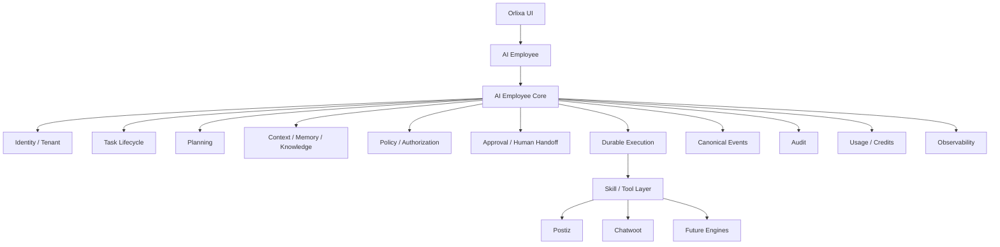
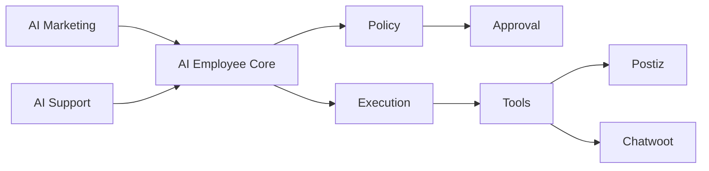

# Orlixa — AI Marketing + AI Customer Support
## Deep Gap Audit & Shared AI Employee Core Architecture

**Mode:** `/deep /cto /product /SaaS /enterprise /kill-critic`  
**Purpose:** Planning-first architecture and gap analysis for AI Marketing (Postiz) and AI Customer Support (Chatwoot).  
**Execution rule:** **DO NOT IMPLEMENT ANYTHING IN THIS RUN.**

---

# 1. Mission

Orlixa currently has two important AI Employees:

1. **AI Marketing Employee** — backed by Postiz
2. **AI Customer Support Employee** — backed by Chatwoot

The objective is to determine:

- What is actually implemented?
- What is actually working?
- What is partially implemented?
- What is mocked/stubbed?
- What is documented but not implemented?
- What is implemented but not production-safe?
- What is implemented but not enterprise-grade?
- What functionality is missing?
- What functionality is duplicated?
- Which gaps are Marketing-specific?
- Which gaps are Support-specific?
- Which gaps are common to all AI Employees?
- Which capabilities should become a shared **AI Employee Core Module**?
- Which capabilities must remain engine-specific?
- What must be fixed before production?
- What should be deferred?
- What architecture can support future AI Employees without duplication?

The first deliverable is a **complete current-state audit + architecture plan**.

No implementation should begin until the plan is complete and explicitly approved.

---

# 2. Source-of-Truth Rules

Use:

1. **Repository implementation** as the implementation source of truth.
2. **Existing project documentation** as architectural/product intent.
3. **Tests and runtime verification** as evidence of actual behavior.

If documentation says a feature is complete but code does not support it:

> `DOCUMENTED BUT NOT VERIFIED / IMPLEMENTED`

If code exists but tests do not prove it:

> `IMPLEMENTED BUT NOT VERIFIED`

If tests use mocks where production behavior differs:

> `MOCK-VERIFIED ONLY`

Never classify these as production-ready without evidence.

Do not silently reconcile contradictory documents. Explicitly report the contradiction and identify which source is stronger.

---

# 3. Mandatory Documents to Inspect

Before analysis, inspect all relevant project documentation, especially:

- `2026-07-20-engine-integration-master-plan.md`
- `2026-07-20-chatwoot-support-engine-plan.md`
- `marketing-production-verification.md`
- `e2e-readiness-report.md`
- `2026-07-27-complete-progress-documentation.md`
- `orlixa-cto-architecture-hardening-engine-freeze-plan.md`
- `orlixa-cto-master-gap-closure-plan.md`
- `implementation-gap-audit.md`
- `backend-implementation-plan.md`
- Workflow/security/approval architecture documents
- Postiz engine documents
- Chatwoot engine documents
- AI Employee / Skill / Connector plans

Also search the repository for actual implementation.

---

# 4. Repository Areas to Audit

Inspect at minimum:

## Backend

`apps/api/src/modules/`

Especially:

- employees
- skills
- connectors
- workflows
- approvals
- knowledge
- events
- audit
- usage
- billing
- analytics
- tenant
- auth
- engines
- resilience
- queues
- notifications

## Frontend

`apps/web/`

Especially:

- AI Employee UI
- chat
- employee pages
- workflow UI
- approvals
- integrations
- analytics
- billing
- settings
- support UI
- marketing UI

## Platform

Inspect:

- Prisma schema
- migrations
- shared types
- Skill catalog
- `RealSkillExecutor`
- `ToolExecutorService`
- AI runtime
- LLM provider abstraction
- queue processors
- webhook controllers
- health probes
- audit services
- approval services
- rate limiting
- retry/resilience mechanisms

---

# 5. AI Marketing Audit

Trace the complete lifecycle:

```text
Company
   ↓
AI Marketing Employee
   ↓
Knowledge
   ↓
Memory / Context
   ↓
User Request / Workflow Trigger
   ↓
AI Reasoning
   ↓
Skill Selection
   ↓
Tool Execution
   ↓
Approval
   ↓
Postiz
   ↓
Social Platform
   ↓
External Status
   ↓
Reconciliation
   ↓
Analytics
   ↓
Audit
```

Audit:

- campaign planning, objectives, audience, channels, content strategy, lifecycle
- content generation, editing, revision, approval, versioning, regeneration
- brand voice, brand knowledge, assets, templates
- social OAuth/account connection, discovery, scheduling, immediate publish
- status, retries, failures, duplicate prevention, rate limits, provider errors, reconciliation
- email recipient validation, consent, suppression, unsubscribe, bounce, volume, approval, delivery, retries, compliance
- SEO content, keywords, metadata, optimization, publishing
- lead capture, enrichment, qualification, routing, follow-up, consent
- campaign/social metrics, engagement, conversion, attribution, ROI, trends, recommendations
- autonomy boundaries and approval bypass risks
- idempotency, retries, reconciliation, queue failure, worker crash, provider outage, partial completion
- tenant isolation, RBAC, team permissions, approval routing, audit, retention, observability, rate limiting, data access

---

# 6. AI Customer Support / Chatwoot Audit

Trace:

```text
Customer
   ↓
Chatwoot
   ↓
Webhook
   ↓
Signature Verification
   ↓
Canonical Event
   ↓
Orlixa
   ↓
AI Customer Support Employee
   ↓
Knowledge / Memory
   ↓
AI Reasoning
   ↓
Policy / Permission
   ↓
Response
   ↓
Approval if required
   ↓
Chatwoot
   ↓
Customer
```

Audit:

- conversation discovery/retrieval/message retrieval/customer identity/history/context/memory
- AI draft/answer/knowledge retrieval/confidence/grounding/validation/tone/policy
- reply, assign, tag, prioritize, close, reopen, escalate, internal note, customer update
- human takeover, approval, SLA, assignment, department routing, fallback
- ticket status, priority, SLA, escalation, queues, agents, teams, working hours, holidays
- PII, refunds/payment requests, angry customers, legal threats, security incidents, account deletion, identity verification, unsupported requests
- webhook verification/deduplication, retries, duplicate messages, outages, delayed/out-of-order events, failed reply, idempotency
- tenant/account isolation, team routing, permissions, audit, retention, observability, SLA, compliance

---

# 7. Master Gap Matrix

Create:

| ID | AI Employee | Area | Functionality | Current State | Evidence | Gap | Severity | Production Risk | Enterprise Risk | Recommended Approach | Shared Core? | Engine-Specific? | Priority | Dependency |
|---|---|---|---|---|---|---|---|---|---|---|---|---|---|---|

Allowed states:

`DONE`, `PARTIAL`, `IMPLEMENTED_UNVERIFIED`, `MOCK_ONLY`, `DOCUMENTED_NOT_IMPLEMENTED`, `MISSING`, `UNSAFE`, `DUPLICATED`, `DEPRECATED`.

Never write vague "needs improvement". State the exact missing behavior.

---

# 8. Separate Gap Tables

Create four tables:

## A — Marketing-only gaps

Postiz publishing, social lifecycle, campaign analytics, email suppression, campaign optimization, and other verified Marketing-specific gaps.

## B — Support-only gaps

Conversation lifecycle, assignment, SLA, escalation, ticket operations, Chatwoot-specific actions, and other Support-specific gaps.

## C — Common AI Employee gaps

Investigate:

- execution lifecycle
- task state machine
- planning
- reasoning
- tool authorization
- approvals
- human handoff
- retry
- idempotency
- execution history
- memory
- knowledge retrieval
- context management
- action policy
- confidence
- escalation
- audit
- usage/cost
- credits
- rate limits
- observability
- notifications
- scheduling
- working hours
- permissions
- tenant isolation
- team routing
- event processing
- durable execution
- failure recovery

## D — Future AI Employee Reusability

Evaluate reuse for Marketing, Support, HR, Sales, Recruiter, Accountant, Project Manager, Operations, Finance, and future employees.

---

# 9. Duplication Analysis

For every duplicated capability between Marketing and Support answer:

1. Why does it exist?
2. Is duplication intentional?
3. Can it move into shared core?
4. Risk of keeping it duplicated?
5. What remains engine-specific?

Do not force provider-specific logic into core.

Example:

```text
Marketing → Postiz error handling
Support   → Chatwoot error handling
```

should remain provider-specific where appropriate.

But:

```text
Provider error
   ↓
Normalized execution failure
   ↓
Retry policy
   ↓
Audit
   ↓
Notification
```

may belong in shared core.

---

# 10. Shared AI Employee Core

Design:

```text
AI Employee
     ↓
SHARED AI EMPLOYEE CORE
     ↓
ENGINE / SKILLS / TOOLS
```

Target:

```text
AI Marketing → Shared Core → Postiz
AI Support   → Shared Core → Chatwoot
AI HR        → Shared Core → HR tools
AI Sales     → Shared Core → CRM
AI Recruiter → Shared Core → ATS
Future       → Shared Core → Domain engines
```

---

# 11. Shared Core Responsibilities

For every capability classify:

`CORE`, `ENGINE`, `SHARED INFRASTRUCTURE`, `PRODUCT MODULE`, or `OPTIONAL EXTENSION`.

Evaluate:

### Identity
Employee identity, company, department, team, user.

### Task
Creation, state, lifecycle, priority, deadline.

### Execution
Creation, state, step state, retry, cancellation, timeout, recovery.

### Planning
AI planning, task decomposition, plan validation.

### Context
Knowledge, memory, conversation, previous actions, current task.

### Tool Access
Skill discovery, tool selection, authorization, employee/company permissions.

### Policy
Action risk, policy checks, prohibited actions, approval requirement.

### Approval
Create, route, wait, approve, reject, edit, revalidate, resume.

### Human Handoff
Escalate, assign human, pause AI, resume AI.

### Reliability
Idempotency, retry, deduplication, timeout, circuit breaker, DLQ, reconciliation.

### Events
Inbound event, normalization, deduplication, routing, trigger.

### Observability
Logs, traces, metrics, correlation IDs, execution timeline.

### Audit
Who, what, when, why, resource, before/after.

### Usage
Tokens, provider cost, credits, employee budget, company budget.

### Communication
Notifications, completion, approval request, failure alert, escalation.

### Scheduling
Working hours, timezone, business hours, scheduled execution.

### Security
Tenant isolation, RBAC, policy enforcement, secret handling.

Do not place everything into core. Explain the boundary.

---

# 12. Core Boundary Diagram

Create and explain:



Explain every component, ownership, inputs, outputs, dependencies, and boundaries.

---

# 13. Marketing + Support Shared Flow



Create detailed sequence diagrams for:

1. Marketing publish
2. Support reply
3. Marketing approval
4. Support escalation
5. Marketing failure/retry
6. Support webhook
7. Human handoff
8. Common audit flow

---

# 14. Common Execution State Machine

Design one state machine for both employees.

Evaluate states such as:

```text
CREATED
PLANNING
READY
RUNNING
WAITING_APPROVAL
APPROVED
EXECUTING
SUCCEEDED
FAILED
CANCELLED
TIMED_OUT
RETRYING
WAITING_HUMAN
BLOCKED_POLICY
BLOCKED_PERMISSION
```

For every state explain:

- meaning
- valid transitions
- who triggers it
- retry behavior
- terminal behavior
- recovery
- audit event

---

# 15. Common Action Risk Model

Evaluate:

- READ
- LOW_RISK
- WRITE
- EXTERNAL_COMMUNICATION
- PUBLICATION
- FINANCIAL
- DESTRUCTIVE
- SECURITY_SENSITIVE

Map actual Marketing and Support actions to the model. Do not assume final classifications.

---

# 16. Approval Model

Design:

```text
AI Action
   ↓
Risk Policy
   ↓
Approval Required?
   ↓
YES
   ↓
ApprovalRequest
   ↓
User / Team / Department
   ↓
WAIT
   ↓
Approve / Reject / Edit
   ↓
Revalidate
   ↓
Execute
```

Cover Marketing publish/email and Support sensitive reply/refund/account actions.

Do not create separate approval engines.

---

# 17. Human Handoff

Design:

```text
AI
 ↓
Confidence / Policy
 ↓
Escalation Condition
 ↓
Human Handoff
 ↓
Assigned Person / Team
 ↓
WAIT
 ↓
Human Resolution
 ↓
AI Resume OR Complete
```

Determine shared vs employee-specific responsibilities.

---

# 18. Knowledge + Memory

Evaluate whether both employees can use a common retrieval/memory pipeline while preserving:

- tenant isolation
- employee isolation
- role scoping
- customer-specific context
- data access rules

Explain what must never cross boundaries.

---

# 19. Observability

Design a common timeline:

```text
Task Created
 ↓
Plan Created
 ↓
Knowledge Retrieved
 ↓
Tool Selected
 ↓
Policy Checked
 ↓
Approval Created
 ↓
Approval Granted
 ↓
Tool Executed
 ↓
External Provider
 ↓
Result Received
 ↓
Task Completed
```

Define logs, metrics, traces, correlation IDs, execution IDs, provider IDs, and audit events.

---

# 20. Failure Matrix

Create:

| Scenario | Marketing | Support | Shared Core Handling | Engine Handling | Retry | User Impact | Severity |
|---|---|---|---|---|---|---|---|

At minimum cover:

- provider unavailable
- timeout
- auth expired
- permission denied
- rate limit
- duplicate event
- duplicate execution
- webhook replay
- worker crash
- DB failure
- AI model failure
- tool failure
- approval timeout
- human rejection
- policy block
- insufficient permission
- tenant mismatch
- invalid input
- malformed provider response
- partial completion

---

# 21. Enterprise Requirements

Evaluate both against:

- multi-tenancy
- department/team scope
- RBAC
- per-employee permissions
- approval routing
- audit
- compliance
- retention
- data isolation
- SLA
- escalation
- observability
- disaster recovery
- rate limiting
- usage limits
- credit limits
- secret management
- provider isolation

Use:

`DONE`, `PARTIAL`, `MISSING`, `RISK`.

---

# 22. E2E Coverage

## Marketing

| Journey | Backend | DB | Queue | Browser | Real Provider | Status |
|---|---|---|---|---|---|---|

## Support

| Journey | Backend | DB | Queue | Browser | Real Provider | Status |
|---|---|---|---|---|---|---|

## Shared Core

| Core Journey | Unit | Integration | E2E | Browser | Status |
|---|---|---|---|---|---|

Never call browser E2E passed unless actually executed.

---

# 23. Core Functionality Matrix

Mandatory:

| Core Functionality | Marketing Use | Support Use | Future Employee Use | Existing Implementation | Gap | Proposed Module | Priority |
|---|---|---|---|---|---|---|---|

---

# 24. Do Not Over-Engineer

Classify work as:

### BUILD NOW
Production safety or required shared reuse.

### BUILD NEXT
Important product/enterprise maturity.

### FUTURE
Useful but not required now.

Avoid:

- giant abstract base classes
- provider-specific logic in core
- duplicated orchestration engines
- second workflow engine
- second approval engine
- second event system
- second audit system

The core must remain:

- small
- stable
- composable
- provider-independent
- reusable
- testable

---

# 25. Target Architecture

Validate:

```text
              ORLIXA AI EMPLOYEE PLATFORM
                         │
                ┌────────┴────────┐
                │                 │
         AI Marketing       AI Support
                │                 │
                └────────┬────────┘
                         ↓
                AI EMPLOYEE CORE
                         │
       ┌─────────────────┼─────────────────┐
       │                 │                 │
    Identity          Execution         Policy
    Context           Approval           Audit
    Memory            Handoff            Usage
    Events            Reliability        Observability
       │                 │                 │
       └─────────────────┼─────────────────┘
                         ↓
                  SKILL / TOOL LAYER
                         │
            ┌────────────┼────────────┐
            ↓            ↓            ↓
         Postiz       Chatwoot      Future
```

If inappropriate, propose a better architecture.

---

# 26. Kill-Critic Review

Attack the shared-core proposal.

Evaluate:

1. Monolith risk
2. Forced common lifecycle
3. Provider leakage
4. Workflow duplication
5. Approval duplication
6. Audit duplication
7. Event duplication
8. Future Sales reuse
9. HR reuse
10. Recruiter reuse
11. Long-running tasks
12. Multi-day pauses
13. Human intervention
14. External-event resume
15. Safe retry
16. Worker-crash recovery
17. Millions of executions
18. Tenant isolation
19. Team permissions
20. Credit attribution
21. Cost reconciliation
22. Provider replacement
23. Multiple providers
24. Multiple providers per employee
25. Sync chat + async workflows

For each issue classify:

- FIX
- ACCEPT TRADEOFF
- DEFER

Never hide weaknesses.

---

# 27. Final Gap Scorecard

Provide:

## AI Marketing
- Core completeness
- Production readiness
- Enterprise readiness
- Product maturity

## AI Support
- Core completeness
- Production readiness
- Enterprise readiness
- Product maturity

## Shared AI Employee Core
- Existing coverage
- Missing
- Required before scaling

Percentages must use explicit criteria and show the calculation methodology.

---

# 28. Final Priority Table

Produce:

| Priority | Gap | Employee | Shared Core? | Why | Recommended Fix | Dependency | Effort | Risk if Deferred |
|---|---|---|---|---|---|---|---|---|

Priority definitions:

- P0 = blocks production / serious security / data integrity
- P1 = production-critical
- P2 = enterprise/scalability/important product
- P3 = enhancement
- P4 = future

---

# 29. Planning-Only Implementation Roadmap

## Phase 0
Shared Core Architecture Hardening

## Phase 1
Marketing P0/P1 Gaps

## Phase 2
Support P0/P1 Gaps

## Phase 3
Shared AI Employee Core

## Phase 4
Marketing Migration

## Phase 5
Support Migration

## Phase 6
Enterprise Hardening

## Phase 7
E2E / Browser / Chaos / Recovery

For every phase provide:

- exact files
- modules
- database changes
- API changes
- frontend changes
- queues
- tests
- migration
- rollback
- acceptance criteria

DO NOT IMPLEMENT.

---

# 30. File-Level Change Map

Produce:

| File | CREATE/MODIFY | Reason | Employee | Shared Core? | Phase |
|---|---|---|---|---|---|

Do not invent paths. Inspect repository first.

---

# 31. Documentation Output

Create:

`docs/architecture/ai-marketing-support-core-gap-analysis.md`

The document must contain:

1. Executive Summary
2. Current Architecture
3. Marketing Audit
4. Support Audit
5. Marketing Gap Matrix
6. Support Gap Matrix
7. Shared Gap Matrix
8. Duplication Analysis
9. Shared Core Proposal
10. Core Architecture Diagram
11. Marketing Flow
12. Support Flow
13. Common Execution State Machine
14. Approval Architecture
15. Human Handoff Architecture
16. Knowledge / Memory Architecture
17. Event Architecture
18. Reliability Architecture
19. Usage / Credits
20. Enterprise Requirements
21. Failure Matrix
22. E2E Matrix
23. Core Functionality Matrix
24. Kill-Critic Review
25. Final Scorecard
26. Priority Roadmap
27. File-Level Change Map
28. Acceptance Criteria
29. Founder / CTO Decisions Required

---

# 32. Absolute Implementation Rule

DO NOT IMPLEMENT ANYTHING IN THIS RUN.

Do not:

- modify Prisma
- create migrations
- modify API
- modify frontend
- modify Chatwoot
- modify Postiz
- modify workflows
- modify approval logic
- modify AI runtime

This run is architecture and gap analysis only.

---

# 33. Final CTO Decision

At the end answer clearly:

1. What is actually complete in AI Marketing?
2. What is actually complete in AI Support?
3. What is missing from Marketing?
4. What is missing from Support?
5. What is common between them?
6. What MUST become shared core?
7. What MUST remain engine-specific?
8. What should be fixed first?
9. What should NOT be built?
10. Can the same core support future AI Employees?
11. What is the minimum architecture required before adding more AI Employees?
12. What are the top 10 production risks?
13. What are the top 10 enterprise risks?
14. What are the top 10 product gaps?

---

# 34. Core Architectural Principle

Do NOT optimize for "more features".

Optimize for:

- CORRECTNESS
- REUSABILITY
- TENANT SAFETY
- DURABLE EXECUTION
- HUMAN CONTROL
- OBSERVABILITY
- COST CONTROL
- ENTERPRISE SCALE
- FUTURE AI EMPLOYEE REUSE

The correct sequence is:

```text
AUDIT
  ↓
VERIFY
  ↓
COMPARE
  ↓
IDENTIFY GAPS
  ↓
SEPARATE COMMON vs ENGINE-SPECIFIC
  ↓
DESIGN SHARED CORE
  ↓
KILL-CRITIC
  ↓
PRIORITIZE
  ↓
CREATE IMPLEMENTATION ROADMAP
  ↓
STOP
  ↓
WAIT FOR EXPLICIT APPROVAL
```

**No coding in this phase.**
