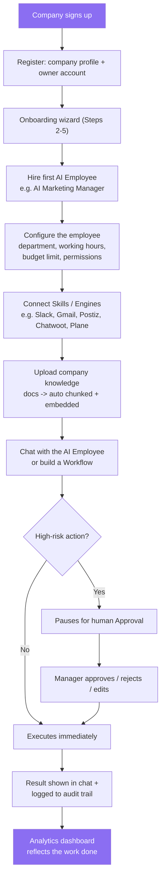
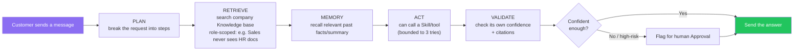
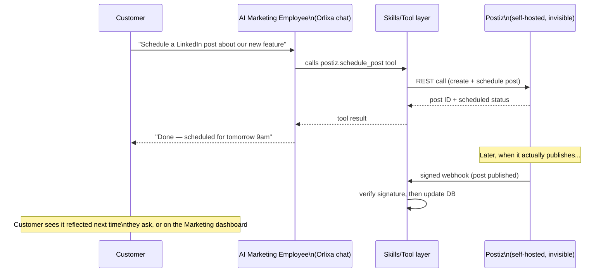
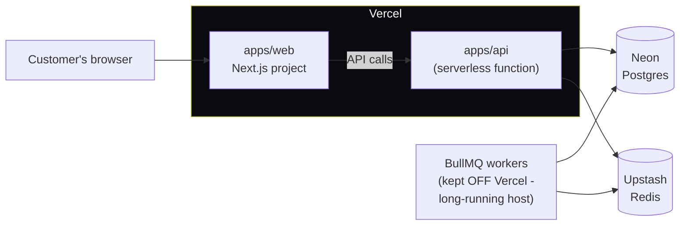

# Orlixa (V-AEP) — Complete Progress Documentation

**As of:** 2026-07-27. This is a full, ground-truth snapshot of what exists in the codebase right
now — backend, frontend, database, deployment, and what's coming next. Written in plain language on
purpose, so it's useful to read even without deep familiarity with every module.

---

## 1. What this product is

**Orlixa** (originally named V-AEP — Vertical AI Employee Platform) is a SaaS product where a
company "hires" managed **AI Employees** — Support, Sales, Recruiter, HR, Marketing, and more —
instead of chatbots. Each AI Employee has its own memory, role, permissions, connected tools
("Skills"), and can run multi-step workflows. The product is positioned as "AI that actually
completes business work," not a chat widget.

---

## 2. Business flow (how it all fits together, visually)

### 2.1 Customer journey — signup to value

This is the path every new company actually walks through today, end to end (real, built flow —
not aspirational):

### 2.2 How one AI Employee actually answers a request

This is the real runtime loop every single chat message goes through
(`AgentRuntimeService`) — not a simplification, this is the actual code path:

### 2.3 How an AI Employee uses an invisible engine (example: Marketing)

This is the pattern behind every AI Workforce Engine (Section 5) — the customer only ever sees
the AI Employee; the real product underneath (Postiz, Chatwoot, Plane, etc.) is never shown:

**The customer never sees Postiz, Chatwoot, or Plane's own login, dashboard, or branding at any
point in this flow.** That invisibility is the entire point of the AI Workforce Engine design.

---

## 3. Tech stack

| Layer | Technology |
|---|---|
| Monorepo | pnpm + Turborepo |
| Frontend | `apps/web` — Next.js (App Router), Tailwind, TanStack Query, Zustand, react-hook-form + zod |
| Backend | `apps/api` — NestJS, Prisma, PostgreSQL (+ pgvector for AI search) |
| Shared types | `packages/types` (`@vaep/types`) — one shared contract both apps import |
| Queues/jobs | BullMQ + Redis |
| Local infra | Docker Compose — Postgres+pgvector, Redis, MinIO, Adminer |
| **Production hosting** | **Vercel** (both web and API, as two separate Vercel projects), **Neon** (managed Postgres), **Upstash** (managed Redis) |

---

## 4. Backend — the core platform (15 modules, all shipped)

Everything below is real, working code with test coverage — not a plan. One module = one folder
under `apps/api/src/modules/`.

| Module | What it actually does |
|---|---|
| **auth** | Register/login/refresh/logout, JWT (access + refresh), multi-tenant `Company`/`User`. Recently got step-by-step logging so a production auth failure can be pinpointed to the exact step. |
| **tenant** | The tenant-scoping mechanism every other module relies on — pulls `companyId` off the logged-in user, threaded manually through every query (no automatic row-level security; it's a discipline, not a database feature). |
| **knowledge** | Upload a document → background job extracts/chunks/embeds it → real vector search (pgvector, 384-dim, HNSW index) scoped per company and per AI-Employee role (an HR document doesn't leak into a Sales employee's answers). |
| **employees** | The AI Employee "brain." Each employee has a role, persona, memory, and its own conversations. The runtime loop is: plan → retrieve knowledge → recall memory → act (can call tools, bounded to 3 tries) → validate (checks its own confidence and flags for approval if unsure). See the diagram in Section 2.2. The actual LLM behind this is swappable (mock for tests, OpenAI/Anthropic for real). |
| **skills** | The tool catalog — currently **14 skills**: Slack, Email, Stripe, GitHub, HTTP, Gmail, HubSpot, Jira, Calendar, Google Drive, an internal Scheduling tool, plus the three new AI Workforce Engines (Postiz, Chatwoot, Plane — see Section 5). Every tool call is logged for audit. Skills can be connected company-wide or privately to one employee. |
| **workflows** | The automation engine — build a graph of steps (trigger → retrieve knowledge → AI step → call a tool → wait → branch on a condition → notify), and it actually runs, with a full per-step audit trail. Can also be drafted by AI from a plain-English description. |
| **onboarding** | The multi-step wizard a new company goes through: company profile, hiring the first AI Employees, configuring their working hours/budget/permissions. |
| **approvals** | The safety gate — before a high-risk tool call (e.g. moving money) actually runs, it pauses and waits for a human manager to approve, reject, or edit it first. See the diagram in Section 2.1. |
| **organization** | Departments, teams, and company-wide security policy settings (password rules, MFA requirement, allowed email domains) — the settings exist and are stored; enforcement of some of them is still a known gap (see Section 11). |
| **analytics** | Company-wide and per-employee KPI dashboards. |
| **billing** | Subscription plans and usage tracking, with a real Stripe integration available (mock is still the default for tests). |
| **marketplace** | Install ready-made AI Employee or Workflow templates instead of building from scratch. |
| **events** | Receives real external events (e.g. an inbound Gmail email, a GitHub webhook) and turns them into workflow triggers — this is what lets a workflow react to something happening outside Orlixa, not just run on a schedule. |
| **usage** | Tracks LLM token usage per company/employee for billing and budget limits. |
| **admin** / **audit** / **health** | Internal ops tooling: a dead-letter-queue viewer for failed background jobs, a full audit log of who did what, and a bare liveness check (`GET /health`) added specifically so a crashed deployment is easy to tell apart from a broken feature. |

---

## 5. Backend — the AI Workforce Engines (new, this cycle)

This is the newest and most ambitious piece of work: instead of building every capability from
scratch, Orlixa **wraps proven open-source products as invisible engines behind an AI Employee** —
the customer only ever talks to the AI Employee in Orlixa's own chat interface; they never see or
know the underlying engine exists. See the sequence diagram in Section 2.3 for exactly how this
works end to end.

**Ten engines were researched in depth** (self-hosted Postiz, Chatwoot, Plane, n8n, Metabase,
Meilisearch, Novu, Listmonk, MinIO, Keycloak — full findings in `docs/architecture/engines/`), and
**three are fully built and working today**:

| Engine (behind the scenes) | AI Employee | Status |
|---|---|---|
| **Postiz** (social media scheduling) | AI Marketing Manager | ✅ Done — can list connected accounts, schedule/publish posts, check post status. Real reconciliation with Postiz's actual publish status (not just a stub). |
| **Chatwoot** (customer support inbox) | AI Customer Support Employee | ✅ Done — can list/read support conversations and reply to a customer, with a properly signature-verified webhook so only genuine Chatwoot events can update anything. |
| **Plane** (project management) | AI Project Manager | ✅ Done — can list/create issues and update their status, same signature-verified-webhook pattern. |

Each of these three followed the exact same build pattern: its own database tables, a small REST
client talking to the real self-hosted engine, one new entry in the Skills catalog, wiring into the
AI Employee's tool-calling loop, and a signature-verified webhook so the engine can push updates
back safely. Every single piece was built with tests first, then independently reviewed — and real
bugs were caught and fixed along the way (not just written and assumed correct):

- **Postiz**: found and fixed an unauthenticated webhook endpoint that could have let anyone tamper
  with another company's post status; also found and completed a piece that had been left as a stub
  (checking whether a post actually published).
- **Chatwoot**: found that the webhook signature scheme first built didn't match Chatwoot's *real*
  signing method (it would have rejected every genuine webhook) — fixed and verified against
  Chatwoot's actual source code.
- **Plane**: same signature-verification discipline, with its own correctly different signing scheme
  (Plane and Chatwoot don't sign webhooks the same way — verified separately for each, not assumed).

**The remaining seven engines** (n8n → Workflow automation, Metabase → Analytics Q&A, Meilisearch →
Search, Novu → Notifications, Listmonk → Email marketing, MinIO/a replacement → Storage, Keycloak →
Enterprise SSO) are researched and documented but **not yet built** — see Section 10.

One important finding from the research: **MinIO's own open-source project is now archived and
unmaintained** — so the Storage Engine will use a different, actively-maintained option (SeaweedFS
or Garage) instead of MinIO, once that phase starts.

---

## 6. Frontend — pages and features

Every backend module above has a matching frontend feature (`apps/web/src/features/*`) and page
(`apps/web/src/app/(app)/*`) — this "mirror" pattern is a deliberate convention in this codebase.

**Authenticated app** (`(app)` route group): Dashboard, Employees (list + per-employee chat with
visible sources/plan/tool-calls), Skills (catalog + install + connect), Workflows (list + step
builder + run history), Knowledge (upload + search), Approvals (queue with live badges),
Analytics, Billing, Organization (departments/teams/security policy), Team (user management),
Marketplace, Scheduling (interview slot booking), Admin (health/dead-letter-queue).

**Public/auth pages** (`(auth)` route group): Login, Register, Forgot/Reset Password, Two-Factor,
Verify Email/OTP, Account Locked.

**Just redesigned:** the Login page now uses a **split-screen layout** — a looping background video
fills the left 60% of the screen, and the sign-in form sits in a dedicated dark panel on the right
40% (previously the video was a dimmed full-screen background behind a centered floating card). On
smaller screens the video panel hides entirely and the form goes full-width, so mobile stays clean.
This only changed the Login page — every other auth page still uses the original centered-card
layout, untouched.

**Marketing/public site**: a separate `marketing-dark` component set powers the public-facing
homepage and marketing pages (dark violet theme, the "Orlixa" rebrand) — distinct from the
authenticated app's UI.

---

## 7. Database — 38 models

The full schema lives in one file: `apps/api/prisma/schema.prisma`. Grouped by area:

- **Core tenancy**: `Company`, `User`, `AuditLog`, `UsageEvent`
- **Knowledge/RAG**: `KnowledgeDocument`, `KnowledgeChunk`
- **AI Employees**: `AiEmployee`, `Conversation`, `Message`, `EmployeeMemory`, `EmployeeFeedback`
- **Skills**: `InstalledSkill`, `EmployeeSkill`, `SkillExecution`
- **Workflows**: `Workflow`, `WorkflowRun`, `WorkflowStepRun`
- **Approvals**: `ApprovalRequest`
- **Billing**: `Subscription`
- **Organization**: `Department`, `Team`, `SecurityPolicy`
- **Events**: `RawEvent`, `CanonicalEvent`
- **Scheduling**: `InterviewSlot`
- **Marketing Engine (Postiz)**: `SocialAccount`, `Campaign`, `ScheduledPost`, `PublishedPost`, `MediaAsset`, `BrandAsset`, `MarketingAnalyticsSnapshot`
- **Support Engine (Chatwoot)**: `ChatwootAccount`, `SupportConversation`, `SupportMessage`
- **PM Engine (Plane)**: `PlaneWorkspace`, `PlaneProject`, `TrackedIssue`

Every tenant-scoped table carries a plain `companyId` column — there's no automatic database-level
tenant isolation; every query is manually filtered by `companyId` in application code. This is a
deliberate, consistent convention, checked carefully in every code review.

---

## 8. Deployment — real production infrastructure (not just planned)

This is genuinely live, not a plan on paper. The path to get here (and the real bugs hit and fixed
along the way) is worth documenting honestly:

- **Web** and **API** are two separate Vercel projects (Root Directory = `apps/web` / `apps/api`
  respectively), each with its own `vercel.json`.
- **Database**: Neon (managed Postgres), connected via Vercel's marketplace integration.
- **Redis**: Upstash, same way — auto-injects the right connection string.
- **Background jobs**: BullMQ workers are deliberately kept **off** Vercel (serverless functions
  are too short-lived to run persistent queue consumers safely) — a `QUEUE_WORKERS_ENABLED` flag
  turns them off specifically on the Vercel API deployment while leaving every other environment
  unchanged.
- **API on Vercel runs as a serverless function** via a new `apps/api/api/index.ts` entry point,
  sharing the exact same app setup (`bootstrap.ts`) as the normal long-running server, so the two
  can't silently drift apart.

**Real bugs hit and fixed while getting this live** (documented here because they're the kind of
thing that will bite again if forgotten):
1. Vercel's build never ran `prisma generate` on a fresh checkout — fixed with a `postinstall` hook.
2. TypeScript errors appeared one file at a time across several deploys, because Vercel's own
   serverless-function build step runs a *second*, different type-check pass over the whole API's
   import graph — traced to `fetch()`'s `Response` type resolving differently across environments,
   fixed once at a shared wrapper used by every `fetch()` call site instead of patching each file.
3. Deploy succeeded but every request crashed — Prisma's query-engine binary wasn't built for
   Vercel's actual Lambda runtime; fixed by adding the correct `binaryTargets`.
4. Redis silently connected without TLS even though Upstash requires it — a URL-parsing helper was
   dropping the `rediss://` scheme when reconstructing the connection config; fixed at the shared
   connection helper, plus a duplicate copy of the same parsing logic elsewhere was consolidated so
   it can't drift out of sync again.
5. Discovered mid-deploy that pushes were landing on Vercel as throwaway "Preview" deployments
   (random URL, different every time) because the real git branch in use (`deployment`) wasn't set
   as Vercel's "Production Branch" — fixed by changing that setting.

**Still deferred, flagged not forgotten**: Prisma connection pooling for serverless (many
short-lived functions hitting Postgres directly has real limits — normally solved with PgBouncer or
Prisma Accelerate), and `argon2` (password hashing) hasn't been explicitly deploy-tested on Vercel's
Linux build infra yet even though it's expected to work.

**CI** is now split into two independent GitHub Actions workflows (`api-ci.yml`/`web-ci.yml`),
each triggered only by changes relevant to it, so an API-only change no longer waits on or blocks
Web's test results and vice versa. Local dev also got matching `pnpm dev:api`/`dev:web`/`build:api`/
`build:web` scripts so either app can be run or built completely on its own.

---

## 9. Testing

- **Backend**: roughly 30+ end-to-end test suites and 20+ unit test suites (these numbers grow with
  every module — check `apps/api/test/` and `apps/api/src/**/*.spec.ts` for the exact current count
  rather than trusting a fixed number here, since it changes every time a module is added).
- **Frontend**: a smaller, growing set of component/hook tests (`apps/web/src/**/*.test.ts*`).
- A handful of e2e tests are known to fail in the local dev environment for reasons **unrelated to
  any actual bug** — confirmed by re-running them against a completely unmodified baseline and
  getting the identical failures (a local `.env` with real OAuth credentials configured, and the
  offline mock LLM occasionally not picking the expected tool for a given test's exact wording).
  These are documented, not silently ignored.
- **Important environment gotcha for anyone running e2e tests that involve an AI Employee chatting**:
  this dev environment's `.env` defaults to a **real** OpenAI key (`LLM_PROVIDER=openai`) for other
  live-testing purposes, not the deterministic mock. Any test exercising the chat/tool-calling loop
  must explicitly pass `LLM_PROVIDER=mock` on the command line, or it becomes non-deterministic and
  can fail intermittently for reasons that have nothing to do with the code being tested.

---

## 10. What's next

1. **Finish the remaining 7 AI Workforce Engines** — n8n, Metabase, Meilisearch, Novu, Listmonk,
   Storage (SeaweedFS/Garage, not MinIO), Keycloak. Each follows the same proven build pattern as
   Postiz/Chatwoot/Plane. Detailed plans exist for the framework; each engine still needs its own
   task-by-task plan written before building.
2. **Enterprise-readiness gaps**, already identified and planned but not yet built:
   - Company roles are currently company-wide only (Owner/Admin/Member) — no way yet to scope an
     admin to just one department. A big customer with many departments will want this.
   - Approval requests can't yet be routed to a specific named person or team — only to "anyone with
     the right role."
   - The security policy settings (password rules, MFA requirement, allowed email domains) are
     stored but not all of them are actually enforced yet.
3. **Visual (node-based) workflow builder** — designed and planned today (2026-07-27,
   `docs/superpowers/specs/2026-07-27-visual-workflow-builder-design.md`), **not yet built**. Goal:
   replace the current linear, list-based workflow step editor with a drag-and-drop visual canvas
   (n8n/Zapier-style), so branching logic is visible at a glance. Confirmed to be almost entirely a
   frontend change — the workflow definition is already stored as flexible JSON, so this needs zero
   database migration, just one new optional field for node position.

---

## 11. Known gaps (deferred on purpose, not forgotten)

Token/voice usage metering, SSO (until the Keycloak engine is built), semantic/embedding-based
memory recall for AI Employees (today's memory recall is recency-only), analytics trend charts,
a public marketplace with commission for third-party publishers, company logo upload, email
invites for team members, enforcement of MFA/session-timeout/data-retention security policy
fields, and real per-provider event-ingestion drivers beyond Gmail (Microsoft Graph, Salesforce).

None of these block the product from working today — they're intentionally sequenced for later.
